# Objectives

After studying this Unit, you will be able to

- · describe the formation of different types of solutions;
- · express concentration of solution in different units;
- · state and explain Henry's law and Raoult's law;
- · distinguish between ideal and non-ideal solutions;
- · explain deviations of real solutions from Raoult's law;
- · describe colligative properties of solutions and correlate these with molar masses of the solutes;
- · explain abnormal colligative properties exhibited by some solutes in solutions.

*Almost all processes in body occur in some kind of liquid solutions.*

In normal life we rarely come across pure substances. Most of these are mixtures containing two or more pure substances. Their utility or importance in life depends on their composition. For example, the properties of brass (mixture of copper and zinc) are quite different from those of German silver (mixture of copper, zinc and nickel) or bronze (mixture of copper and tin); 1 part per million (ppm) of fluoride ions in water prevents tooth decay, while 1.5 ppm causes the tooth to become mottled and high concentrations of fluoride ions can be poisonous (for example, sodium fluoride is used in rat poison); intravenous injections are always dissolved in water containing salts at particular ionic concentrations that match with blood plasma concentrations and so on.

In this Unit, we will consider mostly liquid solutions and their formation. This will be followed by studying the properties of the solutions, like vapour pressure and colligative properties. We will begin with types of solutions and then various alternatives in which concentrations of a solute can be expressed in liquid solution.

# 1.1 Types ofTypes of Types of Solutions SolutionsSolutions

Solutions are homogeneous mixtures of two or more than two components. By homogenous mixture we mean that its composition and properties are uniform throughout the mixture. Generally, the component that is present in the largest quantity is known as solvent. Solvent determines the physical state in which solution exists. One or more components present in the solution other than solvent are called solutes. In this Unit we shall consider only binary solutions (i.e., consisting of two components). Here each component may be solid, liquid or in gaseous state and are summarised in Table 1.1.

| Type of Solution | Solute | Solvent | Common Examples |
| --- | --- | --- | --- |
| Gaseous Solutions | Gas | Gas | Mixture of oxygen and nitrogen gases |
|  | Liquid | Gas | Chloroform mixed with nitrogen gas |
|  | Solid | Gas | Camphor in nitrogen gas |
| Liquid Solutions | Gas | Liquid | Oxygen dissolved in water |
|  | Liquid | Liquid | Ethanol dissolved in water |
|  | Solid | Liquid | Glucose dissolved in water |
| Solid Solutions | Gas | Solid | Solution of hydrogen in palladium |
|  | Liquid | Solid | Amalgam of mercury with sodium |
|  | Solid | Solid | Copper dissolved in gold |

Table 1.1: Types of Solutions

# 1.2 Expressing ExpressingExpressing Concentration of Solutions of Solutionsof Solutions

Composition of a solution can be described by expressing its concentration. The latter can be expressed either qualitatively or quantitatively. For example, qualitatively we can say that the solution is dilute (i.e., relatively very small quantity of solute) or it is concentrated (i.e., relatively very large quantity of solute). But in real life these kinds of description can add to lot of confusion and thus the need for a quantitative description of the solution.

There are several ways by which we can describe the concentration of the solution quantitatively.

- (i) *Mass percentage (*w*/*w*)*: The mass percentage of a component of a solution is defined as:
Mass % of a component

Mass of the component in the solution  
  
Total mass of the solution  
  
$\times$100  
  
(1.1)

For example, if a solution is described by 10% glucose in water by mass, it means that 10 g of glucose is dissolved in 90 g of water resulting in a 100 g solution. Concentration described by mass percentage is commonly used in industrial chemical applications. For example, commercial bleaching solution contains 3.62 mass percentage of sodium hypochlorite in water.

- (ii) *Volume percentage (V/V)*: The volume percentage is defined as:
Volume % of a component = $\dfrac{\text{Volume of the component}}{\text{Total volume of solution}}\times100$  
  
(1.2)

Chemistry 2

For example, 10% ethanol solution in water means that 10 mL of ethanol is dissolved in water such that the total volume of the solution is 100 mL. Solutions containing liquids are commonly expressed in this unit. For example, a 35% (*v*/*v*) solution of ethylene glycol, an antifreeze, is used in cars for cooling the engine. At this concentration the antifreeze lowers the freezing point of water to 255.4K (–17.6°C).

- (iii) *Mass by volume percentage (*w*/V)*: Another unit which is commonly used in medicine and pharmacy is mass by volume percentage. It is the mass of solute dissolved in 100 mL of the solution.
- (iv) *Parts per million*: When a solute is present in trace quantities, it is convenient to express concentration in parts per million (ppm) and is defined as:

Parts per million =

As in the case of percentage, concentration in parts per million can also be expressed as mass to mass, volume to volume and mass to volume. A litre of sea water (which weighs 1030 g) contains about 6 × 10–3 g of dissolved oxygen (O2 ). Such a small concentration is also expressed as 5.8 g per 106 g (5.8 ppm) of sea water. The concentration of pollutants in water or atmosphere is often expressed in terms of mg mL–1 or ppm.

- (v) *Mole fraction*: Commonly used symbol for mole fraction is *x* and subscript used on the right hand side of *x* denotes the component. It is defined as:
Mole fraction of a component =

Number of moles of the component

Total number of moles of all the components (1.4)

For example, in a binary mixture, if the number of moles of A and B are *n*A and *n*B respectively, the mole fraction of A will be

$$\chi_{\rm A}=\frac{n_{\rm A}}{n_{\rm A}+n_{\rm B}}\tag{1.5}$$

For a solution containing i number of components, we have:

$$\chi_{i}\equiv\frac{n_{i}}{n_{1}+n_{2}+.......+n_{i}}=\frac{n_{i}}{\sum n_{i}}\tag{1.6}$$

It can be shown that in a given solution sum of all the mole fractions is unity, i.e.

$\chi_{1}+\chi_{2}+................+\chi_{i}=1$

Mole fraction unit is very useful in relating some physical properties of solutions, say vapour pressure with the concentration of the solution and quite useful in describing the calculations involving gas mixtures.

3 Solutions

| Example 1.1 Example 1.1 Example 1.1 | Calculate the mole fraction of ethylene glycol (C2H6O2 ) in a solution |
| --- | --- |
|  | by mass. containing 20% of C2H6O2 |
| Solution Solution Solution | Assume that we have 100 g of solution (one can start with any amount of |
|  | solution because the results obtained will be the same). Solution will |
|  | contain 20 g of ethylene glycol and 80 g of water. |
|  | = 12 × 2 + 1 × 6 + 16 × 2 = 62 g mol–1 . Molar mass of C2H6O2 |
|  | 20 g = = 0.322 mol Moles of C2H6O2 1 |
|  | 62 g mol |
|  | 80 g Moles of water = = 4.444 mol -1 |
|  | 18 g mol |
|  | moles of C H O 2 6 2  x glycol |
|  | moles of C H O  moles of H O 2 6 2 2 |
|  | 0.322mol  4.444 mol = 0.068 0.322mol  |
|  | 4.444 mol   x 0.932 Similarly, |
|  | water 0.322 mol  4.444 mol |
|  | Mole fraction of water can also be calculated as: 1 – 0.068 = 0.932 |

- (vi) *Molarity*: Molarity (*M*) is defined as number of moles of solute dissolved in one litre (or one cubic decimetre) of solution,

$$\begin{array}{c}\mbox{Molarity}=\frac{\mbox{Moles of solute}}{\mbox{Volume of solution in litre}}\end{array}\tag{1.8}$$

For example, 0.25 mol L–1 (or 0.25 M) solution of NaOH means that 0.25 mol of NaOH has been dissolved in one litre (or one cubic decimetre).

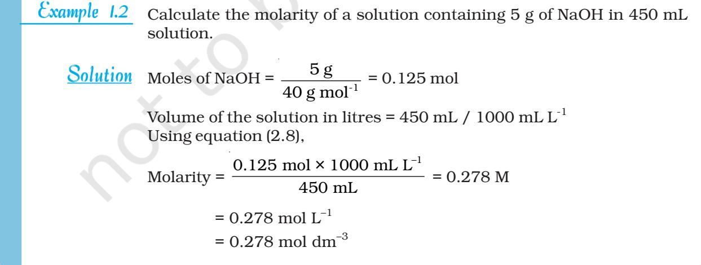

- (vii) *Molality*: Molality (*m*) is defined as the number of moles of the solute per kilogram (kg) of the solvent and is expressed as:
Molality (m) = $\frac{\text{Moles of solute}}{\text{Mass of solvent in kg}}$ (1.9)

For example, 1.00 mol kg–1 (or 1.00 m) solution of KCl means that 1 mol (74.5 g) of KCl is dissolved in 1 kg of water.

Each method of expressing concentration of the solutions has its own merits and demerits. Mass %, ppm, mole fraction and molality are independent of temperature, whereas molarity is a function of temperature. This is because volume depends on temperature and the mass does not.

Example 1.3 Example 1.3Example 1.3 Solution SolutionSolution Calculate molality of 2.5 g of ethanoic acid (CH3COOH) in 75 g of benzene. Molar mass of C2H4O2 : 12 × 2 + 1 × 4 + 16 × 2 = 60 g mol–1 Moles of C2H4O2 = 1 2.5 g 60 g mol− = 0.0417 mol Mass of benzene in kg = 75 g/1000 g kg–1 = 75 × 10–3 kg Molality of C2H4O2 = Moles of C H O 2 4 2 kg of benzene = 1 0.0417 mol 1000 g kg 75 g − × = 0.556 mol kg–1

Intext Questions

- 1.1 Calculate the mass percentage of benzene (C6H6) and carbon tetrachloride (CCl4) if 22 g of benzene is dissolved in 122 g of carbon tetrachloride.
- 1.2 Calculate the mole fraction of benzene in solution containing 30% by mass in carbon tetrachloride.
- 1.3 Calculate the molarity of each of the following solutions: (a) 30 g of Co(NO3)2. 6H2O in 4.3 L of solution (b) 30 mL of 0.5 M H2SO4 diluted to 500 mL.
- 1.4 Calculate the mass of urea (NH2CONH2) required in making 2.5 kg of 0.25 molal aqueous solution.
- 1.5 Calculate (a) molality (b) molarity and (c) mole fraction of KI if the density of 20% (mass/mass) aqueous KI is 1.202 g mL-1 .

## 1.3 Solubility

Solubility of a substance is its maximum amount that can be dissolved in a specified amount of solvent at a specified temperature. It depends upon the nature of solute and solvent as well as temperature and pressure. Let us consider the effect of these factors in solution of a solid or a gas in a liquid.

#### 1.3.1 Solubility of a Solid in a Liquid

Every solid does not dissolve in a given liquid. While sodium chloride and sugar dissolve readily in water, naphthalene and anthracene do not. On the other hand, naphthalene and anthracene dissolve readily in benzene but sodium chloride and sugar do not. It is observed that polar solutes dissolve in polar solvents and non polar solutes in nonpolar solvents. In general, a solute dissolves in a solvent if the intermolecular interactions are similar in the two or we may say like dissolves like.

When a solid solute is added to the solvent, some solute dissolves and its concentration increases in solution. This process is known as dissolution. Some solute particles in solution collide with the solid solute particles and get separated out of solution. This process is known as crystallisation. A stage is reached when the two processes occur at the same rate. Under such conditions, number of solute particles going into solution will be equal to the solute particles separating out and a state of dynamic equilibrium is reached.

Solute + Solvent ⇌ Solution (1.10)

At this stage the concentration of solute in solution will remain constant under the given conditions, i.e., temperature and pressure. Similar process is followed when gases are dissolved in liquid solvents. Such a solution in which no more solute can be dissolved at the same temperature and pressure is called a saturated solution. An *unsaturated solution* is one in which more solute can be dissolved at the same temperature. The solution which is in dynamic equilibrium with undissolved solute is the saturated solution and contains the maximum amount of solute dissolved in a given amount of solvent. Thus, the concentration of solute in such a solution is its solubility.

Earlier we have observed that solubility of one substance into another depends on the nature of the substances. In addition to these variables, two other parameters, i.e., temperature and pressure also control this phenomenon.

#### *Effect of temperature*

The solubility of a solid in a liquid is significantly affected by temperature changes. Consider the equilibrium represented by equation 1.10. This, being dynamic equilibrium, must follow Le Chateliers Principle. In general, if in a *nearly saturated solution,* the dissolution process is endothermic (Dsol H > 0), the solubility should increase with rise in temperature and if it is exothermic (Dsol H < 0) the solubility should decrease. These trends are also observed experimentally.

#### *Effect of pressure*

Pressure does not have any significant effect on solubility of solids in liquids. It is so because solids and liquids are highly incompressible and practically remain unaffected by changes in pressure.

1.3.2 Solubility of a Gas in a Liquid

Many gases dissolve in water. Oxygen dissolves only to a small extent in water. It is this dissolved oxygen which sustains all aquatic life. On the other hand, hydrogen chloride gas (HCl) is highly soluble in water. Solubility of gases in liquids is greatly affected by pressure and temperature. The solubility of gases increase with increase of pressure. For solution of gases in a solvent, consider a system as shown in Fig. 1.1 (a). The lower part is solution and the upper part is gaseous system at pressure *p* and temperature *T*. Assume this system to be in a state of dynamic equilibrium, i.e., under these conditions rate of gaseous particles entering and leaving the solution phase is the same. Now increase the pressure over the solution phase by compressing the gas to a smaller volume [Fig. 1.1 (b)]. This will increase the number of gaseous particles per unit volume over the solution and also the rate at which the gaseous particles are striking the surface of solution to enter it. The solubility of the gas will increase until a new equilibrium is reached resulting in an increase in the pressure of a gas above the solution and thus its solubility increases.

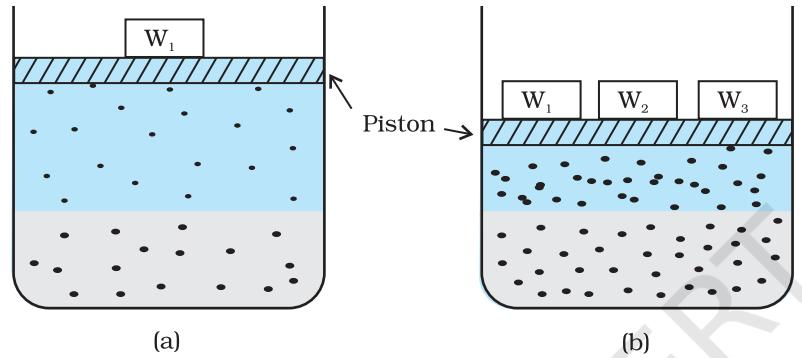

*Fig. 1.1: Effect of pressure on the solubility of a gas. The concentration of dissolved gas is proportional to the pressure on the gas above the solution.*

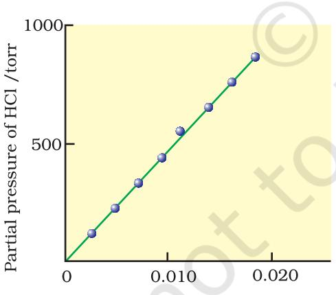

Henry was the first to give a quantitative relation between pressure and solubility of a gas in a solvent which is known as Henry's law. The law states that at a constant temperature, the solubility of a gas in a liquid is directly proportional to the partial pressure of the gas present above the surface of liquid or solution. Dalton, a contemporary of Henry, also concluded independently that the solubility of a gas in a liquid solution is a function of partial

pressure of the gas. If we use the mole fraction of a gas in the solution as a measure of its solubility, then it can be said that the mole fraction of gas in the solution is proportional to the partial pressure of the gas over the solution. The most commonly used form of Henry's law states that "the partial pressure of the gas in vapour phase (*p*) is proportional to the mole fraction of the gas (*x*) in the solution" and is expressed as:

$p=K_{\rm H}\ x$

Here *K*H is the Henry's law constant. If we draw a graph between partial pressure of the gas versus mole fraction of the gas in solution, then we should get a plot of the type as shown in Fig. 1.2.

Different gases have different *K*H values at the same temperature (Table 1.2). This suggests that *K*H is a function of the nature of the gas.

It is obvious from equation (1.11) that higher the value of *K*H at a given pressure, the lower is the solubility of the gas in the liquid. It can be seen from Table 1.2 that KH values for both N2 and O2 increase with increase of temperature indicating that the solubility of gases

| Gas | Temperature/K | /kbar KH | Gas | Temperature/K | /kbar KH |
| --- | --- | --- | --- | --- | --- |
| He | 293 | 144.97 | Argon | 298 | 40.3 |
| H2 | 293 | 69.16 | CO2 | 298 | 1.67 |
| N2 | 293 | 76.48 | Formaldehyde | 298 | 1.83×10-5 |
| N2 | 303 | 88.84 |  |  |  |
| O2 | 293 | 34.86 | Methane | 298 | 0.413 |
| O2 | 303 | 46.82 | Vinyl chloride | 298 | 0.611 |

Table 1.2: Values of Henry's Law Constant for Some Selected Gases in Water

increases with decrease of temperature. It is due to this reason that aquatic species are more comfortable in cold waters rather than in warm waters.

If N2 gas is bubbled through water at 293 K, how many millimoles of N2 gas would dissolve in 1 litre of water? Assume that N2 exerts a partial pressure of 0.987 bar. Given that Henry's law constant for N2 at 293 K is 76.48 *k*bar. The solubility of gas is related to the mole fraction in aqueous solution. The mole fraction of the gas in the solution is calculated by applying Henry's law. Thus: *x* (Nitrogen) = H *p* (nitrogen) *K* = 0.987bar 76,480 bar = 1.29 × 10–5 As 1 litre of water contains 55.5 mol of it, therefore if *n* represents number of moles of N2 in solution, *x* (Nitrogen) = mol mol 55.5 mol + *n n* = 55.5 *n*  = 1.29 × 10–5 (*n* in denominator is neglected as it is < < 55.5) Thus *n* = 1.29 × 10–5 × 55.5 mol = 7.16 × 10–4 mol = 4 7.16×10 mol × 1000 mmol 1 mol = 0.716 mmol Example 1.4 Example 1.4Example 1.4 Solution SolutionSolution

> Henry's law finds several applications in industry and explains some biological phenomena. Notable among these are:

- · To increase the solubility of CO2 in soft drinks and soda water, the bottle is sealed under high pressure.
- · Scuba divers must cope with high concentrations of dissolved gases while breathing air at high pressure underwater. Increased pressure increases the solubility of atmospheric gases in blood. When the divers come towards surface, the pressure gradually decreases. This releases the dissolved gases and leads to the formation of bubbles of nitrogen in the blood. This blocks capillaries and creates a medical condition known as *bends*, which are painful and dangerous to life.

To avoid bends, as well as, the toxic effects of high concentrations of nitrogen in the blood, the tanks used by scuba divers are filled with air diluted with helium (11.7% helium, 56.2% nitrogen and 32.1% oxygen).

- · At high altitudes the partial pressure of oxygen is less than that at the ground level. This leads to low concentrations of oxygen in the blood and tissues of people living at high altitudes or climbers. Low blood oxygen causes climbers to become weak and unable to think clearly, symptoms of a condition known as *anoxia*.
#### *Effect of Temperature*

Solubility of gases in liquids decreases with rise in temperature. When dissolved, the gas molecules are present in liquid phase and the process of dissolution can be considered similar to condensation and heat is evolved in this process. We have learnt in the last Section that dissolution process involves dynamic equilibrium and thus must follow Le Chatelier's Principle. As dissolution is an exothermic process, the solubility should decrease with increase of temperature.

### Intext Questions

- 1.6 H2 S, a toxic gas with rotten egg like smell, is used for the qualitative analysis. If the solubility of H2S in water at STP is 0.195 m, calculate Henry's law constant.
- 1.7 Henry's law constant for CO2 in water is 1.67×108 Pa at 298 K. Calculate the quantity of CO2 in 500 mL of soda water when packed under 2.5 atm CO2 pressure at 298 K.
- 1.4 Vapour Pressure of Pressure ofPressure of Liquid Solutions SolutionsSolutions

Liquid solutions are formed when solvent is a liquid. The solute can be a gas, a liquid or a solid. Solutions of gases in liquids have already been discussed in Section 1.3.2. In this Section, we shall discuss the solutions of liquids and solids in a liquid. Such solutions may contain one or more volatile components. Generally, the liquid solvent is volatile. The solute may or may not be volatile. We shall discuss the properties of only binary solutions, that is, the solutions containing two components, namely, the solutions of (i) liquids in liquids and (ii) solids in liquids.

- 1.4.1 Vapour Pressure of Liquid-Liquid Solutions
Let us consider a binary solution of two volatile liquids and denote the two components as 1 and 2. When taken in a closed vessel, both the components would evaporate and eventually an equilibrium would be established between vapour phase and the liquid phase. Let the total vapour pressure at this stage be *p*total and *p*1 and *p*2 be the partial vapour pressures of the two components 1 and 2 respectively. These partial pressures are related to the mole fractions *x*1 and *x*2 of the two components 1 and 2 respectively.

The French chemist, Francois Marte Raoult (1886) gave the quantitative relationship between them. The relationship is known as the Raoult's law which states that for a solution of volatile liquids,

#### the partial vapour pressure of each component of the solution is directly proportional to its mole fraction present in solution.

Thus, for component 1

$P_{1}\propto x_{1}$  
  
and $P_{1}=\ p_{1}^{0}\ x_{1}$ (1.12)

where 0 1 *p* is the vapour pressure of pure component 1 at the same temperature.

Similarly, for component 2

$p_{2}=p_{2}^{\ 0}\ x_{2}$

where *p*2 0 represents the vapour pressure of the pure component 2. According to Dalton's law of partial pressures, the total pressure

( *p*total ) over the solution phase in the container will be the sum of the partial pressures of the components of the solution and is given as:

$P_{\rm total}=p_{1}+p_{2}$  
  
Substituting the values of $p_{1}$ and $p_{2}$, we get 

$$P_{\rm total}=x_{1}\,{p_{1}}^{0}+x_{2}\,{p_{2}}^{0}\tag{1.15}$$
 
$$=(1-x_{2})\,{p_{1}}^{0}+x_{2}\,{p_{2}}^{0}$$
 
$$={p_{1}}^{0}+({p_{2}}^{0}-{p_{1}}^{0})\,x_{2}$$

Following conclusions can be drawn from equation (1.16).  
  

- (i) Total vapour pressure over the solution can be related to the mole fraction of any one component.
- (ii) Total vapour pressure over the solution varies linearly with the mole fraction of component 2.

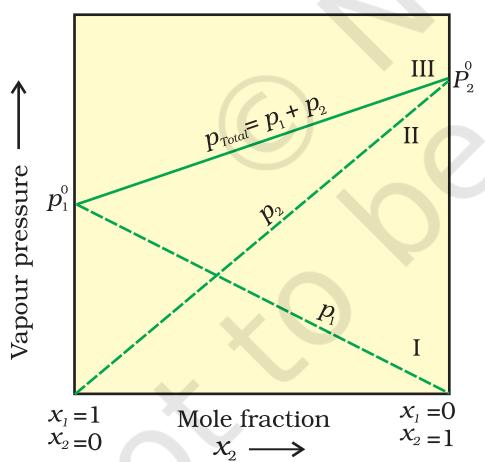

*Fig. 1.3: The plot of vapour pressure and mole fraction of an ideal solution at constant temperature. The dashed lines I and II represent the partial pressure of the components. (It can be seen from the plot that p1 and p2 are directly proportional to x1 and x2, respectively). The total vapour pressure is given by line marked III in the figure.*

Chemistry 10

(iii) Depending on the vapour pressures of the pure components 1 and 2, total vapour pressure over the solution decreases or increases with the increase of the mole fraction of component 1.

A plot of *p*1 or *p*2 versus the mole fractions *x*1 and *x*2 for a solution gives a linear plot as shown in Fig. 1.3. These lines (I and II) pass through the points for which *x*1 and *x*2 are equal to unity. Similarly the plot (line III) of *p*total versus *x*2 is also linear (Fig. 1.3). The minimum value of *p*total is *p*1 0 and the maximum value is *p*2 0 , assuming that component 1 is less volatile than component 2, i.e., *p*1 0 < *p*2 0 .

The composition of vapour phase in equilibrium with the solution is determined by the partial pressures of the components. If *y*1 and *y*2 are the mole fractions of the components 1 and 2 respectively in the vapour phase then, using Dalton's law of partial pressures:

$p_{1}=y_{1}\ p_{\rm total}$

$p_{2}=\,y_{2}\,p_{\rm total}$

In general  
  
$p_{i}=y_{i}\;\;p_{\rm total}$ (1.19)

Vapour pressure of chloroform (CHCl3 ) and dichloromethane (CH2Cl2 ) at 298 K are 200 mm Hg and 415 mm Hg respectively. (i) Calculate the vapour pressure of the solution prepared by mixing 25.5 g of CHCl3 and 40 g of CH2Cl2 at 298 K and, (ii) mole fractions of each component in vapour phase. (i) Molar mass of CH2Cl2 = 12 × 1+1 × 2 + 35.5 × 2 = 85 g mol–1 Molar mass of CHCl3 = 12 × 1+1 × 1 + 35.5 × 3 = 119.5 g mol-1 Moles of CH2Cl2 = 1 40 g 85 g mol = 0.47 mol Moles of CHCl3 = 1 25.5 g 119.5 g mol = 0.213 mol Total number of moles = 0.47 + 0.213 = 0.683 mol CH Cl 2 2 *x* = 0.47 mol 0.683 mol = 0.688 CHCl3 *x* = 1.00 – 0.688 = 0.312 Using equation (2.16), *p*total = *p*1 0 + (*p*2 0 – *p*1 0 ) *x*2 = 200 + (415 – 200) × 0.688 = 200 + 147.9 = 347.9 mm Hg (ii) Using the relation (2.19), *y*i = *p*i/*p*total, we can calculate the mole fraction of the components in gas phase (*y*i ). CH Cl 2 2 *p* = 0.688 *×* 415 mm Hg = 285.5 mm Hg CHCl3 *p* = 0.312 *×* 200 mm Hg = 62.4 mm Hg CH Cl 2 2 *y* = 285.5 mm Hg/347.9 mm Hg = 0.82 CHCl3 *y* = 62.4 mm Hg/347.9 mm Hg = 0.18 Note: Since, CH2Cl2 is a more volatile component than CHCl3 , [ CH Cl 2 2 *0 p* = 415 mm Hg and CHCl3 *0 p* = 200 mm Hg] and the vapour phase is also richer in CH2Cl2 [ CH Cl 2 2 *y* = 0.82 and CHCl3 *y* = 0.18], it may thus be concluded Example 1.5Example 1.5 Example 1.5 Solution SolutionSolution

that at equilibrium, vapour phase will be always rich in the component which is more volatile.

11 Solutions

#### 1.4.2 Raoult's Law as a special case of Henry's Law

According to Raoult's law, the vapour pressure of a volatile component in a given solution is given by *p*i = *x*i *p*i 0 . In the solution of a gas in a liquid, one of the components is so volatile that it exists as a gas and we have already seen that its solubility is given by Henry's law which states that

$$p=K_{\mathrm{H}}\;x.$$

If we compare the equations for Raoult's law and Henry's law, it can be seen that the partial pressure of the volatile component or gas is directly proportional to its mole fraction in solution. Only the proportionality constant *K*H differs from *p*1 0 . Thus, Raoult's law becomes a special case of Henry's law in which *K*H becomes equal to *p*1 0 .

#### 1.4.3 Vapour Pressure of Solutions of Solids in Liquids

Another important class of solutions consists of solids dissolved in liquid, for example, sodium chloride, glucose, urea and cane sugar in water and iodine and sulphur dissolved in carbon disulphide. Some physical properties of these solutions are quite different from those of pure solvents. For example, vapour pressure. Liquids at a given

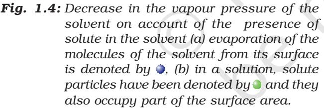

temperature vapourise and under equilibrium conditions the pressure exerted by the vapours of the liquid over the liquid phase is called vapour pressure [Fig. 1.4 (a)]. In a pure liquid the entire surface is occupied by the molecules of the liquid. If a non-volatile solute is added to a solvent to give a solution [Fig. 1.4.(b)], the vapour pressure of the solution is solely from the solvent alone. This vapour pressure of the solution at a given temperature is found to be lower than the vapour pressure of the pure solvent at the same temperature. In the solution, the surface has both solute and solvent molecules; thereby the fraction of the surface covered by the solvent molecules gets reduced. Consequently, the number of solvent molecules escaping from the surface is correspondingly reduced, thus, the vapour pressure is also reduced.

The decrease in the vapour pressure of solvent depends on the quantity of non-volatile solute present in the solution, irrespective of its nature. For example, decrease in the vapour pressure of water by adding 1.0 mol of sucrose to one kg of water is nearly similar to that produced by adding 1.0 mol of urea to the same quantity of water at the same temperature.

Raoult's law in its general form can be stated as, for any solution the partial vapour pressure of each volatile component in the solution is directly proportional to its mole fraction.

In a binary solution, let us denote the solvent by 1 and solute by 2. When the solute is non-volatile, only the solvent molecules are present in vapour phase and contribute to vapour pressure. Let *p*1 be *Fig. 1.5*

*If a solution obeys Raoult's law for all concentrations, its vapour pressure would vary linearly from zero to the vapour pressure of the pure solvent.*

1.5 Ideal and Nonideal Solutions

1.5.1 Ideal Solutions The solutions which obey Raoult's law over the entire range of concentration are known as *ideal solutions*. The ideal solutions have two other important properties. The enthalpy of mixing of the pure components to form the solution is zero and the volume of mixing is also zero, i.e.,

Liquid-liquid solutions can be classified into ideal and non-ideal

$\Delta_{\rm mix}H=0$, $\Delta_{\rm mix}V=0$ (1.21)

It means that no heat is absorbed or evolved when the components are mixed. Also, the volume of solution would be equal to the sum of volumes of the two components. At molecular level, ideal behaviour of the solutions can be explained by considering two components A and B. In pure components, the intermolecular attractive interactions will be of types A-A and B-B, whereas in the binary solutions in addition to these two interactions, A-B type of interactions will also be present. If the intermolecular attractive forces between the A-A and B-B are nearly equal to those between A-B, this leads to the formation of ideal solution. A perfectly ideal solution is rare but some solutions are nearly ideal in behaviour. Solution of n-hexane and n-heptane, bromoethane and chloroethane, benzene and toluene, etc. fall into this category.

1.5.2 Non-ideal Solutions When a solution does not obey Raoult's law over the entire range of concentration, then it is called *non-ideal solution*. The vapour pressure of such a solution is either higher or lower than that predicted by Raoult's law (equation 1.16). If it is higher, the solution exhibits positive deviation and if it is lower, it exhibits negative deviation from Raoult's law. The plots of vapour pressure as a function of mole fractions for such solutions are shown in Fig. 1.6.

The cause for these deviations lie in the nature of interactions at the molecular level. In case of positive deviation from Raoult's law, A-B interactions are weaker than those between A-A or B-B, i.e., in this case the intermolecular attractive forces between the solute-solvent molecules are weaker than those between the solute-solute and solvent-solvent molecules. This means that in such solutions, molecules of A (or B) will find it easier to escape than in pure state. This will increase the vapour

13 Solutions

solutions on the basis of Raoult's law.

the vapour pressure of the solvent, *x*1 be its mole fraction, *p*i 0 be its vapour pressure in the pure state. Then according to Raoult's law

$P_{1}\propto x_{1}$  
  
and $P_{1}=x_{1}\ P_{1}^{0}$ (1.20)

The proportionality constant is equal to the vapour pressure of pure solvent, 0 1 *p* . A plot between the vapour pressure and the mole fraction of the solvent is linear (Fig. 1.5).

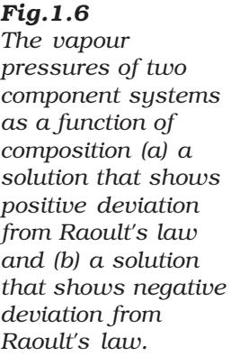

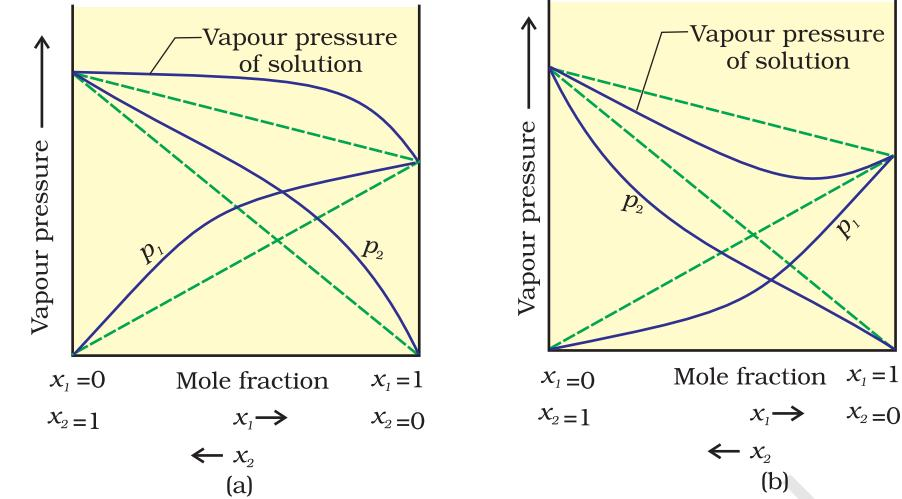

pressure and result in positive deviation. Mixtures of ethanol and acetone behave in this manner. In pure ethanol, molecules are hydrogen bonded. On adding acetone, its molecules get in between the host molecules and break some of the hydrogen bonds between them. Due to weakening of interactions, the solution shows positive deviation from Raoult's law [Fig. 1.6 (a)]. In a solution formed by adding carbon disulphide to acetone, the dipolar interactions between solute-solvent molecules are weaker than the respective interactions among the solute-solute and solvent-solvent molecules. This solution also shows positive deviation.

In case of negative deviations from Raoult's law, the intermolecular attractive forces between A-A and B-B are weaker than those between A-B and leads to decrease in vapour pressure resulting in negative deviations. An example of this type is a mixture of phenol and aniline. In this case the intermolecular hydrogen bonding between phenolic proton and lone pair on nitrogen atom of aniline is stronger than the respective intermolecular hydrogen bonding between similar molecules. Similarly, a mixture of chloroform and acetone forms a solution with negative deviation from Raoult's law. This is because chloroform molecule is able to form hydrogen bond with acetone molecule as shown.

This decreases the escaping tendency of molecules for each component and consequently the vapour pressure decreases resulting in negative deviation from Raoult's law [Fig. 1.6. (b)].

Some liquids on mixing, form azeotropes which are binary mixtures having the same composition in liquid and vapour phase and boil at a constant temperature. In such cases, it is not possible to separate the components by fractional distillation. There are two types of azeotropes called minimum boiling azeotrope and maximum boiling azeotrope. The solutions which show a large positive deviation from Raoult's law form minimum boiling azeotrope at a specific composition.

Chemistry 14

For example, ethanol-water mixture (obtained by fermentation of sugars) on fractional distillation gives a solution containing approximately 95% by volume of ethanol. Once this composition, known as azeotrope composition, has been achieved, the liquid and vapour have the same composition, and no further separation occurs.

The solutions that show large negative deviation from Raoult's law form maximum boiling azeotrope at a specific composition. Nitric acid and water is an example of this class of azeotrope. This azeotrope has the approximate composition, 68% nitric acid and 32% water by mass, with a boiling point of 393.5 K.

### Intext Question

- 1.8 The vapour pressure of pure liquids A and B are 450 and 700 mm Hg respectively, at 350 K . Find out the composition of the liquid mixture if total vapour pressure is 600 mm Hg. Also find the composition of the vapour phase.
- 1.6 Colligative ColligativeColligative Properties and Determination of Molar Mass

We have learnt in Section 1.4.3 that the vapour pressure of solution decreases when a non-volatile solute is added to a volatile solvent. There are many properties of solutions which are connected with this decrease of vapour pressure. These are: (1) relative lowering of vapour pressure of the solvent (2) depression of freezing point of the solvent (3) elevation of boiling point of the solvent and (4) osmotic pressure of the solution. All these properties depend on the number of solute particles irrespective of their nature relative to the total number of particles present in the solution. Such properties are called *colligative properties* (colligative: from Latin: co means together, ligare means to bind). In the following Sections we will discuss these properties one by one.

- 1.6.1 Relative Lowering of Vapour Pressure
We have learnt in Section 1.4.3 that the vapour pressure of a solvent in solution is less than that of the pure solvent. Raoult established that the lowering of vapour pressure depends only on the concentration of the solute particles and it is independent of their identity. The equation (1.20) given in Section 1.4.3 establishes a relation between vapour pressure of the solution, mole fraction and vapour pressure of the solvent, i.e.,

$$\begin{array}{c}\includegraphics[width=140.0pt]{28.45}\end{array}\tag{1.22}$$

The reduction in the vapour pressure of solvent (D*p*1 ) is given as:

$$\Delta\overline{p}_{1}=p_{1}^{\ 0}-p_{1}=p_{1}^{\ 0}-p_{1}^{\ 0}\ x_{1}\tag{1.23}$$
 
$$=p_{1}^{\ 0}\ (1-x_{1})$$

Knowing that *x*2 = 1 – *x*1 , equation (1.23) reduces to

$\Delta p_{1}=\chi_{2}\ p_{1}^{\ 0}$

In a solution containing several non-volatile solutes, the lowering of the vapour pressure depends on the sum of the mole fraction of different solutes.

Equation (1.24) can be written as

$$\frac{\Delta p_{1}}{p_{1}^{0}}=\frac{p_{1}^{0}-p_{1}}{p_{1}^{0}}=x_{2}\tag{1.25}$$

15 Solutions

The expression on the left hand side of the equation as mentioned earlier is called relative lowering of vapour pressure and is equal to the mole fraction of the solute. The above equation can be written as:

$$\frac{p_{1}^{0}-p_{1}}{p_{1}^{0}}=\frac{n_{2}}{n_{1}+n_{2}}\ \left(\mbox{since}x_{2}=\frac{n_{2}}{n_{1}+n_{2}}\right)\tag{1.26}$$

Here *n*1 and *n*2 are the number of moles of solvent and solute respectively present in the solution. For dilute solutions *n*2 < < *n*1, hence neglecting *n*2 in the denominator we have

$$\frac{P_{1}^{0}-P_{1}}{P_{1}^{0}}\quad=\frac{n_{2}}{n_{1}}\tag{1.27}$$

or $\frac{p_{1}^{0}\ -\ p_{1}}{p_{1}^{0}}\ =\frac{\mathrm{w}_{2}\ \times M_{1}}{M_{2}\ \times\mathrm{w}_{1}}$ (1.28)

Here *w*1 and *w*2 are the masses and *M*1 and *M*2 are the molar masses of the solvent and solute respectively.

From this equation (1.28), knowing all other quantities, the molar mass of solute (*M*2 ) can be calculated.

| Example 1.6 Example 1.6 Example 1.6 | The vapour pressure of pure benzene at a certain temperature is 0.850 |
| --- | --- |
|  | bar. A non-volatile, non-electrolyte solid weighing 0.5 g when added to 39.0 g of benzene (molar mass 78 g mol-1). Vapour pressure of the solution, |
|  | then, is 0.845 bar. What is the molar mass of the solid substance? |
| Solution Solution Solution | The various quantities known to us are as follows: |
|  | 0 = 78 g mol–1; w p1 = 0.850 bar; p = 0.845 bar; M1 = 0.5 g; w1 = 39 g 2 |
|  | Substituting these values in equation (2.28), we get |
|  | –1 0.5 g × 78 g mol 0.850 bar – 0.845 bar = × 39 g 2 |
|  | M 0.850 bar |
|  | = 170 g mol–1 Therefore, M2 |

The vapour pressure of a liquid increases with increase of temperature. It boils at the temperature at which its vapour pressure is equal to the atmospheric pressure. For example, water boils at 373.15 K (100° C) because at this temperature the vapour pressure of water is 1.013 bar (1 atmosphere). We have also learnt in the last section that vapour pressure of the solvent decreases in the presence of non-volatile solute. Fig. 1.7 depicts the variation of vapour pressure of the pure solvent and solution as a function of temperature. For example, the vapour pressure of an aqueous solution of sucrose is less than 1.013 bar at 373.15 K. In order to make this solution boil, its vapour pressure must be increased to 1.013 bar by raising the temperature above the boiling temperature of the pure solvent (water). Thus, the boiling point of a solution is 1.6.2 Elevation of Boiling Point

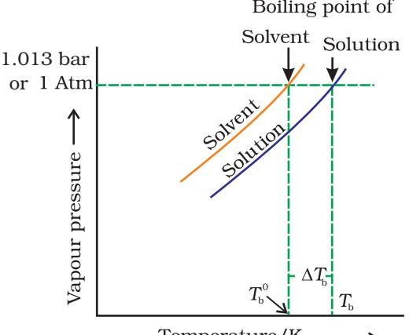

*Fig. 1.7: The vapour pressure curve for solution lies below the curve for pure water. The diagram shows that* D*T*b *denotes the elevation of boiling point of a solvent in solution.*

always higher than that of the boiling point of the pure solvent in which the solution is prepared as shown in Fig. 1.7. Similar to lowering of vapour pressure, the elevation of boiling point also depends on the number of solute molecules rather than their nature. A solution of 1 mol of sucrose in 1000 g of water boils at 373.52 K at one atmospheric pressure.

Let 0 *T*b be the boiling point of pure solvent and *T*b be the boiling point of solution. The increase in the boiling point 0 *T T T* b b b is known as elevation of boiling point.

Experiments have shown that for dilute solutions the elevation of boiling point (D*T*b ) is directly proportional to the molal concentration of the solute in a solution. Thus

$\Delta T_{\rm b}\propto$ m 

or $\Delta T_{\rm b}=K_{\rm b}$ m (1.30)

Here *m* (molality) is the number of moles of solute dissolved in 1 kg of solvent and the constant of proportionality, *K*b is called Boiling Point Elevation Constant or Molal Elevation Constant (Ebullioscopic Constant). The unit of *K*b is K kg mol-1. Values of *K*b for some common solvents are given in Table 1.3. If w2 gram of solute of molar mass *M*2 is dissolved in w1 gram of solvent, then molality, m of the solution is given by the expression:

$$\begin{array}{c}\mbox{m}=\frac{w_{2}/\mbox{M}_{2}}{w_{1}/1000}=\frac{1000\times w_{2}}{M_{2}\times w_{1}}\end{array}\tag{1.31}$$

Substituting the value of molality in equation (1.30) we get

$$\Delta T_{\rm b}=\frac{K_{\rm b}\times1000\times w_{2}}{M_{2}\times w_{1}}\tag{1.32}$$

$$M_{2}=\frac{1000\times w_{2}\times K_{\rm b}}{\Delta T_{\rm b}\times w_{1}}\tag{1.33}$$

Thus, in order to determine *M*2 , molar mass of the solute, known mass of solute in a known mass of the solvent is taken and D*T*b is determined experimentally for a known solvent whose *K*b value is known.

|  | × DT m = 0.52 K kg mol–1 × 0.1 mol kg–1 = 0.052 K = Kb b |
| --- | --- |
|  | Since water boils at 373.15 K at 1.013 bar pressure, therefore, the |
|  | boiling point of solution will be 373.15 + 0.052 = 373.202 K. |
| Example 1.8 Example 1.8 Example 1.8 | The boiling point of benzene is 353.23 K. When 1.80 g of a non-volatile |
|  | solute was dissolved in 90 g of benzene, the boiling point is raised to |
|  | for benzene is 2.53 354.11 K. Calculate the molar mass of the solute. Kb |
|  | K kg mol–1 |
| Solution Solution Solution | The elevation (DT ) in the boiling point = 354.11 K – 353. 23 K = 0.88 K b |
|  | Substituting these values in expression (2.33) we get |
|  | –1 –1 2.53 K kg mol × 1.8 g × 1000 g kg |
|  | = = 58 g mol–1 M2 |
|  | 0.88 K × 90 g |
|  | = 58 g mol–1 Therefore, molar mass of the solute, M2 |

#### The lowering of vapour pressure of a solution causes a lowering of the freezing point compared to that of the pure solvent (Fig. 1.8). We know that at the freezing point of a substance, the solid phase is in dynamic 1.6.3 Depression of Freezing Point

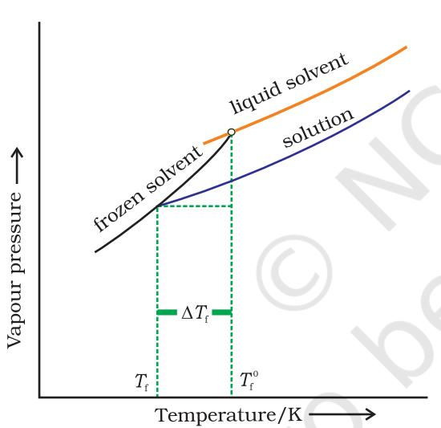

equilibrium with the liquid phase. Thus, the freezing point of a substance may be defined as the temperature at which the vapour pressure of the substance in its liquid phase is equal to its vapour pressure in the solid phase. A solution will freeze when its vapour pressure equals the vapour pressure of the pure solid solvent as is clear from Fig. 1.8. According to Raoult's law, when a non-volatile solid is added to the solvent its vapour pressure decreases and now it would become equal to that of solid solvent at lower temperature. Thus, the freezing point of the solvent decreases.

> Let 0 *T*f be the freezing point of pure solvent

and *T*f be its freezing point when non-volatile solute is dissolved in it. The decrease in freezing point.

0 *T T T* f f f is known as depression in freezing point.

Similar to elevation of boiling point, depression of freezing point (D*T*f ) for dilute solution (ideal solution) is directly proportional to molality, m of the solution. Thus,

$$\Delta T_{\rm f}\propto{\rm m}\tag{1.34}$$
  
  
or $\Delta T_{\rm f}=K_{\rm f}$ m  
  
The temperature $\Delta T_{\rm f}$ is constant. He-shielded around the nature of the 

The proportionality constant, Kf , which depends on the nature of the solvent is known as Freezing Point Depression Constant or Molal

Chemistry 18

Depression Constant or Cryoscopic Constant. The unit of Kf is K kg mol-1. Values of *K*f for some common solvents are listed in Table 1.3.

If w2 gram of the solute having molar mass as *M*2 , present in w1 gram of solvent, produces the depression in freezing point D*T*f of the solvent then molality of the solute is given by the equation (1.31).

$$\begin{array}{ll}\mbox{m}&=\frac{w_{2}\ /\ M_{2}}{w_{1}/1000}\end{array}\tag{1.31}$$

Substituting this value of molality in equation (1.34) we get:

$$\Delta T_{\rm f}=\frac{K_{\rm f}\ \times\ w_{2}\ /\ M_{2}}{w_{1}\ /1000}$$
 
$$\Delta T_{\rm f}=\frac{K_{\rm f}\ \times w_{2}\ \times1000}{M_{2}\ \times w_{1}}$$
 
$$M_{2}=\frac{K_{\rm f}\ \times w_{2}\ \times1000}{\Delta T_{\rm f}\ \times w_{1}}$$

Thus for determining the molar mass of the solute we should know the quantities w1 , w2 , D*T*f , along with the molal freezing point depression constant.

The values of *K*f and *K*b , which depend upon the nature of the solvent, can be ascertained from the following relations.

$$K_{\rm f}=\frac{R\times M_{1}\times T_{\rm f}^{2}}{1000\times\Delta_{\rm fus}H}$$
 
$$\cdot\frac{R\times M_{1}\times T_{\rm b}^{2}}{\Delta_{\rm fus}H}$$

$$K_{\rm b}=\frac{1}{1000}\times\Delta_{\rm vap}H\tag{1.38}$$

Here the symbols *R* and *M*1 stand for the gas constant and molar mass of the solvent, respectively and *T*f and *T*b denote the freezing point and the boiling point of the pure solvent respectively in kelvin. Further, Dfus*H* and Dvap*H* represent the enthalpies for the fusion and vapourisation of the solvent, respectively.

#### Table 1.3: Molal Boiling Point Elevation and Freezing Point Depression Constants for Some Solvents

| Solvent | b. p./K | /K kg mol-1 Kb | f. p./K | /K kg mol-1 Kf |
| --- | --- | --- | --- | --- |
| Water | 373.15 | 0.52 | 273.0 | 1.86 |
| Ethanol | 351.5 | 1.20 | 155.7 | 1.99 |
| Cyclohexane | 353.74 | 2.79 | 279.55 | 20.00 |
| Benzene | 353.3 | 2.53 | 278.6 | 5.12 |
| Chloroform | 334.4 | 3.63 | 209.6 | 4.79 |
| Carbon tetrachloride | 350.0 | 5.03 | 250.5 | 31.8 |
| Carbon disulphide | 319.4 | 2.34 | 164.2 | 3.83 |
| Diethyl ether | 307.8 | 2.02 | 156.9 | 1.79 |
| Acetic acid | 391.1 | 2.93 | 290.0 | 3.90 |

19 Solutions

| Example 1.9 Example 1.9 Example 1.9 | ) is mixed with 600 g of water. Calculate 45 g of ethylene glycol (C2H6O2 |
| --- | --- |
|  | (a) the freezing point depression and (b) the freezing point of the solution. |
| Solution Solution Solution | Depression in freezing point is related to the molality, therefore, the molality |
|  | moles of ethylene glycol of the solution with respect to ethylene glycol = |
|  | mass of water in kilogram |
|  | 45 g Moles of ethylene glycol = = 0.73 mol |
|  | 1 62 g mol |
|  | 600g |
|  | Mass of water in kg = 1 = 0.6 kg 1000g kg |
|  | 0.73 mol –1 |
|  | Hence molality of ethylene glycol = = 1.2 mol kg 0.60 kg |
|  | Therefore freezing point depression, |
|  | = 1.86 K kg mol–1 × 1.2 mol kg –1 = 2.2 K ÄTf |
|  | Freezing point of the aqueous solution = 273.15 K – 2.2 K = 270.95 K |
| Example 1.10 | 1.00 g of a non-electrolyte solute dissolved in 50 g of benzene lowered the |
|  | freezing point of benzene by 0.40 K. The freezing point depression constant |
|  | of benzene is 5.12 K kg mol–1. Find the molar mass of the solute. |
| Solution Solution Solution | Substituting the values of various terms involved in equation (1.36) we get, |
|  |  1  1 5.12 K kg mol × 1.00 g × 1000 g kg |
|  | = 256 g mol-1 M2 = |
|  | 0.40 × 50 g |
|  | Thus, molar mass of the solute = 256 g mol-1 |

#### 1.6.4 Osmosis and Osmotic Pressure

Chemistry 20

There are many phenomena which we observe in nature or at home. For example, raw mangoes shrivel when pickled in brine (salt water); wilted flowers revive when placed in fresh water, blood cells collapse when suspended in saline water, etc. If we look into these processes we

find one thing common in all, that is, all these substances are bound by membranes. These membranes can be of animal or vegetable origin and these occur naturally such as pig's bladder or parchment or can be synthetic such as cellophane. These membranes appear to be continuous sheets or films, yet they contain a network of submicroscopic holes or pores. Small solvent molecules, like water, can pass through these holes but the passage of bigger molecules like solute is hindered. Membranes having this kind of properties are known as *semipermeable membranes* (SPM).

Assume that only solvent molecules can pass through these semipermeable membranes. If this membrane is placed between the solvent and solution as shown in Fig. 1.9, the solvent molecules will flow through the membrane from pure solvent to the solution. This process of flow of the solvent is called *osmosis*.

The flow will continue till the equilibrium is attained. The flow of the solvent from its side to solution side across a semipermeable membrane can be stopped if some extra pressure is applied on the solution. This pressure that just stops the flow of solvent is called *osmotic pressure* of the solution. The flow of solvent from dilute solution to the concentrated solution across a semipermeable membrane is due to osmosis. The important point to be kept in mind is that solvent molecules always flow from lower concentration to higher concentration of solution. The osmotic pressure has been found to depend on the concentration of the solution.

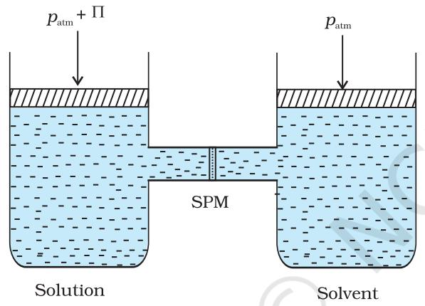

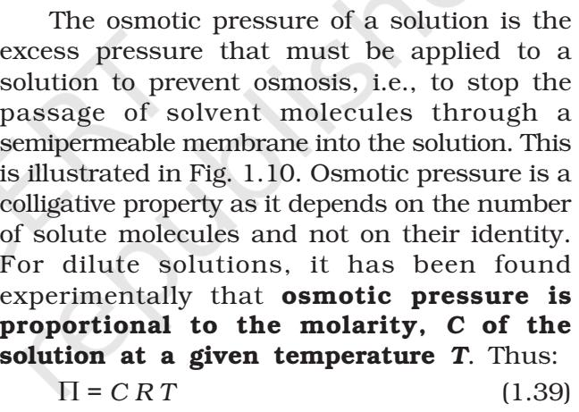

Here P is the osmotic pressure and R is the gas constant.

$$\Pi=(n_{2}/V)RT (1.40)$$

Here *V* is volume of a solution in litres containing n2 moles of solute. If w2 grams of solute, of molar mass, *M*2 is present in the solution, then *n*2 = w2 / *M*2 and we can write,

$$\PiV=\frac{\mathbf{W}_{2}RT}{M_{2}} (1.41)$$

or $M_{2}=\frac{\mbox{W}_{2}\ R\ T}{\prod\ V}$ (1.42)

Thus, knowing the quantities w2 , *T,* P and *V* we can calculate the molar mass of the solute.

Measurement of osmotic pressure provides another method of determining molar masses of solutes. This method is widely used to determine molar masses of proteins, polymers and other

21 Solutions

macromolecules. The osmotic pressure method has the advantage over other methods as pressure measurement is around the room temperature and the molarity of the solution is used instead of molality. As compared to other colligative properties, its magnitude is large even for very dilute solutions. The technique of osmotic pressure for determination of molar mass of solutes is particularly useful for biomolecules as they are generally not stable at higher temperatures and polymers have poor solubility.

Two solutions having same osmotic pressure at a given temperature are called isotonic solutions. When such solutions are separated by semipermeable membrane no osmosis occurs between them. For example, the osmotic pressure associated with the fluid inside the blood cell is equivalent to that of 0.9% (mass/volume) sodium chloride solution, called normal saline solution and it is safe to inject intravenously. On the other hand, if we place the cells in a solution containing more than 0.9% (mass/ volume) sodium chloride, water will flow out of the cells and they would shrink. Such a solution is called hypertonic. If the salt concentration is less than 0.9% (mass/volume), the solution is said to be hypotonic. In this case, water will flow into the cells if placed in this solution and they would swell.

| Example 1.11 Example 1.11 Example 1.11 | 200 cm3 of an aqueous solution of a protein contains 1.26 g of the |
| --- | --- |
|  | protein. The osmotic pressure of such a solution at 300 K is found to be 2.57 × 10-3 bar. Calculate the molar mass of the protein. |
| Solution Solution Solution | The various quantities known to us are as follows: P = 2.57 × 10–3 bar, |
|  | V = 200 cm3 = 0.200 litre |
|  | T = 300 K |
|  | R = 0.083 L bar mol-1 K-1 |
|  | Substituting these values in equation (2.42) we get |
|  |  1  1 1.26 g × 0.083 L bar K mol × 300 K = 61,022 g mol-1 = M2  3 2.57×10 bar × 0.200 L |

The phenomena mentioned in the beginning of this section can be explained on the basis of osmosis. A raw mango placed in concentrated salt solution loses water via osmosis and shrivel into pickle. Wilted flowers revive when placed in fresh water. A carrot that has become limp because of water loss into the atmosphere can be placed into the water making it firm once again. Water will move into its cells through osmosis. When placed in water containing less than 0.9% (mass/ volume) salt, blood cells swell due to flow of water in them by osmosis. People taking a lot of salt or salty food experience water retention in tissue cells and intercellular spaces because of osmosis. The resulting puffiness or swelling is called edema. Water movement from soil into plant roots and subsequently into upper portion of the plant is partly due to osmosis. The preservation of meat by salting and of fruits by adding sugar protects against bacterial action. Through the process of osmosis, a bacterium on salted meat or candid fruit loses water, shrivels and dies.

#### 1.6.5 Reverse Osmosis and Water Purification

The direction of osmosis can be reversed if a pressure larger than the osmotic pressure is applied to the solution side. That is, now the pure solvent flows out of the solution through the semi permeable membrane. This phenomenon is called reverse osmosis and is of great practical utility. Reverse osmosis is used in desalination of sea water. A schematic set up for the process is shown in Fig. 1.11.

*Fig. 1.11: Reverse osmosis occurs when a pressure larger than the osmotic pressure is applied to the solution.*

When pressure more than osmotic pressure is applied, pure water is squeezed out of the sea water through the membrane. A variety of polymer membranes are available for this purpose.

The pressure required for the reverse osmosis is quite high. A workable porous membrane is a film of cellulose acetate placed over a suitable support. Cellulose acetate is permeable to water but impermeable to impurities and ions present in sea water. These days many countries use desalination plants to meet their potable water requirements.

# Intext Questions

- 1.9 Vapour pressure of pure water at 298 K is 23.8 mm Hg. 50 g of urea (NH2CONH2 ) is dissolved in 850 g of water. Calculate the vapour pressure of water for this solution and its relative lowering.
- 1.10 Boiling point of water at 750 mm Hg is 99.63°C. How much sucrose is to be added to 500 g of water such that it boils at 100°C.
- 1.11 Calculate the mass of ascorbic acid (Vitamin C, C6H8O6 ) to be dissolved in 75 g of acetic acid to lower its melting point by 1.5°C. *K*f = 3.9 K kg mol-1 .
- 1.12 Calculate the osmotic pressure in pascals exerted by a solution prepared by dissolving 1.0 g of polymer of molar mass 185,000 in 450 mL of water at 37°C.

# 1.7 Abnormal AbnormalAbnormal Molar Masses

We know that ionic compounds when dissolved in water dissociate into cations and anions. For example, if we dissolve one mole of KCl (74.5 g) in water, we expect one mole each of K+ and Cl– ions to be released in the solution. If this happens, there would be two moles of particles in the solution. If we ignore interionic attractions, one mole of KCl in one kg of water would be expected to increase the boiling point by 2 × 0.52 K = 1.04 K. Now if we did not know about the degree of

dissociation, we could be led to conclude that the mass of 2 mol particles is 74.5 g and the mass of one mole of KCl would be 37.25 g. This brings into light the rule that, when there is dissociation of solute into ions, the experimentally determined molar mass is always lower than the true value.

$$2\mathrm{~CH_{3}C O O H~}\rightleftharpoons\mathrm{~(CH_{3}C O O H)_{2}~}$$

Molecules of ethanoic acid (acetic acid) dimerise in benzene due to hydrogen bonding. This normally happens in solvents of low dielectric constant. In this case the number of particles is reduced due to dimerisation. Association of molecules is depicted as follows:

It can be undoubtedly stated here that if all the molecules of ethanoic acid associate in benzene, then D*T*b or D*T*f for ethanoic acid will be half of the normal value. The molar mass calculated on the basis of this D*T*b or D*T*f will, therefore, be twice the expected value. Such a molar mass that is either lower or higher than the expected or normal value is called as abnormal molar mass.

In 1880 van't Hoff introduced a factor *i*, known as the van't Hoff factor, to account for the extent of dissociation or association. This factor *i* is defined as:

- Normal molar mass *i*
Abnormal molar mass

- Observed colligative property
Calculated colligative property

- Total number of moles of particles after association/dissociation *i*
Number of moles of particles before association/dissociation

Here abnormal molar mass is the experimentally determined molar mass and calculated colligative properties are obtained by assuming that the non-volatile solute is neither associated nor dissociated. In case of association, value of *i* is less than unity while for dissociation it is greater than unity. For example, the value of *i* for aqueous KCl solution is close to 2, while the value for ethanoic acid in benzene is nearly 0.5.

Inclusion of van't Hoff factor modifies the equations for colligative properties as follows:

Relative lowering of vapour pressure of solvent,

$${\frac{p_{1}^{\mathrm{o}}-p_{1}}{p_{1}^{\mathrm{o}}}}=i.{\frac{n_{2}}{n_{1}}}$$

Elevation of Boiling point, D*Tb* = *i Kb* m Depression of Freezing point, D*Tf* = *i Kf* m Osmotic pressure of solution, P = *i n*2 *R T* / *V*

Table 1.4 depicts values of the factor, *i* for several strong electrolytes. For KCl, NaCl and MgSO4 , *i* values approach 2 as the solution becomes very dilute. As expected, the value of *i* gets close to 3 for K2 SO4 .

#### Table 1.4: Values of van't Hoff factor, *i*, at Various Concentrations for NaCl, KCl, MgSO4 and K2 SO4 .

| Salt |  | *Values of i |  | van't Hoff Factor i for complete dissociation of solute |
| --- | --- | --- | --- | --- |
|  | 0.1 m | 0.01 m | 0.001 m |  |
| NaCl | 1.87 | 1.94 | 1.97 | 2.00 |
| KCl | 1.85 | 1.94 | 1.98 | 2.00 |
| MgSO4 | 1.21 | 1.53 | 1.82 | 2.00 |
| K2SO4 | 2.32 | 2.70 | 2.84 | 3.00 |

** represent* i *values for incomplete dissociation.*

2 g of benzoic acid (C6H5COOH) dissolved in 25 g of benzene shows a depression in freezing point equal to 1.62 K. Molal depression constant for benzene is 4.9 K kg mol–1. What is the percentage association of acid if it forms dimer in solution? Example 1.12 Example 1.12Example 1.12

The given quantities are: w2 = 2 g; *K*f = 4.9 K kg mol–1; w1 = 25 g, Solution SolutionSolution

$$\Delta T_{f}=1.62\ \mathrm{K}$$

Substituting these values in equation (1.36) we get:

$M_{2}=\frac{4.9\;\mathrm{K}\;\mathrm{kg}\;\mathrm{mol}^{-1}\;\times2\;\mathrm{g}\times1000\;\mathrm{g}\;\mathrm{kg}^{-1}}{25\;\mathrm{g}\times1.62\;\mathrm{K}}=241.98\;\mathrm{g}\;\mathrm{mol}^{-1}$

Thus, experimental molar mass of benzoic acid in benzene is

= 241.98 g mol–1

Now consider the following equilibrium for the acid:

2 C6H5COOH ⇌ (C6H5COOH)2

If *x* represents the degree of association of the solute then we would have (1 – *x* ) mol of benzoic acid left in unassociated form and correspondingly 2 *x* as associated moles of benzoic acid at equilibrium. Therefore, total number of moles of particles at equilibrium is:

> 1 1 2 2 *x x x*

Thus, total number of moles of particles at equilibrium equals van't Hoff factor *i*.

> But Normal molar mass Abnormal molar mass *i*

> > 25 Solutions

$$={\frac{122\,{\mathrm{g}}\,{\mathrm{mol}}^{-1}}{241.98\,{\mathrm{g}}\,{\mathrm{mol}}^{-1}}}$$

or $\frac{X}{2}=1-\frac{122}{241.98}=1-0.504=0.496$

or *x* = 2 × 0 .496 = 0.992

Therefore, degree of association of benzoic acid in benzene is 99.2 %.

1

Example 1.13Example 1.13 Example 1.13 0.6 mL of acetic acid (CH3COOH), having density 1.06 g mL–1 , is dissolved in 1 litre of water. The depression in freezing point observed for this strength of acid was 0.0205°C. Calculate the van't Hoff factor and the dissociation constant of acid.

> Number of moles of acetic acid = 1 0.6 mL 1.06 g mL 60 g mol = 0.0106 mol = *n* Solution SolutionSolution

  
  
\begin{tabular}{l c} Molality = & 0.0106 mol \\ \hline  
1000 mL $\times$ 1 g mL${}^{-1}$ = 0.0106 mol kg${}^{-1}$ \\ \end{tabular}  
  

Using equation (1.35)

D*T*f = 1.86 K kg mol–1 × 0.0106 mol kg–1 = 0.0197 K

van't Hoff Factor (*i*) = Observed freezing point Calculated freezing point = 0.0205 K 0.0197 K = 1.041

Acetic acid is a weak electrolyte and will dissociate into two ions: acetate and hydrogen ions per molecule of acetic acid. If *x* is the degree of dissociation of acetic acid, then we would have *n* (1 – *x*) moles of undissociated acetic acid, *nx* moles of CH3COO– and *nx* moles of H+ ions,

> ( ) + − + − CH COOH H CH COO 3 ⇌ 3 mol 0 0 1 mol mol *n n nx nx x*

Thus total moles of particles are: *n*(1 – *x* + *x* + *x*) = *n*(1 + *x* )

$$i={\frac{n\left(1+x\right)}{n}}=1+x=1.041$$

Thus degree of dissociation of acetic acid = *x* = 1.041– 1.000 = 0.041

Then [CH3COOH] = *n*(1 – *x*) = 0.0106 (1 – 0.041),

[CH${}_{3}$COO${}^{-}$] = $nx$ = 0.0106 x 0.041, [H${}^{+}$] = $nx$ = 0.0106 x 0.041.  
  

Ka = 3 3 [ ][ ] [ ] *CH COO H CH COOH* = 0.0106 × 0.041 × 0.0106 × 0.041 0.0106 (1.00 0.041) = 1.86 × 10–5

# Summary Summary

A solution is a homogeneous mixture of two or more substances. Solutions are classified as solid, liquid and gaseous solutions. The concentration of a solution is expressed in terms of mole fraction, molarity, molality and in percentages. The dissolution of a gas in a liquid is governed by Henry's law, according to which, at a given temperature, the solubility of a gas in a liquid is directly proportional to the partial pressure of the gas. The vapour pressure of the solvent is lowered by the presence of a non-volatile solute in the solution and this lowering of vapour pressure of the solvent is governed by Raoult's law, according to which the relative lowering of vapour pressure of the solvent over a solution is equal to the mole fraction of a non-volatile solute present in the solution. However, in a binary liquid solution, if both the components of the solution are volatile then another form of Raoult's law is used. Mathematically, this form of the Raoult's law is stated as: 0 0 total 1 2 2 1 *p p x p x* . Solutions which obey Raoult's law over the entire range of concentration are called ideal solutions. Two types of deviations from Raoult's law, called positive and negative deviations are observed. Azeotropes arise due to

The properties of solutions which depend on the number of solute particles and are independent of their chemical identity are called colligative properties. These are lowering of vapour pressure, elevation of boiling point, depression of freezing point and osmotic pressure. The process of osmosis can be reversed if a pressure higher than the osmotic pressure is applied to the solution. Colligative properties have been used to determine the molar mass of solutes. Solutes which dissociate in solution exhibit molar mass lower than the actual molar mass and those which associate show higher molar mass than their actual values.

very large deviations from Raoult's law.

Quantitatively, the extent to which a solute is dissociated or associated can be expressed by van't Hoff factor *i*. This factor has been defined as ratio of normal molar mass to experimentally determined molar mass or as the ratio of observed colligative property to the calculated colligative property.

- 1.1 Define the term solution. How many types of solutions are formed? Write briefly about each type with an example.
- 1.2 Give an example of a solid solution in which the solute is a gas.
- 1.3 Define the following terms: (i) Mole fraction (ii) Molality (iii) Molarity (iv) Mass percentage.
- 1.4 Concentrated nitric acid used in laboratory work is 68% nitric acid by mass in aqueous solution. What should be the molarity of such a sample of the acid if the density of the solution is 1.504 g mL–1?

- 1.5 A solution of glucose in water is labelled as 10% w/w, what would be the molality and mole fraction of each component in the solution? If the density of solution is 1.2 g mL–1, then what shall be the molarity of the solution?
- 1.6 How many mL of 0.1 M HCl are required to react completely with 1 g mixture of Na2CO3 and NaHCO3 containing equimolar amounts of both?
- 1.7 A solution is obtained by mixing 300 g of 25% solution and 400 g of 40% solution by mass. Calculate the mass percentage of the resulting solution.
- 1.8 An antifreeze solution is prepared from 222.6 g of ethylene glycol (C2H6O2 ) and 200 g of water. Calculate the molality of the solution. If the density of the solution is 1.072 g mL–1, then what shall be the molarity of the solution?
- 1.9 A sample of drinking water was found to be severely contaminated with chloroform (CHCl3 ) supposed to be a carcinogen. The level of contamination was 15 ppm (by mass):
	- (i) express this in percent by mass
	- (ii) determine the molality of chloroform in the water sample.
- 1.10 What role does the molecular interaction play in a solution of alcohol and water?
- 1.11 Why do gases always tend to be less soluble in liquids as the temperature is raised?
- 1.12 State Henry's law and mention some important applications.
- 1.13 The partial pressure of ethane over a solution containing 6.56 × 10–3 g of ethane is 1 bar. If the solution contains 5.00 × 10–2 g of ethane, then what shall be the partial pressure of the gas?
- 1.14 What is meant by positive and negative deviations from Raoult's law and how is the sign of DmixH related to positive and negative deviations from Raoult's law?
- 1.15 An aqueous solution of 2% non-volatile solute exerts a pressure of 1.004 bar at the normal boiling point of the solvent. What is the molar mass of the solute?
- 1.16 Heptane and octane form an ideal solution. At 373 *K*, the vapour pressures of the two liquid components are 105.2 kPa and 46.8 kPa respectively. What will be the vapour pressure of a mixture of 26.0 g of heptane and 35 g of octane?
- 1.17 The vapour pressure of water is 12.3 kPa at 300 *K*. Calculate vapour pressure of 1 molal solution of a non-volatile solute in it.
- 1.18 Calculate the mass of a non-volatile solute (molar mass 40 g mol–1) which should be dissolved in 114 g octane to reduce its vapour pressure to 80%.
- 1.19 A solution containing 30 g of non-volatile solute exactly in 90 g of water has a vapour pressure of 2.8 kPa at 298 *K*. Further, 18 g of water is then added to the solution and the new vapour pressure becomes 2.9 kPa at 298 *K*. Calculate: (i) molar mass of the solute (ii) vapour pressure of water at 298 *K*.
- 1.20 A 5% solution (by mass) of cane sugar in water has freezing point of 271*K*. Calculate the freezing point of 5% glucose in water if freezing point of pure water is 273.15 *K*.
- 1.21 Two elements A and B form compounds having formula AB2 and AB4 . When dissolved in 20 g of benzene (C6H6 ), 1 g of AB2 lowers the freezing point by 2.3 *K* whereas 1.0 g of AB4 lowers it by 1.3 *K*. The molar depression constant for benzene is 5.1 *K* kg mol–1. Calculate atomic masses of A and B.

- 1.22 At 300 K, 36 g of glucose present in a litre of its solution has an osmotic pressure of 4.98 bar. If the osmotic pressure of the solution is 1.52 bars at the same temperature, what would be its concentration?
- 1.23 Suggest the most important type of intermolecular attractive interaction in the following pairs.
	- (i) n-hexane and n-octane
	- (ii) I 2 and CCl4
	- (iii) NaClO4 and water
	- (iv) methanol and acetone
	- (v) acetonitrile (CH3CN) and acetone (C3H6O).
- 1.24 Based on solute-solvent interactions, arrange the following in order of increasing solubility in n-octane and explain. Cyclohexane, KCl, CH3OH, CH3CN.
- 1.25 Amongst the following compounds, identify which are insoluble, partially soluble and highly soluble in water?
	- (i) phenol (ii) toluene (iii) formic acid
	- (iv) ethylene glycol (v) chloroform (vi) pentanol.
- 1.26 If the density of some lake water is 1.25g mL–1 and contains 92 g of Na+ ions per kg of water, calculate the molarity of Na+ ions in the lake.
- 1.27 If the solubility product of CuS is 6 × 10–16, calculate the maximum molarity of CuS in aqueous solution.
- 1.28 Calculate the mass percentage of aspirin (C9H8O4 ) in acetonitrile (CH3CN) when 6.5 g of C9H8O4 is dissolved in 450 g of CH3CN.
- 1.29 Nalorphene (C19H21NO3 ), similar to morphine, is used to combat withdrawal symptoms in narcotic users. Dose of nalorphene generally given is 1.5 mg. Calculate the mass of 1.5 ´ 10–3 m aqueous solution required for the above dose.
- 1.30 Calculate the amount of benzoic acid (C6H5COOH) required for preparing 250 mL of 0.15 M solution in methanol.
- 1.31 The depression in freezing point of water observed for the same amount of acetic acid, trichloroacetic acid and trifluoroacetic acid increases in the order given above. Explain briefly.
- 1.32 Calculate the depression in the freezing point of water when 10 g of CH3CH2CHClCOOH is added to 250 g of water. *K*a = 1.4 × 10–3 , *K*f = 1.86 K kg mol–1 .
- 1.33 19.5 g of CH2 FCOOH is dissolved in 500 g of water. The depression in the freezing point of water observed is 1.00 C. Calculate the van't Hoff factor and dissociation constant of fluoroacetic acid.
- 1.34 Vapour pressure of water at 293 *K* is 17.535 mm Hg. Calculate the vapour pressure of water at 293 *K* when 25 g of glucose is dissolved in 450 g of water.
- 1.35 Henry's law constant for the molality of methane in benzene at 298 *K* is 4.27 × 105 mm Hg. Calculate the solubility of methane in benzene at 298 *K* under 760 mm Hg.
- 1.36 100 g of liquid A (molar mass 140 g mol–1) was dissolved in 1000 g of liquid B (molar mass 180 g mol–1). The vapour pressure of pure liquid B was found to be 500 torr. Calculate the vapour pressure of pure liquid A and its vapour pressure in the solution if the total vapour pressure of the solution is 475 Torr.

29 Solutions

- 1.37 Vapour pressures of pure acetone and chloroform at 328 *K* are 741.8 mm Hg and 632.8 mm Hg respectively. Assuming that they form ideal solution over the entire range of composition, plot *p*total, *p*chloroform, and *p*acetone as a function of *x*acetone. The experimental data observed for different compositions of mixture is:

| 100 x xacetone | 0 11.8 |  | 23.4 | 36.0 | 50.8 | 58.2 | 64.5 | 72.1 |
| --- | --- | --- | --- | --- | --- | --- | --- | --- |
| pacetone /mm Hg | 0 | 54.9 | 110.1 202.4 |  | 322.7 405.9 |  | 454.1 521.1 |  |
| pchloroform /mm Hg | 632.8 548.1 |  | 469.4 359.7 |  | 257.7 193.6 |  | 161.2 120.7 |  |

Plot this data also on the same graph paper. Indicate whether it has positive deviation or negative deviation from the ideal solution.

- 1.38 Benzene and toluene form ideal solution over the entire range of composition. The vapour pressure of pure benzene and toluene at 300 *K* are 50.71 mm Hg and 32.06 mm Hg respectively. Calculate the mole fraction of benzene in vapour phase if 80 g of benzene is mixed with 100 g of toluene.
- 1.39 The air is a mixture of a number of gases. The major components are oxygen and nitrogen with approximate proportion of 20% is to 79% by volume at 298 *K*. The water is in equilibrium with air at a pressure of 10 atm. At 298 *K* if the Henry's law constants for oxygen and nitrogen at 298 *K* are 3.30 × 107 mm and 6.51 × 107 mm respectively, calculate the composition of these gases in water.
- 1.40 Determine the amount of CaCl2 (*i* = 2.47) dissolved in 2.5 litre of water such that its osmotic pressure is 0.75 atm at 27° C.
- 1.41 Determine the osmotic pressure of a solution prepared by dissolving 25 mg of K2SO4 in 2 litre of water at 25° C, assuming that it is completely dissociated.

#### Answers to Some Intext Questions

- 1.1 C6H6 = 15.28%, CCl4 = 84.72%
- 1.2 0.459, 0.541
- 1.3 0.024 M, 0.03 M
- 1.4 36.946 g
- 1.5 1.5 mol kg–1 , 1.45 mol L–1 0.0263
- 1.9 23.4 mm Hg
- 1.10 121.67 g
- 1.11 5.077 g
- 1.12 30.96 Pa

