# Objectives

After studying this Unit, you will be able to

- · describe an electrochemical cell and differentiate between galvanic and electrolytic cells;
- · apply Nernst equation for calculating the emf of galvanic cell and define standard potential of the cell;
- · derive relation between standard potential of the cell, Gibbs energy of cell reaction and its equilibrium constant;
- · define resistivity (r), conductivity (k) and molar conductivity (✆*m* ) of ionic solutions;
- · differentiate between ionic (electrolytic) and electronic conductivity;
- · describe the method for measurement of conductivity of electrolytic solutions and calculation of their molar conductivity;
- · justify the variation of conductivity and molar conductivity of solutions with change in their concentration and define *m* (molar conductivity at zero concentration or infinite dilution);
- · enunciate Kohlrausch law and learn its applications;
- · understand quantitative aspects of electrolysis;
- · describe the construction of some primary and secondary batteries and fuel cells;
- · explain corrosion as an electrochemical process.

**2** Electrochemistry Unit **2** Electrochemistry

*Chemical reactions can be used to produce electrical energy, conversely, electrical energy can be used to carry out chemical reactions that do not proceed spontaneously.*

Electrochemistry is the study of production of electricity from energy released during spontaneous chemical reactions and the use of electrical energy to bring about non-spontaneous chemical transformations. The subject is of importance both for theoretical and practical considerations. A large number of metals, sodium hydroxide, chlorine, fluorine and many other chemicals are produced by electrochemical methods. Batteries and fuel cells convert chemical energy into electrical energy and are used on a large scale in various instruments and devices. The reactions carried out electrochemically can be energy efficient and less polluting. Therefore, study of electrochemistry is important for creating new technologies that are ecofriendly. The transmission of sensory signals through cells to brain and vice versa and communication between the cells are known to have electrochemical origin. Electrochemistry, is therefore, a very vast and interdisciplinary subject. In this Unit, we will cover only some of its important elementary aspects.

### 2.1 Electrochemical Cells

We had studied the construction and functioning of Daniell cell (Fig. 2.1). This cell converts the chemical energy liberated during the redox reaction

Zn(s) + Cu${}^{2+}$(aq) $\rightarrow$ Zn${}^{2+}$(aq) + Cu(s) (2.1)

*Fig. 2.1: Daniell cell having electrodes of zinc and copper dipping in the solutions of their respective salts.*

to electrical energy and has an electrical potential equal to 1.1 V when concentration of Zn2+ and Cu2+ ions is unity (1 mol dm–3)*. Such a device is called a galvanic or a voltaic cell.

If an external opposite potential is applied in the galvanic cell [Fig. 2.2(a)] and increased slowly, we find that the reaction continues to take place till the opposing voltage reaches the value 1.1 V [Fig. 2.2(b)] when, the reaction stops altogether and no current flows through the cell. Any further increase in the external potential again starts the reaction but in the opposite direction [Fig. 2.2(c)]. It now functions as an electrolytic cell, a device for using electrical energy to carry non-spontaneous chemical reactions. Both types of cells are quite important and we shall study some of their salient features in the following pages.

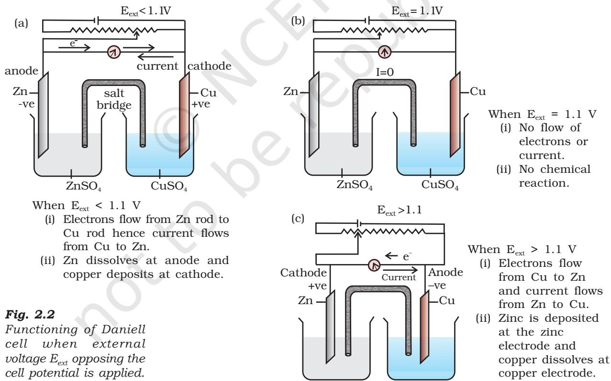

**Strictly speaking activity should be used instead of concentration. It is directly proportional to concentration. In dilute solutions, it is equal to concentration. You will study more about it in higher classes.*

Chemistry 32

### 2.2 Galvanic Cells

As mentioned earlier a galvanic cell is an electrochemical cell that converts the chemical energy of a spontaneous redox reaction into electrical energy. In this device the Gibbs energy of the spontaneous redox reaction is converted into electrical work which may be used for running a motor or other electrical gadgets like heater, fan, geyser, etc.

Daniell cell discussed earlier is one such cell in which the following redox reaction occurs.

Zn(s) + Cu2+(aq) ® Zn2+ (aq) + Cu(s)

This reaction is a combination of two half reactions whose addition gives the overall cell reaction:

| (i) | Cu2+ + 2e– | ® Cu(s) | (reduction half reaction) | (2.2) |
| --- | --- | --- | --- | --- |
| (ii) | Zn(s) ® Zn2+ + 2e– |  | (oxidation half reaction) | (2.3) |

These reactions occur in two different portions of the Daniell cell. The reduction half reaction occurs on the copper electrode while the oxidation half reaction occurs on the zinc electrode. These two portions of the cell are also called half-cells or redox couples. The copper electrode may be called the reduction half cell and the zinc electrode, the oxidation half-cell.

We can construct innumerable number of galvanic cells on the pattern of Daniell cell by taking combinations of different half-cells. Each halfcell consists of a metallic electrode dipped into an electrolyte. The two half-cells are connected by a metallic wire through a voltmeter and a switch externally. The electrolytes of the two half-cells are connected internally through a salt bridge as shown in Fig. 2.1. Sometimes, both the electrodes dip in the same electrolyte solution and in such cases we do not require a salt bridge.

At each electrode-electrolyte interface there is a tendency of metal ions from the solution to deposit on the metal electrode trying to make it positively charged. At the same time, metal atoms of the electrode have a tendency to go into the solution as ions and leave behind the electrons at the electrode trying to make it negatively charged. At equilibrium, there is a separation of charges and depending on the tendencies of the two opposing reactions, the electrode may be positively or negatively charged with respect to the solution. A potential difference develops between the electrode and the electrolyte which is called electrode potential. When the concentrations of all the species involved in a half-cell is unity then the electrode potential is known as standard electrode potential. According to IUPAC convention, standard reduction potentials are now called standard electrode potentials. In a galvanic cell, the half-cell in which oxidation takes place is called anode and it has a negative potential with respect to the solution. The other half-cell in which reduction takes place is called cathode and it has a positive potential with respect to the solution. Thus, there exists a potential difference between the two electrodes and as soon as the switch is in the *on* position the electrons flow from negative electrode to positive electrode. The direction of current flow is opposite to that of electron flow.

The potential difference between the two electrodes of a galvanic cell is called the *cell potential* and is measured in volts. The cell potential is the difference between the electrode potentials (reduction potentials) of the cathode and anode. It is called the cell electromotive force (emf) of the cell when no current is drawn through the cell. It is now an accepted convention that we keep the anode on the left and the cathode on the right while representing the galvanic cell. A galvanic cell is generally represented by putting a vertical line between metal and electrolyte solution and putting a double vertical line between the two electrolytes connected by a salt bridge. Under this convention the emf of the cell is positive and is given by the potential of the halfcell on the right hand side minus the potential of the half-cell on the left hand side i.e.,

$$E_{\mathrm{cell}}=\ E_{\mathrm{right}}\ -\ E_{\mathrm{left}}$$

This is illustrated by the following example:

Cell reaction:

Cu(s) + 2Ag${}^{+}$(aq) $\longrightarrow$ Cu${}^{2+}$(aq) + 2 Ag(s) (2.4)

Half-cell reactions:

Cathode (_reduction_): 2Ag${}^{+}$(aq) + 2e${}^{-}$ $\rightarrow$ 2Ag(s) (2.5)

Anode (_oxidation_): Cu(s) $\rightarrow$ Cu${}^{2+}$(aq) + 2e${}^{-}$ (2.6)

It can be seen that the sum of (3.5) and (3.6) leads to overall reaction (2.4) in the cell and that silver electrode acts as a cathode and copper electrode acts as an anode. The cell can be represented as:

Cu(s)|Cu^2+(aq)|Ag^+(aq)|Ag(s)|  
  
and we have $E_{\rm cell}=E_{\rm right}\stackrel{{\mbox{\scriptsize$\frown$}}}{{=}}E_{\rm left}=E_{\rm Ag^{+}|Ag}-E_{\rm Cu^{2+}|Cu}$ (2.7)

2.2.1 Measurement of Electrode Potential

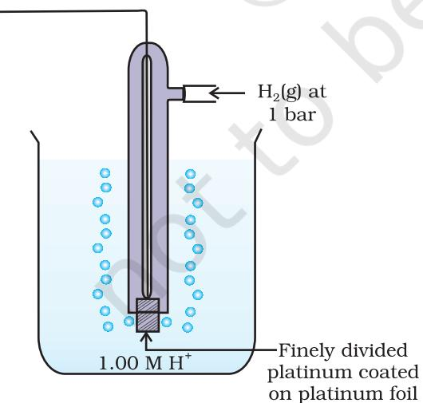

*Fig. 2.3: Standard Hydrogen Electrode (SHE).*

Chemistry 34

The potential of individual half-cell cannot be measured. We can measure only the difference between the two half-cell potentials that gives the emf of the cell. If we arbitrarily choose the potential of one electrode (half-cell) then that of the other can be determined with respect

to this. According to convention, a half-cell called standard hydrogen electrode (Fig.3.3) represented by Pt(s)ú H2 (g)ú H + (aq), is assigned a zero potential at all temperatures corresponding to the reaction

$$\mathrm{H^{+}\(aq)\,+\,e^{-}\ \rightarrow\ \ \frac{1}{2}\,H_{2}(g)}$$

The standard hydrogen electrode consists of a platinum electrode coated with platinum black. The electrode is dipped in an acidic solution and pure hydrogen gas is bubbled through it. The concentration of both the reduced and oxidised forms of hydrogen is maintained at unity (Fig. 2.3). This implies that the pressure of hydrogen gas is one bar and the concentration of hydrogen ion in the solution is one molar.

At 298 K the emf of the cell, standard hydrogen electrode ççsecond half-cell constructed by taking standard hydrogen electrode as anode (reference half-cell) and the other half-cell as cathode, gives the reduction potential of the other half-cell. If the concentrations of the oxidised and the reduced forms of the species in the right hand half-cell are unity, then the cell potential is equal to standard electrode potential, *E* o R of the given half-cell.

> *E* o = *E* o R – *E* o L

As *E* o L for standard hydrogen electrode is zero.

> *E* o = *E* o R – 0 = *E* o R

The measured emf of the cell:

Pt(s) ç H2 (g, 1 bar) ç H+ (aq, 1 M) çç Cu2+ (aq, 1 M) ú Cu

is 0.34 V and it is also the value for the standard electrode potential of the half-cell corresponding to the reaction:

> Cu2+ (aq, 1M) + 2 e– ® Cu(s)

Similarly, the measured emf of the cell:

Pt(s) ç H2 (g, 1 bar) ç H+ (aq, 1 M) çç Zn2+ (aq, 1M) ç Zn

is -0.76 V corresponding to the standard electrode potential of the half-cell reaction:

Zn2+ (aq, 1 M) + 2e– ® Zn(s)

The positive value of the standard electrode potential in the first case indicates that Cu2+ ions get reduced more easily than H+ ions. The reverse process cannot occur, that is, hydrogen ions cannot oxidise Cu (or alternatively we can say that hydrogen gas can reduce copper ion) under the standard conditions described above. Thus, Cu does not dissolve in HCl. In nitric acid it is oxidised by nitrate ion and not by hydrogen ion. The negative value of the standard electrode potential in the second case indicates that hydrogen ions can oxidise zinc (or zinc can reduce hydrogen ions).

In view of this convention, the half reaction for the Daniell cell in Fig. 2.1 can be written as:

Left electrode: Zn(s) ® Zn2+ (aq, 1 M) + 2 e–

Right electrode: Cu2+ (aq, 1 M) + 2 e– ® Cu(s)

The overall reaction of the cell is the sum of above two reactions and we obtain the equation:

> Zn(s) + Cu2+ (aq) ® Zn2+ (aq) + Cu(s) emf of the cell = *E* o cell = *E* o R – *E* o L = 0.34V – (– 0.76)V = 1.10 V

Sometimes metals like platinum or gold are used as inert electrodes. They do not participate in the reaction but provide their surface for oxidation or reduction reactions and for the conduction of electrons. For example, Pt is used in the following half-cells:

Hydrogen electrode: Pt(s)|H2 (g)| H+ (aq)

> With half-cell reaction: H+ (aq)+ e– ® ½ H2 (g) Bromine electrode: Pt(s)|Br2 (aq)| Br– (aq)

> > 35 Electrochemistry

With half-cell reaction: ½ Br2 (aq) + e– ® Br– (aq)

The standard electrode potentials are very important and we can extract a lot of useful information from them. The values of standard electrode potentials for some selected half-cell reduction reactions are given in Table 2.1. If the standard electrode potential of an electrode is greater than zero then its reduced form is more stable compared to hydrogen gas. Similarly, if the standard electrode potential is negative then hydrogen gas is more stable than the reduced form of the species. It can be seen that the standard electrode potential for fluorine is the highest in the Table indicating that fluorine gas (F2 ) has the maximum tendency to get reduced to fluoride ions (F– ) and therefore fluorine gas is the strongest oxidising agent and fluoride ion is the weakest reducing agent. Lithium has the lowest electrode potential indicating that lithium ion is the weakest oxidising agent while lithium metal is the most powerful reducing agent in an aqueous solution. It may be seen that as we go from top to bottom in Table 2.1 the standard electrode potential decreases and with this, decreases the oxidising power of the species on the left and increases the reducing power of the species on the right hand side of the reaction. Electrochemical cells are extensively used for determining the pH of solutions, solubility product, equilibrium constant and other thermodynamic properties and for potentiometric titrations.

#### Intext Questions

- 2.1 How would you determine the standard electrode potential of the system Mg2+|Mg?
- 2.2 Can you store copper sulphate solutions in a zinc pot?
- 2.3 Consult the table of standard electrode potentials and suggest three substances that can oxidise ferrous ions under suitable conditions.

### 2.3 Nernst Equation EquationEquation

We have assumed in the previous section that the concentration of all the species involved in the electrode reaction is unity. This need not be always true. Nernst showed that for the electrode reaction:

$$\mathrm{M^{n+}(a q)\,+\,n e^{-}\to M(s)}$$

the electrode potential at any concentration measured with respect to standard hydrogen electrode can be represented by:

$$E_{_\mathrm{(M^{n+}/M)}}=E_{_\mathrm{(M^{n+}/M)}}^{\mathrm{o}}\;-\;\;\frac{R T}{n F}\;\ln\frac{[\mathrm{M}]}{[\mathrm{M}^{n+}]}$$

but concentration of solid M is taken as unity and we have

$$E_{({\rm M}^{n+}\,/\,{\rm M})}=E_{({\rm M}^{n+}\,/\,{\rm M})}^{\circ}\,-\,\frac{RT}{nF}\,\,\ln\frac{1}{[{\rm M}^{n+}]}\tag{2.8}$$

( ) n+ o M / M *E* has already been defined, *R* is gas constant (8.314 JK–1 mol–1), *F* is Faraday constant (96487 C mol–1), *T* is temperature in kelvin and [Mn+] is the concentration of the species, Mn+ .

Chemistry 36

#### Table 2.1: Standard Electrode Potentials at 298 K

Ions are present as aqueous species and H2O as liquid; gases and solids are shown by g and s.

|  | Reaction (Oxidised form + ne– | ® Reduced form) | E o/V |
| --- | --- | --- | --- |
|  | F2(g) + 2e– | ® 2F– | 2.87 |
|  | Co3+ + e– | ® Co2+ | 1.81 |
|  | + 2e– H2O2 + 2H+ | ® 2H 2O | 1.78 |
|  | – MnO4 + 8H+ + 5e– | ® Mn2+ + 4H 2O | 1.51 |
|  | Au3+ + 3e– | ® Au(s) | 1.40 |
|  | Cl2(g) + 2e– | ® 2Cl– | 1.36 |
|  | 2– + 14H+ + 6e– Cr2O7 | ® 2Cr3+ + 7H 2O | 1.33 |
|  | + 4e– O2(g) + 4H+ | ® 2H 2O | 1.23 |
|  | MnO2(s) + 4H+ + 2e– | ® Mn2+ + 2H 2O | 1.23 |
|  | Br2 + 2e– | ® 2Br– | 1.09 |
|  | – + 4H+ + 3e– NO3 | ® NO(g) + 2H 2O | 0.97 |
|  | 2Hg2+ + 2e– | ® Hg 2+ 2 | 0.92 |
|  | Ag+ + e– | ® Ag(s) | 0.80 |
|  | Fe3+ + e– | ® Fe2+ | 0.77 |
|  | O2(g) + 2H+ + 2e– | ® H 2O2 | 0.68 |
|  | I2 + 2e– | ® 2I– | 0.54 |
|  | Cu+ + e– | ® Cu(s) | 0.52 |
| Increasing strength of oxidising agent | Cu2+ + 2e– | ® Cu(s) | 0.34 Increasing strength of reducing agent |
|  | AgCl(s) + e– | ® Ag(s) + Cl– | 0.22 |
|  | AgBr(s) + e– | ® Ag(s) + Br– | 0.10 |
|  | 2H+ + 2e– | ® H2(g) | 0.00 |
|  | Pb2+ + 2e– | ® Pb(s) | –0.13 |
|  | Sn2+ + 2e– | ® Sn(s) | –0.14 |
|  | Ni2+ + 2e– | ® Ni(s) | –0.25 |
|  | Fe2+ + 2e– | ® Fe(s) | –0.44 |
|  | Cr3+ + 3e– | ® Cr(s) | –0.74 |
|  | Zn2+ + 2e– | ® Zn(s) | –0.76 |
|  | 2H2O + 2e– | ® H2(g) + 2OH– (aq) | –0.83 |
|  | Al3+ + 3e– | ® Al(s) | –1.66 |
|  | Mg2+ + 2e– | ® Mg(s) | –2.36 |
|  | Na+ + e– | ® Na(s) | –2.71 |
|  | Ca2+ + 2e– | ® Ca(s) | –2.87 |
|  | + + e– K | ® K(s) | –2.93 |
|  | Li+ + e– | ® Li(s) | –3.05 |

1. A negative *E* o means that the redox couple is a stronger reducing agent than the H+/H2 couple. 2. A positive *E* o means that the redox couple is a weaker reducing agent than the H+/H2 couple.

In Daniell cell, the electrode potential for any given concentration of Cu2+ and Zn2+ ions, we write

For Cathode:

$$E_{({\rm Cu}^{2+}\,/\,{\rm Cu})}=E_{({\rm Cu}^{2+}\,/\,{\rm Cu})}^{o}\,-\,\frac{RT}{2F}\,\ln\frac{1}{\left[{\rm Cu}^{2+}\,({\rm aq})\right]}\tag{2.9}$$

For Anode:

$$E_{(\rm Zn^{2+}\,/Zn)}=E_{(\rm Zn^{2+}\,/Zn)}^{0}\,-\,\frac{RT}{2F}\,\ln\frac{1}{\left[\rm Zn^{2+}\,(aq)\right]}\tag{2.10}$$

The cell potential, *E*(cell) = 2 Cu /Cu *E* – 2 Zn /Zn *E*

= ( ) 2+ o Cu /Cu *E* – *RT* 2*F* ln 2+ 1 Cu (aq) – ( ) 2+ o Zn / Zn *E* + *RT* 2*F* ln 2+ 1 Zn (aq) = ( ) 2+ o Cu /Cu *E* – ( ) 2+ o Zn / Zn *E* – *RT* 2*F* 2+ 2+ 1 1 ln – ln Cu aq Zn aq *E*(cell) = ( ) o *E* cell – *RT* 2*F* ln [ ] + [ ] 2 Zn 2 Cu (2.11)

It can be seen that *E*(cell) depends on the concentration of both Cu2+ and Zn2+ ions. It increases with increase in the concentration of Cu2+ ions and decrease in the concentration of Zn2+ ions.

By converting the natural logarithm in Eq. (2.11) to the base 10 and substituting the values of *R*, *F* and *T* = 298 K, it reduces to

$$E_{\rm[cell]}=E_{\rm[cell]}^{0}-\frac{0.059}{2}\log\frac{[{\rm Zn}^{2}+]}{[{\rm Cu}^{2}+]}\tag{2.12}$$

We should use the same number of electrons (*n*) for both the electrodes and thus for the following cell

> Ni(s)ú Ni2+(aq) úú Ag+ (aq)ú Ag

The cell reaction is Ni(s) + 2Ag+ (aq) ® Ni2+(aq) + 2Ag(s) The Nernst equation can be written as

$$E_{\mathrm{(cell)}}\;=\;\stackrel{\mathrm{\Large{\circ}}}{E_{\mathrm{(cell)}}}\;-\;\frac{R T}{2F}\;\ln\;\frac{[\mathrm{Ni}^{2+}]}{[\mathrm{Ag}^{+}]^{2}}$$

and for a general electrochemical reaction of the type:

a A + bB *ne*– cC + dD

Nernst equation can be written as:

*E*(cell) = ( ) o *E* cell – *RT nF* 1nQ = ( ) o *E* cell – *RT nF* ln [C] [D] [A] [B] c d a b (2.13)

Chemistry 38

Represent the cell in which the following reaction takes place Example 2.1 Example 2.1Example 2.1 Mg(s) + 2Ag+ (0.0001M) ® Mg2+(0.130M) + 2Ag(s) Calculate its *E*(cell) if ( ) o *E* cell = 3.17 V. The cell can be written as Mgú Mg2+(0.130M)úú Ag+ (0.0001M)ú Ag *E* cell *=* ( ) + + 2 o cell 2 RT Mg – ln 2F Ag *E* = 3.17 V – 0 059 2 0 0001 2 . log ( . ) *V* 0.130 = 3.17 V – 0.21V = 2.96 V. SolutionSolution Solution

2.3.1 Equilibrium Constant from Nernst Equation

If the circuit in Daniell cell (Fig. 2.1) is closed then we note that the reaction

Zn(s) + Cu2+(aq) ® Zn2+(aq) + Cu(s) (2.1) takes place and as time passes, the concentration of Zn2+ keeps on increasing while the concentration of Cu2+ keeps on decreasing. At the same time voltage of the cell as read on the voltmeter keeps on decreasing. After some time, we shall note that there is no change in the concentration of Cu2+ and Zn2+ ions and at the same time, voltmeter gives zero reading. This indicates that equilibrium has been attained. In this situation the Nernst equation may be written as:

$$E_{\rm(cell)}=0=E_{\rm(cell)}^{\rm o}=2.303RT\log\frac{[{\rm Zn}^{2+}]}{[{\rm Cu}^{2+}]}

or E_{\rm(cell)}^{\rm o}=2.303RT\log\frac{[{\rm Zn}^{2+}]}{[{\rm Cu}^{2+}]}$$

But at equilibrium,

[ ] [ ] Zn Cu 2 2 + + = *Kc* for the reaction 2.1

and at T = 298K the above equation can be written as

$E_{\rm(cell)}^{\rm o}=\frac{0.059\;\rm V}{2}\;\log\;K_{\rm C}=1.1\;\rm V$ ($E_{\rm(cell)}^{\rm o}=1.1\rm V$) $\log\;K_{\rm C}=\frac{(1.1\rm V\times2)}{0.059\;\rm V}=37.288$ $\rm K_{\rm C}=2\times10^{37}\;\rm at\;298K$.  
  

In general,

$$E^{\circ}_{\rm(cell)}\ =\ \frac{2.303RT}{nF}\ \log\ K_{C}\tag{2.14}$$

Thus, Eq. (2.14) gives a relationship between equilibrium constant of the reaction and standard potential of the cell in which that reaction takes place. Thus, equilibrium constants of the reaction, difficult to measure otherwise, can be calculated from the corresponding *E* o value of the cell.

| Example 2.2 | Example 2.2 | Example 2.2 | Calculate the equilibrium constant of the reaction: | (aq) ® Cu2+(aq) + 2Ag(s) | Cu(s) + 2Ag+ |  |  |  |  |  |  |  |
| --- | --- | --- | --- | --- | --- | --- | --- | --- | --- | --- | --- | --- |
| o E | cell = 0.46 V | ) | ( | . |  |  |  |  |  |  |  |  |
| 0 059 | V log K | o E | Solution | Solution | Solution | = | = 0.46 V or | ) | ( | C | cell | 2 |
| . | 0 46 | 2 | × | V | KC | log | = | = 15.6 | . | 0 059 | V |  |
| KC | = 3.92 × 1015 |  |  |  |  |  |  |  |  |  |  |  |

2.3.2 Electrochemical Cell and Gibbs Energy of the Reaction Electrical work done in one second is equal to electrical potential multiplied by total charge passed. If we want to obtain maximum work from a galvanic cell then charge has to be passed reversibly. The reversible work done by a galvanic cell is equal to decrease in its Gibbs energy and therefore, if the emf of the cell is *E* and *nF* is the amount of charge passed and Dr*G* is the Gibbs energy of the reaction, then

D*rG* = – *nFE*(cell) (2.15)

It may be remembered that *E*(cell) is an intensive parameter but Dr*G* is an extensive thermodynamic property and the value depends on *n*. Thus, if we write the reaction

Zn(s) + Cu${}^{2+}$(aq) $\rightarrow$ Zn${}^{2+}$(aq) + Cu(s) (2.1) $\Delta_{\rm r}G$ = - 2$F\!E_{\rm[cell]}^{\rm f}$

but when we write the reaction

2 Zn (s) + 2 Cu2+(aq) ¾®2 Zn2+(aq) + 2Cu(s)

* [16] A. A. K.  
  

If the concentration of all the reacting species is unity, then *E*(cell) = ( ) o *E* cell and we have

$\left(\begin{array}{c}\includegraphics[height=36.135pt]{0.0pt}\end{array}\right)$

Thus, from the measurement of ( ) o *E* cell we can obtain an important thermodynamic quantity, Dr*G* o , standard Gibbs energy of the reaction. From the latter we can calculate equilibrium constant by the equation:

> Dr*G* o = –*RT* ln *K*.

The standard electrode potential for Daniell cell is 1.1V. Calculate the standard Gibbs energy for the reaction: Zn(s) + Cu2+(aq) ¾® Zn2+(aq) + Cu(s) Dr*G* o = – *nF* o E(cell) *n* in the above equation is 2, F = 96487 C mol –1 and ( ) o E cell *=* 1.1 V Therefore, Dr*G* o = – 2 × 1.1V × 96487 C mol –1 = – 21227 J mol–1 = – 212.27 kJ mol–1 Example 2.3 Example 2.3Example 2.3 Solution SolutionSolution

Chemistry 40

### Intext Questions

- 2.4 Calculate the potential of hydrogen electrode in contact with a solution whose pH is 10.
- 2.5 Calculate the emf of the cell in which the following reaction takes place: Ni(s) + 2Ag+ (0.002 M) ® Ni2+ (0.160 M) + 2Ag(s)

Given that o *E*cell = 1.05 V

- 2.6 The cell in which the following reaction occurs:
( ) ( ) ( ) ( ) + − + + → + 3 2 2Fe 2I 2Fe I aq aq aq 2 s has o *E*cell = 0.236 V at 298 K. Calculate the standard Gibbs energy and the equilibrium constant of the cell reaction.

## 2.4 Conductance ConductanceConductance of Electrolytic Solutions SolutionsSolutions

It is necessary to define a few terms before we consider the subject of conductance of electricity through electrolytic solutions. The electrical resistance is represented by the symbol *'R'* and it is measured in ohm (W) which in terms of SI base units is equal to (kg m2 )/(*S* 3 *A* 2 ). It can be measured with the help of a Wheatstone bridge with which you are familiar from your study of physics. The electrical resistance of any object is directly proportional to its length, *l*, and inversely proportional to its area of cross section, *A*. That is,

$R\propto\frac{1}{A}$ or $R=\rho\frac{1}{A}$ (2.17)

The constant of proportionality, r (Greek, rho), is called resistivity (specific resistance). Its SI units are ohm metre (W m) and quite often its submultiple, ohm centimetre (W cm) is also used. IUPAC recommends the use of the term resistivity over specific resistance and hence in the rest of the book we shall use the term resistivity. Physically, the resistivity for a substance is its resistance when it is one metre long and its area of cross section is one m2 . It can be seen that:

1 W m = 100 W cm or 1 W cm = 0.01 W m

The inverse of resistance, *R*, is called conductance, *G*, and we have the relation:

$$G=\frac{1}{R}=\frac{\rm A}{\rho l}=\kappa\frac{\rm A}{l}\tag{2.18}$$

The SI unit of conductance is siemens, represented by the symbol 'S' and is equal to ohm–1 (also known as mho) or W –1. The inverse of resistivity, called conductivity (specific conductance) is represented by the symbol, k (Greek, kappa). IUPAC has recommended the use of term conductivity over specific conductance and hence we shall use the term conductivity in the rest of the book. The SI units of conductivity are S m–1 but quite often, k is expressed in S cm–1. Conductivity of a material in S m–1 is its conductance when it is 1 m long and its area of cross section is 1 m2 . It may be noted that 1 S cm–1 = 100 S m–1 .

41 Electrochemistry

| Material | Conductivity/ | Material | Conductivity/ |
| --- | --- | --- | --- |
|  | S m–1 |  | S m–1 |
| Conductors |  | Aqueous Solutions |  |
| Sodium | 2.1×103 | Pure water | 3.5×10–5 |
| Copper | 5.9×103 | 0.1 M HCl | 3.91 |
| Silver | 6.2×103 | 0.01M KCl | 0.14 |
| Gold | 4.5×103 | 0.01M NaCl | 0.12 |
| Iron | 1.0×103 | 0.1 M HAc | 0.047 |
| Graphite | 1.2×10 | 0.01M HAc | 0.016 |
| Insulators |  | Semiconductors |  |
| Glass | 1.0×10–16 | CuO | 1×10–7 |
| Teflon | 1.0×10–18 | Si | 1.5×10–2 |
|  |  | Ge | 2.0 |

#### Table 2.2: The values of Conductivity of some Selected Materials at 298.15 K

It can be seen from Table 2.2 that the magnitude of conductivity varies a great deal and depends on the nature of the material. It also depends on the temperature and pressure at which the measurements are made. Materials are classified into conductors, insulators and semiconductors depending on the magnitude of their conductivity. Metals and their alloys have very large conductivity and are known as conductors. Certain non-metals like carbon-black, graphite and some organic polymers* are also electronically conducting. Substances like glass, ceramics, etc., having very low conductivity are known as insulators. Substances like silicon, doped silicon and gallium arsenide having conductivity between conductors and insulators are called semiconductors and are important electronic materials. Certain materials called superconductors by definition have zero resistivity or infinite conductivity. Earlier, only metals and their alloys at very low temperatures (0 to 15 K) were known to behave as superconductors, but nowadays a number of ceramic materials and mixed oxides are also known to show superconductivity at temperatures as high as 150 K.

Electrical conductance through metals is called metallic or electronic conductance and is due to the movement of electrons. The electronic conductance depends on

- (i) the nature and structure of the metal
- (ii) the number of valence electrons per atom
- (iii) temperature (it decreases with increase of temperature).

***** *Electronically conducting polymers – In 1977 MacDiarmid, Heeger and Shirakawa discovered that acetylene gas can be polymerised to produce a polymer, polyacetylene when exposed to vapours of iodine acquires metallic lustre and conductivity. Since then several organic conducting polymers have been made such as polyaniline, polypyrrole and polythiophene. These organic polymers which have properties like metals, being composed wholly of elements like carbon, hydrogen and occasionally nitrogen, oxygen or sulphur, are much lighter than normal metals and can be used for making light-weight batteries. Besides, they have the mechanical properties of polymers such as flexibility so that one can make electronic devices such as transistors that can bend like a sheet of plastic. For the discovery of conducting polymers, MacDiarmid, Heeger and Shirakawa were awarded the Nobel Prize in Chemistry for the year 2000.*

As the electrons enter at one end and go out through the other end, the composition of the metallic conductor remains unchanged. The mechanism of conductance through semiconductors is more complex.

We already know that even very pure water has small amounts of hydrogen and hydroxyl ions (~10–7M) which lend it very low conductivity (3.5 × 10–5 S m–1). When electrolytes are dissolved in water, they furnish their own ions in the solution hence its conductivity also increases. The conductance of electricity by ions present in the solutions is called electrolytic or ionic conductance. The conductivity of electrolytic (ionic) solutions depends on:

- (i) the nature of the electrolyte added
- (ii) size of the ions produced and their solvation
- (iii) the nature of the solvent and its viscosity
- (iv) concentration of the electrolyte
- (v) temperature (it increases with the increase of temperature).

Passage of direct current through ionic solution over a prolonged period can lead to change in its composition due to electrochemical reactions (Section 2.4.1).

We know that accurate measurement of an unknown resistance can be performed on a Wheatstone bridge. However, for measuring the resistance of an ionic solution we face two problems. Firstly, passing direct current (DC) changes the composition of the solution. Secondly, a solution cannot be connected to the bridge like a metallic wire or other solid conductor. The first difficulty is resolved by using an alternating current (AC) source of power. The second problem is solved by using a specially designed vessel called conductivity cell. It is available in several designs and two simple ones are shown in Fig. 2.4. 2.4.1 Measurement of the Conductivity of Ionic Solutions

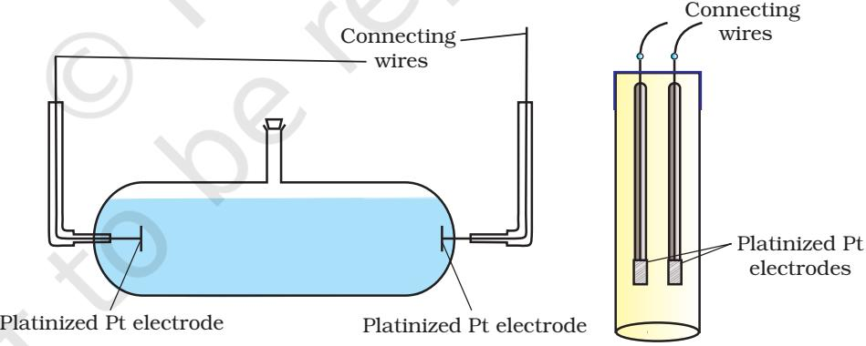

*Fig. 2.4 Two different types of conductivity cells.*

> Basically it consists of two platinum electrodes coated with platinum black (finely divided metallic Pt is deposited on the electrodes electrochemically). These have area of cross section equal to '*A*' and are separated by distance '*l*'. Therefore, solution confined between these electrodes is a column of length *l* and area of cross section *A*. The resistance of such a column of solution is then given by the equation:

$$R=\rho\ \frac{l}{A}=\frac{l}{\kappa A}\tag{2.17}$$

43 Electrochemistry

The quantity *l*/*A* is called cell constant denoted by the symbol, *G**. It depends on the distance between the electrodes and their area of cross-section and has the dimension of length–1 and can be calculated if we know *l* and *A*. Measurement of *l* and *A* is not only inconvenient but also unreliable. The cell constant is usually determined by measuring the resistance of the cell containing a solution whose conductivity is already known. For this purpose, we generally use KCl solutions whose conductivity is known accurately at various concentrations (Table 2.3) and at different temperatures. The cell constant, *G**, is then given by the equation:

$G^{*}=\frac{l}{A}=$ R $\kappa$

#### Table 2.3: Conductivity and Molar conductivity of KCl solutions at 298.15K

| Concentration/Molarity |  |  | Conductivity | Molar Conductivity |  |
| --- | --- | --- | --- | --- | --- |
| mol L–1 | mol m–3 | S cm–1 | S m–1 | S cm2mol–1 | S m2 mol–1 |
| 1.000 | 1000 | 0.1113 | 11.13 | 111.3 | 111.3×10–4 |
| 0.100 | 100.0 | 0.0129 | 1.29 | 129.0 | 129.0×10–4 |
| 0.010 | 10.00 | 0.00141 | 0.141 | 141.0 | 141.0×10–4 |

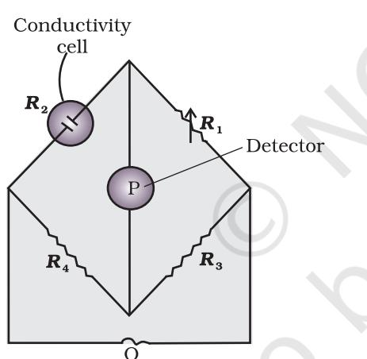

Once the cell constant is determined, we can use it for measuring the resistance or conductivity of any solution. The set up for the measurement of the resistance is shown in Fig. 2.5.

It consists of two resistances *R*3 and *R*4 , a variable resistance *R*1 and the conductivity cell having the unknown resistance *R*2 . The Wheatstone bridge is fed by an oscillator O (a source of a.c. power in the audio frequency range 550 to 5000 cycles per second). P is a suitable detector (a headphone or other electronic device) and the bridge is balanced when no current passes through the detector. Under these conditions:

Unknown resistance $R_2$ = $\frac{\text{R}_1\text{R}_4}{\text{R}_3}$ (2.19)

These days, inexpensive conductivity meters are available which can directly read the conductance or resistance of the solution in the conductivity cell. Once the cell constant and the resistance of the solution in the cell is determined, the conductivity of the solution is given by the equation:

$$\kappa=\frac{\text{cell constant}}{\text{R}}=\frac{\text{G}^{\star}}{\text{R}}\tag{2.20}$$

The conductivity of solutions of different electrolytes in the same solvent and at a given temperature differs due to charge and size of the

Chemistry 44

ions in which they dissociate, the concentration of ions or ease with which the ions move under a potential gradient. It, therefore, becomes necessary to define a physically more meaningful quantity called molar conductivity denoted by the symbol L*m* (Greek, lambda). It is related to the conductivity of the solution by the equation:

Molar conductivity = $\Lambda_{m}=\frac{K}{C}$ (2.21)

In the above equation, if k is expressed in S m–1 and the concentration, c in mol m–3 then the units of L*m* are in S m2 mol–1. It may be noted that: 1 mol m–3 = 1000(L/m3 ) × molarity (mol/L), and hence

$$\Lambda_{m}\mathrm{{\{S~cm^{2}~mol^{-1}\}}=\frac{\kappa~(S~c m^{-1})}{1000~L~m^{-3}~\times~m o l a r t y~(m o l~L^{-1})}}$$

If we use S cm–1 as the units for k and mol cm–3, the units of concentration, then the units for L*m* are S cm2 mol–1. It can be calculated by using the equation:

$\Lambda_{m}$(S cm${}^{2}$ mol${}^{-1}$) = $\frac{\kappa$ (S cm${}^{-1}$) x 1000 (cm${}^{3}$ / L) = $\frac{\kappa}{\rm{}}$ (S cm${}^{-1}$) x 1000 (cm${}^{3}$ / L) = $\frac{\kappa}{\rm{}}$ (S cm${}^{-1}$) x 1000 (cm${}^{3}$ / L) = $\frac{\kappa}{\rm{}}$ (S cm${}^{-1}$) x 1000 (cm${}^{3}$ / L) = $\frac{\kappa}{\rm{}}$ (S cm${}^{-1}$) x 1000 (cm${}^{3}$ / L) = $\frac{\kappa}{\rm{}}$ (S cm${}^{-1}$) x 1000 (cm${}^{3}$ / L) = \(\frac{\kappa}{\rm{}}\

Both type of units are used in literature and are related to each other by the equations:

.

  
  
## 1 S m${}^{2}$mol${}^{-1}$ = 10${}^{4}$ S cm${}^{2}$mol${}^{-1}$

1 S cm2mol–1 = 10–4 S m2mol–1

Resistance of a conductivity cell filled with 0.1 mol L–1 KCl solution is 100 W. If the resistance of the same cell when filled with 0.02 mol L–1 KCl solution is 520 W, calculate the conductivity and molar conductivity of 0.02 mol L–1 KCl solution. The conductivity of 0.1 mol L–1 KCl solution is 1.29 S/m. The cell constant is given by the equation: Cell constant = *G** = conductivity × resistance = 1.29 S/m × 100 W = 129 m–1 = 1.29 cm–1 Conductivity of 0.02 mol L–1 KCl solution = cell constant / resistance = * *G R* = –1 129 m 520 = 0.248 S m–1 Concentration = 0.02 mol L–1 = 1000 × 0.02 mol m–3 = 20 mol m–3 Molar conductivity = *m c* = –3 –1 –3 248 × 10 S m 20 mol m = 124 × 10–4 S m2mol–1 Alternatively, k = –1 1.29 cm 520 = 0.248 × 10–2 S cm–1 Example 2.4 Example 2.4Example 2.4

Solution SolutionSolution

45 Electrochemistry

- and L*m* = k × 1000 cm3 L–1 molarity–1 –2 –1 3 –1 –1 0.248×10 S cm ×1000 cm L = 0.02 mol L = 124 S cm2 mol–1
The electrical resistance of a column of 0.05 mol L–1 NaOH solution of diameter 1 cm and length 50 cm is 5.55 × 103 ohm. Calculate its resistivity, conductivity and molar conductivity. Example 2.5 Example 2.5Example 2.5

> *A* = p *r* 2 = 3.14 × 0.52 cm2 = 0.785 cm2 = 0.785 × 10–4 m2 *l* = 50 cm = 0.5 m = *l R A* or 3 2 5.55 10 0.785cm 50cm *RA l* = 87.135 W cm Conductivity = 1 = = 1 87.135 S cm–1 = 0.01148 S cm–1 Molar conductivity, *m =* × 1000 c cm3 L –1 Solution SolutionSolution

0.01148 S cm${}^{-1}$ x1000 cm${}^{3}$ L${}^{-1}$  
  
0.05 mol L${}^{-1}$  
  
229.6 S cm${}^{2}$ mol${}^{-1}$

If we want to calculate the values of different quantities in terms of 'm' instead of 'cm',

 = *RA l* = 3 –4 2 5.55 × 10 × 0.785×10 m 0.5 m = 87.135 ×10–2 W m 1 = = 100 m 87.135 = 1.148 S m–1 and *m* = *c* = –1 –3 1.148 S m 50 mol m = 229.6 × 10–4 S m2 mol–1 .

- 2.4.2 Variation of Conductivity and Molar Conductivity with Concentration
Both conductivity and molar conductivity change with the concentration of the electrolyte. Conductivity always decreases with decrease in concentration both, for weak and strong electrolytes. This can be explained by the fact that the number of ions per unit volume that carry the current in a solution decreases on dilution. The conductivity of a solution at any given concentration is the conductance of one unit volume of solution kept between two platinum electrodes with unit area of cross section and at a distance of unit length. This is clear from the equation:

 = = *A G l* (both *A* and *l* are unity in their appropriate units in m or cm)

Molar conductivity of a solution at a given concentration is the conductance of the volume *V* of solution containing one mole of electrolyte kept between two electrodes with area of cross section *A* and distance of unit length. Therefore,

$$A_{_{m}}={\frac{\kappa A}{l}}=\kappa\tau$$

Since *l =* 1 and *A* = *V* ( volume containing 1 mole of electrolyte) L

in

*m* = k

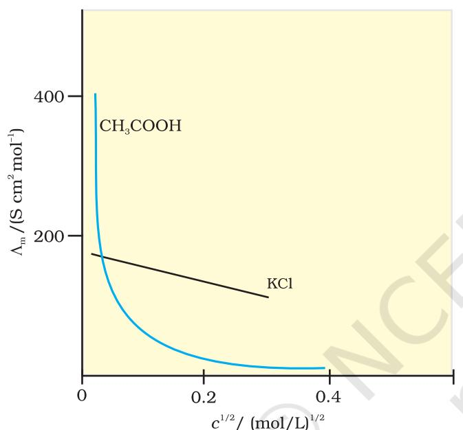

*Fig. 2.6: Molar conductivity versus c½ for acetic acid (weak electrolyte) and potassium chloride (strong electrolyte) in aqueous solutions.*

#### *Strong Electrolytes*

Molar conductivity increases with decrease in concentration. This is because the total volume, *V*, of solution containing one mole of electrolyte also increases. It has been found that decrease k on dilution of a solution is more than compensated by increase in its volume. Physically, it means that at a given concentration, L*m* can be defined as the conductance of the electrolytic solution kept between the electrodes of a conductivity cell at unit distance but

*V* (2.22)

having area of cross section large enough to accommodate sufficient volume of solution that contains one mole of the electrolyte. When concentration approaches zero, the molar conductivity is known as limiting molar conductivity and is represented by the symbol L° *m*. The variation in L*m* with concentration is different (Fig. 2.6) for strong and weak electrolytes.

For strong electrolytes, L*m* increases slowly with dilution and can be represented by the equation:

$\Lambda_{m}=\Lambda_{m}^{\circ}-A\ c^{\ \nicefrac{{1}}{{2}}}$ (2.23)

It can be seen that if we plot (Fig. 2.6) L*m* against *c* 1/2, we obtain a straight line with intercept equal to L° *m* and slope equal to '–*A*'. The value of the constant '*A*' for a given solvent and temperature depends on the type of electrolyte i.e., the charges on the cation and anion produced on the dissociation of the electrolyte in the solution. Thus, NaCl, CaCl2 , MgSO4 are known as 1-1, 2-1 and 2-2 electrolytes respectively. All electrolytes of a particular type have the same value for '*A*'.

The molar conductivity of KCl solutions at different concentrations at 298 K are given below: Example 2.6

| c/mol L–1 | L m | /S cm2 | mol–1 |
| --- | --- | --- | --- |
| 0.000198 |  | 148.61 |  |
| 0.000309 |  | 148.29 |  |
| 0.000521 |  | 147.81 |  |
| 0.000989 |  | 147.09 |  |

Show that a plot between L*m* and *c* 1/2 is a straight line. Determine the values of L° *m* and A for KCl.

Taking the square root of concentration we obtain: Solution SolutionSolution

| c | 1/2/(mol L–1 )1/2 | L m/S cm2mol–1 |
| --- | --- | --- |
|  | 0.01407 | 148.61 |
|  | 0.01758 | 148.29 |
|  | 0.02283 | 147.81 |
|  | 0.03145 | 147.09 |

A plot of L*m* ( y-axis) and c1/2 (*x*-axis) is shown in (Fig. 3.7).

It can be seen that it is nearly a straight line. From the intercept (*c* 1/2 = 0), we find that

L° *m* = 150.0 S cm2 mol–1 and

*A* = – slope = 87.46 S cm2 mol–1/(mol/L–1) 1/2 .

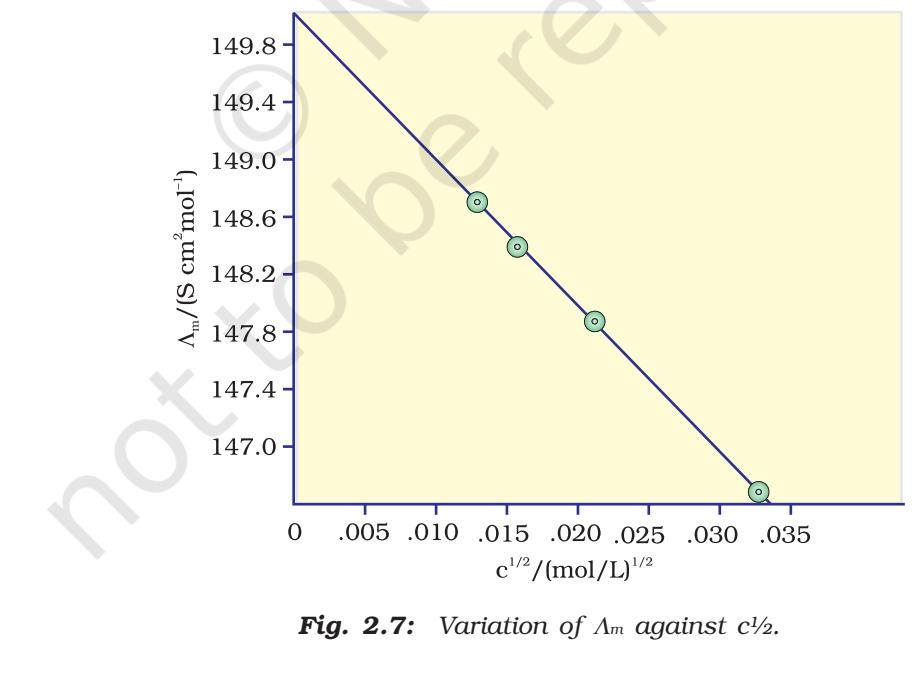

Chemistry 48

Kohlrausch examined L ° *m* values for a number of strong electrolytes and observed certain regularities. He noted that the difference in L° *m* of the electrolytes NaX and KX for any X is nearly constant. For example at 298 K:

$$\begin{array}{l}{{A_{m_{\mathrm{\tiny~(KCl)}}}^{\circ}-\,A_{m_{\mathrm{\tiny~(NaCl)}}}^{\circ}=\,A_{m_{\mathrm{\tiny~(KBr)}}}^{\circ}-\,A_{m_{\mathrm{\tiny~(NaBr)}}}^{\circ}}}\\ {{=\,A_{m_{\mathrm{\tiny~(KCl)}}}^{\circ}-\,A_{m_{\mathrm{\tiny~(NaCl)}}}^{\circ}\simeq\mathrm{23.4\,\,\,S\,\,cm^{2}\,\,\,mol^{-1}}}}\end{array}$$

and similarly it was found that

$$\Lambda_{m_{\mathrm{\tiny~(NaBr)}}}^{\circ}\,\Lambda_{m_{\mathrm{\tiny~(NaCl)}}}^{\circ}=\Lambda_{m_{\mathrm{\tiny~(KBr)}}}^{\circ}-\Lambda_{m_{\mathrm{\tiny~(KCl)}}}^{\circ}\simeq1.8\mathrm{\boldmath~S~cm}^{2}\mathrm{~mol}^{-1}$$

On the basis of the above observations he enunciated Kohlrausch law of independent migration of ions. The law states that *limiting molar conductivity of an electrolyte can be represented as the sum of the individual contributions of the anion and cation of the electrolyte. Thus, if* l ° *Na* + *and* l ° *Cl* –  *are limiting molar conductivity* of the sodium and chloride ions respectively, then the limiting molar conductivity for sodium chloride is given by the equation:

$$\begin{array}{l}\mbox{\small\hat{A}^{\circ}_{\rm m}}\left({\rm NaCl}\right)=\mbox{\small\hat{A}^{\circ}_{\rm Na}}^{+}+\mbox{\small\hat{A}^{\circ}_{\rm Cl}}-\\ \mbox{\small\hat{A}^{\circ}_{\rm m}}\left({\rm NaCl}\right)=\mbox{\small\hat{A}^{\circ}_{\rm Na}}^{+}+\mbox{\small\hat{A}^{\circ}_{\rm Cl}}-\\ \mbox{\small\hat{A}^{\circ}_{\rm m}}\left({\rm NaCl}\right)=\mbox{\small\hat{A}^{\circ}_{\rm Na}}^{+}+\mbox{\small\hat{A}^{\circ}_{\rm Cl}}-\\ \mbox{\small\hat{A}^{\circ}_{\rm m}}\left({\rm NaCl}\right)=\mbox{\small\hat{A}^{\circ}_{\rm Na}}^{+$$

In general, if an electrolyte on dissociation gives n*+* cations and n*–* anions then its limiting molar conductivity is given by:

$$\Lambda_{m}^{\circ}=\nu_{+}\,\lambda_{+}^{\circ}+\nu_{-}\,\lambda_{-}^{\circ}\tag{2.25}$$

Here, l ° + and l ° – are the limiting molar conductivities of the cation and anion respectively. The values of l ° for some cations and anions at 298 K are given in Table 2.4.

#### Table 2.4: Limiting Molar Conductivity for some Ions in Water at 298 K

| Ion | l 0/(S cm2mol–1) | Ion | l 0/(S cm2 mol–1) |
| --- | --- | --- | --- |
| H+ | 349.6 | OH– | 199.1 |
| Na+ | 50.1 | Cl– | 76.3 |
| K+ | 73.5 | Br– | 78.1 |
| Ca2+ | 119.0 | CH3COO– | 40.9 |
| Mg2+ | 106.0 | 2 SO4 | 160.0 |

#### *Weak Electrolytes*

Weak electrolytes like acetic acid have lower degree of dissociation at higher concentrations and hence for such electrolytes, the change in L*m* with dilution is due to increase in the degree of dissociation and consequently the number of ions in total volume of solution that contains 1 mol of electrolyte. In such cases L*m* increases steeply (Fig. 2.6) on dilution, especially near lower concentrations. Therefore, L ° *m* cannot be obtained by extrapolation of L*m* to zero concentration. At infinite dilution (i.e., concentration *c* ® zero) electrolyte dissociates completely (a =1), but at such low concentration the conductivity of the solution is so low that it cannot be measured accurately. Therefore, L ° *m* for weak electrolytes is obtained by using Kohlrausch law of independent migration of ions (Example 2.8). At any concentration *c*, if a is the degree of dissociation then it can be approximated to the ratio of molar conductivity L*m* at the concentration c to limiting molar conductivity, L 0 *m*. Thus we have:

$$\alpha=\frac{A_{\rm m}}{A_{\rm m}^{*}}\tag{2.26}$$

But we know that for a weak electrolyte like acetic acid (Class XI, Unit 7),

$$K_{\bf a}=\frac{c\alpha^{2}}{\left(1-\alpha\right)}=\frac{c\Lambda_{m}^{2}}{{A_{m}^{\circ}}^{2}\left(1-\frac{A_{m}}{A_{m}^{\circ}}\right)}=\frac{c\Lambda_{m}^{2}}{A_{m}^{\circ}\left(A_{m}^{\circ}-A_{m}\right)}\tag{2.27}$$

#### *Applications of Kohlrausch law*

Using Kohlrausch law of independent migration of ions, it is possible to calculate L 0 *m* for any electrolyte from the l o of individual ions. Moreover, for weak electrolytes like acetic acid it is possible to determine the value of its dissociation constant once we know the L 0 *m* and L*m* at a given concentration *c*.

| Example 2.7 Example 2.7 Example 2.7 | 0 L Calculate from the data given in Table 3.4. m for CaCl2 and MgSO4 |
| --- | --- |
| Solution Solution Solution | We know from Kohlrausch law that        = 119.0 S cm2 mol–1 + 2(76.3) S cm2 mol–1 = |
|  | Cl 2 m  CaCl2 2+ – Ca = (119.0 + 152.6) S cm2 mol–1 |
|  | = 271.6 S cm2 mol–1 |
|  |        = 106.0 S cm2 mol–1 + 160.0 S cm2 mol–1 = 2–  MgSO4 2+ m Mg SO4 |
|  | = 266 S cm2 mol–1 . |
| Example 2.8 Example 2.8 Example 2.8 | 0 L m for NaCl, HCl and NaAc are 126.4, 425.9 and 91.0 S cm2 mol–1 |
|  | 0 L respectively. Calculate for HAc. |
| Solution Solution Solution |                          = + – + – – + – + m   HAc H Ac H Cl Ac Na Cl Na |
|  |         = m       HCl m NaAc m NaCl |
|  | –1 = (425.9 + 91.0 – 126.4 ) S cm2 mol |
|  | = 390.5 S cm2 mol–1 . |
| Example 2.9 Example 2.9 Example 2.9 | The conductivity of 0.001028 mol L–1 acetic acid is 4.95 × 10–5 S cm–1 . 0 |
|  | L Calculate its dissociation constant if m for acetic acid is |
|  | 390.5 S cm2 mol–1 . |
|  |   5 1 3   4 95 . 10 Scm 1000cm  = 48.15 S cm3 |
| Solution Solution Solution |   mol–1 =  m 1 c . 0 001028 mol L L |
|  | 2  1  48.15 Scm mol |
|  | m  a =   = 0.1233 2 1  390.5 Scm mol m |
|  | 2 –1 2 c  0 001028molL .  ( . 0 1233 ) = 1.78 × 10–5 mol L–1 k = |
|  |  1    .   1 0 1233 |

Chemistry 50

Intext Questions

2.7 Why does the conductivity of a solution decrease with dilution?

2.8 Suggest a way to determine the L° *m* value of water.

- 2.9 The molar conductivity of 0.025 mol L–1 methanoic acid is 46.1 S cm2 mol–1 . Calculate its degree of dissociation and dissociation constant. Given l 0 (H+ ) = 349.6 S cm2 mol–1 and l 0 (HCOO– ) = 54.6 S cm2 mol–1 .
2.5 ElectrolyticElectrolytic Electrolytic Cells and Cells andCells and Electrolysis ElectrolysisElectrolysis In an electrolytic cell external source of voltage is used to bring about a chemical reaction. The electrochemical processes are of great importance in the laboratory and the chemical industry. One of the simplest electrolytic cell consists of two copper strips dipping in an aqueous solution of copper sulphate. If a DC voltage is applied to the two electrodes, then Cu 2+ ions discharge at the cathode (negatively charged) and the following reaction takes place:

Cu2+(aq) + 2e– ® Cu (s) (2.28)

Copper metal is deposited on the cathode. At the anode, copper is converted into Cu2+ ions by the reaction:

> Cu(s) ® Cu2+(s) + 2e– (2.29)

Thus copper is dissolved (oxidised) at anode and deposited (reduced) at cathode. This is the basis for an industrial process in which impure copper is converted into copper of high purity. The impure copper is made an anode that dissolves on passing current and pure copper is deposited at the cathode. Many metals like Na, Mg, Al, etc. are produced on large scale by electrochemical reduction of their respective cations where no suitable chemical reducing agents are available for this purpose.

Sodium and magnesium metals are produced by the electrolysis of their fused chlorides and aluminium is produced by electrolysis of aluminium oxide in presence of cryolite.

#### *Quantitative Aspects of Electrolysis*

Michael Faraday was the first scientist who described the quantitative aspects of electrolysis. Now Faraday's laws also flow from what has been discussed earlier.

#### *Faraday's Laws of Electrolysis*

After his extensive investigations on electrolysis of solutions and melts of electrolytes, Faraday published his results during 1833-34 in the form of the following well known Faraday's two laws of electrolysis:

- (i) *First Law*: The amount of chemical reaction which occurs at any electrode during electrolysis by a current is proportional to the quantity of electricity passed through the electrolyte (solution or melt).
- (ii) *Second Law*: The amounts of different substances liberated by the same quantity of electricity passing through the electrolytic solution are proportional to their chemical equivalent weights (Atomic Mass of Metal ÷ Number of electrons required to reduce the cation).

There were no constant current sources available during Faraday's times. The general practice was to put a coulometer (a standard electrolytic cell) for determining the quantity of electricity passed from the amount of metal (generally silver or copper) deposited or consumed. However, coulometers are now obsolete and we now have constant current (*I*) sources available and the quantity of electricity *Q*, passed is given by

*Q* = *It*

*Q* is in coloumbs when *I* is in ampere and *t* is in second.

The amount of electricity (or charge) required for oxidation or reduction depends on the stoichiometry of the electrode reaction. For example, in the reaction:

Ag (aq) + e${}^{-}$ Ag(s)

One mole of the electron is required for the reduction of one mole of silver ions.

We know that charge on one electron is equal to 1.6021 × 10–19C. Therefore, the charge on one mole of electrons is equal to:

*NA* × 1.6021 × 10–19 C = 6.02 × 1023 mol–1 × 1.6021 × 10–19 C = 96487 C mol–1

This quantity of electricity is called Faraday and is represented by the symbol F.

For approximate calculations we use 1F ≃ 96500 C mol–1 .

For the electrode reactions:

Mg${}^{2+}$(l) + 2e$\longrightarrow$ Mg(s) (2.31)

Al${}^{3+}$(l) + ${}_{3}$e${}^{-}$Al(s) (2.32)

It is obvious that one mole of Mg2+ and Al3+ require 2 mol of electrons (2F) and 3 mol of electrons (3F) respectively. The charge passed through the electrolytic cell during electrolysis is equal to the product of current in amperes and time in seconds. In commercial production of metals, current as high as 50,000 amperes are used that amounts to about 0.518 F per second.

| Example 2.10 | is electrolysed for 10 minutes with a current of A solution of CuSO4 1.5 amperes. What is the mass of copper deposited at the cathode? |
| --- | --- |
| Solution Solution Solution | t = 600 s charge = current × time = 1.5 A × 600 s = 900 C |
|  | According to the reaction: |
|  | Cu2+(aq) + 2e– = Cu(s) |
|  | We require 2F or 2 × 96487 C to deposit 1 mol or 63 g of Cu. |
|  | For 900 C, the mass of Cu deposited |
|  | = (63 g mol–1 × 900 C)/(2 × 96487 C mol–1) = 0.2938 g. |

#### 2.5.1 Products of Electrolysis

Products of electrolysis depend on the nature of material being electrolysed and the type of electrodes being used. If the electrode is inert (e.g., platinum or gold), it does not participate in the chemical reaction and acts only as source or sink for electrons. On the other hand, if the electrode is reactive, it participates in the electrode reaction. Thus, the products of electrolysis may be different for reactive and inert

  
$\text{Chemistry}\;\;\color{blue}{\text{-}}52$.  

electrodes.The products of electrolysis depend on the different oxidising and reducing species present in the electrolytic cell and their standard electrode potentials. Moreover, some of the electrochemical processes although feasible, are so slow kinetically that at lower voltages these do not seem to take place and extra potential (called *overpotential*) has to be applied, which makes such process more difficult to occur.

For example, if we use molten NaCl, the products of electrolysis are sodium metal and Cl2 gas. Here we have only one cation (Na+ ) which is reduced at the cathode (Na+ + e– ® Na) and one anion (Cl– ) which is oxidised at the anode (Cl– ® ½Cl2 + e– ). During the electrolysis of aqueous sodium chloride solution, the products are NaOH, Cl2 and H2 . In this case besides Na+ and Cl– ions we also have H+ and OH– ions along with the solvent molecules, H2O.

At the cathode there is competition between the following reduction reactions:

|  | (aq) + e– ® Na (s) |  | o E ( | cell = – 2.71 V ) |
| --- | --- | --- | --- | --- |
|  | (aq) + e– ® ½ H 2 | (g) | o E ( | cell = 0.00 V ) |
| Na+ + H |  |  |  |  |

The reaction with higher value of *E* o is preferred and therefore, the reaction at the cathode during electrolysis is:

${\rm H}^{+}$ (aq) + e${}^{-}$ $\rightarrow$ 1/2 H${}_{2}$ (g)

but H+ (aq) is produced by the dissociation of H2O, i.e.,

${\rm H_{2}O}$ ($l$) $\rightarrow$ H${}^{+}$ (aq) + OH${}^{-}$ (aq) (2.34)

Therefore, the net reaction at the cathode may be written as the sum of (2.33) and (2.34) and we have

H${}_{2}$O (l) + e$\rightarrow$ 2H${}_{2}$(g) + OH${}^{-}$ (2.35)

At the anode the following oxidation reactions are possible:

$$E^{\circ}_{\rm(cell)}=1.36\;{\rm V}\tag{2.36}$$

${}^{2}$H${}_{2}$O ($l$) $\rightarrow$ O${}_{2}$(g) + 4H${}^{+}$(aq) + 4e${}^{-}$ $E^{\rm o}_{\rm(cell)}$ = 1.23 V (2.37)

The reaction at anode with lower value of *E* o is preferred and therefore, water should get oxidised in preference to Cl– (aq). However, on account of overpotential of oxygen, reaction (2.36) is preferred. Thus, the net reactions may be summarised as:

> NaCl (aq) → H O2 Na+ (aq) + Cl– (aq) Cathode: H2O(*l* ) + e– ® ½ H2 (g) + OH– (aq) Anode: Cl– (aq) ® ½ Cl2 (g) + e– Net reaction: NaCl(aq) + H2O(*l*) ® Na+ (aq) + OH– (aq) + ½H2 (g) + ½Cl2 (g)

The standard electrode potentials are replaced by electrode potentials given by Nernst equation (Eq. 2.8) to take into account the concentration effects. During the electrolysis of sulphuric acid, the following processes are possible at the anode:

2H${}_{2}$O(l) $\rightarrow$ O${}_{2}$(g) + 4H${}^{+}$(aq) + 4e${}^{-}$ $E^{\circ}_{\rm(cell)}$ = +1.23 V (2.38)

53 Electrochemistry

2SO4 2– (aq) ® S2O8 2– (aq) + 2e– ( ) o *E* cell = 1.96 V (2.39)

For dilute sulphuric acid, reaction (2.38) is preferred but at higher concentrations of H2SO4 , reaction (2.39) is preferred.

- 2.10 If a current of 0.5 ampere flows through a metallic wire for 2 hours, then how many electrons would flow through the wire?
- 2.11 Suggest a list of metals that are extracted electrolytically.
- 2.12 Consider the reaction: Cr2O7 2– + 14H+ + 6e– ® 2Cr3+ + 7H2O What is the quantity of electricity in coulombs needed to reduce 1 mol of Cr2O7 2–?

### 2.6 Batteries

Any battery (actually it may have one or more than one cell connected in series) or cell that we use as a source of electrical energy is basically a galvanic cell where the chemical energy of the redox reaction is converted into electrical energy. However, for a battery to be of practical use it should be reasonably light, compact and its voltage should not vary appreciably during its use. There are mainly two types of batteries.

#### 2.6.1 Primary Batteries

In the primary batteries, the reaction occurs only once and after use over a period of time battery becomes dead and cannot be reused

> again. The most familiar example of this type is the dry cell (known as Leclanche cell after its discoverer) which is used commonly in our transistors and clocks. The cell consists of a zinc container that also acts as anode and the cathode is a carbon (graphite) rod surrounded by powdered manganese dioxide and carbon (Fig.2.8). The space between the electrodes is filled by a moist paste of ammonium chloride (NH4Cl) and zinc chloride (ZnCl2 ). The electrode reactions are complex, but they can be written approximately as follows :

- Anode: Zn(s) ¾® Zn2+ + 2e–
Cathode: MnO2 + NH4 + + e–¾® MnO(OH) + NH3

In the reaction at cathode, manganese is reduced from the + 4 oxidation state to the +3 state. Ammonia produced in the reaction forms a complex with Zn2+ to give [Zn (NH3 ) 4 ] 2+. The cell has a potential of nearly 1.5 V.

Mercury cell, (Fig. 2.9) suitable for low current devices like hearing aids, watches, etc. consists of zinc – mercury amalgam as anode and a paste of HgO and carbon as the cathode. The electrolyte is a paste of KOH and ZnO. The electrode reactions for the cell are given below:

|
|  |

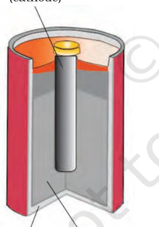

- *Fig. 2.8: A commercial dry cell consists of a graphite (carbon) cathode in a zinc container; the latter acts as the anode.*
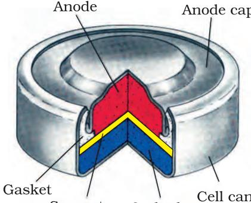

The overall reaction is represented by

Zn(Hg) + HgO(s) ¾® ZnO(s) + Hg(l)

The cell potential is approximately 1.35 V and remains constant during its life as the overall reaction does not involve any ion in solution whose concentration can change during its life time.

#### *Fig. 2.9*

*Commonly used mercury cell. The reducing agent is zinc and the oxidising agent is mercury (II) oxide.*

#### 2.6.2 Secondary Batteries

A secondary cell after use can be recharged by passing current through it in the opposite direction so that it can be used again. A good secondary cell can undergo a large number of discharging and charging cycles. The most important secondary cell is the lead storage battery (Fig. 2.10) commonly used in automobiles and invertors. It consists of a lead anode and a grid of lead packed with lead dioxide (PbO2 ) as cathode. A 38% solution of sulphuric acid is used as an electrolyte.

The cell reactions when the battery is in use are given below:

Anode: Pb(s) + SO4 2–(aq) ® PbSO4 (s) + 2e–

Cathode: PbO2 (s) + SO4 2–(aq) + 4H+ (aq) + 2e– ® PbSO4 (s) + 2H2O (l)

i.e., overall cell reaction consisting of cathode and anode reactions is:

Pb(s) + PbO2 (s) + 2H2 SO4 (aq) ® 2PbSO4 (s) + 2H2O(l*)*

On charging the battery the reaction is reversed and PbSO4 (s) on anode and cathode is converted into Pb and PbO2 , respectively.

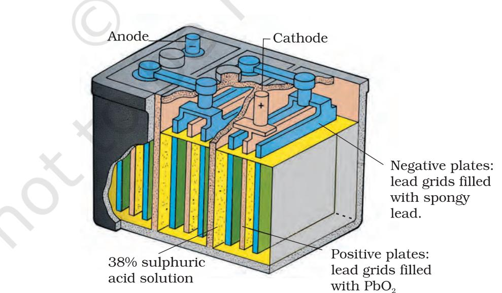

*Fig. 2.10: The Lead storage battery.*

55 Electrochemistry

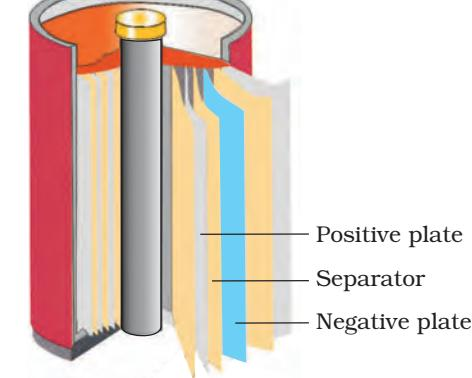

Another important secondary cell is the nickel-cadmium cell (Fig. 2.11) which has longer life than the lead storage cell but more expensive to manufacture. We shall not go into details of working of the cell and the electrode reactions during charging and discharging. The overall reaction during discharge is:

One of the most successful fuel cells uses the reaction of hydrogen with oxygen to form water (Fig. 2.12). The cell was used for providing electrical power in the Apollo space programme. The water vapours produced during the reaction were condensed and added to the drinking water supply for the astronauts. In the cell, hydrogen and oxygen are bubbled through porous carbon electrodes into concentrated aqueous sodium hydroxide solution. Catalysts like finely divided platinum or palladium metal are incorporated into the electrodes

### 2.7 Fuel Cells

*Fig. 2.11 A rechargeable nickel-cadmium cell*

*in a jelly roll arrangement and separated by a layer soaked in moist sodium or potassium*

*hydroxide.*

Production of electricity by thermal plants is not a very efficient method and is a major source of pollution. In such plants, the chemical energy (heat of combustion) of fossil fuels (coal, gas or oil) is first used for converting water into high pressure steam. This is then used to run a turbine to produce electricity. We know that a galvanic cell directly converts chemical energy into electricity and is highly efficient. It is now possible to make such cells in which reactants are fed continuously to the electrodes and products are removed continuously from the electrolyte compartment. Galvanic cells that are designed to convert the energy of combustion of fuels like hydrogen, methane, methanol, etc. directly into electrical energy are called fuel cells.

Cd (s) + 2Ni(OH)3 (s) ® CdO (s) + 2Ni(OH)2 (s) + H2O (l )

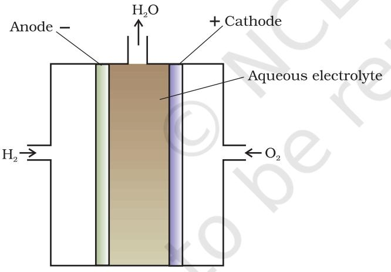

given below:

Cathode: O2 (g) + 2H2O(l) + 4e–¾® 4OH– (aq) Anode: 2H2 (g) + 4OH– (aq) ¾® 4H2O(l) + 4e– Overall reaction being: 2H2 (g) + O2 (g) ¾® 2H2O(l )

The cell runs continuously as long as the reactants are supplied. Fuel cells produce electricity with an efficiency of about 70 % compared

Chemistry 56

to thermal plants whose efficiency is about 40%. There has been tremendous progress in the development of new electrode materials, better catalysts and electrolytes for increasing the efficiency of fuel cells. These have been used in automobiles on an experimental basis. Fuel cells are pollution free and in view of their future importance, a variety of fuel cells have been fabricated and tried.

2.8 Corrosion

Corrosion slowly coats the surfaces of metallic objects with oxides or other salts of the metal. The rusting of iron, tarnishing of silver, development of green coating on copper and bronze are some of the

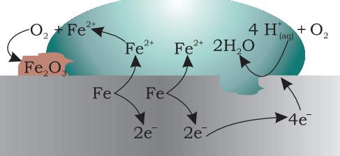

Oxidation: Fe (s)® Fe2+ (aq) +2e– Reduction: O2 (g) + 4H+ (aq) +4e– ® 2H2O(l) Atomospheric oxidation: 2Fe2+(aq) + 2H2O(l) + ½O2 (g) ® Fe2O3

*Fig. 2.13: Corrosion of iron in atmosphere*

examples of corrosion. It causes enormous damage to buildings, bridges, ships and to all objects made of metals especially that of iron. We lose crores of rupees every year on account of corrosion.

In corrosion, a metal is oxidised by loss of electrons to oxygen and formation of oxides. Corrosion of iron (commonly known as rusting) occurs in presence of water and air. The chemistry of corrosion is quite

complex but it may be considered essentially as an electrochemical phenomenon. At a particular spot (Fig. 2.13) of an object made of iron,

oxidation takes place and that spot behaves as anode and we can write the reaction

  
  
**Anode: 2 Fe (s) 2 Fe${}^{2+}$ + 4 e${}^{-}$ = - 0.44 V**

(aq)

(s) + 4H+

Electrons released at anodic spot move through the metal and go to another spot on the metal and reduce oxygen in the presence of H+ (which is believed to be available from H2CO3 formed due to dissolution of carbon dioxide from air into water. Hydrogen ion in water may also be available due to dissolution of other acidic oxides from the atmosphere). This spot behaves as cathode with the reaction

Cathode: O${}_{2}$(g) + 4 H${}^{+}$(aq) + 4 e${}^{-}$ 2 H${}_{2}$O (l) $E^{o}_{\rm H^{+}|O_{2}\,|\,H_{2}O}$ = 1.23 V.  
  

The overall reaction being:

2Fe(s) + O2 (g) + 4H+ (aq) ¾® 2Fe2 +(aq) + 2 H2O (l) o *E*(cell) =1.67 V

The ferrous ions are further oxidised by atmospheric oxygen to ferric ions which come out as rust in the form of hydrated ferric oxide (Fe2O3 . *x* H2O) and with further production of hydrogen ions.

Prevention of corrosion is of prime importance. It not only saves money but also helps in preventing accidents such as a bridge collapse or failure of a key component due to corrosion. One of the simplest methods of preventing corrosion is to prevent the surface of the metallic object to come in contact with atmosphere. This can be done by covering the surface with paint or by some chemicals (e.g. bisphenol). Another simple method is to cover the surface by other metals (Sn, Zn, etc.) that are inert or react to save the object. An electrochemical method is to provide a sacrificial electrode of another metal (like Mg, Zn, etc.) which corrodes itself but saves the object.

57 Electrochemistry

### Intext Questions

- 2.13 Write the chemistry of recharging the lead storage battery, highlighting all the materials that are involved during recharging.
- 2.14 Suggest two materials other than hydrogen that can be used as fuels in fuel cells.
- 2.15 Explain how rusting of iron is envisaged as setting up of an electrochemical cell.

#### The Hydrogen Economy

At present the main source of energy that is driving our economy is fossil fuels such as coal, oil and gas. As more people on the planet aspire to improve their standard of living, their energy requirement will increase. In fact, the per capita consumption of energy used is a measure of development. Of course, it is assumed that energy is used for productive purpose and not merely wasted. We are already aware that carbon dioxide produced by the combustion of fossil fuels is resulting in the 'Greenhouse Effect'. This is leading to a rise in the temperature of the Earth's surface, causing polar ice to melt and ocean levels to rise. This will flood low-lying areas along the coast and some island nations such as Maldives face total submergence. In order to avoid such a catastrope, we need to limit our use of carbonaceous fuels. Hydrogen provides an ideal alternative as its combustion results in water only. Hydrogen production must come from splitting water using solar energy. Therefore, hydrogen can be used as a renewable and non polluting source of energy. This is the vision of the Hydrogen Economy. Both the production of hydrogen by electrolysis of water and hydrogen combustion in a fuel cell will be important in the future. And both these technologies are based on electrochemical principles.

### Summary Summary

An electrochemical cell consists of two metallic electrodes dipping in electrolytic solution(s). Thus an important component of the electrochemical cell is the ionic conductor or electrolyte. Electrochemical cells are of two types. In galvanic cell, the chemical energy of a spontaneous redox reaction is converted into electrical work, whereas in an electrolytic cell, electrical energy is used to carry out a nonspontaneous redox reaction. The standard electrode potential for any electrode dipping in an appropriate solution is defined with respect to standard electrode potential of hydrogen electrode taken as zero. The standard potential of the cell can be obtained by taking the difference of the standard potentials of cathode and anode ( ( ) o *E* cell = *E* o cathode – *E* o anode). The standard potential of the cells are related to standard Gibbs energy (D*rG* o = –*nF* ( ) o *E* cell ) and equilibrium constant (D*rG* o = *– RT* ln *K*) of the reaction taking place in the cell. Concentration dependence of the potentials of the electrodes and the cells are given by Nernst equation.

The conductivity, k, of an electrolytic solution depends on the concentration of the electrolyte, nature of solvent and temperature. Molar conductivity, L*m*, is defined by = k/*c* where *c* is the concentration. Conductivity decreases but molar conductivity increases with decrease in concentration. It increases slowly with decrease in concentration for strong electrolytes while the increase is very steep for weak electrolytes in very dilute solutions. Kohlrausch found that molar conductivity at infinite dilution, for an electrolyte is sum of the contribution of the molar conductivity of the ions in which it dissociates. It is known as law of independent migration of ions and has many applications. Ions conduct electricity through the solution but oxidation and reduction of the ions take place at the electrodes in an electrochemical cell. Batteries and fuel cells are very useful forms of galvanic cell. Corrosion of metals is essentially an electrochemical phenomenon. Electrochemical principles are relevant to the Hydrogen Economy.

- 2.1 Arrange the following metals in the order in which they displace each other from the solution of their salts.
Al, Cu, Fe, Mg and Zn.

- 2.2 Given the standard electrode potentials, K + /K = –2.93V, Ag+ /Ag = 0.80V, Hg2+/Hg = 0.79V Mg2+/Mg = –2.37 V, Cr3+/Cr = – 0.74V Arrange these metals in their increasing order of reducing power.
- 2.3 Depict the galvanic cell in which the reaction Zn(s)+2Ag+ (aq) ®Zn2+(aq)+2Ag(s) takes place. Further show: (i) Which of the electrode is negatively charged? (ii) The carriers of the current in the cell. (iii) Individual reaction at each electrode.
- 2.4 Calculate the standard cell potentials of galvanic cell in which the following reactions take place:

(i) 2Cr(s) + 3Cd2+(aq) ® 2Cr3+(aq) + 3Cd

(ii) Fe2+(aq) + Ag+ (aq) ® Fe3+(aq) + Ag(s)

Calculate the Dr*G* o and equilibrium constant of the reactions.

- 2.5 Write the Nernst equation and emf of the following cells at 298 K:
	- (i) Mg(s)|Mg2+(0.001M)||Cu2+(0.0001 M)|Cu(s)
	- (ii) Fe(s)|Fe2+(0.001M)||H+ (1M)|H2 (g)(1bar)| Pt(s)
	- (iii) Sn(s)|Sn2+(0.050 M)||H+ (0.020 M)|H2 (g) (1 bar)|Pt(s)
	- (iv) Pt(s)|Br– (0.010 M)|Br2 (l )||H+ (0.030 M)| H2 (g) (1 bar)|Pt(s).
- 2.6 In the button cells widely used in watches and other devices the following reaction takes place:

Zn(s) + Ag${}_{2}$O(s) + H${}_{2}$O(l) $\rightarrow$ Zn${}^{2+}$(aq) + 2Ag(s) + 2OH(aq)

Determine D*rG* o and *E* o for the reaction.

- 2.7 Define conductivity and molar conductivity for the solution of an electrolyte. Discuss their variation with concentration.
- 2.8 The conductivity of 0.20 M solution of KCl at 298 K is 0.0248 S cm–1. Calculate its molar conductivity.
- 2.9 The resistance of a conductivity cell containing 0.001M KCl solution at 298 K is 1500 W. What is the cell constant if conductivity of 0.001M KCl solution at 298 K is 0.146 × 10–3 S cm–1 .

ExercisesExercises Exercises

- 2.10 The conductivity of sodium chloride at 298 K has been determined at different concentrations and the results are given below: Concentration/M 0.001 0.010 0.020 0.050 0.100
102 × k/S m–1 1.237 11.85 23.15 55.53 106.74 Calculate Λ*m* for all concentrations and draw a plot between Λ*m* and c½. Find the value of 0 *m* .

- 2.11 Conductivity of 0.00241 M acetic acid is 7.896 × 10–5 S cm–1. Calculate its molar conductivity. If 0 *m* for acetic acid is 390.5 S cm2 mol–1, what is its dissociation constant?
- 2.12 How much charge is required for the following reductions:
	- (i) 1 mol of Al3+ to Al?
	- (ii) 1 mol of Cu2+ to Cu?
	- (iii) 1 mol of MnO4 – to Mn2+ ?
- 2.13 How much electricity in terms of Faraday is required to produce
	- (i) 20.0 g of Ca from molten CaCl2 ?
	- (ii) 40.0 g of Al from molten Al2O3 ?
- 2.14 How much electricity is required in coulomb for the oxidation of
	- (i) 1 mol of H2O to O2 ?
	- (ii) 1 mol of FeO to Fe2O3 ?
- 2.15 A solution of Ni(NO3 ) 2 is electrolysed between platinum electrodes using a current of 5 amperes for 20 minutes. What mass of Ni is deposited at the cathode?
- 2.16 Three electrolytic cells A,B,C containing solutions of ZnSO4 , AgNO3 and CuSO4 , respectively are connected in series. A steady current of 1.5 amperes was passed through them until 1.45 g of silver deposited at the cathode of cell B. How long did the current flow? What mass of copper and zinc were deposited?
- 2.17 Using the standard electrode potentials given in Table 3.1, predict if the reaction between the following is feasible:
	- (i) Fe3+(aq) and I– (aq)
	- (ii) Ag+ (aq) and Cu(s)
	- (iii) Fe3+ (aq) and Br– (aq)
	- (iv) Ag(s) and Fe 3+ (aq)
	- (v) Br2 (aq) and Fe2+ (aq).

2.18 Predict the products of electrolysis in each of the following:

- (i) An aqueous solution of AgNO3 with silver electrodes.
- (ii) An aqueous solution of AgNO3 with platinum electrodes.
- (iii) A dilute solution of H2SO4 with platinum electrodes.
- (iv) An aqueous solution of CuCl2 with platinum electrodes.

#### Answers to Some Intext Questions

- 2.5 E(cell) = 0.91 V
- 2.6 − ∆ = − o 1 rG 45.54 kJ mol , *K*c *=* 9.62 ×107
- 2.9 0.114, 3.67 × 10–4 mol L–1

Chemistry 60

