# Objectives

After studying this Unit, you will be able to

- · define the average and instantaneous rate of a reaction;
- · express the rate of a reaction in terms of change in concentration of either of the reactants or products with time;
- · distinguish between elementary and complex reactions;
- · differentiate between the molecularity and order of a reaction;
- · define rate constant;
- · discuss the dependence of rate of reactions on concentration, temperature and catalyst;
- · derive integrated rate equations for the zero and first order reactions;
- · determine the rate constants for zeroth and first order reactions;
- · describe collision theory.

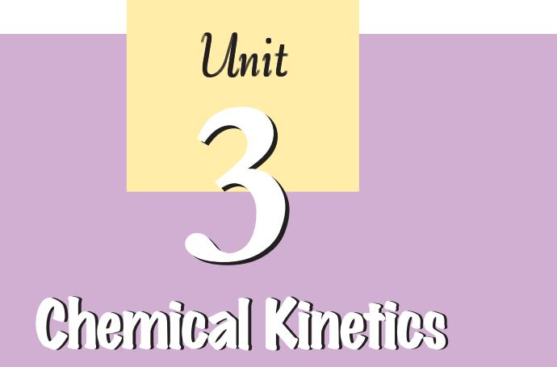

*Chemical Kinetics helps us to understand how chemical reactions occur.*

Chemistry, by its very nature, is concerned with change. Substances with well defined properties are converted by chemical reactions into other substances with different properties. For any chemical reaction, chemists try to find out

- (a) the feasibility of a chemical reaction which can be predicted by thermodynamics ( as you know that a reaction with DG < 0, at constant temperature and pressure is feasible);
- (b) extent to which a reaction will proceed can be determined from chemical equilibrium;
- (c) speed of a reaction i.e. time taken by a reaction to reach equilibrium.

Along with feasibility and extent, it is equally important to know the rate and the factors controlling the rate of a chemical reaction for its complete understanding. For example, which parameters determine as to how rapidly food gets spoiled? How to design a rapidly setting material for dental filling? Or what controls the rate at which fuel burns in an auto engine? All these questions can be answered by the branch of chemistry, which deals with the study of reaction rates and their mechanisms, called chemical kinetics. The word kinetics is derived from the Greek word 'kinesis' meaning movement. Thermodynamics tells only about the feasibility of a reaction whereas chemical kinetics tells about the rate of a reaction. For example, thermodynamic data indicate that diamond shall convert to graphite but in reality the conversion rate is so slow that the change is not perceptible at all. Therefore, most people think that diamond is forever. Kinetic studies not only help us to determine the speed or rate of a chemical reaction but also describe the conditions by which the reaction rates can be altered. The factors such as concentration, temperature, pressure and catalyst affect the rate of a reaction. At the macroscopic level, we are interested in amounts reacted or formed and the rates of their consumption or formation. At the molecular level, the reaction mechanisms involving orientation and energy of molecules undergoing collisions, are discussed.

In this Unit, we shall be dealing with average and instantaneous rate of reaction and the factors affecting these. Some elementary ideas about the collision theory of reaction rates are also given. However, in order to understand all these, let us first learn about the reaction rate.

Some reactions such as ionic reactions occur very fast, for example, precipitation of silver chloride occurs instantaneously by mixing of aqueous solutions of silver nitrate and sodium chloride. On the other hand, some reactions are very slow, for example, rusting of iron in the presence of air and moisture. Also there are reactions like inversion of cane sugar and hydrolysis of starch, which proceed with a moderate speed. Can you think of more examples from each category?

You must be knowing that speed of an automobile is expressed in terms of change in the position or distance covered by it in a certain period of time. Similarly, the speed of a reaction or the rate of a reaction can be defined as the change in concentration of a reactant or product in unit time. To be more specific, it can be expressed in terms of:

- (i) the rate of decrease in concentration of any one of the reactants, or
(ii) the rate of increase in concentration of any one of the products.

Consider a hypothetical reaction, assuming that the volume of the system remains constant.

R ® P

One mole of the reactant R produces one mole of the product P. If [R]1 and [P]1 are the concentrations of R and P respectively at time t1 and [R]2 and [P]2 are their concentrations at time t2 then,

> D*t* = *t* 2 – *t* 1 D[R] = [R]2 – [R]1 D [P] = [P]2 – [P]1

The square brackets in the above expressions are used to express molar concentration.

Rate of disappearance of R

= Decrease in concentration of R = - $\frac{\Delta[\text{R}]}{\Delta t}$ (3.1) Time taken 

3.1 Rate of aRate of a Rate of a Chemical ChemicalChemical Reaction ReactionReaction

Chemistry 62

Rate of appearance of P

= $\frac{\text{Increase in concentration of P}}{\text{Time taken}}=+\frac{\Delta[\text{P}]}{\Delta t}$ (3.2)

Since, D[R] is a negative quantity (as concentration of reactants is decreasing), it is multiplied with –1 to make the rate of the reaction a positive quantity.

Equations (3.1) and (3.2) given above represent the average rate of a reaction, *r* av .

Average rate depends upon the change in concentration of reactants or products and the time taken for that change to occur (Fig. 3.1).

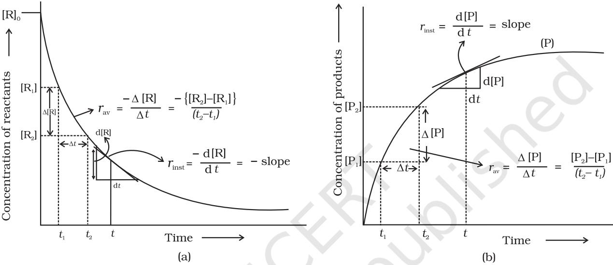

*Fig. 3.1: Instantaneous and average rate of a reaction*

### *Units of rate of a reaction*

From equations (3.1) and (3.2), it is clear that units of rate are concentration time–1. For example, if concentration is in mol L–1 and time is in seconds then the units will be mol L-1s –1. However, in gaseous reactions, when the concentration of gases is expressed in terms of their partial pressures, then the units of the rate equation will be atm s–1 .

From the concentrations of C4H9Cl (butyl chloride) at different times given below, calculate the average rate of the reaction: C4H9Cl + H2O ® C4H9OH + HCl during different intervals of time. *t*/s 0 50 100 150 200 300 400 700 800 [C4H9Cl]/mol L–1 0.100 0.0905 0.0820 0.0741 0.0671 0.0549 0.0439 0.0210 0.017 We can determine the difference in concentration over different intervals of time and thus determine the average rate by dividing D[R] by D*t* (Table 3.1). Example 3.1 Example 3.1Example 3.1 Solution SolutionSolution

63 Chemical Kinetics

| / [C4H9CI]t 1 | / [C4H9CI]t 2 | /s t1 | /s t2 rav | –1 × 104/mol L–1s |
| --- | --- | --- | --- | --- |
| mol L–1 | mol L–1 |  | = – {[ | 4 C H Cl ] – C H Cl [ ] / t ( t ) 10 − × } 4 9 4 9 2 1 t t 2 1 |
| 0.100 | 0.0905 | 0 | 50 | 1.90 |
| 0.0905 | 0.0820 | 50 | 100 | 1.70 |
| 0.0820 | 0.0741 | 100 | 150 | 1.58 |
| 0.0741 | 0.0671 | 150 | 200 | 1.40 |
| 0.0671 | 0.0549 | 200 | 300 | 1.22 |
| 0.0549 | 0.0439 | 300 | 400 | 1.10 |
| 0.0439 | 0.0335 | 400 | 500 | 1.04 |
| 0.0210 | 0.017 | 700 | 800 | 0.4 |

### Table 3.1: Average rates of hydrolysis of butyl chloride

It can be seen (Table 3.1) that the average rate falls from 1.90 × 0-4 mol L-1s -1 to 0.4 × 10-4 mol L-1s -1. However, average rate cannot be used to predict the rate of a reaction at a particular instant as it would be constant for the time interval for which it is calculated. So, to express the rate at a particular moment of time we determine the instantaneous rate. It is obtained when we consider the average rate at the smallest time interval say d*t* ( i.e. when D*t* approaches zero). Hence, mathematically for an infinitesimally small d*t* instantaneous rate is given by

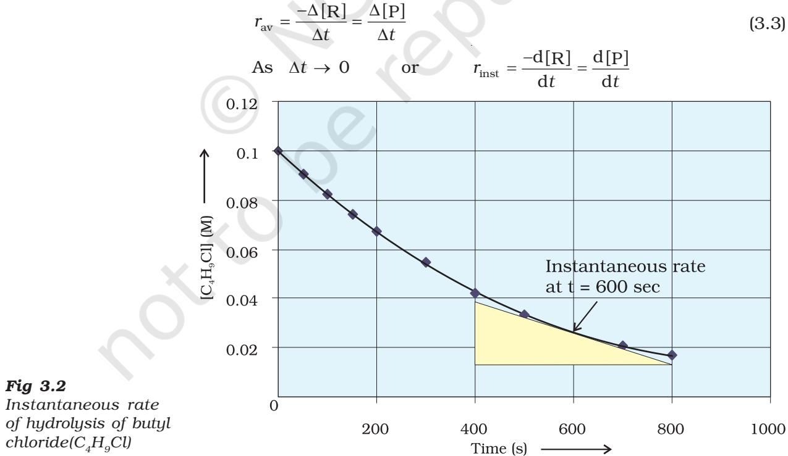

It can be determined graphically by drawing a tangent at time t on either of the curves for concentration of R and P vs time t and calculating its slope (Fig. 3.1). So in problem 3.1, *r* inst at 600s for example, can be calculated by plotting concentration of butyl chloride as a function of time. A tangent is drawn that touches the curve at *t* = 600 s (Fig. 3.2).

The slope of this tangent gives the instantaneous rate.

So, $r_{\rm inst}$ at 600 s = - $\left(\frac{0.0165-0.037}{(800-400)\,{\rm s}}\right)$ mol L${}^{-1}$ = 5.12 $\times$ 10${}^{-5}$ mol L${}^{-1}$s${}^{-1}$ At $t$ = 250 s $r_{\rm inst}$ = 1.22 $\times$ 10${}^{-4}$ mol L${}^{-1}$s${}^{-1}$ $t$ = 350 s $r_{\rm inst}$ = 1.0 $\times$ 10${}^{-4}$ mol L${}^{-1}$s${}^{-1}$ $t$ = 450 s $r_{\rm inst}$ = 6.4 $\times$ 10${}^{-5}$ mol L${}^{-1}$s${}^{-1}$

Now consider a reaction

Hg(l) + Cl2 (g) ® HgCl2 (s)

Where stoichiometric coefficients of the reactants and products are same, then rate of the reaction is given as

Rate of reaction = - $\frac{\Delta[\text{Hg}]}{\Delta t}$ = - $\frac{\Delta[\text{Cl}_{2}]}{\Delta t}$ = $\frac{\Delta[\text{HgCl}_{2}]}{\Delta t}$

i.e., rate of disappearance of any of the reactants is same as the rate of appearance of the products. But in the following reaction, two moles of HI decompose to produce one mole each of H2 and I2,

2HI(g) - H${}_{2}$(g) + I${}_{2}$(g)

For expressing the rate of such a reaction where stoichiometric coefficients of reactants or products are not equal to one, rate of disappearance of any of the reactants or the rate of appearance of products is divided by their respective stoichiometric coefficients. Since rate of consumption of HI is twice the rate of formation of H2 or I2 , to make them equal, the term D[HI] is divided by 2. The rate of this reaction is given by

Rate of reaction = - $\frac{1}{2}\frac{\Lambda[\text{HI}]}{\Lambda t}=\frac{\Lambda[\text{H}_{2}]}{\Lambda t}=\frac{\Lambda[\text{I}_{2}]}{\Lambda t}$

Similarly, for the reaction

5 Br- (aq) + BrO3 – (aq) + 6 H+ (aq) ® 3 Br2 (aq) + 3 H2O (l)

$$\mathrm{Rate}=-\frac{1}{5}\frac{\Delta\left[\mathrm{Br}^{-}\right]}{\Delta t}=-\frac{\Delta\left[\mathrm{BrO}_{3}^{-}\right]}{\Delta t}=-\frac{1}{6}\frac{\Delta\left[\mathrm{H}^{+}\right]}{\Delta t}=\frac{1}{3}\frac{\Delta\left[\mathrm{Br}_{2}\right]}{\Delta t}=\frac{1}{3}\frac{\Delta\left[\mathrm{H}_{2}\mathrm{O}\right]}{\Delta t}$$

For a gaseous reaction at constant temperature, concentration is directly proportional to the partial pressure of a species and hence, rate can also be expressed as rate of change in partial pressure of the reactant or the product.

65 Chemical Kinetics

Example 3.2 Example 3.2Example 3.2 The decomposition of N2O5 in CCl4 at 318K has been studied by monitoring the concentration of N2O5 in the solution. Initially the concentration of N2O5 is 2.33 mol L–1 and after 184 minutes, it is reduced to 2.08 mol L–1. The reaction takes place according to the equation 2 N2O5 (g) ® 4 NO2 (g) + O2 (g) Calculate the average rate of this reaction in terms of hours, minutes and seconds. What is the rate of production of NO2 during this period? Average Rate = − [ ] = − ( − ) − 1 2 1 2 2 08 2 33 184 2 5 1 ∆ ∆ N O molL *t* . . min = 6.79 × 10–4 mol L–1/min = (6.79 × 10–4 mol L–1 min–1) × (60 min/1h) = 4.07 × 10–2 mol L–1/h = 6.79 × 10–4 mol L–1 × 1min/60s = 1.13 × 10–5 mol L–1s –1 It may be remembered that Rate NO = [ ] 1 4 ∆ 2 ∆*t* [NO2 ] *t* ∆ = ∆ 6.79 × 10–4 × 4 mol L–1 min–1 = 2.72 × 10–3 mol L–1min–1 SolutionSolution Solution

# Intext Questions

- 3.1 For the reaction R ® P, the concentration of a reactant changes from 0.03M to 0.02M in 25 minutes. Calculate the average rate of reaction using units of time both in minutes and seconds.
- 3.2 In a reaction, 2A ® Products, the concentration of A decreases from 0.5 mol L–1 to 0.4 mol L–1 in 10 minutes. Calculate the rate during this interval?

3.2 Factors Influencing Rate of a Reaction Rate of reaction depends upon the experimental conditions such as concentration of reactants (pressure in case of gases), temperature and catalyst.

- 3.2.1 Dependence of Rate on Concentration
The rate of a chemical reaction at a given temperature may depend on the concentration of one or more reactants and products. The representation of rate of reaction in terms of concentration of the reactants is known as rate law. It is also called as rate equation or rate expression.

- 3.2.2 Rate Expression and Rate Constant
The results in Table 3.1 clearly show that rate of a reaction decreases with the passage of time as the concentration of reactants decrease. Conversely, rates generally increase when reactant concentrations increase. So, rate of a reaction depends upon the concentration of reactants.

Consider a general reaction

aA + bB ® cC + dD

where a, b, c and d are the stoichiometric coefficients of reactants and products.

The rate expression for this reaction is

Rate µ [A]x [B]y (3.4)

where exponents x and y may or may not be equal to the stoichiometric coefficients (a and b) of the reactants. Above equation can also be written as

Rate = $k$ [A]${}^{\rm x}$ [B]${}^{\rm y}$ (3.4a)

$$\frac{\mathrm{d}[\mathrm{R}]}{\mathrm{d}t}=k[\mathrm{A}]^{\mathrm{x}}\,[\mathrm{B}]^{\mathrm{y}}\tag{3.4b}$$

This form of equation (3.4 b) is known as differential rate equation, where *k* is a proportionality constant called rate constant. The equation like (3.4), which relates the rate of a reaction to concentration of reactants is called rate law or rate expression. Thus, rate law is the expression in which reaction rate is given in terms of molar concentration of reactants with each term raised to some power, which may or may not be same as the stoichiometric coefficient of the reacting species in a balanced chemical equation. For example:

> 2NO(g) + O2 (g) ® 2NO2 (g)

We can measure the rate of this reaction as a function of initial concentrations either by keeping the concentration of one of the reactants constant and changing the concentration of the other reactant or by changing the concentration of both the reactants. The following results are obtained (Table 3.2).

| Experiment | Initial [NO]/ mol L-1 | ]/ mol L-1 Initial [O2 | Initial rate of |
| --- | --- | --- | --- |
|  |  |  | -1 / mol L-1s formation of NO2 |
| 1. | 0.30 | 0.30 | 0.096 |
| 2. | 0.60 | 0.30 | 0.384 |
| 3. | 0.30 | 0.60 | 0.192 |
| 4. | 0.60 | 0.60 | 0.768 |

## Table 3.2: Initial rate of formation of NO2

It is obvious, after looking at the results, that when the concentration of NO is doubled and that of O2 is kept constant then the initial rate increases by a factor of four from 0.096 to 0.384 mol L–1s –1. This indicates that the rate depends upon the square of the concentration of NO. When concentration of NO is kept constant and concentration of O2 is doubled the rate also gets doubled indicating that rate depends on concentration of O2 to the first power. Hence, the rate equation for this reaction will be

> Rate = *k* [NO]2 [O2 ]

> > 67 Chemical Kinetics

The differential form of this rate expression is given as

[ ] [ ] [ ] 2 2 d R NO O d *k t* − =

Now, we observe that for this reaction in the rate equation derived from the experimental data, the exponents of the concentration terms are the same as their stoichiometric coefficients in the balanced chemical equation.

Some other examples are given below:

| Reaction |  |  |  |  | Experimental rate expression |  |  |  |  |
| --- | --- | --- | --- | --- | --- | --- | --- | --- | --- |
| 1. CHCl3 | + Cl2 | ® CCl4 | + | HCl | Rate = k [CHCl3 ] [Cl2 |  |  | 1/2 ] |  |
| 2. CH3COOC2H5 |  | + H2O ® |  | CH3COOH + C2H5OH | Rate k | = | [CH3COOC2H5 | 1 ] | [H2O]0 |

In these reactions, the exponents of the concentration terms are not the same as their stoichiometric coefficients. Thus, we can say that:

*Rate law for any reaction cannot be predicted by merely looking at the balanced chemical equation, i.e., theoretically but must be determined experimentally*.

3.2.3 Order of a Reaction

In the rate equation (3.4) Rate = *k* [A]x [B]y

x and y indicate how sensitive the rate is to the change in concentration of A and B. Sum of these exponents, i.e., x + y in (3.4) gives the overall order of a reaction whereas x and y represent the order with respect to the reactants A and B respectively.

Hence, the sum of powers of the concentration of the reactants in the rate law expression is called the order of that chemical reaction.

Order of a reaction can be 0, 1, 2, 3 and even a fraction. A zero order reaction means that the rate of reaction is independent of the concentration of reactants.

| Example 3.3 Example 3.3 Example 3.3 | Calculate the overall order of a reaction which |
| --- | --- |
|  | has the rate expression |
|  | (a) Rate = k [A]1/2 [B]3/2 |
|  | (b) Rate = k [A]3/2 [B]–1 |
| Solution Solution Solution | (a) Rate = k [A]x [B]y |
|  | order = x + y |
|  | So order = 1/2 + 3/2 = 2, i.e., second order |
|  | (b) order = 3/2 + (–1) = 1/2, i.e., half order. |

A balanced chemical equation never gives us a true picture of how a reaction takes place since rarely a reaction gets completed in one step. The reactions taking place in one step are called elementary reactions. When a sequence of elementary reactions (called mechanism) gives us the products, the reactions are called complex reactions.

Chemistry 68

These may be consecutive reactions (e.g., oxidation of ethane to CO2 and H2O passes through a series of intermediate steps in which alcohol, aldehyde and acid are formed), reverse reactions and side reactions (e.g., nitration of phenol yields *o*-nitrophenol and *p*-nitrophenol).

*Units of rate constant*

For a general reaction

aA + bB ® cC + dD Rate = *k* [A]x [B]y Where x + y = n = order of the reaction *k* = x Rate [A] [B]*y* ( ) ( = ) n concentration 1 = × where [A] [B] time concentration

Taking SI units of concentration, mol L–1 and time, s, the units of *k* for different reaction order are listed in Table 3.3

| Reaction | Order | Units of rate constant |  |  |  |  |  |  |  |  |  |  |  |  |  |  |  |
| --- | --- | --- | --- | --- | --- | --- | --- | --- | --- | --- | --- | --- | --- | --- | --- | --- | --- |
| − | 1 | molL | 1 | − | 1 | − | 1 | × | = | molL | s | Zero order reaction | 0 |  |  |  |  |
| 0 1 | ) | s | − | molL | ( |  |  |  |  |  |  |  |  |  |  |  |  |
| − | 1 | molL | 1 | − | 1 | × | = | s |  |  |  |  |  |  |  |  |  |
| First order reaction | 1 | 1 |  |  |  |  |  |  |  |  |  |  |  |  |  |  |  |
| ) | s | − | 1 | ( | molL | − | 1 | molL |  |  |  |  |  |  |  |  |  |
| 1 | − | 1 | − | 1 | × | = | mol | L s | Second order reaction | 2 | 2 | ) | s | − | 1 | molL | ( |

| Table 3.3: Units of rate constant |
| --- |

Example 3.4 Solution SolutionSolution Identify the reaction order from each of the following rate constants. (i) *k* = 2.3 × 10–5 L mol–1 s–1 (ii) *k* = 3 × 10–4 s–1 (i) The unit of second order rate constant is L mol–1 s–1, therefore *k* = 2.3 × 10–5 L mol–1 s–1 represents a second order reaction.

- (ii) The unit of a first order rate constant is s–1 therefore
	- *k* = 3 × 10–4 s–1 represents a first order reaction.

3.2.4 Molecularity of a Reaction Another property of a reaction called molecularity helps in understanding its mechanism. The number of reacting species (atoms, ions or molecules) taking part in an elementary reaction, which must collide simultaneously in order to bring about a chemical reaction is called molecularity of a reaction. The reaction can be unimolecular when one reacting species is involved, for example, decomposition of ammonium nitrite.

69 Chemical Kinetics

NH4NO2 ® N2 + 2H2O

Bimolecular reactions involve simultaneous collision between two species, for example, dissociation of hydrogen iodide.

> 2HI ® H2 + I2

Trimolecular or termolecular reactions involve simultaneous collision between three reacting species, for example,

2NO + O2 ® 2NO2

The probability that more than three molecules can collide and react simultaneously is very small. Hence, reactions with the molecularity three are very rare and slow to proceed.

It is, therefore, evident that complex reactions involving more than three molecules in the stoichiometric equation must take place in more than one step.

$\text{KClO}_3\text{+6FeSO}_4\text{+3H}_2\text{SO}_4\to\text{KCl+3Fe}_2\text{(SO}_4\text{)}_3\text{+3H}_2\text{O}$  
3. 

This reaction which apparently seems to be of tenth order is actually a second order reaction. This shows that this reaction takes place in several steps. Which step controls the rate of the overall reaction? The question can be answered if we go through the mechanism of reaction, for example, chances to win the relay race competition by a team depend upon the slowest person in the team. Similarly, the overall rate of the reaction is controlled by the slowest step in a reaction called the rate determining step. Consider the decomposition of hydrogen peroxide which is catalysed by iodide ion in an alkaline medium.

2H${}_{2}$O${}_{2}$ Alkaline medium 2H${}_{2}$O + O${}_{2}$

The rate equation for this reaction is found to be

$$\mathrm{\Delta\Delta_{\Delta}=\frac{-d[H_{2}O_{2}]}{d t}=k\,[H_{2}O_{2}][I^{-}]}$$

This reaction is first order with respect to both H2O2 and I– . Evidences suggest that this reaction takes place in two steps

(1) $\text{H}_2\text{O}_2+\text{I}^-\to\text{H}_2\text{O+I}\text{O}^-$

(2) H2O2 + IO– ® H2O + I – + O2

Both the steps are bimolecular elementary reactions. Species IO is called as an intermediate since it is formed during the course of the reaction but not in the overall balanced equation. The first step, being slow, is the rate determining step. Thus, the rate of formation of intermediate will determine the rate of this reaction.

Thus, from the discussion, till now, we conclude the following:

- (i) Order of a reaction is an experimental quantity. It can be zero and even a fraction but molecularity cannot be zero or a non integer.
- (ii) Order is applicable to elementary as well as complex reactions whereas molecularity is applicable only for elementary reactions. For complex reaction molecularity has no meaning.

- (iii) For complex reaction, order is given by the slowest step and molecularity of the slowest step is same as the order of the overall reaction.
# Intext Questions

.

- 3.3 For a reaction, A + B ® Product; the rate law is given by, *r* = *k* [ A]1/2 [B]2 What is the order of the reaction?
- 3.4 The conversion of molecules X to Y follows second order kinetics. If concentration of X is increased to three times how will it affect the rate of formation of Y ?

# 3.3 IntegratedIntegrated Integrated Rate Equations EquationsEquations

We have already noted that the concentration dependence of rate is called differential rate equation. It is not always convenient to determine the instantaneous rate, as it is measured by determination of slope of the tangent at point '*t*' in concentration vs time plot (Fig. 3.1). This makes it difficult to determine the rate law and hence the order of the reaction. In order to avoid this difficulty, we can integrate the differential rate equation to give a relation between directly measured experimental data, i.e., concentrations at different times and rate constant.

The integrated rate equations are different for the reactions of different reaction orders. We shall determine these equations only for zero and first order chemical reactions.

- Zero order reaction means that the rate of the reaction is proportional to zero power of the concentration of reactants. Consider the reaction, 3.3.1 Zero Order Reactions
*k*

R ® P Rate = d R 0 

R d *t* As any quantity raised to power zero is unity

$${\mathrm{Rate}}=-{\frac{\mathrm{d}[\mathrm{R}]}{\mathrm{d}t}}=k\times1$$

Integrating both sides

[R]${}^{\prime}$ = - $k$ $t$ + I 

where, I is the constant of integration.

At *t* = 0, the concentration of the reactant R = [R]0 , where [R]0 is initial concentration of the reactant.

Substituting in equation (3.5)

[R]0 = –*k* × 0 + I [R]0 = I Substituting the value of I in the equation (3.5) [R] = -*kt* + [R]0

(3.6)

71 Chemical Kinetics

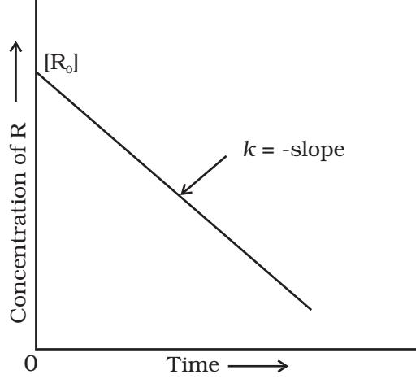

*Fig. 3.3: Variation in the concentration vs time plot for a zero order reaction*

Comparing (3.6) with equation of a straight line, y = mx + c, if we plot [R] against t, we get a straight line (Fig. 3.3) with slope = –*k* and intercept equal to [R]0 .

Further simplifying equation (3.6), we get the rate constant, *k* as

$\kappa=\frac{[\text{R}]_{0}-[\text{R}]}{t}$ (3.7)

Zero order reactions are relatively uncommon but they occur under special conditions. Some enzyme catalysed reactions and reactions which occur on metal surfaces are a few examples of zero order reactions. The decomposition of gaseous ammonia on a hot platinum surface is a zero order reaction at high pressure.

$2\text{NH}_3\left(\text{g}\right)\xrightarrow[\text{Pt catalyst}]{1130\text{K}}\text{N}_2\left(\text{g}\right)+3\text{H}_2\left(\text{g}\right)$ . 

$${\mathrm{Rate}}\,=\,k\,\left[{\mathrm{NH}}_{3}\right]^{0}\,=\,k$$

In this reaction, platinum metal acts as a catalyst. At high pressure, the metal surface gets saturated with gas molecules. So, a further change in reaction conditions is unable to alter the amount of ammonia on the surface of the catalyst making rate of the reaction independent of its concentration. The thermal decomposition of HI on gold surface is another example of zero order reaction.

In this class of reactions, the rate of the reaction is proportional to the first power of the concentration of the reactant R. For example, 3.3.2 First Order Reactions

  
  
**R $\rightarrow$ P**  
  
**Rate = -** **d[R]**  
  
**dt**  
  
**d[R]**  
  
**= -kdt**

Integrating this equation, we get

In [R] = - _kt_ + I 

Again, I is the constant of integration and its value can be determined easily.

When *t* = 0, R = [R]0 , where [R]0 is the initial concentration of the reactant.

Therefore, equation (3.8) can be written as

ln [R]0 = –*k ×* 0 + I ln [R]0 = I

Substituting the value of I in equation (3.8)

ln[R] = –*kt* + ln[R]0

(3.9)

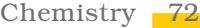

Rearranging this equation

$$\ln\frac{[\mbox{R}]}{[\mbox{R}]_{0}}=-k\mbox{t}$$
  
  
or $k=\frac{1}{t}\,\ln\,\frac{[\mbox{R}]_{0}}{[\mbox{R}]}$ (3.10)

At time *t* 1 from equation (3.8)

*ln[R]${}_{1}$ = - $kt_{1}$ + *ln[R]${}_{0}$ (3.11)

At time *t* 2

In[R]${}_{2}$ = - $kt_{2}$ + ln[R]${}_{0}$

where, [R]1 and [R]2 are the concentrations of the reactants at time *t* 1 and *t* 2 respectively.

$${\mathrm{Subtracting~(3.12)~from~(3.11)}}$$

$$\ln[{\rm R}]_{1}-\,\ln[{\rm R}]_{2}=-\,kt_{1}-\,(-kt_{2})$$
 
$$\ln\frac{[{\rm R}]_{1}}{[{\rm R}]_{2}}=k\big{(}t_{2}-t_{1}\big{)}$$
 
$$k=\frac{1}{\big{(}t_{2}-t_{1}\big{)}}\,\ln\frac{[{\rm R}]_{1}}{[{\rm R}]_{2}}\tag{3.13}$$

Equation (3.9) can also be written as

$$\ln{\frac{[\mathrm{R}]}{[\mathrm{R}]_{0}}}=-k t^{-1}$$

Taking antilog of both sides

[R] = [R]${}_{0}$ e${}^{-\frac{\pi}{2}}$ (3.14)

Comparing equation (3.9) with y = mx + c, if we plot ln [R] against *t* (Fig. 3.4) we get a straight line with slope = –*k* and intercept equal to ln [R]0

The first order rate equation (3.10) can also be written in the form

$$\begin{array}{l}\mbox{k=\frac{2.303}{t}\log\frac{[R]_{0}}{[R]}}\\ \mbox{\log\frac{[R]_{0}}{[R]}=\frac{kt}{2.303}}\end{array}\tag{3.15}$$

If we plot a graph between log [R]0 /[R] vs *t*, (Fig. 3.5), the slope = *k*/2.303

Hydrogenation of ethene is an example of first order reaction.

C2H4 (g) + H2 (g) ® C2H6 (g)

Rate = *k* [C2H4 ]

All natural and artificial radioactive decay of unstable nuclei take place by first order kinetics.

* *Refer to Appendix-IV for ln and log (logarithms).*

73 Chemical Kinetics

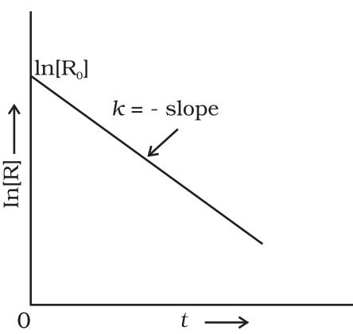

*Fig. 3.4: A plot between ln[R] and t for a first order reaction*

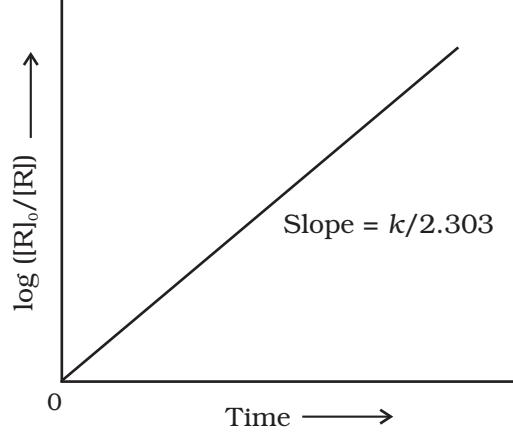

*Fig. 3.5: Plot of log [R]0 /[R] vs time for a first order reaction*

$$\mathrm{{\Gamma}_{88}^{226}R a\to\mathrm{{\Gamma}_{2}^{4}H e+\Gamma_{86}^{222}R n}}$$

Rate = *k* [Ra]

Decomposition of N2O5 and N2O are some more examples of first order reactions.

The initial concentration of N2O5 in the following first order reaction N2O5 (g) ® 2 NO2 (g) + 1/2O2 (g) was 1.24 × 10–2 mol L–1 at 318 K. The concentration of N2O5 after 60 minutes was 0.20 × 10–2 mol L–1. Calculate the rate constant of the reaction at 318 K. Example 3.5 Example 3.5Example 3.5

> For a first order reaction Solution SolutionSolution

$$\log\frac{[\text{R}]_{1}}{[\text{R}]_{2}}=\frac{k(t_{2}-t_{1})}{2.303}\frac{[\text{R}]_{1}}{[\text{R}]_{2}}\frac{2.303}{[\text{R}]_{2}}\frac{1.24\times10^{-2}\text{mol L}^{-1}}{(60\text{min}-0\text{min})}\log\frac{1.24\times10^{-2}\text{mol L}^{-1}}{0.20\times10^{-2}\text{mol L}^{-1}}\frac{2.303}{60}\log6.2\text{min}^{-1}k=0.0304\text{min}^{-1}$$

Let us consider a typical first order gas phase reaction

A(g) ® B(g) + C(g)

Let *p*i be the initial pressure of A and *p*t the total pressure at time '*t*'. Integrated rate equation for such a reaction can be derived as Total pressure *p*t = *p*A + *p*B + *p*C (pressure units)

Chemistry 74

*p*A , *p*B and *p*C are the partial pressures of A, B and C, respectively.

If x atm be the decrease in pressure of A at time *t* and one mole each of B and C is being formed, the increase in pressure of B and C will also be x atm each.

|  |  | A(g) | ® | B(g) | + | C(g) |
| --- | --- | --- | --- | --- | --- | --- |
| At t = 0 |  | pi atm |  | 0 atm |  | 0 atm |
| At time t | (pi | –x) atm |  | x atm |  | x atm |

where, *p*i is the initial pressure at time *t* = 0.

$P_{\rm t}$ = ($p_{\rm i}$ - x) + x + x = $p_{\rm i}$ + x  
  
x = ($p_{\rm t}$ - $p_{\rm i}$)  
  
where, $p_{\rm A}$ = $p_{\rm i}$ - x = $p_{\rm i}$ - ($p_{\rm t}$ - $p_{\rm i}$)  
  
= 2$p_{\rm i}$ - $p_{\rm t}$  
  
$k$ = $\left(\frac{2.303}{t}\right)\!\!\left(\log\frac{p_{\rm i}}{p_{\rm A}}\right)$  
  
= $\frac{2.303}{t}\log\frac{p_{\rm i}}{\left(2p_{\rm i}-p_{\rm t}\right)}$

The following data were obtained during the first order thermal decomposition of N2O5 (g) at constant volume: Example 3.6

2N O 2N O O 2 5 (g) → + 2 4 (g g ) 2 ( )

| S.No. | Time/s | Total Pressure/(atm) |
| --- | --- | --- |
| 1. | 0 | 0.5 |
| 2. | 100 | 0.512 |

Calculate the rate constant.

Let the pressure of N2O5 (g) decrease by 2x atm. As two moles of N2O5 decompose to give two moles of N2O4 (g) and one mole of O2 (g), the pressure of N2O4 (g) increases by 2x atm and that of O2 (g) increases by x atm. Solution SolutionSolution

|  |  |  |  | 2N O2 5 ( g |  | ) | → | 2N O2 4 | ( g | ) | + | O2 ( g ) |
| --- | --- | --- | --- | --- | --- | --- | --- | --- | --- | --- | --- | --- |
| Start t = 0 |  |  |  | 0.5 atm |  |  |  | 0 atm |  |  |  | 0 atm |
| At time t |  |  |  | (0.5 – 2x) atm |  |  |  | 2x atm |  |  |  | x atm |
| p  pt | = | N O 2 5 | p N O 2 4 |  p 2 | O |  |  |  |  |  |  |  |
| = (0.5 – 2x) + 2x + x = 0.5 + x |  |  |  |  |  |  |  |  |  |  |  |  |
| x = pt 0.5 |  | − |  |  |  |  |  |  |  |  |  |  |
| p | N O2 5 |  | = 0.5 – 2x |  |  |  |  |  |  |  |  |  |
|  |  |  |  |  | = 0.5 – 2 (pt – 0.5) = 1.5 – 2pt |  |  |  |  |  |  |  |
| At t |  |  | = 100 s; pt | = 0.512 atm |  |  |  |  |  |  |  |  |

75 Chemical Kinetics

$$P_{\mathrm{N_{2}O_{5}}}\ \ =\ 1.5\,-\,2\,\times\,0.512\,=\,0.476\ {\mathrm{atm}}$$

Using equation (3.16)

$$k={\frac{2.303}{t}}\log{\frac{p_{\mathrm{i}}}{p_{\mathrm{A}}}}={\frac{2.303}{100\,\mathrm{s}}}\log{\frac{0.5\,\mathrm{atm}}{0.476\,\mathrm{atm}}}$$
 
$$={\frac{2.303}{100\,\mathrm{s}}}\times0.0216=4.98\times10^{-4}\,\mathrm{s}^{-1}$$

### 3.3.3 Half-Life of a Reaction

The half-life of a reaction is the time in which the concentration of a reactant is reduced to one half of its initial concentration. It is represented as *t*1/2.

For a zero order reaction, rate constant is given by equation 3.7.

$$\left[k={\frac{[\mathrm{R}]_{0}-[\mathrm{R}]}{t}}\right.$$
  
At $t=t_{1/2}$, [R] = ${\frac{1}{2}}$[R]${}_{0}$

The rate constant at t1/2 becomes

$$\begin{array}{c}{{\stackrel{\mathrm{{\scriptsize~\left[R\right]_{0}-1/2[R]_{0}}}}{{t_{1/2}}}}}\\ {{\stackrel{\mathrm{{\scriptsize~\left[R\right]_{0}}}}{{t_{1/2}}}}}\end{array}$$

It is clear that *t* 1/2 for a zero order reaction is directly proportional to the initial concentration of the reactants and inversely proportional to the rate constant.

For the first order reaction,

$$\begin{array}{c}\mbox{k=\frac{2.303}{t}\log\frac{[\mbox{R}]_{0}}{[\mbox{R}]}}\\ \mbox{t}\end{array}\tag{3.15}$$

at $t_{1/2}$ [R] = $\frac{[\text{R}]_{0}}{2}$ (3.16)

So, the above equation becomes

$$k=\frac{2.303}{t_{1/2}}\log\frac{[\text{R}]_{0}}{[\text{R}]/2}$$
  
  
or $t_{1/2}=\frac{2.303}{k}\log2$  
  
$t_{1/2}=\frac{2.303}{k}\times0.301$  
  
$t_{1/2}=\frac{0.693}{k}$ (3.17)

Chemistry 76

It can be seen that for a first order reaction, half-life period is constant, i.e., it is independent of initial concentration of the reacting species. The half-life of a first order equation is readily calculated from the rate constant and vice versa.

#### For zero order reaction *t* 1/2 µ [R]0 . For first order reaction *t* 1/2 is independent of [R]0 .

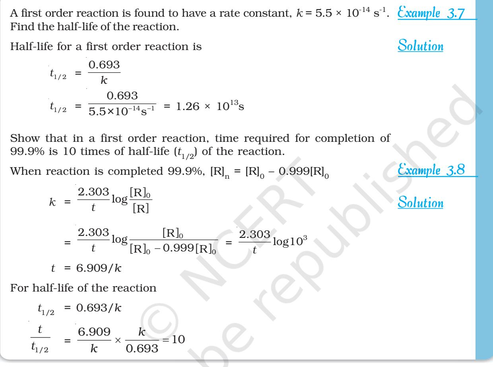

Table 3.4 summarises the mathematical features of integrated laws of zero and first order reactions.

### Table 3.4: Integrated Rate Laws for the Reactions of Zero and First Order

| Order | Reaction | Differential | Integrated |  | Straight | Half- | Units of k |
| --- | --- | --- | --- | --- | --- | --- | --- |
|  | type | rate law | rate law |  | line plot | life |  |
| 0 | R® P | d[R]/dt = -k | kt = [R]0 | -[R] | [R] vs t | /2k [R]0 | conc time-1 –1 or mol L–1s |
| 1 | R® P | d[R]/dt = -k[R] | [R] = [R]0 or kt = | -kt e | ln[R] vs t | ln 2/k | time-1 or s–1 |
|  |  |  | ln{[R]0 | /[R]} |  |  |  |

77 Chemical Kinetics

The order of a reaction is sometimes altered by conditions. There are many reactions which obey first order rate law although they are higher order reactions. Consider the hydrolysis of ethyl acetate which is a chemical reaction between ethyl acetate and water. In reality, it is a second order reaction and concentration of both ethyl acetate and water affect the rate of the reaction. But water is taken in large excess for hydrolysis, therefore, concentration of water is not altered much during the reaction. Thus, the rate of reaction is affected by concentration of ethyl acetate only. For example, during the hydrolysis of 0.01 mol of ethyl acetate with 10 mol of water, amounts of the reactants and products at the beginning (*t* = 0) and completion (*t*) of the reaction are given as under.

|  | CH3COOC2H5 | + H2O | H  | CH3COOH | + | C2H5OH |
| --- | --- | --- | --- | --- | --- | --- |
| t = 0 | 0.01 mol | 10 mol |  | 0 mol |  | 0 mol |
| t | 0 mol | 9.99 mol |  | 0.01 mol |  | 0.01 mol |

The concentration of water does not get altered much during the course of the reaction. So, the reaction behaves as first order reaction. Such reactions are called **pseudo first order reactions**.

Inversion of cane sugar is another pseudo first order reaction.

- C12H22O11 + H2O + →H C6H12O6 + C6H12O6 Cane sugar Glucose Fructose Rate = *k* [C12H22O11]
## Intext Questions

- 3.5 A first order reaction has a rate constant 1.15 × 10-3 s-1. How long will 5 g of this reactant take to reduce to 3 g?
- 3.6 Time required to decompose SO2Cl2 to half of its initial amount is 60 minutes. If the decomposition is a first order reaction, calculate the rate constant of the reaction.

3.4 Temperature Dependence of the Rate of a Reaction ReactionReaction

Most of the chemical reactions are accelerated by increase in temperature. For example, in decomposition of N2O5 , the time taken for half of the original amount of material to decompose is 12 min at 50oC, 5 h at 25oC and 10 days at 0oC. You also know that in a mixture of potassium permanganate (KMnO4 ) and oxalic acid (H2C2O4 ), potassium permanganate gets decolourised faster at a higher temperature than that at a lower temperature.

It has been found that for a chemical reaction with rise in temperature by 10°, the rate constant is nearly doubled.

The temperature dependence of the rate of a chemical reaction can be accurately explained by Arrhenius equation (3.18). It was first proposed by Dutch chemist, J.H. van't Hoff but Swedish chemist, Arrhenius provided its physical justification and interpretation.

Chemistry 78

$k=$ A e ${}^{-\mbox{\scriptsize{Ea}}/RT}$ (3.18)

where *A* is the Arrhenius factor or the frequency factor. It is also called pre-exponential factor. It is a constant specific to a particular reaction. *R* is gas constant and *E*a is activation energy measured in joules/mole (J mol –1).

It can be understood clearly using the following simple reaction

H g I g 2HI g 2 2

According to Arrhenius, this reaction can take place only when a molecule of hydrogen and a molecule of iodine collide to form an unstable intermediate (Fig. 3.6). It exists for a very short time and then breaks up to form two molecules of hydrogen iodide.

The energy required to form this intermediate, called activated complex (C), is known as activation energy (*E*a ). Fig. 3.7 is obtained by plotting potential energy vs reaction coordinate. Reaction coordinate represents the profile of energy change when reactants change into products.

Some energy is released when the complex decomposes to form products. So, the final enthalpy of the reaction depends upon the nature of reactants and products.

All the molecules in the reacting species do not have the same kinetic energy. Since it is difficult to predict the behaviour of any one molecule with precision, Ludwig Boltzmann and James Clark Maxwell used statistics to predict the behaviour of large number of molecules. According to them, the distribution of kinetic energy may be described by plotting the fraction of molecules (*N*E /*N*T ) with a given kinetic energy (E) vs kinetic energy (Fig. 3.8). Here, *N*E is the number of molecules with energy *E* and *N*T is total number of molecules.

The peak of the curve corresponds to the most probable kinetic energy, i.e., kinetic energy of maximum fraction of molecules. There are decreasing number of molecules with energies higher or lower than this value. When the

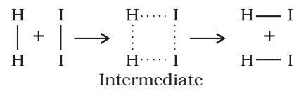

*Fig. 3.6: Formation of HI through the intermediate*

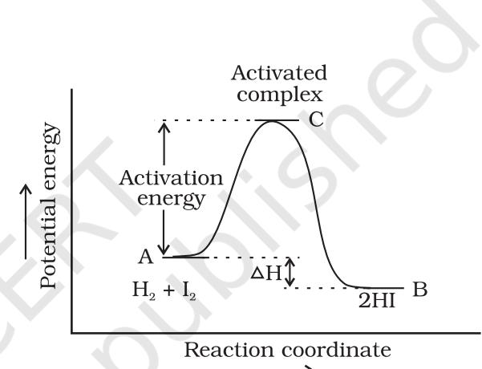

*Fig. 3.7: Diagram showing plot of potential energy vs reaction coordinate*

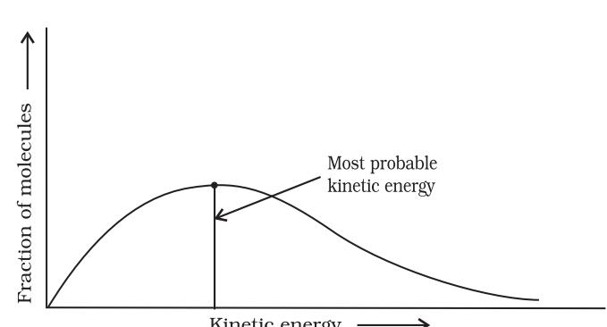

*Fig. 3.8: Distribution curve showing energies among gaseous molecules*

79 Chemical Kinetics

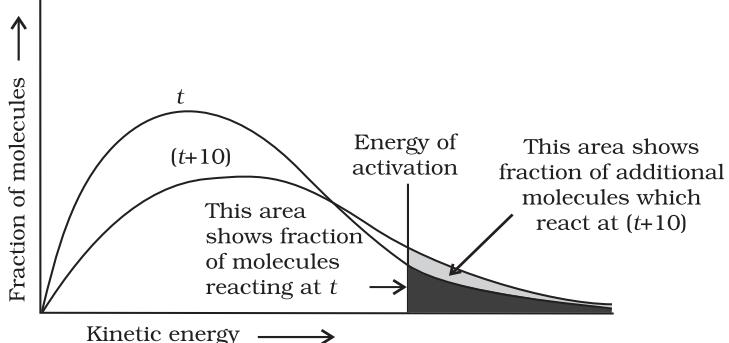

*Fig. 3.9: Distribution curve showing temperature dependence of rate of a reaction*

temperature is raised, the maximum of the curve moves to the higher energy value (Fig. 3.9) and the curve broadens out, i.e., spreads to the right such that there is a greater proportion of molecules with much higher energies. The area under the curve must be constant since total probability must be one at all times. We can mark the position of *E*a on Maxwell Boltzmann distribution curve (Fig. 3.9).

 Increasing the temperature of the substance increases the fraction of molecules, which collide with energies greater than *E*a . It is clear from the diagram that in the curve at (*t* + 10), the area showing the fraction of molecules having energy equal to or greater than activation energy gets doubled leading to doubling the rate of a reaction.

In the Arrhenius equation (3.18) the factor e -*E*a /*RT* corresponds to the fraction of molecules that have kinetic energy greater than *E*a . Taking natural logarithm of both sides of equation (3.18)

In $k=-\frac{E_{\rm a}}{RT}\neq\ln A$ (3.19)

The plot of ln *k* vs 1/T gives a straight line according to the equation (3.19) as shown in Fig. 3.10.

Thus, it has been found from Arrhenius equation (3.18) that increasing the temperature or decreasing the activation energy will result in an increase in the rate of the reaction and an exponential increase in the rate constant.

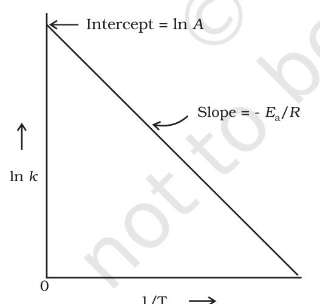

In Fig. 3.10, slope = – *E* a *R* and intercept = ln *A*. So we can calculate *E*a and *A* using these values. At temperature *T*1 , equation (3.19) is

In $k_{1}=-\frac{E_{a}}{RT_{1}}+$ In $A$ (3.20)

At temperature *T*2 , equation (3.19) is

In $k_{2}=-\frac{E_{a}}{RT_{2}}+$ In $A$ (3.21)

(since *A* is constant for a given reaction)

*k*1 and *k*2 are the values of rate constants at temperatures *T*1 and *T*2 respectively.

*Fig. 3.10: A plot between ln k and 1/T*

Chemistry 80

Subtracting equation (3.20) from (3.21), we obtain

In $k_{2}-\ln\ k_{1}=\frac{E_{\rm a}}{RT_{1}}-\frac{E_{\rm a}}{RT_{2}}$  
  

$$\ln\frac{k_{2}}{k_{1}}=\frac{E_{\rm a}}{R}\Bigg{[}\frac{1}{T_{1}}-\frac{1}{T_{2}}\Bigg{]}$$
  
  

$$\log\frac{k_{2}}{k_{1}}=\frac{E_{\rm a}}{2.303R}\Bigg{[}\frac{1}{T_{1}}-\frac{1}{T_{2}}\Bigg{]}\tag{3.22}$$
  
  

$$\log\frac{k_{2}}{k_{1}}=\frac{E_{\rm a}}{2.303R}\Bigg{[}\frac{T_{2}-T_{1}}{T_{1}T_{2}}\Bigg{]}$$

The rate constants of a reaction at 500K and 700K are 0.02s–1 and 0.07s–1 respectively. Calculate the values of *E*a and *A*. 2 1 log *k k* = a 2 1 2.303 1 2 *E T T R T T* 0.07 log 0.02 = a 1 1 700 500 2.303 8.314 J mol 700 500 *E K* 0.544 = *E*a × 5.714 × 10-4/19.15 *E*a = 0.544 × 19.15/5.714 × 10–4 = 18230.8 J Since *k* = *A*e -*E*a/*RT* 0.02 = *A*e -18230.8/8.314 × 500 *A* = 0.02/0.012 = 1.61 The first order rate constant for the decomposition of ethyl iodide by the reaction C2H5 I(g) ® C2H4 (g) + HI(g) at 600K is 1.60 × 10–5 s –1. Its energy of activation is 209 kJ/mol. Calculate the rate constant of the reaction at 700K. We know that log *k*2 – log *k*1 = a 1 2 1 1 2.303 *E R T T* Solution SolutionSolution Solution SolutionSolution Example 3.10 Example 3.9

81 Chemical Kinetics

$$\log\,k_{2}=\log k_{1}+\frac{E_{\rm a}}{2.303R}\Bigg{[}\frac{1}{T_{1}}-\frac{1}{T_{2}}\Bigg{]}$$
 
$$\cdot$$
 
$$=\log\left(1.60\times10^{-5}\right)+\frac{209000\,{\rm J\,mol\,L^{-1}}}{2.303\times8.314\,{\rm J\,mol\,L^{-1}K^{-1}}}\Bigg{[}\frac{1}{600\,{\rm K}}-\frac{1}{700\,{\rm K}}\Bigg{]}$$
 
$$\log\,k_{2}=-4.796\,+\,2.599\,=-\,2.197$$
 
$$k_{2}=6.36\,\times\,10^{-3}\,\,\,\,{\rm s}^{-1}$$

### 3.4.1 Effect of Catalyst

A catalyst is a substance which increases the rate of a reaction without itself undergoing any permanent chemical change. For example, MnO2 catalyses the following reaction so as to increase its rate considerably.

> 2KClO3 MnO 2 2 KCl + 3O2

The word catalyst should not be used when the added substance reduces the rate of raction. The substance is then called inhibitor. The action of the catalyst can be explained by intermediate complex theory. According to this theory, a catalyst participates in a chemical reaction by forming temporary bonds with the reactants resulting in an intermediate complex. This has a transitory existence and decomposes to yield products and the catalyst.

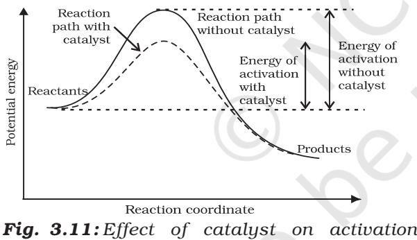

*energy*

It is believed that the catalyst provides an alternate pathway or reaction mechanism by reducing the activation energy between reactants and products and hence lowering the potential energy barrier as shown in Fig. 3.11.

It is clear from Arrhenius equation (3.18) that lower the value of activation energy faster will be the rate of a reaction.

A small amount of the catalyst can catalyse a large amount of reactants. A catalyst does not alter Gibbs energy, DG of a reaction. It catalyses the spontaneous reactions but does not catalyse non-spontaneous reactions. It is

also found that a catalyst does not change the equilibrium constant of a reaction rather, it helps in attaining the equilibrium faster, that is, it catalyses the forward as well as the backward reactions to the same extent so that the equilibrium state remains same but is reached earlier.

3.5 Collision Theory of Theory ofTheory of Chemical Reactions ReactionsReactions

Chemistry 82

Though Arrhenius equation is applicable under a wide range of circumstances, collision theory, which was developed by Max Trautz and William Lewis in 1916 -18, provides a greater insight into the energetic and mechanistic aspects of reactions. It is based on kinetic theory of gases. According to this theory, the reactant molecules are

assumed to be hard spheres and reaction is postulated to occur when molecules collide with each other. The number of collisions per second per unit volume of the reaction mixture is known as collision frequency (Z). Another factor which affects the rate of chemical reactions is activation energy (as we have already studied). For a bimolecular elementary reaction

A + B ® Products

rate of reaction can be expressed as

$${\rm Rate}={\rm Z}_{\rm AB}{\rm e}^{-E_{\rm n}/RT}\tag{3.23}$$

where *Z*AB represents the collision frequency of reactants, A and B and e-*E*a /*RT* represents the fraction of molecules with energies equal to or greater than *E*a . Comparing (3.23) with Arrhenius equation, we can say that *A* is related to collision frequency.

Equation (3.23) predicts the value of rate constants fairly accurately for the reactions that involve atomic species or simple molecules but for complex molecules significant deviations are observed. The reason could be that all collisions do not lead to the formation of products. The collisions in which molecules collide with sufficient kinetic energy (called threshold energy*) and proper orientation, so as to facilitate breaking of bonds between reacting species and formation of new bonds to form products are called as effective collisions.

For example, formation of methanol from bromoethane depends upon the orientation of reactant molecules as shown in Fig. 3.12. *The proper orientation of reactant molecules lead to bond formation whereas improper orientation makes them simply bounce back and no products are formed.*

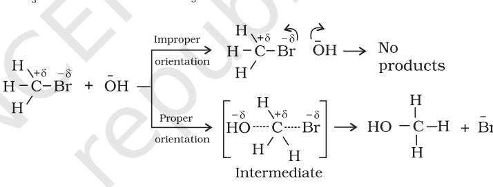

*Fig. 3.12: Diagram showing molecules having proper and improper orientation*

To account for effective collisions, another factor *P*, called the probability

or steric factor is introduced. It takes into account the fact that in a collision, molecules must be properly oriented i.e.,

$$\mathrm{Rate}=P Z_{\mathrm{AB}}\mathrm{e}^{-E_{\mathrm{a}}/R T}$$

Thus, in collision theory activation energy and proper orientation of the molecules together determine the criteria for an effective collision and hence the rate of a chemical reaction.

Collision theory also has certain drawbacks as it considers atoms/ molecules to be hard spheres and ignores their structural aspect. You will study details about this theory and more on other theories in your higher classes.

** Threshold energy = Activation Energy + energy possessed by reacting species.*

83 Chemical Kinetics

# Intext Questions

- 3.7 What will be the effect of temperature on rate constant ?
- 3.8 The rate of the chemical reaction doubles for an increase of 10K in absolute temperature from 298K. Calculate *E*a .
- 3.9 The activation energy for the reaction

 2 HI(g) ® H2 + I2 (g)

is 209.5 kJ mol–1 at 581K.Calculate the fraction of molecules of reactants having energy equal to or greater than activation energy?

# Summary Summary

Chemical kinetics is the study of chemical reactions with respect to reaction rates, effect of various variables, rearrangement of atoms and formation of intermediates. The rate of a reaction is concerned with decrease in concentration of reactants or increase in the concentration of products per unit time. It can be expressed as instantaneous rate at a particular instant of time and average rate over a large interval of time. A number of factors such as temperature, concentration of reactants, catalyst, affect the rate of a reaction. Mathematical representation of rate of a reaction is given by rate law. It has to be determined experimentally and cannot be predicted. Order of a reaction with respect to a reactant is the power of its concentration which appears in the rate law equation. The order of a reaction is the sum of all such powers of concentration of terms for different reactants. Rate constant is the proportionality factor in the rate law. Rate constant and order of a reaction can be determined from rate law or its integrated rate equation. Molecularity is defined only for an elementary reaction. Its values are limited from 1 to 3 whereas order can be 0, 1, 2, 3 or even a fraction. Molecularity and order of an elementary reaction are same.

Temperature dependence of rate constants is described by Arrhenius equation (*k* = *A*e –*E*a/*RT*). *E*a corresponds to the activation energy and is given by the energy difference between activated complex and the reactant molecules, and *A* (Arrhenius factor or pre-exponential factor) corresponds to the collision frequency. The equation clearly shows that increase of temperature or lowering of Ea will lead to an increase in the rate of reaction and presence of a catalyst lowers the activation energy by providing an alternate path for the reaction. According to collision theory, another factor *P* called steric factor which refers to the orientation of molecules which collide, is important and contributes to effective collisions, thus, modifying the Arrhenius equation to a / Z e AB *E RT k P* .

# Exercises ExercisesExercises

- 3.1 From the rate expression for the following reactions, determine their order of reaction and the dimensions of the rate constants.
(i) 3NO(g) ® N2O (g) Rate = *k*[NO]2

(ii) H2O2 (aq) + 3I– (aq) + 2H+ ® 2H2O (l) + 3 I Rate = *k*[H2O2 ][I- ] (iii) CH3CHO (g) ® CH4 (g) + CO(g) Rate = *k* [CH3CHO]3/2

(iv) C2H5Cl (g) ® C2H4 (g) + HCl (g) Rate = *k* [C2H5Cl]

- 3.2 For the reaction:
2A + B ® A2B

the rate = *k*[A][B]2 with k = 2.0 × 10–6 mol–2 L2 s–1. Calculate the initial rate of the reaction when [A] = 0.1 mol L–1, [B] = 0.2 mol L–1. Calculate the rate of reaction after [A] is reduced to 0.06 mol L–1 .

- 3.3 The decomposition of NH3 on platinum surface is zero order reaction. What are the rates of production of N2 and H2 if *k* = 2.5 × 10–4 mol–1 L s –1?
- 3.4 The decomposition of dimethyl ether leads to the formation of CH4 , H2 and CO and the reaction rate is given by

Rate = *k* [CH3OCH3 ] 3/2

The rate of reaction is followed by increase in pressure in a closed vessel, so the rate can also be expressed in terms of the partial pressure of dimethyl ether, i.e.,

$$\mathrm{Rate}=k\left(P_{\mathrm{CH_{3}OCH_{3}}}\right)^{3/2}$$

If the pressure is measured in bar and time in minutes, then what are the units of rate and rate constants?

- 3.5 Mention the factors that affect the rate of a chemical reaction.
- 3.6 A reaction is second order with respect to a reactant. How is the rate of reaction affected if the concentration of the reactant is (i) doubled (ii) reduced to half ?
- 3.7 What is the effect of temperature on the rate constant of a reaction? How can this effect of temperature on rate constant be represented quantitatively?
- 3.8 In a pseudo first order reaction in water, the following results were obtained:

| t/s | 0 | 30 | 60 | 90 |
| --- | --- | --- | --- | --- |
| [A]/ mol L–1 | 0.55 | 0.31 | 0.17 | 0.085 |

Calculate the average rate of reaction between the time interval 30 to 60 seconds.

- 3.9 A reaction is first order in A and second order in B.
(i) Write the differential rate equation.

- (ii) How is the rate affected on increasing the concentration of B three times?
- (iii) How is the rate affected when the concentrations of both A and B are doubled?

3.10 In a reaction between A and B, the initial rate of reaction (r0 ) was measured for different initial concentrations of A and B as given below:

| A/ mol L–1 | 0.20 | 0.20 | 0.40 |
| --- | --- | --- | --- |
| B/ mol L–1 | 0.30 | 0.10 | 0.05 |
| –1 /mol L–1s r 0 | 5.07 × 10–5 | 5.07 × 10–5 | 1.43 × 10–4 |

What is the order of the reaction with respect to A and B?

3.11 The following results have been obtained during the kinetic studies of the reaction: 2A + B ® C + D

| Experiment | [A]/mol L–1 | [B]/mol L–1 | Initial rate of formation of D/mol L–1 min–1 |
| --- | --- | --- | --- |
| I | 0.1 | 0.1 | 6.0 × 10–3 |
| II | 0.3 | 0.2 | 7.2 × 10–2 |
| III | 0.3 | 0.4 | 2.88 × 10–1 |
| IV | 0.4 | 0.1 | 2.40 × 10–2 |

Determine the rate law and the rate constant for the reaction.

3.12 The reaction between A and B is first order with respect to A and zero order with respect to B. Fill in the blanks in the following table:

| Experiment | [A]/ mol L–1 | [B]/ mol L–1 | Initial rate/ mol L–1 min–1 |
| --- | --- | --- | --- |
| I | 0.1 | 0.1 | 2.0 × 10–2 |
| II | – | 0.2 | 4.0 × 10–2 |
| III | 0.4 | 0.4 | – |
| IV | – | 0.2 | 2.0 × 10–2 |

- 3.13 Calculate the half-life of a first order reaction from their rate constants given below:
  
  
**(i) 200 s${}^{-1}$**(ii) 2 min${}^{-1}$**(iii) 4 years${}^{-1}$**

- 3.14 The half-life for radioactive decay of 14C is 5730 years. An archaeological artifact containing wood had only 80% of the 14C found in a living tree. Estimate the age of the sample.
- 3.15 The experimental data for decomposition of N2O5

[2N2O5 ® 4NO2 + O2 ]

in gas phase at 318K are given below:

| t/s |  |  | 0 | 400 | 800 | 1200 | 1600 | 2000 | 2400 | 2800 | 3200 |
| --- | --- | --- | --- | --- | --- | --- | --- | --- | --- | --- | --- |
| 102 mol L–1 | × [N2O5 | ]/ | 1.63 | 1.36 | 1.14 | 0.93 | 0.78 | 0.64 | 0.53 | 0.43 | 0.35 |

(i) Plot [N2O5 ] against *t*.

(ii) Find the half-life period for the reaction.

- (iii) Draw a graph between log[N2O5 ] and *t.*
- (iv) What is the rate law ?

Chemistry 86

(v) Calculate the rate constant.

(vi) Calculate the half-life period from *k* and compare it with (ii).

- 3.16 The rate constant for a first order reaction is 60 s–1. How much time will it take to reduce the initial concentration of the reactant to its 1/16th value?
- 3.17 During nuclear explosion, one of the products is 90Sr with half-life of 28.1 years. If 1mg of 90Sr was absorbed in the bones of a newly born baby instead of calcium, how much of it will remain after 10 years and 60 years if it is not lost metabolically.
- 3.18 For a first order reaction, show that time required for 99% completion is twice the time required for the completion of 90% of reaction.
- 3.19 A first order reaction takes 40 min for 30% decomposition. Calculate t1/2.
- 3.20 For the decomposition of azoisopropane to hexane and nitrogen at 543 K, the following data are obtained.

| t (sec) | P(mm of Hg) |
| --- | --- |
| 0 | 35.0 |
| 360 | 54.0 |
| 720 | 63.0 |

Calculate the rate constant.

- 3.21 The following data were obtained during the first order thermal decomposition of SO2Cl2 at a constant volume.
SO Cl g SO g Cl g 2 2 2 2

| Experiment | Time/s–1 | Total pressure/atm |
| --- | --- | --- |
| 1 | 0 | 0.5 |
| 2 | 100 | 0.6 |

Calculate the rate of the reaction when total pressure is 0.65 atm.

- 3.22 The rate constant for the decomposition of N2O5 at various temperatures is given below:

| T/°C |  | 0 | 20 | 40 | 60 | 80 |
| --- | --- | --- | --- | --- | --- | --- |
| 105 | × k/s-1 | 0.0787 | 1.70 | 25.7 | 178 | 2140 |

Draw a graph between ln *k* and 1/*T* and calculate the values of *A* and *E*a . Predict the rate constant at 30° and 50°C.

- 3.23 The rate constant for the decomposition of hydrocarbons is 2.418 × 10–5s –1 at 546 K. If the energy of activation is 179.9 kJ/mol, what will be the value of pre-exponential factor.
- 3.24 Consider a certain reaction A ® Products with *k* = 2.0 × 10 –2s –1. Calculate the concentration of *A* remaining after 100 s if the initial concentration of *A* is 1.0 mol L–1 .
- 3.25 Sucrose decomposes in acid solution into glucose and fructose according to the first order rate law, with *t* 1/2 = 3.00 hours. What fraction of sample of sucrose remains after 8 hours ?
- 3.26 The decomposition of hydrocarbon follows the equation

*k* = (4.5 × 1011s –1) e-28000*K*/*T*

Calculate *E*a .

- 3.27 The rate constant for the first order decomposition of H2O2 is given by the following equation:
log *k* = 14.34 – 1.25 × 104*K*/*T*

Calculate *E*a for this reaction and at what temperature will its half-period be 256 minutes?

- 3.28 The decomposition of A into product has value of *k* as 4.5 × 103 s–1 at 10°C and energy of activation 60 kJ mol–1. At what temperature would *k* be 1.5 × 104s –1?
- 3.29 The time required for 10% completion of a first order reaction at 298K is equal to that required for its 25% completion at 308K. If the value of *A* is 4 × 1010s –1. Calculate *k* at 318K and *E*a .
- 3.30 The rate of a reaction quadruples when the temperature changes from 293 K to 313 K. Calculate the energy of activation of the reaction assuming that it does not change with temperature.

### Answers to Some Intext Questions

- 3.1 rav = 6.66 × 10–6 Ms–1
- 3.2 Rate of reaction = rate of diappearance of A = 0.005 mol litre–1min–1
- 3.3 Order of the reaction is 2.5
- 3.4 X ® Y Rate = k[X]2 The rate will increase 9 times
- 3.5 t = 444 s
- 3.6 1.925 × 10–4 s–1
- 3.8 Ea = 52.897 kJ mol–1
- 3.9 1.471 × 10–19

