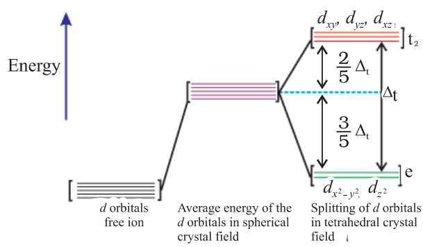

## Objectives

able to

- appreciate the postulates of Werner's theory of coordination compounds;
- know the meaning of the terms: coordination entity, central atom/ ion, ligand, coordination number, coordination sphere, coordination polyhedron, oxidation number, homoleptic and heteroleptic;
- learn the rules of nomenclature of coordination compounds;
- write the formulas and names of mononuclear coordination compounds;
- define different types of isomerism in coordination compounds;
- understand the nature of bonding in coordination compounds in terms of the Valence Bond and Crystal Field theories;
- appreciate the importance and applications of coordination compounds in our day to day life.

# Coordination Compounds After studying this Unit, you will be Coordination Compounds **5** Unit

*Coordination Compounds are the backbone of modern inorganic and bio–inorganic chemistry and chemical industry.*

In the previous Unit we learnt that the transition metals form a large number of complex compounds in which the metal atoms are bound to a number of anions or neutral molecules by sharing of electrons. In modern terminology such compounds are called coordination compounds. The chemistry of coordination compounds is an important and challenging area of modern inorganic chemistry. New concepts of chemical bonding and molecular structure have provided insights into the functioning of these compounds as vital components of biological systems. Chlorophyll, haemoglobin and vitamin B12 are coordination compounds of magnesium, iron and cobalt respectively. Variety of metallurgical processes, industrial catalysts and analytical reagents involve the use of coordination compounds. Coordination compounds also find many applications in electroplating, textile dyeing and medicinal chemistry.

5.1 Werner's Theory ofTheory of Theory of Coordination CompoundsCompounds Compounds

Chemistry 118

Alfred Werner (1866-1919), a Swiss chemist was the first to formulate his ideas about the structures of coordination compounds. He prepared and characterised a large number of coordination compounds and studied their physical and chemical behaviour by simple experimental techniques. Werner proposed the concept of a primary valence and a secondary valence for a metal ion. Binary compounds such as CrCl3, CoCl2 or PdCl2 have primary valence of 3, 2 and 2 respectively. In a series of compounds of cobalt(III) chloride with ammonia, it was found that some of the chloride ions could be precipitated as AgCl on adding excess silver nitrate solution in cold but some remained in solution.

| 1 mol | CoCl3.6NH3 | (Yellow) | gave | 3 mol AgCl |
| --- | --- | --- | --- | --- |
| 1 mol | CoCl3.5NH3 | (Purple) | gave | 2 mol AgCl |
| 1 mol | CoCl3.4NH3 (Green) |  | gave | 1 mol AgCl |
| 1 mol | CoCl3.4NH3 | (Violet) | gave | 1 mol AgCl |

These observations, together with the results of conductivity measurements in solution can be explained if (i) six groups in all, either chloride ions or ammonia molecules or both, remain bonded to the cobalt ion during the reaction and (ii) the compounds are formulated as shown in Table 5.1, where the atoms within the square brackets form a single entity which does not dissociate under the reaction conditions. Werner proposed the term secondary valence for the number of groups bound directly to the metal ion; in each of these examples the secondary valences are six.

Table 5.1: Formulation of Cobalt(III) Chloride-Ammonia Complexes

| Colour | Formula | Solution conductivity |
| --- | --- | --- |
|  |  | corresponds to |
| Yellow | 3+3Cl– [Co(NH3)6] | 1:3 electrolyte |
| Purple | [CoCl(NH3)5] 2+2Cl– | 1:2 electrolyte |
| Green | +Cl– [CoCl2(NH3)4] | 1:1 electrolyte |
| Violet | +Cl– [CoCl2(NH3)4] | 1:1 electrolyte |

Note that the last two compounds in Table 5.1 have identical empirical formula, CoCl3.4NH3, but distinct properties. Such compounds are termed as isomers. Werner in 1898, propounded his theory of coordination compounds. The main postulates are:

- 1. In coordination compounds metals show two types of linkages (valences)-primary and secondary.
- 2. The primary valences are normally ionisable and are satisfied by negative ions.
- 3. The secondary valences are non ionisable. These are satisfied by neutral molecules or negative ions. The secondary valence is equal to the coordination number and is fixed for a metal.
- 4. The ions/groups bound by the secondary linkages to the metal have characteristic spatial arrangements corresponding to different coordination numbers.

In modern formulations, such spatial arrangements are called coordination *polyhedra*. The species within the square bracket are coordination entities or complexes and the ions outside the square bracket are called counter ions.

He further postulated that octahedral, tetrahedral and square planar geometrical shapes are more common in coordination compounds of transition metals. Thus, [Co(NH3 )6 ] 3+, [CoCl(NH3 )5 ] 2+ and [CoCl2 (NH3 )4 ] + are octahedral entities, while [Ni(CO)4 ] and [PtCl4 ] 2– are tetrahedral and square planar, respectively.

119 Coordination Compounds

| On the basis of the following observations made with aqueous solutions, |  | Example 5.1 Example 5.1 Example 5.1 |
| --- | --- | --- |
| assign secondary valences to metals in the following compounds: |  |  |
| Formula | Moles of AgCl precipitated per mole of |  |
| the compounds with excess AgNO3 |  |  |
| (i) PdCl2 .4NH3 | 2 |  |
| (ii) NiCl2 .6H2O | 2 |  |
| (iii) PtCl4 .2HCl | 0 |  |
| (iv) CoCl3 .4NH3 | 1 |  |
| (v) PtCl2 .2NH3 | 0 |  |
| (i) Secondary 4 | (ii) Secondary 6 | Solution Solution Solution |
| (iii) Secondary 6 | (iv) Secondary 6 (v) Secondary 4 |  |

*Difference between a double salt and a complex*

Both double salts as well as complexes are formed by the combination of two or more stable compounds in stoichiometric ratio. However, they differ in the fact that double salts such as carnallite, KCl.MgCl2.6H2O, Mohr's salt, FeSO4.(NH4)2SO4.6H2O, potash alum, KAl(SO4)2.12H2O, etc. dissociate into simple ions completely when dissolved in water. However, complex ions such as [Fe(CN)6] 4– of K4 [Fe(CN)6] do not dissociate into Fe2+ and CN– ions.

Werner was born on December 12, 1866, in Mülhouse, a small community in the French province of Alsace. His study of chemistry began in Karlsruhe (Germany) and continued in Zurich (Switzerland), where in his doctoral thesis in 1890, he explained the difference in properties of certain nitrogen containing organic substances on the basis of isomerism. He extended vant Hoff's theory of tetrahedral carbon atom and modified

it for nitrogen. Werner showed optical and electrical differences between complex compounds based on physical measurements. In fact, Werner was the first to discover optical activity in certain coordination compounds.

He, at the age of 29 years became a full professor at Technische Hochschule in Zurich in 1895. Alfred Werner was a chemist and educationist. His accomplishments included the development of the theory of coordination compounds. This theory, in which Werner proposed revolutionary ideas about how atoms and molecules are linked together, was formulated in a span of only three years, from 1890 to 1893. The remainder of his career was spent gathering the experimental support required to validate his new ideas. Werner became the first Swiss chemist to win the Nobel Prize in 1913 for his work on the linkage of atoms and the coordination theory.

5.2 Definitions of Some Important ImportantImportant Terms Pertaining to Coordination Compounds CompoundsCompounds

#### *(a) Coordination entity*

A coordination entity constitutes a central metal atom or ion bonded to a fixed number of ions or molecules. For example, [CoCl3 (NH3 )3 ] is a coordination entity in which the cobalt ion is surrounded by three ammonia molecules and three chloride ions. Other examples are [Ni(CO)4 ], [PtCl2 (NH3 )2 ], [Fe(CN)6 ] 4–, [Co(NH3 )6 ] 3+ .

*(b) Central atom/ion*

In a coordination entity, the atom/ion to which a fixed number of ions/groups are bound in a definite geometrical arrangement around it, is called the central atom or ion. For example, the central atom/ion in the coordination entities: [NiCl2(H2O)4], [CoCl(NH3 )5 ] 2+ and [Fe(CN)6 ] 3– are Ni2+, Co3+ and Fe3+, respectively. These central atoms/ions are also referred to as Lewis acids.

*(c) Ligands*

The ions or molecules bound to the central atom/ion in the coordination entity are called ligands. These may be simple ions such as Cl– , small molecules such as H2O or NH3 , larger molecules such as H2NCH2CH2NH2 or N(CH2CH2NH2 )3 or even macromolecules, such as proteins.

When a ligand is bound to a metal ion through a single donor atom, as with Cl–

, H2O or NH3 , the ligand is said to be unidentate. When a ligand can bind through two donor atoms as in H2NCH2CH2NH2 (ethane-1,2-diamine) or C2O4 2– (oxalate), the ligand is said to be didentate and when several donor atoms are present in a single ligand as in N(CH2CH2NH2 )3 , the ligand is said to be polydentate. Ethylenediaminetetraacetate ion (EDTA4–) is an important hexadentate ligand. It can bind through two nitrogen and four oxygen atoms to a central metal ion.

When a di- or polydentate ligand uses its two or more donor atoms simultaneously to bind a single metal ion, it is said to be a chelate ligand. The number of such ligating groups is called the denticity of the ligand. Such complexes, called chelate complexes tend to be more stable than similar complexes containing unidentate ligands. Ligand which has two different donor atoms and either of

$$\mathrm{M}\xleftarrow{\mathrm{N}}\xleftarrow{\mathrm{O}}\quad\mathrm{M}\xleftarrow{\mathrm{O}}\xleftarrow{\mathrm{N}}\xleftarrow{\mathrm{O}}$$

ligand. Examples of such ligands are the NO2 – and SCN– ions. NO2 – ion can coordinate either through nitrogen or through oxygen to a central metal atom/ion.

the two ligetes in the complex is called ambidentate

Similarly, SCN– ion can coordinate through the sulphur or nitrogen atom.

*(d) Coordination number*

The coordination number (CN) of a metal ion in a complex can be defined as the number of ligand donor atoms to which the metal is directly bonded. For example, in the complex ions, [PtCl6 ] 2– and [Ni(NH3 )4 ] 2+, the coordination number of Pt and Ni are 6 and 4 respectively. Similarly, in the complex ions, [Fe(C2O4 )3 ] 3– and [Co(en)3 ] 3+, the coordination number of both, Fe and Co, is 6 because C2O4 2– and en (ethane-1,2-diamine) are didentate ligands.

121 Coordination Compounds

It is important to note here that coordination number of the central atom/ion is determined only by the number of sigma bonds formed by the ligand with the central atom/ion. Pi bonds, if formed between the ligand and the central atom/ion, are not counted for this purpose.

- *(e) Coordination sphere*
The central atom/ion and the ligands attached to it are enclosed in square bracket and is collectively termed as the coordination sphere. The ionisable groups are written outside the bracket and are called counter ions. For example, in the complex K4 [Fe(CN)6 ], the coordination sphere is [Fe(CN)6 ] 4– and the counter ion is K+ .

- *(f) Coordination polyhedron*
The spatial arrangement of the ligand atoms which are directly attached to the central atom/ion defines a coordination polyhedron about the central atom. The most common coordination polyhedra are octahedral, square planar and tetrahedral. For example, [Co(NH3 )6 ] 3+ is octahedral, [Ni(CO)4 ] is tetrahedral and [PtCl4 ] 2– is square planar. Fig. 5.1 shows the shapes of different coordination polyhedra.

*(g) Oxidation number of central atom*

The oxidation number of the central atom in a complex is defined as the charge it would carry if all the ligands are removed along with the electron pairs that are shared with the central atom. The oxidation number is represented by a Roman numeral in parenthesis following the name of the coordination entity. For example, oxidation number of copper in [Cu(CN)4] 3– is +1 and it is written as Cu(I).

*(h) Homoleptic and heteroleptic complexes*

Complexes in which a metal is bound to only one kind of donor groups, *e.g.*, [Co(NH3)6] 3+, are known as homoleptic. Complexes in which a metal is bound to more than one kind of donor groups, *e.g.*, [Co(NH3 )4Cl2 ] + , are known as heteroleptic.

5.3 Nomenclature of Coordination CompoundsCompounds Compounds

Nomenclature is important in Coordination Chemistry because of the need to have an unambiguous method of describing formulas and writing systematic names, particularly when dealing with isomers. The formulas and names adopted for coordination entities are based on the recommendations of the International Union of Pure and Applied Chemistry (IUPAC).

#### 5.3.1 Formulas of Mononuclear Coordination Entities

The formula of a compound is a shorthand tool used to provide basic information about the constitution of the compound in a concise and convenient manner. Mononuclear coordination entities contain a single central metal atom. The following rules are applied while writing the formulas:

- (i) The central atom is listed first.
- (ii) The ligands are then listed in alphabetical order. The placement of a ligand in the list does not depend on its charge.
- (iii) Polydentate ligands are also listed alphabetically. In case of abbreviated ligand, the first letter of the abbreviation is used to determine the position of the ligand in the alphabetical order.
- (iv) The formula for the entire coordination entity, whether charged or not, is enclosed in square brackets. When ligands are polyatomic, their formulas are enclosed in parentheses. Ligand abbreviations are also enclosed in parentheses.
- (v) There should be no space between the ligands and the metal within a coordination sphere.
- (vi) When the formula of a charged coordination entity is to be written without that of the counter ion, the charge is indicated outside the square brackets as a right superscript with the number before the sign. For example, [Co(CN)6 ] 3–, [Cr(H2O)6 ] 3+, etc.
- (vii) The charge of the cation(s) is balanced by the charge of the anion(s).

#### 5.3.2 Naming of Mononuclear Coordination Compounds

*Note: The 2004 IUPAC draft recommends that ligands will be sorted alphabetically,*

*irrespective of charge.*

The names of coordination compounds are derived by following the principles of additive nomenclature. Thus, the groups that surround the central atom must be identified in the name. They are listed as prefixes to the name of the central atom along with any appropriate multipliers. The following rules are used when naming coordination compounds:

- (i) The cation is named first in both positively and negatively charged coordination entities.
- (ii) The ligands are named in an alphabetical order before the name of the central atom/ion. (This procedure is reversed from writing formula).
- (iii) Names of the anionic ligands end in –o, those of neutral and cationic ligands are the same except aqua for H2O, ammine for NH3 , carbonyl for CO and nitrosyl for NO. While writing the formula of coordination entity, these are enclosed in brackets ( ).
- (iv) Prefixes mono, di, tri, etc., are used to indicate the number of the individual ligands in the coordination entity. When the names of the ligands include a numerical prefix, then the terms, *bis*, *tris*, *tetrakis* are used, the ligand to which they refer being placed in parentheses. For example, [NiCl2 (PPh3 )2 ] is named as dichloridobis(triphenylphosphine)nickel(II).
- (v) Oxidation state of the metal in cation, anion or neutral coordination entity is indicated by Roman numeral in parenthesis.
- (vi) If the complex ion is a cation, the metal is named same as the element. For example, Co in a complex cation is called cobalt and Pt is called platinum. If the complex ion is an anion, the name of the metal ends with the suffix – ate. For example, Co in a complex anion, 2 Co SCN 4 is called cobaltate. For some metals, the Latin names are used in the complex anions, *e*.g., ferrate for Fe.

Note*: The 2004 IUPAC draft recommends that anionic ligands will end with–ido so that chloro would become chlorido, etc.*

123 Coordination Compounds

- (vii) The neutral complex molecule is named similar to that of the complex cation.
The following examples illustrate the nomenclature for coordination compounds.

- 1. [Cr(NH3 )3 (H2O)3 ]Cl3 is named as:
triamminetriaquachromium(III) chloride

*Explanation*: The complex ion is inside the square bracket, which is a cation. The amine ligands are named before the aqua ligands according to alphabetical order. Since there are three chloride ions in the compound, the charge on the complex ion must be +3 (since the compound is electrically neutral). From the charge on the complex ion and the charge on the ligands, we can calculate the oxidation number of the metal. In this example, all the ligands are neutral molecules. Therefore, the oxidation number of chromium must be the same as the charge of the complex ion, +3.

- 2. [Co(H2NCH2CH2NH2 )3 ]2 (SO4 )3 is named as:
tris(ethane-1,2–diamine)cobalt(III) sulphate

*Explanation*: The sulphate is the counter anion in this molecule. Since it takes 3 sulphates to bond with two complex cations, the charge on each complex cation must be +3. Further, ethane-1,2– diamine is a neutral molecule, so the oxidation number of cobalt in the complex ion must be +3. *Remember that you never have to indicate the number of cations and anions in the name of an ionic compound.*

- 3. [Ag(NH3 )2 ][Ag(CN)2 ] is named as: diamminesilver(I) dicyanidoargentate(I)

| Example 5.2 Example 5.2 Example 5.2 | Write the formulas for the following coordination compounds: |
| --- | --- |
|  | (a) Tetraammineaquachloridocobalt(III) chloride |
|  | (b) Potassium tetrahydroxidozincate(II) |
|  | (c) Potassium trioxalatoaluminate(III) |
|  | (d) Dichloridobis(ethane-1,2-diamine)cobalt(III) |
|  | (e) Tetracarbonylnickel(0) |
| Solution Solution Solution | (a) ) (b) ] (c) ) ] [Co(NH3 (H2O)Cl]Cl2 K2 [Zn(OH)4 K3 [Al(C2O4 |
|  | 4 3 + (d) ] (e) ] [CoCl2 (en)2 [Ni(CO)4 |
| Example 5.3 Example 5.3 Example 5.3 | Write the IUPAC names of the following coordination compounds: |
|  | (a) [Pt(NH3)2Cl(NO2)] (b) K3[Cr(C2O4)3] (c) [CoCl2(en)2]Cl |
|  | (d) [Co(NH3 )5 (CO3 )]Cl (e) Hg[Co(SCN)4 ] |
| Solution Solution Solution | (a) Diamminechloridonitrito-N-platinum(II) |
|  | (b) Potassium trioxalatochromate(III) |
|  | (c) Dichloridobis(ethane-1,2-diamine)cobalt(III) chloride |
|  | (d) Pentaamminecarbonatocobalt(III) chloride |
|  | (e) Mercury (I) tetrathiocyanato-S-cobaltate(III) |

Chemistry 124

*Notice how the name of the metal differs in cation and anion even though they contain the same metal ions.*

| Intext Questions 5.1 | Write the formulas for the following coordination compounds: |
| --- | --- |
|  | (i) Tetraamminediaquacobalt(III) chloride |
|  | (ii) Potassium tetracyanidonickelate(II) |
| (iii) | Tris(ethane–1,2–diamine) chromium(III) chloride |
| (iv) | Amminebromidochloridonitrito-N-platinate(II) |
|  | (v) Dichloridobis(ethane–1,2–diamine)platinum(IV) nitrate |
| (vi) | Iron(III) hexacyanidoferrate(II) |
|  | 5.2 Write the IUPAC names of the following coordination compounds: |
|  | (i) [Co(NH3 )6 ]Cl3 (ii) [Co(NH3 )5Cl]Cl2 (iii) K3 [Fe(CN)6 ] |
|  | (iv) K3 [Fe(C2O4 )3 ] (v) K2 [PdCl4 ] (vi) [Pt(NH3 )2Cl(NH2CH3 )]Cl |

5.4 Isomerism in Coordination Compounds CompoundsCompounds

Isomers are two or more compounds that have the same chemical formula but a different arrangement of atoms. Because of the different arrangement of atoms, they differ in one or more physical or chemical properties. Two principal types of isomerism are known among coordination compounds. Each of which can be further subdivided.

- *(a) Stereoisomerism*
	- (i) Geometrical isomerism (ii) Optical isomerism
- *(b) Structural isomerism*
	-
	- (i) Linkage isomerism (ii) Coordination isomerism
	- (iii) Ionisation isomerism (iv) Solvate isomerism

Stereoisomers have the same chemical formula and chemical bonds but they have different spatial arrangement. Structural isomers have different bonds. A detailed account of these isomers are given below.

#### 5.4.1 Geometric Isomerism

- *Fig. 5.2: Geometrical isomers (cis and trans) of Pt* [*NH3* ) *2Cl2* ]

This type of isomerism arises in heteroleptic complexes due to different possible geometric arrangements of the ligands. Important examples of this behaviour are found with coordination numbers 4 and 6. In a square planar complex of formula [MX2L2 ] (X and L are unidentate), the two ligands X may be arranged adjacent to each other in a *cis* isomer, or opposite to each other in a *trans* isomer as depicted in Fig. 5.2.

Other square planar complex of the type MABXL (where A, B, X, L are unidentates) shows three isomers-two *cis* and one *trans*. You may attempt to draw these structures. Such isomerism is not possible for a tetrahedral geometry but similar behaviour is possible in octahedral complexes of formula [MX2L4 ] in which the two ligands X may be oriented *cis* or *trans* to each other (Fig. 5.3).

125 Coordination Compounds

*Fig. 5.4: Geometrical isomers (cis and trans) of [CoCl2 (en)2 ]*

This type of isomerism also arises when didentate ligands L – L [*e.g.,* NH2 CH2 CH2 NH2 (en)] are present in complexes of formula [MX2 (L– L)2 ] (Fig. 5.4).

Another type of geometrical isomerism occurs in octahedral coordination entities of the type [Ma3b3] like [Co(NH3)3(NO2)3]. If three donor atoms of the same ligands occupy adjacent positions at the corners of an octahedral face, we have the facial (fac) isomer. When the positions are around the meridian of the octahedron, we get the meridional (mer) isomer (Fig. 5.5).

Why is geometrical isomerism not possible in tetrahedral complexes having two different types of unidentate ligands coordinated with the central metal ion ? Example 5.4

Tetrahedral complexes do not show geometrical isomerism because the relative positions of the unidentate ligands attached to the central metal atom are the same with respect to each other. Solution SolutionSolution

#### 5.4.2 Optical Isomerism

3+

Optical isomers are mirror images that cannot be superimposed on one another. These are called as *enantiomers*. The molecules or ions that cannot be superimposed are called *chiral*. The two forms are called *dextro (d)* and *laevo (l)* depending upon the direction they rotate the plane of polarised light in a polarimeter (*d* rotates to the right, *l* to the left). Optical isomerism is common in octahedral complexes involving didentate ligands (Fig. 5.6).

> In a coordination entity of the type [PtCl2(en)2] 2+, only the *cis*-isomer shows optical activity (Fig. 5.7).

Chemistry 126

| 5.4.3 Linkage | Linkage isomerism arises in a coordination compound containing |
| --- | --- |
| Isomerism | ambidentate ligand. A simple example is provided by complexes |
|  | containing the thiocyanate ligand, NCS– , which may bind through the |
|  | nitrogen to give M–NCS or through sulphur to give M–SCN. Jørgensen |
|  | discovered such behaviour in the complex [Co(NH3 )5 (NO2 )]Cl2 , which is |
|  | obtained as the red form, in which the nitrite ligand is bound through |
|  | oxygen (–ONO), and as the yellow form, in which the nitrite ligand is |
|  | ). bound through nitrogen (–NO2 |

- This type of isomerism arises from the interchange of ligands between cationic and anionic entities of different metal ions present in a complex. An example is provided by [Co(NH3 )6 ][Cr(CN)6 ], in which the NH3 ligands are bound to Co3+ and the CN– ligands to Cr3+. In its coordination isomer [Cr(NH3 )6 ][Co(CN)6 ], the NH3 ligands are bound to Cr3+ and the CN– ligands to Co3+ . 5.4.4 Coordination Isomerism
- This form of isomerism arises when the counter ion in a complex salt is itself a potential ligand and can displace a ligand which can then become the counter ion. An example is provided by the ionisation isomers [Co(NH3 )5 (SO4 )]Br and [Co(NH3 )5Br]SO4 . 5.4.5 Ionisation Isomerism

#### This form of isomerism is known as 'hydrate isomerism' in case where water is involved as a solvent. This is similar to ionisation isomerism. Solvate isomers differ by whether or not a solvent molecule is directly bonded to the metal ion or merely present as free solvent moleculesin the crystal lattice. An example is provided by the aqua complex [Cr(H2O)6 ]Cl3 (violet) and its solvate isomer [Cr(H2O)5Cl]Cl2 .H2O (grey-green). 5.4.6 Solvate Isomerism

- Intext Questions 5.3 Indicate the types of isomerism exhibited by the following complexes and draw the structures for these isomers:
	- (i) K[Cr(H2O)2 (C2O4 )2

)5 (NO2

)](NO3 )2

(iii) [Co(NH3

(ii) [Co(en)3 ]Cl3 (iv) [Pt(NH3 )(H2O)Cl2

]

- 5.4 Give evidence that [Co(NH3 )5Cl]SO4 and [Co(NH3 )5 (SO4 )]Cl are ionisation isomers.
## 5.5 Bonding in Coordination Compounds CompoundsCompounds

Werner was the first to describe the bonding features in coordination compounds. But his theory could not answer basic questions like:

- (i) Why only certain elements possess the remarkable property of forming coordination compounds?
- (ii) Why the bonds in coordination compounds have directional properties?
- (iii) Why coordination compounds have characteristic magnetic and optical properties?

Many approaches have been put forth to explain the nature of bonding in coordination compounds *viz.* Valence Bond Theory (VBT), Crystal Field Theory (CFT), Ligand Field Theory (LFT) and Molecular Orbital Theory (MOT). We shall focus our attention on elementary treatment of the application of VBT and CFT to coordination compounds.

#### 5.5.1 Valence Bond Theory

According to this theory, the metal atom or ion under the influence of ligands can use its (n-1)*d*, n*s*, n*p* or n*s*, n*p*, n*d* orbitals for hybridisation to yield a set of equivalent orbitals of definite geometry such as octahedral, tetrahedral, square planar and so on (Table 5.2). These hybridised orbitals are allowed to overlap with ligand orbitals that can donate electron pairs for bonding. This is illustrated by the following examples.

| Coordination | Type of | Distribution of hybrid |
| --- | --- | --- |
| number | hybridisation | orbitals in space |
| 4 | sp3 | Tetrahedral |
| 4 | dsp2 | Square planar |
| 5 | sp3 d | Trigonal bipyramidal |
| 6 | 2 sp3 d | Octahedral |
| 6 | 2 d sp3 | Octahedral |

#### Table 5.2: Number of Orbitals and Types of Hybridisations

It is usually possible to predict the geometry of a complex from

the knowledge of its magnetic behaviour on the basis of the valence bond theory.

In the diamagnetic octahedral complex, [Co(NH3 )6 ] 3+, the cobalt ion is in +3 oxidation state and has the electronic configuration 3*d* 6 . The hybridisation scheme is as shown in diagram.

Six pairs of electrons, one from each NH3 molecule, occupy the six hybrid orbitals. Thus, the complex has octahedral geometry and is diamagnetic because of the absence of unpaired electron. In the formation of this complex, since the inner *d* orbital (3*d*) is used in hybridisation, the complex, [Co(NH3)6] 3+ is called an inner orbital or low spin or spin paired complex. The paramagnetic octahedral complex, [CoF6] 3– uses outer orbital (4*d* ) in hybridisation (*sp* 3 *d* 2 ). It is thus called outer orbital or high spin or spin free complex. Thus:

Each Cl– ion donates a pair of electrons. The compound is paramagnetic since it contains two unpaired electrons. Similarly, [Ni(CO)4 ] has tetrahedral geometry but is diamagnetic since nickel is in zero oxidation state and contains no unpaired electron.

129 Coordination Compounds

] 2- .

In the square planar complexes, the hybridisation involved is *dsp*2 . An example is [Ni(CN)4 ] 2–. Here nickel is in +2 oxidation state and has the electronic configuration 3*d* 8 . The hybridisation scheme is as shown in diagram:

Each of the hybridised orbitals receives a pair of electrons from a cyanide ion. The compound is diamagnetic as evident from the absence of unpaired electron.

It is important to note that the hybrid orbitals do not actually exist. In fact, hybridisation is a mathematical manipulation of wave equation for the atomic orbitals involved.

#### 5.5.2 Magnetic Properties of Coordination Compounds

The magnetic moment of coordination compounds can be measured by the magnetic susceptibility experiments. The results can be used to obtain information about the number of unpaired electrons and hence structures adopted by metal complexes.

A critical study of the magnetic data of coordination compounds of metals of the first transition series reveals some complications. For metal ions with upto three electrons in the *d* orbitals, like Ti 3+ (*d* 1 ); V3+ (*d* 2 ); Cr3+ (*d* 3 ); two vacant *d* orbitals are available for octahedral hybridisation with 4*s* and 4*p* orbitals. The magnetic behaviour of these free ions and their coordination entities is similar. When more than three 3*d* electrons are present, the required pair of 3*d* orbitals for octahedral hybridisation is not directly available (as a consequence of Hund's rule). Thus, for *d* 4 (Cr2+, Mn3+), *d* 5 (Mn2+, Fe3+), *d* 6 (Fe2+, Co3+) cases, a vacant pair of *d* orbitals results only by pairing of 3*d* electrons which leaves two, one and zero unpaired electrons, respectively.

The magnetic data agree with maximum spin pairing in many cases, especially with coordination compounds containing *d* 6 ions. However, with species containing *d* 4 and *d* 5 ions there are complications. [Mn(CN)6 ] 3– has magnetic moment of two unpaired electrons while [MnCl6 ] 3– has a paramagnetic moment of four unpaired electrons. [Fe(CN)6 ] 3– has magnetic moment of a single unpaired electron while [FeF6 ] 3– has a paramagnetic moment of five unpaired electrons. [CoF6 ] 3– is paramagnetic with four unpaired electrons while [Co(C2O4)3] 3– is diamagnetic. This apparent anomaly is explained by valence bond theory in terms of formation of inner orbital and outer orbital coordination entities. [Mn(CN)6 ] 3–, [Fe(CN)6 ] 3– and [Co(C2O4 )3 ] 3– are inner orbital complexes involving *d* 2 *sp* 3 hybridisation, the former two complexes are paramagnetic and the latter diamagnetic. On the other hand, [MnCl6 ] 3–, [FeF6 ] 3– and [CoF6-] 3– are outer orbital complexes involving *sp* 3 *d* 2 hybridisation and are paramagnetic corresponding to four, five and four unpaired electrons.

Chemistry 130

| Example 5.7 Example 5.7 Example 5.7 |  | The spin only magnetic moment of [MnBr4] 2– is 5.9 BM. Predict the |
| --- | --- | --- |
|  |  | geometry of the complex ion ? |
| Solution Solution Solution |  | Since the coordination number of Mn2+ ion in the complex ion is 4, it |
|  |  | 3 will be either tetrahedral (sp hybridisation) or square planar (dsp2 |
|  |  | hybridisation). But the fact that the magnetic moment of the complex |
|  |  | ion is 5.9 BM, it should be tetrahedral in shape rather than square |
|  |  | planar because of the presence of five unpaired electrons in the d orbitals. |
| 5.5.3 Limitations |  | While the VB theory, to a larger extent, explains the formation, structures |
| of Valence |  | and magnetic behaviour of coordination compounds, it suffers from |
| Bond |  | the following shortcomings: |
| Theory | (i) | It involves a number of assumptions. |
|  | (ii) | It does not give quantitative interpretation of magnetic data. |
|  | (iii) | It does not explain the colour exhibited by coordination compounds. |
|  | (iv) | It does not give a quantitative interpretation of the thermodynamic |
|  |  | or kinetic stabilities of coordination compounds. |
|  | (v) | It does not make exact predictions regarding the tetrahedral and |
|  |  | square planar structures of 4-coordinate complexes. |
|  | (vi) | It does not distinguish between weak and strong ligands. |
| 5.5.4 Crystal |  | The crystal field theory (CFT) is an electrostatic model which considers |
| Field |  | the metal-ligand bond to be ionic arising purely from electrostatic |
| Theory |  | interactions between the metal ion and the ligand. Ligands are treated |
|  |  | as point charges in case of anions or point dipoles in case of neutral |
|  |  | molecules. The five d orbitals in an isolated gaseous metal atom/ion |
|  |  | have same energy, i.e., they are degenerate. This degeneracy is |
|  |  | maintained if a spherically symmetrical field of negative charges |
|  |  | surrounds the metal atom/ion. However, when this negative field is |
|  |  | due to ligands (either anions or the negative ends of dipolar molecules |
|  |  | like NH3 and H2O) in a complex, it becomes asymmetrical and the |
|  |  | degeneracy of the d orbitals is lifted. It results in splitting of the d |
|  |  | orbitals. The pattern of splitting depends upon the nature of the crystal |
|  |  | field. Let us explain this splitting in different crystal fields. |
|  |  | (a) Crystal field splitting in octahedral coordination entities |
|  |  | In an octahedral coordination entity with six ligands surrounding |
|  |  | the metal atom/ion, there will be repulsion between the electrons in |
|  |  | metal d orbitals and the electrons (or negative charges) of the ligands. |
|  |  | Such a repulsion is more when the metal d orbital is directed towards |
|  |  | d |
|  |  | the ligand than when it is away from the ligand. Thus, the 2 2 x y |
|  |  | and d orbitals which point towards the axes along the direction of 2 z |
|  |  | the ligand will experience more repulsion and will be raised in |
|  |  | energy; and the dxy, dyz and dxz orbitals which are directed between |

the axes will be lowered in energy relative to the average energy in the spherical crystal field. Thus, the degeneracy of the *d* orbitals has been removed due to ligand electron-metal electron repulsions in the octahedral complex to yield three orbitals of lower energy, *t*2g set and two orbitals of higher energy, *e*g set. This splitting of the

131 Coordination Compounds

*Fig.5.8: d orbital splitting in an octahedral crystal field*

degenerate levels due to the presence of ligands in a definite geometry is termed as crystal field splitting and the energy separation is denoted by Do (the subscript o is for octahedral) (Fig.5.8). Thus, the energy of the two *e*g orbitals will increase by (3/5) Do and that of the three *t*2g will decrease by (2/5)Do .

The crystal field splitting, Do , depends upon the field produced by the ligand and charge on the metal ion. Some ligands are able to produce strong fields in which case, the splitting will be large whereas others produce weak fields and consequently result in small splitting of *d* orbitals.

In general, ligands can be arranged in a series in the order of increasing

field strength as given below: I – < Br– < SCN – < Cl – < S2– < F – < OH – < C2O4 2– < H2O < NCS – < edta4– < NH3 < en < CN – < CO

Such a series is termed as spectrochemical series. It is an experimentally determined series based on the absorption of light by complexes with different ligands. Let us assign electrons in the *d* orbitals of metal ion in octahedral coordination entities. Obviously, the single *d* electron occupies one of the lower energy *t*2g orbitals. In *d* 2 and *d* 3 coordination entities, the *d* electrons occupy the *t*2g orbitals singly in accordance with the Hund's rule. For *d* 4 ions, two possible patterns of electron distribution arise: (i) the fourth electron could either enter the *t*2g level and pair with an existing electron, or (ii) it could avoid paying the price of the pairing energy by occupying the *e*g level. Which of these possibilities occurs, depends on the relative magnitude of the crystal field splitting, Do and the pairing energy, P (P represents the energy required for electron pairing in a single orbital). The two options are:

- (i) If Do < P, the fourth electron enters one of the *e*g orbitals giving the configuration 3 1 2g g *t e* . Ligands for which Do < P are known as *weak field ligands* and form high spin complexes.
- (ii) If Do > P, it becomes more energetically favourable for the fourth electron to occupy a *t*2g orbital with configuration *t*2g 4 *e*g 0 . Ligands which produce this effect are known as *strong field ligands* and form low spin complexes.

Calculations show that *d* 4 to *d* 7 coordination entities are more stable for strong field as compared to weak field cases.

*(b) Crystal field splitting in tetrahedral coordination entities*

*Fig.5.9: d orbital splitting in a tetrahedral crystal field.*

In tetrahedral coordination entity formation, the *d* orbital splitting (Fig. 5.9) is inverted and is smaller as compared to the octahedral field splitting. For the same metal, the same ligands and metal-ligand distances, it can be shown that Dt = (4/9) D0 . Consequently, the orbital splitting energies are not sufficiently large for forcing pairing and, therefore, low spin configurations are rarely observed. The 'g' subscript is used for the octahedral and square planar complexes which have centre of symmetry. Since tetrahedral complexes lack symmetry, 'g' subscript is not used with energy levels.

- In the previous Unit, we learnt that one of the most distinctive properties of transition metal complexes is their wide range of colours. This means that some of the visible spectrum is being removed from white light as it passes through the sample, so the light that emerges is no longer white. The colour of the complex is complementary to that which is absorbed. The complementary colour is the colour generated from the wavelength left over; if green light is absorbed by the complex, it appears red. Table 5.3 gives the relationship of the different wavelength absorbed and the colour observed. 5.5.5 Colour in Coordination Compounds
Table 5.3: Relationship between the Wavelength of Light absorbed and the Colour observed in some Coordination Entities

| Coordinaton | Wavelength of light | Colour of light | Colour of coordination |
| --- | --- | --- | --- |
| entity | absorbed (nm) | absorbed | entity |
| 2+ [CoCl(NH3)5] | 535 | Yellow | Violet |
| [Co(NH3)5(H2O)]3+ | 500 | Blue Green | Red |
| 3+ [Co(NH3)6] | 475 | Blue | Yellow Orange |
| 3– [Co(CN)6] | 310 | Not in visible Ultraviolet region | Pale Yellow |
| 2+ [Cu(H2O)4] | 600 | Red | Blue |
| 3+ [Ti(H2O)6] | 498 | Blue Green | Violet |

The colour in the coordination compounds can be readily explained in terms of the crystal field theory. Consider, for example, the complex [Ti(H2O)6 ] 3+, which is violet in colour. This is an octahedral complex where the single electron (Ti 3+ is a 3*d* 1 system) in the metal *d* orbital is in the *t*2g level in the ground state of the complex. The next higher state available for the electron is the empty *e*g level. If light corresponding to the energy of blue-green region is absorbed by the complex, it would excite the electron from *t*2g level to the *e*g level (*t*2g 1 *e*g 0 ® *t*2g 0 *e*g 1 ). Consequently, the complex appears violet in colour (Fig. 5.10). The crystal field theory attributes the colour of the coordination compounds to *d-d* transition of the electron.

133 Coordination Compounds

*Fig.5.10: Transition of an electron in*

renders it colourless. Similarly, anhydrous CuSO4 is white, but CuSO4 .5H2O is blue in colour. The influence of the ligand on the colour of a complex may be illustrated by considering the [Ni(H2O)6 ] 2+ complex, which forms when nickel(II) chloride is dissolved in water. If the didentate ligand, ethane-1,2-diamine(en) is progressively added in the molar ratios en:Ni, 1:1, 2:1, 3:1, the following series of reactions and

from [Ti(H2O)6

 It is important to note that in the absence of ligand, crystal field splitting does not occur and hence the substance is colourless. For example, removal of water

]Cl3 on heating

their associated colour changes occur:

#### Colour of Some Gem Stones

The colours produced by electronic transitions within the *d* orbitals of a transition metal ion occur frequently in everyday life. Ruby [Fig.5.12(a)] is aluminium oxide (Al2O3 ) containing about 0.5-1% Cr3+ ions (*d* 3 ), which are randomly distributed in positions normally occupied by Al3+. We may view these chromium(III) species as octahedral chromium(III) complexes incorporated into the alumina lattice; *d–d* transitions at these centres give rise to the colour.

Chemistry 134

In emerald [Fig.5.12(b)], Cr3+ ions occupy octahedral sites in the mineral beryl (Be3Al2Si6O18). The absorption bands seen in the ruby shift to longer wavelength, namely yellow-red and blue, causing emerald to transmit light in the green region.

*Fig.5.12: (a) Ruby: this gemstone was found in marble from Mogok, Myanmar; (b) Emerald: this gemstone was found in Muzo, Columbia.*

#### 5.5.6 Limitations of Crystal Field Theory

The crystal field model is successful in explaining the formation, structures, colour and magnetic properties of coordination compounds to a large extent. However, from the assumptions that the ligands are point charges, it follows that anionic ligands should exert the greatest splitting effect. The anionic ligands actually are found at the low end of the spectrochemical series. Further, it does not take into account the covalent character of bonding between the ligand and the central atom. These are some of the weaknesses of CFT, which are explained by ligand field theory (LFT) and molecular orbital theory which are beyond the scope of the present study.

### Intext Questions

- 5.5 Explain on the basis of valence bond theory that [Ni(CN)4 ] 2– ion with square planar structure is diamagnetic and the [NiCl4 ] 2– ion with tetrahedral geometry is paramagnetic.
- 5.6 [NiCl4 ] 2– is paramagnetic while [Ni(CO)4 ] is diamagnetic though both are tetrahedral. Why?
- 5.7 [Fe(H2O)6 ] 3+ is strongly paramagnetic whereas [Fe(CN)6 ] 3– is weakly paramagnetic. Explain.
- 5.8 Explain [Co(NH3 )6 ] 3+ is an inner orbital complex whereas [Ni(NH3 )6 ] 2+ is an outer orbital complex.
- 5.9 Predict the number of unpaired electrons in the square planar [Pt(CN)4 ] 2– ion.
- 5.10 The hexaquo manganese(II) ion contains five unpaired electrons, while the hexacyanoion contains only one unpaired electron. Explain using Crystal Field Theory.

## 5.6 Bonding in Metal Carbonyls

The homoleptic carbonyls (compounds containing carbonyl ligands only) are formed by most of the transition metals. These carbonyls have simple, well defined structures. Tetracarbonylnickel(0) is tetrahedral, pentacarbonyliron(0) is trigonalbipyramidal while hexacarbonyl chromium(0) is octahedral.

Decacarbonyldimanganese(0) is made up of two square pyramidal Mn(CO)5 units joined by a Mn – Mn bond. Octacarbonyldicobalt(0) has a Co – Co bond bridged by two CO groups (Fig.5.13).

The metal-carbon bond in metal carbonyls possess both s and p character. The M–C s bond is formed by the donation of lone pair of electrons on the carbonyl carbon into a vacant orbital of the metal. The M–C p bond is formed by the donation of a pair of electrons from a filled *d* orbital of metal into the vacant antibonding p* orbital of carbon monoxide. The metal to ligand bonding creates a synergic effect which strengthens the bond between CO and the metal (Fig.5.14).

*Fig. 5.14: Example of synergic bonding interactions in a carbonyl complex.*

5.7 ImportanceImportance Importance and Applications ApplicationsApplications of Coordination Compounds CompoundsCompounds

The coordination compounds are of great importance. These compounds are widely present in the mineral, plant and animal worlds and are known to play many important functions in the area of analytical chemistry, metallurgy, biological systems, industry and medicine. These are described below:

- Coordination compounds find use in many qualitative and quantitative chemical analysis. The familiar colour reactions given by metal ions with a number of ligands (especially chelating ligands), as a result of formation of coordination entities, form the basis for their detection and estimation by classical and instrumental methods of analysis. Examples of such reagents include EDTA, DMG (dimethylglyoxime), a–nitroso–b–naphthol, cupron, etc.
- Hardness of water is estimated by simple titration with Na2EDTA. The Ca2+ and Mg2+ ions form stable complexes with EDTA. The selective estimation of these ions can be done due to difference in the stability constants of calcium and magnesium complexes.
- Some important extraction processes of metals, like those of silver and gold, make use of complex formation. Gold, for example, combines with cyanide in the presence of oxygen and water to form the coordination entity [Au(CN)2 ] – in aqueous solution. Gold can be separated in metallic form from this solution by the addition of zinc.
- Similarly, purification of metals can be achieved through formation and subsequent decomposition of their coordination compounds.

For example, impure nickel is converted to [Ni(CO)4 ], which is decomposed to yield pure nickel.

- Coordination compounds are of great importance in biological systems. The pigment responsible for photosynthesis, chlorophyll, is a coordination compound of magnesium. Haemoglobin, the red pigment of blood which acts as oxygen carrier is a coordination compound of iron. Vitamin B12, cyanocobalamine, the anti– pernicious anaemia factor, is a coordination compound of cobalt. Among the other compounds of biological importance with coordinated metal ions are the enzymes like, carboxypeptidase A and carbonic anhydrase (catalysts of biological systems).
- Coordination compounds are used as catalysts for many industrial processes. Examples include rhodium complex, [(Ph3P)3RhCl], a Wilkinson catalyst, is used for the hydrogenation of alkenes.
- Articles can be electroplated with silver and gold much more smoothly and evenly from solutions of the complexes, [Ag(CN)2 ] – and [Au(CN)2 ] – than from a solution of simple metal ions.
- In black and white photography, the developed film is fixed by washing with hypo solution which dissolves the undecomposed AgBr to form a complex ion, [Ag(S2O3 )2 ] 3– .
- There is growing interest in the use of chelate therapy in medicinal chemistry. An example is the treatment of problems caused by the presence of metals in toxic proportions in plant/animal systems. Thus, excess of copper and iron are removed by the chelating ligands D–penicillamine and desferrioxime B via the formation of coordination compounds. EDTA is used in the treatment of lead poisoning. Some coordination compounds of platinum effectively inhibit the growth of tumours. Examples are: *cis*–platin and related compounds.

## Summary Summary

The chemistry of coordination compounds is an important and challenging area of modern inorganic chemistry. During the last fifty years, advances in this area, have provided development of new concepts and models of bonding and molecular structure, novel breakthroughs in chemical industry and vital insights into the functioning of critical components of biological systems.

The first systematic attempt at explaining the formation, reactions, structure and bonding of a coordination compound was made by A. Werner. His theory postulated the use of two types of linkages (primary and secondary) by a metal atom/ion in a coordination compound. In the modern language of chemistry these linkages are recognised as the ionisable (ionic) and non-ionisable (covalent) bonds, respectively. Using the property of isomerism, Werner predicted the geometrical shapes of a large number of coordination entities.

The Valence Bond Theory (VBT) explains with reasonable success, the formation, magnetic behaviour and geometrical shapes of coordination compounds. It, however, fails to provide a quantitative interpretation of magnetic behaviour and has nothing to say about the optical properties of these compounds.

The Crystal Field Theory (CFT) to coordination compounds is based on the effect of different crystal fields (provided by the ligands taken as point charges),

on the degeneracy of *d* orbital energies of the central metal atom/ion. The splitting of the *d* orbitals provides different electronic arrangements in strong and weak crystal fields. The treatment provides for quantitative estimations of orbital separation energies, magnetic moments and spectral and stability parameters. However, the assumption that ligands consititute point charges creates many theoretical difficulties.

The metal–carbon bond in metal carbonyls possesses both s and p character. The ligand to metal is s bond and metal to ligand is p bond. This unique synergic bonding provides stability to metal carbonyls.

Coordination compounds are of great importance. These compounds provide critical insights into the functioning and structures of vital components of biological systems. Coordination compounds also find extensive applications in metallurgical processes, analytical and medicinal chemistry.

# Exercises

- 5.1 Explain the bonding in coordination compounds in terms of Werner's postulates.
- 5.2 FeSO4 solution mixed with (NH4)2SO4 solution in 1:1 molar ratio gives the test of Fe2+ ion but CuSO4 solution mixed with aqueous ammonia in 1:4 molar ratio does not give the test of Cu2+ ion. Explain why?
- 5.3 Explain with two examples each of the following: coordination entity, ligand, coordination number, coordination polyhedron, homoleptic and heteroleptic.
- 5.4 What is meant by unidentate, didentate and ambidentate ligands? Give two examples for each.
- 5.5 Specify the oxidation numbers of the metals in the following coordination entities: (i) [Co(H2O)(CN)(en)2] 2+ (iii) [PtCl4] 2– (v) [Cr(NH3)3Cl3] +
	- (ii) [CoBr2(en)2] (iv) K3[Fe(CN)6]
- 5.6 Using IUPAC norms write the formulas for the following:
	- (i) Tetrahydroxidozincate(II) (vi) Hexaamminecobalt(III) sulphate
	- (ii) Potassium tetrachloridopalladate(II) (vii) Potassium tri(oxalato)chromate(III)
	- (iii) Diamminedichloridoplatinum(II) (viii) Hexaammineplatinum(IV)
	- (iv) Potassium tetracyanidonickelate(II) (ix) Tetrabromidocuprate(II)
	- (v) Pentaamminenitrito-O-cobalt(III) (x) Pentaamminenitrito-N-cobalt(III)

5.7 Using IUPAC norms write the systematic names of the following:

| (i) [Co(NH3)6]Cl3 | (iv) | [Co(NH3)4Cl(NO2)]Cl | (vii) [Ni(NH3)6]Cl2 |
| --- | --- | --- | --- |
| (ii) [Pt(NH3)2Cl(NH2CH3)]Cl |  | 2+ (v) [Mn(H2O)6] | 3+ (viii) [Co(en)3] |
| 3+ (iii) [Ti(H2O)6] | (vi) | 2– [NiCl4] | (ix) [Ni(CO)4] |

- 5.8 List various types of isomerism possible for coordination compounds, giving an example of each.
5.9 How many geometrical isomers are possible in the following coordination entities? (i) [Cr(C2O4)3] 3– (ii) [Co(NH3)3Cl3]

# 5.10 Draw the structures of optical isomers of: $\text{10}{{\text{.}}^{\text{10}}}\text{}$ . 

- (i) [Cr(C2O4)3] 3– (ii) [PtCl2(en)2] 2+ (iii) [Cr(NH3)2Cl2(en)]+
Chemistry 138

- 5.11 Draw all the isomers (geometrical and optical) of:
	- (i) [CoCl2(en)2] + (ii) [Co(NH3)Cl(en)2] 2+ (iii) [Co(NH3)2Cl2(en)]+
- 5.12 Write all the geometrical isomers of [Pt(NH3)(Br)(Cl)(py)] and how many of these will exhibit optical isomers?
- 5.13 Aqueous copper sulphate solution (blue in colour) gives:
	- (i) a green precipitate with aqueous potassium fluoride and
	- (ii) a bright green solution with aqueous potassium chloride. Explain these experimental results.
- 5.14 What is the coordination entity formed when excess of aqueous KCN is added to an aqueous solution of copper sulphate? Why is it that no precipitate of copper sulphide is obtained when H2S(g) is passed through this solution?
- 5.15 Discuss the nature of bonding in the following coordination entities on the basis of valence bond theory: 3–
	- (i) [Fe(CN)6] 4– (ii) [FeF6] 3– (iii) [Co(C2O4)3] 3– (iv) [CoF6]
- 5.16 Draw figure to show the splitting of *d* orbitals in an octahedral crystal field.
- 5.17 What is spectrochemical series? Explain the difference between a weak field ligand and a strong field ligand.
- 5.18 What is crystal field splitting energy? How does the magnitude of Do decide the actual configuration of *d* orbitals in a coordination entity?
- 5.19 [Cr(NH3)6] 3+ is paramagnetic while [Ni(CN)4] 2– is diamagnetic. Explain why?
- 5.20 A solution of [Ni(H2O)6] 2+ is green but a solution of [Ni(CN)4] 2– is colourless. Explain.
- 5.21 [Fe(CN)6] 4– and [Fe(H2O)6] 2+ are of different colours in dilute solutions. Why?
- 5.22 Discuss the nature of bonding in metal carbonyls.

5.23 Give the oxidation state, *d* orbital occupation and coordination number of the central metal ion in the following complexes:

| (i) K3[Co(C2O4)3] | (iii) (NH4)2[CoF4] |
| --- | --- |
| (ii) cis-[CrCl2(en)2]Cl | (iv) [Mn(H2O)6]SO4 |

- 5.24 Write down the IUPAC name for each of the following complexes and indicate the oxidation state, electronic configuration and coordination number. Also give stereochemistry and magnetic moment of the complex:

| (i) K[Cr(H2O)2(C2O4)2].3H2O |  | (iii) [CrCl3(py)3] | (v) K4[Mn(CN)6] |
| --- | --- | --- | --- |
| (ii) [Co(NH3)5Cl- | ]Cl2 | (iv) Cs[FeCl4] |  |

- 5.25 Explain the violet colour of the complex [Ti(H2O)6] 3+ on the basis of crystal field theory.
- 5.26 What is meant by the *chelate effect*? Give an example.
- 5.27 Discuss briefly giving an example in each case the role of coordination compounds in:
	- (i) biological systems (iii) analytical chemistry
	- (ii) medicinal chemistry and (iv) extraction/metallurgy of metals.
- 5.28 How many ions are produced from the complex Co(NH3)6Cl2 in solution?
	- (i) 6 (ii) 4 (iii) 3 (iv) 2
- 5.29 Amongst the following ions which one has the highest magnetic moment value? (i) [Cr(H2O)6] 3+ (ii) [Fe(H2O)6] 2+ (iii) [Zn(H2O)6] 2+
- 5.30 Amongst the following, the most stable complex is

(i) [Fe(H2O)6] 3+ (ii) [Fe(NH3)6] 3+ (iii) [Fe(C2O4)3] 3– (iv) [FeCl6]

- 5.31 What will be the correct order for the wavelengths of absorption in the visible region for the following:
[Ni(NO2)6] 4–, [Ni(NH3)6] 2+, [Ni(H2O)6] 2+ ?

#### Answers to Some Intext Questions

- 5.1 (i) [Co(NH3)4(H2O)2]Cl3 (iv) [Pt(NH3)BrCl(NO2)]–
	-

3–

- (ii) K2[Ni(CN)4] (v) [PtCl2(en)2](NO3)2
- (iii) [Cr(en)3]Cl3 (vi) Fe4[Fe(CN)6]3
- 5.2 (i) Hexaamminecobalt(III) chloride
	- (ii) Pentaamminechloridocobalt(III) chloride
	- (iii) Potassium hexacyanidoferrate(III)
	- (iv) Potassium trioxalatoferrate(III)
	- (v) Potassium tetrachloridopalladate(II)
	- (vi) Diamminechlorido(methanamine)platinum(II) chloride
- 5.3 (i) Both geometrical (*cis*-, *trans-*) and optical isomers for *cis* can exist.
	- (ii) Two optical isomers can exist.
	- (iii) There are 10 possible isomers. (Hint: There are geometrical, ionisation and linkage isomers possible).
	- (iv) Geometrical (*cis-*, *trans*-) isomers can exist.
- 5.4 The ionisation isomers dissolve in water to yield different ions and thus react differently to various reagents:

[Co(NH3)5Br]SO4 + Ba2+ ® BaSO4 (s) [Co(NH3)5SO4]Br + Ba2+ ® No reaction [Co(NH3)5Br]SO4 + Ag+ ® No reaction [Co(NH3)5SO4]Br + Ag+ ® AgBr (s)

- 5.6 In Ni(CO)4, Ni is in zero oxidation state whereas in NiCl4 2–, it is in +2 oxidation state. In the presence of CO ligand, the unpaired *d* electrons of Ni pair up but Cl– being a weak ligand is unable to pair up the unpaired electrons.
- 5.7 In presence of CN– , (a strong ligand) the 3*d* electrons pair up leaving only one unpaired electron. The hybridisation is *d* 2 *sp*3 forming inner orbital complex. In the presence of H2O, (a weak ligand), 3*d* electrons do not pair up. The hybridisation is *sp*3*d* 2 forming an outer orbital complex containing five unpaired electrons, it is strongly paramagnetic.
- 5.8 In the presence of NH3, the 3*d* electrons pair up leaving two *d* orbitals empty to be involved in *d* 2 *sp*3 hybridisation forming inner orbital complex in case of [Co(NH3)6] 3+ . In Ni(NH3)6 2+, Ni is in +2 oxidation state and has *d* 8 configuration, the hybridisation involved is *sp* 3 *d* 2 forming outer orbital complex.
- 5.9 For square planar shape, the hybridisation is *dsp*2 . Hence the unpaired electrons in 5*d* orbital pair up to make one *d* orbital empty for *dsp*2 hybridisation. Thus there is no unpaired electron.

Chemistry 140

