# Objectives

After studying this Unit, you will be able to

- · name haloalkanes and haloarenes according to the IUPAC system of nomenclature from their given structures;
- · describe the reactions involved in the preparation of haloalkanes and haloarenes and understand various reactions that they undergo;
- · correlate the structures of haloalkanes and haloarenes with various types of reactions;
- · use stereochemistry as a tool for understanding the reaction mechanism;
- · appreciate the applications of organo-metallic compounds;
- · highlight the environmental effects of polyhalogen compounds.

# **6** Unit **6** Haloalkanes and Haloarenes Haloalkanes and Haloarenes

*Halogenated compounds persist in the environment due to their resistance to breakdown by soil bacteria.*

The replacement of hydrogen atom(s) in an aliphatic or aromatic hydrocarbon by halogen atom(s) results in the formation of alkyl halide (haloalkane) and aryl halide (haloarene), respectively. Haloalkanes contain halogen atom(s) attached to the *sp3* hybridised carbon atom of an alkyl group whereas haloarenes contain halogen atom(s) attached to *sp2* hybridised carbon atom(s) of an aryl group. Many halogen containing organic compounds occur in nature and some of these are clinically useful. These classes of compounds find wide applications in industry as well as in dayto-day life. They are used as solvents for relatively non-polar compounds and as starting materials for the synthesis of wide range of organic compounds. Chlorine containing antibiotic, *chloramphenicol,* produced by microorganisms is very effective for the treatment of typhoid fever. Our body produces iodine containing hormone, *thyroxine,* the deficiency of which causes a disease called *goiter*. Synthetic halogen compounds, *viz.* chloroquine is used for the treatment of malaria; halothane is used as an anaesthetic during surgery. Certain fully fluorinated compounds are being considered as potential blood substitutes in surgery.

In this Unit, you will study the important methods of preparation, physical and chemical properties and uses of organohalogen compounds.

# 6.1 Classification

Haloalkanes and haloarenes may be classified as follows:

- 6.1.1 On the Basis of Number of Halogen Atoms
These may be classified as mono, di, or polyhalogen (tri-,tetra-, etc.) compounds depending on whether they contain one, two or more halogen atoms in their structures. For example,

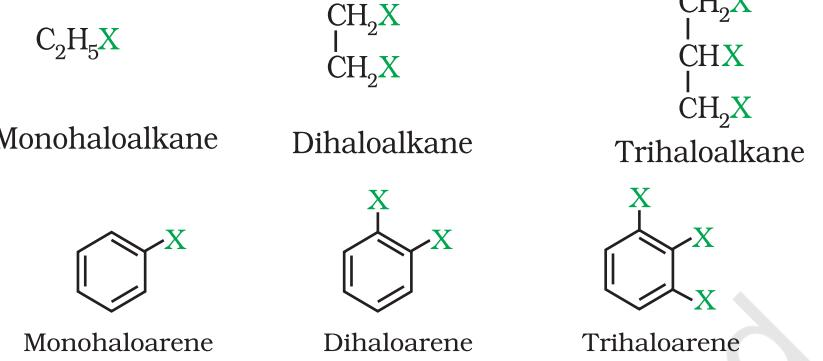

Monohalocompounds may further be classified according to the hybridisation of the carbon atom to which the halogen is bonded, as discussed below.

#### This class includes 6.1.2 Compounds

Containing *sp3* C—X Bond (X= F, Cl, Br, I)

*(a) Alkyl halides or haloalkanes (R—X)*

In alkyl halides, the halogen atom is bonded to an alkyl group (R). They form a homologous series represented by CnH2n+1X. They are further classified as primary, secondary or tertiary according to the nature of carbon to which halogen is attached. If halogen is attached to a primary carbon atom in an alkyl halide, the alkyl halide is called primary alkyl halide or 1° alkyl halide. Similarly, if halogen is attached to secondary or tertiary carbon atom, the alkyl halide is called secondary alkyl halide (2°) and tertiary (3°) alkyl halide, respectively.

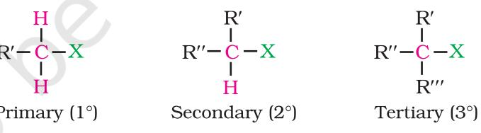

### *(b) Allylic halides*

These are the compounds in which the halogen atom is bonded to an *sp3* -hybridised carbon atom adjacent to carbon-carbon double bond (C=C) *i.e.* to an allylic carbon.

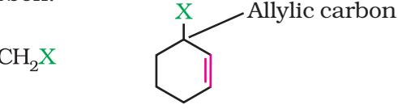

#### *(c) Benzylic halides*

Allylic carbon

These are the compounds in which the halogen atom is bonded to an *sp3* -hybridised carbon atom attached to an aromatic ring.

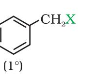

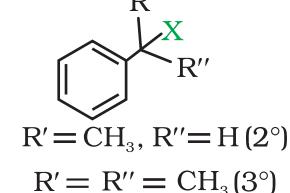

- This class includes: *(a) Vinylic halides* 6.1.3 Compounds Containing *sp2* C—X Bond
These are the compounds in which the halogen atom is bonded to a *sp2* -hybridised carbon atom of a carbon-carbon double bond (C = C).

- *(b) Aryl halides*
These are the compounds in which the halogen atom is directly bonded to the *sp2* -hybridised carbon atom of an aromatic ring.

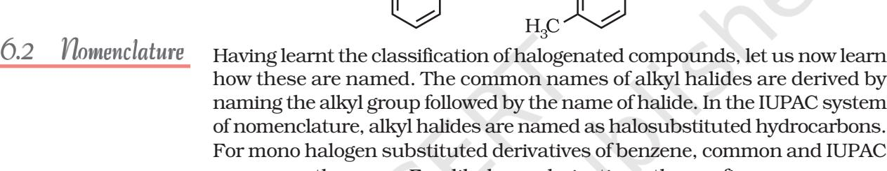

names are the same. For dihalogen derivatives, the prefixes *o*-, *m*-, *p-* are used in common system but in IUPAC system, as you have learnt in Class XI, the numerals 1,2; 1,3 and 1,4 are used.

$$\mathrm{H}_{3}\mathrm{C}{-}\underset{\mathrm{CH}}{\overset{\mathrm{CH}_{3}}{\underset{\mathrm{CH}_{2}}{\overset{\mathrm{CH}_{2}}{\rightleftharpoons}}}}\mathrm{CH}_{2}\mathrm{-Cl}$$

The dihaloalkanes having the same type of halogen atoms are named as alkylidene or alkylene dihalides. The dihalo-compounds having both the halogen atoms are further classified as geminal halides or gem-dihalides when both the halogen atoms are present on the same carbon atom of the

161 Haloalkanes and Haloarenes

chain and vicinal halides or vic-dihalides when halogen atoms are present on adjacent carbon atoms. In common name system, gem-dihalides are named as alkylidene halides and vic-dihalides are named as alkylene dihalides. In IUPAC system, they are named as dihaloalkanes.

|  | ﺎ ﺎﺗﺎ |
| --- | --- |
| Common name: Ethylidene chloride | Ethylene dichlori |
| (gem-dihalide) | (vic-dihalide) |

Some common examples of halocompounds are mentioned in Table 6.1.

Table 6.1: Common and IUPAC Names of some Halides

| Structure | Common name | IUPAC name |
| --- | --- | --- |
| CH3CH2CH(Cl)CH3 | sec-Butyl chloride | 2-Chlorobutane |
| (CH3)3CCH2Br | neo-Pentyl bromide | 1-Bromo-2,2-dimethylpropane |
| (CH3)3CBr | tert-Butyl bromide | 2-Bromo-2-methylpropane |
| CH2 = CHCl | Vinyl chloride | Chloroethene |
| CH2 = CHCH2Br | Allyl bromide | 3-Bromopropene |
|  | o-Chlorotoluene | 1-Chloro-2-methylbenzene |
|  |  | or |
|  |  | 2-Chlorotoluene |
|  | Benzyl chloride | Chlorophenylmethane |
| CH2Cl2 | Methylene chloride | Dichloromethane |
| CHCl3 | Chloroform | Trichloromethane |
| CHBr3 | Bromoform | Tribromomethane |
| CCl4 | Carbon tetrachloride Tetrachloromethane |  |
| CH3CH2CH2F | n-Propyl fluoride | 1-Fluoropropane |

Example 6.1 Solution SolutionSolution Draw the structures of all the eight structural isomers that have the molecular formula C5H11Br. Name each isomer according to IUPAC system and classify them as primary, secondary or tertiary bromide. CH3CH2CH2CH2CH2Br 1-Bromopentane (1o ) CH3CH2CH2CH(Br)CH3 2-Bromopentane(2o ) CH3CH2CH(Br)CH2CH3 3-Bromopentane (2o ) (CH3 )2CHCH2CH2Br 1-Bromo-3-methylbutane (1o )

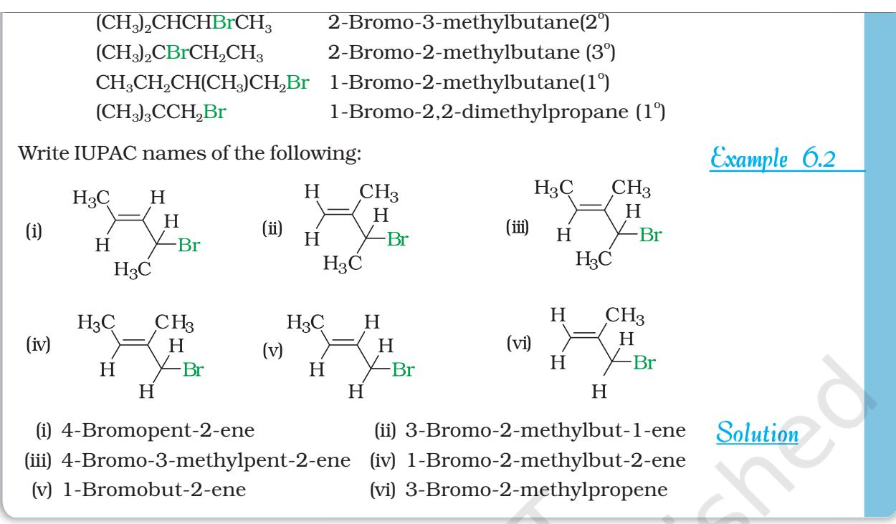

Intext Question 6.1 Write structures of the following compounds: (i) 2-Chloro-3-methylpentane (ii) 1-Chloro-4-ethylcyclohexane (iii) 4-tert. Butyl-3-iodoheptane (iv) 1,4-Dibromobut-2-ene (v) 1-Bromo-4-sec. butyl-2-methylbenzene.

6.3 Nature of Nature ofNature of C-X Bond C-X BondC-X Bond Halogen atoms are more electronegative than carbon, therefore, carbon-halogen bond of alkyl halide is polarised; the carbon atom bears a partial positive charge whereas the halogen atom bears a partial negative charge.

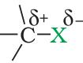

 As we go down the group in the periodic table, the size of halogen atom increases. Fluorine atom is the smallest and iodine atom is the largest. Consequently the carbon-halogen bond length also increases from C—F to C—I. Some typical bond lengths, bond enthalpies and dipole moments are given in Table 6.2.

Alkyl halides are best prepared from alcohols, which are easily accessible.

163 Haloalkanes and Haloarenes

| Bond | Bond length/pm | C-X Bond enthalpies/ kJmol-1 | Dipole moment/Debye |
| --- | --- | --- | --- |
| –F CH3 | 139 | 452 | 1.847 |
| – Cl CH3 | 178 | 351 | 1.860 |
| –Br CH3 | 193 | 293 | 1.830 |
| –I CH3 | 214 | 234 | 1.636 |

Table 6.2: Carbon-Halogen (C—X) Bond Lengths, Bond Enthalpies and Dipole Moments

# 6.4 Methods of Preparation PreparationPreparation of Haloalkanes

6.4.1 From Alcohols

The hydroxyl group of an alcohol is replaced by halogen on reaction with concentrated halogen acids, phosphorus halides or thionyl chloride. Thionyl chloride is preferred because in this reaction alkyl halide is formed along with gases SO2 and HCl. The two gaseous products are escapable, hence, the reaction gives pure alkyl halides. The reactions of primary and secondary alcohols with HCl require the presence of a catalyst, ZnCl2 . With tertiary alcohols, the reaction is conducted by simply shaking the alcohol with concentrated HCl at room temperature. Constant boiling with HBr (48%) is used for preparing alkyl bromide. Good yields of R—I may be obtained by heating alcohols with sodium or potassium iodide in 95% orthophosphoric acid. The order of reactivity of alcohols with a given haloacid is 3°>2°>1°. Phosphorus tribromide and triiodide are usually generated *in situ* (produced in the reaction mixture) by the reaction of red phosphorus with bromine and iodine respectively.

  
  
\begin{tabular}{l c c c} R-OH & + HCl & ZnCl${}_{2}$ & R-Cl + H${}_{2}$O \\ R-OH & NaBr + H${}_{2}$SO${}_{4}$ & R-Br + NaHSO${}_{4}$ + H${}_{2}$O \\  
3R-OH + PX${}_{5}$ & 3R-X + H${}_{3}$PO${}_{3}$ & (X = Cl, Br) \\ R-OH + PCl${}_{2}$ & R-Cl + POCl${}_{3}$ + HCl & \\ R-OH & $\frac{\text{red P/X}}{\text{red P/X}}$ & R-X & \\ R-OH + SOCl${}_{2}$ & R-Cl + SO${}_{2}$ + HCl & \\ \end{tabular}  
  

 The preparation of alkyl chloride is carried out either by passing dry hydrogen chloride gas through a solution of alcohol or by heating a mixture of alcohol and concentrated aqueous halogen acid.

 The above methods are not applicable for the preparation of aryl halides because the carbon-oxygen bond in phenols has a partial double bond character and is difficult to break being stronger than a single bond.

#### *(I) From alkanes by free radical halogenation*

Free radical chlorination or bromination of alkanes gives a complex mixture of isomeric mono- and polyhaloalkanes, which is difficult to

6.4.2 From Hydrocarbons

Chemistry 164

separate as pure compounds. Consequently, the yield of any single compound is low.

$\text{CH}_3\text{CH}_2\text{CH}_2\text{CH}_3\xrightarrow[\text{or heat}]{\text{Cl}_2/\text{UV light}}\text{CH}_3\text{CH}_2\text{CH}_2\text{CH}_2\text{Cl}+\text{CH}_3\text{CH}_2\text{CHClCH}_3$. 

- *(II) From alkenes*
	- (i) *Addition of hydrogen halides*: An alkene is converted to corresponding alkyl halide by reaction with hydrogen chloride, hydrogen bromide or hydrogen iodide.

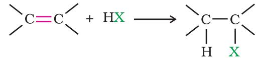

Propene yields two products, however only one predominates as per Markovnikov's rule. (Unit 13, Class XI)

$$\rm CH_{3}CH=CH_{2}+H-I\rm CH_{3}CH_{2}CH_{2}I+CH_{3}CHICH_{3}

\rm minormajor$$

- (ii) *Addition of halogens:* In the laboratory, addition of bromine in CCl4 to an alkene resulting in discharge of reddish brown colour of bromine constitutes an important method for the detection of double bond in a molecule. The addition results in the synthesis of *vic*-dibromides, which are colourless (Unit 9, Class XI).
Identify all the possible monochloro structural isomers expected to be formed on free radical monochlorination of (CH3 ) 2CHCH2CH3 . In the given molecule, there are four different types of hydrogen atoms. Replacement of these hydrogen atoms will give the following (CH3 ) 2CHCH2CH2Cl (CH3 ) 2CHCH(Cl)CH3 (CH3 ) 2C(Cl)CH2CH3 CH3CH(CH2Cl)CH2CH3 Example 6.3 Solution SolutionSolution

6.4.3 Halogen Exchange Alkyl iodides are often prepared by the reaction of alkyl chlorides/ bromides with NaI in dry acetone. This reaction is known as Finkelstein reaction.

NaCl or NaBr thus formed is precipitated in dry acetone. It facilitates the forward reaction according to Le Chatelier's Principle.

The synthesis of alkyl fluorides is best accomplished by heating an alkyl chloride/bromide in the presence of a metallic fluoride such as

165 Haloalkanes and Haloarenes

AgF, Hg2 F2 , CoF2 or SbF3 . The reaction is termed as Swarts reaction.

H${}_{3}$C$-$Br + AgF + H${}_{3}$C$-$F + AgBr

*(i) From hydrocarbons by electrophilic substitution* 6.5 Preparation of

Haloarenes

Aryl chlorides and bromides can be easily prepared by electrophilic substitution of arenes with chlorine and bromine respectively in the presence of Lewis acid catalysts like iron or iron(III) chloride.

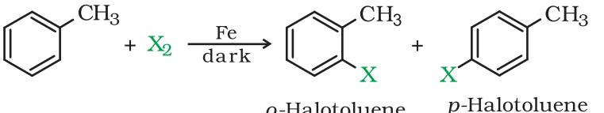

The *ortho* and *para* isomers can be easily separated due to large difference in their melting points. Reactions with iodine are reversible in nature and require the presence of an oxidising agent (HNO3 , HIO4 ) to oxidise the HI formed during iodination. Fluoro compounds are not prepared by this method due to high reactivity of fluorine.

#### *(ii) From amines by Sandmeyer's reaction*

When a primary aromatic amine, dissolved or suspended in cold aqueous mineral acid, is treated with sodium nitrite, a diazonium salt is formed. Mixing the solution of freshly prepared diazonium salt with cuprous chloride or cuprous bromide results in the replacement of the diazonium group by –Cl or –Br.

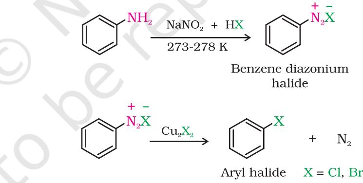

Replacement of the diazonium group by iodine does not require the presence of cuprous halide and is done simply by shaking the diazonium salt with potassium iodide.

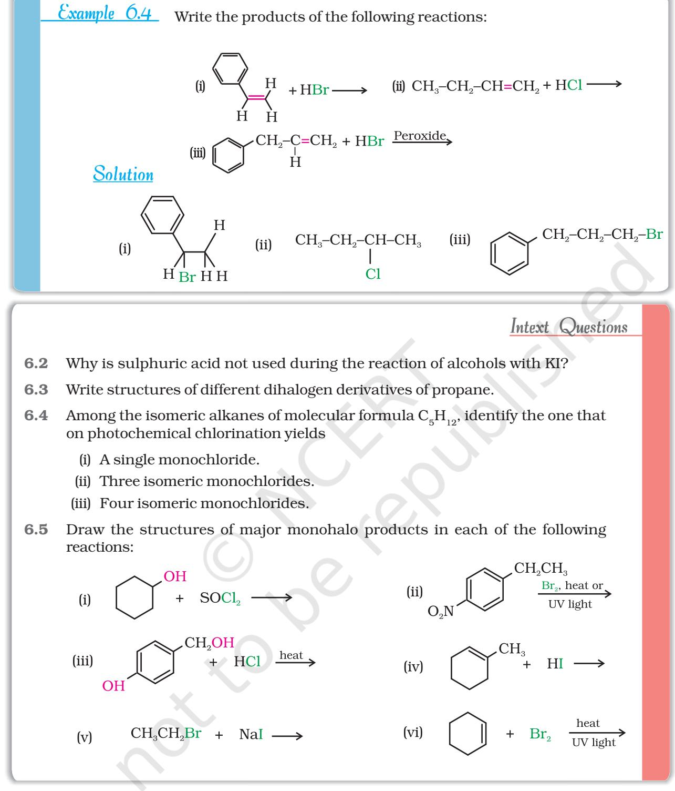

- 6.6 Physical Properties PropertiesProperties
Alkyl halides are colourless when pure. However, bromides and iodides develop colour when exposed to light. Many volatile halogen compounds have sweet smell.

167 Haloalkanes and Haloarenes

Melting and boiling points

Methyl chloride, methyl bromide, ethyl chloride and some chlorofluoromethanes are gases at room temperature. Higher members are liquids or solids. As we have already learnt, molecules of organic halogen compounds are generally polar. Due to greater polarity as well as higher molecular mass as compared to the parent hydrocarbon, the intermolecular forces of attraction (dipole-dipole and van der Waals) are stronger in the halogen derivatives. That is why the boiling points of chlorides, bromides and iodides are considerably higher than those of the hydrocarbons of comparable molecular mass.

The attractions get stronger as the molecules get bigger in size and have more electrons. The pattern of variation of boiling points of different halides is depicted in Fig. 6.1. For the same alkyl group, the boiling points of alkyl halides decrease in the order: RI> RBr> RCl> RF. This is because with the increase in size and mass of halogen atom, the magnitude of van der Waal forces increases.

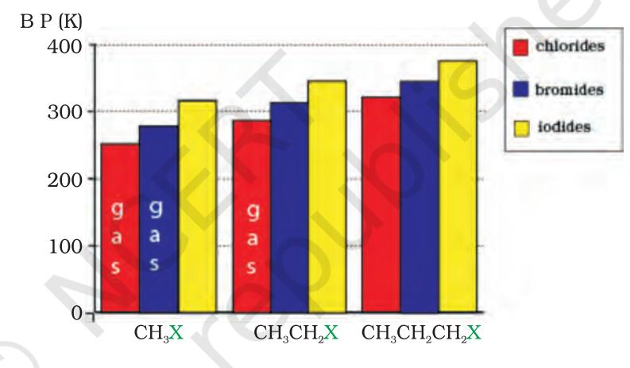

*Fig. 6.1: Comparison of boiling points of some alkyl halides*

The boiling points of isomeric haloalkanes decrease with increase in branching. For example, 2-bromo-2-methylpropane has the lowest boiling point among the three isomers.

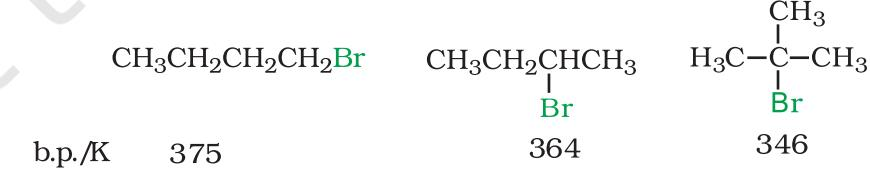

Boiling points of isomeric dihalobenzenes are very nearly the same. However, the *para-*isomers are high melting as compared to their *ortho*and *meta-*isomers. It is due to symmetry of *para-*isomers that fits in crystal lattice better as compared to *ortho*- and *meta*-isomers.

|  | Cl | Cl | C |
| --- | --- | --- | --- |
|  | 5 |  |  |
|  |  | C |  |
|  |  |  | C |
| b.p / K | 453 | 446 | 448 |
| m.p/K | 256 | 249 | 323 |

### *Density*

Bromo, iodo and polychloro derivatives of hydrocarbons are heavier than water. The density increases with increase in number of carbon atoms, halogen atoms and atomic mass of the halogen atoms (Table 6.3).

Table 6.3: Density of Some Haloalkanes

| Compound | Density (g/mL) | Compound | Density (g/mL) |
| --- | --- | --- | --- |
| n–C3H7Cl | 0.89 | CH2Cl2 | 1.336 |
| n–C3H7Br | 1.335 | CHCl3 | 1.489 |
| n-C3H7I | 1.747 | CCl4 | 1.595 |

## *Solubility*

*The haloalkanes are very slightly soluble in water.* In order to dissolve haloalkane in water, energy is required to overcome the attractions between the haloalkane molecules and break the hydrogen bonds between water molecules. Less energy is released when new attractions are set up between the haloalkane and the water molecules as these are not as strong as the original hydrogen bonds in water. As a result, the solubility of haloalkanes in water is low. However, haloalkanes tend to dissolve in organic solvents because the new intermolecular attractions between haloalkanes and solvent molecules have much the same strength as the ones being broken in the separate haloalkane and solvent molecules.

6.6 Arrange each set of compounds in order of increasing boiling points. (i) Bromomethane, Bromoform, Chloromethane, Dibromomethane. (ii) 1-Chloropropane, Isopropyl chloride, 1-Chlorobutane. Intext Question 6.7 Chemical

The reactions of haloalkanes may be divided into the following categories:

- Reactions ReactionsReactions
- 1. Nucleophilic substitution
## 6.7.1 Reactions of Haloalkanes

- 2. Elimination reactions
- 3. Reaction with metals.

### *(1)Nucleophilic substitution reactions*

You have learnt in Class XI that nucleophiles are electron rich species. Therefore, they attack at that part of the substrate molecule which is electron deficient. The reaction in which a nucleophile replaces already existing nucleophile in a molecule is called nucleophilic substitution reaction. Haloalkanes are substrate in these reactions. In this type of reaction, a nucleophile reacts with haloalkane (the substrate) having a partial positive charge on the carbon atom bonded to halogen. A substitution reaction takes place and halogen atom, called leaving group departs as halide ion. Since the substitution reaction is initiated by a nucleophile, it is called nucleophilic substitution reaction.

It is one of the most useful classes of organic reactions of alkyl halides in which halogen is bonded to *sp3* hybridised carbon. The products formed by the reaction of haloalkanes with some common nucleophiles are given in Table 6.4.

#### Table 6.4: Nucleophilic Substitution of Alkyl Halides (R–X)

| Reagent | Nucleophile | Substitution | Class of main |
| --- | --- | --- | --- |
|  | (Nu– ) | product R–Nu | product |
| NaOH (KOH) | HO– | ROH | Alcohol |
| H2O | H2O | ROH | Alcohol |
| NaOR¢ | R¢O– | ROR¢ | Ether |
| NaI | – I | R—I | Alkyl iodide |
| NH3 | NH3 | RNH2 | Primary amine |
| R¢NH2 | R¢NH2 | RNHR¢ | Sec. amine |
| R¢R¢¢NH | R¢R¢¢NH | RNR¢R¢¢ | Tert. amine |
| KCN |  | RCN | Nitrile (cyanide) |
| AgCN | Ag-CN: | RNC (isocyanide) | Isonitrile |
| KNO2 | O=N—O | R—O—N=O | Alkyl nitrite |
| AgNO2 | Ag—Ö—N=O | R—NO2 | Nitroalkane |
| R¢COOAg | R¢COO– | R¢COOR | Ester |
| LiAlH4 | H | RH | Hydrocarbon |
| R¢ – M+ | – R¢ | RR¢ | Alkane |

|
|  |

Groups like cyanides and nitrites possess two nucleophilic centres and are called *ambident nucleophiles*. Actually cyanide group is a hybrid of two contributing structures and therefore can act as a nucleophile in two different ways [VCºN « :C=NV], *i.e.,* linking through

| Haloalkanes react with KCN to form alkyl cyanides as main product | Example 6.5 |
| --- | --- |
| while AgCN forms isocyanides as the chief product. Explain. |  |
| KCN is predominantly ionic and provides cyanide ions in solution. | Solution Solution Solution |
| Although both carbon and nitrogen atoms are in a position to donate |  |
| electron pairs, the attack takes place mainly through carbon atom and |  |
| not through nitrogen atom since C—C bond is more stable than C—N |  |
| bond. However, AgCN is mainly covalent in nature and nitrogen is free |  |
| to donate electron pair forming isocyanide as the main product. |  |

carbon atom resulting in alkyl cyanides and through nitrogen atom leading to isocyanides. Similarly nitrite ion also represents an ambident nucleophile with two different points of linkage [–O— N i i =O]. The linkage through oxygen results in alkyl nitrites while through nitrogen atom, it leads to nitroalkanes.

Mechanism: This reaction has been found to proceed by two different mechanims which are described below:

- *(a) Substitution nucleophilic bimolecular (SN2)*
The reaction between CH3Cl and hydroxide ion to yield methanol and chloride ion follows a second order kinetics, i.e., the rate depends upon the concentration of both the reactants.

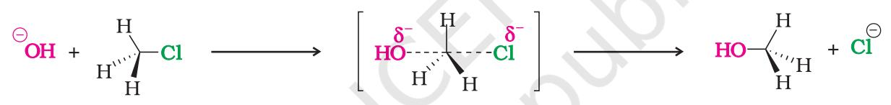

The solid wedge represents the bond coming out of the paper, dashed line going down the paper and a straight line representing bond in the plane of the paper.

> The above reaction can be represented diagrammatically as shown in Fig. 6.2.

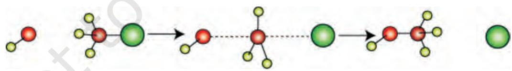

*Fig. 6.2: Red ball represents the incoming hydroxide ion and green ball represents the outgoing halide ion*

*In the year 1937, Edward Davies Hughes and Sir Christopher Ingold proposed a mechanism for an SN 2 reaction.*

It depicts a bimolecular nucleophilic substitution (SN 2) reaction; the incoming nucleophile interacts with alkyl halide causing the carbon-halide bond to break and a new bond is formed between carbon and attacking nucleophile. Here it is C-O bond formed between C and -OH. These two processes take place simultaneously in a

171 Haloalkanes and Haloarenes

single step and no intermediate is formed. As the reaction progresses and the bond between the incoming nucleophile and the carbon atom starts forming, the bond between carbon atom and leaving group weakens. As this happens, the three carbon-hydrogen bonds of the substrate start moving away from the attacking nucleophile. In transition state all the three C-H bonds are in the same plane and the attacking and leaving nucleophiles are partially attached to the carbon. As the attacking nucleophile approaches closer to the carbon, C-H bonds still keep on moving in the same direction till the attacking nucleophile attaches to carbon and leaving group leaves the carbon. As a result configuration is inverted, the configuration (See box) of carbon atom under attack inverts in much the same way as an umbrella is turned inside out when caught in a strong wind. This process is called as inversion of configuration. In the transition state, the carbon atom is simultaneously bonded to incoming nucleophile and the outgoing leaving group. Such structures are unstable and cannot be isolated. Thus, in the transition state, carbon is simultaneously bonded to five atoms.

### Configuration

Spacial arrangement of functional groups around carbon is called its configuration. See the structures (A) and (B) given below carefully.

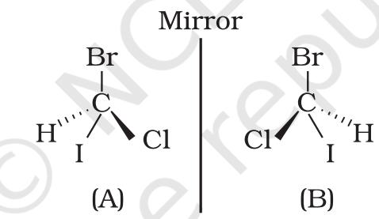

These are the two structures of the same compound. They differ in spacial arrangement of functional groups attached to carbon. Structure (A) is mirror image of Structure (B). We say configuration of carbon in structure (A) is mirror image of the configuration of carbon in structure (B).

*Hughes worked under Ingold and earned a D.Sc. degree from the University of London.*

Since this reaction requires the approach of the nucleophile to the carbon bearing the leaving group, the presence of bulky substituents on or near the carbon atom have a dramatic inhibiting effect. Of the simple alkyl halides, methyl halides react most rapidly in SN 2 reactions because there are only three small hydrogen atoms. Tertiary halides are the least reactive because bulky groups hinder the approaching

nucleophiles. Thus the order of reactivity followed is: Primary halide > Secondary halide > Tertiary halide.

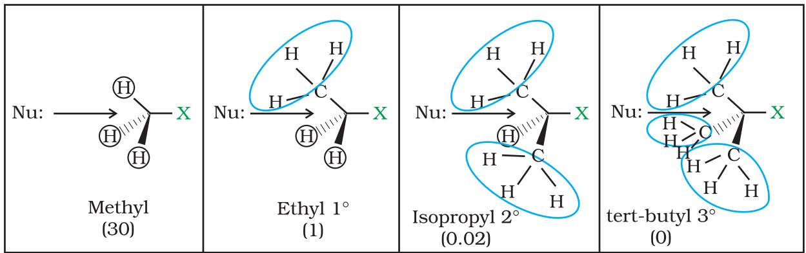

*Fig.6.3: Steric effects in SN2 reaction. The relative rate of SN2 reaction is given in parenthesis*

- *(b) Substitution nucleophilic unimolecular (SN1)*
SN1 reactions are generally carried out in polar protic solvents (like water, alcohol, acetic acid, etc.). The reaction between *tert*butyl bromide and hydroxide ion yields *tert*-butyl alcohol and follows the first order kinetics, *i.e.,* the rate of reaction depends upon the concentration of only one reactant, which is *tert*- butyl bromide.

It occurs in two steps. In step I, the polarised C—Br bond undergoes slow cleavage to produce a carbocation and a bromide ion. The carbocation thus formed is then attacked by nucleophile in step II to complete the substitution reaction.

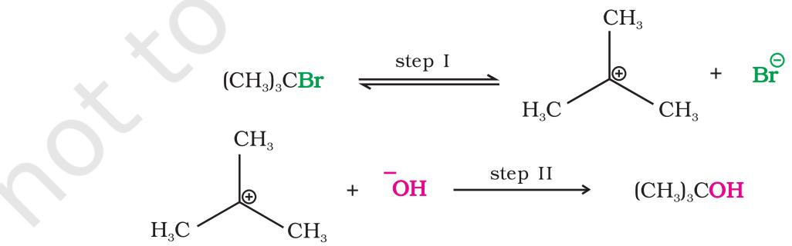

173 Haloalkanes and Haloarenes

Step I is the slowest and reversible. It involves the C–Br bond breaking for which the energy is obtained through solvation of halide ion with the proton of protic solvent. Since the rate of reaction depends upon the slowest step, the rate of reaction depends only on the concentration of alkyl halide and not on the concentration of hydroxide ion. Further, greater the stability of carbocation, greater will be its ease of formation from alkyl halide and faster will be the rate of reaction. In case of alkyl halides, 30 alkyl halides undergo SN1 reaction very fast because of the high stability of 30 carbocations. We can sum up the order of reactivity of alkyl halides towards SN1 and SN2 reactions as follows:

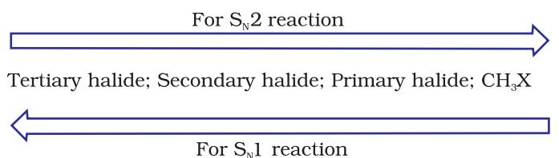

For the same reasons, allylic and benzylic halides show high reactivity towards the SN1 reaction. The carbocation thus formed gets stabilised through resonance (Unit 8, Class XI) as shown below:

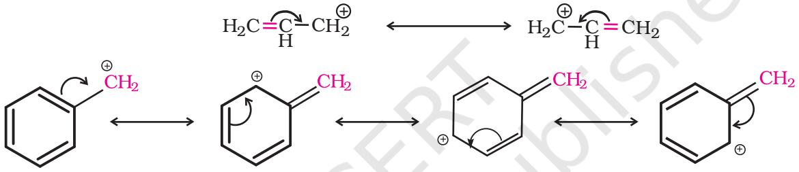

For a given alkyl group, the reactivity of the halide, R-X, follows the same order in both the mechanisms R–I> R–Br>R–Cl>>R–F.

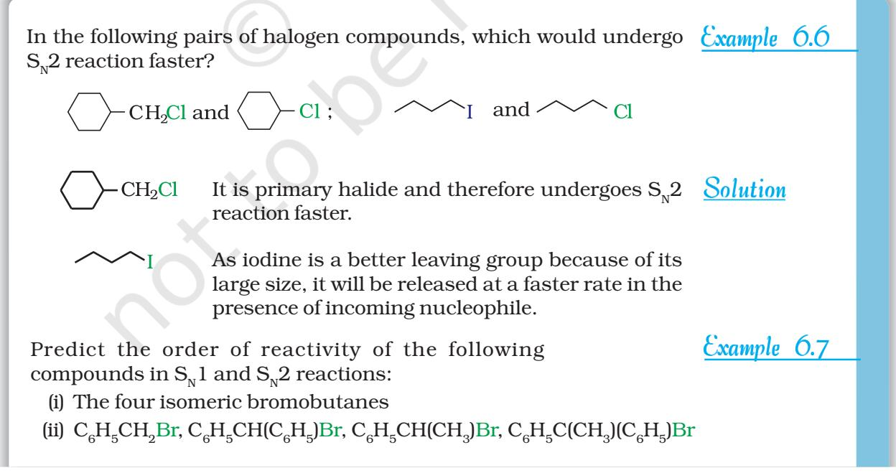

Chemistry 174

#### (i) CH3CH2CH2CH2Br < (CH3 ) 2CHCH2Br < CH3CH2CH(Br)CH3 < (CH3 ) 3CBr (SN 1) CH3CH2CH2CH2Br > (CH3 )2CHCH2Br > CH3CH2CH(Br)CH3 > (CH3 )3CBr (SN2) Solution SolutionSolution

Of the two primary bromides, the carbocation intermediate derived from (CH3 )2CHCH2Br is more stable than derived from CH3CH2CH2CH2Br because of greater electron donating inductive effect of (CH3 )2CH- group. Therefore, (CH3 )2CHCH2Br is more reactive than CH3CH2CH2CH2Br in SN1 reactions. CH3CH2CH(Br)CH3 is a secondary bromide and (CH3 )3CBr is a tertiary bromide. Hence the above order is followed in SN1. The reactivity in SN2 reactions follows the reverse order as the steric hinderance around the electrophilic carbon increases in that order.

- (ii) C6H5C(CH3 )(C6H5 )Br > C6H5CH(C6H5 )Br > C6H5CH(CH3 )Br > C6H5CH2Br (SN1)
C6H5C(CH3 )(C6H5 )Br < C6H5CH(C6H5 )Br < C6H5CH(CH3 )Br < C6H5CH2Br (SN 2) Of the two secondary bromides, the carbocation intermediate obtained from C6H5CH(C6H5 )Br is more stable than obtained from C6H5CH(CH3 )Br because it is stabilised by two phenyl groups due to resonance. Therefore, the former bromide is more reactive than the latter in SN 1 reactions. A phenyl group is bulkier than a methyl group. Therefore, C6H5CH(C6H5 )Br is less reactive than C6H5CH(CH3 )Br in SN 2 reactions.

- *(c) Stereochemical aspects of nucleophilic substitution reactions* In order to understand the stereochemical aspects of substitution reactions, we need to learn some basic stereochemical principles and notations (optical activity, chirality, retention, inversion, racemisation, etc.).
	- (i) *Optical activity*: Plane of plane polarised light produced by passing ordinary light through Nicol prism is rotated when it is passed through the solutions of certain compounds. Such compounds are called optically active compounds. The angle by which the plane polarised light is rotated is measured by an instrument called polarimeter. If the compound rotates the plane of plane polarised light to the right, i.e., clockwise direction, it is called *dextrorotatory* (Greek for right rotating) or the *d*-form and is indicated by placing a positive (+) sign before the degree of rotation. If the light is rotated towards left (anticlockwise direction), the compound is said to be laevo-rotatory or the *l*-form and a negative (–) sign is placed before the degree of rotation. Such (+) and (–) isomers of a compound are called optical isomers and the phenomenon is termed as optical isomerism.
	- (ii) *Molecular asymmetry, chirality and enantiomers*: The observation of Louis Pasteur (1848) that crystals of certain compounds exist in the form of mirror images laid the foundation of modern stereochemistry. He demonstrated that aqueous solutions of both types of crystals showed optical rotation, equal in magnitude (for solution of equal concentration) but opposite in direction. He believed that this difference in optical activity was associated with the three dimensional arrangements of atoms in the molecules (configurations) of

175 Haloalkanes and Haloarenes

*William Nicol (1768- 1851) developed the first prism that produced plane polarised light.*

*Jacobus Hendricus Van't Hoff (1852-1911) received the first Nobel Prize in Chemistry in 1901 for his work on solutions.*

two types of crystals. Dutch scientist, *J. Van't Hoff* and French scientist, *C. Le Bel* in the same year (1874), independently argued that the spatial arrangement of four groups (valencies) around a central carbon is tetrahedral and if all the substituents attached to that carbon are different, the mirror image of the molecule is not superimposed (overlapped) on the molecule; such a carbon is called asymmetric carbon or stereocentre. The resulting molecule would lack symmetry and is referred to as asymmetric molecule. The asymmetry of the molecule along with non superimposability of mirror images is responsible for the optical activity in such organic compounds.

The symmetry and asymmetry are also observed in many day to day

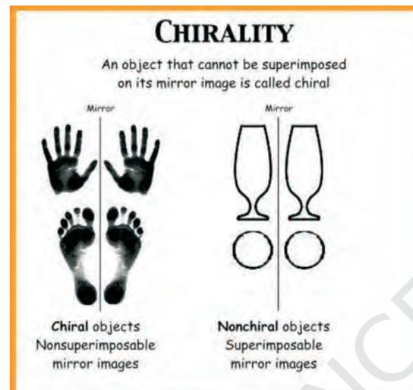

*Fig 6.4: Some common examples of chiral and*

objects: a sphere, a cube, a cone, are all identical to their mirror images and can be superimposed. However, many objects are non superimposable on their mirror images. For example, your left and right hand look similar but if you put your left hand on your right hand by moving them in the same plane, they do not coincide. The objects which are nonsuperimposable on their mirror image (like a pair of hands) are said to be chiral and this property is known as chirality. Chiral molecules are optically active, while the objects, which are, superimposable on their mirror images are called achiral. These molecules are optically inactive.

The above test of molecular chirality can be applied to organic molecules by constructing models and its mirror images or by drawing three dimensional structures and attempting to superimpose them in our minds. There are other aids, however, that can assist us in recognising chiral molecules. One such aid is the presence of

*achiral objects* a single asymmetric carbon atom. Let us consider two simple molecules propan-2-ol (Fig.6.5) and butan-2-ol (Fig.6.6) and their mirror images.

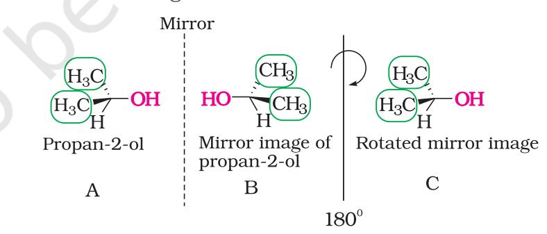

*Fig 6.5: B is mirror image of A; B is rotated by 180o and C is obtained; C is superimposable on A.*

As you can see very clearly, propan-2-ol (A) does not contain an asymmetric carbon, as all the four groups attached to the tetrahedral carbon are not different. We rotate the mirror image (B) of the molecule by 180° (structure C) and try to overlap the structure (C) with the structure (A), these structures completely overlap. Thus propan-2-ol is an achiral molecule.

*Fig 6.6: E is mirror image of D; E is rotated by 180o to get F and F is non superimposable on its mirror image D.*

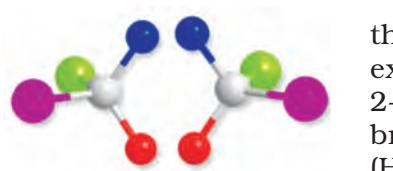

*Fig. 6.7: A chiral molecule and its mirror image*

Butan-2-ol has four different groups attached to the tetrahedral carbon and as expected is chiral. Some common examples of chiral molecules such as 2-chlorobutane, 2, 3-dihyroxypropanal, (OHC–CHOH–CH2OH), bromochloro-iodomethane (BrClCHI), 2-bromopropanoic acid (H3C–CHBr–COOH), etc.

The stereoisomers related to each other as nonsuperimposable mirror images are called enantiomers (Fig. 6.7). A and B in Fig. 6.5 and D and E in Fig. 6.6 are enantiomers.

Enantiomers possess identical physical properties namely, melting point, boiling point, refractive index, etc. They only differ with respect to the rotation of plane polarised light. If one of the enantiomer is *dextro rotatory,* the other will be *laevo rotatory*.

However, the sign of optical rotation is not necessarily related to the absolute (actual) configuration of the molecule.

A mixture containing two enantiomers in equal proportions will have zero optical rotation, as the rotation due to one isomer will be cancelled by the rotation due to the other isomer. Such a mixture is known as racemic mixture or racemic modification. A racemic mixture is represented by prefixing *dl* or (±) before the name, for example (±) butan-2-ol. The process of conversion of enantiomer into a racemic mixture is known as racemisation.

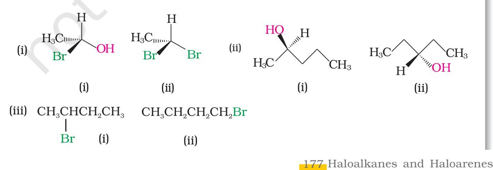

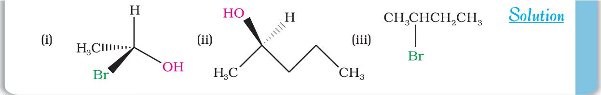

- (iii) *Retention:* Retention of configuration is the preservation of the spatial arrangement of bonds to an asymmetric centre during a chemical reaction or transformation.
In general, if during a reaction, no bond to the stereocentre is broken, the product will have the same general configuration of groups around the stereocentre as that of reactant. Such a reaction is said to proceed with retention of the configuration. Consider as an example, the reaction that takes place when (–)-2-methylbutan-1-ol is heated with concentrated hydrochloric acid.

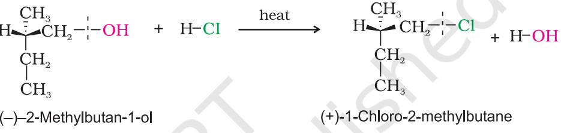

It is important to note that configuration at a symmetric centre in the reactant and product is same but the sign of optical rotation has changed in the product. This is so because two different compounds with same configuration at asymmetric centre may have different optical rotation. One may be dextrorotatory (plus sign of optical rotation) while other may be laevorotatory (negative sign of optical rotation).

- (iv) *Inversion, retention and racemisation:* There are three outcomes for a reaction at an asymmetric carbon atom, when a bond directly linked to an asymmetric carbon atom is broken. Consider the replacement of a group X by Y in the following reaction;
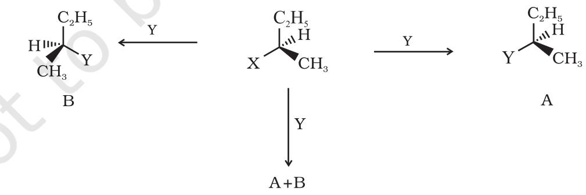

If (A) is the only compound obtained, the process is called retention of configuration. Note that configuration has been rotated in A. If (B) is the only compound obtained, the process is called inversion of configuration. Configuration has been inverted in B.

If a 50:50 mixture of A and B is obtained then the process is called racemisation and the product is optically inactive, as one isomer will rotate the plane polarised light in the direction opposite to another. Now let us have a fresh look at SN1 and SN2 mechanisms by taking examples of optically active alkyl halides.

In case of optically active alkyl halides, the product formed as a result of SN2 mechanism has the inverted configuration as compared to the reactant. This is because the nucleophile attaches itself on the side opposite to the one where the halogen atom is present. When (–)-2-bromooctane is allowed to react with sodium hydroxide, (+)-octan-2-ol is formed with the –OH group occupying the position opposite to what bromide had occupied.

$$\mathrm{\begin{array}{l}{{H_{3}C}}\\ {{H_{13}}}\\ {{C_{6}H_{13}}}\end{array}\mathrm{Br}+\stackrel{\Theta}{\mathrm{OH}}\longrightarrow\mathrm{\begin{array}{l}{{C H_{3}}}\\ {{C_{6}H_{13}}}\end{array}+B r^{\Theta}}$$

Thus, SN 2 reactions of optically active halides are accompanied by inversion of configuration.

In case of optically active alkyl halides, SN1 reactions are accompanied by racemisation. Can you think of the reason why it happens? Actually the carbocation formed in the slow step being *sp 2* hybridised is planar (achiral). The attack of the nucleophile may be accomplished from either side of the plane of carbocation resulting in a mixture of products, one having the same configuration (the –OH

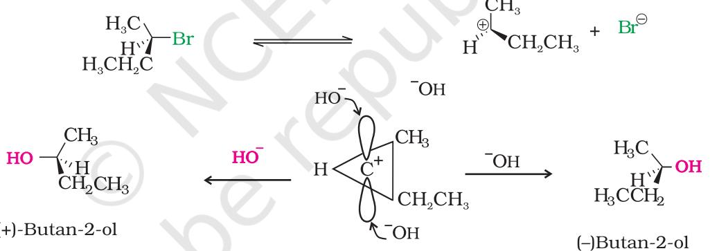

#### Location of a and b carbon in a molecule

Carbon on which halogen atom is directly attached is called a-carbon and the carbon atom adjacent to this carbon is called b-carbon.

attaching on the same position as halide ion) and the other having opposite configuration (the –OH attaching on the side opposite to halide ion). This may be illustrated by hydrolysis of optically active 2-bromobutane, which results in the formation of (±)-butan-2-ol. *2. Elimination reactions*

When a haloalkane with b-hydrogen atom is heated with alcoholic solution of potassium hydroxide, there is elimination of hydrogen atom from b-carbon and a halogen atom from the a-carbon atom.

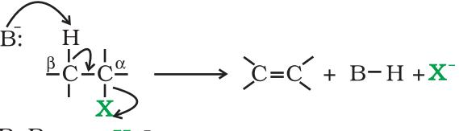

179 Haloalkanes and Haloarenes

As a result, an alkene is formed as a product. Since b-hydrogen atom is involved in elimination, it is often called b-elimination.

If there is possibility of formation of more than one alkene due to the availability of more than one b-hydrogen atoms, usually one alkene is formed as the major product. These form part of a pattern first observed by Russian chemist, Alexander Zaitsev (also pronounced as Saytzeff) who in 1875 formulated a rule which can be summarised as "*in dehydrohalogenation reactions, the preferred product is that alkene which has the greater number of alkyl groups attached to the doubly bonded carbon atoms*." Thus, 2-bromopentane gives pent-2-ene as the major product.

## Elimination versus substitution

A chemical reaction is the result of competition; it is a race that is won by the fastest runner. A collection of molecules tend to do, by and large, what is easiest for them. An alkyl halide with b-hydrogen atoms when reacted with a base or a nucleophile has two competing routes: substitution (SN 1 and SN 2) and elimination. Which route will be taken up depends upon the nature of alkyl halide, strength and size of base/nucleophile and reaction conditions. Thus, a bulkier nucleophile will prefer to act as a base and abstracts a proton rather than approach a tetravalent carbon atom (steric reasons) and *vice versa*. Similarly, a primary alkyl halide will prefer a SN 2 reaction, a secondary halide- SN 2 or elimination depending upon the strength of base/nucleophile and a tertiary halide- SN 1 or elimination depending upon the stability of carbocation or the more substituted alkene.

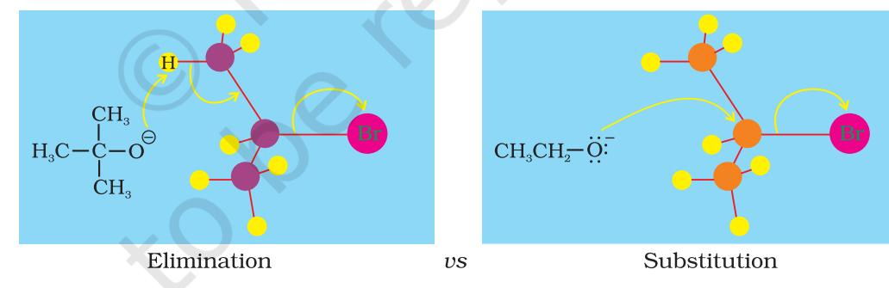

*3. Reaction with metals*

Most organic chlorides, bromides and iodides react with certain metals to give compounds containing carbon-metal bonds. Such compounds are known as organo-metallic compounds. An important class of organo-metallic compounds discovered by Victor Grignard in 1900 is alkyl magnesium halide, RMgX, referred as Grignard Reagents. These reagents are obtained by the reaction of haloalkanes with magnesium metal in dry ether.

$\text{CH}_3\text{CH}_2\text{Br}\;+\text{Mg}\;\underset{\text{Grignard reagent}}{\xrightarrow{\text{dry ether}}}\;\underset{\text{Grignard reagent}}{\xrightarrow{\text{CH}_3\text{CH}_2\text{MgBr}}}$  
  
. 

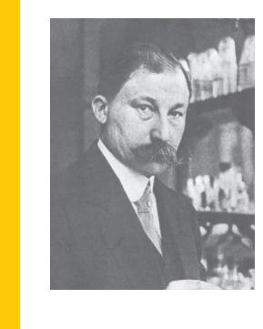

*Victor Grignard had a strange start in academic life for a chemist - he took a maths degree. When he eventually switched to chemistry, it was not to the mathematical province of physical chemistry but to organic chemistry. While attempting to find an efficient catalyst for the process of methylation, he noted that Zn in diethyl ether had been used for this purpose and wondered whether the Mg/ether combination might be successful. Grignard reagents were first reported in 1900 and Grignard used this work for his doctoral thesis in 1901. In 1910, Grignard obtained a professorship at the University of Nancy and in 1912, he was awarded the Nobel prize for Chemistry which he shared with Paul Sabatier who had made advances in nickel catalysed hydrogenation.*

In the Grignard reagent, the carbon-magnesium bond is covalent but highly polar, with carbon pulling electrons from electropositive magnesium; the magnesium halogen bond is essentially ionic.

$$\begin{array}{l l}{{\delta_{-}}}&{{\delta_{+}}}&{{\delta_{-}}}\\ {{\mathrm{R-Mg}}}&{{X}}\end{array}$$

Grignard reagents are highly reactive and react with any source of proton to give hydrocarbons. Even water, alcohols, amines are sufficiently acidic to convert them to corresponding hydrocarbons.

It is therefore necessary to avoid even traces of moisture from a Grignard reagent. That is why reaction is carried out in dry ether. On the other hand, this could be considered as one of the methods for converting halides to hydrocarbons.

### *Wurtz reaction*

*1. Nucleophilic substitution*

Alkyl halides react with sodium in dry ether to give hydrocarbons containing double the number of carbon atoms present in the halide. This reaction is known as Wurtz reaction.

#### 6.7.2 Reactions of Haloarenes

Aryl halides are extremely less reactive towards nucleophilic substitution reactions due to the following reasons:

- (i) *Resonance effect :* In haloarenes, the electron pairs on halogen atom are in conjugation with p-electrons of the ring and the following resonating structures are possible.
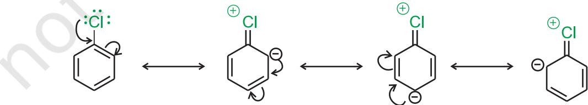

C—Cl bond acquires a partial double bond character due to resonance. As a result, the bond cleavage in haloarene is difficult than haloalkane and therefore, they are less reactive towards nucleophilic substitution reaction.

181 Haloalkanes and Haloarenes

- (ii) *Difference in hybridisation of carbon atom in C—X bond:* In haloalkane, the carbon atom attached to halogen is *sp3* hybridised while in case of haloarene, the carbon atom attached to halogen is *sp2* -hybridised.
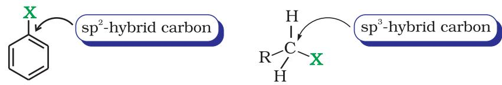

The *sp2* hybridised carbon with a greater *s*-character is more electronegative and can hold the electron pair of C—X bond more tightly than *sp3* -hybridised carbon in haloalkane with less *s*-chararcter. Thus, C—Cl bond length in haloalkane is 177pm while in haloarene is 169 pm. Since it is difficult to break a shorter bond than a longer bond, therefore, haloarenes are less reactive than haloalkanes towards nucleophilic substitution reaction.

- (iii) *Instability of phenyl cation:* In case of haloarenes, the phenyl cation formed as a result of self-ionisation will not be stabilised by resonance and therefore, SN 1 mechanism is ruled out.
- (iv) Because of the possible repulsion, it is less likely for the electron rich nucleophile to approach electron rich arenes.

#### *Replacement by hydroxyl group*

Chlorobenzene can be converted into phenol by heating in aqueous sodium hydroxide solution at a temperature of 623K and a pressure of 300 atmospheres.

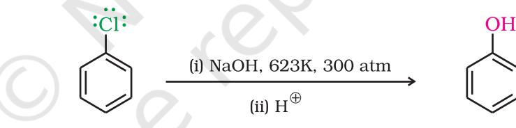

The presence of an electron withdrawing group (-NO2 ) at *ortho*- and *para*-positions increases the reactivity of haloarenes.

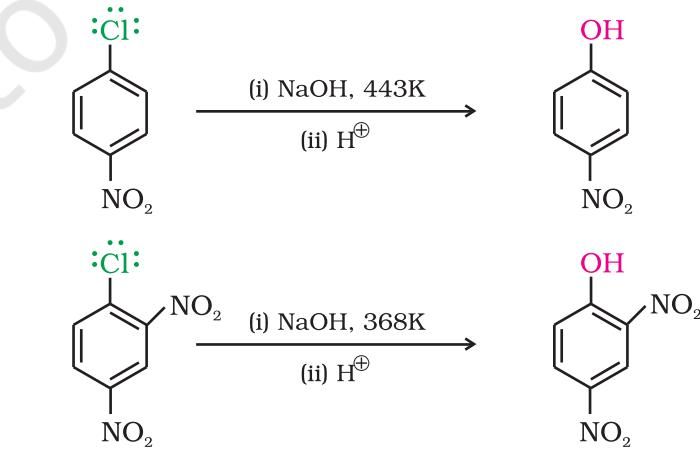

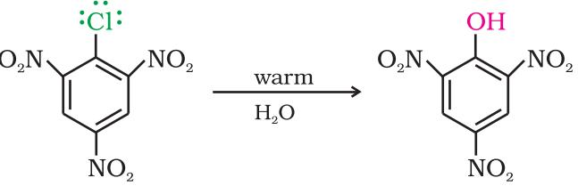

The effect is pronounced when (-NO2 ) group is introduced at *ortho*and *para*- positions. However, no effect on reactivity of haloarenes is observed by the presence of electron withdrawing group at *meta*-position. Mechanism of the reaction is as depicted:

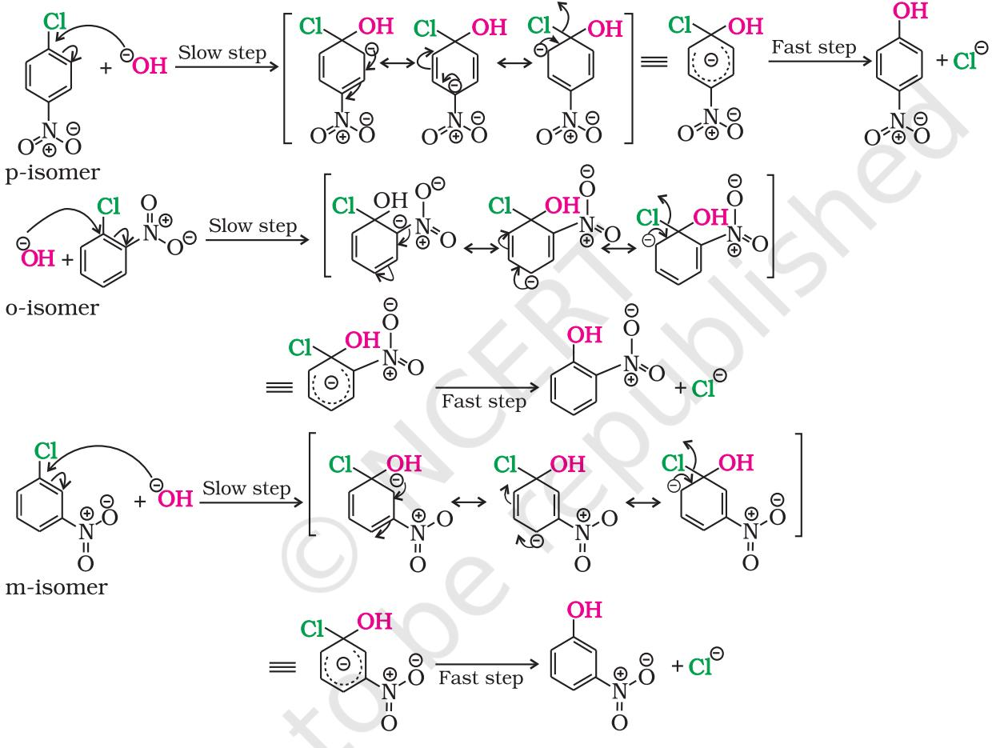

Can you think why does NO2 group show its effect only at *ortho*- and *para*- positions and not at *meta*- position?

As shown, the presence of nitro group at *ortho*- and *para*-positions withdraws the electron density from the benzene ring and thus facilitates the attack of the nucleophile on haloarene. The carbanion thus formed is stabilised through resonance. The negative charge appeared at *ortho*- and *para*- positions with respect to the halogen substituent is stabilised by –NO2 group while in case of *meta*-nitrobenzene, none of the resonating structures bear the negative charge on carbon atom bearing the –NO2 group. Therefore, the presence of nitro group at *meta*- position does not stabilise the negative charge and no effect on reactivity is observed by the presence of –NO2 group at *meta*-position.

183 Haloalkanes and Haloarenes

#### *2. Electrophilic substitution reactions*

Haloarenes undergo the usual electrophilic reactions of the benzene ring such as halogenation, nitration, sulphonation and Friedel-Crafts reactions. Halogen atom besides being slightly deactivating is *o, p*directing; therefore, further substitution occurs at *ortho-* and *para*positions with respect to the halogen atom. The *o, p*-directing influence of halogen atom can be easily understood if we consider the resonating structures of halobenzene as shown:

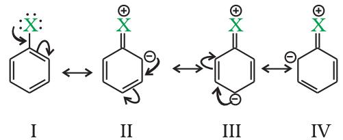

Due to resonance, the electron density increases more at *ortho-* and *para*-positions than at *meta*-positions. Further, the halogen atom because of its –I effect has some tendency to withdraw electrons from the benzene ring. As a result, the ring gets somewhat deactivated as compared to benzene and hence the electrophilic substitution reactions in haloarenes occur slowly and require more drastic conditions as compared to those in benzene.

(i) Halogenation

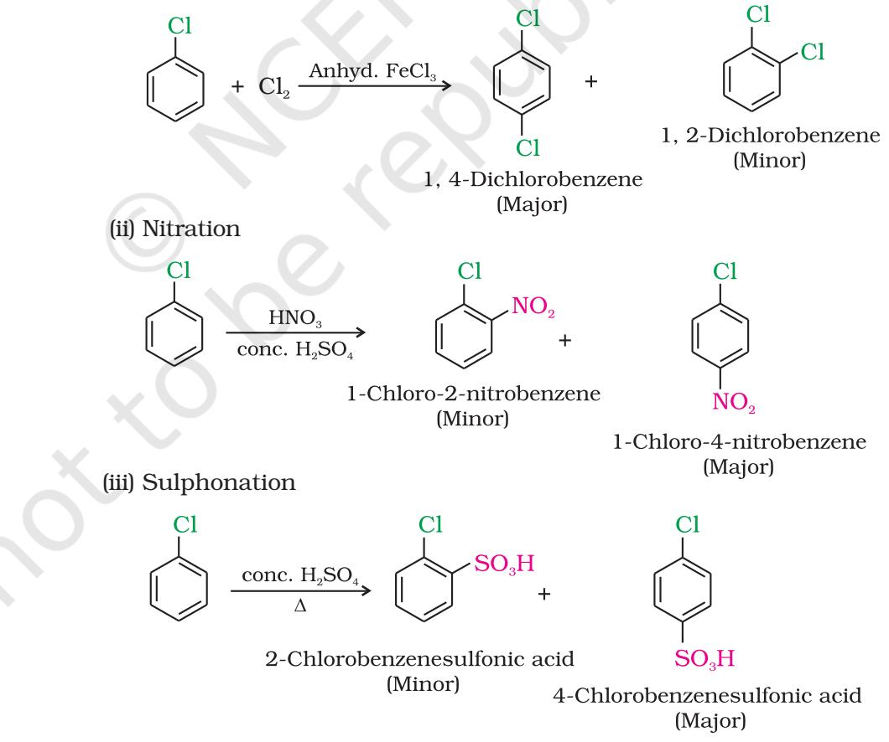

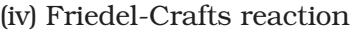

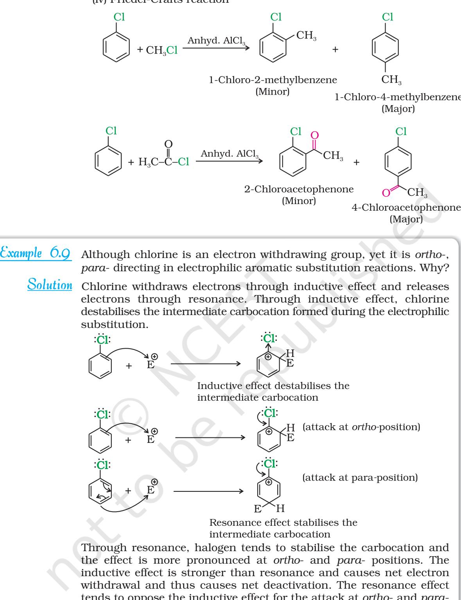

tends to oppose the inductive effect for the attack at *ortho*- and *para*positions and hence makes the deactivation less for *ortho*- and *para*attack. Reactivity is thus controlled by the stronger inductive effect and orientation is controlled by resonance effect.

185 Haloalkanes and Haloarenes

#### *3. Reaction with metals*

#### *Wurtz-Fittig reaction*

A mixture of an alkyl halide and aryl halide gives an alkylarene when treated with sodium in dry ether and is called Wurtz-Fittig reaction.

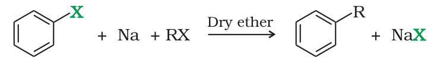

#### *Fittig reaction*

Aryl halides also give analogous compounds when treated with sodium in dry ether, in which two aryl groups are joined together. It is called Fittig reaction.

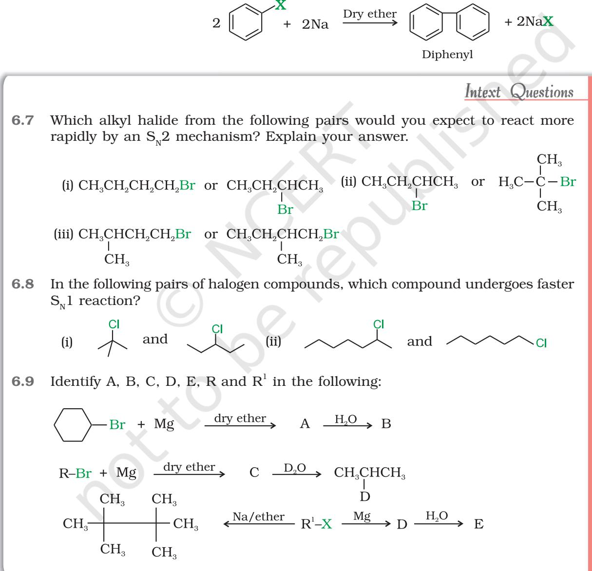

Chemistry 186

- 6.8 Polyhalogen Compounds CompoundsCompounds
Carbon compounds containing more than one halogen atom are usually referred to as polyhalogen compounds. Many of these compounds are useful in industry and agriculture. Some polyhalogen compounds are described in this section.

- Dichloromethane is widely used as a solvent as a paint remover, as a propellant in aerosols, and as a process solvent in the manufacture of drugs. It is also used as a metal cleaning and finishing solvent. Methylene chloride harms the human central nervous system. Exposure to lower levels of methylene chloride in air can lead to slightly impaired hearing and vision. Higher levels of methylene chloride in air cause dizziness, nausea, tingling and numbness in the fingers and toes. In humans, direct skin contact with methylene chloride causes intense burning and mild redness of the skin. Direct contact with the eyes can burn the cornea. 6.8.1 Dichloromethane (Methylene chloride)
- Chemically, chloroform is employed as a solvent for fats, alkaloids, iodine and other substances. The major use of chloroform today is in the production of the freon refrigerant R-22. It was once used as a general anaesthetic in surgery but has been replaced by less toxic, safer anaesthetics, such as ether. As might be expected from its use as an anaesthetic, inhaling chloroform vapours depresses the central nervous system. Breathing about 900 parts of chloroform per million parts of air (900 parts per million) for a short time can cause dizziness, fatigue, and headache. Chronic chloroform exposure may cause damage to the liver (where chloroform is metabolised to phosgene) and to the kidneys, and some people develop sores when the skin is immersed in chloroform. Chloroform is slowly oxidised by air in the presence of light to an extremely poisonous gas, carbonyl chloride, also known as phosgene. It is therefore stored in closed dark coloured bottles completely filled so that air is kept out. 6.8.2 Trichloromethane (Chloroform)

- It was used earlier as an antiseptic but the antiseptic properties are due to the liberation of free iodine and not due to iodoform itself. Due to its objectionable smell, it has been replaced by other formulations containing iodine. 6.8.3 Triiodomethane (Iodoform)
- It is produced in large quantities for use in the manufacture of refrigerants and propellants for aerosol cans. It is also used as feedstock in the synthesis of chlorofluorocarbons and other chemicals, pharmaceutical manufacturing, and general solvent use. Until the mid 1960s, it was also widely used as a cleaning fluid, both in industry, as a degreasing agent, and in the home, as a spot remover and as fire extinguisher. There is some evidence that exposure to carbon tetrachloride causes liver cancer in humans. The most common effects are dizziness, light headedness, nausea and vomiting, which can cause permanent damage to nerve cells. In severe cases, these effects can lead rapidly to stupor, coma, unconsciousness or death. Exposure to CCl4 can make the heart beat irregularly or stop. The chemical may irritate the eyes on contact. When carbon tetrachloride is released into the air, it rises to the atmosphere and depletes the ozone layer. Depletion of the 6.8.4 Tetrachloromethane (Carbon tetrachloride)

187 Haloalkanes and Haloarenes

ozone layer is believed to increase human exposure to ultraviolet rays, leading to increased skin cancer, eye diseases and disorders, and possible disruption of the immune system.

- The chlorofluorocarbon compounds of methane and ethane are collectively known as freons. They are extremely stable, unreactive, non-toxic, noncorrosive and easily liquefiable gases. Freon 12 (CCl2F2 ) is one of the most common freons in industrial use. It is manufactured from tetrachloromethane by Swarts reaction. These are usually produced for aerosol propellants, refrigeration and air conditioning purposes. By 1974, total freon production in the world was about 2 billion pounds annually. Most freon, even that used in refrigeration, eventually makes its way into the atmosphere where it diffuses unchanged into the stratosphere. In stratosphere, freon is able to initiate radical chain reactions that can upset the natural ozone balance. 6.8.5 Freons
- DDT, the first chlorinated organic insecticides, was originally prepared in 1873, but it was not until 1939 that Paul Muller of Geigy Pharmaceuticals in Switzerland discovered the effectiveness of DDT as an insecticide. Paul Muller was awarded the Nobel Prize in Medicine and Physiology in 1948 for this discovery. The use of DDT increased enormously on a worldwide basis after World War II, primarily because of its effectiveness against the mosquito that spreads malaria and lice that carry typhus. However, problems related to extensive use of DDT began to appear in the late 1940s. Many species of insects developed resistance to DDT, and it was also discovered to have a high toxicity towards fish. The chemical stability of DDT and its fat solubility compounded the problem. DDT is not metabolised very rapidly by animals; instead, it is deposited and stored in the fatty tissues. If ingestion continues at a steady rate, DDT builds up within the animal over time. The use of DDT was banned in the United States in 1973, although it is still in use in some other parts of the world. 6.8.6 *p,p'*-Dichlorodiphenyltrichloroethane(DDT)

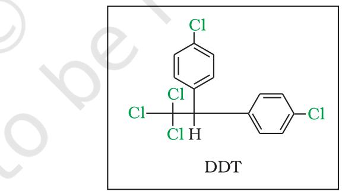

# Summary Summary

Alkyl/ Aryl halides may be classified as mono, di, or polyhalogen (tri-, tetra-, etc.) compounds depending on whether they contain one, two or more halogen atoms in their structures. Since halogen atoms are more electronegative than carbon, the carbonhalogen bond of alkyl halide is polarised; the carbon atom bears a partial positive charge, and the halogen atom bears a partial negative charge.

Alkyl halides are prepared by the free radical halogenation of alkanes, addition of halogen acids to alkenes, replacement of –OH group of alcohols with halogens using

Chemistry 188

phosphorus halides, thionyl chloride or halogen acids. Aryl halides are prepared by electrophilic substitution to arenes. Fluorides and iodides are best prepared by halogen exchange method.

The boiling points of organohalogen compounds are comparatively higher than the corresponding hydrocarbons because of strong dipole-dipole and van der Waals forces of attraction. These are slightly soluble in water but completely soluble in organic solvents.

The polarity of carbon-halogen bond of alkyl halides is responsible for their nucleophilic substitution, elimination and their reaction with metal atoms to form organometallic compounds. Nucleophilic substitution reactions are categorised into SN 1 and SN 2 on the basis of their kinetic properties. Chirality has a profound role in understanding the reaction mechanisms of SN 1 and SN 2 reactions. SN 2 reactions of chiral alkyl halides are characterised by the inversion of configuration while SN 1 reactions are characterised by racemisation.

A number of polyhalogen compounds e.g., dichloromethane, chloroform, iodoform, carbon tetrachloride, freon and DDT have many industrial applications. However, some of these compounds cannot be easily decomposed and even cause depletion of ozone layer and are proving environmental hazards.

# Exercises

- 6.1 Name the following halides according to IUPAC system and classify them as alkyl, allyl, benzyl (primary, secondary, tertiary), vinyl or aryl halides: (i) (CH3 ) 2CHCH(Cl)CH3 (ii) CH3CH2CH(CH3 )CH(C2H5 )Cl (iii) CH3CH2C(CH3 ) 2CH2 I (iv) (CH3 ) 3CCH2CH(Br)C6H5 (v) CH3CH(CH3 )CH(Br)CH3 (vi) CH3C(C2H5 ) 2CH2Br (vii) CH3C(Cl)(C2H5 )CH2CH3 (viii) CH3CH=C(Cl)CH2CH(CH3 ) 2 (ix) CH3CH=CHC(Br)(CH3 ) 2 (x) *p*-ClC6H4CH2CH(CH3 ) 2 (xi) *m*-ClCH2C6H4CH2C(CH3 ) 3 (xii) *o*-Br-C6H4CH(CH3 )CH2CH3 6.2 Give the IUPAC names of the following compounds: (i) CH3CH(Cl)CH(Br)CH3 (ii) CHF2CBrClF (iii) ClCH2CºCCH2Br (iv) (CCl3 ) 3CCl (v) CH3C(*p*-ClC6H4 ) 2CH(Br)CH3 (vi) (CH3 ) 3CCH=CClC6H4 I-*p* 6.3 Write the structures of the following organic halogen compounds. (i) 2-Chloro-3-methylpentane (ii) *p*-Bromochlorobenzene (iii) 1-Chloro-4-ethylcyclohexane (iv) 2-(2-Chlorophenyl)-1-iodooctane (v) 2-Bromobutane (vi) 4-tert-Butyl-3-iodoheptane (vii) 1-Bromo-4-sec-butyl-2-methylbenzene (viii) 1,4-Dibromobut-2-ene 6.4 Which one of the following has the highest dipole moment? (i) CH2Cl2 (ii) CHCl3 (iii) CCl4 6.5 A hydrocarbon C5H10 does not react with chlorine in dark but gives a single monochloro compound C5H9Cl in bright sunlight. Identify the hydrocarbon. 6.6 Write the isomers of the compound having formula C4H9Br. 6.7 Write the equations for the preparation of 1-iodobutane from (i) 1-butanol (ii) 1-chlorobutane (iii) but-1-ene. 6.8 What are ambident nucleophiles? Explain with an example.
189 Haloalkanes and Haloarenes

- 6.9 Which compound in each of the following pairs will react faster in SN 2 reaction with –OH?
(i) CH3Br or CH3 I (ii) (CH3 ) 3CCl or CH3Cl

- 6.10 Predict all the alkenes that would be formed by dehydrohalogenation of the following halides with sodium ethoxide in ethanol and identify the major alkene:
	- (i) 1-Bromo-1-methylcyclohexane (ii) 2-Chloro-2-methylbutane
	- (iii) 2,2,3-Trimethyl-3-bromopentane.
- 6.11 How will you bring about the following conversions?

(i) Ethanol to but-1-yne (ii) Ethane to bromoethene (iii) Propene to 1-nitropropane (iv) Toluene to benzyl alcohol (v) Propene to propyne (vi) Ethanol to ethyl fluoride (vii) Bromomethane to propanone (viii) But-1-ene to but-2-ene (ix) 1-Chlorobutane to n-octane (x) Benzene to biphenyl.

#### 6.12 Explain why

- (i) the dipole moment of chlorobenzene is lower than that of cyclohexyl chloride?
- (ii) alkyl halides, though polar, are immiscible with water?
- (iii) Grignard reagents should be prepared under anhydrous conditions?
- 6.13 Give the uses of freon 12, DDT, carbon tetrachloride and iodoform.
- 6.14 Write the structure of the major organic product in each of the following reactions:

(i) CH3CH2CH2Cl + NaI (ii) (CH3 ) 3CBr + KOH (iii) CH3CH(Br)CH2CH3 + NaOH (iv) CH3CH2Br + KCN (v) C6H5ONa + C2H5Cl (vi) CH3CH2CH2OH + SOCl2 (vii) CH3CH2CH = CH2 + HBr (viii) CH3CH = C(CH3 ) 2 + HBr

- 6.15 Write the mechanism of the following reaction: nBuBr + KCN nBuCN
- 6.16 Arrange the compounds of each set in order of reactivity towards SN2 displacement:
	- (i) 2-Bromo-2-methylbutane, 1-Bromopentane, 2-Bromopentane
	- (ii) 1-Bromo-3-methylbutane, 2-Bromo-2-methylbutane, 2-Bromo-3-methylbutane
	- (iii) 1-Bromobutane, 1-Bromo-2,2-dimethylpropane, 1-Bromo-2-methylbutane, 1-Bromo-3-methylbutane.
- 6.17 Out of C6H5CH2Cl and C6H5CHClC6H5 , which is more easily hydrolysed by aqueous KOH.
- 6.18 *p*-Dichlorobenzene has higher m.p. than those of *o* and *m*-isomers. Discuss.
- 6.19 How the following conversions can be carried out?
	- (i) Propene to propan-1-ol
	- (ii) Ethanol to but-1-yne
	- (iii) 1-Bromopropane to 2-bromopropane

Chemistry 190

- (iv) Toluene to benzyl alcohol
- (v) Benzene to 4-bromonitrobenzene
- (vi) Benzyl alcohol to 2-phenylethanoic acid
- (vii) Ethanol to propanenitrile
- (viii) Aniline to chlorobenzene
- (ix) 2-Chlorobutane to 3, 4-dimethylhexane
- (x) 2-Methyl-1-propene to 2-chloro-2-methylpropane
- (xi) Ethyl chloride to propanoic acid
- (xii) But-1-ene to n-butyliodide
- (xiii) 2-Chloropropane to 1-propanol
- (xiv) Isopropyl alcohol to iodoform
- (xv) Chlorobenzene to *p*-nitrophenol
- (xvi) 2-Bromopropane to 1-bromopropane
- (xvii) Chloroethane to butane
- (xviii) Benzene to diphenyl
- (xix) *tert*-Butyl bromide to isobutyl bromide
- (xx) Aniline to phenylisocyanide
- 6.20 The treatment of alkyl chlorides with aqueous KOH leads to the formation of alcohols but in the presence of alcoholic KOH, alkenes are major products. Explain.
- 6.21 Primary alkyl halide C4H9Br (a) reacted with alcoholic KOH to give compound (b). Compound (b) is reacted with HBr to give (c) which is an isomer of (a). When (a) is reacted with sodium metal it gives compound (d), C8H18 which is different from the compound formed when n-butyl bromide is reacted with sodium. Give the structural formula of (a) and write the equations for all the reactions.
- 6.22 What happens when
	- (i) n-butyl chloride is treated with alcoholic KOH,
	- (ii) bromobenzene is treated with Mg in the presence of dry ether,
	- (iii) chlorobenzene is subjected to hydrolysis,
	- (iv) ethyl chloride is treated with aqueous KOH,
	- (v) methyl bromide is treated with sodium in the presence of dry ether,
	- (vi) methyl chloride is treated with KCN?

#### Answers to Some Intext Questions

6.1

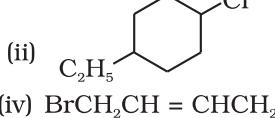

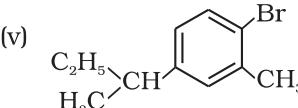

- 6.2 (i) H2SO4 cannot be used along with KI in the conversion of an alcohol to an alkyl iodide as it converts KI to corresponding acid, HI which is then oxidised by it to I2 .
- 6.3 (i) ClCH2CH2CH2Cl (ii) ClCH2CHClCH3 (iii) Cl2CHCH2CH3 (iv) CH3CCl2CH3

191 Haloalkanes and Haloarenes

* 4.4 H $\mathrm{LCC}_{\mathrm{f}}$--$\mathrm{CH}_{\mathrm{f}}$. $\mathrm{CH}_{\mathrm{f}}$. $\mathrm{CH}_{\mathrm{f}}$. $\mathrm{CH}_{\mathrm{f}}$. $\mathrm{CH}_{\mathrm{f}}$.  
  

Chemistry 192

