## Objectives

After studying this Unit, you will be able to

- name alcohols, phenols and ethers according to the IUPAC system of nomenclature;
- discuss the reactions involved in the preparation of alcohols from alkenes, aldehydes, ketones and carboxylic acids;
- discuss the reactions involved in the preparation of phenols from haloarenes, benzene sulphonic acids, diazonium salts and cumene;
- discuss the reactions for preparation of ethers from (i) alcohols and (ii) alkyl halides and sodium alkoxides/aryloxides;
- correlate physical properties of alcohols, phenols and ethers with their structures;
- discuss chemical reactions of the three classes of compounds on the basis of their functional groups.

# **7 7** Alcohols, Phenols Phenols and Ethers Alcohols AlcoholsAlcohols, Phenols Phenols and Ethers

Unit

*Alcohols, phenols and ethers are the basic compounds for the formation of detergents, antiseptics and fragrances, respectively.*

You have learnt that substitution of one or more hydrogen atom(s) from a hydrocarbon by another atom or a group of atoms result in the formation of an entirely new compound having altogether different properties and applications. Alcohols and phenols are formed when a hydrogen atom in a hydrocarbon, aliphatic and aromatic respectively, is replaced by –OH group. These classes of compounds find wide applications in industry as well as in day-to-day life. For instance, have you ever noticed that ordinary spirit used for polishing wooden furniture is chiefly a compound containing hydroxyl group, ethanol. The sugar we eat, the cotton used for fabrics, the paper we use for writing, are all made up of compounds containing –OH groups. Just think of life without paper; no note-books, books, newspapers, currency notes, cheques, certificates, etc. The magazines carrying beautiful photographs and interesting stories would disappear from our life. It would have been really a different world.

An alcohol contains one or more hydroxyl (OH) group(s) directly attached to carbon atom(s), of an aliphatic system (CH3OH) while a phenol contains –OH group(s) directly attached to carbon atom(s) of an aromatic system (C6H5OH).

The substitution of a hydrogen atom in a hydrocarbon by an alkoxy or aryloxy group (R–O/Ar–O) yields another class of compounds known as 'ethers', for example, CH3OCH3 (dimethyl ether). You may also visualise ethers as compounds formed by

substituting the hydrogen atom of hydroxyl group of an alcohol or phenol by an alkyl or aryl group.

In this unit, we shall discuss the chemistry of three classes of compounds, namely — alcohols, phenols and ethers.

The classification of compounds makes their study systematic and hence simpler. Therefore, let us first learn how are alcohols, phenols and ethers classified? 7.1 Classification

Alcohols and phenols may be classified as mono–, di–, tri- or polyhydric compounds depending on whether they contain one, two, three or many hydroxyl groups respectively in their structures as given below: 7.1.1 Alcohols— Mono, Di, Tri or Polyhydric

|
|  |

Monohydric alcohols may be further classified according to the hybridisation of the carbon atom to which the hydroxyl group is attached.

- *(i) Compounds containing* C OH 3 *sp bond:* In this class of alcohols, the –OH group is attached to an *sp 3* hybridised carbon atom of an alkyl group. They are further classified as follows:
*Primary, secondary and tertiary alcohols:* In these three types of alcohols, the –OH group is attached to primary, secondary and tertiary carbon atom, respectively as depicted below:

| - CH-OH | CCH-OH | ->C-OF |
| --- | --- | --- |
| Primary (19) | Secondary (2°) | Tertiary |

*Allylic alcohols:* In these alcohols, the —OH group is attached to a *sp* 3 hybridised carbon adjacent to the carbon-carbon double bond, that is to an allylic carbon. For example

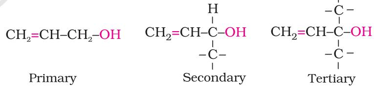

*Benzylic alcohols:* In these alcohols, the —OH group is attached to a *sp* 3—hybridised carbon atom next to an aromatic ring. For example.

alcohols

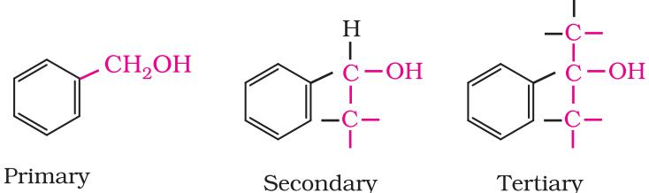

Allylic and benzylic alcohols may be primary, secondary or tertiary. *(ii) Compounds containing* C OH 2 *sp bond:* These alcohols contain —OH group bonded to a carbon-carbon double bond, i.e., to a vinylic carbon or to an aryl carbon. These alcohols are also known as vinylic alcohols.

*Vinylic alcohol:* CH2 = CH – OH

- 7.1.2 Phenols— Mono, Di and trihydric phenols Monohydric
- 7.1.3 Ethers Ethers are classified as simple or symmetrical, if the alkyl or aryl groups attached to the oxygen atom are the same, and mixed or unsymmetrical, if the two groups are different. Diethyl ether, C2H5OC2H5 , is a symmetrical ether whereas C2H5OCH3 and C2H5OC6H5 are unsymmetrical ethers.

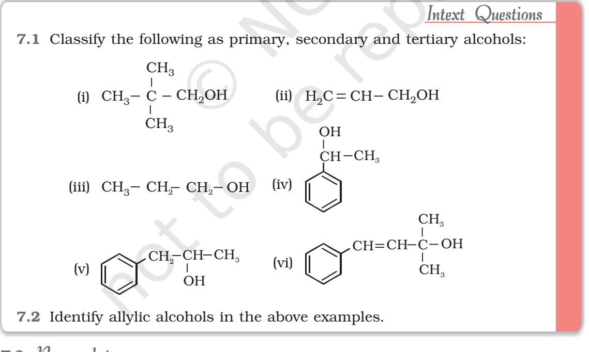

7.2 Nomenclature *(a) Alcohols:* The common name of an alcohol is derived from the common name of the alkyl group and adding the word alcohol to it. For example, CH3OH is methyl alcohol.

195 Alcohols, Phenols and Ethers

According to IUPAC system, the name of an alcohol is derived from the name of the alkane from which the alcohol is derived, by substituting 'e' of alkane with the suffix 'ol'. The position of substituents are indicated by numerals. For this, the longest carbon chain (parent chain) is numbered starting at the end nearest to the hydroxyl group. The positions of the –OH group and other substituents are indicated by using the numbers of carbon atoms to which these are attached. For naming polyhydric alcohols, the 'e' of alkane is retained and the ending 'ol' is added. The number of –OH groups is indicated by adding the multiplicative prefix, di, tri, etc., before 'ol'. The positions of –OH groups are indicated by appropriate locants, e.g., HO–CH2–CH2–OH is named as ethane–1, 2-diol. Table 7.1 gives common and IUPAC names of a few alcohols as examples.

| Compound | Common name | IUPAC name |
| --- | --- | --- |
| CH3 – OH | Methyl alcohol | Methanol |
| CH3 – CH2 – CH2 – OH | n-Propyl alcohol | Propan-1-ol |
|  | Isopropyl alcohol | Propan-2-ol |
| CH3 – CH2 – CH2 – CH2 – OH | n-Butyl alcohol | Butan-1-ol |
|  | sec-Butyl alcohol | Butan-2-ol |
|  | Isobutyl alcohol | 2-Methylpropan-1-ol |
|  | tert-Butyl alcohol | 2-Methylpropan-2-ol |
| HO–H2C–CH2–OH | Ethylene glycol | Ethane-1,2-diol |
|  | Glycerol | Propane -1, 2, 3-triol |

Table 7.1: Common and IUPAC Names of Some Alcohols

Cyclic alcohols are named using the prefix cyclo and considering the —OH group attached to C–1.

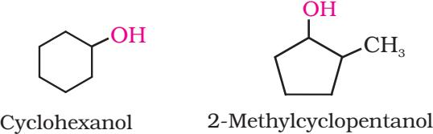

*(b) Phenols:* The simplest hydroxy derivative of benzene is phenol. It is its common name and also an accepted IUPAC name. As structure of phenol involves a benzene ring, in its substituted compounds the terms *ortho* (1,2- disubstituted), *meta* (1,3-disubstituted) and *para* (1,4-disubstituted) are often used in the common names.

Chemistry 196

Common name Phenol *o*-Cresol *m*-Cresol *p*-Cresol IUPAC name Phenol 2-Methylphenol 3-Methylphenol 4-Methylphenol

Dihydroxy derivatives of benzene are known as 1, 2-, 1, 3- and 1, 4-benzenediol.

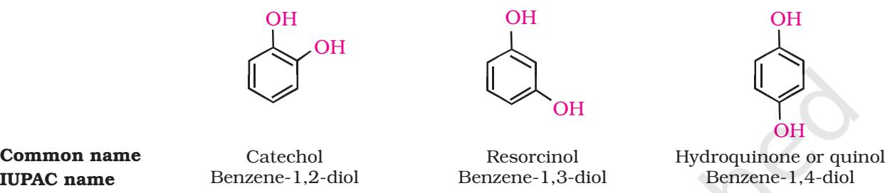

*(c) Ethers:* Common names of ethers are derived from the names of alkyl/ aryl groups written as separate words in alphabetical order and adding the word 'ether' at the end. For example, CH3OC2H5 is ethylmethyl ether.

Table 7.2: Common and IUPAC Names of Some Ethers

| Compound | Common name | IUPAC name |
| --- | --- | --- |
| CH3OCH3 | Dimethyl ether | Methoxymethane |
| C2H5OC2H5 | Diethyl ether | Ethoxyethane |
| CH3OCH2CH2CH3 | Methyl n-propyl ether | 1-Methoxypropane |
| C6H5OCH3 | Methyl phenyl ether | Methoxybenzene |
|  | (Anisole) | (Anisole) |
| C6H5OCH2CH3 | Ethyl phenyl ether | Ethoxybenzene |
|  | (Phenetole) |  |
| C6H5O(CH2)6 – CH3 | Heptyl phenyl ether | 1-Phenoxyheptane |
| CH3O CH CH3 | Methyl isopropyl ether | 2-Methoxypropane |
| CH3 |  |  |
|  | Phenyl isopentyl ether | 3- Methylbutoxybenzene |
| CH3– O – CH2 – CH2 – OCH3 | — | 1,2-Dimethoxyethane |
|  | — | 2-Ethoxy- |
|  |  | -1,1-dimethylcyclohexane |

197 Alcohols, Phenols and Ethers

If both the alkyl groups are the same, the prefix 'di' is added before the alkyl group. For example, C2H5OC2H5 is diethyl ether.

According to IUPAC system of nomenclature, ethers are regarded as hydrocarbon derivatives in which a hydrogen atom is replaced by an –OR or –OAr group, where R and Ar represent alkyl and aryl groups, respectively. The larger (R) group is chosen as the parent hydrocarbon. The names of a few ethers are given as examples in Table 7.2.

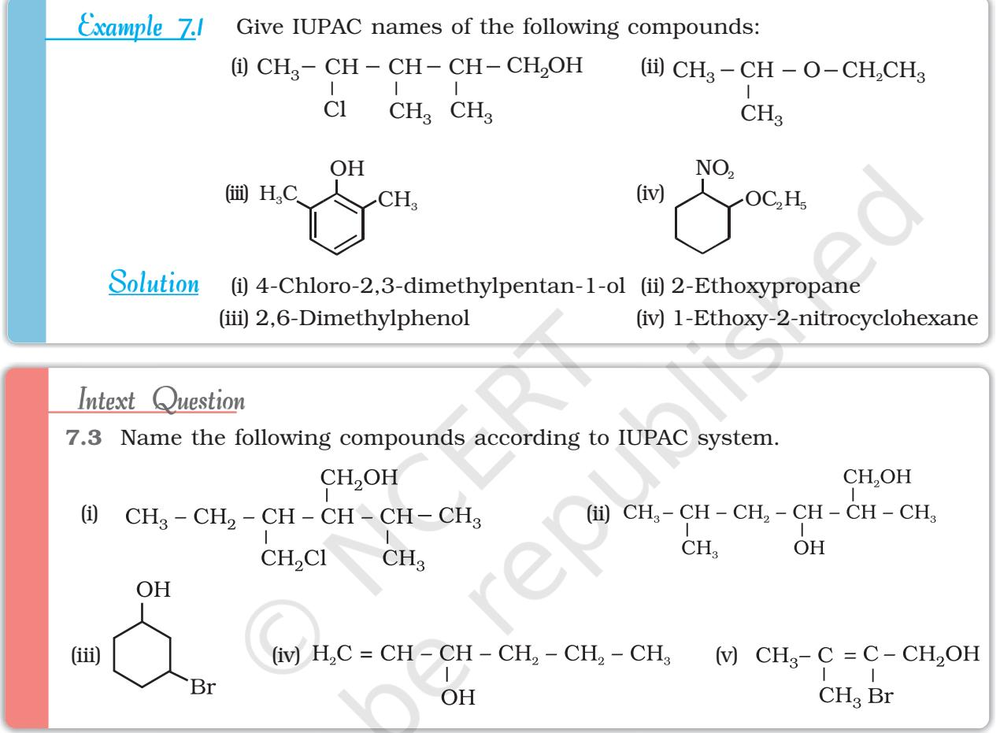

- 7.3 Structures of Functional FunctionalFunctional Groups
In alcohols, the oxygen of the –OH group is attached to carbon by a sigma (s ) bond formed by the overlap of a *sp* 3 hybridised orbital of carbon with a *sp* 3 hybridised orbital of oxygen. Fig. 7.1 depicts structural aspects of methanol, phenol and methoxymethane.

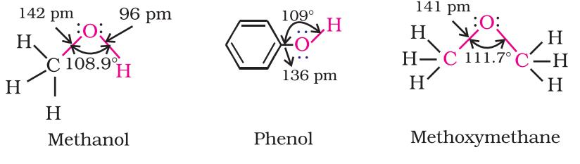

The bond angle in alcohols is slightly less than the tetrahedral angle (109°-28¢). It is due to the repulsion between the unshared electron pairs of oxygen. In phenols, the –OH group is attached to *sp2* hybridised carbon of an aromatic ring. The carbon– oxygen bond length (136 pm) in phenol is slightly less than that in methanol. This is due to (i) partial double bond character on account of the conjugation of unshared electron pair of oxygen with the aromatic ring (Section 7.4.4) and (ii) *sp* 2 hybridised state of carbon to which oxygen is attached.

In ethers, the four electron pairs, i.e., the two bond pairs and two lone pairs of electrons on oxygen are arranged approximately in a tetrahedral arrangement. The bond angle is slightly greater than the tetrahedral angle due to the repulsive interaction between the two bulky (–R) groups. The C–O bond length (141 pm) is almost the same as in alcohols.

7.4 Alcohols and Phenols Phenols

#### 7.4.1 Preparation of Alcohols

Alcohols are prepared by the following methods:

- *1. From alkenes*
	- (i) *By acid catalysed hydration:* Alkenes react with water in the presence of acid as catalyst to form alcohols. In case of unsymmetrical alkenes, the addition reaction takes place in accordance with Markovnikov's rule.

$$\rm CH_{3}CH=CH_{2}+H_{2}O\rm CH_{3}-CH-CH_{3}$$

#### *Mechanism*

The mechanism of the reaction involves the following three steps:

- Step 1: Protonation of alkene to form carbocation by electrophilic attack of H3O + .

$$\mathrm{\mathrm{H_{2}O\,\star\H^{\star}\to H_{3}O^{\star}}}$$

$\begin{array}{c}\includegraphics[height=36.135pt]{Fig1}\end{array}$

Step 2: Nucleophilic attack of water on carbocation.

$$\begin{array}{r l}{\mathrm{H}}\\ {\mathrm{-\stackrel{\downarrow}{C}-\stackrel{\downarrow}{C}\stackrel{\downarrow}{\smile}+\stackrel{\downarrow}{H_{2}\bullet}\ \ \ \ \ \ \stackrel{\longrightarrow}{\smile}-\stackrel{\downarrow}{C}-\stackrel{\downarrow}{C}-\stackrel{\downarrow}{O}-\stackrel{\downarrow}{H_{2}\bullet}}}\end{array}$$

Step 3: Deprotonation to form an alcohol.

$\begin{array}{c}\includegraphics[height=36.135pt]{Fig1}\end{array}$

199 Alcohols, Phenols and Ethers

*Hydroboration oxidation was first reported by H.C. Brown in 1959. For his studies on boron containing organic compounds, Brown shared the 1979 Nobel prize in Chemistry with G. Wittig.*

- (ii) *By hydroboration–oxidation*: Diborane (BH3 )2 reacts with alkenes to give trialkyl boranes as addition product. This is oxidised to alcohol by hydrogen peroxide in the presence of aqueous sodium hydroxide.
The addition of borane to the double bond takes place in such a manner that the boron atom gets attached to the *sp* 2 carbon carrying greater number of hydrogen atoms. The alcohol so formed looks as if it has been formed by the addition of water to the alkene in a way opposite to the Markovnikov's rule. In this reaction, alcohol is obtained in excellent yield.

- *2. From carbonyl compounds*
	- (i) *By reduction of aldehydes and ketones*: Aldehydes and ketones are reduced to the corresponding alcohols by addition of hydrogen in the presence of catalysts (catalytic hydrogenation). The usual catalyst is a finely divided metal such as platinum, palladium or nickel. It is also prepared by treating aldehydes and ketones with sodium borohydride (NaBH4 ) or lithium aluminium hydride (LiAlH4 ). Aldehydes yield primary alcohols whereas ketones give secondary alcohols.

$$\begin{array}{r l}{\mathrm{RCHO}+\mathrm{H}_{2}\xrightarrow{\quad\mathrm{Pd}\quad}\mathrm{RCH}_{2}\mathrm{OH}}\\ {\mathrm{RCOR}^{\prime}\quad}&{{}\xrightarrow{\mathrm{NaBH}_{4}}\quad}\mathrm{R-\overset{\quad\mathrm{CH-R}^{\prime}}{\underset{\mathrm{OH}}{\overset{\quad\mathrm{H}}{\mathrm{H}}}}}\end{array}$$

(ii) *By reduction of carboxylic acids and esters*: Carboxylic acids are reduced to primary alcohols in excellent yields by lithium aluminium hydride, a strong reducing agent.

$$\mathrm{\begin{array}{l l}{{\mathrm{RCOOH}}}&{{\xrightarrow{\mathrm{(i)\LiAlH_{4}}}}}\\ {{\mathrm{\begin{array}{l l}{{\mathrm{(ii)\LiAlH_{2}O}}}\\ {{\mathrm{(iii)\Li_{2}O}}}\end{array}}}\end{array}}\mathrm{\begin{array}{l l}{{\mathrm{RCH_{2}O H}}}\\ {{\mathrm{(iii)\_{2}O}}}\end{array}}$$

However, LiAlH4 is an expensive reagent, and therefore, used for preparing special chemicals only. Commercially, acids are reduced to alcohols by converting them to the esters (Section 7.4.4), followed by their reduction using hydrogen in the presence of catalyst (catalytic hydrogenation).

$\text{R}^{\text{COOH}}\xrightarrow[\text{H}^{\circ}]{\text{R}^{\text{COOR}^{\prime}}}\xrightarrow[\text{Catalyst}]{\text{H}_2}\xrightarrow[\text{R}^{\text{CH}_2\text{OH}}+\text{R}^{\prime}\text{OH}]$. 

*The numbers in front of the reagents along the arrow indicate that the second reagent is added only when the reaction with first is complete.*

#### *3. From Grignard reagents*

Alcohols are produced by the reaction of Grignard reagents (Unit 6, Class XII) with aldehydes and ketones.

The first step of the reaction is the nucleophilic addition of Grignard reagent to the carbonyl group to form an adduct. Hydrolysis of the adduct yields an alcohol.

... (i) ...(ii)

The overall reactions using different aldehydes and ketones are as follows:

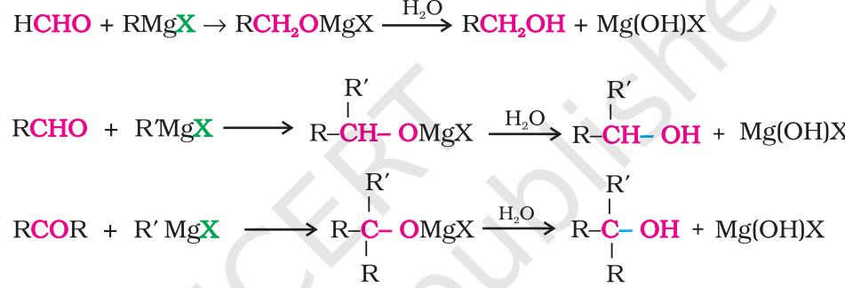

You will notice that the reaction produces a primary alcohol with methanal, a secondary alcohol with other aldehydes and tertiary alcohol with ketones.

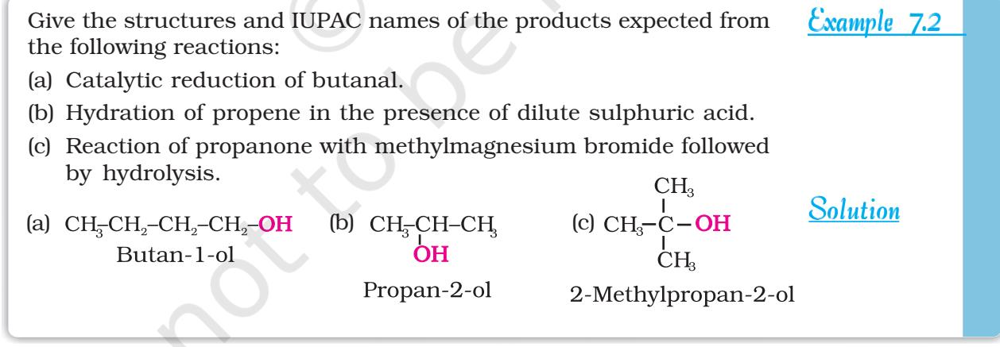

#### 7.4.2 Preparation of Phenols

Phenol, also known as carbolic acid, was first isolated in the early nineteenth century from coal tar. Nowadays, phenol is commercially produced synthetically. In the laboratory, phenols are prepared from benzene derivatives by any of the following methods:

201 Alcohols, Phenols and Ethers

*The reaction of Grignard reagents with methanal produces a primary alcohol, with other aldehydes, secondary alcohols and with ketones, tertiary alcohols.*

- *1. From haloarenes*
Chlorobenzene is fused with NaOH at 623K and 320 atmospheric pressure. Phenol is obtained by acidification of sodium phenoxide so produced (Unit 6, Class XII).

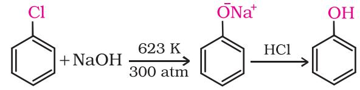

*2. From benzenesulphonic acid*

Benzene is sulphonated with oleum and benzene sulphonic acid so formed is converted to sodium phenoxide on heating with molten sodium hydroxide. Acidification of the sodium salt gives phenol.

- *3. From diazonium salts*
A diazonium salt is formed by treating an aromatic primary amine with nitrous acid (NaNO2 + HCl) at 273-278 K. Diazonium salts are hydrolysed to phenols by warming with water or by treating with dilute acids (Unit 9, Class XII).

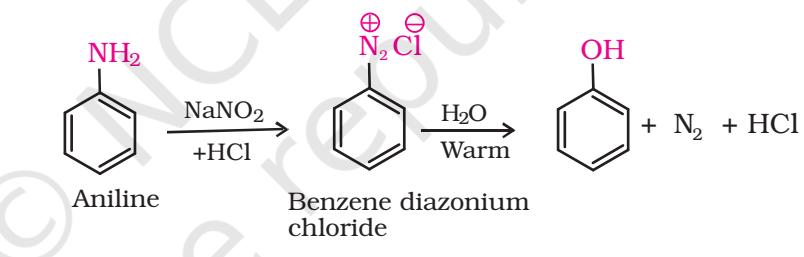

#### *4. From cumene*

Phenol is manufactured from the hydrocarbon, cumene. Cumene (isopropylbenzene) is oxidised in the presence of air to cumene hydroperoxide. It is converted to phenol and acetone by treating it with dilute acid. Acetone, a by-product of this reaction, is also obtained in large quantities by this method.

*Most of the worldwide production of phenol is from cumene.*

Chemistry 202

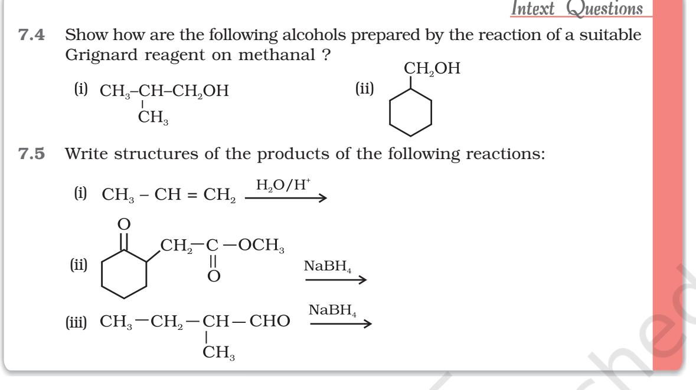

#### 7.4.3 Physical Properties

Alcohols and phenols consist of two parts, an alkyl/aryl group and a hydroxyl group. The properties of alcohols and phenols are chiefly due to the hydroxyl group. The nature of alkyl and aryl groups simply modify these properties.

Boiling Points

The boiling points of alcohols and phenols increase with increase in the number of carbon atoms (increase in van der Waals forces). In alcohols, the boiling points decrease with increase of branching in carbon chain (because of decrease in van der Waals forces with decrease in surface area).

The –OH group in alcohols and phenols is involved in intermolecular hydrogen bonding as shown below:

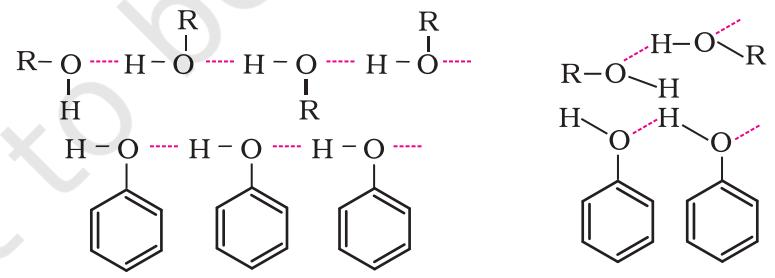

It is interesting to note that boiling points of alcohols and phenols are higher in comparison to other classes of compounds, namely hydrocarbons, ethers, haloalkanes and haloarenes of comparable molecular masses. For example, ethanol and propane have comparable molecular masses but their boiling points differ widely. The boiling point of methoxymethane is intermediate of the two boiling points.

203 Alcohols, Phenols and Ethers

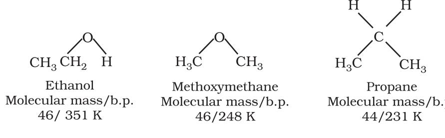

The high boiling points of alcohols are mainly due to the presence of intermolecular hydrogen bonding in them which is lacking in ethers and hydrocarbons.

Solubility

Solubility of alcohols and phenols in water is due to their ability to form hydrogen bonds with water molecules as shown. The solubility decreases with increase in size of alkyl/aryl (hydrophobic) groups. Several of the lower molecular mass alcohols are miscible with water in all proportions.

$\begin{array}{c}\mbox{H}\\ \mbox{CH}_{3}\end{array}$

Arrange the following sets of compounds in order of their increasing boiling points: (a) Pentan-1-ol, butan-1-ol, butan-2-ol, ethanol, propan-1-ol, methanol. Example 7.3 Example 7.3Example 7.3

- (b) Pentan-1-ol, n-butane, pentanal, ethoxyethane.
- (a) Methanol, ethanol, propan-1-ol, butan-2-ol, butan-1-ol, pentan-1-ol. (b) n-Butane, ethoxyethane, pentanal and pentan-1-ol. Solution SolutionSolution
- Alcohols are versatile compounds. They react both as nucleophiles and electrophiles. The bond between O–H is broken when alcohols react as nucleophiles. 7.4.4 Chemical Reactions

*Alcohols as nucleophiles* (i)

(i) R-O-H + +C- $\longrightarrow$ R-O-C- $\longrightarrow$ R-O-C- + H${}^{+}$

(ii) The bond between C–O is broken when they react as electrophiles. Protonated alcohols react in this manner.

*Protonated alcohols as electrophiles*

$\begin{array}{c}\includegraphics[height=36.135pt]{Fig1}\end{array}$

Based on the cleavage of O–H and C–O bonds, the reactions of alcohols and phenols may be divided into two groups:

#### (a) Reactions involving cleavage of O–H bond

- *1. Acidity of alcohols and phenols*
	- *(i) Reaction with metals*: Alcohols and phenols react with active metals such as sodium, potassium and aluminium to yield corresponding alkoxides/phenoxides and hydrogen.

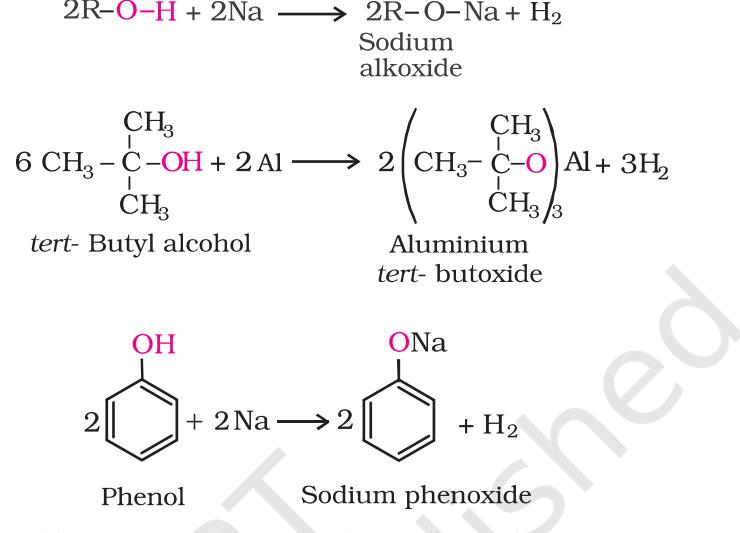

In addition to this, phenols react with aqueous sodium hydroxide to form sodium phenoxides.

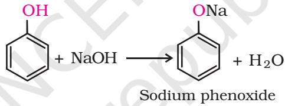

The above reactions show that alcohols and phenols are acidic in nature. In fact, alcohols and phenols are Brönsted acids i.e., they can donate a proton to a stronger base (B:).

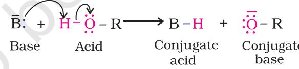

- *(ii) Acidity of alcohols:* The acidic character of alcohols is due to the polar nature of O–H bond. An electron-releasing group (–CH3 , –C2H5 ) increases electron density on oxygen tending to decrease the polarity of O-H bond. This decreases the acid strength. For this reason, the acid strength of alcohols decreases in the following order:
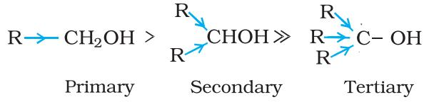

205 Alcohols, Phenols and Ethers

Alcohols are, however, weaker acids than water. This can be illustrated by the reaction of water with an alkoxide.

This reaction shows that water is a better proton donor (i.e., stronger acid) than alcohol. Also, in the above reaction, we note that an alkoxide ion is a better proton acceptor than hydroxide ion, which suggests that alkoxides are stronger bases (sodium ethoxide is a stronger base than sodium hydroxide).

Alcohols act as Bronsted bases as well. It is due to the presence of unshared electron pairs on oxygen, which makes them proton acceptors.

- *(iii) Acidity of phenols:* The reactions of phenol with metals (e.g., sodium, aluminium) and sodium hydroxide indicate its acidic nature. The hydroxyl group, in phenol is directly attached to the *sp 2* hybridised carbon of benzene ring which acts as an electron withdrawing group. Due to this, the charge distribution in phenol molecule, as depicted in its resonance structures, causes the oxygen of –OH group to be positive.

The reaction of phenol with aqueous sodium hydroxide indicates that phenols are stronger acids than alcohols and water. Let us examine how a compound in which hydroxyl group attached to an aromatic ring is more acidic than the one in which hydroxyl group is attached to an alkyl group.

The ionisation of an alcohol and a phenol takes place as follows:

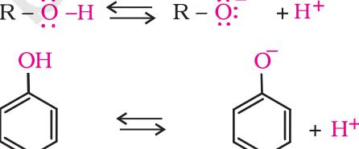

Due to the higher electronegativity of *sp* 2 hybridised carbon of phenol to which –OH is attached, electron density decreases on oxygen. This increases the polarity of O–H bond and results in an increase in ionisation of phenols than that of alcohols. Now let us examine the stabilities of alkoxide and phenoxide ions. In alkoxide ion, the negative charge is localised on oxygen while in phenoxide ion, the charge is delocalised. The delocalisation of negative charge (structures I-V) makes

phenoxide ion more stable and favours the ionisation of phenol. Although there is also charge delocalisation in phenol, its resonance structures have charge separation due to which the phenol molecule is less stable than phenoxide ion.

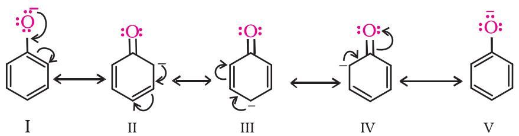

In substituted phenols, the presence of electron withdrawing groups such as nitro group, enhances the acidic strength of phenol. This effect is more pronounced when such a group is present at *ortho* and *para* positions. It is due to the effective delocalisation of negative charge in phenoxide ion when substituent is at ortho or para position. On the other hand, electron releasing groups, such as alkyl groups, in general, do not favour the formation of phenoxide ion resulting in decrease in acid strength. Cresols, for example, are less acidic than phenol.

*The greater the* p*Ka value, the weaker the acid.*

Table 7.3: p*Ka* Values of some Phenols and Ethanol

| Compound | Formula | pKa |
| --- | --- | --- |
| o-Nitrophenol | o–O2N–C6H4–OH | 7.2 |
| m-Nitrophenol | m–O2N–C6H4–OH | 8.3 |
| p-Nitrophenol | p-O2N–C6H4–OH | 7.1 |
| Phenol | C6H5–OH | 10.0 |
| o-Cresol | o-CH3–C6H4–OH | 10.2 |
| m-Cresol | m-CH3C6H4–OH | 10.1 |
| p-Cresol | p-CH3–C6H4–OH | 10.2 |
| Ethanol | C2H5OH | 15.9 |

From the above data, you will note that phenol is million times more acidic than ethanol.

| Arrange the following compounds in increasing order of their acid strength: | Example 7.4 Example 7.4 Example 7.4 |
| --- | --- |
| Propan-1-ol, 2,4,6-trinitrophenol, 3-nitrophenol, 3,5-dinitrophenol, |  |
| phenol, 4-methylphenol. |  |
| Propan-1-ol, 4-methylphenol, phenol, 3-nitrophenol, 3,5-dinitrophenol, | Solution Solution Solution |
| 2,4, 6-trinitrophenol. |  |

- *2. Esterification*
Alcohols and phenols react with carboxylic acids, acid chlorides and acid anhydrides to form esters.

207 Alcohols, Phenols and Ethers

*Aspirin possesses analgesic, antiinflammatory and antipyretic properties.* Pyridine R/Ar +R OH COC ' l R/ArOCOR'+ HCl

The reaction with carboxylic acid and acid anhydride is carried out in the presence of a small amount of concentrated sulphuric acid. The reaction is reversible, and therefore, water is removed as soon as it is formed. The reaction with acid chloride is carried out in the presence of a base (pyridine) so as to neutralise HCl which is formed during the reaction. It shifts the equilibrium to the right hand side. The introduction of acetyl (CH3CO) group in alcohols or phenols is known as acetylation. Acetylation of salicylic acid produces aspirin.

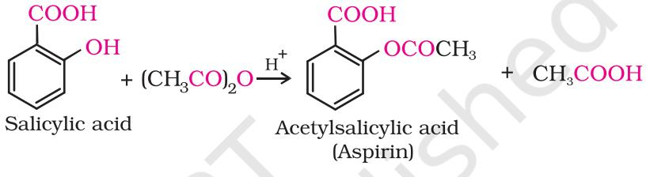

#### (b) Reactions involving cleavage of carbon – oxygen (C–O) bond in alcohols

The reactions involving cleavage of C–O bond take place only in alcohols. Phenols show this type of reaction only with zinc.

- *1. Reaction with hydrogen halides:* Alcohols react with hydrogen halides to form alkyl halides (Refer Unit 6, Class XII).
ROH + HX ® R–X + H2O

The difference in reactivity of three classes of alcohols with HCl distinguishes them from one another (Lucas test). Alcohols are soluble in Lucas reagent (conc. HCl and ZnCl2 ) while their halides are immiscible and produce turbidity in solution. In case of tertiary alcohols, turbidity is produced immediately as they form the halides easily. Primary alcohols do not produce turbidity at room temperature.

- *2. Reaction with phosphorus trihalides:* Alcohols are converted to alkyl bromides by reaction with phosphorus tribromide (Refer Unit 6, Class XII).
- *3. Dehydration:* Alcohols undergo dehydration (removal of a molecule of water) to form alkenes on treating with a protic acid e.g., concentrated H2SO4 or H3PO4 , or catalysts such as anhydrous zinc chloride or alumina.

Ethanol undergoes dehydration by heating it with concentrated H2SO4 at 443 K.

$$\text{C}_2\text{H}_5\text{OH}\xrightarrow{\text{H}_2\text{SO}_4}\text{CH}_2=\text{CH}_2\text{+H}_2\text{O}$$

Chemistry 208

Secondary and tertiary alcohols are dehydrated under milder conditions. For example

Thus, the relative ease of dehydration of alcohols follows the following order:

Tertiary > Secondary > Primary

The mechanism of dehydration of ethanol involves the following steps:

*Mechanism*

*Step 1:* Formation of protonated alcohol.

*Step 2:* Formation of carbocation: It is the slowest step and hence, the rate determining step of the reaction.

  
  
\begin{tabular}{c c c c} H H H H & Slow & H & H \\ H - C - C - C - H & Slow & H - C - C + H & H \\ H & H & H & H & H \\ \end{tabular}  
  

*Step 3:* Formation of ethene by elimination of a proton.

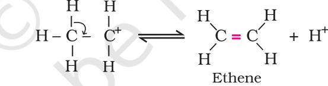

The acid used in step 1 is released in step 3. To drive the equilibrium to the right, ethene is removed as it is formed.

- *4. Oxidation:* Oxidation of alcohols involves the formation of a carbonoxygen double bond with cleavage of an O-H and C-H bonds.
Such a cleavage and formation of bonds occur in oxidation reactions. These are also known as dehydrogenation reactions as these involve loss of dihydrogen from an alcohol molecule. Depending on the oxidising agent used, a primary alcohol is oxidised to an aldehyde which in turn is oxidised to a carboxylic acid.

209 Alcohols, Phenols and Ethers

*Tertiary carbocations are more stable and therefore are easier to form than secondary and primary carbocations; tertiary alcohols are the easiest to dehydrate.*

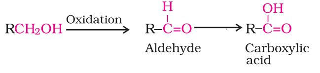

Strong oxidising agents such as acidified potassium permanganate are used for getting carboxylic acids from alcohols directly. CrO3 in anhydrous medium is used as the oxidising agent for the isolation of aldehydes.

> 3 2 CrO RC OH H RCHO

A better reagent for oxidation of primary alcohols to aldehydes in good yield is pyridinium chlorochromate (PCC), a complex of chromium trioxide with pyridine and HCl.

> 3 2 3 PCC CH CH CH CH OH CH CH CH CHO

Secondary alcohols are oxidised to ketones by chromic anhyride (CrO3 ).

Tertiary alcohols do not undergo oxidation reaction. Under strong reaction conditions such as strong oxidising agents (KMnO4

elevated temperatures, cleavage of various C-C bonds takes place and a mixture of carboxylic acids containing lesser number of carbon atoms is formed.

When the vapours of a primary or a secondary alcohol are passed over heated copper at 573 K, dehydrogenation takes place and an aldehyde or a ketone is formed while tertiary alcohols undergo dehydration.

) and

Biological oxidation of methanol and ethanol in the body produces the corresponding aldehyde followed by the acid. At times the alcoholics, by mistake, drink ethanol, mixed with methanol also called denatured alcohol. In the body, methanol is oxidised first to methanal and then to methanoic acid, which may cause blindness and death. A methanol poisoned patient is treated by giving intravenous infusions of diluted ethanol. The enzyme responsible for oxidation of aldehyde (HCHO) to acid is swamped allowing time for kidneys to excrete methanol.

#### (c) Reactions of phenols

Following reactions are shown by phenols only.

#### *1. Electrophilic aromatic substitution*

In phenols, the reactions that take place on the aromatic ring are electrophilic substitution reactions (Unit 9, Class XI). The –OH group attached to the benzene ring activates it towards electrophilic substitution. Also, it directs the incoming group to *ortho* and *para* positions in the ring as these positions become electron rich due to the resonance effect caused by –OH group. The resonance structures are shown under acidity of phenols.

Common electrophilic aromatic substitution reactions taking place in phenol are as follows:

- *(i) Nitration:* With dilute nitric acid at low temperature (298 K), phenol yields a mixture of *ortho* and *para* nitrophenols.
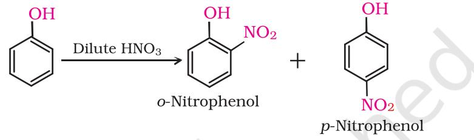

The *ortho* and *para* isomers can be separated by steam distillation. *o*-Nitrophenol is steam volatile due to intramolecular hydrogen bonding while *p*-nitrophenol is less volatile due to intermolecular hydrogen bonding which causes the association of molecules.

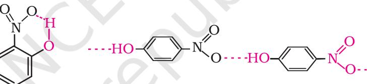

With concentrated nitric acid, phenol is converted to 2,4,6-trinitrophenol. The product is commonly known as picric acid. The yield of the reaction product is poor.

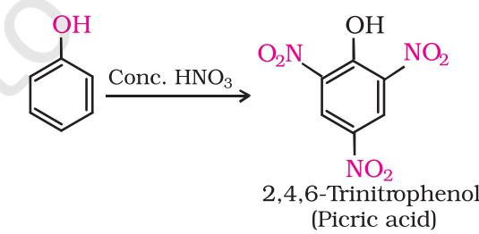

Nowadays picric acid is prepared by treating phenol first with concentrated sulphuric acid which converts it to phenol-2,4-disulphonic acid, and then with concentrated nitric acid to get 2,4,6-trinitrophenol. Can you write the equations of the reactions involved?

211 Alcohols, Phenols and Ethers

*2, 4, 6 - Trinitrophenol is a strong acid due to the presence of three electron withdrawing –NO2 groups which facilitate the release of hydrogen ion.*

- *(ii) Halogenation:* On treating phenol with bromine, different reaction products are formed under different experimental conditions.
	- (a) When the reaction is carried out in solvents of low polarity such as CHCl3 or CS2 and at low temperature, monobromophenols are formed.

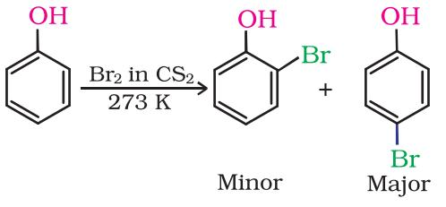

The usual halogenation of benzene takes place in the presence of a Lewis acid, such as FeBr3 (Unit 6, Class XII), which polarises the halogen molecule. In case of phenol, the polarisation of bromine molecule takes place even in the absence of Lewis acid. It is due to the highly activating effect of –OH group attached to the benzene ring.

- (b) When phenol is treated with bromine water, 2,4,6-tribromophenol is formed as white precipitate.
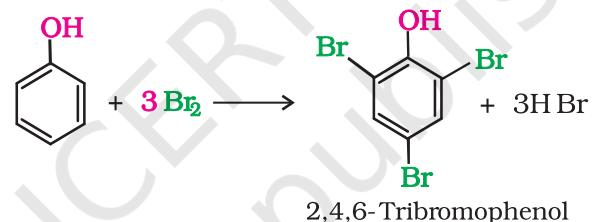

Write the structures of the major products expected from the following reactions: (a) Mononitration of 3-methylphenol (b) Dinitration of 3-methylphenol (c) Mononitration of phenyl methanoate. The combined influence of –OH and –CH3 groups determine the position of the incoming group. Example 7.5 Example 7.5Example 7.5 Solution SolutionSolution

*2. Kolbe's reaction*

Phenoxide ion generated by treating phenol with sodium hydroxide is even more reactive than phenol towards electrophilic aromatic substitution. Hence, it undergoes electrophilic substitution with carbon dioxide, a weak electrophile. *Ortho* hydroxybenzoic acid is formed as the main reaction product.

Chemistry 212

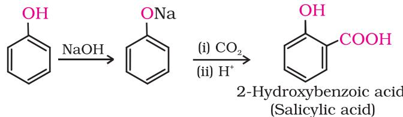

- *3. Reimer-Tiemann reaction*
On treating phenol with chloroform in the presence of sodium hydroxide, a –CHO group is introduced at *ortho* position of benzene ring. This reaction is known as *Reimer - Tiemann reaction*.

The intermediate substituted benzal chloride is hydrolysed in the presence of alkali to produce salicylaldehyde.

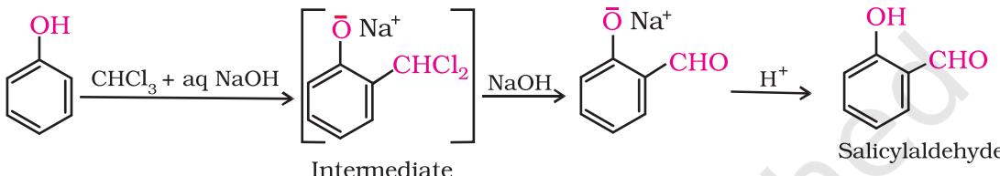

- *4. Reaction of phenol with zinc dust*
Phenol is converted to benzene on heating with zinc dust.

*5. Oxidation*

Oxidation of phenol with chromic acid produces a conjugated diketone known as benzoquinone. In the presence of air, phenols are slowly oxidised to dark coloured mixtures containing quinones.

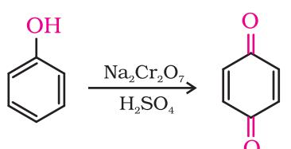

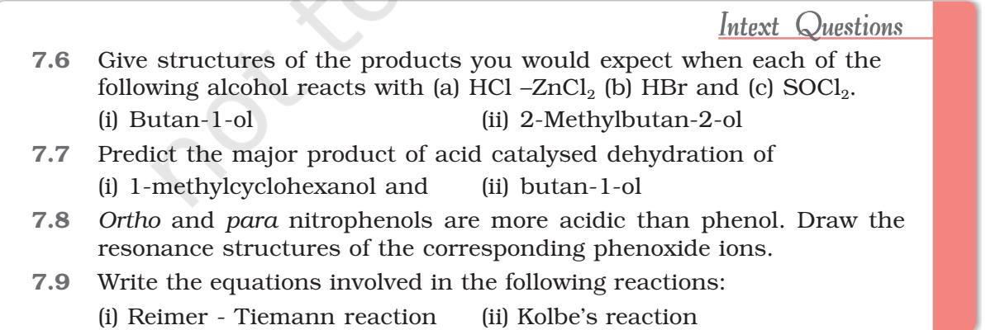

213 Alcohols, Phenols and Ethers

7.5 Some Commercially Important ImportantImportant Alcohols AlcoholsAlcohols

Methanol and ethanol are among the two commercially important alcohols.

- *1. Methanol*
Methanol, CH3OH, also known as 'wood spirit', was produced by destructive distillation of wood. Today, most of the methanol is produced by catalytic hydrogenation of carbon monoxide at high pressure and temperature and in the presence of ZnO – Cr2O3 catalyst.

$$\mathrm{CO}+2\mathrm{H}_{2}\ {\xrightarrow{\mathrm{ZnO}{\color{red}\mathrm{-Cr_{2}O_{3}}}}}\mathrm{CH}_{3}\mathrm{OH}$$

Methanol is a colourless liquid and boils at 337 K. It is highly poisonous in nature. Ingestion of even small quantities of methanol can cause blindness and large quantities causes even death. Methanol is used as a solvent in paints, varnishes and chiefly for making formaldehyde.

- *2. Ethanol*
Ethanol, C2H5OH, is obtained commercially by fermentation, the oldest method is from sugars. The sugar in molasses, sugarcane or fruits such as grapes is converted to glucose and fructose, (both of which have the formula C6H12O6 ), in the presence of an enzyme, invertase. Glucose and fructose undergo fermentation in the presence of another enzyme, zymase, which is found in yeast.

In wine making, grapes are the source of sugars and yeast. As grapes ripen, the quantity of sugar increases and yeast grows on the outer skin. When grapes are crushed, sugar and the enzyme come in contact and fermentation starts. Fermentation takes place in anaerobic conditions i.e. in absence of air. Carbon dioxide is released during fermentation.

The action of zymase is inhibited once the percentage of alcohol formed exceeds 14 percent. If air gets into fermentation mixture, the oxygen of air oxidises ethanol to ethanoic acid which in turn destroys the taste of alcoholic drinks.

Ethanol is a colourless liquid with boiling point 351 K. It is used as a solvent in paint industry and in the preparation of a number of carbon compounds. The commercial alcohol is made unfit for drinking by mixing in it some copper sulphate (to give it a colour) and pyridine (a foul smelling liquid). It is known as denaturation of alcohol.

Nowadays, large quantities of ethanol are obtained by hydration of ethene (Section 7.4).

*Ingestion of ethanol acts on the central nervous system. In moderate amounts, it affects judgment and lowers inhibitions. Higher concentrations cause nausea and loss of consciousness. Even at higher concentrations, it interferes with spontaneous respiration and can be fatal.*

### 7.6 Ethers

#### 7.6.1 Preparation of Ethers

#### *1. By dehydration of alcohols*

Alcohols undergo dehydration in the presence of protic acids (H2SO4 , H3PO4 ). The formation of the reaction product, alkene or ether depends on the reaction conditions. For example, ethanol is dehydrated to ethene in the presence of sulphuric acid at 443 K. At 413 K, ethoxyethane is the main product.

The formation of ether is a nucleophilic bimolecular reaction (SN2) involving the attack of alcohol molecule on a protonated alcohol, as indicated below:

Acidic dehydration of alcohols, to give an alkene is also associated with substitution reaction to give an ether.

The method is suitable for the preparation of ethers having primary alkyl groups only. The alkyl group should be unhindered and the temperature be kept low. Otherwise the reaction favours the formation of alkene. The reaction follows SN1 pathway when the alcohol is secondary or tertiary about which you will learn in higher classes. However, the dehydration of secondary and tertiary alcohols to give corresponding ethers is unsuccessful as elimination competes over substitution and as a consequence, alkenes are easily formed.

Can you explain why is bimolecular dehydration not appropriate for the preparation of ethyl methyl ether?

#### *2. Williamson synthesis*

It is an important laboratory method for the preparation of symmetrical and unsymmetrical ethers. In this method, an alkyl halide is allowed to react with sodium alkoxide.

> R–X + NaR –O' R–O–R +' Na X – +

Ethers containing substituted alkyl groups (secondary or tertiary) may also be prepared by this method. The reaction involves SN2 attack of an alkoxide ion on primary alkyl halide.

215 Alcohols, Phenols and Ethers

*Diethyl ether has been used widely as an inhalation anaesthetic. But due to its slow effect and an unpleasant recovery period, it has been replaced, as an anaesthetic, by other compounds.*

*Alexander William Williamson (1824–1904) was born in London of Scottish parents. In 1849, he became Professor of Chemistry at University College, London.*

$\begin{array}{c}\includegraphics[height=36.135pt]{Fig1}\end{array}$

Better results are obtained if the alkyl halide is primary. In case of secondary and tertiary alkyl halides, elimination competes over substitution. If a tertiary alkyl halide is used, an alkene is the only reaction product and no ether is formed. For example, the reaction of CH3ONa with (CH3)3C–Br gives exclusively 2-methylpropene.

It is because alkoxides are not only nucleophiles but strong bases as well. They react with alkyl halides leading to elimination reactions.

| Example 7.6 | The following is not an appropriate reaction for the preparation of | t-butyl ethyl ether. |  |  |  |
| --- | --- | --- | --- | --- | --- |
| (i) | What would be the major product of this reaction ? | (ii) | Write a suitable reaction for the preparation of t-butylethyl ether. |  |  |
| Solution | Solution | Solution | (i) | The major product of the given reaction is 2-methylprop-1-ene. | It is because sodium ethoxide is a strong nucleophile as well as |
| a strong base. Thus elimination reaction predominates over | substitution. |  |  |  |  |
| (ii) |  |  |  |  |  |

Phenols are also converted to ethers by this method. In this, phenol is used as the phenoxide moiety.

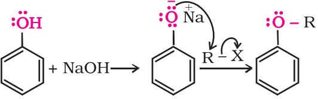

The C-O bonds in ethers are polar and thus, ethers have a net dipole moment. The weak polarity of ethers do not appreciably affect their boiling points which are comparable to those of the alkanes of comparable molecular masses but are much lower than the boiling points of alcohols as shown in the following cases: 7.6.2 Physical Properties

| Formula | CH3(CH2)3CH3 | C2H5-O-C2H5 | CH3(CH2)3-OH |
| --- | --- | --- | --- |
|  | n-Pentane | Ethoxyethane | Butan-1-ol |
| b.p./K | 309.1 | 307.6 | 390 |

The large difference in boiling points of alcohols and ethers is due to the presence of hydrogen bonding in alcohols.

The miscibility of ethers with water resembles those of alcohols of the same molecular mass. Both ethoxyethane and butan-1-ol are miscible to almost the same extent i.e., 7.5 and 9 g per 100 mL water, respectively while pentane is essentially immiscible with water. Can you explain this observation ? This is due to the fact that just like alcohols, oxygen of ether can also form hydrogen bonds with water molecule as shown:

$$\mathrm{\Large{\stackrel{\mathrm{K}}{\Sigma}}\!\!\stackrel{\mathrm{O}:\!\!\cdots\!\!\cdots\!\!\mathrm{H}\!\!\rightarrow\!\!\!\stackrel{\mathrm{O}}{\Sigma}}\!\!\stackrel{\mathrm{H}}{}}$$

#### 7.6.3 Chemical Reactions

*1. Cleavage of C–O bond in ethers*

Ethers are the least reactive of the functional groups. The cleavage of C-O bond in ethers takes place under drastic conditions with excess of hydrogen halides. The reaction of dialkyl ether gives two alkyl halide molecules.

R-O-R + HX --> RX + R-OH  
  
R-OH + HX --> R-X + H${}_{2}$O

Alkyl aryl ethers are cleaved at the alkyl-oxygen bond due to the more stable aryl-oxygen bond. The reaction yields phenol and alkyl halide.

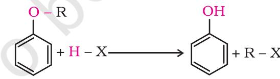

Ethers with two different alkyl groups are also cleaved in the same manner.

The order of reactivity of hydrogen halides is as follows: HI > HBr > HCl. The cleavage of ethers takes place with concentrated HI or HBr at high temperature.

217 Alcohols, Phenols and Ethers

The reaction of an ether with concentrated HI starts with protonation of ether molecule. Step 1:

$$\rm CH_{3}-\stackrel{{\rm O}}{{\rm O}}-CH_{2}CH_{3}+H-I\rm CH_{3}-\stackrel{{\rm H}}{{\rm O}}-CH_{2}CH_{3}+I$$

The reaction takes place with HBr or HI because these reagents are sufficiently acidic. Step 2:

Iodide is a good nucleophile. It attacks the least substituted carbon of the oxonium ion formed in step 1 and displaces an alcohol molecule by SN2 mechanism. Thus, in the cleavage of mixed ethers with two different alkyl groups, the alcohol and alkyl iodide formed, depend on the nature of alkyl groups. When primary or secondary alkyl groups are present, it is the lower alkyl group that forms alkyl iodide (SN2 reaction).

When HI is in excess and the reaction is carried out at high temperature, ethanol reacts with another molecule of HI and is converted to ethyl iodide.

Step 3:

However, when one of the alkyl group is a tertiary group, the halide formed is a tertiary halide.

$\begin{array}{c}\mbox{CH}_{3}\\ \mbox{CH}_{3}\end{array}$

It is because in step 2 of the reaction, the departure of leaving group (HO–CH3 ) creates a more stable carbocation [(CH3 )3C + ], and the reaction follows SN1 mechanism.

In case of anisole, methylphenyl

  
  
**Oxonium ion, C${}_{6}$H${}_{5}$- $\bf{\stackrel{{\mbox{\scriptsize$\bullet$}}}{{\mbox{\scriptsize$\bullet$}}}}$ - CH${}_{3}$ is 

formed by protonation of ether. The bond between O–CH3 is weaker than the bond between O–C6H5 because the carbon of phenyl group is *sp 2* hybridised and there is a partial double bond character.

Chemistry 218

CH3 C

CH3 C

CH3

O H +

CH3

+ I – slow

fast

CH3 C

CH3 C

CH3

+

+ CH OH 3

CH3

CH3

I

CH3

CH3

CH3

+

CH3

Therefore the attack by I– ion breaks O–CH3 bond to form CH3 I. Phenols do not react further to give halides because the *sp 2* hybridised carbon of phenol cannot undergo nucleophilic substitution reaction needed for conversion to the halide.

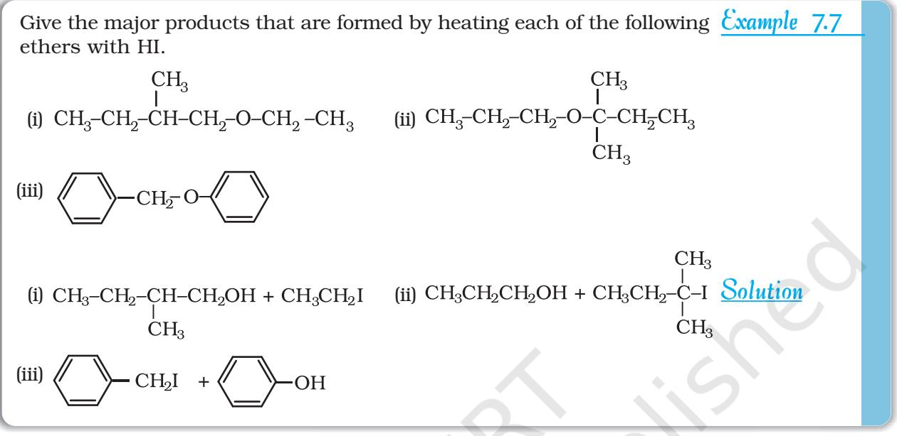

- *2. Electrophilic substitution*
The alkoxy group (-OR) is *ortho*, *para* directing and activates the aromatic ring towards electrophilic substitution in the same way as in phenol.

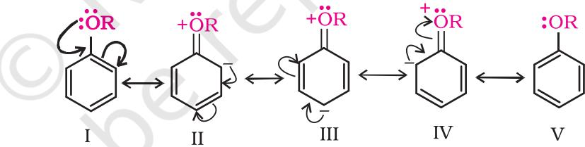

- (i) *Halogenation*: Phenylalkyl ethers undergo usual halogenation in the benzene ring, *e.g.*, anisole undergoes bromination with bromine in ethanoic acid even in the absence of iron (III) bromide catalyst. It is due to the activation of benzene ring by the methoxy group. *Para* isomer is obtained in 90% yield.
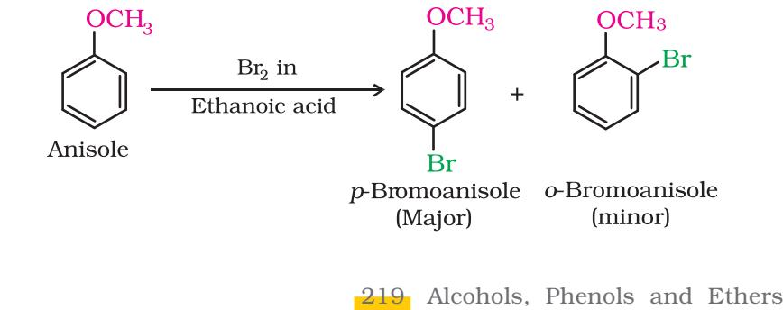

- (ii) *Friedel-Crafts reaction*: Anisole undergoes Friedel-Crafts reaction, *i.e.*, the alkyl and acyl groups are introduced at *ortho* and *para* positions by reaction with alkyl halide and acyl halide in the presence of anhydrous aluminium chloride (a Lewis acid) as catalyst.
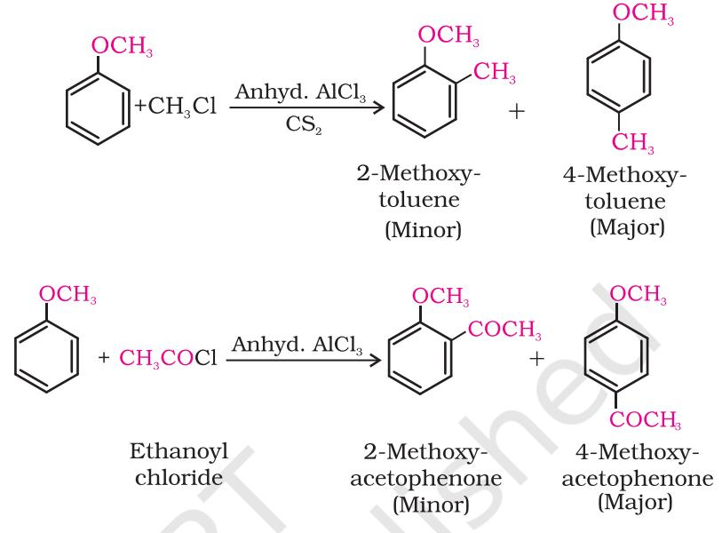

- (iii) *Nitration*: Anisole reacts with a mixture of concentrated sulphuric and nitric acids to yield a mixture of *ortho* and *para* nitroanisole.
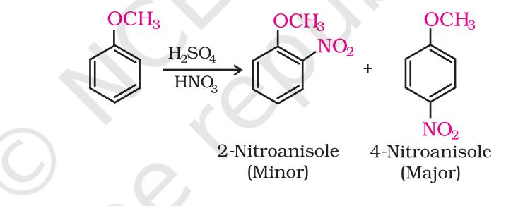

#### Intext Questions

- 7.10 Write the reactions of Williamson synthesis of 2-ethoxy-3-methylpentane starting from ethanol and 3-methylpentan-2-ol.
- 7.11 Which of the following is an appropriate set of reactants for the preparation of 1-methoxy-4-nitrobenzene and why?

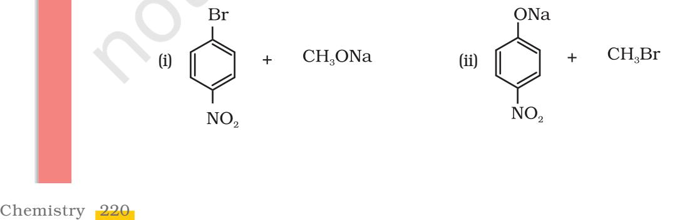

7.12 Predict the products of the following reactions:

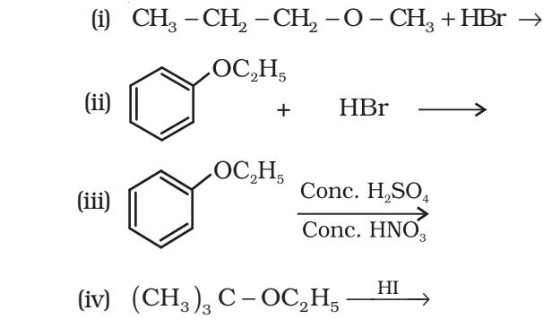

### Summary Summary

Alcohols and phenols are classified (i) on the basis of the number of hydroxyl groups and (ii) according to the hybridisation of the carbon atom, *sp* 3 or *sp* 2 to which the –OH group is attached. Ethers are classified on the basis of groups attached to the oxygen atom.

Alcohols may be prepared (1) by hydration of alkenes (i) in presence of an acid and (ii) by hydroboration-oxidation reaction (2) from carbonyl compounds by (i) catalytic reduction and (ii) the action of Grignard reagents. Phenols may be prepared by (1) substitution of (i) halogen atom in haloarenes and (ii) sulphonic acid group in aryl sulphonic acids, by –OH group (2) by hydrolysis of diazonium salts and (3) industrially from cumene.

Alcohols are higher boiling than other classes of compounds, namely hydrocarbons, ethers and haloalkanes of comparable molecular masses. The ability of alcohols, phenols and ethers to form intermolecular hydrogen bonding with water makes them soluble in it.

Alcohols and phenols are acidic in nature. Electron withdrawing groups in phenol increase its acidic strength and electron releasing groups decrease it.

Alcohols undergo nucleophilic substitution with hydrogen halides to yield alkyl halides. Dehydration of alcohols gives alkenes. On oxidation, primary alcohols yield aldehydes with mild oxidising agents and carboxylic acids with strong oxidising agents while secondary alcohols yield ketones. Tertiary alcohols are resistant to oxidation.

The presence of –OH group in phenols activates the aromatic ring towards electrophilic substitution and directs the incoming group to *ortho* and *para* positions due to resonance effect. Reimer-Tiemann reaction of phenol yields salicylaldehyde. In presence of sodium hydroxide, phenol generates phenoxide ion which is even more reactive than phenol. Thus, in alkaline medium, phenol undergoes Kolbe's reaction.

Ethers may be prepared by (i) dehydration of alcohols and (ii) Williamson synthesis. The boiling points of ethers resemble those of alkanes while their solubility is comparable to those of alcohols having same molecular mass. The C–O bond in ethers can be cleaved by hydrogen halides. In electrophilic substitution, the alkoxy group activates the aromatic ring and directs the incoming group to ortho and para positions.

## Exercises

7.1 Write IUPAC names of the following compounds:

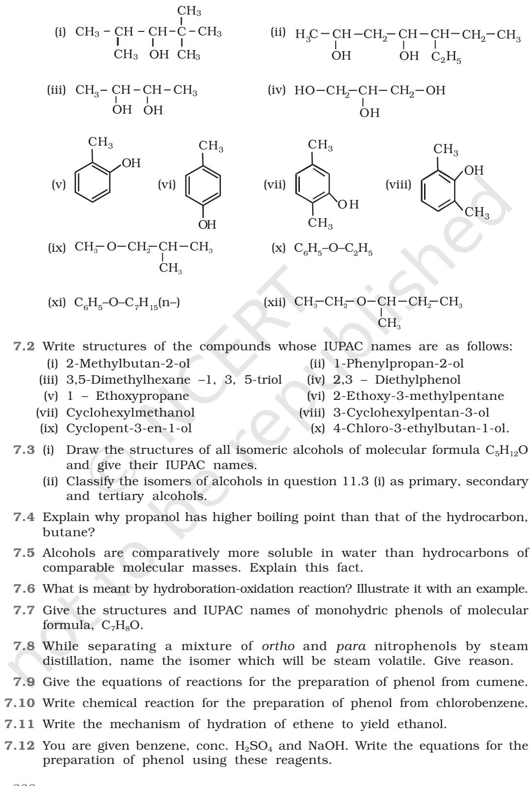

Chemistry 222

- 7.13 Show how will you synthesise:
	- (i) 1-phenylethanol from a suitable alkene.
	- (ii) cyclohexylmethanol using an alkyl halide by an SN2 reaction.
	- (iii) pentan-1-ol using a suitable alkyl halide?
- 7.14 Give two reactions that show the acidic nature of phenol. Compare acidity of phenol with that of ethanol.
- 7.15 Explain why is *ortho* nitrophenol more acidic than *ortho* methoxyphenol ?
- 7.16 Explain how does the –OH group attached to a carbon of benzene ring activate it towards electrophilic substitution?
- 7.17 Give equations of the following reactions:
	- (i) Oxidation of propan-1-ol with alkaline KMnO4 solution.
	- (ii) Bromine in CS2 with phenol.
	- (iii) Dilute HNO3 with phenol.
	- (iv) Treating phenol wih chloroform in presence of aqueous NaOH.
- 7.18 Explain the following with an example.
	- (i) Kolbe's reaction.
	- (ii) Reimer-Tiemann reaction.
	- (iii) Williamson ether synthesis.
	- (iv) Unsymmetrical ether.
- 7.19 Write the mechanism of acid dehydration of ethanol to yield ethene.
- 7.20 How are the following conversions carried out?
	- (i) Propene ® Propan-2-ol.
	- (ii) Benzyl chloride ® Benzyl alcohol.
	- (iii) Ethyl magnesium chloride ® Propan-1-ol.
	- (iv) Methyl magnesium bromide ® 2-Methylpropan-2-ol.
- 7.21 Name the reagents used in the following reactions:
	- (i) Oxidation of a primary alcohol to carboxylic acid.
	- (ii) Oxidation of a primary alcohol to aldehyde.
	- (iii) Bromination of phenol to 2,4,6-tribromophenol.
	- (iv) Benzyl alcohol to benzoic acid.
	- (v) Dehydration of propan-2-ol to propene.
	- (vi) Butan-2-one to butan-2-ol.
- 7.22 Give reason for the higher boiling point of ethanol in comparison to methoxymethane.

223 Alcohols, Phenols and Ethers

7.23 Give IUPAC names of the following ethers:

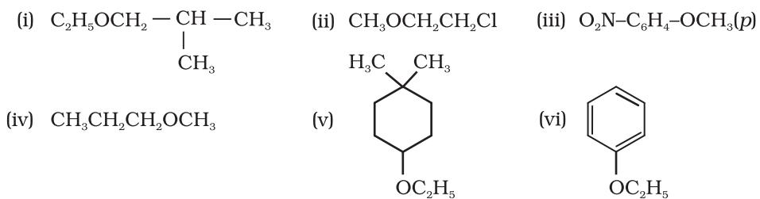

- 7.24 Write the names of reagents and equations for the preparation of the following ethers by Williamson's synthesis:
	- (i) 1-Propoxypropane (ii) Ethoxybenzene
- - (iii) 2-Methoxy-2-methylpropane (iv) 1-Methoxyethane
		-
- 7.25 Illustrate with examples the limitations of Williamson synthesis for the preparation of certain types of ethers.
- 7.26 How is 1-propoxypropane synthesised from propan-1-ol? Write mechanism of this reaction.
- 7.27 Preparation of ethers by acid dehydration of secondary or tertiary alcohols is not a suitable method. Give reason.
- 7.28 Write the equation of the reaction of hydrogen iodide with: (i) 1-propoxypropane (ii) methoxybenzene and (iii) benzyl ethyl ether.
- 7.29 Explain the fact that in aryl alkyl ethers (i) the alkoxy group activates the benzene ring towards electrophilic substitution and (ii) it directs the incoming substituents to ortho and para positions in benzene ring.
- 7.30 Write the mechanism of the reaction of HI with methoxymethane.
- 7.31 Write equations of the following reactions:
	- (i) Friedel-Crafts reaction alkylation of anisole.
	- (ii) Nitration of anisole.
	- (iii) Bromination of anisole in ethanoic acid medium.
	- (iv) Friedel-Craft's acetylation of anisole.
- 7.32 Show how would you synthesise the following alcohols from appropriate alkenes?

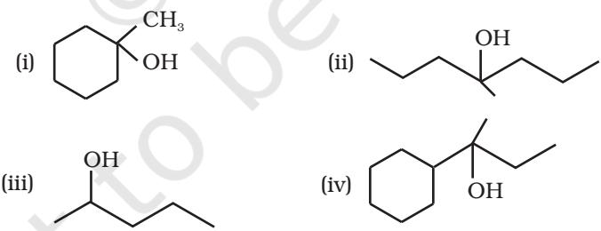

- 7.33 When 3-methylbutan-2-ol is treated with HBr, the following reaction takes place:
$\begin{array}{ccccc}\text{CH}_{3}-\text{CH}-\text{CH}-\text{CH}_{3}&\text{HBr}&\text{CH}_{3}-\text{CH}_{2}-\text{CH}_{3}\\ \text{I}&\text{I}&\text{CH}_{3}&\text{OH}&\text{CH}_{2}\end{array}$

Give a mechanism for this reaction.

(Hint : The secondary carbocation formed in step II rearranges to a more stable tertiary carbocation by a hydride ion shift from 3rd carbon atom.

Chemistry 224

#### Answers to Some Intext Questions

| 7.1 Primary alcohols | (i), (ii), (iii) |
| --- | --- |
| Secondary alcohols | (iv) and (v) |
| Tertiary alcohols | (vi) |
| 7.2 Allylic alcohols | (ii) and (vi) |

7.3 (i) 4-Chloro-3-ethyl-2-(1-methylethyl)-butan-1-ol

- (ii) 2, 5-Dimethylhexane-1,3-diol
- (iii) 3-Bromocyclohexanol
- (iv) Hex-1-en-3-ol
- (v) 2-Bromo-3-methylbut-2-en-1-ol

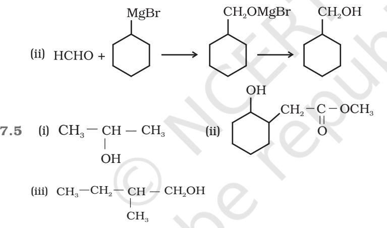

- 7.7 (i) 1-Methylcyclohexene
	- (ii) A Mixture of but-1-ene and but-2-ene. But-2-ene is the major product formed due to rearrangement to give secondary carbocation.

  
  
**7.10**: CH${}_{3}$- CH${}_{2}$-CH${}_{2}$-CH${}_{2}$-CH${}_{3}$-CH${}_{2}$-CH${}_{2}$-CH${}_{2}$-CH${}_{2}$-OH  
  
CH${}_{3}$ OH  
  
CH${}_{3}$ CH${}_{3}$  
  
CH${}_{3}$OH  
  
CH${}_{3}$-CH${}_{2}$-CH${}_{2}$-CH${}_{2}$-OH  
  
CH${}_{3}$-CH${}_{2}$-CH${}_{2}$-CH${}_{2}$-OH  
  
CH${}_{3}$ CH${}_{3}$  
  
CH${}_{3}$CH${}_{3}$  
  
2-Ethoxy-3-methylpentane

225 Alcohols, Phenols and Ethers

7.11 (ii) 7.12 (i) CH CH CH OH CH Br 3 2 2 3 (ii) (iii) (iv) CH C I C H OH 3 3 2 5

