# Objectives

After studying this Unit, you will be able to

- · describe amines as derivatives of ammonia having a pyramidal structure;
- · classify amines as primary, secondary and tertiary;
- · name amines by common names and IUPAC system;
- · describe some of the important methods of preparation of amines;
- · explain the properties of amines;
- · distinguish between primary, secondary and tertiary amines;
- · describe the method of preparation of diazonium salts and their importance in the synthesis of a series of aromatic compounds including azo dyes.

9.1 Structure of Amines


*"The chief commercial use of amines is as intermediates in the synthesis of medicines and fibres" .*

Amines constitute an important class of organic compounds derived by replacing one or more hydrogen atoms of ammonia molecule by alkyl/aryl group(s). In nature, they occur among proteins, vitamins, alkaloids and hormones. Synthetic examples include polymers, dye stuffs and drugs. Two biologically active compounds, namely adrenaline and ephedrine, both containing secondary amino group, are used to increase blood pressure. Novocain, a synthetic amino compound, is used as an anaesthetic in dentistry. Benadryl, a well known antihistaminic drug also contains tertiary amino group. Quaternary ammonium salts are used as surfactants. Diazonium salts are intermediates in the preparation of a variety of aromatic compounds including dyes. In this Unit, you will learn about amines and diazonium salts.

### I. AMINES

Amines can be considered as derivatives of ammonia, obtained by replacement of one, two or all the three hydrogen atoms by alkyl and/or aryl groups.

For example:

$\text{CH}_3\text{--NH}_2\,,\,\text{C}_6\text{H}_5\text{--NH}_2$, $\text{CH}_3\text{--NH--CH}_3$, $\text{CH}_3\text{--N}\,\text{--CH}_2$. 

Like ammonia, nitrogen atom of amines is trivalent and carries an unshared pair of electrons. Nitrogen orbitals in amines are therefore, *sp*3 hybridised and the geometry of amines is pyramidal. Each of the three *sp*3 hybridised orbitals of nitrogen overlap with orbitals of hydrogen or carbon depending upon the composition of the amines. The fourth orbital of nitrogen in all amines contains an unshared pair of electrons. Due to the presence of unshared pair of electrons, the angle C–N–E, (where E is C or H) is less than 109.5°; for instance, it is 108o in case of trimethylamine as shown in Fig. 9.1.

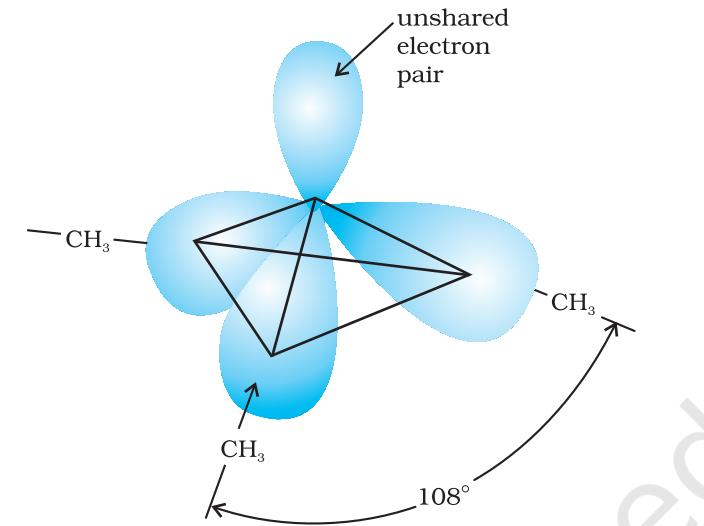

*Fig. 9.1 Pyramidal shape of trimethylamine*

Amines are classified as primary (1o ), secondary (2o ) and tertiary (3o ) depending upon the number of hydrogen atoms replaced by alkyl or aryl groups in ammonia molecule. If one hydrogen atom of ammonia is replaced by R or Ar , we get RNH2 or ArNH2 , a primary amine (1o ). If two hydrogen atoms of ammonia or one hydrogen atom of R-NH2 are replaced by another alkyl/aryl(R') group, what would you get? You get R-NHR', secondary amine. The second alkyl/aryl group may be same or different. Replacement of another hydrogen atom by alkyl/aryl group leads to the formation of tertiary amine. Amines are said to be 'simple' when all the alkyl or aryl groups are the same, and 'mixed' when they are different. 9.2 Classification

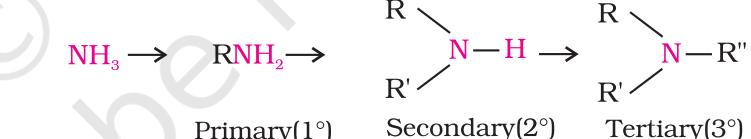

9.3 Nomenclature

In common system, an aliphatic amine is named by prefixing alkyl group to amine, i.e., alkylamine as one word (e.g., methylamine). In secondary and tertiary amines, when two or more groups are the same, the prefix di or tri is appended before the name of alkyl group. In IUPAC system, primary amines are named as alkanamines. The name is derived by replacement of 'e' of alkane by the word amine. For example, CH3NH2 is named as methanamine. In case, more than one amino group is present at different positions in the parent chain, their positions are specified by giving numbers to the carbon atoms bearing –NH2 groups and suitable prefix such as di, tri, etc. is attached to the amine. The letter 'e' of the suffix of the hydrocarbon part is retained. For example, H2N–CH2 –CH2 –NH2 is named as ethane-1, 2-diamine.

To name secondary and tertiary amines, we use locant N to designate substituent attached to a nitrogen atom. For example, CH3 NHCH2CH3 is

Chemistry 260

named as N-methylethanamine and (CH3CH2 ) 3N is named as N, Ndiethylethanamine. More examples are given in Table 9.1.

In arylamines, –NH2 group is directly attached to the benzene ring. C6H5NH2 is the simplest example of arylamine. In common system, it is known as aniline. It is also an accepted IUPAC name. While naming arylamines according to IUPAC system, suffix 'e' of arene is replaced by 'amine'. Thus in IUPAC system, C6H5 –NH2 is named as benzenamine. Common and IUPAC names of some alkylamines and arylamines are given in Table 9.1.

| Amine | Common name | IUPAC name |
| --- | --- | --- |
| CH3-–CH2 –NH2 | Ethylamine | Ethanamine |
| CH3 –CH2 –CH2 –NH2 | n-Propylamine | Propan-1-amine |
|  | Isopropylamine | Propan-2-amine |
|  | Ethylmethylamine | N-Methylethanamine |
|  | Trimethylamine | N,N-Dimethylmethanamine |
|  | N,N-Diethylbutylamine | N,N-Diethylbutan-1-amine |
|  | Allylamine | Prop-2-en-1-amine |
|  | Hexamethylenediamine | Hexane-1,6-diamine |
|  | Aniline | Aniline or Benzenamine |
|  | o-Toluidine | 2-Methylaniline |
|  | p-Bromoaniline | 4-Bromobenzenamine or |
|  |  | 4-Bromoaniline |
|  | N,N-Dimethylaniline | N,N-Dimethylbenzenamine |

# Table 9.1: Nomenclature of Some Alkylamines and Arylamines

261 Amines

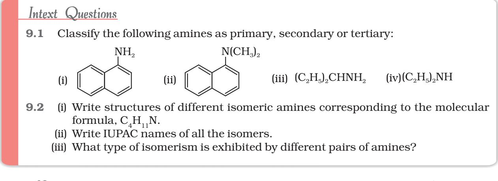

Amines are prepared by the following methods: 9.4 Preparation of Amines of Aminesof Amines

*1. Reduction of nitro compounds*

Nitro compounds are reduced to amines by passing hydrogen gas in the presence of finely divided nickel, palladium or platinum and also by reduction with metals in acidic medium. Nitroalkanes can also be similarly reduced to the corresponding alkanamines.

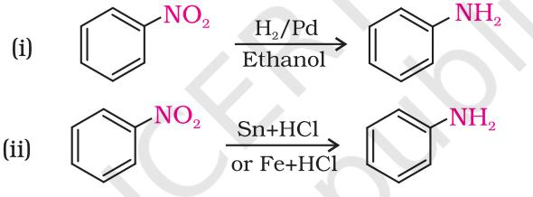

Reduction with iron scrap and hydrochloric acid is preferred because FeCl2 formed gets hydrolysed to release hydrochloric acid during the reaction. Thus, only a small amount of hydrochloric acid is required to initiate the reaction.

#### *2. Ammonolysis of alkyl halides*

You have read (Unit 6, Class XII) that the carbon - halogen bond in alkyl or benzyl halides can be easily cleaved by a nucleophile. Hence, an alkyl or benzyl halide on reaction with an ethanolic solution of ammonia undergoes nucleophilic substitution reaction in which the halogen atom is replaced by an amino (–NH2 ) group. This process of cleavage of the C–X bond by ammonia molecule is known as ammonolysis. The reaction is carried out in a sealed tube at 373 K. The primary amine thus obtained behaves as a nucleophile and can further react with alkyl halide to form secondary and tertiary amines, and finally quaternary ammonium salt.

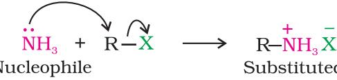


| RNH, | RA R2NH R2 | RX > R2N | RX R,NX Freeholder, or and and and and and the controlled of the controlled to the controlled with the first of the contri |
| --- | --- | --- | --- |
|  |  |  | Quaternary |
| (1°) | (2°) | (3°) |  |
|  |  |  | ammonium salt |

The free amine can be obtained from the ammonium salt by treatment with a strong base:

Ammonolysis has the disadvantage of yielding a mixture of primary, secondary and tertiary amines and also a quaternary ammonium salt. However, primary amine is obtained as a major product by taking large excess of ammonia.

The order of reactivity of halides with amines is RI > RBr >RCl.

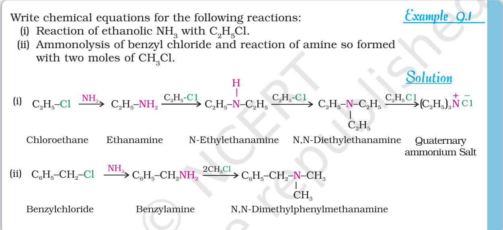

#### *3. Reduction of nitriles*

Nitriles on reduction with lithium aluminium hydride (LiAlH4 ) or catalytic hydrogenation produce primary amines. This reaction is used for ascent of amine series, i.e., for preparation of amines containing one carbon atom more than the starting amine.

  
  
\begin{tabular}{l c} R-C$\equiv$N & $\frac{\rm H_{2}/Ni}{\rm Na(Hg)/C_{2}H_{5}OH}$ \\ \end{tabular}  
  

#### *4. Reduction of amides*

The amides on reduction with lithium aluminium hydride yield amines.

$$\mathrm{\begin{array}{c}{{\begin{array}{c}{{\mathrm{O}}}\\ {{\parallel}}\\ {{\mathrm{R-C-\NH_{2}}}}\end{array}}\frac{\mathrm{(i)\LiAlH_{4}}}{\mathrm{(ii)\H_{2}O}}\Rightarrow\mathrm{R-CH_{2}-\NH_{2}}}\end{array}}$$

263 Amines

## *5. Gabriel phthalimide synthesis*

Gabriel synthesis is used for the preparation of primary amines. Phthalimide on treatment with ethanolic potassium hydroxide forms potassium salt of phthalimide which on heating with alkyl halide followed by alkaline hydrolysis produces the corresponding primary amine. Aromatic primary amines cannot be prepared by this method because aryl halides do not undergo nucleophilic substitution with the anion formed by phthalimide.

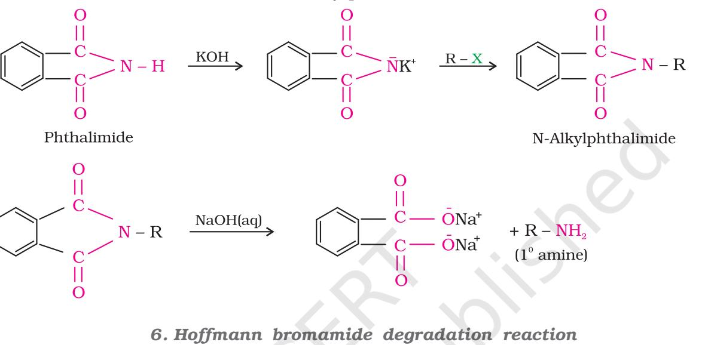

Hoffmann developed a method for preparation of primary amines by treating an amide with bromine in an aqueous or ethanolic solution of sodium hydroxide. In this degradation reaction, migration of an alkyl or aryl group takes place from carbonyl carbon of the amide to the nitrogen atom. The amine so formed contains one carbon less than that present in the amide.

$\begin{array}{c}\mathrm{O}\\ ||\end{array}$

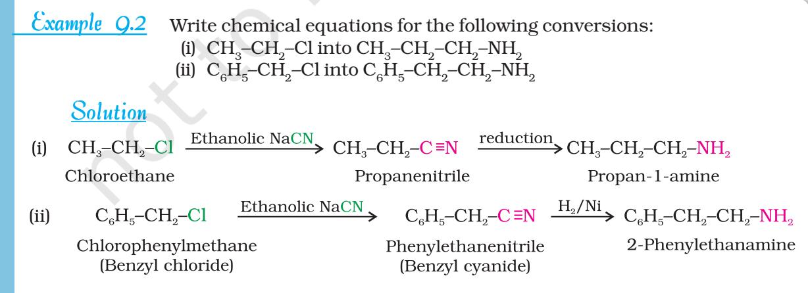

Chemistry 264

9.3 How will you convert (i) Benzene into aniline (ii) Benzene into N, N-dimethylaniline Intext Question Write structures and IUPAC names of (i) the amide which gives propanamine by Hoffmann bromamide reaction. (ii) the amine produced by the Hoffmann degradation of benzamide. (i) Propanamine contains three carbons. Hence, the amide molecule must contain four carbon atoms. Structure and IUPAC name of the starting amide with four carbon atoms are given below: Butanamide (ii) Benzamide is an aromatic amide containing seven carbon atoms. Hence, the amine formed from benzamide is aromatic primary amine containing six carbon atoms. Aniline or benzenamine Example 9.3 SolutionSolution Solution

- (iii) Cl–(CH2 ) 4 –Cl into hexan-1,6-diamine?
- 9.5 Physical PhysicalPhysical Properties PropertiesProperties

The lower aliphatic amines are gases with fishy odour. Primary amines with three or more carbon atoms are liquid and still higher ones are solid. Aniline and other arylamines are usually colourless but get coloured on storage due to atmospheric oxidation.

Lower aliphatic amines are soluble in water because they can form hydrogen bonds with water molecules. However, solubility decreases with increase in molar mass of amines due to increase in size of the hydrophobic alkyl part. Higher amines are essentially insoluble in water. Considering the electronegativity of nitrogen of amine and oxygen of alcohol as 3.0 and 3.5 respectively, you can predict the pattern of solubility of amines and alcohols in water. Out of butan-1-ol and butan-1-amine, which will be more soluble in water and why? Amines are soluble in organic solvents like alcohol, ether and benzene. You may remember that alcohols are more polar than amines and form stronger intermolecular hydrogen bonds than amines.

Primary and secondary amines are engaged in intermolecular association due to hydrogen bonding between nitrogen of one and hydrogen of another molecule. This intermolecular association is more in primary amines than in secondary amines as there are two hydrogen atoms available for hydrogen bond formation in it. Tertiary amines do not have intermolecular association due to the absence of hydrogen atom available for hydrogen bond formation. Therefore, the order of boiling points of isomeric amines is as follows:

265 Amines

Primary > Secondary > Tertiary

Intermolecular hydrogen bonding in primary amines is shown in Fig. 9.2.

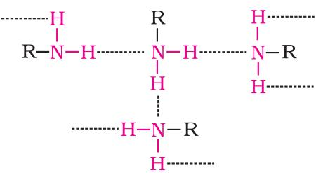

*Fig. 9.2 Intermolecular hydrogen bonding in primary amines*

Boiling points of amines, alcohols and alkanes of almost the same molar mass are shown in Table 9.2.

## Table 9.2: Comparison of Boiling Points of Amines, Alcohols and Alkanes of Similar Molecular Masses

| Sl. No. | Compound | Molar mass | b.p./K |
| --- | --- | --- | --- |
| 1. | n-C4H9NH2 | 73 | 350.8 |
| 2. | ) (C2H5 2NH | 73 | 329.3 |
| 3. | C2H5N(CH3 ) 2 | 73 | 310.5 |
| 4. | ) C2H5CH(CH3 2 | 72 | 300.8 |
| 5. | n-C4H9OH | 74 | 390.3 |

- 9.6 Chemical ChemicalChemical Reactions ReactionsReactions
Difference in electronegativity between nitrogen and hydrogen atoms and the presence of unshared pair of electrons over the nitrogen atom makes amines reactive. The number of hydrogen atoms attached to nitrogen atom also decides the course of reaction of amines; that is why primary

(–NH2 ), secondary N H and tertiary amines N differ in many

reactions. Moreover, amines behave as nucleophiles due to the presence of unshared electron pair. Some of the reactions of amines are described below:

- *1. Basic character of amines*
Amines, being basic in nature, react with acids to form salts.

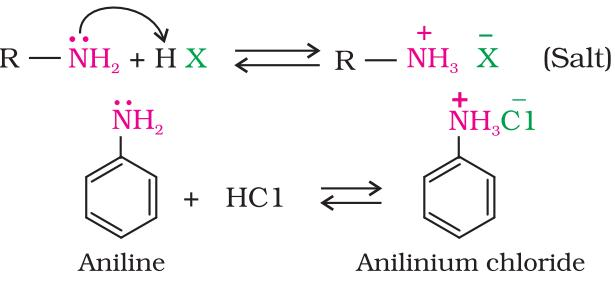

Chemistry 266

Amine salts on treatment with a base like NaOH, regenerate the parent amine.

Amine salts are soluble in water but insoluble in organic solvents like ether. This reaction is the basis for the separation of amines from the non basic organic compounds insoluble in water.

The reaction of amines with mineral acids to form ammonium salts shows that these are basic in nature. Amines have an unshared pair of electrons on nitrogen atom due to which they behave as Lewis base. Basic character of amines can be better understood in terms of their *Kb* and p*Kb* values as explained below:

$\begin{array}{c}\includegraphics[height=142.26375pt]{Fig1}\end{array}$  
  
$\begin{array}{c}\includegraphics[height=142.26375pt]{Fig2}\end{array}$  
  
$\begin{array}{c}\includegraphics[height=142.26375pt]{Fig3}\end{array}$  
  
$\begin{array}{c}\includegraphics[height=142.26375pt]{Fig4}\end{array}$  
  
$\begin{array}{c}\includegraphics[height=142.26375pt]{Fig5}\end{array}$  
  
$\begin{array}{c}\includegraphics[height=142.26375pt]{Fig6}\end{array}$  
  
$\begin{array}{c}\includegraphics[height=142.26375pt]{Fig7}\end{array}$  
  
\(\begin{array}{c}\includegraphics[height=142.  
  

Larger the value of *Kb* or smaller the value of p*Kb* , stronger is the base. The p*Kb* values of few amines are given in Table 9.3.

p*Kb* value of ammonia is 4.75. Aliphatic amines are stronger bases than ammonia due to +I effect of alkyl groups leading to high electron density on the nitrogen atom. Their p*Kb* values lie in the range of 3 to 4.22. On the other hand, aromatic amines are weaker bases than ammonia due to the electron withdrawing nature of the aryl group.

 Table 9.3: p*Kb* Values of Amines in Aqueous Phase

| Name of amine | pKb |
| --- | --- |
| Methanamine | 3.38 |
| N-Methylmethanamine | 3.27 |
| N,N-Dimethylmethanamine | 4.22 |
| Ethanamine | 3.29 |
| N-Ethylethanamine | 3.00 |
| N,N-Diethylethanamine | 3.25 |
| Benzenamine | 9.38 |
| Phenylmethanamine | 4.70 |
| N-Methylaniline | 9.30 |
| N,N-Dimethylaniline | 8.92 |


You may find some discrepancies while trying to interpret the *Kb* values of amines on the basis of +I or –I effect of the substituents present in amines. Besides inductive effect, there are other effects like solvation effect, steric hinderance, etc., which affect the basic strength of amines. Just ponder over. You may get the answer in the following paragraphs.

#### *Structure-basicity relationship of amines*

Basicity of amines is related to their structure. Basic character of an amine depends upon the ease of formation of the cation by accepting a proton from the acid. The more stable the cation is relative to the amine, more basic is the amine.

#### *(a) Alkanamines versus ammonia*

Let us consider the reaction of an alkanamine and ammonia with a proton to compare their basicity.

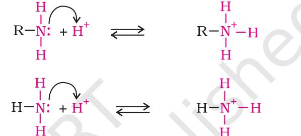

Due to the electron releasing nature of alkyl group, it (R) pushes electrons towards nitrogen and thus makes the unshared electron pair more available for sharing with the proton of the acid. Moreover, the substituted ammonium ion formed from the amine gets stabilised due to dispersal of the positive charge by the +I effect of the alkyl group. Hence, alkylamines are stronger bases than ammonia. Thus, the basic nature of aliphatic amines should increase with increase in the number of alkyl groups. This trend is followed in the gaseous phase. The order of basicity of amines in the gaseous phase follows the expected order: tertiary amine > secondary amine > primary amine > NH3 . The trend is not regular in the aqueous state as evident by their p*Kb* values given in Table 9.3. In the aqueous phase, the substituted ammonium cations get stabilised not only by electron releasing effect of the alkyl group (+I) but also by solvation with water molecules. The greater the size of the ion, lesser will be the solvation and the less stabilised is the ion. The order of stability of ions are as follows:

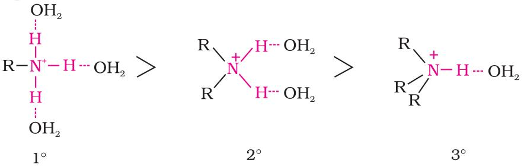

Decreasing order of extent of H-bonding in water and order of stability of ions by solvation.

Chemistry 268

Greater is the stability of the substituted ammonium cation, stronger should be the corresponding amine as a base. Thus, the order of basicity of aliphatic amines should be: primary > secondary > tertiary, which is opposite to the inductive effect based order. Secondly, when the alkyl group is small, like –CH3 group, there is no steric hindrance to H-bonding. In case the alkyl group is bigger than CH3 group, there will be steric hinderance to H-bonding. Therefore, the change of nature of the alkyl group, e.g., from –CH3 to –C2H5 results in change of the order of basic strength. Thus, there is a subtle interplay of the inductive effect, solvation effect and steric hinderance of the alkyl group which decides the basic strength of alkyl amines in the aqueous state. The order of basic strength in case of methyl substituted amines and ethyl substituted amines in aqueous solution is as follows:

- (C2H5 ) 2NH > (C2H5 ) 3N > C2H5NH2 > NH3 (CH3 ) 2NH > CH3NH2 > (CH3 ) 3N > NH3
- *(b) Arylamines versus ammonia*

p*Kb* value of aniline is quite high. Why is it so? It is because in aniline or other arylamines, the -NH2 group is attached directly to the benzene ring. It results in the unshared electron pair on nitrogen atom to be in conjugation with the benzene ring and thus making it less available for protonation. If you write different resonating structures of aniline, you will find that aniline is a resonance hybrid of the following five structures.

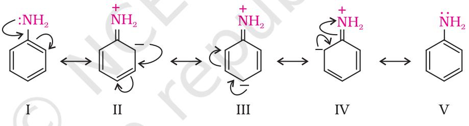

On the other hand, anilinium ion obtained by accepting a proton can have only two resonating structures (kekule).

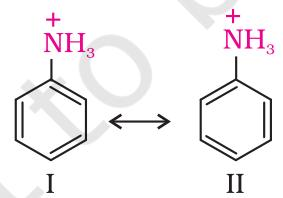

We know that greater the number of resonating structures, greater is the stability. Thus you can infer that aniline (five resonating structures) is more stable than anilinium ion. Hence, the proton acceptability or the basic nature of aniline or other aromatic amines would be less than that of ammonia. In case of substituted aniline, it is observed that electron releasing groups like –OCH3 , –CH3 increase basic strength whereas electron withdrawing groups like –NO2 , –SO3H, –COOH, –X decrease it.

| Example 9.4 | Arrange the following in decreasing order of their basic strength: |
| --- | --- |
|  | C6H5NH2 , C2H5NH2 , (C2H5 ) 2NH, NH3 |
| Solution Solution Solution | The decreasing order of basic strength of the above amines and ammonia |
|  | follows the following order: |
|  | ) (C2H5 2NH > C2H5NH2 > NH3 > C6H5NH2 |

#### *2. Alkylation*

Amines undergo alkylation on reaction with alkyl halides (refer Unit 6, Class XII).

- *3. Acylation*
Aliphatic and aromatic primary and secondary amines react with acid chlorides, anhydrides and esters by nucleophilic substitution reaction. This reaction is known as acylation. You can consider this reaction as the replacement of hydrogen atom of –NH2 or >N–H group by the acyl group. The products obtained by acylation reaction are known as amides. The reaction is carried out in the presence of a base stronger than the amine, like pyridine, which removes HCl so formed and shifts the equilibrium to the right hand side.

Amines also react with benzoyl chloride (C6H5COCl). This reaction is known as benzoylation.

3 2 6 5 3 6 5 Methanamine Benzoyl chloride N Methylbenzamide CH NH C H COCl CH C H H NHCO Cl 

What do you think is the product of the reaction of amines with carboxylic acids ? They form salts with amines at room temperature.

Chemistry 270

- *4. Carbylamine reaction*
Aliphatic and aromatic primary amines on heating with chloroform and ethanolic potassium hydroxide form isocyanides or carbylamines which are foul smelling substances. Secondary and tertiary amines do not show this reaction. This reaction is known as carbylamine reaction or isocyanide test and is used as a test for primary amines.

- *5. Reaction with nitrous acid*
Three classes of amines react differently with nitrous acid which is prepared *in situ* from a mineral acid and sodium nitrite.

- (a) Primary aliphatic amines react with nitrous acid to form aliphatic diazonium salts which being unstable, liberate nitrogen gas quantitatively and alcohols. Quantitative evolution of nitrogen is used in estimation of amino acids and proteins.
- (b) Aromatic amines react with nitrous acid at low temperatures (273-278 K) to form diazonium salts, a very important class of compounds used for synthesis of a variety of aromatic compounds discussed in Section 9.7.
Secondary and tertiary amines react with nitrous acid in a different manner.

- *6. Reaction with arylsulphonyl chloride*
Benzenesulphonyl chloride (C6H5 SO2Cl), which is also known as Hinsberg's reagent, reacts with primary and secondary amines to form sulphonamides.

- (a) The reaction of benzenesulphonyl chloride with primary amine yields N-ethylbenzenesulphonyl amide.
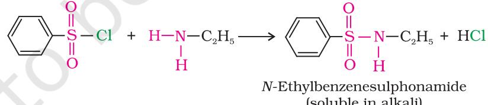

The hydrogen attached to nitrogen in sulphonamide is strongly acidic due to the presence of strong electron withdrawing sulphonyl group. Hence, it is soluble in alkali.

- (b) In the reaction with secondary amine, N,N-diethylbenzenesulphonamide is formed.
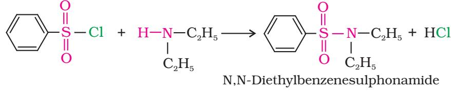

271 Amines

Since N, N-diethylbenzene sulphonamide does not contain any hydrogen atom attached to nitrogen atom, it is not acidic and hence insoluble in alkali.

- (c) Tertiary amines do not react with benzenesulphonyl chloride. This property of amines reacting with benzenesulphonyl chloride in a different manner is used for the distinction of primary, secondary and tertiary amines and also for the separation of a mixture of amines. However, these days benzenesulphonyl chloride is replaced by *p*-toluenesulphonyl chloride.
- *7. Electrophilic substitution*

You have read earlier that aniline is a resonance hybrid of five structures. Where do you find the maximum electron density in these structures? *Ortho-* and *para-*positions to the –NH2 group become centres of high electron density. Thus –NH2 group is *ortho* and *para* directing and a powerful activating group.

- *(a) Bromination:* Aniline reacts with bromine water at room temperature to give a white precipitate of 2,4,6-tribromoaniline.
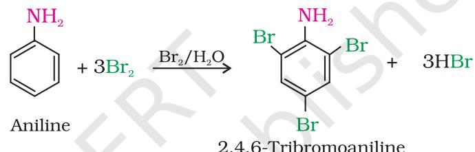

The main problem encountered during electrophilic substitution reactions of aromatic amines is that of their very high reactivity. Substitution tends to occur at *ortho-* and *para-*positions. If we have to prepare monosubstituted aniline derivative, how can the activating effect of –NH2 group be controlled ? This can be done by protecting the -NH2 group by acetylation with acetic anhydride, then carrying out the desired substitution followed by hydrolysis of the substituted amide to the substituted amine.

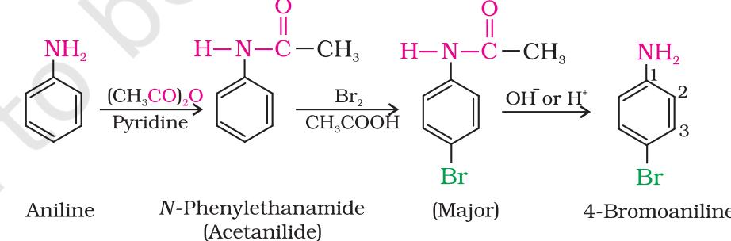

The lone pair of electrons on nitrogen of acetanilide interacts with oxygen atom due to resonance as shown below:


Hence, the lone pair of electrons on nitrogen is less available for donation to benzene ring by resonance. Therefore, activating effect of –NHCOCH3 group is less than that of amino group.

- *(b) Nitration:* Direct nitration of aniline yields tarry oxidation products in addition to the nitro derivatives. Moreover, in the strongly acidic medium, aniline is protonated to form the anilinium ion which is *meta* directing. That is why besides the *ortho* and *para* derivatives, significant amount of *meta* derivative is also formed.
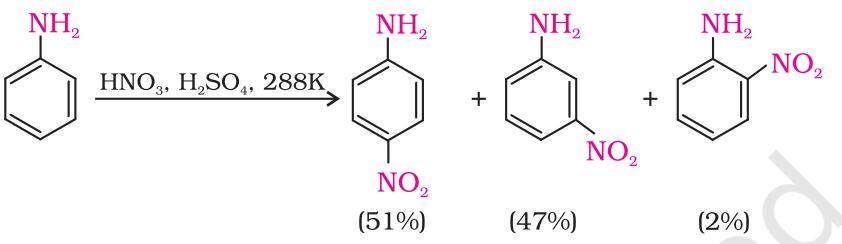

However, by protecting the –NH2 group by acetylation reaction with acetic anhydride, the nitration reaction can be controlled and the *p*-nitro derivative can be obtained as the major product.

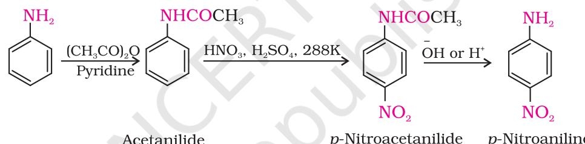

- *(c) Sulphonation:* Aniline reacts with concentrated sulphuric acid to form anilinium hydrogensulphate which on heating with sulphuric acid at 453-473K produces p-aminobenzene sulphonic acid, commonly known as sulphanilic acid, as the major product.
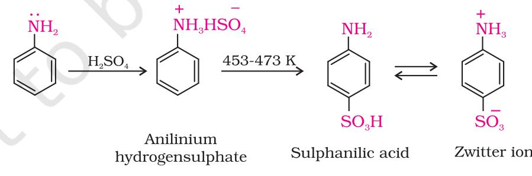

Aniline does not undergo Friedel-Crafts reaction (alkylation and acetylation) due to salt formation with aluminium chloride, the Lewis acid, which is used as a catalyst. Due to this, nitrogen of aniline acquires positive charge and hence acts as a strong deactivating group for further reaction.


# Intext Questions

- 9.4 Arrange the following in increasing order of their basic strength: (i) C2H5NH2 , C6H5NH2 , NH3 , C6H5CH2NH2 and (C2H5 ) 2NH (ii) C2H5NH2 , (C2H5 ) 2NH, (C2H5 ) 3N, C6H5NH2 (iii) CH3NH2 , (CH3 ) 2NH, (CH3 ) 3N, C6H5NH2 , C6H5CH2NH2 .
- 9.5 Complete the following acid-base reactions and name the products: (i) CH3CH2CH2NH2 + HCl ® (ii) (C2H5 ) 3N + HCl ®
- 9.6 Write reactions of the final alkylation product of aniline with excess of methyl iodide in the presence of sodium carbonate solution.
- 9.7 Write chemical reaction of aniline with benzoyl chloride and write the name of the product obtained.
- 9.8 Write structures of different isomers corresponding to the molecular formula, C3H9N. Write IUPAC names of the isomers which will liberate nitrogen gas on treatment with nitrous acid.

## II. DIAZONIUM SALTS

The diazonium salts have the general formula – R N X2 where R stands for an aryl group and – X ion may be Cl– Br, – HSO4 , BF4 , etc. They are named by suffixing diazonium to the name of the parent hydrocarbon from which they are formed, followed by the name of anion such as chloride, hydrogensulphate, etc. The N2 group is called diazonium 

group. For example, – C H N Cl 6 5 2 is named as benzenediazonium chloride and C6H5N2 +HSO4 – is known as benzenediazonium hydrogensulphate.

Primary aliphatic amines form highly unstable alkyldiazonium salts (refer to Section 9.6). Primary aromatic amines form arenediazonium salts which are stable for a short time in solution at low temperatures (273-278 K). The stability of arenediazonium ion is explained on the basis of resonance.

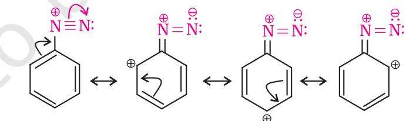

9.7 Method of Method ofMethod of Preparation PreparationPreparation of Diazoniun Salts

Benzenediazonium chloride is prepared by the reaction of aniline with nitrous acid at 273-278K. Nitrous acid is produced in the reaction mixture by the reaction of sodium nitrite with hydrochloric acid. The conversion of primary aromatic amines into diazonium salts is known as diazotisation. Due to its instability, the diazonium salt is not generally stored and is used immediately after its preparation.

> 2 273 278K 6 5 2 – C H NaNO 2H NH Cl C H Na 6 5 N2 Cl Cl 2H2O

Chemistry 274

# 9.8 Physical PhysicalPhysical Properties PropertiesProperties

Benzenediazonium chloride is a colourless crystalline solid. It is readily soluble in water and is stable in cold but reacts with water when warmed. It decomposes easily in the dry state. Benzenediazonium fluoroborate is water insoluble and stable at room temperature.

9.9 Chemical ChemicalChemical Reactions ReactionsReactions The reactions of diazonium salts can be broadly divided into two categories, namely (A) reactions involving displacement of nitrogen and (B) reactions involving retention of diazo group.

- *A. Reactions involving displacement of nitrogen*
Diazonium group being a very good leaving group, is substituted by other groups such as Cl– , Br– , I – , CN– and OH– which displace nitrogen from the aromatic ring. The nitrogen formed escapes from the reaction mixture as a gas.

- 1. *Replacement by halide or cyanide ion*: The Cl– , Br– and CN– nucleophiles can easily be introduced in the benzene ring in the presence of Cu(I) ion. This reaction is called Sandmeyer reaction.
  
  
\begin{tabular}{c c c c} & Cu${}_{2}$Cl${}_{2}$/HCl & ArCl & + & N${}_{2}$ \\ ArN${}_{2}$X & Cu${}_{2}$Br${}_{2}$/HBr & ArBr & + & N${}_{2}$ \\ CuCN /KCN & ArCN & + & N${}_{2}$ \\ \end{tabular}  
  

Alternatively, chlorine or bromine can also be introduced in the benzene ring by treating the diazonium salt solution with corresponding halogen acid in the presence of copper powder. This is referred as Gatterman reaction.

  
  
\begin{tabular}{c c} & Cu/HCl & ArCl + N${}_{2}$ + CuX \\ & ArN${}_{2}$X & Cu/HBr + N${}_{2}$ + CuX \\ \end{tabular}  
  

The yield in Sandmeyer reaction is found to be better than Gattermann reaction.

- 2. *Replacement by iodide ion*: Iodine is not easily introduced into the benzene ring directly, but, when the diazonium salt solution is treated with potassium iodide, iodobenzene is formed.
- 3. *Replacement by fluoride ion*: When arenediazonium chloride is treated with fluoroboric acid, arene diazonium fluoroborate is precipitated which on heating decomposes to yield aryl fluoride.

$$\rm Ar\bar{N}_{2}Cl+HBF_{4}\longrightarrow\rm Ar-\bar{N}_{2}BF_{4}\longrightarrow\rm Ar-F+BF_{3}+N_{2}$$

- 4. *Replacement by H*: Certain mild reducing agents like hypophosphorous acid (phosphinic acid) or ethanol reduce diazonium salts to arenes and themselves get oxidised to phosphorous acid and ethanal, respectively.


- 
- 5. *Replacement by hydroxyl group*: If the temperature of the diazonium salt solution is allowed to rise upto 283 K, the salt gets hydrolysed to phenol.

- 6. *Replacement by –NO2 group*: When diazonium fluoroborate is heated with aqueous sodium nitrite solution in the presence of copper, the diazonium group is replaced by –NO2 group.
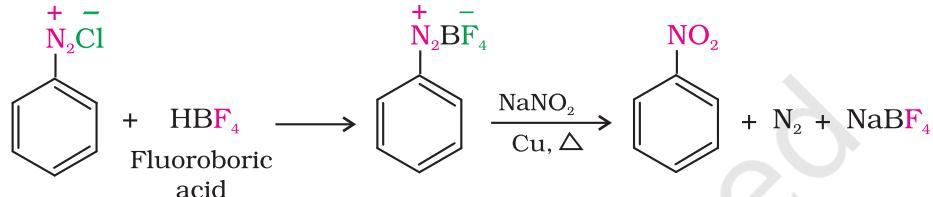

*B. Reactions involving retention of diazo group coupling reactions*

The azo products obtained have an extended conjugate system having both the aromatic rings joined through the –N=N– bond. These compounds are often coloured and are used as dyes. Benzene diazonium chloride reacts with phenol in which the phenol molecule at its para position is coupled with the diazonium salt to form *p*-hydroxyazobenzene. This type of reaction is known as coupling reaction. Similarly the reaction of diazonium salt with aniline yields *p*-aminoazobenzene. This is an example of electrophilic substitution reaction.

$\left(\begin{array}{c}\includegraphics[height=36.135pt]{./figures/.eps}\end{array}\right)$.  
  

$\begin{array}{c}\includegraphics[height=36.135pt]{Fig1}\end{array}$

9.10 Importance ImportanceImportance of Diazonium DiazoniumDiazonium Salts in Salts inSalts in Synthesis SynthesisSynthesis of Aromatic of Aromaticof Aromatic Compounds CompoundsCompounds

From the above reactions, it is clear that the diazonium salts are very good intermediates for the introduction of –F, –Cl, –Br, –I, –CN, –OH, –NO2 groups into the aromatic ring.

Aryl fluorides and iodides cannot be prepared by direct halogenation. The cyano group cannot be introduced by nucleophilic substitution of chlorine in chlorobenzene but cyanobenzene can be easily obtained from diazonium salt.

Thus, the replacement of diazo group by other groups is helpful in


preparing those substituted aromatic compounds which cannot be prepared by direct substitution in benzene or substituted benzene.

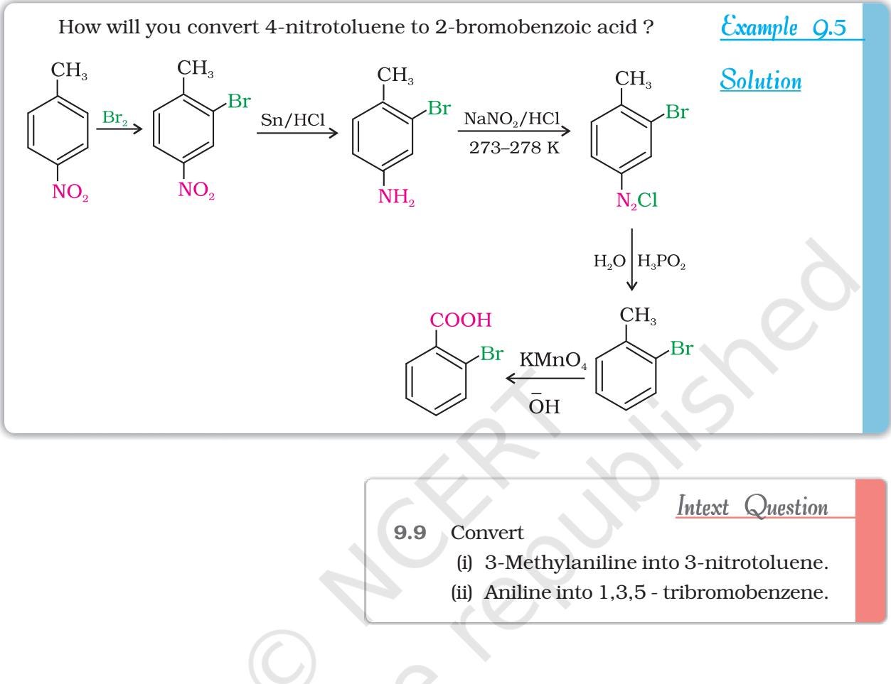

# Summary Summary

Amines can be considered as derivatives of ammonia obtained by replacement of hydrogen atoms with alkyl or aryl groups. Replacement of one hydrogen atom of ammonia gives rise to structure of the type R-NH2 , known as primary amine. Secondary amines are characterised by the structure R2NH or R-NHR¢ and tertiary amines by R3N, RNR¢R¢¢ or R2NR¢. Secondary and tertiary amines are known as simple amines if the alkyl or aryl groups are the same and mixed amines if the groups are different. Like ammonia, all the three types of amines have one unshared electron pair on nitrogen atom due to which they behave as Lewis bases.

Amines are usually formed from nitro compounds, halides, amides, imides, etc. They exhibit hydrogen bonding which influence their physical properties. In alkylamines, a combination of electron releasing, steric and H-bonding factors influence the stability of the substituted ammonium cations in protic polar solvents and thus affect the basic nature of amines. Alkyl amines are found to be stronger bases than ammonia. In aromatic amines, electron releasing and withdrawing groups, respectively increase and decrease their basic character. Aniline is a weaker base

277 Amines

than ammonia. Reactions of amines are governed by availability of the unshared pair of electrons on nitrogen. Influence of the number of hydrogen atoms at nitrogen atom on the type of reactions and nature of products is responsible for identification and distinction between primary, secondary and tertiary amines. *p*-Toluenesulphonyl chloride is used for the identification of primary, secondary and tertiary amines. Presence of amino group in aromatic ring enhances reactivity of the aromatic amines. Reactivity of aromatic amines can be controlled by acylation process, i.e., by treating with acetyl chloride or acetic anhydride. Tertiary amines like trimethylamine are used as insect attractants.

Aryldiazonium salts, usually obtained from arylamines, undergo replacement of the diazonium group with a variety of nucleophiles to provide advantageous methods for producing aryl halides, cyanides, phenols and arenes by reductive removal of the diazo group. Coupling reaction of aryldiazonium salts with phenols or arylamines give rise to the formation of azo dyes.

# Exercises

- 9.1 Write IUPAC names of the following compounds and classify them into primary, secondary and tertiary amines.
	- (i) (CH3 )2CHNH2 (ii) CH3
		- (CH2 )2NH2 (v) C6H5NHCH3
- (iii) CH3NHCH(CH3 )2 (vi) (CH3CH2 )2NCH3

- (vii) *m*–BrC6H4NH2
)3CNH2

(iv) (CH3

- 9.2 Give one chemical test to distinguish between the following pairs of compounds. (i) Methylamine and dimethylamine (ii) Secondary and tertiary amines
	- (iii) Ethylamine and aniline (iv) Aniline and benzylamine
	- (v) Aniline and N-methylaniline.
- 9.3 Account for the following:
	- (i) p*Kb* of aniline is more than that of methylamine.
	- (ii) Ethylamine is soluble in water whereas aniline is not.
	- (iii) Methylamine in water reacts with ferric chloride to precipitate hydrated ferric oxide.
	- (iv) Although amino group is *o–* and *p–* directing in aromatic electrophilic substitution reactions, aniline on nitration gives a substantial amount of *m*-nitroaniline.
	- (v) Aniline does not undergo Friedel-Crafts reaction.
	- (vi) Diazonium salts of aromatic amines are more stable than those of aliphatic amines.
	- (vii) Gabriel phthalimide synthesis is preferred for synthesising primary amines.
- 9.4 Arrange the following:
	- (i) In decreasing order of the p*Kb* values:

C2H5NH2 , C6H5NHCH3 , (C2H5 )2NH and C6H5NH2

- (ii) In increasing order of basic strength:
	- C6H5NH2 , C6H5N(CH3 )2 , (C2H5 )2NH and CH3NH2
- (iii) In increasing order of basic strength:
	- (a) Aniline, *p*-nitroaniline and *p*-toluidine

```
Chemistry 278
```
(b) C6H5NH2 , C6H5NHCH3 , C6H5CH2NH2 .

- (iv) In decreasing order of basic strength in gas phase: C2H5NH2 , (C2H5 )2NH, (C2H5 )3N and NH3
- (v) In increasing order of boiling point: C2H5OH, (CH3 )2NH, C2H5NH2
- (vi) In increasing order of solubility in water: C6H5NH2 , (C2H5 )2NH, C2H5NH2 .
- 9.5 How will you convert:
	- (i) Ethanoic acid into methanamine
	- (ii) Hexanenitrile into 1-aminopentane
	- (iii) Methanol to ethanoic acid
	- (iv) Ethanamine into methanamine
	- (v) Ethanoic acid into propanoic acid
	- (vi) Methanamine into ethanamine
	- (vii) Nitromethane into dimethylamine
	- (viii) Propanoic acid into ethanoic acid?
- 9.6 Describe a method for the identification of primary, secondary and tertiary amines. Also write chemical equations of the reactions involved.
- 9.7 Write short notes on the following:
	- (i) Carbylamine reaction (ii) Diazotisation
- - (iii) Hofmann's bromamide reaction (iv) Coupling reaction
	- (v) Ammonolysis (vi) Acetylation
- - (vii) Gabriel phthalimide synthesis.
- 9.8 Accomplish the following conversions:
	- (i) Nitrobenzene to benzoic acid
		- (ii) Benzene to *m*-bromophenol
		- (iii) Benzoic acid to aniline
		- (iv) Aniline to 2,4,6-tribromofluorobenzene
		- (v) Benzyl chloride to 2-phenylethanamine
		- (vi) Chlorobenzene to *p*-chloroaniline
		- (vii) Aniline to *p*-bromoaniline
		- (viii) Benzamide to toluene
		- (ix) Aniline to benzyl alcohol.
- 9.9 Give the structures of A, B and C in the following reactions:
	- (i) NaCN OH NaOH Br2 3 2 Partial hydrolysis CH CH I A B C (ii) CuCN H O/ 2 H NH3 C H N Cl 6 5 2 A B C (iii) KCN LiAlH4 HNO2 3 2 0 C CH CH Br A B C (iv) Fe/HCl NaNO HCl 2 H O/H 2 6 5 2 273 K C H NO A B C (v) NH3 NaOBr NaNO /HCl 2 CH COOH A 3 B C (vi) Fe/HCl HNO2 C H OH 6 5 6 5 2 273K C H NO A B C


- 9.10 An aromatic compound 'A' on treatment with aqueous ammonia and heating forms compound 'B' which on heating with Br2 and KOH forms a compound 'C' of molecular formula C6H7N. Write the structures and IUPAC names of compounds A, B and C.
- 9.11 Complete the following reactions:
	- (i) C H NH CHCl alc.KOH 6 5 2 3
	- (ii) C H N Cl H PO H O 6 5 2 3 2 2
	- (iii) C H NH H SO 6 5 2 2 4 conc.
	- (iv) C H N Cl C H OH 6 5 2 2 5
	- (v) C H NH Br 6 5 2 2 aq
	- (vi) 6 5 2 3 2 C H NH CH CO O

$$\mathrm{(vii)}\stackrel{\mathrm{(viii)}}{\mathrm{C}_{6}}\mathrm{H}_{5}\mathrm{N}_{2}\mathrm{Cl}\,{\xrightarrow[\mathrm{(ii)NaNO}_{2}\,/\,\mathrm{Cu},\,\Delta]{}}$$

- 9.12 Why cannot aromatic primary amines be prepared by Gabriel phthalimide synthesis?
- 9.13 Write the reactions of (i) aromatic and (ii) aliphatic primary amines with nitrous acid.
- 9.14 Give plausible explanation for each of the following:
	- (i) Why are amines less acidic than alcohols of comparable molecular masses?
	- (ii) Why do primary amines have higher boiling point than tertiary amines?
	- (iii) Why are aliphatic amines stronger bases than aromatic amines?

#### Answers to Some Intext Questions

- 9.4 (i) C6H5NH2 < NH3 < C6H5CH2NH2 < C2H5NH2 < (C2H5 )2NH
	- (ii) C6H5NH2 < C2H5NH2. < (C2H5 )3N < (C2H5 )2NH
	- (iii) C6H5NH2 < C6H5CH2NH2 < (CH3 )3N < CH3NH2 < (CH3 )2NH

