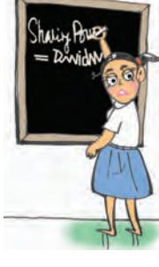
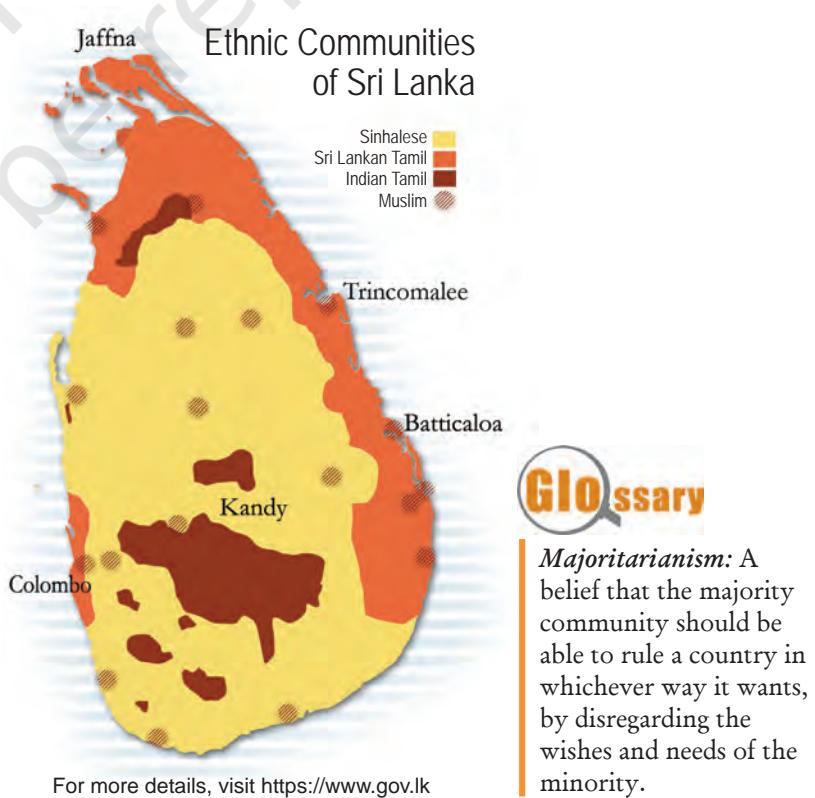
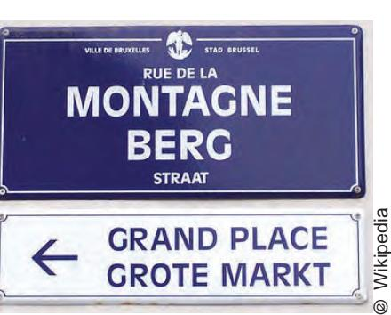
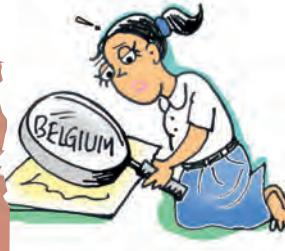
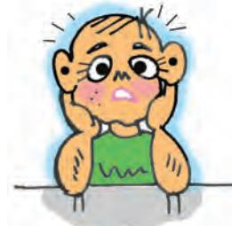
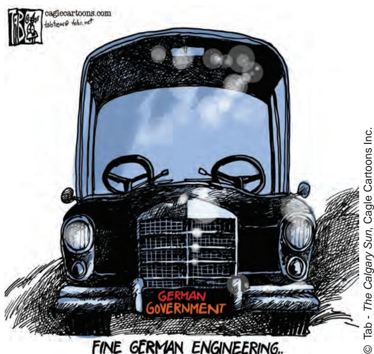
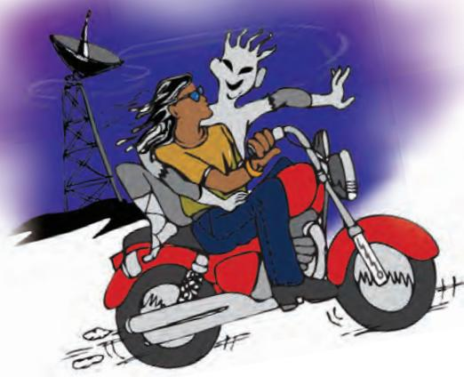
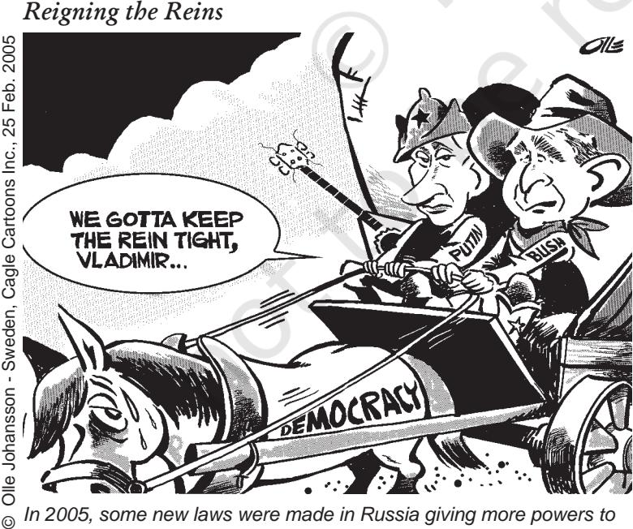

## **Power-sharing**

#### Overview

With this chapter, we resume the tour of democracy that we started last year. We noted last year that in a democracy all power does not rest with any one organ of the government. An intelligent sharing of power among legislature, executive and judiciary is very important to the design of a democracy. In this and the next two chapters, we carry this idea of power-sharing forward. We start with two stories from Belgium and Sri Lanka. Both these stories are about how democracies handle demands for power-sharing. The stories yield some general conclusions about the need for power-sharing in democracy. This allows us to discuss various forms of power-sharing that will be taken up in the following two chapters.

# **Chapter I**

Chapter 1.indd 1 08-04-2022 12:29:05

I have a simple equation in mind. Sharing power = dividing power = weakening the country. Why do we start by talking of this?

#### **Belgium and Sri Lanka**

Belgium is a small country in Europe, smaller in area than the state of Haryana. It has borders with France, the Netherlands, Germany and Luxembourg. It has a population of a little over one crore, about half the population of Haryana. The ethnic composition of this small country is very complex. Of the country's total population, 59 per cent lives in the Flemish region and speaks Dutch language. Another 40 per cent people live in the Wallonia region and speak French. Remaining one per cent of the Belgians speak German. In the capital city Brussels, 80 per cent people speak French while 20 per cent are Dutch-speaking.

The minority French-speaking community was relatively rich and powerful. This was resented by the Dutch-speaking community who got the benefit of economic development and education much later. This led to tensions between the Dutchspeaking and French-speaking communities during the 1950s and 1960s. The tension between the two communities was more acute in Brussels. Brussels presented a special problem: the Dutch-speaking people constituted a majority in the country, but a minority in the capital.

Let us compare this to the situation in another country. Sri Lanka is an island nation, just a few kilometres off the southern coast of Tamil Nadu. It has about two crore people, about the same as in Haryana. Like other nations in the South Asia region, Sri Lanka has a diverse population. The major social groups are the Sinhala-speakers (74 per cent) and the Tamil-speakers (18 per cent). Among Tamils there are two sub-groups. Tamil natives of the country are called 'Sri Lankan

*communities?*

*Ethnic*: A social division based on shared culture. People belonging to the same ethnic group believe in their common descent because of similarities of physical type or of culture or both. They need not always have the same religion or nationality.

Chapter 1.indd 2 08-04-2022 12:29:07

Tamils' (13 per cent). The rest, whose forefathers came from India as plantation workers during colonial period, are called 'Indian Tamils'. As you can see from the map, Sri Lankan Tamils are concentrated in the north and east of the country. Most of the Sinhala-speaking people are Buddhists, while most of the Tamils are Hindus or Muslims. There are about 7 per cent Christians, who are both Tamil and Sinhala.

Just imagine what could happen in situations like this. In Belgium,

**Majoritarianism in Sri Lanka**

Sri Lanka emerged as an independent country in 1948. The leaders of the Sinhala community sought to secure dominance over government by virtue of their majority. As a result, the democratically elected government adopted a series of majoritarian measures to establish Sinhala supremacy.

In 1956, an Act was passed to recognise Sinhala as the only official language, thus disregarding Tamil. The governments followed preferential policies that favoured Sinhala applicants for university positions and government jobs. A new constitution stipulated that the state shall protect and foster Buddhism.

All these government measures, coming one after the other, gradually increased the feeling of alienation among the Sri Lankan Tamils. They felt that none of the major political parties led by the Buddhist Sinhala leaders was sensitive to their the Dutch community could take advantage of its numeric majority and force its will on the French and German-speaking population. This would push the conflict among communities further. This could lead to a very messy partition of the country; both the sides would claim control over Brussels. In Sri Lanka, the Sinhala community enjoyed an even bigger majority and could impose its will on the entire country. Now, let us look at what happened in both these countries.

language and culture. They felt that the constitution and government policies denied them equal political rights, discriminated against them in getting jobs and other opportunities and ignored their interests. As a

Chapter 1.indd 3 08-04-2022 12:29:08

What's wrong if the majority community rules? If Sinhalas don't rule in Sri Lanka, where else will they rule?

*Civil war:* A violent conflict between opposing groups within a country that becomes so intense that it appears like a war.

result, the relations between the Sinhala and Tamil communities strained over time.

The Sri Lankan Tamils launched parties and struggles for the recognition of Tamil as an official language, for regional autonomy and equality of opportunity in securing education and jobs. But their demand for more autonomy to provinces populated by the Tamils was repeatedly denied. By 1980s, several political organisations were formed demanding an independent

**Accommodation in Belgium**

The Belgian leaders took a different path. They recognised the existence of regional differences and cultural diversities. Between 1970 and 1993, they amended their constitution four times so as to work out an arrangement that would enable everyone to live together within the same country. The arrangement they worked out is different from any other country and is very innovative. Here are some of the elements of the Belgian model:

 Constitution prescribes that the number of Dutch and French-speaking ministers shall be equal in the central government. Some special laws require Tamil Eelam (state) in northern and eastern parts of Sri Lanka.

The distrust between the two communities turned into widespread conflict. It soon turned into a civil war. As a result thousands of people of both the communities have been killed. Many families were forced to leave the country as refugees and many more lost their livelihoods. The civil war has caused a terrible setback to the social, cultural and economic life of the country. It ended in 2009.

the support of majority of members from each linguistic group. Thus, no single community can make decisions unilaterally.

 Many powers of the Central Government have been given to State Governments of the two regions of the country. The State Governments are not subordinate to the Central Government.

 Brussels has a separate government in which both the communities have equal representation. The Frenchspeaking people accepted equal representation in Brussels because the Dutch-speaking community has accepted equal representation in the

*The photograph here is of a street address in Belgium. You will notice that place names and directions in two languages – French and Dutch.*

Democratic Politics

What kind of a solution is this? I am glad our Constitution does not say which minister will come from which community.

Chapter 1.indd 4 19/03/2024 10:38:13

accepted equal representation in the Central Government.

Apart from the Central and the State Government, there is a third kind of government. This 'community government' is elected by people belonging to one language community – Dutch, French and German-speaking – no matter where they live. This government has the power regarding cultural, educational and language-related issues.

You might find the Belgian model very complicated. It indeed is very complicated, even for people living in Belgium. But these arrangements have worked well so far. They helped to avoid civic strife between the two major communities and a possible division of the country on linguistic lines. When many countries of

*European Parliament in Brussels, Belgium*

Europe came together to form the European Union, Brussels was chosen as its headquarters.

Read any newspaper for one week and make clippings of news related to ongoing conflicts or wars. A group of five students could pool their clippings together and do the following:

- Classify these conflicts by their location (your state, India, outside India).
- Find out the cause of each of these conflicts. How many of these are related to power sharing disputes?
- Which of these conflicts could be resolved by working out power sharing arrangements?

What do we learn from these two stories of Belgium and Sri Lanka? Both are democracies. Yet, they dealt with the question of power sharing differently. In Belgium, the leaders have realised that the unity of the country is possible only by respecting the feelings and interests of different communities and regions. Such a realisation resulted in mutually acceptable arrangements for sharing power. Sri Lanka shows us a contrasting example. It shows us that if a majority community wants to force its dominance over others and refuses to share power, it can undermine the unity of the country. So you are saying that sharing of power makes us more powerful. Sounds odd! Let me think.

Chapter 1.indd 5 08-04-2022 12:29:11

#### Why power sharing is desirable?

Thus, two different sets of reasons can be given in favour of power sharing. Firstly, power sharing is good because it helps to reduce the possibility of conflict between social groups. Since social conflict often leads to violence and political instability, power sharing is a good way to ensure the stability of political order. Imposing the will of majority community over others may look like an attractive option in the short run, but in the long run it undermines the unity of the nation. *The cartoon at the left refers to the problems of running the Germany's grand coalition government that includes the two major parties of the country, namely the Christian Democratic Union and the Social Democratic Party. The two parties are historically rivals to each other. They had to form a coalition government because neither of them got clear majority of seats on their own in the 2005 elections. They take divergent positions on several policy matters, but still jointly run the government. For details about the German Parliament, visit* https://www.bundestag.de/en

Tyranny of the majority is not just oppressive for the minority; it often affects majority adversely as well.

There is a second, deeper reason why power sharing is good for democracies. Power sharing is the very spirit of democracy. A democratic rule involves sharing power with those affected by its exercise, and who have to live with its effects. People have a right to be consulted on how they are to be governed. A legitimate government is one where citizens, through participation, acquire a stake in the system.

Let us call the first set of reasons prudential and the second moral. While prudential reasons stress that power sharing will bring out better outcomes, moral reasons emphasise the very act of power sharing as valuable.

*Prudential:* Based on prudence, or on careful calculation of gains and losses. Prudential decisions are usually contrasted with decisions based purely on moral considerations.

Annette studies in a Dutch medium school in the northern region of Belgium. Many French-speaking students in her school want the medium of instruction to be French. Selvi studies in a school in the northern region of Sri Lanka. All the students in her school are Tamil-speaking and they want the medium of instruction to be Tamil.

- If the parents of Annette and Selvi were to approach respective governments to realise the desire of the child who is more likely to succeed? And why?
Democratic Politics

Chapter 1.indd 6 19/03/2024 10:39:19

### Khalil's dilemma

As usual, Vikram was driving the motorbike under a vow of silence and Vetal was the pillion rider. As usual, Vetal started telling Vikram a story to keep him awake while driving. This time the story went as follows:

"In the city of Beirut, there lived a man called Khalil. His parents came from different communities. His father was an Orthodox Christian and mother a Sunni Muslim. This was not so uncommon in this modern, cosmopolitan city. People from various communities that lived in Lebanon came to live in its capital, Beirut. They lived together, intermingled, yet fought a bitter civil war among themselves. One of Khalil's uncles was killed in that war.

At the end of this civil war, Lebanon's leaders came together and agreed to some basic rules for power sharing among different communities. As per these rules, the country's President must belong to the Maronite sect of Catholic Christians. The Prime Minister must be from the Sunni Muslim community. The post of Deputy Prime Minister is fixed for Orthodox Christian sect and that of the Speaker for Shi'a Muslims. Under this pact, the Christians agreed not to seek French protection and the Muslims agreed not to seek unification with the neighbouring state of Syria.When the Christians and Muslims came to this agreement, they were nearly equal in population. Both sides have continued to respect this agreement though now the Muslims are in clear majority.

Khalil does not like this system one bit. He is a popular man with political ambition. But under the present system, the top position is out of his reach. He does not practise either his father's or his mother's religion and does not wish to be known by either. He cannot understand why Lebanon can't be like any other 'normal' democracy. "Just hold an election, allow everyone to contest and whoever wins maximum votes becomes the president, no matter which community he comes from. Why can't we do that, like in other democracies of the world?" he asks. His elders, who have seen the bloodshed of the civil war, tell him that the present system is the best guarantee for peace…"

The story was not finished, but they had reached the TV tower where they stopped every day. Vetal wrapped up quickly and posed his customary question to Vikram: "If you had the power to rewrite the rules in Lebanon, what would you do? Would you adopt the 'regular' rules followed everywhere, as Khalil suggests? Or stick to the old rules? Or do something else?" Vetal did not forget to remind Vikram of their basic pact: "If you have an answer in mind and yet do not speak up, your mobike will freeze, and so will you!"

**Can you help poor Vikram in answering Vetal?** 

Power-sharing

Chapter 1.indd 7 08-04-2022 12:29:19

#### **Forms of power-sharing**

The idea of power-sharing has emerged in opposition to the notions of undivided political power. For a long time, it was believed that all power of a government must reside in one person or group of persons located at one place. It was felt that if the power to decide is dispersed, it would not be possible to take quick decisions and to enforce them. But these notions have changed with the emergence of democracy. One basic principle of democracy is that people are the source of all political power. In a democracy, people rule themselves through institutions of self-government. In a good democratic government, due respect is given to diverse groups and views that exist in a society. Everyone has a voice in the shaping of public policies. Therefore, it follows that in a democracy, political

*In 2005, some new laws were made in Russia giving more powers to its president. During the same time, the US president visited Russia. What, according to this cartoon, is the relationship between democracy and concentration of power? Can you think of some other examples to illustrate the point being made here?*

power should be distributed among as many citizens as possible.

**In modern democracies,** power sharing arrangements can take many forms. Let us look at some of the most common arrangements that we have or will come across.

1 Power is shared **among different organs of government,** such as the legislature, executive and judiciary. Let us call this horizontal distribution of power because it allows different organs of government placed at the same level to exercise different powers. Such a separation ensures that none of the organs can exercise unlimited power. Each organ checks the others. This results in a balance of power among various institutions. Last year, we studied that in a democracy, even though ministers and government officials exercise power, they are responsible to the Parliament or State Assemblies. Similarly, although judges are appointed by the executive, they can check the functioning of executive or laws made by the legislatures. This arrangement is called a system of checks and balances.

2 Power can be shared among governments at different levels – a general government for the entire country and governments at the provincial or regional level. Such a general government for the entire country is usually called federal government. In India, we refer to it as the Central or Union Government. The governments at the provincial or regional level are called by different names in different countries.

Chapter 1.indd 8 08-04-2022 12:29:19

In India, we call them State Governments. This system is not followed in all countries. There are many countries where there are no provincial or state governments. But in those countries like ours, where there are different levels of government, the constitution clearly lays down the powers of different levels of government. This is what they did in Belgium, but was refused in Sri Lanka. This is called federal division of power. The same principle can be extended to levels of government lower than the State government, such as the municipality and panchayat. Let us call division of powers involving higher and lower levels of government vertical division of power. We shall study these at some length in the next chapter.

 3 Power may also be shared among different social groups, such as the religious and linguistic groups. 'Community government' in Belgium is a good example of this arrangement. In some countries, there are constitutional and legal arrangements, whereby socially weaker sections and women are represented in the legislatures and administration. Last year, we studied the system of 'reserved constituencies' in assemblies and the parliament of our country. This type of arrangement is meant to give space in the government and administration to diverse social groups, who otherwise, would feel alienated from the government. This method is used to give minority communities a fair share in power. In Unit II, we shall look at various ways of accommodating social diversities.

4 Power sharing arrangements can also be seen in the way political parties, pressure groups and movements control or influence those in power. In a democracy, the citizens must have freedom to choose among various contenders for power. In contemporary democracies, this takes the form of competition among different parties. Such competition ensures that power does not remain in one hand. In the long run, power is shared among different political parties that represent different ideologies and social groups. Sometimes this kind of sharing can be direct, when two or more parties form an alliance to contest elections. If their alliance is elected, they form a coalition government and thus share power. In a democracy, we find interest groups, such as those of traders, businessmen, industrialists, farmers and industrial workers. They also will have a share in governmental power, either through participation in governmental committees or bringing influence on the decision-making process. In Unit III, we shall study the working of political parties.

In my school, the class monitor changes every month. Is that what you call a power sharing arrangement?

Chapter 1.indd 9 4/29/2022 5:00:31 PM

**Exercises**

Here are some examples of power sharing. Which of the four types of power sharing do these represent? Who is sharing power with whom?

- The Bombay High Court ordered the Maharashtra State Government to immediately take action and improve living conditions for the 2,000-odd children at seven children's homes in Mumbai.
- The government of Ontario state in Canada has agreed to a land claim settlement with the aboriginal community. The Minister responsible for Native Affairs announced that the government will work with aboriginal people in a spirit of mutual respect and cooperation.
- Russia's two influential political parties, the Union of Right Forces and the Liberal Yabloko Movement, agreed to unite their organisations into a strong rightwing coalition. They propose to have a common list of candidates in the next parliamentary elections.
- The finance ministers of various states in Nigeria got together and demanded that the federal government declare its sources of income. They also wanted to know the formula by which the revenue is distributed to various State Governments.

- 1. What are the different forms of power sharing in modern democracies? Give an example of each of these.
- 2. State one prudential reason and one moral reason for power sharing with an example from the Indian context.
- 3. After reading this chapter, three students drew different conclusions. Which of these do you agree with and why? Give your reasons in about 50 words.

*Thomman* - Power sharing is necessary only in societies which have religious, linguistic or ethnic divisions.

 *Mathayi* – Power sharing is suitable only for big countries that have regional divisions.

 *Ouseph* – Every society needs some form of power sharing even if it is small or does not have social divisions.

- 4. The Mayor of Merchtem, a town near Brussels in Belgium, has defended a ban on speaking French in the town's schools. He said that the ban would help all non-Dutch speakers integrate in this Flemish town. Do you think that this measure is in keeping with the spirit of Belgium's power sharing arrangements? Give your reasons in about 50 words.
Chapter 1.indd 10 08-04-2022 12:29:21

- 5. Read the following passage and pick out any one of the prudential reasons for power sharing offered in this.
 *"We need to give more power to the panchayats to realise the dream of Mahatma Gandhi and the hopes of the makers of our Constitution. Panchayati Raj establishes true democracy. It restores power to the only place where power belongs in a democracy – in the hands of the people. Giving power to Panchayats is also a way to reduce corruption and increase administrative efficiency. When people participate in the planning and implementation of developmental schemes, they would naturally exercise greater control over these schemes. This would eliminate the corrupt middlemen. Thus, Panchayati Raj will strengthen the foundations of our democracy."*

- 6. Different arguments are usually put forth in favour of and against power sharing. Identify those which are in favour of power sharing and select the answer using the codes given below? Power sharing:
	- A. reduces conflict among different communities
	- B. decreases the possibility of arbitrariness
	- C. delays decision making process
	- D. accommodates diversities
	- E. increases instability and divisiveness
	- F. promotes people's participation in government
	- G. undermines the unity of a country

| (a) | A | B | D | F |
| --- | --- | --- | --- | --- |
| (b) | A | C | E | F |
| (c) | A | B | D | G |
| (d) | B | C | D | G |

- 7. Consider the following statements about power sharing arrangements in Belgium and Sri Lanka.
	- A. In Belgium, the Dutch-speaking majority people tried to impose their domination on the minority French-speaking community.
	- B. In Sri Lanka, the policies of the government sought to ensure the dominance of the Sinhala-speaking majority.
	- C. The Tamils in Sri Lanka demanded a federal arrangement of power sharing to protect their culture, language and equality of opportunity in education and jobs.
	- D. The transformation of Belgium from unitary government to a federal one prevented a possible division of the country on linguistic lines.

Which of the statements given above are correct?

(a) A, B, C and D (b) A, B and D (c) C and D (d) B, C and D

Chapter 1.indd 11 08-04-2022 12:29:22

- 8. Match List I (forms of power sharing) with List II (forms of government) and select the correct answer using the codes given below in the lists:

|  | List I | List II |
| --- | --- | --- |
| 1. | Power shared among different | A. Community government |
|  | organs of government |  |
| 2. | Power shared among | B. Separation of powers |
|  | governments at different levels |  |
| 3. | Power shared by different social | C. Coalition government |
|  | groups |  |
| 4. | Power shared by two or more | D. Federal government |
|  | political parties |  |

|  | 1 | 2 | 3 | 4 |
| --- | --- | --- | --- | --- |
| (a) | D | A | B | C |
| (b) | B | C | D | A |
| (c) | B | D | A | C |
| (d) | C | D | A | B |

- 9. Consider the following two statements on power sharing and select the answer using the codes given below:
	- A. Power sharing is good for democracy.
	- B. It helps to reduce the possibility of conflict between social groups.

Which of these statements are true and false?

| (a) A is true but B is false |
| --- |
| (b) Both A and B are true |
| (c) Both A and B are false |
| (d) A is false but B is true |

Democratic Politics

**Exercises**

Chapter 1.indd 12 08-04-2022 12:29:22

