# **Gender, Religion and Caste**

# Overview

The existence of social diversity does not threaten democracy. Political expression of social differences is possible and sometimes quite desirable in a democratic system. In this chapter we apply these ideas to the practice of democracy in India. We look at three kinds of social differences that can take the form of social divisions and inequalities. These are social differences based on gender, religion and caste. In each case we look at the nature of this division in India and how it gets expressed in politics. We also ask whether different expressions based on these differences are healthy or otherwise in a democracy.

# **Chapter 3**

Chapter 3.indd 29 08-04-2022 14:15:08

# **Gender and politics**

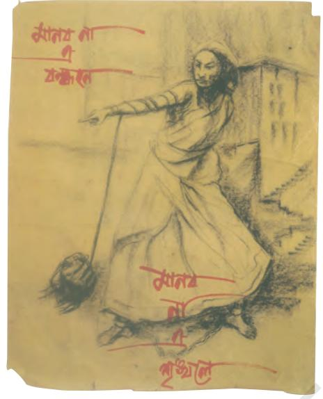

*A poster from Bengal affirming women's strength.* 

© Zuban

*Sexual division of labour:* A system in which all work inside the home is either done by the women of the family, or organised by them through the domestic helpers.

Let us begin with gender division. This is a form of hierarchical social division seen everywhere, but is rarely recognised in the study of politics. The gender division tends to be understood as natural and unchangeable. However, it is not based on biology but on social expectations and stereotypes.

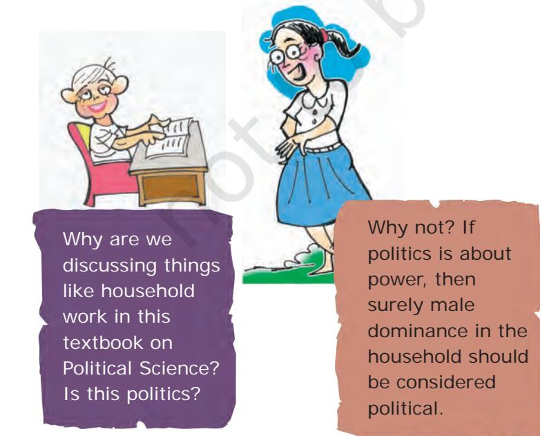

## **Public/private division**

Boys and girls are brought up to believe that the main responsibility of women is housework and bringing up children. This is reflected in a sexual division of labour in most families: women do all work inside the home such as cooking, cleaning, washing clothes, tailoring, looking after children, etc., and men do all the work outside the home. It is not that men cannot do housework; they simply think that it is for women to attend to these things. When these jobs are paid for, men are ready to take up these works. Most tailors or cooks in hotels are men. Similarly, it is not that women do not work outside their home. In villages, women fetch water, collect fuel and work in the fields. In urban areas, poor women work as domestic helper in middle class homes, while middle class women work in offices. In fact, the majority of women do some sort of paid work in addition to domestic labour. But their work is not valued and does not get recognition.

The result of this division of labour is that although women constitute half of the humanity, their role in public life, especially politics, is minimal in most societies. Earlier, only men were allowed to participate in public affairs, vote and contest for public offices. Gradually the gender issue was raised in politics. Women in different parts of the world organised and agitated for equal rights. There were agitations in different countries for the extension of voting rights to women.

Democratic Politics

Chapter 3.indd 30 08-04-2022 14:15:13

T h ese agi tati on s d eman ded enhancing the political and legal status of women and improving their educational and career opportunities. More radical women's movements aimed at equality in personal and family life as well. These movements are called feminist movements.

Political expression of gender division and political mobilisation on this question helped to improve women's role in public life. We now find women working as scientists, doctors, engineers, lawyers, managers and college and university teachers which were earlier not considered suitable for women. In some parts of the world, for example in Scandinavian countries, such as Sweden, Norway and Finland, the

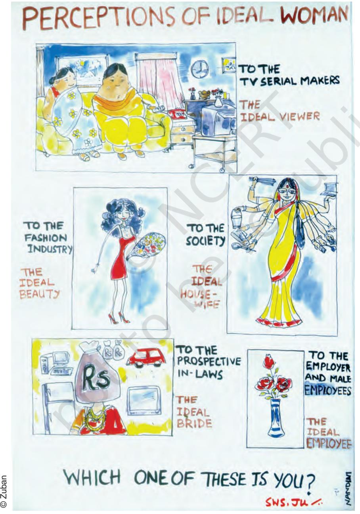

*Discuss all these perceptions of an ideal woman that prevail in our society. Do you agree with any of these? If not, what is your image of an ideal woman?*

*Feminist:* A woman or a man who believes in equal rights and opportunities for women and men.

31

Chapter 3.indd 31 08-04-2022 14:15:18

participation of women in public life is very high.

In our country, women still lag much behind men despite some improvement since Independence. Ours is still a male-dominated, patriarchal society. Women face disadvantage, discrimination and oppression in various ways:

 The literacy rate among women is only 54 per cent compared with 76 per cent among men. Similarly, a smaller proportion of girl students go for higher studies. When we

**+**

A 'time use survey' was conducted in six states of our country. It shows that an average woman works every day for a little over seven and half hours while an average man works for six and a half hours. Yet the work done by men is more visible because most of their work leads to generation of income. Women also do a lot of direct income generating work, but the bulk of their work is household related. This work remains unpaid and invisible.

# **Daily time use (hours: minutes)**

| Activities | Men | Women |
| --- | --- | --- |
| Income generating work | 6:00 | 2:40 |
| Household and related work | 0:30 | 5:00 |
| Talking, Gossip | 1:25 | 1:20 |
| No work/ Leisure | 3:40 | 3:50 |
| Sleep, self-care, reading etc. | 12:25 | 11:10 |

Source: Government of India, *Time Use Survey*, 1998-99.

You can conduct a similar time use survey in your own household. Observe all the adult male and female members of your family for one week. Every day note down the number of hours each of them spends on the following activities: income generating activity (working at the office or shop or factory or field, etc.), household related activity (cooking, cleaning, washing, fetching water, looking after children or elders, etc.), reading and recreation, talking/gossiping, self-care, taking rest or sleeping. If necessary make new categories. Add up the time taken on each activity for a week and calculate the daily average for each activity for each member. Do women work more in your family as well?

*Patriarchy:* Literally, rule by father, this concept is used to refer to a system that values men more and gives them power over women.

Chapter 3.indd 32 08-04-2022 14:15:18

look at school results, girls perform as well as boys, if not better in some places. But they drop out because parents prefer to spend their resources for their boys' education rather than spending equally on their sons and daughters.

 No wonder the proportion of women among the highly paid and valued jobs, is still very small. On an average, an Indian woman works one hour more than an average man every day. Yet much of her work is not paid and therefore, often not valued.

 The Equal Remuneration Act, 1976 provides that equal wages should be paid to equal work. However in almost all areas of work, from sports and cinema, to factories and fields, women are paid less than men, even when both do exactly the same work.

 In many parts of India, parents prefer to have sons and find ways to have the girl child aborted before she is born. Such sex-selective abortion led to a decline in child sex ratio (number of girl children per thousand boys) in the country to merely 919. As the map shows, this Mummy always says to outsiders: "I don't work. I am a housewife." But I see her working non-stop all the time. If what she does is not work, what else is work?

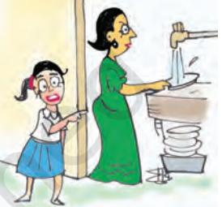

*Can you identify your State on this map? What is the child sex ratio in it? How is it different from others with a different colour?*

*Identify the States which have child sex ratio below 900.*

*Compare this map with the poster on the next page. How do the two of them tell us about the same issue?*

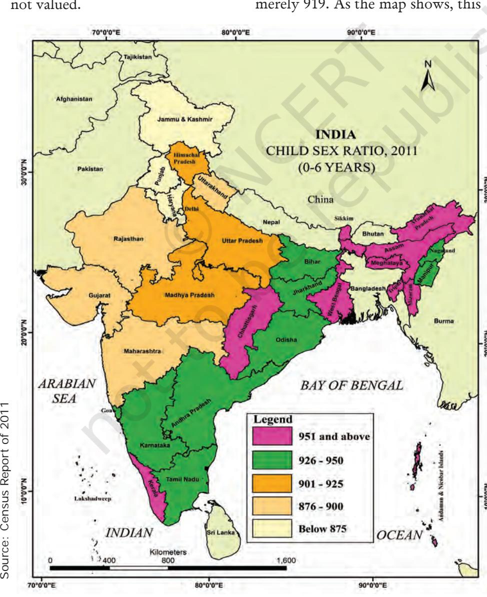

G e n d e r , R e l i g i o n a n d C a s t

 e

Chapter 3.indd 33 08-04-2022 14:15:25

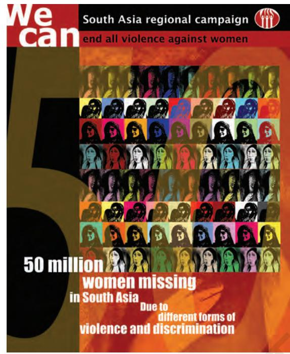

ratio has fallen below 850 or even 800 in some States.

There are reports of various kinds of harassment, exploitation and violence against women. Urban areas have become particularly unsafe for women. They are not safe even within their own home from beating, harassment and other forms of domestic violence.

# **Women's political representation**

All this is well known. Yet issues related to women's well being or otherwise are not given adequate attention. This has led many feminists and women's movements to the conclusion that unless women control power, their problems will not get adequate attention. One way to ensure this is to have more women as elected representatives.

In India, the proportion of women in legislature has been very low. For example, the percentage of elected women members in Lok Sabha has touched 14.36 per cent of its total strength for the first time in 2019. Their share in the state assemblies is less than 5 per cent. In this respect, India is among the

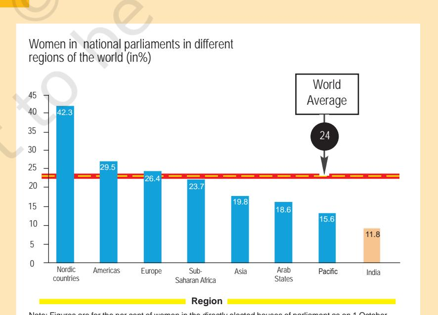

Note: Figures are for the per cent of women in the directly elected houses of parliament as on 1 October 2018.

Source: http://archive.ipu.org/wmn-e/world.htm

*Could you think of some reasons why women's representation is so low in India? Do you think Americas and Europe have achieved a satisfactory level of women's representation?*

© Oxfam GB

Chapter 3.indd 34 08-04-2022 14:15:28

bottom group of nations in the world (see the graph below). India is behind the averages for several developing countries of Africa and Latin America. In the government, cabinets are largely all-male even when a woman becomes the Chief Minister or the Prime Minister.

One way to solve this problem is to make it legally binding to have a fair proportion of women in the elected bodies. This is what the Panchayati Raj has done in India. One-third of seats in local government bodies – in panchayats and municipalities – are now reserved for women. Now there are more than 10 lakh elected women representatives in rural and urban local bodies.

Women's organizations and activists had been demanding a similar reservation of at least onethird of seats in Lok Sabha and State Assemblies for women. A bill with this proposal was pending before the Parliament for many decades. In 2023, Nari shakti Vandan Adhiniyam (Womens' Reservation Act, 2023) has been passed which will give 33 percent reservation of seats for women in Lok Sabha, State Legislative Assemblies and also Delhi Assembly.

Gender division is an example that some form of social division needs to be expressed in politics. This also shows that disadvantaged groups do benefit when social divisions become a political issue. Do you think that women could have made the gains we noted above if their unequal treatment was not raised in the political domain?

If casteism and communalism are bad, what makes feminism a good thing? Why don't we oppose all those who divide the society on any lines – caste, religion or gender?

Chapter 3.indd 35 02/04/2024 11:57:11

# **Religion, communalism and politics**

Let us now turn to a very different kind of social division, the division based on religious differences. This division is not as universal as gender, but religious diversity is fairly widespread in the world today. Many countries including India have in their population, followers of different religions. As we noticed in the case of Northern Ireland, even when most of the people belong to the same religion, there can be serious differences about the way people practice that religion. Unlike gender differences, the religious differences are often expressed in the field of politics.

Consider the following:

 Gandhiji used to say that religion can never be separated from politics. What he meant by religion was not any particular religion like Hinduism or Islam but moral values that inform all religions. He believed that politics must be guided by ethics drawn from religion.

 Human rights groups in our country have demanded that the Government should take special steps to prevent communal riots and protect religious minorities.

 Women's movement has argued that family laws of all religions discriminate against women. So they have demanded that government should change these laws to make them more equitable.

All these instances involve a relationship between religion and politics. But they do not seem very wrong or dangerous. Ideas, ideals and values drawn from different religions can and perhaps should play a role in politics. People should be able to express in politics their needs, interests and demands as a member of a religious community. Those who hold political power should sometimes be able to regulate the practice of religion so as to prevent discrimination and oppression. These political acts are not wrong as long as they treat every religion equally.

#### **Communalism**

The problem begins when religion is seen as the basis of the nation. The example of Northern Ireland in Chapter 3 shows the dangers of such an approach to nationalism. The problem becomes more acute when religion is expressed in politics in exclusive and partisan terms, when one religion and its followers are pitted against another. This happens when beliefs of one religion are presented as superior to those of other religions, when the demands of one religious group are formed in opposition to another and when state power is used to establish domination of one religious group over the rest. This manner of using religion in politics is communal politics.

Communal politics is based on the idea that religion is the principal basis of social community. Communalism involves thinking

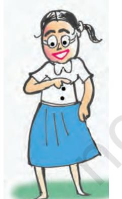

I am not religious. Why should I bother about communalism and secularism?

Democratic Politics

Chapter 3.indd 36 02/04/2024 11:58:46

along the following lines. The followers of a particular religion must belong to one community. Their fundamental interests are the same. Any difference that they may have is irrelevant or trivial for community life. It also follows that people who follow different religions cannot belong to the same social community. If the followers of different religions have some commonalities these are superficial and immaterial, their interests are bound to be different and involve a conflict. In its extreme form, communalism leads to the belief that people belonging to different religions cannot live as equal citizens within one nation. Either, one of them has to dominate the rest or they have to form different nations.

This belief is fundamentally flawed. People of one religion do not have the same interests and aspirations in every context. Everyone has several other roles, positions and identities. There are many voices inside every community. All these voices have a right to be heard. Therefore any attempt to bring all followers of one religion together in context other than religion is bound to suppress many voices within that community.

Communalism can take various forms in politics:

 The most common expression of communalism is in everyday beliefs. These routinely involve religious prejudices, stereotypes of religious communities and belief in the superiority of one's religion over other religions. This is so common that we often fail to notice it, even when we believe in it.

 A communal mind often leads to a quest for political dominance of one's own religious community. For those belonging to majority community, this takes the form of majoritarian dominance. For those belonging to the minority community, it can take the form of a desire to form a separate political unit.

 Political mobilisation on religious lines is another frequent form of communalism. This involves the use of sacred symbols, religious leaders, emotional appeal and plain fear in order to bring the followers of one religion together in the political arena. In electoral politics, this often involves special appeal to the interests or emotions of voters of one religion in preference to others.

 Sometimes communalism takes its most ugly form of communal violence, riots and massacre. India and Pakistan suffered some of the worst communal riots at the time of the Partition. The post-Independence period has also seen large scale communal violence.

#### **Secular state**

Communalism was and continues to be one of the major challenges to democracy in our country. The makers of our Constitution were aware of this challenge. That is why, they chose the model of a secular state. This choice was reflected in several constitutional provisions that we studied last year:

 There is no official religion for the Indian state. Unlike the status of Buddhism in Sri Lanka, that of Islam I often crack jokes about people from one religion. Does that make me communal?

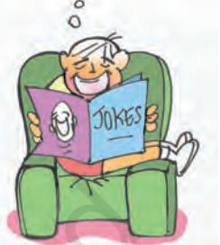

*Family laws:* Those laws that deal with family related matters such as marriage, divorce, adoption, inheritance, etc. In our country, different family laws apply to followers of different religions.

Chapter 3.indd 37 08-04-2022 14:15:31

in Pakistan and that of Christianity in England, our Constitution does not give a special status to any religion.

 The Constitution provides to all individuals and communities freedom to profess, practice and propagate any religion, or not to follow any.

 The Constitution prohibits discrimination on grounds of religion.

 At the same time, the Constitution allows the state to intervene in the matters of religion in order to ensure equality within religious communities. For example, it bans untouchability.

Understood in this sense, secularism is not just an ideology of some parties or persons. This idea constitutes one of the foundations of our country. Communalism should not be seen as a threat to some people in India. It threatens the very idea of India. That is why communalism needs to be combated. A secular Constitution like ours is necessary but not sufficient to combat communalism. Communal prejudices and propaganda need to be countered in everyday life and religion- based mobilisation needs to be countered in the arena of politics.

# **Caste and politics**

We have seen two instances of the expression of social divisions in the arena of politics, one largely positive and the other largely negative. Let us turn to our final case, that of caste and politics, that has both positive and the negative aspects.

#### **Caste inequalities**

Unlike gender and religion, caste division is special to India. All societies have some kind of social inequality and some form of division of labour. In most societies, occupations are passed on from one generation to another. Caste system is an extreme form of this. What makes it different from other societies is that in this system, hereditary occupational division was sanctioned by rituals. Members of the same caste group were supposed to form a social community that practiced the same or similar occupation, married within the caste group and did not eat with members from other caste groups.

Caste system was based on exclusion of and discrimination against the 'outcaste' groups. They were subjected to the inhuman practice of untouchability about which you have studied in Class IX. That is why political leaders and social reformers like Jotiba Phule, Gandhiji, B.R. Ambedkar and Periyar Ramaswami Naicker advocated and worked to establish a society in which caste inequalities are absent.

Partly due to their efforts and partly due to other socio-economic changes, castes and caste system in modern India have undergone great changes. With economic d e v e l o p m e n t , l a r g e s c a l e urbanisation, growth of literacy and education, occupational mobility and the weakening of the position of landlords in the villages, the old notions of caste hierarchy are breaking down. Now, most of the

Chapter 3.indd 38 08-04-2022 14:15:31

# Social and Religious Diversity of India

The Census of India records the religion of each and every Indian after every ten years. The person who fills the Census form visits every household and records the religion of each member of that household exactly the way each person describes it. If someone says she has 'no religion' or that he is an 'atheist', this is exactly how it is recorded. Thus we have reliable information on the proportion of different religious communities in the country and how it has changed over the years. The pie chart below presents the population proportion of six major religious communities in the country. Since Independence, the total population of each community has increased substantially but their proportion in the country's population has not changed much. In percentage terms, the population of the Hindus, Jains and Christians has declined marginally since 1961. The proportion of Muslim, Sikh and Buddhist population has increased slightly. There is a common but mistaken impression that the proportion of the Muslims in the country's population is going to overtake other religious communities. Expert estimates done for the Prime Minister's High Level Committee (popularly known as Sachar Committee) show that the proportion of the Muslims is expected to go up a little, by about 3 to 4 per cent, in the next 50 years. It proves that in overall terms, the population balance of different religious communities is not likely to change in a big way.

The same is true of the major caste groups. The Census of India counts two social groups: the Scheduled Castes and the Scheduled Tribes. Both these broad groups include hundreds of castes or tribes whose names are listed in an official Schedule. Hence the prefix 'Scheduled' in their name. The Scheduled Castes, commonly known as *Dalits*, include those that were previously regarded as 'outcaste' in the Hindu social order and were subjected to exclusion and untouchability. The Scheduled Tribes, often referred to as *Adivasis*, include those communities that led a secluded life usually in hills and forests and did not interact much with the rest of society. In 2011, the Scheduled

Castes were 16.6 per cent and the Scheduled Tribes were 8.6 per cent of the country's population.

The Census does not yet count the Other Backward Classes, the group we discussed in Class IX. Hence there are some differences about their proportion in the country's population. The National Sample Survey of 2004–05 estimates their population to be around 41 per cent. Thus the SC, ST and the OBC together account for about two-thirds of the country's population and about three-fourths of the Hindu population.

# Population of different religious communities in India, 2011

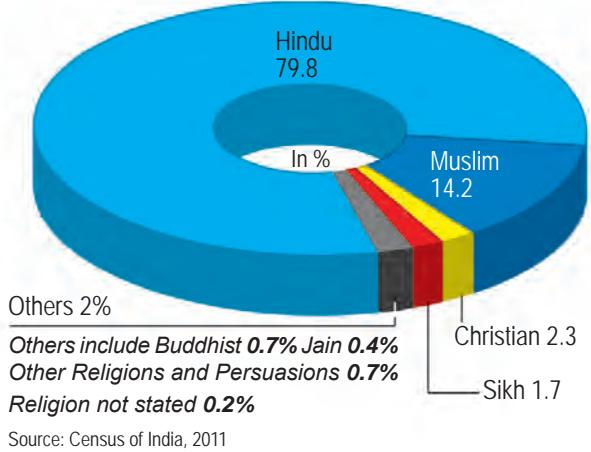

Chapter 3.indd 39 08-04-2022 14:15:31

I don't care what my caste is. Why are we discussing all this in the textbook? Are we not promoting casteism by talking about caste?

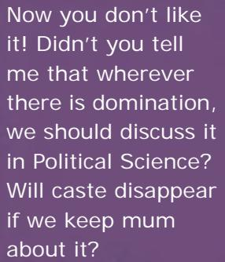

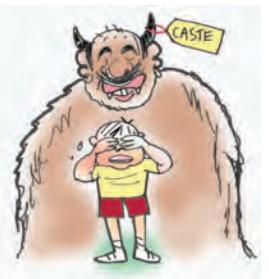

times, in urban areas it does not matter much who is walking along next to us on a street or eating at the next table in a restaurant. The Constitution of India prohibited any caste-based discrimination and laid the foundations of policies to reverse the injustices of the caste system. If a person who lived a century ago were to return to India, she would be greatly surprised at the change that has come about in the country.

Yet caste has not disappeared from contemporary India. Some of the older aspects of caste have persisted. Even now most people marry within their own caste or tribe. Untouchability has not ended completely, despite constitutional prohibition. Effects of centuries of advantages and disadvantages continue to be felt today. The caste groups that had access to education under the old system have done very well in acquiring modern education as well. Those groups that did not have access to education or were prohibited from acquiring it have naturally lagged behind. That is why there is a disproportionately large presence of 'upper caste' among the urban middle classes in our country. Caste continues to be closely linked to economic status. (See Plus Box on Page 41.)

# **Caste in politics**

As in the case of communalism, casteism is rooted in the belief that caste is the sole basis of social community. According to this way of thinking, people belonging to the same caste belong to a natural social community and have the same interests which they do not share with anyone from another caste. As we saw in the case of communalism, such a belief is not borne out by our experience. Caste is one aspect of our experience but it is not the only relevant or the most important aspect.

Caste can take various forms in politics:

 When parties choose candidates in elections, they keep in mind the caste composition of the electorate and nominate candidates from different castes so as to muster necessary support to win elections. When governments are formed, political parties usually take care that representatives of different castes and tribes find a place in it.

 Political parties and candidates in elections make appeals to caste sentiment to muster support. Some political parties are known to favour some castes and are seen as their representatives.

 Universal adult franchise and the principle of one-person-one-vote

#### *Urbanisation:* Shift of population from rural areas to urban areas. *Occupational mobility:* Shift from one occupation to another, usually when a new generation takes up

occupations other than those practiced by their ancestors. *Caste hierarchy:* A ladder-like formation in which all the caste groups are placed from the 'highest' to the 'lowest' castes.

Chapter 3.indd 40 08-04-2022 14:15:32

# Caste inequality today

Caste is an important source of economic inequality because it regulates access to resources of various kinds. For example, in the past, the so-called 'untouchable' castes were denied the right to own land, while only the so-called 'twice born' castes had the right to education. Although this kind of explicit and formalised inequality based on caste is now outlawed, the effects of centuries of accumulated advantages and disadvantages continue to be felt. Moreover, new kinds of inequalities have also developed.

The relationship between caste and economic status has certainly changed a lot. Today, it is possible to find very rich and very poor people in every caste, whether 'low' or 'high'. This was not true even twenty or thirty years ago – it was very rare indeed to find rich people among the 'lowest' castes. However, as this evidence from the National Sample Survey shows, caste continues to be very strongly linked to economic status in many important ways:

 The average economic status (measured by criteria like monthly consumption expenditure) of caste groups still follows the old hierarchy – the 'upper' castes are best off, the *Dalits* and *Adivasis* are worst off, and the backward classes are in between.

 Although every caste has some poor members, the proportion living in extreme poverty (below the official 'poverty line') is much higher for the lowest castes and much lower for the upper castes, with the backward classes once again in between.

 Although every caste has some members who are rich, the upper castes are heavily over-represented among the rich while the lower castes are severely under-represented.

| Caste and Community groups | Rural | Urban |
| --- | --- | --- |
| Scheduled Tribes | 45.8 | 35.6 |
| Scheduled Castes | 35.9 | 38.3 |
| Other Backward Classes | 27.0 | 29.5 |
| Muslim Upper Castes | 26.8 | 34.2 |
| Hindu Upper Castes | 11.7 | 9.9 |
| Christian Upper Castes | 9.6 | 5.4 |
| Sikh Upper Castes | 0.0 | 4.9 |
| Other Upper Castes | 16.0 | 2.7 |
| All Groups | 27.0 | 23.4 |

#### **Percentage of population living below the poverty line, 1999–—***—***2000**

Note: 'Upper Caste' here means those who are not from SC, ST, or OBC. Below the poverty line means those who spent `327 or less per person per month in rural and `454 or less per person per month in urban areas.

Source: *National Sample Survey Organisation (NSSO), Government of India,* 55th *Round*, 1999–2000

Chapter 3.indd 41 08-04-2022 14:15:32

compelled political leaders to gear up to the task of mobilising and securing political support. It also brought new consciousness among the people of castes that were hitherto treated as inferior and low.

The focus on caste in politics can sometimes give an impression that elections are all about caste and nothing else. That is far from true. Just consider these:

 No parliamentary constituency in the country has a clear majority of one single caste. So, every candidate and party needs to win the confidence of more than one caste and community to win elections.

 No party wins the votes of all the voters of a caste or community. When people say that a caste is a 'vote bank' of one party, it usually means that a large proportion of

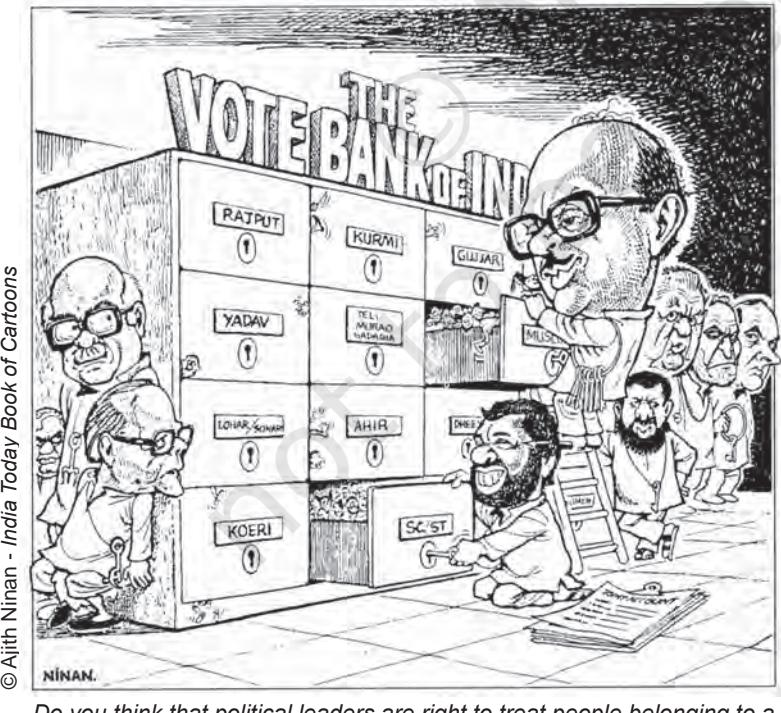

*Do you think that political leaders are right to treat people belonging to a caste as 'vote banks'?*

the voters from that caste vote for that party.

 Many political parties may put up candidates from the same caste (if that caste is believed to dominate the electorate in a particular constituency). Some voters have more than one candidate from their caste while many voters have no candidate from their caste.

 The ruling party and the sitting MP or MLA frequently lose elections in our country. That could not have happened if all castes and communities were frozen in their political preferences.

Clearly, while caste matters in electoral politics, so do many other factors. The voters have strong attachment to political parties which is often stronger than their attachment to their caste or community. People within the same caste or community have different interests depending on their economic condition. Rich and poor or men and women from the same caste often vote very differently. People's assessment of the performance of the government and the popularity rating of the leaders matter and are often decisive in elections.

# **Politics in caste**

We have so far looked at what caste does to politics. But it does not mean that there is only a one-way relation between caste and politics. Politics too influences the caste system and caste identities by bringing them into the political arena. Thus, it is not politics that gets caste-ridden, it

Democratic Politics

Chapter 3.indd 42 08-04-2022 14:15:32

is the caste that gets politicised. This takes several forms:

 Each caste group tries to become bigger by incorporating within it neighbouring castes or sub-castes which were earlier excluded from it.

 Various caste groups are required to enter into a coalition with other castes or communities and thus enter into a dialogue and negotiation.

 New kinds of caste groups have come up in the political arena like 'backward' and 'forward' caste groups.

Thus, caste plays different kinds of roles in politics. In some situations, expression of caste differences in politics gives many disadvantaged communities the space to demand their share of power. In this sense, caste politics has helped people from *Dalits* and OBC castes to gain better access to decision making. Several political and non-political organisations have been demanding and agitating for an end to discrimination against particular castes, for more dignity and more access to land, resources and opportunities.

At the same time, exclusive attention to caste can produce negative results as well. As in the case of religion, politics based on caste identity alone is not very healthy in a democracy. It can divert attention from other pressing issues like poverty, development and corruption. In some cases, caste division leads to tensions, conflict and even violence.

Chapter 3.indd 43 19/03/2024 10:44:04

- 1. Mention different aspects of life in which women are discriminated or disadvantaged in India.
- 2. State different forms of communal politics with one example each.
- 3. State how caste inequalities are still continuing in India.
- 4. State two reasons to say that caste alone cannot determine election results in India.
- 5. What is the status of women's representation in India's legislative bodies?
- 6. Mention any two constitutional provisions that make India a secular state.
- 7. When we speak of gender divisions, we usually refer to:
	- (a) Biological difference between men and women
	- (b) Unequal roles assigned by the society to men and women
	- (c) Unequal child sex ratio
	- (d) Absence of voting rights for women in democracies
- 8. In India seats are reserved for women in
	- (a) Lok Sabha
	- (b) State legislative assemblies
	- (c) Cabinets
	- (d) Panchayati Raj bodies
- 9. Consider the following statements on the meaning of communal politics. Communal politics is based on the belief that:
	- A. One religion is superior to that of others.
	- B. People belonging to different religions can live together happily as equal citizens.
	- C. Followers of a particular religion constitute one community.
	- D. State power cannot be used to establish the domination of one religious group over others.

Which of the statements are correct?

(a) A, B, C, and D (b) A, B, and D (c) A and C (d) B and D

- 10. Which among the following statements about India's Constitution is wrong? It
	- (a) prohibits discrimination on grounds of religion.
	- (b) gives official status to one religion.
	- (c) provides to all individuals freedom to profess any religion.
	- (d) ensures equality of citizens within religious communities.
- 11. Social divisions based on _________ are peculiar to India.

Democratic Politics **Exercises**

Chapter 3.indd 44 08-04-2022 14:15:36

- 12. Match List I with List II and select the correct answer using the codes given below the Lists:

|  | List I | List II |
| --- | --- | --- |
| 1. | A person who believes in equal rights and |  |
|  | opportunities for women and men | A. Communalist |
| 2. | A person who says that religion is the |  |
|  | principal basis of community | B. Feminist |
| 3. | A person who thinks that caste is the |  |
|  | principal basis of community | C. Secularist |
| 4. | A person who does not discriminate others |  |
|  | on the basis of religious beliefs | D. Castiest |

|  | 1 | 2 | 3 | 4 |
| --- | --- | --- | --- | --- |
| (a) | B | C | A | D |
| (b) | B | A | D | C |
| (c) | D | C | A | B |
| (d) | C | A | B | D |

**Exercises**

Chapter 3.indd 45 08-04-2022 14:15:36

G e n d e r , R e l i g i o n a n d C a s t e

