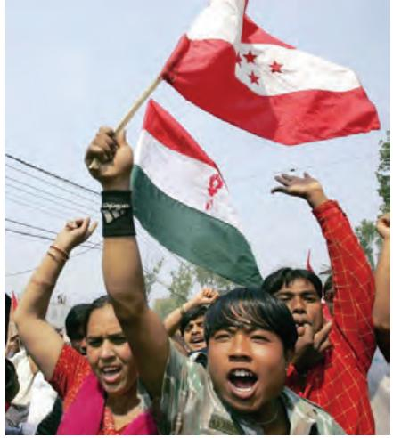

# Unit One

Social and Political Life 2

### Teacher's Note

The Indian Constitution has been regularly referred to in the previous two *Social and Political Life* textbooks. Unlike the previous two books, where little space was devoted to discussing the Constitution itself, this year the chapters in Unit 1 take the Constitution as its main focus.

Chapter 1 begins with a discussion of the principles that underlie a liberal constitution. Three short storyboards have been used to familiarise the student with the ideas that are being discussed. The storyboards use incidents located within a classroom-setting to illustrate three complex constitutive principles. The storyboards should be used to aid the student's understanding of these constitutive principles.

The discussion on the Indian Constitution is situated within a historical context. This has been done with the express intent that students become aware of the major influence that our anti-colonial struggle had on Indian democracy. In discussing the Constitution, we have had to use several new, and often difficult terms, to explain certain key features. While teaching these, please keep in mind that the student will continue to study these key features in greater depth in higher classes. Therefore, the attempt here is to familiarise the student with a very basic understanding of the significance of these features within the working of democracy in India.

Chapter 2 discusses secularism. The most prevalent definition of secularism is that it refers to the separation between Religion and the State. The chapter uses this definition as the foundation and then proceeds to elucidate two complicated ideas: the first points to why this separation is important and the second to what is particular to Indian secularism.

There are two main reasons why the separation between Religion and State is important. The first is to prevent the domination of one religion over another, i.e. *inter-religious* domination. The second is to oppose the various types of domination that can happen within a religion, i.e. *intra-religious* domination. For example, the chapter discusses untouchability in Hindu religious practice which allowed 'upper castes' to dominate members of some 'lower castes'. Secularism's opposition to institutionalised religion means that it promotes freedom and equality between and within religions.

The second major conceptual idea that the chapter deals with is the unique nature of Indian secularism. Indian secularism does protect the religious freedom of individuals by maintaining a separation from religion. But it also provides room for the reform of religions, for example, the abolishing of untouchability, child marriage, etc. Therefore, in its attempt to achieve religious equality (both between as well as within religions) the Indian secular State both maintains a separation as well as intervenes in religion. This intervention can either be in terms of a ban (like that on untouchability) or in terms of providing assistance to religious minorities. The chapter explains this and refers to it as 'principled distance'. This means that any interference in religion by the State has to be based on the ideals laid out in the Constitution.

Several of the above points are quite complex. It is crucial that you understand these points clearly before teaching this chapter. It is very likely that students will come up with several suggestions for why the government should intervene or not intervene in religious affairs. While discussion is to be encouraged, it is important to mediate this and ensure that it does not reinforce stereotypes of religious minorities.

## Chapter 1

Social and Political Life 4

## **The Indian Constitution**

In this chapter, we are going to begin with football, a game many of you have probably heard of, or even played. As the name suggests, this is a game that involves the players' feet. According to the rules of football, if the ball touches the arm of any player (except the goalkeeper), then this is considered a foul. So if players start holding the football in their hands and passing it around, then they are not playing football any more. Similarly other games, such as hockey or cricket, also have rules according to which they are played. Each of these rules helps define the game, and helps us distinguish one game from another. As these are fundamental to the game, we can also call them the constitutive rules of the game. Like these games, a society also has constitutive rules that make it what it is and differentiate it from other kinds of societies. In large societies in which different communities of people live together, these rules are formulated through consensus, and in modern countries this consensus is usually available in written form. A written document in which we find such rules is called a Constitution.

We have looked at the Indian Constitution in Classes VI and VII in our *Social and Political Life* textbooks. Have you ever wondered why we need a Constitution or been curious about how the Constitution got written, or who wrote it? In this chapter, we will discuss both these issues and also look at the key features of the Indian Constitution. Each of these features is crucial to the working of democracy in India and some of these will be the focus of different chapters in this book.

### **Why Does a Country Need a Constitution?**

Today most countries in the world have a Constitution. While all democratic countries are likely to have a Constitution, it is not necessary that all countries that have a Constitution are democratic. The Constitution serves several purposes. First, it lays out certain ideals that form the basis of the kind of country that we as citizens aspire to live in. Or, put another way, a Constitution tells us what the fundamental nature of our society is. A country is usually made up of different communities of people who share certain beliefs but may not necessarily agree on all issues. A Constitution helps serve as a set of rules and principles that all persons in a country can agree upon as the basis of the way in which they want the country to be governed. This includes not only the type of government but also an agreement on certain ideals that they all believe the country should uphold.

In 1934, the Indian National Congress made the demand for a Constituent Assembly. During the Second World War, this assertion for an independent Constituent Assembly formed only of Indians gained momentum and this was convened in December 1946. The photo on page 2 shows some members of the Constituent Assembly.

Between December 1946 and November 1949, the Constituent Assembly drafted a constitution for independent India. Free to shape their destiny at last, after 150 years of British rule, the members of the Constituent Assembly approached this task with the great idealism that the freedom struggle had helped produce. You will read more about the work of the Constituent Assembly later in the chapter.

The photo alongside shows Prime Minister Jawaharlal Nehru addressing the Constituent Assembly.

The country of Nepal has witnessed several people's struggles for democracy. There was a people's struggle in 1990 that established democracy that lasted for 12 years until 2002. In October 2002, King Gyanendra, citing the Maoist uprising in the countryside as his reason, began taking over different aspects of the government with the army's assistance. The King then finally took over as the head of government in February 2005. In November 2005, the Maoists joined other political parties to sign a 12-point agreement. This agreement signalled to the larger public an imminent return to democracy and peace. In 2006, this people's movement for democracy began gaining immense force. It repeatedly refused the small concessions that the King made and finally in April 2006 the King restored the Third Parliament and asked the political parties to form a government. In 2008, Nepal became a democracy after abolishing the monarchy. The above photos show scenes from the people's movement for democracy in 2006.

**Discuss with your teacher what you understand by the term 'constitutive'. Provide one example of 'constitutive rules' from your everyday life.**

**Why did the people of Nepal want a new Constitution?**

Let us try and understand what we mean by this through two contrasting situations in the recent history of Nepal, a country that borders India on the north. Until recently, Nepal was a monarchy. The previous Constitution of Nepal, which had been adopted in 1990, reflected the fact that the final authority rested with the King. A people's movement in Nepal fought for several decades to establish democracy and in 2006 they finally succeeded in putting an end to the powers of the King. The people had to write a new Constitution to establish Nepal as a democracy. The reason that they did not want to continue with the previous Constitution is because it did not reflect the ideals of the country that they want Nepal to be, and that they have fought for.

As in the game of football, in which a change in the constitutive rules will change the game altogether, Nepal, by moving from a monarchy to a democratic government, needs to change all its constitutive rules in order to usher in a new society. This is why, the people of Nepal adopted a new Constitution for the country in 2015. The caption alongside elaborates Nepal's struggle for democracy.

The second important purpose of a Constitution is to define the nature of a country's political system. For example, Nepal's

Social and Political Life 6

earlier Constitution stated that the country was to be ruled by the King and his council of ministers. In countries that have adopted a democratic form of government or polity, the Constitution plays a crucial role in laying out certain important guidelines that govern decision-making within these societies.

In a democracy, we choose our leaders so that they can exercise power responsibly on our behalf. However, there is always the possibility that these leaders might misuse their authority and the Constitution usually provides safeguards against this. This misuse of authority can result in gross injustice as demonstrated in the classroom situation below:

In democratic societies, the Constitution often lays down rules that guard against this misuse of authority by our political leaders. In the case of the Indian Constitution, about which you will read more later in this chapter, many of these laws are contained in the section on Fundamental Rights. You read about how the Indian Constitution guarantees the right to equality to all persons and says that no citizen can be discriminated against on grounds of religion, race, caste, gender, and place of birth. The Right to Equality is one of the Fundamental Rights guaranteed by the Indian Constitution.

#### **1. In what way is the class monitor misusing his power?**

**2. In which of the following situations is a minister misusing his power: a) refuses to sanction a project of his ministry for sound technical reasons; b) threatens to send his security staff to rough up his neighbour; c) calls up the police station asking them not to register a complaint that is likely to be filed against his relative.**

**Who is in a minority in the above storyboard? In what way is this minority being dominated by the decision taken by the majority?**

decisions, so that our wishes are also heard. the majority. The Constitution usually contains rules that ensure that minorities are not excluded from anything that is routinely available to the majority. Another reason why we have a Constitution is precisely to prevent this tyranny or domination by the majority of a minority. This can refer to one community dominating another, i.e. inter-community domination, or members of one community dominating others within the same community, i.e. intra-community domination.

The third significant reason why we need a Constitution is to save us from ourselves. This may sound strange but what is meant by this is that we might at times feel strongly about an issue that might go against our larger interests and the Constitution helps us guard against this. Look at the storyboard below to understand this better:

Similarly, the Constitution helps to protect us against certain decisions that we might take that could have an adverse effect on the larger principles that the country believes in. For example, it is possible that many people who live in a democracy might come to strongly feel that party politics has become so acrimonious that we need a strong dictator to set this right. Swept by this emotion, they may not realise that in the long run, dictatorial rule goes against all their interests. A good Constitution does not allow these whims to change its basic structure. It does not allow for the easy overthrow of provisions that guarantee rights of citizens and protect their freedom.

From the above discussion, you will understand that the Constitution plays a very important role in democratic societies.

It's a good thing I did not watch TV. There are so many questions from the last two chapters.

**Why was Shabnam happy that she had not watched TV? What would you have done in a similar situation?**

Let us recap the reasons why the Constitution plays an important role in democratic societies by recalling the constitutive rules that you have read about through these examples:

| Example | Constitutive Rules |
| --- | --- |
| The people of Nepal adopted a new | It lays down ideals that define the kind of |
| Constitution after the success of the | country that we want to live in. |
| people's movement for democracy. |  |
| Suresh, the class monitor wrongly picks on |  |
| Anil, his classmate. |  |
| The girls do not get to play basketball | Q |
| because the boys are a majority in class. |  |
| Shabnam decides to revise her chapters |  |
| instead of watching TV. |  |

Now let us try and understand the ways in which the above points get translated into certain ideals and rules by studying some key features of the Indian Constitution.

#### **The Indian Constitution: Key Features**

By the beginning of the twentieth century, the Indian national movement had been active in the struggle for independence from British rule for several decades. During the freedom struggle the nationalists had devoted a great deal of time to imagining and planning what a free India would be like. Under the British, they had been forced to obey rules that they had had very little role in making. The long experience of authoritarian rule under the colonial state convinced Indians that free India should be a democracy in which everyone should be treated equally and be allowed to participate in government. What remained to be done then was to work out the ways in which a democratic government would be set up in India and the rules that would determine its functioning. This was done not by one person but by a group of around 300 people who became members of the Constituent Assembly in 1946 and who met periodically for the next three years to write India's Constitution.

There was an extraordinary sense of unity amongst the members of the Constituent Assembly. Each of the provisions of the future constitution was discussed in great detail and there was a sincere effort to compromise and reach an agreement through consensus. The above photo shows Sardar Vallabhbhai Patel, a prominent member of the Constituent Assembly.

These members of the Constituent Assembly had a huge task before them. The country was made up of several different communities who spoke different languages, belonged to different religions, and had distinct cultures. Also, when the Constitution was being written, India was going through considerable turmoil. The partition of the country into India and Pakistan was imminent, some of the Princely States remained undecided about their future, and the socio-economic condition of the vast mass of people appeared dismal. All of these issues played on the minds of the members of the Constituent Assembly as they drafted the Constitution. They rose to the occasion and gave this country a visionary document that reflects a respect for maintaining diversity while preserving national unity. The final document also reflects their concern for eradicating poverty through socio-economic reforms as well as emphasising the crucial role the people can play in choosing their representatives.

Listed below are the key features of the Indian Constitution. While reading these, keep in mind the above-mentioned concerns of diversity, unity, socio-economic reform and representation that the authors of this document were grappling with. Try and understand the ways in which they tried to balance these concerns with their commitment to transforming independent India into a strong, democratic society.

1. Federalism: This refers to the existence of more than one level of government in the country. In India, we have governments at the state level and at the centre. Panchayati Raj is the third tier of government and you have read about this in your Class VI book. We looked at the functioning of the state government in your Class VII book and this year we will read more about the central government.

The vast number of communities in India meant that a system of government needed to be devised that did not involve only persons sitting in the capital city of New Delhi and making

Baba Saheb Dr Ambedkar is known as the Father of the Indian Constitution. Dr Ambedkar believed that his participation in the Constituent Assembly helped the Scheduled Castes get some safeguards in the draft constitution. But he also stated that although the laws might exist, Scheduled Castes still had reason to fear because the administration of these laws were in the hands of 'caste Hindu officers'. He, therefore, urged Scheduled Castes to join the government as well as the civil services.

When the Constituent Assembly adopted the principle of universal adult franchise, Shri A.K. Ayyar, a member, remarked that this was done, "with an abundant faith in the common man and the ultimate success of democratic rule, and in the full belief that the introduction of democratic government on the basis of adult suffrage will bring enlightenment and promote the well-being, the standard of life, the comfort, and the decent living of the common man".

Austin, G. 1966. The Indian Constitution: Cornerstone of a Nation. Clarendon Press, Oxford.

The photo below shows people standing in line to cast their votes.

decisions for everyone. Instead, it was important to have another level of government in the states so that decisions could be made for that particular area. While each state in India enjoys autonomy in exercising powers on certain issues, subjects of national concern require that all of these states follow the laws of the central government. The Constitution contains lists that detail the issues that each tier of government can make laws on. In addition, the Constitution also specifies where each tier of government can get the money from for the work that it does. Under federalism, the states are not merely agents of the federal government but draw their authority from the Constitution as well. All persons in India are governed by laws and policies made by each of these levels of government.

2. Parliamentary Form of Government: The different tiers of government that you just read about consist of representatives who are elected by the people. Your Class VII book began with the story of Kanta who was standing in line to vote during an election. The

Constitution of India guarantees universal adult suffrage for all citizens. When they were making the Constitution, the members of the Constituent Assembly felt that the freedom struggle had prepared the masses for universal adult suffrage and that this would help encourage a democratic mindset and break the clutches of traditional caste, class and gender hierarchies. This means that the people of India have a direct role in electing their representatives. Also, every citizen of the country, irrespective of his/her social background, can also contest in elections. These representatives are accountable to the people. You will read more about why representation is crucial to democratic functioning in Unit 2 of this book.

3. Separation of Powers: According to the Constitution, there are three organs of government. These are the legislature, the executive and the judiciary. The legislature refers to our elected representatives. The executive is a smaller group of people who are responsible for implementing laws and running the government. The judiciary, of which you will read more in Unit 3 of this book, refers to the system of courts in this country. In order to prevent the misuse of power by any one branch of government, the Constitution says that each of these organs should exercise different powers. Through this, each organ acts as a check on the other organs of government and this ensures the balance of power between all three.

The word 'State' is often used in this chapter. This does NOT refer to state governments. Rather when we use State, we are trying to distinguish it from 'government'. 'Government' is responsible for administering and enforcing laws. The government can change with elections. The State on the other hand refers to a political institution that represents a sovereign people who occupy a definite territory. We can, thus, speak of the Indian State, the Nepali State etc. The Indian State has a democratic form of government. The government (or the executive) is one part of the State. The State refers to more than just the government and cannot be used interchangeably with it.

Members of the Constituent Assembly feared that the executive might become too strong and ignore its responsibility to the legislature. The Assembly, therefore, included a number of provisions in the Constitution to limit and control the action taken by the executive branch of government as a whole.

**Discuss the difference between State and Government with your teacher.**

#### **The Fundamental Rights in the Indian Constitution include:**

1. **Right to Equality:** All persons are equal before the law. This means that all persons shall be equally protected by the laws of the country. It also states that no citizen can be discriminated against on the basis of their religion, caste or sex. Every person has access to all public places including playgrounds, hotels, shops etc. The State cannot discriminate against anyone in matters of employment. But there are exceptions to this that you will read about later in this book. The practice of untouchability has also been abolished.

2. **Right to Freedom:** This includes the right to freedom of speech and expression, the right to form associations, the right to move freely and reside in any part of the country, and the right to practise any profession, occupation or business. 3. **Right against Exploitation:** The Constitution prohibits human trafficking, forced labour, and employment of children under 14 years of age.

4. **Right to Freedom of Religion:** Religious freedom is provided to all citizens. Every person has the right to practise, profess and propagate the religion of their choice.

5. **Cultural and Educational Rights:** The Constitution states that all minorities, religious or linguistic, can set up their own educational institutions in order to preserve and develop their own culture.

6. **Right to Constitutional Remedies:** This allows citizens to move the court if they believe that any of their Fundamental Rights have been violated by the State.

4. Fundamental Rights: The section on Fundamental Rights has often been referred to as the 'conscience' of the Indian Constitution. Colonial rule had created a certain suspicion of the State in the minds of the nationalists and they wanted to ensure that a set of written rights would guard against the misuse of State power in independent India. Fundamental Rights, therefore, protect citizens against the arbitrary and absolute exercise of power by the State. The Constitution, thus, guarantees the rights of individuals against the State as well as against other individuals.

Moreover, the various minority communities also expressed the need for the Constitution to include rights that would protect their groups. The Constitution, therefore, also guarantees the rights of minorities against the majority. As Dr Ambedkar has said about these Fundamental Rights, their object is two-fold. The first objective is that every citizen must be in a position to claim those rights. And secondly, these rights must be binding upon every authority that has got the power to make laws.

In addition to Fundamental Rights, the Constitution also has a section called Directive Principles of State Policy. This section was designed by the members of the Constituent Assembly to ensure greater social and economic reforms, and to serve as a guide to the independent Indian State to institute laws and policies that help reduce the poverty of the masses.

**Which Fundamental Rights will the following situations violate:**

- **If a 13-year old child is working in a factory manufacturing carpets.**
- **If a politician in one state decides to not allow labourers from other states to work in his state.**
- **If a group of people are not given permission to open a Telugu-medium school in Kerala.**
- **If the government decides not to promote an officer of the armed forces for being a woman.**

Social and Political Life 14

5. Secularism: A secular state is one in which the state does not officially promote any one religion as the state religion. We will read more about this in the following chapter.

You now understand the ways in which a country's history often determines the kind of Constitution that a country adopts for itself. The Constitution plays a crucial role in laying out the ideals that we would like all citizens of the country to adhere to, including the representatives that we elect to rule us. Just like in the game of football, a change of constitutive rules will affect the game. Indian Constitution has been amended over the years to reflect new concerns of the polity. Often a major change in the Constitution means a change in the fundamental nature of the country. We saw this in the case

of Nepal and how it needed to adopt a new Constitution after it became a democracy.

The different features of the Indian Constitution outlined above, involve complicated ideas that are often not easy to grasp. Don't worry too much about this for the moment. In the rest of the book as well as in your higher classes, you will read more about these different features of the Indian Constitution and understand more substantively what they mean.

**The Constitution also mentions Fundamental Duties. Find out with the help of your teacher what these include and why it is important for citizens in a democracy to observe these.**

Illustrate each of the 11 Fundamental Duties with drawings, pictures, poems or songs and discuss them in the classroom.

The above photos show various members of the Constituent Assembly signing a copy of the Constitution at its final session on 24 January 1950. The first photo (from top) shows Prime Minister Pandit Jawaharlal Nehru signing. The second photo is of Dr Rajendra Prasad, President of the Constituent Assembly. The last photo shows the following persons (from right to left): Shri Jairamdas Daulatram, Minister for Food and Agriculture; Rajkumari Amrit Kaur, Health Minister; Dr John Mathai, Finance Minister; Sardar Vallabhbhai Patel, Deputy Prime Minister and behind him Shri Jagjivan Ram, Labour Minister.

## Exercises

- 1. Why does a democratic country need a Constitution?
- 2. Look at the wordings of the two documents given below. The first column is from the 1990 Nepal Constitution. The second column is from the more recent Constitution of Nepal.

| 1990 Constitution of Nepal | 2015 Constitution of Nepal |
| --- | --- |
| Part 7: Executive | Part 7: Federal Executive |
| Article 35: Executive Power: The executive | Article 75: Executive Power: The executive power |
| power of the Kingdom of Nepal shall be | of Nepal shall, pursuant to this Constitution and law, |
| vested in His Majesty and the Council of | be vested in the Council of Ministers. |
| Ministers. |  |

What is the difference in who exercises 'Executive Power' in the above two Constitutions of Nepal?

- 3. What would happen if there were no restrictions on the power of elected representatives?
- 4. In each of the following situations, identify the minority. Write one reason why you think it is important to respect the views of the minority in each of these situations.
	- (a) In a school with 30 teachers, 20 of them are male.
	- (b) In a city, 5 per cent of the population are Buddhists.
	- (c) In a factory mess for all employees, 80 per cent are vegetarians.
	- (d) In a class of 50 students, 40 belong to more well-off families.
- 5. The column on the left lists some of the key features of the Indian Constitution. In the other column write two sentences, in your own words, on why you think this feature is important:

| Key Feature | Significance |
| --- | --- |
| Federalism |  |
| Separation of Powers |  |
| Fundamental Rights |  |
| Parliamentary Form of Government |  |

Social and Political Life 16

- 6. Write down the names of the Indian States, which share borders with the following neighbouring nations:
	- (a) Bangladesh
	- (b) Bhutan
	- (c) Nepal

**GLOSSARY**

**Arbitrary**: When nothing is fixed and is instead left to one's judgment or choice. This can be used to refer to rules that are not fixed, or decisions that have no basis etc.

**Ideal:** A goal or a principle in its most excellent or perfect form.

**Indian national movement**: The Indian national movement emerged in nineteenthcentury India and saw thousands of men and women coming together to fight British rule. This culminated in India's independence in 1947. You will learn about this in greater detail in your history textbook this year.

**Polity:** A society that has an organised political structure. India is a democratic polity.

**Sovereign**: In the context of this chapter it refers to an independent people.

**Human Trafficking:** The practice of the illegal buying and selling of different commodities across national borders. In the context of Fundamental Rights discussed in this chapter, it refers to illegal trade in human beings, particularly women and children.

**Tyranny:** The cruel and unjust use of power or authority.

