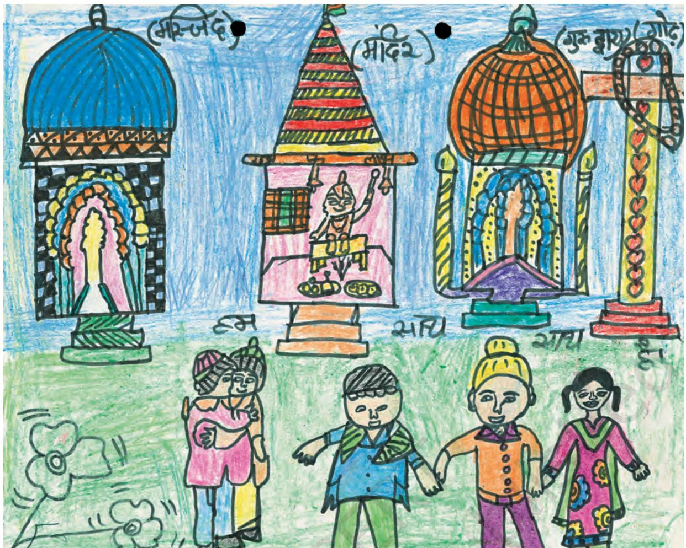

## Chapter 2

# **Understanding Secularism**

Imagine yourself as a Hindu or Muslim living in a part of the United States of America where Christian fundamentalism is very powerful. Suppose that despite being a US citizen, no one is willing to rent their house to you. How would this make you feel? Would it not make you feel resentful? What if you decided to complain against this discrimination and were told to go back to India. Would this not make you feel angry? Your anger could take two forms. First, you might react by saying that Christians should get the same treatment in places where Hindus and Muslims are in a majority. This is a form of retaliation. Or, you might take the view that there should be justice for all. You may fight, stating that no one should be discriminated against on grounds of their religious practices and beliefs. This statement rests on the assumption that all forms of domination related to religion should end. This is the essence of secularism. In this chapter, you will read more about what this means in the Indian context.

Social and Political Life 18

History provides us with many examples of discrimination, exclusion and persecution on the grounds of religion. You may have read about how Jews were persecuted in Hitler's Germany and how several millions were killed. Now, however, the Jewish State of Israel treats its own Muslim and Christian minorities quite badly. In Saudi Arabia, non-Muslims are not allowed to build a temple, church etc., and nor can they gather in a public place for prayers.

In all of the above examples, members of one religious community either persecute or discriminate against members of other religious communities. These acts of discrimination take place more easily when one religion is given official recognition by the State at the expense of other religions. Clearly no one would wish to be discriminated against, because of their religion nor dominated by another religion. In India, can the State discriminate against citizens on the grounds of their religion?

### **What is Secularism?**

In the previous chapter, you read about how the Indian Constitution contains Fundamental Rights that protect us against State power as well as against the tyranny of the majority. The Indian Constitution allows individuals the freedom to live by their religious beliefs and practices as they interpret these. In keeping with this idea of religious freedom for all, India also adopted a strategy of separating the power of religion and the power of the State. Secularism refers to this separation of religion from the State.

**Re-read the introduction to this chapter. Why do you think retaliation is not the proper response to this problem? What would happen if different groups followed this path?**

The three drawings in this chapter were done by students of your age. They were asked to draw on religious tolerance.

Akshita Jain, V, Srijan School, Delhi.

#### **Discuss in class: Can there be different views within the same religion?**

## **Why is it Important to Separate Religion from the State?**

As discussed above, the most important aspect of secularism is its separation of religion from State power. This is important for a country to function democratically. Almost all countries of the world will have more than one religious group living in them. Within these religious groups, there will most likely be one group that is in a majority. If this majority religious group has access to State power, then it could quite easily use this power and financial resources to discriminate against and persecute persons of other religions. This tyranny of the majority could result in the discrimination, coercion and at times even the killing of religious minorities. The majority could quite easily prevent minorities from practising their religions. Any form of domination based on religion is in violation of the rights that a democratic society guarantees to each and every citizen irrespective of their religion. Therefore, the tyranny of the majority and the violation of Fundamental Rights that can result is one reason why it is important to separate the State and religion in democratic societies.

Another reason that it is important to separate religion from the State in democratic societies is because we also need to protect the freedom of individuals to exit from their religion, embrace another religion or have the freedom to interpret religious teachings differently. To understand this point better, let us take the practice of untouchability. You might feel that you dislike this practice within Hinduism and therefore, you want to try and reform it. However, if State power were in the hands of those Hindus who support untouchability, then do you think that you would have an easy task to try and change this? Even if you were part of the dominant religious group, you might face a lot of resistance from fellow members of your community. These members who have control of State power might say that there is only one interpretation of Hinduism and that you do not have the freedom to interpret this differently.

Social and Political Life 20

## **What is Indian Secularism?**

The Indian Constitution mandates that the Indian State be secular. According to the Constitution, only a secular State can realise its objectives to ensure the following:

- 1. that one religious community does not dominate another;
- 2. that some members do not dominate other members of the same religious community;
- 3. that the State does not enforce any particular religion nor take away the religious freedom of individuals.

The Indian State works in various ways to prevent the above domination. First, it uses a strategy of distancing itself from religion. The Indian State is not ruled by a religious group and nor does it support any one religion. In India, government spaces like law courts, police stations, government schools and offices are not supposed to display or promote any one religion.

**In the above storyboard, discuss the answer given by the teacher.**

In the above storyboard, the celebration of the religious festival within the school would have been a violation of the government's policy of treating all religions equally. Government schools cannot promote any one religion either in their morning prayers or through religious celebrations. This rule does not apply to private schools.

The second way in which Indian secularism works to prevent the above domination is through a strategy of noninterference. This means that in order to respect the sentiments of all religions and not interfere with religious practices, the State makes certain exceptions for particular religious communities.

**Government schools often have students from different religious backgrounds. Re-read the three objectives of a secular State and write two sentences on why it is important that government schools do not promote any one religion?**

In the above storyboard, Paramjit, the Sikh youth, does not have to wear a helmet. This is because the Indian State recognises that wearing a pugri (turban) is central to a Sikh's religious practice and in order not to interfere with this, allows an exception in the law.

The third way in which Indian secularism works to prevent the domination listed earlier is through a strategy of intervention. You read earlier in this chapter about untouchability. This is a good example where members of

23

the same religion ('upper-caste' Hindus) dominate other members (some 'lower castes') within it. In order to prevent this religion-based exclusion and discrimination of 'lower castes', the Indian Constitution bans untouchability. In this instance, the State is intervening in religion in order to end a social practice that it believes discriminates and excludes, and that violates the Fundamental Rights of 'lower castes' who are citizens of this country. Similarly, to ensure that laws relating to equal inheritance rights are respected, the State may have to intervene in the religion-based 'personal laws' of communities.

The intervention of the State can also be in the form of support. The Indian Constitution grants the right to religious communities to set up their own schools and colleges. It also gives them financial aid on a nonpreferential basis.

In what way is Indian secularism different from that of other democratic countries?

Some of the above objectives are similar to those that have been included in the Constitutions of secular democratic countries in other parts of the world. For example, the First Amendment of the U.S. Constitution prohibits the legislature from making laws "respecting an establishment of religion" or that "prohibit the free exercise of religion". What is meant by the word 'establishment' is that the legislature cannot declare any religion as the official religion. Nor can they give preference to one religion. In the U.S.A. the separation between State and religion means that neither the State nor religion can interfere in the affairs of one another.

There is one significant way in which Indian secularism differs from the dominant understanding of secularism as practised in the United States of America. This is because unlike the strict separation between religion and the State in American secularism, in Indian secularism the State can intervene in religious affairs. You have read about how the

In the United States of America, most children in government schools have to begin their school day reciting the 'Pledge of Allegiance'. This Pledge includes the words "under God". It was established more than 60 years ago that government school students are not required to recite the Pledge if it conflicts with their religious beliefs. Despite this, there have been several legal challenges objecting to the phrase "under God" saying that it violates the separation between church and State that the First Amendment of the US Constitution guarantees.

The above photo shows students taking the 'Pledge of Allegiance' in a government school in the U.S.A.

Social and Political Life 24

Indian Constitution intervened in Hindu religious practices in order to abolish untouchability. In Indian secularism, though the State is not strictly separate from religion it does maintain a principled distance vis-à-vis religion. This means that any interference in religion by the State has to be based on the ideals laid out in the Constitution. These ideals serve as the standard through which we can judge whether the State is or is not behaving according to secular principles.

The Indian State is secular and works in various ways to prevent religious domination. The Indian Constitution guarantees Fundamental Rights that are based on these secular principles. However, this is not to say that there is no violation of these rights in Indian society. Indeed it is precisely because such violations happen frequently that we need a constitutional mechanism to prevent them from happening. The knowledge that such rights exist makes us sensitive to their violations and enables us to take action when these violations take place.

**Can you think of an example from India where individuals or communities of different faiths came together to promote social harmony and celebrate constitutional values?**

In February 2004, France passed a law banning students from wearing any conspicuous religious or political signs or symbols such as the Islamic headscarf, the Jewish skullcap, or large Christian crosses. This law has encountered a lot of resistance from immigrants who are mainly from the former French colonies of Algeria, Tunisia and Morocco. In the 1960s, France had faced a shortage of workers and, therefore, had provided visas for these immigrants to come and work in the country. The daughters of these immigrants often wear headscarves while attending school. However, with the passing of this new law, they have been expelled from their school for wearing headscarves**.**

# Exercises

- 1. List the different types of religious practice that you find in your neighbourhood. This could be different forms of prayer, worship of different gods, sacred sites, different kinds of religious music and singing etc. Does this indicate freedom of religious practice?
- 2. Will the government intervene if some religious group says that their religion allows them to practise infanticide? Give reasons for your answer.
- 3. Complete the following table:

| Objective | Why is this important? | Example of a violation of this |
| --- | --- | --- |
|  |  | objective |
| One religious community |  |  |
| does not dominate another. |  |  |
| The State does not enforce |  |  |
| any particular religion nor |  |  |
| take away the religious |  |  |
| freedom of individuals. |  |  |
| That some members do not |  |  |
| dominate other members |  |  |
| of the same religious |  |  |
| community. |  |  |

- 4. Look up the annual calendar of holidays of your school. How many of them pertain to different religions? What does this indicate?
- 5. Find out some examples of different views within the same religion.
- 6. The Indian State both keeps away from religion as well as intervenes in religion. This idea can be quite confusing. Discuss this once again in class using examples from the chapter as well as those that you might have come up with.

- 7. This poster alongside highlights the need for 'Peace'. It says, "Peace is a never-ending process....It cannot ignore our differences or overlook our common interests." Write in your own words what you think the above sentences are trying to convey? How does it relate to the need for religious tolerance?
This chapter had three drawings on religious tolerance made by students of your age. Design your own poster on religious tolerance for your peers.

**GLOSSARY**

**Coercion:** To force someone to do something. In the context of this chapter, it refers to the force used by a legal authority like the State.

**Freedom to interpret:** The independence that all persons shall have to understand things in their own way. In the context of this chapter, it refers to a person's liberty to develop their own understanding and meaning of the religion they practice.

**Intervene:** In the context of this chapter, it refers to the State's efforts to influence a particular matter in accordance with the principles of the Constitution.

Chapter 2: Understanding Secularism

