# Unit Two

| STATES | 19 | Fire The First | P. S.P. | ELECTION RESULTS FOR LOK SABRA |
| --- | --- | --- | --- | --- |
| 1. ANDHRA PRADESH 43 |  | 30 |  |  |
| 2. ASSAM | 12 | 9 | 1 |  |
| 3. BIHAR | 53 | 32 | 11 |  |
| 4. GUJARAT | 22 | 16 |  |  |
| 5. KERALA | 18 | 6 |  | 1. |
| 6. NADHYA PRADESH 36 |  | 23 | V |  |
| 7. MADRAS | 41 | 31 |  |  |
| 8. NAHARASHTRA | 44 | 36 |  |  |
| 9. NYSORE | 56 | 24 |  |  |
| 10. ORISSA | 20 | 14 |  |  |
| 11. PUNJAB | 22 | 13 |  |  |
| 12. RAJASTHAN | 22 | 14 |  |  |
| 13. UTTAR PRADESH | BG | 20 |  |  |
| 14. WEST BENGAL . | 36 | 22 |  |  |
| 15. DELHI | 5 | 1 |  |  |
| 16. NAMIPUR | 2 |  |  |  |
| IZ TRIPURA 2 |  |  |  |  |
| TITI AQM 550 |  |  |  |  |

Social and Political Life 28

## Teacher's Note

This is a continuation of the theme of government that has already been dealt with in the Class VI and VII textbooks. Hence, a recap of ideas is important especially those related to elections, representation and participation. These ideas can be made more clear to students through bringing in actual examples into the classroom. Newspaper and TV reports could be used to facilitate this.

Chapter 3 discusses some of the functions of Parliament. The ways in which these connect to the idea of parliamentary democracy need to be emphasised. Hence it is important to explain the critical role played by citizens and allow students to air views regarding this. At times students might be cynical about the political process and your role as a teacher is not to dismiss or agree with this cynicism but rather redirect it towards what the Constitution intends.

Chapter 3 is also on understanding laws. Children have little exposure to laws. Therefore, they would require more examples from a familiar context. It is through this they can figure out that laws are meant to apply in an equitable manner.

The storyboard contained in Chapter 3 portrays how a new law comes into being. The focus of this storyboard is not on the processes within Parliament. In contrast, the storyboard highlights the important role that people play in transforming an urgent social issue into law. In addition to the law already highlighted, it would be good to discuss another example of a new/contemplated law so that students can relate to the role of people in bringing this about.

The chapter ends with a section on unpopular laws. These refer to laws that often restrict the Fundamental Rights of certain populations. History provides us with examples of several groups that protest what they view as unjust laws. Bring in these examples into the classroom to discuss how a law can be unpopular. Allow students to research more examples in the Indian context and debate these in the classroom using the Fundamental Rights listed in Chapter 1 as their yardstick.

29

# Chapter 3

# **Parliament and the Making of Laws**

We in India pride ourselves on being a democracy. Here we will try and understand the relation between the ideas of participation in decision-making and the need for all democratic governments to have the consent of their citizens.

It is these elements that together make us a democracy and this is best expressed in the institution of the Parliament. In this chapter, we will try to see how the Parliament enables citizens of India to participate in decision making and control the government, thus making it the most important symbol of Indian democracy and a key feature of the Constitution.

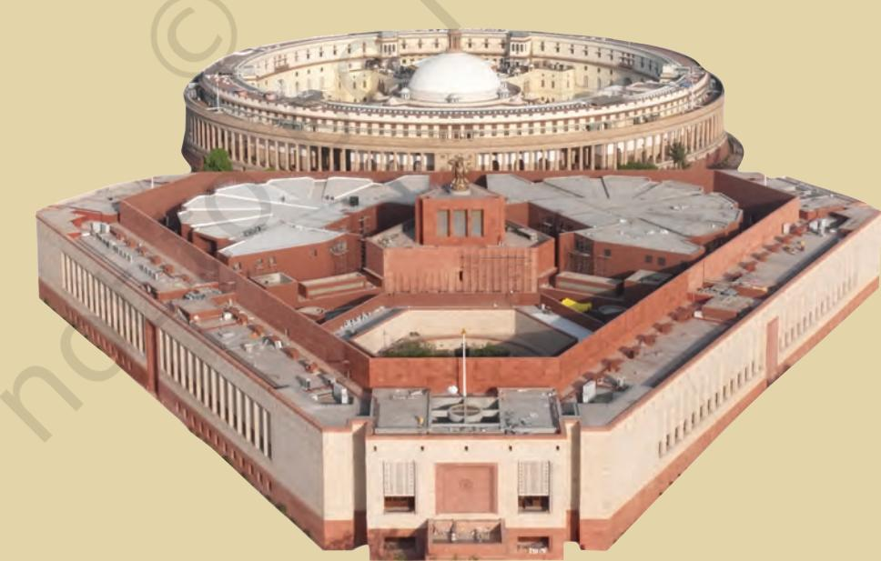

Social and Political Life 30

### **Why should People Decide?**

India, as we know, became independent on 15 August 1947. Preceding this was a long and difficult struggle in which many sections of society participated. People from various backgrounds joined the struggle and they were inspired by the ideas of freedom, equality and participation in decision– making. Under colonial rule, the people had lived in fear of the British government and did not agree with many of the decisions that they took. But they faced grave danger if they tried to criticise these decisions. The freedom movement changed this situation. The nationalists began to openly criticise the British government and make demands. As far back as 1885, the Indian National Congress demanded that there be elected members in the legislature with a right to discuss the budget and ask questions. The Government of India Act 1909, allowed for some elected representation. While these early legislatures under the British government were in response to the growing demands of the nationalists, they did not allow for all adults to vote nor could people participate in decision making.

As you read in Chapter 1, the experience of colonial rule as well as the participation of different people in the struggle for freedom left little doubt in the minds of the nationalists that all persons in independent India would be able to participate in making decisions. With the coming of independence, we were going to be citizens of a free country. This did not mean that the government could do what it felt like, it meant that the government had to be sensitive to people's needs and demands. The dreams and aspirations of the freedom struggle were made concrete in the Constitution of independent India that laid down the principle of universal adult franchise, i.e. that all adult citizens of the country have the right to vote.

**Parliament and theMaking of Laws**

**What do you think the artist is trying to convey through the image of Parliament on the previous page?**

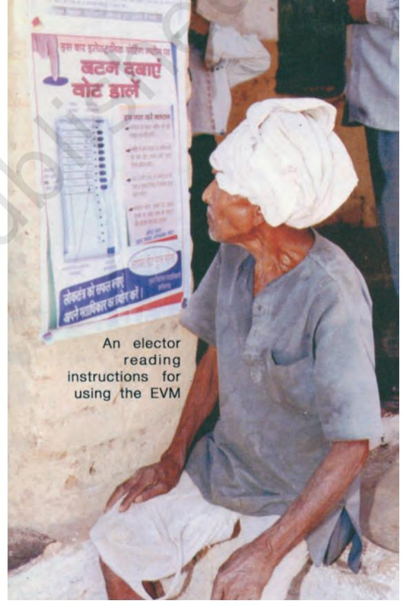

The above photo shows a voter reading instructions on how to use an Electronic Voting Machine (EVM). EVMs were used throughout the country for the first time in the 2004 general elections. The use of EVMs in 2004 saved around 1,50,000 trees which would have been cut to produce about 8,000 tons of paper for printing the ballot papers.

**Give one reason why you think there should be universal adult franchise.**

**Do you think there would be any difference if the class monitor was selected by the teacher or elected by the students? Discuss.**

#### **People and their Representatives**

The take-off point for a democracy is the idea of consent, i.e. the desire, approval and participation of people. It is the decision of people that creates a democratic government and decides about its functioning. The basic idea in this kind of democracy is that the individual or the citizen is the most important person and that in principle the government as well as other public institutions need to have the trust of these citizens.

How does the individual give approval to the government? One way of doing so, as you read, is through elections. People would elect their representatives to the Parliament, then, one group from among these elected representatives forms the government. The Parliament, which is made up of all representatives together, controls and guides the government. In this sense people, through their chosen representatives, form the government and also control it.

This photo shows election staff using an elephant to carry polling material and EVMs to polling stations located in difficult terrain.

Social and Political Life 32

The above idea of representation has been an important theme in your Class VI and VII Social and Political Life textbooks. You are familiar with how representatives are chosen at different levels of government. Let us recall these ideas by doing the following exercises.

- 1. Use the terms 'constituency' and 'represent' to explain who an MLA is and how the person gets elected?
- 2. Discuss with your teacher the difference between a State Legislative Assembly (Vidhan Sabha) and the Parliament (Lok Sabha).
- 3. From the list below, identify the work of a State government and that of a Central government.
	- (a) The decision of the Indian government to maintain peaceful relations with China.
	- (b) The decision of the Madhya Pradesh government to discontinue Board exams in Class VIII for all schools under this Board.
	- (c) Introduction of a new train connection between Ajmer and Mysore.
	- (d)Introduction of a new 1,000 rupee note.
- 4. Fill in the blanks with the following words. **universal adult franchise; MLAs; representatives; directly**

Q Democratic governments in our times are usually referred to as representative democracies. In representative democracies, people do not participate ……...............… but, instead, choose their ….............……..through an election process. These …….......….. meet and make decisions for the entire population. These days, a government cannot call itself democratic unless it allows what is known as ............................................ This means that all adult citizens in the country are allowed to vote.

- 5. You have read that most elected members whether in the Panchayat, or the Vidhan Sabha or the Parliament are elected for a fixed period of five years. Why do we have a system where the representatives are elected for a fixed period and not for life?
- 6. You have read that people participate in other ways and not just through elections to express approval or disapproval of the actions of government. Can you describe three such ways through a small skit?

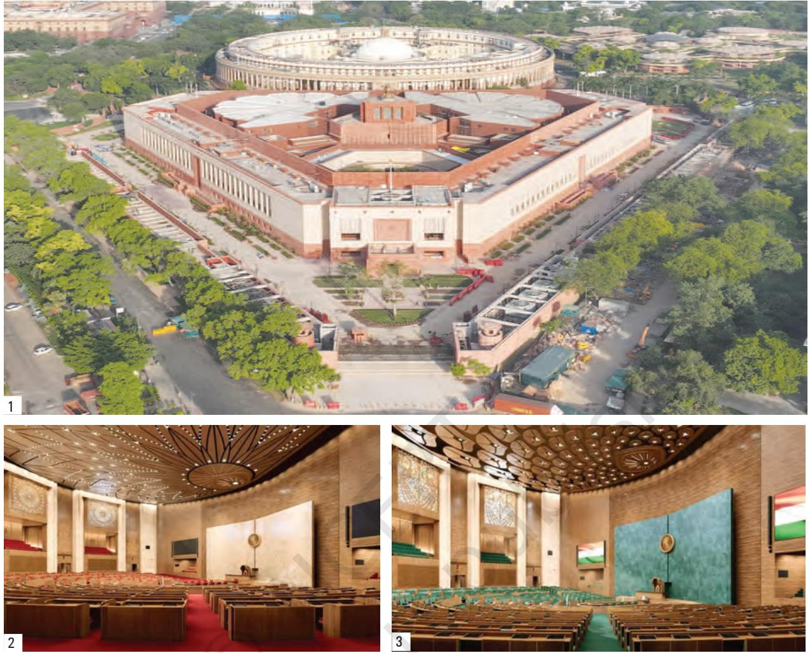

- 1. The Parliament of India (Sansad) is the supreme law-making institution. It has two Houses, the Rajya Sabha and the Lok Sabha.
- 2. Rajya Sabha (Council of States), with a total strength of 250 members, is chaired by the Vice-President of India.
- 3. Lok Sabha (House of the People), with a total membership of 543, is presided over by the Speaker.

### **The Role of the Parliament**

Created after 1947, the Indian Parliament is an expression of the faith that the people of India have in principles of democracy. These are participation by people in the decisionmaking process and government by consent. The Parliament in our system has immense powers because it is the representative of the people. Elections to the Parliament are held in a similar manner as they are for the state legislature. The Lok Sabha is usually elected once every five years. The country is divided into numerous constituencies as shown in the map on page 45. Each of these constituencies elects one person to the Parliament. The candidates who contest elections usually belong to different political parties.

With the help of the table below, let us understand this further.

| Results of the 17th Lok Sabha Elections, (May 2019) |  |
| --- | --- |
| Political Party No. of MPs |  |
| Bharatiya Janata Party (BJP) | 303 |
| Indian National Congress (INC) | 52 |
| Dravida Munnetra Kazhagam (DMK) | 24 |
| All India Trinamool Congress (AITC) | 22 |
| Yuvajana Sramika Rythu Congress Party (YSRCP) | 22 |
| Shiv Sena (SS) | 18 |
| Janata Dal (United) (JD (U)) | 16 |
| Biju Janata Dal (BJD) | 12 |
| Bahujan Samaj Party (BSP) | 10 |
| Telangana Rashtra Samithi (TRS) | 9 |
| Lok Jan Shakti Party (LJSP) | 5 |
| Samajwadi Party (SP) | 5 |
| Independents (Ind.) | 4 |
| Nationalist Congress Party (NCP) | 4 |
| Communist Party of India (Marxist) (CPI)(M)) | 3 |
| Indian Union Muslim League (IUML) | 3 |
| Jammu and Kashmir National Conference (J&KNC) | 3 |
| Telugu Desam Party (TDP) | 3 |
| All India Majlis-e-Ittehadul Muslimeen (AIMIM) | 2 |
| Apna Dal (Apna Dal) | 2 |
| Communist Party of India (CPI) | 2 |
| Shiromani Akali Dal (SAD) | 2 |
| Aam Aadmi Party (AAP) | 1 |
| AJSU Party (AJSU) | 1 |
| All India Anna Dravida Munnetra Kazhagam (AIADMK) | 1 |
| All India United Democratic Front (AIUDF) | 1 |
| Janata Dal (Secular) (JD(s)) | 1 |
| Jharkhand Mukti Morcha (JMM) | 1 |
| Kerala Congress (M)(KC(M)) | 1 |
| Mizo National Front (MNF) | 1 |
| Naga Peoples Front (NPF) | 1 |
| National People's Party (NPP) | 1 |
| Nationalist Democratic Progressive Party (PDPP) | 1 |
| Rashtriya Loktantrik Party (RLP) | 1 |
| Revolutionary Socialist Party (RSP) | 1 |
| Sikkim Krantikari Morcha (SKM) | 1 |
| Viduthalai Chiruthaigal Katchi (VCK) | 1 |
| Grand Total | 543 |

**Use the table alongside to answer the questions below:**

**Who will form the government? Why?**

**Who will be present for discussions in the Lok Sabha?**

**Is this process similar to what you have read about in Class VII?**

**The photograph on page 28 shows results from the 3rd Lok Sabha elections held in 1962. Use the photograph to answer the following questions:**

**a. Which state has the highest number of MPs in the Lok Sabha? Why do you think this is so?**

**b. Which state has the least number of MPs in the Lok Sabha?**

**c. Which political party has won the most seats in all states?**

**d. Which party do you think will form the government? Give reasons why.**

Source: http://loksabha.nic.in

| Results of the 15th Lok Sabha Elections, |
| --- |
| (May 2009) |
| Political Party No. of MPs |
| National Parties |
| Bahujan Samaj Party (BSP) 21 |
| Bharatiya Janata Party (BJP) 116 |
| Communist Party of India (CPI) 4 |
| Communist Party of India (Marxist) 16 |
| (CPM) |
| Indian National Congress (INC) 206 |
| Nationalist Congress Party (NCP) 9 |
| Rashtriya Janata Dal (RJD) 4 |
| State Parties (Regional Parties) |
| All India Anna DMK (AIADMK) 9 |
| All India Forward Bloc 2 |
| All India Trinamool Congress 19 |
| Biju Janata Dal (BJD) 14 |
| Dravida Munnetra Kazhagam (DMK) 18 |
| Jammu & Kashmir National Conference 3 |
| Janata Dal (Secular) 3 |
| Janata Dal (United) 20 |
| Jharkhand Mukti Morcha 2 |
| Muslim League Kerala State Committee 2 |
| Revolutionary Socialist Party 2 |
| Samajwadi Party (SP) 23 |
| Shiromani Akali Dal 4 |
| Shiv Sena 11 |
| Telangana Rashtra Samithi (TRS) 2 |
| Telugu Desam (TDP) 6 |
| Other Regional Parties 6 |
| Registered Unrecognised Parties 12 |
| Independents 9 |
| Grand Total 543 |
| Source: www.eci.nic.in |

The above table gives you the results of the 15th Lok Sabha elections held in 2009. In these elections, the INC got a large number of seats but still not enough to emerge as the majority party in the Lok Sabha. It, thus, had to form a coalition, the United Progressive Alliance (UPA), with other political parties who were its allies.

Once elected, these candidates become Members of Parliament or MPs. These MPs together make up the Parliament. Once elections to the Parliament have taken place, the Parliament needs to perform the following functions:

#### **A. To Select the National Government**

Parliament of India consists of the President, the Rajya Sabha and the Lok Sabha. After the Lok Sabha elections, a list is prepared showing how many MPs belong to each political party. For a political party to form the government, they must have a majority of elected MPs. Since there are 543 elected members in Lok Sabha, to have a majority a party should have at least half the number i.e. 272 members or more. The Opposition in Parliament is formed by all the political parties that are not part of the majority party/coalition formed. The largest amongst these parties is called the Opposition party.

One of the most important functions of the Lok Sabha is to select the executive. The executive, as you read in Chapter 1, is a group of persons who work together to implement the laws made by the Parliament. This executive is often what we have in mind when we use the term government.

The Prime Minister of India is the leader of the ruling party in the Lok Sabha. From the MPs who belong to her party, the Prime Minister selects ministers to work with her to implement decisions. These ministers then take charge of different areas of government functioning like health, education, finance etc.

Often times in the recent past it has been difficult for a single political party to get the majority that is required to form the government. They then join together with different political parties who are interested in similar concerns to form what is known as a coalition government.

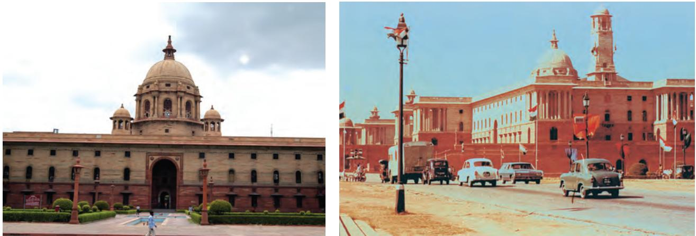

These two buildings of the Central Secretariat, the South Block and North Block were built during the 1930s. The photo on the left is of the South Block which houses the Prime Minister's Office (PMO), the Ministry of Defence and the Ministry of External Affairs. The North Block is the photo on the right and this has the Ministry of Finance and the Ministry of Home Affairs. The other ministries of the Union Government are located in various buildings in New Delhi.

The Rajya Sabha functions primarily as the representative of the states of India in the Parliament. The Rajya Sabha can also initiate legislation and a bill is required to pass through the Rajya Sabha in order to become a law. It, therefore, has an important role of reviewing and altering (if alterations are needed) the laws initiated by the Lok Sabha. The members of the Rajya Sabha are elected by the elected members of the Legislative Assemblies of various states. There are 233 elected members plus 12 members nominated by the President.

#### B. To Control, Guide and Inform the Government

The Parliament, while in session, begins with a question hour. The question hour is an important mechanism through which MPs can elicit information about the working of the government. This is a very important way through which the Parliament controls the executive. By asking questions the government is alerted to its shortcomings, and also comes to know the opinion of the people through their representatives in the Parliament, i.e. the MPs. Asking questions of the government is a crucial task for every MP. The Opposition parties play a critical role in the healthy functioning of a democracy. They highlight drawbacks in various policies and programmes of the government and mobilise popular support for their own policies.

#### The following is an example of a question asked in Parliament.

Lok Sabha

Unstarred Question No: 48 Answered On: 15.12.2017

Converge of Schemes for Children

Manoj Rajoria

Will the Minister of Women and Child Development be pleased to state:-

(a) whether the Government proposes to converge various schemes and policies for children in the country;

(b) if so, the details thereof; and;

(c) if not, the reasons therefor?

Answer

Minister of State in the Ministry of Women and Child Development (Dr. Virendra Kumar)

(a) to (c) The Ministry has developed the National Plan of Action for Children 2016 which largely draws upon the existing programmes and schemes of various Ministries/Departments. It provides a framework for convergence and co-ordination between Ministries/Departments and State/UTs Governments and encourages collective action from all stakeholders to address multi-dimensional vulnerabilities experienced by children. The National Plan of Action for Children 2016 categorizes children's rights under four key priority areas; (i) Survival, Health and Nutrition, (ii) Education and Development, (iii) Protection and (iv) Participation. It identifies key programmes, schemes and policies as well as stakeholders for the implementation of different strategies.

Source: http://loksabha.nic.in

**In the above question, what information is being sought from the Minister of Women and Child Development?**

**If you were a Member of Parliament (MP), list two questions that you would like to ask.**

The government gets valuable feedback and is kept on its toes by the questions asked by the MPs. In addition, in all matters dealing with finances, the Parliament's approval is crucial for the government. This is one of the several ways in which the Parliament controls, guides and informs the government. The MPs as representatives of the people have a central role in controlling, guiding and informing Parliament and this is a key aspect of the functioning of Indian democracy.

Social and Political Life 38

#### **How Do New Laws Come About?**

The Parliament has an important role in making laws. There are many ways through which this takes place and it is often different groups in society that raise the need for a particular law. An important role of Parliament is to be sensitive to the problems faced by people. Let us read the following story to understand how issue of domestic violence was brought to the attention of Parliament and the process adopted for this issue to become law.

**The word 'arbitrary' has been used earlier in this book and you've read what the word means in the Glossary of Chapter 1. The word 'sedition' has been included in the Glossary of this chapter. Read the Glossary descriptions of both words and then answer the following questions:**

**State one reason why you think the Sedition Act of 1870 was arbitrary? In what ways does the Sedition Act of 1870 contradict the rule of law?**

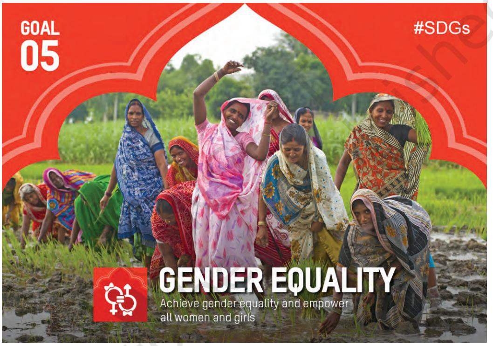

**Sustainable Development Goal (SDG) www.in.undp.org**

Domestic violence generally refers to the injury or harm or threat of injury or harm caused by an adult male, usually the husband, against his wife. Injury may be caused by physically beating up the woman or by emotionally abusing her. Abuse of the woman can also include verbal, sexual and economic abuse. The Protection of Women from Domestic Violence Act 2005 extends the understanding of the term 'domestic' to include all women who 'live or have lived together in a shared household' with the male member who is perpetrating the violence.

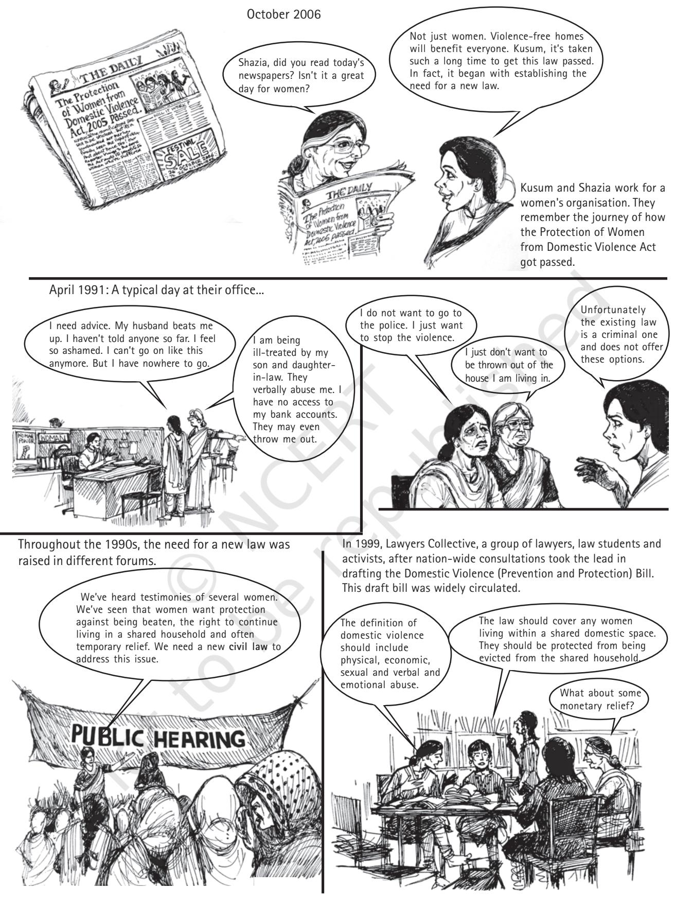

Social and Political Life 40

Meetings were held with different organisations.

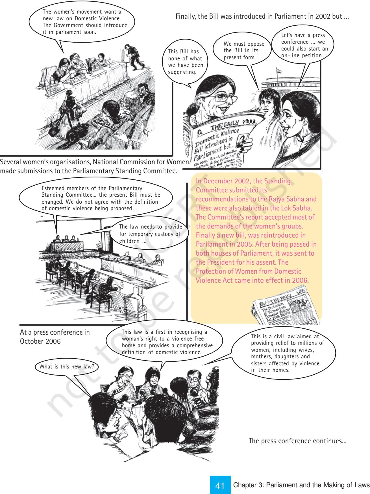

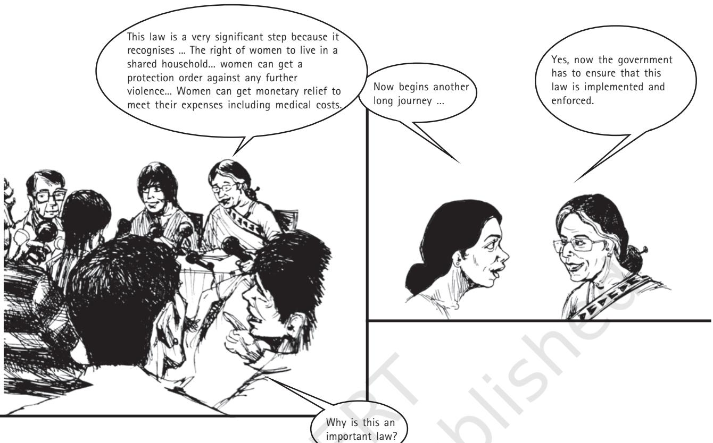

**What do you understand by 'domestic violence'? List the two rights that the new law helped achieve for women who are survivors of violence.**

**Can you list one process that was used to make more people aware of the need for this law?**

**From the above storyboard, can you list two different ways in which people lobbied Parliament?**

**In the following poster, what do you understand by the phrase 'Equal Relationships are Violence Free'?**

Often women who face violence or are abused are seen as victims. But women struggle in several different ways to survive these situations. Therefore, it is more accurate to refer to them as survivors rather than as victims.

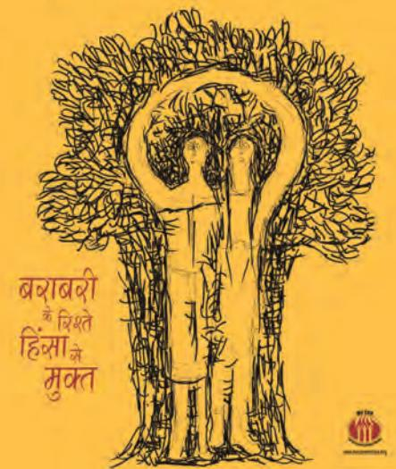

Social and Political Life 42

As the above example shows, the role of citizens is crucial in helping Parliament frame different concerns that people might have into laws. From establishing the need for a new law to its being passed, at every stage of the process the voice of the citizen is a crucial element. This voice can be heard through TV reports, newspaper editorials, radio broadcasts, local meetings - all of which help in making the work that Parliament does more accessible and transparent to the people.

### **Unpopular and Controversial Laws**

Let us now look at the situation where the Parliament passes laws that turn out to be very unpopular. Sometimes a law can be constitutionally valid and hence legal, but it can continue to be unpopular and unacceptable to people because they feel that the intention behind it is unfair and harmful. Hence, people might criticise this law, hold public meetings, write about it in newspapers, report to TV news channels etc. In a democracy like ours, citizens can express their unwillingness to accept repressive laws framed by the Parliament. When a large number of people begin to feel that a wrong law has been passed, then there is pressure on the Parliament to change this.

For example, various municipal laws on the use of space within municipal limits often make hawking and street vending illegal. No one will dispute the necessity for some rules to keep the public space open so that people can walk on the pavements easily. However, one also cannot deny that hawkers and vendors provide essential services cheaply and efficiently to the millions living in a large city. This is their means of livelihood. Hence, if the law favours one group and disregards the other it will be controversial and lead to conflict. People who think that the law is not fair can approach the court to decide on the issue. The court has the power to modify or cancel laws if it finds that they don't adhere to the Constitution.

Do you remember the photo essay on the women's movement in the Class VII book? The photos there showed the different ways in which citizens can protest, campaign and show solidarity. The pictures given on the next page point to another way in which people protest unjust laws.

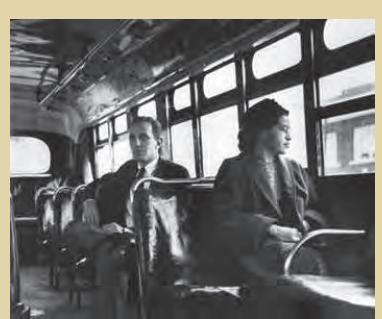

As you have read in your previous class and will read in your history textbooks this year on the rule of law, Indian nationalists protested and criticised arbitrary and repressive laws being enforced by the British. History provides us with several examples of people and communities who have struggled to end unjust laws. In your Class VII book, you read of how Rosa Parks, an African-American woman, refused to give up her seat on a bus to a white man on 1 December 1955. She was protesting the law on segregation that divided up all public spaces, including the streets, between the whites and the African-Americans. Her refusal was a key event that marked the start of the Civil Rights Movement, which led to the Civil Rights Act in 1964, which prohibited discrimination on the basis of race, religion or national origin in the U.S.A. The above photo shows Rosa Parks seated in a bus.

**Read the newspapers/watch news on TV for a week and find out if there are any unpopular laws that people in India or around the world are currently protesting.**

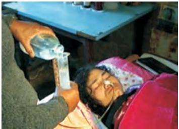

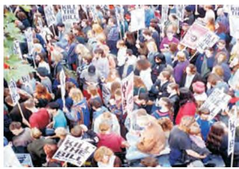

**List the three forms of protest that you see in the above photos.**

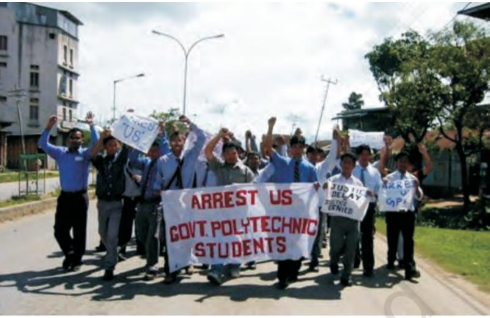

We need to remember that our role as citizens does not end with electing our representatives. Rather, it is then that we begin to use newspapers and the media to carefully chart the work that is being done by our MPs and criticise their actions when we feel it is required. Thus, what we should bear in mind is that it is the extent, involvement and enthusiasm of the people that helps Parliament perform its representative functions properly.

**GLOSSARY**

**Approval:** To give one's consent to and be favourable towards something. In the context of this chapter, it refers both to the formal consent (through elected representatives) that Parliament has as well as the fact that it needs to continue to enjoy the people's trust.

**Coalition:** A temporary alliance of groups or parties. In this chapter, it refers to the alliance formed by political parties after elections when no party has been able to get adequate seats to form a clear majority.

**Criticise:** To find fault with or disapprove of a person or thing. In the context of this chapter, it refers to citizens finding fault with the functioning of government.

**Evolution:** Process of development from a simple to a complex form and is often used to discuss the development of a species of plants or animals. In the context of this chapter it refers to the way in which protecting women against domestic violence developed from an urgently-felt need to a new law that can be enforced throughout the country.

**Sedition:** This applies to anything that the government might consider as stirring up resistance or rebellion against it. In such cases, the government does not need absolute evidence in order to arrest persons. Under the Sedition Act of 1870, the British had a very broad interpretation of what constituted sedition, and what this meant was that they could arrest and detain any person they wanted under this Act. The nationalists considered this law arbitrary because persons were arrested for a variety of reasons that were seldom clarified beforehand as well as because those arrested were often kept in jail without a trial.

**Repressive:** To control severely in order to prevent free and natural development or expression. In the context of this chapter it refers to laws that brutally control persons and often prevent them from exercising their Fundamental Rights including Right to Speech and Assembly.

**Unresolved:** Situations in which there are no easy solutions to problems.

# Exercises

- 1. Why do you think our national movement supported the idea that all adults have a right to vote?
- 2. In this 2004 map of Parliamentary constituencies alongside, roughly identify the constituencies in your State. What is the name of the MP from your constituency? How many MPs does your state have? Why are certain constituencies coloured green while others are coloured blue?
- 3. You have read in Chapter 1 that the 'Parliamentary form of government' that exists in India has three tiers. This includes the Parliament (central government) and the various State Legislatures (state governments). Fill in the following table with information on the various representatives from your area:

|  | State Government | Central Government |
| --- | --- | --- |
| Which political party/parties is/are |  |  |
| currently in power? |  |  |
| Who (name) is the current |  |  |
| representative from your area? |  |  |
| Which political parties currently |  |  |
| form the Opposition? |  |  |
| When were elections last held? |  |  |
| When will the next elections |  |  |
| be held? |  |  |
| How many women representatives |  |  |
| are there (from your state)? |  |  |

- 4. Re-read the storyboard on how a new law on domestic violence got passed. Describe in your own words the different ways in which women's groups worked to make this happen.
45 Chapter 3: Parliament and the Making of Laws

Source: www.eci.gov.in

