# Unit Three

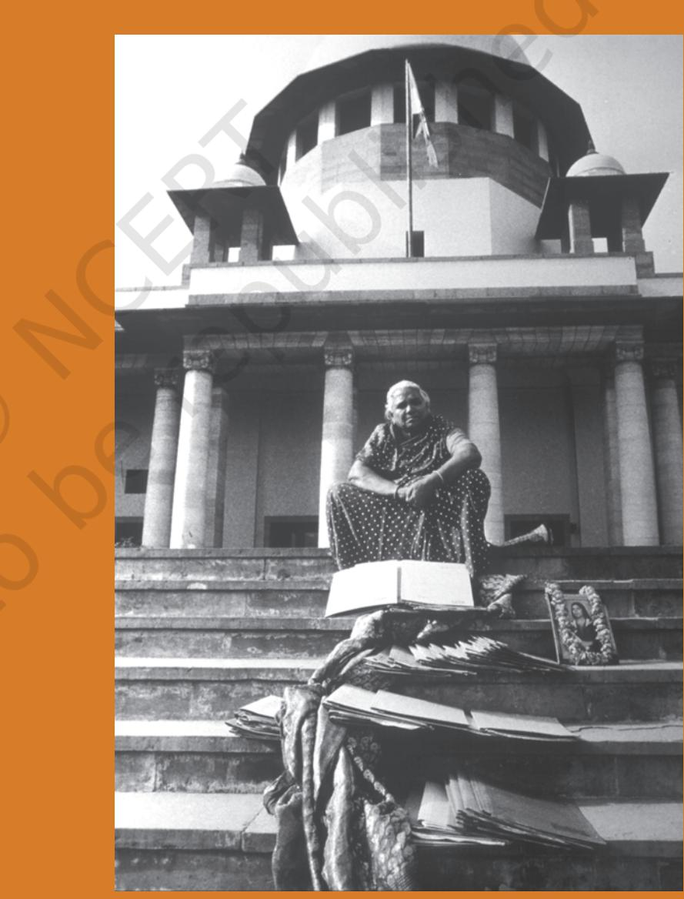

Social and Political Life 46

#### Teacher's Note

Students are going to be introduced to the judiciary through this unit. Yet, aspects of this system like the police, the courts etc. are probably something that students are already quite familiar with either through the media or perhaps through personal experience. In this unit, the effort is to combine some basic knowledge on the judicial system with more hands-on information on the criminal justice system. Chapter 4 covers topics that will be reinforced in the higher classes. The effort while teaching this should be to provide students with a sense of the significant role played by the judiciary in upholding the principles enshrined in the Constitution.

Chapter 4 discusses the role of the judiciary in upholding the rule of law. Five separate though inter-related concepts on the judiciary have been discussed in this Chapter. The reason why the independence of the judiciary is key to its functioning is a complex idea but something that students need to understand. This can be conveyed at a more basic level using examples of different decision-making processes that the student is familiar with. The structure has been illustrated through a case and students should be encouraged to discuss other cases to better understand the working of the judicial process. The last concept of 'access to justice' highlights the role of the Public Interest Litigation (PIL) in facilitating justice. It also touches upon the 'delay' in providing justice. The student's growing knowledge of Fundamental Rights should be used while discussing this section.

47

### Chapter 4

## **Judiciary**

A glance at the newspaper provides you a glimpse of the range of work done by the courts in this country. But can you think of why we need these courts? In India we have the rule of law. What this means is that laws apply equally to all persons and that a certain set of fixed procedures need to be followed when a law is violated. To enforce this rule of law, we have a judicial system that consists of the mechanism of courts that a citizen can approach when a law is violated. As an organ of government, the judiciary plays a crucial role in the functioning of India's democracy. It can play this role only because it is independent. What does an 'independent judiciary' mean? Is there any connection between the court in your area and the Supreme Court in New Delhi? In this chapter, you will find answers to these questions.

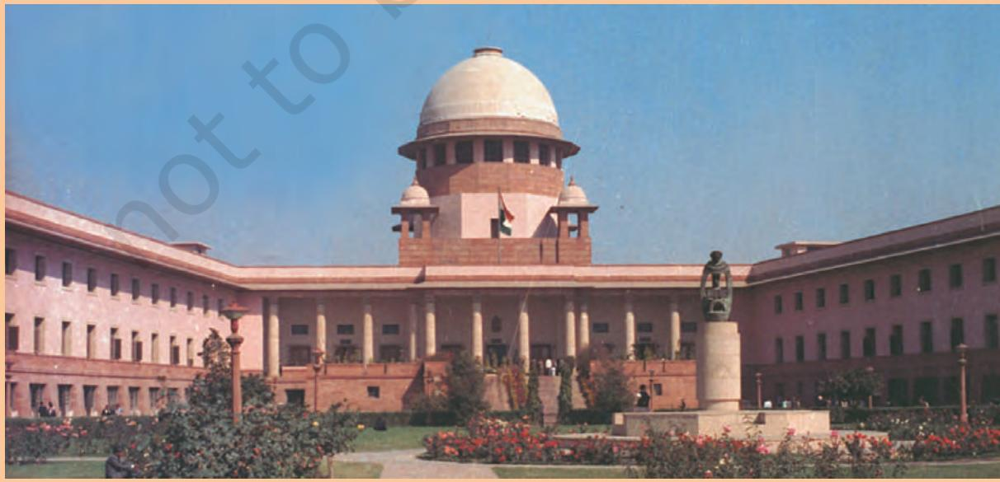

#### **What is the Role of the Judiciary?**

Courts take decisions on a very large number of issues. They can decide that no teacher can beat a student, or about the sharing of river waters between states, or they can punish people for particular crimes. Broadly speaking, the work that the judiciary does can be divided into the following:

Dispute Resolution: The judicial system provides a mechanism for resolving disputes between citizens, between citizens and the government, between two state governments and between the centre and state governments.

Judicial Review: As the final interpreter of the Constitution, the judiciary also has the power to strike down particular laws passed by the Parliament if it believes that these are a violation of the basic structure of the Constitution. This is called judicial review.

#### Upholding the Law and Enforcing Fundamental Rights:

Every citizen of India can approach the Supreme Court or the High Court if they believe that their Fundamental Rights have been violated.

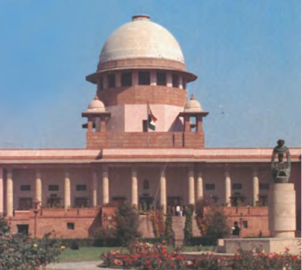

Supreme Court of India https://www.sci.gov.in

The Supreme Court was established on 26 January 1950, the day India became a Republic. Like its predecessor, the Federal Court of India (1937–1949), it was earlier located in the Chamber of Princes in the Parliament House. It moved to its present building on Mathura Road in New Delhi in 1958.

49

**With the help of your teacher, fill in the blank spaces in the table below.** Q Type of Dispute Example Dispute between centre and the state Dispute between two states Dispute between two citizens Laws that are in violation of the Constitution

#### **What is an Independent Judiciary?**

Imagine a situation in which a powerful politician has encroached on land belonging to your family. Within this judicial system, the politician has the power to appoint and dismiss a judge from his office. When you take this case to court, the judge is clearly partial to the politician.

The control that the politician holds over the judge does not allow for the judge to take an independent decision. This lack of independence would force the judge to make all judgments in favour of the politician. Although we often hear of rich and powerful people in India trying to influence the judicial process, the Indian Constitution protects against this kind of situation by providing for the independence of the judiciary.

One aspect of this independence is the 'separation of powers'. This, as you read in Chapter 1, is a key feature of the Constitution. What this means here is that other branches of government – the legislature and the executive – cannot interfere in the work of the judiciary. The courts are not under the government and do not act on their behalf.

For the above separation to work well, it is also crucial that all judges in the High Court as well as the Supreme Court are appointed with very little interference from these other branches of government. Once appointed to this office, it is also very difficult to remove a judge.

**Do you think that any ordinary citizen stands a chance against a politician in this kind of judicial system? Why not?**

It is the independence of the judiciary that allows the courts to play a central role in ensuring that there is no misuse of power by the legislature and the executive. It also plays a crucial role in protecting the Fundamental Rights of citizens because anyone can approach the courts if they believe that their rights have been violated.

**List two reasons why you believe an independent judiciary is essential to democracy.**

#### **What is the Structure of Courts in India?**

There are three different levels of courts in our country. There are several courts at the lower level while there is only one at the apex level. The courts that most people interact with are what are called subordinate or district courts. These are usually at the district or Tehsil level or in towns and they hear many kinds of cases. Each state is divided into districts that are presided over by a District Judge. Each state has a High Court which is the highest court of that state. At the top is the Supreme Court that is located in New Delhi and is presided over by the Chief Justice of India. The decisions made by the Supreme Court are binding on all other courts in India.

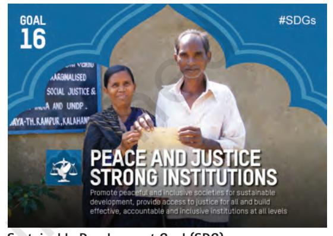

**Sustainable Development Goal (SDG) www.in.undp.org**

The structure of the courts from the lower to the highest level is such that it resembles a pyramid. Having read the description above, can you fill out which type of courts would exist at what level in the following diagram?

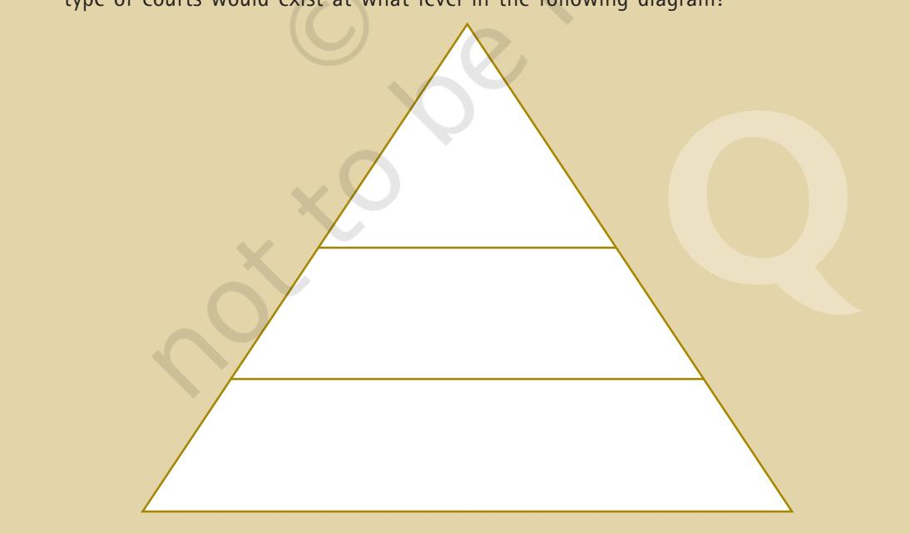

High Courts were first established in the three Presidency cities of Calcutta, Bombay and Madras in 1862. The High Court of Delhi came up in 1966. Currently there are 25 High Courts. While many states have their own High Courts, Punjab and Haryana share a common High Court at Chandigarh, and four North Eastern states of Assam, Nagaland, Mizoram and Arunachal Pradesh have a common High Court at Guwahati. Andhra Pradesh (Amaravati) and Telangana (Hyderabad) have separate High Courts from 1 January 2019. Some High Courts have benches in other parts of the state for greater accessibility.

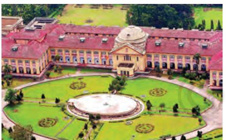

High Court of Patna http://patnahighcourt.gov.in

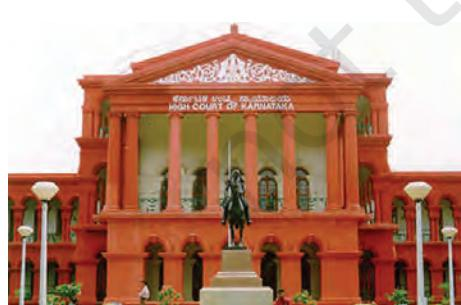

High Court of Karnataka http://karnatakajudiciary.kar.nic.in

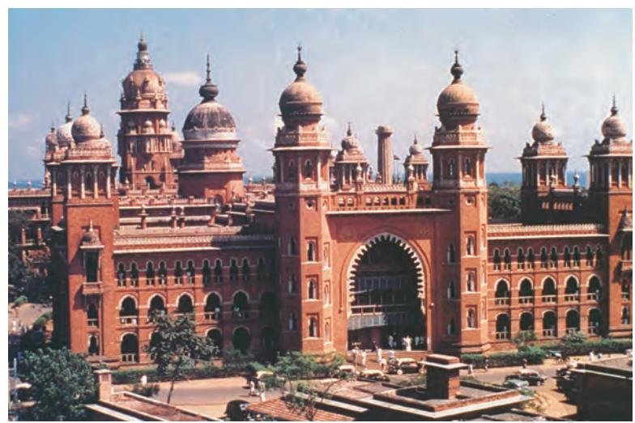

High Court of Madras http://www.hcmadras.tn.nic.in

Are these different levels of courts connected to each other? Yes, they are. In India, we have an integrated judicial system, meaning that the decisions made by higher courts are binding on the lower courts. Another way to understand this integration is through the appellate system that exists in India. This means that a person can appeal to a higher court if they believe that the judgment passed by the lower court is not just.

Let us understand what we mean by the appellate system by tracking a case, State (Delhi Administration) vs Laxman Kumar and Others (1985), from the lower courts to the Supreme Court.

In February 1980, Laxman Kumar married 20-year-old Sudha Goel and they lived in a flat in Delhi with Laxman's brothers and their families. On 2 December 1980 Sudha died in hospital due to burns. Her family filed a case in court. When this case was heard in the Trial Court, four of her neighbours were called in as witnesses. They stated that on the night of December 1, they had heard Sudha scream and had forced their way into Laxman's flat. There they saw Sudha standing with her sari in flames. They extinguished the fire by wrapping Sudha in a gunny bag and a blanket. Sudha told them that her mother-in-law Shakuntala had poured kerosene oil on her and that her husband Laxman had lit the fire. During the trial, members of Sudha's family and a neighbour stated that Sudha had been subjected to torture by her in-laws and that they were demanding more cash, a scooter and a fridge on the birth of the first child. As

Social and Political Life 52

part of their defence, Laxman and his mother stated that Sudha's sari had accidentally caught fire while she was heating milk. On the basis of this and other evidence, the Trial Court convicted Laxman, his mother Shakuntala and his brother-in-law Subash Chandra and sentenced all three of them to death.

In November 1983, the three accused went to the High Court to appeal against this verdict of the Trial Court. The High Court, after hearing the arguments of all the lawyers, decided that Sudha had died due to an accidental fire caused by the kerosene stove. Laxman, Shakuntala and Subash Chandra were acquitted.

You may remember the photo essay on the women's movement in your Class VII book. You read about how, in the 1980s, women's groups across the country spoke out against 'dowry deaths'. They protested against the failure of courts to bring these cases to justice. The above High Court judgment deeply troubled women and they held demonstrations and filed a separate appeal against this High Court decision in the Supreme Court through the Indian Federation of Women Lawyers.

In 1985, the Supreme Court heard this appeal against the acquittal of Laxman and the two members of his family. The Supreme Court heard the arguments of the lawyers and reached a decision that was different from that of the High Court. They found Laxman and his mother guilty but acquitted the brother-in-law Subash because they did not have enough evidence against him. The Supreme Court decided to send the accused to prison for life.

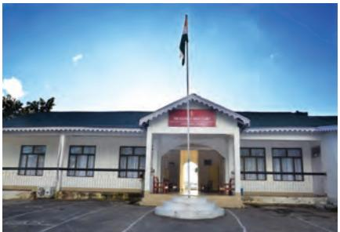

Aizawl (Mizoram) Bench of the Gauhati High Court http://ghcazlbench.nic.in

**Write two sentences of what you understand about the appellate system from the given case.**

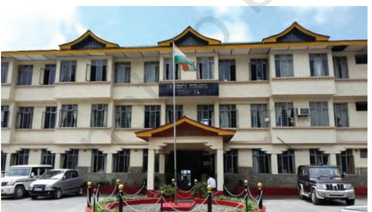

District Courts Complex in Namchi, South Sikkim http://districtcourtsnamchi.nic.in

The subordinate court is more commonly known by many different names. These include the Trial Court or the Court of the District Judge, the Additional Sessions Judge, Chief Judicial Magistrate, Metropolitan Magistrate, Civil Judge.

53

#### **What are the Different Branches of the Legal System?**

The above case of the dowry death falls within what is considered a 'crime against society' and is a violation of criminal law. In addition to criminal law, the legal system also deals with civil law cases. You read in Chapter 4 of how a new civil law was passed in 2006 to protect women against domestic violence. Look at the following table to understand some of the significant differences between criminal and civil law.

| No. | Criminal Law | Civil Law |
| --- | --- | --- |
| 1. | Deals with conduct or acts that the | Deals with any harm or injury to rights |
|  | law defines as offences. For example, | of individuals. For example, disputes |
|  | theft, harassing a woman to bring more | relating to sale of land, purchase of |
|  | dowry, murder. | goods, rent matters, divorce cases. |
| 2. | It usually begins with the lodging of an | A petition has to be filed before the |
|  | First Information Report (FIR) with the | relevant court by the affected party only. |
|  | police who investigate the crime after | In a rent matter, either the landlord or |
|  | which a case is filed in the court. | tenant can file a case. |
| 3. | If found guilty, the accused can be sent | The court gives the specific relief asked |
|  | to jail and also fined. | for. For instance, in a case between a |
|  |  | landlord and a tenant, the court can |
|  |  | order the flat to be vacated and pending |
|  |  | rent to be paid. |

Fill in the table given below based on what you have understood about criminal and civil law.

| Description of Violation | Branch of Law | Procedure to be |
| --- | --- | --- |
|  |  | Followed |
| A group of girls are persistently harassed by a |  |  |
| group of boys while walking to school. |  | Q |
| A tenant who is being forced to move out |  |  |
| files a case in court against the landlord. |  |  |

Social and Political Life 54

#### **Does Everyone Have Access to the Courts?**

In principle, all citizens of India can access the courts in this country. This implies that every citizen has a right to justice through the courts. As you read earlier, the courts play a very significant role in protecting our Fundamental Rights. If any citizen believes that their rights are being violated, then they can approach the court for justice to be done. While the courts are available for all, in reality access to courts has always been difficult for a vast majority of the poor in India. Legal procedures involve a lot of money and paperwork as well as take up a lot of time. For a poor person who cannot read and whose family depends on a daily wage, the idea of going to court to get justice often seems remote.

In response to this, the Supreme Court in the early 1980s devised a mechanism of Public Interest Litigation or PIL to increase access to justice. It allowed any individual or organisation to file a PIL in the High Court or the Supreme Court on behalf of those whose rights were being violated. The legal process was greatly simplified and even a letter or telegram addressed to the Supreme Court or the High Court could be treated as a PIL. In the early years, PIL was used to secure justice on a large number of issues such as rescuing bonded labourers from inhuman work conditions; and securing the release of prisoners in Bihar who had been kept in jail even after their punishment term was complete.

Did you know that the mid-day meal that children now receive in government and government-aided schools is because of a PIL? See the photos on the right and read the text below to understand how this came about.

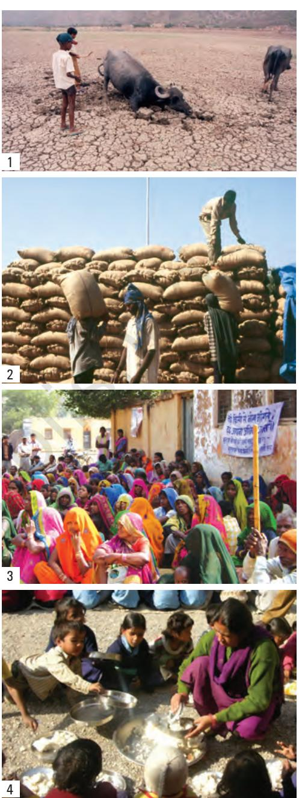

Photo 1. In 2001, the drought in Rajasthan and Orissa meant that millions faced an acute shortage of food.

Photo 2. Meanwhile the government godowns were full of grain. Often this was being eaten away by rats.

Photo 3. In this situation of 'hunger amidst plenty' an organisation called the People's Union of Civil Liberties or PUCL filed a PIL in the Supreme Court. It stated that the fundamental Right to Life guaranteed in Article 21 of the Constitution included the Right to Food. The state's excuse that it did not have adequate funds was shown to be wrong because the godowns were overflowing with grains. The Supreme Court ruled that the State had a duty to provide food to all.

Photo 4. It, therefore, directed the government to provide more employment, to provide food at cheaper prices through the government ration shops, and to provide mid-day meals to children. It also appointed two Food Commissioners to report on the implementation of government schemes.

> 55 Chapter 4: Judiciary

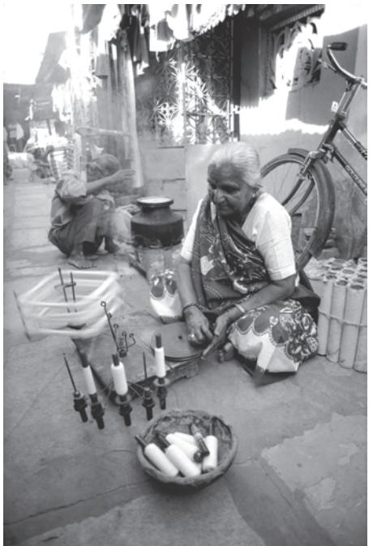

For the common person, access to courts is access to justice. The courts exercise a crucial role in interpreting the Fundamental Rights of citizens and as you saw in the above case, the courts interpreted Article 21 of the Constitution on the Right to Life to include the Right to Food. They, therefore, ordered the State to take certain steps to provide food for all including the mid-day meal scheme.

However, there are also court judgments that people believe work against the best interests of the common person. For example, activists who work on issues concerning the right to shelter and housing for the poor believe that the recent judgments on evictions are a far cry from earlier judgments. While recent judgments tend to view the slum dweller as an encroacher in the city, earlier judgments (like the 1985 Olga Tellis vs Bombay Municipal Corporation) had tried to protect the livelihoods of slum dwellers.

The judgment of the Olga Tellis vs Bombay Municipal Corporation established the Right to Livelihood as part of the Right to Life. The following excerpts from the judgment point to the ways in which the judges linked the issue of the Right to Life to that of livelihood:

The sweep of the Right to Life, conferred by Article 21 is wide and far reaching. 'Life' means something more than mere animal existence. It does not mean merely that life cannot be extinguished or taken away as, for example, by the imposition and execution of the death sentence, except according to procedure established by law. That is but one aspect of the Right to Life. An equally important facet of that right is the right to livelihood because no person can live without the means of living, that is, the means of livelihood.

That the eviction of a person from a pavement or slum will inevitably lead to the deprivation of his means of livelihood, is a proposition which does not have to be established in each individual case …. In the present case that facts constituting empirical evidence justify the conclusion that the petitioners live in slums and on pavements because they have small jobs to nurse in the city and for them there is nowhere else to live. They choose a pavement or a slum in the vicinity of their place of work and to loose the pavement or the slum is to loose the job. The conclusion therefore is that the eviction of the petitioners will lead to deprivation of their livelihood and consequently to the deprivation of life.

*Olga Tellis vs Bombay Municipal Corporation (1985) 3 SCC 545*

**Find out about the Street Vendors (Protection of Livelihood and Regulation of Street Vending) Act, 2014.**

Social and Political Life 56

Another issue that affects the common person's access to justice is the inordinately long number of years that courts take to hear a case. The phrase 'justice delayed is justice denied' is often used to characterise this extended time period that courts take.

|  |  | Number of Judges in India |  |  |
| --- | --- | --- | --- | --- |
| No.* | Name of the Court | Sanctioned | Working | Vacancies |
|  |  | strength | strength |  |
| A | Supreme Court | 34 | 34 | 0 |
| B | High Courts | 1,108 | 775 | 333 |
| C | District and | 25,042 | 19,192 | 5,850 |
|  | Subordinate Courts |  |  |  |

** Data in A and B (as on 19 Decenber 2022)*

However, inspite of this there is no denying that the judiciary has played a crucial role in democratic India, serving as a check on the powers of the executive and the legislature as well as in protecting the Fundamental Rights of citizens. The members of the Constituent Assembly had quite correctly envisioned a system of courts with an independent judiciary as a key feature of our democracy.

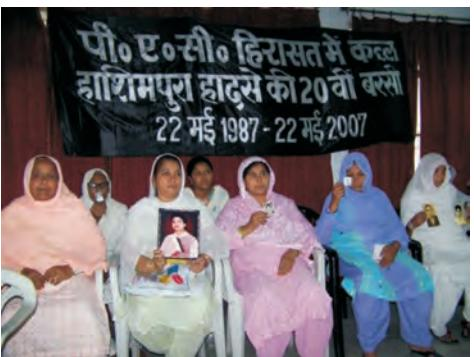

The above photo shows the family members of some of the 43 Muslims of Hashimpura, Meerut, killed on 22 May 1987. These families fought for justice for over 31 years. Due to long delay in the commencement of the trial, the Supreme Court in September 2002 transferred the case from the State of Uttar Pradesh to Delhi. 19 Provincial Armed Constabulary (PAC) men faced criminal prosecution for alleged murder and other offences. By 2007, only three prosecution witnesses had been examined. Finally, the Delhi High Court convicted the accused persons on 31 October 2018. (photo was taken at Press Club, Lucknow, 24 May 2007)

**Discuss the impact of the shortage of judges on the delivery of justice to the litigants.**

57

### Exercises

- 1. You read that one of the main functions of the judiciary is 'upholding the law and Enforcing Fundamental Rights'. Why do you think an independent judiciary is necessary to carry out this important function?
- 2. Re-read the list of Fundamental Rights provided in Chapter 1. How do you think the Right to Constitutional Remedies connects to the idea of judicial review?
- 3. In the following illustration, fill in each tier with the judgments given by the various courts in the Sudha Goel case. Check your responses with others in class.

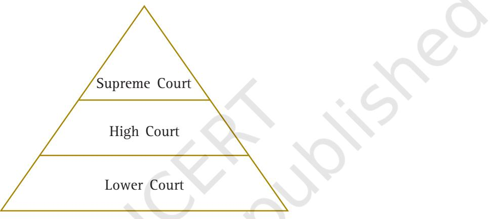

- 4. Keeping the Sudha Goel case in mind, tick the sentences that are true and correct the ones that are false.
(a) The accused took the case to the High Court because they were unhappy with the decision of the Trial Court.

(b) They went to the High Court after the Supreme Court had given its decision.

(c) If they do not like the Supreme Court verdict, the accused can go back again to the Trial Court.

- 5. Why do you think the introduction of Public Interest Litigation (PIL) in the 1980s is a significant step in ensuring access to justice for all?
- 6. Re-read excerpts from the judgment on the *Olga Tellis vs Bombay Municipal Corporation* case. Now write in your own words what the judges meant when they said that the Right to Livelihood was part of the Right to Life.
- 7. Write a story around the theme, 'Justice delayed is justice denied'.
- 8. Make sentences with each of the glossary words given on the next page.

- 9. The following is a poster made by the Right to Food campaign.
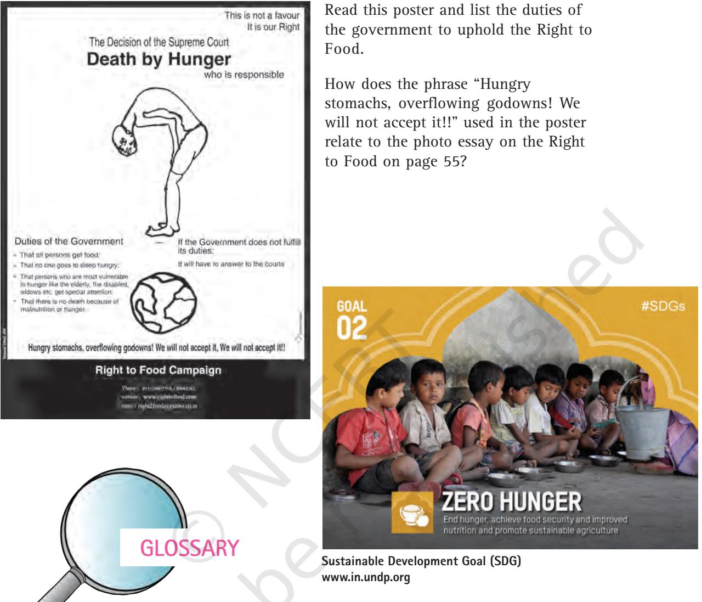

**Acquit:** This refers to the court declaring that a person is not guilty of the crime which he/she was tried for by the court.

**To Appeal**: In the context of this chapter this refers to a petition filed before a higher court to hear a case that has already been decided by a lower court.

**Compensation**: In the context of this chapter this refers to money given to make amends for an injury or a loss.

**Eviction**: In the context of this chapter this refers to the removal of persons from land/ homes that they are currently living in.

**Violation**: In the context of this chapter it refers both to the act of breaking a law as well as to the breach or infringement of Fundamental Rights.

> 59 Chapter 4: Judiciary

