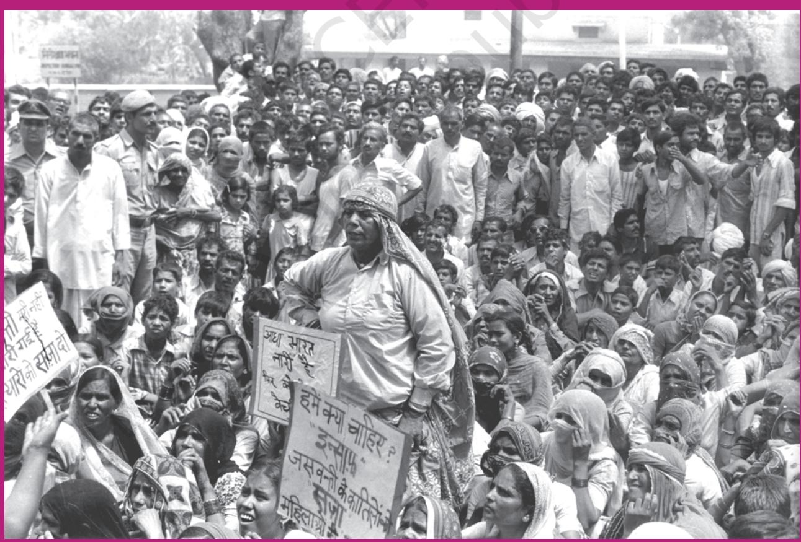
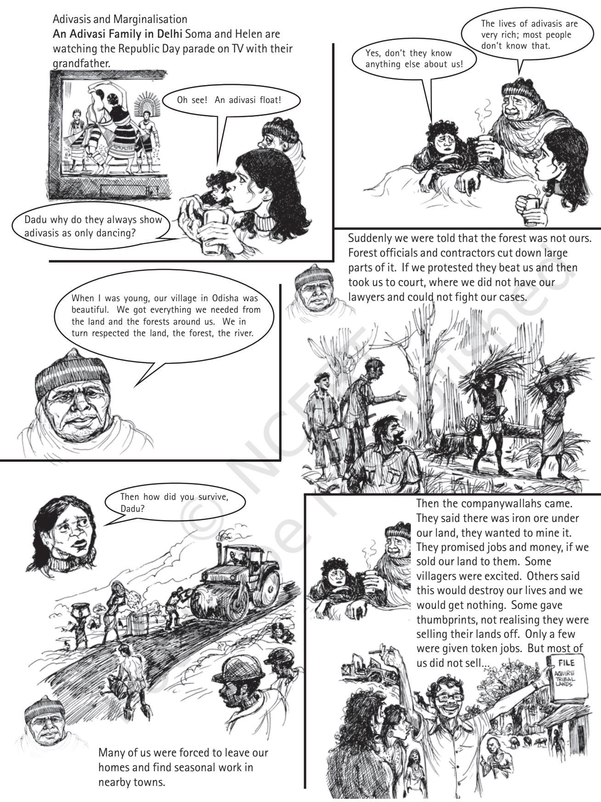
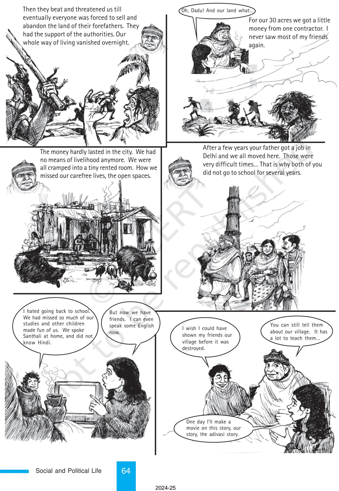
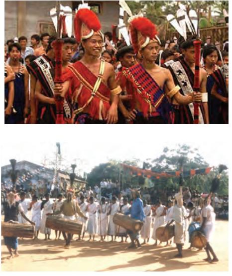
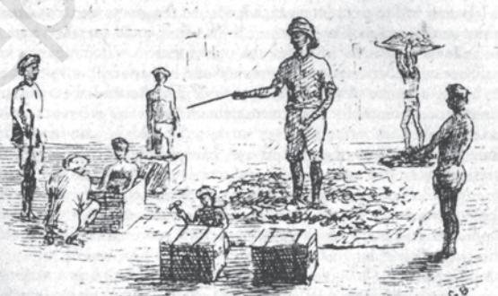
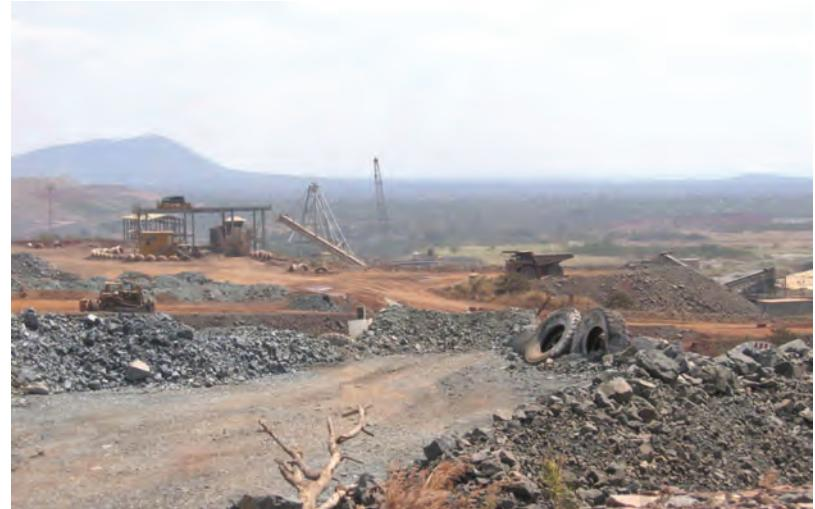
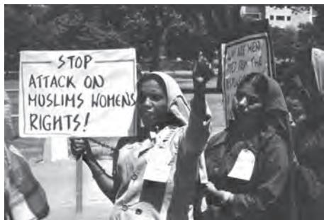
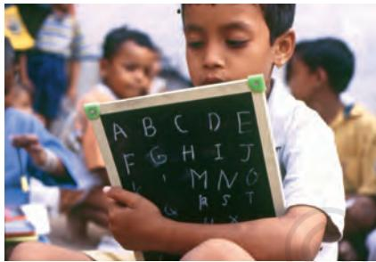

# Unit Four

Social and Political Life 60

## Teacher's Note

Equality is a value and right that we have tried to understand in the *Social and Political Life* series. Over the three years, we have deepened our conceptual understanding of equality. We have distinguished the idea of formal equality from that of substantive equality and the need to move towards establishing the latter. The impact of inequality on access to resources was looked at in the context of women's access to education. Rashsundari Devi and Rokeya Begum's writings point to women's struggles to overcome this denial. We have often pointed to the Fundamental Rights enshrined in our Constitution to highlight why equality and the idea of dignity that it contains is crucial to the functioning of democracy in India.

This unit looks more closely at the ways in which inequality affects different groups and communities by introducing the concept of marginalisation or exclusion from the mainstream. The Unit focuses on three groups, namely the Adivasis, the Muslims and the Dalits. These three groups have been chosen because the causes that contribute to each group's marginalisation are different and they sometimes experience marginalisation in different ways. In teaching this unit, the aim should be to help students identify the factors that contribute to marginalisation as well as be able to recognise and empathise with the marginalised. You could help children identify the marginalised communities in your region. In Chapter 5, we look at the experiences of Adivasi and Muslim communities. Chapter 6 discusses ways in which the government as well as these communities themselves have tried to address marginalisation through various struggles. The government does this through its law-making function and through different policies and schemes that specifically target these communities as beneficiaries.

We have used a variety of pedagogic tools in this unit – data, poems, a storyboard and a casestudy. Use the storyboard to discuss processes of marginalisation experienced by the Adivasis. The case study on Dalits should lead to a discussion on the importance of the SC/ST Act as well as the ways in which this law reflects the Constitution's commitment to Fundamental Rights. To understand the situation of the Muslim community, we have used data from different sources, which can be analysed in the class. Songs and poems have been used in this unit to break down the boundaries created between social science and language textbooks and to establish that, in the everyday lives of communities, this separation does not exist. Moreover, struggles for justice have produced memorable poetry and songs that often do not find a place in textbooks.

This chapter does contain several issues that may lead to contentious discussions within the classroom space. Children are aware of such issues and we have to find a mature way of discussing these. You play a crucial role in facilitating these discussions in order to ensure that no child or group of children feel discriminated against, ridiculed or left out from these discussions.

61

## **Understanding Marginalisation**

## **What Does it Mean to be Socially Marginalised?**

To be marginalised is to be forced to occupy the sides or fringes and thus not be at the centre of things. This is something that some of you have probably experienced in the classroom or playground. If you are not like most people in your class, that is, if your taste in music or films is different, if your accent marks you out from others, if you are less chatty than others in your class, if you don't play the same sport that many of your classmates like, if you dress differently, the chances are that you will not be considered to be 'in' by your peers. So, often, you end up feeling that you are 'not with it' – as if what you say, feel and think and how you act are not quite right or acceptable to others.

As in the classroom, in the social environment too, groups of people or communities may have the experience of being excluded. Their marginalisation can be because they speak a different language, follow different customs or belong to a different religious group from the majority community. They may also feel marginalised because they are poor, considered to be of 'low' social status and viewed as being less human than others. Sometimes, marginalised groups are viewed with hostility and fear. This sense of difference and exclusion leads to communities not having access to resources and opportunities and in their inability to assert their rights. They experience a sense of disadvantage and powerlessness vis-a-vis more powerful and dominant sections of society who own land, are wealthy, better educated and politically powerful. Thus, marginalisation is seldom experienced in one sphere. Economic, social, cultural and political factors work together to make certain groups in society feel marginalised.

In this chapter, you will read about two communities that are considered to be socially marginalised in India today.

Social and Political Life 62

Chapter 5: Understanding Marginalisation

You just read about how Dadu was forced to leave his village in Odisha. Dadu's story is similar to the lives of millions of Adivasis in India. You will read more about the marginalisation of this community in this chapter.

## **Who are Adivasis?**

Adivasis – the term literally means 'original inhabitants' – are communities who lived, and often continue to live, in close association with forests. Around 8 per cent of India's population is Adivasi and many of India's most important mining and industrial centres are located in Adivasi areas – Jamshedpur, Rourkela, Bokaro and Bhilai among others. Adivasis are not a homogeneous population: there are over 500 different Adivasi groups in India. Adivasis are particularly numerous in states like Chhattisgarh, Jharkhand, Madhya Pradesh, Odisha, Gujarat, Maharashtra, Rajasthan, Andhra Pradesh, West Bengal and in the north-eastern states of Arunachal Pradesh, Assam, Manipur, Meghalaya, Mizoram, Nagaland, Sikkim and Tripura. A state like Odisha is home to more than 60 different tribal groups. Adivasi societies are also most distinctive because there is often very little hierarchy among them. This makes them radically different from communities organised around principles of *jati-varna* (caste) or those that were ruled by kings.

Adivasis practise a range of belief systems that are different from other religions. These often involve the worship of ancestors, village and nature spirits, the last associated with and residing in various sites in the landscape – 'mountainspirits', 'river-spirits', 'animal-spirits', etc. The village spirits are often worshipped at specific sacred groves within the village boundary while the ancestral ones are usually worshipped at home. Additionally, Adivasis have always been influenced by different surrounding religions like Shakta, Buddhist, Vaishnav, Bhakti and Christianity. Simultaneously, Adivasi religions themselves have influenced dominant religions of the empires around them, **Explain at least three different reasons why groups may be marginalised.**

**Why was Dadu forced to leave his village in Odisha?**

Tribals are also referred to as Adivasis.

You may have heard the term Scheduled Tribes. Scheduled Tribes is the term used for Adivasis used by the Indian government in various official documents. There is an official list of tribes. Scheduled Tribes are often grouped together with Scheduled Castes in the category Scheduled Castes and Scheduled Tribes.

**In your own city or village, who would you think are the marginalised groups? Discuss.**

**Can you name some Adivasi communities that live in your state?**

**What languages do they speak?**

**Do they live close to the forest?**

**Do they migrate to other regions looking for work?**

The above two images of tribal communities in their traditional costumes are often the only ways in which Adivasi communities are represented. This then leads us to think of them as being 'exotic' and 'backward'.

for example, the Jagannath cult of Odisha and Shakti and Tantric traditions in Bengal and Assam. During the nineteenth century, substantial numbers of Adivasis converted to Christianity, which has emerged as a very important religion in modern Adivasi history.

Adivasis have their own languages (most of them radically different from and possibly as old as Sanskrit), which have often deeply influenced the formation of 'mainstream' Indian languages, like Bengali. Santhali has the largest number of speakers and has a significant body of publications including magazines on the internet or in e-zines.

### **Adivasis and Stereotyping**

In India, we usually 'showcase' Adivasi communities in particular ways. Thus, during school functions or other official events or in books and movies, Adivasis are invariably portrayed in very stereotypical ways – in colourful costumes, headgear and through their dancing. Besides this, we seem to know very little about the realities of their lives. This often wrongly leads to people believing that they are exotic, primitive and backward. Often Adivasis are blamed for their lack of advancement as they are believed to be resistant to change or new ideas. You will remember that you read in Class VI book how stereotyping particular communities can lead to people discriminating against such groups.

## **Adivasis and Development**

As you have already read in your history textbook, forests were absolutely crucial to the development of all empires and settled civilisations in India. Metal ores like iron and copper, and gold and silver, coal and diamonds, invaluable timber, most medicinal herbs and animal products (wax, lac, honey) and animals themselves (elephants, the mainstay of imperial armies), all came from the forests. In addition, the continuation of life depended heavily on forests, that help recharge many of India's rivers and, as is becoming clearer now, crucial to the availability and quality of our air and water. Forests covered the major part of our country till the nineteenth century and the Adivasis had a deep knowledge of, access to, as well as control over most of these vast tracts at least till the middle of the nineteenth century. This meant that they were not ruled by large states and empires. Instead, often empires heavily depended on Adivasis for the crucial access to forest resources.

This is radically contrary to our image of Adivasis today as somewhat marginal and powerless communities. In the precolonial world, they were traditionally ranged huntergatherers and nomads and lived by shifting agriculture and also cultivating in one place. Although these remain, for the past 200 years Adivasis have been increasingly forced – through economic changes, forest policies and political force applied by the State and private industry – to migrate to lives as workers in plantations, at construction sites, in industries and as domestic workers. For the first time in history, they do not control or have much direct access to the forest territories.

From the 1830s onwards, Adivasis from Jharkhand and adjoining areas moved in very large numbers to various plantations in India and the world - Mauritius, the Caribbean and even Australia. India's tea industry became possible with their labour in Assam. Today, there are 70 lakh Adivasis in Assam alone. The story of this migration is full of extreme hardship, torture, heartbreak and death. For example, in the nineteenth century alone five lakh Adivasis had perished in these migrations. The song below captures the hopes of the migrants and the reality they faced in Assam.

*Come Mini, let's go to Assam Our country has so much suffering The country of Assam, oh Mini Has tea gardens full of greenery...*

*The Sardar says work, work*

*The Babu says catch and bring them in The Saheb says I'll take off the skin of your back Hey Jaduram, you deceived us by sending us to Assam* .

Source: Basu, S. *Jharkhand Movement: Ethnicity and Culture of Silence*

**What metals are important in present-day India? Why? Where do they come from? Are there Adivasi populations there?**

**List five products that you use at home that come from the forest.**

**By whom were the following demands being made on forest land?**

**· timber for construction of houses and railways**

**· forest land for mining**

**· forest land for agriculture by non-tribal people**

**· reserved by government as wildlife parks**

**In what ways would this affect tribal people?**

#### **What do you think this poem is trying to convey?**

67 Chapter 5: Understanding Marginalisation This is a photo of Niyamgiri Hill located in Kalahandi district of Odisha. This area is inhabited by Dongarria Konds, an Adivasi community. Niyamgiri is the sacred mountain of this community. A major aluminium company is planning to set up a mine and a refinery here which will displace this Adivasi community. They have strongly resisted this proposed development and have been joined by environmentalists as well. A case against the company is also pending in the Supreme Court.

Adivasis use around 10,000 plant species – approximately 8,000 species are used for medicinal purposes; 325 are used as pesticides; 425 as gums, resins and dyes; 550 as fibres; 3,500 are edible. This entire knowledge system gets wiped out when Adivasis lose their rights over forest lands.

Forest lands have been cleared for timber and to get land for agriculture and industry. Adivasis have also lived in areas that are rich in minerals and other natural resources. These are taken over for mining and other large industrial projects. Powerful forces have often colluded to take over tribal land. Much of the time, the land is taken away forcefully and procedures are not followed. According to official figures, more than 50 per cent of persons displaced due to mines and mining projects are tribals. Another recent survey report by organisations working among Adivasis shows that 79 per cent of the persons displaced from the states of Andhra Pradesh, Chhattisgarh, Odisha and Jharkhand are tribals. Huge tracts of their lands have also gone under the waters of hundreds of dams that have been built in independent India. In the North east, their lands remain highly militarised. As per the data provided by the Wildlife Institute of India (November, 2023), India has 106 national parks covering 44,402.9 sq km and 573 wildlife sanctuaries Covering 123,762.56 sq km. These are areas where tribals originally lived but were evicted from. When they continue to stay in these forests, they are termed encroachers.

Losing their lands and access to the forest means that tribals lose their main sources of livelihood and food. Having gradually lost access to their traditional homelands, many Adivasis have migrated to cities in search of work where they are employed for very low wages in local industries or at building or construction sites. They, thus, get caught

Social and Political Life 68

in a cycle of poverty and deprivation. 45 per cent of tribal groups in rural areas and 35 per cent in urban areas live below the poverty line. This leads to deprivation in other areas. Many tribal children are malnourished. Literacy rates among tribals are also very low.

When Adivasis are displaced from their lands, they lose much more than a source of income. They lose their traditions and customs – a way of living and being. "They took our farming land. They left some houses. They took the cremation ground, temple, well and pond. How will we survive?" says Gobindha Maran, who was displaced due to a refinery project in Odisha.

As you have read, there exists an interconnectedness between the economic and social dimensions of tribal life. Destruction in one sphere naturally impacts the other. Often this process of dispossession and displacement can be painful and violent.

### **Minorities and Marginalisation**

In Unit 1, you read that the Constitution provides safeguards to religious and linguistic minorities as part of our Fundamental Rights. Why do you think these minority groups have been provided these safeguards? The term minority is most commonly used to refer to communities that are numerically small in relation to the rest of the population. However, it is a concept that goes well beyond numbers. It encompasses issues of power, access to resources and has social and cultural dimensions. As you read in Unit 1, the Indian Constitution recognised that the culture of the majority influences the way in which society and government might express themselves. In such cases, size can be a disadvantage and lead to the marginalisation of the relatively smaller communities. Thus, safeguards are needed to protect minority communities against the possibility of being culturally dominated by the majority. They also protect them against any discrimination and disadvantage that they may face. Given certain conditions, communities that are small in number relative to the rest of society may **In your opinion, why is it important that Adivasis should have a say in how their forests and forest lands are used?**

69

**Why do we need safeguards for minorities?**

feel insecure about their lives, assets and well-being. This sense of insecurity may get accentuated if the relations between the minority and majority communities are fraught. The Constitution provides these safeguards because it is committed to protecting India's cultural diversity and promoting equality as well as justice. As you have already read in Chapter 5, the judiciary plays a crucial role in upholding the law and enforcing Fundamental Rights. Every citizen of India can approach the courts if they believe that their Fundamental Rights have been violated. Now let us understand marginalisation in the context of the Muslim community.

#### **Muslims and Marginalisation**

According to 2011 Census, Muslims are 14.2 percent of India's population and are considered to be a marginalized community because of their having comparatively lower status of socio-economic development. The data in the three tables below, derived from different sources, indicate the situation of the Muslim community with regard to basic amenities, literacy and public employment. Read the tables below. What do you think these tables tell us about the socio-economic status of the Muslim community?

| I. Access to Basic Amenities, 2008–2009 (percentage) |  |  |  |
| --- | --- | --- | --- |
| Religious Community | Pucca House | Electricity | Tap Water |
| Hindu | 65.4 | 75.2 | 43.7 |
| Muslim | 63.8 | 67.5 | 35.8 |
| Christian | 69.3 | 86.2 | 48.0 |
| Sikh | 91.3 | 96.0 | 49.3 |

*Source:India Human Development Report 2011*: *Towards Social Inclusion*, Oxford University Press for Institute of Applied Manpower Research, Planning Commission, Government of India, New Delhi, p. 346, 389, 392.

**Which of these communities have the most and the least access to basic amenities?**

Social and Political Life 70

| II. Literacy Rate by Religion, 2011 (percentages) |  |  |  |  |  |  |
| --- | --- | --- | --- | --- | --- | --- |
| All | Hindus | Muslims | Christians | Sikhs | Buddhists | Jains |
| 74 | 63 | 57 | 74 | 67 | 71 | 86 |
|  |  |  |  |  |  | Source: Census of India 2011 |

**Which of these communities have the highest and the lowest literacy rate?**

| III. Public Employment of Muslims (percentages) |  |  |  |  |  |  |  |
| --- | --- | --- | --- | --- | --- | --- | --- |
| Population | IAS | IPS | IFS | Central Public Sector Unit (PSU) | State PSU | Banks | & RBI |
| 13.5 | 3 | 4 | 1.8 | 3.3 | 10.8 | 2.2 |  |
| Source: Social, Economic and Educational Status of the Muslim Community of India, Prime Minister's High Level |  |  |  |  |  |  |  |

Committee Report 2006

#### **What do these figures convey?**

Recognising that Muslims in India were lagging behind in terms of various development indicators, the government set up a high-level committee in 2005. Chaired by Justice Rajindar Sachar, the committee examined the social, economic and educational status of the Muslim community in India. The report discussed in detail the marginalisation of this community and suggested that on a range of social, economic and educational indicators the situation of the Muslim community was comparable to that of other marginalised communities like Scheduled Castes and Scheduled Tribes. For example, according to page 56 of the Report the average years of schooling for Muslim children between the ages of 7-16 is much lower than that of other socio-religious communities.

Economic and social marginalisation experienced by Muslims has other dimensions as well. Like other minorities, Muslim customs and practices are sometimes quite distinct from what is seen as the mainstream. Some – not all – Muslims may wear a *burqa*, sport a long beard, wear a *fez*, and these become ways to identify all Muslims. Because of this, they tend to be identified differently and some people think they are not like the 'rest of us'. Often this becomes an excuse **Read the data related to schooling provided by the Sachar Committee Report:**

- **25 per cent of Muslim children in the 6-14 year age group have either never been enrolled in school or have dropped out. This percentage is much higher than that of any other socio-religious community (page 58).**
**Do you think special measures are required to address this situation?**

71

Muslim women are an important part of the women's movement in India.

The Sachar Committee Report also debunked other prevalent myths about Muslims. It is commonly believed that the Muslims prefer to send their children to Madarsas. The figures show that only 4 per cent of Muslim children are in Madarsas, where as 66 per cent attend government schools and 30 per cent private schools. (page 75)

to treat them differently and discriminate against them. This social marginalization of Muslims in some instances has led to them migrating from places where they have lived, often leading to the ghettoisation of the community. Sometimes, this prejudice has also led to hatred and violence.

In the above section of this chapter, we saw how in the case of the Muslim community there used to be a link between economic and social marginalisation. Earlier in this chapter, you read about the situation of Adivasis. In your Class VII book, you read about the unequal status of women in India. The experiences of all these groups point to the fact that marginalisation is a complex phenomenon requiring a variety of strategies, measures and safeguards to redress the situation. All of us have a stake in protecting the rights defined in the Constitution and the laws and policies framed to realise these rights. Without these, we will never be able to protect the diversity that makes our country unique nor realise the State's commitment to promote equality for all.

## **Conclusion**

In this chapter, we have tried to understand what it means to be a marginalised community. We have tried to look at this through the experiences of different marginalised communities. There are different reasons for each of these communities being marginalised. Each experiences marginalisation in different ways. We have also seen that marginalisation is linked to experiencing disadvantage, prejudice and powerlessness. In India there are several more marginalised communities, like Dalits, of whom you will read more in the next chapter. Marginalisation results in having a low social status and not having equal access to education and other resources.

Yet, the lives of marginalised people can and do change. Thus, no one is marginalised all the time in exactly the same way. If we go back to the two examples of marginalisation we have discussed, we will see that each of these groups has a long history of struggle and resistance. Marginalised communities want to maintain their cultural distinctiveness while having access to rights, development and other opportunities. In the next chapter, we will read about how different groups have confronted marginalisation.

## Exercises

**GLOSSARY**

- 1. Write in your own words two or more sentences of what you understand by the word 'marginalisation'.
- 2. List two reasons why Adivasis are becoming increasingly marginalised.
- 3. Write one reason why you think the Constitution's safeguards to protect minority communities are very important?
- 4. Re-read the section on Minorities and Marginalisation. What do you understand by the term minority?
- 5. You are participating in a debate where you have to provide reasons to support the following statement: 'Muslims are a marginalised community'. Using the data provided in this chapter, list two reasons that you would give.
- 6. Imagine that you are watching the Republic Day parade on TV with a friend and she remarks, "Look at these tribals. They look so exotic. And they seem to be dancing all the time". List three things that you would tell her about the lives of Adivasis in India.
- 7. In the storyboard you read about how Helen hopes to make a movie on the Adivasi story. Can you help her by developing a short story on Adivasis?
- 8. Would you agree with the statement that economic marginalisation and social marginalisation are interlinked? Why?

**Hierarchy:** A graded system or arrangement of persons or things. Usually persons at the bottom of the hierarchy are those who have the least power. The caste system is a hierarchical system and Dalits are considered to be at the lowest end.

**Ghettoisation:** A ghetto is an area or locality that is populated largely by members of a particular community. Ghettoisation refers to the process that leads to such a situation. This may occur due to various social, cultural and economic reasons. Fear or hostility may also compel a community to group together as they feel more secure living amongst their own. Often a 'ghettoised' community has few options of moving out, which may lead to them becoming alienated from the rest of the society.

**Mainstream:** Literally this refers to the main current of a river or stream. In this chapter it is used to refer to a cultural context in which the customs and practices that are followed are those of the dominant community. In connection with this, mainstream is also used to refer to those people or communities that are considered to be at the centre of a society, i.e. often the powerful or dominant group.

**Militarised:** An area where the presence of the armed forces is considerable.

**Malnourished:** A person who does not get adequate nutrition or food.

