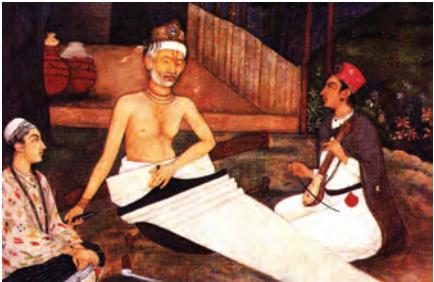
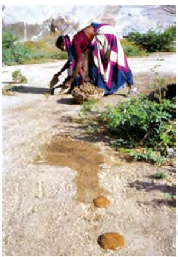
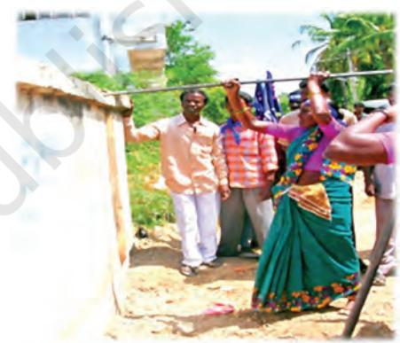
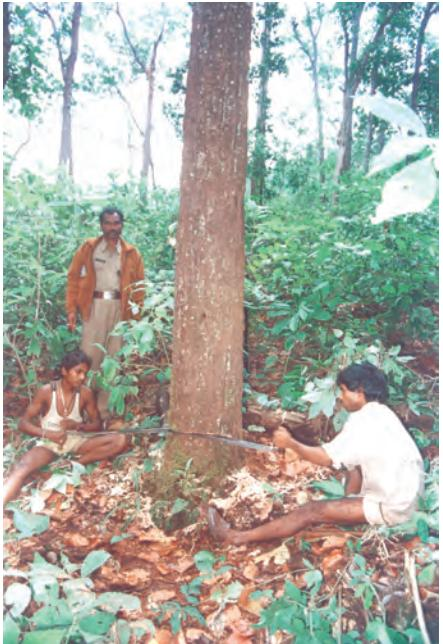

Chapter 6

# **Confronting Marginalisation**

In the previous chapter, we read about two different groups and their experiences of inequality and discrimination. Though powerless, such groups have fought, protested and struggled against being excluded or dominated by others. They have attempted to overcome their situation by adopting a range of strategies in their long history. Religious solace, armed struggle, self improvement and education, economic uplift – there appears to be no one way of doing things. In all cases, the choice of struggle has depended on the circumstances that the marginalised find themselves in.

In this chapter, we will read about some of the ways in which groups and individuals challenge existing inequalities. Adivasis, Dalits, Muslims, women and other marginal groups argue that simply by being citizens of a democratic country, they possess equal rights that must be respected. Many among them look up to the Constitution to address their concerns. In this chapter, we will see why the Constitution of India is something that marginalised groups invoke in the course of their struggles. As part of this, we will look at how rights are translated into laws to protect groups from continued exploitation and we will also look at the government's efforts to formulate policies to promote the access of these groups to development.

Social and Political Life 74

### **Invoking Fundamental Rights**

The Constitution, as you have learnt in the first chapter of this book, lays down the principles that make our society and polity democratic. They are defined in and through the list of Fundamental Rights that are an important part of the Constitution. These rights are available to all Indians equally. As far as the marginalised are concerned, they have drawn on these rights in two ways: first, by insisting on their Fundamental Rights, they have forced the government to recognise the injustice done to them. Second, they have insisted that the government enforce these laws. In some instances, the struggles of the marginalised have influenced the government to frame new laws, in keeping with the spirit of the Fundamental Rights.

Article 17 of the Constitution states that untouchability has been abolished – what this means is that no one can henceforth prevent Dalits from educating themselves, entering temples, using public facilities etc. It also means that it is wrong to practise untouchability and that this practice will not be tolerated by a democratic government. In fact, untouchability is a punishable crime now.

There are other sections in the Constitution that help to strengthen the argument against untouchability – for example, Article 15 of the Constitution notes that no citizen of India shall be discriminated against on the basis of religion, race, caste, sex or place of birth (you learnt a lot about this in your Class VII textbook in the chapter On Equality in Indian Democracy). This has been used by Dalits to seek equality where it has been denied to them.

75 Chapter 6: Confronting Marginalisation The poem below is written by Soyrabai, the wife of the wellknown Bhakti poet Chokhamela from fourteenth century Maharashtra. They belonged to the Mahar caste, which was at that time considered untouchable.

*A body is unclean, they say Only the soul is untainted But the impurity of the body Is born within the body …By which ritual does the body become pure? Not a creature has been born except in a bloody womb. This is the glory of God, Defilement exists within. The body is polluted from within, Be sure of it says the Mahari*

Quoted in Uma Chakravarti, Gendering Caste: Through a Feminist Lens, Stree, 2003, p. 99

*Chokha*

Soyrabai is questioning the idea of purity and arguing that since every human is born in the same manner, there is nothing that makes one body less or more pure than the other. She is possibly also trying to say that pollution, a key tool of the caste system to separate or deny people access to spaces, work, knowledge and dignity, occurs not through the nature of work done, but 'from within'- from your thoughts, values and beliefs.

Therefore, Dalits can 'invoke' or 'draw on' a Fundamental Right (or Rights) in situations where they feel that they have been treated badly by some individual or community, or even by the government. They have drawn the attention of the government of India to the Constitution, demanding that the government abide by it and do justice to them.

Likewise, other minority groups have drawn on the Fundamental Rights section of our Constitution. They have particularly drawn upon the right to freedom of religion and cultural and educational rights. In the case of cultural and educational rights, distinct cultural and religious groups like the Muslims and Parsis have the right to be the guardians of the content of their culture, as well as the right to make decisions on how best this content is to be preserved. Thus, by granting different forms of cultural rights, the Constitution tries to ensure cultural justice to such groups. The Constitution does this so that the culture of these groups is not dominated nor wiped out by the culture of the majority community.

## **Laws for the Marginalised**

As you have read, the government makes laws to protect its citizens. Yet, this is not the only way in which it takes action. There are specific laws and policies for the marginalised in our country. There are policies or schemes that emerge through other means like setting up a committee or by undertaking a survey etc. The government then makes an effort to promote such policies in order to give opportunities to specific groups.

### Promoting Social Justice

As part of their effort to implement the Constitution, both state and central governments create specific schemes for implementation in tribal areas or in areas that have a high Dalit population. For example, the government provides for free or subsidised hostels for students of Dalit and Adivasi communities so that they can avail of education facilities that may not be available in their localities.

In addition to providing certain facilities, the government also operates through laws to ensure that concrete steps are taken to end inequity in the system. One such law/policy is the reservation policy that today is both significant and highly contentious. The laws which reserve seats in education and government employment for Dalits and Adivasis are based on an important argument- that in a society like ours, where for centuries sections of the population have been denied opportunities to learn and to work in order to develop new skills or vocations, a democratic government needs to step in and assist these sections.

How does the reservation policy work? Governments across India have their own list of Scheduled Castes (or Dalits), Scheduled Tribes and backward and most backward castes. The central government too has its list. Students applying to educational institutions and those applying for posts in government are expected to furnish proof of their caste or tribe status, in the form of caste and tribe certificates. (Many government and educational institutions also ask for candidates to mention their caste/tribe status.) If a particular Dalit caste or a certain tribe is on the government list, then a candidate from that caste or tribe can avail of the benefit of reservation.

For admission to colleges, especially to institutes of professional education, such as medical colleges, governments define a set of 'cut-off' marks. This means that not all Dalit and tribal candidates can qualify for admission, but only those who have done reasonably well and secured marks above the cut-off point. Governments also offer special scholarships for these students. In your Class IX Political Science textbook, you will read more on reservations for the backward classes. **State one reason why you think reservations play an important role in providing social justice to Dalits and Adivasis.**

| List of schemes | What is this | How do you think it will help promote |
| --- | --- | --- |
|  | scheme about? | social justice? |
| Scholarships for students |  |  |
| Special police stations |  | Q |
| Special schemes for girls in government schools |  |  |

77 Chapter 6: Confronting Marginalisation

You may have read Kabir's poems in your language textbooks. Kabir was a fifteenth century poet and weaver who also belonged to the Bhakti tradition. Kabir's poetry spoke about his love for the supreme being free of ritual and priests. It also expresses his sharp and pointed criticism of those he saw as powerful. Kabir attacked those who attempted to define individuals on the basis of their religious and caste identities. In his view every person had the ability to reach the highest level of spiritual salvation and deep knowledge within themselves through their own experience. His poetry brings out the powerful idea of the equality of all human beings and their labour. He writes about valuing the work of the ordinary potter, the weaver and the woman carrying the water pot – labour that in his poetry becomes the basis of understanding the entire universe. His direct, courageous challenge inspired many and even today Kabir's poetry is sung and appreciated by Dalits, marginalised groups and those critical of social hierarchies in U.P., Rajasthan, Punjab, Madhya Pradesh, Bengal, Bihar and Gujarat.

## **Protecting the Rights of Dalits and Adivasis**

In addition to policies our country also has specific laws that guard against the discrimination and exploitation of marginalised communities. Let us read the following casestudy, adapted from a real-life account, to understand how Dalits use the protection that laws provide.

The villagers of Jakmalgur are gearing up for a big festival. Once in five years, the local deity is honoured and priests from 20 neighbouring villages come for this five-day event. The ceremony begins with a member of the Dalit community washing the feet of all the priests and then bathing in the water used for this. In Jakmalgur, the person who performed this task belonged to Rathnam's family. His father and grandfather had both performed the same task before him. Though they were never allowed to enter the temple, this ritual was viewed as a great honour bestowed on them on this special occasion. Now it was Rathnam's turn. Rathnam was all of 20 years, studying engineering in a nearby college. He refused to perform the ritual.

He said that he had no faith in this practice and that his family members were forced to perform this ritual because they were Dalits. Rathnam's refusal angered both the powerful castes in the village and some families from his own community. The powerful castes were shocked that such a young boy had the guts to refuse. They believed that it was Rathnam's education which allowed him to imagine that he could start comparing himself with them.

Those from Rathnam's own caste were fearful of angering the powerful. Many worked on their fields as daily-wage labourers. If the dominant castes decided to not call them, then what would they earn? How would they survive? They also declared that the wrath of the local deity would strike them if they refused to give in. Rathnam argued that given that not a single Dalit had ever entered the temple, how could the deity be angry with them?

The powerful castes decided to teach Rathnam a lesson. His community was ordered to ostracise him and his family, and everyone was told that no one should speak or do any work for them or with them. One night some men entered their part of the village and set his hut on fire. He managed to escape with his mother. Rathnam, then went to file a case in the local police station under the Scheduled Castes and the Scheduled Tribes (Prevention of Atrocities) Act, 1989. Other Dalit families still did not come out in his support as they were scared that a similar fate might await them if they spoke out. The case was picked up by the local media that led to many journalists visiting the village. Rathnam was written about as a symbol of Dalit action. The ritual was called off, but his family was forced to move out as they continued to be ostracised by the powerful castes in the village.

### The Scheduled Castes and the Scheduled Tribes (Prevention of Atrocities) Act, 1989

Rathnam sought the support of law, filing his complaint under the above Act to protest against the domination and violence of the powerful castes in his village.

This Act was framed in 1989 in response to demands made by Dalits and others that the government must take seriously the ill treatment and humiliation Dalits and tribal groups face in an everyday sense. While such treatment had persisted for a long time, it had acquired a violent character in the late 1970s and 1980s. During this period, in parts of southern India, a number of assertive Dalit groups came into being and asserted their rights – they refused to perform their so-called caste duties and insisted on being treated equally; like Rathnam they refused to follow practices located in the humiliation and exploitation of Dalits. This resulted in the more powerful castes unleashing violence against them. In order to indicate to the government that untouchability was still being practised and in the most hideous manner, Dalit groups demanded new laws that would list the various sorts of violence against dalits and prescribe stringent punishment for those who indulge in them.

**In your opinion does the force put on Rathnam to perform this ritual violate his Fundamental Rights?**

**Why do you think the Dalit families were afraid of angering the powerful castes?**

79

*Pandit, Look in your heart for knowledge Tell me where untouchability Came from, since you believe in it. Mix red juice, white juice and air A body bakes in a body … We eat by touching, we wash by touching, from a touch the world was born. So who's untouched, asks Kabir? Only she Who is free from delusion*

In this poem, Kabir is challenging the priest by directly questioning at him about where untouchability came from. He asks the priest to look for knowledge in his heart and not in the scriptures. Kabir goes on to describe how every human body is made of blood and air and has spent nine months in the mother's womb. And that everything in the world is created by touching something whether it be a pot, a human being or a painting.

He takes the word untouchable and gives it a very different meaning. He claims that untouchability is the highest state of knowledge: it means not be touched by narrow limiting ideas. Therefore, Kabir finally turns the idea of untouchability on its head- from the lowest to the highest state that a human being can achieve!

Likewise, throughout the 1970s and 1980s Adivasi people successfully organised themselves and demanded equal rights and for their land and resources to be returned to them. They too had to face the anger of powerful social groups and were subject to a great deal of violence.

This is why this Act contains a very long list of crimes, some of which are too horrible even to contemplate. The Act does not only describe terrible crimes, but also lets people know what dreadful deeds human beings are capable of. In this sense, laws such as these seek to both punish as well as influence the way we think and act.

The Act distinguishes several levels of crimes. Firstly, it lists modes of humiliation that are both physically horrific and morally reprehensible and seeks to punish those who (i) force a member of a Scheduled Caste or a Scheduled Tribe to drink or eat any inedible or obnoxious substance; … (iii) forcibly removes clothes from the person of a member of a Scheduled Caste or a Scheduled Tribe or parades him or her naked or with painted face or body or commits any similar act which is derogatory to human dignity…

Secondly, it lists actions that dispossess Dalits and Adivasis of their meagre resources or which force them into performing slave labour. Thus, the Act sets out to punish anyone who (iv) wrongfully occupies or cultivates any land owned by, or allotted to, … a member of a Scheduled Caste or a Scheduled Tribe or gets the land allotted to him transferred;

At another level, the Act recognizes that crimes against Dalit and tribal women are of a specific kind and, therefore, seeks to penalise anyone who (xi) assaults or uses force on any woman belonging to a Scheduled Caste or a Scheduled Tribe with intent to dishonour her …

**Can you list two different provisions in the 1989 Act?**

**Look up the glossary and write in your own words what you understand by the term 'morally reprehensible'.**

Social and Political Life 80

#### **The Scourge of Manual Scavenging**

Manual scavenging refers to the practice of removing human and animal waste/excreta using brooms, tin plates and baskets from dry latrines and carrying it on the head to disposal grounds some distance away. A manual scavenger is the person who does the job of carrying this filth. This job is mainly done by Dalit women and young girls. According to the Andhra Pradesh-based Safai Karamchari Andolan, an organisation working with manual scavengers, there are one lakh persons from Dalit communities who continue to be employed in this job in this country and who work in 26 lakh private and community dry latrines managed by municipalities.

Manual scavengers are exposed to subhuman conditions of work and face serious health hazards. They are constantly exposed to infections that affect their eyes, skin, respiratory and gastro-intestinal systems. They get very low wages for the work they perform. Those working in urban municipalities earn ` 200 per day and those working privately are paid much less.

As you have read earlier in this book, the practice of untouchability has been abolished by the Indian Constitution. However, manual scavengers in different parts of the country, the Bhangis in Gujarat, Pakhis in Andhra Pradesh and the Sikkaliars in Tamil Nadu, continue to be considered untouchable. They often live in separate settlements on the outskirts of the village and are denied access to the temple, public water facilities etc.

In 1993, the government passed the Employment of Manual Scavengers and Construction of Dry Latrines (Prohibition) Act. This law prohibits the employment of manual scavengers as well as the construction of dry latrines. In 2003, the Safai Karamchari Andolan and 13 other organisations and individuals, including seven scavengers, filed a PIL in the Supreme Court. The petitioners complained that manual scavenging still existed and it continued in government undertakings like the railways. The petitioners sought enforcement of their Fundamental Rights. The court observed that the number of manual scavengers in India had increased since the 1993 law. It directed every department/ministry of the union government and state governments to verify the facts within six months. If manual scavenging was found to exist, then the government department has to actively take up a time-bound programme for their liberation and rehabilitation. The Prohibition of Employment as Manual Scavengers and their Rehabilitation Act came into force on 6 December 2013.

A manual scavenger at work

Members of the Safai Karamchari Andolan demolishing a dry latrine.

**What do you understand by manual scavenging?**

**Re-read the list of Fundamental Rights provided on page 14 and list two rights that this practice violates?**

**Why did the Safai Karamchari Andolan file a PIL in 2003? What did they complain about in their petition?**

**What did the Supreme Court do on hearing their case in 2005?**

The central government passed the Scheduled Tribes and Other Traditional Forest Dwellers (Recognition of Forest Rights) Act, 2006. The introduction to the final Act states that this Act is meant to undo the historical injustices meted out to forest dwelling populations in not recognising their rights to land and resources. This Act recognises their right to homestead, cultivable and grazing land and to non-timber forest produce. The Act also points out that the rights of forest dwellers includes conservation of forests and bio-diversity.

## **Adivasi Demands and the 1989 Act**

The 1989 Act is important for another reason – Adivasi activists refer to it to defend their right to occupy land that was traditionally theirs. As you read in the previous chapter Adivasis are often unwilling to move from their land and are forcibly displaced. Activists have asked that those who have forcibly encroached upon tribal lands should be punished under this law. They have also pointed to the fact that this Act merely confirms what has already been promised to tribal people in the Constitution – that land belonging to tribal people cannot be sold to or bought by non-tribal people. In cases where this has happened, the Constitution guarantees the right of tribal people to re-possess their land.

C.K. Janu, an Adivasi activist, has also pointed out that one of the violators of Constitutional rights guaranteed to tribal people are governments in the various states of India – for it is they who allow non-tribal encroachers in the form of timber merchants, paper mills etc, to exploit tribal land, and to forcibly evict tribal people from their traditional forests in the process of declaring forests as reserved or as sanctuaries. She has also noted that in cases where tribals have already been evicted and cannot go back to their lands, they must be compensated. That is, the government must draw up plans and policies for them to live and work elsewhere. After all, governments spend large sums of money on building industrial or other projects on lands taken from tribals – so why should they be reluctant to spend even very modest amounts on rehabilitating the displaced?

## **Conclusion**

As we can see, the existence of a right or a law or even a policy on paper does not mean that it exists in reality. People have had to constantly work on or make efforts to translate these into principles that guide the actions of their fellow citizens or even their leaders. The desire for equality, dignity and respect is not new. It has existed in different forms throughout our history as you have seen in this chapter. Similarly, even in a democratic society, similar processes of struggle, writing, negotiation and organising need to continue.

# Exercises

- 1. List two Fundamental Rights in the Constitution that Dalits can draw upon to insist that they be treated with dignity and as equals. Re-read the Fundamental Rights listed on page 14 to help you answer this question.
- 2. Re-read the story on Rathnam as well as the provisions of the 1989 Scheduled Castes and Scheduled Tribes (Prevention of Atrocities) Act. Now list one reason why you think he used this law to file a complaint.
- 3. Why do Adivasi activists, including C.K. Janu, believe that Adivasis can also use this 1989 Act to fight against dispossession? Is there anything specific in the provisions of the Act that allows her to believe this?
- 4. The poems and the song in this Unit allow you to see the range of ways in which individuals and communities express their opinions, their anger and their sorrow. In class, do the following two exercises:
	- (a) Bring to class a poem that discusses a social issue. Share this with your classmates. Work in small groups with two or more poems to discuss their meaning as well as what the poet is trying to communicate.
	- (b)Identify a marginalised community in your locality. Write a poem, or song, or draw a poster etc to express your feelings as a member of this community.

**Assertive:** An assertive person or group is one that can express themselves and their views strongly.

**Confront:** To come face to face or to challenge someone or something. In the context of this chapter, this refers to groups challenging their marginalisation.

**Dispossessed:** To possess is to own something and to be dispossessed is to have to give up ownership or to give up authority.

**Ostracise:** This means to exclude or banish an individual or a group. In the context of this chapter, it refers to a social boycott of an individual and his family.

**Morally reprehensible:** This refers to an act that violates all norms of decency and dignity that a society believes in. It usually refers to a hideous and repugnant act that goes against all the values that a society has accepted.

**Policy:** A stated course of action that provides direction for the future, sets goals to be achieved or lays out principles or guidelines to be followed and acted upon. In this chapter, we have referred to government policies. But other institutions like schools, companies, etc. also have policies.

