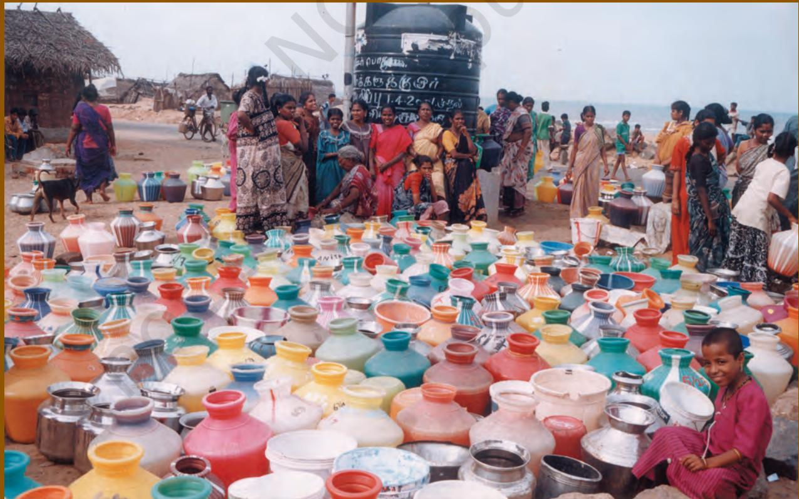
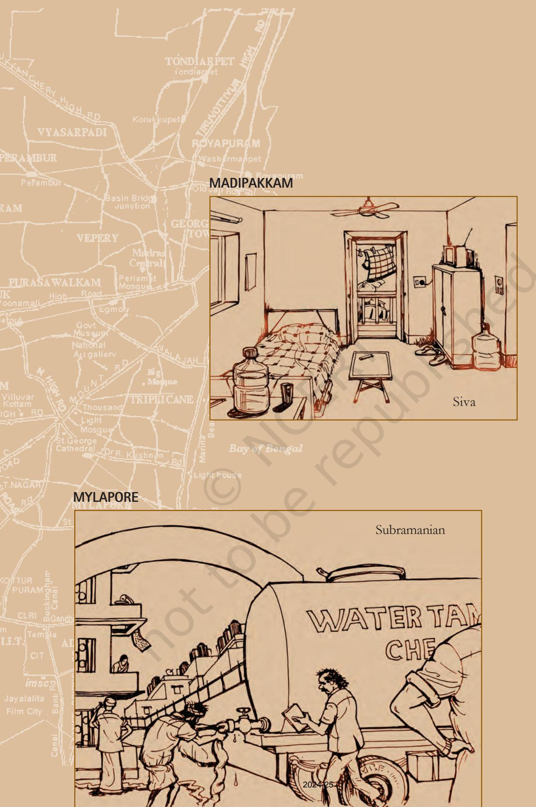
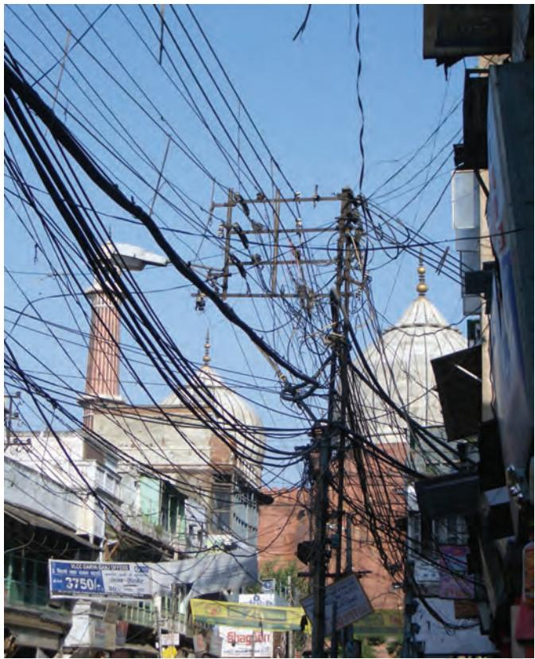

# Unit Five

Social and Political Life 84

# Teacher's Note

This unit discusses the role of the government in providing public facilities as well as in implementing laws that apply to market, factory and the working conditions of people. The aim is to allow students to understand the ways in which this role of the government is linked to concerns addressed in our Fundamental Rights. It is this link to rights that provides a connection to similar issues raised in earlier chapters. Also the discussion in the Class VI and VII textbooks on livelihoods and markets respectively can also be used to provide a context for discussions in Chapter 8.

Chapter 7 uses water as the primary example to discuss public facilities. It is important that the student understand quite clearly what is meant by the idea of public facilities and why the government needs to play a crucial role in their provision and, therefore, take overall responsibility. The idea of equity, or the equal availability, affordability and quality of water for all, is one of the key issues related to public facilities that the chapter highlights. In the classroom discussion, it is crucial to separate the discussion on the importance of the government's role in providing public facilities from their current unequal provision. This means that the fact that persons currently get different amounts of water should not be viewed as a reason for the government not being able to provide public facilities.

Chapter 8 discusses the central role of the government in regulating economic activities. This is largely done through laws and the chapter focuses on the importance of implementing existing laws as well as making new laws to protect the rights of workers, consumers and producers in the market. The Bhopal gas tragedy is discussed as an example of the lax enforcement of the laws. It is quite likely that students might have not heard of this tragedy and it would be helpful to have them research this and perhaps create a wallpaper or skit on this for the entire school. The websites indicated at the end of the book could be used for additional reference material. The Bhopal gas tragedy also marked the moment in which 'environmental' issues became intrinsically linked to laws on the economy and the chapter briefly discusses this as well. The idea of accountability of the manufacturer as well as the government to the workers and the citizens at large is one of the key ideas underlying this chapter.

85

Chapter 7

# **Public Facilities**

Amu and Kumar are travelling through Chennai in a bus. As they go round the city, they observe the water facilities available in different parts of Chennai...

Social and Political Life 86

# **Public Facilities**

**1. You have seen the four situations illustrated above. Based on these, what impression do you get of the water situation in Chennai?**

**2. Pick out the various sources of water for household use from the description alongside.**

**3. What, in your view, is similar, and what is different in Subramanian's and Padma's experiences.**

**4. Write a paragraph describing the water supply situation in your area.**

**5. Why does water flow in a trickle in summer in most places in India? Find out.**

**Discuss: Is there a general shortage of water for everyone in Chennai? Can you think of two reasons why different people get varying amounts of water?**

## **Water and the People of Chennai**

Senior government officials like Mr Ramagopal live in Anna Nagar, Chennai. This area looks lush and green with lawns maintained by a generous spraying of water. Bungalows here have tap water for major part of the day. On days when the water supply is inadequate, Mr Ramagopal speaks to a senior official whom he knows in the municipal water board and a water tanker is easily arranged for his house.

Like most areas of the city, Subramanian's apartments in Mylapore suffers from water shortage. This area gets municipal water once in two days. A private borewell meets some of the residents' water needs. Borewell water is, however, brackish so the residents use it in their toilets and for washing. For other uses, water is purchased from tankers. Subramanian spends upto Rs 500-600 per month on buying water from the tankers. For drinking water, residents have installed water purification systems in their homes.

Siva lives on rent on the first floor of a house in Madipakkam and gets water once in four days. Shortage of water is one major reason why Siva can't bring his family to Chennai. For drinking, Siva buys bottled water.

Padma works as a domestic help in Saidapet and lives in the nearby slum. She pays a rent of Rs 650 for the hutment, which has neither a bathroom nor a tap connection. For 30 such hutments there is a common tap at one corner, in which water comes from a borewell for 20 minutes twice daily. A family gets to fill a maximum of three buckets within this time. The same water is used for washing and drinking. In summer, the flow becomes a trickle, so that one family gets water only at the cost of another. People have to wait long hours for water tankers.

# **Water as Part of the Fundamental Right to Life**

Water is essential for life and for good health. Not only is it necessary for us to be able to meet our daily needs but safe drinking water can prevent many water-related diseases. India has one of the largest number of cases of diseases such as diarrhoea, dysentery, cholera. Over 1,600 Indians, most of them children below the age of five, reportedly die everyday because of water-related diseases. These deaths can be prevented if people have access to safe drinking water.

The Constitution of India recognises the right to water as being a part of the Right to Life under Article 21. This means that it is the right of every person, whether rich or poor, to have sufficient amounts of water to fulfil his/her daily needs at a price that he/she can afford. In other words, there should be universal access to water.

There have been several court cases in which both the High Courts and the Supreme Court have held that the right to safe drinking water is a Fundamental Right. In 2007, the Andhra Pradesh High Court restated this while hearing a case based on a letter written by a villager of Mahbubnagar district on the contamination of drinking water. The villager's complaint was that a textile company was discharging poisonous chemicals into a stream near his village, contaminating ground water, which was the source for irrigation and drinking water. The judges directed the Mahbubnagar district collector to supply 25 litres of water to each person in the village.

"... right to water entitles everyone to sufficient, safe, acceptable, physically accessible and affordable water for personal and domestic use" **United Nations (2002)**

# **Public Facilities**

Like water, there are other essential facilities that need to be provided for everyone. Last year you read about two other such facilities: healthcare and sanitation. Similarly, there are things like electricity, public transport, schools and colleges that are also necessary. These are known as public facilities.

**Sustainable Development Goal (SDG) www.in.undp.org**

89 Chapter 7: Public Facilities

The Indian Constitution guarantees the Right to Education for all children between the ages of 6-14 years. Equity in the schooling facilities available to all children is an important aspect of this Right. However, activists and scholars working on education have documented the fact that schooling in India continues to be highly unequal.

The government needs to play an active role in providing adequate access to proper health facilities for the entire population. This includes the eradication of preventable diseases like polio as shown in the above photograph.

The important characteristic of a public facility is that once it is provided, its benefits can be shared by many people. For instance, a school in the village will enable many children to get educated. Similarly, the supply of electricity to an area can be useful for many people: farmers can run pumpsets to irrigate their fields, people can open small workshops that run on electricity, students will find it easier to study and most people in the village will benefit in some way or the other.

### **The Government's Role**

Given that public facilities are so important, someone must carry the responsibility of providing these to the people. This 'someone' is the government. One of the most important functions of the government is to ensure that these public facilities are made available to everyone. Let us try and understand why the government (and only the government) must bear this responsibility.

We have seen that private companies operate for profit in the market. You read about this in the chapter on the 'Story of a Shirt' in your Class VII book. In most of the public facilities, there is no profit to be had. For example, what profit can accrue to a company for keeping the drains clean or running an anti-malaria campaign? A private company will probably not be interested in undertaking such work.

But, for other public facilities such as schools and hospitals, private companies may well be interested. We have many of these, particularly in large cities. Similarly, if you are living in a city, you will have seen private companies supplying water through tankers or supplying drinking water in sealed bottles. In such cases, private companies provide public facilities but at a price that only some people can afford. Hence, this facility is not available to all at an affordable rate. If we go by the rule that people will get as much as they can pay for then many people who cannot afford to pay for such facilities will be deprived of the opportunity to live a decent life.

Clearly, this is not a desirable option. Public facilities relate to people's basic needs. Any modern society requires that these facilities are provided so that people's basic needs are met. The Right to Life that the Constitution guarantees is for all persons living in this country. The responsibility to provide public facilities, therefore, must be that of the government.

#### **Where does the government get money for public facilities?**

Every year you must have heard the government budget being presented in the Parliament. This is an account of the expenses the government has made on its programmes in the past year and how much it plans to spend in the coming year.

In the budget, the government also announces the various ways in which it plans to meet these expenses. The main source of revenue for the government is the taxes collected from the people, and the government is empowered to collect these taxes and use them for such programmes. For instance, to supply water, the government has to incur costs in pumping water, carrying it over long distances, laying down pipes for distribution, treating the water for impurities, and finally, collecting and treating waste water. It meets these expenses partly from the various taxes that it collects and partly by charging a price for water. This price is set so that most people can afford a certain minimum amount of water for daily use.

As Amu and Kumar ride around Chennai...

Amu: Did you notice that the roads in Saidapet were so bumpy and without streetlights? I wonder what the place is like at night.

Kumar: What better can you expect in a slum!

Amu: Why should slums be like that? Shouldn't they have public facilities?

Kumar: I think public facilities are for all those who live in proper houses in colonies. They are the people who pay taxes.

Amu: Why do you say that! Slum dwellers are also citizens and they have rights too.

Kumar: Arrey! The government will go bankrupt this way!

Amu: Well, it has to find a way. Can you imagine what it would be like to live in a slum without proper roads, water, electricity? Kumar: Err….

Amu: Our Constitution recognises many of the public facilities as being a part of the Right to Life. The government must see that these rights are protected so that everyone can lead a decent life.

#### **Whose point of view do you agree with?**

91 Chapter 9: Public Facilities 1. What are public facilities? Why should the government be responsible for providing public facilities?

**Q** 2. The government can get private companies to deliver some of the public facilities. For instance, contracts for building roads are given to private contractors. Distribution of electricity in Delhi is done by two private companies. However, the government must keep a close watch on these and ensure that they fulfil their commitment to reach these facilities to all people and at affordable prices.

**Why do you think the government must assume the overall responsibility for public facilities even when it gets private companies to do part of the job?**

3. Look at your water bill and find out what the minimum rate is for municipal water in your area. Does the rate increase as the use of water increases? Why do you think the government charges a higher rate for greater use of water?

4. Find out the various kinds of taxes people pay to the government by talking to a salaried person, a person running his or her own factory/business and a shopkeeper. Share your findings in the classroom with your teacher.

Buses are the most important forms of public transport over short distances. It is the main link to the workplace for majority of the working people. With rapid urbanisation, the public bus system even in the major cities has not been able to keep up with the demand.

As an alternative, the government has planned ambitious metro rail projects for Delhi and other metropolitan cities. Rs 11,000 crore was spent from the government budget for the construction of the first segment of the metro-rail in Delhi using the latest technology. People have pointed out that this massive expenditure could have been avoided if only a fraction of this amount was spent on upgrading the public bus system. Would you agree? What do you think could be the solution for other regions of India?

Social and Political Life 92

## **Water Supply to Chennai: Is it Available to All?**

While there is no doubt that public facilities should be made available to all, in reality we see that there is a great shortage of such facilities. In the rest of this chapter, we will read about the provision of water, which as we have seen, is a public facility of great importance.

Water supply in Chennai, as we saw at the beginning of the chapter, is marked by shortages. Municipal supply meets only about half the needs of the people of the city, on an average. There are areas which get water more regularly than others. Those areas that are close to the storage points get more water whereas colonies further away receive less water.

The burden of shortfalls in water supply falls mostly on the poor. The middle class, when faced with water shortages, are able to cope through a variety of private means such as digging borewells, buying water from tankers and using bottled water for drinking.

Apart from the availability of water, access to 'safe' drinking water is also available to some and this depends on what one can afford. Once again, the wealthy have more choices, thanks to the booming market in bottled water and water purifiers. People who can afford it have safe drinking water, whereas the poor are again left out. In reality, therefore, it seems that it is only people with money who have the right to water – a far cry from the goal of universal access to 'sufficient and safe' water.

The shortage of water has opened up opportunities for private companies in a big way. Many private companies are providing water to cities by buying it from places around the city. In Chennai, water is taken from nearby towns like Mamandur, Palur, Karungizhi and from villages to the north of the city using a fleet of over 13,000 water tankers. Every month the water dealers pay farmers an advance for the rights to exploit water sources on their land. This is water taken away not just from agriculture but also from the drinking water supplies of the villagers. Ground water levels have dropped drastically in all these towns and villages as a result.

In rural areas, water is needed both for human use and for use by the cattle. The sources of water are wells, handpumps, ponds and sometimes overhead tanks. Much of these are privately owned. Compared to the urban areas, there is an even greater shortage of public water supply in rural areas.

**Sustainable Development Goal (SDG) www.in.undp.org**

**Discuss: Do you think this would be a right step? What do you think would happen if the government withdraws from the task of supplying water?**

## **In Search of Alternatives**

The situation in Chennai is not unique. A similar scenario of shortages and acute crisis during the summer months is common to other cities of India. The shortage in municipal water is increasingly being filled by an expansion of private companies who are selling water for profit. Also common are the great inequalities in water use. The supply of water per person in an urban area in India should be about 135 litres

per day (about seven buckets) – a standard set by the Urban Water Commission. Whereas people in slums have to make do with less than 20 litres a day per person (one bucket), people living in luxury hotels may consume as much as 1,600 litres (80 buckets) of water per day.

A shortage of municipal water is often taken as a sign of failure of the government. Some people argue that since the government is unable to supply the amount of water that is needed and many of the municipal water departments are running at a loss, we should allow private companies to take over the task of water supply. According to them, private companies can perform better.

Consider the following facts:

- 1. Throughout the world, water supply is a function of the government. There are very few instances of private water supply.
#### **Public Water Supply in Porto Alegre**

Porto Alegre is a city in Brazil. Though there are many poor people in this city, what is remarkable is that it has a far lower number of infant deaths as compared to most other cities of the world. The city's water department has achieved universal access to safe water and this is the main reason behind the lower number of infant deaths. The average price of water is kept low, and the poor are charged half the basic rate. Whatever profit the department makes is used to improve the water supply. The working of the water department is transparent and people can have a direct say in deciding which projects the department should take up. Through a process of public meetings, people hear what the managers have to say and also vote on their priorities.

Social and Political Life 94

- 2. There are areas in the world where public water supply has achieved universal access. (see Box below)
- 3. In a few cases, where the responsibility for water supply was handed over to private companies, there was a steep rise in the price of water, making it unaffordable for many. Cities saw huge protests, with riots breaking out in places like Bolivia, forcing the government to take back the service from private hands.

**Sustainable Development Goal (SDG) www.in.undp.org**

- 4. Within India, there are cases of success in government water departments, though these are few in number and limited to certain areas of their work. The water supply department in Mumbai raises enough money through water charges to cover its expenses on supplying water. In Hyderabad, a report shows that the department has increased coverage and improved performance in revenue collection. In Chennai, the department has taken several initiatives for harvesting rain water to increase the level of groundwater. It has also used the services of private companies for transporting and distributing water but the government water supply department decides the rate for water tankers and gives them permission to operate. Hence they are called 'on contract'.
**Discuss the main ideas in the above section. What do you think can be done to improve water supply?**

**Do you think it is also important to conserve resources like water and electricity, and to use more public transport?**

Mumbai's suburban railway is well-functioning public transport system. It is the densest route in the world, attending to 65 lakh passengers daily. Extending over a distance of 300 kilometers, these local trains allow people living far away from Mumbai to find work in the city. Note that the high cost of housing in cities makes it impossible for an average worker to live in the city.

95 Chapter 7: Public Facilities

#### **Extending Sanitation Facilities**

"'Latrines for us!' they exclaimed in astonishment. 'We go and perform our functions out in the open.' Latrines are for you big people."

Mahatma Gandhi recounting untouchables' grievances, Rajkot Sanitation Committee, 1896

Besides safe drinking water, sanitation is a must in prevention of water-borne diseases. However, the sanitation coverage in India is even lower than that of water. Official figures for 2011 show that 87 percent of the households in India have access to drinking water and about 53 percent have access to sanitation (toilet facilities within the premises of residence). Once again, it is the poor both in the rural and urban areas who lack access to sanitation.

Sulabh, a non-government organisation, has been working for nearly five decades to address the problems of sanitation facing low-caste, low-income people in India. It has constructed more than 8,500 community toilet blocks and 1.5 million household toilets, giving access to sanitation to 20 million people. The majority of the users of Sulabh facilities are from the poor working class.

Sulabh enters into contracts with municipalities or other local authorities to construct toilet blocks with government funds. Local authorities provide land and funds for setting up the services, whereas maintenance costs are sometimes financed through user charges (for example, `2 is charged for use of the latrines in the cities).

Next time you see a Sulabh toilet, you might want to find out yourself how it functions!

**Do you think that lack of access to proper sanitation facilities affects peoples' lives? How?**

**Why do you think that this would impact women and girls more acutely?**

Social and Political Life 96

The rural household electrification stands at 96 percent in 2022. (Source: National Family Health Survey (NFHS–5), 2019–22)

# **Conclusion**

Public facilities relate to our basic needs and the Indian Constitution recognises the right to water, heath, education etc as being a part of the Right to Life. Thus one of the major roles of the government is to ensure adequate public facilities for everyone.

But, progress on this front has been far from satisfactory. There is a shortage in supply and there are inequalities in distribution. Compared to the metros and large cities, towns and villages are under-provided. Compared to wealthy localities, the poorer localities are under-serviced. Handing over these facilities to private companies may not be the answer. Any solution needs to take account of the important fact that every citizen of the country has a right to these facilities which should be provided to her/him in an equitable manner.

# Exercises

- 1. Why do you think there are so few cases of private water supply in the world?
- 2. Do you think water in Chennai is available to and affordable by all? Discuss.
- 3. How is the sale of water by farmers to water dealers in Chennai affecting the local people? Do you think local people can object to such exploitation of ground water? Can the government do anything in this regard?
- 4. Why are most of the private hospitals and private schools located in major cities and not in towns or rural areas?
- 5. Do you think the distribution of public facilities in our country is adequate and fair? Give an example of your own to explain.
- 6. Take some of the public facilities in your area, such as water, electricity, etc. Is there scope to improve these? What in your opinion should be done? Complete the table.

|  | Is it available? | How can it be improved? |
| --- | --- | --- |
| Water |  |  |
| Electricity |  |  |
| Roads |  |  |
| Public Transport |  |  |

- 7. Are the above public facilities shared equally by all the people in your area? Elaborate.
- 8. Data on some of the public facilities are collected as part of the Census. Discuss with your teacher when and how the Census is conducted.
- 9. Private educational institutions schools, colleges, universities, technical and vocational training institutes are coming up in our country in a big way. On the other hand, educational institutes run by the government are becoming relatively less important. What do you think would be the impact of this? Discuss.

**Sanitation:** Provision of facilities for the safe disposal of human urine and faeces. **GLOSSARY**

This is done by construction of toilets and pipes to carry the sewerage and treatment of waste water. This is necessary so as to avoid contamination. **Company:** A company is a form of business set up by people or by the government.

Those that are promoted and owned by individuals or groups are called private companies. For example, Tata Steel is a private company whereas Indian Oil is a company run by the government.

**Universal access:** Universal access is achieved when everyone has physical access to a good and can also afford it. For instance, a tap connection at home will allow physical access to water, and if the price of water is low or is provided free, everyone will be able to afford it.

**Basic needs:** Primary requirements of food, water, shelter, sanitation, healthcare and education necessary for survival.

