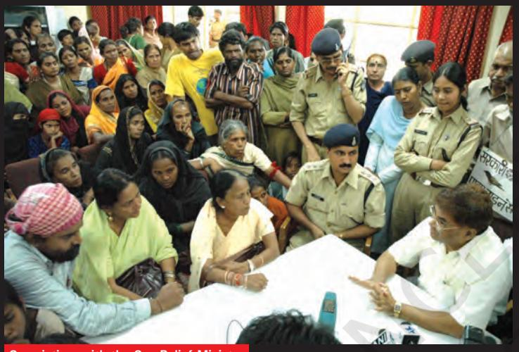
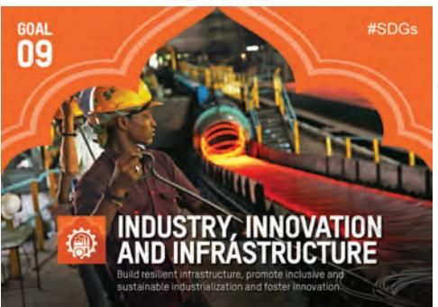

Chapter 8

# **Law and Social Justice**

Do you recall the 'Story of a shirt' from your Class VII book? We saw there that a chain of markets links the producer of cotton to the buyer of the shirt in the supermarket. Buying and selling was taking place at every step in the chain.

Many of the people directly or indirectly involved in the production of the shirt - the small farmer producing cotton, the weavers of Erode or the workers in the garment - exporting factory - faced exploitation or an unfair situation in the market. Markets everywhere tend to be exploitative of people – whether as workers, consumers or producers.

To protect people from such exploitation, the government makes certain laws. These laws try to ensure that the unfair practices are kept at a minimum in the markets.

Let us take a common market situation where the law is very important. This is the issue of workers' wages. Private companies, contractors, businesspersons normally want to make as much profit as they can. In the drive for profits, they might deny workers their rights and not pay them wages, for example. In the eyes of the law it is illegal or wrong to deny workers their wages. Similarly to ensure that workers are not underpaid, or are paid fairly, there is a law on minimum wages. A worker has to be paid not less than the minimum wage by the employer. The minimum wages are revised upwards every few years.

As with the law on minimum wages, which is meant to protect workers, there are also laws that protect the interests of producers and consumers in the market. These help ensure that the relations between these three parties – the worker, consumer and producer - are governed in a manner that is not exploitative.

**Why do we need a law on minimum wages?**

#### **Find out:**

**a) What is the minimum wage for a construction worker in your state?**

**b) Do you think the minimum wage for a construction worker is adequate, low or high?**

**c) Who sets the minimum wages?**

Workers in a textile mill in Ahmedabad. Faced with greater competition from power looms, a majority of the textile mills closed down during the 1980s and 1990s. Power looms are small units with 4-6 looms. The owners operate them with hired and family labour. It is well known that conditions of work in the power looms are far from satisfactory.

Table 1 provides some important laws relating to the protection of these various interests. Columns (2) and (3) in Table 1 state why and for whom these laws are necessary. Based on discussions in the classroom, you have to complete the remaining entries in the table.

| Law | Why is it necessary? | Whose interests does the law protect? |
| --- | --- | --- |
| Minimum Wages Act | Many workers are denied fair | This law is meant to protect the |
| specifies that wages | wages by their employers. | interests of all workers; particularly, |
| should not be below a | Because they badly need work, | farm labourers, construction workers, |
| specified minimum. | workers have no bargaining | factory workers, domestic workers, etc. |
|  | power and are paid low wages. |  |
| Law specifying that |  |  |
| there be adequate |  |  |
| safety measures in |  |  |
| workplaces. For example, |  |  |
| alarm system, emergency |  |  |
| exits, properly - |  |  |
| functioning machinery. |  |  |
| Law requiring that the | Consumers might be put to |  |
| quality of goods meet | risk by the poor quality of |  |
| certain prescribed | products such as electrical |  |
| standards. For example, | appliances, food, medicines. |  |
| electrical appliances |  |  |
| have to meet safety |  |  |
| standards. |  |  |
| Law requiring that the |  | The interests of the poor who will |
| prices of essential |  | otherwise be unable to afford these |
| goods are not high - |  | goods. |
| For example, sugar, |  |  |
| kerosene, foodgrains. |  |  |
| Law requiring that |  |  |
| factories do not pollute |  |  |
| air or water. |  |  |
| Laws against child |  |  |
| labour in workplaces. |  |  |
| Law to form workers | By organising themselves into |  |
| unions/associations | unions, workers can use their |  |
|  | combined power to demand fair |  |
|  | wages and better working |  |
|  | conditions. |  |

### Table 1

But merely making laws is not enough. The government has to ensure that these laws are implemented. This means that the law must be enforced. Enforcement becomes even more important when the law seeks to protect the weak from the strong. For instance, to ensure that every worker gets fair wages, the government has to regularly inspect work sites and punish those who violate the law. When workers are poor or powerless, the fear of losing future earnings or facing reprisals often forces them to accept low wages. Employers know this well and use their power to pay workers less than the fair wage. In such cases, it is crucial that laws are enforced.

Through making, enforcing and upholding these laws, the government can control the activities of individuals or private companies so as to ensure social justice. Many of these laws have their basis in the Fundamental Rights guaranteed by the Indian Constitution. For instance, the Right against Exploitation says that no one can be forced to work for low wages or under bondage. Similarly, the Constitution lays down "no child below the age of 14 years shall be employed to work in any factory or mines or engaged in any other hazardous employment."

How are these laws played out in practice? To what extent do they address the concerns of social justice? These are some of the questions that this chapter will now go on to explore.

According to the 2011 census, over 4 million children in India aged between 5 and 14 work in various occupations including hazardous ones. In 2016, Parliament amended the Child Labour (Prohibition and Regulation) Act, 1986, banning the employment of children below the age of 14 years in all occupations and of adolescents (14-18 years) in hazardous occupations and processes. It made employing these children or adolescents a cognizable offence. Anyone found violating the ban must be penalized with a punishment ranging from a jail term of six months to two years and/or fine of `20,000 to `50,000. The central government had asked state governments to develop plans to rescue and rehabilitate children who are working.

An online portal, https://pencil.gov.in, Platform for Effective Enforcement for No Child Labour (PENCIL) has become functional in 2017. It is meant for filing of complaint, child tracking, implementation and monitoring of National Child Labour Project (NCLP).

## **Bhopal Gas Tragedy**

**The world's worst industrial tragedy took place in Bhopal 24 years ago. Union Carbide (UC) an American company had a factory in the city in which it produced pesticides. At midnight on 2 December 1984 methyl-isocyanite (MIC) a highly poisonous gas - started leaking from this UC plant....**

The next morning

Remembers Aziza Sultan, a survivor: "At about 12.30 am I woke to the sound of my baby coughing badly. In the half-light I saw that the room was filled with a white cloud. I heard people shouting 'run, run'. Then I started coughing, with each breath seeming as if I was breathing in fire. My eyes were burning."

Within three days, more than 8,000 people were dead. Hundreds of thousands were maimed.

Most of those exposed to the poison gas came from poor, working-class families, of which nearly 50,000 people are today too sick to work. Among those who survived, many developed severe respiratory disorders, eye problems and other disorders. Children developed peculiar abnormalities, like the girl in the photo.

A child severely affected by the gas

The disaster was not an accident. UC had deliberately ignored the essential safety measures in order to cut costs. Much before the Bhopal disaster, there had been incidents of gas leak killing a worker and injuring several.

Members of UC Employees Union protesting

Gas victims with the Gas Relief Minister

Despite the overwhelming evidence pointing to UC as responsible for the disaster, it refused to accept responsibility.

In the ensuing legal battle, the government represented the victims in a civil case against UC. It filed a $3 billion compensation case in 1985, but accepted a lowly $470 million in 1989. Survivors appealed against the settlement but the Supreme Court ruled that the settlement amount would stand.

UC stopped its operations, but left behind tons of toxic chemicals. These have seeped into the ground, contaminating water. Dow Chemical, the company who now owns the plant, refuses to take responsibility for clean up.

Bags of chemicals lie strewn around the UC plant

2024-25

24 years later, people are still fighting for justice: for safe drinking water, for health-care facilities and jobs for the people poisoned by UC. They also demand that Anderson, the UC chairman who faces criminal charges, be prosecuted.

Accidents are common to construction sites. Yet, very often, safety equipment and other precautions are ignored.

One part of the answer lies in what is perceived as the worth of an Indian worker. One worker can easily replace another. Since there is so much unemployment, there are many workers who are willing to work in unsafe conditions in

## **What is a Worker's Worth?**

If we are to understand the events leading to Bhopal disaster, we have to ask: why did Union Carbide set up its plant in India?

One reason why foreign companies come to India is for cheap labour. Wages that the companies pay to workers, say in the U.S.A., are far higher than what they have to pay to workers in poorer countries like India. For lower pay, companies can get longer hours of work. Additional expenses such as for housing facilities for workers are also fewer. Thus, companies can save costs and earn higher profits.

Cost cutting can also be done by other more dangerous means. Lower working conditions including lower safety measures are used as ways of cutting costs. In the UC plant, every safety device was malfunctioning or was in short supply. Between 1980 and 1984, the work crew for the MIC plant was cut in half from 12 to 6 workers. The period of safety training for workers was brought down from 6 months to 15 days! The post of night-shift worker for the MIC plant was abolished.

Read the following comparison between UC's safety system in Bhopal and its other plant in the US:

At West Virginia (U.S.A.) computerised warning and monitoring systems were in place, whereas the UC plant in Bhopal relied on manual gauges and the human senses to detect gas leaks. At the West Virginia plant, emergency evacuation plans were in place, but nonexistent in Bhopal.

Why are there such sharp differences in safety standards across countries? And even after the disaster happened, why

was the compensation to the victims so low?

Social and Political Life 106

return for a wage. Making use of the workers' vulnerability, employers ignore safety in workplaces. Thus, even so many years after the Bhopal gas tragedy, there are regular reports of accidents in construction sites, mines or factories due to the callous attitude of the employers.

## **Enforcement of Safety Laws**

As the lawmaker and enforcer, the government is supposed to ensure that safety laws are implemented. It is also the duty of the government to ensure that the Right to Life guaranteed under Article 21 of the Constitution is not violated. What was the government doing when there were such blatant violations of safety standards in the UC plant?

First, the safety laws were lax in India. Second, even these weak safety laws were not enforced.

Government officials refused to recognise the plant as hazardous and allowed it to come up in a populated locality. When some municipal officials in Bhopal objected that the installation of an MIC production unit in 1978 was a safety violation, the position of the government was that the state needs the continued investment of the Bhopal plant, which provides jobs. It was unthinkable, according to them, to ask UC to shift to cleaner technology or safer procedures. Government inspectors continued to approve the procedures in the plant, even when repeated incidents of leaks from the plant made it obvious to everybody that things were seriously wrong.

This, as you know, is contrary to what the role of a lawmaking and enforcement agency should be. Instead of protecting the interests of the people, their safety was being disregarded both by the government and by private companies.

This is obviously not at all desirable. With more industries being set up both by local and foreign businesses in India, there is a great need for stronger laws protecting workers' rights and better enforcement of these laws.

**Why do you think enforcement of safety laws is important in any factory?**

**Can you point to a few other situations where laws (or rules) exist but people do not follow them because of poor enforcement? (For example, over-speeding by motorists, not wearing helmet/seat belt and use of mobile phone while driving). What are the problems in enforcement? Can you suggest some ways in which enforcement can be improved?**

Recently a large travel agency was asked to pay Rs 8 lakh as compensation to a group of tourists. Their foreign trip was poorly managed and they missed Disneyland and shopping in Paris. Why did the victims of Bhopal gas tragedy then get so little for a lifetime of misery and pain?

Pumps at contaminated wells are painted red by the government around the UC factory in Bhopal. Yet, local people continue to use them as they have no other accessible source of clean water.

**Sustainable Development Goal (SDG) www.in.undp.org**

**A 'clean environment is a public facility.' Can you explain this statement?**

#### **Why do we need new laws?**

**Why are companies and contractors able to violate environmental laws?**

### **New Laws to Protect the Environment**

In 1984, there were very few laws protecting the environment in India, and the there was hardly any enforcement of these laws. The environment was treated as a 'free' entity and any industry could pollute the air and water without any restrictions. Whether it was our rivers, air, groundwater - the environment was being polluted and the health of people disregarded.

Thus, not only was UC a beneficiary of lower safety standards, it didn't have to spend any money to clean up the pollution. In the U.S.A., this is a necessary part of the production process.

The Bhopal disaster brought the issue of environment to the forefront. Several thousands of persons who were not associated with the factory in any way were greatly affected because of the poisonous gases leaked from the plant. This made people realise that the existing laws, though weak, only covered the individual worker and not persons who might be injured due to industrial accidents.

In response to this pressure from environmental activists and others, in the years following the Bhopal gas tragedy, the Indian government introduced new laws on the environment. Henceforth, the polluter was to be held accountable for the damage done to environment. The environment is something that people over generations will share, and it could not be destroyed merely for industrial development.

The courts also gave a number of judgments upholding the right to a healthy environment as intrinsic to the Fundamental Right to Life. In Subhash Kumar vs. State of Bihar (1991), the Supreme Court held that the Right to Life is a Fundamental Right under Article 21 of the Constitution and it includes the right to the enjoyment of pollution-free water and air for full enjoyment of life. The government is responsible for setting up laws and procedures that can check pollution, clean rivers and introduce heavy fines for those who pollute.

#### **Environment as a Public Facility**

In recent years, while the courts have come out with strong orders on environmental issues, these have sometimes affected people's livelihoods adversely.

For instance, the courts directed industries in residential areas in Delhi to close down or shift out of the city. Several of these industries were polluting the neighbourhood and discharge from these industries was polluting the river Yamuna, because they had been set up without following the rules.

But, while the court's action solved one problem, it created another. Because of the closure, many workers lost their jobs. Others were forced to go to far-away places where these factories had relocated. And the same problem now began to come up in these areas – for now these places became polluted. And the issue of the safety conditions of workers remained unaddressed.

Recent research on environmental issues in India has highlighted the fact that the growing concern for the environment among the middle classes is often at the expense of the poor. So, for example, slums need to be cleaned as part of a city's beautification drive, or as in the case above, a polluting factory is moved to the outskirts of the city. And while this awareness of the need for a clean environment is increasing, there is little concern for the safety of the workers themselves.

The challenge is to look for solutions where everyone can benefit from a clean environment. One way this can be done is to gradually move to cleaner technologies and processes in factories. The government has to encourage and support factories to do this. It will need to fine those who pollute. This will ensure that the workers livelihoods are protected and both workers and communities living around the factories enjoy a safe environment.

**Do you think everyone got justice in the case cited above?**

**Can you think of other ways in which the environment can be protected? Discuss in class.**

Emissions from vehicles are a major cause of environmental pollution. In a series of rulings (1998 onwards), the Supreme Court had ordered all public transport vehicles using diesel were to switch to Compressed Natural Gas (CNG). As a result of this move, air pollution in cities like Delhi came down considerably. But a recent report by the Center for Science and Environment, New Delhi, shows the presence of high levels of toxic substance in the air. This is due to emissions from cars run on diesel (rather than petrol) and a sharp increase in the number of cars on the road.

Workers outside closed factories. Thrown out of work, many of the workers end up as small traders or as daily-wage labourers. Some might find work in even smaller production units, where the conditions of work are even more exploitative and the enforcement of laws weaker.

Advanced countries are relocating the toxic and hazardous industries to developing countries to take advantage of the weaker laws in these countries and keep their own countries safe. South Asian countries – particularly India, Bangladesh and Pakistan – play hosts for industries producing pesticides, asbestos or processing zinc and lead.

Ship-breaking is another hazardous industry that is growing rapidly in South Asia. Old ships no longer in use, are sent to ship-yards in Bangladesh and India for scrapping. These ships contain potentially dangerous and harmful substances. This photo shows workers breaking down a ship in Alang, Gujarat.

**Sustainable Development Goal (SDG) www.in.undp.org**

## **Conclusion**

Laws are necessary in many situations, whether this be the market, office or factory so as to protect people from unfair practices. Private companies, contractors, business persons, in order to make higher profits, resort to unfair practices such as paying workers low wages, employing children for work, ignoring the conditions of work, ignoring the damage to the environment (and hence to the people in the neighbourhood) etc.

A major role of the government, therefore, is to control the activities of private companies by making, enforcing and upholding laws so as to prevent unfair practices and ensure social justice. This means that the government has to make 'appropriate laws' and also has to enforce the laws. Laws that are weak and poorly enforced can cause serious harm, as the Bhopal gas tragedy showed.

While the government has a leading role in this respect, people can exert pressure so that both private companies and the government act in the interests of society. Environment, as we saw, is one example where people have pushed a public cause and the courts have upheld the right to healthy environment as intrinsic to the Right to Life. In this chapter, we have argued that people now must demand that this facility of healthy environment be extended to all. Likewise, workers' rights (right to work, right to a fair wage and decent work conditions) is an area where the situation is still very unfair. People must demand stronger laws protecting workers' interests so that the Right to Life is achieved for all.

Social and Political Life 110

# Exercises

- 1. Talk to two workers (For example, construction workers, farm workers, factory workers, workers at any shop) to find out if they are receiving the minimum wages laid down by law.
- 2. What are the advantages to foreign companies in setting up production in India?
- 3. Do you think the victims of the Bhopal gas tragedy got justice? Discuss.
- 4. What do we mean when we speak of law enforcement? Who is responsible for enforcement? Why is enforcement so important?
- 5. How can laws ensure that markets work in a manner that is fair? Give two examples to support your answer.
- 6. Imagine yourself to be a worker working in a chemical factory, which has received orders from the government to move to a different site 100 kms away from the present location. Write about how your life would change? Read out your responses in the classroom.
- 7. Write a paragraph on the various roles of the government that you have read about in this unit.
- 8. What are the sources of environmental pollution in your area? Discuss with respect to (a) air; (b) water and (c) soil. What are the steps being taken to reduce the pollution? Can you suggest some other measures?
- 9. How was environment treated earlier? What has been the change in perception? Discuss.

- 10. What do you think the famous cartoonist R.K. Laxman is trying to convey in this cartoon? How does it relate to the 2016 law that you read about on page 103?
It's really cruel burdening kids like this. I had to hire that boy to help my son!

- 11. You have read about the Bhopal gas tragedy and the on-going struggle. Students from countries across the world have come together to support this struggle for justice. From protest marches to awareness campaigns, you can read about their activities on the website www.studentsforbhopal.com. The website also has resources such as photos, posters, documentaries, victims' statements, etc.
Use this and other sources to make a wallpaper/exhibition on the Bhopal gas tragedy for your classroom. Invite the whole school to see and talk about it.

**Consumer:** An individual who buys goods for personal use and not for resale.

**Producer:** A person or organisation that produces goods for sale in the market. At times, the producer keeps a part of the produce for his own use, like a farmer.

**Investment:** Money spent to purchase new machinery or buildings or training so as to be able to increase/ modernise production in the future.

**Workers' unions**: An association of workers. Workers' unions are common in factories and offices, but might be also found among other types of workers, say domestic workers' unions. The leaders of the union bargain and negotiate with the employer on behalf of its members. The issues include wages, work rules, rules governing hiring, firing and promotion of workers, benefits and workplace safety.

### **The Constitution as a Living Ideal**

The Right to Life is a Fundamental Right that the Constitution guarantees to all the citizens of this country. As you have read in this book, over the years this right, or Article 21, has been used by ordinary citizens to include issues to make this Right more meaningful and substantial. So for example, you have read of how the case of the injured farmer Hakim Sheikh established the right to health as part of the Right to Life. Similarly, you read of how the case of the slum-dwellers being evicted from Mumbai established the right to livelihood as part of the Right to Life. In this chapter, you have read about ho*w* the court ruled in favour of a person's Right to the "enjoyment of pollution free water and air for full enjoyment of life" as part of the Right to Life. In addition to these cases, the courts have also ruled to include the right to education and the right to shelter within this expanded understanding of Article 21.

The above expanded understanding of the Right to Life was achieved through the efforts of ordinary citizens to get justice from the courts when they believed that their Fundamental Rights were being violated. As you read in several instances in this book, these Fundamental Rights have also served time and again as the basis for the making of new laws and establishing certain policies to protect all citizens. All of this is possible because our Constitution contains certain constitutive rules that work towards protecting the dignity and self-respect of all citizens of India and guard against all forms of possible violations. What these should include is spelt out in the various provisions on Fundamental Rights and the rule of law.

But as the above cases highlight, there is also an intrinsic flexibility to our Constitution that allows for a continually expanding list of issues to be included within the idea of dignity and justice that the Constitution guarantees. This flexibility allows for new interpretations and, therefore, the Constitution can be considered to be a living document. Thus, the right to health, the right to shelter etc, are issues that were not present in written form in the Constitution that members of the Constituent Assembly had presented in 1949. But they were present in spirit, i.e. the democratic ideals that the Constitution established allowed for persons to use the political process to continually ensure that these ideals became a reality in the lives of ordinary citizens.

As the chapters in this book discuss, much has been done in this process of making Constitutional ideals into a reality. But as these chapters also point out, a lot still remains to be done. Several struggles by people in different parts of the country serve as a continual reminder that serious issues of equality, dignity and self-respect remain to be realised in the lives of the majority. These struggles, as you read in your Class VII book, are often not covered by the media. But this does not in any way diminish the attention that they deserve.

The various chapters in this book have tried to make clear to you the democratic ideals that the Constitution contains and the ways in which it affects people's daily lives. We have done this with the intent that this might provide you the tools with which you can critically begin to understand and examine the world around you, and participate in it as the Constitution prescribes.

## **REFERENCES**

#### BOOKS

- AUSTIN, GRANVILLE. 1966. *The Indian Constitution: Cornerstone of a Nation.* Oxford: Clarendon Press.
- AUSTIN, GRANVILLE. 1999. *Working a Democratic Constitution: The Indian Experience*. New Delhi: Oxford.
- LAWYER'S COLLECTIVE, 2007. *Staying Alive: First Monitoring and Evaluation Report 2007 on the Protection of Women from Domestic Violence Act 2005*. New Delhi: Lawyer's Collective.
- RAMASWAMY, GITA. 2005. *India Stinking: Manual Scavengers in Andhra Pradesh and Their Work.* New Delhi: Navanaya Publishing.

#### ARTICLES

- P. SAINATH, "Whose Sacrifice is it Anyway?" *The Hindu.* 6 September 1998.
- HARI PHUYAL, "Nepal's New Constitution: 65 Years in the Making", *The Diplomat*, 18 September 2015. https://thediplomat.com (Accessed on 19 September 2017)

#### LEGAL CASES

*Olga Tellis vs. Bombay Municipal Corporation* (1985) 3 SCC 545. *Paschim Banga Khet Mazdoor Samiti vs. State of West Bengal (1996) State (Delhi Administration) vs. Laxman Kumar* and other (1985) 4 SCC 476. *Subhash Kumar vs. State of Bihar* (1991) 1 SCC 598.

#### WEBSITES

- Bhopal Gas Tragedy, http://www.studentsforbhopal.org/WhatHappened.htm (Accessed on 12 January 2008)
- C.K. Janu,( www.countercurrents.org (Accessed on 12 November 2007)
- Democracy in Nepal, http://www.himalmag.com (Accessed on 15 December 2007)
- Election Commission of India, https://eci.gov.in
- Lok Sabha, http://loksabha.nic.in
- Manual scavenging, http://in.one.un.org/page/breaking-free-rehabilitating-manual-scavengers/ (Accessed on 24 October 2017)
- On Manual Scavenging, www.hrdc.net/sahrdc/hrfeatures/HRF 129.html (Accessed on 2 January 2008)

Rajya Sabha, https://rajyasabha.nic.in

- Supreme Court of India, https://www.sci.gov.in
- Sustainable Development Goals (SDGs), www.in.undp.org

