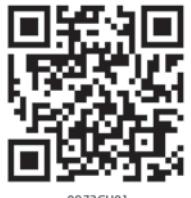

CHAPTER 1

# What is Democracy? Why Democracy?

### **OVERVIEW**

What is democracy? What are its features? This chapter builds on a simple definition of democracy. Step by step, we work out the meaning of the terms involved in this definition. The aim here is to understand clearly the bare minimum features of a democratic form of government. After going through this chapter we should be able to distinguish a democratic form of government from a non-democratic government. Towards the end of this chapter, we step beyond this minimal objective and introduce a broader idea of democracy.

Democracy is the most prevalent form of government in the world today and it is expanding to more countries. But why is it so? What makes it better than other forms of government? That is the second big question that we take up in this chapter.

### **1.1 WHAT IS DEMOCRACY?**

You have already read about different forms of government. On the basis of your understanding of democracy so far, mentioning a few examples write down some common features of:

- < Democratic governments
- < Non-democratic governments

### Why define democracy?

Before we proceed further, let us first take note of an objection by Merry. She does not like this way of defining democracy and wants to ask some basic questions. Her teacher Matilda Lyngdoh responds to her questions, as other classmates join the discussion:

- Merry: Ma'am, I don't like this idea. First we spend time discussing democracy and then we want to find out the meaning of democracy. I mean logically shouldn't we have approached it the other way round? Shouldn't the meaning have come first and then the example?
- Lyngdoh Madam: I can see your point. But that is not how we reason in everyday life. We use words like pen, rain or love. Do we wait to have a definition of these words before we use them? Come to think of it, do we have clear definition of these words? It is only by using a word that we understand its meaning.

Merry: But then why do we need definitions at all?

- Lyngdoh Madam: We need a definition only when we come across a difficulty in the use of a word. We need a definition of rain only when we wish to distinguish it from, say, drizzle or cloudburst. The same is true for democracy. We need a clear definition only because people use it for different purposes, because very different kinds of governments call themselves democracy.
- Ribiang: But why do we need to work on a definition? The other day you quoted Abraham Lincoln to us: "Democracy is government of the people, by the people and for the people". We in Meghalaya always ruled ourselves. That is accepted by everyone. Why do we need to change that?
- Lyngdoh Madam: I am not saying we need to change it. I too find this definition very beautiful.

But we don't know if this is the best way of defining unless we think about it ourselves. We must not accept something just because it is famous, just because everyone accepts it.

- Yolanda: Ma'am, can I suggest something? We don't need to look for any definition. I read somewhere that the word democracy comes from a Greek word 'Demokratia'. In Greek 'demos' means people and 'kratia' means rule. So democracy is rule by the people. This is the correct meaning. Where is the need to debate?
- Lyngdoh Madam: That is also a very helpful way of thinking about this matter. I would just say that this does not always work. A word does not remain tied to its origin. Just think of computers. Originally they were used for computing, that is to say calculating, very difficult mathematical sums. These were very powerful calculators. But nowadays very few people use computers for computing sums. They use it for writing, for designing, for listening to music and for watching films. Words remain the same but their meaning can change with time. In that case it is not very useful to look at the origins of a word.

Merry: Ma'am, so basically what you are saying is that there is no shortcut to our thinking about the matter ourselves. We have to think about its meaning and evolve a definition.

Lyngdoh Madam: You got me right. Let us get on with it now.

Let us take Lyngdoh Madam seriously and try to write down the exact definition of some of the simple words that we use all the time: pen, rain and love. For example, is there a way of defining a pen that distinguishes it clearly from a pencil, a brush, a chalk or crayon.

- < What have you learnt from this attempt?
- < What does it teach us about understanding the meaning of democracy?

### A simple definition

Let us get back to our discussion on similarities and differences among governments that are called

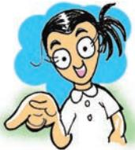

I have heard a different version. Democracy is off the people, far (from) the people and (where they) buy the people. Why don't we accept that?

democracies. One simple factor common to all democracies is: the government is chosen by the people. We could thus start with a simple definition: democracy is a form of government in which the rulers are elected by the people.

This is a useful starting point. This definition allows us to separate democracy from forms of government that are clearly not democratic. The army rulers of Myanmar were not elected by the people. Those who happened to be in control of the army became the rulers of the country. People had no say in this decision. Dictators like Pinochet (Chile) are not elected by the people. This also applies to monarchies. The kings of Saudi Arabia rule not because the people have chosen them to do so but because they happen to be born into the royal family.

This simple definition is not adequate. It reminds us that democracy is people's rule. But if we use this definition in an unthinking manner, we would end up calling almost every government that holds an election a democracy. That would be very misleading. As we shall find out in Chapter 3, every government in contemporary world wants to be called a democracy, even if it is not so. That is why we need to carefully distinguish between a government that is a democracy and one that pretends to be one. We can do so by understanding each word in this definition carefully and spelling out the features of a democratic government.

Ribiang went back home and collected some more famous quotations on democracy. This time she did not mention the names of the people who said or wrote these. She wants you to read these and comment on how good or useful these thoughts are:

- < Democracy gives every man the right to be his own oppressor.
- < Democracy consists of choosing your dictators after they've told you what you think it is you want to hear.
- < Man's capacity for justice makes democracy possible, but man's inclination to injustice makes democracy necessary
- < Democracy is a device that insures we shall be governed no better than we deserve.
- < All the ills of democracy can be cured by more democracy.

## read the cartoon

CHECK YOUR

PROGRESS

This cartoon was drawn when elections were held in Iraq with the presence of US and other foreign powers. What do you think this cartoon is saying? Why is 'democracy' written the way it is?

©Stephane Peray, Thailand, Cagle Cartoons Inc.

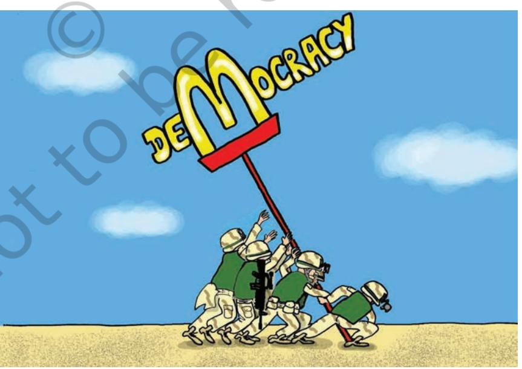

**WHAT IS DEMOCRACY? WHY DEMOCRACY?** 3

### **1.2 FEATURES OF DEMOCRACY**

We have started with a simple definition that democracy is a form of government in which the rulers are elected by the people. This raises many questions:

- < Who are the rulers in this definition? Which officials must be elected for any government to be called a democracy? Which decisions may be taken by nonelected officials in a democracy?
- < What kind of election constitutes a democratic election? What conditions must be fulfilled for an election to be considered democratic?
- < Who are the people who can elect the rulers or get elected as rulers? Should this include every citizen on an equal basis? Can a democracy deny some citizens this right?
- < Finally, what kind of a form of government is democracy? Can elected rulers do whatever they

want in a democracy? Or must a democratic government function with some limits? Is it necessary for a democracy to respect some rights of the citizens?

Let us consider each of these questions with the help of some examples.

### Major decisions by elected leaders l e a d e r sl e a d e r s

In Pakistan, General Pervez Musharraf led a military coup in October 1999. He overthrew a democratically elected government and declared himself the 'Chief Executive' of the country. Later he changed his designation to President and in 2002 held a referendum in the country that granted him a fiveyear extension. Pakistani media, human rights organisations and democracy activists said that the referendum was based on

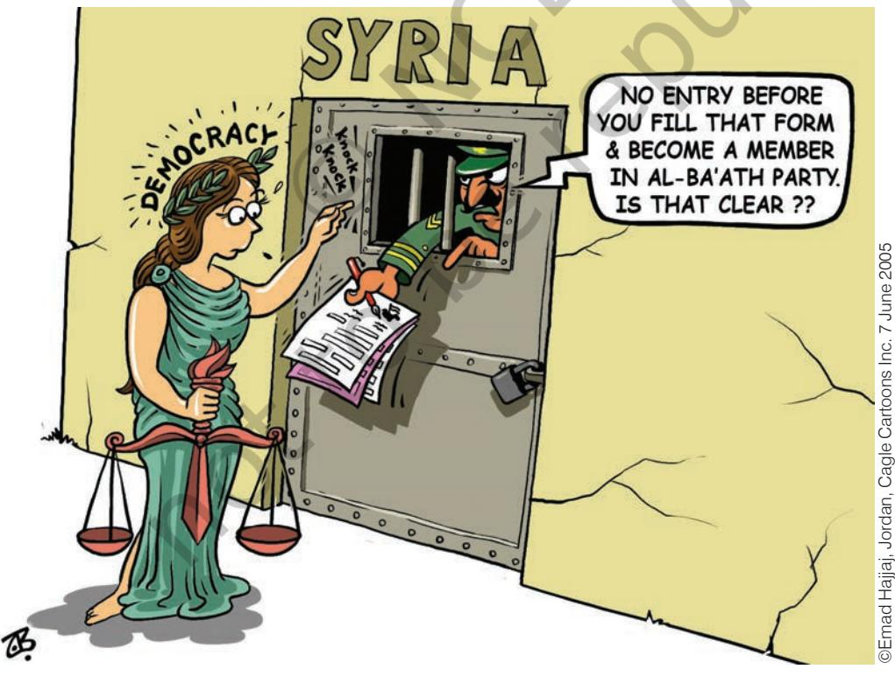

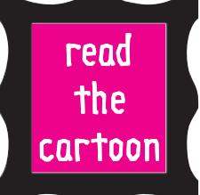

Syria is a small west Asian country. The ruling Ba'ath Party and some of its small allies are the only parties allowed in that country. Do you think this cartoon could apply to China or Mexico? What does the crown of leaves on democracy signify? 

4 **DEMOCRATIC POLITICS**

### read the cartoon

This cartoon was drawn in the context of Latin America. Do you think it applies to the Pakistani situation as well? Think of other countries where this could apply? Does this happen sometimes in our country as well?

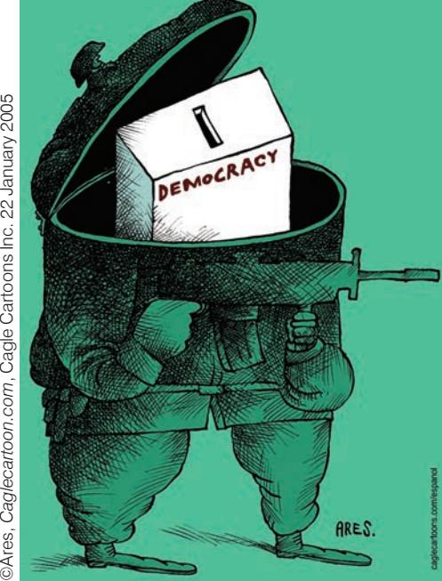

malpractices and fraud. In August 2002 he issued a 'Legal Framework Order' that amended the Constitution of Pakistan. According to this Order, the President can dismiss the national and provincial assemblies. The work of the civilian cabinet is supervised by a National Security Council which is dominated by military officers. After passing this law, elections were held to the national and provincial assemblies. So Pakistan has had elections, elected representatives have some powers. But the final power rested with military officers and General Musharraf himself.

Clearly, there are many reasons why Pakistan under General Musharraf should not be called a democracy. But let us focus on one of these. Can we say that the rulers are elected by the people in Pakistan? Not quite. People may have elected their representatives to the national and provincial assemblies but those elected representatives were not really the rulers. They cannot take the final decisions. The power to take final decision rested with army officials and with General Musharraf, and none of them were elected by the people. This happens in many dictatorships and monarchies. They formally have an elected parliament and government but the real power is with those who are not elected. In a few countries, the real power was with some external powers and not with locally elected representatives. This cannot be called people's rule.

This gives us the first feature. In a democracy the final decisionmaking power must rest with those elected by the people.

### Free and fair electoral competition

In China, elections are regularly held after every five years for electing the country's parliament, called Quanguo Renmin Daibiao Dahui (National People's Congress). The National People's Congress has the power to appoint the President of the country. It has nearly 3,000 members elected from all over China. Some members are elected by the army. Before contesting elections, a candidate needs the approval of the Chinese Communist Party. Only those who are members of the Chinese Communist Party or eight smaller parties allied to it were allowed to contest elections held in 2002-03. The government is always formed by the Communist Party.

Since its independence in 1930, Mexico holds elections after every six years to elect its President. The country has never been under a military or dictator's rule. But until 2000 every election was won by a

**WHAT IS DEMOCRACY? WHY DEMOCRACY?**

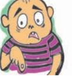

All this is so remote for me. Is democracy all about rulers and governments? Can we talk about a democratic classroom? Or a democratic family?

party called PRI (Institutional Revolutionary Party). Opposition parties did contest elections, but never managed to win. The PRI was known to use many dirty tricks to win elections. All those who were employed in government offices had to attend its party meetings. Teachers of government schools used to force parents to vote for the PRI. Media largely ignored the activities of opposition political parties except to criticise them. Sometimes the polling booths were shifted from one place to another in the last minute, which made it difficult for people to cast their votes. The PRI spent a large sum of money in the campaign for its candidates.

Should we consider the elections described above as examples of people electing their rulers? Reading these examples we get a sense that we cannot. There are many problems here. In China the elections do not offer the people any serious choice. They have to choose the ruling party and the candidates approved by it. Can we call this a choice? In the Mexican example, people seemed to really have a choice but in practice they had no choice. There was no way the ruling party could be defeated, even if people were against it. These are not fair elections.

We can thus add a second feature to our understanding of democracy. Holding elections of any kind is not sufficient. The elections must offer a real choice between political alternatives. And it should be possible for people to use this choice to remove the existing rulers, if they wish so. So, a democracy must be based on a free and fair election where those currently in power have a fair chance of losing. We shall find out more about a democratic election in Chapter 3.

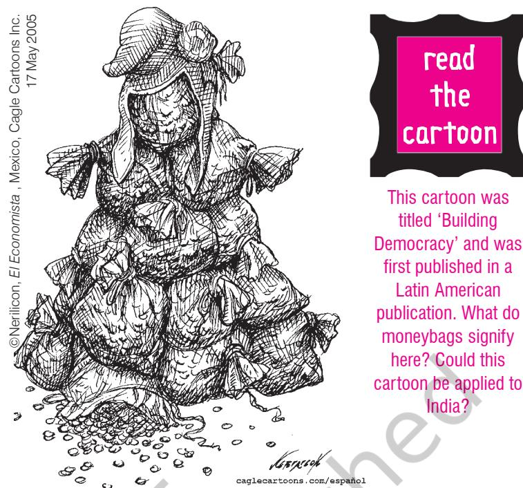

titled 'Building

read the

cartoon

Latin American

India?

### One person, One person,One person, one vote, one value one valueone value

Earlier, we read about how the struggle for democracy was linked to the demand for universal adult franchise. This principle has now come to be accepted almost all over the world. Yet there are many instances of denial of equal right to vote.

- < Until 2015, in Saudi Arabia women did not have the right to vote.
- < Estonia has made its citizenship rules in such a way that people belonging to Russian minority find it difficult to get the right to vote.
- < In Fiji, the electoral system is such that the vote of an indigenous Fiji has more value than that of an Indian-Fijian.

Democracy is based on a fundamental principle of political equality. That gives us the third feature of democracy: in a democracy, each adult citizen must have one vote and each vote must have one value. We shall read more about it in Chapter 3.

6 **DEMOCRATIC POLITICS**

### read the cartoon

This cartoon is about the Iraqi election held after Saddam Hussein's regime was overthrown. He is shown behind the bars. What is the cartoonist saying here? Compare the message of this cartoon with the first cartoon in this chapter.

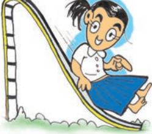

Why talk about Zimbabwe? I read similar reports from many parts of our own country. Why don't we discuss that?

#### Rule of la ule of laule of law and r w and respect for rights for rightsfor rights

Zimbabwe attained independence from White minority rule in 1980. Since then the country has been ruled by ZANU-PF, the party that led the freedom struggle. Its leader, Robert Mugabe, ruled the country since independence. Elections were held regularly and always won by ZANU-PF. President Mugabe was popular but also used unfair practices in elections. Over the years his government changed the constitution several times to increase the powers of the President and make him less accountable. Opposition party workers were harassed and their meeting disrupted. Public protests and demonstrations against the government were declared illegal. There was a law that limited the right to criticise the President. Television and radio were controlled by the government and gave only the ruling party's version. There were independent newspapers but the government harassed those journalists who went against it. The government ignored some court judgments that went against it and pressurised judges. He was forced out of office in 2017.

The example of Zimbabwe shows that popular approval of the rulers is necessary in a democracy, but it is not sufficient. Popular governments can be undemocratic. Popular leaders can be autocratic. If we wish to assess a democracy, it is important to look at the elections. But it is equally important to look before and after the elections. There should be sufficient room for normal political activity, including political opposition, in the period before elections. This requires that the state should respect some basic rights of the citizen. They should be free to think, to have opinions, to express these in public, to form associations, to protest and take other political actions. Everyone should be equal in the eyes of law. These rights must be protected by an independent

**WHAT IS DEMOCRACY? WHY DEMOCRACY?**

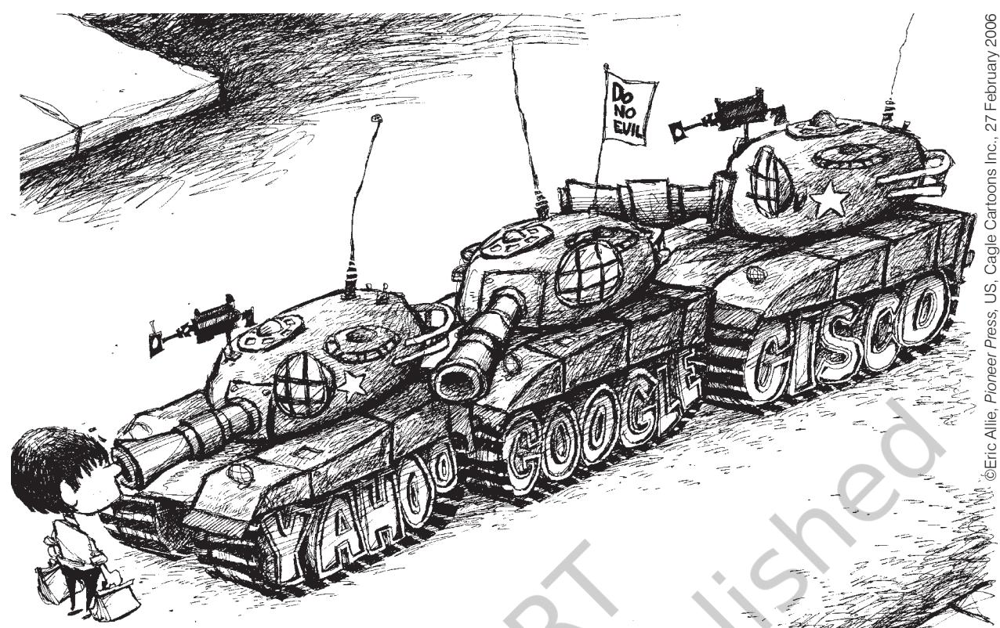

judiciary whose orders are obeyed by everyone. We shall read more about these rights in Chapter 5.

Similarly, there are some conditions that apply to the way a government is run after the elections. A democratic government cannot do whatever it likes, simply because it has won an election. It has to respect some basic rules. In particular it has to respect some guarantees to the minorities. Every major decision has to go through a series of consultations. Every office bearer has certain rights and responsibilities assigned by the constitution and the law. Each of these is accountable not only to the people but also to other independent officials. We shall read more about this in Chapter 4.

Both these aspects give us the fourth and final feature of democracy: a democratic government rules within limits set by constitutional law and citizens' rights.

### Summary definition inition

Let us sum up the discussion so far. We started with a simple definition that democracy is a form of government in which the rulers are elected by the people*.* We found that this definition was not adequate unless we explained some of the key words used in it. Through a series of examples we worked out four features of democracy as a form of government. Accordingly, democracy is a form of government in which:

- < Rulers elected by the people take all the major decisions;
- < Elections offer a choice and fair opportunity to the people to change the current rulers;
- < This choice and opportunity is available to all the people on an equal basis; and
- < The exercise of this choice leads to a government limited by basic rules of the constitution and citizens' rights.

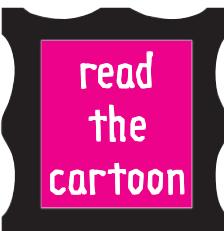

Chinese government blocked free flow of information on the internet by placing restrictions on popular websites like 'Google' and 'Yahoo'. The image of tanks and an unarmed student reminds the reader of another major event in recent Chinese history. Find out about that event.

8 **DEMOCRATIC POLITICS**

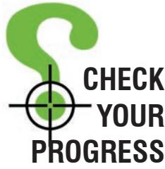

Read these five examples of working or denial of democracy. Match each of these with the relevant feature of democracy discussed above.

| Example | Feature |  |
| --- | --- | --- |
| King of Bhutan has declared that in future he will be | Rule of law |  |
| guided by the advice given to him by elected representatives. |  |  |
| Many Tamil workers who migrated from India were |  | Respect for Rights |
| not given a right to vote in Sri Lanka. |  |  |
|  | One person one vote |  |
| The king imposed a ban on political gatherings, | one value |  |
| demonstrations and rallies. | Free and | fair |
| The Indian Supreme Court held that the dissolution of | electoral | competition |
| Bihar assembly was unconstitutional. |  |  |
|  | Major decisions by |  |
| Political parties in Bangladesh have agreed that a neutral | elected leaders |  |
| government should rule the country at the time of elections. |  |  |

### **1.3 WHY DEMOCRACY?**

An argument broke out in Madam Lyngdoh's class. She had finished teaching the previous section on what is democracy and asked the students if they thought democracy was the best form of government. Everyone had something to say.

### Debating merits of democr d e m o c ra c y

- Yolanda: We live in a democratic country. All over the world people want democracy. Countries that were not democratic earlier are becoming democratic now. All great people have said nice things about democracy. Isn't it obvious that democracy is the best? Do we need to debate this?
- 

I want to be in Lyngdoh Madam's class! That sounds like a democratic classroom. Doesn't it?

- Tangkini: But Lyngdoh Madam had said we should not accept something just because it is famous, just because everyone else accepts it. Isn't it possible that everyone is following a wrong path?
- Jeni: Yes, it actually is a wrong path. What has democracy brought to our country? Seven decades of democracy and there is so much poverty in the country.
- Ribiang: But what has democracy got to do with it? Do we have poverty because we are democratic or do we have poverty despite being a democracy?
- Jeni: Whatever, how does it make a difference? The point is that this can't be the best form of government. Democracy is all about chaos, instability, corruption and hypocrisy. Politicians fight among themselves. Who cares for the country?
- Poimon: So, what should we have instead? Go back to the British rule? Invite some kings to rule this country?
- Rose: I don't know. I think what this country needs is a strong leader, someone who does not have to bother about elections and parliament. One leader should have all the powers. He should be able to do whatever is needed in country's interest. That alone can remove corruption and poverty from this country.

Someone shouted: That is called dictatorship!

- Hoi: What if that person starts using all these powers for himself and his family? What if he is corrupt himself?
- Rose: I am speaking only of the honest, sincere and strong leader.
- Hoi: But that is not fair. You are comparing a real democracy with an ideal dictatorship. We should compare an ideal with an ideal, the real with the real. Go and check the record of dictators in real life. They are most corrupt, selfish and brutal. It is just that we don't get to know about this. And what is worse, you can't even get rid of them.

**WHAT IS DEMOCRACY? WHY DEMOCRACY?**

Madam Lyngdoh was listening to this discussion with interest. Now she stepped in: "I was delighted to see you all arguing so passionately. I don't know who is right and who is wrong. That is for you to settle. But I did feel that you all wanted to speak your mind. You may have felt very bad if someone tried to stop you or if someone punished you for saying what you felt. Would you be able to do that in a country that is not democratic? Is that a good argument for democracy?"

### Arguments against democracy

This conversation has most of the arguments that we routinely hear against democracy. Let us go over some of these arguments:

- < Leaders keep changing in a democracy. This leads to instability.
- < Democracy is all about political competition and power play. There is no scope for morality.
- < So many people have to be consulted in a democracy that it leads to delays.
- < Elected leaders do not know the best interest of the people. It leads to bad decisions.
- < Democracy leads to corruption for it is based on electoral competition.
- < Ordinary people don't know what is good for them; they should not decide anything.

Are there some other arguments against democracy that you can think of? Which of these arguments applies mainly to democracy? Which of these can apply to misuse of any form of government? Which of these do you agree with?

Clearly, democracy is not a magical solution for all the problems. It has not ended poverty in our country and in other parts of the world. Democracy as a form of government only ensures that people take their own decisions. This does not guarantee that their decisions will be good. People can make mistakes. Involving the people in these decisions does lead to delays in decision making. It is also true that democracy leads to frequent changes in leadership. Sometimes this can set back big decisions and affect the government's efficiency.

These arguments show that democracy of the kind we see may not be the ideal form of government. But that is not a question we face in real life. The real question we face is different: is democracy better than other forms of government that are there for us to choose from?

### Arguments for democracy

China's famine of 1958-1961 was the worst recorded famine in world history. Nearly three crore people died in this famine. During those days, India's economic condition was not much better than China. Yet India did not have a famine of the kind China had. Economists think

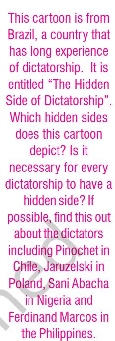

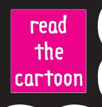

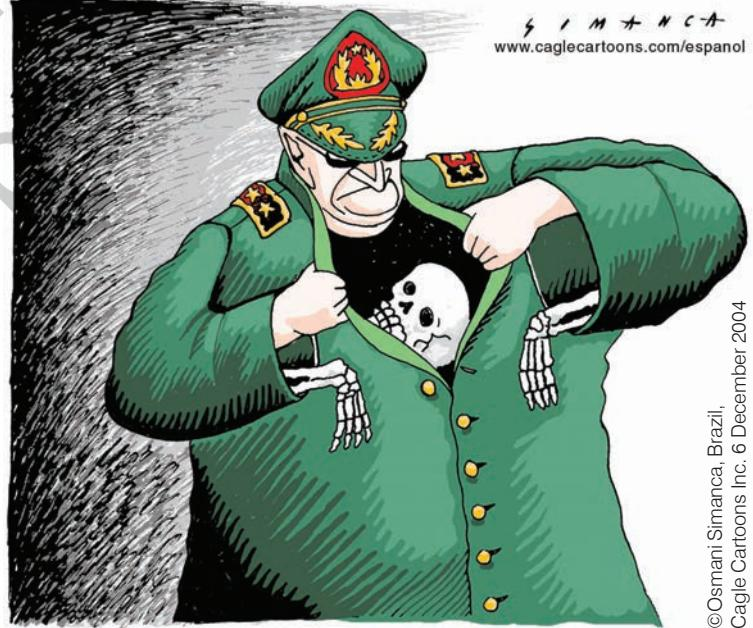

10 **DEMOCRATIC POLITICS**

that this was a result of different government policies in the two countries. The existence of democracy in India made the Indian government respond to food scarcity in a way that the Chinese government did not. They point out that no large-scale famine has ever taken place in an independent and democratic country. If China too had multiparty elections, an opposition party and a press free to criticise the government, then so many people may not have died in the famine.

This example brings out one of the reasons why democracy is considered the best form of government. Democracy is better than any other form of government in responding to the needs of the people. A nondemocratic government may and can respond to the people's needs, but it all depends on the wishes of the people who rule. If the rulers don't want to, they don't have to act according to the wishes of the people. A democracy requires that the rulers have to attend to the needs of the people. A democratic government is a better government because it is a more accountable form of government.

There is another reason why democracy should lead to better decisions than any non-democratic government. Democracy is based on consultation and discussion. A democratic decision always involves many persons, discussions and meetings. When a number of people put their heads together, they are able to point out possible mistakes in any decision. This takes time. But there is a big advantage in taking time over important decisions. This reduces the chances of rash or irresponsible decisions. Thus democracy improves the quality of decision-making.

This is related to the third argument. Democracy provides a method to deal with differences and conflicts. In any society people are bound to have differences of opinions and interests. These differences are particularly sharp in a country like ours which has an amazing social diversity. People belong to different regions, speak different languages, practise different religions and have different castes. They look at the world very differently and have different preferences. The preferences of one group can clash with those of other groups. How do we resolve such a conflict? The conflict can be solved by brutal power. Whichever group is more powerful will dictate its terms and others will have to accept that. But that would lead to resentment and unhappiness. Different groups may not be able to live together for long in such a way. Democracy provides the only peaceful solution to this problem. In democracy, no one is a permanent winner. No one is a permanent loser. Different groups can live with one another peacefully. In a diverse country like India, democracy keeps our country together.

These three arguments were about the effects of democracy on the quality of government and social life. But the strongest argument for democracy is not about what democracy does to the government. It is about what democracy does to the citizens. Even if democracy does not bring about better decisions and accountable government, it is still better than other forms of government. Democracy enhances the dignity of citizens. As we discussed above, democracy is based on the principle of political equality, on recognising that the

11

**WHAT IS DEMOCRACY? WHY DEMOCRACY?**

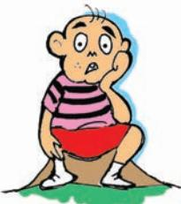

What would have happened if India was not a democracy? Could we have stayed together as a single nation?

poorest and the least educated has the same status as the rich and the educated. People are not subjects of a ruler, they are the rulers themselves. Even when they make mistakes, they are responsible for their conduct.

Finally, democracy is better than other forms of government because it allows us to correct its own mistakes. As we saw above, there is no guarantee that mistakes cannot be made in democracy. No form of government can guarantee that. The advantage in a democracy is that such mistakes cannot be hidden for long. There is a space for public discussion on these mistakes. And there is a room for correction. Either the rulers have to change their decisions, or the rulers can be changed. This cannot happen in a non-democratic government.

Let us sum it up. Democracy cannot get us everything and is not the solution to all problems. But it is clearly better than any other alternative that we know. It offers better chances of a good decision, it is likely to respect people's own wishes and allows different kinds of people to live together. Even when it fails to do some of these things, it allows a way of correcting its mistakes and offers more dignity to all citizens. That is why democracy is considered the best form of government.

This cartoon was published in Canada just before its parliamentary elections of 2004. Everyone, including the cartoonist, expected the Liberal party to win once again. When the results came, the Liberal Party lost the elections. Is this cartoon an argument against democracy or for democracy?

> read the

cartoon

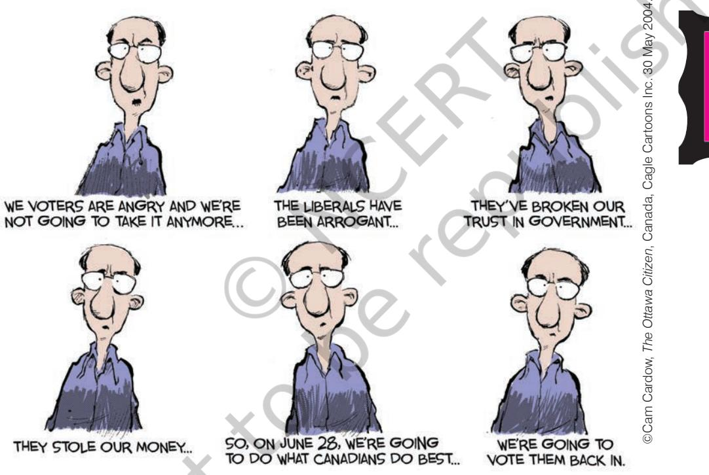

Rajesh and Muzaffar read an article. It showed that no democracy has ever gone to war with another democracy. Wars take place only when one of the two governments is non-democratic. The article said that this was a great merit of democracy. After reading the essay, Rajesh and Muzaffar had different reactions. Rajesh said that this was not a good argument for democracy. It was just a matter of chance. It is possible that in future democracies may have wars. Muzaffar said that it could not be a matter of chance. Democracies take decisions in such a way that it reduces the chances of war. Which of the two positions do you agree with and why?

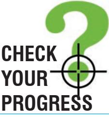

12 **DEMOCRATIC POLITICS**

This famous cartoon by R K Laxman comments on the celebrations of the fifty years of independence. How many images on the wall do you recognize? Do many common people feel the way the common man in this cartoon does?

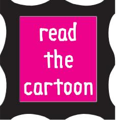

### **1.4 BROADER MEANINGS OF DEMOCRACY**

In this chapter we have considered the meaning of democracy in a limited and descriptive sense. We have understood democracy as a form of government. This way of defining democracy helps us to identify a clear set of minimal features that a democracy must have. The most common form that democracy takes in our times is that of a representative democracy. You have already read about this in the previous classes. In the countries we call democracy, all the people do not rule. A majority is allowed to take decisions on behalf of all the people. Even the majority does not rule directly. The majority of people rule through their elected representatives. This become necessary because:

- < Modern democracies involve such a large number of people that it is physically impossible for them to sit together and take a collective decision.
- < Even if they could, the citizen does not have the time, the desire or the skills to take part in all the decisions.

This gives us a clear but minimal understanding of democracy. This clarity helps us to distinguish democracies from non-democracies. But it does not allow us to distinguish between a democracy and a good democracy. It does not

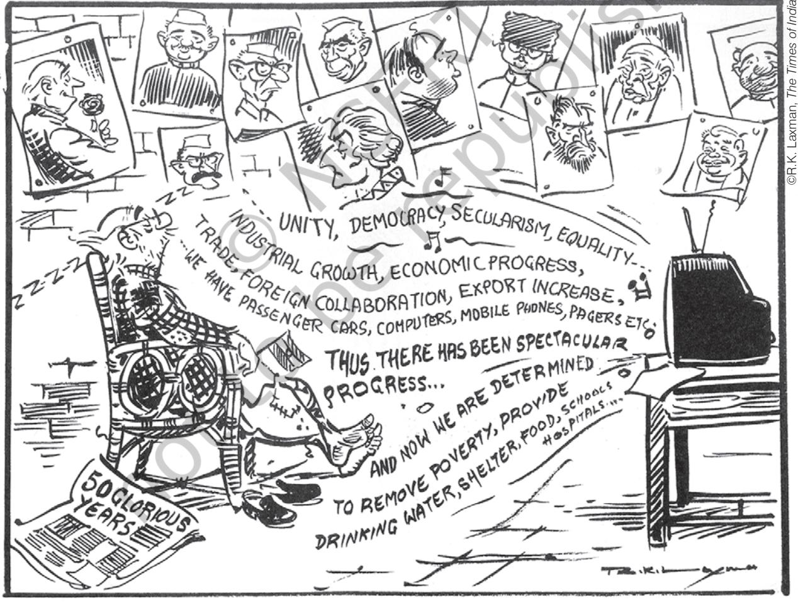

**WHAT IS DEMOCRACY? WHY DEMOCRACY?**

allow us to see the operation of democracy beyond government. For this we need to turn to broader meanings of democracy.

Sometimes we use democracy for organisations other than the government. Just read these statements:

- < "*We are a very democratic family. Whenever a decision has to be taken, we all sit down and arrive at a consensus. My opinion matters as much as my father's*."
- < "*I don't like teachers who do not allow students to speak and ask questions in the class. I would like to have teachers with democratic temperament.*"
- < "*One leader and his family members decide everything in this party. How can they talk of democracy?*"

These ways of using the word democracy go back to its basic sense of a method of taking decisions. A democratic decision involves consultation with and consent of all those who are affected by that decision. Those who are not powerful have the same say in taking the decision as those who are powerful. This can apply to a government or a family or any other organisation. Thus democracy is also a principle that can be applied to any sphere of life.

Sometimes we use the word democracy not to describe any existing government but to set up an ideal standard that all democracies must aim to become:

- < "*True democracy will come to this country only when no one goes hungry to bed.*"
- < "*In a democracy every citizen must be able to play equal role in decision making. For this you don't need just an equal right to vote. Every citizen needs to have equal information, basic education, equal resources and a lot of commitment.*"

If we take these ideals seriously, then no country in the world is a democracy. Yet an understanding of democracy as an ideal reminds us of why we value democracy. It enables us to judge an existing democracy and identify its weaknesses. It helps us to distinguish between a minimal democracy and a good democracy.

In this book we do not deal much with this expanded notion of democracy. Our focus here is with some core institutional features of democracy as a form of government. Next year you will read more about a democratic society and ways of evaluating our democracy. At this stage we just need to note that democracy can apply to many spheres of life and that democracy can take many forms. There can be various ways of taking decisions in a democratic manner, as long as the basic principle of consultation on an equal basis is accepted. The most common form of democracy in today's world is rule through people's elected representatives. We shall read more about that in Chapter 3. But if the community is small, there can be other ways of taking democratic decisions. All the people can sit together and take decisions directly. This is how Gram Sabha should work in a village. Can you think of some other democratic ways of decision making?

Find out the total number of eligible voters in your assembly constituency and your parliamentary constituency. Find out how many people can fit into the largest stadium in your area. Is it possible for all the voters in your parliamentary or assembly constituency to sit together and have a meaningful discussion?

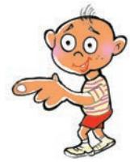

In my village the Gram Sabha never meets. Is that democratic?

This also means that no country is a perfect democracy. The features of democracy that we discussed in this chapter provide only the minimum conditions of a democracy. That does not make it an ideal democracy. Every democracy has to try to realise the ideals of a democratic decisionmaking. This cannot be achieved once and for all. This requires a constant effort to save and strengthen democratic forms of decision-making. What we do as citizens can make a difference to making our country more or less democratic. This is the strength and the weakness of democracy: the fate of the country depends not just on what the rulers do, but mainly on what we, as citizens, do.

This is what distinguished democracy from other governments. Other forms of government like monarchy, dictatorship or one-party rule do not require all citizens to take part in politics. In fact most non-democratic governments would like citizens not to take part in politics. But democracy depends on active political participation by all the citizens. That is why a study of democracy must focus on democratic politics.

### exercises

- 1 Here is some information about four countries. Based on this information, how would you classify each of these countries. Write 'democratic', 'undemocratic' or 'not sure' against each of these.
	- a Country A: People who do not accept the country's official religion do not have a right to vote.
	- b Country B: The same party has been winning elections for the last twenty years.
	- c Country C: Ruling party has lost in the last three elections.
	- d Country D: There is no independent election commission.
- 2 Here is some information about four countries. Based on this information, how would you classify each of these countries. Write 'democratic', 'undemocratic' or 'not sure' against each of these.
	- a Country P: The parliament cannot pass a law about the army without the consent of the Chief of Army.
	- b Country Q: The parliament cannot pass a law reducing the powers of the judiciary.
	- c Country R: The country's leaders cannot sign any treaty with another country without taking permission from its neighbouring country.
	- d Country S: All the major economic decisions about the country are taken by officials of the central bank which the ministers cannot change.

3 Which of these is not a good argument in favour of democracy? Why?

- a People feel free and equal in a democracy.
- b Democracies resolve conflict in a better way than others.
- c Democratic government is more accountable to the people.
- d Democracies are more prosperous than others.

**WHAT IS DEMOCRACY? WHY DEMOCRACY?** 15

- 4 Each of these statements contains a democratic and an undemocratic element. Write out the two separately for each statement.
	- a A minister said that some laws have to be passed by the parliament in order to conform to the regulations decided by the World Trade Organisation (WTO).
	- b The Election Commission ordered re-polling in a constituency where large-scale rigging was reported.
	- c Women's representation in the parliament has barely reached 10 per cent. This led women's organisations to demand one-third seats for women.
- 5 Which of these is not a valid reason for arguing that there is a lesser possibility of famine in a democratic country?
	- a Opposition parties can draw attention to hunger and starvation.
	- b Free press can report suffering from famine in different parts of the country.
	- c Government fears its defeat in the next elections.
	- d People are free to believe in and practise any religion.
- 6 There are 40 villages in a district where the government has made no provision for drinking water. These villagers met and considered many methods of forcing the government to respond to their need. Which of these is not a democratic method?
	- a Filing a case in the courts claiming that water is part of right to life.
	- b Boycotting the next elections to give a message to all parties.
	- c Organising public meetings against government's policies.
	- d Paying money to government officials to get water.
- 7 Write a response to the following arguments against democracy:
	- a Army is the most disciplined and corruption-free organisation in the country. Therefore army should rule the country.
	- b Rule of the majority means the rule of ignorant people. What we need is the rule of the wise, even if they are in small numbers.
	- c If we want religious leaders to guide us in spiritual matters, why not invite them to guide us in politics as well. The country should be ruled by religious leaders.
- 8 Are the following statements in keeping with democracy as a value? Why?
	- a Father to daughter: I don't want to hear your opinion about your marriage. In our family children marry where the parents tell them to.
	- b Teacher to student: Don't disturb my concentration by asking me questions in the classroom.
	- c Employee to the officer: Our working hours must be reduced according to the law.
- 9 Consider the following facts about a country and decide if you would call it a democracy. Give reasons to support your decision.

16 **DEMOCRATIC POLITICS**

exercises

- exercises a All the citizens of the country have right to vote. Elections are held regularly.
	- b The country took loan from international agencies. One of the conditions for giving loan was that the government would reduce its expenses on education and health.
	- c People speak more than seven languages but education is available only in one language, the language spoken by 52 percent people of that country.
	- d Several organisations have given a call for peaceful demonstrations and nation wide strikes in the country to oppose these policies. Government has arrested these leaders.
	- e The government owns the radio and television in the country. All the newspapers have to get permission from the government to publish any news about government's policies and protests.
	- 10 In 2004 a report published in USA pointed to the increasing inequalities in that country. Inequalities in income reflected in the participation of people in democracy. It also shaped their abilities to influence the decisions taken by the government. The report highlighted that:
		- < If an average Black family earns $ 100 then the income of average White family is $ 162. A White family has twelve times more wealth than the average Black family.
		- < In a President's election 'nearly 9 out of 10 individuals in families with income over $ 75,000 have voted. These people are the top 20% of the population in terms of their income. On the other hand only 5 people out of 10 from families with income less than $ 15,000 have voted. They are the bottom 20% of the population in terms of their income.
		- < About 95% contribution to the political parties comes from the rich. This gives them opportunity to express their opinions and concerns, which is not available to most citizens.
		- < As poor sections participate less in politics, the government does not listen to their concerns – coming out of poverty, getting job, education, health care and housing for them. Politicians hear most regularly about the concerns of business persons and the rich.

Write an essay on 'Democracy and Poverty' using the information given in this report but using examples from India.

Most newspapers have an editorial page. On that page the newspaper publishes its own opinions about current affairs. The paper also publishes the views of other writers and intellectuals and letters written by the readers. Follow any one newspaper for one month and collect editorials, articles and letters on that page that have anything to do with democracy. Classify these into the following categories:

- < Constitutional and legal aspects of democracy
- < Citizens' rights
- < Electoral and party politics
- < Criticism of democracy

**WHAT IS DEMOCRACY? WHY DEMOCRACY?**

