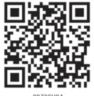

CHAPTER 4

# Working of Institutions

# **OVERVIEW**

Democracy is not just about people electing their rulers. In a democracy the rulers have to follow some rules and procedures. They have to work with and within institutions. This chapter is about the working of such institutions in a democracy. We try to understand this by looking at the manner in which major decisions are taken and implemented in our country. We also look at how disputes regarding these decisions are resolved. In this process we come across three institutions that play a key role in major decisions – legislature, executive and judiciary.

You have already read something about these institutions in earlier classes. Here we shall quickly summarise those and move on to asking larger questions. In the case of each institution we ask: What does this institution do? How is this institution connected to other institutions? What makes its functioning more or less democratic? The basic objective here is to understand how all these institutions together carry on the work of government. Sometimes we compare these with similar institutions in other democracies. In this chapter we take our examples from the working of the national level government called Central Government, Union Government, or just Government of India. While reading this chapter, you can think of and discuss examples from the working of the government in your state.

56 **DEMOCRATIC POLITICS**

# **4.1 HOW IS A MAJOR POLICY DECISION TAKEN?**

## A Government Order

On August 13, 1990, the Government of India issued an Order. It was called an Office Memorandum. Like all government orders, it had a number and is known by that: O. M. No. 36012/31/90-Est (SCT), dated 13.8.1990. The Joint Secretary, an officer in the Department of Personnel and Training in the Ministry of Personnel, Public Grievances and Pensions, signed the Order. It was quite short, barely one page. It looked like any ordinary circular or notice that you may have seen in school. The government issues hundreds of orders every day on different matters. But this one was very important and became a source of controversy for several years. Let us see how the decision was taken and what happened later.

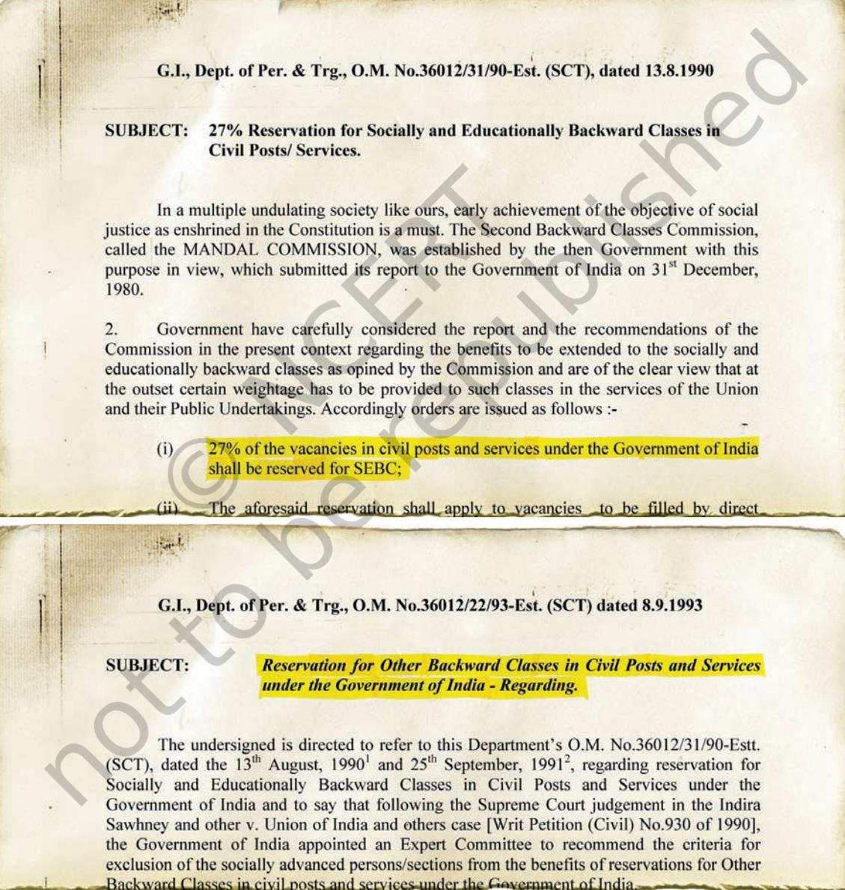

**WORKING OF INSTITUTIONS**

This Order announced a major policy decision. It said that 27 per cent of the vacancies in civil posts and services under the Government of India are reserved for the Socially and Educationally Backward Classes (SEBC). SEBC is another name for all those people who belong to castes that are considered backward by the government. The benefit of job reservation was till then available only to Scheduled Castes and Scheduled Tribes. Now a new third category called SEBC was introduced. Only persons who belong to backward classes were eligible for this quota of 27 per cent jobs. Others could not compete for these jobs.

# The Decision M cision Mcision Makers

Who decided to issue this Memorandum? Clearly, such a big decision could not have been taken by the person who signed that document. The officer was merely implementing the instructions given by the Minister of Personnel, Public Grievances and Pensions, of which the Department was a part. We can guess that such a major decision would have involved other major functionaries in our country. You have already read in the previous class about some of them. Let us go over some of the main points that you covered then:

- < President is the head of the state and is the highest formal authority in the country.
- < Prime Minister is the head of the government and actually exercises all governmental powers. He takes most of the decisions in the Cabinet meetings.
- < Parliament consists of the President and two Houses, Lok Sabha and Rajya Sabha. The Prime Minister must have the support of a majority of Lok Sabha members.

So, were all these people involved in this decision regarding the Office Memorandum? Let us find out.

- < Which points, other than the ones mentioned above, do you recall about these institutions from the previous class? Discuss in class.
- < Can you think of a major decision made by your state government? How were the Governor, the Council of Ministers, the state assembly and the courts involved in that decision?

This Office Memorandum was the culmination of a long chain of events. The Government of India had appointed the Second Backward Classes Commission in 1979. It was headed by B.P. Mandal. Hence it was popularly called the Mandal Commission. It was asked to determine the criteria to identify the socially and educationally backward classes in India and recommend steps to be taken for their advancement. The Commission gave its Report in 1980 and made many recommendations. One of these was that 27 per cent of government jobs be reserved for the socially and educationally backward classes. The Report and recommendations were discussed in the Parliament.

For several years, many parliamentarians and parties kept demanding the implementation of the Commission's recommendations. Then came the Lok Sabha election of 1989. In its election manifesto, the Janata Dal promised that if voted to power, it would implement the Mandal Commission report. The Janata Dal did form the government after this election. Its leader V. P. Singh became the Prime Minister*.* Several developments took place after that:

Is every Office Memorandum a major political decision? If not, what made this one different?

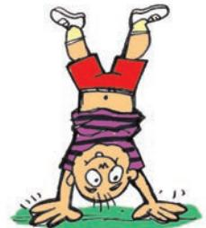

Now I can see clearly! That is why they talk of Mandalisation of politics. Don't they?

Reservation debate was such an important issue during 1990-91 that advertisers used this theme to sell their products. Can you spot some references to political events and debates in these Amul Butter hoardings?

©GCMMF India

- < The President of India in his address to the Parliament announced the intention of the government to implement the recommendations of the Mandal Commission.
- < On 6 August 1990, the Union Cabinet took a formal decision to implement the recommendations.
- < Next day Prime Minister V.P. Singh informed the Parliament about this decision through a statement in both the Houses of Parliament.
- < The decision of the Cabinet was sent to the Department of Personnel and Training. The senior officers of the Department drafted an order in line with the Cabinet decision and took the minister's approval. An officer signed the order on behalf of the Union Government. This was how O.M. No. 36012/ 31/90 was born on 13 August 1990.

For the next few months, this was the most hotly debated issue in the country. Newspapers and magazines

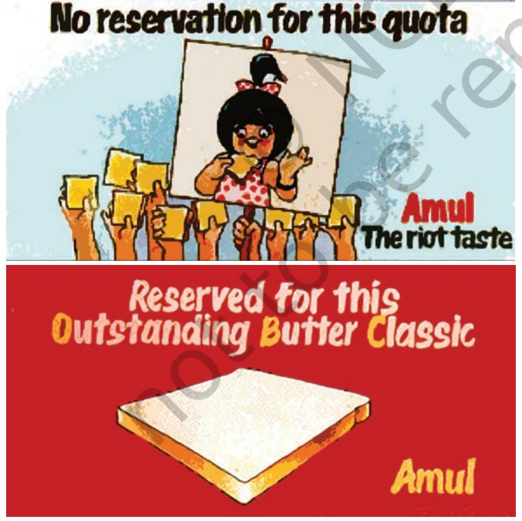

**WORKING OF INSTITUTIONS**

were full of different views and opinions on this issue. It led to widespread protests and counterprotests, some of which were violent. People reacted strongly because this decision affected thousands of job opportunities. Some felt that existence of inequalities among people of different castes in India necessitated job reservations. They felt, this would give a fair opportunity to those communities who so far had not adequately been represented in government employment.

Others felt that this was unfair as it would deny equality of opportunity to those who did not belong to backward communities. They would be denied jobs even though they could be more qualified. Some felt that this would perpetuate caste feelings among people and hamper national unity. In this chapter we won't discuss whether the decision was good or not. We only take this example to understand how major decisions are taken and implemented in the country.

Who resolved this dispute? You know that the Supreme Court and the High Courts in India settle disputes arising out of governmental decisions. Some persons and associations opposed to this order filed a number of cases in the courts. They appealed to the courts to declare the order invalid and stop its implementation. The Supreme Court of India bunched all these cases together. This case was known as the 'Indira Sawhney and others Vs Union of India case'. Eleven judges of the Supreme Court heard arguments of both sides. By a majority, the Supreme Court judges in 1992 declared that this order of the Government of India was valid. At the same time the Supreme Court asked the government to modify its

59

original order. It said that well-todo persons among the backward classes should be excluded from getting the benefit of reservation. Accordingly, the Department of Personnel and Training issued another Office Memorandum on 8 September 1993. The dispute thus came to an end and this policy has been followed since then.

| Who did what in this case of reservations for backward classes? |  |  |
| --- | --- | --- |
| Supreme Court |  | Made formal announcement about this decision |
| Cabinet |  | Implemented the decision by issuing an order |
| President Officials | Government | Took the decision to give 27% job reservations |

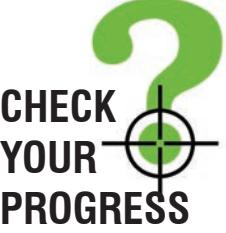

Need for Political Institutions We have seen one example of how the government works. Governing a country involves various such activities. For example, the government is responsible for ensuring security to the citizens and providing facilities for education and health to all. It collects taxes and spends the money thus raised on administration, defence and development programmes. It formulates and implements several welfare schemes. Some persons have to take decisions on how to go about

these activities. Others have to implement these decisions. If disputes arise on these decisions or in their implementation, there should be someone to determine what is right and what is wrong. It is important that everyone should know who is responsible for doing what. It is also important that these activities keep taking place even if the persons in key positions change.

So, to attend to all these tasks, several arrangements are made in all modern democracies. Such arrangements are called institutions. A democracy works well when these institutions perform functions assigned to them. The Constitution of any country lays down basic rules on the powers and functions of each institution. In the example above, we saw several such institutions at work.

Upheld reservations as valid

- < The Prime Minister and the Cabinet are institutions that take all important policy decisions.
- < The Civil Servants, working together, are responsible for taking steps to implement the ministers' decisions.
- < Supreme Court is an institution where disputes between citizens and the government are finally settled.

Can you think of some other institutions in this example? What is their role?

Working with institutions is not easy. Institutions involve rules and regulations. This can bind the hands of leaders. Institutions involve meetings, committees and routines. This often leads to delays and complications. Therefore dealing with institutions can be frustrating. One might feel that it is much better to have one person take all decisions without any rules, procedures and meetings. But that is not the spirit of democracy. Some of the delays and complications introduced by institutions are very useful. They provide an opportunity for a wider set of people to be consulted in any decision. Institutions make it

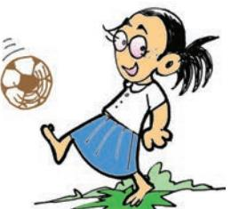

Which institutions are at work in the running of your school? Would it be better if one person alone took all the decisions regarding management of your school?

60 **DEMOCRATIC POLITICS**

difficult to have a good decision taken very quickly. But they also make it equally difficult to rush

# **4.2 PARLIAMENT**

In the example of the Office Memorandum, do you remember the role of Parliament? Perhaps not. Since this decision was not taken by Parliament, you might think that Parliament had no role in it. But let us go back to the story and see whether Parliament figures in it. Let us recall the points made earlier by completing the following sentences:

- < The Report of the Mandal Commission was discussed …
- < The President of India mentioned this in his …
- < The Prime Minister made a …

The decision was not directly taken in Parliament. But Parliamentary discussions on the Report influenced and shaped the decision of the government. They brought pressure on the government to act on the Mandal recommendation. If Parliament was not in favour of this decision, the Government could not have gone ahead with it. Can you guess why? Recall what you read about Parliament in the earlier

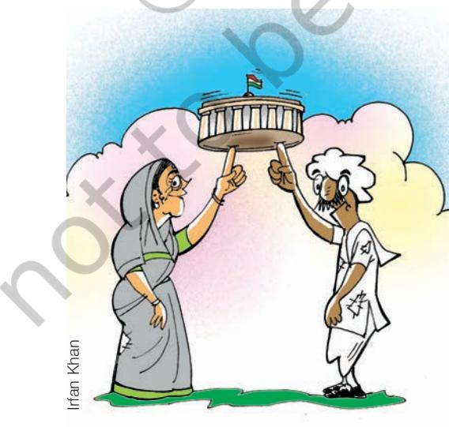

**WORKING OF INSTITUTIONS**

through a bad decision. That is why democratic governments insist on institutions.

class and try to imagine what Parliament could have done if it did not approve of the Cabinet's decision.

#### Why do we need a Parliament?

In all democracies, an assembly of elected representatives exercises supreme political authority on behalf of the people. In India such a national assembly of elected representatives is called Parliament. At the state level this is called Legislature or Legislative Assembly. The name may vary in different countries, but such an assembly exists in every democracy. It exercises political authority on behalf of the people in many ways:

- 1 Parliament is the final authority for making laws in any country. This task of law making or legislation is so crucial that these assemblies are called legislatures. Parliaments all over the world can make new laws, change existing laws, or abolish existing laws and make new ones in their place.
- 2 Parliaments all over the world exercise some control over those who run the government. In some countries like India this control is direct and full. Those who run the government can take decisions only so long as they enjoy support of Parliament.
- 3 Parliaments control all the money that governments have. In most countries the public money can be spent only when Parliament sanctions it.

61

- 4 Parliament is the highest forum of discussion and debate on public issues and national policy in any country. Parliament can seek information about any matter.
# Two Houses of P ouses of Pouses of Parliament

Since Parliament plays a central role in modern democracies, most large countries divide the role and powers of Parliament in two parts. They are called Chambers or Houses. One House is usually directly elected by the people and exercises the real power on behalf of the people. The second House is usually elected indirectly and performs some special functions. The most common work for the second House is to look after the interests of various states, regions or federal units.

In our country, Parliament consists of two Houses. The two Houses are known as the Council of States (Rajya Sabha) and the House of the People (Lok Sabha). The President of India is a part of Parliament, although she is not a member of either House. That is why all laws made in the Houses come into force only after they receive the assent of the President.

You have read about the Indian Parliament in earlier classes. From the Chapter 3 you know how Lok Sabha elections take place. Let us recall some key differences between the composition of these two Houses of Parliament. Answer the following for the Lok Sabha and the Rajya Sabha:

- < What is the total number of members? …
- < Who elects the members? …
- < What is the length of the term (in years)? …
- < Can the House be dissolved or is it permanent? …

Which of the two Houses is more powerful? It might appear that the Rajya Sabha is more powerful, for sometimes it is called the 'Upper Chamber' and the Lok Sabha the 'Lower Chamber'. But this does not mean that Rajya Sabha is more powerful than Lok Sabha. This is just an old style of speaking and not the language used in our Constitution.

Our Constitution does give the Rajya Sabha some special powers over the states. But on most matters, the Lok Sabha exercises supreme power. Let us see how:

- 1 Any ordinary law needs to be passed by both the Houses. But if there is a difference between the two Houses, the final decision is taken in a joint session in which members of both the Houses sit together. Because of the larger number of members, the view of the Lok Sabha is likely to prevail in such a meeting.
- 2 Lok Sabha exercises more powers in money matters. Once the Lok Sabha passes the budget of the government or any other money related law, the Rajya Sabha cannot reject it. The Rajya Sabha can only delay it by 14 days or suggest changes in it. The Lok Sabha may or may not accept these changes.

When Parliament is in session, there is a special programme everyday on Doordarshan about the proceedings in Lok Sabha and Rajya Sabha. Watch the proceedings or read about it in the newspapers and note the following:

- < Powers of the two Houses of Parliament.
- < Role of the Speaker.
- < Role of the Opposition.

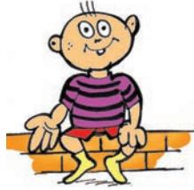

What is the point in having so much debate and discussion in the Parliament when we know that the view of the ruling party is going to prevail?

- 3 Most importantly, the Lok Sabha controls the Council of Ministers. Only a person who enjoys the support of the majority of the members in the Lok Sabha is appointed the Prime Minister. If the
majority of the Lok Sabha members say they have 'no confidence' in the Council of Ministers, all ministers including the Prime Minister, have to quit. The Rajya Sabha does not have this power.

## A day in the life of the Lok Sabha

7 December 2004 was an ordinary day in the life of the Fourteenth Lok Sabha. Let us take a look at what happened in the course of that day. Identify the role and powers of the parliament on the basis of the proceedings for the day as given below. You can also enact this day in your classroom.

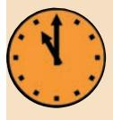

11:00 Various ministries gave written answers to about 250 questions that were asked by members. These included:

- < What is the government's policy on talking to militant groups in Kashmir?
- < What are the figures of atrocities against Scheduled Tribes, including those inflicted by the police?
- < What is the government doing about overpricing of medicines by big companies?

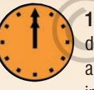

12:00 A large number of official documents were presented and were available for discussion. These included:

- < Recruitment rules for the Indo-Tibetan Border Police Force
- < Annual Report of the Indian Institute of Technology, Kharagpur
- < Report and accounts of Rashtriya Ispat Nigam Limited, Visakhapatnam

12:02 The Minister of Development of North Eastern Region made a statement regarding Revitalisation of the North Eastern Council.

The Minister of State for Railways presented a statement showing the grant needed by the

**WORKING OF INSTITUTIONS** 63

Railways in addition to that sanctioned in the Railway Budget.

The Minister of Human Resource Development introduced the National Commission for Minority Educational Institutions Bill, 2004. He also gave a statement explaining why the government had to bring an ordinance for this.

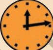

12:14 Several members highlighted some issues, including:

- < The vindictiveness of the Central Bureau of Investigation (CBI) in registering cases against some leaders in the Tehelka case.
- < Need to include Rajasthani as an official language in the Constitution.
- < Need to renew the insurance policies of farmers and agricultural workers of Andhra Pradesh.

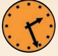

2:26 Two bills proposed by the government were considered and passed. These were:

- < The Securities Laws (Amendment) Bill
- < The Enforcement of Security Interest and Recovery of Debts Laws (Amendment) Bill

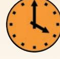

4:00 Finally, there was a long discussion regarding the foreign policy of the government and the need to continue an independent foreign policy in the context of the situation in Iraq.

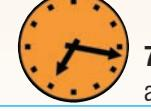

7:17 Discussion concluded. House adjourned for next day.

# **4.3 POLITICAL EXECUTIVE**

Do you remember the story of the Office Memorandum with which we started this chapter? We found out that the person who signed the document did not take this decision. He was only executing the policy decision taken by someone else. We noted the role of the Prime Minister in taking that decision. But we also know that he could not have taken that decision if he did not have support from the Lok Sabha. In that sense he was only executing the wishes of the Parliament.

Thus, at different levels of any government we find functionaries who take day-to-day decisions but do not exercise supreme power on behalf of the people. All those functionaries are collectively known as the executive. They are called executive because they are in charge of the 'execution' of the policies of the government. Thus, when we talk about 'the government' we usually mean the executive.

#### Political and P olitical and Political and Permanent Executive

In a democratic country, two categories make up the executive. One that is elected by the people for a specific period, is called the political executive. Political leaders who take the big decisions fall in this category. In the second category, people are appointed on a long-term basis. This is called the permanent executive or civil services. Persons working in civil services are called civil servants. They remain in office even when the ruling party changes. These officers work under political executive and assist them in carrying out the day-to-day administration. Can you recall the role of political and non-political executive in the case of the Office Memorandum?

You might ask: Why does the political executive have more power than the non-political executive? Why is the minister more powerful than the civil servant? The civil servant is usually more educated and has more expert knowledge of the subject. The advisors working in the Finance Ministry know more about economics than the Finance Minister. Sometimes the ministers may know very little about the technical matters that come under their ministry. This could easily happen in ministries like Defence, Industry, Health, Science and Technology, Mines, etc. Why should the minister have the final say on these matters?

The reason is very simple. In a democracy the will of the people is supreme. The minister is an elected representative of the people and thus empowered to exercise the will of the people on their behalf. She is finally answerable to the people for all the consequences of her decision. That is why the minister takes all the final decisions. The minister decides the overall framework and objectives in which decisions on policy should be made. The minister is not, and is not expected to be, an expert in the matters of her ministry. The minister takes the advice of experts on all technical matters. But very often experts hold different opinions or place before her more than one option. Depending on what the overall objective is, the minister decides.

Actually this happens in any large organisation. Those who understand the overall picture take the most important decisions, not the experts. The experts can tell the route, but someone with a larger view decides the destination. In a democracy elected ministers perform this role.

#### Prime Minister and C er and Cer and Council of Ministers

Prime Minister is the most important political institution in the country. Yet there is no direct election to the post of the Prime Minister. The President appoints the Prime Minister. But the President cannot appoint anyone she likes. The President appoints the leader of the majority party or the coalition of parties that commands a majority in the Lok Sabha, as Prime Minister. In case no single party or alliance gets a majority, the President appoints the person most likely to secure a majority support. The Prime Minister does not have a fixed tenure. He continues in power so long as he remains the leader of the majority party or coalition.

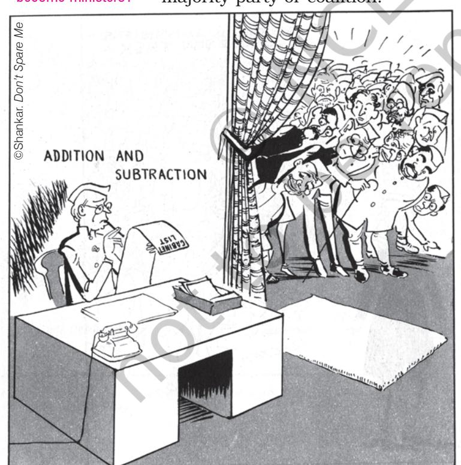

**WORKING OF INSTITUTIONS**

After the appointment of the Prime Minister, the President appoints other ministers on the advice of the Prime Minister. The Ministers are usually from the party or the coalition that has the majority in the Lok Sabha. The Prime Minister is free to choose ministers, as long as they are members of Parliament. Sometimes, a person who is not a member of Parliament can also become a minister. But such a person has to get elected to one of the Houses of Parliament within six months of appointment as minister.

Council of Ministers is the official name for the body that includes all the Ministers. It usually has 60 to 80 Ministers of different ranks.

- < Cabinet Ministers are usually toplevel leaders of the ruling party or parties who are in charge of the major ministries. Usually the Cabinet Ministers meet to take decisions in the name of the Council of Ministers. Cabinet is thus the inner ring of the Council of Ministers. It comprises about 25 ministers.
- < Ministers of State with independent charge are usually in-charge of smaller Ministries. They participate in the Cabinet meetings only when specially invited.
- < Ministers of State are attached to and required to assist Cabinet Ministers.

Since it is not practical for all ministers to meet regularly and discuss everything, the decisions are taken in Cabinet meetings. That is why parliamentary democracy in most countries is often known as the Cabinet form of government. The Cabinet works as a team. The ministers may have different views and opinions, but everyone has to own up to every decision of the Cabinet.

65

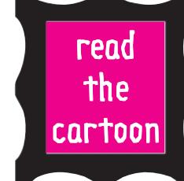

The race to become minister is not new. Here is a cartoon depicting ministerial aspirants waiting to get a berth in Nehru's Cabinet after the 1962 elections. Why do you think political leaders are so keen to become ministers?

No minister can openly criticise any decision of the government, even if it is about another Ministry or Department. Every ministry has secretaries, who are civil servants. The secretaries provide the necessary background information to the ministers to take decisions. The Cabinet as a team is assisted by the Cabinet Secretariat. This includes many senior civil servants who try to coordinate the working of different ministries.

$$\Leftrightarrow\mathrm{A}\subseteq\mathrm{T}\mid\mathrm{V}\mid\mathrm{T}\mathrm{~Y}\mathrm{~\frac{\mathrm{~T~}}{\mathrm{~a~}}}$$

- < List the names of five Cabinet Ministers and their ministries each at the Union level and in your state.
- < Meet the Mayor or Municipal Chairperson of your town or the President of Zilla Parishad of your district and ask him or her about how the city, town or district is administered.

#### Powers of the ers of theers of the Prime Minister

The Constitution does not say very much about the powers of the Prime Minister or the ministers or their relationship with each other. But as head of the government, the Prime Minister has wide ranging powers. He chairs Cabinet meetings. He coordinates the work of different Departments. His decisions are final in case disagreements arise between Departments. He exercises general supervision of different ministries. All ministers work under his leadership. The Prime Minister distributes and redistributes work to the ministers. He also has the power to dismiss ministers. When the Prime Minister quits, the entire ministry quits.

Thus, if the Cabinet is the most powerful institution in India, within the Cabinet it is the Prime Minister

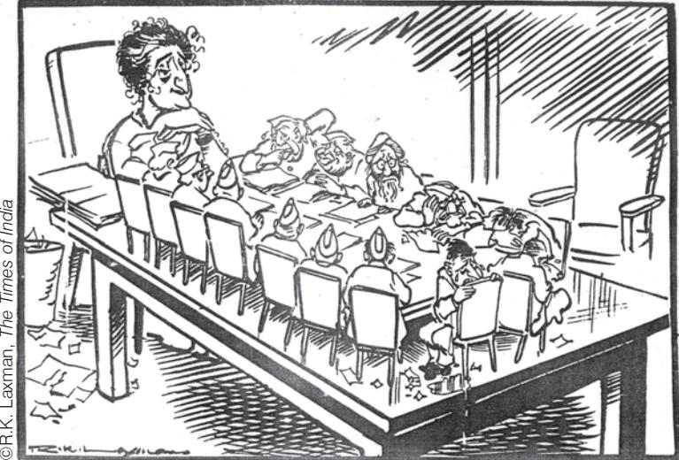

who is the most powerful. The powers of the Prime Minister in all parliamentary democracies of the world have increased so much in recent decades that parliamentary democracies are some times seen as Prime Ministerial form of government. As political parties have come to play a major role in politics, the Prime Minister controls the Cabinet and Parliament through the party. The media also contributes to this trend by making politics and elections as a competition between top leaders of parties. In India too we have seen such a tendency towards the concentration of powers in the hands of the Prime Minister. Jawaharlal Nehru, the first Prime Minister of India, exercised enormous authority because he had great influence over the public. Indira Gandhi was also a very powerful leader compared to her colleagues in the Cabinet. Of course, the extent of power wielded by a Prime Minister also depends on the personality of the person holding that position.

However, in recent years the rise of coalition politics has imposed certain constraints on the power of the Prime Minister. The Prime

read the cartoon

This cartoon depicts a cabinet meeting chaired by Prime Minister Indira Gandhi in early 1970s, at the peak of her popularity. Do you think similar cartoons could be drawn about other prime ministers who followed her?

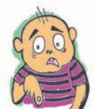

Why does this book refer to the President as 'she'? Have we ever had a woman President in our country?

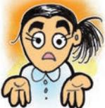

Did you protest when the book referred to the Prime Minister as 'he'? Have we not had a woman Prime Minister? Why should we assume that all the important positions are held by men?

Minister of a coalition government cannot take decisions as he likes. He has to accommodate different groups and factions in his party as well as among alliance partners. He also has to heed to the views and positions of the coalition partners and other parties, on whose support the survival of the government depends.

# The President

While the Prime Minister is the head of the government, the President is the head of the State. In our political system the head of the State exercises only nominal powers. The President of India is like the Queen of Britain whose functions are to a large extent ceremonial. The President supervises the overall functioning of all the political institutions in the country so that they operate in harmony to achieve the objectives of the State.

The President is not elected directly by the people. The elected Members of Parliament (MPs) and the elected Members of the Legislative Assemblies (MLAs) elect her. A candidate standing for President's post has to get a majority of votes to win the election. This ensures that the President can be seen to represent the entire nation. At the same time the President can never claim the kind of direct popular mandate that the Prime Minister can. This ensures that she remains only a nominal executive.

The same is true of the powers of the President. If you casually read the Constitution you would think that there is nothing that she cannot do. All governmental activities take place in the name of the President. All laws and major policy decisions of the government are issued in her name. All major appointments are made in the name of the President. These include the appointment of

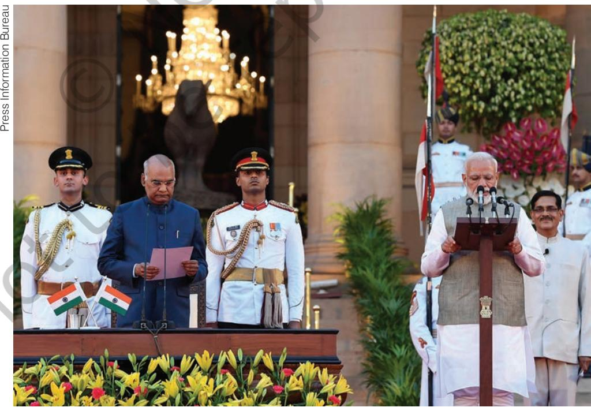

The President, Shri Ram Nath Kovind administering the oath of office of the Prime Minister to Shri Narendra Modi, at a Swearing-in Ceremony, at Rashtrapati Bhavan on 30 May 2019.

**WORKING OF INSTITUTIONS**

the Chief Justice of India, the Judges of the Supreme Court and the High Courts of the states, the Governors of the states, the Election Commissioners, ambassadors to other countries, etc. All international treaties and agreements are made in the name of the President. The President is the supreme commander of the defence forces of India.

But we should remember that the President exercises all these powers only on the advice of the Council of Ministers. The President can ask the Council of Ministers to reconsider its advice. But if the same advice is given again, she is bound to act according to it. Similarly, a bill passed by the Parliament becomes a law only after the President gives assent to it. If the President wants, she can delay this for some time and send the bill back to Parliament for reconsideration. But if Parliament passes the bill again, she has to sign it.

So you may wonder what does the President really do? Can she do anything on her own at all? There is one very important thing she should do on her own: appoint the Prime Minister. When a party or coalition of parties secures a clear majority in the elections, the President, has to appoint the leader of the majority party or the coalition that enjoys majority support in the Lok Sabha. When no party or coalition gets a majority in the Lok Sabha, the President exercises her discretion. The President appoints a leader who in her opinion can muster majority support in the Lok Sabha. In such a case, the President can ask the newly appointed Prime Minister to prove majority support in the Lok Sabha within a specified time.

## The Presidential System

Presidents all over the world are not always nominal executives like the President of India. In many countries of the world, the President is both the head of the state and the head of the government. The President of the United States of America is the most well known example of this kind of President. The US President is directly elected by the people. He personally chooses and appoints all Ministers. The law making is still done by the legislature (called the Congress in the US), but the president can veto any law. Most importantly, the president does not need the support of the majority of members in the Congress and neither is he answerable to them. He has a fixed tenure of four years and completes it even if his party does not have a majority in the Congress.

This model is followed in most of the countries of Latin America and many of the ex-Soviet Union countries. Given the centrality of the President, this system of government is called the Presidential form of government. In countries like ours that follow the British model, the parliament is supreme. Therefore our system is called the parliamentary system of government.

read the image

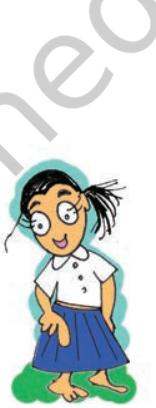

What is better for a democracy: A Prime Minister who can do whatever he wishes or a Prime Minister who needs to consult other leaders and parties?

Eliamma, Annakutti and Marymol read the section on the President. Each of them had a question. Can you help them in answering these questions?

- Eliamma: What happens if the President and the Prime Minister disagree about some policy? Does the view of the Prime Minister always prevail?
- Annakutti:I find it funny that the President is the Supreme Commander of Armed Forces. I doubt if the President can even lift a heavy gun. What is the point in making the President the Commander?
- Marymol: I would say, what is the point in having a President at all if all the real powers are with the Prime Minister?

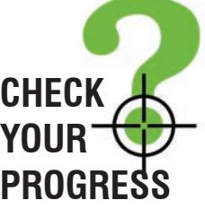

# **4.4 THE JUDICIARY**

It is quite common in the US for judges to be nominated on the basis of well-known political opinions and

affiliations. This fictitious advertisement appeared in the US in 2005 when President Bush was considering various candidates for nomination to the US supreme court. What does this cartoon say about the

independence of the judiciary? Why do such cartoons not appear in our country? Does this demonstrate the independence of our judiciary?

©M.E. Cohen, National, Cagle Cartoons Inc.

Let us return, one final time, to the story of Office Memorandum that we started with. This time let us not recall the story, but imagine how different the story could have been. Remember, the story came to a satisfactory end because the Supreme Court gave a verdict that was accepted by everyone. Imagine what would have happened in the following situations:

- < If there was nothing like a Supreme Court in the country.
- < Even if there was a Supreme Court, if it had no power to judge actions of the government.
- < Even if it had the power, if no one trusted the Supreme Court to give a fair verdict.
- < Even if it gave a fair judgement, if those who appealed against the Government Order did not accept the judgement.

**WORKING OF INSTITUTIONS**

Follow the news about any major court case in a High Court or the Supreme Court. What was the original verdict? Did the High Court or the Supreme Court change it? What was the reason?

This is why an independent and powerful judiciary is considered essential for democracies. All the courts at different levels in a country put together are called the judiciary. The Indian judiciary consists of a Supreme Court for the entire nation, High Courts in the states, District Courts and the courts at local level. India has an integrated judiciary. It means the Supreme Court controls the judicial administration in the country. Its decisions are binding on all other courts of the country. It can take up any dispute

- < Between citizens of the country;
- < Between citizens and government;
- < Between two or more state governments; and
- < Between governments at the union and state level.

It is the highest court of appeal in civil and criminal cases. It can hear appeals against the decisions of the High Courts.

Independence of the judiciary means that it is not under the control of the legislature or the executive. The judges do not act on the direction of the government or according to the wishes of the party in power. That is why all modern democracies have courts that are independent of the legislature and the executive. India has achieved this. The judges of the Supreme Court and the High Courts are appointed by the President on the advice of the Prime Minister and in consultation with the Chief Justice of the Supreme Court. In practice it now means that the senior judges of the Supreme Court select the new judges of the Supreme Court and the High Courts.There is very little scope for interference by the political executive. The senior most judge of the Supreme Court is usually appointed the Chief Justice. Once a person is appointed as judge of the Supreme Court or the High Court it is nearly impossible to remove him or her from that position. It is as difficult as removing the President of India. A judge can be removed only by an impeachment motion passed separately by two-thirds members of the two Houses of the Parliament. It has never happened in the history of Indian democracy.

The judiciary in India is also one of the most powerful in the world. The Supreme Court and the High Courts have the power to interpret the Constitution of the country. They can declare invalid any law of the legislature or the actions of the executive, whether at the Union level or at the state level, if they find such a law or action is against the

Appointment of judges: … Removal of judges: … Powers of the judiciary: … Constitution. Thus they can determine the Constitutional validity of any legislation or action of the executive in the country, when it is challenged before them. This is known as the judicial review. The Supreme Court of India has also ruled that the core or basic principles of the Constitution cannot be changed by the Parliament.

The powers and the independence of the Indian judiciary allow it to act as the guardian of the Fundamental Rights. We shall see in the next chapter that the citizens have a right to approach the courts to seek remedy in case of any violation of their rights. In recent years the Courts have given several judgments and directives to protect public interest and human rights. Any one can approach the courts if public interest is hurt by the actions of government. This is called public interest litigation. The courts intervene to prevent the misuse of the government's power to make decisions. They check malpractices on the part of public officials. That is why the judiciary enjoys a high level of confidence among the people.

Why are people allowed to go to courts against the government's decisions?

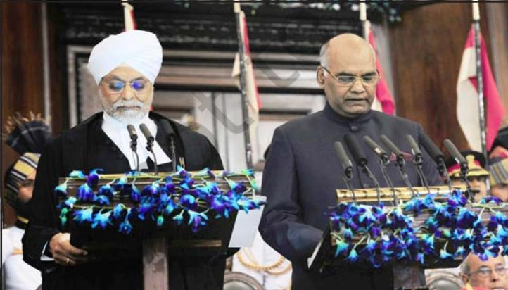

The Chief Justice of India, Shri Justice J.S. Khehar administering the oath of the office of the President of India to Shri Ram Nath Kovind, at a swearing-in ceremony in the Central Hall of Parliament in New Delhi on 25 July 2017.

CHECK YOUR

PROGRESS

70 **DEMOCRATIC POLITICS**

Coalition government: A government formed by an alliance of two or more political parties, usually when no single party enjoys majority support of the members in a legislature.

Executive: A body of persons having authority to initiate major policies, make decisions and implement them on the basis of the Constitution and laws of the country.

Government: A set of institutions that have the power to make, implement and interpret laws so as to ensure an orderly life. In its broad sense, government administers and supervises over citizens and resources of a country.

Judiciary: An institution empowered to administer justice and provide a mechanism for the resolution of legal disputes. All the courts in the country are collectively referred to as judiciary.

Legislature: An assembly of people's representatives with the power to enact laws for a country. In addition to enacting laws, legislatures have authority to raise taxes and adopt the budget and other money bills.

Office Memorandum: A communication issued by an appropriate authority stating the policy or decision of the government.

Political Institution: A set of procedures for regulating the conduct of government and political life in the country.

Reservations: A policy that declares some positions in government employment and educational institutions 'reserved' for people and communities who have been discriminated against, are disadvantaged and backward.

State: Political association occupying a definite territory, having an organised government and possessing power to make domestic and foreign policies. Governments may change, but the state continues. In common speech, the terms country, nation and state are used as synonyms.

#### 1 If you are elected as the President of India which of the following decision can you take on your own? exercises

- a Select the person you like as Prime Minister.
- b Dismiss a Prime Minister who has a majority in Lok Sabha.
- c Ask for reconsideration of a bill passed by both the Houses.
- d Nominate the leaders of your choice to the Council of Ministers.
- 2 Who among the following is a part of the political executive?
	- a District Collector
	- b Secretary of the Ministry of Home Affairs
	- c Home Minister
	- d Director General of Police
- 3 Which of the following statements about the judiciary is false?
	- a Every law passed by the Parliament needs approval of the Supreme Court
	- b Judiciary can strike down a law if it goes against the spirit of the Constitution
	- c Judiciary is independent of the Executive
	- d Any citizen can approach the courts if her rights are violated

**WORKING OF INSTITUTIONS**

- 4 Which of the following institutions can make changes to an existing law of the country?
	- a The Supreme Court
	- b The President
	- c The Prime Minister
	- d The Parliament
- 5 Match the ministry with the news that the ministry may have released:

| a | A new policy is being made to | i | Ministry of Defence |
| --- | --- | --- | --- |
|  | increase the jute exports from |  |  |
|  | the country. |  |  |
| b | Telephone services will be made | ii | Ministry of Agriculture, Food |
|  | more accessible to rural areas. |  | and Public Distribution |
| c | The price of rice and wheat sold | iii | Ministry of Health |
|  | under the Public Distribution |  |  |
|  | System will go down. |  |  |
| d | A pulse polio campaign will be | iv | Ministry of Commerce |
|  | launched. |  | and Industry |
| e | The allowances of the soldiers | v | Ministry of Communications |
|  | posted on high altitudes will |  | and Information Technology |
|  | be increased. |  |  |

- 6 Of all the institutions that we have studied in this chapter, name the one that exercises the powers on each of the following matters.
	- a Decision on allocation of money for developing infrastructure like roads, irrigation etc. and different welfare activities for the citizens
	- b Considers the recommendation of a Committee on a law to regulate the stock exchange
	- c Decides on a legal dispute between two state governments
	- d Implements the decision to provide relief for the victims of an earthquake.
- 7 Why is the Prime Minister in India not directly elected by the people? Choose the most appropriate answer and give reasons for your choice.
	- a In a Parliamentary democracy only the leader of the majority party in the Lok Sabha can become the Prime Minister.
	- b Lok Sabha can remove the Prime Minister and the Council of Ministers even before the expiry of their term.
	- c Since the Prime Minister is appointed by the President there is no need for it.
	- d Direct election of the Prime Minister will involve lot of expenditure on election.
- 8 Three friends went to watch a film that showed the hero becoming Chief Minister for a day and making big changes in the state. Imran said this is what the country needs. Rizwan said this kind of a personal

exercises

72 **DEMOCRATIC POLITICS**

exercises rule without institutions is dangerous. Shankar said all this is a fantasy. No minister can do anything in one day. What would be your reaction to such a film?

> 9 A teacher was making preparations for a mock parliament. She called two students to act as leaders of two political parties. She gave them an option: Each one could choose to have a majority either in the mock Lok Sabha or in the mock Rajya Sabha. If this choice was given to you, which one would you choose and why?

- 10 After reading the example of the reservation order, three students had different reactions about the role of the judiciary. Which view, according to you, is a correct reading of the role of judiciary?
	- a Srinivas argues that since the Supreme Court agreed with the government, it is not independent.
	- b Anjaiah says that judiciary is independent because it could have given a verdict against the government order. The Supreme Court did direct the government to modify it.
	- c Vijaya thinks that the judiciary is neither independent nor conformist, but acts as a mediator between opposing parties. The court struck a good balance between those who supported and those who opposed the order.

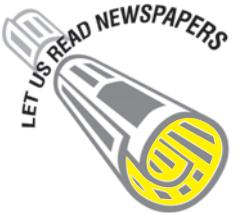

Collect newspapers for the last one week and classify the news related to the working of any of the institutions discussed in this chapter into four groups:

- < Working of the legislatures
- < Working of the political executive
- < Working of the civil services
- < Working of the judiciary

