CHAPTER 5

# DEMOCRATIC RIGHTS

# **OVERVIEW**

In the previous two chapters we have looked at two major elements of a democratic government. In Chapter 3 we saw how a democratic government has to be periodically elected by the people in a free and fair manner. In Chapter 4 we learnt that a democracy must be based on institutions that follow certain rules and procedures. These elements are necessary but not sufficient for a democracy. Elections and institutions need to be combined with a third element – enjoyment of rights – to make a government democratic. Even the most properly elected rulers working through the established institutional process must learn not to cross some limits. Citizens' democratic rights set those limits in a democracy.

This is what we take up in this final chapter of the book. We begin by discussing some real life cases to imagine what it means to live without rights. This leads to a discussion on what we mean by rights and why do we need them. As in the previous chapters, the general discussion is followed by a focus on India. We discuss one by one the Fundamental Rights in the Indian Constitution. Then we turn to how these rights can be used by ordinary citizens. Who will protect and enforce them? Finally we take a look at how the scope of rights has been expanding.

74 **DEMOCRATIC POLITICS**

# **5.1 LIFE WITHOUT RIGHTS**

In this book we have mentioned rights again and again. If you remember, we have discussed rights in each of the four preceding chapters. Can you fill in the blanks by recalling the rights dimension in each chapter?

Chapter 1: A comprehensive definition of democracy includes …

Chapter 2: Our Constitution makers believed that fundamental rights

were quite central to the Constitution because …

Chapter 3: Every adult citizen of India has the right to ... and to be ...

Chapter 4: If a law is against the Constitution, every citizen has the right to approach …

Let us now begin with three examples of what it means to live in the absence of rights.

## Prison in G ison in Gison in Guantanamo B tanamo Btanamo Bay

About 600 people were secretly picked up by the US forces from all over the world and put in a prison in Guantanamo Bay, an area near Cuba controlled by Amercian Navy. Anas's father, Jamil El-Banna, was among them. The American government said that they were enemies of the US and linked to the attack on New York on 11 September 2001. In most cases the governments of their countries were not asked or even informed about their imprisonment. Like other prisoners, El-Banna's family got to know that he was in that prison only through the media. Families of prisoners, media or even UN representatives were not allowed to meet them. The US army arrested them, interrogated them and decided whether to keep them there or not. There was no trial before any magistrate in the US. Nor could these prisoners approach courts in their own country.

Amnesty International, an international human rights organisation, collected information on the condition of the prisoners in Guantanamo Bay and reported that the prisoners were being tortured in ways that violated the US laws. They

**DEMOCRATIC RIGHTS**

were being denied the treatment that even prisoners of war must get as per international treaties. Many prisoners had tried protesting against these conditions by going on a hunger strike. Prisoners were not released even after they were officially declared not guilty. An independent inquiry by the UN supported these findings. The UN Secretary General said the prison in Guantanamo Bay should be closed down. The US government refused to accept these pleas.

#### Citizens' Rights in Saudi Arabia

The case of Guantanamo Bay looks like an exception, for it involves the government of one country denying rights to citizens of another country. Let us therefore look at the case of Saudi Arabia and the position of the citizens with regard to their government. Consider these facts:

- < The country is ruled by a hereditary king and the people have no role in electing or changing their rulers.
- < The king selects the legislature as well as the executive. He appoints the judges and can change any of their decisions.
- < Citizens cannot form political parties or any political organisations. Media cannot report anything that the monarch does not like.
- < There is no freedom of religion. Every citizen is required to be Muslim. Non-Muslim residents can follow their religion in private, but not in public.
- < Women are subjected to many public restrictions. The testimony of one man is considered equal to that of two women.

This is true not just of Saudi Arabia. There are many countries in the world where several of these conditions exist.

## Ethnic massacre in Kosovo

You might think that this is possible in an absolute monarchy but not in countries which choose their rulers. Just consider this story from Kosovo. This was a province of Yugoslavia before its split. In this province the population was overwhelmingly ethnic Albanian. But in the entire country, Serbs were in majority. A narrow minded Serb nationalist Milosevic (pronounced Miloshevich) had won the election. His government was very hostile to the Kosovo Albanians. He wanted the Serbs to dominate the country. Many Serb leaders thought that Ethnic minorities like Albanians should either leave the country or accept the dominance of the Serbs.

This is what happened to an Albanian family in a town in Kosovo in April 1999:

"74-year-old Batisha Hoxha was sitting in her kitchen with her 77 year–old husband, Izet, staying warm by the stove. They had heard explosions but did not realise that Serbian troops had already entered the town. The next thing she knew, five or six soldiers had burst through the front door and were demanding "*Where are your children*?"

"*… they shot Izet three times in the chest"* recalled Batisha. With her husband dying before her, the soldiers pulled the wedding ring off her finger and told her to get out. *"I was not even outside the gate when they burned the house*" … She was standing on the street in the rain with no house, no husband, no possessions but the clothes she was wearing."

This news report was typical of what happened to thousands of Albanians in that period. Do

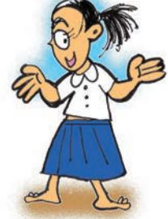

If you were a Serb, would you support what Milosevic did in Kosovo? Do you think his project of establishing Serb dominance was good for the Serbs?

remember that this massacre was being carried out by the army of their own country, working under the direction of a leader who came to power through democratic elections. This was one of the worst instances of killings based on ethnic prejudices in recent times. Finally several other countries intervened to stop this massacre. Milosevic lost power and was tried by the International Court of Justice for crimes against humanity.

- < Write a letter to Anas Jamil in UK, describing your reactions after reading his letter to Tony Blair.
- < Write a letter from Batisha in Kosovo to a woman who faced a similar situation in India.
- < Write a memorandum on behalf of women in Saudi Arabia to the Secretary General of the United Nations.

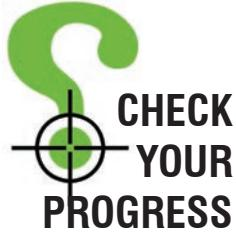

For each of the three cases of life without rights, mention an example from India. These could include the following:

- < Newspaper reports on custodial violence.
- < Newspaper reports on force-feeding of prisoners who go on hunger strike.
- < Ethnic massacre in any part of our country.
- < Reports regarding unequal treatment of women.

List the similarities and differences between the earlier case and the Indian example. It is not necessary that for each of these cases you must find an exact Indian parallel.

# **5.2 RIGHTS IN A DEMOCRACY**

Think of all the examples that we have discussed so far. Think of the victims in each example: the prisoners in Guantanamo Bay, women in Saudi Arabia, Albanians in Kosovo. If you were in their position, what would you have wished? If you could, what would you do to ensure that such things do not happen to anyone?

You would perhaps desire a system where security, dignity and fair play are assured to everyone. You might want, for example, that no one should be arrested without proper reason and information. And if someone is arrested, he or she should have a fair chance to defend themselves. You might agree that such assurance cannot apply to everything. One has to be reasonable in what one expects and demands of everyone else, for one has to grant the same to everyone. But you might insist that the assurance does not remain on paper, that there is someone to enforce these assurances, that those who violate these are punished. In other words, you might want a system where at least a minimum is guaranteed to everyone – powerful or weak, rich or poor, majority or minority. This is the spirit behind thinking about rights.

#### What are rights?

Rights are claims of a person over other fellow beings, over the society and over the government. All of us

**DEMOCRATIC RIGHTS**

want to live happily, without fear and without being subjected to degraded treatment. For this we expect others to behave in such a way that does not harm us or hurt us. Equally, our actions should not also harm or hurt others. So a right is possible when you make a claim that is equally possible for others. You cannot have a right that harms or hurts others. You cannot have a right to play a game in such a way that it breaks the neighbour's window. The Serbs in Yugoslavia could not have claimed the whole country for themselves. The claims we make should be reasonable. They should be such that can be made available to others in an equal measure. Thus, a right comes with an obligation to respect other rights.

Just because we claim some thing it does not become our right. It has to be recognised by the society we live in. Rights acquire meaning only in society. Every society makes certain rules to regulate our conduct. They tell us what is right and what is wrong. What is recognised by the society as rightful becomes the basis of rights. That is why the notion of rights changes from time to time and society to society. Two hundred years ago anyone who said that women should have right to vote would have sounded strange. Today not granting them vote in Saudi Arabia appears strange.

When the socially recognised claims are written into law they acquire real force. Otherwise they remain merely as natural or moral rights. The prisoners in Guantanamo Bay had a moral claim not to be tortured or humiliated. But they could not go to anyone to enforce this claim. When law recognises some claims they become enforceable. We can then demand their application. When fellow citizens or the government do not respect these rights we call it violation or infringement of our rights. In such circumstances citizens can approach courts to protect their rights. So, if we want to call any claim a right, it has to have these three qualities. Rights are reasonable claims of persons recognised by society and sanctioned by law.

#### Why do we need rights in a ts in a democracy?

Rights are necessary for the very sustenance of a democracy. In a democracy every citizen has to have the right to vote and the right to be elected to government. For democratic elections to take place, it is necessary that citizens should have the right to express their opinion, form political parties and take part in political activities.

Rights also perform a very special role in a democracy. Rights protect minorities from the oppression of majority. They ensure that the majority cannot do whatever it likes. Rights are guarantees which can be used when things go wrong. Things may go wrong when some citizens may wish to take away the rights of others. This usually happens when those in majority want to dominate those in minority. The government should protect the citizens' rights in such a situation. But sometimes elected governments may not protect or may even attack the rights of their own citizens. That is why some rights need to be placed higher than the government, so that the government cannot violate them. In most democracies the basic rights of the citizen are written down in the constitution.

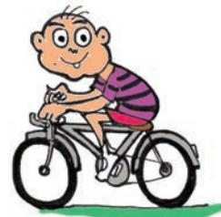

What are the examples of elected governments not protecting or even attacking the rights of their own citizens? Why do they do that?

78 **DEMOCRATIC POLITICS**

# **5.3 RIGHTS IN THE INDIAN CONSTITUTION**

In India, like most other democracies in the world, these rights are mentioned in the Constitution. Some rights which are fundamental to our life are given a special status. They are called Fundamental Rights. We have already read in Chapter 2 the preamble to our Constitution. It talks about securing for all its citizens equality, liberty and justice. Fundamental Rights put this promise into effect. They are an important basic feature of India's Constitution.

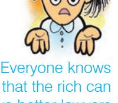

that the rich can have better lawyers in the courts. What is the point in talking about equality before law?

You already know our Constitution provides for six Fundamental Rights. Can you recall these? What exactly do these rights mean for an ordinary citizen? Let us look at these one by one.

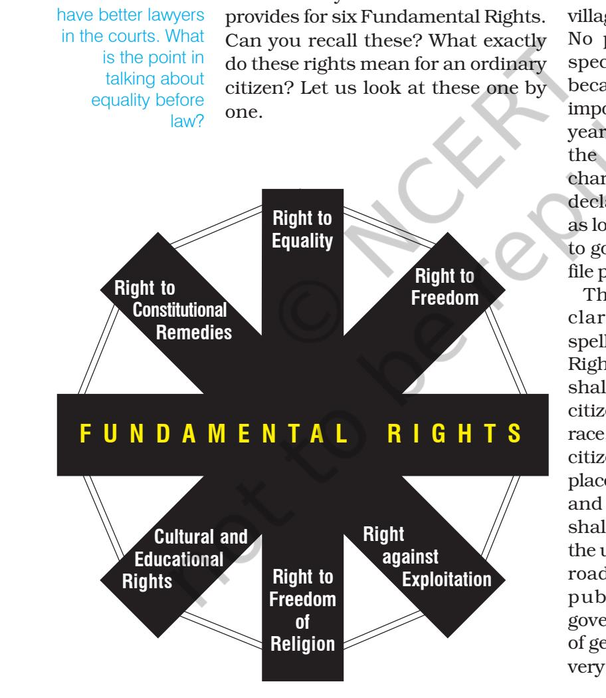

**DEMOCRATIC RIGHTS**

## Right to Equality

The Constitution says that the government shall not deny to any person in India equality before the law or the equal protection of the laws. It means that the laws apply in the same manner to all, regardless of a person's status. This is called the rule of law. Rule of law is the foundation of any democracy. It means that no person is above the law. There cannot be any distinction between a political leader, government official and an ordinary citizen.

Every citizen, from the Prime Minister to a small farmer in a remote village, is subjected to the same laws. No person can legally claim any special treatment or privilege just because he or she happens to be an important person. For example, a few years ago a former Prime Minister of the country faced a court case on charges of cheating. The court finally declared that he was not guilty. But as long as the case continued, he had to go to the court, give evidence and file papers, just like any other citizen.

This basic position is further clarified in the Constitution by spelling out some implications of the Right to Equality. The government shall not discriminate against any citizen on grounds only of religion, race, caste, sex or place of birth. Every citizen shall have access to public places like shops, restaurants, hotels, and cinema halls. Similarly, there shall be no restriction with regard to the use of wells, tanks, bathing ghats, roads, playgrounds and places of public resorts maintained by government or dedicated to the use of general public. This might appear very obvious, but it was necessary to incorporate these rights in the Constitution of our country where the traditional caste system did not allow people from some communities to access all public places.

The same principle applies to public jobs. All citizens have equality of opportunity in matters relating to employment or appointment to any position in the government. No citizen shall be discriminated against or made ineligible for employment on the grounds mentioned above. You have read in Chapter 4 that the Government of India has provided reservations for Scheduled Castes, Scheduled Tribes and Other Backward Classes. Various governments have different schemes for giving preference to women, poor or physically handicapped in some kinds of jobs. Are these reservations against the right to equality? They are not. For equality does not mean giving everyone the same treatment, no matter what they need. Equality means giving everyone an equal opportunity to achieve whatever one is capable of. Sometimes it is necessary to give special treatment to someone in order to ensure equal opportunity. This is what job reservations do. Just to clarify this, the Constitution says that reservations of this kind are not a violation of the Right to Equality.

The principle of non-discrimination extends to social life as well. The Constitution mentions one extreme form of social discrimination, the practice of untouchability, and clearly directs the government to put an end to it. The practice of untouchability has been forbidden in any form. Untouchability here does not only mean refusal to touch people belonging to certain castes. It refers to any belief or social

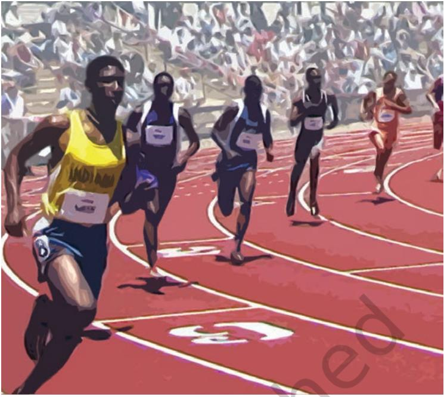

# ACTIVITY

- < Go to the playground of the school or any stadium and watch a 400 metre race on any track. Why are the competitors in the outer lane placed ahead of those in the inner lane at the starting point of the race? What would happen if all the competitors start the race from the same line? Which of these two would be an equal and fair race? Apply this example to a competition for jobs.
- < Observe any big public building. Is there a ramp for physically handicapped? Are there any other facilities that make it possible for physically handicapped to use the building in the same way as any one else? Should these special facilities be provided, if it leads to extra expenditure on the building? Do these special provisions go against the principle of equality?

practice which looks down upon people on account of their birth with certain caste labels. Such practice denies them interaction with others or access to public places as equal citizens. So the Constitution made untouchability a punishable offence.

80 **DEMOCRATIC POLITICS**

#### Many Forms of Untouchability

In 1999, P. Sainath wrote a series of newsreports in The Hindu describing untouchability and caste discrimination that was still being practiced against Dalits or persons belonging to Scheduled Castes. He travelled to various parts of the country and found that in many places:

- < Tea stalls kept two kinds of cups, one for Dalits one for others;
- < Barbers refused to serve dalit clients;
- < Dalit students were made to sit separately in the classroom or drink water from separate picher;
- < Dalit grooms were not allowed to ride a horse in the wedding procession; and
- < Dalits were not allowed to use common handpump or if they did, the handpump was washed to purify it.

All these fall under the definition of untouchability. Can you think of some examples from your own area?

## Right to Freedom

Freedom means absence of constraints. In practical life it means absence of interference in our affairs by others – be it other individuals or the government. We want to live in society, but we want to be free. We want to do things in the way we want to do them. Others should not dictate us what we should do. So, under the Indian Constitution all citizens have the right to

- < Freedom of speech and expression
- < Assembly in a peaceful manner
- < Form associations and unions
- < Move freely throughout the country
- < Reside in any part of the country, and
- < Practice any profession, or to carry
- on any occupation, trade or business.

You should remember that every citizen has the right to all these freedoms. That means you cannot exercise your freedom in such a

**DEMOCRATIC RIGHTS**

manner that violates others' right to freedom. Your freedoms should not cause public nuisance or disorder. You are free to do everything which injures no one else. Freedom is not unlimited licence to do what one wants. Accordingly, the government can impose certain reasonable restrictions on our freedoms in the larger interests of the society.

Freedom of speech and expression is one of the essential features of any democracy. Our ideas and personality develop only when we are able to freely communicate with others. You may think differently from others. Even if a hundred people think in one way, you should have the freedom to think differently and express your views accordingly. You may disagree with a policy of government or activities of an association. You are free to criticise the government or the activities of the association in your conversations with parents, friends and relatives. You may publicise your views through a pamphlet, magazine or newspaper. You can do it through paintings, poetry or songs. However, you cannot use this freedom to instigate violence against others. You cannot use it to incite people to rebel against government.

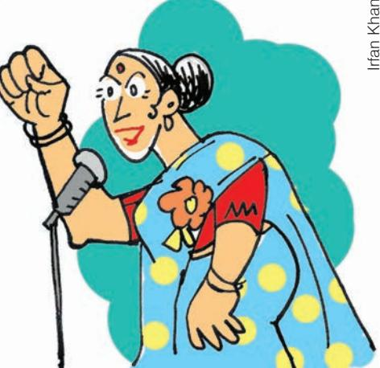

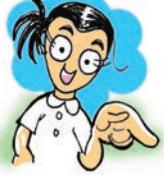

Should the freedom of expression be extended to those who are spreading wrong and narrowminded ideas? Should they be allowed to confuse the public?

Neither can you use it to defame others by saying false and mean things that cause damage to a person's reputation.

Citizens have the freedom to hold meetings, processions, rallies and demonstrations on any issue.

They may want to discuss a problem, exchange ideas, mobilise public support to a cause, or seek votes for a candidate or party in an election. But such meetings have to be peaceful. They should not lead to public disorder or breach of peace in society. Those who participate in these activities and meetings should not carry weapons with them. Citizens also can form associations. For example workers in a factory can form a workers' union to promote their interests. Some people in a town may come together to form an association to campaign against corruption or pollution.

As citizens we have the freedom to travel to any part of the country. We are free to reside and settle in any part of the territory of India. Let us say a person who belongs to the state of Assam wants to start a business in Hyderabad. He may not have any connection with that city, he may not have even seen it ever. Yet as a citizen of India he has the right to set up base there. This right allows lakhs of people to migrate from villages to towns and from poorer regions of the countries to prosperous regions and big cities. The same freedom extends to choice of occupations. No one can force you to do or not to do a certain job. Women cannot be told that some kinds of occupations are not for them. People from deprived castes cannot be kept to their traditional occupations.

The Constitution says that no person can be deprived of his life or personal liberty except according to

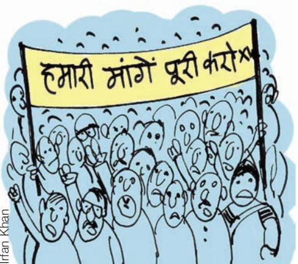

procedure established by law. It means that no person can be killed unless the court has ordered a death sentence. It also means that a government or police officer cannot arrest or detain any citizen unless he has proper legal justification. Even when they do, they have to follow some procedures:

- < A person who is arrested and detained in custody will have to be informed of the reasons for such arrest and detention.
- < A person who is arrested and detained shall be produced before the nearest magistrate within a period of 24 hours of arrest.
- < Such a person has the right to consult a lawyer or engage a lawyer for his defence.

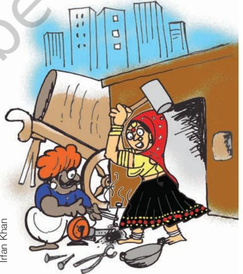

82 **DEMOCRATIC POLITICS**

Let us recall the cases of Guantanamo Bay and Kosovo. The victims in both these cases faced a threat to the most basic of all liberties, the protection of individual life and personal liberty.

Are these cases instances of violation of right to freedom? If yes, which constitutional provision does each of these violate?

- < The government of India banned Salman Rushdie's book Satanic Verses on the ground that it was disrespectful to Prophet Mohammed and was likely to hurt the feelings of Muslim community.
- < Every film has to be approved by the Censor Board of the government before it can be shown to the public. But there is no such restriction if the same story is published in a book or a magazine.
- < The government is considering a proposal that there will be industrial zones or sectors of economy where workers will not be allowed to form unions or go on strike.
- < City administration has imposed a ban on use of public microphones after 10 p.m. in view of the approaching secondary school examinations.

## Right against E t against Et against Exploita xploitation

Once the right to liberty and equality is granted, it follows that every citizen has a right not to be exploited. Yet the Constitution makers thought is was necessary to write down certain clear provisions to prevent exploitation of the weaker sections of the society.

The Constitution mentions three specific evils and declares these illegal. First, the Constitution prohibits 'traffic in human beings'. Traffic here means selling and buying of human beings, usually women, for immoral purposes. Second, our Constitution also prohibits forced labour or *begar* in any form. *Begar* is a practice where the worker is forced to render service to the 'master' free of charge or at a nominal remuneration. When this practice takes place on a life-long basis, it is called the practice of bonded labour.

Finally, the Constitution also prohibits child labour. No one can employ a child below the age of fourteen to work in any factory or mine or in any other hazardous work, such as railways and ports. Using this as a basis many laws have been made to prohibit children from working in industries such as beedi making, firecrackers and matches, printing and dyeing.

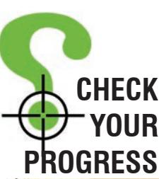

On the basis of these news reports write a letter to the editor or a petition to a court highlighting the violation of right against exploitation:

A petition was filed in the Madras High Court. The petitioner said a large number of children aged between seven and 12 were taken from villages in Salem district and sold at auctions at Olur Nagar in Kerala's Thrissur district. The petitioner requested the courts to order the government to check these facts. (**March 2005**)

Children, from the age of five, were employed in the iron ore mines in the Hospet, Sandur and the Ikal areas in Karnataka. Children were forced to carry out digging, breaking stones, loading, dumping, transporting and processing of iron ore with no safety equipment, fixed wages and working hours. They handled a high-level of toxic wastes and were exposed to mine dust, which was above the permissible level. The school dropout rate in the region was very high. (**May 2005**) The latest annual survey conducted by the National Sample Survey Organisation found that the number of female child labourers was growing both in rural and urban areas. The survey revealed there were 41 female child labourers per thousand worker population in rural areas as against the previous figure of 34 per thousand. The figure for male child had remained at 31. (**April 2005**)

**DEMOCRATIC RIGHTS**

Do you know what the minimum wages in your state are? If not, can you find out? Speak to five people doing different types of work in your neighbourhood and find out if they are earning the minimum wages or not. Ask them if they know what the minimum wages are. Ask them if men and women are getting the same wages.

## Right to Freedom of R dom of Rdom of Religion eligion

Right to freedom includes right to freedom of religion as well. In this case too, the Constitution makers were very particular to state it clearly. You have already read in Chapter 2 that India is a secular state. Most people in India, like anywhere else in the world, follow different religions. Some may not believe in any religion. Secularism is based on the idea that the state is concerned only with relations among human beings, and not with the relation between human beings and God. A secular state is one that does not establish any one religion as official religion. Indian secularism practices an attitude of a principled and equal distance from all religions. The state has to be neutral and impartial in dealing with all religions.

Every person has a right to profess, practice and propagate the religion he or she believes in. Every religious group or sect is free to manage its religious affairs. A right to propagate one's religion, however, does not mean that a person has right to compel another person to convert into his religion by means of force, fraud, inducement or allurement. Of course, a person is free to change religion on his or her own will. Freedom to practice religion does not mean that a person can do whatever he wants in the name of religion. For example, one cannot sacrifice animals or human beings as offerings to supernatural forces or gods. Religious practices which treat women as inferior or those that infringe women's freedom are not allowed. For example, one cannot force a widow to shave head or wear white clothes.

A secular state is one that does not confer any privilege or favour on any particular religion. Nor does it punish or discriminate against people on the basis of religion they follow. Thus the government cannot compel any person to pay any taxes for the promotion or maintenance of any particular religion or religious institution. There shall be no religious instruction in the government educational institutions. In educational institutions managed by private bodies no person shall be compelled to take part in any religious instruction or to attend any religious worship.

#### Cultural and E al and Eal and Educational Rights

You might wonder why the Constitution makers were so particular in providing written guarantees of the rights of the minorities. Why are there no special guarantees for the majority? Well, for the simple reason that the working of democracy gives power to the majority. It is the language, culture and religion of minorities that needs special protection. Otherwise, they may get neglected or undermined under the impact of the language, religion and culture of the majority.

That is why the Constitution specifies the cultural and educational rights of the minorities:

< Any section of citizens with a distinct language or culture have a right to conserve it.

84 **DEMOCRATIC POLITICS**

The Constitution does not give people their religion. Then how can it give people the right to practise their religion?

- < Admission to any educational institution maintained by government or receiving government aid cannot be denied to any citizen on the ground of religion or language.
- < All minorities have the right to establish and administer educational institutions of their choice. Here minority does not mean only religious minority at the national

level. In some places people speaking a particular language are in majority; people speaking a different language are in a minority. For example, Telugu speaking people form a majority in Andhra Pradesh. But they are a minority in the neighbouring State of Karnataka. Sikhs constitute a majority in Punjab. But they are a minority in Rajasthan, Haryana and Delhi.

Read these news reports and identify the right that is being debated in each of these cases:

- < An emergency session of the Shiromani Gurdwara Parbandhak Committee (SGPC) rejected the proposal to form a separate body to manage the affairs of Sikh shrines in Haryana. It warned the government that the Sikh community would not tolerate any interference in their religious affairs. (June 2005)
- < The Allahabad High Court quashed the Central law, which gave Aligarh Muslim University its minority status, and held illegal the reservation of seats for Muslims in its postgraduate medical courses. (January 2006)
- < The Rajasthan Government has decided to enact an anti-conversion law. Christian leaders have said that the Bill would aggravate the sense of insecurity and fear in the minds of minorities. (March 2005)

#### How can we secure these rights?

If rights are like guarantees, they are of no use if there is no one to honour them. The fundamental rights in the Constitution are important because they are enforceable. We have a right to seek the enforcement of the above mentioned rights. This is called the Right to Constitutional Remedies. This itself is a Fundamental Right. This right makes other rights effective. It is possible that sometimes our rights may be violated by fellow citizens, private bodies or by the government. When any of our rights are violated we can seek remedy through courts. If it is a Fundamental Right we can directly approach the Supreme Court or the High Court of a state. That is why Dr. Ambedkar called the Right to Constitutional Remedies, 'the heart and soul' of our Constitution.

Fundamental Rights are guaranteed against the actions of the Legislatures, the Executive, and any other authorities instituted by the government. There can be no law or action that violates the Fundamental Rights. If any act of the Legislature or the Executive takes away or limits any of the Fundamental Rights it will be invalid. We can challenge such laws of the central and state governments, the policies and actions of the government or the governmental organisations like the nationalised banks or electricity boards. Courts also enforce the Fundamental Rights against private individuals and bodies. The Supreme Court and High Courts have the power to issue directions, orders or writs for the enforcement of the Fundamental Rights. They can also award compensation to the

**DEMOCRATIC RIGHTS**

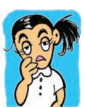

CHECK YOUR

PROGRESS

Can the President of India stop you from approaching the Supreme Court to secure your fundamental rights?

#### National Human Rights Commission

Many cases of human rights violations in diverse fields are being brought to the public notice from across India. Human rights organisations and the media often criticise government agencies for not seriously pursuing these cases or catching the culprits. Someone had to intervene on behalf of the victims. This is where the National Human Rights Commission stepped in. This is an independent commission set up by law in 1993. Like judiciary, the Commission is independent of the government. The Commission is appointed by the President and includes retired judges, officers and eminent citizens. Yet it does not have the burden of deciding court cases. So it can focus on helping the victims secure their human rights. These include all the rights granted to the citizens by the Constitution. For NHRC human rights also include the rights mentioned in the UN sponsored international treaties that India has signed.

The NHRC cannot by itself punish the guilty. That is the responsibility of courts. The NHRC is there to make independent and credible inquiry

victims and punishment to the violators. We have already seen in Chapter 4 that the judiciary in our country is independent of the government and the parliament. We also noted that our judiciary is very powerful and can do whatever is needed to protect the rights of the citizens.

In case of any violation of a Fundamental Right the aggrieved person can go to a court for remedy. But now, any person can go to court against the violation of the Fundamental Right, if it is of social or public interest. It is called Public Interest Litigation (PIL). Under the into any case of violation of human rights. It also inquires into any case of abetment of such violation or negligence in controlling it by any government officer and takes other general steps to promote human rights in the country. The Commission presents its findings and recommendations to the government or intervene in the court on behalf of the victims. It has wide ranging powers to carry out its inquiry. Like any court it can summon witnesses, question any government official, demand any official paper, visit any prison for inspection or send its own team for on-the-spot inquiry.

Any citizen of India can write a letter to this address to complain against the violation of human rights: **National Human Rights Commission**, G.P.O. Complex, INA, New Delhi 110023. There is no fee or anyformal procedure to approach the NHRC. Like NHRC, there are State Human Rights Commissions in all the 28 states of the country. For more details, visit http:/ /www.nhrc.nic.in

PIL any citizen or group of citizens can approach the Supreme Court or a High Court for the protection of public interest against a particular law or action of the government. One can write to the judges even on a postcard. The court will take up the matter if the judges find it in public interest.

Is there a State Human Rights Commission in your state? Find out about its activities. Write a petition to the NHRC if you know any instances of human rights violation in your area.

86 **DEMOCRATIC POLITICS**

Are these rights only for adults? Which of these rights are available to children?

# **5.4 EXPANDING SCOPE OF RIGHTS**

We began this chapter by discussing the significance of rights. In much of the chapter we have focussed only on Fundamental Rights in the Constitution. You might think that Fundamental Rights granted by the Constitution are the only rights citizen have. This is not true. While Fundamental Rights are the source of all rights, our Constitution and law offers a wider range of rights. Over the years the scope of rights has expanded.

Sometimes it leads to expansion in the legal rights that the citizen can enjoy. From time to time, the courts gave judgments to expand the scope of rights. Certain rights like right to freedom of press, right to information, and right to education are derived from the Fundamental Rights. Now school education has become a right for Indian citizens. The governments are responsible for providing free and compulsory education to all children up to the age of 14 years. Parliament has enacted a law giving the right to information to the citizens. This Act was made under the Fundamental Right to freedom of thought and expression. We have a right to seek information from government offices. Recently the Supreme Court has expanded the meaning of the right to life to include the right to food. Also, rights are not limited only to Fundamental Rights as enumerated in the Constitution. Constitution provides many more rights, which may not be Fundamental Rights. For example the right to property is not a Fundamental Right but it is a constitutional right. Right to vote in elections is an important constitutional right.

Sometimes the expansion takes place in what is called human rights. These are universal moral claims that may or may not have been recognised by law. In that sense these claims are not rights going by the definition that we presented earlier. With the expansion of democracy all over the world, there is greater pressure on governments to accept these claims. Some international covenants have also contributed to the expansion of rights.

Thus the scope of rights has been expanding and new rights are evolving over time. They are result of struggle of the people. New rights emerge as societies develop or as new constitutions are made. The Constitution of South Africa guarantees its citizens several kinds of new rights:

- < Right to privacy, so that citizens or their home cannot be searched, their phones cannot be tapped, their communication cannot be opened.
- < Right to an environment that is not harmful to their health or wellbeing;
- < Right to have access to adequate housing.

**DEMOCRATIC RIGHTS**

- < Right to have access to health care services, sufficient food and water; no one may be refused emergency medical treatment.
#### International Covenant on Economic, Social and Cultural Rights

This international covenant recognises many rights that are not directly a part of the Fundamental Rights in the Indian Constitution. This has not yet become an international treaty. But human right activists all over the world see this as a standard of human rights. These include:

- < right to work: opportunity to everyone to earn livelihood by working
- < right to safe and healthy working conditions, fair wages that can provide decent standard of living for the workers and their families
- < right to adequate standard of living including adequate food, clothing and housing
- < right to social security and insurance
- < right to health: medical care during illness, special care for women during childbirth and prevention of epidemics
- < right to education: free and compulsory primary education, equal access to higher education.

Many people think that the right to work, right to health, right to minimum livelihood and right to privacy should be made fundamental rights in India as well. What do you think?

#### **Amnesty International**: An

international organisation of volunteers who campaign for human rights. This organisation brings out independent reports on the violation of human rights all over the world.

**Claim**: Demand for legal or moral entitlements a person makes on fellow citizens, society or the government.

**Covenant**: Promise made by individuals, groups or countries to uphold a rule or principle. It is legally binding on the signatories to the agreement or statement. **Dalit**: A person who belongs to the castes which were considered low and not touchable by others. Dalits are also known by other names such as the Scheduled Castes, Depressed Classes etc.

**Ethnic group**: An ethnic group is a human population whose members usually identify with each other on the basis of a common ancestry. People of an ethnic group are united by cultural practices, religious beliefs and historical memories.

**Traffic**: Selling and buying of men, women or children for immoral purposes.

**Summon**: An order issued by a court asking a person to appear before it. **Writ**: A formal document containing an order of the court to the government issued only by High Court or the Supreme Court.

**GLOSSARY**

88 **DEMOCRATIC POLITICS**

- **1** Which of the following is not an instance of an exercise of a fundamental right?
	- **a** Workers from Bihar go to the Punjab to work on the farms
	- **b** Christian missions set up a chain of missionary schools
	- **c** Men and women government employees get the same salary
	- **d** Parents' property is inherited by their children
- **2** Which of the following freedoms is not available to an Indian citizen? **a** Freedom to criticise the government
	- **b** Freedom to participate in armed revolution
	- **c** Freedom to start a movement to change the government
	- **d** Freedom to oppose the central values of the Constitution
- **3** Which of the following rights is available under the Indian Constitution?
	- **a** Right to work
	- **b** Right to adequate livelihood
	- **c** Right to protect one's culture
	- **d** Right to privacy
- **4** Name the Fundamental Right under which each of the following rights falls:
	- **a** Freedom to propagate one's religion
	- **b** Right to life

exercises

- **c** Abolition of untouchability
- **d** Ban on bonded labour
- **5** Which of these statements about the relationship between democracy and rights is more valid? Give reasons for your preference.
	- **a** Every country that is a democracy gives rights to its citizens.
	- **b** Every country that gives rights to its citizens is a democracy.
	- **c** Giving rights is good, but it is not necessary for a democracy.
- **6** Are these restrictions on the right to freedom justified? Give reasons for your answer.
	- **a** Indian citizens need permission to visit some border areas of the country for reasons of security.
	- **b** Outsiders are not allowed to buy property in some areas to protect the interest of the local population.
	- **c** The government bans the publication of a book that can go against the ruling party in the next elections.

**7** Manoj went to a college to apply for admission into an MBA course. The clerk refused to take his application and said "You, the son of a sweeper, wish to be a manager! Has anyone done this job in your community? Go to the municipality office and apply for a sweeper's position". Which of Manoj's fundamental rights are being violated in this instance? Spell these out in a letter from Manoj to the district collector.

**DEMOCRATIC RIGHTS**

- exercises
- **8** When Madhurima went to the property registration office, the Registrar told her, "You can't write your name as Madhurima Banerjee d/o A. K. Banerjee. You are married, so you must give your husband's name. Your husband's surname is Rao. So your name should be changed to Madhurima Rao." She did not agree. She said "If my husband's name has not changed after marriage, why should mine?" In your opinion who is right in this dispute? And why?
- **9** Thousands of tribals and other forest dwellers gathered at Piparia in Hoshangabad district in Madhya Pradesh to protest against their proposed displacement from the Satpura National Park, Bori Wildlife Sanctuary and Panchmarhi Wildlife Sanctuary. They argue that such a displacement is an attack on their livelihood and beliefs. Government claims that their displacement is essential for the development of the area and for protection of wildlife. Write a petition on behalf of the forest dwellers to the NHRC, a response from the government and a report of the NHRC on this matter.
- **10** Draw a web interconnecting different rights discussed in this chapter. For example right to freedom of movement is connected to the freedom of occupation. One reason for this is that freedom of movement enables a person to go to place of work within one's village or city or to another village, city or state. Similarly this right can be used for pilgrimage, connected with freedom to follow one's religion. Draw a circle for each right and mark arrows that show connection between or among different rights. For each arrow, give an example that shows the linkage.

In every chapter we have done an exercise on reading the newspaper. Let us now try to write for the newspaper. Take any example from the reports discussed in this chapter or any other local example that you are familiar with and write the following:

- < Letter to the editor highlighting a case of human rights violation.
- < Press release by a human rights organisation.
- < A headline and a news item concerning a Supreme Court order related to Fundamental Rights.
- < Editorial on growing incidents of custodial violence.

Put these together and make a newspaper for your school notice board.

