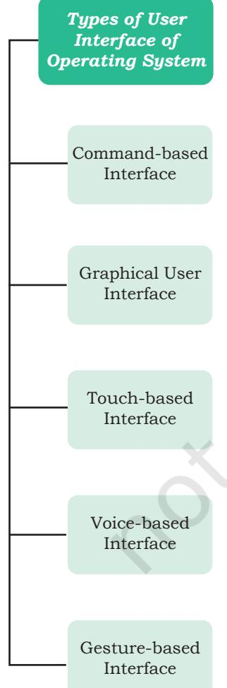

# **Chapter 1**

# **1.1 Introduction to Computer System**

A computer is an electronic device that can be programmed to accept data (input), process it and generate result (output). A computer along with additional hardware and software together is called a computer system.

A computer system primarily comprises a central processing unit (CPU), memory, input/output devices and storage devices. All these components function together as a single unit to deliver the desired output. A computer system comes in various forms and sizes. It can vary from a high-end server to personal desktop, laptop, tablet computer, or a smartphone.

Figure 1.1 shows the block diagram of a computer system. The directed lines represent the flow of data and signal between the components.

*–Alan Turing*

*Figure 1.1: Components of a computer system*

# **1.1.1 Central Processing Unit (CPU)**

It is the electronic circuitry of a computer that carries out the actual processing and usually referred as the brain of the computer. It is commonly called processor also. Physically, a CPU can be placed on one or more microchips called integrated circuits (IC). The ICs comprise semiconductor materials.

# *In this chapter*

- » *Introduction to Computer System*
- » *Evolution of Computer*
- » *Computer Memory*
- » *Data Transfer between Memory and CPU*
- » *Data and Information*
- » *Microprocessors*
- » *Software*
- » *Operating System*

Ch 1.indd 1 08-Apr-19 11:36:15 AM

*Figure 1.2: Input devices*

*Figure 1.3: Output devices*

The CPU is given instructions and data through programs. The CPU then fetches the program and data from the memory and performs arithmetic and logic operations as per the given instructions and stores the result back to memory.

While processing, the CPU stores the data as well as instructions in its local memory called registers. Registers are part of the CPU chip and they are limited in size and number. Different registers are used for storing data, instructions or intermediate results.

Other than the registers, the CPU has two main components — Arithmetic Logic Unit (ALU) and Control Unit (CU). ALU performs all the arithmetic and logic operations that need to be done as per the instruction in a program. CU controls sequential instruction execution, interprets instructions and guides data flow through the computer's memory, ALU and input or output devices. CPU is also popularly known as microprocessor. We will study more about it in section 1.5.

# **1.1.2 Input Devices**

The devices through which control signals are sent to a computer are termed as input devices. These devices convert the input data into a digital form that is acceptable by the computer system. Some examples of input devices include keyboard, mouse, scanner, touch screen, etc., as shown in Figure 1.2. Specially designed braille keyboards are also available to help the visually impaired for entering data into a computer. Besides, we can now enter data through voice, for example, we can use Google voice search to search the web where we can input the search string through our voice.

Data entered through input device is temporarily stored in the main memory (also called RAM) of the computer system. For permanent storage and future use, the data as well as instructions are stored permanently in additional storage locations called secondary memory.

# **1.1.3 Output Devices**

The device that receives data from a computer system for display, physical production, etc., is called output device. It converts digital information into humanunderstandable form. For example, monitor, projector, headphone, speaker, printer, etc. Some output devices

Ch 1.indd 2 08-Apr-19 11:36:15 AM

are shown in Figure 1.3. A braille display monitor is useful for a visually challenged person to understand the textual output generated by computers.

A printer is the most commonly used device to get output in physical (hardcopy) form. Three types of commonly used printers are inkjet, laserjet and dot matrix. Now-a-days, there is a new type of printer called 3D-printer, which is used to build physical replica of a digital 3D design. These printers are being used in manufacturing industries to create prototypes of products. Their usage is also being explored in the medical field, particularly for developing body organs.

# **1.2 Evolution of Computer**

From the simple calculator to a modern day powerful data processor, computing devices have evolved in a relatively short span of time. The evolution of computing devices in shown through a timeline in Figure 1.4

A punched card is a piece of stiff paper that stores digital data in the form of holes at predefined positions.

*Figure 1.4: Timeline showing key inventions in computing technology*

Ch 1.indd 3 08-Apr-19 11:36:15 AM

The Von Neumann architecture is shown in Figure 1.5. It consists of a Central Processing Unit (CPU) for processing arithmetic and logical instructions, a memory to store data and programs, input and output

*Figure 1.5: Von Neumann architecture for the computer* 

devices and communication channels to send or receive the output data. Electronic Numerical Integrator and Computer (ENIAC) is the first binary programmable computer based on Von Neumann architecture.

During the 1970s, Large Scale Integration (LSI) of electronic circuits allowed integration of complete CPU on a single chip, called microprocessor. Moore's Law predicted exponential growth in the number of transistors that could be assembled in a single microchip. In 1980s, the processing power of computers increased exponentially by integrating around 3 million components on a small-sized chip termed as Very Large Scale Integration (VLSI). Further advancement in technology has made it feasible to fabricate high density of transistors and other components (approx 106 components) on a single IC called Super Large Scale Integration (SLSI) as shown in Figure 1.6.

IBM introduced its first personal computer (PC) for the home user in 1981 and Apple introduced Macintosh

*Figure 1.6: Exponential increase in number of transistors used in ICs over time*

Ch 1.indd 4 08-Apr-19 11:36:15 AM

machines in 1984. The popularity of the PC surged by the introduction of Graphical User Interface (GUI) based operating systems by Microsoft and others in place of computers with only command line interface, like UNIX or DOS. Around 1990s, the growth of World Wide Web (WWW) further accelerated mass usage of computers and thereafter computers have become an indispensable part of everyday life.

Further, with the introduction of laptops, personal computing was made portable to a great extent. This was followed by smartphones, tablets and other personal digital assistants. These devices have leveraged the technological advancements in processor miniaturisation, faster memory, high speed data and connectivity mechanisms.

The next wave of computing devices includes the wearable gadgets, such as smart watch, lenses, headbands, headphones, etc. Further, smart appliances are becoming a part of the Internet of Things (IoT), by leveraging the power of Artificial Intelligence (AI).

# **1.3 Computer Memory**

A computer system needs memory to store the data and instructions for processing. Whenever we talk about the 'memory' of a computer system, we usually talk about the main or primary memory. The secondary memory (also called storage device) is used to store data, instructions and results permanently for future use.

### **1.3.1 Units of Memory**

A computer system uses binary numbers to store and process data. The binary digits 0 and 1, which are the basic units of memory, are called bits. Further, these bits are grouped together to form words. A 4-bit word is called a Nibble. Examples of nibble are 1001, 1010, 0010, etc. A two nibble word, i.e., 8-bit word is called a byte, for example, 01000110, 01111100, 10000001, etc.

Like any other standard unit, bytes are grouped together to make bigger chunks or units of memory. Table 1.1 shows different measurement units for digital data stored in storage devices.

Ch 1.indd 5 08-Apr-19 11:36:16 AM

| Unit | Description | Unit | Description |
| --- | --- | --- | --- |
| KB (Kilobyte) | 1 KB = 1024 Bytes | PB (Petabyte) | 1 PB = 1024 TB |
| MB (Megabyte) | 1 MB = 1024 KB | EB (Exabyte) | 1 EB = 1024 PB |
| GB (Gigabyte) | 1 GB = 1024 MB | ZB (Zettabyte) | 1 ZB = 1024 EB |
| TB (Terabyte) | 1 TB = 1024 GB | YB (Yottabyte) | 1 YB = 1024 ZB |

#### **Table 1.1 Measurement units for digital data**

# **1.3.2 Types of Memory**

Human beings memorise many things over a lifetime, and recall from memory to make a decision or some action. However, we do not rely on our memory completely, and we make notes and store important data and information using other media, such as notebook, manual, journal, document, etc. Similarly, computers have two types of memory — primary and secondary.

#### *(A) Primary Memory*

Primary memory is an essential component of a computer system. Program and data are loaded into the primary memory before processing. The CPU interacts directly with the primary memory to perform read or write operation. It is of two types viz. (i) Random Access Memory (RAM) and (ii) Read Only Memory (ROM).

RAM is volatile, i.e., as long as the power is supplied to the computer, it retains the data in it. But as soon as the power supply is turned off, all the contents of RAM are wiped out. It is used to store data temporarily while the computer is working. Whenever the computer is started or a software application is launched, the required program and data are loaded into RAM for processing. RAM is usually referred to as main memory and it is faster than the secondary memory or storage devices.

On the other hand, ROM is non-volatile, which means its contents are not lost even when the power is turned off. It is used as a small but faster permanent storage for the contents which are rarely changed. For example, the startup program (boot loader) that loads the operating system into primary memory, is stored in ROM.

#### *(B) Cache Memory*

RAM is faster than secondary storage, but not as fast as a computer processor. So, because of RAM, a CPU

#### **Think and Reflect**

Suppose there is a computer with RAM but no secondary storage. Can we install a software on that computer?

Ch 1.indd 6 08-Apr-19 11:36:16 AM

may have to slow down. To speed up the operations of the CPU, a very high speed memory is placed between the CPU and the primary memory known as *cache*. It stores the copies of the data from frequently accessed primary memory locations, thus, reducing the average time required to access data from primary memory. When the CPU needs some data, it first examines the cache. In case the requirement is met, it is read from the cache, otherwise the primary memory is accessed.

#### *(C) Secondary Memory*

Primary memory has limited storage capacity and is either volatile (RAM) or read-only (ROM). Thus, a computer system needs auxiliary or secondary memory to permanently store the data or instructions for future use. The secondary memory is non-volatile and has larger storage capacity than primary memory. It is slower and cheaper than the main memory. But, it cannot be accessed directly by the CPU. Contents of secondary storage need to be first brought into the main memory for the CPU to access. Examples of secondary memory devices include Hard Disk Drive (HDD), CD/ DVD, Memory Card, etc., as shown in Figure 1.7.

However, these days, there are secondary storage devices like SSD which support very fast data transfer speed as compared to earlier HDDs. Also, data transfer between computers have become easier and simple due to the availability of small-sized and portable flash or pen drives.

# **1.4 Data Transfer between Memory and CPU**

Data need to be transferred between the CPU and primary memory as well as between the primary and secondary memory.

Data are transferred between different components of a computer system using physical wires called *bus*. For example, bus is used for data transfer between a USB port and hard disk or between a hard disk and main memory. Bus is of three types— (i) Data bus to transfer data between different components, (ii) Address bus to transfer addresses between CPU and main memory. The address of the memory location that the CPU wants to read or write from is specified in the address bus,

*Figure 1.7: Storage devices* 

Ch 1.indd 7 08-Apr-19 11:36:16 AM

*Figure 1.8: Data transfer between components through system bus*

and (iii) Control bus to communicate control signals between different components of a computer. All these three buses collectively make the system bus, as shown in Figure 1.8.

As the CPU interacts directly with main memory, any data entered from input device or the data to be accessed from hard disk needs to be placed in the main memory for further processing. The data is then transferred between CPU and main memory using bus.

The CPU places on the address bus, the address of the main memory location from which it wants to read data or to write data. While executing the instructions, the CPU specifies the read or write control signal through the control bus.

As the CPU may require to read data from main memory or write data to main memory, a data bus is bidirectional. But the control bus and address bus are unidirectional. To write data into memory, the CPU places the data on the data bus, which is then written to the specific address provided through the address bus. In case of read operation, the CPU specifies the address, and the data is placed on the data bus by a dedicated hardware, called memory controller. The memory controller manages the flow of data into and out of the computer's main memory.

# **1.5 Microprocessors**

In earlier days, a computer's CPU used to occupy a large room or multiple cabinets. However, with advancement in technology, the physical size of CPU has reduced and it is now possible to place a CPU on a single microchip only. A processor (CPU) which is implemented on a single microchip is called microprocessor. Nowadays, almost all the CPUs are microprocessors. Hence, the terms are used synonymously for practical purpose.

Microprocessor is a small-sized electronic component inside a computer that carries out various tasks involved in data processing as well as arithmetic and logical operations. These days, a microprocessor is built over an integrated circuit comprising millions of small components like resistors, transistors and diodes.

Ch 1.indd 8 08-Apr-19 11:36:16 AM

Microprocessors have evolved over time in terms of their increased processing capability, decreasing physical size and reduced cost. Currently available microprocessors are capable of processing millions of instructions per millisecond. Table 1.2 lists different types of microprocessors along with their generation, time period, and underlying technology since their inception in early 1970s.

| Generation | Era | Chip | Word | Maximum | Clock |  | Cores | Example* |
| --- | --- | --- | --- | --- | --- | --- | --- | --- |
|  |  | type | size | memory size | speed |  |  |  |
| First | 1971-73 | LSI | 4 / 8 | 1 KB | 108 | KHz | Single | Intel 8080 |
|  |  |  | bit |  | 200 KHz |  |  |  |
| Second | 1974-78 | LSI | 8 bit | 1 MB | Upto 2 MHz |  | Single | Motorola 6800 |
|  |  |  |  |  |  |  |  | Intel 8085 |
| Third | 1979-80 | VLSI | 16 bit | 16 MB | 4 MHz - 6 |  | Single | Intel 8086 |
|  |  |  |  |  | MHz |  |  |  |
| Fourth | 1981-95 | VLSI | 32 bit | 4 GB | Upto | 133 | Single | Intel 80386 |
|  |  |  |  |  | MHz |  |  | Motorola 68030 |
| Fifth | 1995 till | SLSI | 64 bit | 64 GB | 533 MHz - |  | Multicore | Pentium, |
|  | date |  |  |  | 34 GHz |  |  | Celeron, Xeon |

#### **Table 1.2 Generations of Microprocessor**

*few prominent examples are included.

# **1.5.1 Microprocessor Specifications**

Microprocessors are classified on the basis of different features which include chip type, word size, memory size, clock speed, etc. These features are briefly explained below:

# *(A) Word Size*

Word size is the maximum number of bits that a microprocessor can process at a time. Earlier, a word was of 8 bits, as it was the maximum limit at that time. At present, the minimum word size is 16 bits and maximum word size is 64 bits.

# *(B) Memory Size*

Depending upon the word size, the size of RAM varies. Initially, RAM was very small (4MB) due to 4/8 bits word size. As word size increased to 64 bits, it has become feasible to use RAM of size upto 16 Exabytes (EB).

# *(C) Clock Speed*

Computers have an internal clock that generates pulses (signals) at regular intervals of time. Clock speed simply means the number of pulses generated per second by the

#### **Activity 1.1**

The maximum memory size of microprocessors of different generations are given at Table 1.2. Represent each of the memory size in terms of power of 2.

Ch 1.indd 9 08-Apr-19 11:36:16 AM

#### **Activity 1.2**

Find out the clock speed of the microprocessor of your computer and compare with that of your peers?

clock inside a computer. The clock speed indicates the speed at which the computer can execute instructions. Earlier, it was measured in Hertz (Hz) and Kilohertz (kHz). But with advancement in technology and chip density, it is now measured in Gigahertz (GHz), i.e., billions of pulses per second.

# *(D) Cores*

Core is a basic computation unit of the CPU. Earlier processors had only one computation unit, thereby capable of performing only one task at a time. With the advent of multicore processor, it has become possible for the computer to execute multiple tasks, thereby increasing the system's performance. CPU with two, four, and eight cores is called dual-core, quad-core and octa-core processor, respectively.

# **1.5.2 Microcontrollers**

The microcontroller is a small computing device which has a CPU, a fixed amount of RAM, ROM and other peripherals all embedded on a single chip as compared to microprocessor that has only a CPU on the chip. The structure of a microcontroller is shown in Figure 1.9. Keyboard, mouse, washing machine, digital camera, pendrive, remote controller, microwave are few examples of microcontrollers. As these are designed for specific tasks only, hence their size as well as cost is reduced.

> Because of the very small size of the microcontroller, it is embedded in another device or system to perform a specific functionality. For example, the microcontroller in a fully automatic washing machine is used to control the washing cycle without any human intervention. The cycle starts with the filling of water, after which the clothes are soaked and washed; thereafter the water is drained and the clothes are spin dry. The simple use of microcontroller has permitted repetitive execution of tedious tasks automatically without any human intervention, thereby saving precious time.

# **1.6 Data and Information**

A computer is primarily for processing data. A computer system considers everything as data, be it instructions, pictures, songs, videos, documents, etc. Data can also be

*microcontroller*

Ch 1.indd 10 08-Apr-19 11:36:16 AM

raw and unorganised facts that are processed to get meaningful information.

So understanding the concept of data along with its different types is crucial to understand the overall functioning of a computer. Sometimes people use the terms data, information and knowledge interchangeably, which is incorrect.

#### **1.6.1 Data and Its Types**

A computer system has many input devices, which provide it with raw data in the form of facts, concepts, instructions, etc., Internally everything is stored in binary form (0 and 1), but externally, data can be input to a computer in the text form consisting of English alphabets A–Z, a–z, numerals 0–9, and special symbols like @, #, etc. Data can be input in other languages too or it can be read from the files. The input data may be from different sources, hence it may be in different formats. For example, an image is a collection of Red, Green, Blue (RGB) pixels, a video is made up of frames, and a fee receipt is made of numeric and non-numeric characters. Primarily, there are three types of data.

#### *(A) Structured Data*

Data which follows a strict record structure and is easy to comprehend is called structured data. Such data with pre-specified tabular format may be stored in a data file to access in the future. Table 1.3 shows structured data related to monthly attendance of students maintained by the school.

| Roll No | Name | Month | Attendance (in %) |
| --- | --- | --- | --- |
| R1 | Mohan | May | 95 |
| R2 | Sohan | May | 75 |
| R3 | Sheen | May | 92 |
| R4 | Geet | May | 82 |
| R5 | Anita | May | 97 |
| R1 | Mohan | July | 98 |
| R2 | Sohan | July | 65 |
| R3 | Sheen | July | 85 |
| R4 | Geet | July | 94 |
| R5 | Anita | July | 85 |

#### **Table 1.3 Structured data: Monthly attendance records of students**

Ch 1.indd 11 08-Apr-19 11:36:16 AM

# **Think and Reflect**

Can you give some more examples of unstructured data?

It is clear that such data is organised in row/column format and is easily understandable. Structured data may be sorted in ascending or descending order. In the example, attendance data is sorted in increasing order on the column 'month'. Other examples of structured data include sales transactions, online railway ticket bookings, ATM transactions, etc.

# *(B) Unstructured Data*

Data which are not organised in a pre-defined record format is called unstructured data. Examples include audio and video files, graphics, text documents, social media posts, satellite images, etc. Figure 1.10 shows a report card with monthly attendance record details sent to parents. Such data are unstructured as they consist of textual contents as well as graphics, which do not follow a specific format.

*Figure 1.10: Unstructured data: Monthly attendance record* 

# *(C) Semi-structured Data*

Data which have no well-defined structure but maintains internal tags or markings to separate data elements are called semi-structured data. Examples include email document, HTML page, comma separated values (csv file), etc. Figure 1.11 shows an example of semi-structured data containing student's month-wise attendance details. In this example, there is no specific

| Name: Mohan | Month: July | Class: XI | Attendance: 98 |
| --- | --- | --- | --- |
| Name: Sohan | Month: July | Class: XI | Attendance: 65 |
| Name: Sheen | Month: July | Class: XI | Attendance: 85 |
| Name: Geet | Month: May | Class: XI | Attendance: 82 |
| Name: Geet | Month: July | Class: XI | Attendance: 94 |

*Figure 1.11: Semi-structured data: Month-wise total attendance record maintained by the school*

format for each attendance record. Here, each data value is preceded by a tag (Name, Month, Class, Attendance) for the interpretation of the data value while processing.

Ch 1.indd 12 08-Apr-19 11:36:17 AM

# **1.6.2 Data Capturing, Storage and Retrieval**

To process data, we need to first input or capture the data. This is followed by its storage in a file or a database so that it can be used in the future. Whenever data is to be processed, it is first retrieved from the file or database so that we can perform further actions on it.

# *(A) Data Capturing*

It involves the process of gathering data from different sources in the digital form. This capturing may vary from simple instruments like keyboard, barcode readers used at shopping outlets (Figure 1.12), comments or posts over social media, remote sensors on an earth orbiting satellite, etc. Sometimes, heterogeneity among data sources makes data capturing a complex task.

#### *(B) Data Storage*

It is the process of storing the captured data for processing later. Now-a-days data is being produced at a very high rate, and therefore data storage has become a challenging task. However, the decrease in the cost of digital storage devices has helped in simplifying this task. There are numerous digital storage devices available in the market like as shown in Figure 1.7.

Data keeps on increasing with time. Hence, the storage devices also require to be upgraded periodically. In large organisations, computers with larger and faster storage called data servers are deployed to store vast amount of data. Such dedicated computers help in processing data efficiently. However, the cost (both hardware and software) of setting up a data server as well as its maintenance is high, especially for small organisations and startups.

#### *(C) Data Retrieval*

It involves fetching data from the storage devices, for its processing as per the user requirement. As databases grow, the challenges involved in search and retrieval of the data in acceptable time, also increase. Minimising data access time is crucial for faster data processing.

#### **1.6.3 Data Deletion and Recovery**

One of the biggest threats associated with digital data is its deletion. The storage devices can malfunction or crash down resulting in the deletion of data stored. Users can

#### **Activity 1.3**

Visit some of the places like bank, automobile showroom, shopping mall, tehsil office, etc., and find out 2–3 names of tools or instruments used to capture data in digital format.

*Figure 1.12: Capturing data using barcode reader*

Ch 1.indd 13 08-Apr-19 11:36:17 AM

#### **Activity 1.4**

Explore possible ways of recovering deleted data or data from a corrupted device.

#### **Activity 1.5**

Create a test file and then delete it using Shift+Delete from the keyboard. Now recover the file using the methods you have explored in Activity 1.4. accidentally erase data from storage devices, or a hacker or malware can delete the digital data intentionally.

Deleting digitally stored data means changing the details of data at bit level, which can be very timeconsuming. Therefore, when any data is simply deleted, its address entry is marked as free, and that much space is shown as empty to the user, without actually deleting the data.

In case data gets deleted accidentally or corrupted, there arises a need to recover the data. Recovery of the data is possible only if the contents or memory space marked as deleted have not been overwritten by some other data. Data recovery is a process of retrieving deleted, corrupted and lost data from secondary storage devices.

There are usually two security concerns associated with data. One is its deletion by some unauthorised person or software. These concerns can be avoided by limiting access to the computer system and using passwords for user accounts and files, wherever possible. There is also an option of encrypting files to protect them from unwanted modification.

The other concern is related to unwanted recovery of data by unauthorised user or software. Many a times, we discard our old, broken or malfunctioning storage devices without taking care to delete data. We assume that the contents of deleted files are permanently removed. However, if these storage devices fall into the hands of mischief-mongers, they can easily recover data from such devices; this poses a threat to data confidentiality. This concern can be mitigated by using proper tools to delete or shred data before disposing off any old or faulty storage device.

# **1.7 Software**

Till now, we have studied about the physical components or the hardware of the computer system. But the hardware is of no use on its own. Hardware needs to be operated by a set of instructions. These sets of instructions are referred to as software. It is that component of a computer system, which we cannot

Ch 1.indd 14 08-Apr-19 11:36:17 AM

touch or view physically. It comprises the instructions and data to be processed using the computer hardware. The computer software and hardware complete any task together.

The software comprises a set of instructions which on execution deliver the desired outcome. In other words, each software is written for some computational purpose. Some examples of software include operating systems like Ubuntu or Windows 7/10, word processing tool like LibreOffice or Microsoft Word, video player like VLC Player, photo editors like GIMP and LibreOffice draw. A document or image stored on the hard disk or pen drive is referred to as a soft-copy. Once printed, the document or an image is called a hard-copy.

# **1.7.1 Need of Software**

The sole purpose of a software is to make the computer hardware useful and operational. A software knows how to make different hardware components of a computer work and communicate with each other as well as with the end-user. We cannot instruct the hardware of a computer directly. Software acts as an interface between human users and the hardware.

Depending on the mode of interaction with hardware and functions to be performed, the software can be broadly classified into three categories *viz.* (i) System software, (ii) Programming tools and (iii) Application software.

# **1.7.2 System Software**

The software that provides the basic functionality to operate a computer by interacting directly with its constituent hardware is termed as system software. A system software knows how to operate and use different hardware components of a computer. It provides services directly to the end user, or to some other software. Examples of system software include operating systems, system utilities, device drivers, etc.

#### *(A) Operating System*

As the name implies, the operating system is a system software that operates the computer. An operating system is the most basic system software, without which other software cannot work. The operating system manages other application programs and provides

Hardware refers to the physical components of the computer system which can be seen and touched. For example, RAM, keyboard, printer, monitor, CPU, etc. On the other hand, software is a set of instructions and data that makes hardware functional to complete the desired task.

Ch 1.indd 15 08-Apr-19 11:36:17 AM

access and security to the users of the system. Some of the popular operating systems are Windows, Linux, Macintosh, Ubuntu, Fedora, Android, iOS, etc.

#### *(B) System Utilities*

Software used for maintenance and configuration of the computer system is called system utility. Some system utilities are shipped with the operating system for example disk defragmentation tool, formatting utility, system restore utility, etc. Another set of utilities are those which are not shipped with the operating system but are required to improve the performance of the system, for example, anti-virus software, disk cleaner tool, disk compression software, etc.

# *(C) Device Drivers*

As the name signifies, the purpose of a device driver is to ensure proper functioning of a particular device. When it comes to the overall working of a computer system, the operating system does the work. But everyday new devices and components are being added to a computer system. It is not possible for the operating system alone to operate all of the existing and new devices, where each device has diverse characteristics. The responsibility for overall control, operation and management of a particular device at the hardware level is delegated to its device driver.

The device driver acts as an interface between the device and the operating system. It provides required

#### **1.7.3 Programming Tools**

In order to get some work done by the computer, we need to give instructions which are applied on the input data to get the desired outcome. Computer languages are developed *Figure 1.13: Categorisation of software* for writing these instructions.

#### **Activity 1.6**

Ask your teacher to help you locate any two device drivers installed on your computer.

Ch 1.indd 16 08-Apr-19 11:36:17 AM

It is important to understand here that computers and humans understand completely different languages. While humans are able to write programs in high-level language, computers understand machine language. There is a continuous need for conversion from high level to machine level language, for which translators are needed. Also, to write the instruction, code editors (e.g., IDLE in Python) are needed. We will briefly describe here the programming languages, language translators and program development tools.

# *(A) Classification of Programming Languages*

It is very difficult for a human being to write instructions in the form of 1s and 0s. So different types of computer programming languages are developed to simplify the coding. Two major categories of computer programming languages are low-level languages and high-level languages.

Low-level languages are machine dependent languages and include machine language and assembly language. Machine language uses 1s and 0s to write instructions which are directly understood and executed by the computer. But writing a code in machine language is difficult as one has to remember all operation codes and machine addresses. Also finding errors in the code written in machine language is difficult.

To simplify the writing of code, assembly language was developed that allowed usage of English-like words and symbols instead of 1s and 0s. But one major drawback of writing a code in this language is that the code is computer specific, i.e., the code written for one type of CPU cannot be used for another type of CPU.

High level languages are machine independent and are simpler to write code into. Instructions are using English like sentences and each high level language follows a set of rules, similar to natural languages. However, these languages are not directly understood by the computer. Hence, translators are needed to translate high-level language codes into machine language. Examples of high level language include C++, Java, Python, etc.

#### *(B) Language Translators*

As the computer can understand only machine language, a translator is needed to convert program written in assembly or high level language to machine **Notes**

Ch 1.indd 17 08-Apr-19 11:36:17 AM

*Figure 1.14: Translator to convert source code into object code*

language. The program code written in assembly or high-level language is called source code. The source code is converted by a translator into the machine understandable form called object (machine) code as depicted in Figure 1.14.

As we have different types of computer languages, different translators are needed to convert the source code to machine code. The three types of translators used in computing systems are assembler, compiler and interpreter.

The translator used to convert the code written in assembly language to machine language is called *assembler*. Each assembler can understand a specific microprocessor instruction set only and hence, the machine code is not portable.

We also need translators to convert codes written in high level language (source code) to machine understandable form (machine code) for execution by the computer. *Compiler* converts the source code into machine code. If the code follows all syntactic rules of the language, then it is executed by the computer. Once translated, the compiler is not needed.

An interpreter translates one line at a time instead of the whole program at one go. Interpreter takes one line, converts it into executable code if the line is syntactically correct, and then it repeats these steps for all lines in the source code. Hence, interpreter is always needed whenever a source code is to be executed.

#### *(C) Program Development Tools*

Whenever we decide to write a program, we need a text editor. An editor is a software that allows us to create a text file where we type instructions and store the file as the source code. Then an appropriate translator is used to get the object code for execution. In order to simplify the program development, there are software called Integrated Development Environment (IDE) consisting of text editor, building tools and debugger. A program can be typed, compiled and debugged from the IDE directly. Besides Python IDLE, Netbeans, Eclipse, Atom, Lazarus are few other examples of IDEs. Debugger, as the name implies, is the software to detect and correct errors in the source code.

Ch 1.indd 18 08-Apr-19 11:36:17 AM

# **1.7.4 Application Software**

The system software provides the core functionality of the computer system. However, different users need the computer system for different purposes depending upon their requirements. Hence, a new category of software is needed to cater to different requirements of the endusers. This specific software that works on top of the system software is termed as application software. There are again two broad categories of application software general purpose and customised application software.

# *(A) General Purpose Software*

The application software developed for generic applications, to cater to a bigger audience in general are called general purpose software. Such ready-made application software can be used by end users as per their requirements. For example, spreadsheet tool Calc of LibreOffice can be used by any computer user to do calculation or to create account sheet. Adobe Photoshop, GIMP, Mozilla web browser, iTunes, etc., fall in the category of general purpose software.

#### *(B) Customised Software*

These are custom or tailor-made application software, that are developed to meet the requirements of a specific organisation or an individual. They are better suited to the needs of an individual or an organisation, considering that they are designed as per special requirements. Some examples of user-defined software include websites, school management software, accounting software, etc. It is similar to buying a piece of cloth and getting a tailor-made garment with the fitting, colour, and fabric of our choice.

# **1.7.5 Proprietary or Free and Open Source Software**

The developers of some application software provide their source code as well as the software freely to the public, with an aim to develop and improve further with each other's help. Such software is known as Free and Open Source Software (FOSS). For example, the source code of operating system Ubuntu is freely accessible for anyone with the required knowledge to improve or add new functionality. More examples of FOSS include Python, Libreoffice, Openoffice, Mozilla Firefox, etc. Sometimes, software are freely available for use but **Activity 1.7**

With the help of your teacher, install one application software in your computer.

A computer system can work without application software, but it cannot work without system software. For example, we can use a computer even if no word processing software is installed, but if no operating system is installed, we cannot work on the computer. In other words, the use of computer is possible in the absence of application software.

#### **Activity 1.8**

With the help of your teacher, install one free and open source application software on your computer.

Ch 1.indd 19 21-May-19 4:32:01 PM

# **Think and Reflect**

When a computer is turned on, who brings the OS into RAM from the secondary storage?

*Figure 1.15: Types of user interface of OS*

source code may not be available. Such software are called freeware. Examples of freeware are Skype, Adobe Reader, etc. When the software to be used has to be purchased from the vendor who has the copyright of the software, then it is a proprietary software. Examples of proprietary software include Microsoft Windows, Tally, Quickheal, etc. A software can be freeware or open source or proprietary software depending upon the terms and conditions of the person or group who has developed and released that software.

# **1.8 Operating System**

An operating system (OS) can be considered to be a resource manager which manages all the resources of a computer, i.e., its hardware including CPU, RAM, Disk, Network and other input-output devices. It also controls various application software and device drivers, manages system security and handles access by different users. It is the most important system software. Examples of popular OS are Windows, Linux, Android, Macintosh and so on.

The primary objectives of an operating system are two-fold. The first is to provide services for building and running application programs. When an application program needs to be run, it is the operating system which loads that program into memory and allocates it to the CPU for execution. When multiple application programs need to be run, the operating system decides the order of the execution.

The second objective of an operating system is to provide an interface to the user through which the user can interact with the computer. A user interface is a software component which is a part of the operating system and whose job is to take commands or inputs from a user for the operating system to process.

# **1.8.1 OS User Interface**

There are different types of user interfaces each of which provides a different functionality. Some commonly used interfaces are shown in Figure 1.15.

# *(A) Command-based Interface*

Command-based interface requires a user to enter the commands to perform different tasks like creating,

Ch 1.indd 20 08-Apr-19 11:36:17 AM

opening, editing or deleting a file, etc. The user has to remember the names of all such programs or specific commands which the operating system supports.

The primary input device used by the user for command based interface is the keyboard. Command based interface is often less interactive and usually allows a user to run a single program at a time.

Examples of operating systems with command-based interface include MS-DOS and Unix.

#### *(B) Graphical User Interface*

Graphical User Interface (GUI) lets users run programs or give instructions to the computer in the form of icons, menus and other visual options. Icons usually represent files and programs stored on the computer and windows represent running programs that the user has launched through the operating system.

The input devices used to interact with the GUI commonly include the mouse and the keyboard. Examples of operating systems with GUI interfaces include Microsoft Windows, Ubuntu, Fedora and Macintosh, among others.

#### *(C) Touch-based Interface*

Today smartphones, tablets and PCs allow users to interact with the system simply using the touch input. Using the touchscreen, a user provides inputs to the operating system, which are interpreted by the OS as commands like opening an app, closing an app, dialing a number, scrolling across apps, etc.

Examples of popular operating systems with touchbased interfaces are Android and iOS. Windows 8.1 and 10 also support touch-based interfaces on touchscreen devices.

#### *(D) Voice-based Interface*

Modern computers have been designed to address the needs of all types of users including people with special needs and people who want to interact with computers or smartphones while doing some other task. For users who cannot use the input devices like the mouse, keyboard, and touchscreens, modern operating systems provide other means of human-computer interaction. Users today can use voice-based commands to make a computer work in the desired way. Some operating

Ch 1.indd 21 08-Apr-19 11:36:17 AM

Operating system is called resource manager as it manages different resources like main memory, CPU, I/O devices, so that each resource is used optimally and system performance does not deteriorate.

systems which provide voice-based control to users include iOS (Siri), Android (Google Now or "OK Google"), Microsoft Windows 10 (Cortana) and so on.

# *(E) Gesture-based Interface*

Some smartphones based on Android and iOS as well as laptops let users interact with the devices using gestures like waving, tilting, eye motion and shaking. This technology is evolving faster and it has promising potential for application in gaming, medicine and other areas.

# **1.8.2 Functions of Operating System**

Now let us explore the important services and tasks that an operating system provides for managing the computer system.

# *(A) Process Management*

While a computer system is operational, different tasks are running simultaneously. A program is intended to carry out various tasks. A task in execution is known as process. We can activate a system monitor program that provides information about the processes being executed on a computer. In some systems it can be activated using Ctrl+Alt+Delete. It is the responsibility of operating system to manage these processes and get multiple tasks completed in minimum time. As CPU is the main resource of computer system, its allocation among processes is the most important service of the operating system. Hence process management concerns the management of multiple processes, allocation of required resources, and exchange of information among processes.

#### *(B) Memory Management*

Primary or main memory of a computer system is usually limited. The main task of memory management is to give (allocate) and take (free) memory from running processes. Since there are multiple processes running at a time, there arises a need to dynamically (on-the-go) allocate and free memory to the processes. Operating system should do it without affecting other processes that are already residing in the memory and once the process is finished, it is again the responsibility of the operating system to take the memory space back for re-

Ch 1.indd 22 08-Apr-19 11:36:17 AM

utilisation. Hence, memory management concerns with management of main memory so that maximum memory is occupied or utilised by large number of processes while keeping track of each and every location within the memory as free or occupied.

# *(C) File Management*

Data and programs are stored as files in the secondary storage of a computer system. File management involves the creation, updation, deletion and protection of these files in the secondary memory. Protection is a crucial function of an operating system, as multiple users can access and use a computer system. There must be a mechanism in place that will stop users from accessing files that belong to some other user and have not been shared with them. File management system manages secondary memory, while memory management system handles the main memory of a computer system.

# *(D) Device Management*

A computer system has many I/O devices and hardware connected to it. Operating system manages these heterogeneous devices that are interdependent. The operating system interacts with the device driver and the related software for a particular device. The operating system must also provide the options for configuring a particular device, so that it may be used by an end user or some other device. Just like files, devices also need security measures and their access to different devices must be restricted by the operating system to the authorised users, software and other hardware only.

# **Summary**

- A computing device, also referred as computer, processes the input data as per given instructions to generate desired output.
- Computer system has four physical components *viz.* (i) CPU, (ii) Primary Memory, (iii) Input Device and (iv) Output Devices. They are referred to as hardware of computer.
- Computer system has two types of primary memories *viz.* (i) RAM, the volatile memory and (ii) ROM, the non-volatile memory.

Ch 1.indd 23 08-Apr-19 11:36:17 AM

**Notes**

- System bus is used to transfer data, addresses and control signals between components of the computer system.
- A microprocessor is a small-sized electronic component inside a computer that performs basic arithmetic and logical operations on data.
- Microcontroller is a small computing device which has a CPU, a fixed amount of RAM, ROM and other peripherals embedded on a single chip.
- Software is a set of instructions written to achieve the desired tasks and are mainly categorised as system software, programming tools and application software.
- Hardware of a computer cannot function on its own. It needs software to be operational or functional.
- Operating system is an interface between the user and the computer and supervises the working of computer system, i.e., it monitors and controls the hardware and software of the computer system.

# **Exercise**

- 1. Name the software required to make a computer functional. Write down its two primary services.
- 2. How does the computer understand a program written in high level language?
- 3. Why is the execution time of the machine code less than that of source code?
- 4. What is the need of RAM? How does it differ from ROM?
- 5. What is the need for secondary memory?
- 6. How do different components of the computer communicate with each other?
- 7. Draw the block diagram of a computer system. Briefly write about the functionality of each component.
- 8. What is the primary role of system bus? Why is data bus is bidirectional while address bus is unidirectional?
- 9. Differentiate between proprietary software and freeware software. Name two software for each type.

Ch 1.indd 24 08-Apr-19 11:36:17 AM

- 10. Write the main difference between microcontroller **Notes** and microprocessor. Why do smart home appliances have a microcontroller instead of microprocessor embedded in them?
- 11. Mention the different types of data that you deal with while browsing the Internet.
- 12. Categorise the following data as structured, semistructured and unstructured:
	- Newspaper
	- Cricket Match Score
	- HTML Page
	- Patient records in a hospital
- 13. Name the input or output device used to do the following:
	- a) To output audio
	- b) To enter textual data
	- c) To make hard copy of a text file
	- d) To display the data or information
	- e) To enter audio-based command
	- f) To build 3D models
	- g) To assist a visually-impaired individual in entering data
- 14. Identify the category (system, application, programming tool) of the following software:
	- a) Compiler
	- b) Assembler
	- c) Ubuntu
	- d) Text editor

# **Explore Yourself**

- 1. Ask your teacher to help you locate any two device drivers installed on your computer.
- 2. Write any two system software and two application software installed on your computer.
- 3. Which microprocessor does your personal computer have? Which generation does it belong to?
- 4. What is the clock speed of your microprocessor?
- 5. Name any two devices in your school or home that have a microcontroller.

Ch 1.indd 25 08-Apr-19 11:36:18 AM

**Notes**

- 6. Check the size of RAM and HDD of a computer in your school. Make a table and write their size in Bytes, Kilobytes, Megabytes and Gigabytes.
- 7. List all secondary storage devices available at your school or home.
- 8. Which operating system is installed on your computer at home or school?

Ch 1.indd 26 08-Apr-19 11:36:18 AM

