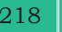
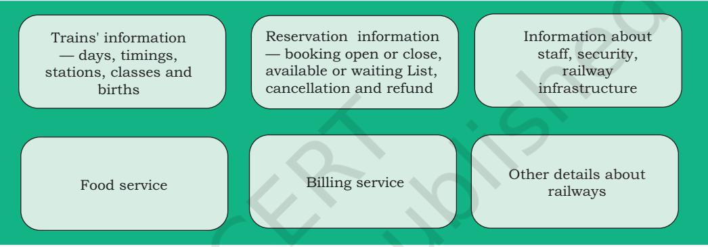

# **Chapter 10**

# **Tuples and Dictionaries**


# **10.1 Introduction to Tuples**

A tuple is an ordered sequence of elements of different data types, such as integer, float, string, list or even a tuple. Elements of a tuple are enclosed in parenthesis (round brackets) and are separated by commas. Like list and string, elements of a tuple can be accessed using index values, starting from 0.

#### *Example 10.1*

```
#tuple1 is the tuple of integers
>>> tuple1 = (1,2,3,4,5)
>>> tuple1
(1, 2, 3, 4, 5)
```

```
#tuple2 is the tuple of mixed data types
>>> tuple2 =('Economics',87,'Accountancy',89.6)
>>> tuple2
('Economics', 87, 'Accountancy', 89.6)
```

```
#tuple3 is the tuple with list as an element
>>> tuple3 = (10,20,30,[40,50])
>>> tuple3
(10, 20, 30, [40, 50])
```

```
#tuple4 is the tuple with tuple as an element
>>> tuple4 = (1,2,3,4,5,(10,20))
>>> tuple4
(1, 2, 3, 4, 5, (10, 20))
```
If there is only a single element in a tuple then the element should be followed by a comma. If we assign the value without comma it is treated as integer. It should be noted that a sequence without parenthesis is treated as tuple by default.

```
#incorrect way of assigning single element to 
#tuple
#tuple5 is assigned a single element
>>> tuple5 = (20)
```
*"Computers are to computing as instruments are to music. Software is the score whose interpretations amplifies our reach and lifts our spirits. Leonardo da Vinci called music the shaping of the invisible, and his phrase is even more apt as a description of software."*

*– A Kay*

#### *In this chapter*

- » *Introduction to Tuples*
- » *Tuple Operations*
- » *Tuple Methods and Built-in Functions*
- » *Tuple Assignment*
- » *Nested Tuples*
- » *Tuple Handling*
- » *Introduction to Dictionaries*
- » *Dictionaries are Mutable*
- » *Dictionary Operations*
- » *Traversing a Dictionary*
- » *Dictionary Methods and Built-in Functions*
- » *Manipulating Dictionaries*

Ch 10.indd 207 08-Apr-19 12:28:09 PM


We generally use list to store elements of the same data types whereas we use tuples to store elements of different data types.

>>> tuple5 20 >>>type(tuple5) #tuple5 is not of type tuple <class 'int'> #it is treated as integer #Correct Way of assigning single element to #tuple #tuple5 is assigned a single element >>> tuple5 = (20,) #element followed by comma >>> tuple5 (20,) >>>type(tuple5) #tuple5 is of type tuple <class 'tuple'> #a sequence without parentheses is treated as #tuple by default >>> seq = 1,2,3 #comma separated elements >>> type(seq) #treated as tuple <class 'tuple'> >>> print(seq) #seq is a tuple (1, 2, 3)

#### **10.1.1 Accessing Elements in a Tuple**

Elements of a tuple can be accessed in the same way as a list or string using indexing and slicing.

```
>>> tuple1 = (2,4,6,8,10,12) 
#initializes a tuple tuple1
#returns the first element of tuple1
>>> tuple1[0] 
2
#returns fourth element of tuple1
>>> tuple1[3] 
8
#returns error as index is out of range
>>> tuple1[15] 
IndexError: tuple index out of range
#an expression resulting in an integer index
>>> tuple1[1+4] 
12
#returns first element from right
>>> tuple1[-1] 
12
```
### **10.1.2 Tuple is Immutable**

Tuple is an immutable data type. It means that the elements of a tuple cannot be changed after it has been created. An attempt to do this would lead to an error.

```
>>> tuple1 = (1,2,3,4,5)
```
Ch 10.indd 208 08-Apr-19 12:28:09 PM

```
>>> tuple1[4] = 10
TypeError: 'tuple' object does not support 
item assignment
```
However an element of a tuple may be of mutable type, e.g., a list.

```
#4th element of the tuple2 is a list
>>> tuple2 = (1,2,3,[8,9]) 
#modify the list element of the tuple tuple2
>>> tuple2[3][1] = 10 
#modification is reflected in tuple2
>>> tuple2 
(1, 2, 3, [8, 10])
```
## **10.2 Tuple Operations**

#### **10.2.1 Concatenation**

Python allows us to join tuples using concatenation operator depicted by symbol +. We can also create a new tuple which contains the result of this concatenation operation.

```
>>> tuple1 = (1,3,5,7,9)
>>> tuple2 = (2,4,6,8,10)
>>> tuple1 + tuple2 
#concatenates two tuples
(1, 3, 5, 7, 9, 2, 4, 6, 8, 10)
>>> tuple3 = ('Red','Green','Blue')
>>> tuple4 = ('Cyan', 'Magenta', 'Yellow' 
,'Black')
#tuple5 stores elements of tuple3 and tuple4
>>> tuple5 = tuple3 + tuple4
>>> tuple5
('Red','Green','Blue','Cyan','Magenta', 
'Yellow','Black')
```
Concatenation operator can also be used for extending an existing tuple. When we extend a tuple using concatenation a new tuple is created.

```
>>> tuple6 = (1,2,3,4,5)
#single element is appended to tuple6
>>> tuple6 = tuple6 + (6,) 
>>> tuple6
(1, 2, 3, 4, 5, 6)
#more than one elements are appended
>>> tuple6 = tuple6 + (7,8,9) 
>>> tuple6
(1, 2, 3, 4, 5, 6, 7, 8, 9)
```
- √ List is mutable but tuple is immutable. So iterating through a tuple is faster as compared to a list.
- √ If we have data that does not change then storing this data in a tuple will make sure that it is not changed accidentally.

Ch 10.indd 209 08-Apr-19 12:28:09 PM

#### **10.2.2 Repetition**

Repetition operation is depicted by the symbol *. It is used to repeat elements of a tuple. We can repeat the tuple elements. The repetition operator requires the first operand to be a tuple and the second operand to be an integer only.

```
>>> tuple1 = ('Hello','World')
>>> tuple1 * 3
('Hello', 'World', 'Hello', 'World', 'Hello', 
'World')
#tuple with single element
>>> tuple2 = ("Hello",) 
>>> tuple2 * 4
('Hello', 'Hello', 'Hello', 'Hello')
```
#### **10.2.3 Membership**

The in operator checks if the element is present in the tuple and returns True, else it returns False.

```
>>> tuple1 = ('Red','Green','Blue')
>>> 'Green' in tuple1
True
```
The not in operator returns True if the element is not present in the tuple, else it returns False.

```
>>> tuple1 = ('Red','Green','Blue')
>>> 'Green' not in tuple1
False
```
#### **10.2.4 Slicing**

Like string and list, slicing can be applied to tuples also.

```
#tuple1 is a tuple
>>> tuple1 = (10,20,30,40,50,60,70,80)
```
#elements from index 2 to index 6 >>> tuple1[2:7] (30, 40, 50, 60, 70)

#all elements of tuple are printed >>> tuple1[0:len(tuple1)] (10, 20, 30, 40, 50, 60, 70, 80)

#slice starts from zero index >>> tuple1[:5] (10, 20, 30, 40, 50)

#slice is till end of the tuple >>> tuple1[2:] (30, 40, 50, 60, 70, 80)

Ch 10.indd 210 08-Apr-19 12:28:09 PM

```
#step size 2
>>> tuple1[0:len(tuple1):2] 
(10, 30, 50, 70)
#negative indexing
>>> tuple1[-6:-4] 
(30, 40)
#tuple is traversed in reverse order
>>> tuple1[::-1] 
(80, 70, 60, 50, 40, 30, 20, 10)
```
# **10.3 Tuple Methods and Built-in Functions**

Python provides many functions to work on tuples. Table 10.1 list some of the commonly used tuple methods and built-in functions.

| Method | Description | Example |
| --- | --- | --- |
| len() | Returns the length or the number of | >>> tuple1 = (10,20,30,40,50) |
|  | elements of the tuple passed as the | >>> len(tuple1) |
|  | argument | 5 |
| tuple() | Creates an empty tuple if no argument | >>> tuple1 = tuple() |
|  | is passed | >>> tuple1 |
|  |  | ( ) |
|  | Creates a tuple if a sequence is | >>> tuple1 = tuple('aeiou')#string |
|  | passed as argument | >>> tuple1 |
|  |  | ('a', 'e', 'i', 'o', 'u') |
|  |  | >>> tuple2 = tuple([1,2,3]) #list |
|  |  | >>> tuple2 |
|  |  | (1, 2, 3) |
|  |  | >>> tuple3 = tuple(range(5)) |
|  |  | >>> tuple3 |
|  |  | (0, 1, 2, 3, 4) |
| count() | Returns the number of times the | >>> tuple1 = (10,20,30,10,40,10,50) |
|  | given element appears in the tuple | >>> tuple1.count(10) |
|  |  | 3 |
|  |  | >>> tuple1.count(90) |
|  |  | 0 |
| index() | Returns the index of the first | >>> tuple1 = (10,20,30,40,50) |
|  | occurrence of the element in the | >>> tuple1.index(30) |
|  | given tuple | 2 |
|  |  | >>> tuple1.index(90) |
|  |  | ValueError: tuple.index(x): x not |
|  |  | in tuple |

**Table 10.1 Built-in functions and methods for tuples**

Ch 10.indd 211 08-Apr-19 12:28:09 PM

| sorted() | Takes elements in the tuple and | >>> tuple1 = ("Rama","Heena","Raj", |
| --- | --- | --- |
|  | returns a new sorted list. It should | "Mohsin","Aditya") |
|  | be noted that, sorted() does not make | >>> sorted(tuple1) |
|  | any change to the original tuple | ['Aditya', 'Heena', 'Mohsin', 'Raj', |
|  |  | 'Rama'] |
| min() | Returns minimum or smallest | >>> tuple1 = (19,12,56,18,9,87,34) |
|  | element of the tuple | >>> min(tuple1) |
|  |  | 9 |
| max() | Returns maximum or largest element | >>> max(tuple1) |
|  | of the tuple | 87 |
| sum() | Returns sum of the elements of the | >>> sum(tuple1) |
|  | tuple | 235 |

# **10.4 Tuple Assignment**

Assignment of tuple is a useful feature in Python. It allows a tuple of variables on the left side of the assignment operator to be assigned respective values from a tuple on the right side. The number of variables on the left should be same as the number of elements in the tuple.

#### *Example 10.2*

```
#The first element 10 is assigned to num1 and
#the second element 20 is assigned to num2.
>>> (num1,num2) = (10,20) 
>>> print(num1)
10
>>> print(num2)
20
>>> record = ( "Pooja",40,"CS")
>>> (name,rollNo,subject) = record
>>> name
'Pooja'
>>> rollNo
40 
>>> subject
'CS'
>>> (a,b,c,d) = (5,6,8)
ValueError: not enough values to unpack 
(expected 4, got 3)
```
If there is an expression on the right side then first that expression is evaluated and finally the result is assigned to the tuple.

Ch 10.indd 212 08-Apr-19 12:28:09 PM

#### *Example 10.3*

```
#15 is assigned to num3 and 
#25 is assigned to num4
>>> (num3,num4) = (10+5,20+5)
>>> print(num3)
15
>>> print(num4)
25
```
#### **10.5 Nested Tuples**

A tuple inside another tuple is called a nested tuple. In the program 10-1, roll number, name and marks (in percentage) of students are saved in a tuple. To store details of many such students we can create a nested tuple.

Program 10-1 This is a program to create a nested tuple to store roll number, name and marks of students

```
\t is an escape 
 character used for 
  adding horizontal 
 tab space. Another 
   commonly used 
 escape character is 
\n, used for inserting 
     a new line.
```

```
#Program 10-1
#To store records of students in tuple and print them
```

```
st=((101,"Aman",98),(102,"Geet",95),(103,"Sahil",87),(104,"Pawan",79))
```
print("S_No"," Roll_No"," Name"," Marks")

for i in range(0,len(st)):

```
print((i+1),'\t',st[i][0],'\t',st[i][1],'\t',st[i][2])
```
#### Output:

| S_No | Roll_No | Name | Marks |
| --- | --- | --- | --- |
| 1 | 101 | Aman | 98 |
| 2 | 102 | Geet | 95 |
| 3 | 103 | Sahil | 87 |
| 4 | 104 | Pawan | 79 |

#### **10.6 Tuple Handling**

Program 10-2 Write a program to swap two numbers without using a temporary variable.

```
#Program 10-2
#Program to swap two numbers 
num1 = int(input('Enter the first number: '))
num2 = int(input('Enter the second number: '))
print("\nNumbers before swapping:")
print("First Number:",num1)
print("Second Number:",num2)
(num1,num2) = (num2,num1)
print("\nNumbers after swapping:")
```
Ch 10.indd 213 08-Apr-19 12:28:09 PM

```
214 Computer Science – Class xi
   print("First Number:",num1)
   print("Second Number:",num2)
 Output:
   Enter the first number: 5
   Enter the second number: 10
   Numbers before swapping:
   First Number: 5
   Second Number: 10
   Numbers after swapping:
   First Number: 10
   Second Number: 5
Program 10-3 Write a program to compute the area 
             and circumference of a circle using a 
             function. 
   #Program 10-3
   #Function to compute area and circumference of the circle.
   def circle(r):
    area = 3.14*r*r
    circumference = 2*3.14*r
      #returns a tuple having two elements area and circumference
    return (area,circumference) 
   #end of function
   radius = int(input('Enter radius of circle: '))
   area,circumference = circle(radius)
   print('Area of circle is:',area)
   print('Circumference of circle is:',circumference)
 Output:
   Enter radius of circle: 5
   Area of circle is: 78.5
   Circumference of circle is: 31.400000000000002
Program 10-4 Write a program to input n numbers 
             from the user. Store these numbers in a 
             tuple. Print the maximum and minimum 
             number from this tuple. 
   #Program 10-4
   #Program to input n numbers from the user. Store these numbers 
   #in a tuple. Print the maximum and minimum number from this tuple.
   numbers = tuple() #create an empty tuple 'numbers'
   n = int(input("How many numbers you want to enter?: "))
   for i in range(0,n): 
    num = int(input())
    #it will assign numbers entered by user to tuple 'numbers'
```
Ch 10.indd 214 08-Apr-19 12:28:09 PM

```
numbers = numbers +(num,) 
print('\nThe numbers in the tuple are:')
print(numbers)
print("\nThe maximum number is:")
print(max(numbers))
print("The minimum number is:")
print(min(numbers))
```
#### Output:

How many numbers do you want to enter?: 5 9 8 10 12 15 The numbers in the tuple are: (9, 8, 10, 12, 15) The maximum number is: 15 The minimum number is: 8

# **10.7 Introduction to Dictionaries**

The data type *dictionary* fall under mapping. It is a mapping between a *set of keys* and a *set of values*. The key-value pair is called an *item*. A key is separated from its value by a colon(:) and consecutive items are separated by commas. Items in dictionaries are unordered, so we may not get back the data in the same order in which we had entered the data initially in the dictionary.

#### **10.7.1 Creating a Dictionary**

To create a dictionary, the items entered are separated by commas and enclosed in curly braces. Each item is a key value pair, separated through colon (:). The keys in the dictionary must be unique and should be of any immutable data type, i.e., number, string or tuple. The values can be repeated and can be of any data type.

#### *Example 10.4*

```
#dict1 is an empty Dictionary created
#curly braces are used for dictionary
>>> dict1 = {} 
>>> dict1
{}
#dict2 is an empty dictionary created using 
#built-in function
```
Ch 10.indd 215 08-Apr-19 12:28:09 PM

**Notes**

```
>>> dict2 = dict()
>>> dict2
{}
#dict3 is the dictionary that maps names 
#of the students to respective marks in 
#percentage
>>> dict3 = {'Mohan':95,'Ram':89,'Suhel':92, 
'Sangeeta':85}
>>> dict3
{'Mohan': 95, 'Ram': 89, 'Suhel': 92, 
'Sangeeta': 85}
```
#### **10.7.2 Accessing Items in a Dictionary**

We have already seen that the items of a sequence (string, list and tuple) are accessed using a technique called indexing. The items of a dictionary are accessed via the keys rather than via their relative positions or indices. Each key serves as the index and maps to a value.

The following example shows how a dictionary returns the value corresponding to the given key:

```
>>> dict3 = {'Mohan':95,'Ram':89,'Suhel':92, 
'Sangeeta':85}
>>> dict3['Ram'] 
89
>>> dict3['Sangeeta']
85
#the key does not exist
>>> dict3['Shyam'] 
KeyError: 'Shyam'
```
In the above examples the key 'Ram' always maps to the value 89 and key 'Sangeeta' always maps to the value 85. So the order of items does not matter. If the key is not present in the dictionary we get KeyError.

# **10.8 Dictionaries are Mutable**

Dictionaries are mutable which implies that the contents of the dictionary can be changed after it has been created.

#### **10.8.1 Adding a new item**

We can add a new item to the dictionary as shown in the following example:

```
>>> dict1 = {'Mohan':95,'Ram':89,'Suhel':92, 
'Sangeeta':85}
```
Ch 10.indd 216 08-Apr-19 12:28:10 PM

```
>>> dict1['Meena'] = 78
>>> dict1
{'Mohan': 95, 'Ram': 89, 'Suhel': 92, 
'Sangeeta': 85, 'Meena': 78}
```
### **10.8.2 Modifying an Existing Item**

The existing dictionary can be modified by just overwriting the key-value pair. Example to modify a given item in the dictionary:

```
>>> dict1 = {'Mohan':95,'Ram':89,'Suhel':92, 
'Sangeeta':85}
#Marks of Suhel changed to 93.5
>>> dict1['Suhel'] = 93.5 
>>> dict1
{'Mohan': 95, 'Ram': 89, 'Suhel': 93.5, 
'Sangeeta': 85}
```
# **10.9 Dictionary Operations**

### **10.9.1 Membership**

True

The membership operator in checks if the key is present in the dictionary and returns True, else it returns False.

```
>>> dict1 = {'Mohan':95,'Ram':89,'Suhel':92, 
'Sangeeta':85}
>>> 'Suhel' in dict1
```
The not in operator returns True if the key is not present in the dictionary, else it returns False.

```
>>> dict1 = {'Mohan':95,'Ram':89,'Suhel':92, 
'Sangeeta':85}
>>> 'Suhel' not in dict1
False
```
# **10.10 Traversing a Dictionary**

We can access each item of the dictionary or traverse a dictionary using for loop.

```
>>> dict1 ={'Mohan':95,'Ram':89,'Suhel':92, 
'Sangeeta':85}
```
#### **Method 1**

```
>>> for key in dict1:
 print(key,':',dict1[key])
Mohan: 95
Ram: 89
Suhel: 92
Sangeeta: 85
```
Ch 10.indd 217 08-Apr-19 12:28:10 PM

**Notes**



#### **Method 2**

```
>>> for key,value in dict1.items():
 print(key,':',value)
Mohan: 95
Ram: 89
Suhel: 92
Sangeeta: 85
```
# **10.11 Dictionary methods and Built-in functions**

Python provides many functions to work on dictionaries. Table 10.2 lists some of the commonly used dictionary methods.

| Method | Description | Example |
| --- | --- | --- |
| len() | Returns the length or number of | >>> dict1 = {'Mohan':95,'Ram':89, |
|  | key: value pairs of the dictionary | 'Suhel':92, 'Sangeeta':85} |
|  | passed as the argument | >>> len(dict1) |
|  |  | 4 |
| dict() | Creates a dictionary from a | pair1 = [('Mohan',95),('Ram',89), |
|  | sequence of key-value pairs | ('Suhel',92),('Sangeeta',85)] |
|  |  | >>> pair1 |
|  |  | [('Mohan', 95), ('Ram', 89), ('Suhel', |
|  |  | 92), ('Sangeeta', 85)] |
|  |  | >>> dict1 = dict(pair1) |
|  |  | >>> dict1 |
|  |  | {'Mohan': 95, 'Ram': 89, 'Suhel': 92, |
|  |  | 'Sangeeta': 85} |
| keys() | Returns a list of keys in | >>> dict1 = {'Mohan':95, 'Ram':89, |
|  | the dictionary | 'Suhel':92, 'Sangeeta':85} |
|  |  | >>> dict1.keys() |
|  |  | dict_keys(['Mohan', 'Ram', 'Suhel', |
|  |  | 'Sangeeta']) |
| values() | Returns a list of values in | >>> dict1 = {'Mohan':95, 'Ram':89, |
|  | the dictionary | 'Suhel':92, 'Sangeeta':85} |
|  |  | >>> dict1.values() |
|  |  | dict_values([95, 89, 92, 85]) |
| items() | Returns a list of tuples(key – | >>> dict1 = {'Mohan':95, 'Ram':89, |
|  | value) pair | 'Suhel':92, 'Sangeeta':85} |
|  |  | >>> dict1.items() |
|  |  | dict_items([( 'Mohan', 95), ('Ram', |
|  |  | 89), ('Suhel', 92), ('Sangeeta', 85)]) |

**Table 10.2 Built-in functions and methods for dictionary**

Ch 10.indd 218 08-Apr-19 12:28:10 PM

| get() | Returns the value corresponding | >>> dict1 = {'Mohan':95, 'Ram':89, |
| --- | --- | --- |
|  | to the key passed as the | 'Suhel':92, 'Sangeeta':85} |
|  | argument | >>> dict1.get('Sangeeta') |
|  |  | 85 |
|  | If the key is not present in the | >>> dict1.get('Sohan') |
|  | dictionary it will return None | >>> |
| update() | appends the key-value pair of | >>> dict1 = {'Mohan':95, 'Ram':89, |
|  | the dictionary passed as the | 'Suhel':92, 'Sangeeta':85} |
|  | argument to the key-value pair | >>> dict2 = {'Sohan':79,'Geeta':89} |
|  | of the given dictionary | >>> dict1.update(dict2) |
|  |  | >>> dict1 |
|  |  | {'Mohan': 95, 'Ram': 89, 'Suhel': 92, |
|  |  | 'Sangeeta': 85, 'Sohan': 79, 'Geeta': |
|  |  | 89} |
|  |  | >>> dict2 |
|  |  | {'Sohan': 79, 'Geeta': 89} |
| del() | Deletes the item with the given | >>> dict1 = {'Mohan':95,'Ram':89, |
|  | key | 'Suhel':92, 'Sangeeta':85} |
|  | To delete the dictionary from the | >>> del dict1['Ram'] |
|  | memory we write: | >>> dict1 |
|  | del Dict_name | {'Mohan':95,'Suhel':92, 'Sangeeta': 85} |
|  |  | >>> del dict1 ['Mohan'] |
|  |  | >>> dict1 |
|  |  | {'Suhel': 92, 'Sangeeta': 85} |
|  |  | >>> del dict1 |
|  |  | >>> dict1 |
|  |  | NameError: name 'dict1' is not defined |
| clear() | Deletes or clear all the items of | >>> dict1 = {'Mohan':95,'Ram':89, |
|  | the dictionary | 'Suhel':92, 'Sangeeta':85} |
|  |  | >>> dict1.clear() |
|  |  | >>> dict1 |
|  |  | { } |

# **10.12 Manipulating Dictionaries**

In this chapter, we have learnt how to create a dictionary and apply various methods to manipulate it. The following programs show the application of those manipulation methods on dictionaries.

Ch 10.indd 219 21-May-19 12:35:47 PM

```
Program 10-5 Create a dictionary 'ODD' of odd numbers between 1 and 
              10, where the key is the decimal number and the value is the 
              corresponding number in words. Perform the following operations 
              on this dictionary:
```
- (a) Display the keys
- (b) Display the values
- (c) Display the items
- (d) Find the length of the dictionary
- (e) Check if 7 is present or not
- (f) Check if 2 is present or not
- (g) Retrieve the value corresponding to the key 9
- (h) Delete the item from the dictionary corresponding to the key 9

```
>>> ODD = {1:'One',3:'Three',5:'Five',7:'Seven',9:'Nine'}
```

```
>>> ODD
```

```
{1: 'One', 3: 'Three', 5: 'Five', 7: 'Seven', 9: 'Nine'}
```
- (a) Display the keys

```
>>> ODD.keys()
dict_keys([1, 3, 5, 7, 9])
```
- (b) Display the values

```
>>> ODD.values()
```

```
dict_values(['One', 'Three', 'Five', 'Seven', 'Nine'])
```
- (c) Display the items

```
>>> ODD.items()
```

```
dict_items([(1, 'One'), (3, 'Three'), (5, 'Five'), (7, 'Seven'), 
(9, 'Nine')])
```
- (d) Find the length of the dictionary

```
>>> len(ODD)
5
```
- (e) Check if 7 is present or not

```
>>> 7 in ODD
True
```
- (f) Check if 2 is present or not

```
>>> 2 in ODD
```
False

- (g) Retrieve the value corresponding to the key 9

```
>>> ODD.get(9)
'Nine'
```
Ch 10.indd 220 08-Apr-19 12:28:10 PM

```
(h) Delete the item from the dictionary corresponding to the key 9
     >>> del ODD[9]
     >>> ODD
     {1: 'One', 3: 'Three', 5: 'Five', 7: 'Seven'}
Program 10-6 Write a program to enter names of 
             employees and their salaries as input 
             and store them in a dictionary.
   #Program 10-6
   #Program to create a dictionary which stores names of the employee
   #and their salary
   num = int(input("Enter the number of employees whose data to be 
   stored: "))
   count = 1
   employee = dict() #create an empty dictionary
   while count <= num:
    name = input("Enter the name of the Employee: ")
    salary = int(input("Enter the salary: "))
    employee[name] = salary
    count += 1
   print("\n\nEMPLOYEE_NAME\tSALARY")
   for k in employee:
    print(k,'\t\t',employee[k])
 Output:
   Enter the number of employees to be stored: 5
   Enter the name of the Employee: 'Tarun'
   Enter the salary: 12000
   Enter the name of the Employee: 'Amina'
   Enter the salary: 34000
   Enter the name of the Employee: 'Joseph'
   Enter the salary: 24000
   Enter the name of the Employee: 'Rahul'
   Enter the salary: 30000
   Enter the name of the Employee: 'Zoya'
   Enter the salary: 25000
   EMPLOYEE_NAME SALARY
   'Tarun' 12000
```
'Amina' 34000 'Joseph' 24000 'Rahul' 30000 'Zoya' 25000

Program 10-7 Write a program to count the number of times a character appears in a given string.

> #Program 10-7 #Count the number of times a character appears in a given string

Ch 10.indd 221 08-Apr-19 12:28:10 PM

```
222 Computer Science – Class xi
   st = input("Enter a string: ")
   dic = {} #creates an empty dictionary
   for ch in st:
    if ch in dic: #if next character is already in the dictionary 
    dic[ch] += 1
    else:
    dic[ch] = 1 #if ch appears for the first time
   for key in dic:
    print(key,':',dic[key]) 
 Output:
   Enter a string: HelloWorld
   H : 1
   e : 1
   l : 3
   o : 2
   W : 1
   r : 1
   d : 1
Program 10-8 Write a function to convert a number 
            entered by the user into its corresponding 
            number in words. For example, if the 
            input is 876 then the output should be 
            'Eight Seven Six'.
   # Program 10-8
   # Write a function to convert number into corresponding number in 
   # words
   def convert(num):
    #numberNames is a dictionary of digits and corresponding number 
      #names
    numberNames = {0:'Zero',1:'One',2:'Two',3:'Three',4:'Four',\
    5:'Five',6:'Six',7:'Seven',8:'Eight',9:'Nine'}
    
    result = ''
    for ch in num:
    key = int(ch) #converts character to integer
    value = numberNames[key]
    result = result + ' ' + value
    return result
   num = input("Enter any number: ") #number is stored as string
   result = convert(num) 
   print("The number is:",num)
   print("The numberName is:",result)
 Output:
     Enter any number: 6512
     The number is: 6512
     The numberName is: Six Five One Two
```
Ch 10.indd 222 08-Apr-19 12:28:10 PM

**Notes**

#### **Summary**

- Tuples are immutable sequences, i.e., we cannot change the elements of a tuple once it is created.
- Elements of a tuple are put in round brackets separated by commas.
- If a sequence has comma separated elements without parentheses, it is also treated as a tuple.
- Tuples are ordered sequences as each element has a fixed position.
- Indexing is used to access the elements of the tuple; two way indexing holds in dictionaries as in strings and lists.
- Operator '+' adds one sequence (string, list, tuple) to the end of other.
- Operator '*' repeats a sequence (string, list, tuple) by specified number of times
- Membership operator 'in' tells if an element is present in the sequence or not and 'not in' does the opposite.
- Tuple manipulation functions are: len(), tuple(), count(), index(), sorted(), min(), max(),sum().
- Dictionary is a mapping (non-scalar) data type. It is an unordered collection of key-value pair; keyvalue pair are put inside curly braces.
- Each key is separated from its value by a colon.
- Keys are unique and act as the index.
- Keys are of immutable type but values can be mutable.

#### **Exercise**

- 1. Consider the following tuples, tuple1 and tuple2: tuple1 = (23,1,45,67,45,9,55,45) tuple2 = (100,200)
Find the output of the following statements:

- i. print(tuple1.index(45))
- ii. print(tuple1.count(45))
- iii. print(tuple1 + tuple2)
- iv. print(len(tuple2))
- v. print(max(tuple1))
- vi print(min(tuple1))

Ch 10.indd 223 08-Apr-19 12:28:10 PM

**Notes**

|  | vii. print(sum(tuple2)) |
| --- | --- |
|  | viii. p r i n t ( s o r t e d ( t u p l e 1 ) ) |
|  | print(tuple1) |
| 2. | Consider the following dictionary stateCapital: |
|  | stateCapital = {"AndhraPradesh":"Hyderabad", |
|  | "Bihar":"Patna","Maharashtra":"Mumbai", |
|  | "Rajasthan":"Jaipur"} |
|  | Find the output of the following statements: |
|  | i. print(stateCapital.get("Bihar")) |
|  | ii. print(stateCapital.keys()) |
|  | iii. print(stateCapital.values()) |
|  | iv. print(stateCapital.items()) |
|  | v. print(len(stateCapital)) |
|  | vi print("Maharashtra" in stateCapital) |
|  | vii. print(stateCapital.get("Assam")) |
|  | viii. del stateCapital["Rajasthan"] |
|  | print(stateCapital) |
| 3. | "Lists and Tuples are ordered". Explain. |
| 4. | With the help of an example show how can you |
|  | return more than one value from a function. |
| 5. | What advantages do tuples have over lists? |
| 6. | When to use tuple or dictionary in Python. Give some |
|  | examples of programming situations mentioning |
|  | their usefulness. |
| 7. | Prove with the help of an example that the variable |
|  | is rebuilt in case of immutable data types. |
| 8. | TypeError occurs while statement 2 is running. |
|  | Give reason. How can it be corrected? |
|  | >>> tuple1 = (5) #statement 1 |
|  | >>> len(tuple1) #statement 2 |
| Programming Problems |  |

- 1. Write a program to read email IDs of n number of students and store them in a tuple. Create two new tuples, one to store only the usernames from the email IDs and second to store domain names from the email IDs. Print all three tuples at the end of the program. [**Hint:** You may use the function split()]
- 2. Write a program to input names of n students and store them in a tuple. Also, input a name from the user and find if this student is present in the tuple or not.

Ch 10.indd 224 15-Jun-21 11:19:20 AM

**Notes**

We can accomplish these by:

- (a) writing a user defined function
- (b) using the built-in function
- 3. Write a Python program to find the highest 2 values in a dictionary.
- 4. Write a Python program to create a dictionary from a string.

*Note:* Track the count of the letters from the string. Sample string : 'w3resource' Expected output : {'3': 1, 's': 1, 'r': 2, 'u': 1, 'w': 1, 'c': 1, 'e': 2, 'o': 1}

- 5. Write a program to input your friends' names and their Phone Numbers and store them in the dictionary as the key-value pair. Perform the following operations on the dictionary:
	- a) Display the name and phone number of all your friends
	- b) Add a new key-value pair in this dictionary and display the modified dictionary
	- c) Delete a particular friend from the dictionary
	- d) Modify the phone number of an existing friend
	- e) Check if a friend is present in the dictionary or not
	- f) Display the dictionary in sorted order of names

#### **Case Study-based Question**

#### **For the SMIS System given in Chapter 5, let us do the following:**

Write a program to take in the roll number, name and percentage of marks for n students of Class X. Write user defined functions to

- accept details of the n students (n is the number of students)
- search details of a particular student on the basis of roll number and display result
- display the result of all the students
- find the topper amongst them
- find the subject toppers amongst them

(**Hint:** use Dictionary, where the key can be roll number and the value is an immutable data type containing name and percentage)

Ch 10.indd 225 21-May-19 12:39:48 PM

**Notes**

Let's peer review the case studies of others based on the parameters given under "DOCUMENTATION TIPS" at the end of Chapter 5 and provide a feedback to them.

# **Case Study-based Questions**

- 1. A bank is a financial institution which is involved in borrowing and lending of money. With advancement in technology, online banking, also known as internet banking allows customers of a bank to conduct a range of financial transactions through the bank's website anytime, anywhere. As part of initial investigation you are suggested to
	- collect a bank's application form. After careful analysis of the form, identify the information required for opening a savings account. Also enquire about the rate of interest offered for a saving account.
	- The basic two operations performed on an account are Deposit and Withdrawal. Write a menu driven program that accepts either of the two choices of Deposit and Withdrawal, then accepts an amount, performs the transaction and accordingly displays the balance. Remember, every bank has a requirement of minimum balance which needs to be taken care of during withdrawal operations. Enquire about the minimum balance required in your bank.
	- Collect the interest rates for opening a fixed deposit in various slabs in a savings bank account. Remember, rates may be different for senior citizens.

Finally, write a menu driven program having the following options (use functions and appropriate data types):

- Open a savings bank account
- Deposit money
- Withdraw money
- Take details, such as amount and period for a Fixed Deposit and display its maturity amount for a particular customer.
- 2. Participating in a quiz can be fun as it provides a competitive element. Some educational institutes use it as a tool to measure knowledge level, abilities

Ch 10.indd 226 08-Apr-19 12:28:10 PM

Ch 10.indd 227 08-Apr-19 12:28:10 PM

2024-25

and/or skills of their pupils either on a general level or in a specific field of study. Identify and analyse popular quiz shows and write a Python program to create a quiz that should also contain the following functionalities besides the one identified by you as a result of your analysis.

- Create an administrative user ID and password to categorically add, modify, delete a question
- Register the student before allowing her or him to play a quiz
- Allow selection of category based on subject area
- Display questions as per the chosen category
- Keep the score as the participant plays
- Display the final score
- 3. Our heritage monuments are our assets. They are a reflection of our rich and glorious past and an inspiration for our future. UNESCO has identified some of Indian heritage sites as World heritage sites. Collect the following information about these sites:
	- What is the name of the site?
	- Where is it located?
		- District
		- State
	- When was it built?
	- Who built it?
	- Why was it built?
	- Website link (if any).

Write a Python program to

- create an administrative user ID and password to add, modify or delete an entered heritage site in the list of sites
- display the list of world heritage sites in India
- search and display information of a world heritage site entered by the user
- display the name(s) of world heritage site(s) on the basis of the state input by the user.
- 4. Every mode of transport utilises a reservation system to ensure its smooth and efficient functioning. If you analyse you would find many things in common. You are required to identify

**Notes**

any one mode of transportation and prepare a reservation system for it. For example, let us look at the Railway reservation system we talked about earlier. The complex task of designing a good railway reservation system is seen as designing the different components of the system and then making them work with each other efficiently. Possible subsystems are shown in Figure 1. Each of them may be modelled using functions.

Write a python code to automate the reservation needs of the identified mode of transport.



*Figure 1: Railway reservation system*

Ch 10.indd 228 08-Apr-19 12:28:10 PM

