# **Chapter 2**

# **Encoding Schemes and Number System**

# **2.1 Introduction**

Have you ever thought how the keys on the computer keyboard that are in human recognisable form are interpreted by the computer system? This section briefly discusses text interpretation by the computer.

We have learnt in the previous chapter that computer understands only binary language of 0s and 1s. Therefore, when a key on the keyboard is pressed, it is internally mapped to a unique code, which is further converted to binary.

*Example 2.1* When the key 'A' is pressed (Figure 2.1), it is internally mapped to a decimal value 65 (code value), which is then converted to its equivalent binary value for the computer to understand.

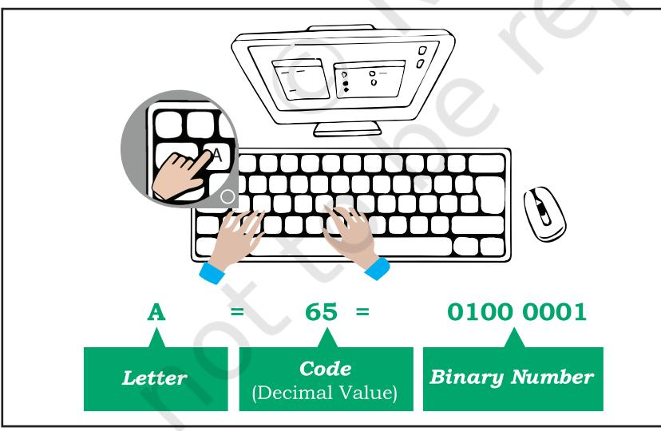

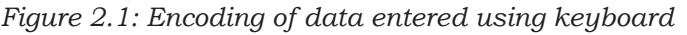

Similarly, when we press alphabet 'अ' on hindi keyboard, internally it is mapped to a hexadecimal value 0905, whose binary equivalent is 0000100100000101.

So what is encoding? The mechanism of converting data into an equivalent cipher using specific code is

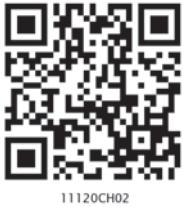

*"We owe a lot to the Indians, who taught us how to count, without which no worthwhile scientific discovery could have been made."*

*–Albert Einstein*

# *In this chapter*

- » *Introduction to Encoding*
- » *UNICODE*
- » *Number System*
- » *Conversion Between Number Systems*

Ch 2.indd 27 08-Apr-19 11:38:00 AM

Cipher means something converted to a coded form to hide/conceal it from others. It is also called encryption (converted to cipher) and sent to the receiver who in turn can decrypt it to get back the actual content.

called encoding. It is important to understand why code value 65 is used for the key "A" and not any other value? Is it same for all the keyboards irrespective of their make?

Yes, it is same for all the keyboards. This has been possible because of standard encoding schemes where each letter, numeral and symbol is encoded or assigned a unique code. Some of the well-known encoding schemes are described in the following sections.

#### **2.1.1 American Standard Code for Information Interchange (ASCII)**

In the early 1960s, computers had no way of communicating with each other due to different ways of representing keys of the keyboard. Hence, the need for a common standard was realised to overcome this shortcoming. Thus, encoding scheme ASCII was developed for standardising the character representation. ASCII is still the most commonly used coding scheme.

Initially ASCII used 7 bits to represent characters. Recall that there are only 2 binary digits (0 or 1). Therefore, total number of different characters on the English keyboard that can be encoded by 7-bit ASCII code is 27 = 128. Table 2.1 shows some printable characters for ASCII code. But ASCII is able to encode character set of English language only.

| Character | Decimal Value | Character | Decimal Value | Character | Decimal Value |
| --- | --- | --- | --- | --- | --- |
| Space | 32 | @ | 64 | ` | 96 |
| ! | 33 | A | 65 | a | 97 |
| " | 34 | B | 66 | b | 98 |
| # | 35 | C | 67 | c | 99 |
| $ | 36 | D | 68 | d | 100 |
| % | 37 | E | 69 | e | 101 |
| & | 38 | F | 70 | f | 102 |
| ' | 39 | G | 71 | g | 103 |
| ( | 40 | H | 72 | h | 104 |
| ) | 41 | I | 73 | i | 105 |

**Table 2.1 ASCII code for some printable characters** 

*Example 2.2* Encode the word DATA and convert the encoded value into binary values which can be understood by a computer.

Ch 2.indd 28 08-Apr-19 11:38:00 AM

- ASCII value of D is 68 and its equivalent 7-bit binary code = 1000100
- ASCII value of A is 65 and its equivalent 7-bit binary code = 1000001
- ASCII value of T is 84 and its equivalent 7-bit binary code = 1010100
- ASCII value of A is 65 and its equivalent 7-bit binary code = 1000001

Replace each alphabet in DATA with its ASCII code value to get its equivalent ASCII code and with 7-bit binary code to get its equivalent binary number as shown in Table 2.2.

#### **Table 2.2 ASCII and Binary values for word DATA**

|  | D | A | T | A |
| --- | --- | --- | --- | --- |
| ASCII Code | 68 | 65 | 84 | 65 |
| Binary Code | 1000100 | 1000001 | 1010100 | 1000001 |

# **2.1.2 Indian Script Code for Information Interchange (ISCII)**

In order to facilitate the use of Indian languages on computers, a common standard for coding Indian scripts called ISCII was developed in India during mid 1980s. It is an 8-bit code representation for Indian languages which means it can represent 28=256 characters. It retains all 128 ASCII codes and uses rest of the codes (128) for additional Indian language character set. Additional codes have been assigned in the upper region (160–255) for the '*aksharas*' of the language.

#### **2.1.3 UNICODE**

There were many encoding schemes, for character sets of different languages. But they were not able to communicate with each other, as each of them represented characters in their own ways. Hence, text created using one encoding scheme was not recognised by another machine using different encoding scheme.

Therefore, a standard called UNICODE has been developed to incorporate all the characters of every written language of the world. UNICODE provides a unique number for every character, irrespective of device (server, desktop, mobile), operating system (Linux, Windows, iOS) or software application (different

#### **Think and Reflect**

Do we need to install some additional tool or font to type in an Indian language using UNICODE?

#### **Activity 2.1**

Explore and list down two font names for typing in any three Indian languages in UNICODE.

#### **Think and Reflect**

Why a character in UTF 32 takes more space than in UTF 16 or UTF 8?

Ch 2.indd 29 08-Apr-19 11:38:00 AM

browsers, text editors, etc.). Commonly used UNICODE encodings are UTF-8, UTF-16 and UTF-32. It is a superset of ASCII, and the values 0–128 have the same character as in ASCII. Unicode characters for Devanagari script is shown in Table 2.3. Each cell of the table contains a character along with its equivalent hexadecimal value.

| ऀ | ँ | ं | ः | ऄ | अ | आ | इ | ई | उ | ऊ | ऋ | ऌ | ऍ | ऎ | ए |
| --- | --- | --- | --- | --- | --- | --- | --- | --- | --- | --- | --- | --- | --- | --- | --- |
| 0900 | 0901 | 0902 | 0903 | 0904 | 0905 | 0906 | 0907 | 0908 | 0909 | 090A | 090B | 090C | 090D | 090E | 090F |
| ऐ | ऑ | ऒ | ओ | औ | क | ख | ग | घ | ङ | च | छ | ज | झ | ञ | ट |
| 0910 | 0911 | 0912 | 0913 | 0914 | 0915 | 0916 | 0917 | 0918 | 0919 | 091A | 091B | 091C | 091D | 091E | 091F |
| ठ | ड | ढ | ण | त | थ | द | ध | न | ऩ | प | फ | ब | भ | म | य |
| 0920 | 0921 | 0922 | 0923 | 0924 | 0925 | 0926 | 0927 | 0928 | 0929 | 092A | 092B | 092C | 092D | 092E | 092F |
| र | ऱ | ल | ळ | ऴ | व | श | ष | स | ह | ऺ | ऻ | ़ | ऽ | ा | ि |
| 0930 | 0931 | 0932 | 0933 | 0934 | 0935 | 0936 | 0937 | 0938 | 0939 | 093A | 093B | 093C | 093D | 093E | 093F |
| ी | ु | ू | ृ | ॄ | ॅ | ॆ | े | ै | ॉ | ॊ | ो | ौ | ् | ॎ | ॏ |
| 0940 | 0941 | 0942 | 0943 | 0944 | 0945 | 0946 | 0947 | 0948 | 0949 | 094A | 094B | 094C | 094D | 094E | 094F |
| ॐ | ॑ | ॒ | ॓ | ॔ | ॕ | ॖ | ॗ | क़ | ख़ | ग़ | ज़ | ड़ | ढ़ | फ़ | य़ |
| 0950 | 0951 | 0952 | 0953 | 0954 | 0955 | 0956 | 0957 | 0958 | 0959 | 095A | 095B | 095C | 095D | 095E | 095F |
| ॠ | ॡ | ॢ | ॣ | । | ॥ | ० | १ | २ | ३ | ४ | ५ | ६ | ७ | ८ | ९ |
| 0960 | 0961 | 0962 | 0963 | 0964 | 0965 | 0966 | 0967 | 0968 | 0969 | 096A | 096B | 096C | 096D | 096E | 096F |
| ॰ | ॱ | ॲ | ॳ | ॴ | ॵ | ॶ | ॷ | ॸ | ॹ | ॺ | ॻ | ॼ | ॽ | ॾ | ॿ |
| 0970 | 0971 | 0972 | 0973 | 0974 | 0975 | 0976 | 0977 | 0978 | 0979 | 097A | 097B | 097C | 097D | 097E | 097F |

| Table 2.3 Unicode table for the Devanagari script |
| --- |

# **2.2 Number System**

Till now, we have learnt that each key (representing character, special symbol, function keys, etc.) of the keyboard is internally mapped to an ASCII code following an encoding scheme. This encoded value is further converted to its equivalent binary representation so that the computer can understand it. In Figure 2.1, the code for character "A" belongs to the decimal number system and its equivalent binary value belongs to the binary number system. A number system is a method to represent (write) numbers.

Every number system has a set of unique characters or literals. The count of these literals is called the radix or base of the number system. The four different number systems used in the context of computer are shown in Figure 2.2. These number systems are explained in subsequent sections.

Ch 2.indd 30 08-Apr-19 11:38:00 AM

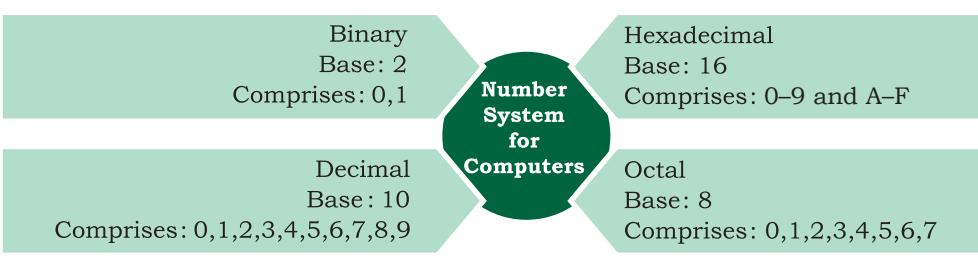

*Figure 2.2: Four different number systems* 

Number systems are also called positional number system because the value of each symbol (i.e., digit and alphabet) in a number depends upon its position within the number. Number may also have a fractional part similar to decimal numbers used by us. The symbol at the right most position in the integer part in a given number has position 0. The value of position (also called position value) in the integer part increases from right to left by 1. On the other hand, the first symbol in the fraction part of the number has position number –1, which decreases by 1 while reading fraction part from left to right. Each symbol in a number has a positional value, which is computed using its position value and the base value of the number system. The symbol at position number 3 in a decimal system with base 10 has positional value 103. Adding the product of positional

value and the symbol value results in the given number. Figure 2.3 shows the computation of decimal number 123.45 using its positional value.

| Digit | 1 | 2 | 3 | . | 4 | 5 |
| --- | --- | --- | --- | --- | --- | --- |
| Position Number | 2 | 1 | 0 |  | –1 | –2 |
| Positional Value | (10)2 | (10)1 | (10)0 |  | (10)-1 | (10)-2 |

Add the product of positional value and corresponding digit to get decimal number.

1 × 102 + 2 × 101 + 3 × 100 + 4 × 10-1 + 5 × 10-2 = (123.45)10

*Figure 2.3: Computation of decimal number using its positional value*

# **2.2.1 Decimal Number System**

The decimal number system is used in our day-to-day life. It is known as base-10 system since 10 digits (0 to 9) are used. A number is presented by its two values — symbol value (any digit from 0 to 9) and positional value (in terms of base value). Figure 2.4 shows the integer and fractional part of decimal number 237.25 alongwith computation of the decimal number using positional values.

Ch 2.indd 31 08-Apr-19 11:38:01 AM

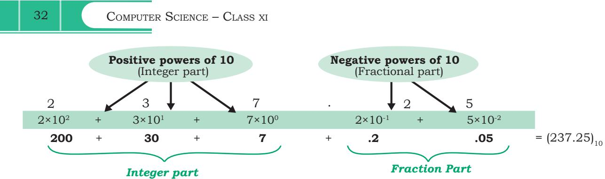

*Figure 2.4: Positional value for digits of decimal number represented as power of base 10* 

# **2.2.2 Binary Number System**

Base value of a number system is used to distinguish a number in one number system from another number system. Base value is written as the subscript of the given number. For example, (70)8 represents 70 as octal number and (70)10 denotes 70 as decimal number.

The ICs (Integrated Circuits) in a computer are made up of a large number of transistors which are activated by the electronic signals (low/high) they receive. The ON/ high and OFF/low state of a transistor is represented using the two digits 1 and 0, respectively. These two digits 1 and 0 form the binary number system. This system is also referred as base-2 system as it has two digits only. Some examples of binary numbers are 1001011, 1011.101, 111111.01. A binary number can be mapped to an equivalent decimal number that can be easily understood by the human.

**Table 2.4 Binary value for (0–9) digits of decimal number system** 

| Decimal | Binary |
| --- | --- |
| 0 | 0 |
| 1 | 1 |
| 2 | 10 |
| 3 | 11 |
| 4 | 100 |
| 5 | 101 |
| 6 | 110 |
| 7 | 111 |
| 8 | 1000 |
| 9 | 1001 |

# **2.2.3 Octal Number System**

With increase in the value of a decimal number, the number of bits (0/1) in its binary representation also increases. Sometimes, a binary number is so large that it becomes difficult to manage. Octal number system was devised for compact representation of the binary numbers. Octal number system is called base-8 system

Ch 2.indd 32 08-Apr-19 11:38:01 AM

as it has total eight digits (0-7), and positional value is expressed in powers of 8. Three binary digits (8=23) are sufficient to represent any octal digit. Table 2.5 shows the decimal and binary equivalent of 8 octal digits. Examples of octal numbers are (237.05)8, (13)8, and (617.24)8.

#### **2.2.4 Hexadecimal Number System**

Hexadecimal numbers are also used for compact representation of binary numbers. It consists of 16 unique symbols (0–9, A–F), and is called base-

16 system. In hexadecimal system, each alphanumeric digit is represented as a group of 4 binary digits because 4 bits (24=16) are sufficient to represent 16 alphanumeric symbols. Note here that the decimal numbers 10 through 15 are represented by the letters A through F. Examples of Hexadecimal numbers are (23A.05)16, (1C3)16, (619B.A)16. Table 2.6 shows decimal and binary equivalent of 16 alphanumeric symbols used in hexadecimal number system.

#### **Table 2.6 Decimal and binary equivalent of hexadecimal numbers 0–9, A–F**

| Hexadecimal Symbol Decimal Value |  | 4-bit Binary Number |
| --- | --- | --- |
| 0 | 0 | 0000 |
| 1 | 1 | 0001 |
| 2 | 2 | 0010 |
| 3 | 3 | 0011 |
| 4 | 4 | 0100 |
| 5 | 5 | 0101 |
| 6 | 6 | 0110 |
| 7 | 7 | 0111 |
| 8 | 8 | 1000 |
| 9 | 9 | 1001 |
| A | 10 | 1010 |
| B | 11 | 1011 |
| C | 12 | 1100 |
| D | 13 | 1101 |
| E | 14 | 1110 |
| F | 15 | 1111 |

| Table 2.5 Decimal and binary |
| --- |
| equivalent of octal numbers 0–7 |

| Octal Digit | Decimal | 3 -bit Binary |
| --- | --- | --- |
|  | Value | Number |
| 0 | 0 | 000 |
| 1 | 1 | 001 |
| 2 | 2 | 010 |
| 3 | 3 | 011 |
| 4 | 4 | 100 |
| 5 | 5 | 101 |
| 6 | 6 | 110 |
| 7 | 7 | 111 |

Ch 2.indd 33 08-Apr-19 11:38:01 AM

#### **2.2.5 Applications of Hexadecimal Number System**

- • Main memory is made up of memory locations where each location has a unique address. Usually, size of a memory address is 16-bit or 32-bit. To access 16-bit memory address, a programmer has to use 16 binary bits, which is difficult to deal with. To simplify the address representation, hexadecimal and octal numbers are used. Let us consider a 16 bit memory address 1100000011110001. Using the hexadecimal notation, this address is mapped to C0F1 which is more easy to remember. The equivalent octal representation for this 16-bit value is 140361.
- • Hexadecimal numbers are also used for describing the colours on the webpage. Each colour is made up of three primary colours red, green and blue, popularly calledRGB(inshort).Inmost colourmaps, each colour is usually chosen from a palette of 16 million colours. Therefore, 24 bits are required for representing each colour having three components (8 bits for Red, 8 bits for Green, 8 bits for Blue component). It is difficult to remember 24-bit binary colour code. Therefore, colour codes are written in hexadecimal form for compact representation. For example, 24-bit code for RED colour is 11111111,00000000,00000000. The equivalent hexadecimal notation is (FF,00,00), which can be easily remembered and used. Table 2.7 shows

#### **Table 2.7 Colour codes in decimal, binary and hexadecimal numbers**

**Colour Name Decimal Binary Hexadecimal** Black (0,0,0) (00000000,00000000,00000000) (00,00,00) White (255,255,255) (11111111,11111111,11111111) (FF,FF,FF)

examples of some colours represented with decimal, binary and hexadecimal numbers.

# Yellow (255,255,0) (11111111,11111111,00000000) (FF,FF,00) Grey (128,128,128) (10000000,10000000,10000000) (80, 80, 80)

# **2.3 Conversion between Number Systems**

In the previous section, we learnt about different number systems used in computers. Now, let us learn how to convert a number from one number system to another number system for better understanding of the number representation in computers. Decimal number

Ch 2.indd 34 21-May-19 11:34:53 AM

system is most commonly used by humans, but digital systems understand binary numbers; whereas Octal and hexadecimal number systems are used to simplify the binary representation for us to understand.

# **2.3.1 Conversion from Decimal to other Number Systems**

To convert a decimal number to any other number system (binary, octal or hexadecimal), use the steps given below.

- Step 1: Divide the given number by the base value (b) of the number system in which it is to be converted
- Step 2: Note the remainder
- Step 3: Keep on dividing the quotient by the base value and note the remainder till the quotient is zero
- Step 4: Write the noted remainders in the reverse order (from bottom to top)

# *(A) Decimal to Binary Conversion*

Since the base value of binary system is 2, the decimal number is repeatedly divided by 2 following the steps given in above till the quotient is 0. Record the remainder after each division and finally write the remainders in reverse order in which they are computed.

In Figure 2.1 you saw that the binary equivalent of 65 is (1000001)2. Let us now convert a decimal value to its binary representation and verify that the binary equivalent of (65)10 is (1000001)2.

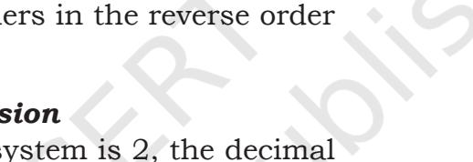

**Activity 2.3**

Express the following decimal numbers into octal numbers.

 (i) (913)10 (ii) (845)10 (iii) (66)10

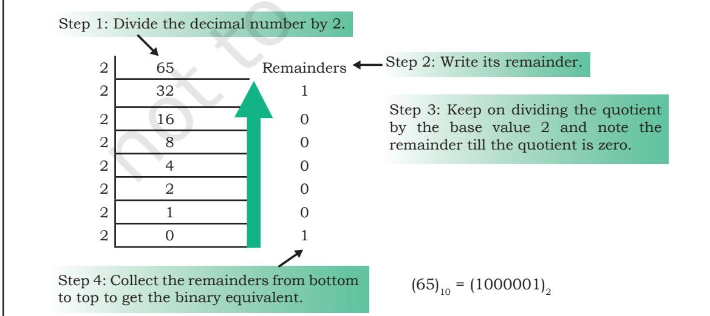

*Figure 2.5: Conversion of a decimal number to its equivalent binary number* 

**Activity 2.2**

Convert the following decimal numbers in the form understood by

(i) (593)10 (ii) (326)10

computer.

(iii) (79)10

Ch 2.indd 35 08-Apr-19 11:38:01 AM

*Example 2.3* Convert (122)10 to binary number.

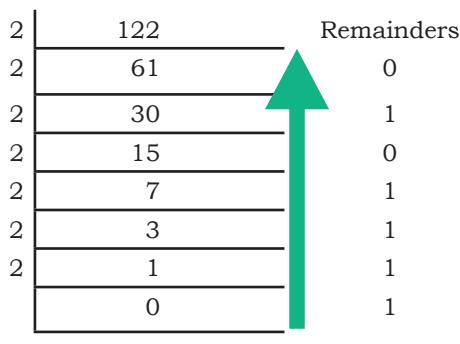

Therefore, (122)10 = (1111010)2

# *(B) Decimal to Octal Conversion*

Since the base value of octal is 8, the decimal number is repeatedly divided by 8 to obtain its equivalent octal number.

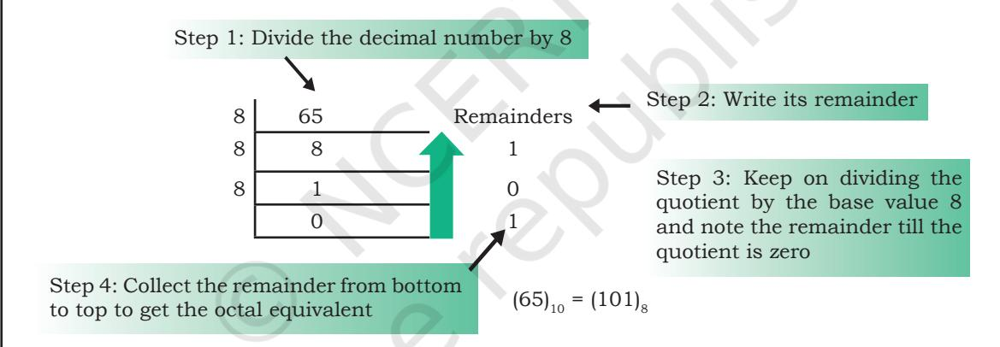

*Figure 2.6: Conversion of a decimal number to its equivalent octal number*

The octal equivalent of letter "A" by using its ASCII code value (65)10 is calculated as shown in Figure 2.6.

*Example 2.4* Convert (122)10 to octal number.

| 8 | 122 | Remainders |
| --- | --- | --- |
| 8 | 15 | 2 |
| 8 | 1 | 7 |
|  | 0 | 1 |

Therefore, (122)10= (172)8

# *(C) Decimal to Hexadecimal Conversion*

Since the base value of hexadecimal is 16, the decimal number is repeatedly divided by 16 to obtain its equivalent hexadecimal number. The hexadecimal

Ch 2.indd 36 08-Apr-19 11:38:01 AM

equivalent of letter 'A' using its ASCII code (65)10 is calculated as shown in Figure 2.7.

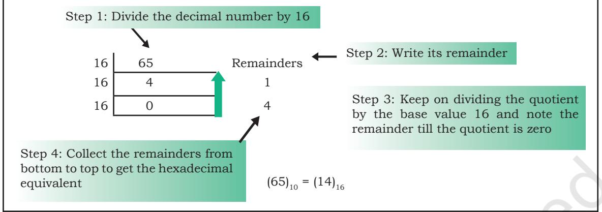

*Figure 2.7: Conversion of a decimal number to its equivalent hexadecimal number*

*Example 2.5* Convert (122)10 to hexadecimal number.

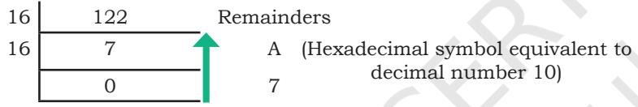

Therefore, (122)10=(7A)16

# **2.3.2 Conversion from other Number Systems to Decimal Number System**

We can use the following steps to convert the given number with base value b to its decimal equivalent, where base value b can be 2, 8 and 16 for binary, octal and hexadecimal number system, respectively.

- Step 1: Write the position number for each alphanumeric symbol in the given number
- Step 2: Get positional value for each symbol by raising its position number to the base value b symbol in the given number
- Step 3: Multiply each digit with the respective positional value to get a decimal value
- Step 4: Add all these decimal values to get the equivalent decimal number

#### *(A) Binary Number to Decimal Number*

Since binary number system has base 2, the positional values are computed in terms of powers of 2. Using the above mentioned steps we can convert **Activity 2.4**

Convert the following numbers into decimal numbers.

 (i) (110101)2 (ii) (1703)8 (iii) (COF5)16

Ch 2.indd 37 08-Apr-19 11:38:01 AM

a binary number to its equivalent decimal value as shown below:

# *Example 2.6* Convert (1101)2 into decimal number.

| Digit | 1 |  | 1 | 0 |  |  |  |
| --- | --- | --- | --- | --- | --- | --- | --- |
| Position Number | 3 |  | 2 | 1 |  |  |  |
| Positional Value | 23 |  | 22 | 21 |  |  |  |
|  |  |  |  | + 0 × 21 |  |  |  |
|  |  |  |  |  | + |  |  |
|  |  |  |  |  |  | 1 0 20 1 × 20 |  |
|  |  |  |  |  |  |  | = 8 + 4 + 0 + 1 = (13)10 |
| Decimal Number | 1 × 23 | + | 1 × 22 |  |  |  |  |

*Note: Add the product of positional value and corresponding digit to get decimal number.*

#### *(B) Octal Number to Decimal Number*

The following example shows how to compute the decimal equivalent of an octal number using base value 8.

*Example 2.7* Convert (257)8 into decimal number.

| Digit | 2 | 5 | 7 |
| --- | --- | --- | --- |
| Position | 2 | 1 | 0 |
| Number |  |  |  |
| Positional | 82 | 81 | 80 |
| Value |  |  |  |
| Decimal | 2 × 82 | 5 × 81 + 7 × 80 | =128 + 40 + 7 = (175)10 |
| Number |  |  |  |

#### *(C) Hexadecimal Number to Decimal Number*

For converting a hexadecimal number into decimal number, use steps given in this section with base value 16 of hexadecimal number system. Use decimal value equivalent to alphabet symbol of hexadecimal number in the calculation, as shown in Table 2.6.

*Example 2.8* Convert (3A5)16 into decimal number.

| Digit |  | 3 |  | A | 5 |
| --- | --- | --- | --- | --- | --- |
| Position |  | 2 |  | 1 | 0 |
| Number |  |  |  |  |  |
| Positional |  | 162 |  | 161 | 160 |
| Value |  |  |  |  |  |
| Decimal | 3 × 162 |  | 10 × 161 |  | + 5 × 160 =768 + 160 + 5 = (933)10 |
| Number |  |  |  |  |  |

*Note: Use Table 2.5 for decimal value of alphabets*

#### **2.3.3 Conversion from Binary Number to Octal/ Hexadecimal Number and Vice-Versa**

A binary number is converted to octal or hexadecimal number by making groups of 3 and 4 bits, respectively, and replacing each group by its equivalent octal/ hexadecimal digit.

*Why 3 bits in a binary number are grouped together to get octal number?* The base value of octal number system is 8. Convert value 8 in terms of exponent of 2, i.e., 8=23. Hence, three binary digits are sufficient to represent all 8 octal digits. Simply stated, count all possible combinations of three binary digits, which are 2x2x2=8. Therefore, 3 bits are sufficient to represent any octal digit. Hence, 3-bit groups in a binary number are formed to get equivalent octal number.

Ch 2.indd 38 21-May-19 11:41:57 AM

# *(A) Binary Number to Octal Number*

Given a binary number, an equivalent octal number represented by 3 bits is computed by grouping 3 bits from right to left and replacing each 3-bit group by the corresponding octal digit. In case number of bits in a binary number is not multiple of 3, then add required number of 0s on most significant position of the binary number.

*Example 2.9* Convert (10101100)2 to octal number.

| Make group of 3-bits of the given |  |  |  |
| --- | --- | --- | --- |
| binary number (right to left) | 010 | 101 | 100 |
| Write octal number for |  |  |  |
| each 3-bit group | 2 | 5 | 4 |

Therefore, (10101100)2 = (254)8

# *(B) Octal Number to Binary Number*

Each octal digit is an encoding for a 3-digit binary number. Octal number is converted to binary by replacing each octal digit by a group of three binary digits.

*Example 2.10* Convert (705)8 to binary number.

Octal digits 7 0 5

Write 3-bits binary value for each digit 111 000 101

Therefore, (705)8 = (111000101)2

# *(C) Binary Number to Hexadecimal Number*

Given a binary number, its equivalent hexadecimal number is computed by making a group of 4 binary digits from right to left and substituting each 4-bit group by its corresponding hexadecimal alphanumeric symbol. If required, add 0 bit on the most significant position of the binary number to have number of bits in a binary number as multiple of 4.

*Example 2.11* Convert (0110101100)2 to hexadecimal number.

Make group of 4-bits of the given binary number (right to left) 0001 1010 1100

Write hexadecimal symbol

*Why 4 bits in a binary number are grouped together to get hexadecimal number?*

The base value of hexadecimal number system is 16. Write value 16 in terms of exponent of 2 i.e. 16 = 24. Hence, four binary digits are sufficient to represent all 16 hexadecimal symbols.

# **Think and Reflect**

While converting the fractional part of a decimal number to another number system, why do we write the integer part from top to bottom and not other way?

Ch 2.indd 39 21-May-19 4:33:42 PM

for each group 1 A C

Therefore, (0110101100)2 = (1AC)16

#### **Activity 2.5**

Write binary representation of the following numbers. (i) (F018)16 (ii) (172)16 (iii) (613)8

*(D) Hexadecimal Number to Binary Number*

Each hexadecimal symbol is an encoding for a 4-digit binary number. Hence, the binary equivalent of a hexadecimal number is obtained by substituting 4-bit binary equivalent of each hexadecimal digit and combining them together (see Table 2.5).

*Example 2.12* Convert (23D)16 to binary number.

| Hexadecimal digits | 2 | 3 | D |
| --- | --- | --- | --- |
| Write 4-bit binary value |  |  |  |
| for each digit | 0010 | 0011 | 1101 |
| Therefore, (23D)16 = (001000111101)2 |  |  |  |

#### **2.3.4 Conversion of a Number with Fractional Part**

Till now, we largely dealt with different conversions for whole number. In this section, we will learn about conversion of numbers with a fractional part.

# *(A) Decimal Number with Fractional Part to another Number System*

To convert the fractional part of a decimal number to another number system with base value b, repeatedly multiply the fractional part by the base value b till the fractional part becomes 0. Use integer part from top to bottom to get equivalent number in that number system. If the fractional part does not become 0 in successive multiplication, then stop after, say 10 multiplications. In some cases, fractional part may start repeating, then stop further calculation.

*Example 2.13* Convert (0.25)10 to binary.

Integer part

| 0.25 × 2 = 0.50 | 0 |
| --- | --- |
| 0.50 × 2 = 1.00 | 1 |

Since the fractional part is 0, the multiplication is stopped. Write the integer part from top to bottom to get binary number for the fractional part.

Therefore, (0.25)10 = (0.01)2

Ch 2.indd 40 08-Apr-19 11:38:01 AM

*Example 2.14* Convert (0.675)10 to binary.

| 0.675 × 2 = 1.350 | Integer part 1 |
| --- | --- |
| 0.350 × 2 = 0.700 | 0 |
| 0.700 × 2 = 1.400 | 1 |
| 0.400 × 2 = 0.800 | 0 |
| 0.800 × 2 = 1.600 | 1 |
| 0.600 × 2 = 1.200 0.200 × 2 = 0.400 | 1 0 |

Since the fractional part (.400) is the repeating value in the calculation, the multiplication is stopped. Write the integer part from top to bottom to get binary number for the fractional part.

Therefore, (0.675)10= (0.1010110)2

*Example 2.15* Convert (0.675)10 to octal.

Integer part

| 0.675 × 8 = 5.400 | 5 |
| --- | --- |
| 0.400 × 8 = 3.200 | 3 |
| 0.200 × 8 = 1.600 | 1 |
| 0.600 × 8 = 4.800 | 4 |
| 0.800 × 8 = 6.400 | 6 |

Since the fractional part (.400) is repeating, the multiplication is stopped. Write the integer part from top to bottom to get octal number for the fractional part.

Therefore, (0.675)10= (0.53146)8

*Example 2.16* Convert (0.675)10 to hexadecimal form.

|  | Integer part |  |
| --- | --- | --- |
| 0.675 × 16 = 10.800 | A | (Hexadecimal symbol for 10) |
| 0.800 × 16 = 12.800 | C | (Hexadecimal symbol for 12) |

Since the fractional part (.800) is repeating, the multiplication is stopped. Write the integer part from top to bottom to get hexadecimal equivalent for the fractional part.

Therefore, (0.675)10=(0. AC)16

# *(B) Non-decimal Number with Fractional Part to Decimal Number System*

Compute positional value of each digit in the given number using its base value. Add the product of

Ch 2.indd 41 08-Apr-19 11:38:01 AM

positional value and the digit to get the equivalent decimal number with fractional part.

# *Example 2.17* Convert (100101.101)2 into decimal.

| Digit | 1 | 0 |  | 0 | 1 |  | 0 |  | 1 | . | 1 |  | 0 | 1 |
| --- | --- | --- | --- | --- | --- | --- | --- | --- | --- | --- | --- | --- | --- | --- |
| Fractional 25 |  | 24 | 23 |  | 22 |  | 21 |  | 20 |  | 2-1 |  | 2-2 | 2-3 |
| Value |  |  |  |  |  |  |  |  |  |  |  |  |  |  |
| Decimal 125 |  | +024 | +023 |  | +122 |  | +021 |  | +120 | + |  | 12-1 + 02-2 |  | +12-3 |
| Value |  |  |  |  |  |  |  |  |  |  |  |  |  |  |
| = 32 |  | + 0 | + | 0 | + | 4 | + | 0 | + | 1 + | 0.5 | + | 0 + 0.125 |  |
|  |  |  |  | 37 |  |  |  |  |  |  |  | 0.625 |  |  |
| = 37 + 0.625 |  |  |  |  |  |  |  |  |  |  |  |  |  |  |
| Therefore, (100101.101)2= (37.625)10 |  |  |  |  |  |  |  |  |  |  |  |  |  |  |
| Example 2.18 Convert (605.12) |  |  |  | 8 |  |  | into decimal number. |  |  |  |  |  |  |  |
| Octal Digits |  |  | 6 |  |  | 0 |  |  | 5 | . |  | 1 |  | 2 |
| Positional Value Decimal number |  |  | 82 |  | 81 |  |  |  | 80 |  | 8-1 |  |  | 8-2 |
|  |  |  | 682 |  | + 0 81 |  |  | + 5 80 |  | + | 1 × 8-1 |  | + 2 × 8-2 |  |
| = |  |  | 384 |  | + | 0 | + | 5 |  | + | .125 |  | + .03125 |  |

389 0.15625

= 389 + 0.156225

Therefore, (605.12)8 = (389.15625)10

# *(C) Fractional Binary Number to Octal or Hexadecimal Number*

To convert the fractional binary number into octal or hexadecimal value, substitute groups of 3-bit or 4-bit in integer part by the corresponding digit. Similarly, make groups of 3-bit or 4-bit for fractional part starting from left to right, and substitute each group by its equivalent digit or symbol in Octal or Hexadecimal number system. Add 0s at the end of the fractional part to make a perfect group of 3 or 4 bits.

*Example 2.19* Convert (10101100.01011)2 to octal number.

Make perfect group of 3 bits 010 101 100 . 010 110 Write octal symbol for each group 2 5 4 . 2 6

Therefore, (10101100.01011)2 = (254.26)8

*Note:* Make 3-bit groups from right to left for the integer part and left to right for the fractional part.

Ch 2.indd 16 17-Aug-2023 10:31:10 AM

| Example 2.20 Convert (10101100.010111)2 |  |  | to | Notes |
| --- | --- | --- | --- | --- |
| hexadecimal number |  |  |  |  |
| Make perfect group of 4 bits 1010 1100 . 0101 1100 |  |  |  |  |
| Write hexadecimal symbol |  |  |  |  |
| for each group A C . |  | 5 | C |  |
| Therefore, (10101100.010111)2 = (AC.5C)16 |  |  |  |  |
| Summary |  |  |  |  |
| • Encoding scheme maps text into the codes that |  |  |  |  |
| facilitate communication among computers. |  |  |  |  |
| • Textual data is encoded using ASCII, |  |  | ISCII |  |
| or Unicode. |  |  |  |  |
| • Unicode scheme is a character encoding standard |  |  |  |  |
| which can encode all the characters of almost all |  |  |  |  |
| languages of the world. |  |  |  |  |
| • Computer being a digital system understands only |  |  |  |  |
| binary numbers which are 0 and 1. |  |  |  |  |
| • Encoded text is converted to binary form for |  |  |  |  |
| processing by the computer. |  |  |  |  |
| • Octal and hexadecimal number systems are used |  |  |  |  |
| to simplify the binary coded representation as they |  |  |  |  |
| allow grouping of 3 or 4 bits of binary numbers |  |  |  |  |
| each, respectively. |  |  |  |  |
| Exercis e |  |  |  |  |
| 1. Write base values of binary, octal and hexadecimal |  |  |  |  |
| number system. |  |  |  |  |
| 2. Give full form of ASCII and ISCII. |  |  |  |  |
| 3. Try the following conversions. |  |  |  |  |
| = (iv) (i) (514)8 (?)10 (4D9)16 (?)10 | = |  |  |  |
| = (v) (ii) (220)8 (?)2 (11001010)2 (?)10 | = |  |  |  |
| = (vi) (iii) (76F)16 (?)10 (1010111)2 (?)10 | = |  |  |  |
| 4. Do the following conversions from decimal number |  |  |  |  |
| to other number systems. |  |  |  |  |
| (i) (54)10 = (?)2 (iv) (889)10 = |  | (?)8 |  |  |
| (ii) (120)10 = (?)2 (v) (789)10 = (?)16 |  |  |  |  |
| (iii) (76)10 = (?)8 (vi) (108)10 = (?)16 |  |  |  |  |
| 5. Express the following octal numbers into their |  |  |  |  |
| equivalent decimal numbers. |  |  |  |  |

Ch 2.indd 43 08-Apr-19 11:38:02 AM

(i) 145 (ii) 6760 (iii) 455 (iv) 10.75

**Notes**

| 6. | Express the following decimal numbers into |  |  |  |  |
| --- | --- | --- | --- | --- | --- |
|  | hexadecimal numbers. |  |  |  |  |
|  | (i) 548 (ii) 4052 (iii) 58 (iv) 100.25 |  |  |  |  |
| 7. | Express the following hexadecimal numbers into |  |  |  |  |
|  | equivalent decimal numbers. |  |  |  |  |
|  | (i) 4A2 (ii) 9E1A (iii) 6BD (iv) 6C.34 |  |  |  |  |
| 8. | Convert the following binary numbers into octal |  |  |  |  |
|  | and hexadecimal numbers. |  |  |  |  |
|  | (i) 1110001000 (ii) 110110101 (iii) 1010100 |  |  |  |  |
|  | (iv) 1010.1001 |  |  |  |  |
| 9. | Write binary the following octal |  |  | equivalent of |  |
|  |  |  |  |  | numbers. |
|  | (i) 2306 (ii) 5610 (iii) 742 (iv) 65.203 |  |  |  |  |
| 10. | Write binary representation of the following |  |  |  |  |
|  | hexadecimal numbers. |  |  |  |  |
|  | (i) 4026 (ii) BCA1 (iii) 98E (iv) 132.45 |  |  |  |  |
| 11. | How does computer understand the following text? |  |  |  |  |
|  | (hint: 7 bit ASCII code). |  |  |  |  |
|  | (i) HOTS | (ii) Main (iii) CaSe |  |  |  |
| 12. |  |  | The hexadecimal number system uses 16 literals |  |  |
|  | (0–9, A–F). Write down its base value. |  |  |  |  |
| 13. | Let X be a number system having B symbols only. |  |  |  |  |
|  | Write down the base value of this number system. |  |  |  |  |
| 14. | Write the equivalent hexadecimal and binary values |  |  |  |  |
|  | for each character of the phrase given below. |  |  |  |  |
|  | '' हम सब एक" |  |  |  |  |
| 15. | What is the advantage of preparing a digital content |  |  |  |  |
|  | in Indian language using UNICODE font? |  |  |  |  |
| 16. | Explore and list the steps required to type in an |  |  |  |  |
|  | Indian language using UNICODE. |  |  |  |  |
| 17. | Encode the word 'COMPUTER' using ASCII and |  |  |  |  |
|  | convert the encode value into binary values. |  |  |  |  |

Ch 2.indd 44 08-Apr-19 11:38:02 AM

