# **Chapter 4**

# **Introduction to Problem Solving**

# **4.1 Introduction**

Today, computers are all around us. We use them for doing various tasks in a faster and more accurate manner. For example, using a computer or smartphone, we can book train tickets online.

India is a big country and we have an enormous railway network. Thus, railway reservation is a complex task. Making reservation involves information about many aspects, such as details of trains (train type, types of berth and compartments in each train, their schedule, etc.), simultaneous booking of tickets by multiple users and many other related factors.

It is only due to the use of computers that today, the booking of the train tickets has become easy. Online booking of train tickets has added to our comfort by enabling us to book tickets from anywhere, anytime.

We usually use the term computerisation to indicate the use of computer to develop software in order to automate any routine human task efficiently. Computers are used for solving various day-to-day problems and thus problem solving is an essential skill that a computer science student should know. It is pertinent to mention that computers themselves cannot solve a problem. Precise step-by-step instructions should be given by us to solve the problem. Thus, the success of a computer in solving a problem depends on how correctly and precisely we define the problem, design a solution (algorithm) and implement the solution (program) using a programming language. Thus, problem solving is the process of identifying a problem, developing an algorithm for the identified problem and finally implementing the algorithm to develop a computer program.


*"Computer Science is a science of abstraction -creating the right model for a problem and devising the appropriate mechanizable techniques to solve it."*

*–A. Aho and J. Ullman*

# *In this chapter*

- » *Introduction*
- » *Steps for Problem Solving*
- » *Algorithm*
- » *Representation of Algorithms*
- » *Flow of Control*
- » *Verifying Algorithms*
- » *Comparison of Algorithm*
- » *Coding*
- » *Decomposition*

Ch 4.indd 61 21-May-19 11:45:27 AM


#### **GIGO (Garbage In Garbage Out)**

The correctness of the output that a computer gives depends upon the correctness of input provided.


Suppose while driving, a vehicle starts making a strange noise. We might not know how to solve the problem right away. First, we need to identify from where the noise is coming? In case the problem cannot be solved by us, then we need to take the vehicle to a mechanic. The mechanic will analyse the problem to identify the source of the noise, make a plan about the work to be done and finally repair the vehicle in order to remove the noise. From the above example, it is explicit that,

finding the solution to a problem might consist of multiple steps.

When problems are straightforward and easy, we can easily find the solution. But a complex problem requires a methodical approach to find the right solution. In other words, we have to apply problem solving techniques. Problem solving begins with the precise identification of the problem and ends with a complete working solution in terms of a program or software. Key steps required for solving a problem using a computer are shown in Figure 4.1 and are

discussed in following subsections. *Figure 4.1: Steps for problem solving*

#### **4.2.1 Analysing the problem**

It is important to clearly understand a problem before we begin to find the solution for it. If we are not clear as to what is to be solved, we may end up developing a program which may not solve our purpose. Thus, we need to read and analyse the problem statement carefully in order to list the principal components of the problem and decide the core functionalities that our solution should have. By analysing a problem, we would be able to figure out what are the inputs that our program should accept and the outputs that it should produce.

#### **4.2.2 Developing an Algorithm**

It is essential to device a solution before writing a program code for a given problem. The solution is represented in natural language and is called an algorithm. We can imagine an algorithm like a very well-written recipe for

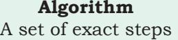

which when followed, solve the problem or accomplish the required task.

Ch 4.indd 62 08-Apr-19 12:34:19 PM

a dish, with clearly defined steps that, if followed, one will end up preparing the dish.

We start with a tentative solution plan and keep on refining the algorithm until the algorithm is able to capture all the aspects of the desired solution. For a given problem, more than one algorithm is possible and we have to select the most suitable solution. The algorithm is discussed in section 4.3.

#### **4.2.3 Coding**

After finalising the algorithm, we need to convert the algorithm into the format which can be understood by the computer to generate the desired solution. Different high level programming languages can be used for writing a program.

It is equally important to record the details of the coding procedures followed and document the solution. This is helpful when revisiting the programs at a later stage. Coding is explained in detail in section 4.8.

#### **4.2.4 Testing and Debugging**

The program created should be tested on various parameters. The program should meet the requirements of the user. It must respond within the expected time. It should generate correct output for all possible inputs. In the presence of syntactical errors, no output will be obtained. In case the output generated is incorrect, then the program should be checked for logical errors, if any.

Software industry follows standardised testing methods like unit or component testing, integration testing, system testing, and acceptance testing while developing complex applications. This is to ensure that the software meets all the business and technical requirements and works as expected. The errors or defects found in the testing phases are debugged or rectified and the program is again tested. This continues till all the errors are removed from the program.

Once the software application has been developed, tested and delivered to the user, still problems in terms of functioning can come up and need to be resolved from time to time. The maintenance of the solution, thus, involves fixing the problems faced by the user, **Notes**

Ch 4.indd 63 08-Apr-19 12:34:19 PM

#### **Activity 4.1**

What sequence of steps will you follow to compute the LCM of two numbers?

answering the queries of the user and even serving the request for addition or modification of features.

# **4.3 Algorithm**

In our day-to-day life we perform activities by following certain sequence of steps. Examples of activities include getting ready for school, making breakfast, riding a bicycle, wearing a tie, solving a puzzle and so on. To complete each activity, we follow a sequence of steps. Suppose following are the steps required for an activity 'riding a bicycle':

- 1) remove the bicycle from the stand,
- 2) sit on the seat of the bicycle,
- 3) start peddling,
- 4) use breaks whenever needed and
- 5) stop on reaching the destination.

Let us now find Greatest Common Divisor (GCD) of two numbers 45 and 54.

*Note:* GCD is the largest number that divides both the given numbers.

Step 1: Find the numbers (divisors) which can divide the given numbers

> Divisors of 45 are: 1, 3, 5, 9, 15, and 45 Divisors of 54 are: 1, 2, 3, 6, 9, 18, 27, and 54

Step 2: Then find the largest common number from these two lists.

Therefore, GCD of 45 and 54 is 9

Hence, it is clear that we need to follow a sequence of steps to accomplish the task. Such a finite sequence of steps required to get the desired output is called an algorithm. It will lead to the desired result in a finite amount of time, if followed correctly. Algorithm has a definite beginning and a definite end, and consists of a finite number of steps.

# **4.3.1 Why do we need an Algorithm?**

A programmer writes a program to instruct the computer to do certain tasks as desired. The computer then follows the steps written in the program code. Therefore, the programmer first prepares a roadmap of the program to be written, before actually writing the code. Without

The origin of the term Algorithm is traced to Persian astronomer and mathematician, Abu Abdullah Muhammad ibn Musa Al-Khwarizmi (c. 850 AD) as the Latin translation of Al-Khwarizmi was called 'Algorithmi'.

Ch 4.indd 64 11/10/2021 11:33:50 AM

a roadmap, the programmer may not be able to clearly visualise the instructions to be written and may end up developing a program which may not work as expected.

Such a roadmap is nothing but the algorithm which is the building block of a computer program. For example, searching using a search engine, sending a message, finding a word in a document, booking a taxi through an app, performing online banking, playing computer games, all are based on algorithms.

Writing an algorithm is mostly considered as a first step to programming. Once we have an algorithm to solve a problem, we can write the computer program for giving instructions to the computer in high level language. If the algorithm is correct, computer will run the program correctly, every time. So, the purpose of using an algorithm is to increase the reliability, accuracy and efficiency of obtaining solutions.

#### *(A) Characteristics of a good algorithm*

- Precision the steps are precisely stated or defined.
- Uniqueness results of each step are uniquely defined and only depend on the input and the result of the preceding steps.
- Finiteness the algorithm always stops after a finite number of steps.
- Input the algorithm receives some input.
- Output the algorithm produces some output.

# *(B) While writing an algorithm, it is required to clearly identify the following:*

- The input to be taken from the user
- Processing or computation to be performed to get the desired result
- The output desired by the user

# **4.4 Representation of Algorithms**

Using their algorithmic thinking skills, the software designers or programmers analyse the problem and identify the logical steps that need to be followed to reach a solution. Once the steps are identified, the need is to

Ch 4.indd 65 08-Apr-19 12:34:19 PM

write down these steps along with the required input and desired output. There are two common methods of representing an algorithm —flowchart and pseudocode. Either of the methods can be used to represent an algorithm while keeping in mind the following:

- it showcases the logic of the problem solution, excluding any implementational details
- it clearly reveals the flow of control during execution of the program

#### **4.4.1 Flowchart — Visual Representation of Algorithms**

A flowchart is a visual representation of an algorithm. A flowchart is a diagram made up of boxes, diamonds and other shapes, connected by arrows. Each shape represents a step of the solution process and the arrow represents the order or link among the steps.

There are standardised symbols to draw flowcharts. Some are given in Table 4.1.

| Flowchart symbol | Function | Description |
| --- | --- | --- |
|  | Start/End | Also called "Terminator" symbol. It indicates where the |
|  |  | flow starts and ends. |
|  | Process | Also called "Action Symbol," it represents a process, |
|  |  | action, or a single step. |
|  | Decision | A decision or branching point, usually a yes/no or true/ |
|  |  | false question is asked, and based on the answer, the path |
|  |  | gets split into two branches. |
|  | Input/Output | Also called data symbol, this parallelogram shape is used |
|  |  | to input or output data |
|  | Arrow | Connector to show order of flow between shapes. |

#### **Table 4.1 Shapes or symbols to draw flow charts**

*Example 4.1:* Write an algorithm to find the square of a number.

Before developing the algorithm, let us first identify the input, process and output:

- Input: Number whose square is required
- Process: Multiply the number by itself to get its square
- Output: Square of the number

Algorithm to find square of a number.

 Step 1: Input a number and store it to num Step 2: Compute num * num and store it in square Step 3: Print square

Ch 4.indd 66 21-May-19 4:35:17 PM

The algorithm to find square of a number can be represented pictorially using flowchart as shown in Figure 4.2.

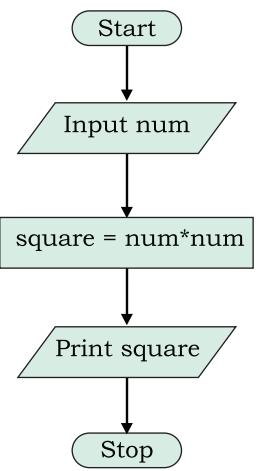


What will happen if an algorithm does not stop after a finite number of steps?

#### **Activity 4.2**

Draw a flowchart that represents the attainment of your career goal.

*Figure 4.2: Flowchart to calculate square of a number*

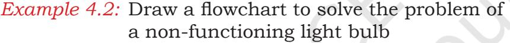

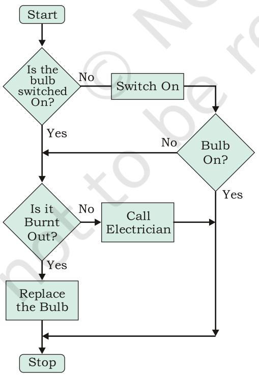

*Figure 4.3: Flowchart to solve the problem of a non-functioning light bulb*

Ch 4.indd 67 08-Apr-19 12:34:19 PM

#### **4.4.2 Pseudocode**

A pseudocode (pronounced Soo-doh-kohd) is another way of representing an algorithm. It is considered as a non-formal language that helps programmers to write algorithm. It is a detailed description of instructions that a computer must follow in a particular order. It is intended for human reading and cannot be executed directly by the computer. No specific standard for writing a pseudocode exists. The word "pseudo" means "not real," so "pseudocode" means "not real code". Following are some of the frequently used keywords while writing pseudocode:

- INPUT
- COMPUTE
- PRINT
- INCREMENT
- DECREMENT
- IF/ELSE
- WHILE
- TRUE/FALSE

*Example 4.3:* Write an algorithm to display the sum of two numbers entered by user, using both pseudocode and flowchart.

Pseudocode for the sum of two numbers will be:

input num1

input num2

COMPUTE Result = num1 + num2 PRINT Result

The flowchart for this algorithms is given in Figure 4.4.


*Figure 4.4: Flowchart to display sum of two numbers*

Ch 4.indd 68 08-Apr-19 12:34:19 PM

- 
**Activity 4.3**

Write a pseudocode for creating a scoreboard for a hockey match.

*Example 4.4:* Write an algorithm to calculate area and perimeter of a rectangle, using both pseudocode and flowchart.

Pseudocode for calculating area and perimeter of a rectangle.

```
 input length
 input breadth
 compute Area = length * breadth
  print Area
 compute Perim = 2 * (length + breadth)
  print Perim
```
The flowchart for this algorithm is given in Figure 4.5.

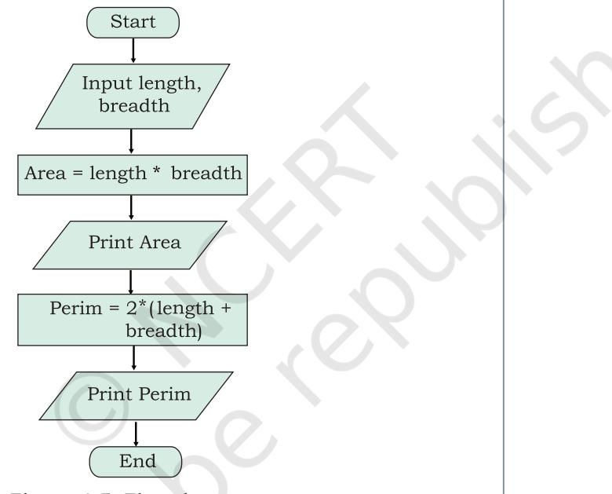

*Figure 4.5: Flowchart to calculate area and perimeter of a rectangle*

# **(A)** *Benefits of Pseudocode*

Before writing codes in a high level language, a pseudocode of a program helps in representing the basic functionality of the intended program. By writing the code first in a human readable language, the programmer safeguards against leaving out any important step. Besides, for non-programmers, actual programs are difficult to read and understand, but pseudocode helps them to review the steps to confirm that the proposed implementation is going to achieve the desire output.

Ch 4.indd 69 08-Apr-19 12:34:20 PM

# **4.5 Flow of Control**

The flow of control depicts the flow of events as represented in the flow chart. The events can flow in a sequence, or on branch based on a decision or even repeat some part for a finite number of times.

#### **4.5.1 Sequence**

If we look at the examples 4.3 and 4.4, the statements are executed one after another, i.e., in a sequence. Such algorithms where all the steps are executed one after the other are said to execute in sequence. However, statements in an algorithm may not always execute in a sequence. We may sometimes require the algorithm to either do some routine tasks in a repeated manner or behave differently depending on the outcomes of previous steps. In this section, we are going to learn how to write algorithms for such situations.

#### **4.5.2 Selection**

Consider the map of a neighbourhood as shown in Figure 4.6. Let us assume that the pink building with the red roof is the school; the yellow painted house at the far end of the map is a house.

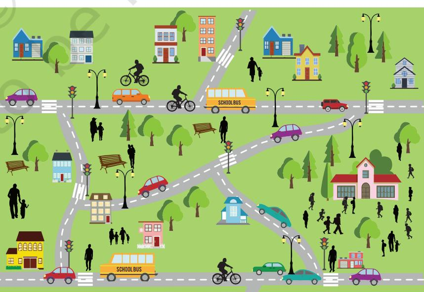

*Figure 4.6: Decision making in real life*

#### **Think and Reflect**

Can you list some of the routine activities in your daily life where decision making is involved?

Ch 4.indd 70 08-Apr-19 12:34:20 PM

With reference to Figure 4.6, let us answer the following questions :

- Is there a predefined route for walking from home to school?
- Can we have a different route while coming back?

As seen from the map, there can be multiple routes between home and school. We might take the shortest route in the morning. But while coming back home in the afternoon, the shortest route might have heavy traffic. Therefore, we could take another route with less traffic. Hence, the above problem involves some decision-making based on certain conditions.

Let us look at some other examples where decision making is dependent on certain conditions. For example,

*(i) Checking eligibility for voting.*

Depending on their age, a person will either be allowed to vote or not allowed to vote:

- If age is greater than or equal to 18, the person is eligible to vote
- If age is less than 18, the person is not eligible to vote
- *(ii) Let us consider another example*

If a student is 8 years old and the student likes Maths

put the student in Group A

Otherwise

Put the student in Group B

In which group will these students go as per the above condition?

#### **Outcome**

- 8-year-old Ravi who does not like Maths: Group B
- 8-year-old Priti who likes Maths: Group A

• 7-year-old Anish who likes Maths: Group B

In these examples, any one of the alternatives is selected based on the outcome of a condition. Conditionals are used to check possibilities. The program checks one or more conditions and perform operations (sequence of actions) depending on true or false value of the condition. These true or false values are called binary values. **Notes**

Ch 4.indd 71 08-Apr-19 12:34:20 PM

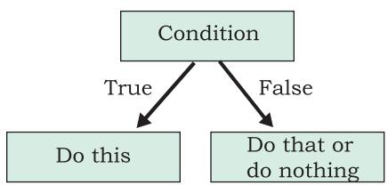

*Figure 4.7: Actions depending on true or false of a condition*

Conditionals are written in the algorithm as follows:

If <condition> then

 steps to be taken when the condition is true/fulfilled

There are situations where we also need to take action when the condition is not fulfilled (Figure 4.7). To represent that, we can write:

If <condition> is true then

 steps to be taken when the condition is true/fulfilled

otherwise

 steps to be taken when the condition is false/not fulfilled

In programming languages, 'otherwise' is represented using Else keyword. Hence, a true/false conditional is written using if-else block in actual programs.

*Example 4.5:* Let us write an algorithm to check whether a number is odd or even.

- Input: Any number
- Process: Check whether the number is even or not
- Output: Message "Even" or "Odd"

Pseudocode of the algorithm can be written as follows:

PRINT "Enter the Number" INPUT number

IF number MOD 2 == 0 THEN

PRINT "Number is Even"

ELSE

PRINT "Number is Odd"

The flowchart representation of the algorithm in shown in Figure 4.8.

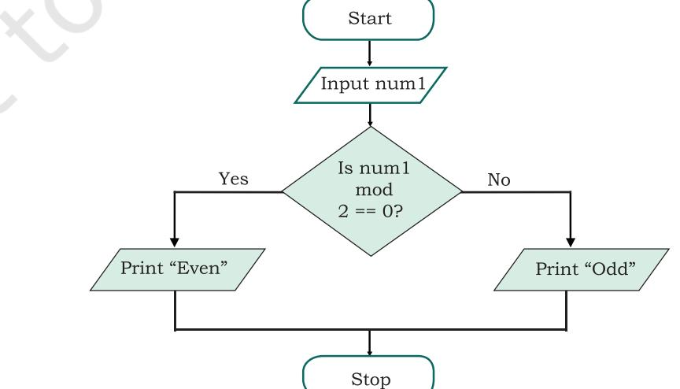

*Figure 4.8: Flowchart to check whether a number is even or odd*

Ch 4.indd 72 08-Apr-19 12:34:20 PM

*Example 4.6:* Let us write a pseudocode and draw a flowchart where multiple conditions are checked to categorise a person as either child (<13), teenager (>=13 but <20) or adult (>=20),based on age specified:

- Input: Age
- Process: Check Age as per the given criteria
- Output: Print either "Child", "Teenager", "Adult"

Pseudocode is as follows:

```
INPUT Age
if Age < 13 then
 PRINT "Child"
 else if Age < 20 then
 PRINT "Teenager"
 else
 PRINT "Adult"
```
The flowchart representation of the algorithm in shown in Figure 4.9

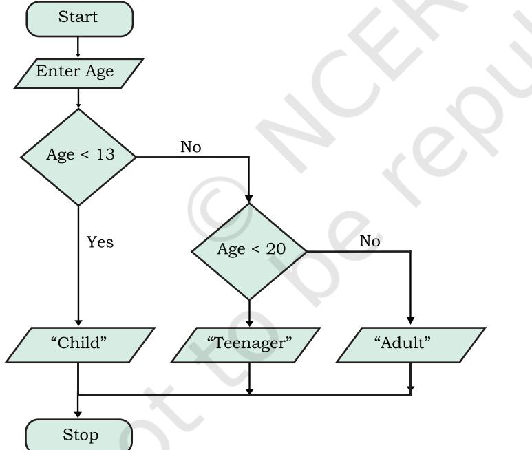

*Figure 4.9: Flowchart to check multiple conditions*

*Example 4.7:* Algorithm for a card game called "Dragons and Wizards".

Make two teams DRAGONS and WIZARDS

The rules for the game are as follows:

- If the card drawn is a diamond or a club, Team DRAGONS gets a point
- If the card drawn is a heart which is a number, Team WIZARDS gets a point

**Notes**

Ch 4.indd 73 08-Apr-19 12:34:20 PM

**Notes**

| • If the card drawn is a heart that is not a number, |
| --- |
| Team DRAGONS gets a point |
| • For any other card, Team WIZARDS gets a point |
| • The team with highest point is the winner |
| Let us identify the following for a card: |
| Input: shape, value |
| Process: Increment in respective team scores by one |
| based on the outcome of the card drawn, as defined in |
| the rules. |
| Output: Winning team |
| Now let us write the conditionals for this game: |
| IF (shape is diamond) OR (shape is club) |
| Team DRAGONS gets a point |
| ELSE IF (shape is heart) AND (value is |
| number) |
| Team WIZARDS gets a point |
| ELSE IF (shape is heart) AND (value is not a |
| number) |
| Team DRAGONS gets a point |
| ELSE |
| Team WIZARDS gets a point |
| The pseudocode for the program can be as follows: |
| Note: Dpoint (for Dragon) and Wpoint (for Wizard) store |
| points scored by the respective teams. |
| INPUT shape |
| INPUT value |
| SET Dpoint = 0, Wpoint = 0 |
| IF (shape is diamond) OR (shape is club) THEN |
| INCREMENT Dpoint |
| ELSE IF (shape is heart) AND (value is |
| number)THEN |
| INCREMENT Wpoint |
| ELSE IF (shape is heart) AND (value is not a |
| number)THEN |
| INCREMENT Dpoint |
| ELSE |
| INCREMENT Wpoint |
| END IF |
| If Dpoint > Wpoint THEN |
| PRINT "Dragon team is the winner" |
| ELSE |
| PRINT "Wizard team is the winner" |

#### **4.5.3 Repetition**

When giving directions to go someplace, we say something like, "walk 50 steps then turn right". Or "Walk till the next

Ch 4.indd 74 08-Apr-19 12:34:20 PM

crossing then take a right turn". Consider some other examples like:

- Clap your hands five times
- Walk 10 steps ahead
- Jump on the spot till you get tired

These are the kind of statements we use, when we want something to be done repeatedly, for a given number of times. Likewise, suppose 10 cards need to be withdrawn in the previous card game (example 4.7), then the pseudocode needs to be repeated 10 times to decide the winner. All these are examples of repetitions. In programming, repetition is also known as iteration or loop. A loop in an algorithm means execution of some program statements repeatedly till some specified condition is satisfied.

*Example 4.8:* Write pseudocode and draw a flowchart to accept 5 numbers and find their average.

The flowchart representation is shown in Figure 4.10. Pseudocode will be as follows:

- Step 1: Set count = 0, sum = 0
- Step 2: While count <5 , repeat steps 3 to 5

Step 3: Input a number to num

- Step 4: sum = sum + num
Step 5: count = count + 1

- Step 6: Compute average = sum/5
- Step 7: Print average

In example 4.8, a counter called "count" keeps track of number of times the loop has been repeated. After every iterationof the loop, the value of count is incremented by 1 until it performs the set number of repetitions, given in the iteration condition.

There are situations when we are not aware beforehand about the number of times a set


Can you list some of the routine activities in your daily life where repetition or iteration is involved?

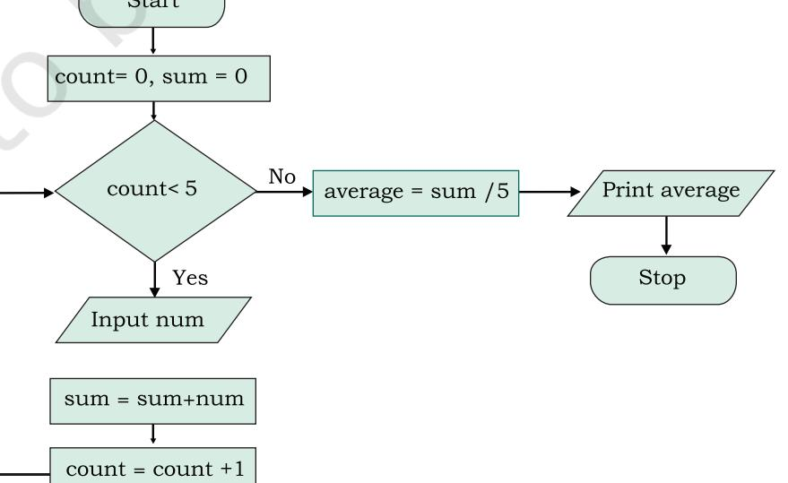

*Figure 4.10: Flowchart to Calculate the Average of 5 Numbers*

Ch 4.indd 75 08-Apr-19 12:34:21 PM

of statements need to be repeated. Such requirements of unknown number of repetitions are handled using WHILE construct.

*Example 4.9:* Write pseudocode and draw flowchart to accept numbers till the user enters 0 and then find their average.

Pseudocode is as follows:

- Step 1: Set count = 0, sum = 0
- Step 2: Input num
- Step 3: While num is not equal to 0, repeat Steps 4 to 6
- Step 4: sum = sum + num
- Step 5: count = count + 1
- Step 6: Input num
- Step 7: Compute average = sum/count
- Step 8: Print average

The flowchart representation is shown in Figure 4.11.

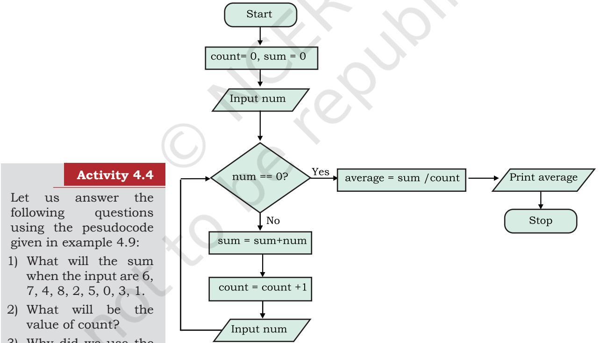

*Figure 4.11: Flowchart to accept numbers till the user enters 0*

In this example, we do not know how many numbers a user is going to enter before entering 0. This is handled by checking the condition repeatedly till the condition becomes false.

- 3) Why did we use the input statement to enter num twice?
- 4) Why did we divide sum by count?
- 5) Can there be any other approach?

Ch 4.indd 76 08-Apr-19 12:34:21 PM

# **4.6 Verifying Algorithms**

Can you imagine what would happen if a banking software does not work correctly? Suppose functioning of the online money transfer module is not programmed correctly, and it credits into the account only half the amount transacted! What happens if the account is debited instead of being credited. Such a faulty software will mess up the working of the complete system and cause havoc! Today software are used in even more critical services — like in the medical field or in space shuttles. Such software needs to work correctly in every situation. Therefore, the software designer should make sure that the functioning of all the components are defined correctly, checked and verified in every possible way.

When we were told that the formula for the sum of first N natural numbers is N(N+1) 2 , how did we verify it? Well, we can check this for small numbers, for which we can manually calculate the sum. Let N = 6, then the sum is 1 + 2 + 3 + 4 + 5 + 6 = 21

Using formula we get sum = 6x(6+1) 2

We can try with some more numbers this way to ensure that the formula works correctly.

In the same way, when we have written an algorithm, we want to verify that it is working as expected. To verify, we have to take different input values and go through all the steps of the algorithm to yield the desired output for each input value and may modify or improve as per the need. The method of taking an input and running through the steps of the algorithm is sometimes called *dry run*. Such a dry run will help us to:

- 1. Identify any incorrect steps in the algorithm
- 2. Figure out missing details or specifics in the algorithm

It is important to decide the type of input value to be used for the simulation. In case all possible input values are not tested, then the program will fail. What if there is some other case for which it does not work? Let us look at some examples.

Write an algorithm to calculate the time taken to go from place A to C (T_total) via B where time taken to

#### **Think and Reflect**

Why is verification of algorithm an important step in problem solving?

#### **Activity 4.5**

Write an algorithm to take as input the measurement of length and breadth in feet and inches (e.g., 5 ft 6 inch) of a rectangular shape and calculate its area and perimeter.

Ch 4.indd 77 21-May-19 11:51:30 AM

```
Notes
```
go from A to B (T1) and B to C (T2) are given. That is, we want the algorithm to add time given in hours and minutes. One way to write the algorithm is:

```
PRINT value for T1
INPUT hh1 
INPUT mm1
PRINT value for T2
INPUT hh2 
INPUT mm2
hh_total = hh1 + hh2 (Add hours)
mm_total = mm1 + mm2 (Add mins)
Print T_total as hh_total, mm_total
```
Now let us verify. Suppose the first example we take is T1 = 5 hrs 20 mins and T2 = 7 hrs 30 mins. On dry run, we get the result 12 hrs and 50 mins. This looks fine.

Now let us take another example where T1 = 4 hrs 50 mins and T2 = 2 hrs 20 mins, and we end up getting the result as 6 hrs 70 mins which is not how we measure time. The result should have been 7 hrs 10 mins.

With this second example we realise that our algorithm will work only when mm1 + mm2 (mm_total) < 60. For all other cases, it will give us output not the way we want. When mm_total >= 60, the algorithm should increase the sum of hours (hh_total) by 1 and reduce mm_total by 60, i.e., (mm_total  -  60). So the modified algorithm will be:

```
PRINT value for T1
INPUT hh1 
INPUT mm1
PRINT value for T2
INPUT hh2 
INPUT mm2
hh_total = hh1 + hh2 (Add hours)
mm_total = mm1 + mm2 (Add mins)
hh_total = hh1 + hh2 (Add hours)
mm_total = mm1 + mm2 (Add mins) 
IF (mm_total >= 60) THEN
 hh_total = hh_total + 1
 mm_total = mm_total - 60
PRINT T_total as hh_total, mm_total
```
Now we can simulate through algorithm for T1 = 4 hrs 50 mins and T2 = 2 hrs 20 mins, and get T_total = 7 hrs and 10 mins, which means the algorithm is working correctly.

Ch 4.indd 78 21-May-19 11:55:04 AM

Suppose we develop some software without verifying the underlying algorithm and if there are errors in the algorithm, then the software developed will not run. Hence, it is important to verify an algorithm since the effort required to catch and fix a mistake is minimal.

# **4.7 Comparison of Algorithm**

There can be more than one approach to solve a problem using computer and hence we can have more than one algorithm. Then one may ask which algorithm should be used?

Consider the problem of finding whether a given number is prime or not. Prime numbers are of great importance in computer science as they find application in databases, security, file compression or decompression, modulation or demodulation, etc. There can be four different ways to write algorithms to check whether a given number is prime or not as shown below:

- (i) Starting with divisor 2, divide the given number (dividend) and check if there are any factors. Increase the divisor in each iteration and repeat the previous steps as long as divisor < dividend. If there is a factor, then the given number is not prime
- (ii) In (i), instead of testing all the numbers till the dividend, only test up to half of the given value (dividend) because the divisor can not be more than half of the dividend
- (iii) In method (i), only test up to the square root of the dividend (numbers)
- (iv) Given a prior list of prime number till 100, divide the given number by each number in the list. If not divisible by any number, then the number is a prime else it is not prime

All these four methods can check if a given number is prime or not. Now the question is which of these methods is better or efficient?

Algorithm (i) requires large number of calculations (means more processing time) as it checks for all the numbers as long as the divisor is less than the number. If the given number is large, this method will take more time to give the output.

**Notes**

Ch 4.indd 79 08-Apr-19 12:34:21 PM

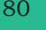

The spirit of problem solving by decomposition is to 'divide and conquer'. In words of *Howard Raffa*, a famous mathematician:

*"Decompose a complex problem into simpler problems get one's thinking straight in these simpler problems, put these analyses together with logical glue"*

Algorithm (ii) is more efficient than (i) as it checks for divisibility till half the number, and thus it reduces the time for computation of the prime number. Algorithm (iii) is even more efficient as it checks for divisibility till square root of the number, thereby further reducing the time taken.

As algorithm (iv) uses only the prime numbers smaller than the given number for divisibility, it further reduces the calculations. But in this method we require to store the list of prime numbers first. Thus it takes additional memory even though it requires lesser calculations.

Hence, algorithms can be compared and analysed on the basis of the amount of processing time they need to run and the amount of memory that is needed to execute the algorithm. These are termed as time complexity and space complexity, respectively. The choice of an algorithm over another is done depending on how efficient they are in terms of proecssing time required (time complexity) and the memory they utilise (space complexity).

# **4.8 Coding**

Once an algorithm is finalised, it should be coded in a high-level programming language as selected by the programmer. The ordered set of instructions are written in that programming language by following its syntax. Syntax is the set of rules or grammar that governs the formulation of the statements in the language, such as spellings, order of words, punctuation, etc.

The machine language or low level language consisting of 0s and 1s only is the ideal way to write a computer program. Programs written using binary digits are directly understood by the computer hardware, but they are difficult to deal with and comprehend by humans. This led to the invention of high-level languages which are close to natural languages and are easier to read, write, and maintain, but are not directly understood by the computer hardware. An advantage of using high-level languages is that they are portable, i.e., they can run on different types of computers with little

Ch 4.indd 80 08-Apr-19 12:34:21 PM

or no modifications. Low-level programs can run on only one kind of computer and have to be rewritten in order to run on another type of system. A wide variety of high-level languages, such as FORTRAN, C, C++, Java, Python, etc., exist.

A program written in a high-level language is called source code. We need to translate the source code into machine language using a compiler or an interpreter, so that it can be understood by the computer. We have learnt about the compiler and interpreter in Chapter 1.

There are multiple programming languages available and choosing the one suitable for our requirements requires us to consider many factors. It depends on the platform (OS) where the program will run. We need to decide whether the application would be a desktop application, a mobile application or a web application. Desktop and mobile applications are generally developed for a particular operating system and for certain hardware whereas the web applications are accessed in different devices using web browsers and may use resources available over cloud.

Besides, programs are developed not only to work on a computer, mobile or a web browser, but it may also be written for embedded systems like digital watch, mp3 players, traffic signals or vehicles, medical equipments and other smart devices. In such cases, we have to look for other specialised programming tools or sometimes write programs in assembly languages.

# **4.9 Decomposition**

Sometimes a problem may be complex, that is, its solution is not directly derivable. In such cases, we need to decompose it into simpler parts. Let us look at the Railway reservation system we talked about earlier. The complex task of designing a good railway reservation system is seen as designing the different components of the system and then making them work with each other effectively.

The basic idea of solving a complex problem by decomposition is to 'decompose' or break down a complex problem into smaller sub problems as shown **Notes**

Ch 4.indd 81 08-Apr-19 12:34:21 PM

in Figure 4.12. These sub problems are relatively easier to solve than the original problem. Finally, the subproblems are combined in a logical way to obtain the solution for the bigger, main problem.

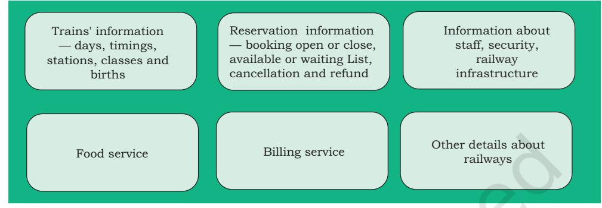

*Figure 4.12: Railway reservation system*

Breaking down a complex problem into sub problems also means that each sub problem can be examined in detail. Each sub problem can be solved independently and by different persons (or teams). Having different teams working on different sub problems can also be advantageous because specific sub problems can be assigned to teams who are experts in solving such problems.

There are many real life problems which can be solved using decomposition. Examples include solving problems in mathematics and science, events management in school, weather forecasting, delivery management system, etc.

Once the individual sub problems are solved, it is necessary to test them for their correctness and integrate them to get the complete solution.

# **Summary**

- An algorithm is defined as a step-by-step procedure designed to perform an operation which will lead to the desired result, if followed correctly.
- Algorithms have a definite beginning and a definite end, and a finite number of steps.
- A good algorithm, which is precise, unique and finite, receives input and produces an output.

Ch 4.indd 82 08-Apr-19 12:34:21 PM

- **Notes** In order to write effective algorithms we need to identify the input, the process to be followed and the desired output.
- A flowchart is a type of diagram that represents the algorithm graphically using boxes of various kinds, in an order connected by arrows.
- An algorithm where all the steps are executed one after the other is said to execute in sequence.
- Decision making involves selection of one of the alternatives based on outcome of a condition.
- An algorithm may have a certain set of steps, which are repeating for a finite number of times, such an algorithm is said to be iterative.
- There can be more than one approach to solve a problem and hence we can have more than one algorithm for a particular problem.
- The choice of algorithm should be made on the basis of time and space complexity.

# **Exercise**

- 1. Write pseudocode that reads two numbers and divide one by another and display the quotient.
- 2. Two friends decide who gets the last slice of a cake by flipping a coin five times. The first person to win three flips wins the cake. An input of 1 means player 1 wins a flip, and a 2 means player 2 wins a flip. Design an algorithm to determine who takes the cake?
- 3. Write the pseudocode to print all multiples of 5 between 10 and 25 (including both 10 and 25).
- 4. Give an example of a loop that is to be executed a certain number of times.
- 5. Suppose you are collecting money for something. You need ` 200 in all. You ask your parents, uncles and aunts as well as grandparents. Different people may give either ` 10, ` 20 or even ` 50. You will collect till the total becomes 200. Write the algorithm.
- 6. Write the pseudocode to print the bill depending upon the price and quantity of an item. Also print

Ch 4.indd 83 08-Apr-19 12:34:21 PM

| Notes |  | Bill GST, which is the bill after adding 5% of tax in |
| --- | --- | --- |
|  |  | the total bill. |
|  | 7. | Write pseudocode that will perform the following: |
|  |  | a) Read the marks of three subjects: Computer |
|  |  | Science, Mathematics and Physics, out of 100 |
|  |  | b) Calculate the aggregate marks |
|  |  | c) Calculate the percentage of marks |
|  | 8. | Write an algorithm to find the greatest among two |
|  |  | different numbers entered by the user. |
|  | 9. | Write an algorithm that performs the following: |
|  |  | Ask a user to enter a number. If the number is |
|  |  | between 5 and 15, write the word GREEN. If the |
|  |  | number is between 15 and 25, write the word BLUE. |
|  |  | if the number is between 25 and 35, write the word |
|  |  | ORANGE. If it is any other number, write that ALL |
|  |  | COLOURS ARE BEAUTIFUL. |
|  | 10. | Write an algorithm that accepts four numbers as |
|  |  | input and find the largest and smallest of them. |
|  | 11. | Write an algorithm to display the total water bill charges |
|  |  | of the month depending upon the number of units |
|  |  | consumed by the customer as per the following criteria: |
|  |  | • for the first 100 units @ 5 per unit |
|  |  | • for next 150 units @ 10 per unit |
|  |  | • more than 250 units @ 20 per unit |
|  |  | Also add meter charges of 75 per month to calculate |
|  |  | the total water bill . |
|  | 12. | What are conditionals? When they are required in a |
|  |  | program? |
|  | 13. | Match the pairs |
|  |  | Flowchart Symbol Functions |
|  |  | Flow of Control |
|  |  | Process Step |
|  |  | Start/Stop of the |
|  |  | Process |

Ch 4.indd 84 08-Apr-19 12:34:21 PM

**Notes**

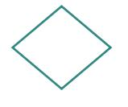

Data

Decision Making

- 14. Following is an algorithm for going to school or college. Can you suggest improvements in this to include other options?
*Reach_School_Algorithm*

- a) Wake up
- b) Get ready
- c) Take lunch box
- d) Take bus
- e) Get off the bus
- f) Reach school or college
- 15. Write a pseudocode to calculate the factorial of a number (Hint: Factorial of 5, written as 5!=5 4 3 21 ×××× ) .
- 16. Draw a flowchart to check whether a given number is an Armstrong number. An Armstrong number of three digits is an integer such that the sum of the cubes of its digits is equal to the number itself. For example, 371 is an Armstrong number since 3**3 + 7**3 + 1**3 = 371.
- 17. Following is an algorithm to classify numbers as "Single Digit", "Double Digit" or "Big".

*Classify_Numbers_Algo*

INPUT Number

```
IF Number < 9
```

```
 "Single Digit"
Else If Number < 99
 "Double Digit"
```
Else

"Big"

Verify for (5, 9, 47, 99, 100 200) and correct the algorithm if required

- 18. For some calculations, we want an algorithm that accepts only positive integers upto 100.
Ch 4.indd 85 08-Apr-19 12:34:21 PM

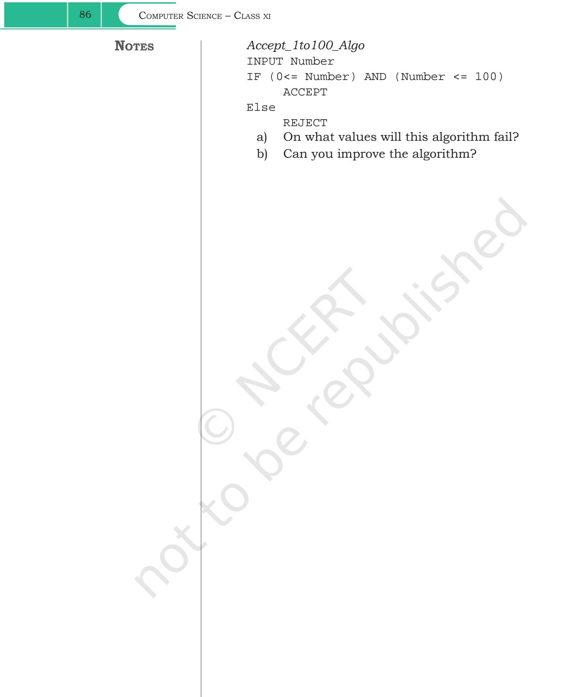

Ch 4.indd 86 08-Apr-19 12:34:21 PM

