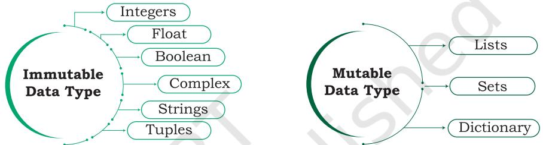

# **Chapter 5**

# **Getting Started with Python**

# **5.1 Introduction to Python**

We have written algorithms for different problems in Chapter 4. Let us now move a step further and create programs using any version of Python 3. But before learning about Python programming language, let us understand what is a programming language and how it works.

An ordered set of instructions to be executed by a computer to carry out a specific task is called a program, and the language used to specify this set of instructions to the computer is called a programming language.

As we know that computers understand the language of 0s and 1s which is called machine language or low level language. However, it is difficult for humans to write or comprehend instructions using 0s and 1s. This led to the advent of high-level programming languages like Python, C++, Visual Basic, PHP, Java that are easier to manage by humans but are not directly understood by the computer.

A program written in a high-level language is called source code. Recall from Chapter 1 that language translators like compilers and interpreters are needed to translate the source code into machine language. Python uses an interpreter to convert its instructions into machine language, so that it can be understood by the computer. An interpreter processes the program statements one by one, first translating and then executing. This process is continued until an error is encountered or the whole program is executed successfully. In both the cases, program execution will stop. On the contrary, a compiler translates the entire source code, as a whole, into the object code. After scanning the whole program, it generates error messages, if any.


*"Computer programming is an art, because it applies accumulated knowledge to the world, because it requires skill and ingenuity, and especially because it produces objects of beauty. A programmer who subconsciously views himself as an artist will enjoy what he does and will do it better."*

*– Donald Knuth*

#### *In this chapter*

- » *Introduction to Python*
- » *Python Keywords*
- » *Identifiers*
- » *Comments*
- » *Data Types*
- » *Operators*
- » *Expressions*
- » *Statement*
- » *Input and Output*
- » *Type Conversion*
- » *Debugging*

Ch 5.indd 87 08-Apr-19 12:35:10 PM


The latest version of Python 3 is available on the official website:

https://www.python.org/

# **5.1.1 Features of Python**

- Python is a high level language. It is a free and open source language.
- It is an interpreted language, as Python programs are executed by an interpreter.
- Python programs are easy to understand as they have a clearly defined syntax and relatively simple structure.
- Python is case-sensitive. For example, NUMBER and number are not same in Python.
- Python is portable and platform independent, means it can run on various operating systems and hardware platforms.
- Python has a rich library of predefined functions.
- Python is also helpful in web development. Many popular web services and applications are built using Python.
- Python uses indentation for blocks and nested blocks.

# **5.1.2 Working with Python**

To write and run (execute) a Python program, we need to have a Python interpreter installed on our computer or we can use any online Python interpreter. The interpreter is also called Python shell. A sample screen of Python interpreter is shown in Figure 5.1:


#### *Figure 5.1: Python interpreter or shell*

In the above screen, the symbol >>> is the Python prompt, which indicates that the interpreter is ready to take instructions. We can type commands or statements on this prompt to execute them using a Python interpreter.

Ch 5.indd 88 08-Apr-19 12:35:10 PM

# **5.1.3 Execution Modes**

There are two ways to use the Python interpreter:

- a) Interactive mode
- b) Script mode

Interactive mode allows execution of individual statement instantaneously. Whereas, Script mode allows us to write more than one instruction in a file called Python source code file that can be executed.

## *(A) Interactive Mode*

To work in the interactive mode, we can simply type a Python statement on the >>> prompt directly. As soon as we press enter, the interpreter executes the statement and displays the result(s), as shown in Figure 5.2.

*Figure 5.2: Python interpreter in interactive mode*

Working in the interactive mode is convenient for testing a single line code for instant execution. But in the interactive mode, we cannot save the statements for future use and we have to retype the statements to run them again.

# *(B) Script Mode*

In the script mode, we can write a Python program in a file, save it and then use the interpreter to execute it. Python scripts are saved as files where file name has extension ".py". By default, the Python scripts are saved in the Python installation folder. To execute a script, we can either:

- a) Type the file name along with the path at the prompt. For example, if the name of the file is prog5-1.py, we type prog5-1.py. We can otherwise open the program directly from IDLE as shown in Figure 5.3.
- b) While working in the script mode, after saving the file, click [Run]->[Run Module] from the menu as shown in Figure 5.4.

Ch 5.indd 89 08-Apr-19 12:35:11 PM


- c) The output appears on shell as shown in Figure 5.5.
Program 5-1 Write a program to show print statement in script mode.


*Figure 5.3: Python source code file (prog5-1.py)*

| File Edit Format Run Options Window Help |
| --- |
| print ("Save Python Shell |
| print ('Pres Check Module Alt+X |
| Run Module F5 |

*Figure 5.4: Execution of Python in Script mode using IDLE*


*Figure 5.5: Output of a program executed in script mode*

# **5.2 Python Keywords**

Keywords are reserved words. Each keyword has a specific meaning to the Python interpreter, and we can use a keyword in our program only for the purpose for which it has been defined. As Python is case sensitive, keywords must be written exactly as given in Table 5.1.

#### **Table 5.1 Python keywords**

| False | class | finally | is | return |
| --- | --- | --- | --- | --- |
| None | continue | for | lambda | try |

Ch 5.indd 90 21-May-19 11:57:33 AM

| True | def | from | nonlocal | while |
| --- | --- | --- | --- | --- |
| and | del | global | not | with |
| as | elif | if | or | yield |
| assert | else | import | pass |  |
| break | except | in | raise |  |

# **5.3 Identifiers**

In programming languages, identifiers are names used to identify a variable, function, or other entities in a program. The rules for naming an identifier in Python are as follows:

- The name should begin with an uppercase or a lowercase alphabet or an underscore sign (_). This may be followed by any combination of characters a–z, A–Z, 0–9 or underscore (_). Thus, an identifier cannot start with a digit.
- It can be of any length. (However, it is preferred to keep it short and meaningful).
- It should not be a keyword or reserved word given in Table 5.1.
- We cannot use special symbols like !, @, #, $, %, etc., in identifiers.

For example, to find the average of marks obtained by a student in three subjects, we can choose the identifiers as marks1, marks2, marks3 and avg rather than a, b, c, or A, B, C.

```
avg = (marks1 + marks2 + marks3)/3
```
Similarly, to calculate the area of a rectangle, we can use identifier names, such as area, length, breadth instead of single alphabets as identifiers for clarity and more readability.

```
area = length * breadth
```
# **5.4 Variables**

A variable in a program is uniquely identified by a name (identifier). Variable in Python refers to an object — an item or element that is stored in the memory. Value of a variable can be a string (e.g., 'b', 'Global Citizen'), numeric (e.g., 345) or any combination of alphanumeric characters (CD67). In Python we can use an assignment statement to create new variables and assign specific values to them.

**Notes**

Ch 5.indd 91 08-Apr-19 12:35:11 PM

```
gender = 'M'
message = "Keep Smiling"
price = 987.9
```
Program 5-2 Write a program to display values of variables in Python.

```
#Program 5-2 
#To display values of variables
message = "Keep Smiling"
print(message)
userNo = 101
print('User Number is', userNo)
```
Output:

Keep Smiling User Number is 101

In the program 5-2, the variable message holds string type value and so its content is assigned within double quotes " " (can also be within single quotes ' '), whereas the value of variable userNo is not enclosed in quotes as it is a numeric value.

Variable declaration is implicit in Python, means variables are automatically declared and defined when they are assigned a value the first time. Variables must always be assigned values before they are used in expressions as otherwise it will lead to an error in the program. Wherever a variable name occurs in an expression, the interpreter replaces it with the value of that particular variable.

Program 5-3 Write a Python program to find the area of a rectangle given that its length is 10 units and breadth is 20 units.

```
#Program 5-3 
#To find the area of a rectangle
length = 10
breadth = 20
area = length * breadth
print(area)
```
Output:

200

# **5.5 Comments**

Comments are used to add a remark or a note in the source code. Comments are not executed by interpreter.

Ch 5.indd 92 08-Apr-19 12:35:11 PM

They are added with the purpose of making the source code easier for humans to understand. They are used primarily to document the meaning and purpose of source code and its input and output requirements, so that we can remember later how it functions and how to use it. For large and complex software, it may require programmers to work in teams and sometimes, a program written by one programmer is required to be used or maintained by another programmer. In such situations, documentations in the form of comments are needed to understand the working of the program.

In Python, a comment starts with # (hash sign). Everything following the # till the end of that line is treated as a comment and the interpreter simply ignores it while executing the statement.

#### *Example 5.1*

```
#Variable amount is the total spending on 
#grocery
amount = 3400
#totalMarks is sum of marks in all the tests 
#of Mathematics
totalMarks = test1 + test2 + finalTest
```
## Program 5-4 Write a Python program to find the sum of two numbers.

```
#Program 5-4
  #To find the sum of two numbers
  num1 = 10
  num2 = 20
  result = num1 + num2
  print(result) 
Output:
```
30

# **5.6 Everything is an Object**

Python treats every value or data item whether numeric, string, or other type (discussed in the next section) as an object in the sense that it can be assigned to some variable or can be passed to a function as an argument.

Every object in Python is assigned a unique identity (ID) which remains the same for the lifetime of that object. This ID is akin to the memory address of the object. The function id() returns the identity of an object.

In the context of Object Oriented Programming (OOP), objects are a representation of the real world, such as employee, student, vehicle, box, book, etc. In any object oriented programming language like C++, JAVA, etc., each object has two things associated with it: (i) data or attributes and (ii) behaviour or methods. Further there are concepts of class and class hierarchies from which objects can be instantiated. However, OOP concepts are not in the scope of our present discussions.

- Python also comes under the category of object oriented programming. However, in Python, the definition of object is loosely casted as some objects may not have attributes or others may not have methods.
Ch 5.indd 93 08-Apr-19 12:35:11 PM

# *Example 5.2*

```
>>> num1 = 20
>>> id(num1)
1433920576 #identity of num1
>>> num2 = 30 - 10 
>>> id(num2) 
1433920576 #identity of num2 and num1 
 #are same as both 
refers to #object 20
```
# **5.7 Data Types**

Every value belongs to a specific data type in Python. Data type identifies the type of data values a variable can hold and the operations that can be performed on that data. Figure 5.6 enlists the data types available in Python.


*Figure 5.6: Different data types in Python*

# **5.7.1 Number**

Number data type stores numerical values only. It is further classified into three different types: int, float and complex.

**Table 5.2 Numeric data types**

| Type/ Class | Description | Examples |
| --- | --- | --- |
| int | integer numbers | –12, –3, 0, 125, 2 |
| float | real or floating point numbers | –2.04, 4.0, 14.23 |
| complex | complex numbers | 3 + 4j, 2 – 2j |

Boolean data type (bool) is a subtype of integer. It is a unique data type, consisting of two constants, True and False. Boolean True value is non-zero, non-null and non-empty. Boolean False is the value zero.

Ch 5.indd 94 15-Jun-21 11:13:29 AM

Let us now try to execute few statements in interactive mode to determine the data type of the variable using built-in function type().

# *Example 5.3*

```
>>> num1 = 10
>>> type(num1)
<class 'int'>
>>> num2 = -1210
>>> type(num2)
<class 'int'>
>>> var1 = True
>>> type(var1)
<class 'bool'>
>>> float1 = -1921.9
>>> type(float1)
<class 'float'>
>>> float2 = -9.8*10**2
>>> print(float2, type(float2))
-980.0000000000001 <class 'float'>
>>> var2 = -3+7.2j
```
>>> print(var2, type(var2)) (-3+7.2j) <class 'complex'>

Variables of simple data types like integers, float, boolean, etc., hold single values. But such variables are not useful to hold a long list of information, for example, names of the months in a year, names of students in a class, names and numbers in a phone book or the list of artefacts in a museum. For this, Python provides data types like tuples, lists, dictionaries and sets.

# **5.7.2 Sequence**

A Python sequence is an ordered collection of items, where each item is indexed by an integer. The three types of sequence data types available in Python are Strings, Lists and Tuples. We will learn about each of them in detail in later chapters. A brief introduction to these data types is as follows:

# *(A) String*

String is a group of characters. These characters may be alphabets, digits or special characters including spaces. String values are enclosed either in single quotation **Notes**

Ch 5.indd 95 08-Apr-19 12:35:11 PM

**Notes**

marks (e.g., 'Hello') or in double quotation marks (e.g., "Hello"). The quotes are not a part of the string, they are used to mark the beginning and end of the string for the interpreter. For example,

```
>>> str1 = 'Hello Friend'
>>> str2 = "452"
```
We cannot perform numerical operations on strings, even when the string contains a numeric value, as in str2.

## *(B) List*

List is a sequence of items separated by commas and the items are enclosed in square brackets [ ].

## *Example 5.4*

```
#To create a list
>>> list1 = [5, 3.4, "New Delhi", "20C", 45] 
#print the elements of the list list1
>>> print(list1) 
[5, 3.4, 'New Delhi', '20C', 45]
```
# *(C) Tuple*

Tuple is a sequence of items separated by commas and items are enclosed in parenthesis ( ). This is unlike list, where values are enclosed in brackets [ ]. Once created, we cannot change the tuple.

# *Example 5.5*

```
#create a tuple tuple1
>>> tuple1 = (10, 20, "Apple", 3.4, 'a') 
#print the elements of the tuple tuple1
>>> print(tuple1) 
(10, 20, "Apple", 3.4, 'a')
```
## **5.7.3 Set**

Set is an unordered collection of items separated by commas and the items are enclosed in curly brackets { }. A set is similar to list, except that it cannot have duplicate entries. Once created, elements of a set cannot be changed.

#### *Example 5.6*

```
#create a set
>>> set1 = {10,20,3.14,"New Delhi"} 
>>> print(type(set1))
<class 'set'>
>>> print(set1)
{10, 20, 3.14, "New Delhi"} 
#duplicate elements are not included in set
```
Ch 5.indd 96 08-Apr-19 12:35:11 PM

```
>>> set2 = {1,2,1,3}
>>> print(set2)
{1, 2, 3}
```
### **5.7.4 None**

None is a special data type with a single value. It is used to signify the absence of value in a situation. None supports no special operations, and it is neither same as False nor 0 (zero).

#### *Example 5.7*

```
>>> myVar = None
>>> print(type(myVar))
<class 'NoneType'>
>>> print(myVar)
None
```
## **5.7.5 Mapping**

Mapping is an unordered data type in Python. Currently, there is only one standard mapping data type in Python called dictionary.

## *(A) Dictionary*

Dictionary in Python holds data items in key-value pairs. Items in a dictionary are enclosed in curly brackets { }. Dictionaries permit faster access to data. Every key is separated from its value using a colon (:) sign. The key : value pairs of a dictionary can be accessed using the key. The keys are usually strings and their values can be any data type. In order to access any value in the dictionary, we have to specify its key in square brackets

# [ ].

```
Example 5.8
```

```
#create a dictionary
>>> dict1 = {'Fruit':'Apple', 
'Climate':'Cold', 'Price(kg)':120} 
>>> print(dict1)
{'Fruit': 'Apple', 'Climate': 'Cold', 
'Price(kg)': 120}
>>> print(dict1['Price(kg)'])
120
```
## **5.7.6 Mutable and Immutable Data Types**

Sometimes we may require to change or update the values of certain variables used in a program. However, for certain data types, Python does not allow us to

Ch 5.indd 97 11/10/2021 10:40:08 AM

change the values once a variable of that type has been created and assigned values.

Variables whose values can be changed after they are created and assigned are called mutable. Variables whose values cannot be changed after they are created and assigned are called immutable. When an attempt is made to update the value of an immutable variable, the old variable is destroyed and a new variable is created by the same name in memory.

Python data types can be classified into mutable and immutable as shown in Figure 5.7.



*Figure 5.7: Classification of data types*

Let us now see what happens when an attempt is


*Figure 5.9: Variables with same value have same identifier*

made to update the value of a variable.

>>> num1 = 300 This statement will create an object with value 300 and the object is referenced by the identifier num1 as shown in Figure 5.8. >>> num2 = num1

The statement num2 = num1 will make num2 refer to the value 300, also being referred by num1, and stored at memory location number, say 1000. So, num1 shares the referenced location with num2 as shown in Figure 5.9.

Ch 5.indd 98 11/10/2021 10:53:15 AM


This statement 1 num1 = num2 + 100 links the variable num1 to a new object stored at memory location number say 2200 having a value 400. As num1 is an integer, which is an immutable type, it is rebuilt, as shown in Figure 5.10.

## **5.7.7 Deciding Usage of Python Data Types**

It is preferred to use lists when we need a simple iterable collection of data that may go for frequent modifications. For example, if we store the names of students of a class in a list, then it is easy to update the list when some new students join or some leave the course. Tuples are used when we do not need any change in the data. For example, names of months in a year. When we need uniqueness of elements and to avoid duplicacy it is preferable to use sets, for example, list of artefacts in a museum. If our data is being constantly modified or we need a fast lookup based on a custom key or we need a logical association between the key : value pair, it is advised to use dictionaries. A mobile phone book is a good application of dictionary.

# **5.8 Operators**

An operator is used to perform specific mathematical or logical operation on values. The values that the operators work on are called operands. For example, in the expression 10 + num, the value 10, and the variable num are operands and the + (plus) sign is an operator. Python supports several kinds of operators whose categorisation is briefly explained in this section.

Python compares strings lexicographically, using ASCII value of the characters. If the first character of both the strings are same, the second character is compared, and so on.

Ch 5.indd 99 08-Apr-19 12:35:12 PM

# **5.8.1 Arithmetic Operators**

Python supports arithmetic operators that are used to perform the four basic arithmetic operations as well as modular division, floor division and exponentiation.

| Operator | Operation | Description | Example (Try in Lab) |
| --- | --- | --- | --- |
| + | Addition | Adds the two numeric values on | >>> num1 = 5 |
|  |  | either side of the operator | >>> num2 = 6 |
|  |  |  | >>> num1 + num2 |
|  |  | This operator can also be used to | 11 |
|  |  | concatenate two strings on either | >>> str1 = "Hello" |
|  |  | side of the operator |  |
|  |  |  | >>> str2 = "India" |
|  |  |  | >>> str1 + str2 |
|  |  |  | 'HelloIndia' |
| - | Subtraction | Subtracts the operand on the right | >>> num1 = 5 |
|  |  | from the operand on the left | >>> num2 = 6 |
|  |  |  | >>> num1 - num2 |
|  |  |  | -1 |
| * | Multiplication | Multiplies the two values on both | >>> num1 = 5 |
|  |  | side of the operator | >>> num2 = 6 |
|  |  |  | >>> num1 * num2 |
|  |  |  | 30 |
|  |  | Repeats the item on left of the | >>> str1 = 'India' |
|  |  | operator if first operand is a | >>> str1 * 2 |
|  |  | string and second operand is an | 'IndiaIndia' |
|  |  | integer value |  |
| / | Division | Divides the operand on the left | >>> num1 = 8 |
|  |  | by the operand on the right and | >>> num2 = 4 |
|  |  | returns the quotient | >>> num2 / num1 |
|  |  |  | 0.5 |
| % | Modulus | Divides the operand on the left | >>> num1 = 13 |
|  |  | by the operand on the right and | >>> num2 = 5 |
|  |  | returns the remainder | >>> num1 % num2 |
|  |  |  | 3 |
| // | Floor Division | Divides the operand on the left | >>> num1 = 13 |
|  |  | by the operand on the right and | >>> num2 = 4 |
|  |  | returns the quotient by removing | >>> num1 // num2 |
|  |  | the decimal part. It is sometimes | 3 |
|  |  | also called integer division. | >>> num2 // num1 |
|  |  |  | 0 |
| ** | Exponent | Performs exponential (power) | >>> num1 = 3 |
|  |  | calculation on operands. That is, | >>> num2 = 4 |
|  |  | raise the operand on the left to the | >>> num1 ** num2 |
|  |  | power of the operand on the right | 81 |

#### **Table 5.3 Arithmetic Operators in Python**

# **5.8.2 Relational Operators**

Relational operator compares the values of the operands on its either side and determines the relationship among

Ch 5.indd 100 08-Apr-19 12:35:12 PM

them. Assume the Python variables num1 = 10, num2 = 0, num3 = 10, str1 = "Good", str2 = "Afternoon" for the following examples:

| Operator | Operation | Description | Example (Try in Lab) |
| --- | --- | --- | --- |
| == | Equals to | If the values of two operands are | >>> num1 == num2 |
|  |  | equal, then the condition is True, | False |
|  |  | otherwise it is False | >> str1 == str2 |
|  |  |  | False |
| != | Not equal to | If values of two operands are not | >>> num1 != num2 |
|  |  | equal, then condition is True, | True |
|  |  | otherwise it is False | >>> str1 != str2 |
|  |  |  | True |
|  |  |  | >>> num1 != num3 |
|  |  |  | False |
| > | Greater than | If the value of the left-side operand | >>> num1 > num2 |
|  |  | is greater than the value of the right | True |
|  |  | side operand, then condition is True, | >>> str1 > str2 |
|  |  | otherwise it is False | True |
| < | Less than | If the value of the left-side operand | >>> num1 < num3 |
|  |  | is less than the value of the right | False |
|  |  | side operand, then condition is True, | >>> str2 < str1 |
|  |  | otherwise it is False | True |
| >= | Greater than | If the value of the left-side operand is | >>> num1 >= num2 |
|  | or equal to | greater than or equal to the value of | True |
|  |  | the right-side operand, then condition | >>> num2 >= num3 |
|  |  | is True, otherwise it is False | False |
|  |  |  | >>> str1 >= str2 |
|  |  |  | True |
| <= | Less than or | If the value of the left operand is less | >>> num1 <= num2 |
|  | equal to | than or equal to the value of the right | False |
|  |  | operand, then is True otherwise it is | >>> num2 <= num3 |
|  |  | False | True |
|  |  |  | >>> str1 <= str2 |
|  |  |  | False |

#### **Table 5.4 Relational operators in Python**

# **5.8.3 Assignment Operators**

Assignment operator assigns or changes the value of the variable on its left.

**Table 5.5 Assignment operators in Python**

| Operator | Description | Example (Try in Lab) |
| --- | --- | --- |
| = | Assigns value from right-side operand to left | >>> num1 = 2 |
|  | side operand | >>> num2 = num1 |
|  |  | >>> num2 |
|  |  | 2 |
|  |  | >>> country = 'India' |
|  |  | >>> country |
|  |  | 'India' |

Ch 5.indd 101 08-Apr-19 12:35:12 PM

| += | It adds the value of right-side operand to the | >>> num1 = 10 |
| --- | --- | --- |
|  | left-side operand and assigns the result to the left-side operand | >>> num2 = 2 |
|  | Note: x += y is same as x = x + y | >>> num1 += num2 |
|  |  | >>> num1 |
|  |  | 12 |
|  |  | >>> num2 |
|  |  | 2 |
|  |  | >>> str1 = 'Hello' |
|  |  | >>> str2 = 'India' |
|  |  | >>> str1 += str2 |
|  |  | >>> str1 |
|  |  | 'HelloIndia' |
| -= | It subtracts the value of right-side operand from | >>> num1 = 10 |
|  | the left-side operand and assigns the result to | >>> num2 = 2 |
|  | left-side operand | >>> num1 -= num2 |
|  | Note: x -= y is same as x = x - y | >>> num1 |
|  |  | 8 |
| *= | It multiplies the value of right-side operand | >>> num1 = 2 |
|  | with the value of left-side operand and assigns | >>> num2 = 3 |
|  | the result to left-side operand | >>> num1 *= 3 |
|  | Note: x *= y is same as x = x * y |  |
|  |  | >>> num1 |
|  |  | 6 |
|  |  | >>> a = 'India' |
|  |  | >>> a *= 3 |
|  |  | >>> a |
|  |  | 'IndiaIndiaIndia' |
| /= | It divides the value of left-side operand by the | >>> num1 = 6 |
|  | value of right-side operand and assigns the | >>> num2 = 3 |
|  | result to left-side operand | >>> num1 /= num2 |
|  | Note: x /= y is same as x = x / y | >>> num1 |
|  |  | 2.0 |
| %= | It performs modulus operation using two | >>> num1 = 7 |
|  | operands and assigns the result to left-side | >>> num2 = 3 |
|  | operand | >>> num1 %= num2 |
|  | Note: x %= y is same as x = x % y | >>> num1 |
|  |  | 1 |
| //= | It performs floor division using two operands | >>> num1 = 7 |
|  | and assigns the result to left-side operand Note: x //= y is same as x = x // y | >>> num2 = 3 >>> num1 //= num2 |
|  |  | >>> num1 |
|  |  | 2 |
| **= | It performs exponential (power) calculation on | >>> num1 = 2 |
|  | operators and assigns value to the left-side | >>> num2 = 3 |
|  | operand | >>> num1 **= num2 |
|  | Note: x **= y is same as x = x ** y | >>> num1 |
|  |  | 8 |

Ch 5.indd 102 08-Apr-19 12:35:12 PM

# **5.8.4 Logical Operators**

There are three logical operators supported by Python. These operators (and, or, not) are to be written in lower case only. The logical operator evaluates to either True or False based on the logical operands on either side. Every value is logically either True or False. By default, all values are True except None, False, 0 (zero), empty collections "", (), [], {}, and few other special values. So if we say num1 = 10, num2 = -20, then both num1 and num2 are logically True.

| Operator | Operation | Description | Example (Try in Lab) |
| --- | --- | --- | --- |
| and | Logical AND | If both the operands are | >>> True and True |
|  |  | then condition True, | True |
|  |  | becomes True | >>> num1 = 10 |
|  |  |  | >>> num2 = -20 |
|  |  |  | >>> bool(num1 and num2) |
|  |  |  | True |
|  |  |  | >>> True and False |
|  |  |  | False |
|  |  |  | >>> num3 = 0 |
|  |  |  | >>> bool(num1 and num3) |
|  |  |  | False |
|  |  |  | >>> False and False |
|  |  |  | False |
| or | Logical OR | If any of the two operands | >>> True or True |
|  |  | are True, then condition | True |
|  |  | becomes True | >>> True or False |
|  |  |  | True |
|  |  |  | >>> bool(num1 or num3) |
|  |  |  | True |
|  |  |  | >>> False or False |
|  |  |  | False |
| not | Logical NOT | Used to reverse the logical | >>> num1 = 10 |
|  |  | state of its operand | >>> bool(num1) |
|  |  |  | True |
|  |  |  | >>> not num1 |
|  |  |  | >>> bool(num1) |
|  |  |  | False |

|
|  |

## **5.8.5 Identity Operators**

Identity operators are used to determine whether the value of a variable is of a certain type or not. Identity operators can also be used to determine whether two

Ch 5.indd 103 08-Apr-19 12:35:12 PM

variables are referring to the same object or not. There are two identity operators.

| Operator | Description | Example (Try in Lab) |
| --- | --- | --- |
| is | Evaluates True if the variables on either | >>> num1 = 5 |
|  | side of the operator point towards the same | >>> type(num1) is int |
|  | memory location and False otherwise. | True |
|  | var1 is var2 results to True if id(var1) is | >>> num2 = num1 |
|  | equal to id(var2) | >>> id(num1) |
|  |  | 1433920576 |
|  |  | >>> id(num2) |
|  |  | 1433920576 |
|  |  | >>> num1 is num2 |
|  |  | True |
| is not | Evaluates to False if the variables on | >>> num1 is not num2 |
|  | either side of the operator point to the same | False |
|  | memory location and True otherwise. var1 |  |
|  | is not var2 results to True if id(var1) is not |  |
|  | equal to id(var2) |  |

#### **Table 5.7 Identity operators in Python**

# **5.8.6 Membership Operators**

Membership operators are used to check if a value is a member of the given sequence or not.

|
|  |

| Operator | Description | Example (Try in Lab) |
| --- | --- | --- |
| in | Returns True if the variable/value is found in the | >>> a = [1,2,3] |
|  | specified sequence and False otherwise | >>> 2 in a |
|  |  | True |
|  |  | >>> '1' in a |
|  |  | False |
| not in | Returns True if the variable/value is not found in | >>> a = [1,2,3] |
|  | the specified sequence and False otherwise | >>> 10 not in a |
|  |  | True |
|  |  | >>> 1 not in a |
|  |  | False |

# **5.9 Expressions**

An expression is defined as a combination of constants, variables, and operators. An expression always evaluates to a value. A value or a standalone variable is also considered as an expression but a standalone operator is not an expression. Some examples of valid expressions are given below.

| (i) 100 | (iv) 3.0 + 3.14 |
| --- | --- |
| (ii) num | (v) 23/3 -5 * 7(14 -2) |
| (iii) num – 20.4 | (vi) "Global" + "Citizen" |

Ch 5.indd 104 08-Apr-19 12:35:12 PM

## **5.9.1 Precedence of Operators**

Evaluation of the expression is based on precedence of operators. When an expression contains different kinds of operators, precedence determines which operator should be applied first. Higher precedence operator is evaluated before the lower precedence operator. Most of the operators studied till now are binary operators. Binary operators are operators with two operands. The unary operators need only one operand, and they have a higher precedence than the binary operators. The minus (-) as well as + (plus) operators can act as both unary and binary operators, but not is a unary logical operator.

```
#Depth is using - (minus) as unary operator
Value = -Depth 
#not is a unary operator, negates True
print(not(True))
```
The following table lists precedence of all operators from highest to lowest.

| Order of | Operators | Description |
| --- | --- | --- |
| Precedence |  |  |
| 1 | ** | Exponentiation (raise to the power) |
| 2 | ~ ,+, - | Complement, unary plus and unary minus |
| 3 | * ,/, %, // | Multiply, divide, modulo and floor division |
| 4 | +, - | Addition and subtraction |
| 5 |  | <= , < , > , >=, == , != Relational and Comparison operators |
| 6 | =, %=, /=, //=, -=, +=, | Assignment operators |
|  | *=, **= |  |
| 7 | is, is not | Identity operators |
| 8 | in, not in | Membership operators |
| 9 | not | Logical operators |
| 10 | and |  |
| 11 | or |  |

**Table 5.9 Precedence of all operators in Python**

#### *Note:*

- a) Parenthesis can be used to override the precedence of operators. The expression within () is evaluated first.
- b) For operators with equal precedence, the expression is evaluated from left to right.

*Example 5.9* How will Python evaluate the following expression?

$$\scriptsize20\:+\:30\:\:*\:\:40$$
  
  
. 

Ch 5.indd 105 15-Jun-21 3:10:07 PM

**Notes**

*Solution:*

| = 20 + (30 * 40) | #Step 1 |
| --- | --- |
| #precedence of * is more than that of + |  |
| = 20 + 1200 | #Step 2 |
| = 1220 | #Step 3 |

*Example 5.10* How will Python evaluate the following expression?

 20 - 30 + 40 *Solution:*

The two operators (–) and (+) have equal precedence. Thus, the first operator, i.e., subtraction is applied before the second operator, i.e., addition (left to right).

| = (20 – 30) + 40 | #Step 1 |
| --- | --- |
| = -10 + 40 | #Step 2 |
| = 30 | #Step 3 |

*Example 5.11* How will Python evaluate the following expression?

```
 (20 + 30) * 40
```
*Solution:*

 = (20 + 30) * 40 # Step 1 #using parenthesis(), we have forced precedence of + to be more than that of *

| = 50 * 40 | # Step 2 |
| --- | --- |
| = 2000 | # Step 3 |

*Example 5.12* How will the following expression be evaluated in Python?

15.0 / 4 + (8 + 3.0)

*Solution:*

| = 15.0 / 4 + (8.0 + 3.0) | #Step 1 |
| --- | --- |
| = 15.0 / 4.0 + 11.0 | #Step 2 |
| = 3.75 + 11.0 | #Step 3 |
| = 14.75 | #Step 4 |

# **5.10 Statement**

In Python, a statement is a unit of code that the Python interpreter can execute.

### *Example 5.13*

```
>>> x = 4 #assignment statement
>>> cube = x ** 3 #assignment statement
>>> print (x, cube) #print statement
4 64
```
Ch 5.indd 106 08-Apr-19 12:35:12 PM

# **5.11 Input and Output**

Sometimes, a program needs to interact with the user's to get some input data or information from the end user and process it to give the desired output. In Python, we have the input() function for taking the user input. The input() function prompts the user to enter data. It accepts all user input as string. The user may enter a number or a string but the input() function treats them as strings only. The syntax for input() is:

## input ([Prompt])

Prompt is the string we may like to display on the screen prior to taking the input, and it is optional. When a prompt is specified, first it is displayed on the screen after which the user can enter data. The input() takes exactly what is typed from the keyboard, converts it into a string and assigns it to the variable on left-hand side of the assignment operator (=). Entering data for the input function is terminated by pressing the enter key. *Example 5.14*

```
>>> fname = input("Enter your first name: ")
Enter your first name: Arnab
>>> age = input("Enter your age: ")
Enter your age: 19
>>> type(age)
<class 'str'>
```
The variable fname will get the string 'Arnab', entered by the user. Similarly, the variable age will get the string '19'. We can typecast or change the datatype of the string data accepted from user to an appropriate numeric value. For example, the following statement will convert the accepted string to an integer. If the user enters any non-numeric value, an error will be generated.

# *Example 5.15*

```
#function int() to convert string to integer
>>> age = int( input("Enter your age:"))
Enter your age: 19
>>> type(age)
<class 'int'>
```
Python uses the print() function to output data to standard output device — the screen. We will learn about function in Chapter 7. The function print() evaluates the expression before displaying it on the screen. The print()

**Notes**

Ch 5.indd 107 08-Apr-19 12:35:12 PM


Observe that a plus sign does not add any space between the two strings while a comma inserts a space between two strings in a print statement.

outputs a complete line and then moves to the next line for subsequent output. The syntax for print() is:

print(value [, ..., sep = ' ', end = '\n'])

- sep: The optional parameter sep is a separator between the output values. We can use a character, integer or a string as a separator. The default separator is space.
- end: This is also optional and it allows us to specify any string to be appended after the last value. The default is a new line.

#### *Example 5.16*

| Statement | Output |
| --- | --- |
| print("Hello") | Hello |
| print(10*2.5) | 25.0 |
| print("I" + "love" + "my" + | Ilovemycountry |
| "country") |  |
| print("I'm", 16, "years old") | I'm 16 years old |

The third print function in the above example is concatenating strings, and we use + (plus) between two strings to concatenate them. The fourth print function also appears to be concatenating strings but uses commas (,) between strings. Actually, here we are passing multiple arguments, separated by commas to the print function. As arguments can be of different types, hence the print function accepts integer (16) along with strings here. But in case the print statement has values of different types and '+' is used instead of comma, it will generate an error as discussed in the next section under explicit conversion.

# **5.12 Type Conversion**

Consider the following program

```
num1 = input("Enter a number and I'll double 
it: ")
num1 = num1 * 2
print(num1)
```
The program was expected to display double the value of the number received and store in variable num1. So if a user enters 2 and expects the program to display 4 as the output, the program displays the following result:

```
Enter a number and I'll double it: 2
22
```
Ch 5.indd 108 08-Apr-19 12:35:12 PM

This is because the value returned by the input function is a string ("2") by default. As a result, in statement num1 = num1 * 2, num1 has string value and * acts as repetition operator which results in output as "22". To get 4 as output, we need to convert the data type of the value entered by the user to integer. Thus, we modify the program as follows:

```
num1 = input("Enter a number and I'll double 
it: ")
num1 = int(num1) #convert string input to 
                   #integer
num1 = num1 * 2
print(num1)
```
Now, the program will display the expected output as follows:

```
Enter a number and I'll double it: 2
4
```
Let us now understand what is type conversion and how it works. As and when required, we can change the data type of a variable in Python from one type to another. Such data type conversion can happen in two ways: either explicitly (forced) when the programmer specifies for the interpreter to convert a data type to another type; or implicitly, when the interpreter understands such a need by itself and does the type conversion automatically.

## **5.12.1 Explicit Conversion**

Explicit conversion, also called type casting happens when data type conversion takes place because the programmer forced it in the program. The general form of an explicit data type conversion is:

(new_data_type) (expression)

With explicit type conversion, there is a risk of loss of information since we are forcing an expression to be of a specific type. For example, converting a floating value of x = 20.67 into an integer type, i.e., int(x) will discard the fractional part .67. Following are some of the functions in Python that are used for explicitly converting an expression or a variable to a different type.

**Table 5.10 Explicit type conversion functions in Python**

| Function | Description |
| --- | --- |
| int(x) | Converts x to an integer |
| float(x) | Converts x to a floating-point number |


Ch 5.indd 109 08-Apr-19 12:35:12 PM


```
print("The total is Rs." + totalPrice )
```
Ch 5.indd 110 15-Jun-21 11:15:29 AM

#### *Figure 5.11: Output of program 5-7*

On execution, program 5-7 gives an error as shown in Figure 5.11, informing that the interpreter cannot convert an integer value to string implicitly. It may appear quite intuitive that the program should convert the integer value to a string depending upon the usage. However, the interpreter may not decide on its own when to convert as there is a risk of loss of information. Python provides the mechanism of the explicit type conversion so that one can clearly state the desired outcome. Program 5-8 works perfectly using explicit type casting:

Program 5-8 Program to show explicit type casting.

```
#Program 5-8
#Explicit type casting
priceIcecream = 25
priceBrownie = 45
totalPrice = priceIcecream + priceBrownie
print("The total in Rs." + str(totalPrice))
```
Output:

The total in Rs.70

Similarly, type casting is needed to convert float to string. In Python, one can convert string to integer or float values whenever required.

Program 5-9 Program to show explicit type conversion.

```
#Program 5-9
#Explicit type conversion
icecream = '25'
brownie = '45'
#String concatenation
price = icecream + brownie
print("Total Price Rs." + price)
#Explicit type conversion - string to integer
```
Ch 5.indd 111 08-Apr-19 12:35:13 PM

```
price = int(icecream)+int(brownie)
print("Total Price Rs." + str(price))
```
#### Output:

Total Price Rs.2545 Total Price Rs.70

#### **5.12.2 Implicit Conversion**

Implicit conversion, also known as coercion, happens when data type conversion is done automatically by Python and is not instructed by the programmer.

Program 5-10Program to show implicit conversion from

#### int to float.

#Program 5-10 #Implicit type conversion from int to float

```
num1 = 10 #num1 is an integer
num2 = 20.0 #num2 is a float
sum1 = num1 + num2 #sum1 is sum of a float 
and an integer
print(sum1)
print(type(sum1))
```
Output:

```
30.0
<class 'float'>
```
In the above example, an integer value stored in variable num1 is added to a float value stored in variable num2, and the result was automatically converted to a float value stored in variable sum1 without explicitly telling the interpreter. This is an example of implicit data conversion. One may wonder why was the float value not converted to an integer instead? This is due to type promotion that allows performing operations (whenever possible) by converting data into a wider-sized data type without any loss of information.

# **5.13 Debugging**

A programmer can make mistakes while writing a program, and hence, the program may not execute or may generate wrong output. The process of identifying and removing such mistakes, also known as bugs or errors, from a program is called debugging. Errors occurring in programs can be categorised as:

- i) Syntax errors
- ii) Logical errors
- iii) Runtime errors

Ch 5.indd 112 08-Apr-19 12:35:13 PM

#### **5.13.1 Syntax Errors**

Like other programming languages, Python has its own rules that determine its syntax. The interpreter interprets the statements only if it is syntactically (as per the rules of Python) correct. If any syntax error is present, the interpreter shows error message(s) and stops the execution there. For example, parentheses must be in pairs, so the expression (10 + 12) is syntactically correct, whereas (7 + 11 is not due to absence of right parenthesis. Such errors need to be removed before the execution of the program

#### **5.13.2 Logical Errors**

A logical error is a bug in the program that causes it to behave incorrectly. A logical error produces an undesired output but without abrupt termination of the execution of the program. Since the program interprets successfully even when logical errors are present in it, it is sometimes difficult to identify these errors. The only evidence to the existence of logical errors is the wrong output. While working backwards from the output of the program, one can identify what went wrong.

For example, if we wish to find the average of two numbers 10 and 12 and we write the code as 10 + 12/2, it would run successfully and produce the result 16. Surely, 16 is not the average of 10 and 12. The correct code to find the average should have been (10 + 12)/2 to give the correct output as 11.

Logical errors are also called semantic errors as they occur when the meaning of the program (its semantics) is not correct.

#### **5.13.3 Runtime Error**

A runtime error causes abnormal termination of program while it is executing. Runtime error is when the statement is correct syntactically, but the interpreter cannot execute it. Runtime errors do not appear until after the program starts running or executing.

For example, we have a statement having division operation in the program. By mistake, if the denominator entered is zero then it will give a runtime error like "division by zero".

Let us look at the program 5-11 showing two types of runtime errors when a user enters non-integer value

Ch 5.indd 113 08-Apr-19 12:35:13 PM

or value '0'. The program generates correct output when the user inputs an integer value for num2.

# Program 5-11 Example of a program which generates runtime error.

```
#Program 5-11
#Runtime Errors Example
num1 = 10.0
num2 = int(input("num2 = "))
#if user inputs a string or a zero, it leads 
to runtime error
print(num1/num2)
```
*Figure 5.11: Output of program 5-11*

# **Summary**

- Python is an open-source, high level, interpreterbased language that can be used for a multitude of scientific and non-scientific computing purposes.
- Comments are non-executable statements in a program.
- An identifier is a user defined name given to a variable or a constant in a program.
- The process of identifying and removing errors from a computer program is called debugging.
- Trying to use a variable that has not been assigned a value gives an error.
- There are several data types in Python integer, boolean, float, complex, string, list, tuple, sets, None and dictionary.

Ch 5.indd 114 08-Apr-19 12:35:13 PM

- Datatype conversion can happen either explicitly **Notes** or implicitly.
- Operators are constructs that manipulate the value of operands. Operators may be unary or binary.
- An expression is a combination of values, variables and operators.
- Python has input() function for taking user input.
- Python has print() function to output data to a standard output device.

# **Exercise**

- 1. Which of the following identifier names are invalid and why?

| i | Serial_no. | v | Total_Marks |
| --- | --- | --- | --- |
| ii | 1st_Room | vi | total-Marks |
| iii | Hundred$ | vii | _Percentage |
| iv | Total Marks | viii | True |

- 2. Write the corresponding Python assignment statements:
	- a) Assign 10 to variable length and 20 to variable breadth.
	- b) Assign the average of values of variables length and breadth to a variable sum.
	- c) Assign a list containing strings 'Paper', 'Gel Pen', and 'Eraser' to a variable stationery.
	- d) Assign the strings 'Mohandas', 'Karamchand', and 'Gandhi' to variables first, middle and last.
	- e) Assign the concatenated value of string variables first, middle and last to variable fullname. Make sure to incorporate blank spaces appropriately between different parts of names.
- 3. Write logical expressions corresponding to the following statements in Python and evaluate the expressions (assuming variables num1, num2, num3, first, middle, last are already having meaningful values):
	- a) The sum of 20 and –10 is less than 12.
	- b) num3 is not more than 24.

Ch 5.indd 115 08-Apr-19 12:35:13 PM

**Notes**

- c) 6.75 is between the values of integers num1 and num2.
- d) The string 'middle' is larger than the string 'first' and smaller than the string 'last'.
- e) List Stationery is empty.
- 4. Add a pair of parentheses to each expression so that it evaluates to True.

```
a) 0 == 1 == 2 
b) 2 + 3 == 4 + 5 == 7 
c) 1 < -1 == 3 > 4
```
- 5. Write the output of the following:
	- a) num1 = 4 num2 = num1 + 1 num1 = 2 print (num1, num2) b) num1, num2 = 2, 6 num1, num2 = num2, num1 + 2 print (num1, num2) c) num1, num2 = 2, 3 num3, num2 = num1, num3 + 1

print (num1, num2, num3)

- 6. Which data type will be used to represent the following data values and why?
	- a) Number of months in a year
	- b) Resident of Delhi or not
	- c) Mobile number
	- d) Pocket money
	- e) Volume of a sphere
	- f) Perimeter of a square
	- g) Name of the student
	- h) Address of the student
- 7. Give the output of the following when num1 = 4, num2 = 3, num3 = 2

```
a) num1 += num2 + num3
    print (num1)
b) num1 = num1 ** (num2 + num3)
    print (num1)
c) num1 **= num2 + num3
d) num1 = '5' + '5'
    print(num1)
```
Ch 5.indd 116 08-Apr-19 12:35:13 PM

**Notes**

```
e) print(4.00/(2.0+2.0))
f) num1 = 2+9*((3*12)-8)/10
    print(num1)
g) num1 = 24 // 4 // 2
    print(num1)
h) num1 = float(10)
    print (num1)
i) num1 = int('3.14')
    print (num1)
j) print('Bye' == 'BYE')
k) print(10 != 9 and 20 >= 20)
l) print(10 + 6 * 2 ** 2 != 9//4 -3 and 29
```
- >= 29/9) m) print(5 % 10 + 10 < 50 and 29 <= 29)
- n) print((0 < 6) or (not(10 == 6) and (10<0)))
- 8. Categorise the following as syntax error, logical error or runtime error:
	- a) 25 / 0 b) num1 = 25; num2 = 0; num1/num2
- 9. A dartboard of radius 10 units and the wall it is hanging on are represented using a two-dimensional coordinate system, with the board's center at coordinate (0,0). Variables x and y store the x-coordinate and the y-coordinate of a dart that hits the dartboard. Write a Python expression using variables x and y that evaluates to True if the dart hits (is within) the dartboard, and then evaluate the expression for these dart coordinates:
	- a) (0,0)
	- b) (10,10)
	- c) (6, 6)
	- d) (7,8)
- 10. Write a Python program to convert temperature in degree Celsius to degree Fahrenheit. If water boils at 100 degree C and freezes as 0 degree C, use the program to find out what is the boiling point and freezing point of water on the Fahrenheit scale.

(Hint: T(°F) = T(°C) × 9/5 + 32)

- 11. Write a Python program to calculate the amount payable if money has been lent on simple interest.
Ch 5.indd 117 08-Apr-19 12:35:13 PM

Principal or money lent = P, Rate of interest = R% per annum and Time = T years. Then Simple Interest (SI) = (P x R x T)/ 100. third variable.

 Amount payable = Principal + SI. P, R and T are given as input to the program. 12. Write a program to calculate in how many days a work will be completed by three persons A, B and C together. A, B, C take x days, y days and z days respectively to do the job alone. The formula to calculate the number of days if they work together is xyz/(xy + yz + xz) days where x, y, and z are given as input to the program. 13. Write a program to enter two integers and perform all arithmetic operations on them. 14. Write a program to swap two numbers using a 15. Write a program to swap two numbers without using a third variable. 16. Write a program to repeat the string ''GOOD MORNING" n times. Here 'n' is an integer entered by the user. 17. Write a program to find average of three numbers. 18. The volume of a sphere with radius r is 4/3πr3. Write a Python program to find the volume of spheres with radius 7cm, 12cm, 16cm, respectively. 19. Write a program that asks the user to enter their name and age. Print a message addressed to the user that tells the user the year in which they will turn 100 years old. 20. The formula E = mc2 states that the equivalent energy (E) can be calculated as the mass (m) multiplied by the speed of light (c = about 3×108 m/s) squared. Write a program that accepts the mass of an object and determines its energy.

21. Presume that a ladder is put upright against a wall. Let variables length and angle store the length of the ladder and the angle that it forms with the ground as it leans against the wall. Write a Python program to compute

**Notes**

Ch 5.indd 118 08-Apr-19 12:35:13 PM

the height reached by the ladder on the wall for the following values of length and angle:

- a) 16 feet and 75 degrees
- b) 20 feet and 0 degrees
- c) 24 feet and 45 degrees
- d) 24 feet and 80 degrees

# **Case Study-based Question**

Schools use "Student Management Information System" (SMIS) to manage student-related data. This system provides facilities for:

- recording and maintaining personal details of students.
- maintaining marks scored in assessments and computing results of students.
- keeping track of student attendance.
- managing many other student-related data. Let us automate this process step by step.

Identify the personal details of students from your school identity card and write a program to accept these details for all students of your school and display them in the following format.


# **Documentation Tips**

It is a fact that a properly documented program is easy to read, understand and is flexible for future development. Therefore, it is important that one pays extra attention to documentation while coding. Let us assess the documentation done by us in our case study program and also find out whether our friends also pay similar attention to documentation or not.

**Notes**

Ch 5.indd 119 08-Apr-19 12:35:13 PM

**Notes**

Following is a checklist of good documentation points:

- Objective of the program is clearly stated in the beginning.
- Objective of each function is clearly mentioned in the beginning of each function.
- Comments are inserted at the proper place so as to enhance the understandability and readability of the program.

(*Note:* Over commenting doesn't help)

- Variables and function names are meaningful and appropriate.
- Single letter variable names are not used.
- Program name is meaningful.

(*Note:* It is not proper to use your name as program name, for example, 'raman. py' or 'namya.py' to denote your program code. It is more appropriate to use the program name as 'bankingProject.py' for a banking related program or 'admProcess' for an admission related program.)

- Program code is properly indented.
- Same naming conventions are used throughout the program.

(*Note:* Some of the naming conventions are firstNum, first_num, to denote the variable having first number).

Let's do this exercise for our peer's case studies as well and provide a feedback to them.

A relevant peer feedback helps in improving the documentation of the projects. It also helps in identifying our mistakes and enriches us with better ideas used by others.

Ch 5.indd 120 08-Apr-19 12:35:13 PM

