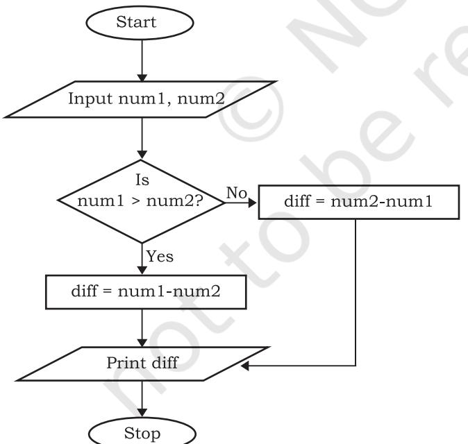
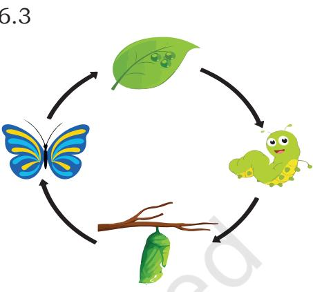
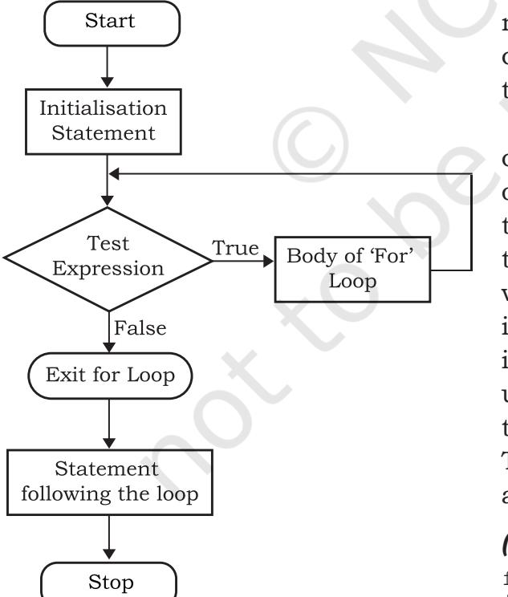
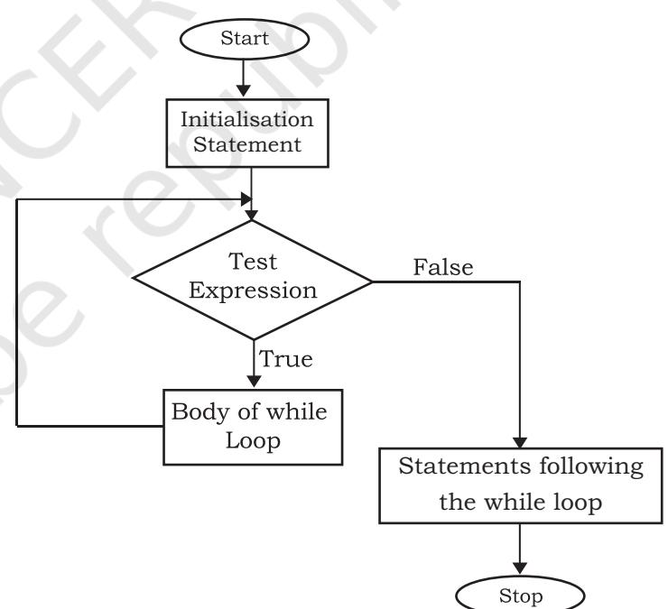
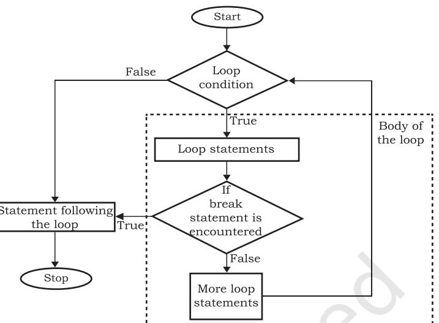
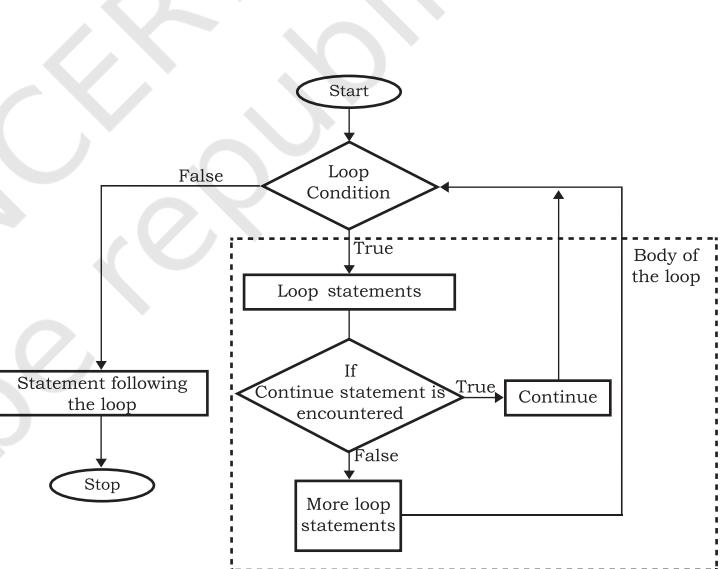

**Chapter 6**


## **6.1 Introduction**

In Figure 6.1, we see a bus carrying the children to school. There is only one way to reach the school. The driver has no choice, but to follow the road one milestone after another to reach the school. We learnt in Chapter 5 that this is the concept of sequence, where Python executes one statement after another from beginning to the end of the program. These are the kind of programs we have been writing till now.

*"Don't you hate code that's not properly indented? Making it [indenting] part of the syntax guarantees that all code is properly indented."* 

*– G. van Rossum*


*Figure 6.1: Bus carrying students to school*

Let us consider a program 6-1 that executes in sequence, that is, statements are executed in an order in which they are written.

The order of execution of the statements in a program is known as flow of control. The flow of control can be implemented using control structures. Python supports two types of control structures—selection and repetition.

#### *In this chapter*

- » *Introduction to Flow of Control*
- » *Selection*
- » *Indentation*
- » *Repetition*
- » *Break and Continue Statements*
- » *Nested Loops*

Ch 6.indd 121 08-Apr-19 12:37:51 PM

## Program 6-1 Program to print the difference of two numbers.

#Program 6-1

```
#Program to print the difference of two input numbers
num1 = int(input("Enter first number: "))
num2 = int(input("Enter second number: "))
diff = num1 - num2
print("The difference of",num1,"and",num2,"is",diff)
```
## Output:

```
Enter first number 5
Enter second number 7
The difference of 5 and 7 is -2
```
## **6.2 Selection**

Now suppose we have `10 to buy a pen. On visiting the stationery shop, there are a variety of pens priced at `10 each. Here, we have to decide which pen to buy. Similarly, when we use the direction services of a digital



*Figure 6.2: Flow chart depicting decision making*

map, to reach from one place to another, we notice that sometimes it shows more than one path like the least crowded path, shortest distance path, etc. We decide the path as per our priority. A decision involves selecting from one of the two or more possible options. In programming, this concept of decision making or selection is implemented with the help of if..else statement.

Now, suppose we want to display the positive difference of the two numbers num1 and num2 given at program 6-1. For that, we need to modify our approach. Look at the flowchart shown in Figure 6.2 that subtracts the smaller number from the bigger

number so that we always get a positive difference. This selection is based upon the values that are input for the two numbers num1 and num2.

Ch 6.indd 122 08-Apr-19 12:37:52 PM

```
The syntax of if statement is:
if condition:
```
statement(s)

In the following example, if the age entered by the user is greater than 18, then print that the user is eligible to vote. If the condition is true, then the indented statement(s) are executed. The indentation implies that its execution is dependent on the condition. There is no limit on the number of statements that can appear as a block under the if statement.

```
Example 6.1
```

```
age = int(input("Enter your age "))
if age >= 18:
 print("Eligible to vote")
```
A variant of if statement called if..else statement allows us to write two alternative paths and the control condition determines which path gets executed. The syntax for if..else statement is as follows.

```
if condition:
 statement(s)
else:
```
statement(s)

Let us now modify the example on voting with the condition that if the age entered by the user is greater than 18, then to display that the user is eligible to vote. Otherwise display that the user is not eligible to vote.

```
age = int(input("Enter your age: "))
if age >= 18:
 print("Eligible to vote")
else:
 print("Not eligible to vote")
```
Now let us use the same concept to modify program 6-1, so that it always gives a positive difference as the output. From the flow chart in Figure 6.2, it is clear that we need to decide whether num1 > num2 or not and take action accordingly.

We have to specify two blocks of statements since num1 can be greater than num2 or vice-versa as shown in program 6-2.

Many a times there are situations that require multiple conditions to be checked and it may lead to many alternatives. In such cases we can chain the conditions using if..elif (elif means else..if).

**Notes**

Ch 6.indd 123 08-Apr-19 12:37:52 PM

## Program 6-2 Program to print the positive difference of two numbers. #Program 6-2 #Program to print the positive difference of two numbers num1 = int(input("Enter first number: ")) num2 = int(input("Enter second number: "))

if num1 > num2:

diff = num1 - num2

else:

 diff = num2 - num1 print("The difference of",num1,"and",num2,"is",diff)

### Output:

```
Enter first number: 5
Enter second number: 6
The difference of 5 and 6 is 1
```
The syntax for a selection structure using elif is as shown below.

```
if condition:
 statement(s)
elif condition:
 statement(s)
elif condition:
 statement(s)
else:
```
statement(s)

*Example 6.2* Check whether a number is positive, negative, or zero.

```
number = int(input("Enter a number: ")
if number > 0:
 print("Number is positive")
elif number < 0:
 print("Number is negative")
else:
```
print("Number is zero")

*Example 6.3* Display the appropriate message as per the colour of signal at the road crossing.

```
signal = input("Enter the colour: ")
if signal == "red" or signal == "RED": 
 print("STOP")
elif signal == "orange" or signal == 
"ORANGE":
```
Ch 6.indd 124 08-Apr-19 12:37:52 PM

```
 print("Be Slow")
elif signal == "green" or signal == "GREEN": 
 print("Go!")
```
Number of elif is dependent on the number of conditions to be checked. If the first condition is false, then the next condition is checked, and so on. If one of the conditions is true, then the corresponding indented block executes, and the if statement terminates.

Let us write a program to create a simple calculator to perform basic arithmetic operations on two numbers. The program should do the following:

- Accept two numbers from the user.
- Ask user to input any of the operator (+, -, *, /). An error message is displayed if the user enters anything else.
- Display only positive difference in case of the operator "-".
- Display a message "Please enter a value other than 0" if the user enters the second number as 0 and operator '/' is entered.

#### Program 6-3 Write a program to create a simple calculator performing only four basic operations.

```
#Program to create a four function calculator
result = 0
val1 = float(input("Enter value 1: "))
val2 = float(input("Enter value 2: "))
op = input("Enter any one of the operator (+,-,*,/): ")
if op == "+":
 result = val1 + val2
elif op == "-":
 if val1 > val2:
 result = val1 - val2
 else:
 result = val2 - val1
elif op == "*":
 result = val1 * val2
elif op == "/":
 if val2 == 0:
 print("Error! Division by zero is not allowed. Program 
terminated")
 else:
 result = val1/val2
else:
 print("Wrong input,program terminated")
print("The result is ",result)
```
Ch 6.indd 125 08-Apr-19 12:37:52 PM

#### Output:

```
Enter value 1: 84
Enter value 2: 4
Enter any one of the operator (+,-,*,/): /
The result is 21.0
```
In the program, for the operators "-" and "/", there exists an if..else condition within the elif block. This is called nested if. We can have many levels of nesting inside if..else statements.

## **6.3 Indentation**

In most programming languages, the statements within a block are put inside curly brackets. However, Python uses indentation for block as well as for nested block structures. Leading whitespace (spaces and tabs) at the beginning of a statement is called indentation. In Python, the same level of indentation associates statements into a single block of code. The interpreter checks indentation levels very strictly and throws up syntax errors if indentation is not correct. It is a common practice to use a single tab for each level of indentation.

In the program 6-4, the if-else statement has two blocks of statements and the statements in each block are indented with the same amount of spaces or tabs.

```
Program 6-4 Program to find the larger of the two
             pre-specified numbers.
```

```
#Program 6-4
#Program to find larger of the two numbers
num1 = 5
num2 = 6
if num1 > num2: #Block1
 print("first number is larger") 
      print("Bye")
else: #Block2
      print("second number is larger") 
      print("Bye Bye")
```
#### Output:

second number is larger Bye Bye

Ch 6.indd 126 08-Apr-19 12:37:52 PM

## **6.4 Repetition**

Often, we repeat a tasks, for example, payment of electricity bill, which is done every month. Figure 6.3 shows the life cycle of butterfly that involves four stages, i.e., a butterfly lays eggs, turns into a caterpillar, becomes a pupa, and finally matures as a butterfly. The cycle starts again with laying of eggs by the butterfly.

This kind of repetition is also called iteration. Repetition of a set of statements in a program is made possible using looping constructs. To understand further, let us look at the program 6-5. *Figure 6.3: Iterative process* 

## Program 6-5 Write a program to print the first five natural numbers.

```
#Program 6-5
```

```
#Print first five natural numbers
  print(1)
  print(2)
  print(3)
  print(4)
  print(5)
Output: 
  1
  2
  3
  4
```
5 What should we do if we are asked to print the first 100,000 natural numbers? Writing 100,000 print statements would not be an efficient solution. It would be tedious and not the best way to do the task. Writing a program having a loop or repetition is a better solution. The program logic is given below:

- 1. Take a variable, say count, and set its value to 1.
- 2. Print the value of count.
- 3. Increment the variable (count += 1).



<sup><</sup>i>occurring in nature

Ch 6.indd 127 08-Apr-19 12:37:52 PM

- 4. Repeat steps 2 and 3 as long as count has a value less than or equal to 100,000 (count <= 100,000).
Looping constructs provide the facility to execute a set of statements in a program repetitively, based on a condition. The statements in a loop are executed again and again as long as particular logical condition remains true. This condition is checked based on the value of a variable called the loop's control variable. When the condition becomes false, the loop terminates. It is the responsibility of the programmer to ensure that this condition eventually does become false so that there is an exit condition and it does not become an infinite loop. For example, if we did not set the condition count <= 100000, the program would have never stopped. There are two looping constructs in Python - for and while.

#### **6.4.1 The 'For' Loop**

The for statement is used to iterate over a range of values or a sequence. The for loop is executed for each of the items in the range. These values can be either



*Figure 6.4: Flow chart of for loop*

numeric, or, as we shall see in later chapters, they can be elements of a data type like a string, list, or tuple.

With every iteration of the loop, the control variable checks whether each of the values in the range have been traversed or not. When all the items in the range are exhausted, the statements within loop are not executed; the control is then transferred to the statement immediately following the for loop. While using for loop, it is known in advance the number of times the loop will execute. The flowchart depicting the execution of a for loop is given in Figure 6.4.

#### *(A) Syntax of the For Loop*

for <control-variable> in <sequence/ items in range>:

> <statements inside body of the loop>

Ch 6.indd 128 08-Apr-19 12:37:52 PM

```
Program 6-6 Program to print the characters in the 
             string 'PYTHON' using for loop.
   #Program 6-6
   #Print the characters in word PYTHON using for loop
   for letter in 'PYTHON':
    print(letter)
 Output:
   P
   Y
   T
   H
   O
   N
Program 6-7 Program to print the numbers in a given 
             sequence using for loop.
   #Program 6-7
   #Print the given sequence of numbers using for loop
   count = [10,20,30,40,50]
   for num in count:
    print(num)
 Output:
   10
   20
   30
   40
   50
Program 6-8 Program to print even numbers in a given 
             sequence using for loop.
   #Program 6-8
   #Print even numbers in the given sequence
   numbers = [1,2,3,4,5,6,7,8,9,10]
   for num in numbers:
    if (num % 2) == 0:
    print(num,'is an even Number')
 Output:
   2 is an even Number
```

```
4 is an even Number
```
Ch 6.indd 129 08-Apr-19 12:37:52 PM

- 6 is an even Number
8 is an even Number

- 10 is an even Number
*Note:* Body of the loop is indented with respect to the for statement.

#### *(B) The Range() Function*

The range() is a built-in function in Python. Syntax of range() function is:

```
 range([start], stop[, step])
```
It is used to create a list containing a sequence of integers from the given start value upto stop value (excluding stop value), with a difference of the given step value. We will learn about functions in the next chapter. To begin with, simply remember that function takes parameters to work on. In function range(), start, stop and step are parameters.

The start and step parameters are optional. If start value is not specified, by default the list starts from 0. If step is also not specified, by default the value increases by 1 in each iteration. All parameters of range() function must be integers. The step parameter can be a positive or a negative integer excluding zero.

#### *Example 6.4*

```
#start and step not specified
>>> list(range(10)) 
[0, 1, 2, 3, 4, 5, 6, 7, 8, 9]
#default step value is 1
>>> list(range(2, 10)) 
[2, 3, 4, 5, 6, 7, 8, 9] 
#step value is 5
>>> list(range(0, 30, 5)) 
[0, 5, 10, 15, 20, 25] 
#step value is -1. Hence, decreasing 
#sequence is generated
>>> list (range (0, -9, -1)) 
[0, -1, -2, -3, -4, -5, -6, -7, -8]
```
The function range() is often used in for loops for generating a sequence of numbers.

Ch 6.indd 130 11/10/2021 11:00:33 AM

# Program 6-9 Program to print the multiples of 10 for numbers in a given range. #Program 6-9 #Print multiples of 10 for numbers in a given range for num in range(5): if num > 0: print(num * 10) Output: 10

20 30

40

## **6.4.2 The 'While' Loop**

The while statement executes a block of code repeatedly as long as the control condition of the loop is true. The

control condition of the while loop is executed before any statement inside the loop is executed. After each iteration, the control condition is tested again and the loop continues as long as the condition remains true. When this condition becomes false, the statements in the body of loop are not executed and the control is transferred to the statement immediately following the body of while loop. If the condition of the while loop is initially false, the body is not executed even once.

The statements within the body of the while loop must ensure that the condition



*Figure 6.5: Flow chart of while Loop*

eventually becomes false; otherwise the loop will become an infinite loop, leading to a logical error in the program. The flowchart of while loop is shown in Figure 6.5. Syntax of while Loop

```
while test_condition:
  body of while
```
Ch 6.indd 131 08-Apr-19 12:37:53 PM

## Program 6-10 Program to print first 5 natural numbers using while loop.

```
#Program 6-10
#Print first 5 natural numbers using while loop
count = 1
while count <= 5:
 print(count)
 count += 1
```
### Output:

```
1
2
3
4
5
```
## Program 6-11 Program to find the factors of a whole number using while loop.

```
#Program 6-11
  #Find the factors of a number using while loop
  num = int(input("Enter a number to find its factor: "))
  print (1, end=' ') #1 is a factor of every number
  factor = 2 
  while factor <= num/2 :
   if num % factor == 0:
  #the optional parameter end of print function specifies the delimeter 
  #blank space(' ') to print next value on same line 
   print(factor, end=' ') 
   factor += 1
  print (num, end=' ') #every number is a factor of itself
Output:
  Enter a number to find its factors : 6
```

```
1 2 3 6
```
*Note:* Body of the loop is indented with respect to the while statement. Similarly, the statements within if are indented with respect to positioning of if statement.

## **6.5 Break and Continue Statement**

Looping constructs allow programmers to repeat tasks efficiently. In certain situations, when some particular condition occurs, we may want to exit from a loop (come

Ch 6.indd 132 08-Apr-19 12:37:53 PM

out of the loop forever) or skip some statements of the loop before continuing further in the loop. These requirements can be achieved by using break and continue statements, respectively. Python provides these statements as a tool to give more flexibility to the programmer to control the flow of execution of a program.



#### **6.5.1 Break Statement**

The break statement alters the normal flow of execution as it terminates the current

*Figure 6.5: Flowchart for using break statement in loop*

loop and resumes execution of the statement following that loop.

#### Program 6-12 Program to demonstrate use of break statement.

```
#Program 6-12
 #Program to demonstrate the use of break statement in loop
 num = 0
 for num in range(10):
  num = num + 1
  if num == 8:
  break
  print('Num has value ' + str(num))
 print('Encountered break!! Out of loop')
Output:
 Num has value 1
 Num has value 2
```
Num has value 3 Num has value 4 Num has value 5 Num has value 6 Num has value 7

Encountered break!! Out of loop

*Note*: When value of num becomes 8, the break statement is executed and the for loop terminates.

Ch 6.indd 133 08-Apr-19 12:37:53 PM

```
Program 6-13 Find the sum of all the positive numbers 
            entered by the user. As soon as the user 
            enters a negative number, stop taking 
            in any further input from the user and 
            display the sum.
   #Program 6-13
   #Find the sum of all the positive numbers entered by the user 
   #till the user enters a negative number. 
   entry = 0
   sum1 = 0
   print("Enter numbers to find their sum, negative number ends the 
   loop:")
   while True: 
   #int() typecasts string to integer 
    entry = int(input())
    if (entry < 0):
    break
    sum1 += entry
   print("Sum =", sum1)
 Output:
   Enter numbers to find their sum, negative number ends the loop:
   3
   4
   5
   -1
   Sum = 12
Program 6-14 Program to check if the input number is 
             prime or not.
   #Program 6-14
   #Write a Python program to check if a given number is prime or not.
   num = int(input("Enter the number to be checked: "))
   flag = 0 #presume num is a prime number
   if num > 1 :
    for i in range(2, int(num / 2)):
    if (num % i == 0):
    flag = 1 #num is a not prime number
    break #no need to check any further
    if flag == 1:
    print(num , "is not a prime number")
    else:
    print(num , "is a prime number")
```
Ch 6.indd 134 11/10/2021 4:44:01 PM

```
else :
   print("Entered number is <= 1, execute again!")
Output 1:
  Enter the number to be checked: 20
  20 is not a prime number
Output 2:
  Enter the number to check: 19
  19 is a prime number
Output 3:
  Enter the number to check: 2
  2 is a prime number
Output 4:
```
Enter the number to check: 1 Entered number is <= 1, execute again!

#### **6.5.2 Continue Statement**

When a continue statement is encountered, the control skips the execution of remaining statements inside the body of the loop for the current iteration and jumps to the beginning of the loop for the next iteration. If the loop's condition is still true, the loop is entered again, else the control is transferred to the statement immediately following the loop.Figure 6.7 shows the flowchart of continue statement. *Figure 6.6: Flow chart of continue statement*



#### Program 6-15 Program to demonstrate the use of continue statement.

```
#Program 6-15
#Prints values from 0 to 6 except 3
num = 0
for num in range(6):
 num = num + 1
 if num == 3:
```
Ch 6.indd 135 08-Apr-19 12:37:53 PM

```
 continue
 print('Num has value ' + str(num))
print('End of loop')
```
#### Output:

```
Num has value 1
Num has value 2
Num has value 4
Num has value 5
Num has value 6
End of loop
```
Observe that the value 3 is not printed in the output, but the loop continues after the continue statement to print other values till the for loop terminates.

## **6.6 Nested Loops**

A loop may contain another loop inside it. A loop inside another loop is called a nested loop.

```
Program 6-16 Program to demonstrate working of 
             nested for loops.
```

```
#Program 6-16
#Demonstrate working of nested for loops
for var1 in range(3):
 print( "Iteration " + str(var1 + 1) + " of outer loop")
 for var2 in range(2): #nested loop
 print(var2 + 1)
 print("Out of inner loop")
print("Out of outer loop")
```
Output:

```
Iteration 1 of outer loop
1
2
Out of inner loop
Iteration 2 of outer loop
1
2
Out of inner loop
Iteration 3 of outer loop
1
2
Out of inner loop
Out of outer loop
```
Ch 6.indd 136 08-Apr-19 12:37:53 PM

Python does not impose any restriction on how many loops can be nested inside a loop or on the levels of nesting. Any type of loop (for/while) may be nested within another loop (for/while).

#### Program 6-17 Program to print the pattern for a number input by the user.

```
#Program 6-17
   #Program to print the pattern for a number input by the user
   #The output pattern to be generated is
   #1
   #1 2
   #1 2 3
   #1 2 3 4
   #1 2 3 4 5
   num = int(input("Enter a number to generate its pattern = "))
   for i in range(1,num + 1):
    for j in range(1,i + 1):
    print(j, end = " ")
    print()
 Output:
   Enter a number to generate its pattern = 5
   1 
   1 2 
   1 2 3 
   1 2 3 4 
   1 2 3 4 5
Program 6-18 Program to find prime numbers between 
            2 to 50 using nested for loops.
   #Program 6-18
   #Use of nested loops to find the prime numbers between 2 to 50
   num = 2
   for i in range(2, 50):
    j= 2
    while ( j <= (i/2)):
    if (i % j == 0): #factor found
    break #break out of while loop
    j += 1
    if ( j > i/j) : #no factor found
```
2024-25

Ch 6.indd 137 21-May-19 12:17:09 PM

print ( i, "is a prime number")

```
print ("Bye Bye!!")
```
#### Output:

2 is a prime number 3 is a prime number 5 is a prime number 7 is a prime number 11 is a prime number 13 is a prime number 17 is a prime number 19 is a prime number 23 is a prime number 29 is a prime number 31 is a prime number 37 is a prime number 41 is a prime number 43 is a prime number 47 is a prime number Bye Bye!!

## Program 6-19 Write a program to calculate the factorial of a given number.

```
#Program 6-19
  #The following program uses a for loop nested inside an if..else 
  #block to calculate the factorial of a given number
  num = int(input("Enter a number: "))
  fact = 1
  # check if the number is negative, positive or zero
  if num < 0:
   print("Sorry, factorial does not exist for negative numbers")
  elif num == 0:
   print("The factorial of 0 is 1")
  else:
   for i in range(1, num + 1):
   fact = fact * i
   print("factorial of ", num, " is ", fact)
Output:
  Enter a number: 5
  Factorial of 5 is 120
```
Ch 6.indd 138 08-Apr-19 12:37:53 PM

**Notes**

## **Summary**

- The if statement is used for selection or decision making.
- The looping constructs while and for allow sections of code to be executed repeatedly under some condition.
- for statement iterates over a range of values or a sequence.
- The statements within the body of for loop are executed till the range of values is exhausted.
- The statements within the body of a while are executed over and over until the condition of the while is false.
- If the condition of the while loop is initially false, the body is not executed even once.
- The statements within the body of the while loop must ensure that the condition eventually becomes false; otherwise, the loop will become an infinite loop, leading to a logical error in the program.
- The break statement immediately exits a loop, skipping the rest of the loop's body. Execution continues with the statement immediately following the body of the loop. When a continue statement is encountered, the control jumps to the beginning of the loop for the next iteration.
- A loop contained within another loop is called a nested loop.

## **Exercise**

- 1. What is the difference between else and elif construct of if statement?
- 2. What is the purpose of range() function? Give one example.
- 3. Differentiate between break and continue statements using examples.
- 4. What is an infinite loop? Give one example.
- 5. Find the output of the following program segments:

(i) a = 110 while a > 100: print(a) a -= 2

Ch 6.indd 139 08-Apr-19 12:37:53 PM

```
140 Computer Science – Class xi
                           (ii) for i in range(20,30,2):
                                print(i)
                          (iii) country = 'INDIA'
                               for i in country:
                                print (i)
                          (iv) i = 0; sum = 0
                               while i < 9:
                                if i % 4 == 0:
                                sum = sum + i
                                i = i + 2
                               print (sum)
                           (v) for x in range(1,4):
                                for y in range(2,5):
                                if x * y > 10:
                                break
                                print (x * y)
                          (vi) var = 7 
                               while var > 0: 
                                print ('Current variable value: ', var)
                                var = var -1
                                if var == 3:
                                break
                                else:
                                if var == 6:
                                var = var -1
                                continue
                                print ("Good bye!")
                     Programming Exercises
                      1. Write a program that takes the name and age of the 
                         user as input and displays a message whether the 
                         user is eligible to apply for a driving license or not. 
                         (the eligible age is 18 years).
                      2. Write a function to print the table of a given number. 
                         The number has to be entered by the user.
                      3. Write a program that prints minimum and maximum 
                         of five numbers entered by the user.
                      4. Write a program to check if the year entered by the 
                         user is a leap year or not.
                      5. Write a program to generate the sequence: –5, 10, 
                         –15, 20, –25….. upto n, where n is an integer input 
                         by the user.
                      6. Write a program to find the sum of 1+ 1/8 + 
                         1/27......1/n3, where n is the number input by the 
                         user.
     Notes
```
Ch 6.indd 140 08-Apr-19 12:37:53 PM

- 
- 7. Write a program to find the sum of digits of an integer number, input by the user.
- 8. Write a function that checks whether an input number is a palindrome or not.

[*Note*: A number or a string is called palindrome if it appears same when written in reverse order also. For example, 12321 is a palindrome while 123421 is not a palindrome]

- 9. Write a program to print the following patterns:

| i) | * | ii) | 1 | * * * | 2 1 2 |  |
| --- | --- | --- | --- | --- | --- | --- |
| * * * * * | 3 2 1 2 3 | * * * | 4 3 2 1 2 3 4 |  |  |  |
| * | 5 4 3 2 1 2 3 4 5 |  |  |  |  |  |
| iii) | 1 2 3 4 5 | iv) | * | 1 2 3 4 | * | * |
| 1 2 3 | * | * | 1 2 | * | * |  |
| 1 | * |  |  |  |  |  |

- 10. Write a program to find the grade of a student when grades are allocated as given in the table below.

| Percentage of Marks | Grade |
| --- | --- |
| Above 90% | A |
| 80% to 90% | B |
| 70% to 80% | C |
| 60% to 70% | D |
| Below 60% | E |

 Percentage of the marks obtained by the student is input to the program.

## **Case Study-based Questions**

Let us add more functionality to our SMIS developed in Chapter 5.

6.1 Write a menu driven program that has options to

- accept the marks of the student in five major subjects in Class X and display the same.
- calculate the sum of the marks of all subjects. Divide the total marks by number of subjects (i.e. 5), calculate percentage = total marks/5 and display the percentage.

**Notes**

Ch 6.indd 141 08-Apr-19 12:37:53 PM

**Notes**

- Find the grade of the student as per the following criteria:

| Criteria | Grade |
| --- | --- |
| percentage > 85 | A |
| percentage < 85 && percentage >= 75 | B |
| percentage < 75 && percentage >= 50 | C |
| percentage > 30 && percentage <= 50 | D |
| percentage <30 | Reappear |

Let's peer review the case studies of others based on the parameters given under "DOCUMENTATION TIPS" at the end of Chapter 5 and provide a feedback to them.

Ch 6.indd 142 08-Apr-19 12:37:53 PM

