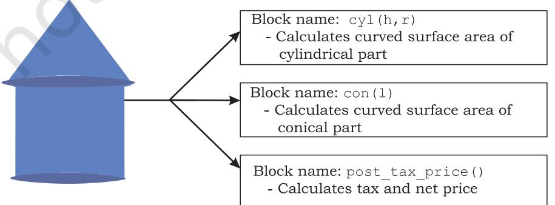
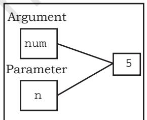
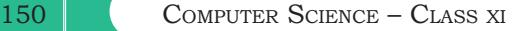
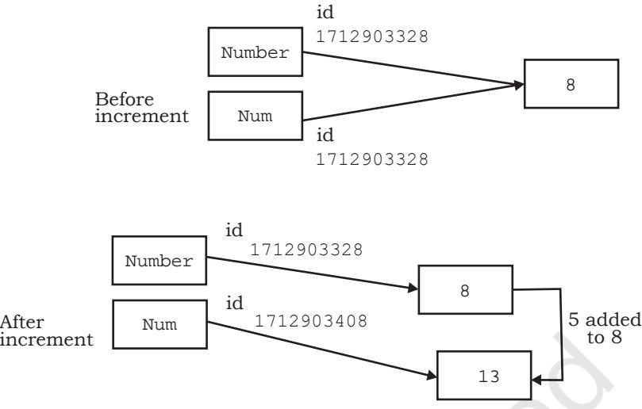
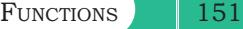
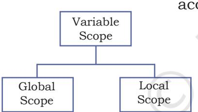
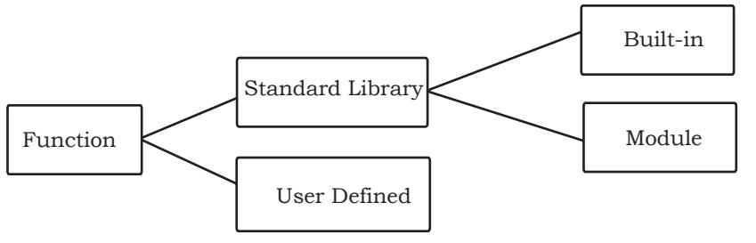
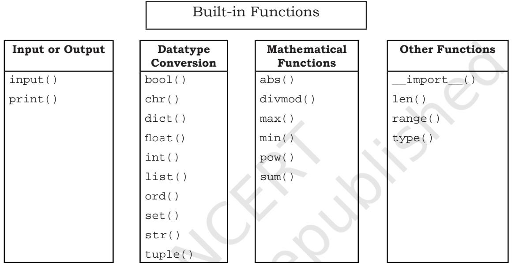
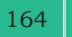
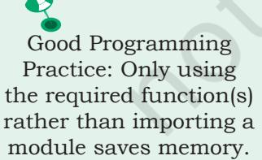

# **Chapter 7**


### **7.1 Introduction**

Till now we have written some programs and might have realised that as the problem gets complex, the number of lines in a program increase, which makes the program look bulky and difficult to manage. Consider the following problem statement:

There is a company that manufactures tents as per user's requirements. The shape of the tent is cylindrical surmounted by a conical top.


*"Once you succeed in writing the programs for [these] complicated algorithms, they usually run extremely fast. The computer doesn't need to understand the algorithm, its task is only to run the programs."*

*– R. Tarjan*


*Figure 7.1: Shape of a tent*

The company performs the following tasks to fix the selling price of each tent.

- 1. Accept user requirements for the tent, such as
	- a) height
	- b) radius
	- c) slant height of the conical part
- 2. Calculate the area of the canvas used
- 3. Calculate the cost of the canvas used for making the tent
- 4. Calculate the net payable amount by the customer that is inclusive of the 18% tax

The company has created a computer program for quick and accurate calculation for the payable amount as shown in program 7-1.

### *In this chapter*

- » *Introduction to Functions*
- » *User Defined Functions*
- » *Scope of a Variable*
- » *Python Standard Library*

Ch 7.indd 143 08-Apr-19 12:23:12 PM

```
Program 7-1 Program to calculate the payable amount 
             for the tent.
   #Program 7-1
   #Program to calculate the payable amount for the tent without 
   #functions
   print( "Enter values for the cylindrical part of the tent in 
   meters\n")
   h = float(input("Enter height of the cylindrical part: "))
   r = float(input("Enter radius: "))
   l = float(input("Enter the slant height of the conical part in 
   meters: "))
   csa_conical = 3.14*r*l #Area of conical part
   csa_cylindrical = 2*3.14*r*h #Area of cylindrical part
   # Calculate area of the canvas used for making the tent
   canvas_area = csa_conical + csa_cylindrical
   print("The area of the canvas is",canvas_area,"m^2")
   #Calculate cost of the canvas
   unit_price = float(input("Enter the cost of 1 m^2 canvas: "))
   total_cost= unit_price * canvas_area
   print("The total cost of canvas = ",total_cost)
   #Add tax to the total cost to calculate net amount payable by the 
   #customer
   tax = 0.18 * total_cost;
   net_price = total_cost + tax
   print("Net amount payable = ",net_price)
```
Another approach to solve the above problem is to divide the program into different blocks of code as shown in Figure 7.2.



*Figure 7.2: Calculation of the cost of the tent*

Ch 7.indd 144 08-Apr-19 12:23:12 PM

The process of dividing a computer program into separate independent blocks of code or separate sub-problems with different names and specific functionalities is known as modular programming. In this chapter, we will learn about the benefits of this approach.

### **7.2 Functions**

In programming, the use of function is one of the means to achieve modularity and reusability. Function can be defined as a named group of instructions that accomplish a specific task when it is invoked. Once defined, a function can be called repeatedly from different places of the program without writing all the codes of that function everytime, or it can be called from inside another function, by simply writing the name of the function and passing the required parameters, if any (Section 7.3). The programmer can define as many functions as desired while writing the code. The program 7-1 is rewritten using user defined functions as shown in program 7-2.

### Program 7-2 Program to calculate the payable amount for the tent using user defined functions.

```
#Program 7-2
#Program to calculate the cost of tent
#function definition 
def cyl(h,r):
 area_cyl = 2*3.14*r*h #Area of cylindrical part
 return(area_cyl)
#function definition
def con(l,r):
 area_con = 3.14*r*l #Area of conical part
 return(area_con)
#function definition
def post_tax_price(cost): #compute payable amount for the tent
 tax = 0.18 * cost;
 net_price = cost + tax
 return(net_price)
print("Enter values of cylindrical part of the tent in meters:")
h = float(input("Height: "))
r = float(input("Radius: "))
```
Ch 7.indd 145 08-Apr-19 12:23:12 PM

cost))

146 Computer Science – Class xi

```
csa_cyl = cyl(h,r) #function call
```

```
l = float(input("Enter slant height of the conical area in meters: "))
csa_con = con(l,r) #function call
```

```
#Calculate area of the canvas used for making the tent
canvas_area = csa_cyl + csa_con
print("Area of canvas = ",canvas_area," m^2")
```

```
#Calculate cost of canvas
```

```
unit_price = float(input("Enter cost of 1 m^2 canvas in rupees: "))
total_cost = unit_price * canvas_area
```

```
print("Total cost of canvas before tax = ",total_cost)
```

```
print("Net amount payable (including tax) = ",post_tax_price(total_
```

```
If we compare program 7-1 and 7-2, it is evident that 
program 7-2 looks more organised and easier to read.
```
### **7.2.1 The Advantages of Function**

Suppose in further the company decides to design another type of tent whose base is rectangular, while the upper part remains the same. In such a scenario, some part of the existing code can be reused by calling the function con(l,r). If the company develops other products or provides services, and where 18% tax rate is to be applied, the programmer can use the function post_tax_price(cost)directly.

Thus, following are the advantages of using functions in a program:

- Increases readability, particularly for longer code as by using functions, the program is better organised and easy to understand.
- Reduces code length as same code is not required to be written at multiple places in a program. This also makes debugging easier.
- Increases reusability, as function can be called from another function or another program. Thus, we can reuse or build upon already defined functions and avoid repetitions of writing the same piece of code.
- Work can be easily divided among team members and completed in parallel.

### **7.3 User Defined Functions**

Taking advantage of reusability feature of functions, there is a large number of functions already available

Ch 7.indd 146 08-Apr-19 12:23:13 PM

in Python under standard library (section 7.5). We can directly call these functions in our program without defining them. However, in addition to the standard library functions, we can define our own functions while writing the program. Such functions are called user defined functions. Thus, a function defined to achieve some task as per the programmer's requirement is called a user defined function.

### **7.3.1 Creating User Defined Function**

A function definition begins with def (short for define). The syntax for creating a user defined function is as follows:

- The items enclosed in "[ ]" are called parameters and they are optional. Hence, a function may or may not have parameters. Also, a function may or may not return a value.
- Function header always ends with a colon (:).
- Function name should be unique. Rules for naming identifiers also applies for function naming.
- The statements outside the function indentation are not considered as part of the function.

### Program 7-3 Write a user defined function to add 2 numbers and display their sum.

```
#Program 7-3
#Function to add two numbers
#The requirements are listed below:
  #1. We need to accept 2 numbers from the user. 
  #2. Calculate their sum
  #3. Display the sum.
#function definition
def addnum():
 fnum = int(input("Enter first number: "))
 snum = int(input("Enter second number: "))
 sum = fnum + snum
 print("The sum of ",fnum,"and ",snum,"is ",sum)
 
#function call
addnum()
```
Ch 7.indd 147 15-Jun-21 11:16:13 AM

In order to execute the function addnum(), we need to call it. The function can be called in the program by writing function name followed by () as shown in the last line of program 7-3.

Output:

```
Enter first number: 5
Enter second number: 6
The sum of 5 and 6 is 11
```
### **7.3.2 Arguments and Parameters**

In the above example, the numbers were accepted from the user within the function itself, but it is also possible for a user defined function to receive values at the time of being called. An argument is a value passed to the function during the function call which is received in corresponding parameter defined in function header.

```
Program 7-4 Write a program using a user defined 
             function that displays sum of first n 
             natural numbers, where n is passed as 
             an argument. 
   #Program 7-4
   #Program to find the sum of first n natural numbers
   #The requirements are:
     #1. n be passed as an argument
     #2. Calculate sum of first n natural numbers 
     #3. Display the sum
   #function header
   def sumSquares(n): #n is the parameter
    sum = 0
    for i in range(1,n+1): 
    sum = sum + i
    print("The sum of first",n,"natural numbers is: ",sum)
    
    num = int(input("Enter the value for n: "))
    #num is an argument referring to the value input by the user
    sumSquares(num) #function call
```


Let us assume that the user has input 5 during the execution of the program 7-4. So, num refers to the value 5. It is then used as an argument in the function:

*Figure 7.3: Both argument and parameter refers to the same value*

sumSquares(num)

Ch 7.indd 148 08-Apr-19 12:23:13 PM

Since the function is called, the control is transferred to execute the function

def sumSquares(n):

where parameter n also refers to the value 5 which num is referring to as shown in Figure 7.3.

Since both num and n are referring to the same value, they are bound to have the same identity. We can use the id() function to find the identity of the object that the argument and parameter are referring to. Let us understand this with the help of the following example.

Program 7-5 Write a program using user defined function that accepts an integer and increments the value by 5. Also display the id of argument (before function call), id of parameter before increment and after increment.

```
#Program 7-5
  #Function to add 5 to a user input number
  #The requirements are listed below:
    #1. Display the id()of argument before function call.
    #2. The function should have one parameter to accept the argument
    #3. Display the value and id() of the parameter.
    #4. Add 5 to the parameter
    #5. Display the new value and id()of the parameter to check
   #whether the parameter is assigned a new memory location or 
   #not.
  def incrValue(num): 
   #id of Num before increment
   print("Parameter num has value:",num,"\nid =",id(num)) 
   num = num + 5 
   #id of Num after increment
   print("num incremented by 5 is",num,"\nNow id is ",id(num)) 
  number = int(input("Enter a number: "))
  print("id of argument number is:",id(number)) #id of Number
  incrValue(number)
Output:
  Enter a number: 8
  id of argument number is: 1712903328
  Parameter num has value: 8 
                                                        number and num 
                                                        have the same id
```
Let us understand the above output through illustration (see Figure 7.4):

id = 1712903328

Now id is 1712903408

num incremented by 5 is 13

Ch 7.indd 149 08-Apr-19 12:23:13 PM

The id of Num has changed.





*Figure 7.4: ID of argument and parameter before and after increment*

Both argument and parameter can have the same name as shown in program 7-6.

```
Program 7-6 Write a program using a user defined 
              function myMean() to calculate the mean 
              of floating values stored in a list.
```

```
#Program 7-6
#Function to calculate mean
#The requirements are listed below:
 #1. The function should have 1 parameter (list containing floating 
 #point values)
 #2. To calculate mean by adding all the numbers and dividing by 
 #total number of elements
 
def myMean(myList): #function to compute means of values in list 
 total = 0
 count = 0 
 for i in myList:
 total = total + i #Adds each element i to total
 count = count + 1 #Counts the number of elements
 mean = total/count #mean is calculated
 print("The calculated mean is:",mean) 
myList = [1.3,2.4,3.5,6.9]
#Function call with list "myList" as an argument
myMean(myList)
```
### Output:

The calculated mean is: 3.5250000000000004

- Program 7-7 Write a program using a user defined function calcFact() to calculate and display the factorial of a number num passed as an argument.
Ch 7.indd 150 08-Apr-19 12:23:13 PM



```
#Program 7-7
  #Function to calculate factorial
  #The requirements are listed below:
    #1. The function should accept one integer argument from user.
    #2. Calculate factorial. For example:
    #3. Display factorial
  def calcFact(num):
   fact = 1
   for i in range(num,0,-1):
   fact = fact * i
   print("Factorial of",num,"is",fact)
   
  num = int(input("Enter the number: "))
  calcFact(num)
Output:
```
Enter the number: 5 Factorial of 5 is 120

*Note*: Since multiplication is commutative 5! = 5*4*3*2*1 = 1*2*3*4*5

### *(A) String as Parameters*

In programs 7-5 to 7-7, the arguments passed are of numeric type only. However, in some programs, user may need to pass string values as an argument, as shown in program 7-8.

```
Program 7-8 Write a program using a user defined 
              function that accepts the first name and 
              lastname as arguments, concatenate 
              them to get full name and displays the 
              output as:
```

```
Hello full name
```
For example, if first name is Gyan and lastname is Vardhan, the output should be:

Hello Gyan Vardhan

```
#Program 7-8
```
#Function to display full name

#The requirements are listed below:

- #1. The function should have 2 parameters to accept first name and #last name.
- #2. Concatenate names using + operator with a space between first #name and last name.
	- #3. Display full name.

Ch 7.indd 151 08-Apr-19 12:23:13 PM

```
def fullname(first,last): 
#+ operator is used to concatenate strings
 fullname = first + " " + last 
 print("Hello",fullname) 
#function ends here
first = input("Enter first name: ")
last = input("Enter last name: ")
#function call 
fullname(first,last)
```
#### Output:

Enter first name: Gyan Enter last name: Vardhan Hello Gyan Vardhan

### *(B) Default Parameter*

Python allows assigning a default value to the parameter. A default value is a value that is predecided and assigned to the parameter when the function call does not have its corresponding argument.

- Program 7-9 Write a program that accepts numerator and denominator of a fractional number and calls a user defined function mixedFraction() when the fraction formed is not a proper fraction. The default value of denominator is 1. The function displays a mixed fraction only if the fraction formed by the parameters does not evaluate to a whole number.

```
#Program 7-9
```

```
#Function to display mixed fraction for an improper fraction
#The requirements are listed below:
 #1. Input numerator and denominator from the user.
 #2. Check if the entered numerator and denominator form a proper 
 #fraction.
 #3. If they do not form a proper fraction, then call 
 #mixedFraction().
 #4. mixedFraction()display a mixed fraction only when the fraction 
 #does not evaluate to a whole number.
def mixedFraction(num,deno = 1):
 remainder = num % deno
#check if the fraction does not evaluate to a whole number
 if remainder!= 0: 
 quotient = int(num/deno)
 print("The mixed fraction=", quotient,"(",remainder, "/", 
deno,")")
 else:
```
Ch 7.indd 152 08-Apr-19 12:23:13 PM

```
Functions 153
```

```
 print("The given fraction evaluates to a whole number")
#function ends here
num = int(input("Enter the numerator: "))
deno = int(input("Enter the denominator: "))
print("You entered:",num,"/",deno)
if num > deno: #condition to check whether the fraction is 
improper
 mixedFraction(num,deno) #function call
else:
 print("It is a proper fraction")
```
Output:

```
Enter the numerator: 17
Enter the denominator: 2
You entered: 17 / 2
The mixed fraction = 8 ( 1 / 2 )
```
In the above program, the denominator entered is 2, which is passed to the parameter "deno" so the default value of the argument deno is overwritten.

Let us consider the following function call:

```
mixedFraction(9)
```
Here, num will be assigned 9 and deno will use the default value 1.

#### *Note***:**

- A function argument can also be an expression, such as mixedFraction(num+5,deno+5)
In such a case, the argument is evaluated before calling the function so that a valid value can be assigned to the parameter.

- The parameters should be in the same order as that of the arguments.
The default parameters must be the trailing parameters in the function header that means if any parameter is having default value then all the other parameters to its right must also have default values. For example,

def mixedFraction(num,deno = 1)

def mixedFraction(num = 2,deno = 1)

Let us consider few more function definition headers:

```
#incorrect as default must be the last 
#parameter
def calcInterest(principal = 1000, rate, 
time = 5): 
#correct
def calcInterest(rate,principal = 1000, 
time = 5):
```
Ch 7.indd 153 08-Apr-19 12:23:13 PM

### **7.3.3 Functions Returning Value**

A function may or may not return a value when called. The return statement returns the values from the function. In the examples given so far, the function performs calculations and display result(s).They do not return any value. Such functions are called void functions. But a situation may arise, wherein we need to send value(s) from the function to its calling function. This is done using return statement.

The return statement does the following:

- returns the control to the calling function.
- return value(s) or None.

```
Program 7-10 Write a program using user defined 
             function calcPow() that accepts base 
             and exponent as arguments and returns 
             the value Baseexponent where Base and 
             exponent are integers.
```

```
#Program 7-10
```

```
#Function to calculate and display base raised to the power exponent
#The requirements are listed below:
```
- #1. Base and exponent are to be accepted as arguments.
- #2. Calculate Baseexponent

```
 #3. Return the result (use return statement )
```

```
 #4. Display the returned value.
```

```
def calcpow(number,power): #function definition
```

```
 result = 1
```

```
 for i in range(1,power+1):
 result = result * number
```
return result

```
 
base = int(input("Enter the value for the Base: "))
expo = int(input("Enter the value for the Exponent: "))
answer = calcpow(base,expo) #function call 
print(base,"raised to the power",expo,"is",answer)
```
### Output:

```
Enter the value for the Base: 5
Enter the value for the Exponent: 4
5 raised to the power 4 is 625
```
So far we have learnt that a function may or may not have parameter(s) and a function may or may not return any value(s). In Python, as per our requirements, we can have the function in either of the following ways:

- Function with no argument and no return value
- Function with no argument and with return value(s)
- Function with argument(s) and no return value

Ch 7.indd 154 08-Apr-19 12:23:13 PM

- Function with argument(s) and return value(s)
#### **7.3.4 Flow of Execution**

Flow of execution can be defined as the order in which the statements in a program are executed. The Python interpreter starts executing the instructions in a program from the first statement. The statements are executed one by one, in the order of appearance from top to bottom.

When the interpreter encounters a function definition, the statements inside the function are not executed until the function is called. Later, when the interpreter encounters a function call, there is a little deviation in the flow of execution. In that case, instead of going to the next statement, the control jumps to the called function and executes the statement of that function. After that, the control comes back the point of function call so that the remaining statements in the program can be executed. Therefore, when we read a program, we should not simply read from top to bottom. Instead, we should follow the flow of control or execution. It is also important to note that a function must be defined before its call within a program.

### Program 7-11 Program to understand the low of execution using functions.

```
#Program 7-11
#print using functions
helloPython() #Function Call
def helloPython(): #Function definition
 print("I love Programming")
```
On executing the above code the following error is produced:

```
Traceback (most recent call last):
 File "C:\NCERT\Prog 7-11.py", line 3, in <module>
 helloPython() #Function Call
NameError: name 'helloPython' is not defined
```
The error 'function not defined' is produced even though the function has been defined. When a function call is encountered, the control has to jump to the function definition and execute it. In the above program, since the function call precedes the function definition, the interpreter does not find the function definition and hence an error is raised.

Ch 7.indd 155 08-Apr-19 12:23:13 PM

 That is why, the function definition should be made before the function call as shown below:

```
def helloPython(): #Function definition 
 print("I love Programming")
```

```
helloPython() #Function Call
```

| [2] | def Greetings(Name): | #Function Header |
| --- | --- | --- |
| [3] | print("Hello "+Name) |  |
| [1] | Greetings("John") | #Function Call |
| [4] | print("Thanks") |  |
| [4] | def RectangleArea(l,b): | #Function Header |
| [5] | return l*b |  |
| [1] | l = input("Length: ") |  |
| [2] | b = input("Breadth: ") |  |
| [3][6] | Area = RectangleArea(l,b) | #Function Call |
| [7] | print(Area) |  |
| [8] | print("thanks") |  |

Figure 7.5 explains the flow of execution for two programs. The number in square brackets shows the order of execution of the statements.

Sometime, a function needs to return multiple values which may be returned using tuple. Program 7-12 shows a function which returns two values area and perimeter of rectangle using tuple.

*Figure 7.5: Order of execution of statements*

### Program 7-12 Write a program using user defined function that accepts length and breadth of a rectangle and returns the area and perimeter of the rectangle.

```
#Program 7-12
#Function to calculate area and perimeter of a rectangle
#The requirements are listed below:
  #1. The function should accept 2 parameters.
  #2. Calculate area and perimeter.
  #3. Return area and perimeter.
def calcAreaPeri(Length,Breadth):
 area = length * breadth 
 perimeter = 2 * (length + breadth)
 #a tuple is returned consisting of 2 values area and perimeter
 return (area,perimeter) 
l = float(input("Enter length of the rectangle: "))
b = float(input("Enter breadth of the rectangle: "))
#value of tuples assigned in order they are returned
area,perimeter = calcAreaPeri(l,b)
```
Ch 7.indd 156 08-Apr-19 12:23:13 PM

print("Area is:",area,"\nPerimeter is:",perimeter)

Multiple values in

### Output:

```
Enter Length of the rectangle: 45 
Enter Breadth of the rectangle: 66
Area is: 2970.0 
Perimeter is: 222.0
```
### Program 7-13 Write a program that simulates a traffic light . The program should consist of the following:

- 1. A user defined function trafficLight( ) that accepts input from the user, displays an error message if the user enters anything other than RED, YELLOW, and GREEN. Function light() is called and following is displayed depending upon return value from light().
	- a) "STOP, your life is precious" if the value returned by light() is 0.
	- b) "Please WAIT, till the light is Green " if the value returned by light() is 1
	- c) "GO! Thank you for being patient" if the value returned by light() is 2.
- 2. A user defined function light() that accepts a string as input and returns 0 when the input is RED, 1 when the input is YELLOW and 2 when the input is GREEN. The input should be passed as an argument.
- 3. Display " SPEED THRILLS BUT KILLS" after the function trafficLight( ) is executed.

```
#Program 7-13
```

```
#Function to simulate a traffic light
#It is required to make 2 user defined functions trafficLight() and 
#light().
```

```
def trafficLight():
 signal = input("Enter the colour of the traffic light: ")
 if (signal not in ("RED","YELLOW","GREEN")):
 print("Please enter a valid Traffic Light colour in 
CAPITALS")
 else:
 value = light(signal) #function call to light()
 if (value == 0):
 print("STOP, Your Life is Precious.")
 elif (value == 1):
 print ("PLEASE GO SLOW.")
 else:
```
Python are returned Multiple values in through a tuple.(Ch 11) Python are returned through a tuple. (Ch. 10)

Ch 7.indd 157 08-Apr-19 12:23:13 PM

```
 print("GO!,Thank you for being patient.")
 #function ends here
  
 def light(colour):
  if (colour == "RED"):
  return(0);
  elif (colour == "YELLOW"):
  return (1)
  else:
  return(2)
 #function ends here
 trafficLight()
 print("SPEED THRILLS BUT KILLS")
Output:
 Enter the colour of the traffic light: YELLOW
```
## **7.4 Scope of a Variable**



PLEASE GO SLOW.

SPEED THRILLS BUT KILLS

*Figure 7.6: Scope of a variable*

A variable defined inside a function cannot be accessed outside it. Every variable has a well-defined accessibility. The part of the program where a variable is accessible can be defined as the scope of that variable. A variable can have one of the following two scopes:

> A variable that has global scope is known as a global variable and a variable that has a local scope is known as a local variable.

### *(A) Global Variable*

In Python, a variable that is defined outside any function or any block is known as a global variable. It can be accessed in any functions defined onwards. Any change made to the global variable will impact all the functions in the program where that variable can be accessed.

### *(B) Local Variable*

A variable that is defined inside any function or a block is known as a local variable. It can be accessed only in the function or a block where it is defined. It exists only till the function executes.

Ch 7.indd 158 08-Apr-19 12:23:13 PM

### Program 7-14 Program to access any variable outside the function #Program 7-14 #To access any variable outside the function num = 5 def myFunc1( ): y = num + 5 print("Accessing num -> (global) in myFunc1, value = ",num) print("Accessing y-> (local variable of myFunc1) accessible, value=",y) myFunc1() print("Accessing num outside myFunc1 ",num) print("Accessing y outside myFunc1 ",y) Output: Accessing num -> (global) in myFunc1, value = 5 Accessing y-> (local variable of myFunc1) accessible, value = 10 Accessing num outside myFunc1 5 Traceback (most recent call last): File "C:\NCERT\Prog 7-14.py", line 9, in <module> print("Accessing y outside myFunc1 ",y) NameError: name 'y' is not defined Global variable output, Local variable output y generates error when it is accessed outside myfunc1() *Note***:** • Any modification to global variable is permanent and affects all the functions where it is used. • If a variable with the same name as the global variable is defined inside a function, then it is considered local to that function and hides the global variable. • If the modified value of a global variable is to be used outside the function, then the keyword global should be prefixed to the variable name in the function. Program 7-15 Write a program to access any variable outside the function. #Program 7-15 #To access any variable outside the function num = 5 def myfunc1(): #Prefixing global informs Python to use the updated global #variable num outside the function global num print("Accessing num =",num) num = 10 print("num reassigned =",num) #function ends here myfunc1() print("Accessing num outside myfunc1",num)

Ch 7.indd 159 08-Apr-19 12:23:13 PM

### Output:

Accessing num = 5 num reassigned = 10 Accessing num outside myfunc1 10 Global variable num is accessed as the ambiguity is resolved by prefixing global to it

### **7.5 Python Standard Library**



*Figure 7.7: Types of functions*

### **7.5.1 Built-in functions**

Python has a very extensive standard library. It is a collection of many built in functions that can be called in the program as and when required, thus saving programmer's time of creating those commonly used functions everytime.

Built-in functions are the ready-made functions in Python that are frequently used in programs. Let us inspect the following Python program:

```
#Program to calculate square of a number
a = int(input("Enter a number: ")
b = a * a
```
print(" The square of ",a ,"is", b)

In the above program input(), int() and print() are the built-in functions. The set of instructions to be executed for these built-in functions are already defined in the python interpreter.

Let us consider the following Python statement consisting of a function call to a built in function and answer the given questions:

fname = input("Enter your name: ") What is the name of the function being used?

- input()
Does the function accept a value or argument?

- Yes, because the parenthesis "()" consists of a string "Enter your name".
Does the function return a value?

- Yes, since there is an assignment (=) operator preceding the function name, it means that the function returns a value which is stored in the variable fname*.*
Hence, the function input() accepts a value and returns a value.

2024-25

Ch 7.indd 160 08-Apr-19 12:23:13 PM

Now consider the built-in functions int() and print(), and answer the questions below:

- Does the function accept a value or argument?
- Does the function return a value?

Following is a categorised list of some of the frequently used built-in functions in Python:



We have already used some of the built-in functions. Let us get familiar with some of them as explained in Table 7.1.

|
|  |

| Function | Arguments | Returns | Example |
| --- | --- | --- | --- |
| Syntax |  |  | Output |
| abs(x) | x may be an integer | Absolute value of x | >>> abs(4) |
|  | or floating point |  | 4 |
|  | number |  | >>> abs(-5.7) |
|  |  |  | 5.7 |
| divmod(x,y) | x and y are integers | A tuple: | >>> divmod(7,2) |
|  |  | (quotient, remainder) | (3, 1) |
|  |  |  | >>> divmod(7.5,2) |
|  |  |  | (3.0, 1.5) |
|  |  |  | >>> divmod(-7,2) |
|  |  |  | (-4, 1) |
| max(sequence) | x,y,z,.. may be | Largest number | >>> max([1,2,3,4]) |
| or | integer or floating | in the sequence/ | 4 |
| max(x,y,z,...) | point number | largest of two or | >>> max("Sincerity") |
|  |  | more arguments | 'y' #Based on ASCII value |

Ch 7.indd 161 08-Apr-19 12:23:13 PM

|  |  |  | >>> max(23,4,56) |
| --- | --- | --- | --- |
|  |  |  | 56 |
| min(sequence) | x, y, z,.. may be | Smallest number | >>> min([1,2,3,4]) |
| or | integer or floating | in the sequence/ | 1 |
| min(x,y,z,...) | point number | smallest of two or | >>> min("Sincerity") |
|  |  | more arguments | 'S' |
|  |  |  | #Uppercase letters have |
|  |  |  | lower ASCII values than |
|  |  |  | lowercase letters. |
|  |  |  | >>> min(23,4,56) |
|  |  |  | 4 |
| pow(x,y[,z]) | x, y, z may be | xy (x raised to the | >>> pow(5,2) |
|  | integer or floating | power y) | 25.0 |
|  | point number | if z is provided, then: | >>> pow(5.3,2.2) |
|  |  | (xy ) % z | 39.2 |
|  |  |  | >>> pow(5,2,4) |
|  |  |  | 1 |
| sum(x[,num]) | x is a numeric | Sum of all the | >>> sum([2,4,7,3]) |
|  | sequence and num | elements in the | 16 |
|  | is an optional | sequence from left to | >>> sum([2,4,7,3],3) |
|  | argument | right. | 19 |
|  |  | if given parameter, | >>> sum((52,8,4,2)) |
|  |  | num is added to the | 66 |
|  |  | sum |  |
| len(x) | x can be a sequence | Count of elements | >>> len("Patience") |
|  | or a dictionary | in x | 8 |
|  |  |  | >>> len([12,34,98]) |
|  |  |  | 3 |
|  |  |  | >>> len((9,45)) |
|  |  |  | 2 >>>len({1:"Anuj",2:"Razia", |
|  |  |  | 3:"Gurpreet",4:"Sandra"}) |
|  |  |  | 4 |

### **7.5.2 Module**

Other than the built-in functions, the Python standard library also consists of a number of modules. While a function is a grouping of instructions, a module is a grouping of functions. As we know that when a program grows, function is used to simplify the code and to avoid repetition. For a complex problem, it may not be feasible to manage the code in one single file. Then, the program is divided into different parts under different levels, called modules. Also, suppose we have created some functions in a program and we want to reuse them in another program. In that case, we can save those functions under a module and reuse them. A module is created as a python (.py) file containing a collection of function definitions.

Ch 7.indd 162 08-Apr-19 12:23:13 PM

To use a module, we need to import the module. Once we import a module, we can directly use all the functions of that module. The syntax of import statement is as follows:

import modulename1 [,modulename2, …]

This gives us access to all the functions in the module(s). To call a function of a module, the function name should be preceded with the name of the module with a dot(.) as a separator.

The syntax is as shown below:

modulename.functionname()

### *(A) Built-in Modules*

Python library has many built-in modules that are really handy to programmers. Let us explore some commonly used modules and the frequently used functions that are found in those modules:

- math
- random
- statistics

### *1. Module name : math*

It contains different types of mathematical functions. Most of the functions in this module return a float value. Some of the commonly used functions in math module are given in Table 7.2. In order to use the math module we need to import it using the following statement:

import math

| Function | Arguments | Returns | Example |
| --- | --- | --- | --- |
| Syntax |  |  | Output |
| math.ceil(x) | x may be an integer or | ceiling value of x | >>> math.ceil(-9.7) |
|  | floating point number |  | -9 |
|  |  |  | >>> math.ceil (9.7) |
|  |  |  | 10 |
|  |  |  | >>> math.ceil(9) |
|  |  |  | 9 |
| math.floor(x) | x may be an integer or floating point number | floor value of x | >>> math.floor(-4.5) |
|  |  |  | -5 |
|  |  |  | >>> math.floor(4.5) |
|  |  |  | 4 |
|  |  |  | >>> math.floor(4) |
|  |  |  | 4 |

#### **Table 7.2 Commonly used functions in** math **module**

Ch 7.indd 163 08-Apr-19 12:23:14 PM

Remember, Python is case sensitive. All the module names are in lowercase.



| math.fabs(x) | x may be an integer or | absolute value of x | >>> math.fabs(6.7) |
| --- | --- | --- | --- |
|  | floating point number |  | 6.7 |
|  |  |  | >>> math.fabs(-6.7) |
|  |  |  | 6.7 |
|  |  |  | >>> math.fabs(-4) |
|  |  |  | 4.0 |
| math.factorial(x) | x is a positive integer | factorial of x | >>> math.factorial(5) |
|  |  |  | 120 |
| math.fmod(x,y) | x and y may be an | x % y with sign of x | >>> math.fmod(4,4.9) |
|  | integer or floating point |  | 4.0 |
|  | number |  | >>> math.fmod(4.9,4.9) |
|  |  |  | 0.0 |
|  |  |  | >>> math.fmod(-4.9,2.5) |
|  |  |  | -2.4 |
|  |  |  | >>> math.fmod(4.9,-4.9) |
|  |  |  | 0.0 |
| math.gcd(x,y) | x, y are positive integers | gcd (greatest common | >>> math.gcd(10,2) |
|  |  | divisor) of x and y | 2 |
| math.pow(x,y) | x, y may be an integer or | xy (x raised to the | >>> math.pow(3,2) |
|  | floating point number | power y) | 9.0 |
|  |  |  | >>> math.pow(4,2.5) |
|  |  |  | 32.0 |
|  |  |  | >>> math.pow(6.5,2) |
|  |  |  | 42.25 |
|  |  |  | >>> math.pow(5.5,3.2) |
|  |  |  | 233.97 |
| math.sqrt(x) | x may be a positive | square root of x | >>> math.sqrt(144) |
|  | integer or floating point |  | 12.0 |
|  | number |  | >>> math.sqrt(.64) |
|  |  |  | 0.8 |
| math.sin(x) | x may be an integer or | sine of x in radians | >>> math.sin(0) |
|  | floating point number in |  | 0 |
|  | radians |  | >>> math.sin(6) |
|  |  |  | -0.279 |

### *2. Module name : random*

This module contains functions that are used for generating random numbers. Some of the commonly used functions in random module are given in Table 7.3. For using this module, we can import it using the following statement:

import random

#### **Table 7.3 Commonly used functions in random module**

| Function |  | Argument | Return |  | Example |
| --- | --- | --- | --- | --- | --- |
| Syntax |  |  |  |  | Output |
| random.random() | No argument |  | Random | >>> random.random() |  |
|  | (void) |  | Real Number | 0.65333522 |  |
|  |  |  | (float) in the |  |  |
|  |  |  | range |  |  |
|  |  |  | 0.0 to 1.0 |  |  |

Ch 7.indd 164 08-Apr-19 12:23:14 PM

| random. | are | x, y | integers | Random integer | >>> random.randint(3,7) |
| --- | --- | --- | --- | --- | --- |
| randint(x,y) |  | such that |  | between x and y | 4 |
|  |  | x <= y |  |  | >>> random.randint(-3,5) |
|  |  |  |  |  | 1 |
|  |  |  |  |  | >>> random.randint(-5,-3) |
|  |  |  |  |  | -5.0 |
| random. | y is a positive integer |  |  | Random integer | >>> random.randrange(5) |
| randrange(y) | signifying the stop |  |  | between 0 and y | 4 |
|  |  | value |  |  |  |
| random. | x and y are positive |  |  | Random integer | >>> random.randrange(2,7) |
| randrange(x,y) | the start and stop | integers | signifying | between x and y | 2 |
|  |  | value |  |  |  |

### *3. Module name : statistics*

This module provides functions for calculating statistics of numeric (Real-valued) data. Some of the commonly used functions in statistics module are given in Table 7.4. It can be included in the program by using the following statements:

import statistics

**Table 7.4 Some of the function available through statistics module**

| Function Syntax | Argument |  | Return | Example Output |
| --- | --- | --- | --- | --- |
| statistics.mean(x) | x is a | numeric | arithmetic | >>> statistics. |
|  | sequence |  | mean | mean([11,24,32,45,51]) |
|  |  |  |  | 32.6 |
| statistics.median(x) | x is a | numeric | median | >>>statistics. |
|  | sequence |  | (middle | median([11,24,32,45,51]) |
|  |  |  | value) of x | 32 |
| statistics.mode(x) | x is a sequence |  | mode | >>> statistics. |
|  |  |  | (the most | mode([11,24,11,45,11]) |
|  |  |  | repeated | 11 |
|  |  |  | value) | >>> statistics. |
|  |  |  |  | mode(("red","blue","red")) |
|  |  |  |  | 'red' |

### *Note:*

- import statement can be written anywhere in the program
- Module must be imported only once
- In order to get a list of modules available in Python, we can use the following statement: >>> help("module")
- To view the content of a module say math, type the following: >>> help("math")

Ch 7.indd 165 08-Apr-19 12:23:14 PM

```
Figure 7.8: Content of module "math"
```
- The modules in the standard library can be found in the Lib folder of Python.
### *(B) From Statement*

Instead of loading all the functions into memory by importing a module, from statement can be used to access only the required functions from a module. It loads only the specified function(s) instead of all the functions in a module.

Its syntax is

>>> from modulename import functionname [, functionname,...]

To use the function when imported using "from statement" we do not need to precede it with the module name. Rather we can directly call the function as shown in the following examples:

### *Example 7.5*

- >>> from random import random >>> random() #Function called without the module name
#### Output:

0.9796352504608387

#### *Example 7.6*

```
>>> from math import ceil,sqrt
>>> value = ceil(624.7)
>>> sqrt(value)
```
### Output:

25.0

In example 7.2, the ceil value of 624.7 is stored in the variable "value" and then sqrt function is applied on the



Ch 7.indd 166 08-Apr-19 12:23:14 PM

The execution of the function sqrt() is dependent on the output of ceil() function.

If we want to extract the integer part of 624.7 (we will use trunc() function from math module), we can use the following statements.

```
#ceil and sqrt already been imported above
>>> from math import trunc
>>> sqrt(trunc(625.7))
```
#### Output:

25.0

A programming statement wherein the functions or expressions are dependent on each other's execution for achieving an output is termed as composition, here are some other examples of composition:

- a = int(input("First number: "))
- print("Square root of ",a ," = ",math.sqrt(a))
- print(floor(a+(b/c)))
- math.sin(float(h)/float(c))

Besides the available modules in Python standard library, we can also create our own module consisting of our own functions.

### Program 7-16 Create a user defined module basic_ math that contains the following user defined functions:

- 1. To add two numbers and return their sum.
- 2. To subtract two numbers and return their difference.
- 3. To multiply two numbers and return their product.
- 4. To divide two numbers and return their quotient and print "Division by Zero" error if the denominator is zero.
- 5. Also add a docstring to describe the module. After creating module, import and execute functions.

"""Docstrings""" is also called Python documentation strings. It is a multiline comment that is added to describe the modules, functions, etc. They are typically added as the first line, using 3 double quotes.

```
#Program 7-16
#The requirement is:
  #1. Write a docstring describing the module.
  #2. Write user defined functions as per the specification.
  #3. Save the file.
 #4. Import at shell prompt and execute the functions.
```
#### 2024-25

Ch 7.indd 167 08-Apr-19 12:23:14 PM

```
168 Computer Science – Class xi
 """
  basic_math Module
  ******************* 
 This module contains basic arithmetic operations
 that can be carried out on numbers
 """
 #Beginning of module
 def addnum(x,y):
  return(x + y)
 def subnum(x,y):
  return(x - y)
 def multnum(x,y):
  return(x * y)
 def divnum(x,y):
  if y == 0:
  print ("Division by Zero Error")
  else:
  return (x/y) #End of module
Output:
 #Statements for using module basic_math
 >>> import basic_math
 #Display descriptions of the said module
 >>> print(basic_math.__doc__) 
  basic_math Module
  ******************* 
 This module contains basic arithmetic operations
 that can be carried out on numbers
 >>> a = basic_math.addnum(2,5) #Call addnum() function of the 
 >>> a #basic_math module
 7
 >>> a = basic_math.subnum(2,5) #Call subnum() function of the 
 >>> a #basic_ math module
 -3
 >>> a = basic_math.multnum(2,5) #Call multnum() function of the 
 >>> a #basic_math module
 10
 >>> a = basic_math.divnum(2,5) #Call divnum() function of the 
 >>> a #basic_math module
 0.4
 >>> a = basic_math.divnum(2,0) #Call divnum() function of the 
 Zero Divide Error #basic_math module
```
__doc__ variable stores the docstring. To display docstring of a module we need to import the module and type the following:

```
print(<modulename>.__doc__) #__ are 2 underscore without space
```
Ch 7.indd 168 08-Apr-19 12:23:14 PM

**Notes**

### **Summary**

- In programming, functions are used to achieve modularity and reusability.
- Function can be defined as a named group of instructions that are executed when the function is invoked or called by its name. Programmers can write their own functions known as user defined functions.
- The Python interpreter has a number of functions built into it. These are the functions that are frequently used in a Python program. Such functions are known as built-in functions.
- An argument is a value passed to the function during function call which is received in a parameter defined in function header.
- Python allows assigning a default value to the parameter.
- A function returns value(s) to the calling function using return statement.
- Multiple values in Python are returned through a Tuple.
- Flow of execution can be defined as the order in which the statements in a program are executed.
- The part of the program where a variable is accessible is defined as the scope of the variable.
- A variable that is defined outside any particular function or block is known as a global variable. It can be accessed anywhere in the program.
- A variable that is defined inside any function or block is known as a local variable. It can be accessed only in the function or block where it is defined. It exists only till the function executes or remains active.
- The Python standard library is an extensive collection of functions and modules that help the programmer in the faster development of programs.
- A module is a Python file that contains definitions of multiple functions.
- A module can be imported in a program using import statement.
- Irrespective of the number of times a module is imported, it is loaded only once.
- To import specific functions in a program from a module, from statement can be used.

Ch 7.indd 169 08-Apr-19 12:23:14 PM

**Notes**

### **Exercise**

- 1. Observe the following programs carefully, and identify the error:

```
a) def create (text, freq):
        for i in range (1, freq):
        print text
       create(5) #function call
    b) from math import sqrt,ceil
       def calc():
        print cos(0)
       calc() #function call
    c) mynum = 9
       def add9():
        mynum = mynum + 9
        print mynum
       add9() #function call
    d) def findValue( vall = 1.1, val2, val3):
        final = (val2 + val3)/ vall
        print(final)
       findvalue() #function call
    e) def greet():
        return("Good morning")
       greet() = message #function call
2. How is math.ceil(89.7) different from math.floor 
  (89.7)?
3. Out of random() and randint(), which function
  should we use to generate random numbers between 
  1 and 5. Justify.
```
- 4. How is built-in function pow() function different from function math.pow() ? Explain with an example.
- 5. Using an example show how a function in Python can return multiple values.
- 6. Differentiate between following with the help of an example:
	- a) Argument and Parameter
	- b) Global and Local variable
- 7. Does a function always return a value? Explain with an example.

Ch 7.indd 170 08-Apr-19 12:23:14 PM

### **Activity-based Questions**

*Note:* Writing a program implies:

- Adding comments as part of documentation
- Writing function definition
- Executing the function through a function call
- 1. To secure your account, whether it be an email, online bank account or any other account, it is important that we use authentication. Use your programming expertise to create a program using user defined function named login that accepts userid and password as parameters (login(uid,pwd)) that displays a message "account blocked" in case of three wrong attempts. The login is successful if the user enters user ID as "ADMIN" and password as "St0rE@1". On successful login, display a message "login successful".
- 2. XYZ store plans to give festival discount to its customers. The store management has decided to give discount on the following criteria:

| Shopping Amount | Discount Offered |
| --- | --- |
| >=500 and <1000 | 5% |
| >=1000 and <2000 | 8% |
| >=2000 | 10% |

An additional discount of 5% is given to customers who are the members of the store. Create a program using user defined function that accepts the shopping amount as a parameter and calculates discount and net amount payable on the basis of the following conditions:

Net Payable Amount = Total Shopping Amount – Discount.

- 3. 'Play and learn' strategy helps toddlers understand concepts in a fun way. Being a senior student you have taken responsibility to develop a program using user defined functions to help children master two and three-letter words using English alphabets and addition of single digit numbers. Make sure that you perform a careful analysis of the type of questions that can be included as per the age and curriculum.
Ch 7.indd 171 08-Apr-19 12:23:14 PM

**Notes**

- 4. Take a look at the series below: 1, 1, 2, 3, 5, 8, 13, 21, 34, 55… To form the pattern, start by writing 1 and 1. Add them together to get 2. Add the last two numbers: 1+2 = 3.Continue adding the previous two numbers to find the next number in the series. These numbers make up the famed Fibonacci sequence: previous two numbers are added to get the immediate new number.
- 5. Create a menu driven program using user defined functions to implement a calculator that performs the following:
	- a) Basic arithmetic operations(+,-,*,/)
	- b) log10(x),sin(x),cos(x)

### **Suggested Lab. Exercises**

- 1. Write a program to check the divisibility of a number by 7 that is passed as a parameter to the user defined function.
- 2. Write a program that uses a user defined function that accepts name and gender (as M for Male, F for Female) and prefixes Mr/Ms on the basis of the gender.
- 3. Write a program that has a user defined function to accept the coefficients of a quadratic equation in variables and calculates its determinant. For example : if the coefficients are stored in the variables a,b,c then calculate determinant as b2-4ac. Write the appropriate condition to check determinants on positive, zero and negative and output appropriate result.
- 4. ABC School has allotted unique token IDs from (1 to 600) to all the parents for facilitating a lucky draw on the day of their Annual day function. The winner would receive a special prize. Write a program using Python that helps to automate the task.(Hint: use random module)
- 5. Write a program that implements a user defined function that accepts Principal Amount, Rate, Time, Number of Times the interest is compounded to calculate and displays compound interest. (Hint: CI=P*(1+r/n)nt)

Ch 7.indd 172 15-Jun-21 11:16:46 AM

- 
- 6. Write a program that has a user defined function to accept 2 numbers as parameters, if number 1 is less than number 2 then numbers are swapped and returned, i.e., number 2 is returned in place of number1 and number 1 is reformed in place of number 2, otherwise the same order is returned.
- 7. Write a program that contains user defined functions to calculate area, perimeter or surface area whichever is applicable for various shapes like square, rectangle, triangle, circle and cylinder. The user defined functions should accept the values for calculation as parameters and the calculated value should be returned. Import the module and use the appropriate functions.
- 8. Write a program that creates a GK quiz consisting of any five questions of your choice. The questions should be displayed randomly. Create a user defined function score() to calculate the score of the quiz and another user defined function remark (scorevalue) that accepts the final score to display remarks as follows:

| Marks | Remarks |
| --- | --- |
| 5 | Outstanding |
| 4 | Excellent |
| 3 | Good |
| 2 | Read more to score more |
| 1 | Needs to take interest |
| 0 | General knowledge will always help you. Take it seriously. |

### **Case Study-based Question**

### **For the SMIS system extended in Chapter 6 let us do the following:**

- 1. 7.1 Convert all the functionality in Chapter 5 and 6 using user defined functions.
- 2. 7.2 Add another user defined function to the above menu to check if the student has short attendance or not. The function should accept total number of working days in a month and check if the student is a defaulter by calculating his or her attendance using the formula: Count of days the student was

**Notes**

Ch 7.indd 173 08-Apr-19 12:23:14 PM

**Notes**

present or the total number of working days. In case the attendance calculated is less than 78%, the function should return 1 indicating short attendance otherwise the function should return 0 indicating attendance is not short.

Let's peer review the case studies of others based on the parameters given under "DOCUMENTATION TIPS" at the end of Chapter 5 and provide a feedback to them.

Ch 7.indd 174 08-Apr-19 12:23:14 PM

