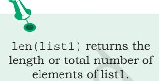

# **Chapter 9**


# **9.1 Introduction to List**

The data type list is an ordered sequence which is mutable and made up of one or more elements. Unlike a string which consists of only characters, a list can have elements of different data types, such as integer, float, string, tuple or even another list. A list is very useful to group together elements of mixed data types. Elements of a list are enclosed in square brackets and are separated by comma. Like string indices, list indices also start from 0.

#### *Example 9.1*

```
#list1 is the list of six even numbers
>>> list1 = [2,4,6,8,10,12]
>>> print(list1)
[2, 4, 6, 8, 10, 12]
#list2 is the list of vowels
```

```
>>> list2 = ['a','e','i','o','u']
>>> print(list2)
['a', 'e', 'i', 'o', 'u']
```

```
#list3 is the list of mixed data types
>>> list3 = [100,23.5,'Hello']
>>> print(list3)
[100, 23.5, 'Hello']
```

```
#list4 is the list of lists called nested 
#list
>>> list4 =[['Physics',101],['Chemistry',202], 
 ['Maths',303]] 
>>> print(list4)
[['Physics', 101], ['Chemistry', 202],
 ['Maths', 303]]
```
# **9.1.1 Accessing Elements in a List**

The elements of a list are accessed in the same way as characters are accessed in a string.

*"Measuring programming progress by lines of code is like measuring aircraft building progress by weight."*

*–Bill Gates*

#### *In this chapter*

- » *Introduction to List*
- » *List Operations*
- » *Traversing a List*
- » *List Methods and Built-in Functions*
- » *Nested Lists*
- » *Copying Lists*
- » *List as Arguments to Function*
- » *List Manipulation*

Ch 9.indd 189 08-Apr-19 12:40:13 PM

**Notes**

#initializes a list list1 >>> list1 = [2,4,6,8,10,12] >>> list1[0] #return first element of list1 2 >>> list1[3] #return fourth element of list1 8 #return error as index is out of range >>> list1[15] IndexError: list index out of range #an expression resulting in an integer index >>> list1[1+4] 12 >>> list1[-1] #return first element from right 12 #length of the list list1 is assigned to n >>> n = len(list1) >>> print(n) 6 #return the last element of the list1 >>> list1[n-1] 12 #return the first element of list1 >>> list1[-n] 2

## **9.1.2 Lists are Mutable**

In Python, lists are mutable. It means that the contents of the list can be changed after it has been created.

```
#List list1 of colors 
>>> list1 = ['Red','Green','Blue','Orange'] 
#change/override the fourth element of list1 
>>> list1[3] = 'Black' 
>>> list1 #print the modified list list1
['Red', 'Green', 'Blue', 'Black']
```
# **9.2 List Operations**

The data type list allows manipulation of its contents through various operations as shown below.

# **9.2.1 Concatenation**

Python allows us to join two or more lists using concatenation operator depicted by the symbol +.

```
#list1 is list of first five odd integers 
>>> list1 = [1,3,5,7,9] 
#list2 is list of first five even integers 
>>> list2 = [2,4,6,8,10] 
#elements of list1 followed by list2
```
Ch 9.indd 190 08-Apr-19 12:40:13 PM

**Notes**

```
>>> list1 + list2 
[1, 3, 5, 7, 9, 2, 4, 6, 8, 10]
>>> list3 = ['Red','Green','Blue']
>>> list4 = ['Cyan', 'Magenta', 'Yellow' 
,'Black']
>>> list3 + list4
['Red','Green','Blue','Cyan','Magenta', 
   'Yellow','Black']
```
Note that, there is no change in ongoing lists, i.e., list1, list2, list3, list4 remain the same after concatenation operation. If we want to merge two lists, then we should use an assignment statement to assign the merged list to another list. The concatenation operator '+' requires that the operands should be of list type only. If we try to concatenate a list with elements of some other data type, TypeError occurs.

```
>>> list1 = [1,2,3]
>>> str1 = "abc"
>>> list1 + str1
TypeError: can only concatenate list (not 
"str") to list
```
# **9.2.2 Repetition**

Python allows us to replicate a list using repetition operator depicted by symbol *.

```
>>> list1 = ['Hello']
#elements of list1 repeated 4 times
>>> list1 * 4 
['Hello', 'Hello', 'Hello', 'Hello']
```
# **9.2.3 Membership**

Like strings, the membership operators in checks if the element is present in the list and returns True, else returns False.

```
>>> list1 = ['Red','Green','Blue']
>>> 'Green' in list1
True
>>> 'Cyan' in list1
False
```
The not in operator returns True if the element is not present in the list, else it returns False.

```
>>> list1 = ['Red','Green','Blue']
>>> 'Cyan' not in list1
True
>>> 'Green' not in list1
False
```
Ch 9.indd 191 08-Apr-19 12:40:13 PM

**Notes**

#### **9.2.4 Slicing**

Like strings, the slicing operation can also be applied to lists.

```
>>> list1 =['Red','Green','Blue','Cyan', 
'Magenta','Yellow','Black']
>>> list1[2:6]
['Blue', 'Cyan', 'Magenta', 'Yellow']
```
#list1 is truncated to the end of the list >>> list1[2:20] #second index is out of range ['Blue', 'Cyan', 'Magenta', 'Yellow', 'Black']

>>> list1[7:2] #first index > second index [] #results in an empty list

#return sublist from index 0 to 4 >>> list1[:5] #first index missing ['Red','Green','Blue','Cyan','Magenta']

#slicing with a given step size >>> list1[0:6:2] ['Red','Blue','Magenta']

```
#negative indexes
#elements at index -6,-5,-4,-3 are sliced 
>>> list1[-6:-2] 
['Green','Blue','Cyan','Magenta']
```
#both first and last index missing >>> list1[::2] #step size 2 on entire list ['Red','Blue','Magenta','Black']

```
#negative step size
#whole list in the reverse order 
>>> list1[::-1]
['Black','Yellow','Magenta','Cyan','Blue', 
'Green','Red']
```
# **9.3 Traversing a List**

We can access each element of the list or traverse a list using a for loop or a while loop.

```
(A) List Traversal Using for Loop: 
   >>> list1 = ['Red','Green','Blue','Yellow', 
    'Black']
```
Ch 9.indd 192 08-Apr-19 12:40:13 PM

```
>>> for item in list1:
 print(item)
```
#### Output:

Red Green Blue Yellow Black

Another way of accessing the elements of the list is using range() and len() functions:

```
>>> for i in range(len(list1)):
 print(list1[i])
```
Output:

Red Green Blue Yellow Black

#### *(B) List Traversal Using while Loop:*

```
>>> list1 = ['Red','Green','Blue','Yellow', 
 'Black']
>>> i = 0
>>> while i < len(list1):
 print(list1[i])
 i += 1
```
Output:

Red Green Blue Yellow Black

# **9.4 List Methods and Built-in Functions**

The data type list has several built-in methods that are useful in programming. Some of them are listed in Table 9.1.

#### **Table 9.1 Built-in functions for list manipulations**

| Method | Description | Example |
| --- | --- | --- |
| len() | Returns the length of the list passed as the argument | >>> list1 = [10,20,30,40,50] |
|  |  | >>> len(list1) |
|  |  | 5 |
| list() | Creates an empty list if no argument is | >>> list1 = list() |
|  | passed | >>> list1 |

Ch 9.indd 193 08-Apr-19 12:40:13 PM



|  |  | [ ] |
| --- | --- | --- |
|  | Creates a list if a sequence is passed as | >>> str1 = 'aeiou' |
|  | an argument | >>> list1 = list(str1) |
|  |  | >>> list1 ['a', 'e', 'i', 'o', 'u'] |
| append() | Appends a single element passed as an | >>> list1 = [10,20,30,40] |
|  | argument at the end of the list | >>> list1.append(50) |
|  |  | >>> list1 |
|  | The single element can also be a list | [10, 20, 30, 40, 50] |
|  |  | >>> list1 = [10,20,30,40] |
|  |  | >>> list1.append([50,60]) |
|  |  | >>> list1 |
|  |  | [10, 20, 30, 40, [50, 60]] |
| extend() | Appends each element of the list passed | >>> list1 = [10,20,30] |
|  | as argument to the end of the given list | >>> list2 = [40,50] |
|  |  | >>> list1.extend(list2) |
|  |  | >>> list1 |
|  |  | [10, 20, 30, 40, 50] |
| insert() | Inserts an element at a particular index | >>> list1 = [10,20,30,40,50] |
|  | in the list | >>> list1.insert(2,25) |
|  |  | >>> list1 |
|  |  | [10, 20, 25, 30, 40, 50] |
|  |  | >>> list1.insert(0,5) |
|  |  | >>> list1 |
|  |  | [5, 10, 20, 25, 30, 40, 50] |
| count() | Returns the number of times a given | >>> list1 = [10,20,30,10,40,10] |
|  | element appears in the list | >>> list1.count(10) |
|  |  | 3 |
|  |  | >>> list1.count(90) |
|  |  | 0 |
| index() | Returns index of the first occurrence of | >>> list1 = [10,20,30,20,40,10] |
|  | the element in the list. If the element is | >>> list1.index(20) |
|  | not present, ValueError is generated | 1 |
|  |  | >>> list1.index(90) |
|  |  | ValueError: 90 is not in list |
| remove() | Removes the given element from the | >>> list1 = [10,20,30,40,50,30] |
|  | list. If the element is present multiple | >>> list1.remove(30) |
|  | times, only the first occurrence is | >>> list1 |
|  | removed. If the element is not present, | [10, 20, 40, 50, 30] |
|  | then ValueError is generated |  |
|  |  | >>> list1.remove(90) |
|  |  | ValueError:list.remove(x):x not |
|  |  | in list |
| pop() | Returns the element whose index is | >>> list1 = [10,20,30,40,50,60] |
|  | passed as parameter to this function | >>> list1.pop(3) |
|  | and also removes it from the list. If no | 40 |
|  | parameter is given, then it returns and | >>> list1 |
|  | removes the last element of the list | [10, 20, 30, 50, 60] |
|  |  | >>> list1 = [10,20,30,40,50,60] |
|  |  | >>> list1.pop() |
|  |  | 60 |

Ch 9.indd 194 21-May-19 12:28:25 PM

|  |  | >>> list1 |
| --- | --- | --- |
|  |  | [10, 20, 30, 40, 50] |
| reverse() | Reverses the order of elements in the | >>> list1 = [34,66,12,89,28,99] |
|  | given list | >>> list1.reverse() |
|  |  | >>> list1 |
|  |  | [ 99, 28, 89, 12, 66, 34] |
|  |  | >>> list1 = [ 'Tiger' ,'Zebra' , |
|  |  | 'Lion' , 'Cat' ,'Elephant' ,'Dog'] >>> list1.reverse() |
|  |  | >>> list1 |
|  |  | ['Dog', 'Elephant', 'Cat', |
|  |  | 'Lion', 'Zebra', 'Tiger'] |
| sort() | Sorts the elements of the given list | >>>list1 = ['Tiger','Zebra','Lion', |
|  | in-place | 'Cat', 'Elephant' ,'Dog'] |
|  |  | >>> list1.sort() |
|  |  | >>> list1 |
|  |  | ['Cat', 'Dog', 'Elephant', 'Lion', |
|  |  | 'Tiger', 'Zebra'] |
|  |  | >>> list1 = [34,66,12,89,28,99] |
|  |  | >>> list1.sort(reverse = True) |
|  |  | >>> list1 |
|  |  | [99,89,66,34,28,12] |
| sorted() | It takes a list as parameter and creates a | >>> list1 = [23,45,11,67,85,56] |
|  | new list consisting of the same elements | >>> list2 = sorted(list1) |
|  | arranged in sorted order | >>> list1 |
|  |  | [23, 45, 11, 67, 85, 56] |
|  |  | >>> list2 |
|  |  | [11, 23, 45, 56, 67, 85] |
| min() | Returns minimum or smallest element | >>> list1 = [34,12,63,39,92,44] |
|  | of the list | >>> min(list1) |
|  |  | 12 |
| max() | Returns maximum or largest element of | >>> max(list1) |
|  | the list | 92 |
| sum() | Returns sum of the elements of the list | >>> sum(list1) |
|  |  | 284 |

# **9.5 Nested Lists**

When a list appears as an element of another list, it is called a nested list.

*Example 9.2*

```
>>> list1 = [1,2,'a','c',[6,7,8],4,9]
#fifth element of list is also a list 
>>> list1[4] 
[6, 7, 8]
```
To access the element of the nested list of list1, we have to specify two indices list1[i][j]. The first index i will take us to the desired nested list and second index j will take us to the desired element in that nested list.

Ch 9.indd 195 08-Apr-19 12:40:13 PM

```
>>> list1[4][1] 
7
#index i gives the fifth element of list1 
#which is a list 
#index j gives the second element in the 
#nested list
```
# **9.6 Copying Lists**

Given a list, the simplest way to make a copy of the list is to assign it to another list.

```
>>> list1 = [1,2,3] 
>>> list2 = list1
>>> list1
[1, 2, 3]
>>> list2
[1, 2, 3]
```
The statement list2 = list1 does not create a new list. Rather, it just makes list1 and list2 refer to the same list object. Here list2 actually becomes an alias of list1. Therefore, any changes made to either of them will be reflected in the other list.

```
>>> list1.append(10)
>>> list1
[1, 2, 3, 10]
>>> list2
[1, 2, 3, 10]
```
We can also create a copy or clone of the list as a distinct object by three methods. The first method uses slicing, the second method uses built-in function list() and the third method uses copy() function of python library copy.

#### **Method 1**

We can slice our original list and store it into a new variable as follows:

```
newList = oldList[:]
```
#### *Example 9.3*

```
>>> list1 = [1,2,3,4,5]
>>> list2 = list1[:]
>>> list2
[1, 2, 3, 4, 5]
```
#### **Method 2**

We can use the built-in function list() as follows:

newList = list(oldList)

Ch 9.indd 196 08-Apr-19 12:40:13 PM

#### *Example 9.4*

```
>>> list1 = [10,20,30,40]
>>> list2 = list(list1)
>>> list2
[10, 20, 30, 40]
```
#### **Method 3**

```
We can use the copy () function as follows: 
   import copy #import the library copy
   #use copy()function of library copy 
   newList = copy.copy(oldList)
```
#### *Example 9.5*

```
>>> import copy
>>> list1 = [1,2,3,4,5]
>>> list2 = copy.copy(list1)
>>> list2
[1, 2, 3, 4, 5]
```
# **9.7 List as Argument to a Function**

Whenever a list is passed as an argument to a function, we have to consider two scenarios:

- (A) Elements of the original list may be changed, i.e. changes made to the list in the function are reflected back in the calling function.
For example in the following program list list1 of numbers is passed as an argument to function increment(). This function increases every element of the list by 5.

#### Program 9-1 Program to increment the elements of a list. The list is passed as an argument to a function.

```
#Program 9-1
#Function to increment the elements of the list passed as argument
def increment(list2):
 for i in range(0,len(list2)): 
 #5 is added to individual elements in the list
 list2[i] += 5
 print('Reference of list Inside Function',id(list2))
#end of function
list1 = [10,20,30,40,50] #Create a list
print("Reference of list in Main",id(list1))
print("The list before the function call")
print(list1)
increment(list1) #list1 is passed as parameter to function
print("The list after the function call")
print(list1)
```
Ch 9.indd 197 21-May-19 12:29:45 PM

```
Output:
   Reference of list in Main 70615968
   The list before the function call
   [10, 20, 30, 40, 50]
   Reference of list Inside Function 70615968 #The id remains same
   The list after the function call
   [15, 25, 35, 45, 55]
                       Observe that, when we pass a list as an argument, we 
                       actually pass a reference to the list. Hence any change 
                       made to list2 inside the function is reflected in the 
                       actual list list1.
                         (B) If the list is assigned a new value inside the 
                            function then a new list object is created and 
                            it becomes the local copy of the function. Any 
                            changes made inside the local copy of the function 
                            are not reflected back to the calling function.
Program 9-2 Program to increment the elements of the 
            list passed as parameter.
   #Program 9-2
   #Function to increment the elements of the list passed as argument
   def increment(list2):
    print("\nID of list inside function before assignment:", 
   id(list2))
    list2 = [15,25,35,45,55] #List2 assigned a new list
    print("ID of list changes inside function after assignment:", 
   id(list2))
    print("The list inside the function after assignment is:")
    print(list2)
   #end of function
   list1 = [10,20,30,40,50] #Create a list
   print("ID of list before function call:",id(list1))
   print("The list before function call:")
   print(list1)
   increment(list1) #list1 passed as parameter to function
   print('\nID of list after function call:',id(list1))
   print("The list after the function call:")
   print(list1)
 Output:
   ID of list before function call: 65565640
   The list before function call:
   [10, 20, 30, 40, 50]
   ID of list inside function before assignment:65565640
```

```
ID of list changes inside function after assignment:65565600
The list inside the function after assignment is:
```
Ch 9.indd 198 08-Apr-19 12:40:13 PM

[15, 25, 35, 45, 55]

ID of list after function call: 65565640 The list after the function call: [10, 20, 30, 40, 50]

# **9.8 List Manipulation**

In this chapter, we have learnt to create a list and the different ways to manipulate lists. In the following programs, we will apply the various list manipulation methods.

Program 9-3 Write a menu driven program to perform various list operations, such as:

- Append an element
- Insert an element
- Append a list to the given list
- Modify an existing element
- Delete an existing element from its position
- Delete an existing element with a given value
- Sort the list in ascending order
- Sort the list in descending order
- Display the list.

```
#Program 9-3
#Menu driven program to do various list operations
myList = [22,4,16,38,13] #myList already has 5 elements
choice = 0
while True:
 print("The list 'myList' has the following elements", myList)
 print("\nL I S T O P E R A T I O N S")
 print(" 1. Append an element")
 print(" 2. Insert an element at the desired position")
 print(" 3. Append a list to the given list")
 print(" 4. Modify an existing element")
 print(" 5. Delete an existing element by its position")
 print(" 6. Delete an existing element by its value")
 print(" 7. Sort the list in ascending order")
 print(" 8. Sort the list in descending order")
 print(" 9. Display the list")
 print(" 10. Exit")
 choice = int(input("ENTER YOUR CHOICE (1-10): "))
 #append element
 if choice == 1: 
 element = int(input("Enter the element to be appended: "))
 myList.append(element)
```
Ch 9.indd 199 08-Apr-19 12:40:13 PM

```
 print("The element has been appended\n")
 #insert an element at desired position
 elif choice == 2: 
 element = int(input("Enter the element to be inserted: "))
 pos = int(input("Enter the position:"))
 myList.insert(pos,element)
 print("The element has been inserted\n")
 #append a list to the given list
  elif choice == 3:
 newList = eval(input( "Enter the elements separated by commas"))
 myList.extend(list(newList))
 print("The list has been appended\n")
 #modify an existing element
 elif choice == 4: 
 i = int(input("Enter the position of the element to be 
modified: "))
 if i < len(myList):
 newElement = int(input("Enter the new element: "))
 oldElement = myList[i]
 myList[i] = newElement
 print("The element",oldElement,"has been modified\n")
 else:
 print("Position of the element is more than the length 
of list")
 #delete an existing element by position
 elif choice == 5: 
 i = int(input("Enter the position of the element to be 
deleted: "))
 if i < len(myList):
 element = myList.pop(i)
 print("The element",element,"has been deleted\n")
 else:
 print("\nPosition of the element is more than the length 
of list")
 #delete an existing element by value
 elif choice == 6: 
 element = int(input("\nEnter the element to be deleted: "))
 if element in myList:
 myList.remove(element)
 print("\nThe element",element,"has been deleted\n")
 else:
 print("\nElement",element,"is not present in the list")
```
2024-25

Ch 9.indd 200 15-Jun-21 3:13:11 PM

#list in sorted order

```
Lists 201
```

```
 elif choice == 7: 
  myList.sort()
  print("\nThe list has been sorted")
  #list in reverse sorted order
  elif choice == 8: 
  myList.sort(reverse = True)
  print("\nThe list has been sorted in reverse order")
  #display the list
  elif choice == 9: 
  print("\nThe list is:", myList)
  #exit from the menu
  elif choice == 10: 
  break
  else:
  print("Choice is not valid")
  print("\n\nPress any key to continue..............")
  ch = input()
Output:
 The list 'myList' has the following elements [22, 4, 16, 38, 13]
 L I S T O P E R A T I O N S
  1. Append an element
  2. Insert an element at the desired position
  3. Append a list to the given list
  4. Modify an existing element
  5. Delete an existing element by its position
  6. Delete an existing element by its value
  7. Sort the list in ascending order
  8. Sort the list in descending order
  9. Display the list
 10. Exit
 ENTER YOUR CHOICE (1-10): 8
 The list has been sorted in reverse order
 The list 'myList' has the following elements [38, 22, 16, 13, 4]
 L I S T O P E R A T I O N S
  1. Append an element
  2. Insert an element at the desired position
  3. Append a list to the given list
  4. Modify an existing element
  5. Delete an existing element by its position
  6. Delete an existing element by its value
  7. Sort the list in ascending order
  8. Sort the list in descending order
  9. Display the list
 10. Exit
```
Ch 9.indd 201 08-Apr-19 12:40:13 PM

```
202 Computer Science – Class xi
   ENTER YOUR CHOICE (1-10): 5
   Enter the position of the element to be deleted: 2
   The element 16 has been deleted
   The list 'myList' has the following elements [38, 22, 13, 4]
   L I S T O P E R A T I O N S
    1. Append an element
    2. Insert an element at the desired position
    3. Append a list to the given list
    4. Modify an existing element
    5. Delete an existing element by its position
    6. Delete an existing element by its value
    7. Sort the list in ascending order
    8. Sort the list in descending order
    9. Display the list
   10. Exit
Program 9-4 A program to calculate average marks of 
            n students using a function where n is 
            entered by the user.
   #Program 9-4
   #Function to calculate average marks of n students
   def computeAverage(list1,n): 
    #initialize total 
      total = 0 
    for marks in list1:
    #add marks to total 
    total = total + marks 
    average = total / n
    return average
   #create an empty list 
   list1 = [] 
   print("How many students marks you want to enter: ")
   n = int(input())
   for i in range(0,n):
    print("Enter marks of student",(i+1),":")
    marks = int(input())
    #append marks in the list
      list1.append(marks) 
   average = computeAverage(list1,n)
   print("Average marks of",n,"students is:",average)
 Output:
   How many students marks you want to enter:
   5
   Enter marks of student 1:
   45
```
Ch 9.indd 202 08-Apr-19 12:40:13 PM

```
Lists 203
```

```
Enter marks of student 2:
   89
   Enter marks of student 3:
   79
   Enter marks of student 4:
   76
   Enter marks of student 5:
   55
   Average marks of 5 students is: 68.8
Program 9-5 Write a user-defined function to check if a 
           number is present in the list or not. If the 
           number is present, return the position of 
           the number. Print an appropriate message 
           if the number is not present in the list.
   #Program 9-5
   #Function to check if a number is present in the list or not
   def linearSearch(num,list1):
    for i in range(0,len(list1)):
    if list1[i] == num: #num is present
    return i #return the position
    return None #num is not present in the list
   #end of function
   list1 = [] #Create an empty list
   print("How many numbers do you want to enter in the list: ")
   maximum = int(input())
   print("Enter a list of numbers: ")
   for i in range(0,maximum):
    n = int(input())
    list1.append(n) #append numbers to the list
   num = int(input("Enter the number to be searched: "))
   result = linearSearch(num,list1)
   if result is None:
    print("Number",num,"is not present in the list")
   else:
    print("Number",num,"is present at",result + 1, "position") 
 Output:
   How many numbers do you want to enter in the list:
   5
   Enter a list of numbers:
   23
   567
   12
   89
   324
   Enter the number to be searched:12
   Number 12 is present at 3 position
```
Ch 9.indd 203 08-Apr-19 12:40:13 PM

**Notes**

# **Summary**

- Lists are mutable sequences in Python, i.e., we can change the elements of the list.
- Elements of a list are put in square brackets separated by comma.
- A list within a list is called a nested list. List indexing is same as that of strings and starts at 0. Two way indexing allows traversing the list in the forward as well as in the backward direction.
- Operator + concatenates one list to the end of other list.
- Operator * repeats a list by specified number of times.
- Membership operator in tells if an element is present in the list or not and not in does the opposite.
- Slicing is used to extract a part of the list.
- There are many list manipulation functions including: len(), list(), append(), extend(), insert(), count(), find(), remove(), pop(), reverse(), sort(), sorted(), min(), max(), sum().

# **Exercise**

1. What will be the output of the following statements?

```
i. list1 = [12,32,65,26,80,10]
                list1.sort()
                print(list1)
         ii. list1 = [12,32,65,26,80,10]
                sorted(list1)
                print(list1)
        iii. list1 = [1,2,3,4,5,6,7,8,9,10]
                list1[::-2]
                list1[:3] + list1[3:]
        iv. list1 = [1,2,3,4,5]
                list1[len(list1)-1]
2. Consider the following list myList. What will be
```
- the elements of myList after the following two operations:

```
 myList = [10,20,30,40]
   i. myList.append([50,60])
  ii. myList.extend([80,90])
```
Ch 9.indd 204 08-Apr-19 12:40:14 PM

**Notes**

# 3. What will be the output of the following code segment:

```
 myList = [1,2,3,4,5,6,7,8,9,10]
 for i in range(0,len(myList)):
 if i%2 == 0:
 print(myList[i])
```
- 4. What will be the output of the following code segment:
	- a. myList = [1,2,3,4,5,6,7,8,9,10] del myList[3:] print(myList)
	- b. myList = [1,2,3,4,5,6,7,8,9,10] del myList[:5] print(myList)
	- c. myList = [1,2,3,4,5,6,7,8,9,10] del myList[::2] print(myList)
- 5. Differentiate between append() and extend() functions of list.
- 6. Consider a list:

```
 list1 = [6,7,8,9]
```
What is the difference between the following operations on list1:

```
a. list1 * 2
b. list1 *= 2
c. list1 = list1 * 2
```
- 7. The record of a student (Name, Roll No., Marks in five subjects and percentage of marks) is stored in the following list:

```
stRecord = ['Raman','A-36',[56,98,99,72,69], 
 78.8]
```
Write Python statements to retrieve the following information from the list stRecord.

- a) Percentage of the student
- b) Marks in the fifth subject
- c) Maximum marks of the student
- d) Roll no. of the student
- e) Change the name of the student from 'Raman' to 'Raghav'

# **Programming Problems**

- 1. Write a program to find the number of times an element occurs in the list.
- 2. Write a program to read a list of n integers (positive

Ch 9.indd 205 08-Apr-19 12:40:14 PM

**Notes**

as well as negative). Create two new lists, one having all positive numbers and the other having all negative numbers from the given list. Print all three lists.

- 3. Write a function that returns the largest element of the list passed as parameter.
- 4. Write a function to return the second largest number from a list of numbers.
- 5. Write a program to read a list of n integers and find their median.

*Note:* The median value of a list of values is the middle one when they are arranged in order. If there are two middle values then take their average.

**Hint:** You can use an built-in function to sort the list

- 6. Write a program to read a list of elements. Modify this list so that it does not contain any duplicate elements, i.e., all elements occurring multiple times in the list should appear only once.
- 7. Write a program to read a list of elements. Input an element from the user that has to be inserted in the list. Also input the position at which it is to be inserted. Write a user defined function to insert the element at the desired position in the list.
- 8. Write a program to read elements of a list.
	- a) The program should ask for the position of the element to be deleted from the list. Write a function to delete the element at the desired position in the list.
	- b) The program should ask for the value of the element to be deleted from the list. Write a function to delete the element of this value from the list.
- 9. Read a list of n elements. Pass this list to a function which reverses this list in-place without creating a new list.

Ch 9.indd 206 08-Apr-19 12:40:14 PM

