# **10 Computer Networks**

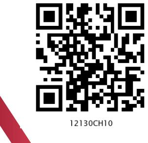

**Chapter**

# *In this Chapter*

- » *Introduction to Computer Networks*
- » *Evolution of Networking*
- » *Types of Networks*
- » *Network Devices*
- » *Networking Topologies*
- » *Identifying Nodes in a Networked Communication*
- » *Internet, Web and the Internet of Things*
- » *Domain Name System*

*"Hoaxes use weaknesses in human behavior to ensure they are replicated and distributed. In other words, hoaxes prey on the Human Operating System."* 

 *— Stewart Kirkpatrick*

# **10.1 Introduction to Computer Networks**

We are living in a connected world. Information is being produced, exchanged, and traced across the globe in real time. It's possible as almost everyone and everything in the digital world is interconnected through one way or the other.

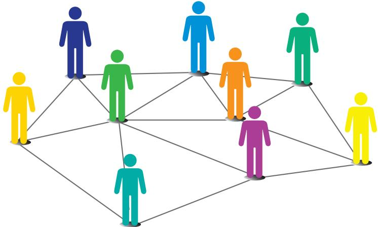

*Figure 10.1: Interconnection forming a social network* 2024-25

Chpater-10.indd 181 11-09-2020 16:41:16

#### **Activity 10.1**

Identify some other networks in the real world.

A group of two or more similar things or people interconnected with each other is called network (Figure 10.1). Some of the examples of network in our everyday life includes:

- • Social network
- • Mobile network
- • Network of computers
- • Airlines, railway, banks, hospitals networks

A computer network (Figure 10.2) is an interconnection among two or more computers or computing devices. Such interconnection allows computers to share data and resources among each other. A basic network may connect a few computers placed in a room.

The network size may vary from small to large depending on the number of computers it connects. A computer network can include different types of hosts (also called nodes) like server, desktop, laptop, cellular phones.

*Figure 10.2: A computer network*

Apart from computers, networks include networking devices like switch, router, modem, etc. Networking devices are used to connect multiple computers in different settings. For communication, data in a network is divided into smaller chunks called packets. These packets are then carried over a network. Devices in a network can be connected either through wired media like cables or wireless media like air.

In a communication network, each device that is a part of a network and that can receive, create, store or send data to different network routes is called a node. In the context of data communication, a node can be a device such as a modem, hub, bridge, switch, router, digital telephone handset, a printer, a computer or a server.

Chpater-10.indd 182 11-09-2020 16:41:17

Interconnectivity of computing devices in a network allows us to exchange information simultaneously with many parties through email, websites, audio/video calls, etc. Network allows sharing of resources. For example, a printer can be made available to multiple computers through a network; a networked storage can be accessed by multiple computers. People often connect their devices through hotspot, thus forming a small personal network.

#### **10.2 Evolution of Networking**

In the 1960s a research project was commissioned by Advanced Research Projects Agency Network (ARPANET) in the U.S. Department of Defence to connect the academic and research institutions located at different places for scientific collaborations. The first message was communicated between the University of California, Los Angeles (UCLA) and Stanford Research Institute (SRI). Slowly but gradually, more and more organisations joined the ARPANET, and many independent smaller networks were formed. Few of the milestones in the magnificent journey of evolution of computer networks is depicted in the timeline shown in Figure 10.3.

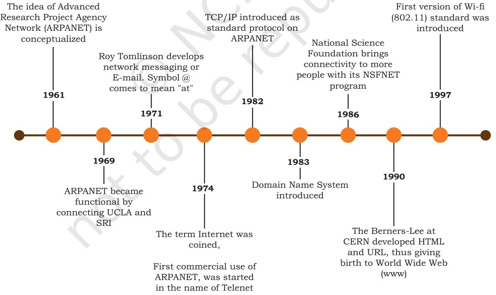

*Figure 10.3: Timeline showing evolution of networking*

#### **Activity 10.2**

Create a hotspot using a smartphone and connect other devices to it.

Chpater-10.indd 183 11-09-2020 16:41:17

#### **10.3 Types of Networks**

There are various types of computer networks ranging from network of handheld devices (like mobile phones or tablets) connected through Wi-Fi or Bluetooth within a single room to the millions of computers spread across the globe. Some are connected wireless while others are connected through wires.

Based on the geographical area covered and data transfer rate, computer networks are broadly categorised as:

- • PAN ( Personal Area Network)
- • LAN (Local Area Network)
- • MAN (Metropolitan Area Network)
- • WAN (Wide Area Network)

#### **10.3.1 Personal Area Network (PAN)**

It is a network formed by connecting a few personal devices like computers, laptops, mobile phones, smart phones, printers etc., as shown in Figure 10.4. All these devices lie within an approximate range of 10 metres. A personal area network may be wired or wireless. For example, a mobile phone connected to the laptop through USB forms a wired PAN while two smartphones communicating with each other through Bluetooth technology form a wireless PAN or WPAN.

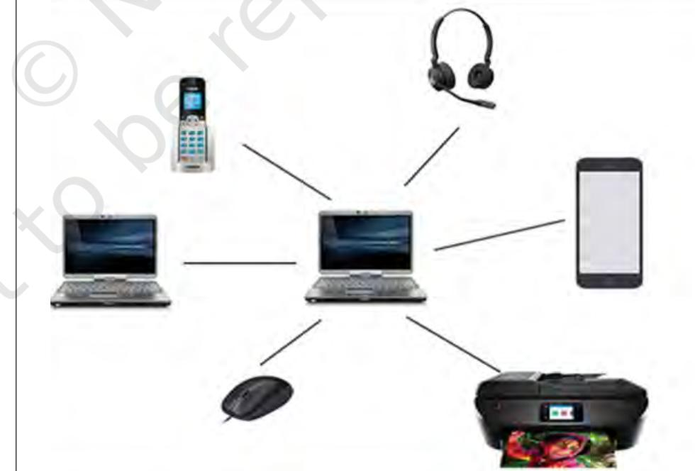

*Figure 10.4: A Personal Area Network*

Chpater-10.indd 184 11-09-2020 16:41:17

#### **10.3.2 Local Area Network (LAN)**

It is a network that connects computers, mobile phones, tablet, mouse, printer, etc., placed at a limited distance. The geographical area covered by a LAN can range from a single room, a floor, an office having one or more buildings in the same premise, laboratory, a school, college, or university campus. The connectivity is done by means of wires, Ethernet cables, fibre optics, or Wi-Fi. A Local Area Network (LAN) is shown in Figure 10.5.

Explore and find out the minimum internet speed required to make a video call.

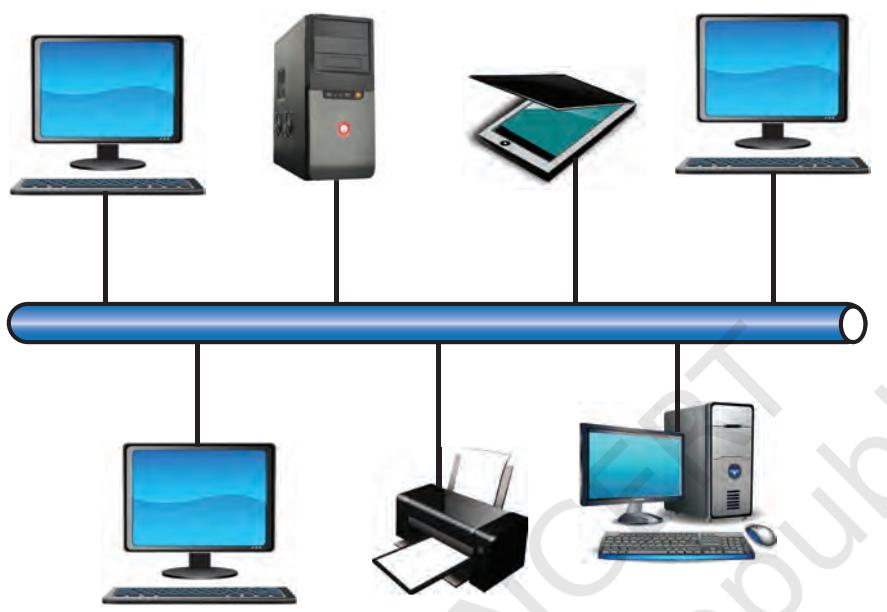

*Figure 10.5: A Local Area Network*

LAN is comparatively secure as only authentic users in the network can access other computers or shared resources. Users can print documents using a connected printer, upload/download documents and software to and from the local server. Such LANs provide the short range communication with the high speed data transfer rates. These types of networks can be extended up to 1 km. Data transfer in LAN is quite high, and usually varies from 10 Mbps (called Ethernet) to 1000 Mbps (called Gigabit Ethernet), where Mbps stands for Megabits per second. Ethernet is a set of rules that decides how computers and other devices connect with each other through cables in a local area network or LAN.

#### **10.3.3 Metropolitan Area Network (MAN)**

Metropolitan Area Network (MAN) is an extended form of LAN which covers a larger geographical area like a city or a town. Data transfer rate in MAN also ranges in Mbps,

Chpater-10.indd 185 11-09-2020 16:41:18

but it is considerably less as compared to LAN. Cable TV network or cable based broadband internet services are examples of MAN. This kind of network can be extended up to 30-40 km. Sometimes, many LANs are connected together to form MAN, as shown in Figure 10.6.

*Figure 10.6: A Metropolitan Area Network*

#### **10.3.4 Wide Area Network (WAN)**

Wide Area Network connects computers and other LANs and MANs, which are spread across different geographical locations of a country or in different countries or continents. A WAN could be formed by connecting a LAN to other LANs (Figure 10.7) via wired/wireless media. Large business, educational and government organisations connect their different branches in different locations across the world through WAN. The Internet is the largest WAN that connects billions of computers, smartphones and millions of LANs from different continents.

It is possible to access your bank account from any part of the world. Whether the bank's network is a LAN, MAN, WAN or any other type?

Chpater-10.indd 186 11-09-2020 16:41:18

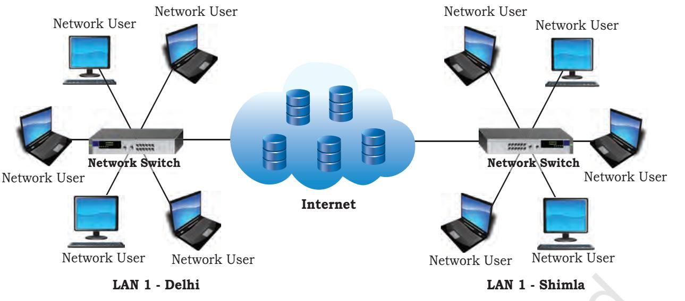

*Figure 10.7: A Wide Area Network*

# **10.4 Network Devices**

To communicate data through different transmission media and to configure networks with different functionality, we require different devices like Modem, Hub, Switch, Repeater, Router, Gateway, etc. Let us explore them in detail.

### **10.4.1 Modem**

Modem stands for 'MOdulator DEModulator'. It refers to a device used for conversion between analog signals and digital bits. We know computers store and process data in terms of 0s and 1s. However, to transmit data from a sender to a receiver, or while browsing the internet, digital data are converted to an analog signal and the medium (be it free-space or a physical media) carries the signal to the receiver. There are modems connected to both the source and destination nodes. The modem at the sender's end acts as a modulator that converts the digital data into analog signals. The modem at the receiver's end acts as a demodulator that converts the analog signals into digital data for the destination node to understand. Figure 10.8 shows connectivity using a modem.

Chpater-10.indd 187 11-09-2020 16:41:19

*Figure 10.8: Use of modem*

#### **10.4.2 Ethernet Card**

Ethernet card, also known as Network Interface Card (NIC card in short) is a network adapter used to set

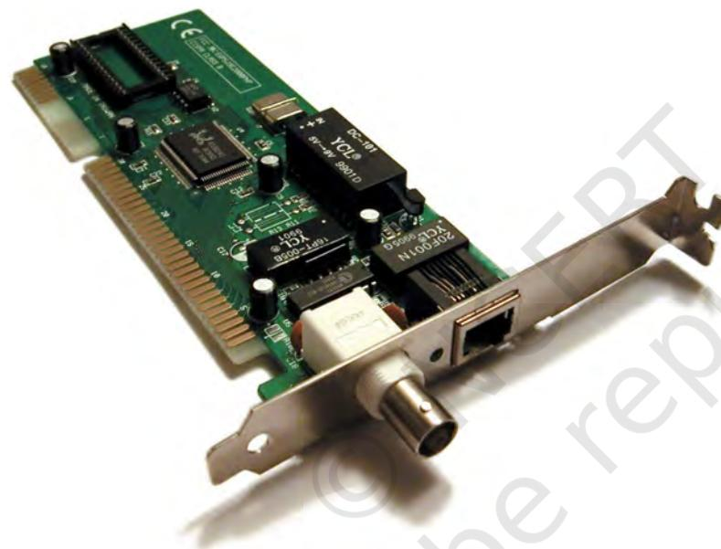

*Figure 10.9: A Network Interface Card*

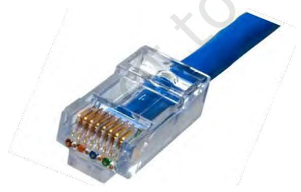

#### **10.4.3 RJ45**

RJ 45 or Registered Jack-45 is an eight-pin connector (Figure 10.10) that is used exclusively with Ethernet cables for networking. It is a standard networking interface that can be seen at the end of all network cables. Basically, it is a small plastic plug that fits into RJ-45 jacks of the Ethernet cards present in various computing devices. *Figure 10.10: RJ 45*

board mounted on the motherboard of a computer as shown in Figure 10.9. The Ethernet cable connects the computer to the network through NIC. Ethernet cards can support data transfer between 10 Mbps and 1 Gbps (1000 Mbps). Each NIC has a MAC address, which helps in uniquely identifying the computer on the network.

up a wired network. It acts as an interface between computer and the network. It is a circuit

Chpater-10.indd 188 11-09-2020 16:41:19

#### **10.4.4 Repeater**

Data are carried in the form of signals over the cable. These signals can travel a specified distance (usually about 100 m). Signals lose their strength beyond this limit and become weak. In such conditions, original signals need to be regenerated.

A repeater is an analog device that works with signals on the cables to which it is connected. The weakened signal appearing on the cable is regenerated and put back on the cable by a repeater.

#### **10.4.5 Hub**

An Ethernet hub (Figure 10.11) is a network device used to connect different devices through wires. Data arriving on any of the lines are sent out on all the others. The limitation of Hub is that if data from two devices come at the same time, they will collide.

*Figure 10.11:A network hub with 8 ports*

#### **10.4.5 Switch**

A switch is a networking device (Figure 10.12) that plays a central role in a Local Area Network (LAN). Like a hub, a network switch is used to connect multiple computers or communicating devices. When data

arrives, the switch extracts the destination address from the data packet and looks it up in a table to see where to send the packet. Thus, it sends signals to only selected devices instead of sending to all. It can forward multiple packets at the same time. A switch does not forward the signals which are noisy or corrupted. It drops such signals and asks the sender to resend it. *Figure 10.12:Cables connected to a network switch*

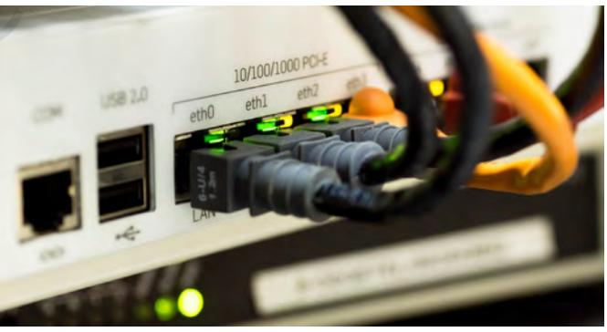

Ethernet switches are common in homes/offices to connect multiple devices thus creating LANs or to access the Internet.

An Internet service provider (ISP) is any organisation that provides services for accessing the Internet.

#### **Activity 10.3**

Find and list a few ISPs in your region.

Chpater-10.indd 189 11-09-2020 16:41:20

#### **10.4.6 Router**

A router (Figure 10.13) is a network device that can receive the data, analyse it and transmit it to other networks. A router connects a local area network to the internet. Compared to a hub or a switch, a router has advanced capabilities as it can analyse the data being carried over a network, decide/alter how it is packaged, and send it to another network of a different type. For example, data has been divided into packets of a certain size. Suppose these packets are to be carried over a different type of network which cannot handle bigger packets. In such a case, the data is to be repackaged as smaller packets and then sent over the network by a router.

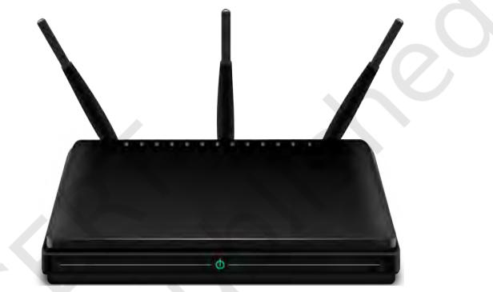

#### *Figure 10.13:A router*

A router can be wired or wireless. A wireless router can provide Wi-Fi access to smartphones and other devices. Usually, such routers also contain some ports to provide wired Internet access. These days, home Wi-Fi routers perform the dual task of a router and a modem/ switch. These routers connect to incoming broadband lines, from ISP (Internet Service Provider), and convert them to digital data for computing devices to process.

#### **10.4.7 Gateway**

As the term "Gateway" suggests, it is a key access point that acts as a "gate" between an organisation's network and the outside world of the Internet (Figure 10.14). Gateway serves as the entry and exit point of a network, as all data coming in or going out of a network must first pass through the gateway in order to use routing paths. Besides routing data packets, gateways also maintain information about the host network's internal connection paths and the identified paths of other remote networks. If a node from one network wants to communicate with a node of a foreign network, it will

Chpater-10.indd 190 11-09-2020 16:41:20

pass the data packet to the gateway, which then routes it to the destination using the best possible route.

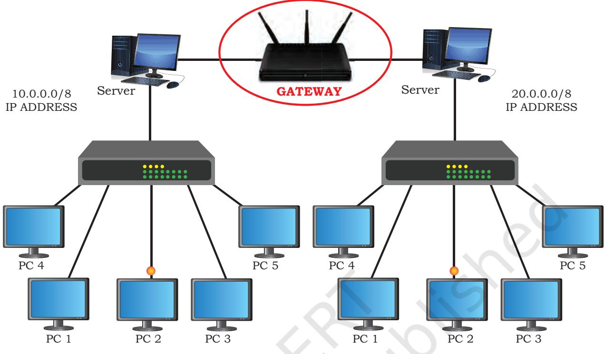

*Figure 10.14:A network gateway*

For simple Internet connectivity at homes, the gateway is usually the Internet Service Provider that provides access to the entire Internet. Generally, a router is configured to work as a gateway device in computer networks. But a gateway can be implemented completely in software, hardware, or a combination of both. Because a network gateway is placed at the edge of a network, the firewall is usually integrated with it.

#### **10.5 Networking Topologies**

We have already discussed that a number of computing devices are connected together to form a Local Area Network (LAN), and interconnections among millions of LANs forms the Internet. The arrangement of computers and other peripherals in a network is called its topology. Common network topologies are Mesh, Ring, Bus, Star and Tree.

Chpater-10.indd 191 11-09-2020 16:41:21

#### **10.5.1 Mesh Topology**

In this networking topology, each communicating device is connected with every other device in the network as shown in Figure 10.15. Such a network can handle large amounts of traffic since multiple nodes can transmit data simultaneously. Also, such networks are more reliable in the sense that even if a node gets down, it does not cause any break in the transmission of data between other nodes. This topology is also more secure as compared to other topologies because each cable between two nodes carries different data. However, wiring is complex and cabling cost is high in creating such networks and there are many redundant or unutilised connections.

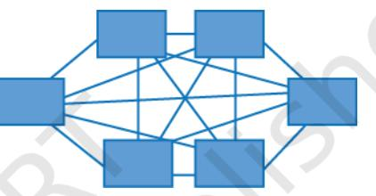

*Figure 10.15:A mesh topology*

#### **10.5.2 Ring Topology**

In ring topology (Figure 10.16), each node is connected to two other devices, one each on either side, as shown in Figure 10.16. The nodes connected with each other thus forms a ring. The link in a ring topology is unidirectional. Thus, data can be transmitted in one direction only (clockwise or counterclockwise).

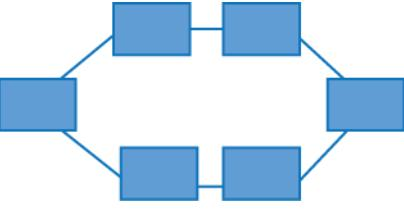

*Figure 10.16:A ring topology*

#### **10.5.3 Bus Topology**

In bus topology (Figure 10.17), each communicating device connects to a transmission medium, known as bus. Data sent from a node are passed on to the bus and hence are transmitted to the length of the bus in both directions. That means, data can be received by any of the nodes connected to the bus.

To build a fullyconnected mesh topology of n nodes, it requires n(n-1)/2 wires.

Chpater-10.indd 192 11-09-2020 16:41:21

In this topology, a single backbone wire called bus is shared among the nodes, which makes it cheaper and easier to maintain. Both ring and bus topologies are considered to be less secure and less reliable.

#### **10.5.4 Star Topology**

In star topology (Figure 10.18), each communicating device is connected to a central node, which is a networking device like a hub or a switch, as shown in Figure 10.18.

Star topology is considered very effective, efficient and fast as each device is directly connected with the central device. Although disturbance in one device will not affect the rest of the network, any failure in a central networking device may lead to the failure of complete network.

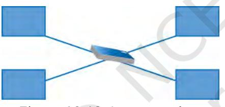

*Figure 10.18:A star topology*

The central node can be either a broadcasting device means data will be transmitted to all the nodes in the network, or a unicast device means the node can identify the destination and forward data to that node only.

#### **10.5.5 Tree or Hybrid Topology**

It is a hierarchical topology, in which there are multiple branches and each branch can have one or more basic topologies like star, ring and bus. Such topologies are usually realised in WANs where multiple LANs are connected. Those LANs may be in the form of a ring, bus or star. In figure 10.19, a hybrid topology is shown connecting 4-star topologies in a bus.

In this type of network, data transmitted from source first reaches the centralised device and from there the data passes through every branch where each branch can have links for more nodes.

How will a Bus and Ring topology behave in case a Node is down?

Chpater-10.indd 193 11-09-2020 16:41:21

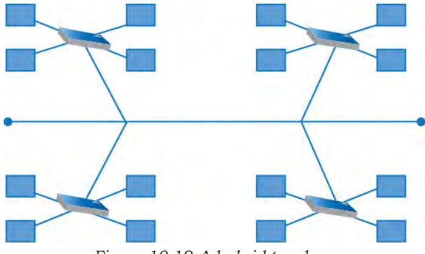

*Figure 10.19:A hybrid topology*

# **10.6 Identifying Nodes in a Networked Communication**

Each node in a network should be uniquely identified so that a network device can identify the sender and receiver and decide a routing path to transmit data. Let us explore further and know how each node is distinguished in a network.

#### **10.6.1 MAC Address**

MAC stands for Media Access Control. The MAC address, also known as the physical or hardware address, is a unique value associated with a network adapter called a NIC. The MAC address is engraved on NIC at the time of manufacturing and thus it is a permanent address and cannot be changed under any circumstances. The machine on which the NIC is attached, can be physically identified on the network using its MAC address.

Each MAC address is a 12-digit hexadecimal numbers (48 bits in length), of which the first six digits (24 bits) contain the manufacturer's ID called Organisational Unique Identifier (OUI) and the later six digits (24 bits) represents the serial number assigned to the card by the manufacturer. A sample MAC address looks like:

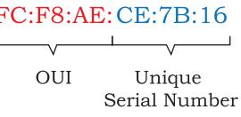

#### **10.6.2 IP Address**

IP address, also known as Internet Protocol address, is also a unique address that can be used to uniquely identify each node in a network. The IP addresses

**Activity 10.4**

Explore how can you find the MAC address of your computer system.

Chpater-10.indd 194 11-09-2020 16:41:21

are assigned to each node in a network that uses the Internet Protocol for communication. Thus, if we know a computer's IP address, we can communicate with that computer from anywhere in the world. However, unlike MAC address, IP address can change if a node is removed from one network and connected to another network.

The initial IP Address called version 4 (IPV4 in short), is a 32 bit numeric address, written as four numbers separated by periods, where each number is the decimal (base-10) representation for an 8-bit binary (base-2) number and each can take any value from 0 - 255. A sample IPV4 address looks like:

## 192.168.0.178

With more and more devices getting connected to the Internet, it was realised that the 32-bit IP address will not be sufficient as it offers just under 4.3 billion unique addresses. Thus, a 128 bits IP address, called IP version 6 (IPV6 in short) was proposed. An IPv6 address is represented by eight groups of hexadecimal (base-16) numbers separated by colons. A sample IPV6 address looks like:

2001:CDBA:0000:0000:0000:0000:3257:9652

#### **10.7 Internet, Web and the Internet of Things**

The Internet is the global network of computing devices including desktop, laptop, servers, tablets, mobile phones, other handheld devices, printers, scanners, routers, switches, gateways, etc. Moreover, smart electronic appliances like TV, AC, refrigerator, fan, light, etc. can also communicate through a network. The list of such smart devices is always increasing e.g., drones, vehicles, door lock, security camera. We have already studied IoT and WoT in class 11.

The Internet is evolving every day and it is difficult to visualise or describe each and every aspect of the architecture of the Internet. Computers are either connected to a modem through a cable or wirelessly (Wi-Fi). That modem, be it wired or wireless, is connected to a local Internet Service Provider (ISP) who then connects to a national network. Many such ISPs connect together forming a regional network and regional networks connect together forming a national network, and such country-wise networks form the Internet backbone.

Do mobile phones have a MAC address? Is it different from the IMEI number of mobile phones?

You are encouraged to take up any area of concern where you think IoT can be immensely beneficial and discuss it with your peers. An example for the same can be preventing road accidents.

The Internet today is a widespread network, and its influence is no longer limited to the technical fields of computer communications. It is being used by everyone in the society as is evident from the increasing use of online tools for education, creativity, entertainment, socialisation, and e-commerce.

### **10.7.1 The World Wide Web (WWW)**

The World Wide Web (WWW) or web in short, is an ocean of information, stored in the form of trillions of interlinked web pages and web resources. The resources on the web can be shared or accessed through the Internet.

Earlier, to access files residing in different computers, one had to login individually to each computer through the Internet. Besides, files in different computers were sometimes in different formats, and it was difficult to understand each other's files and documents. Sir Tim Berners-Lee — a British computer scientist invented the revolutionary World Wide Web in 1990 by defining three fundamental technologies that lead to creation of web:

- • HTML HyperText Markup Language. It is a language which is used to design standardised Web Pages so that the Web contents can be read and understood from any computer. Basic structure of every webpage is designed using HTML.
- • URI Uniform Resource Identifier. It is a unique address or path for each resource located on the web. It is also known as Uniform Resource Locator (URL). Every page on the web has a unique URL. Examples are: https://www.mhrd.gov.in,http:// www.ncert.nic.in,http://www.airindia.in, etc. URL is sometimes also called web address. However, a URL is not only the domain name. It contains other information that completes a web address, as depicted below:

#### **Domain Name**

**http://www.ncert.nic.in/textbook/textbook.htm**

**URL**

- • HTTP The HyperText Transfer Protocol is a set of rules which is used to retrieve linked web pages across the web. The more secure and advanced version is HTTPS.
Chpater-10.indd 196 11-09-2020 16:41:21

Many people confuse the web with the Internet. The Internet as we know is the huge global network of interconnected computers, which may or may not have any file or webpage to share with the world. The web on the other hand is the interlinking of collection of Webpages on these computers which are accessible over the Internet. WWW today gives users access to a vast collection of information created and shared by people across the world. It is today the most popular information retrieval system

#### **10.8 Domain Name System**

The Internet is a vast ocean where information is available in the form of millions of websites. Each website is stored on a server which is connected to the Internet, which means each server has an IP address. Every device connected to the Internet has an IP address. To access a website, we need to enter its IP address on our web browser. But it is very difficult to remember the IP addresses of different websites as they are in terms of numbers or strings.

However, it is easier to remember names, and therefore, each computer server hosting a website or web resource is given a name against its IP address. These names are called the Domain names or hostnames corresponding to unique IP addresses assigned to each server. For easy understanding, it can be considered as the phonebook where instead of remembering each person's phone number, we assign names to their numbers. For example, IP addresses and domain names of some websites are as follows:

#### **Table 10.1 Examples of domain names and their mapped IP addresses**

| Domain Name | IP Address |
| --- | --- |
| ncert.nic.in | 164.100.60.233 |
| cbse.nic.in | 164.100.107.32 |
| mhrd.gov.in | 164.100.163.45 |
| wikipedia.org | 198.35.26.96 |

#### **10.8.1 DNS Server**

Instead of remembering IP addresses, we assign a domain name to each IP. But, to access a web resource, a browser needs to find out the IP address corresponding to the domain name entered. Conversion of the domain

Chpater-10.indd 197 11-09-2020 16:41:21

name of each web server to its corresponding IP address is called domain name resolution. It is done through a server called DNS server. Thus, when we enter a URL on a web browser, the HTTP protocol approaches a computer server called DNS server to obtain the IP address corresponding to that domain name. After getting the IP address, the HTTP protocol retrieves the information and loads it in our browser.

In Figure 10.20, an example is shown in which the HTTP requests a DNS server for corresponding IP addss, and the server sends back an IP address.

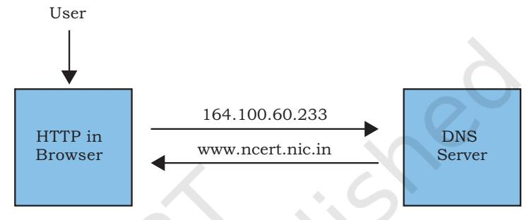

*Figure 10.20:Request of IP address corresponding to domain name*

A DNS server maintains a database of domain names and their corresponding IP addresses. To understand how the domain name resolution works, we have to understand how and where the DNS servers are kept. The DNS servers are placed in hierarchical order. At the top level, there are 13 servers called root servers. Then below the root servers there are other DNS servers at different levels. A DNS server may contain the IP address corresponding to a domain or it will contain the IP address of other DNS servers, where this domain entry can be searched.

# **Summary**

- • A computer network is an interconnection among two or more computers or computing devices.
- • A computer network allows computers to share data and resources among each other.
- • Networking devices are used to connect multiple computers in different settings.

DNS root servers are named using alphabets A through M for the first 13 letters of the alphabet. Ten of these servers are in the US, one in London, one in Stockholm, and one in Japan. The organisation Internet Assigned Numbers Authority (IANA) keeps this list of DNS root servers.

Chpater-10.indd 198 11-09-2020 16:41:21

- • In a communication network, each device that is a part of a network and that can receive, create, store or send data to different network routes is called a node.
- • Based on the geographical area covered and data transfer rate, computer networks are broadly categorised into LAN (Local Area Network), MAN (Metropolitan Area Network) and WAN (Wide Area Network).
- • LAN is a network that connects a variety of nodes placed at a limited distance ranging from a single room, a floor, an office or a campus having one or more buildings in the same premises.
- • Ethernet is a set of rules that decides how computers and other devices connect with each other through cables in a LAN.
- • Metropolitan Area Network (MAN) is an extended form of LAN which covers a larger geographical area like a city or a town.
- • Cable TV network or cable based broadband internet services are examples of MAN.
- • Wide Area Network (WAN) connects computers and other LANs and MANs, which are spread across different geographical locations of a country or in different countries or continents.
- • The Internet is the largest WAN that connects billions of computers, smartphones and millions of LANs from different continents.
- • Modem stands for 'MOdulator DEModulator', is a device used for conversion between electric signals and digital bits.
- • Ethernet card, also known as Network Interface Card (NIC card in short) is a network adaptor used to set up a wired network.
- • Each NIC has a MAC address, which helps in uniquely identifying the computer on the network.
- • A repeater is an analog device that regenerate the signals on the cables to which it is connected.
- • A switch is a networking device used to connect multiple computers or communicating devices.
- • A router is a network device that can receive the data, analyse it and transmit it to other networks.

Chpater-10.indd 199 11-09-2020 16:41:21

| • | Gateway serves as the entry and exit point of a |  |
| --- | --- | --- |
|  | network, as all data coming in or going out of a |  |
|  | network must first pass through gateway in | the |
|  | order to use routing paths. |  |
| • | The arrangement of computers and other |  |
|  | peripherals in a network is called its topology. |  |
| • | Common network topologies are Mesh, Ring, Bus, |  |
|  | Star and Tree. |  |
| • | In mesh topology each communicating device is |  |
|  | connected with every other device in the network. |  |
| • | In ring topology, each node is connected to two |  |
|  | other devices, one each on either side. |  |
| • | In bus topology, a single backbone wire called |  |
|  | bus is shared among the nodes, which makes it |  |
|  | cheaper and easy to maintain. |  |
| • | In star topology, each communicating device is |  |
|  | connected to a central networking device like a |  |
|  | hub or a switch. |  |
| • | In tree or hybrid topology, there are multiple |  |
|  | branches and each branch can have one or more |  |
|  | basic topologies like star, ring and bus. |  |
| • | The MAC address, also known as the physical or |  |
|  | hardware address, is a unique permanent value |  |
|  | associated with a network adapter called a NIC. |  |
|  | It is used to physically identify a machine on the |  |
|  | network. |  |
| • | IP address, also known as Internet Protocol |  |
|  | address, is a unique address that can be used to |  |
|  | uniquely identify each node in a network. |  |
| • | Unlike MAC address, IP address can change if a |  |
|  | node is removed from one network and connected |  |
|  | to another network. |  |
| • | The Internet is the global network of computing |  |
|  | devices. |  |
| • | The World Wide Web (WWW) or web in short, is an |  |
|  | ocean of information, stored in the form of trillions |  |
|  | of interlinked web pages and web resources. |  |
| • | Sir Tim Berners-Lee — a British computer |  |
|  | scientist invented the revolutionary World Wide |  |
|  | Web in 1990. |  |

• HTML (HyperText Markup Language) is a language which is used to design standardised Web Pages so that the Web contents can be read

Chpater-10.indd 200 11-09-2020 16:41:21

and understood from any computer.

- • URI (Uniform Resource Identifier) or URL (Uniform Resource Locator) is a unique address or path for each resource located on the web.
- • HTTP The HyperText Transfer Protocol is a set of rules which is used to retrieve linked web pages across the web. The more secure and advanced version is HTTPS.
- • Each computer server hosting a website or web resource is given a name against its IP address. These names are called the Domain names or hostnames.
- • Conversion of the domain name of each web server to its corresponding IP address is called domain name resolution. It is done through a server called DNS server.

# **Exercise**

- 1. Expand the following:
	- a) ARPANET
	- b) MAC
	- c) ISP
	- d) URI
- 2. What do you understand by the term network?
- 3. Mention any two main advantages of using a network of computing devices.
- 4. Differentiate between LAN and WAN.
- 5. Write down the names of few commonly used networking devices.
- 6. Two universities in different States want to transfer information. Which type of network they need to use for this?
- 7. Define the term topology. What are the popular network topologies?
- 8. How is tree topology different from bus topology?
- 9. Identify the type of topology from the following:
	- a) Each node is connected with the help of a single cable.
	- b) Each node is connected with central switching through independent cables.

Chpater-10.indd 201 11-09-2020 16:41:21

- 10. What do you mean by a modem? Why is it used?
- 11. Explain the following devices:
	- a) Switch
	- b) Repeater
	- c) Router
	- d) Gateway
	- e) NIC
- 12. Draw a network layout of star topology and bus topology connecting five computers.
- 13. What is the significance of MAC address?
- 14. How is IP address different from MAC address? Discuss briefly.
- 15. What is DNS? What is a DNS server?
- 16. Sahil, a class X student, has just started understanding the basics of Internet and web technologies. He is a bit confused in between the terms "World Wide Web" and "Internet". Help him in understanding both the terms with the help of suitable examples of each.

Chpater-10.indd 202 11-09-2020 16:41:21

