# **11 Data Communication**

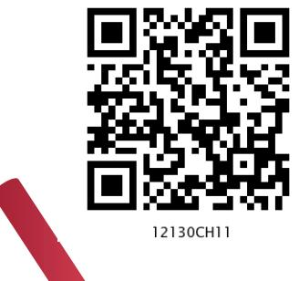

**Chapter**

## *In this Chapter*

- » *Concept of Communication*
- » *Components of Data Communication*
- » *Measuring Capacity of Communication Media*
- » *Types of Data Communication*
- » *Switching Techniques*
- » *Transmission Media*
- » *Mobile Telecommunication Technologies*
- » *Protocol*

*"People already have bionic arms and legs that work by the power of thought. And we increasingly outsource mental and communicative activities to computers. We are merging with our smartphones. Very soon, they will just be part of the body"* 

*— Yuval Noah Harari*

### **11.1 Concept of Communication**

The term "Data Communication" comprises two words: Data and Communication. Data can be any text, image, audio, video, and multimedia files. Communication is an act of sending or receiving data. Thus, data communication refers to the exchange of data between two or more networked or connected devices. These devices must be capable of sending and receiving data over a communication medium. Examples of such devices include personal computers, mobile phones, laptops, etc. As we can see in Figure 11.1, four different types of devices — computer, printer, server and switch are connected to form the network. These devices are connected through a media to the network, which carry information from one end to other end.

Chpater-11.indd 203 11-09-2020 15:10:07

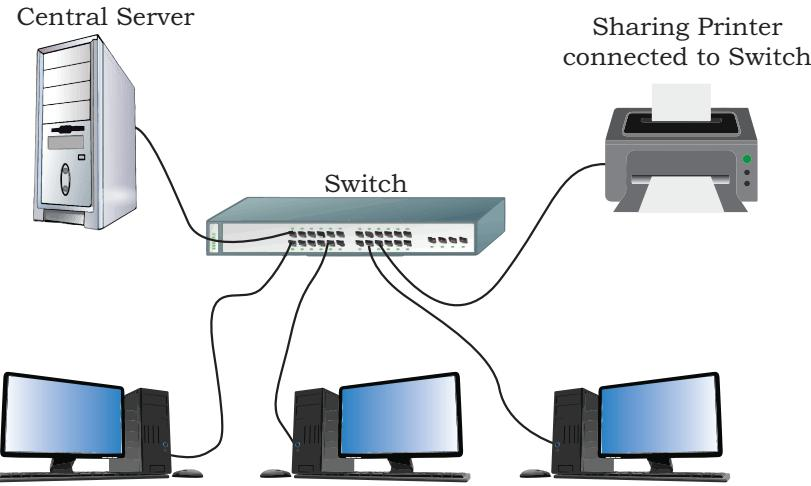

*Figure 11.1: A simple network of computing devices*

### **11.2 Components of Data Communication**

Whenever we talk about communication between two computing devices using a network, five most important aspects come to our mind. These are sender, receiver, communication medium, the message to be communicated, and certain rules called protocols to be followed during communication. The communication media is also called transmission media. Figure 11.2 shows the role of these five components in data communication.

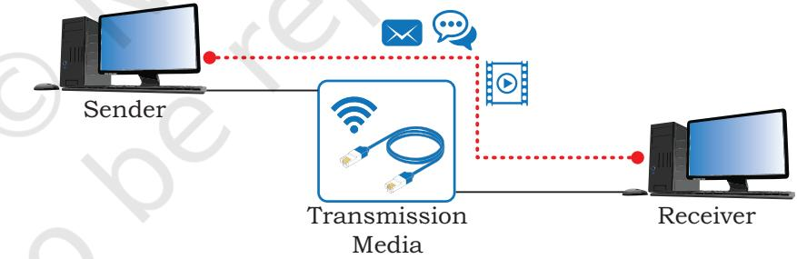

**Sender:** A sender is a computer or any such device which is capable of sending data over a network. It can be a computer, mobile phone, smartwatch, walkietalkie, video recording device, etc.

**Receiver:** A receiver is a computer or any such device which is capable of receiving data from the network. It can be any computer, printer, laptop, mobile phone, television, etc. In computer communication, the sender and receiver are known as nodes in a network.

List various types of senders on a network.

Chpater-11.indd 204 11-09-2020 15:10:08

**Message:** It is the data or information that needs to be exchanged between the sender and the receiver. Messages can be in the form of text, number, image, audio, video, multimedia, etc.

**Communication media:** It is the path through which the message travels between source and destination. It is also called medium or link which is either wired or wireless. For example, a television cable, telephone cable, ethernet cable, satellite link, microwaves, etc. We will study about various communication media in section 11.5.

**Protocols:** It is a set of rules that need to be followed by the communicating parties in order to have successful and reliable data communication. You have already come across protocols such as Ethernet and HTTP.

### **11.3 Measuring Capacity of Communication Media**

In data communication, the transmission medium is also known as channel. The capacity of a channel is the maximum amount of signals or traffic that a channel can carry. It is measured in terms of bandwidth and data transfer rate as described below:

### **11.3.1 Bandwidth**

Bandwidth of a channel is the range of frequencies available for transmission of data through that channel. Higher the bandwidth, higher the data transfer rate. Normally, bandwidth is the difference of maximum and minimum frequency contained in the composite signals. Bandwidth is measured in Hertz (Hz).

> 1 *KHz* =1000 *Hz* 1 *MHz* =1000 *KHz* = 1000000 *Hz*

### **11.3.2 Data Transfer Rate**

Data travels in the form of signals over a channel. One signal carries one or more bits over the channel. Data transfer rate is the number of bits transmitted between source and destination in one second. It is also known as bit rate. It is measured in terms of bits per second (bps). The higher units for data transfer rates are:

- 1 *Kbps*=210 *bps*=1024 *bps* 1 *Mbps*=220 *bps*=1024 *Kbps* 1 *Gbps*=230 *bps*=1024 *Mbps* 1 *Tbps*=240 *bps*=1024 *Gbps*
**Activity 11.2** Find out how many hertz is 10 Megahertz.

MBps stands for Megabyte per second whereas Mbps stands for Megabit per second.

Chpater-11.indd 205 11-09-2020 15:10:08

*Example 11.1* A user wants to upload a text document at the rate of 10 pages per 20 second. What will be the required data rate of the channel? (Assume that 1 page contains 1600 characters and each character is of 8 bits).

**Solution:**

### **11.4 Types of Data Communication**

Data communication happens in the form of signals between two or more computing devices or nodes. The transfer of data happens over a point-to-point or multipoint communication channel. Data communication between different devices are broadly categorised into 3 types: Simplex communication, Halfduplex communication, and Full-duplex communication.

### **11.4.1 Simplex Communication**

It is a one way or unidirectional communication between two devices in which one device is sender and other one is receiver. Devices use the entire capacity of the link to transmit the data. It is like a one way street where vehicles can move in only one direction. For example, data entered through a keyboard or audio sent to a speaker are one way communications.

With the advent of IoT, controlling home appliances is another example of simplex communication as shown in the Figure 11.3. One can control fans, lights, fridge, oven etc. while sitting in the office or driving a car.

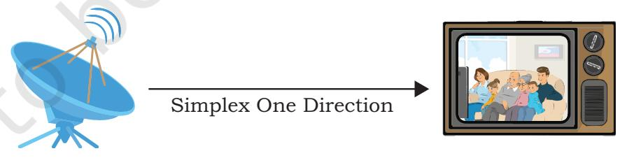

*Figure 11.3: Simplex communication*

#### **11.4.2 Half-duplex Communication**

It is two way or bidirectional communication between two devices in which both the devices can send and receive data or control signals in both directions, but not at the same time, as shown in Figure 11.4. While one device is sending data, the other one will receive and vice-versa. It is like sharing a one-way narrow bridge among vehicles

Chpater-11.indd 206 11-09-2020 15:10:08

moving in both directions. Vehicles cannot pass the bridge simultaneously. Basically, it is a simplex channel where the direction of transmission can be switched. Application of such type of communication can be found in walkie-talkie where one can press the push-to-talk button and talk. This enables the transmitter and turns off the receiver in that device and others can only listen.

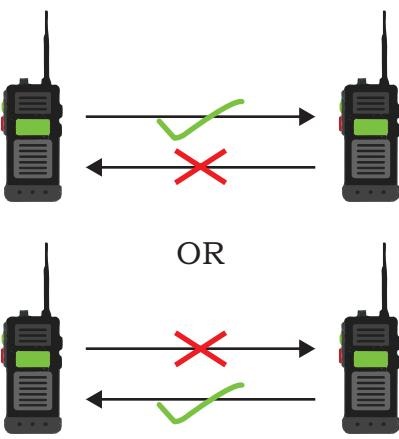

*Figure 11.4: Half-duplex where communication occurs in two different moments.*

### **11.4.3 Full-duplex Communication**

It is two way or bidirectional communication in which both devices can send and receive data simultaneously, as shown in Figure 11.5. It is like a two way road where vehicles can go in both directions at the same time. This type of communication channel is employed to allow simultaneous communication, for example, in our mobile phones and landline telephones. The capacity of the transmission link is shared between the signals going in both directions. This can be done either by using two physically separate simplex lines — one for sending and other for receiving, or the capacity of the single channel is shared between the signals travelling in different directions.

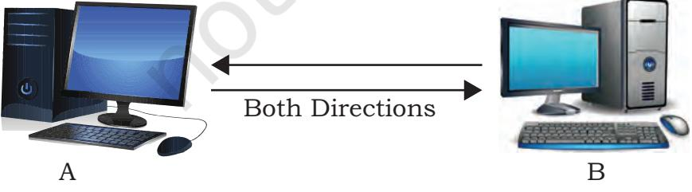

*Figure 11.5: Full duplex transmission of data*

### **Notes**

Chpater-11.indd 207 11-09-2020 15:10:08

VoIP is a communication methodology designed to deliver both voice and multimedia communications over Internet protocol.

(VoLTE) is a standard for highspeed wireless communication for mobile phones, including IoT and wearables.

### **11.5 Switching Techniques**

In a network having multiple devices, we are interested to know how to connect the sender and receiver so that one-to-one communication is possible. One solution is to make a dedicated connection between each pair of devices (mesh topology) or between a central device and every other device (a star topology). However, we know that such methods are costly in case of large networks.

An alternative to this is switching whereby data is routed through various nodes in a network. This switching process forms a temporary route for the data to be transmitted. Two commonly used switching techniques are — Circuit Switching and Packet Switching.

### **11.5.1 Circuit Switching**

In circuit switching, before a communication starts, a dedicated path is identified between the sender and the receiver. This path is a connected sequence of links between network nodes. All packets follow the same path established during the connection.

In earlier days, when we placed a telephone call, the switching equipment within the telephone system finds out a physical path or channel all the way from our telephone at home to the receiver's telephone. This is an example of circuit switching.

### **11.5.2 Packet Switching**

In packet switching, each information or message to be transmitted between sender and receiver is broken down into smaller pieces, called packets. These packets are then transmitted independently through the network. Different packets of the same message may take different routes depending on availability.

Each packet has two parts — a header containing the address of the destination and other information, and the main message part. When all the packets reach the destination, they are reassembled and the complete message is received by the receiver.

Unlike circuit switching, a channel is occupied in packet switching only during the transmission of the packet. On completion of the transmission, the channel is available for transfer of packets from other communicating parties.

Chpater-11.indd 208 11-09-2020 15:10:09

### **11.6 Transmission Media**

A transmission medium can be anything that can carry signals or data between the source (transmitter) and destination (receiver). For example, as we switch on a ceiling fan or a light bulb, the electric wire is the medium that carries electric current from switch to the fan or bulb. Two men are talking as shown in Figure 11.6. Here the medium is air.

*Figure 11.6: Two person communicating*

In data communication, transmission media are the links that carry messages between two or more communicating devices. Transmission can be classified as guided or unguided. Figure 11.7 shows the classification of communication media.

In guided transmission, there is a physical link made of wire/cable through which data in terms of signals are propagated between the nodes. These are usually metallic cable, fiber-optic cable, etc. They are also known as wired media.

In unguided transmission, data travels in air in terms of electromagnetic waves using an antenna. They are also known as wireless media.

**Notes**

Chpater-11.indd 209 11-09-2020 15:10:09

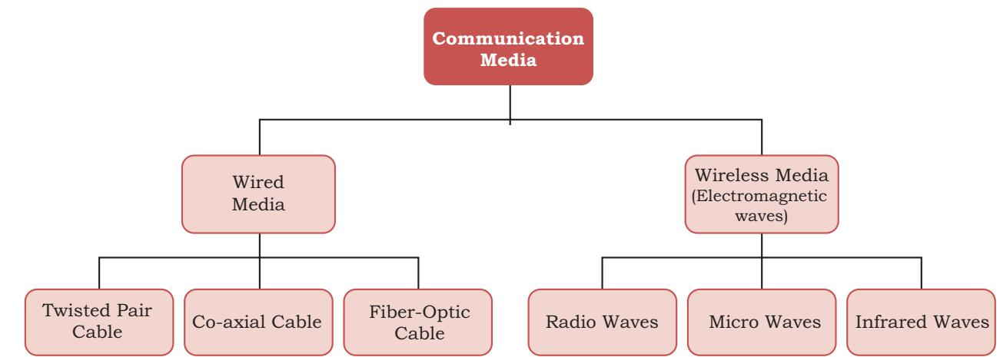

*Figure 11.7: Classification of communication media*

Dish-shaped antennas are used for sending and receiving data at longer distances. These antennas are mounted on taller buildings so that it would be in line-ofsight. Waves gradually become weaker and weaker after travelling a certain distance through the air. Therefore repeaters are installed to regenerate the signals of the same energy.

### **11.6.1 Wired Transmission Media**

Any physical link that can carry data in the form of signals belongs to the category of wired transmission media. Three commonly used guided/wired media for data transmission are, twisted pair, coaxial cable, and fiber optic cable. Twisted-pair and coaxial cable carry the electric signals whereas the optical fiber cable carries the light signals.

### *(A) Twisted Pair Cable*

A twisted-pair consists of two copper wires twisted like a DNA helical structure. Both the copper wires are insulated with plastic covers. Usually, a number of such pairs are combined together and covered with a protective outer wrapping, as shown in Figure 11.8.

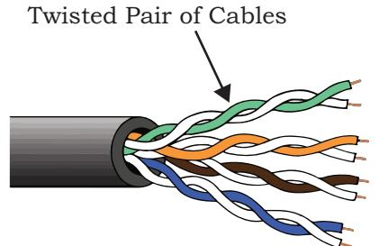

*Figure 11.8: Twisted pair of cables*

Chpater-11.indd 210 11-09-2020 15:10:09

Each of the twisted pairs act as a single communication link. The use of twisted configuration minimises the effect of electrical interference from similar pairs close by. Twisted pairs are less expensive and most commonly used in telephone lines and LANs. These cables are of two types: Unshielded twisted-pair (UTP) and Shielded twisted-pair (STP), as shown in Figure 11.9.

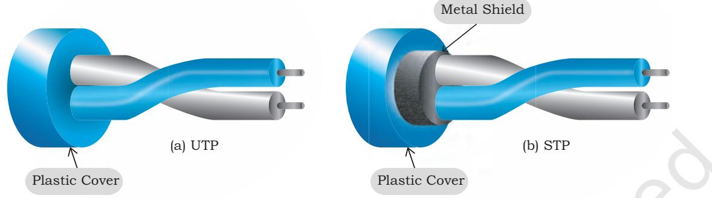

*Figure 11.9: UTP Cable and STP Cable*

### *(B) Coaxial cable*

Coaxial cable is another type of data transmission medium. It is better shielded and has more bandwidth than a twisted pair. As shown in Figure 11.10, it has a copper wire at the core of the cable which is surrounded with insulating material. The insulator is further surrounded with an outer conductor (usually a copper mesh). This outer conductor is wrapped in a plastic cover. The key to success of coaxial cable is its shielded design that allows the cable's copper core to transmit data quickly, without interference of environmental factors. These types of cables are used to carry signals of higher frequencies to a longer distance.

Backbone networks interconnect different segments of the network and provide a path to exchange information between different LANs or subnetworks..

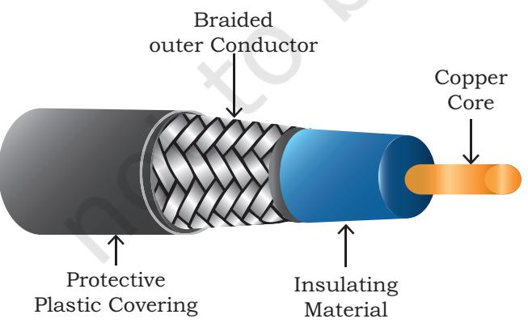

*Figure 11.10: A coaxial cable* 

Computer Science - Class XII Data Communication 211

Chpater-11.indd 211 11-09-2020 15:10:10

The number of oscillations a wave makes per second is called its frequency, and it is measured in Hz (Hertz).

### *(C) Optical Fibre*

The optical fiber cable carries data as light, which travels inside a thin fiber of glass (Figure 11.11). Optic fiber uses refraction to direct the light through the media. A thin transparent strand of glass at the centre is covered with a layer of less dense glass called cladding. This whole arrangement is covered with an outer jacket made of PVC or Teflon. Such types of cables are usually used in backbone networks. These cables are of light weight and have higher bandwidth which means higher data transfer rate. Signals can travel longer distances and electromagnetic noise cannot affect the cable. However, optic fibers are expensive and unidirectional. Two cables are required for full duplex communication.

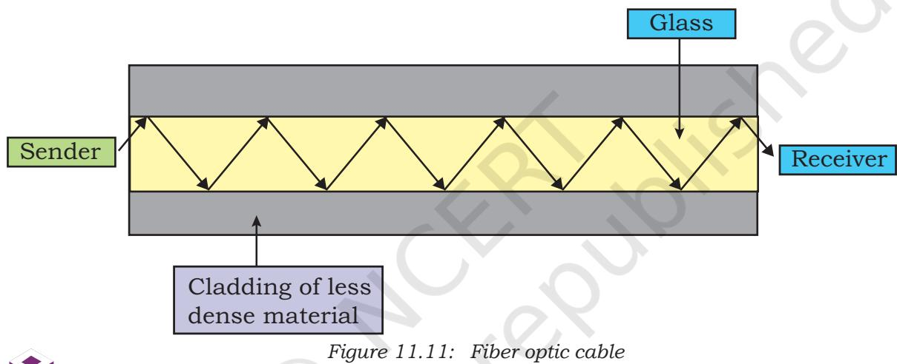

Geostationary satellites orbiting around the Earth are used to deliver broadband Internet service, similar to the way satellite is used for television and telephone signals. These satellites use microwaves for communication between a satellite dish placed at our home and the hub of satellite internet service providers.

### **11.6.2 Wireless Transmission Media**

In wireless communication technology, information In wireless communication technology, information travels in the form of electromagnetic signals through air. Electromagnetic spectrum of frequency ranging from 3 KHz to 900 THz is available for wireless communication (Figure 11.12). Wireless technologies allow communication between two or more devices in short to long distance without requiring any physical media. There are many types of wireless communication technologies such as Bluetooth, WiFi, WiMax etc.

The electromagnetic spectrum range (3KHz to 900THz) can be divided into 4 categories (Figure 11.12) - Radio waves, Microwaves, Infrared waves and Visible or Light waves, according to their frequency ranges. Some

Chpater-11.indd 212 11-09-2020 15:10:10

of the properties of each wave are listed in Table 11.1. of these, three are useful for wireless communication. **Electromagnetic Wave Spectrum**

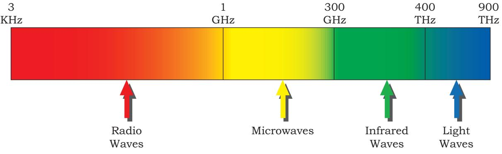

*Figure 11.12: Electromagnetic waves spectrum*

**Table 11.1 Classification of transmission waves and their properties**

| Transmission |  | Properties |
| --- | --- | --- |
| Waves |  |  |
| Radio Waves | 1. | Waves of frequency range 3 KHz - 1 GHz |
|  | 2. | Omni-directional, these waves can move in all directions |
|  | 3. | Radio waves of frequency 300KHz-30MHz can travel long distance |
|  | 4. | Susceptible to interference |
|  | 5. | Radio waves of frequency 3-300KHz can penetrate walls |
|  | 6. | These waves are used in AM and FM radio, television, cordless phones. |
| Microwaves | 1. | Electromagnetic waves of frequency range 1GHz - 300GHz. |
|  | 2. | Unidirectional, can move in only one direction. |
|  | 3. | Cannot penetrate solid objects such as walls, hills or mountains. |
|  | 4. | Needs line-of-sight propagation i.e. both communicating antenna must |
|  |  | be in the direction of each other. |
|  | 5. | Used in point-to-point communication or unicast communication such |
|  |  | as radar and satellite. |
|  | 6. | Provide very large information-carrying capacity. |
| Infrared waves | 1. | Electromagnetic waves of frequency range 300GHz - 400THz. |
|  | 2. | Very high frequency waves. |
|  | 3. | Cannot penetrate solid objects such as walls. |
|  | 4. | Used for short-distance point-to-point communication such as mobile |
|  |  | to-mobile, mobile-to-printer, remote-control-to-TV, and Bluetooth |
|  |  | enabled devices to other devices like mouse, keyboards etc. |

### **11.6.3 Wireless Technologies**

### *(A) Bluetooth*

Bluetooth is a short-range wireless technology that can be used to connect mobile-phones, mouse, headphones, keyboards, computers, etc. wirelessly over a short distance. One can print documents with bluetooth-

Chpater-11.indd 213 11-09-2020 15:10:10

enabled printers without a physical connection. All these bluetooth-enabled devices have a low cost transceiver chip. This chip uses the unlicensed frequency band of 2.4 GHz to transmit and receive data. These devices can send data within a range of 10 meters with a speed of 1 - 2 Mbps.

In Bluetooth technology, the communicating devices within a range of 10 meters build a personal area network called piconet. The devices in a piconet work in a master-slave configuration. A master device can communicate with up to 7 active slave devices at the same time.

Bluetooth technology allows up to 255 devices to build a network. Out of them, 8 devices can communicate at the same time and remaining devices can be inactive, waiting for a response command from the master device.

### *(B) Wireless LAN*

This is another way of wireless communication. Wireless LAN is a local area network (LAN), and it is a popular way to connect to the Internet. The international organisation IEEE assigns numbers to each different standards of LAN. The wireless LAN is number as 802.11, and it is popularly known as Wi-Fi.

These networks consist of communicating devices such as laptops and mobile phones, as well as the network device called APs (access points) which is installed in buildings or floors (Figure 11.13). An access point is a device that is used to create a wireless local area network, by connecting to a wired router, switch,

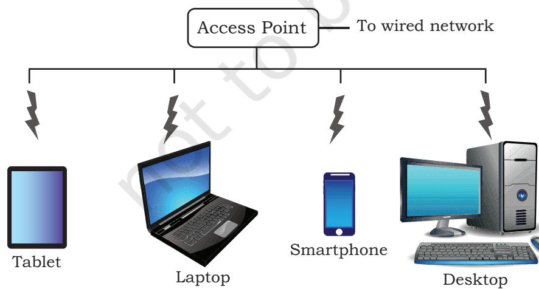

*Figure 11.13: Access point creating a wireless LAN*

or hub. The APs are connected to a wired network, and all the devices communicate or access the Internet through an access point.

Wi-Fi gives users the flexibility to move around within the network area while being connected to the network. Following are some of the benefits of WLAN:

Chpater-11.indd 214 11-09-2020 15:10:10

- Wireless connections can be used to extend or replace an existing wired infrastructure
- Resulted in increased access for mobile devices
- Provides easy access to the Internet in public places

### **11.7 Mobile Telecommunication Technologies**

Today the mobile phone network is the most used network in the world. The ability to be connected to the network on-the-go makes it very convenient to communicate with people via call or instant messages. It is also handy to access the Internet using the mobile phone network through wireless connection. Besides, the Internet of Things (IoT) is letting us control and communicate with other smart devices as well.

The architecture of the mobile network has rapidly evolved over the last few decades. The different landmark achievements in mobile communication technologies are classified as different generations. They are identified as 1G, 2G, 3G, 4G, and 5G. Let us briefly discuss the mobile telecommunication generations.

The first generation (1G) mobile network system came around 1982. It was used to transmit only voice calls. The analog signals were used to carry voices between the caller and receiver.

The second generation (2G) mobile network system came around 1991. Instead of analog signals, voice calls were transmitted in digital form thus providing improved call quality. This increased capacity allowed more people to talk simultaneously, and led to improved security as the signals could be encrypted. It also enabled an additional service to send SMS and MMS (Multimedia messages).

The third generation (3G) mobile network technology was developed during late 90s, but it was introduced commercially around 2001. It offered both digital voice and data services. 3G provided Internet access via the same radio towers that provide voice service to the mobile phone. It facilitated greater voice and data capacity. Therefore, more simultaneous calls could happen in the same frequency range and also a significantly faster data transfer speed.

Demand for faster data is always increasing and thus 4G mobile networks were developed and now

WiMax stands for Worldwide Interoperability for Microwave Access. Like Wi-Fi, it is also used for communication in wireless networks but there is a difference. Whereas Wi-Fi is used to form small wireless networks (WLANs), WiMax uses a larger spectrum to deliver connections to various devices on the network. It has a higher data transfer rate and can span over a larger area. That is why it is used in MAN applications.

Chpater-11.indd 215 11-09-2020 15:10:10

Explore how 5G can impact society.

5G networks have also come into being. 4G is much faster than 3G and this has revolutionised the field of telecommunication by bringing the wireless experience to a new level altogether. 4G systems support interactive multimedia, voice, video, wireless internet and other broadband services. Technologically, 4G is very different compared to 3G.

The fifth generation or 5G is currently under development. It is expected to be a milestone development for the success of IoT and Machine to Machine (M2M) communications. Machine to machine (M2M) is direct communication between devices — wired and wireless. 5G is expected to allow data transfer in Gbps, which is much faster than 4G. It is expected to be able to support all the devices of the future such as connected vehicles and the Internet of Things.

### **11.8 Protocol**

In communication, Protocol is a set of standard rules that the communicating parties — the sender, the receiver, and all other intermediate devices need to follow. We know that the sender and receiver can be parts of different networks, placed at different geographic locations. Besides, the data transfer rates in different networks can vary, requiring data to be sent in different formats.

#### **11.8.1 Need for Protocols**

We need protocols for different reasons such as flow control, access control, addressing, etc. Flow control is required when the sender and receiver have different speeds of sending and receiving the data. Figure 11.14 shows that Computer A is sending data at the speed of 1024 Mbps and computer B is receiving data at the speed of 512 Mbps. In this case, Computer B must be able to inform computer A about the speed mismatch so that computer A can adjust its data transmission rate. Otherwise some data will be lost, as shown in Figure 11.14.

Access control is required to decide which nodes in a communication channel will access the link shared among them at a particular instant of time. Otherwise, the transmitted data packets will collide if computers are sending data simultaneously through the same link resulting in the loss or corruption of data.

Chpater-11.indd 216 11-09-2020 15:10:10

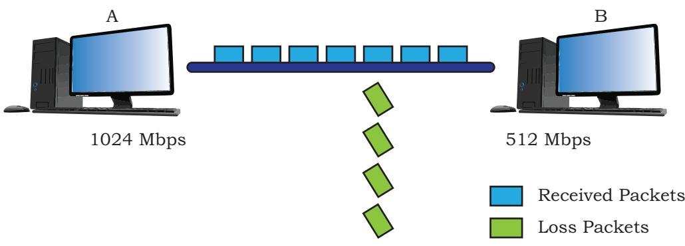

*Figure 11.14: Speed mismatch between two computers can result into loss of data*

### **Protocols also define:**

- how computers identify one another on a network.
- the form to which the data should be converted for transit.
- how to decide whether the data received is for that node or to be forwarded to another node.
- ensuring that all the data have reached the destination without any loss.
- how to rearrange the packets and process them at the destination.

If all the rules or protocols of a communication network are defined at one place, it becomes complex to ensure that communicating parties follow the guidelines. In this section, we will briefly talk about some of the protocols required in communication.

### **11.8.2 HyperText Transfer Protocol (HTTP)**

HTTP stands for HyperText Transfer Protocol. It is the primary protocol used to access the World Wide Web. Tim Berners-Lee led the development of HTTP at CERN in 1989 in collaboration with Internet Engineering Task Force (IETF) and the World Wide Web Consortium (W3C).

HTTP is a request-response (also called clientserver) protocol that runs over TCP. The common use of HTTP is between a web browser (client) and a web server (server). HTTP facilitates access of hypertext from the World Wide Web by defining how information are formatted and transmitted, and how the Web servers and browsers should respond to various commands.

Hypertext refers to a document that contains images or text that can be linked to another document or text.

Chpater-11.indd 217 11-09-2020 15:10:10

A web page is written using a markup language like HTML and is stored on a web server for access via its URL. Once a user opens a web browser and types in the URL of the intended web page, a logical communication link between the user machine (client) and the web server is created using HTTP.

For example, whenever we enter the URL http// www.ncert.nic.in in a browser, it sends HTTP request to the web-server where ncert.nic.in is hosted. The HTTP response from the web-server fetches and sends the requested Web-page, which is displayed on your browser.

### **11.8.3 File Transfer Protocol (FTP)**

File Transfer Protocol (FTP) is the protocol used for transferring files from one machine to another. Like HTTP, FTP also works on a client-server model.

When a user requests for a file transfer with another system, FTP sets up a connection between the two nodes for accessing the file. Optionally, the user can authenticate using user ID and password. The user then specifies the file name and location of the desired file. After that, another connection sets up and the file transfer happens directly between the two machines. However, some servers provide FTP logins without authentication for accessing files.

File transfer between two systems seems simple and straightforward because FTP takes care of issues between two communicating devices, such as:

- use of different conventions while naming files.
- representation of text and data in different formats.
- having different directory structure

### **11.8.4 Point to Point Protocol (PPP)**

PPP is a communication protocol which establishes a dedicated and direct connection between two communicating devices. This protocol defines how two devices will authenticate each other and establish a direct link between them to exchange data. For example, two routers with direct connection communicate using PPP. The Internet users who connect their home computers to the server of an Internet Service Provider (ISP) through a modem also use PPP.

The communicating devices should have duplex modes for using this protocol. This protocol maintains

Chpater-11.indd 218 11-09-2020 15:10:10

data integrity ensuring that the packets arrive in order. It intimates the sender about damage or lost packets and asks to resend it.

### **11.8.5 Simple Mail Transfer Protocol (SMTP)**

SMTP is a protocol used for email services. It uses information written on the message header (like an envelope on a letter sent by post), and is not concerned with the content of the email message. Each email header contains email addresses of recipients. The email containing header and body are entered into a queue of outgoing mails.

The SMTP sender program takes mails from the outgoing queue and transmits them to the destination(s). When the SMTP sender successfully delivers a particular mail to one or more destinations, it removes the corresponding receiver's email address from the mail's destination list. When that mail is delivered to all the recipients, it is removed from the outgoing queue. The SMTP receiver program accepts each mail that has arrived and places it in the appropriate user mailbox.

### **11.8.6 Transmission Control Protocol (TCP)/ Internet Protocol (IP)**

TCP/IP stands for Transmission Control Protocol/ Internet Protocol. It is a set of standardised rules that uses a client-server model of communication in which a user or machine (a client) requests a service by a server in the network.

The IP protocol ensures that each computer or node connected to the Internet is assigned an IP address, which is used to identify each node independently. It can be considered to be the adhesive that holds the whole Internet together. TCP ensures that the message or data is broken into smaller chunks, called IP packets. Each of these packets are routed (transmitted) through the Internet, along a path from one router to the next, until it reaches the specified destination. TCP guarantees the delivery of packets on the designated IP address. It is also responsible for ordering the packets so that they are delivered in sequence.

There are many redundant connection paths in the Internet, with backbones and ISPs connecting to each other in multiple locations. So, there are many **Activity 11.3**

Find and list other Email Protocols.

Chpater-11.indd 219 11-09-2020 15:10:10

possible paths between two hosts. Hence, two packets of the same message can take two different routes depending on congestion and other factors in different possible routes. When all the packets finally reach the destination machine, they are reassembled into the original message at the receiver's end.

### **Summary**

- Data communication refers to the exchange of data between two or more networked or connected devices like laptops, PC, printers, routers etc.
- Sender, receiver, messages, channel and protocols are major components of data communication.
- In data communication, transmission media are the links that carry messages between two or more communicating devices. These are broadly classified into guided and unguided media.
- In guided transmission, there is a physical link made of wire/cable through which data in terms of signals are propagated between the nodes. These are usually metallic cable, fiber-optic cable, etc. They are also known as wired media.
- In unguided transmission, data travels in air in terms of electromagnetic waves using an antenna. They are also known as wireless media.
- The capacity of channels is measured in bandwidth. The unit of bandwidth is Hertz.
- Communication can be done in three different modes — simplex, half-duplex, and full-duplex communication.
- Switching techniques are alternative to dedicated lines whereby data is routed through various nodes in a network. It forms a temporary route for the data to be transmitted. Two commonly used switching techniques are – circuit switching and packet switching.
- Electromagnetic spectrum of frequency ranging from 3 KHz to 900 THz is available for wireless communication. This spectrum range (3KHz to 900THz) can be divided into four categories- Radio

Chpater-11.indd 220 11-09-2020 15:10:10

waves, Microwaves, Infrared waves and Visible or Light waves, according to their frequency ranges.

- Bluetooth is a short-range wireless technology that can be used to connect mobile-phones, mouse, headphones, keyboards, computers, etc. wirelessly over a short distance.
- Based on the architecture of the mobile network, mobile communication technologies are classified into different generations identified as 1G, 2G, 3G, 4G, and 5G.
- In communication, protocol is a set of standard rules that the communicating parties — the sender, the receiver, and all other intermediate devices need to follow. Flow control, access control, addressing, etc. are examples of protocol.
- HTTP stands for HyperText Transfer Protocol. It is the primary protocol used to access the World Wide Web, which was developed by Tim Berners-Lee at CERN in 1989.
- File Transfer Protocol (FTP) is the protocol used for transferring files from one machine to another. Like HTTP, FTP also works on a clientserver model.
- Point-to-Point protocol (PPP) defines how two devices will authenticate each other and establish a direct link between them to exchange data.
- TCP/IP stands for Transmission Control Protocol/ Internet Protocol. It is a set of standardised rules that uses a client-server model of communication in which a user or machine (a client) requests a service by a server in the network.

### **Exercise**

- 1. What is data communication? What are the main components of data communication?
- 2. Which communication mode allows communication in both directions simultaneously?
- 3. Among LAN, MAN, and WAN, which has the highest speed and which one can cover the largest area?

Chpater-11.indd 221 11-09-2020 15:10:10

- 4. What are three categories of wired media? Explain them.
- 5. Compare wired and wireless media.
- 6. Which transmission media carries signals in the form of light?
- 7. List out the advantages and disadvantages of optical fiber cable.
- 8. What is the range of frequency for radio waves?
- 9. 18 Gbps is equal to how many Bits per second?
- 10. HTTP stands for?
- 11. Write short note on the following:
	- a) HTTP
	- b) Bandwidth
	- c) Bluetooth
	- d) DNS
	- e) Data transfer rate
- 12. What is protocol in data communication? Explain with an example.
- 13. A composite signal contains frequencies between 500 MHz and 1GHz. What is the bandwidth of a signal?

Chpater-11.indd 222 11-09-2020 15:10:10

