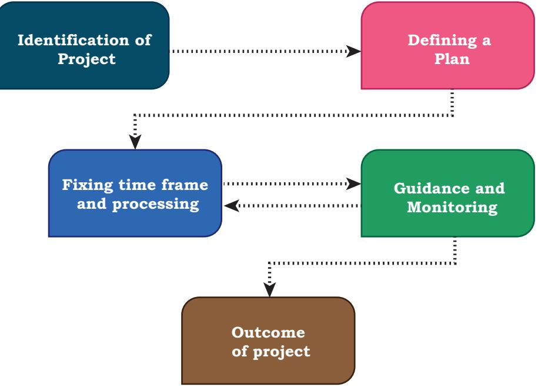

# **Project Based Learning 13**

**Chapter**

## *In this Chapter*

- » *Introduction*
- » *Approaches for Solving Projects*
- » *Teamwork*
- » *Project Descriptions*

*"An idea that is developed and put into action is more important than idea that exists only as an idea."* 

*— Gautam Buddha*

## **13.1 Introduction**

Project based learning gives a thorough practical exposure to students regarding a problem upon which the project is based. Through project based learning, students learn to organise their project and use their time effectively for successful completion of the project. Projects are developed generally in groups where students can learn various skills such as working together, problem solving, decision making, and investigating activities. Project based learning involves the steps such as analysing the problem, formulating the problem into small modules, applying the mechanism or method to solve each module and then integrating the solution of all the modules to arrive at the complete solution of the problem. To solve a problem, it is required that those who work on it gather the relevant data and process it by applying a particular method. Data may

Chpater-13.indd 241 11-09-2020 16:42:44

be collected as per the requirement of the project in a particular format. All the team members should be associated to accomplish the task. After collecting data, it should be processed to solve the problem. The results should be reported in a predetermined format.

## **13.2 Approaches for Solving Projects**

The approach followed for the development and completion of a project plays a pivotal role in project based learning. There are several approaches to execute a project such as modular approach, top down approach and bottom up approach. A structured or a modular approach to a project means that a project is divided into various manageable modules and each of the modules has a well-defined task to be performed with a set of inputs. This would lead to a set of outputs which when integrated leads to the desired outcome.

Different steps involved in project based learning (Figure 13.1) are :

- (1) **Identification of a project:** The project idea may come through any real-life situation. For example, one could think of doing a project for organising a seminar. One needs to understand the usefulness of the project and its impact. Students must be encouraged to undertake interdisciplinary projects.
- (2) **Defining a plan:** Normally for any kind of project, there are several project members involved in it. One project leader has to be identified. The roles of project leader and each project member have to be clearly defined. Students who are performing a project must be assigned with specific activities. The various tools for executing these activities must be known. To obtain a better solution, one should always think of the extreme situations.
- (3) **Fixing of a time frame and processing:** Every project is a time relevance project. A student must understand the importance of time frame for completion of the project. All the activities which are performed in the projects require a certain amount of time. Every project must be well structured and at the same time it must be flexible in its time frame.

Chpater-13.indd 242 11-09-2020 16:42:44

*Figure 13.1: Steps in project based learning* 

- (4) **Providing guidance and monitoring a project:** Many times, the participants in the project get stuck up with a particular process and it becomes impossible to proceed further. In such a case, they need guidance, which can be obtained from various resources such as books, websites and experts in the field. While it is essential that the project leader should ensure monitoring of the project, the guide teacher also helps in monitoring the project.
- (5) **Outcome of a project:** One needs to understand thoroughly the outcome of a project. The outcome can be single, or it can be multiple. The output of a project can be peer reviewed and can be modified as per the feedback from the guide teacher or other users.

### **13.3 Teamwork**

Many real-life tasks are very complex and require a lot of individuals to contribute in achieving them. Efforts made by individuals collectively to accomplish a task is called teamwork.

For example, in many sports, there is a team of players. These players play together to win a match. Take an example of a cricket team. We find that even if a bowler bowls a good ball but if the fielder cannot take

Chpater-13.indd 243 11-09-2020 16:42:44

a catch then the wicket cannot be taken. So, in order to take a catch, efforts of a bowler as well as of fielders are needed. To win a cricket match, contributions from all the team members in all the three areas batting, bowling and fielding are required.

## **13.3.1 Components of Teamwork**

Apart from technical proficiency, a wide variety of other components make a successful teamwork. It comprises skilled team members with specific roles to achieve the goal.

## *(A) Communicate with Others*

When a group of individuals perform one job, it is necessary to have effective communication between the members of the team. Such communication can be done via e-mails, telephones or by arranging group meetings. This helps the team members to understand each other and sort out their problems to achieve the goal effectively.

## *(B) Listen to Others*

It is necessary to understand the ideas of others while executing a job together. This can be achieved when the team members listen to each other in group meetings and follow steps that are agreed upon.

## *(C) Share with Others*

Ideas, images and tools need to be shared with each other in order to perform a job. Sharing is an important component of teamwork. Any member of the team who is well versed in a certain area should share the expertise and experience with others to effectively achieve the goal within the time frame.

## *(D) Respect for Others*

Every member of the team must be treated respectfully. All the thoughts and ideas that are put forth in the group meetings may be respected and duly considered. Not respecting the views of a particular member may cause problems and that particular team member may not give his best.

#### *(E) Help Others*

A helping hand from every member is a key to success. Sometimes help from people who are not a part of the team is also obtained in order to accomplish a job.

Chpater-13.indd 244 11-09-2020 16:42:44

## *(F) Participate*

All the team members must be encouraged by each other to participate in completing the project and also in discussions in group meetings. Also, every member should take an active participation so that they feel their importance in the team.

## **13.4 Project Descriptions**

In this section, some examples of project works are given, which can be taken up in groups under project based learning. However, a group may choose any other project in consultation with the guide teacher.

#### **Project Title 1: Automation of Order Processing in a Restaurant**

#### **Description**

A new restaurant "Stay Healthy" is coming up in your locality. The owner/management of the restaurant wants to use a computer to generate bills and maintain other records of the restaurant. Your team is asked to develop an application software to automate the order placing and associated processes.

#### **Specifications**

Make a group of students to undertake a project on automating the order processing of the restaurant 'Stay Healthy'. The owner of the restaurant wants the following specific functionalities to be made available in the developed application:

- There should be two types of Login options one for the manager of the joint and other for the customer.
- Kiosk(s) running the software for customers will be placed at reception for placing the order. On the opening screen, menu for placing orders will be displayed.
- To place orders, customers will enter Item Code(s) and quantity desired.
- After placing an order, a soft copy of the bill will be displayed on the kiosk, having an Order Number.
- Every bill will have a unique identification (such as combination of date, and order number of the day) and should be saved in the data file/database.
- Order Number starts from 1 every day.

**Notes**

Chpater-13.indd 245 11-09-2020 16:42:44

- For Manager login—provision for entry/change of Menu, deletion of Order (on demand) and generation of following report is desired.
	- 9 A Report giving Summary of the Sales made on a Day. Program should accept the date for which the Summary is required.
- Add at least one more relevant report of your choice to the program.

#### **Project Title 2 : Development of a Puzzle**

#### **Description**

Implement a puzzle solving game in Python. The game presents a grid board composed of cells to the player, in which some cells have Bomb. Player is required to clear the board (of the bomb), without detonating any one of them with the help of clue(s) provided on the board.

#### **Specifications**

For clearing the board, the player will click a cell on the board, if the cell contains a bomb, the game finishes. If the cell does not contain a bomb, then the cell reveals a number giving a clue about the number of bombs hidden in adjacent cells.

Before you start coding the game, play any Minesweeper game five times. This will help you in proper understanding of your project. To reduce the complexity of the program you can fix the grid size to 6x6 and number of bombs to 6.

*Note:* Do ensure to handle various exception(s) which may occur while playing the game, in your code.

#### **Project Title 3 : Development of an Educational Game**

#### **Description**

You are a member of the ICT club of your school. As a club member, you are given the responsibility of identifying ways to improve mathematical skills of kids, in the age group of 5-7 years. One of the club members suggested developing an Edutainment Game named "Match the Sum" for it. Match the Sum will hone summing skills of student(s), by allowing them to form number 10 by adding 2/3 digits.

Chpater-13.indd 246 11-09-2020 16:42:44

## **Specifications**

Following are the details of provisions required for program:

- Display a list of 15 cells on screen, where each cell can hold a digit (1 to 9)
- Randomly generate a digit at a time and place it in the list from the right end. Program will keep on generating digits at equal intervals of time and place it in the rightmost cell. (Already existing digits, will be shifted left, by one cell, with every new addition of digits' in the list)
- For playing the game, students' will be allowed to type 2/3 digits (one at a time) currently displayed in the list of cells.
- If the sum of those digits is 10, then those digits should get removed from the list of cells.
- Game will continue till there is an empty cell to insert a digit in the list of cells.

*Note:* Do take care of the situation when digits displayed in a list of cells do not add up to 10.

Chpater-13.indd 247 11-09-2020 16:42:44

Chpater-13.indd 248 11-09-2020 16:42:44

