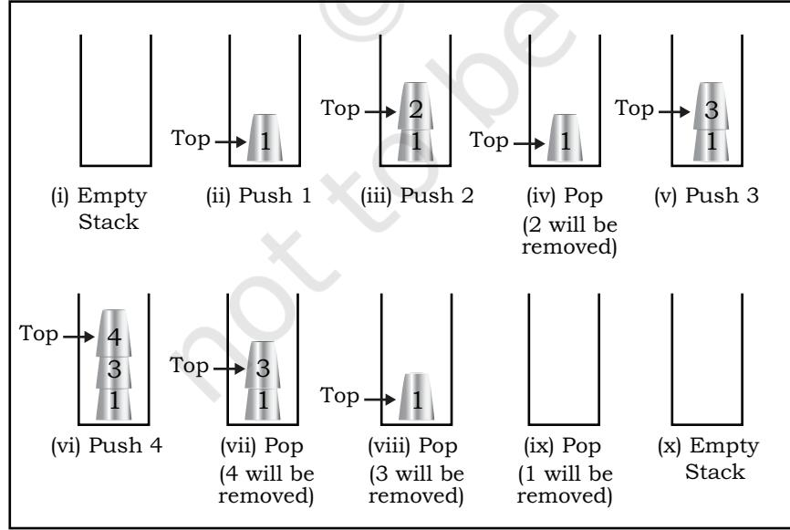
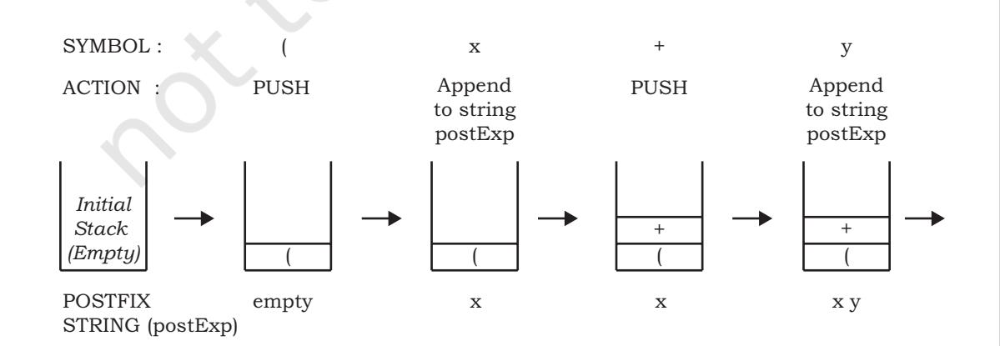

# *In this Chapter*

- » *Introduction*
- » *Stack*
- » *Operations on Stack*
- » *Implementation of Stack in Python*
- » *Notations for Arithmetic Expressions*
- » *Conversion From Infix To Postfix Notation*
- » *Evaluation of Postfix Expression*

*"We're going to be able to ask our computers to monitor things for us, and when certain conditions happen, are triggered, the computers will take certain actions and inform us after the fact."*

*— Steve Jobs*

# **3.1 Introduction**

We have learnt about different data types in Python for handling values in Class XI. Recall that String, List, Set, Tuple, etc. are the sequence data types that can be used to represent collection of elements either of the same type or different types. Multiple data elements are grouped in a particular way for faster accessibility and efficient storage of data. That is why we have used different data types in python for storing data values. Such grouping is referred as a data structure.

A data structure defines a mechanism to store, organise and access data along with operations (processing) that can be efficiently performed on the data. For example, string is a data structure containing a sequence of elements where each element is a character. On the other hand, list is a sequence data structure in which each element may be of different types. We can apply different operations like reversal, slicing, counting of

Chpater-3.indd 39 18-Jun-21 2:30:02 PM

Other important data structures in Computer Science include Array, Linked List, Binary Trees, Heaps, Graph, Sparse Matrix, etc.

A data structure in which elements are organised in a sequence is called linear data structure.

elements, etc. on list and string. Hence, a data structure organises multiple elements in a way so that certain operations on each element as well as the collective data unit could be performed easily.

*Stack* and *Queue* are two other popular data structures used in programming. Although not directly available in Python, it is important to learn these concepts as they are extensively used in a number of programming languages. In this chapter, we will study about stack, its implementation using Python as well as its applications.

#### **3.2 Stack**

We have seen piles of books in the library or stack of plates at home (Figure 3.1). To put another book or another plate in such a pile, we always place (add to the pile) the object at the top only. Likewise, to remove a book or a plate from such a pile, we always remove (delete from the pile) the object from the top only. This is because in a large pile, it is inconvenient to add or remove an object from in between or bottom. Such an arrangement of elements in a linear order is called a stack. We add new elements or remove existing elements from the same end, commonly referred to as the *top* of the stack. It thus follows the Last-In-First-out (LIFO) principle. That is, the element which was inserted last (the most recent element) will be the first one to be taken out from the stack.


*Figure 3.1: Stack of plates and books*


Chpater-3.indd 40 18-Jun-21 2:30:02 PM

### **3.2.1 APPLICATIONS OF STACK**

Some of the applications of stack in real-life are:

- Pile of clothes in an almirah
- Multiple chairs in a vertical pile
- Bangles worn on wrist
- Pile of boxes of eatables in pantry or on a kitchen shelf

Some examples of application of stack in programming are as follows:

- When we need to reverse a string, the string is traversed from the last character till the first character. i.e. characters are traversed in the reverse order of their appearance in the string. This is very easily done by putting the characters of a string in a stack.
- We use text/image editor for editing the text/image where we have options to redo/undo the editing done. When we click on the redo /undo icon, the most recent editing is redone/undone. In this scenario, the system uses a stack to keep track of changes made.
- While browsing the web, we move from one web page to another by accessing links between them. In order to go back to the last visited web page, we may use the back button on the browser. Let us say we accessed a web page P1 from where we moved to web page P2 followed by browsing of web page P3. Currently, we are on web page P3 and want to revisit web page P1. We may go to a previously visited web page by using the BACK button of the browser. On clicking the BACK button once, we are taken from web page P3 to web page P2, another click on BACK shows web page P1. In this case, the history of browsed pages is maintained as stack.
- While writing any arithmetic expression in a program, we may use parentheses to order the evaluation of operators. While executing the program, the compiler checks for matched parentheses i.e. each opening parenthesis should have a corresponding closing parenthesis and the pairs of parentheses are properly nested. In case of parentheses are

How does a compiler or an interpreter handle function calls in a program?

The operating system in computer or mobile allocates memory to different applications for their execution. How does an operating system keep track of the free memory that can be allocated among programs/ applications to be executed?

Chpater-3.indd 41 18-Jun-21 2:30:02 PM

mismatched, the compiler needs to throw an error. To handle matching of parentheses, stack is used.

### **3.3 Operations on Stack**

As explained in the previous section, a stack is a mechanism that implements LIFO arrangement hence elements are added and deleted from the stack at one end only. The end from which elements are added or deleted is called TOP of the stack. Two fundamental operations performed on the stack are PUSH and POP. In this section, we will learn about them and implement them using Python.

#### **3.3.1 PUSH and POP Operations**

- PUSH adds a new element at the TOP of the stack. It is an insertion operation. We can add elements to a stack until it is full. A stack is full when no more elements can be added to it. Trying to add an element to a full stack results in an exception called 'overflow'.
- POP operation is used to remove the top most element of the stack, that is, the element at the TOP of the stack. It is a delete operation. We can delete elements from a stack until it is empty i.e. there is no element in it. Trying to delete an element from an empty stack results in an exception called 'underflow'.



A stack is used to insert and delete elements in LIFO order. Same principle is followed in adding and removing glasses from a pile of glasses. Let us create a stack of glasses assuming that each glass is numbered. Visual representations of PUSH and POP operations on a stack of glasses are shown in Figure 3.2.

*Figure 3.2: PUSH and POP operations on the stack of glasses*

Chpater-3.indd 42 18-Jun-21 2:30:03 PM

# **3.4 Implementation of Stack in Python**

We have learnt so far that a stack is a linear and ordered collection of elements. The simple way to implement a stack in Python is using the data type *list*. We can fix either of the sides of the list as TOP to insert/remove elements. It is to be noted that we are using built-in methods append() and pop() of the list for implementation of the stack. As these built-in methods insert/delete elements at the rightmost end of the list, hence explicit declaration of TOP is not needed.

Let us write a program to create a STACK (stack of glasses as given in Figure 3.2) in which we will:

- insert/delete elements (glasses)
- check if the STACK is empty (no glasses in the stack)
- find the number of elements (glasses) in the STACK
- read the value of the topmost element (number on the topmost glass) in the STACK

The program shall define the following functions to perform these operations:

- Let us create an empty stack named glassStack. We will do so by assigning an empty list to the identifier named glassStack:
glassStack = list()

- A function named isEmpty to check whether the stack glassStack is empty or not. Remember trying to remove an element from an empty stack would result in 'underflow'. This function returns True if the stack is empty, else returns False.

```
def isEmpty(glassStack):
 if len(glassStack)==0:
 return True
 else:
 return False
```
- A function named opPush to insert (PUSH) a new element in stack. This function has two parameters - the name of the stack in which the element is to be inserted (glassStack) and the element that needs to be inserted. We know that insertion of an element is always done at the TOP of the stack. Hence, we
# **Notes**

Chpater-3.indd 43 18-Jun-21 2:30:03 PM

shall use the built-in method append() of list to add an element to the stack that always adds at the end of the list. As there is no limit on the size of list in Python, the implemented stack will never be full unless there is no more space available in memory. Hence, we will never face 'overflow' (no space for new element) condition for stack.

> def opPush(glassStack,element): glassStack.append(element)

- A function named size to read the number of elements in the glassStack. We will use the len() function of list in Python to find the number of elements in the glassStack.
def size(glassStack): return len(glassStack)

- A function named top to read the most recent element (TOP) in the glassStack.
def top(glassStack):

if isEmpty(glassStack):

print('Stack is empty')

return None

else:

```
 x =len(glassStack)
 element=glassStack[x-1]
 return element
```
• A function named opPop to delete the topmost element from the stack. It takes one parameter - the name of the stack (glassStack) from which element is to be deleted and returns the value of the deleted element. The function first checks whether the stack is empty or not. If it is not empty, it removes the topmost element from it. We shall use the builtin method pop() of Python list that removes the element from the end of the list.

```
def opPop(glassStack):
 if isEmpty(glassStack):
 print('underflow')
```

```
 return None
```
else:

```
 return(glassStack.pop())
```
Chpater-3.indd 44 18-Jun-21 2:30:03 PM

- • A function named display to show the contents of the stack.

```
def display(glassStack):
 x=len(glassStack)
 print("Current elements in the stack 
are: ")
 for i in range(x-1,-1,-1):
 print(glassStack[i])
```
Once we define the above functions we can use the following Python code to implement a stack of glasses. 

glassStack = list() # create empty stack

```
#add elements to stack
element='glass1'
print("Pushing element ",element)
opPush(glassStack,element)
element='glass2'
print("Pushing element ",element)
opPush(glassStack,element)
```

```
#display number of elements in stack
print("Current number of elements in stack 
is",size(glassStack))
```
#delete an element from the stack element=opPop(glassStack) print("Popped element is",element)

#add new element to stack element='glass3' print("Pushing element ",element) opPush(glassStack,element)

#display the last element added to the #stack print("top element is",top(glassStack))

#display all elements in the stack display(glassStack)

# **Notes**

Chpater-3.indd 45 11/10/2021 4:53:42 PM

```
#delete all elements from stack
while True:
   item=opPop(glassStack)
   if item == None: 
 print("Stack is empty now")
 break
   else:
 print("Popped element is",item)
The output of the above program will be as 
follows:
Pushing element glass1
Pushing element glass2
Current number of elements in stack is 2
Popped element is glass2
Pushing element glass3
top element is glass3
Current elements in the stack are:
glass3
glass1
Popped element is glass3
Popped element is glass1
Underflow
Stack is empty now
```
### **3.5 Notations for Arithmetic Expressions**

We write arithmetic expressions using operators in between operands, like x + y, 2 - 3 * y, etc. and use parentheses () to order the evaluation of operators in complex expressions. These expressions follow infix representation and are evaluated using BODMAS rule.

Polish mathematician Jan Lukasiewicz in the 1920's introduced a different way of representing arithmetic expression, called polish notation. In such notation, operators are written before their operands. So the order of operations and operands determines the result, making parentheses unnecessary. For example, we can write x+y in polish notation as +xy. This is also called prefix notation as we prefix the operator before operands.

By reversing this logic, we can write an expression by putting operators after their operands. For example, x+y can be written as xy+. This is called reverse polish

Chpater-3.indd 46 11/29/2021 10:43:52 AM

notation or postfix notation. To summarise, any arithmetic expression can be represented in any of the three notations viz. Infix, Prefix and Postfix and are listed in Table 3.1 with examples.

| Type of Expression | Description |  |  | Example |
| --- | --- | --- | --- | --- |
| Infix | Operators are placed in |  |  | x * y + z |
|  | between the operands |  |  | 3 *(4 + 5) |
|  |  |  |  | (x + y)/(z * 5) |
| Prefix | Operators are |  | placed | +z*xy |
| (Polish) | before the corresponding |  |  | *3+45 |
|  | operands |  |  | /+xy*z5 |
| Postfix | Operators | are | placed | xy*z+ |
| (Reverse Polish) | after the corresponding |  |  | 345+* |
|  | operands |  |  | xy+z5*/ |

**Table 3.1 Infix, Prefix and Postfix Notations**

# **3.6 Conversion from Infix to Postfix Notation**

It is easy for humans to evaluate an *infix* expression. Consider an *infix* expression x + y / z. While going from left to right we first encounter + operator, but we do not add x + y and rather evaluate y/z, followed by addition operation. This is because we know the order of precedence of operators that follows BODMAS rule. But, how do we pass this precedence knowledge to the computer through an expression?

In contrast, *prefix/postfix* expressions do not have to deal with such precedence because the operators are already positioned according to their order of evaluation. Hence a single traversal from left to right is sufficient to evaluate the expression. In this section, we will learn about the conversion of an arithmetic expression written in *infix* notation to its equivalent expression in *postfix*  notation using a stack.

During such conversion, a stack is used to keep track of the operators encountered in the *infix* expression. A variable of string type is used to store the equivalent *postfix* expression. Algorithm 3.1 converts an expression in *infix* notation to *postfix* notation:

Write an algorithm to convert an infix expression into equivalent prefix expression using stack.

#### *Algorithm 3.1: Conversion of expression from infix to postfix notation*

*Step 1:* Create an empty string named postExp to store the converted postfix expression. *Step 2:* INPUT infix expression in a variable, say inExp *Step 3:* For each character in inExp, REPEAT Step 4

Chpater-3.indd 47 18-Jun-21 2:30:03 PM

*Step 4:* IF character is a left parenthesis THEN PUSH on the Stack

ELSE IF character is a right parenthesis

THEN POP the elements from the Stack and append to string

postExp until the corresponding left parenthesis is popped

while discarding both left and right parentheses

ELSE IF character is an operator

 THEN IF its precedence is lower than that of operator at the top of Stack THEN POP elements from the Stack till an

operator with precedence less than the current

operator is encountered and append to string

postExp before pushing this operator on the

postStack

ELSE PUSH operator on the Stack

ELSE Append the character to postExp

*Step 5:* Pop elements from the Stack and append to postExp until Stack is empty *Step 6:* OUTPUT postExp

#### *Example 3.1*

Let us now use this algorithm to convert a given infix expression (x + y)/(z*8) into equivalent postfix expression using a stack. Figure 3.3 shows the steps to be followed on encountering an operator or an operand in the given infix expression. Note here that stack is used to track the operators and parentheses, and a string variable contains the equivalent postfix expression. Initially both are empty. Each character in the given infix expression is processed from left to right and the appropriate action is taken as detailed in the algorithm. When each character in the given infix expression has been processed, the string will contain the equivalent postfix expression.



Chpater-3.indd 48 18-Jun-21 2:30:03 PM


*Figure 3.3: Conversion of infix expression (x + y)/(z*8) to postfix notation*

# **3.7 Evaluation of Postfix Expression**

Stacks can be used to evaluate an expression in postfix notation. For simplification, we are assuming that operators used in expressions are binary operators. The detailed step by step procedure is given in Algorithm 3.2.

#### *Algorithm 3.2: Evaluation of postfix expression*

*Step 1:* INPUT postfix expression in a variable, say postExp

*Step 2:* For each character in postExp, REPEAT Step 3

- *Step 3:* IF character is an operand
THEN PUSH character on the Stack

ELSE POP two elements from the Stack, apply the operator on

Chpater-3.indd 49 18-Jun-21 2:30:05 PM

the popped elements and PUSH the computed value onto

the Stack

*Step 4:* IF Stack has a single element

THEN POP the element and OUTPUT as the net result

ELSE OUTPUT "Invaild Postfix expression"

### *Example 3.2*

Figure 3.4 shows the step-by-step process of evaluation of the postfix expression 7 8 2 * 4 / + using Algorithm 3.2 .


*Figure 3.4: Evaluation of postfix expression 7 8 2 * 4 /+*

Chpater-3.indd 50 18-Jun-21 2:30:05 PM

# **Summary**

- Stack is a data structure in which insertion and deletion is done from one end only, usually referred to as TOP.
- Stack follows LIFO principle using which an element inserted in the last will be the first one to be out.
- PUSH and POP are two basic operations performed on a stack for insertion and deletion of elements, respectively.
- Trying to pop an element from an empty stack results into a special condition *underflow.*
- In Python, list is used for implementing a stack and its built-in-functions *append* and *pop* are used for insertion and deletion, respectively. Hence, no explicit declaration of TOP is needed.
- Any arithmetic expression can be represented in any of the three notations viz. Infix, Prefix and Postfix.
- While programming, Infix notation is used for writing an expression in which binary operators are written in between the operands.
- A single traversal from left to right of Prefix/ Postfix expression is sufficient to evaluate the expression as operators are correctly placed as per their order of precedence.
- Stack is commonly used data structure to convert an Infix expression into equivalent Prefix/Postfix notation.
- While conversion of an Infix notation to its equivalent Prefix/Postfix notation, only operators are PUSHed onto the Stack.
- When evaluating any Postfix expression using Stack, only operands are PUSHed onto it.

Chpater-3.indd 51 18-Jun-21 2:30:05 PM

# **Exercise**

- 1. State TRUE or FALSE for the following cases:
	- a) Stack is a linear data structure
	- b) Stack does not follow LIFO rule
	- c) PUSH operation may result into underflow condition
	- d) In POSTFIX notation for expression, operators are placed after operands
- 2. Find the output of the following code:
	- a) result=0 numberList=[10,20,30]

numberList.append(40) result=result+numberList.pop() result=result+numberList.pop() print("Result=",result)

b) answer=[]; output='' answer.append('T') answer.append('A') answer.append('M') ch=answer.pop() output=output+ch ch=answer.pop() output=output+ch ch=answer.pop() output=output+ch print("Result=",output)

- 3. Write a program to reverse a string using stack.
- 4. For the following arithmetic expression: ((2+3)*(4/2))+2

 Show step-by-step process for matching parentheses using stack data structure.

- 5. Evaluate following postfix expressions while showing status of stack after each operation given A=3, B=5, C=1, D=4
	- a) A B + C *
	- b) A B * C / D *
- 6. Convert the following infix notations to postfix notations, showing stack and string contents at each step.
	- a) A + B C * D
	- b) A * (( C + D)/E)
- 7. Write a program to create a Stack for storing only odd numbers out of all the numbers entered by the user. Display the content of the Stack along with the largest odd number in the Stack. (Hint. Keep popping out the elements from stack and maintain the largest element retrieved so far in a variable. Repeat till Stack is empty)

Chpater-3.indd 52 17 December 2021 10:05:21

