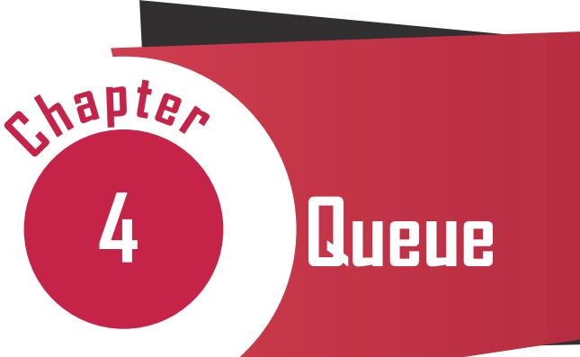
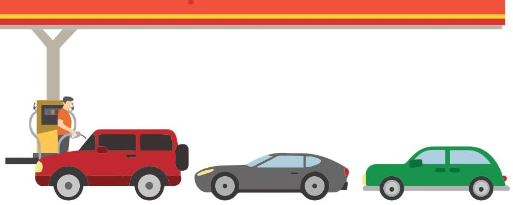
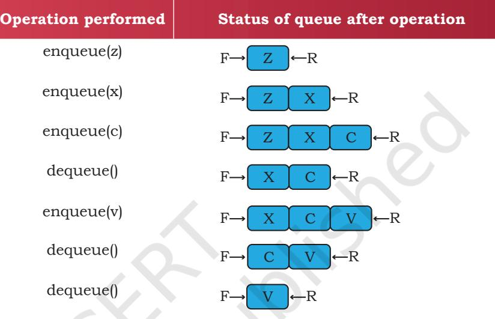

# *In this Chapter*

- » *Introduction to Queue*
- » *Operations on Queue*
- » *Implementation of Queue using Python*
- » *Introduction to Deque*
- » *Implementation of Deque using Python*

*"We could say we want the Web to reflect a vision of the world where everything is done democratically. To do that, we get computers to talk with each other in such a way as to promote that ideal."*

*— Tim Berners-Lee*

### **4.1 Introduction to Queue**

In the previous chapter we learned about a data structure called Stack, which works on Last-In-First-Out (LIFO) principle. In this chapter, we will learn about another data structure called Queue which works on First-In-First-Out (FIFO) principle. Queue is an ordered linear list of elements, having

> different ends for adding and removing elements in it.

> > Examples of queue in our everyday life include students standing in a queue for morning assembly, customers forming a queue at the cash counter in a bank (Figure 4.1), vehicles queued at fuel pumps (Figure 4.2), etc.


*Figure 4.1: Queue of people at a bank* 

Chapter-4.indd 53 18-Jun-21 2:30:47 PM



*Figure 4.2: Queue of cars in a petrol pump*

### **4.1.1 First In First Out (FIFO)**

Queue follows the principle of First In First Out (FIFO), since the element entering first in the queue will be the first one to come out of it. Thus, the element that has been longest in the queue will be removed first. It is also known as a First Come First Served (FCFS) approach. Queue is an arrangement in which new objects/items always get added at one end, usually called the REAR, and objects/items always get removed from the other end, usually called the FRONT of the queue. REAR is also known as TAIL and FRONT as HEAD of a queue.

### **4.1.2 Applications of Queue**

### *(A) The concept of queue has many applications in real-life:*

- If a train ticket is in the waiting list (such as W/L1), it means the ticket is in a queue of tickets waiting to get confirmed, as per the increasing order of waiting numbers. If a confirmed ticket is cancelled, the W/ L1 numbered ticket is removed from the FRONT of the waiting queue and confirmed.
- Sometimes on calling a customer service centre, the Interactive Voice Response System (IVRS) tells us to wait till a support person is available. Here the call is put into a queue of customers waiting to be serviced.
- Imagine there is a single-lane one-way road, then the vehicle that entered first will exit first, following the concept of queue. Likewise, vehicles in a highway toll tax booth are served following the principle of FIFO.

Chapter-4.indd 54 18-Jun-21 2:30:48 PM

### *(B) Following are some examples of application of queue in computer science:*

- Suppose there is a web-server hosting a web-site to declare result(s). This server can handle a maximum of 50 concurrent requests to view result(s). So, to serve thousands of user requests, a Queue would be the most appropriate data structure to use.
- Some Operating Systems (OS) are required to handle multiple tasks called - jobs, seeking to use the processor. But we know that a processor can handle only one task at a time. Therefore, in a multitasking operating system, jobs are lined up (queued) and then given access to the processor according to some order. The simplest way is to give access to the processor on a FIFO basis, that is according to the order in which the jobs arrive with a request for the processor.
- When we send print commands from multiple files from the same computer or from different computers using a shared printer. The OS puts these print requests in a queue and sends them to the printer one by one on a FIFO basis.

## **4.2 Operations on Queue**

Following the FIFO approach, data structure queue supports the following operations:

- ENQUEUE: is used to insert a new element to the queue at the rear end. We can insert elements in the queue till there is space in the queue for adding more elements. Inserting elements beyond capacity of the queue will result in an exception - known as Overflow.
- DEQUEUE: is used to remove one element at a time from the front of the queue. We can delete elements from a queue until it is empty, trying to delete an element from an empty queue will result in exception - known as Underflow.

To perform enqueue and dequeue efficiently on a queue, following operations are also required:

- IS EMPTY : used to check whether the queue has any element or not, so as to avoid Underflow exception while performing dequeue operation.
In the web-server example (for result declaration), suppose the server receives a request from an Administrator to access the result of a school on an urgent basis, along with other requests from students to check individual results. Can you suggest some strategy to ensure service to all as per their urgency?

Chapter-4.indd 55 18-Jun-21 2:30:48 PM

While using a list to implement queue, we can designate either end of the list as Front or Rear of the queue. But we have to fix either of the ends index[0] or index[n-1] as Front and fix the opposite end as Rear.

- PEEK : used to view elements at the front of the queue, without removing it from the queue.
- IS FULL : used to check whether any more elements can be added to the queue or not, to avoid Overflow exceptions while performing enqueue operation.

Figure 4.3 shows the various stages of a simple queue containing alphabets. In the figure, Front of the queue is on the left and Rear on the right.



*Figure 4.3: Various Stages of Stack Operations*

### **4.3 Implementation of Queue using Python**

There are many ways in which queues can be implemented in a computer program, one way is using the list data type of Python. For creating a queue structure in the program, following functions need to be defined:

- Let's create a queue named myQueue. We can create it by assigning an empty list.
myQueue = list()

- A function (enqueue) to insert a new element at the end of queue. The function has two parameters - name of the queue and element which is to be inserted in the queue.
def enqueue(myQueue, element):

myQueue.append(element)

*Note:* append() function always adds an element at the end of the list, hence Rear of queue.

- We don't need to implement Is Full, as Python being a dynamic language, does not ask for the
Chapter-4.indd 56 18-Jun-21 2:30:53 PM

creation of list having fixed size. Hence, we will never encounter a situation when the queue is full.

- A function (isEmpty) to check, if the queue has an element or not? This can be done by checking the length of the queue. The function has a parameter -- name of the queue and returns True if the queue is empty False otherwise.

```
def isEmpty(myQueue):
 if len(myQueue)==0: 
 return True
    else:
 return False
```
- A function (dequeue) to delete an element from the front of the queue. It has one parameter - name of the queue and returns the deleted element. The function first checks if the queue is empty or not, for successful deletion.

```
def dequeue(myQueue):
     if not (isEmpty(myQueue)):
 return myQueue.pop(0) 
     else :
```

```
 print("Queue is empty")
```
*Note:* The pop() function with index[0] will delete the element from the beginning of the list, hence Front of queue.

- A function (size) to get the number of elements in the queue. We can use the len() function of Python's list to find the number of elements in the queue. The function has one parameter - name of the queue and returns the number of elements in the queue.

```
def size(myQueue):
 return len(myQueue)
```
- A function (peek) to simply read, but not to delete, the element at the front end of the queue. For this, we can read the element at index[0] of the queue. The function has one parameter - name of the queue and returns the value of element at Front if queue is not empty, None otherwise.

```
def peek(myQueue):
 if isEmpty(myQueue):
 print('Queue is empty')
 return None
 else:
```
return myQueue[0]

queue data structure using tuple or dictionary?

Can you implement a

While choosing the name of above functions general naming convention w.r.t. the queue is followed. As these are user defined functions any other name can also be used.

Chapter-4.indd 57 18-Jun-21 2:30:53 PM

### **Activity 4.1**

How can you avoid printing of None, when trying to print an empty queue?


#### **Activity 4.2**

What if the content of the complete queue is to be listed? Write a function for it.

Let us consider the example of a queue that people form while waiting at a bank cash counter. Usually, following are the events that occur in queue:

- Two friends come together and go to the cash counter, i.e. they form a queue - enqueue operation is performed two times.
- As soon as the person at the front is serviced, he will be removed from the queue - thus dequeue operation is performed. Cashier calls Next to serve the next person who is now at the front of the queue.
- Cashier wants to know the length of the queue size of the queue is checked.
- Meanwhile, a few more people walk in the bank, and three of them join the queue at the cash counter, i.e. enqueue happens 3 times.
- Another person gets served and leaves the counter, i.e. dequeue is performed. Cashier calls Next to serve another person.
- The Next three people get served one after another, i.e. dequeue is performed thrice.
- Cashier calls Next and realises that there are no more people to be served - underflow situation happens

Now, let us write the code for the above scenario of the bank.

#### Program 4-1

```
myQueue = list()
# each person to be assigned a code as P1, P2, P3,...
element = input("enter person's code to enter in queue :")
enqueue(myQueue,element)
element = input("enter person's code for insertion in queue :")
enqueue(myQueue,element)
print("person removed from queue is:", dequeue(myQueue))
print("Number of people in the queue is :",size(myQueue))
element = input("enter person's code to enter in queue :")
enqueue(myQueue,element)
element = input("enter person's code to enter in queue :")
enqueue(myQueue,element)
element = input("enter person's code to enter in queue :")
enqueue(myQueue,element)
```
Chapter-4.indd 58 18-Jun-21 2:30:53 PM

```
print("Now we are going to remove remaining people from the 
queue")
while not isEmpty(myQueue):
     print("person removed from queue is ", 
     dequeue(myQueue))
```
### Output

```
enter person's code to enter in queue :P1
enter person's code to enter in queue :P2
person removed from the queue is :p1
number of people in the queue is :1
enter person's code to enter in queue :P3
enter person's code to enter in queue :P4
enter person's code to enter in queue :P5
Now we are going to remove remaining people from the queue
person removed from the queue is :p2
person removed from the queue is :p3
person removed from the queue is :p4
person removed from the queue is :p5
Queue is empty
```
### **4.4 Introduction to Deque**

Deque (pronounced as "deck") is an arrangement in which addition and removal of element(s) can happen from any end, i.e. head/front or tail/rear. This data structure does not apply any restriction on the side from which addition/removal of elements should happen, so it can be used to implement stack or queue in the program. It is also known as Double ended queue, because it permits insertion, deletion operations from any end.


*Figure 4.4: Basic deque structure displaying head and tail to implement stack or queue.*

### **4.4.1 Applications of Deque**

- At a train ticket purchasing counter, a normal queue of people is formed for purchasing a ticket. A person at the front purchased the ticket and left the counter. After a while they return back to the counter to ask
Chapter-4.indd 59 18-Jun-21 2:30:53 PM

**Activity 4.3** In a deque, if insertion and deletion of elements is done from the same end, it will behave as 1) Queue 2) Stack 3) List 4) None of the above


### **Activity 4.4**

In a deque, if insertion and deletion of elements is done from the opposite end, it will behave as

- 1) Queue
- 2) Stack
- 3) List
- 4) None of the above

something. As they have already purchased a ticket, they may have the privilege to join the queue from the front.

- Vehicles in a highway toll tax booth are served following the principle of queue. There are multiple queues if there are parallel booths at the toll gate. In case all vehicles of a booth are served then vehicles from the other booth(s) are asked to form a queue in front of the vacant booth. So, vehicles at the end of those queues will leave (removed from the end from where queue was joined) current booth and join queue at the vacant booth.
Following are some examples where data structure deque maybe applied in computer science:

- To maintain browser history (URL), usually a stack is used, because once a tab is closed and if you press ctrl+shift+T, the most recently closed URL is opened first. As the number of URLs which can be stored in history is fixed, so when this list of URLs becomes large, URLs from the end of the list (i.e. which were least visited) gets deleted.
- Same happens for providing the Do and Undo option in any text editor.
- To check whether a given string is palindrome or not? Process string left to right (character wise) and insert it in deque from tail/rear like a normal queue. Once the entire string is processed (i.e. inserted in deque) we will take out (delete) a character from both the ends and match them till there is no character left or only one character left in deque. In either case, string is palindrome.

### **4.4.2 Operations on Deque**

- INSERTFRONT: This operation is used to insert a new element at the front of the deque.
- INSERTREAR: This operation is the same as a normal queue, i.e. insert a new element at the rear of the deque.
- DELETIONFRONT: This operation is the same as normal queue, i.e. to remove an element from the front of the deque.
- DELETIONREAR: This operation is used to remove one element at a time from the rear of the deque.

Chapter-4.indd 60 18-Jun-21 2:30:53 PM

To perform above operations efficiently on a deque, we will need all supporting operations used in normal queue viz Is Empty, Peek, Size.

Let's understand how these operations work for checking whether a string is palindrome or not, using a deque through the following algorithm.

*Algorithm 4.1*

- *Step1:* Start traversing string (madam) from left side, a character at a time.
- *Step 2:* Insert the character in deque as normal queue using INSERTREAR.
- *Step 3:* Repeat Step 1 and Step 2 for all characters of string (madam)


*Figure 4.5: Status of Deque after 4th iteration*

- *Step 4:* Remove one character from the front and one character from the rear end of deque using DELETIONFRONT and DELETIONREAR we can do it.


*Figure 4.6: Status of Deque after removing one character from both the ends.*

*Step 5:* Match these two removed characters.

- *Step 6:* If they are same then
 repeat Step 4 and 5 till deque is empty or left with only one character,

 eventually string is Palindrome else stop as string is not palindrome

## **4.5 Implementation of Deque Using Python**

Like queue, deque is also an ordered linear list, hence we use list data type to create deque in our program. The program should have the following functions/ statement(s) defined in it:

## **Notes**

Chapter-4.indd 61 18-Jun-21 2:30:54 PM

- A statement to create deque, with name myDeque. myDeque = list()
- A function insertFront(), to insert an element at the front of deque having two parameters - name of deque and element to be inserted. As the element is to be inserted in the beginning, we will use insert() with index 0 for it.

```
def insertFront(myDeque, element):
 myDeque.insert(0,element)
```
- A function insertRear(), to insert an element at the rear of deque. It's implementation will be the same as enqueue() of normal queue requiring two parameters same as insertFront().
- A function isEmpty(), to check the presence of element(s) in deque will be the same as the function, with the same name, defined for normal queue.
- A function deletionRear(), to delete an element from the rear of the deque. It only requires the name of deque and returns the deleted element. We will use pop() without parameter(s) to delete the last element of the deque.

```
 def deletionRear(myDeque):
 if not (isEmpty()):
 return myDeque.pop() 
 # removing data from end of list
 else :
 print("Deque empty")
```
- A function deletionFront(), to delete an element from the front of deque. It's implementation will be the same as dequeue() of normal queue.
- A function getFront(), to read value from the front of deque, without removing it from the queue when the queue is not empty. It accepts the name of deque as parameter and returns a copy of value.

```
 def getFront(mydeque):
 if not (isEmpty()):
 return mydeque[0] 
 else :
 print(" Queue empty")
```
- A function getRear(), to read value from the rear of the deque, without removing it from the deque. The
Chapter-4.indd 62 18-Jun-21 2:30:54 PM

function accepts deque as argument and returns a copy of value, when the queue is not empty.

```
 def getRear(mydeque):
 if not (isempty()):
 return mydeque[len(mydeque)-1] 
 else :
 print(" Deque empty")
```
Let us write a main(), function to invoke various Deque functions :

Program 4-2 Implementation of Deque in Python

```
def insertFront(myDeque,element):
  myDeque.insert(0,element)
def getFront(myDeque):
  if not (isEmpty(myDeque)):
 return myDeque[0]
  else:
	 	 print("Queue underflow")
def getRear(myDeque):
  if not (isEmpty(myDeque)):
 return myDeque[len(myDeque)-1]
  else:
	 	 print ("Queue underflow")
def insertRear(myDeque,element):
  myDeque.append(element)
def isEmpty(myDeque):
  if len(myDeque) == 0:
 return True
  else:
```
return False

```
def deletionRear(myDeque):
  if not isEmpty(myDeque):
 return myDeque.pop()
  else:
	 	 print("Queue underflow")
```

```
def deletionFront(myDeque):
   if isEmpty(myDeque):
```
**Notes**

Chapter-4.indd 63 11/10/2021 10:06:30 AM

```
	 	 print("Queue underflow")
    else:
  return myDeque.pop(0)
 def main():
    dQu = list()
    choice = int(input('enter 1 to use as normal queue 2 otherwise 
  : '))
    if choice == 1:
  element = input("data for insertion at rear ")
  insertRear(dQu,element)
   element = getFront(dQu)
  print("data at the beginning of queue is ", element)
  element = input("data for insertion at front ")
  insertRear(dQu,element)
  print('data removed from front of queue is ', deletionFront(dQu))
  print('data removed from front of queue is ', deletionFront(dQu))
Output
 enter 1 to use as normal queue 2 otherwise : 1
 data for insertion at rear 23
 data at the beginning of queue is 23
 data for insertion at rear 45
 data removed from front of queue is 23
 data removed from front of queue is 45
 Queue underflow
 data removed from front of queue is None
 enter 1 to use as normal queue 2 otherwise : 2
 data for insertion at front 34
 data at the end of queue is 34
 data for insertion at front 56
 data removed from rear of queue is 34
 data removed from rear of queue is 56
 Queue underflow
 data removed from rear of queue is None
```
## **Summary**

- Queue is an ordered linear data structure, following FIFO strategy.
- Front and Rear are used to indicate beginning and end of queue.
- In Python, the use of predefined methods takes care of Front and Rear.

Chapter-4.indd 64 18-Jun-21 2:30:54 PM

- **Notes** Insertion in a queue happens at the rear end. Deletion happens at the front.
- Insertion operation is known as enqueue and deletion operation is known as dequeue.
- To support enqueue and dequeue operations, isEmpty, isfull and peek operations are used
- Deque is a version of queue, which allows insertion and deletion at both ends.
- A deque can support both stack and queue operations.
- Other operations supported by deque are insertfront, insertrear, deletefront, deleterear, getfront, getrear, isempty and isfull.

# **Exercise**

 print("Queue underflow")

 insertRear(dQu,element) element = getFront(dQu)

insertRear(dQu,element)

data for insertion at rear 23

data for insertion at rear 45

data for insertion at front 34 data at the end of queue is 34 data for insertion at front 56

data at the beginning of queue is 23

data removed from front of queue is 23 data removed from front of queue is 45

data removed from front of queue is None

data removed from rear of queue is 34 data removed from rear of queue is 56

data removed from rear of queue is None

enter 1 to use as normal queue 2 otherwise : 2

choice = int(input('enter 1 to use as normal queue 2 otherwise

 print('data removed from front of queue is ', deletionFront(dQu)) print('data removed from front of queue is ', deletionFront(dQu))

element = input("data for insertion at rear ")

element = input("data for insertion at front ")

enter 1 to use as normal queue 2 otherwise : 1

print("data at the beginning of queue is ", element)

return myDeque.pop(0)

else:

def main():

: '))

Queue underflow

Queue underflow

Output

dQu = list()

if choice == 1:

- 1. Fill in the blank
	- a) ____________________ is a linear list of elements in which insertion and deletion takes place from different ends.
	- b) Operations on a queue are performed in __________________ order.
	- c) Insertion operation in a queue is called ______________ and deletion operation in a queue is called ____________________.
	- d) Deletion of elements is performed from _______________ end of the queue.
	- e) Elements 'A','S','D' and 'F' are present in the queue, and they are deleted one at a time, ________________________ is the sequence of element received.
	- f) _______________ is a data structure where elements can be added or removed at either end, but not in the middle.
	- g) A deque contains 'z','x','c','v' and 'b' . Elements received after deletion are 'z','b','v','x' and 'c'. ________ __________________________ is the sequence of deletion operation performed on deque.
- 2. Compare and contrast queue with stack.
- 3. How does FIFO describe queue?

Chapter-4.indd 65 18-Jun-21 2:30:55 PM

```
Notes
```
- 4. Write a menu driven python program using queue, to implement movement of shuttlecock in it's box.
- 5. How is queue data type different from deque data type?
- 6. Show the status of queue after each operation

```
enqueue(34)
enqueue(54)
dequeue()
enqueue(12)
dequeue()
enqueue(61)
peek()
dequeue()
dequeue()
dequeue()
dequeue()
```
enqueue(1)

- 7. Show the status of deque after each operation

```
peek()
insertFront(12)
insertRear(67)
deletionFront()
insertRear(43)
deletionRear()
deletionFront()
deletionRear()
```
- 8. Write a python program to check whether the given string is palindrome or not, using deque. (Hint : refer to algorithm 4.1)
Chapter-4.indd 66 18-Jun-21 2:30:55 PM

