# *In this Chapter*

- » *Introduction*
- » *Bubble Sort*
- » *Selection Sort*
- » *Insertion Sort*
- » *Time Complexity of Algorithms*

*"Every one of today's smartphones has thousands of times more processing power than the computers that guided astronauts to the moon."*

*— Peter Thiel*

## **5.1 Introduction**

Sorting is the process of ordering or arranging a given collection of elements in some particular order. We can sort a collection of numbers in ascending (increasing) or descending (decreasing) order. If the collection is of strings, we can sort it in an alphabetical order (a-z or z-a) or according to the length of the string. For example, words in a dictionary are sorted in alphabetical order; seats in an examination hall are ordered according to candidates' roll number. We can also sort a list of students based on their height or weight.

Imagine finding the meaning of a word from a dictionary that is not ordered. We will have to search for the word on each page till we find the word, which will be very tedious. That is why dictionaries have the words in alphabetical order and it ease the process of searching.

Chpater-5.indd 67 18-Jun-21 2:31:12 PM

Can you identify other examples where sorting plays an important role in computers?

In Figure 5.1, we can see that the list got sorted in the 4th pass itself. Still the bubble sort technique made a redundant 5th pass which did not result in any swap. If there is no swapping in any pass, it means the list is already sorted, hence the sorting operation needs to be stopped. Can you think of making any improvement in the Algorithm 5.1 so that it stops when the list becomes sorted?

Sorting a large number of items can take a substantial amount of time. However, this extra time (called overhead) is worth when compared to the amount of time needed to find an element from an unsorted list. Sorting is an important area of study in computer science, and many sorting algorithms have been developed and analysed from their performance point of view. In this chapter, we will learn about three sorting methods and implement them using Python. Bubble sort is discussed in section 5.2, followed by discussion on selection sort and insertion sort in section 5.3 and 5.4, respectively

### **5.2 Bubble Sort**

The first sorting technique we are going to understand is Bubble sort. It sorts a given list of elements by repeatedly comparing the adjacent elements and swapping them if they are unordered. Swapping two elements means changing their positions with each other. In algorithm, every iteration through each element of a list is called a pass. For a list with n elements, the bubble sort makes a total of n – 1 passes to sort the list. In each pass, the required pairs of adjacent elements of the list will be compared. In order to arrange elements in ascending order, the largest element is identified after each pass and placed at the correct position in the list. This can be considered as the largest element being 'bubbled up'. Hence the name Bubble sort. This sorted element is not considered in the remaining passes and thus the list of elements gets reduced in successive passes.

Figure 5.1 demonstrates the working of the bubble sort method to arrange a list in ascending order. Let us consider a list having 6 elements as numList = [8, 7, 13, 1, -9, 4]. In the figure, elements being compared are highlighted with blue colour and sorted elements are highlighted with green colour. To begin sorting, the element at index 0 is compared with the element at index 1. If the first element is bigger, it is swapped with the second. Else, no change is done. Next, the element at index 1 is compared with the element at index 2. This continues till the end of the list is reached. After the first pass, the largest element will reach the end of the list as shown in Figure 5.1 with green colour.

Chpater-5.indd 68 18-Jun-21 2:31:13 PM


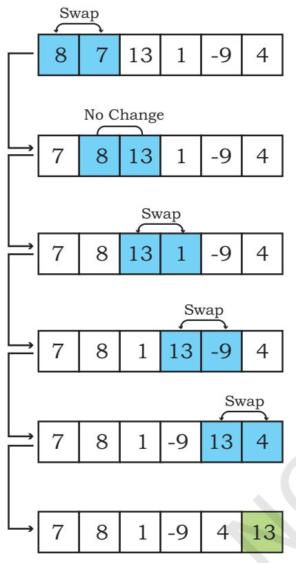

Comparison in Pass 2

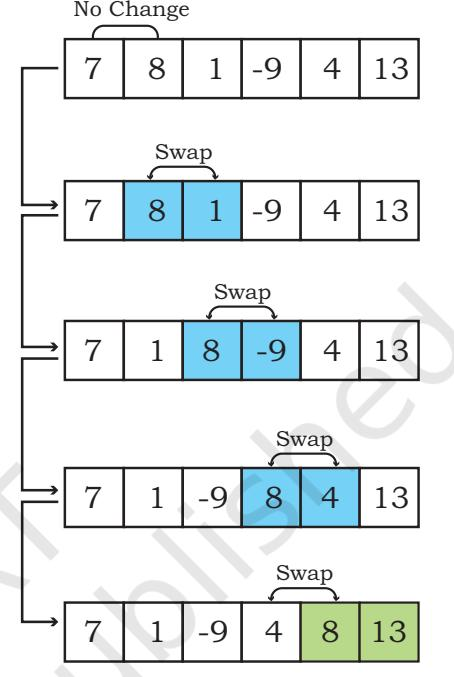

Comparison in Pass 4

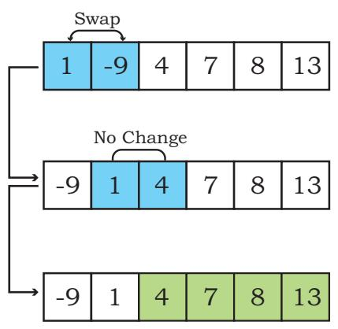

Chpater-5.indd 69 18-Jun-21 2:31:14 PM


Algorithm 5.1 shows the steps followed for the bubble sort that takes numList as a list of n elements, and sorts the list in ascending order:

#### **Activity 5.1**

Algorithm 5.1 sorts a list in ascending order. Write a bubble sort algorithm to sort a list in descending order?

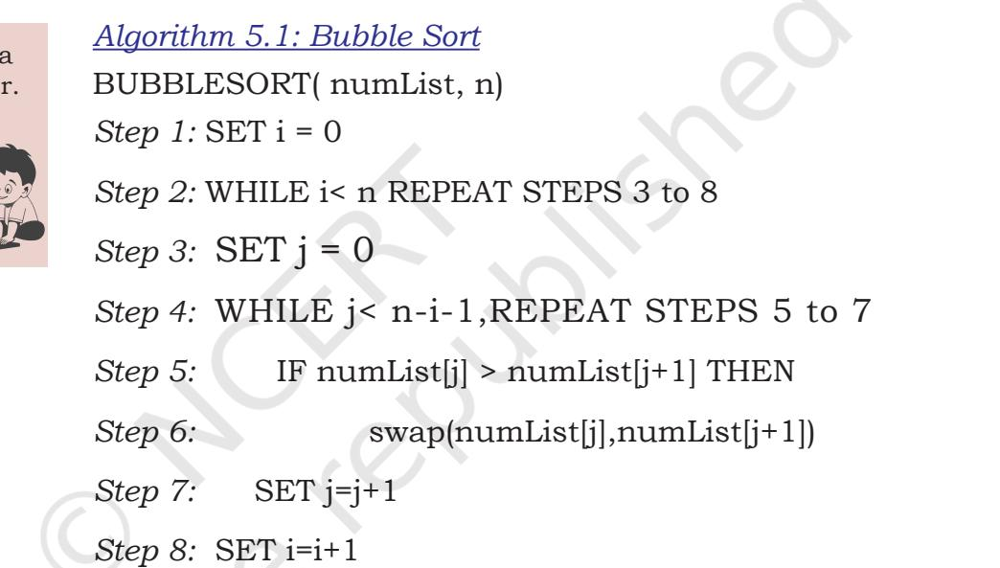

Program 5-1 Implementation of bubble sort using Python.

```
def bubble_Sort(list1):
  n = len(list1)
  for i in range(n): # Number of passes
 for j in range(0, n-i-1): 
 # size -i-1 because last i elements are already sorted 
 #in previous passes
 if list1[j] > list1[j+1] : 
 # Swap element at jth position with (j+1)th position
 list1[j], list1[j+1] = list1[j+1], list1[j]
numList = [8, 7, 13, 1, -9, 4]
bubble_Sort(numList)
```
Chpater-5.indd 70 18-Jun-21 2:31:16 PM

```
print ("The sorted list is :")
for i in range(len(numList)):
 print (numList[i], end=" ")
```
## Output: The sorted list is : -9 1 4 7 8 13

## **5.3 Selection Sort**

Selection sort is another sorting technique. To sort a list having n elements, the selection sort makes (n-1) number of passes through the list. The list is considered to be divided into two lists -- the left list containing the sorted elements, and the right list containing the unsorted elements. Initially, the left list is empty, and the right list contains all the elements.

For arranging elements in ascending order, in the first pass, all the elements in the unsorted list are traversed to find the smallest element. The smallest element is then swapped with the leftmost element of the unsorted list. This element occupies the first position in the sorted list, and it is not considered in further passes. In the second pass, the next smallest element is selected from the remaining elements in the unsorted list and swapped with the leftmost element of the unsorted list. This element occupies the second position in the sorted list, and the unsorted list reduces by one element for the third pass.

This process continues until n-1 smallest elements are found and moved to their respective places. The nth element is the last, and it is already in place. Figure 5.2 demonstrates the working of selection sort method to arrange a list in ascending order. In this Figure, elements being compared are shown using arrows and the smaller element in a comparison is highlighted with blue colour. The sorted elements are highlighted—

#### **Activity 5.2**

Apply bubble sort technique to sort a list of elements numList2 = [8, 7, 6, 5, 4]. Show the positions of elements in the list after each pass. In which pass the last swap happens?

Chpater-5.indd 71 11/10/2021 10:07:56 AM


Comparison in Pass 2

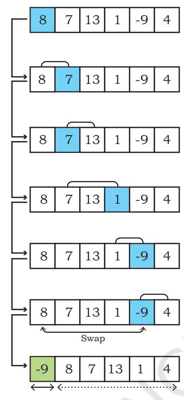

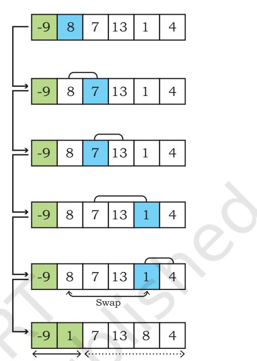

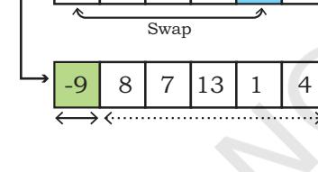

Comparison in Pass 3 Comparison in Pass 4

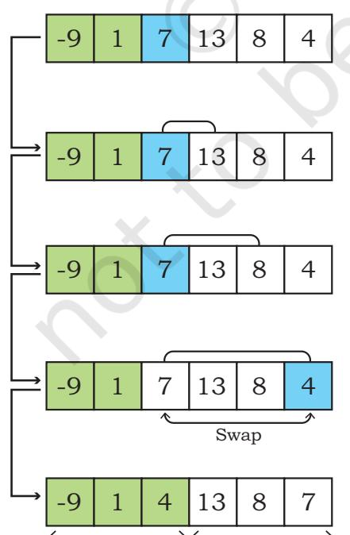

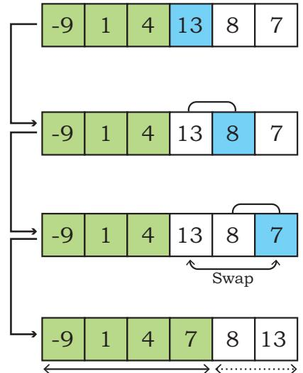

Chpater-5.indd 72 18-Jun-21 2:31:17 PM


*Figure 5.2: Comparisons done in different passes of Selection sort* 

The following is an algorithm for the selection sort that takes numList as a list consisting of n elements, and sorts the list in ascending order:

Algorithm 5.2 shows the steps followed for the selection sort that takes numList as a list of n elements, and sorts the list in ascending order:

| Algorithm 5.2: Selection Sort |  |  |
| --- | --- | --- |
| SELECTIONSORT( numList, n) |  |  |
| Step 1: SET i=0 |  |  |
| Step 2: WHILE i< n REPEAT STEPS 3 to 11 |  |  |
| Step 3: SET min = i, flag = 0 |  |  |
| Step 4: SET j= i+1 |  |  |
| Step 5: | WHILE j<n, REPEAT STEPS 6 to 10 |  |
| Step 6: | IF numList[j] < numList[min] THEN |  |
| Step 7: | min = j | Activity 5.3 |
|  |  | Consider a list of 10 |
| Step 8: | flag = 1 | elements: |
|  |  | randList = |
| Step 9: IF flag = 1 THEN |  | [7,11,3,10,17,23,1,4,21,5]. |
|  |  | Determine the partially |
| Step 10: | swap(numList[i],numList[min]) | sorted list after |
|  |  | four complete |
| Step 11: SET i=i+1 |  | passes of |
|  |  | selection sort. |

Chpater-5.indd 73 18-Jun-21 2:31:18 PM

#### Program 5-2 Implementation of selection sort using Python.

```
def selection_Sort(list2):
	 flag = 0	 #to decide when to swap
	 n=len(list2)
	 for i in range(n): # Traverse through all list elements
	 	 min = i
	 	 for j in range(i + 1, len(list2)):	#the left elements
	 	 #are already sorted in previous passes
	 	 if list2[j] < list2[min]: # element at j is smaller
	 	 #than the current min element
	 	 min = j
	 	 flag = 1
	 	 if flag == 1 : 	# next smallest element is found
	 	 list2[min], list2[i] = list2[i], list2[min]
numList = [8, 7, 13, 1, -9, 4]
selection_Sort(numList)
print ("The sorted list is :")
for i in range(len(numList)):
	 print (numList[i], end=" ")
```
#### Output:

The sorted list is : -9 1 4 7 8 13

### **5.4 Insertion Sort**

Insertion sort is another sorting algorithm that can arrange elements of a given list in ascending or descending order. Like Selection sort, in Insertion sort also, the list is divided into two parts - one of sorted elements and another of unsorted elements. Each element in the unsorted list is considered one by one and is inserted into the sorted list at its appropriate position. In each pass, the sorted list is traversed from the backward direction to find the position where the unsorted element could be inserted. Hence the sorting method is called insertion sort.

In pass 1, the unsorted list has n-1 elements and the sorted list has a single element (say element s). The first element of the unsorted list (say element e) is compared with the element s of sorted list. If element e is smaller than element s, then element s is shifted to the right making space for inserting element e. This shifting will now make sorted list of size 2 and unsorted list of size n-2.

In pass 2, the first element (say element e) of unsorted list will be compared with each element of sorted list

Chpater-5.indd 74 16 December 2021 04:07:22

starting from the backward direction till the appropriate position for insertion is found. The elements of sorted list will be shifted towards right making space for the element e where it could be inserted.

This continues till all the elements in unsorted lists are inserted at appropriate positions in the sorted list. This results into a sorted list in which elements are arranged in ascending order.

Figure 5.3 demonstrates the working of the insertion sort to arrange a list in ascending order.

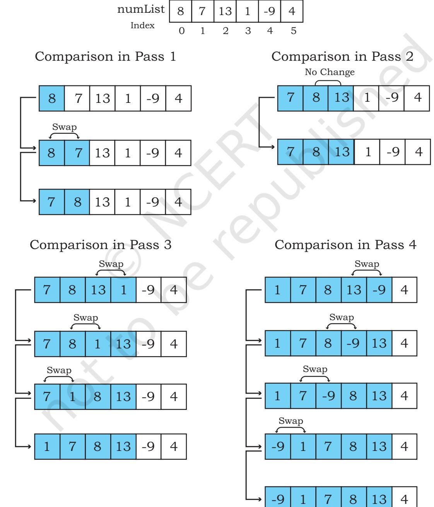

Chpater-5.indd 75 18-Jun-21 2:31:18 PM

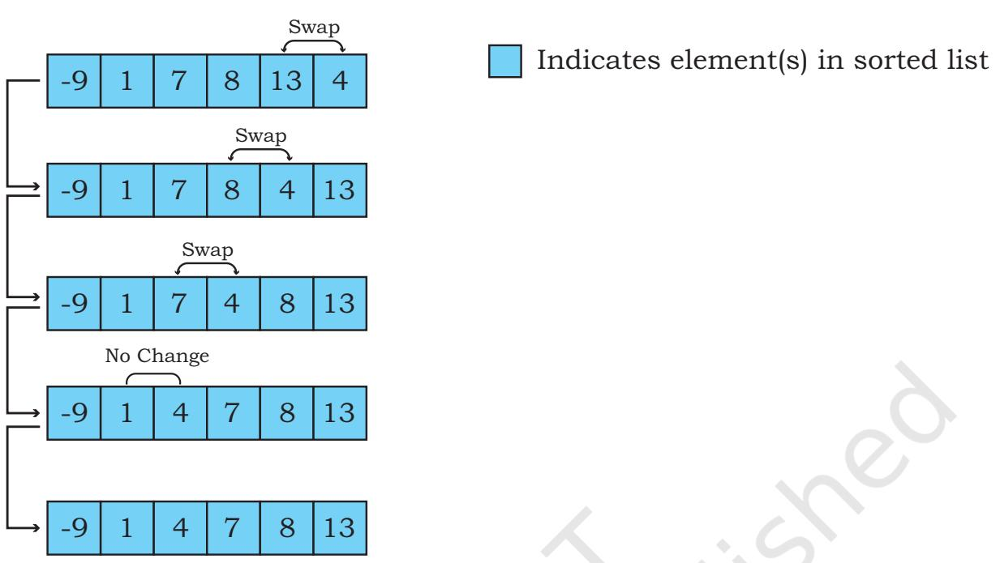

*Figure 5.3: Comparisons done in different passes of Insertion sort* 

Let us consider that numList is a list consisting of n elements. Algorithm 5.3 sorts the list numList in ascending order using insertion sort technique.

- *Algorithm 5.3: Insertion Sort*
INSERTIONSORT( numList, n)

*Step 1:* SET i=1

*Step 2:* WHILE i< n REPEAT STEPS 3 to 9

#### **Activity 5.4**

Consider a list of 10 elements: Array = [7,11,3,10,17,23,1,4,21,5] Determine the partially sorted list after three complete passes of insertion sort.

| Step 3: | temp = numList[i] |
| --- | --- |
| Step 4: | SET j = i-1 |
| Step 5: | WHILE j> = 0 and numList[j]>temp,REPEAT STEPS 6 to 7 |
| Step 6: | numList[j+1] = numList[j] |
| Step 7: | SET j=j-1 |
| Step 8: | numList[j+1] = temp #insert |
|  | temp at position j |

*Step 9:* set i=i+1

Chpater-5.indd 76 18-Jun-21 2:31:19 PM

```
Program 5-3 Implementation of insertion sort using 
          Python.
   def insertion_Sort(list3):
    n= len(list3)
    for i in range(n): # Traverse through all elements
    temp = list3[i]
    j = i-1
    while j >=0 and temp< list3[j] :
    list3[j+1] = list3[j] 
    j = j-1
    list3[j+1] = temp
   numList = [8, 7, 13, 1, -9, 4]
   insertion_Sort(numList)
   print ("The sorted list is :")
   for i in range(len(numList)):
    print (numList[i], end=" ")
  Output:
   The sorted list is :
   -9 1 4 7 8 13
```
### **5.5 Time Complexity of Algorithms**

We have studied that there can be more than one approach to solve a problem using a computer. In Class XI, we compared four different algorithms to check whether a given number is prime or not. For the same problem, one algorithm may require more processing time than the other. The amount of time an algorithm takes to process a given data can be called its time complexity.

For a small set of data elements shown in examples of this chapter so far, the time and memory required by different algorithms do not differ significantly. However, in the real world, sorting algorithms are required to work on huge amounts of data. In such cases, the total time utilisation becomes significant, and therefore it is important to consider the time complexity of an algorithm before being used in a real world data set.

Computer scientists proposing different techniques for sorting are always interested to find out their time complexity. The aim is to find out how a sorting algorithm behaves if the order of input elements changes or if the number of elements in the list increases or decreases. Such comparisons help to decide which algorithm is more suitable for which kind of data and application.

Chpater-5.indd 77 07-Sep-21 3:10:51 PM

Calculating the complexity of different algorithms involves mathematical calculations and detailed analysis, and it is beyond the scope of this textbook to discuss them in detail. However, we will discuss some basics of complexity to get some ideas. The following tips will guide us in estimating the time complexity of an algorithm.

- Any algorithm that does not have any loop will have time complexity as 1 since the number of instructions to be executed will be constant, irrespective of the data size. Such algorithms are known as Constant time algorithms.
- Any algorithm that has a loop (usually 1 to n) will have the time complexity as *n* because the loop will execute the statement inside its body *n* number of times. Such algorithms are known as Linear time algorithms.
- A loop within a loop (nested loop) will have the time complexity as *n2*. Such algorithms are known as Quadratic time algorithms.
- If there is a nested loop and also a single loop, the time complexity will be estimated on the basis of the nested loop only.

Now, look at the Python programs of the three sorting techniques discussed in this chapter, you will notice that in each of the three programs, there is a nested loop, i.e., one inside another. So according to the above rules, all the sorting algorithms namely, bubble sort, selection sort and insertion sort have a time complexity of *n2*.

## **Summary**

- The process of placing or rearranging a collection of elements into a particular order is known as sorting.
- Bubble sort is the simplest sorting algorithm that works by repeatedly swapping the adjacent elements in case they are unordered in n-1 passes.
- In Selection Sort, the smallest element is selected from the unsorted array and swapped with the

Chpater-5.indd 78 18-Jun-21 2:31:19 PM

**Notes**

leftmost element, and that element becomes a part of the sorted array. The process continues for the next element in the unsorted array till the list is sorted.

- Insertion Sort places the element of a list at its suitable place in each pass. It is similar to the placing of cards at its right position while playing cards.
- Complexity analysis is performed to explain how an algorithm will perform when the input grows larger.

## **Exercise**

- 1. Consider a list of 10 elements: numList =[7,11,3,10,17,23,1,4,21,5]. Display the partially sorted list after three complete passes of Bubble sort.
- 2. Identify the number of swaps required for sorting the following list using selection sort and bubble sort and identify which is the better sorting technique with respect to the number of comparisons.


- 3. Consider the following lists:


 If the lists are sorted using Insertion sort then which of the lists List1 or List 2 will make the minimum number of comparisons? Justify using diagrammatic representation.

- 4. Write a program using user defined functions that accepts a List of numbers as an argument and finds its median. (Hint : Use bubble sort to sort the accepted list. If there are odd number of terms, the median is the center term. If there are even number of terms, add the two middle terms and divide by 2 get median)
## **Notes**

Chpater-5.indd 79 18-Jun-21 2:31:19 PM

### **Notes**

5. All the branches of XYZ school conducted an aptitude test for all the students in the age group 14 - 16. There were a total of n students. The marks of n students are stored in a list. Write a program using a user defined function that accepts a list of marks as an argument and calculates the 'xth' percentile (where x is any number between 0 and 100).You are required to perform the following steps to be able to calculate the 'xth' percentile.

 *Note: Percentile is a measure of relative performance i.e.* It is calculated based on a candidate's performance with respect to others. For example : If a candidate's score is in the 90th percentile, that means she/he scored better than 90% of people who took the test.

Steps to calculate the xth percentile:

- I. Order all the values in the data set from smallest to largest using Selection Sort. In general any of the sorting methods can be used.
- II. Calculate index by multiplying x percent by the total number of values, n. *For example:* to find 90th percentile for 120 students:

0.90*120 = 108

- III. Ensure that the index is a whole number by using math.round()
- VI. Display the value at the index obtained in Step 3.

The corresponding value in the list is the xth percentile.

- 6. During admission in a course, the names of the students are inserted in ascending order. Thus, performing the sorting operation at the time of inserting elements in a list. Identify the type of sorting technique being used and write a program using a user defined function that is invoked every time a name is input and stores the name in ascending order of names in the list.
Chpater-5.indd 80 18-Jun-21 2:31:19 PM

