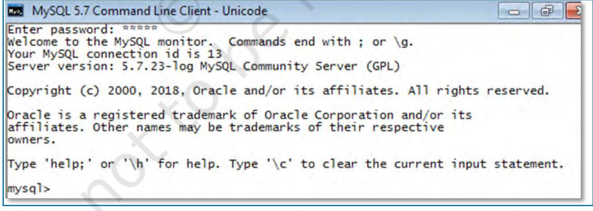
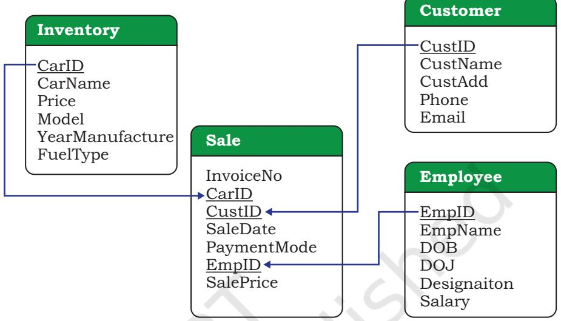
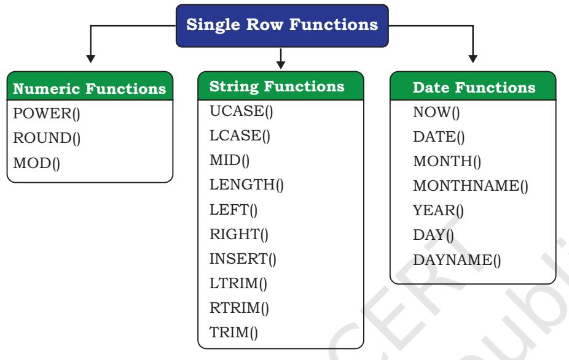
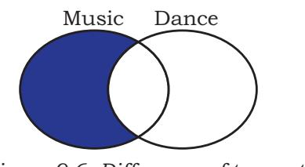

# **9 Structured Query Language (SQL)**


# *In this Chapter*

- » *Introduction*
**Chapter**

- » *Structured Query Language (SQL)*
- » *Data Types and Constraints in MySQL*
- » *SQL for Data Definition*
- » *SQL for Data Manipulation*
- » *SQL for Data Query*
- » *Data Updation and Deletion*
- » *Functions in SQL*
- » *GROUP BY Clause in SQL*
- » *Operations on Relations*
- » *Using Two Relations in a Query*

*"Any unique image that you desire probably already exists on the internet or in some database... The problem today is no longer how to create the right image, but how to find an already existing one. "*

*— Lev Manovich*

# **9.1 Introduction**

We have learnt about Relational Database Management Systems (RDBMS) and its purpose in the previous chapter. There are many RDBMS such as MySQL, Microsoft SQL Server, PostgreSQL, Oracle, etc. that allow us to create a database consisting of relations. These RDBMS also allow us to store, retrieve and manipulate data on that database through queries. In this chapter, we will learn how to create, populate and query databases using MySQL.

# **9.2 Structured Query Language (SQL)**

One has to write application programs to access data in case of a file system. However, for database management systems there are special kinds of languages called query language that can be used to access and manipulate data from the database. The Structured Query Language (SQL) is the most popular query language used by major relational

Chpater-9.indd 131 18-Jun-21 2:35:43 PM

**Activity 9.1**

Find and list other types of databases other than RDBMS.


database management systems such as MySQL, ORACLE, SQL Server, etc.

SQL is easy to learn as the statements comprise of descriptive English words and are not case sensitive. We can create and interact with a database using SQL easily. Benefit of using SQL is that we do not have to specify how to get the data from the database. Rather, we simply specify what is to be retrieved, and SQL does the rest. Although called a query language, SQL can do much more, besides querying. SQL provides statements for defining the structure of the data, manipulating data in the database, declaring constraints and retrieving data from the database in various ways, depending on our requirements.

In this chapter, we will use the StudentAttendance discussed in chapter 8 and create a database. We will also learn how to populate databases with data, manipulate data and retrieve data from a database through SQL queries.

# **9.2.1 Installing MySQL**

MySQL is an open source RDBMS software which can be easily downloaded from the official website https:// dev.mysql.com/downloads. After installing MySQL, start MySQL service. The appearance of mysql> prompt (Figure 9.1) means that MySQL is ready to accept SQL statements.



#### *Figure 9.1: MySQL Shell*

Following are some important points to be kept in mind while using SQL:

Chpater-9.indd 132 18-Jun-21 2:35:44 PM

- SQL is case insensitive. For example, the column names 'salary' and 'SALARY' are the same for SQL.
- Always end SQL statements with a semicolon (;).
- To enter multiline SQL statements, we don't write ";" after the first line. We press the Enter key to continue on the next line. The prompt mysql> then changes to "->", indicating that statement is continued to the next line. After the last line, put ";" and press enter.

# **9.3 Data Types and Constraints in MySQL**

We know that a database consists of one or more relations and each relation (table) is made up of attributes (column). Each attribute has a data type. We can also specify constraints for each attribute of a relation.

# **9.3.1 Data type of Attribute**

Data type of an attribute indicates the type of data value that an attribute can have. It also decides the operations that can be performed on the data of that attribute. For example, arithmetic operations can be performed on numeric data but not on character data. Commonly used data types in MySQL are numeric types, date and time types, and string types as shown in Table 9.1.

# **Activity 9.2**

What are the other data types supported in MySQL? Are there other variants of integer and float data type?

# **Table 9.1 Commonly used data types in MySQL**

| Data type | Description |
| --- | --- |
| CHAR(n) | Specifies character type data of length n where n could be any value from 0 to |
|  | 255. CHAR is of fixed length, means, declaring CHAR (10) implies to reserve |
|  | spaces for 10 characters. If data does not have 10 characters (e.g., 'city' has |
|  | four characters), MySQL fills the remaining 6 characters with spaces padded |
|  | on the right. |
| VARCHAR(n) | Specifies character type data of length where n could be any value from 0 to |
|  | 65535. But unlike CHAR, VARCHAR(n) is a variable-length data type. That is, declaring VARCHAR (30) means a maximum of 30 characters can be stored but |
|  | the actual allocated bytes will depend on the length of entered string. So 'city' |
|  | in VARCHAR (30) will occupy space needed to store 4 characters only. |
| INT | INT specifies an integer value. Each INT value occupies 4 bytes of storage. The |
|  | range of unsigned values allowed in a 4 byte integer type are 0 to 4,294,967,295. |
|  | For values larger than that, we have to use BIGINT, which occupies 8 bytes. |
| FLOAT | Holds numbers with decimal points. Each FLOAT value occupies 4 bytes. |
| DATE | The DATE type is used for dates in 'YYYY-MM-DD' format. YYYY is the 4 digit |
|  | year, MM is the 2 digit month and DD is the 2 digit date. The supported range |
|  | is '1000-01-01' to '9999-12-31'. |

Chpater-9.indd 133 18-Jun-21 2:35:44 PM

Which two constraints when applied together will produce a Primary Key constraint?

## **9.3.2 Constraints**

Constraints are the certain types of restrictions on the data values that an attribute can have. Table 9.2 lists some of the commonly used constraints in SQL. They are used to ensure correctness of data. However, it is not mandatory to define constraints for each attribute of a table.

#### **Table 9.2 Commonly used SQL Constraints**

| Constraint | Description |
| --- | --- |
| NOT NULL | Ensures that a column cannot have NULL values where NULL means missing/ unknown/not applicable value. |
| UNIQUE | Ensures that all the values in a column are distinct/unique |
| DEFAULT | A default value specified for the column if no value is provided |
| PRIMARY KEY | The column which can uniquely identify each row/record in a table. |
| FOREIGN KEY | The column which refers to value of an attribute defined as primary key in another table |

# **9.4 SQL for Data Definition**

In order to be able to store data we need to first define the relation schema. Defining a schema includes creating a relation and giving name to a relation, identifying the attributes in a relation, deciding upon the datatype for each attribute and also specify the constraints as per the requirements. Sometimes, we may require to make changes to the relation schema also. SQL allows us to write statements for defining, modifying and deleting relation schemas. These are part of Data Definition Language (DDL).

We have already learned that the data are stored in relations or tables in a database. Hence, we can say that a database is a collection of tables. The Create statement is used to create a database and its tables (relations). Before creating a database, we should be clear about the number of tables the database will have, the columns (attributes) in each table along with the data type of each column, and its constraint, if any.

#### **9.4.1 CREATE Database**

To create a database, we use the CREATE DATABASE statement as shown in the following syntax:

CREATE DATABASE databasename;

To create a database called StudentAttendance, we will type following command at mysql prompt.

Chpater-9.indd 134 18-Jun-21 2:35:44 PM

mysql> CREATE DATABASE StudentAttendance; Query OK, 1 row affected (0.02 sec)

*Note:* In LINUX environment, names for database and tables are case-sensitive whereas in WINDOWS, there is no such differentiation. However, as a good practice, it is suggested to write database/table name in the same letter cases that were used at the time of their creation.

A DBMS can manage multiple databases on one computer. Therefore, we need to select the database that we want to use. To know the names of existing databases, we use the statement SHOW DATABASES. From the listed databases, we can select the database to be used. Once the database is selected, we can proceed with creating tables or querying data.

In order to use the StudentAttendance database, the following SQL statement is required.

> mysql> USE StudentAttendance; Database changed

Initially, the created database is empty. It can be checked by using the show tables statement that lists names of all the tables within a database.

mysql> SHOW TABLES; Empty set (0.06 sec)

# **9.4.2 CREATE Table**

After creating a database StudentAttendance, we need to define relations in this database and specify attributes for each relation along with data type and constraint (if any) for each attribute. This is done using the CREATE TABLE statement.

> *Syntax:* CREATE TABLE tablename( attributename1 datatype constraint, attributename2 datatype constraint, :

attributenameN datatype constraint);

It is important to observe the following points with respect to the CREATE TABLE statement:

- The number of columns in a table defines the degree of that relation, which is denoted by N.
- Attribute name specifies the name of the column in the table.
- Datatype specifies the type of data that an attribute can hold.

# **Activity 9.3**

Type the statement show database; Does it show the name of StudentAttendance database?

Chpater-9.indd 135 18-Jun-21 2:35:44 PM

- Constraint indicates the restrictions imposed on the values of an attribute. By default, each attribute can take NULL values except for the primary key.
Let us identify data types of the attributes of table STUDENT along with their constraints (if any). Assuming maximum students in a class to be 100 and values of roll number in a sequence from 1 to 100, we know that 3 digits are sufficient to store values for the attribute RollNumber. Hence, data type INT is appropriate for this attribute. Total number of characters in a student name (SName) can differ. Assuming maximum characters in a name as 20, we use VARCHAR(20) for the SName column. Data type for the attribute SDateofBirth is DATE and supposing the school uses guardian's 12 digit Aadhaar number as GUID, we can declare GUID as CHAR (12) since Aadhaar number is of fixed length and we are not going to perform any mathematical operation on GUID.

Table 9.3, 9.4 and 9.5 shows the chosen data type and constraint for each attribute of the relations STUDENT, GUARDIAN and ATTENDANCE, respectively.

**Table 9.3 Data types and constraints for the attributes of relation STUDENT**

| Attribute Name | Data expected to be stored | Data type | Constraint |
| --- | --- | --- | --- |
| RollNumber | Numeric value consisting of maximum 3 digits | INT | PRIMARY KEY |
| SName | Variant length string of maximum 20 characters | VARCHAR(20) | NOT NULL |
| SDateofBirth | Date value | DATE | NOT NULL |
| GUID | Numeric value consisting of 12 digits | CHAR (12) | FOREIGN KEY |

#### **Table 9.4 Data types and constraints for the attributes of relation GUARDIAN**

| Attribute Name | Data expected to be stored |  |  |  |  |  | Data type | Constraint |
| --- | --- | --- | --- | --- | --- | --- | --- | --- |
| GUID | Numeric value consisting of 12 digit Aadhaar |  |  |  |  |  | CHAR (12) | PRIMARY KEY |
|  | number |  |  |  |  |  |  |  |
| GName | Variant | length | string | of | maximum | 20 | VARCHAR(20) | NOT NULL |
|  | characters |  |  |  |  |  |  |  |
| GPhone | Numeric value consisting of 10 digits |  |  |  |  |  | CHAR(10) | NULL UNIQUE |
| GAddress | Variant length String of size 30 characters |  |  |  |  |  | VARCHAR(30) | NOT NULL |

#### **Table 9.5 Data types and constraints for the attributes of relation ATTENDANCE.**

| Attribute Name | Data expected to be stored | Data type | Constraint |
| --- | --- | --- | --- |
| AttendanceDate | Date value | DATE | PRIMARY KEY* |
| RollNumber | Numeric value consisting of maximum 3 | INT | PRIMARY KEY* |
|  | digits |  | FOREIGN KEY |
| AttendanceStatus | 'P' for present and 'A' for absent | CHAR(1) | NOT NULL |

**means part of composite primary key.*

Chpater-9.indd 136 18-Jun-21 2:35:45 PM

Once data types and constraints are identified, let us create tables without specifying constraints along with the attribute name for simplification. We will learn to incorporate constraints on attributes in Section 9.4.4.

*Example 9.1* Create table STUDENT.

mysql> CREATE TABLE STUDENT(

- -> RollNumber INT,
- -> SName VARCHAR(20),
- -> SDateofBirth DATE,
- -> GUID CHAR (12),
- -> PRIMARY KEY (RollNumber));

Query OK, 0 rows affected (0.91 sec)

*Note:* "," is used to separate two attributes and each statement terminates with a semi-colon (;). The arrow (->) is an interactive continuation prompt. If we enter an unfinished statement, the SQL shell will wait for us to enter the rest of the statement.

# **9.4.3 Describe Table**

We can view the structure of an already created table using the DESCRIBE statement or DESC statement.

*Syntax:*

DESCRIBE tablename;

mysql> DESCRIBE STUDENT;

| +--------------+-------------+------+-----+---------+-------+ |  |  |  |  |  |
| --- | --- | --- | --- | --- | --- |
| Field   Null   Key   Default   Extra | Type |  |  |  |  |
| +--------------+-------------+------+-----+---------+-------+ |  |  |  |  |  |
| RollNumber | int | NO | PRI   NULL |  |  |
| SName   varchar(20)   YES |  |  | NULL |  |  |
| SDateofBirth   date |  | YES | NULL |  |  |
| GUID | char(12) | YES | NULL |  |  |
| +--------------+-------------+------+-----+---------+-------+ |  |  |  |  |  |

4 rows in set (0.06 sec)

We can use the SHOW TABLES statement to see the tables in the StudentAttendance database. So far, we have only the STUDENT table.

mysql> SHOW TABLES;

+------------------------------+ | Tables_in_studentattendance | +------------------------------+ | student | +------------------------------+

1 row in set (0.00 sec)

# **9.4.4 ALTER Table**

After creating a table, we may realise that we need to add/remove an attribute or to modify the datatype of an existing attribute or to add constraint in attribute. In **Activity 9.4**

Create the other two relations GUARDIAN and ATTENDANCE as per data types given in Table 9.4 and 9.5 respectively, and view their structures. Do not add any constraint in these two tables.

Which datatype out of Char and Varchar will you prefer for storing contact number(mobile number)? Discuss.

Structured Query Language (SQL) 137

Chpater-9.indd 137 18-Jun-21 2:35:45 PM

all such cases, we need to change or alter the structure (schema) of the table by using the alter statement.

# *(A) Add primary key to a relation*

Let us now alter the tables created in Activity 9.4. The following MySQL statement adds a primary key to the GUARDIAN relation:

mysql> ALTER TABLE GUARDIAN ADD PRIMARY KEY (GUID);

Query OK, 0 rows affected (1.14 sec) Records: 0 Duplicates: 0 Warnings: 0

Now let us add the primary key to the ATTENDANCE relation. The primary key of this relation is a composite key made up of two attributes - AttendanceDate and RollNumber.

mysql> ALTER TABLE ATTENDANCE

 -> ADD PRIMARY KEY(AttendanceDate, RollNumber); Query OK, 0 rows affected (0.52 sec) Records: 0 Duplicates: 0 Warnings: 0

# *(B) Add foreign key to a relation*

Once primary keys are added, the next step is to add foreign keys to the relation (if any). Following points need to be observed while adding foreign key to a relation:

- The referenced relation must be already created.
- The referenced attribute(s) must be part of the primary key of the referenced relation.
- Data types and size of referenced and referencing attributes must be the same.

*Syntax:*

ALTER TABLE table_name ADD FOREIGN KEY(attribute name) REFERENCES referenced_table_name (attribute name);

Let us now add foreign key to the table STUDENT. Table 9.3 shows that attribute GUID (the referencing attribute) is a foreign key and it refers to attribute GUID (the referenced attribute) of table GUARDIAN. Hence, STUDENT is the referencing table and GUARDIAN is the referenced table as shown in Figure 8.4 in the previous chapter.

mysql> ALTER TABLE STUDENT

 -> ADD FOREIGN KEY(GUID) REFERENCES -> GUARDIAN(GUID);

Query OK, 0 rows affected (0.75 sec) Records: 0 Duplicates: 0 Warnings: 0

# *(C) Add constraint UNIQUE to an existing attribute*

In GUARDIAN table, the attribute GPhone has a constraint UNIQUE which means no two values in that column should be the same.

## **Activity 9.5**

Add foreign key in the ATTENDANCE table (use Figure 9.1) to identify referencing and referenced tables).

Name foreign keys in table ATTENDANCE and STUDENT. Is there any foreign key in table GUARDIAN.

138 Computer Science - Class XII

Chpater-9.indd 138 18-Jun-21 2:35:45 PM

*Syntax:*

ALTER TABLE table_name ADD UNIQUE (attribute name);

Let us now add the constraint UNIQUE with the attribute GPhone of the table GUARDIAN as shown at table 9.4.

mysql> ALTER TABLE GUARDIAN -> ADD UNIQUE(GPhone); Query OK, 0 rows affected (0.44 sec) Records: 0 Duplicates: 0 Warnings: 0

# *(D) Add an attribute to an existing table*

Sometimes, we may need to add an additional attribute in a table. It can be done using the ADD attribute statement as shown in the following Syntax:

ALTER TABLE table_name ADD attribute name DATATYPE;

Suppose, the principal of the school has decided to award scholarship to some needy students for which income of the guardian must be known. But, the school has not maintained the income attribute with table GUARDIAN so far. Therefore, the database designer now needs to add a new attribute Income of data type INT in the table GUARDIAN.

```
mysql> ALTER TABLE GUARDIAN
```
 -> ADD income INT; Query OK, 0 rows affected (0.47 sec) Records: 0 Duplicates: 0 Warnings: 0

# *(E) Modify datatype of an attribute*

We can change data types of the existing attributes of a table using the following ALTER statement.

*Syntax:*

ALTER TABLE table_name MODIFY attribute DATATYPE;

Suppose we need to change the size of the attribute GAddress from VARCHAR(30) to VARCHAR(40) of the GUARDIAN table. The MySQL statement will be: mysql> ALTER TABLE GUARDIAN

-> MODIFY GAddress VARCHAR(40); Query OK, 0 rows affected (0.11 sec) Records: 0 Duplicates: 0 Warnings: 0

# *(F) Modify constraint of an attribute*

When we create a table, by default each attribute takes NULL value except for the attribute defined as primary key. We can change an attribute's constraint from NULL to NOT NULL using an alter statement.

**Notes**

Chpater-9.indd 139 18-Jun-21 2:35:45 PM

What are the minimum and maximum income values that can be entered in the income attribute given the data type is INT?

*Syntax:*

ALTER TABLE table_name MODIFY attribute DATATYPE NOT NULL;

*Note:* We have to specify the data type of the attribute along with constraint NOT NULL while using MODIFY.

To associate NOT NULL constraint with attribute SName of table STUDENT (table 9.3), we write the following MySQL statement:

mysql> ALTER TABLE STUDENT

 -> MODIFY SName VARCHAR(20) NOT NULL; Query OK, 0 rows affected (0.47 sec) Records: 0 Duplicates: 0 Warnings: 0

#### *(G) Add default value to an attribute*

If we want to specify default value for an attribute, then use the following syntax:

> ALTER TABLE table_name MODIFY attribute DATATYPE DEFAULT default_value;

To set default value of SDateofBirth of STUDENT to 15th May 2000, write the following statement:

#### mysql> ALTER TABLE STUDENT

 -> MODIFY SDateofBirth DATE DEFAULT '2000-05- 15';

Query OK, 0 rows affected (0.08 sec) Records: 0 Duplicates: 0 Warnings: 0

*Note:* We have to specify the data type of the attribute along with DEFAULT while using MODIFY.

#### *(H) Remove an attribute*

Using ALTER, we can remove attributes from a table, as shown in the following syntax:

> ALTER TABLE table_name DROP attribute; To remove the attribute income from table GUARDIAN (Table 9.4), write the following MySQL statement:

mysql> ALTER TABLE GUARDIAN DROP income; Query OK, 0 rows affected (0.42 sec) Records: 0 Duplicates: 0 Warnings: 0

#### *(I) Remove primary key from the table*

Sometime there may be a requirement to remove primary key constraint from the table. In that case, Alter table command can be used in the following way:

#### *Syntax:*

ALTER TABLE table_name DROP PRIMARY KEY;

To remove primary key of table GUARDIAN (Figure 9.4), write the following MySQL statement:

mysql> ALTER TABLE GUARDIAN DROP PRIMARY KEY; Query OK, 0 rows affected (0.72 sec) Records: 0 Duplicates: 0 Warnings: 0

Chpater-9.indd 140 18-Jun-21 2:35:45 PM

*Note:* We have dropped the primary key from the GUARDIAN table, but each table should have a primary key to maintain uniqueness. Hence, we have to use the ADD statement with the Alter Table command to specify the primary key for the GUARDIAN table as shown in earlier examples.

# **9.4.5 DROP Statement**

Sometimes a table in a database or the database itself needs to be removed. We can use a DROP statement to remove a database or a table permanently from the system. However, one should be very cautious while using this statement as it cannot be undone.

*Syntax to drop a table:*

DROP TABLE table_name; *Syntax to drop a database:* DROP DATABASE database_name;

*Note:* Using the DROP statement to remove a database will ultimately remove all the tables within it.

# **9.5 SQL for Data Manipulation**

In the previous section, we created the database StudentAttendance having three relations STUDENT, GUARDIAN and ATTENDANCE. When we create a table, only its structure is created but the table has no data. To populate records in the table, INSERT statement is used. Also, table records can be deleted or updated using DELETE and UPDATE statements. These SQL statements are part of Data Manipulation Language (DML).

Data Manipulation using a database means either insertion of new data, removal of existing data or modification of existing data in the database

# **9.5.1 INSERTION of Records**

INSERT INTO statement is used to insert new records in a table. Its syntax is:

INSERT INTO tablename VALUES(value 1, value 2,....);

Here, value 1 corresponds to attribute 1, value 2 corresponds to attribute 2 and so on. Note that we need not to specify attribute names in the insert statement if there are exactly the same numbers of values in the INSERT statement as the total number of attributes in the table.

*Caution:* While populating records in a table with foreign key, ensure that records in referenced tables are already populated.

Structured Query Language (SQL) 141

Chpater-9.indd 141 18-Jun-21 2:35:45 PM

Let us insert some records in the StudentAttendance database. We shall insert records in the GUARDIAN table first as it does not have any foreign key. A set of sample records for GUARDIAN table is shown in the given table (Table 9.6).

#### **Table 9.6 GUARDIAN Table**

| GUID | GName | GPhone | GAddress |
| --- | --- | --- | --- |
| 444444444444 | Amit Ahuja | 5711492685 | G-35, Ashok Vihar, Delhi |
| 111111111111 | Baichung Bhutia | 3612967082 | Flat no. 5, Darjeeling Appt., Shimla |
| 101010101010 | Himanshu Shah | 4726309212 | 26/77, West Patel Nagar, Ahmedabad |
| 333333333333 | Danny Dsouza |  | S -13, Ashok Village, Daman |
| 466444444666 | Sujata P. | 3801923168 | HNO-13, B- block, Preet Vihar, Madurai |

The following insert statement adds the first record in the table:

mysql> INSERT INTO GUARDIAN

-> VALUES (444444444444, 'Amit Ahuja', -> 5711492685, 'G-35,Ashok vihar, Delhi' ); Query OK, 1 row affected (0.01 sec)

We can use the SQL statement SELECT * from table_name to view the inserted records. The SELECT statement will be explained in the next section.

mysql> SELECT * from GUARDIAN;

| +--------------+---------------+------------+---------------------------+ |  |
| --- | --- |
| GUID   Gphone   GAddress | GName |
| +--------------+---------------+------------+---------------------------+ |  |
| 444444444444   Amit Ahuja   5711492685   G-35, Ashok vihar, Delhi |  |
| +--------------+---------------+------------+---------------------------+ |  |

1 row in set (0.00 sec)

#### **Activity 9.6**

Write SQL statements to insert the remaining 3 rows of table 9.6 in table GUARDIAN.

If we want to insert values only for some of the attributes in a table (supposing other attributes having NULL or any other default value), then we shall specify the attribute names in which the values are to be inserted using the following syntax of INSERT INTO statement.

*Syntax:*

INSERT INTO tablename (column1, column2, ...) VALUES (value1, value2, ...);

To insert the fourth record of Table 9.6 where GPhone is not given, we need to insert values in the other three fields (GPhone was set to NULL by default at the time of table creation). In this case, we have to specify the names of attributes in which we want to insert values. The values must be given in the same order in which attributes are written in INSERT statement.

Chpater-9.indd 142 3/31/2023 2:33:53 PM

mysql> INSERT INTO GUARDIAN(GUID, GName, GAddress) -> VALUES (333333333333, 'Danny Dsouza', -> 'S -13, Ashok Village, Daman' ); Query OK, 1 row affected (0.03 sec)

*Note:* Text and date values must be enclosed in ' ' (single quotes).

```
mysql> SELECT * from GUARDIAN;
```

| +--------------+--------------+-----------+---------------------------+ |  |  |  |
| --- | --- | --- | --- |
| GUID   Gphone | GName | GAddress |  |
| +--------------+--------------+-----------+---------------------------+ |  |  |  |
| 333333333333   Danny Dsouza   NULL   S -13, Ashok Village,Daman |  |  |  |
| 444444444444   Amit Ahuja   5711492685  G-35, Ashok vihar, Delhi |  |  |  |
| +--------------+--------------+-----------+---------------------------+ |  |  |  |
| 2 rows in set (0.00 sec) |  |  |  |

Let us now insert the records given in Table 9.7 into the STUDENT table.

|
|  |

| RollNumber | SName | SDateofBirth | GUID |
| --- | --- | --- | --- |
| 1 | Atharv Ahuja | 2003-05-15 | 444444444444 |
| 2 | Daizy Bhutia | 2002-02-28 | 111111111111 |
| 3 | Taleem Shah | 2002-02-28 |  |
| 4 | John Dsouza | 2003-08-18 | 333333333333 |
| 5 | Ali Shah | 2003-07-05 | 101010101010 |
| 6 | Manika P. | 2002-03-10 | 466444444666 |

To insert the first record of Table 9.7, we write the following MySQL statement

```
mysql> INSERT INTO STUDENT 
    -> VALUES(1,'Atharv Ahuja','2003-05-15', 
    444444444444);
    Query OK, 1 row affected (0.11 sec)
    OR
    mysql> INSERT INTO STUDENT (RollNumber, SName, 
    SDateofBirth, GUID)
     -> VALUES (1,'Atharv Ahuja','2003-05-15', 
    444444444444);
    Query OK, 1 row affected (0.02 sec)
```
**Activity 9.7**

Write SQL statements to insert the remaining 4 rows of table 9.7 in table STUDENT.

Recall that Date is stored in 'YYYY-MM-DD' format.

```
mysql> SELECT * from STUDENT;
```

| +------------+--------------+--------------+--------------+ |
| --- |
| RollNumber   SName   SDateofBirth   GUID |
| +------------+--------------+--------------+--------------+ |
| 1   Atharv Ahuja   2003-05-15   444444444444 |
| +------------+--------------+--------------+--------------+ |

1 row in set (0.00 sec)

Let us now insert the third record of Table 9.7 where GUID is NULL. Recall that GUID is foreign key of this table and thus can take NULL value. Hence, we can put NULL value for GUID and insert the record by using the following statement:

Structured Query Language (SQL) 143

Chpater-9.indd 143 18-Jun-21 2:35:45 PM

mysql> INSERT INTO STUDENT -> VALUES(3, 'Taleem Shah','2002-02-28', NULL); Query OK, 1 row affected (0.05 sec)

| mysql> SELECT * from STUDENT; |
| --- |

| +------------+--------------+--------------+--------------+ |  |
| --- | --- |
| RollNumber   SName   SDateofBirth   GUID |  |
| +------------+--------------+--------------+--------------+ |  |
| 1   Atharv Ahuja   2003-05-15 | 444444444444 |
| 3   Taleem Shah   2002-02-28 | NULL |
| +------------+--------------+--------------+--------------+ |  |

2 rows in set (0.00 sec)

We had to write NULL in the above insert statement because we are not mentioning the column names. Otherwise, we should mention the names of attributes along with the values if we need to insert data only for certain attributes, as shown in the following query:

mysql> INSERT INTO STUDENT (RollNumber, SName,

-> SDateofBirth) VALUES (3, 'Taleem Shah','2002-02- 28');

Query OK, 1 row affected (0.05 sec)

# **9.6 SQL for Data Query**

So far we have learnt how to create a database and how to store and manipulate data in them. We are interested in storing data in a database as it is easier to retrieve data in future from databases in whatever way we want. SQL provides efficient mechanisms to retrieve data stored in multiple tables in MySQL database (or any other RDBMS). The SQL statement SELECT is used to retrieve data from the tables in a database and is also called a query statement.

## **9.6.1 SELECT Statement**

The SQL statement SELECT is used to retrieve data from the tables in a database and the output is also displayed in tabular form.

*Syntax:*

SELECT attribute1, attribute2, ... FROM table_name WHERE condition;

Here, attribute1, attribute2, ... are the column names of the table table_name from which we want to retrieve data. The FROM clause is always written with SELECT clause as it specifies the name of the table from which data is to be retrieved. The WHERE clause is optional and is used to retrieve data that meet specified condition(s).

- Which of the two insert statement should be used when the order of data to be inserted are not known?
- Can we insert two records with the same roll number?

Chpater-9.indd 144 18-Jun-21 2:35:45 PM

To select all the data available in a table, we use the following select statement:

SELECT * FROM table_name;

*Example 9.2* The following query retrieves the name and date of birth of student with roll number 1:

mysql> SELECT SName, SDateofBirth

```
 -> FROM STUDENT 
 -> WHERE RollNumber = 1;
    +--------------+--------------+
    | SName | SDateofBirth |
    +--------------+--------------+
    | Atharv Ahuja | 2003-05-15 |
    +--------------+--------------+
    1 row in set (0.03 sec)
```
# **9.6.2 QUERYING using Database OFFICE**

Organisations maintain databases to store data in the form of tables. Let us consider the database OFFICE of an organisation that has many related tables like EMPLOYEE, DEPARTMENT and so on. Every EMPLOYEE in the database is assigned to a DEPARTMENT and his/her Department number (DeptId) is stored as a foreign key in the table EMPLOYEE. Let us consider the relation 'EMPLOYEE' as shown in Table 9.8 and apply the SELECT statement to retrieve data:

| EmpNo | Ename | Salary | Bonus | Deptld |
| --- | --- | --- | --- | --- |
| 101 | Aaliya | 10000 | 234 | D02 |
| 102 | Kritika | 60000 | 123 | D01 |
| 103 | Shabbbir | 45000 | 566 | D01 |
| 104 | Gurpreet | 19000 | 565 | D04 |
| 105 | Joseph | 34000 | 875 | D03 |
| 106 | Sanya | 48000 | 695 | D02 |
| 107 | Vergese | 15000 |  | D01 |
| 108 | Nachaobi | 29000 |  | D05 |
| 109 | Daribha | 42000 |  | D04 |
| 110 | Tanya | 50000 | 467 | D05 |

# **Table 9.8 Records to be inserted into the EMPLOYEE table**

# *(A) Retrieve selected columns*

The following query selects employee numbers of all the employees:

mysql> SELECT EmpNo FROM EMPLOYEE;

```
+-------+
| EmpNo |
+-------+
| 101 |
| 102 |
```
Structured Query Language (SQL) 145

Think and list few examples from your daily life where storing the data in the database and querying the same can be helpful.

Chpater-9.indd 145 18-Jun-21 2:35:45 PM

|  | 103 |
| --- | --- |
|  | 104 |
|  | 105 |
|  | 106 |
|  | 107 |
|  | 108 |
|  | 109 |
|  | 110 |
|  | +-------+ |
|  | 10 rows in set (0.41 sec) |

The following query selects the employee number and employee name of all the employees, we write:

mysql> SELECT EmpNo, Ename FROM EMPLOYEE;

| +-------+----------+ |  |  |
| --- | --- | --- |
| EmpNo   Ename |  |  |
| +-------+----------+ |  |  |
|  | 101   Aaliya |  |
|  | 102   Kritika |  |
|  | 103   Shabbir |  |
|  | 104   Gurpreet |  |
|  | 105   Joseph |  |
|  | 106   Sanya |  |
|  | 107   Vergese |  |
|  | 108   Nachaobi |  |
|  | 109   Daribha |  |
|  | 110   Tanya |  |
| +-------+----------+ |  |  |

10 rows in set (0.00 sec)

# *(B) Renaming of columns*

In case we want to rename any column while displaying the output, it can be done by using the alias 'AS'. The following query selects Employee name as Name in the output for all the employees:

mysql> SELECT EName as Name FROM EMPLOYEE;

| +----------+ |
| --- |
| Name |
| +----------+ |
| Aaliya |
| Kritika |
| Shabbir |
| Gurpreet |
| Joseph |
| Sanya |
| Vergese |
| Nachaobi |
| Daribha |
| Tanya |
| +----------+ |
| 10 rows in set (0.00 sec) |

*Example 9.3* Select names of all employees along with their annual income (calculated as Salary*12). While displaying the query result, rename the column EName as Name mysql> SELECT EName as Name, Salary*12 FROM EMPLOYEE;

Chpater-9.indd 146 18-Jun-21 2:35:45 PM

| +----------+-----------+ |  |  |
| --- | --- | --- |
| Salary*12 | Name |  |
| +----------+-----------+ |  |  |
| Aaliya |  | 120000 |
| Kritika |  | 720000 |
| Shabbir |  | 540000 |
| Gurpreet |  | 228000 |
| Joseph |  | 408000 |
| Sanya |  | 576000 |
| Vergese |  | 180000 |
| Nachaobi |  | 348000 |
| Daribha |  | 504000 |
| Tanya |  | 600000 |
| +----------+-----------+ |  |  |
| 10 rows in set (0.02 sec) |  |  |

Observe that in the output, Salary*12 is displayed as the column name for the Annual Income column. In the output table, we can use alias to rename that column as Annual Income as shown below:

mysql> SELECT Ename AS Name, Salary*12 AS 'Annual Income'

| -> FROM EMPLOYEE; |  |  |
| --- | --- | --- |
| +----------+---------------+ |  |  |
| Name   Annual Income |  |  |
| +----------+---------------+ |  |  |
| Aaliya |  | 120000 |
| Kritika |  | 720000 |
| Shabbir |  | 540000 |
| Gurpreet |  | 228000 |
| Joseph |  | 408000 |
| Sanya |  | 576000 |
| Vergese |  | 180000 |
| Nachaobi |  | 348000 |
| Daribha |  | 504000 |
| Tanya |  | 600000 |
| +----------+---------------+ |  |  |

10 rows in set (0.00 sec)

*Note:* Annual Income will not be added as a new column in the database table. It is just for displaying the output of the query.

*If an aliased column name has space as in the case of Annual Income, it should be enclosed in quotes as 'Annual Income*

# *(C) Distinct Clause*

By default, SQL shows all the data retrieved through query as output. However, there can be duplicate values. The SELECT statement when combined with DISTINCT clause, returns records without repetition (distinct records). For example, while retrieving a department number from employee relation, there can be duplicate values as many employees are assigned to the same department. To select unique department number for all the employees, we use DISTINCT as shown below: mysql> SELECT DISTINCT DeptId FROM EMPLOYEE;

Structured Query Language (SQL) 147

Chpater-9.indd 147 18-Jun-21 2:35:45 PM

| +--------+ |  |
| --- | --- |
| DeptId |  |
| +--------+ |  |
| D02 |  |
| D01 |  |
| D04 |  |
| D03 |  |
| D05 |  |
| +--------+ |  |
| 5 rows in set (0.03 sec) |  |

# *(D) WHERE Clause*

The WHERE clause is used to retrieve data that meet some specified conditions. In the OFFICE database, more than one employee can have the same salary. Following query gives distinct salaries of the employees working in the department number D01:

mysql> SELECT DISTINCT Salary

- -> FROM EMPLOYEE
-> WHERE Deptid='D01';

As the column DeptId is of string type, its values are enclosed in quotes ('D01').

```
+--------+
| Salary |
+--------+
| 60000 |
| 45000 |
| 15000 |
+--------+
3 rows in set (0.02 sec)
```
In the above example, = operator is used in the WHERE clause. Other relational operators (<, <=, >, >=, !=) can be used to specify such conditions. The logical operators AND, OR, and NOT are used to combine multiple conditions.

*Example 9.4* Display all the details of those employees of D04 department who earn more than 5000.

mysql> SELECT * FROM EMPLOYEE

| -> WHERE Salary > 5000 AND DeptId = 'D04'; |
| --- |

| +-------+----------+--------+-------+--------+ |  |
| --- | --- |
| EmpNo   Ename   Salary   Bonus   DeptId |  |
| +-------+----------+--------+-------+--------+ |  |
| 104   Gurpreet   19000   565   D04 |  |
| 109   Daribha   42000   NULL   D04 |  |
| +-------+----------+--------+-------+--------+ |  |

2 rows in set (0.00 sec)

*Example 9.5* The following query selects records of all the employees except Aaliya.

mysql> SELECT * FROM EMPLOYEE

-> WHERE NOT Ename = 'Aaliya';

Chpater-9.indd 148 18-Jun-21 2:35:45 PM

|  | EmpNo   Ename   Salary   Bonus   DeptId |  |  |  |
| --- | --- | --- | --- | --- |
|  | +-------+----------+--------+-------+--------+ |  |  |  |
|  | 102   Kritika   60000 |  | 123   D01 |  |
|  | 103   Shabbir   45000 |  | 566   D01 |  |
|  | 104   Gurpreet   19000 |  | 565   D04 |  |
|  | 105   Joseph | 34000 | 875   D03 |  |
|  | 106   Sanya | 48000 | 695   D02 |  |
|  | 107   Vergese   15000   NULL   D01 |  |  |  |
|  | 108   Nachaobi   29000   NULL   D05 |  |  |  |
|  | 109   Daribha   42000   NULL   D04 |  |  |  |
|  | 110   Tanya | 50000 | 467   D05 |  |
|  | +-------+----------+--------+-------+--------+ |  |  |  |
| 9 rows in set (0.00 sec) |  |  |  |  |

*Example 9.6* The following query selects the name and department number of all those employees who are earning salary between 20000 and 50000 (both values inclusive).

```
mysql> SELECT Ename, DeptId
 -> FROM EMPLOYEE
 -> WHERE Salary>=20000 AND Salary<=50000;
    +----------+--------+
    | Ename | DeptId |
    +----------+--------+
    | Shabbir | D01 |
    | Joseph | D03 |
    | Sanya | D02 |
    | Nachaobi | D05 |
    | Daribha | D04 |
    | Tanya | D05 |
    +----------+--------+
    6 rows in set (0.00 sec)
    SELECT * FROM EMPLOYEE 
    WHERE Salary > 5000 OR DeptId= 20;
```
The query in example 9.6 defines a range that can also be checked using a comparison operator BETWEEN, as shown below:

| mysql> SELECT Ename, DeptId |  |  |
| --- | --- | --- |
| -> FROM EMPLOYEE |  |  |
| -> WHERE Salary BETWEEN 20000 AND 50000; |  |  |
| +----------+--------+ |  |  |
| Ename | DeptId |  |
| +----------+--------+ |  |  |
| Shabbir   D01 |  |  |
| Joseph | D03 |  |
| Sanya | D02 |  |
| Nachaobi   D05 |  |  |
| Daribha   D04 |  |  |
| Tanya | D05 |  |
| +----------+--------+ |  |  |

6 rows in set (0.03 sec)

*Note:* The BETWEEN operator defines the range of values in which the column value must fall into, to make the condition true.

*Example 9.7* The following query selects details of all the employees who work in the departments having deptid D01, D02 or D04.

What will happen if in the above query we write "Aaliya" as "AALIYA" or "aaliya" or "AaLIYA"? Will the query generate the same output or an error?

#### **Activity 9.8**

Compare the output produced by the query in Example 9.6 and the output of the following query and differentiate between the OR and AND operators.

Structured Query Language (SQL) 149

Chpater-9.indd 149 18-Jun-21 2:35:45 PM

mysql> SELECT *

| -> FROM EMPLOYEE |  |  |  |  |
| --- | --- | --- | --- | --- |
| DeptId = 'D04'; | -> WHERE DeptId = 'D01' OR DeptId = 'D02' OR |  |  |  |
| +-------+----------+--------+-------+--------+ |  |  |  |  |
| EmpNo   Ename | Salary   Bonus   DeptId |  |  |  |
| +-------+----------+--------+-------+--------+ |  |  |  |  |
| 101   Aaliya |  | 10000 | 234   D02 |  |
| 102   Kritika   60000 |  |  | 123   D01 |  |
| 103   Shabbir   45000 |  |  | 566   D01 |  |
| 104   Gurpreet   19000 |  |  | 565   D04 |  |
| 106   Sanya |  | 48000 | 695   D02 |  |
| 107   Vergese   15000   NULL   D01 |  |  |  |  |
| 109   Daribha   42000   NULL   D04 |  |  |  |  |
| +-------+----------+--------+-------+--------+ |  |  |  |  |
| 7 rows in set (0.00 sec) |  |  |  |  |

#### *(E) Membership operator IN*

The IN operator compares a value with a set of values and returns true if the value belongs to that set. The above query can be rewritten using IN operator as shown below:

mysql> SELECT * FROM EMPLOYEE

| -> WHERE DeptId IN ('D01', 'D02' , 'D04'); +-------+----------+--------+-------+--------+   EmpNo   Ename   Salary   Bonus   DeptId |  |  |
| --- | --- | --- |
| +-------+----------+--------+-------+--------+   101   Aaliya   10000   234   D02 |  |  |
| 102   Kritika   60000   123   D01 |  |  |
| 103   Shabbir   45000   566   D01 |  |  |
| 104   Gurpreet   19000   565   D04 |  |  |
| 106   Sanya   48000   695   D02 |  |  |
| 107   Vergese   15000   NULL   D01 |  |  |
| 109   Daribha   42000   NULL   D04 | +-------+----------+--------+-------+--------+ |  |

7 rows in set (0.00 sec)

*Example 9.8* The following query selects details of all the employees except those working in department number D01 or D02.

#### mysql> SELECT * FROM EMPLOYEE

-> WHERE DeptId NOT IN('D01', 'D02');

| +-------+----------+--------+-------+--------+ |  |  |  |
| --- | --- | --- | --- |
| EmpNo   Ename   Salary   Bonus   DeptId |  |  |  |
| +-------+----------+--------+-------+--------+ |  |  |  |
| 104   Gurpreet   19000 |  | 565   D04 |  |
| 105   Joseph   34000 |  | 875   D03 |  |
| 108   Nachaobi   29000   NULL   D05 |  |  |  |
| 109   Daribha   42000   NULL   D04 |  |  |  |
| 110   Tanya   50000 |  | 467   D05 |  |
| +-------+----------+--------+-------+--------+ |  |  |  |

5 rows in set (0.00 sec)

*Note:* Here we need to combine NOT with IN as we want to retrieve all records except with DeptId D01 and D02.

Chpater-9.indd 150 18-Jun-21 2:35:45 PM

# *(F) ORDER BY Clause*

ORDER BY clause is used to display data in an ordered form with respect to a specified column. By default, ORDER BY displays records in ascending order of the specified column's values. To display the records in descending order, the DESC (means descending) keyword needs to be written with that column.

*Example 9.9* The following query selects details of all the employees in ascending order of their salaries.

mysql> SELECT * FROM EMPLOYEE

- -> ORDER BY Salary;

| +-------+----------+--------+-------+--------+ |  |
| --- | --- |
| EmpNo   Ename   Salary   Bonus   DeptId |  |
| +-------+----------+--------+-------+--------+ |  |
| 101   Aaliya   10000   234   D02 |  |
| 107   Vergese   15000   NULL   D01 |  |
| 104   Gurpreet   19000   565   D04 |  |
| 108   Nachaobi   29000   NULL   D05 |  |
| 105   Joseph   34000   875   D03 |  |
| 109   Daribha   42000   NULL   D04 |  |
| 103   Shabbir   45000   566   D01 |  |
| 106   Sanya   48000   695   D02 |  |
| 110   Tanya   50000   467   D05 |  |
| 102   Kritika   60000   123   D01 |  |
| +-------+----------+--------+-------+--------+ |  |

10 rows in set (0.05 sec)

*Example 9.10* Select details of all the employees in descending order of their salaries.

mysql> SELECT * FROM EMPLOYEE -> ORDER BY Salary DESC; +-------+----------+--------+-------+--------+ | EmpNo | Ename | Salary | Bonus | DeptId | +-------+----------+--------+-------+--------+ | 102 | Kritika | 60000 | 123 | D01 | | 110 | Tanya | 50000 | 467 | D05 | | 106 | Sanya | 48000 | 695 | D02 | | 103 | Shabbir | 45000 | 566 | D01 | | 109 | Daribha | 42000 | NULL | D04 | | 105 | Joseph | 34000 | 875 | D03 | | 108 | Nachaobi | 29000 | NULL | D05 | | 104 | Gurpreet | 19000 | 565 | D04 | | 107 | Vergese | 15000 | NULL | D01 | | 101 | Aaliya | 10000 | 234 | D02 | +-------+----------+--------+-------+--------+

10 rows in set (0.00 sec)

# *(G) Handling NULL Values*

SQL supports a special value called NULL to represent a missing or unknown value. For example, the Gphone column in the GUARDIAN table can have missing value for certain records. Hence, NULL is used to represent such unknown values. It is important to note that NULL

## **Activity 9.9**

Execute the following 2 queries and find out what will happen if we specify two columns in the ORDER BY clause:

SELECT * FROM EMPLOYEE ORDER BY Salary, Bonus;

SELECT * FROM EMPLOYEE ORDER BY Salary,Bonus DESC;

Chpater-9.indd 151 18-Jun-21 2:35:45 PM

is different from 0 (zero). Also, any arithmetic operation performed with NULL value gives NULL. For example: 5 + NULL = NULL because NULL is unknown hence the result is also unknown. In order to check for NULL value in a column, we use IS NULL operator.

*Example 9.11* The following query selects details of all those employees who have not been given a bonus. This implies that the bonus column will be blank.

mysql> SELECT * FROM EMPLOYEE

| -> WHERE Bonus IS NULL; |
| --- |

| +-------+----------+--------+-------+--------+ |  |
| --- | --- |
| EmpNo   Ename   Salary   Bonus   DeptId |  |
| +-------+----------+--------+-------+--------+ |  |
| 107   Vergese   15000   NULL   D01 |  |
| 108   Nachaobi   29000   NULL   D05 |  |
| 109   Daribha   42000   NULL   D04 |  |
| +-------+----------+--------+-------+--------+ |  |
| 3 rows in set (0.00 sec) |  |

*Example 9.12* The following query selects names of all employees who have been given a bonus (i.e., Bonus is not null) and works in the department D01.

mysql> SELECT EName FROM EMPLOYEE

- -> WHERE Bonus IS NOT NULL
- -> AND DeptID = 'D01';
	- +----------+ | EName |

+----------+

| Kritika | | Shabbir |

- +----------+
2 rows in set (0.00 sec)

# *(H) Substring pattern matching*

Many a times we come across situations where we do not want to query by matching exact text or value. Rather, we are interested to find matching of only a few characters or values in column values. For example, to find out names starting with "T" or to find out pin codes starting with '60'. This is called substring pattern matching. We cannot match such patterns using = operator as we are not looking for an exact match. SQL provides a LIKE operator that can be used with the WHERE clause to search for a specified pattern in a column.

The LIKE operator makes use of the following two wild card characters:

- % (per cent)- used to represent zero, one, or multiple characters
Chpater-9.indd 152 18-Jun-21 2:35:45 PM

- _ (underscore)- used to represent exactly a single character
*Example 9.13* The following query selects details of all those employees whose name starts with 'K'.

```
mysql> SELECT * FROM EMPLOYEE
```
-> WHERE Ename like 'K%';

| +-------+---------+--------+-------+--------+ |
| --- |
| EmpNo   Ename   Salary   Bonus   DeptId |
| +-------+---------+--------+-------+--------+ |
| 102   Kritika   60000   123   D01 |
| +-------+---------+--------+-------+--------+ |
| 1 row in set (0.00 sec) |

*Example 9.14* The following query selects details of all those employees whose name ends with 'a', and gets a salary more than 45000.

```
mysql> SELECT * FROM EMPLOYEE
 -> WHERE Ename like '%a'
 -> AND Salary > 45000;
    +-------+---------+--------+-------+--------+
    | EmpNo | Ename | Salary | Bonus | DeptId |
    +-------+---------+--------+-------+--------+
    | 102 | Kritika | 60000 | 123 | D01 |
    | 106 | Sanya | 48000 | 695 | D02 |
    | 110 | Tanya | 50000 | 467 | D05 |
    +-------+---------+--------+-------+--------+
    3 rows in set (0.00 sec)
```
*Example 9.15* The following query selects details of all those employees whose name consists of exactly 5 letters and starts with any letter but has 'ANYA' after that.

mysql> SELECT * FROM EMPLOYEE

 -> WHERE Ename like '_ANYA'; +-------+-------+--------+-------+--------+ | EmpNo | Ename | Salary | Bonus | DeptId | +-------+-------+--------+-------+--------+ | 106 | Sanya | 48000 | 695 | D02 | | 110 | Tanya | 50000 | 467 | D05 | +-------+-------+--------+-------+--------+

2 rows in set (0.00 sec)

*Example 9.16* The following query selects names of all employees containing 'se' as a substring in name. mysql> SELECT Ename FROM EMPLOYEE

 -> WHERE Ename like '%se%'; +---------+ | Ename | +---------+ | Joseph | | Vergese | +---------+ 2 rows in set (0.00 sec)

When we type first letter of a contact name in our contact list in our mobile phones all the names containing that character are displayed. Can you relate SQL statement with the process? List other real-life situations where you can visualise a SQL statement in operation.

Chpater-9.indd 153 18-Jun-21 2:35:45 PM

*Example 9.17* The following query selects names of all employees containing 'a' as the second character.

```
mysql> SELECT EName FROM EMPLOYEE
 -> WHERE Ename like '_a%';
    +----------+
    | EName |
    +----------+
    | Aaliya |
    | Sanya |
    | Nachaobi |
    | Daribha |
    | Tanya |
    +----------+
    5 rows in set (0.00 sec)
```
# **9.7 Data Updation and Deletion**

Updation and deletion of data are also part of SQL Data Manipulation Language (DML). In this section, we are going to apply these two data manipulation methods on the StudentAttendance database given in section 9.4.

# **9.7.1 Data Updation**

We may need to make changes in the value(s) of one or more columns of existing records in a table. For example, we may require some changes in address, phone number or spelling of name, etc. The UPDATE statement is used to make such modifications in existing data.

*Syntax:*

UPDATE table_name

SET attribute1 = value1, attribute2 = value2, ... WHERE condition;

STUDENT Table 9.7 has NULL value in GUID for the student with roll number 3. Suppose students with roll numbers 3 and 5 are siblings. Then, in the STUDENT table, we need to fill the GUID value for the student with roll number 3 as 101010101010. In order to update or change GUID of a particular row (record), we need to specify that record using WHERE clause, as shown below:

mysql> UPDATE STUDENT

-> SET GUID = 101010101010

-> WHERE RollNumber = 3;

Query OK, 1 row affected (0.06 sec) Rows matched: 1 Changed: 1 Warnings: 0

We can then verify the updated data using the statement SELECT * FROM STUDENT.

Chpater-9.indd 154 18-Jun-21 2:35:45 PM

*Caution :* If we miss the where clause in the UPDATE statement then the GUID of all the records will be changed to 101010101010.

We can also update values for more than one column using the UPDATE statement. Suppose, the guardian with GUID 466444444666 has requested to change Address to 'WZ - 68, Azad Avenue, Bijnour, MP' and Phone number to '4817362092'. mysql> UPDATE GUARDIAN -> SET GAddress = 'WZ - 68, Azad Avenue, -> Bijnour, MP', GPhone = 9010810547 -> WHERE GUID = 466444444666; Query OK, 1 row affected (0.06 sec) Rows matched: 1 Changed: 1 Warnings: 0

```
mysql> SELECT * FROM GUARDIAN ;
```

```
+------------+---------------+------------+--------------------------------------+
|GUID |GName |Gphone |GAddress |
+------------+---------------+------------+--------------------------------------+
|444444444444|Amit Ahuja |5711492685 |G-35, Ashok vihar, Delhi |
|111111111111|Baichung Bhutia|3612967082 |Flat no. 5, Darjeeling Appt., Shimla |
|101010101010|Himanshu Shah |4726309212 |26/77, West Patel Nagar, Ahmedabad |
|333333333333|Danny Dsouza |NULL |S -13, Ashok Village, Daman |
|466444444666|Sujata P. |3801923168 |WZ - 68, Azad Avenue, Bijnour, MP |
+------------+---------------+------------+--------------------------------------+
```

```
5 rows in set (0.00 sec)
```
# **9.7.2 Data Deletion**

DELETE statement is used to delete/remove one or more records from a table.

*Syntax:*

DELETE FROM table_name WHERE condition;

Suppose the student with roll number 2 has left the school. We can use the following MySQL statement to delete that record from the STUDENT table. mysql> DELETE FROM STUDENT WHERE RollNumber = 2; Query OK, 1 row affected (0.06 sec)

```
mysql> SELECT * FROM STUDENT ;
```

| +------------+--------------+--------------+--------------+ |  |  |
| --- | --- | --- |
| RollNumber   SName   SDateofBirth   GUID |  |  |
| +------------+--------------+--------------+--------------+ |  |  |
|  | 1   Atharv Ahuja   2003-05-15 | 444444444444 |
|  | 3   Taleem Shah   2002-02-28 | 101010101010 |
|  | 4   John Dsouza   2003-08-18 | 333333333333 |
|  | 5   Ali Shah   2003-07-05 | 101010101010 |
|  | 6   Manika P.   2002-03-10 | 466444444666 |
| +------------+--------------+--------------+--------------+ |  |  |

5 rows in set (0.00 sec)

*Caution:* Like UPDATE statement, we need to be careful to include the WHERE clause while using a DELETE statement to delete records in a table. Otherwise, all the records in the table will get deleted.

Structured Query Language (SQL) 155

Chpater-9.indd 155 3/31/2023 2:34:26 PM

# **9.8 Functions in SQL**

In this section, we will understand how to use single row functions, multiple row functions, group records based on some criteria, and working on multiple tables using SQL.



*Figure 9.2: Schema diagram of database CARSHOWROOM*

Let us create a database called CARSHOWROOM having the schema as shown in Figure 9.2 It has the following four relations:

- 1) INVENTORY: Stores name, price, model, year of manufacturing, and fuel type for each car in inventory of the showroom,
- 2) CUSTOMER: Stores customer id, name, address, phone number and email for each customer,
- 3) SALE: Stores the invoice number, car id, customer id, sale date, mode of payment, sales person's employee id and selling price of the car sold,
- 4) EMPLOYEE: Stores employee id, name, date of birth, date of joining, designation and salary of each employee in the showroom.

The records of the four relations are shown in Tables 9.9, 9.10, 9.11, and 9.12, respectively.

#### **Table 9.9 INVENTORY**

| mysql> SELECT * FROM INVENTORY; |  |  |  |
| --- | --- | --- | --- |
| +--------+--------------+------------+-------------+-------------------+--------------+ |  |  |  |
| CarId   CarName   Price | Model | YearManufacture   Fueltype |  |
| +--------+--------------+------------+-------------+-------------------+--------------+ |  |  |  |
| D001   Dzire   582613.00   LXI |  | 2017   Petrol |  |

Chpater-9.indd 156 18-Jun-21 2:35:46 PM

| D002   Dzire | 673112.00   VXI |  | 2018   Petrol |  |
| --- | --- | --- | --- | --- |
| B001   Baleno | 567031.00   Sigma1.2 |  | 2019   Petrol |  |
| B002   Baleno | 647858.00   Delta1.2 |  | 2018   Petrol |  |
| E001   EECO | 355205.00   5 STR STD |  | 2017   CNG |  |
| E002   EECO | 654914.00   CARE |  | 2018   CNG |  |
| S001   SWIFT | 514000.00   LXI |  | 2017   Petrol |  |
| S002   SWIFT | 614000.00   VXI |  | 2018   Petrol |  |
|  | +--------+--------------+------------+-------------+-------------------+--------------+ |  |  |  |

8 rows in set (0.00 sec)

#### **Table 9.10 CUSTOMER**

mysql> SELECT * FROM CUSTOMER;

| +--------+--------------+-------------------------+------------+---------------------+ |  |  |
| --- | --- | --- |
| CustId   CustName | CustAdd | Phone   Email |
| +--------+--------------+-------------------------+------------+---------------------+ |  |  |
| C0001   Amit Saha | L-10, Pitampura | 4564587852   amitsaha2@gmail.com |
| C0002   Rehnuma | J-12, SAKET | 5527688761   rehnuma@hotmail.com |
| C0003   Charvi Nayyar  10/9, FF, Rohini |  | 6811635425   charvi123@yahoo.com |
| C0004   Gurpreet   A-10/2, SF, Mayur Vihar   3511056125   gur_singh@yahoo.com |  |  |
| +--------+--------------+-------------------------+------------+---------------------+ |  |  |

4 rows in set (0.00 sec)

#### **Table 9.11 SALE**

mysql> SELECT * FROM SALE;

| +-----------+-------+--------+------------+--------------+-------+-----------+ |  |
| --- | --- |
| InvoiceNo   CarId   CustId   SaleDate | PaymentMode   EmpID   SalePrice |
| +-----------+-------+--------+------------+--------------+-------+-----------+ |  |
| I00001 | D001   C0001   2019-01-24   Credit Card   E004   613248.00 |
| I00002 | S001   C0002   2018-12-12   Online   E001   590321.00 |
| I00003 | S002   C0004   2019-01-25   Cheque   E010   604000.00 |
| I00004 | D002   C0001   2018-10-15   Bank Finance   E007   659982.00 |
| I00005 | E001   C0003   2018-12-20   Credit Card   E002   369310.00 |
| I00006 | S002   C0002   2019-01-30   Bank Finance   E007   620214.00 |
| +-----------+-------+--------+------------+--------------+-------+-----------+ |  |

6 rows in set (0.00 sec)

#### **Table 9.12 EMPLOYEE**

mysql> SELECT * FROM EMPLOYEE;

| +-------+----------+------------+------------+--------------+--------+ |  |
| --- | --- |
| EmpID   EmpName   DOB   DOJ   Designation   Salary |  |
| +-------+----------+------------+------------+--------------+--------+ |  |
| E001   Rushil   1994-07-10   2017-12-12   Salesman | 25550 |
| E002   Sanjay   1990-03-12   2016-06-05   Salesman | 33100 |
| E003   Zohar   1975-08-30   1999-01-08   Peon | 20000 |
| E004   Arpit   1989-06-06   2010-12-02   Salesman | 39100 |
| E006   Sanjucta   1985-11-03   2012-07-01   Receptionist   27350 |  |
| E007   Mayank   1993-04-03   2017-01-01   Salesman | 27352 |
| E010   Rajkumar   1987-02-26   2013-10-23   Salesman | 31111 |
| +-------+----------+------------+------------+--------------+--------+ |  |

7 rows in set (0.00 sec)

We know that a function is used to perform some particular task and it returns zero or more values as a result. Functions are useful while writing SQL queries also. Functions can be applied to work on single or multiple records (rows) of a table. Depending on their application in one or multiple rows, SQL functions are

Structured Query Language (SQL) 157

Chpater-9.indd 157 18-Jun-21 2:35:46 PM

categorised as Single Row functions and Aggregate functions.

# **9.8.1 Single Row Functions**

These are also known as Scalar functions. Single row functions are applied on a single value and return a single value. Figure 9.3 lists different single row functions under three categories — Numeric (Math), String, Date and Time.



Math Functions accept numeric value as input and return a numeric value as a result. String Functions accept character value as input and return either character or numeric values as output. Date and Time functions accept date and time value as input and return numeric or string or Date and Time as output.

*Figure 9.3: Three categories of single-row functions in SQL*

### *(A) Math Functions*

Three commonly used numeric functions are POWER(), ROUND() and MOD(). Their usage along with syntax is given in Table 9.13.

# **Table 9.13 Math Functions**

| Function | Description | Example with output |
| --- | --- | --- |
| POWER(X,Y) | Calculates X to the power Y. | mysql> SELECT POWER(2,3); |
| can also be written as |  | Output: |
| POW(X,Y) |  | 8 |
| ROUND(N,D) | Rounds off number N to D | mysql>SELECT ROUND(2912.564, 1); |
|  | number of decimal places. | Output: |
|  | Note: If D=0, then it rounds | 2912.6 |
|  | off the number to the nearest | mysql> SELECT ROUND(283.2); |
|  | integer. | Output: |
|  |  | 283 |
| MOD(A, B) | Returns the remain | mysql> SELECT MOD(21, 2); |
|  | der after dividing number A by | Output: |
|  | number B. | 1 |

Chpater-9.indd 158 18-Jun-21 2:35:46 PM

*Example 9.18* In order to increase sales, suppose the car dealer decides to offer his customers to pay the total amount in 10 easy EMIs (equal monthly instalments). Assume that EMIs are required to be in multiples of 10000. For that, the dealer wants to list the CarID and Price along with the following data from the Inventory table:

- a) Calculate GST as 12 per cent of Price and display the result after rounding it off to one decimal place.
mysql> SELECT ROUND(12/100*Price,1) "GST" FROM INVENTORY;

| +------------+ |  |
| --- | --- |
| GST |  |
| +------------+ |  |
| 69913.6 |  |
| 80773.4 |  |
| 68043.7 |  |
| 77743.0 |  |
| 42624.6 |  |
| 78589.7 |  |
| 61680.0 |  |
| 73680.0 |  |
| +------------+ |  |

- 8 rows in set (0.00 sec)
- b) Add a new column FinalPrice to the table inventory which will have the value as sum of Price and 12 per cent of the GST.

mysql> ALTER TABLE INVENTORY ADD(FinalPrice Numeric(10,1)); Query OK, 8 rows affected (0.03 sec) Records: 8 Duplicates: 0 Warnings: 0

```
mysql> UPDATE INVENTORY SET 
FinalPrice=Price+Round(Price*12/100,1);
Query OK, 8 rows affected (0.01 sec)
Rows matched: 8 Changed: 8 Warnings: 0
```
mysql> SELECT * FROM INVENTORY;

| +-------+--------+-----------+-----------+----------------+----------+------------+ |  |  |  |  |
| --- | --- | --- | --- | --- |
| CarId  CarName   Price   Model  YearManufacture   FuelType   FinalPrice |  |  |  |  |
| +-------+--------+-----------+-----------+----------------+----------+------------+ |  |  |  |  |
| D001   Dzire   582613.00   LXI | 2017 | Petrol | 652526.6 |  |
| D002   Dzire   673112.00   VXI | 2018 | Petrol | 753885.4 |  |
| B001   Baleno   567031.00   Sigma1.2   2019 |  | Petrol | 635074.7 |  |
| B002   Baleno   647858.00   Delta1.2   2018 |  | Petrol | 725601.0 |  |
| E001   EECO   355205.00   5 STR STD   2017 |  | CNG | 397829.6 |  |
| E002   EECO   654914.00   CARE | 2018 | CNG | 733503.7 |  |
| S001   SWIFT   514000.00   LXI | 2017 | Petrol | 575680.0 |  |
| S002   SWIFT   614000.00   VXI | 2018 | Petrol | 687680.0 |  |
| +-------+--------+-----------+-----------+----------------+----------+------------+ |  |  |  |  |

Chpater-9.indd 159 18-Jun-21 2:35:47 PM

2024-25

8 rows in set (0.00 sec)

- c) Calculate and display the amount to be paid each month (in multiples of 1000) which is to be calculated after dividing the FinalPrice of the car into 10 instalments.
Structured Query Language (SQL) 159

#### **Activity 9.10**

Using the table SALE of CARSHOWROOM database, write SQL queries for the following:

- a) Display the InvoiceNo and commission value rounded off to zero decimal places.
- b) Display the details of SALE where payment mode is credit card.

- d) After dividing the amount into EMIs, find out the remaining amount to be paid immediately, by performing modular division.
Following SQL query can be used to solve the above mentioned (c) and (d) problem:

mysql> SELECT CarId, FinalPrice, ROUND(FinalPrice-MOD(FinalPrice,1000)/10,0) "EMI", MOD(FinalPrice,10000) "Remaining Amount" FROM INVENTORY; +-------+--------------+---------+------------------+

| CarId   FinalPrice |  | EMI | Remaining Amount |
| --- | --- | --- | --- |
|  |  | +-------+--------------+---------+------------------+ |  |
| D001 | 652526.6 | 652474   2526.6 |  |
| D002 | 753885.4 | 753797   3885.4 |  |
| B001 | 635074.7 | 635067   5074.7 |  |
| B002 | 725601.0 | 725541   5601.0 |  |
| E001 | 397829.6 | 397747   7829.6 |  |
| E002 | 733503.7 | 733453   3503.7 |  |
| S001 | 575680.0 | 575612   5680.0 |  |
| S002 | 687680.0 | 687612   7680.0 |  |
|  |  | +-------+--------------+---------+------------------+ |  |

8 rows in set (0.00 sec)

#### *Example 9.19*

a) Let us now add a new column Commission to the SALE table. The column Commission should have a total length of 7 in which 2 decimal places to be there.

> mysql> ALTER TABLE SALE ADD(Commission Numeric(7,2)); Query OK, 6 rows affected (0.34 sec) Records: 6 Duplicates: 0 Warnings: 0

b) Let us now calculate commission for sales agents as 12% of the SalePrice, Insert the values to the newly added column Commission and then display records of the table SALE where commission > 73000. mysql> UPDATE SALE SET

Commission=12/100*SalePrice; Query OK, 6 rows affected (0.06 sec) Rows matched: 6 Changed: 6 Warnings: 0

| mysql> SELECT * FROM SALE WHERE Commission > 73000; |  |
| --- | --- |
| +----------+------+--------+-----------+-------------+-------+-----------+------------+ |  |
| invoiceno  carid   custid   saledate   paymentmode   empid   saleprice   Commission |  |
| +----------+------+--------+-----------+-------------+-------+-----------+------------+ |  |
| I00001  D001   C0001   2019-01-24   Credit Card   E004   613248.00   73589.64 |  |
| I00004  D002   C0001   2018-10-15   Bank Finance  E007   659982.00   79198.84 |  |
| I00006  S002   C0002   2019-01-30   Bank Finance   E007   620214.00   74425.68 |  |
| +----------+------+--------+-----------+-------------+-------+-----------+------------+ |  |

3 rows in set (0.02 sec)

Chpater-9.indd 160 18-Jun-21 2:35:47 PM

- c) Display InvoiceNo, SalePrice and Commission such that commission value is rounded off to 0.

| mysql> SELECT InvoiceNo, SalePrice, |
| --- |
| Round(Commission,0) FROM SALE; |

| +-----------+-----------+---------------------+   InvoiceNo   SalePrice   Round(Commission,0)   +-----------+-----------+---------------------+ |  |
| --- | --- |
| I00001   613248.00 | 73590 |
| I00002   590321.00 | 70839 |
| I00003   604000.00 | 72480 |
| I00004   659982.00 | 79198 |
| I00005   369310.00 | 44317 |
| I00006   620214.00 | 74426 |
| +-----------+-----------+---------------------+ |  |
| 6 rows in set (0.00 sec) |  |

# *(B) String Functions*

String functions can perform various operations on alphanumeric data which are stored in a table. They can be used to change the case (uppercase to lowercase or vice-versa), extract a substring, calculate the length of a string and so on. String functions and their usage are shown in Table 9.14.

#### **Activity 9.11**

Using the table INVENTORY from CARSHOWROOM database, write sql queries for the following:

- a) Convert the CarMake to uppercase if its value starts with the letter 'B'.
- b) If the length of the car's model is greater than 4 then fetch the substring starting from position 3 till the end from attribute Model.

| Function | Description | Example with output |
| --- | --- | --- |
| UCASE(string) | converts string into uppercase. | mysql> SELECT |
| OR |  | UCASE("Informatics |
| UPPER(string) |  | Practices"); |
|  |  | Output: |
|  |  | INFORMATICS PRACTICES |
| LOWER(string) | converts string into lowercase. | mysql> SELECT |
| OR |  | LOWER("Informatics |
| LCASE(string) |  | Practices"); |
|  |  | Output: |
|  |  | informatics practices |
| MID(string, pos, n) | Returns a substring of size n | mysql> SELECT |
| OR | starting from the specified position | MID("Informatics", 3, 4); |
| SUBSTRING(string, | (pos) of the string. If n is not | Output: |
| pos, n) | specified, it returns the substring | form |
| OR | from the position pos till end of |  |
| SUBSTR(string, pos, n) | the string. | mysql> SELECT |
|  |  | MID('Informatics',7); |
|  |  | Output: |
|  |  | atics |
| LENGTH(string) | Return the number of characters | mysql> SELECT |
|  | in the specified string. | LENGTH("Informatics"); |
|  |  | Output: |
|  |  | 11 |
| LEFT(string, N) | Returns N number of characters | mysql> SELECT |
|  | from the left side of the string. | LEFT("Computer", 4); |
|  |  | Output: |
|  |  | Comp |

# **Table 9.14 String Functions**

Chpater-9.indd 161 18-Jun-21 2:35:47 PM

| RIGHT(string, N) | Returns N number of characters |  |  |  | mysql> SELECT |
| --- | --- | --- | --- | --- | --- |
|  | from the right side of the string. |  |  |  | RIGHT("SCIENCE", 3); |
|  |  |  |  |  | NCE |
| INSTR(string, | Returns the position of the first |  |  |  | mysql> SELECT |
| substring) | occurrence of the substring in |  |  |  | INSTR("Informatics", |
|  | the given string. Returns 0, if the |  |  |  | "ma"); |
|  | substring is not present in the |  |  |  | Output: |
|  | string. |  |  |  | 6 |
| LTRIM(string) | Returns the given string after |  |  |  | mysql> SELECT LENGTH(" |
|  | removing | leading | white | space | DELHI"), LENGTH(LTRIM(" |
|  | characters. |  |  |  | DELHI")); |
|  |  |  |  |  | Output: |
|  |  |  |  |  | +--------+--------+ |
|  |  |  |  |  | 7   5 |
|  |  |  |  |  | +--------+--------+ |
|  |  |  |  |  | 1 row in set (0.00 sec) |
| RTRIM(string) | Returns the given string after |  |  |  | mysql>SELECT LENGTH("PEN |
|  | removing | trailing | white | space | ")LENGTH(RTRIM("PEN ")); |
|  | characters. |  |  |  | Output: |
|  |  |  |  |  | +--------+--------+ |
|  |  |  |  |  | 5   3 |
|  |  |  |  |  | +--------+--------+ |
|  |  |  |  |  | 1 row in set (0.00 sec) |
| TRIM(string) | Returns the given string after |  |  |  | mysql> SELECT LENGTH(" |
|  | removing both leading and trailing |  |  |  | MADAM "),LENGTH(TRIM(" |
|  | white space characters. |  |  |  | MADAM ")); |
|  |  |  |  |  | Output: |
|  |  |  |  |  | +--------+--------+ |
|  |  |  |  |  | 9   5 |
|  |  |  |  |  | +--------+--------+ |
|  |  |  |  |  | 1 row in set (0.00 sec) |

**Activity 9.12**

Using the table EMPLOYEE from CARSHOWROOM database, write SQL queries for the following:

- a) Display employee name and the last 2 characters of his EmpId.
- b) Display designation of employee and the position of character 'e' in designation, if

present.

*Example 9.20* Let us use Customer relation shown in Table 9.10 to understand the working of string functions.

- a) Display customer name in lower case and customer email in upper case from table CUSTOMER.
mysql> SELECT LOWER(CustName), UPPER(Email) FROM CUSTOMER;

| +-----------------+---------------------+ |  |
| --- | --- |
| LOWER(CustName)   UPPER(Email) |  |
| +-----------------+---------------------+ |  |
| amit saha | AMITSAHA2@GMAIL.COM |
| rehnuma | REHNUMA@HOTMAIL.COM |
| charvi nayyar | CHARVI123@YAHOO.COM |
| gurpreet | GUR_SINGH@YAHOO.COM |
| +-----------------+---------------------+ |  |

4 rows in set (0.00 sec)

- b) Display the length of the email and part of the email from the email id before the character '@'. Note - Do not print '@'.
mysql> SELECT LENGTH(Email), LEFT(Email, INSTR(Email, "@")-1) FROM CUSTOMER;

Chpater-9.indd 162 18-Jun-21 2:35:47 PM

| +---------------+----------------------------------+ |  |
| --- | --- |
| LENGTH(Email)   LEFT(Email, INSTR(Email, "@")-1) |  |
| +---------------+----------------------------------+ |  |
| 19   amitsaha2 |  |
| 19   rehnuma |  |
| 19   charvi123 |  |
| 19   gur_singh |  |
| +---------------+----------------------------------+ |  |
| 4 rows in set (0.03 sec) |  |

The function INSTR will return the position of "@" in the email address. So, to print email id without "@" we have to use position -1.

- c) Let us assume that four-digit area code is reflected in the mobile number starting from position number 3. For example, 1851 is the area code of mobile number 9818511338. Now, write the SQL query to display the area code of the customer living in Rohini.
mysql> SELECT MID(Phone,3,4) FROM CUSTOMER WHERE CustAdd like '%Rohini%';

```
+----------------+
| MID(Phone,3,4) |
+----------------+
| 1163 |
+----------------+
1 row in set (0.00 sec)
```
- d) Display emails after removing the domain name extension ".com" from emails of the customers. mysql> SELECT TRIM(".com" from Email) FROM CUSTOMER;

```
+-------------------------+
| TRIM(".com" FROM Email) |
+-------------------------+
| amitsaha2@gmail |
| rehnuma@hotmail |
| charvi123@yahoo |
| gur_singh@yahoo |
+-------------------------+
```
- 4 rows in set (0.00 sec)
- e) Display details of all the customers having yahoo emails only.

mysql> SELECT * FROM CUSTOMER WHERE Email LIKE "%yahoo%";

| +--------+--------------+-------------------------+------------+----------------------+ |  |
| --- | --- |
| CustID   CustName   CustAdd   Phone   Email |  |
| +--------+--------------+-------------------------+------------+----------------------+ |  |
| C0003   Charvi Nayyar  10/9, FF, Rohini   6811635425   charvi123@yahoo.com |  |
| C0004   Gurpreet   A-10/2, SF, Mayur Vihar   3511056125   gur_singh@yahoo.com |  |
| +--------+--------------+-------------------------+------------+----------------------+ |  |
| 2 rows in set (0.00 sec) |  |

# *(C) Date and Time Functions*

There are various functions that are used to perform operations on date and time data. Some of the operations

Structured Query Language (SQL) 163

#### **Activity 9.13**

Using the table EMPLOYEE of CARSHOWROOM database, list the day of birth for all employees whose salary is more than 25000.

Can we use arithmetic operators (+, -. *, or /) on date functions?

Chpater-9.indd 163 18-Jun-21 2:35:47 PM

include displaying the current date, extracting each element of a date (day, month and year), displaying day of the week and so on. Table 9.15 explains various date and time functions.

|
|  |

| Function | Description | Example with output |
| --- | --- | --- |
| NOW() | It returns the current system date | mysql> SELECT NOW(); |
|  | and time. | Output: |
|  |  | 2019-07-11 19:41:17 |
| DATE() | It returns the date part from the | mysql> SELECT DATE(NOW()); |
|  | given date/time expression. | Output: |
|  |  | 2019-07-11 |
| MONTH(date) | It returns the month in numeric | mysql> SELECT MONTH(NOW()); |
|  | form from the date. | Output: |
|  |  | 7 |
| MONTHNAME(date) | It returns the month name from | mysql> SELECT |
|  | the specified date. | MONTHNAME("2003-11-28"); |
|  |  | Output: |
|  |  | November |
| YEAR(date) | It returns the year from the date. | mysql> SELECT YEAR("2003-10- |
|  |  | 03"); |
|  |  | Output: |
|  |  | 2003 |
| DAY(date) | It returns the day part from the | mysql> SELECT DAY("2003-03- |
|  | date. | 24"); |
|  |  | Output: |
|  |  | 24 |
| DAYNAME(date) | It returns the name of the day | mysql> SELECT |
|  | from the date. | DAYNAME("2019-07-11"); |
|  |  | Output: |
|  |  | Thursday |

*Example 9.21* Let us use the EMPLOYEE table of CARSHOWROOM database to illustrate the working of some of the date and time functions.

- a) Select the day, month number and year of joining of all employees.
mysql> SELECT DAY(DOJ), MONTH(DOJ), YEAR(DOJ)

#### **Activity 9.14**

- a) Find sum of Sale Price of the cars purchased by the customer having ID C0001 from table SALE.
- b) Find the maximum and minimum commission from the SALE table.

| FROM EMPLOYEE; +----------+------------+-----------+ |  |  |  |
| --- | --- | --- | --- |
| DAY(DOJ)   MONTH(DOJ)   YEAR(DOJ) |  |  |  |
| +----------+------------+-----------+ |  |  |  |
|  | 12 | 12 | 2017 |
|  | 5 | 6 | 2016 |
|  | 8 | 1 | 1999 |
|  | 2 | 12 | 2010 |
|  | 1 | 7 | 2012 |
|  | 1 | 1 | 2017 |
|  | 23 | 10 | 2013 |
| +----------+------------+-----------+ |  |  |  |
| 7 rows in set (0.03 sec) |  |  |  |

Chpater-9.indd 164 18-Jun-21 2:35:47 PM

- b) If the date of joining is not a Sunday, then display it in the following format "Wednesday, 26, November, 1979." mysql> SELECT DAYNAME(DOJ), DAY(DOJ), MONTHNAME(DOJ), YEAR(DOJ) FROM EMPLOYEE WHERE DAYNAME(DOJ)!='Sunday'; +--------------+----------+----------------+-----------+ | DAYNAME(DOJ) | DAY(DOJ) | MONTHNAME(DOJ) | YEAR(DOJ) |

| +--------------+----------+----------------+-----------+ |  |  |  |
| --- | --- | --- | --- |
| 12   December | Tuesday |  | 2017 |
| 8   January | Friday |  | 1999 |
| 2   December | Thursday |  | 2010 |
| 23   October | Wednesday |  | 2013 |
| +--------------+----------+----------------+-----------+ |  |  |  |

4 rows in set (0.00 sec)

# **9.8.2 Aggregate Functions**

Aggregate functions are also called Multiple Row functions. These functions work on a set of records as a whole and return a single value for each column of the records on which the function is applied. Table 9.16 shows the differences between single row functions and multiple row functions. Table 9.17 describes some of the aggregate functions along with their usage. Note that column must be of numeric type.

|
|  |

|  | Single Row Function | Multiple row function |
| --- | --- | --- |
| 1. | It operates on a single row at a time. | 1. It operates on groups of rows. |
| 2. | It returns one result per row. | 2. It returns one result for a group of rows. |
| 3. | It can be used in Select, Where, and Order by | 3. It can be used in the select clause only. |
|  | clause. | 4. Max(), Min(), Avg(), Sum(), Count() and |
| 4. | Math, String and Date functions are examples | Count(*) are examples of multiple row |
|  | of single row functions. | functions. |

### **Table 9.17 Aggregate Functions in SQL**

| Function | Description | Example with output |
| --- | --- | --- |
| MAX(column) | Returns the largest value from | mysql> SELECT MAX(Price) FROM |
|  | the specified column. | INVENTORY; |
|  |  | Output: |
|  |  | 673112.00 |
| MIN(column) | Returns the smallest value from | mysql> SELECT MIN(Price) FROM |
|  | the specified column. | INVENTORY; |
|  |  | Output: |
|  |  | 355205.00 |

Chpater-9.indd 165 18-Jun-21 2:35:47 PM

| AVG(column) | Returns the average of the values | mysql> SELECT AVG(Price) FROM |
| --- | --- | --- |
|  | in the specified column. INVENTORY; |  |
|  | Output: |  |
|  |  | 576091.625000 |
| SUM(column) | Returns the sum of the values | mysql> SELECT SUM(Price) FROM |
|  | INVENTORY; for the specified column. |  |
|  | Output: |  |
|  | 4608733.00 |  |
| COUNT(*) | Returns the number of records | mysql> SELECT COUNT(*) from |
|  | in a table. MANAGER; |  |
|  | +----------+   count(*)   Note: In order to display the |  |
|  | +----------+ |  |
|  | number of records that matches | 4 |
|  | a particular criteria in the table, +----------+ |  |
|  | we have to use COUNT(*) with | 1 row in set (0.00 sec) |
|  | WHERE clause. |  |
| COUNT(column) | Returns the number of values | mysql> SELECT * from MANAGER; |
|  | in the specified column ignoring | +------ +---------+ |
|  | MNO the NULL values. | MEMNAME |
|  |  | +------ +---------+ |
|  |  | 1   AMIT |
|  | Note: | 2   KAVREET |
|  | In this example, let us consider | 3   KAVITA |
|  | a MANAGER table having two | 4   NULL |
|  | attributes and four records. | +------+----------+ |
|  |  | 4 rows in set (0.00 sec) |
|  |  | mysql> SELECT COUNT(MEMNAME) FROM |
|  | MANAGER; |  |
|  |  | +----------------+ |
|  |  | COUNT(MEMNAME) |
|  |  | +----------------+ |
|  |  | 3 |
|  |  | +----------------+ |
|  |  | 1 row in set (0.01 sec) |
|  | Example 9.22 |  |
|  | a) | Display the total number of records from table |
|  | INVENTORY having a model as VXI. |  |

mysql> SELECT COUNT(*) FROM INVENTORY WHERE Model="VXI";

```
+----------+
| COUNT(*) |
+----------+
| 2 |
+----------+
1 row in set (0.00 sec)
```
- b) Display the total number of different types of Models available from table INVENTORY.
mysql> SELECT COUNT(DISTINCT Model) FROM INVENTORY;

Chpater-9.indd 166 18-Jun-21 2:35:47 PM

```
+-----------------------+
| COUNT(DISTINCT MODEL) |
+-----------------------+
| 6 |
+-----------------------+
1 row in set (0.09 sec)
```
- c) Display the average price of all the cars with Model LXI from table INVENTORY.

```
mysql> SELECT AVG(Price) FROM INVENTORY WHERE 
Model="LXI";
+---------------+
| AVG(Price) |
+---------------+
| 548306.500000 |
+---------------+
1 row in set (0.03 sec)
```
# **9.9 GROUP BY Clause in SQL**

At times we need to fetch a group of rows on the basis of common values in a column. This can be done using a group by clause. It groups the rows together that contains the same values in a specified column. We can use the aggregate functions (COUNT, MAX, MIN, AVG and SUM) to work on the grouped values. HAVING Clause in SQL is used to specify conditions on the rows with Group By clause.

Consider the SALE table from the CARSHOWROOM database:

mysql> SELECT * FROM SALE;

| +---------+------+-------+------------+-------------+------+----------+----------+ |
| --- |
| InvoiceNo CarId  CustId   SaleDate   PaymentMode  EmpID  SalePrice  Commission |
| +---------+------+-------+------------+-------------+------+----------+----------+ |
| I00001   D001   C0001   2019-01-24   Credit Card   E004  613248.00   73589.64 |
| I00002   S001   C0002   2018-12-12   Online   E001  590321.00   70838.52 |
| I00003   S002   C0004   2019-01-25   Cheque   E010  604000.00   72480.00 |
| I00004   D002   C0001   2018-10-15   Bank Finance  E007  659982.00   79198.84 |
| I00005   E001   C0003   2018-12-20   Credit Card   E002  369310.00   44318.20 |
| I00006   S002   C0002   2019-01-30   Bank Finance  E007  620214.00   74425.68 |
| +---------+------+-------+------------+-------------+------+----------+----------+ |

6 rows in set (0.11 sec)

CarID, CustID, SaleDate, PaymentMode, EmpID, SalePrice are the columns that can have rows with the same values in it. So, Group by clause can be used in these columns to find the number of records of a particular type (column), or to calculate the sum of the price of each car type.

**Activity 9.15**

- a) List the total number of cars sold by each employee.
- b) List the maximum sale made by each employee.

Chpater-9.indd 167 18-Jun-21 2:35:47 PM

#### *Example 9.23*

- a) Display the number of Cars purchased by each Customer from SALE table. mysql> SELECT CustID, COUNT(*) "Number of Cars" FROM SALE GROUP BY CustID; +--------+----------------+ | CustID | Number of Cars | +--------+----------------+ | C0001 | 2 | | C0002 | 2 | | C0003 | 1 | | C0004 | 1 | +--------+----------------+ 4 rows in set (0.00 sec) b) Display the Customer Id and number of cars purchased if the customer purchased more than 1 car from SALE table. mysql> SELECT CustID, COUNT(*) FROM SALE GROUP BY CustID HAVING Count(*)>1; +--------+----------+ | CustID | COUNT(*) | +--------+----------+ | C0001 | 2 | | C0002 | 2 | +--------+----------+ 2 rows in set (0.30 sec) c) Display the number of people in each category of payment mode from the table SALE. mysql> SELECT PaymentMode, COUNT(PaymentMode) FROM SALE GROUP BY Paymentmode ORDER BY Paymentmode; +--------------+--------------------+ | PaymentMode | Count(PaymentMode) | +--------------+--------------------+ | Bank Finance | 2 | | Cheque | 1 | | Credit Card | 2 | | Online | 1 | +--------------+--------------------+ 4 rows in set (0.00 sec) d) Display the PaymentMode and number of payments made using that mode more than once. mysql> SELECT PaymentMode, Count(PaymentMode) FROM SALE GROUP BY Paymentmode HAVING COUNT(*)>1 ORDER BY Paymentmode; +--------------+--------------------+ | PaymentMode | Count(PaymentMode) | +--------------+--------------------+ | Bank Finance | 2 | | Credit Card | 2 | +--------------+--------------------+ 2 rows in set (0.00 sec)
Chpater-9.indd 168 18-Jun-21 2:35:47 PM

# **9.10 Operations on Relations**

We can perform certain operations on relations like Union, Intersection and Set Difference to merge the tuples of two tables. These three operations are binary operations as they work upon two tables. Note here that these operations can only be applied if both the relations have the same number of attributes and corresponding attributes in both tables have the same domain.

# **9.10.1 UNION (**∪**)**

This operation is used to combine the selected rows of two tables at a time. If some rows are same in both the tables, then result of the Union operation will show those rows only once. Figure 9.4 shows union of two sets.


*Figure 9.4: Union of two sets*

Let us consider two relations DANCE and MUSIC shown in Tables 9.18 and 9.19 respectively.

### **Table 9.18 DANCE**

| +------+--------+-------+ |  |  |  |
| --- | --- | --- | --- |
| SNo   Name |  | Class |  |
| +------+--------+-------+ |  |  |  |
|  | 1 | Aastha   7A |  |
|  | 2 | Mahira   6A |  |
|  | 3 | Mohit   7B |  |
|  | 4 | Sanjay   7A |  |
| +------+--------+-------+ |  |  |  |

## **Table 9.19 MUSIC**

| +------+---------+-------+ |  |  |  |
| --- | --- | --- | --- |
| SNo   Name |  | Class |  |
| +------+---------+-------+ |  |  |  |
| Mehak | 1 | 8A |  |
| Mahira   6A | 2 |  |  |
| Lavanya   7A | 3 |  |  |
| Sanjay   7A | 4 |  |  |
| Abhay | 5 | 8A |  |
| +------+---------+-------+ |  |  |  |

If we need the list of students participating in either of events, then we have to apply UNION operation (represented by symbol U) on relations DANCE and MUSIC. The output of UNION operation is shown in Table 9.20.

Structured Query Language (SQL) 169

Chpater-9.indd 169 18-Jun-21 2:35:47 PM

### **Table 9.20 DANCE** U **MUSIC**

| +------+---------+-------+ |  |  |  |  |
| --- | --- | --- | --- | --- |
| SNo   Name |  |  | Class |  |
| +------+---------+-------+ |  |  |  |  |
|  | 1 | Aastha   7A |  |  |
|  | 2 | Mahira   6A |  |  |
|  | 3 | Mohit | 7B |  |
|  | 4 | Sanjay   7A |  |  |
|  | 1 | Mehak | 8A |  |
|  | 3 | Lavanya   7A |  |  |
|  | 5 | Abhay | 8A |  |
| +------+---------+-------+ |  |  |  |  |

### **9.10.2 INTERSECT (∩)**

Intersect operation is used to get the common tuples from two tables and is represented by symbol ∩. Figure 9.5 shows intersection of two sets.


*Figure 9.5: Intersection of two sets* 

Suppose, we have to display the list of students who are participating in both the events (DANCE and MUSIC), then intersection operation is to be applied on these two tables. The output of INTERSECT operation is shown in Table 9.21.

#### **Table 9.21 DANCE ∩ MUSIC**

| +----+---------+-------+   SNo  Name   Class   +----+---------+-------+ |
| --- |
| 2   Mahira   6A |
| 4   Sanjay   7A   +----+---------+-------+ |

#### **9.10.3 MINUS (-)**

This operation is used to get tuples/rows which are in the first table but not in the second table and the operation is represented by the symbol - (minus). Figure 9.6 shows minus operation (also called set difference) between two sets.

Chpater-9.indd 170 18-Jun-21 2:35:48 PM



*Figure 9.6: Difference of two sets* 

Suppose we want the list of students who are only participating in MUSIC and not in DANCE event. Then, we will use the MINUS operation, whose output is given in Table 9.22.

# **Table 9.22 DANCE - MUSIC**

| +------+---------+-------+ |  |  |  |
| --- | --- | --- | --- |
| SNo   Name |  | Class |  |
| +------+---------+-------+ |  |  |  |
| Mehak | 1 | 8A |  |
| Lavanya   7A | 3 |  |  |
| Abhay | 5 | 8A |  |
| +------+---------+-------+ |  |  |  |

# **9.10.4 Cartesian Product (X)**

Cartesian product operation combines tuples from two relations. It results in all pairs of rows from the two input relations, regardless of whether or not they have the same values on common attributes. It is denoted as 'X'.

The degree of the resulting relation is calculated as the sum of the degrees of both the relations under consideration. The cardinality of the resulting relation is calculated as the product of the cardinality of relations on which cartesian product is applied. Let us use the relations DANCE and MUSIC to show the output of cartesian product. Note that both relations are of degree 3. The cardinality of relations DANCE and MUSIC is 4 and 5 respectively. Applying cartesian product on these two relations will result in a relation of degree 6 and cardinality 20, as shown in Table 9.23.

#### **Table 9.23 DANCE X MUSIC**

| +---+-------+-------+------+---------+-------+ |  |  |  |  |
| --- | --- | --- | --- | --- |
| SNo  Name   Class   SNo   Name   Class   +---+-------+-------+------+---------+-------+ |  |  |  |  |
| 1   Mehak | 1   Aastha   7A |  | 8A |  |
| 1   Mehak | 2   Mahira   6A |  | 8A |  |
| 1   Mehak | 3   Mohit   7B |  | 8A |  |
| 1   Mehak | 4   Sanjay   7A |  | 8A |  |
| 2   Mahira   6A | 1   Aastha   7A |  |  |  |
| 2   Mahira   6A | 2   Mahira   6A |  |  |  |

Chpater-9.indd 171 18-Jun-21 2:35:49 PM

|  | 3   Mohit   7B |  | 2   Mahira   6A |  |  |
| --- | --- | --- | --- | --- | --- |
|  | 4   Sanjay   7A |  | 2   Mahira   6A |  |  |
|  | 1   Aastha   7A |  | 3   Lavanya   7A |  |  |
|  | 2   Mahira   6A |  | 3   Lavanya   7A |  |  |
|  | 3   Mohit   7B |  | 3   Lavanya   7A |  |  |
|  | 4   Sanjay   7A |  | 3   Lavanya   7A |  |  |
|  | 1   Aastha   7A |  | 4   Sanjay   7A |  |  |
|  | 2   Mahira   6A |  | 4   Sanjay   7A |  |  |
|  | 3   Mohit   7B |  | 4   Sanjay   7A |  |  |
|  | 4   Sanjay   7A |  | 4   Sanjay   7A |  |  |
|  | 1   Aastha   7A |  | 5   Abhay | 8A |  |
|  | 2   Mahira   6A |  | 5   Abhay | 8A |  |
|  | 3   Mohit   7B |  | 5   Abhay | 8A |  |
|  | 4   Sanjay   7A |  | 5   Abhay | 8A |  |
|  |  | +---+-------+-------+------+---------+-------+ |  |  |  |

20 rows in set (0.03 sec)

# **9.11 Using Two Relations in a Query**

Till now we have written queries in SQL using a single relation only. In this section, we will learn to write queries using two relations.

# **9.11.1 Cartesian product on two tables**

From the previous section, we learnt that application of operator cartesian product on two tables results in a table having all combinations of tuples from the underlying tables. When more than one table is to be used in a query, then we must specify the table names by separating commas in the FROM clause, as shown in Example 9.24. On execution of such a query, the DBMS (MySql) will first apply cartesian product on specified tables to have a single table. The following query of example 9.24 applies cartesian product on the two tables DANCE and MUSIC:

#### *Example 9.24*

a) Display all possible combinations of tuples of relations DANCE and MUSIC

mysql> SELECT * FROM DANCE, MUSIC;

As we are using SELECT * in the query, the output will be the Table 9.23 having degree 6 and cardinality 20.

b) From the all possible combinations of tuples of relations DANCE and MUSIC display only those rows such that the attribute name in both have the same value.

mysql> SELECT * FROM DANCE D, MUSIC M WHERE D.Name = M.Name;

Chpater-9.indd 172 18-Jun-21 2:35:49 PM

### **Table 9.24 Tuples with same name**

| +------+--------+-------+------+--------+-------+ |  |  |  |
| --- | --- | --- | --- |
| Sno   Name   Class   Sno   Name |  | class |  |
| +------+--------+-------+------+--------+-------+ |  |  |  |
| 2   Mahira   6A |  | 2   Mahira   6A |  |
| 4   Sanjay   7A |  | 4   Sanjay   7A |  |
| +------+--------+-------+------+--------+-------+ |  |  |  |
| 2 rows in set (0.00 sec) |  |  |  |

Note that in this query we have used table aliases (D for DANCE and M for MUSIC), just like column aliases (see Section 9.6.2) to refer to tables by shortened names. It is important to note that table alias is valid only for current query and the original table name cannot be used in the query if its alias is given in FROM clause.

# **9.11.2 JOIN on two tables**

JOIN operation combines tuples from two tables on specified conditions. This is unlike cartesian product which make all possible combinations of tuples. While using the JOIN clause of SQL, we specify conditions on the related attributes of two tables within the FROM clause. Usually, such an attribute is the primary key in one table and foreign key in another table. Let us create two tables UNIFORM (UCode, UName, UColor) and COST (UCode, Size, Price) in the SchoolUniform database. UCode is Primary Key in table UNIFORM. UCode and Size is the Composite Key in table COST. Therefore, Ucode is a common attribute between the two tables which can be used to fetch the common data from both tables. Hence, we need to define Ucode as foreign key in the Price table while creating this table.

#### **Table 9.25 Uniform table**

| +-------+-------+--------+ |  |  |
| --- | --- | --- |
| Ucode   Uname   Ucolor |  |  |
| +-------+-------+--------+ |  |  |
|  | 1 | Shirt   White |
|  | 2 | Pant   Grey |
|  | 3 | Tie   Blue |
| +-------+-------+--------+ |  |  |

### **Table 9.26 Cost table**

| +-------+------+-------+ |  |  |  |  |
| --- | --- | --- | --- | --- |
| Ucode   Size   Price |  |  |  |  |
| +-------+------+-------+ |  |  |  |  |
|  | 1 | L |  | 580 |
|  | 1 | M |  | 500 |
|  | 2 | L |  | 890 |
|  | 2 | M |  | 810 |
| +-------+------+-------+ |  |  |  |  |

Structured Query Language (SQL) 173

Chpater-9.indd 173 18-Jun-21 2:35:49 PM

*Example 9.25* List the UCode, UName, UColor, Size and Price of related tuples of tables UNIFORM and COST.

The given query may be written in three different ways as given below.

- a) Using condition in where clause
mysql> SELECT * FROM UNIFORM U, COST C WHERE U.UCode = C.UCode;

#### **Table 9.27 Output of the query**

| +-------+-------+--------+-------+-----+-------+ |  |  |  |  |  |
| --- | --- | --- | --- | --- | --- |
| UCode   UName   UColor   Ucode  Size   Price |  |  |  |  |  |
| +-------+-------+--------+-------+-----+-------+ |  |  |  |  |  |
| Shirt   White   1 | 1 |  | L |  | 580 |
| Shirt   White   1 | 1 |  | M |  | 500 |
| Pant   Grey | 2 | 2 | L |  | 890 |
| Pant   Grey | 2 | 2 | M |  | 810 |
| +-------+-------+--------+-------+-----+-------+ |  |  |  |  |  |

4 rows in set (0.08 sec)

As the attribute Ucode is in both tables, we need to use table alias to remove ambiguity. Hence, we have used qualifier with attribute UCode in SELECT and FROM clauses to indicate its scope.

#### b) Explicit use of JOIN clause

mysql> SELECT * FROM UNIFORM U JOIN COST C ON U.Ucode=C.Ucode;

The output of the query is same as shown in Table 9.26. In this query we have used JOIN clause explicitly along with condition in From clause. Hence no condition needs to be given in where clause.

#### c) Explicit use of NATURAL JOIN clause

The output of queries (a) and (b) shown in Table 9.26 has a repetitive column Ucode having exactly the same values. This redundant column provides no additional information. There is an extension of JOIN operation called NATURAL JOIN which works similar to JOIN clause in SQL but removes the redundant attribute. This operator can be used to join the contents of two tables if there is one common attribute in both the tables. The above SQL query using NATURAL JOIN is shown below:

mysql> SELECT * FROM UNIFORM NATURAL JOIN COST;

| +-------+-------+--------+------+-------+ |  |  |  |
| --- | --- | --- | --- |
| UCode   UName   UColor   Size   Price |  |  |  |
| +-------+-------+--------+------+-------+ |  |  |  |
| 580 | 1 | Shirt   White   L |  |
|  | 1 | Shirt   White   M | 500 |
|  | 2 | Pant   Grey   L | 890 |

Chpater-9.indd 174 18-Jun-21 2:35:49 PM

| 2 | Pant | Grey | M | 810 | +-------+-------+--------+------+-------+ 4 rows in set (0.17 sec)

It is clear from the output that the result of this query is same as that of queries written in (a) and (b) except that the attribute Ucode appears only once.

Following are some of the points to be considered while applying JOIN operations on two or more relations:

- If two tables are to be joined on equality condition on the common attribute, then one may use JOIN with ON clause or NATURAL JOIN in FROM clause. If three tables are to be joined on equality condition, then two JOIN or NATURAL JOIN are required.
- In general, N-1 joins are needed to combine N tables on equality condition.
- With JOIN clause, we may use any relational operators to combine tuples of two tables.

# **Summary**

- Database is a collection of related tables. MySQL is a 'relational' DBMS.
- DDL (Data Definition Language) includes SQL statements such as, Create table, Alter table and Drop table.
- DML (Data Manipulation Language) includes SQL statements such as, insert, select, update and delete.
- A table is a collection of rows and columns, where each row is a record and columns describe the feature of records.
- ALTER TABLE statement is used to make changes in the structure of a table like adding, removing or changing datatype of column(s).
- UPDATE statement is used to modify existing data in a table.
- WHERE clause in SQL query is used to enforce condition(s).
- DISTINCT clause is used to eliminate repetition and display the values only once.

Chpater-9.indd 175 18-Jun-21 2:35:49 PM

- **Notes** The BETWEEN operator defines the range of values inclusive of boundary values. • The IN operator selects values that match any value in the given list of values. • NULL values can be tested using IS NULL and IS NOT NULL. • ORDER BY clause is used to display the result of a SQL query in ascending or descending order with respect to specified attribute values. By default, the order is ascending.
	- LIKE operator is used for pattern matching. % and _ are two wild card characters. The per cent (%) symbol is used to represent zero or more characters. The underscore (_) symbol is used to represent a single character.
	- A Function is used to perform a particular task and return a value as a result.
	- Single Row functions work on a single row of the table and return a single value.
	- Multiple Row functions work on a set of records as a whole and return a single value. Examples include COUNT, MAX, MIN, AVG and SUM.
	- GROUP BY function is used to group rows of a table that contain the same values in a specified column.
	- Join is an operation which is used to combine rows from two or more tables based on one or more common fields between them.

# **Exercise**

- 1. Answer the following questions:
	- a) Define RDBMS. Name any two RDBMS software.
	- b) What is the purpose of the following clauses in a select statement?
		- i) ORDER BY
		- ii) GROUP BY
	- c) Site any two differences between Single Row Functions and Aggregate Functions.
	- d) What do you understand by Cartesian Product?
	- e) Differentiate between the following statements:

Chpater-9.indd 176 18-Jun-21 2:35:49 PM

- i) ALTER and UPDATE
- ii) DELETE and DROP
- f) Write the name of the functions to perform the following operations:
	- i) To display the day like "Monday", "Tuesday", from the date when India got independence.
	- ii) To display the specified number of characters from a particular position of the given string.
	- iii)To display the name of the month in which you were born.
	- iv) To display your name in capital letters.
- 2. Write the output produced by the following SQL statements:
	- a) SELECT POW(2,3);
	- b) SELECT ROUND(342.9234,-1);
	- c) SELECT LENGTH("Informatics Practices");
	- d) SELECT YEAR("1979/11/26"), MONTH("1979/11/26"), DAY("1979/11/26"), MONTHNAME("1979/11/26");
	- e) SELECT LEFT("INDIA",3), RIGHT("Computer Science",4), MID("Informatics",3,4), SUBSTR("Practices",3);
- 3. Consider the following MOVIE table and write the SQL queries based on it.

| MovieID MovieName |  | Category | ReleaseDate | ProductionCost |  |
| --- | --- | --- | --- | --- | --- |
| BusinessCost |  |  |  |  |  |
| 001 | Hindi_Movie | Musical | 2018-04-23 | 124500 | 130000 |
| 002 | Tamil_Movie | Action | 2016-05-17 | 112000 | 118000 |
| 003 | English_Movie | Horror | 2017-08-06 | 245000 | 360000 |
| 004 | Bengali_Movie | Adventure | 2017-01-04 | 72000 | 100000 |
| 005 | Telugu_Movie | Action | - | 100000 | - |
| 006 | Punjabi_Movie | Comedy | - | 30500 | - |

- a) Display all the information from the Movie table.
- b) List business done by the movies showing only MovieID, MovieName and Total_Earning. Total_ Earning to be calculated as the sum of ProductionCost and BusinessCost.
- c) List the different categories of movies.
- d) Find the net profit of each movie showing its MovieID, MovieName and NetProfit. Net Profit is to be calculated as the difference between Business Cost and Production Cost.

Chpater-9.indd 177 18-Jun-21 2:35:49 PM

- e) List MovieID, MovieName and Cost for all movies with ProductionCost greater than 10,000 and less than 1,00,000.
- f) List details of all movies which fall in the category of comedy or action.
- g) List details of all movies which have not been released yet.
- 4. Suppose your school management has decided to conduct cricket matches between students of Class XI and Class XII. Students of each class are asked to join any one of the four teams – Team Titan, Team Rockers, Team Magnet and Team Hurricane. During summer vacations, various matches will be conducted between these teams. Help your sports teacher to do the following: a) Create a database "Sports".
	- b) Create a table "TEAM" with following considerations:
		- i) It should have a column TeamID for storing an integer value between 1 to 9, which refers to unique identification of a team.
		- ii) Each TeamID should have its associated name (TeamName), which should be a string of length not less than 10 characters.
	- c) Using table level constraint, make TeamID as the primary key.
	- d) Show the structure of the table TEAM using a SQL statement.
	- e) As per the preferences of the students four teams were formed as given below. Insert these four rows in TEAM table:
		- Row 1: (1, Team Titan)
		- Row 2: (2, Team Rockers)
		- Row 3: (3, Team Magnet)
		- Row 3: (4, Team Hurricane)
	- f) Show the contents of the table TEAM using a DML statement.
	- g) Now create another table MATCH_DETAILS and insert data as shown below. Choose appropriate data types and constraints for each attribute.

#### **Table: MATCH_DETAILS**

|  | MatchID MatchDate |  |  | FirstTeamID SecondTeamID FirstTeamScore SecondTeamScore |  |
| --- | --- | --- | --- | --- | --- |
| M1 | 2018-07-17 | 1 | 2 | 90 | 86 |
| M2 | 2018-07-18 | 3 | 4 | 45 | 48 |
| M3 | 2018-07-19 | 1 | 3 | 78 | 56 |
| M4 | 2018-07-19 | 2 | 4 | 56 | 67 |
| M5 | 2018-07-18 | 1 | 4 | 32 | 87 |
| M6 | 2018-07-17 | 2 | 3 | 67 | 51 |

- 5. Using the sports database containing two relations (TEAM, MATCH_DETAILS) and write the queries for the following:
Chpater-9.indd 178 18-Jun-21 2:35:49 PM

- a) Display the MatchID of all those matches where both the teams have scored more than 70.
- b) Display the MatchID of all those matches where FirstTeam has scored less than 70 but SecondTeam has scored more than 70.
- c) Display the MatchID and date of matches played by Team 1 and won by it.
- d) Display the MatchID of matches played by Team 2 and not won by it.
- e) Change the name of the relation TEAM to T_DATA. Also change the attributes TeamID and TeamName to T_ID and T_NAME respectively.
- 6. A shop called Wonderful Garments who sells school uniforms maintains a database SCHOOLUNIFORM as shown below. It consisted of two relations - UNIFORM and COST. They made UniformCode as the primary key for UNIFORM relations. Further, they used UniformCode and Size to be composite keys for COSTrelation. By analysing the database schema and database state, specify SQL queries to rectify the following anomalies.
	- a) M/S Wonderful Garments also keeps handkerchiefs of red colour, medium size of Rs. 100 each.
	- b) INSERT INTO COST (UCode, Size, Price) values (7, 'M',100);

When the above query is used to insert data, the values for the handkerchief without entering its details in the UNIFORM relation is entered. Make a provision so that the data can be entered in the COST table only if it is already there in the UNIFORM table.

- c) Further, they should be able to assign a new UCode to an item only if it has a valid UName. Write a query to add appropriate constraints to the SCHOOLUNIFORM database.
- d) Add the constraint so that the price of an item is always greater than zero.
- 7. Consider the following table named "Product", showing details of products being sold in a grocery shop.

| PCode | PName | UPrice | Manufacturer |
| --- | --- | --- | --- |
| P01 | Washing Powder | 120 | Surf |
| P02 | Toothpaste | 54 | Colgate |
| P03 | Soap | 25 | Lux |
| P04 | Toothpaste | 65 | Pepsodent |
| P05 | Soap | 38 | Dove |
| P06 | Shampoo | 245 | Dove |

Chpater-9.indd 179 18-Jun-21 2:35:49 PM

Write SQL queries for the following:

- a) Create the table Product with appropriate data types and constraints.
- b) Identify the primary key in Product.
- c) List the Product Code, Product name and price in descending order of their product name. If PName is the same, then display the data in ascending order of price.
- d) Add a new column Discount to the table Product.
- e) Calculate the value of the discount in the table Product as 10 per cent of the UPrice for all those products where the UPrice is more than 100, otherwise the discount will be 0.
- f) Increase the price by 12 per cent for all the products manufactured by Dove.
- g) Display the total number of products manufactured by each manufacturer.

Write the output(s) produced by executing the following queries on the basis of the information given above in the table Product:

- h) SELECT PName, avg(UPrice) FROM Product GROUP BY Pname;
- i) SELECT DISTINCT Manufacturer FROM Product;
- j) SELECT COUNT (DISTINCT PName) FROM Product;
- k) SELECT PName, MAX(UPrice), MIN(UPrice) FROM Product GROUP BY PName;
- 8. Using the CARSHOWROOM database given in the chapter, write the SQL queries for the following:
	- a) Add a new column Discount in the INVENTORY table.
	- b) Set appropriate discount values for all cars keeping in mind the following:
		- (i) No discount is available on the LXI model.
		- (ii) VXI model gives a 10 per cent discount.
		- (iii) A 12 per cent discount is given on cars other than LXI model and VXI model.
	- c) Display the name of the costliest car with fuel type "Petrol".
	- d) Calculate the average discount and total discount available on Baleno cars.
	- e) List the total number of cars having no discount.

Chpater-9.indd 180 07-Sep-21 4:51:05 PM

