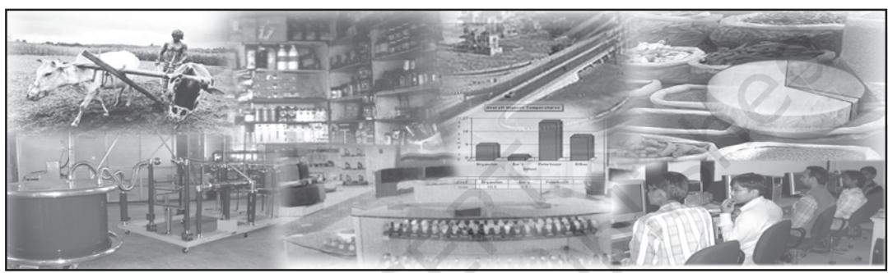

# CHAPTER

# Introduction

## *Studying this chapter should enable you to:*

- *• know what the subject of economics is about;*
- *• understand how economics is linked with the study of economic activities in consumption, production and distribution;*
- *• understand why knowledge of statistics can help in describing consumption, production and distribution;*
- *• learn about some uses of statistics in the understanding of economic activities.*

# 1. WHY ECONOMICS?

You have, perhaps, already had Economics as a subject for your earlier classes at school. You might have been told this subject is mainly around what *Alfred Marshall* (one of the founders of modern economics) called "*the study of man in the ordinary business of life*". Let us understand what that means.

When you buy goods (you may want to satisfy your own personal needs or those of your family or those of any other person to whom you want to make a gift) you are called a consumer.

When you sell goods to make a profit for yourself (you may be a shopkeeper), you are called a seller.

When you produce goods (you may be a farmer or a manufacturing company),or provide services (you may

be a doctor, porter, taxi driver or transporter of goods) you are called a producer.

When you are in a job, working for some other person, and you get paid for it (you may be employed by somebody who pays you wages or a salary), you are called an employee.

When you employ somebody, giving them a wage, you are an employer.

In all these cases you will be called gainfully employed in an economic activity. Economic activities are ones that are undertaken for a monetary gain. This is what economists mean by ordinary business of life.

## *Activities*

- List different activities of the members of your family. Would you call them economic activities? Give reasons.
- Do you consider yourself a consumer? Why?

#### We cannot get something for nothing

If you ever heard the story of *Aladdin* and *his Magic Lamp*, you would agree that Aladdin was a lucky guy. Whenever and whatever he wanted, he just had to rub his magic lamp and a genie appeared to fulfill his wish. When he wanted a palace to live in, the genie instantly made one for him. When he wanted expensive gifts to bring to the king when asking for his daughter's hand, he got them at the bat of an eyelid.

In real life we cannot be as lucky as Aladdin. Though, like him we have unlimited wants, we do not have a magic lamp. Take, for example, the pocket money that you get to spend. If you had more of it then you could have purchased almost all the things you wanted. But since your pocket money is limited, you have to choose only those things that you want the most. This is a basic teaching of Economics.

#### *Activities*

- Can you think for yourself of some other examples where a person with a given income has to choose which things and in what quantities he or she can buy at the prices that are being charged (called the current prices)?
- What will happen if the current prices go up?

*Scarcity* is the root of all economic problems. Had there been no scarcity, there would have been no economic problem. And you would not have studied Economics either. In our daily life, we face various forms of scarcity. The long queues at railway booking counters, crowded buses and trains, shortage of essential commodities, the rush to get a ticket to watch a new film, etc., are all manifestations of scarcity. We face scarcity because the things that satisfy our wants are limited in availability. Can you think of some more instances of scarcity?

The resources which the producers have are limited and also have alternative uses. Take the case of food that you eat every day. It satisfies your want of nourishment. Farmers employed in agriculture raise crops that produce your food. At any point of time, the resources in agriculture like land, labour, water, fertiliser, etc., are given. All these resources have alternative uses. The same resources can be used in the production of nonfood crops such as rubber, cotton, jute etc. Thus, alternative uses of resources give rise to the problem of choice between different commodities that can be produced by those resources.

#### *Activities*

- Identify your wants. How many of them can you fulfill? How many of them are unfulfilled? Why you are unable to fulfill them?
- What are the different kinds of scarcity that you face in your daily life? Identify their causes.

## Consumption, Production and Distribution

If you thought about it, you might have realised that Economics involves the study of man engaged in economic

activities of various kinds. For this, you need to know reliable facts about all the diverse economic activities like production, consumption and distribution. Economics is often discussed in three parts: *consumption, production* and *distribution*.

We want to know how the consumer decides, given his income and many alternative goods to choose from, what to buy when he knows the prices. *This is the study of Consumption.*

We also want to know how the producer, similarly, chooses what and how to produce for the market. *This is the study of Production.*

Finally, we want to know how the national income or the total income arising from what has been produced in the country (called the Gross Domestic Product or GDP) is distributed through wages (and salaries), profits and interest (We will leave aside here income from international trade and investment). *This is the study of Distribution.*

Besides these three conventional divisions of the study of Economics about which we want to know all the facts, modern economics has to include some of the basic problems facing the country for special studies.

For example, you might want to know why or to what extent some households in our society have the capacity to earn much more than others. You may want to know how many people in the country are really poor, how many are middle-class, how many are relatively rich and so on. You

may want to know how many are illiterate, who will not get jobs, requiring education, how many are highly educated and will have the best job opportunities and so on. In other words, you may want to know more facts in terms of numbers that would answer questions about poverty and disparity in society. If you do not like the continuance of poverty and gross disparity and want to do something about the ills of society you will need to know the facts about all these things before you can ask for appropriate actions by the government. If you know the facts it may also be possible to plan your own life better. Similarly, you hear of — some of you may even have experienced disasters like Tsunami, earthquakes, the bird flu — dangers threatening our country and so on that affect man's *'ordinary business of life'* enormously. Economists can look at these things provided they know how to collect and put together the facts about what these disasters cost systematically and correctly. You may perhaps think about it and ask yourselves whether it is right that modern economics now includes learning the basic skills involved in making useful studies for measuring poverty, how incomes are distributed, how earning opportunities are related to your education, how environmental disasters affect our lives and so on?

Obviously, if you think along these lines, you will also appreciate why we needed Statistics (which is the study of numbers relating to selected facts in a systematic form) to be added to all modern courses of modern economics.

Would you now agree with the following definition of economics that many economists use?

*"Economics is the study of how people and society choose to employ scarce resources that could have alternative uses in order to produce various commodities that satisfy their wants and to distribute them for consumption among various persons and groups in society."*

## 2. STATISTICS IN ECONOMICS

In the previous section you were told about certain special studies that concern the basic problems facing a country. These studies required that we know more about economic facts. Such economic facts are also known as economic data.

The purpose of collecting data about these economic problems is to understand and explain these problems in terms of the various causes behind them. In other words, we try to analyse them. For example, when we analyse the hardships of poverty, we try to explain it in terms of the various factors such as unemployment, low productivity of people, backward technology, etc.

But, what purpose does the analysis of poverty serve unless we are able to find ways to mitigate it. We may, therefore, also try to find those measures that help solve an economic problem. In Economics, such measures are known as policies.

So, do you realise, then, that no analysis of an economic problem would be possible without data on various factors underlying an economic problem? And, that, in such a situation, no policies can be formulated to solve it. If yes, then you have, to a large extent, understood the basic relationship between Economics and Statistics.

# 3. WHAT IS STATISTICS?

At this stage you are probably ready to know more about Statistics. You might very well want to know what the subject 'Statistics' is all about.

Statistics deals with the collection, analysis, interpretation and presentation of numerical data. It is a branch of mathematics and also used in the disciplines such as accounting, economics, management, physics, finance, psychology and sociology.

Here we are concerned with data from the field of Economics. Most Economics data are quantitative. For example, a statement in Economics like "the production of rice in India has increased from 39.58 million tonnes in 1974–75 to 106.5 million tonnes in 2013–14, is a quantitative data.

In addition to quantitative data, Economics also uses qualitative data. The chief characteristic of such information is that they describe attributes of a single person or a group of persons that is important to record as accurately as possible even though they cannot be measured in quantitative terms. Take, for example, 'gender' that distinguishes a person as man/woman or boy/girl. It is often possible (and useful) to state the information about an attribute of a person in terms of degrees (like better/ worse; sick/ healthy/ more healthy; unskilled/ skilled/ highly skilled, etc.). Such qualitative information or statistics is often used in Economics and other social sciences and collected and stored systematically like quantitative information (on prices, incomes, taxes paid, etc.), whether for a single person or a group of persons.

You will study in the subsequent chapters that *statistics* involves *collection* of data. The next step is to present the data in *tabular, diagrammatic* and *graphic* forms. The data, then, are summarised by calculating various numerical indices, such as *mean, variance, standard deviation,* etc., that represent the broad characteristics of the collected set of information. Finally, the data are analysed and interpreted.

#### *Activities*

- Think of two examples of qualitative and quantitative data.
- Which of the following would give you qualitative data; beauty, intelligence, income earned, marks in a subject, ability to sing, learning skills?

## 4. WHAT STATISTICS DOES?

Statistics is an indispensable tool for an economist that helps him to understand an economic problem. Using its various methods, effort is made to find the causes behind it with the help of qualitative and quantitative facts of an economic problem. Once the causes of the problem are identified, it is easier to formulate certain policies to tackle it.

But there is more to Statistics. It enables an economist to present economic facts in a precise and definite form that helps in proper comprehension of what is stated. When economic facts are expressed in statistical terms, they become exact. Exact facts are more convincing than vague statements. For instance, saying that with precise figures, 310 people died in the recent earthquake in Kashmir, is more factual and, thus, a statistical data. Whereas, saying hundreds of people died, is not.

Statistics also helps in condensing mass data into a few numerical measures (such as mean, variance etc., about which you will learn later). These numerical measures help to summarise data. For example, it would be impossible for you to remember the incomes of all the people in a data if the number of people is very large. Yet, one can remember easily a summary figure like the average income that is obtained statistically. In this way, Statistics summarises and presents a meaningful overall information about a mass of data.

Quite often, Statistics is used in finding relationships between different economic factors. An economist may be interested in finding out what happens to the demand for a commodity when its price increases or decreases? Or, would the supply of a commodity be affected by the changes in its own price? Or, would the consumption expenditure increase when the average income increases? Or, what happens to the general price level when the government expenditure increases? Such questions can only be answered if any relationship exists between the various economic factors that have been stated above. Whether such relationships exist or not can be easily verified by applying statistical methods to their data. In some cases the economist might assume certain relationships between them and like to test whether the assumption she/he made about the relationship is valid or not. The economist can do this only by using statistical techniques.

In another instance, the economist might be interested in predicting the changes in one economic factor due to the changes in another factor. For example, she/he might be interested in knowing the impact of today's investment on the national income in future. Such an exercise cannot be undertaken without the knowledge of Statistics.

Sometimes, formulation of plans and policies requires the knowledge of future trends. For example, an economic planner has to decide in 2017 how much the economy should produce in 2020. In other words, one must know what could be the expected level of consumption in 2020 in order to decide the production plan of the economy for 2020. In this situation, one might make subjective judgement based on the guess about consumption in 2020. Alternatively, one might use statistical tools to predict consumption in 2020. That could be based on the data of consumption of past years or of recent years obtained by surveys. Thus, statistical methods help formulate appropriate economic policies that solve economic problems.

## 5. CONCLUSION

Today, we increasingly use Statistics to analyse serious economic problems such as rising prices, growing population, unemployment, poverty etc., to find measures that can solve such problems. Further, it also helps to evaluate the impact of such policies in solving the economic problems. For example, it can be ascertained easily using statistical techniques whether the policy of family planning is effective in

checking the problem of ever-growing population.

In economic policies, Statistics plays a vital role in decision making. For example, in the present time of rising global oil prices, it might be necessary to decide how much oil India should import in 2025. The decision to import would depend on the expected domestic production of oil and the likely demand for oil in 2025. Without the use of Statistics, it cannot be determined what the expected domestic production of oil and the likely demand for it would be. Thus, the decision to import oil cannot be made unless we know the actual requirement of oil. This vital information that helps to make the decision to import oil can only be obtained statistically.

#### Statistical methods are no substitute for common sense!

There is an interesting story which is told to make fun of statistics. It is said that a family of four persons (husband, wife and two children) once set out to cross a river. The father knew the average depth of the river. So, he calculated the average height of his family members. Since the average height of his family members was greater than the average depth of the river, he thought they could cross safely. Consequently, some members of the family (children) drowned while crossing the river.

Does the fault lie with the statistical method of calculating averages or with the misuse of the averages?

#### *Recap*

- Our wants are unlimited but the resources used in the production of goods that satisfy our wants are limited and scarce. Scarcity is the root of all economic problems.
- Resources have alternative uses.
- Purchase of goods by consumers to satisfy their various needs is Consumption.
- Manufacture of goods by producers for the market is Production.
- Division of the national income into wages, profits, rents and interests is Distribution.
- Statistics finds economic relationships using data and verifies them.
- Statistical tools are used in prediction of future trends.
- Statistical methods help analyse economic problems and formulate policies to solve them.

#### EXERCISES

- 1. Mark the following statements as true or false.
	- (i) Statistics can only deal with quantitative data.
	- (ii) Statistics solves economic problems.
	- (iii) Statistics is of no use to Economics without data.
- 2. Make a list of activities in a bus stand or a market place. How many of them are economic activities?
- 3. 'The Government and policy makers use statistical data to formulate suitable policies of economic development'. Illustrate with two examples.
- 4. "You have unlimited wants and limited resources to satisfy them." Explain this statement by giving two examples.
- 5. How will you choose the wants to be satisfied?
- 6. What are your reasons for studying Economics?
- 7. Statistical methods are no substitute for common sense. Comment with examples from your daily life.

