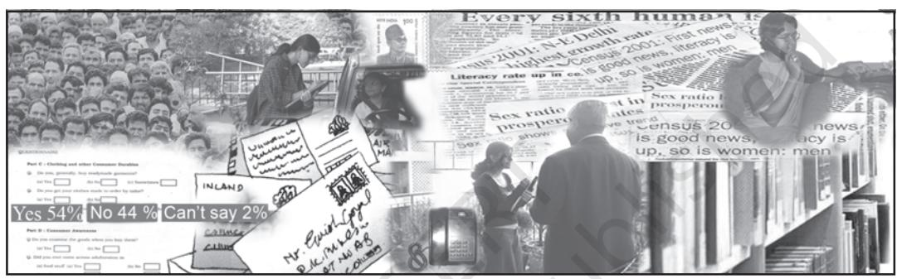
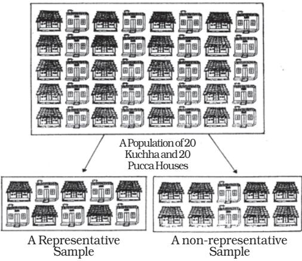

# C HAPT ER

# Collection of Data

### *Studying this chapter should enable you to:*

- *• understand the meaning and purpose of data collection;*
- *• distinguish between primary and secondary sources;*
- *• know the mode of collection of data;*
- *• distinguish between Census and Sample Surveys;*
- *• be familiar with the techniques of sampling;*
- *• know about some important sources of secondary data.*

# 1. INTRODUCTION

In the previous chapter, you have read about what is economics. You also studied about the role and importance of statistics in economics. In this chapter, you will study the sources of data and the mode of data collection. The purpose of collection of data is to show evidence for reaching a sound and clear solution to a problem.

In economics, you often come across a statement like this,

*"After many fluctuations the output of food grains rose to 132 million tonnes in 1978-79 from 108 million tonnes in 1970-71, but fell to 108 million tonnes in 1979-80. Production of food grains then rose continuously to 252 million tonnes in 2015-16 and touched 272 million tonnes in 2016–17."*

In this statement, you can observe that the food grains production in different years does not remain the same. It varies from year to year and from crop to crop. As these values vary, they are called *variable*. The variables are generally represented by the letters X, Y or Z. Each value of a variable is an observation. For example, the food grain production in India varies between 108 million tonnes in 1970– 71 to 272 million tonnes in 2016-17 as shown in the following table. The years are represented by variable X and the production of food grain in India (in million tonnes) is represented by variable Y.

TABLE 2.1 Production of Food Grain in India

|  | (Million Tonnes) |
| --- | --- |
| X | Y |
| 1970–71 | 108 |
| 1978–79 | 132 |
| 1990–91 | 176 |
| 1997–98 | 194 |
| 2001–02 | 212 |
| 2015-16 | 252 |
| 2016-17 | 272 |

Here, the values of these variables X and Y are the 'data', from which we can obtain information about the production of food grains in India. To know the fluctuations in food grains production, we need the 'data' on the production of food grains in India for various years. 'Data' is a tool, which helps in understanding problems by providing information.

You must be wondering where do 'data' come from and how do we collect these? In the following sections we will discuss the types of data, method and instruments of data collection and sources of obtaining data.

# 2. WHAT ARE THE SOURCES OF DATA?

Statistical data can be obtained from two sources. The *researcher* may collect the data by conducting an enquiry. Such data are called *Primary Data,* as they are based on first hand information. Suppose, you want to know about the popularity of a filmstar among school students. For this, you will have to enquire from a large number of school students, by asking questions from them to collect the desired information. The data you get, is an example of primary data.

If the data have been collected and processed (scrutinised and tabulated) by some other agency, they are called *Secondary Data*. They can be obtained either from published sources such as government reports, documents, newspapers, books written by economists or from any other source, for example, a website. Thus, the data are *primary* to the source that collects and processes them for the first time and *secondary* for all sources that later use such data. Use of secondary data saves time and cost. For example, after collecting the data on the popularity of the filmstar among students, you publish a report. If somebody uses the data collected by you for a similar study, it becomes secondary data.

### 3. HOW DO WE COLLECT THE DATA?

Do you know how a manufacturer decides about a product or how a political party decides about a candidate? They conduct a survey by

asking questions about a particular product or candidate from a large group of people. The purpose of surveys is to describe some characteristics like price, quality, usefulness (in case of the product) and popularity, honesty, loyalty (in case of the candidate). The purpose of the *survey* is to collect data*. Survey* is a method of gathering information from individuals.

### Preparation of Instrument

The most common type of instrument used in surveys is questionnaire/ interview schedule. The questionnaire is either self administered by the respondent or administered by the researcher (enumerator) or trained investigator. While preparing the questionnaire/interview schedule, you should keep in mind the following points;

- *• The questionnaire should not be too long*. The number of questions should be as minimum as possible.
- *• The questionnaire should be easy to understand and avoid ambiguous or difficult words.*
- *• The questions should be arranged in an order such that the person answering should feel comfortable.*
- *• The series of questions should move from general to specific*. The questionnaire should start from general questions and proceed to more specific ones. For example:

### *Poor Q*

- (i) Is increase in electricity charges justified?
- (ii) Is the electricity supply in your locality regular?

*Good Q*

- (i) Is the electricity supply in your locality regular?
- (ii) Is increase in electricity charges justified?
- *• The questions should be precise and clear.* For example,

### *Poor Q*

What percentage of your income do you spend on clothing in order to look presentable?

*Good Q*

What percentage of your income do you spend on clothing?

- *• The questions should not be ambiguous. They should enable the respondents to answer quickly, correctly and clearly*. For example:
*Poor Q*

Do you spend a lot of money on books in a month?

*Good Q*

(Tick mark the appropriate option)

How much do you spend on books in a month?

- (i) Less than Rs 200
- (ii) Rs 200–300
- (iii) Rs 300–400
- (iv) More than Rs 400
- *• The question should not use double negatives*. The questions starting with "Wouldn't you" or "Don't you" should be avoided, as they may lead to biased responses. For example:

*Poor Q*

Don't you think smoking should be prohibited?

*Good Q*

Do you think smoking should be prohibited?

- *• The question should not be a leading question, which gives a clue about how the respondent should answer*. For example:
*Poor Q*

How do you like the flavour of this highquality tea?

*Good Q*

How do you like the flavour of this tea?

- *• The question should not indicate alternatives to the answer*. For example:
*Poor Q*

Would you like to do a job after college or be a housewife?

*Good Q*

What would you like to do after college ?

The questionnaire may consist of *closed-ended* (or structured) questions or *open-ended* (or unstructured) questions. The above question about what a student wants do after college is an open-ended question.

C*losed-ended or structured* questions can either be a *two-way question* or a *multiple choice* question. When there are only two possible answers, 'yes' or 'no', it is called a twoway question.

When there is a possibility of more than two options of answers, *multiple choice* questions are more appropriate. *Example,*

- Q. Why did you sell your land?
	- (i) To pay off the debts.
	- (ii) To finance children's education.
	- (iii) To invest in another property.
	- (iv) Any other (please specify).

*Closed-ended questions* are easy to use, score and to codify for analysis, because all respondents can choose from the given options. But they are difficult to write as the alternatives should be clearly written to represent both sides of the issue. There is also a possibility that an individual's true response is not present among the options given. For this, the choice of '*Any Other*' is provided, where the respondent can write a response, which was not anticipated by the researcher. Moreover, another limitation of multiple-choice questions is that they tend to restrict the answers by providing alternatives, without which the respondents may have answered differently.

*Open-ended questions* allow for more individualised responses, but they are difficult to interpret and hard to score, since there are a lot of variations in the responses. *Example,*

- Q. What is your view about globalisation?
# Mode of Data Collection

Have you ever come across a television show in which reporters ask questions from children, housewives or general public regarding their examination performance or a brand of soap or a

political party? The purpose of asking questions is to do a survey for collection of data. There are three basic ways of collecting data: (i) Personal Interviews, (ii) Mailing (questionnaire) Surveys, and (iii) Telephone Interviews.

#### *Personal Interviews*

This method is used when the researcher has access to all the members. The researcher (or investigator) conducts face-

to-face interviews with the respondents.

Personal interviews are preferred due to various reasons. Personal contact is made between the respondent and the interviewer. The interviewer has the opportunity of explaining the study and answering the queries of respondents. The interviewer can request the respondent to expand on answers that are particularly important. Misinterpretation and misunderstanding can be avoided. Watching the reactions of respondents can provide supplementary information.

Personal interview has some demerits too. It is expensive, as it requires trained interviewers. It takes longer time to complete the survey. Presence of the researcher may inhibit respondents from saying what they really think.

#### *Mailing Questionnaire*

When the data in a survey are collected by mail, the questionnaire is sent to

each individual by *mail* with a request to complete and return it by a given date. The advantages of this method are that, it is

less expensive. It allows the researcher to have access to people in remote areas too, who might be difficult to reach in person or by telephone. It does not allow influencing of the respondents by the interviewer. It also permits the respondents to take sufficient time to give thoughtful answers to the questions.

These days online surveys or surveys through short messaging service, i.e., SMS are popular. Do you know how an online survey is conducted?

The disadvantages of mail survey are that there is less opportunity to provide assistance in clarifying instructions, so there is a possibility of misunderstanding the questions. Mailing is also likely to produce low response rates due to certain factors, such as returning the questionnaire without completing it, not returning the questionnaire at all, loss of questionnaire in the mail itself, etc.

#### *Telephone Interviews*

In a telephone interview, the investigator asks questions over the telephone. The advantages of telephone interviews are that they are cheaper than personal interviews and can be conducted in a shorter time. They allow the researcher to assist the respondent by clarifying the questions. Telephonic interview is better in cases where the respondents are reluctant to answer certain questions in personal interviews.

The disadvantage of this method is access to people, as many people may not own telephones.

### Pilot Survey

Once the questionnaire is ready, it is advisable to conduct a try-out with a small group which is known as *Pilot Survey* or *Pre-testing* of the questionnaire. The pilot survey helps in providing a preliminary idea about the survey. It helps in *pre-testing* of the questionnaire, so as to know the shortcomings and drawbacks of the questions. Pilot survey also helps in assessing the suitability of questions, clarity of instructions, performance of enumerators and the cost and time involved in the actual survey.

### *Activities*

- You have to collect information from a person, who lives in a remote village of India. Which mode of data collection will be appropriate and why? Discuss.
- You have to interview the parents about the quality of teaching in a school. If the principal of the school is present there, what types of problems can arise?

|  | Advantages | Disadvantages |
| --- | --- | --- |
|  | Personal Interview |  |
| • | Highest Response Rate • | Most expensive |
| • | Allows use of all types of questions • | Possibility of influencing |
| • | Better for using open-ended | respondents |
|  | questions • | More time-taking. |
| • | Allows clarification of ambiguous |  |
|  | questions. |  |
|  | Mailed Interview |  |
| • | Least expensive • | Cannot be used by illiterates |
| • | Only method to reach remote • | Long response time |
|  | areas • | Does not allow explanation of |
| • | No influence on respondents | unambiguous questions |
| • | Maintains anonymity of • | Reactions cannot be watched. |
|  | respondents |  |
| • | Best for sensitive questions. |  |
|  | Telephonic Interviews |  |
| • | Relatively low cost • | Limited use |
| • | Relatively less influence on • | Reactions cannot be watched |
|  | respondents • | Possibility of influencing |
| • | Relatively high response rate. | respondents. |

# 4. CENSUS AND SAMPLE SURVEYS

### Census or Complete Enumeration

A survey, which includes every element of the population, is known as *Census* or the *Method of Complete Enumeration*. If certain agencies are interested in studying the total population in India, they have to obtain information from all the households in rural and urban India. It is carried out every ten years. A house-to-house enquiry is carried out, covering all households in India. Demographic data on birth and death rates, literacy, employment, life expectancy, size and composition of population, etc., are collected and published by the Registrar General of India. The last *Census of India* was held in 2011.

According to the Census 2011, population of India was 121.09 crore, which was 102.87 crore in 2001. Census 1901 indicated that the population of the country was 23.83 crore. Since then, in a period of 110 years, the population of the country has increased by more than 97 crore. The average annual growth rate of population which was 2.2 per cent per year in the decade 1971-81 came down to 1.97 per cent in 1991-2001 and 1.64 per cent during 2001-2011.

# Population and Sample

*Population* or the *Universe* in statistics means totality of the items under study. Thus, the *Population* or the *Universe* is a group to which the results of the study are intended to apply. *A population is always all the individuals/items who possess certain characteristics (or a set of characteristics),* according to the purpose of the survey. The first task in selecting a sample is to identify the *population*. Once the population is identified, the researcher selects a *method of studying it. If the researcher finds that survey of the whole population is not possible, then he/ she may decide to select a Representative Sample*. *A sample refers to a group or section of the population from which information is to be obtained. A good sample (representative sample)* is generally smaller than the *population* and is capable of providing reasonably accurate information about the population at a much lower cost and shorter time.

Suppose you want to study the average income of people in a certain region. According to the Census method, you would be required to find out the income of every individual in the region, add them up and divide by number of individuals to get the average income of people in the region. This method would require huge expenditure, as a large number of enumerators have to be employed. Alternatively, you select a *representative sample,* of a few individuals, from the region and find out their income. The average income of the selected group of individuals is used as an estimate of average income of the individuals of the entire region.

### *Example*

*• Research problem*: To study the economic condition of agricultural labourers in Churachandpur district of Manipur.

- *• Population*: All agricultural labourers in Churachandpur district.
*• Sample*: Ten per cent of the agricultural labourers in Churachandpur district.

Most of the surveys are sample surveys. These are preferred in statistics because of a number of reasons. A sample can provide reasonably reliable and accurate information at a lower cost and shorter time. As samples are smaller than population, more detailed information can be collected by conducting intensive enquiries. As we need a smaller team of enumerators, it is easier to train them and supervise their work more effectively.

Now the question is how do you do the sampling? There are two main types of sampling, *random* and *non-random.*

#### *Activities*

- In which years will the next Census be held in India and China?
- If you have to study the opinion of students about the new economics textbook of class XI, what will be your *population* and *sample?*
- If a researcher wants to estimate the average yield of wheat in Punjab, what will be her/his *population* and *sample*?

The following description will make their distinction clear.

### *Random Sampling*

As the name suggests, random sampling is one where the individual units from the population (samples) are selected *at random*. The government wants to determine the impact of the rise in petrol price on the household budget of a particular locality. For this, a representative (random) sample of 30 households has to be taken and studied. The names of all 300 households of that area are written on paper and mixed, then 30 names to be interviewed are selected one by one.

*In random sampling, every individual has an equal chance of being selected.* In the above example, all 300 sampling units (also called *sampling frame)* of the population got an equal chance of being included in

the sample of 30 units and hence the sample, such drawn, is a random sample. This is also called *lottery method*. Nowadays computer programmes are used to select random samples.

### Exit Polls

You must have seen that when an election takes place, the television networks provide election coverage. They also try to predict the results. This is done through *exit polls,* wherein a random sample of voters who exit the polling booths are asked whom they voted for. From the data of the sample of voters, the prediction is made. You might have noticed that exit polls do not always predict correctly. Why?

#### *Activity*

- You have to analyse the trend of foodgrains production in India for the last fifty years. As it is difficult to collect data for all the years, you are asked to select a sample of production of ten years.
Using the Random Number Tables, how will you select your sample years?

### *Non-Random Sampling*

There may be a situation that you have to select 10 out of 100 households in a locality. You have to decide which household to select and which to reject. You may select the households conveniently situated or the households known to you or your friend. In this case, you are using your judgement (bias) in selecting 10 households. This way of selecting 10 out of 100 households is not a random selection. *In a non-random sampling method all the units of the population do not have an equal chance of being selected and convenience or judgement of the investigator plays an important role in selection of the sample*. They are mainly selected on the basis of judgment, purpose, convenience or quota and are nonrandom samples.

## 5. SAMPLING AND NON-SAMPLING ERRORS

### Sampling Errors

A population consisting of numerical values has two important characteristics which are of relevance here. First, Central Tendency which may be measured by the mean, the median or the mode. Second, Dispersion, which can be measured by caculating the "standard deviation", '' mean deviation", " range", etc.

The purpose of the sample is to get one or more estimate of the population parameters. Sampling error refers to the difference between the sample estimate and the corresponding population parameter (actual value of the characteristic of the population for example, average income, etc). *Thus, the difference between the actual value of a parameter of the population and its estimate (from the sample) is the sampling error.* It is possible to reduce the magnitude of sampling error by taking a larger sample.

### *Example*

Consider a case of incomes of 5 farmers of Manipur. The variable x (income of farmers) has measure-ments 500, 550, 600, 650, 700. We note that the *population average* of (500+550+600+650+700) ÷ 5 = 3000 ÷ 5 = 600.

Now, suppose we select a sample of two individuals where x has measurements of 500 and 600. The *sample average* is (500 + 600) ÷ 2 = 1100 ÷ 2 = 550.

Here, the *sampling error* of the *estimate =* 600 (true value) – 550 (estimate) = 50.

### Non-Sampling Errors

Non-sampling errors are more serious than sampling errors because a sampling error can be minimised by taking a larger sample. It is difficult to minimise non-sampling error, even by taking a large sample. Even a *Census* can contain non-sampling errors. Some of the non-sampling errors are:

### *Sampling Bias*

Sampling bias occurs when the sampling plan is such that some members of the target population could not possibly be included in the sample.

### *Non-Response Errors*

Non-response occurs if an interviewer is unable to contact a person listed in the sample or a person from the sample refuses to respond. In this case, the sample observation may not be representative.

### *Errors in Data Acquisition*

This type of error arises from recording of incorrect responses. Suppose, the teacher asks the students to measure the length of the teacher's table in the classroom. The measurement by the students may differ. The differences may occur due to differences in measuring tape, carelessness of the students, etc. Similarly, suppose, we want to collect data on prices of oranges. We know that prices vary from shop to shop and from market to market. Prices also vary according to the quality. Therefore, we can only consider the average prices. Recording mistakes can also take place as the enumerators or the respondents may commit errors in recording or transscripting the data, for example, he/ she may record 13 instead of 31.

### 6. CENSUS OF INDIA AND NSSO

There are some agencies both at the national and state level to collect, process and tabulate the statistical data. Some of the agencies at the national level are Census of India, National Sample Survey (NSS), Central Statistics Office (CSO), Registrar General of India (RGI), Directorate General of Commercial Intelligence and Statistics (DGCIS), Labour Bureau, etc.

The Census of India provides the most complete and continuous demographic record of population. The Census is being regularly conducted every ten years since 1881. The first Census after Independence was conducted in 1951. The Census officials collect information on various aspects of population such as the size, density, sex ratio, literacy, migration, rural-urban distribution, etc. Census data is interpreted and analysed to understand many economic and social issues in India.

The NSS was established by the Government of India to conduct nationwide surveys on socio-economic issues. The NSS does continuous surveys in successive rounds. The data collected by NSS are released through reports and its quarterly journal *Sarvekshana*. NSS provides periodic estimates of literacy, school enrolment, utilisation of educational services, employment, unemployment, manufacturing and service sector enterprises, morbidity, maternity, child care, utilisation of the public distribution system etc. The NSS 60th round survey (January–June 2004) was on morbidity and healthcare. The NSS 68th round survey (2011-12) was on consumer expenditure. The NSS also collects details of industrial activities and retail prices for various goods. They are used by Government of India for planning puposes.

### 7. CONCLUSION

Economic facts, expressed in terms of numbers, are called data. The purpose of data collection is to understand, explain and analyse a problem and causes behind it. Primary data is obtained by conducting a survey. Survey includes various steps, which need to be planned carefully. There are various agencies which collect, process, tabulate and publish statistical data. These are used as secondary data. However, the choice of source of data and mode of data collection depends on the objective of the study.

#### *Recap*

- Data is a tool which helps in reaching a sound conclusion on any problem.
- Primary data is based on first hand information.
- Survey can be done by personal interviews, mailing questionnaires and telephone interviews.
- Census covers every individual/unit belonging to the population.
- Sample is a smaller group selected from the population from which the relevant information would be sought.
- In a random sampling, every individual is given an equal chance of being selected for providing information.
- Sampling error is due to the difference between the value of the sample estimate and the value of the corresponding population parameter.
- Non-sampling errors can arise in data acquisition, by non-response or by bias in selection.
- Census of India and National Sample Survey are two important agencies at the national level, which collect, process and tabulate data on many important economic and social issues.

#### EXERCISES

- 1. Frame at least four appropriate multiple-choice options for following questions:
	- (i) Which of the following is the most important when you buy a new dress?
	- (ii) How often do you use computers?
	- (iii) Which of the newspapers do you read regularly?
	- (iv) Rise in the price of petrol is justified.
	- (v) What is the monthly income of your family?
- 2. Frame five two-way questions (with 'Yes' or 'No').
- 3. State whether the following statements are True or False.
	- (i) There are many sources of data.
	- (ii) Telephone survey is the most suitable method of collecting data, when the population is literate and spread over a large area.
	- (iii) Data collected by investigator is called the secondary data.
	- (iv) There is a certain bias involved in the non-random selection of samples.
	- (v) Non-sampling errors can be minimised by taking large samples.
- 4. What do you think about the following questions? Do you find any

problem with these questions? Describe.

- (i) How far do you live from the closest market?
- (ii) If plastic bags are only 5 per cent of our garbage, should it be banned?
- (iii) Wouldn't you be opposed to increase in price of petrol?
- (iv) Do you agree with the use of chemical fertilisers?
- (v) Do you use fertilisers in your fields?
- (vi) What is the yield per hectare in your field?
- 5. You want to do a research on the popularity of Vegetable Atta Noodles among children. Design a suitable questionnaire for collecting this information.
- 6. In a village of 200 farms, a study was conducted to find the cropping pattern. Out of the 50 farms surveyed, 50% grew only wheat. What is the population and the sample size?
- 7. Give two examples each of sample, population and variable.
- 8. Which of the following methods give better results and why? (a) Census (b) Sample
- 9. Which of the following errors is more serious and why?

(a) Sampling error (b) Non-Sampling error

- 10. Suppose there are 10 students in your class. You want to select three out of them. How many samples are possible?
- 11. Discuss how you would use the lottery method to select 3 students out of 10 in your class.
- 12. Does the lottery method always give you a random sample? Explain.
- 13. Explain the procedure for selecting a random sample of 3 students out of 10 in your class by using random number tables.
- 14. Do samples provide better results than surveys? Give reasons for your answer.

