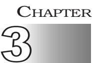
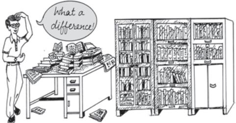
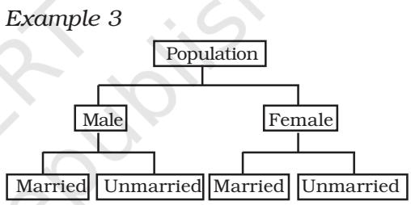
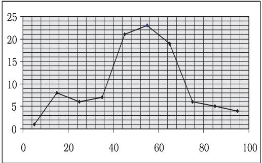
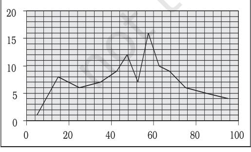

# Organisation of Data

### *Studying this chapter should enable you to:*

- *• classify the data for further statistical analysis;*
- *• distinguish between quantitative and qualitative classification;*
- *• prepare a frequency distribution table;*
- *• know the technique of forming classes;*
- *• be familiar with the method of tally marking;*
- *• differentiate between univariate and bivariate frequency distributions.*

# 1. INTRODUCTION

In the previous chapter you have learnt about how data is collected. You also came to know the difference between

census and sampling. In this chapter, you will know how the data, that you collected, are to be classified. The purpose of classifying raw data is to bring order in them so that they can be subjected to further statistical analysis easily.

Have you ever observed your local junk dealer or *kabadiwallah* to whom you sell old newspapers, broken household items, empty glass bottles, plastics, etc? He purchases these things from you and sells them to those who recycle them. But with so much junk in his shop it would be very difficult for him to manage his trade, if he had not organised them properly. To ease his situation he suitably groups or "classifies" various junk. He puts old newspapers together and ties them with a rope. Then collects all empty glass bottles in a sack. He heaps the articles of metals in one corner of his shop and sorts them into groups like "iron", "copper", "aluminium", "brass" etc., and so on. In this way he groups his junk into different classes — "newspapers, "plastics", "glass", "metals" etc. — and brings order in them. Once his junk is arranged and classified, it becomes easier for him to find a particular item that a buyer may demand.

Likewise when you arrange your schoolbooks in a certain order, it becomes easier for you to handle them. You may classify them according to

subjects where each subject becomes a group or a class. So, when you need a particular book on history, for instance, all you need to do is to search that book in the group "History". Otherwise, you would have to search through your entire collection to find the particular book you are looking for.

While classification of objects or things saves our valuable time and effort, it is not done in an arbitrary manner. The *kabadiwallah* groups his junk according to the markets for reused goods. For example, under the group "Glass" he would put empty bottles, broken mirrors and windowpanes, etc. Similarly when you classify your history books under the group "History" you would not put a book of a different subject in that group. Otherwise the entire purpose of grouping would be lost. *Classification, therefore*, *is arranging or organising things into groups or classes based on some criteria.*

#### *Activity*

- Visit your local post-office to find out how letters are sorted. Do you know what the pin-code in a letter indicates? Ask your postman.
# 2. RAW DATA

Like the *kabadiwallah's* junk, the unclassified data or *raw data* are highly disorganised. They are often very large and cumbersome to handle. To draw meaningful conclusions from them is a tedious task because they do not yield to statistical methods easily. Therefore proper organisation and presentation of such data is needed before any systematic statistical analysis is undertaken. Hence after collecting data the next step is to organise and present them in a classified form.

Suppose you want to know the performance of students in mathematics and you have collected data on marks in mathematics of 100 students of your school. If you present them as a table, they may appear something like Table 3.1.

TABLE 3.1 Marks in Mathematics Obtained by 100 Students in an Examination

| 47 | 45 | 10 | 60 | 51 | 56 | 66 | 100 49 |  | 40 |
| --- | --- | --- | --- | --- | --- | --- | --- | --- | --- |
| 60 | 59 | 56 | 55 | 62 | 48 | 59 | 55 | 51 | 41 |
| 42 | 69 | 64 | 66 | 50 | 59 | 57 | 65 | 62 | 50 |
| 64 | 30 | 37 | 75 | 17 | 56 | 20 | 14 | 55 | 90 |
| 62 | 51 | 55 | 14 | 25 | 34 | 90 | 49 | 56 | 54 |
| 70 | 47 | 49 | 82 | 40 | 82 | 60 | 85 | 65 | 66 |
| 49 | 44 | 64 | 69 | 70 | 48 | 12 | 28 | 55 | 65 |
| 49 | 40 | 25 | 41 | 71 | 80 | 0 | 56 | 14 | 22 |
| 66 | 53 | 46 | 70 | 43 | 61 | 59 | 12 | 30 | 35 |
| 45 | 44 | 57 | 76 | 82 | 39 | 32 | 14 | 90 | 25 |

Or you could have collected data on the monthly expenditure on food of 50 households in your neighbourhood to know their average expenditure on food. The data collected, in that case, had you presented as a table, would have resembled Table 3.2. Both Tables 3.1 and 3.2 are *raw* or *unclassified data*. In both the tables you find that

numbers are not arranged in any order. Now if you are asked for the highest marks in mathematics from Table 3.1

Table 3.2

Monthly Household Expenditure (in Rupees) on Food of 50 Households

| 1904 | 1559 | 3473 | 1735 | 2760 |
| --- | --- | --- | --- | --- |
| 2041 | 1612 | 1753 | 1855 | 4439 |
| 5090 | 1085 | 1823 | 2346 | 1523 |
| 1211 | 1360 | 1110 | 2152 | 1183 |
| 1218 | 1315 | 1105 | 2628 | 2712 |
| 4248 | 1812 | 1264 | 1183 | 1171 |
| 1007 | 1180 | 1953 | 1137 | 2048 |
| 2025 | 1583 | 1324 | 2621 | 3676 |
| 1397 | 1832 | 1962 | 2177 | 2575 |
| 1293 | 1365 | 1146 | 3222 | 1396 |

then you have to first arrange the marks of 100 students either in ascending or in descending order. That is a tedious task. It becomes more tedious, if instead of 100 you have the marks of 1,000 students to handle. Similarly, in Table 3.2, you would note that it is difficult for you to ascertain the average monthly expenditure of 50 households. And this difficulty will go up manifold if the number was larger — say, 5,000 households. Like our *kabadiwallah*, who would be distressed to find a particular item when his junk becomes large and disarranged, you would face a similar situation when you try to get any information from raw data that are large. In one word, therefore, it is a tedious task to pull information from large unclassified data.

The raw data are summarised, and made comprehensible by classification. When facts of similar characteristics are placed in the same class, it enables one to locate them easily, make comparison, and draw inferences without any difficulty. You have studied in Chapter 2 that the Government of India conducts Census of population every ten years. About 20 crore persons were contacted in Census 2001. The raw data of census are so large and fragmented that it appears an almost impossible task to draw any meaningful conclusion from them. But when the same data is classified according to gender, education, marital status, occupation, etc., the structure and nature of population of India is, then, easily understood.

The raw data consist of observations on variables. The raw data as given in Tables 3.1 and 3.2 consist of observations on a specific or group of variables. Look at Table 3.1 for instance which contains marks in mathematics scored by 100 students. How can we make sense of these marks? The mathematics teacher looking at these marks would be thinking– How have my students done? How many have not passed? How we classify the data depends upon the purpose we have in mind. In this case, the teacher wishes to understand in some depth– how these students have done. She would probably choose to construct the frequency distribution. This is discussed in the next section.

### *Activity*

- Collect data of total weekly expenditure of your family for a year and arrange it in a table. See how many observations you have. Arrange the data monthly and find the number of observations.
# 3. CLASSIFICATION OF DATA

The groups or classes of a classification is done in various ways. Instead of classifying your books according to subjects — "History", "Geography", "Mathematics", "Science", etc. — you could have classified them author-wise in an alphabetical order. Or, you could have also classified them according to the year of publication. The way you want to classify them would depend on your requirement.

Likewise the raw data is classified in various ways depending on the purpose. They can be grouped according to time. Such a classification is known as a Chronological Classification. In such a classification, data are classified either in ascending or in descending order with reference to time such as years, quarters, months, weeks, etc. The following example shows the population of India classified in terms of years. The variable 'population' is a Time Series as it depicts a series of values for different years.

### *Example 1*

|  | Population of India (in crores) |
| --- | --- |
| Year | Population (Crores) |
| 1951 | 35.7 |

| 1951 | 35.7 |
| --- | --- |
| 1961 | 43.8 |
| 1971 | 54.6 |
| 1981 | 68.4 |
| 1991 | 81.8 |
| 2001 | 102.7 |
| 2011 | 121.0 |

In Spatial Classification the data are classified with reference to geographical locations such as countries, states, cities, districts, etc.

*Example 2* shows the yeild of wheat in different countries.

# *Example 2*

#### Yield of Wheat for Different Countries (2013)

| Country | Yield of wheat (kg/hectare) |
| --- | --- |
| Canada | 3594 |
| China | 5055 |
| France | 7254 |
| Germany | 7998 |
| India | 3154 |
| Pakistan | 2787 |

*Source: Indian Agricultural Statistics at a Glance, 2015*

### *Activities*

- In Example 1, find out the years in which India's population was minimum and maximum,
- In Example 2, find the country whose yield of wheat is *slightly more* than that of India's. How much would that be in terms of percentage?
- Arrange the countries of Example 2 in the ascending order of yield. Do the same exercise for the descending order of yield.

Sometimes you come across characteristics that cannot be expressed quantitatively. Such characteristics are called *Qualities or Attributes.* For example, nationality, literacy, religion, gender, marital status, etc. They cannot be measured. Yet these *attributes* can be classified on the basis of either the presence or the absence of a qualitative characteristic. Such a classification of data on attributes is called a *Qualitative Classification.* In the following example*,* we find population of a country is grouped on the basis of the qualitative variable "gender". An observation could either be a male or a female. These two characteristics could be further classified on the basis of marital status as given below:

The classification at the first stage is based on the presence and absence of an attribute, i.e., male or not male (female). At the second stage, each class — male and female, is further subdivided on the basis of the presence or absence of another attribute, i.e., whether married or unmarried. Characteristics, like height, weight, age, income, marks of students, etc., are quantitative in nature. When the collected data of such characteristics are grouped into classes, it becomes a *Quantitative Classification.*

## *Activity*

- The objects around can be grouped as either living or non-living. Is it a quantitative classification?
### *Example 4*

|  | Frequency Distribution of Marks in |
| --- | --- |
|  | Mathematics of 100 Students |
| Marks | Frequency |
| 0–10 | 1 |
| 10–20 | 8 |
| 20–30 | 6 |
| 30–40 | 7 |
| 40–50 | 21 |
| 50–60 | 23 |
| 60–70 | 19 |
| 70–80 | 6 |
| 80–90 | 5 |
| 90–100 | 4 |
| Total | 100 |

Example 4 shows the quantitative classification of marks in mathematics of 100 students given in Table 3.1.

#### *Activity*

- Express the values of frequency of Example 4 as proportion or percentage of total frequency. Note that frequency expressed in this way is known as *relative frequency*.
- In Example 4, which class has the maximum concentration of data? Express it as percentage of total observations. Which class has the minimum concentration of data?

# 4. VARIABLES: CONTINUOUS AND DISCRETE

A simple definition of variable, which you have read in the last chapter, does not tell you how it varies. Variables differ on the basis of specific criterion. They are broadly classified into *two* types:

- (i) *Continuous* and
(ii) *Discrete.*

A *continuous variable* can take *any* numerical value. It may take integral values (1, 2, 3, 4, ...), fractional values (1/2, 2/3, 3/4, ...), and values that are not exact fractions ( 2 =1.414, 3 =1.732, …, 7 =2.645). For example, the height of a student, as he/she grows say from 90 cm to 150 cm, would take all the values in between them. It can take values that are whole numbers like 90cm, 100cm, 108cm, 150cm. It can also take fractional values like 90.85 cm, 102.34 cm, 149.99cm etc. that are not whole numbers. Thus the variable "height" is capable of manifesting in every conceivable value and its values

can also be broken down into infinite gradations.

Other examples of a continuous variable are weight, time, distance, etc.

Unlike a continuous variable, a *discrete variable* can take only certain values. Its value changes only by finite "jumps". It "jumps" from one value to another but does not take any intermediate value between them. For example, a variable like the "number of students in a class", for different classes, would assume values that are only whole numbers. It cannot take any fractional value like 0.5 because "half of a student" is absurd. Therefore it cannot take a value like 25.5 between 25 and 26. Instead its value could have been either 25 or 26. What we observe is that as its value changes from 25 to 26, the values in between them — the fractions are not taken by it. But we should not have the impression that

a discrete variable cannot take any fractional value. Suppose X is a variable that takes values like 1/8, 1/ 16, 1/32, 1/64, ... Is it a discrete variable? Yes, because though X takes fractional values it cannot take any value between two adjacent fractional values. It changes or "jumps" from 1/ 8 to 1/16 and from 1/16 to 1/32. But it cannot take a value in between 1/8 and 1/16 or between 1/16 and 1/32.

#### *Activity*

- Distinguish the following variables as continuous and discrete: Area, volume, temperature, number appearing on a dice, crop yield, population, rainfall, number of cars on road and age.
*Example 4* shows how the marks of 100 students are grouped into classes. You will be wondering as to how we got it from the raw data of Table 3.1. But, before we address this question, you must know what a frequency distribution is.

# 5. WHAT IS A FREQUENCY DISTRIBUTION?

A frequency distribution is a comprehensive way to classify raw data of a quantitative variable. It shows how different values of a variable (here, the marks in mathematics scored by a student) are distributed in different classes along with their corresponding class frequencies. In this case we have ten classes of marks: 0–10, 10–20, … , 90–100. The term *Class Frequency* means the number of values in a particular class. For example, in the class 30– 40 we find 7 values of marks from raw data in Table 3.1. They are 30, 37, 34, 30, 35, 39, 32. The frequency of the class: 30–40 is thus 7. But you might be wondering why 40–which is occurring *twice* in the raw data – is not included in the class 30– 40. Had it been included the class frequency of 30–40 would have been 9 instead of 7. The puzzle would be clear to you if you are patient enough to read this chapter carefully. So carry on. You will find the answer yourself.

Each class in a frequency distribution table is bounded by *Class Limits.* Class limits are the two ends of a class. The lowest value is called the *Lower Class Limit* and the highest value the *Upper Class Limit.* For example, the class limits for the class: 60–70 are 60 and 70. Its lower class limit is 60 and its upper class limit is 70. *Class Interval or Class Width* is the difference between the upper class limit and the lower class limit. For the class 60–70, the class interval is 10 (upper class limit *minus* lower class limit).

The *Class Mid-Point* or *Class Mark* is the middle value of a class. It lies halfway between the lower class limit and the upper class limit of a class and can be ascertained in the following manner:

# *Class Mid-Point or Class Mark = (Upper Class Limit + Lower Class Limit)/2*

The class mark or mid-value of each class is used to represent the class. Once raw data are grouped into classes, individual observations are not used in further calculations. Instead, the class mark is used.

| TABLE 3.3 |
| --- |
| The Lower Class Limits, the Upper Class |
| Limits and the Class Mark |

| Class | Frequency | Lower | Upper | Class |
| --- | --- | --- | --- | --- |
|  |  | Class | Class | Mark |
|  |  | Limit | Limit |  |
| 0–10 | 1 | 0 | 10 | 5 |
| 10–20 | 8 | 10 | 20 | 15 |
| 20–30 | 6 | 20 | 30 | 25 |
| 30–40 | 7 | 30 | 40 | 35 |
| 40–50 | 21 | 40 | 50 | 45 |
| 50–60 | 23 | 50 | 60 | 55 |
| 60–70 | 19 | 60 | 70 | 65 |
| 70–80 | 6 | 70 | 80 | 75 |
| 80–90 | 5 | 80 | 90 | 85 |
| 90–100 | 4 | 90 | 100 | 95 |

*Frequency Curve* is a graphic representation of a frequency distribution. Fig. 3.1 shows the diagrammatic presentation of the frequency distribution of the data in our example above. To obtain the frequency curve we plot the class marks on the X-axis and frequency on the Yaxis.

Fig.3.1: *Diagrammatic Presentation of Frequency Distribution of Data.*

# How to prepare a Frequency Distribution?

While preparing a frequency distribution, the following five questions need to be addressed:

- 1. Should we have equal or unequal sized class intervals?
- 2. How many classes should we have?
- 3. What should be the size of each class?
- 4. How should we determine the class limits?
- 5. How should we get the frequency for each class?

# Should we have equal or unequal sized class intervals?

There are two situations in which unequal sized intervals are used. First, when we have data on income and other similar variables where the range is very high. For example, income per day may range from nearly Zero to many hundred crores of rupees. In such a situation, equal class intervals are not suitable because (i) if the class intervals are of moderate size and equal, there would be a large number of classes. (ii) If class intervals are large, we would tend to suppress information on either very small levels or very high levels of income.

Second, if a large number of values are concentrated in a small part of the range, equal class intervals would lead to lack of information on many values.

In all other cases, equal sized class intervals are used in frequency distributions.

# How many classes should we have?

The number of classes is usually between six and fifteen. In case, we are using equal sized class intervals then number of classes can be the calculated by dividing the range *(the difference between the largest and the smallest values of variable)* by the size of the class intervals.

#### *Activities*

Find the range of the following:

- population of India in Example 1,
- yield of wheat in Example 2.

# What should be the size of each class?

The answer to this question depends on the answer to the previous question. Given the range of the variable, we can determine the number of classes once we decide the class interval. Thus, we find that these two decisions are interlinked. We cannot decide on one without deciding on the other.

In Example 4, we have the number of classes as 10. Given the value of range as 100, the class intervals are automatically 10. Note that in the present context we have chosen class intervals that are equal in magnitude. However, we could have chosen class intervals that are not of equal magnitude. In that case, the classes would have been of unequal width.

# How should we determine the class limits?

Class limits should be definite and clearly stated. Generally, open-ended classes such as "70 and over" or "less than 10" are not desirable.

The lower and upper class limits should be determined in such a manner that frequencies of each class tend to concentrate in the middle of the class intervals.

Class intervals are of two types:

(i) Inclusive class intervals: In this case, values equal to the lower and upper limits of a class are included in the frequency of that same class.

(ii) Exclusive class intervals: In this case, an item equal to either the upper or the lower class limit is excluded from the frequency of that class.

In the case of discrete variables, both exclusive and inclusive class intervals can be used.

In the case of continuous variables, inclusive class intervals are used very often.

### Examples

Suppose we have data on marks obtained by students in a test and all the marks are in full numbers (fractional marks are not allowed). Suppose the marks obtained by the students vary from 0 to 100.

This is a case of a discrete variables since fractional marks are not allowed. In this case, if we are using equal sized class intervals and decide to have 10 class intervals then the class intervals can take either of the following forms:

*Inclusive form of class intervals:*

0-10 11-20 21-30 - - 91-100

*Exclusive form of class intervals:*

0-10 10-20

20-30

-

## - 90-100

In the case of exclusive class intervals, we have to decide in advance what is to be done if we get a value equal to the value of a class limit. For example we could decide that values such as 10, 30 etc., should be put into the class intervals "0 to 10" and "20 to 30" respectively. This can be called the case of lower limit excluded.

Or else we could put the values 10, 30 etc., into the class intervals "10 to 20" and "30 to 40" respectively. This can be called the case of upper limit excluded.

### Example of Continuous Variable

Suppose we have data on a variable such as height (centimeters) or weight (kilograms). This data is of the continuous type. In such cases the class intervals may be defined in the following manner:

30 Kg - 39.999... Kg 40 Kg - 49.999... Kg

50 Kg - 59.999... Kg etc.

These class intervals are understood in the following manner:

30 Kg and above and under 40 Kg

40 Kg and above and under 50 Kg

50 Kg and above and under 60 Kg, etc.

| TABLE 3.4 |
| --- |
| Frequency Distribution of Incomes of 550 |
| Employees of a Company |

| Income (Rs) | Number of Employees |
| --- | --- |
| 800–899 | 50 |
| 900–999 | 100 |
| 1000–1099 | 200 |
| 1100–1199 | 150 |
| 1200–1299 | 40 |
| 1300–1399 | 10 |
| Total | 550 |

# Adjustment in Class Interval

A close observation of the *Inclusive Method* in Table 3.4 would show that though the variable "income" is a continuous variable, no such continuity is maintained when the classes are made. We find *"gap"* or discontinuity between the upper limit of a class and the lower limit of the next class. For example, between the upper limit of the first class: 899 and the lower limit of the second class: 900, we find a "gap" of 1. Then how do we ensure the continuity of the variable while classifying data? This is achieved by making an adjustment in the class interval. The adjustment is done in the following way:

- 1. Find the difference between the lower limit of the second class and the upper limit of the first class. For example, in Table 3.4 the lower limit of the second class is 900 and the upper limit of the first class is 899. The difference between them is 1, i.e. (900 – 899 = 1)
- 2. Divide the difference obtained in (1) by two i.e. (1/2 = 0.5)
- 3. Subtract the value obtained in (2) from lower limits of all classes (lower class limit – 0.5)
- 4. Add the value obtained in (2) to upper limits of all classes (upper class limit + 0.5).

After the adjustment that restores continuity of data in the frequency distribution, the Table 3.4 is modified into Table 3.5

After the adjustments in class limits, the equality (1) that determines the value of class-mark would be modified as the following:

*Adjusted Class Mark = (Adjusted Upper Class Limit + Adjusted Lower Class Limit)/2.*

| TABLE 3.5 |
| --- |
| Frequency Distribution of Incomes of 550 |
| Employees of a Company |

| Income (Rs) | Number of Employees |
| --- | --- |
| 799.5–899.5 | 50 |
| 899.5–999.5 | 100 |
| 999.5–1099.5 | 200 |
| 1099.5–1199.5 | 150 |
| 1199.5–1299.5 | 40 |
| 1299.5–1399.5 | 10 |
| Total | 550 |

# How should we get the frequency for each class?

In simple terms, *frequency of an observation means how many times that observation occurs in the raw data.* In our Table 3.1, we observe that the value 40 occurs thrice; 0 and 10 occur only once; 49 occurs five times and so on. Thus the frequency of 40 is 3, 0 is 1, 10 is 1, 49 is 5 and so on. But when the data are grouped into classes as in example 3, the Class Frequency refers to the number of values in a particular class. The counting of class frequency is done by tally marks against the particular class.

# Finding class frequency by tally marking

A tally (/) is put against a class for each student whose marks are included in that class. For example, if the marks

| Class | Observations | Tally | Frequency | Class |
| --- | --- | --- | --- | --- |
|  |  | Mark |  | Mark |
| 0–10 | 0 | / | 1 | 5 |
| 10–20 | 10, 14, 17, 12, 14, 12, 14, 14 | //// /// | 8 | 15 |
| 20–30 | 25, 25, 20, 22, 25, 28 | //// / | 6 | 25 |
| 30–40 | 30, 37, 34, 39, 32, 30, 35, | //// // | 7 | 35 |
| 40–50 | 47, 42, 49, 49, 45, 45, 47, 44, 40, 44, | //// //// //// |  |  |
|  | 49, 46, 41, 40, 43, 48, 48, 49, 49, 40, | //// / |  |  |
|  | 41 |  | 21 | 45 |
| 50–60 | 59, 51, 53, 56, 55, 57, 55, 51, 50, 56, | //// //// //// |  |  |
|  | 59, 56, 59, 57, 59, 55, 56, 51, 55, 56, | //// /// |  |  |
|  | 55, 50, 54 |  | 23 | 55 |
| 60–70 | 60, 64, 62, 66, 69, 64, 64, 60, 66, 69, | //// //// //// |  |  |
|  | 62, 61, 66, 60, 65, 62, 65, 66, 65 | //// | 19 | 65 |
| 70–80 | 70, 75, 70, 76, 70, 71 | ///// | 6 | 75 |
| 80–90 | 82, 82, 82, 80, 85 | //// | 5 | 85 |
| 90–100 | 90, 100, 90, 90 | //// | 4 | 95 |
|  | Total |  | 100 |  |

TABLE 3.6 Tally Marking of Marks of 100 Students in Mathematics

obtained by a student are 57, we put a tally (/) against class 50 –60. If the marks are 71, a tally is put against the class 70–80. If someone obtains 40 marks, a tally is put against the class 40–50. Table 3.6 shows the tally marking of marks of 100 students in mathematics from Table 3.1.

The counting of tally is made easier when four of them are put as //// and the fifth tally is placed across them as . Tallies are then counted as groups of five. So if there are 16 tallies in a class, we put them as / for the sake of convenience. Thus frequency in a class is equal to the number of tallies against that class.

### Loss of Information

The classification of data as a frequency distribution has an inherent shortcoming. While it summarises the raw data making it concise and comprehensible, it does not show the details that are found in raw data. There is a loss of information in classifying raw data though much is gained by summarising it as a classified data. Once the data are grouped into classes, an individual observation has no significance in further statistical calculations. In Example 4, the class 20–30 contains 6 observations: 25, 25, 20, 22, 25 and 28. So when these data are grouped as a class 20–30 in the frequency distribution, the latter provides only the number of records in that class (i.e. frequency = 6) but not their actual values. *All values in this class are assumed to be equal to the middle value of the class interval or class mark (i.e. 25). Further statistical calculations are based only on the*

*values of class mark and not on the values of the observations in that class.* This is true for other classes as well. Thus the use of class mark instead of the actual values of the observations in statistical methods involves considerable loss of information. However, being able to make more sense of the raw data as shown more than makes this up.

## *Frequency distribution with unequal classes*

By now you are familiar with frequency distributions of equal class intervals. You know how they are constructed out of raw data. But in some cases frequency distributions with unequal class intervals are more appropriate. If you observe the frequency distribution of Example 4*,* as in Table 3.6, you will

notice that most of the observations are concentrated in classes 40–50, 50–60 and 60–70. Their respective frequencies are 21, 23 and 19. It means that out of 100 students, 63 (21+23+19) students are concentrated in these classes. Thus, 63 per cent are in the middle range of 40-70. The remaining 37 per cent of data are in classes 0–10, 10–20, 20–30, 30–40, 70–80, 80–90 and 90–100. These classes are sparsely populated with observations. Further you will also notice that observations in these classes deviate more from their respective class marks than in comparison to those in other classes. But if classes are to be formed in such a way that class marks coincide, as far as possible, to a value around which the observations in a

| Class | Observations | Frequency | Class |
| --- | --- | --- | --- |
|  |  |  | Mark |
| 0–10 | 0 | 1 | 5 |
| 10–20 | 10, 14, 17, 12, 14, 12, 14, 14 | 8 | 15 |
| 20–30 | 25, 25, 20, 22, 25, 28 | 6 | 25 |
| 30–40 | 30, 37, 34, 39, 32, 30, 35, | 7 | 35 |
| 40–45 | 42, 44, 40, 44, 41, 40, 43, 40, 41 | 9 | 42.5 |
| 45–50 | 47, 49, 49, 45, 45, 47, 49, 46, 48, 48, 49, 49 | 12 | 47.5 |
| 50–55 | 51, 53, 51, 50, 51, 50, 54 | 7 | 52.5 |
| 55–60 | 59, 56, 55, 57, 55, 56, 59, 56, 59, 57, 59, 55, |  |  |
|  | 56, 55, 56, 55 | 16 | 57.5 |
| 60–65 | 60, 64, 62, 64, 64, 60, 62, 61, 60, 62, | 10 | 62.5 |
| 65–70 | 66, 69, 66, 69, 66, 65, 65, 66, 65 | 9 | 67.5 |
| 70–80 | 70, 75, 70, 76, 70, 71 | 6 | 75 |
| 80–90 | 82, 82, 82, 80, 85 | 5 | 85 |
| 90–100 | 90, 100, 90, 90 | 4 | 95 |
|  | Total | 100 |  |

TABLE 3.7 Frequency Distribution of Unequal Classes

class tend to concentrate, then unequal class interval is more appropriate.

Table 3.7 shows the same frequency distribution of Table 3.6 in terms of unequal classes. Each of the classes 40– 50, 50–60 and 60–70 are split into *two* class 40–50 is divided into 40–45 and 45– 50. The class 50–60 is divided into 50– 55 and 55–60. And class 60–70 is divided into 60–65 and 65–70. The new classes 40–45, 45–50, 50–55, 55–60, 60–65 and 65–70 have class interval of 5. The other classes: 0–10, 10–20, 20–30, 30–40, 70– 80, 80–90 and 90–100 retain their old class interval of 10. The last column of this table shows the new values of class marks for these classes. Compare them with the old values of class marks in Table 3.6. Notice that the observations in these classes deviated more from their old class mark values than their new class mark values. Thus the new class mark values are more representative of the data in these classes than the old values.

Figure 3.2 shows the frequency curve of the distribution in Table 3.7.

The class marks of the table are plotted on X-axis and the frequencies are plotted on Y-axis.

#### *Activity*

- If you compare Figure 3.2 with Figure 3.1, what do you observe? Do you find any difference between them? Can you explain the difference?
### Frequency array

So far we have discussed the classification of data for a continuous variable using the example of percentage marks of 100 students in mathematics. For a discrete variable, the classification of its data is known as a *Frequency Array.* Since a discrete variable takes values and not intermediate fractional values between two integral values, we have frequencies that correspond to each of its integral values.

The example in Table 3.8 illustrates a *Frequency Array.*

|  |  | Frequency Array of the Size of Households |
| --- | --- | --- |
|  | Size of the | Number of |
|  | Household | Households |
|  | 1 | 5 |
|  | 2 | 15 |
|  | 3 | 25 |
|  | 4 | 35 |
|  | 5 | 10 |
|  | 6 | 5 |
|  | 7 | 3 |
|  | 8 | 2 |
| Fig. 3.2: Frequency Curve | Total | 100 |

Table 3.8

The variable "size of the household" is a discrete variable that only takes integral values as shown in the table.

# 6. BIVARIATE FREQUENCY DISTRIBUTION

*Very often when we take a sample from a population we collect more than one type of information from each element of the sample. For example, suppose we have taken sample of 20 companies from the list of companies based in a city. Suppose that we collect information on sales and expenditure on advertisements from each company. In this case, we have bivariate sample data. Such bivariate data can be summarised using a Bivariate Frequency Distribution.*

*A Bivariate Frequency Distribution can be defined as the frequency distribution of two variables.*

Table 3.9 shows the frequency distribution of two variables, sales and advertisement expenditure (in Rs. lakhs) of 20 companies. The values of sales are classed in different columns and the values of advertisement expenditure are classed in different rows. Each cell shows the frequency of the corresponding row and column values. For example, there are 3 firms whose sales are between Rs 135 and Rs145 lakh and their advertisement expenditures are between Rs 64 and Rs 66 thousand. The use of a bivariate distribution would be taken up in Chapter 8 on correlation.

## 7. CONCLUSION

The data collected from primary and secondary sources are raw or unclassified. Once the data are collected, the next step is to classify them for further statistical analysis. Classification brings order in the data. The chapter enables you to know how data can be classified through frequency distribution in a comprehensive manner. Once you know the techniques of classification, it will be easy for you to construct a frequency distribution, both for continuous and discrete variables.

| TABLE 3.9 |
| --- |
| Bivariate Frequency Distribution of Sales (in Lakh Rs) and Advertisement Expenditure |
| (in Thousand Rs) of 20 Firms |

|  | 115–125 | 125–135 | 135–145 | 145–155 | 155–165 | 165–175 | Total |
| --- | --- | --- | --- | --- | --- | --- | --- |
| 62–64 | 2 | 1 |  |  |  |  | 3 |
| 64–66 | 1 |  | 3 |  |  |  | 4 |
| 66–68 | 1 | 1 | 2 | 1 |  |  | 5 |
| 68–70 |  | 2 |  | 2 |  |  | 4 |
| 70–72 |  | 1 | 1 |  | 1 | 1 | 4 |
| Total | 4 | 5 | 6 | 3 | 1 | 1 | 20 |

#### *Recap*

- Classification brings order to raw data.
- A Frequency Distribution shows how the different values of a variable are distributed in different classes along with their corresponding class frequencies.
- Either the upper class limit or the lower class limit is excluded in the Exclusive Method.
- Both the upper and the lower class limits are *included* in the Inclusive Method.
- In a Frequency Distribution, further statistical calculations are based only on the class mark values, instead of values of the observations.
- The classes should be formed in such a way that the class mark of each class comes as close as possible, to a value around which the observations in a class tend to concentrate.

#### EXERCISES

- 1. Which of the following alternatives is true?
- (i) The class midpoint is equal to:
	- (a) The average of the upper class limit and the lower class limit.
	- (b) The product of upper class limit and the lower class limit.
	- (c) The ratio of the upper class limit and the lower class limit.
	- (d) None of the above.
- (ii) The frequency distribution of two variables is known as
	- (a) Univariate Distribution
	- (b) Bivariate Distribution
	- (c) Multivariate Distribution
	- (d) None of the above
- (iii) Statistical calculations in classified data are based on
	- (a) the actual values of observations
	- (b) the upper class limits
	- (c) the lower class limits
	- (d) the class midpoints
- (iv) Range is the
	- (a) difference between the largest and the smallest observations
	- (b) difference between the smallest and the largest observations
	- (c) average of the largest and the smallest observations
	- (d) ratio of the largest to the smallest observation
- 2. Can there be any advantage in classifying things? Explain with an example from your daily life.
- 3. What is a variable? Distinguish between a discrete and a continuous variable.
- 4. Explain the 'exclusive' and 'inclusive' methods used in classification of data.
- 5. Use the data in Table 3.2 that relate to monthly household expenditure (in Rs) on food of 50 households and
	- (i) Obtain the range of monthly household expenditure on food.
	- (ii) Divide the range into appropriate number of class intervals and obtain the frequency distribution of expenditure.
	- (iii) Find the number of households whose monthly expenditure on food is
		- (a) less than Rs 2000
		- (b) more than Rs 3000
		- (c) between Rs 1500 and Rs 2500
- 6. In a city 45 families were surveyed for the number of Cell phones they used. Prepare a frequency array based on their replies as recorded below.

| 2 | 3 | 1 |
| --- | --- | --- |
| 4 | 3 | 3 |
| 2 | 2 | 2 |
| 7 | 3 | 2 |
| 4 | 2 | 2 |
| 2 | 2 | 2 |
| 4 | 6 | 1 |
| 3 | 1 | 2 |
| 4 | 6 | 1 |
| 2 | 2 | 2 |
| 0 | 1 | 2 |
| 3 | 5 | 3 |
| 1 | 1 | 3 |
| 4 | 5 | 3 |
| 3 | 3 | 3 |

- 7. What is 'loss of information' in classified data?
- 8. Do you agree that classified data is better than raw data? Why?
- 9. Distinguish between univariate and bivariate frequency distribution.
- 10. Prepare a frequency distribution by inclusive method taking class interval of 7 from the following data.

| 28 | 17 | 15 | 22 | 29 | 21 | 23 | 27 | 18 | 12 | 7 | 2 | 9 | 4 |
| --- | --- | --- | --- | --- | --- | --- | --- | --- | --- | --- | --- | --- | --- |
| 1 | 8 | 3 | 10 | 5 | 20 | 16 | 12 | 8 | 4 | 33 | 27 | 21 | 15 |
| 3 | 36 | 27 | 18 | 9 | 2 | 4 | 6 | 32 | 31 | 29 | 18 | 14 | 13 |
| 15 | 11 | 9 | 7 | 1 | 5 | 37 | 32 | 28 | 26 | 24 | 20 | 19 | 25 |
| 19 | 20 | 6 | 9 |  |  |  |  |  |  |  |  |  |  |

- 11. "The quick brown fox jumps over the lazy dog"
Examine the above sentence carefully and note the numbers of letters in each word. Treating the number of letters as a variable, prepare a frequency array for this data.

#### *Suggested Activity*

- From your old mark-sheets find the marks that you obtained in mathematics in the previous class half yearly or annual examinations. Arrange them year-wise. Check whether the marks you have secured in the subject is a variable or not. Also see, if over the years, you have improved in mathematics.

