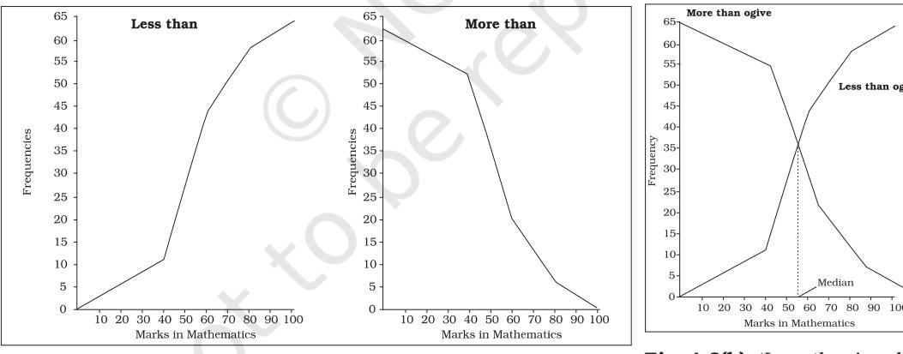

# Presentation of Data

### *Studying this chapter should enable you to:*

- *• present data using tables;*
- *• represent data using appropriate diagrams.*

# 1. INTRODUCTION

You have already learnt in previous chapters how data are collected and organised. As data are generally voluminous, they need to be put in a compact and presentable form. This chapter deals with presentation of data precisely so that the voluminous data collected could be made usable readily and are easily comprehended. There are generally three forms of presentation of data:

- Textual or Descriptive presentation
- Tabular presentation
- Diagrammatic presentation.

# 2. TEXTUAL PRESENTATION OF DATA

In textual presentation, data are described within the text. When the quantity of data is not too large this form of presentation is more suitable. Look at the following cases:

### *Case 1*

In a *bandh* call given on 08 September 2005 protesting the hike in prices of petrol and diesel, 5 petrol pumps were found open and 17 were closed whereas 2 schools were closed and remaining 9 schools were found open in a town of Bihar.

### *Case 2*

Census of India 2001 reported that Indian population had risen to 102 crore of which only 49 crore were females against 53 crore males. Seventy-four crore people resided in rural India and only 28 crore lived in towns or cities. While there were 62 crore non-worker population against 40 crore workers in the entire country. Urban population had an even higher share of non-workers (19 crore) against workers (9 crore) as compared to the rural population where there were 31 crore workers out of a 74 crore population...

In both the cases data have been presented only in the text. A serious drawback of this method of presentation is that one has to go through the complete text of presentation for comprehension. But, it is also true that this matter often enables one to emphasise certain points of the presentation.

### 3. TABULAR PRESENTATION OF DATA

In a tabular presentation, data are presented in rows (read horizontally) and columns (read vertically). For example see Table 4.1 tabulating information about literacy rates. It has three rows (for male, female and total) and three columns (for urban, rural and total). It is called a 3 × 3 Table giving 9 items of information in 9 boxes called the "cells" of the Table. Each cell gives information that relates an attribute of gender ("male", "female" or total) with a number (literacy percentages of rural people, urban people and total). The most important advantage of tabulation is that it organises data for further statistical treatment and decisionmaking. Classification used in tabulation is of four kinds:

- Qualitative
- Quantitative
- Temporal and
- Spatial

### Qualitative classification

When classification is done according to attributes, such as social status, physical status, nationality, etc., it is called qualitative classification. For example, in Table 4.1 the attributes for classification are sex and location which are qualitative in nature.

| TABLE 4.1 |  |  |  |
| --- | --- | --- | --- |
| Literacy in India by sex and location (per cent) |  |  |  |
| Location |  |  | Total |
| Sex | Rural | Urban |  |
| Male | 79 | 90 | 82 |
| Female | 59 | 80 | 65 |
| Total | 68 | 84 | 74 |

Source: *Census of India 2011*. (Literacy rates relate to population aged 7 years and above)

# Quantitative classification

In quantitative classification, the data are classified on the basis of characteristics which are quantitative in nature. In other words these characteristics can be measured quantitatively. For example, age, height, production, income, etc are quantitative characteristics. Classes are formed by assigning limits called class limits for the values of the characteristic under consideration. An example of quantitative classification is given in Table 4.2. Calculate the missing figures in the Table.

TABLE 4.2 Distribution of 542 respondents by their age in an election study in Bihar

| Age group | No. of |  |
| --- | --- | --- |
| (yrs) | respondents | Per cent |
| 20–30 | 3 | 0.55 |
| 30–40 | 61 | 11.25 |
| 40–50 | 132 | 24.35 |
| 50–60 | 153 | 28.24 |
| 60–70 | ? | ? |
| 70–80 | 51 | 9.41 |
| 80–90 | 2 | 0.37 |
| All | ? | 100.00 |

Source: *Assembly election Patna central constituency 2005, A.N. Sinha Institute of Social Studies, Patna.*

Here classifying characteristic is age in years and is quantifiable.

#### *Activities*

- Discuss how the total values are arrived at in Table 4.1
- Construct a table presenting data on preferential liking of the students of your class for Star News, Zee News, BBC World, CNN, Aaj Tak and DD News.
- Prepare a table of
- (i) heights (in cm) and
- (ii) weights (in kg) of students of your class.

### Temporal classification

In this classification time becomes the classifying variable and data are categorised according to time. Time may be in hours, days, weeks, months, years, etc. For example, see Table 4.3.

| TABLE 4.3 |
| --- |
| Yearly sales of a tea shop |
| from 1995 to 2000 |

| Years | Sale (Rs in lakhs) |
| --- | --- |
| 1995 | 79.2 |
| 1996 | 81.3 |
| 1997 | 82.4 |
| 1998 | 80.5 |
| 1999 | 100.2 |
| 2000 | 91.2 |

Data Source: *Unpublished data.*

In this table the classifying characteristic is sales in a year and takes values in the scale of time.

#### *Activity*

- Go to your school office and collect data on the number of students studied in the school in each class for the last ten years and present the data in a table.
### Spatial classification

When classification is done on the basis of place, it is called spatial classification. The place may be a village/town, block, district, state, country, etc.

Table 4.4 is an example of spatial classification.

TABLE 4.4 Export from India to rest of the world in 2013-14 as share of total export (per cent)

| Destination | Export share |
| --- | --- |
| USA | 12.5 |
| Germany | 2.4 |
| Other EU | 10.9 |
| UK | 3.1 |
| Japan | 2.2 |
| Russia | 0.7 |
| China | 4.7 |
| West Asia -Gulf Coop. Council | 15.3 |
| Other Asia | 29.4 |
| Others | 18.8 |
| All | 100.0 |

#### (Total Exports: *US $ 314.40 billion*)

#### *Activity*

- Construct a table presenting data collected from students of your class according to their native states/residential locality.
# 4. TABULATION OF DATA AND PARTS OF A TABLE

To construct a table it is important to learn first what are the parts of a good statistical table. When put together systematically these parts form a table. The most simple way of conceptualising a table is to present the data in rows and columns alongwith some explanatory notes. Tabulation can be done using one-way, two-way or threeway classification depending upon the number of characteristics involved. A good table should essentially have the following:

### (i) Table Number

Table number is assigned to a table for identification purpose. If more than one table is presented, it is the table number that distinguishes one table from another. It is given at the top or at the beginning of the title of the table. Generally, table numbers are whole numbers in ascending order if there are many tables in a book. Subscripted numbers, like 1.2, 3.1, etc., are also used for identifying the table according to its location. For example, Table 4.5 should be read as the fifth table of the fourth chapter, and so on (See Table 4.5).

### (ii) Title

The title of a table narrates about the contents of the table. It has to be clear, brief and carefully worded so that the interpretations made from the table are clear and free from ambiguity. It finds place at the head of the table succeeding the table number or just below it (See Table 4.5).

### (iii) Captions or Column Headings

At the top of each column in a table a column designation is given to explain figures of the column. This is called caption or column heading (See Table 4.5).

#### (iv) Stubs or Row Headings

Like a caption or column heading, each row of the table has to be given a heading. The designations of the rows are also called stubs or stub items, and the complete left column is known as stub column. A brief description of the row headings may also be given at the left hand top in the table. (See Table 4.5).

# (v) Body of the Table

Body of a table is the main part and it contains the actual data. Location of any one figure/data in the table is fixed and determined by the row and column of the table. For example, data in the second row and fourth column indicate that 25 crore females in rural India were non-workers in 2001 (See Table 4.5).

### (vi) Unit of Measurement

The unit of measurement of the figures in the table (actual data) should always be stated alongwith the title. If different units are there for rows or columns of the table, these units must be stated alongwith 'stubs' or 'captions'. If figures are large, they should be rounded up and the method

(Note : Table 4.5 presents the same data in tabular form already presented through *case 2* in textual presentation of data)

of rounding should be indicated (See Table 4.5).

### (vii) Source

It is a brief statement or phrase indicating the source of data presented in the table. If more than one source is there, all the sources are to be written in the source. Source is generally written at the bottom of the table. (See Table 4.5).

# (viii)Note

Note is the last part of the table. It explains the specific feature of the data content of the table which is not self explanatory and has not been explained earlier.

#### *Activities*

- How many rows and columns are essentially required to form a table?
- Can the column/row headings of a table be quantitative?
- Can you present tables 4.2 and 4.3 after rounding off figures appropriately.
- Present the first two sentences of case 2 on p.41 as a table. Some details for this would be found elsewhere in this chapter.

# 5. DIAGRAMMATIC PRESENTATION OF DATA

This is the third method of presenting data. This method provides the quickest understanding of the actual situation to be explained by data in comparison to tabular or textual presentations. Diagrammatic presentation of data translates quite effectively the highly abstract ideas contained in numbers into more concrete and easily comprehensible form.

Diagrams may be less accurate but are much more effective than tables in presenting the data.

There are various kinds of diagrams in common use. Amongst them the important ones are the following:

- (i) Geometric diagram
- (ii) Frequency diagram
- (iii) Arithmetic line graph

### Geometric Diagram

Bar diagram and pie diagram come in the category of geometric diagram. The bar diagrams are of three types — simple, multiple and component bar diagrams.

### *Bar Diagram*

### *Simple Bar Diagram*

Bar diagram comprises a group of equispaced and equiwidth rectangular bars for each class or category of data. Height or length of the bar reads the magnitude of data. The lower end of the bar touches the base line such that the height of a bar starts from the zero unit. Bars of a bar diagram can be visually compared by their relative height and accordingly data are comprehended quickly. Data for this can be of frequency or non-frequency type. In non-frequency type data a particular characteristic, say production, yield, population, etc. at various points of time or of different states are noted and corresponding bars are made of the respective heights according to the values of the characteristic to construct the diagram. The values of the characteristics (measured or counted) retain the identity of each value. Figure 4.1 is an example of a bar diagram.

#### *Activity*

- Collect the number of students in each class studying in the current year in your school. Draw a bar diagram for the same table.
Different types of data may require different modes of diagrammatical representation. Bar diagrams are suitable both for frequency type and non-frequency type variables and attributes. Discrete variables like family size, spots on a dice, grades in an examination, etc. and attributes such as gender, religion, caste, country, etc. can be represented by bar diagrams. Bar diagrams are more convenient for non-frequency data such as incomeexpenditure profile, export/imports over the years, etc.

A category that has a longer bar (literacy of Kerala) than another category (literacy of West Bengal), has more of the measured (or enumerated) characteristics than the other. Bars (also called columns) are usually used in time series data (food grain produced between 1980 and 2000, decadal variation in work participation

|  | 2001 |  |  | 2011 |
| --- | --- | --- | --- | --- |
| Major Indian States | Male | Female | Male | Female |
| Andhra Pradesh (AP) | 70.3 | 50.4 | 75.6 | 59.7 |
| Assam (AS) | 71.3 | 54.6 | 78.8 | 67.3 |
| Bihar (BR) | 59.7 | 33.1 | 73.4 | 53.3 |
| Jharkhand (JH) | 67.3 | 38.9 | 78.4 | 56.2 |
| Gujarat (GJ) | 79.7 | 57.8 | 87.2 | 70.7 |
| Haryana (HR) | 78.5 | 55.7 | 85.3 | 66.8 |
| Karnataka (KA) | 76.1 | 56.9 | 82.9 | 68.1 |
| Kerala (KE) | 94.2 | 87.7 | 96.0 | 92.0 |
| Madhya Pradesh (MP) | 76.1 | 50.3 | 80.5 | 60.0 |
| Chhattisgarh (CH) | 77.4 | 51.9 | 81.5 | 60.6 |
| Maharashtra (MR) | 86.0 | 67.0 | 89.8 | 75.5 |
| Odisha (OD) | 75.3 | 50.5 | 82.4 | 64.4 |
| Punjab (PB) | 75.2 | 63.4 | 81.5 | 71.3 |
| Rajasthan (RJ) | 75.7 | 43.9 | 80.5 | 52.7 |
| Tamil Nadu (TN) | 82.4 | 64.4 | 86.8 | 73.9 |
| Uttar Pradesh (UP) | 68.8 | 42.2 | 79.2 | 59.3 |
| Uttarakhand (UK) | 83.3 | 59.6 | 88.3 | 70.7 |
| West Bengal (WB) | 77.0 | 59.6 | 82.7 | 71.2 |
| India | 75.3 | 53.7 | 82.1 | 65.5 |

TABLE 4.6 Literacy Rates of Major States of India

Fig. 4.1: *Bar diagram showing male literacy rates of major states of India, 2011.* (Literacy rates relate to population aged 7 years and above)

rate, registered unemployed over the years, literacy rates, etc.) (Fig 4.2).

Bar diagrams can have different forms such as multiple bar diagram and component bar diagram.

#### *Activities*

- How many states (among the major states of India) had higher female literacy rate than the national average in 2011?
- Has the gap between maximum and minimum female literacy rates over the states in two consecutive census years 2001 and 2011 declined?

### *Multiple Bar Diagram*

Multiple bar diagrams (Fig.4.2) are used for comparing two or more sets of data, for example income and expenditure or import and export for different years, marks obtained in different subjects in different classes, etc.

### *Component Bar Diagram*

Component bar diagrams or charts (Fig.4.3), also called sub-diagrams, are very useful in comparing the sizes of different component parts (the elements or parts which a thing is made up of) and also for throwing light on the relationship among these integral parts. For example, sales proceeds from different products, expenditure pattern in a typical Indian family (components being food, rent, medicine, education, power, etc.), budget outlay for receipts and expenditures, components of labour force, population etc. Component bar diagrams are usually shaded or coloured suitably.

Fig. 4.2: *Multiple bar (column) diagram showing female literacy rates over two census years 2001 and 2011 by major states of India. (Data Source Table 4.6)*

Interpretation: It can be very easily derived from Figure 4.2 that female literacy rate over the years was on increase throughout the country. Similar other interpretations can be made from the figure. For example, the figure shows that the states of Bihar, Jharkhand and Uttar Pradesh experienced the sharpest rise in female literacy, etc.

| TABLE 4.7 |  |  |
| --- | --- | --- |
| Enrolment by gender at schools (per cent) of children aged 6–14 years in a district of |  |  |
| Bihar |  |  |
| Gender | Enrolled | Out of school |
| (per cent) |  | (per cent) |
| Boy | 91.5 | 8.5 |
| Girl 41.4 | 58.6 |  |
| All 22.0 | 78.0 |  |

Data Source: *Unpublished data*

A component bar diagram shows the bar and its sub-divisions into two or more components. For example, the bar might show the total population of children in the age-group of 6–14 years. The components show the proportion of those who are enrolled and those who are not. A component bar diagram might also contain different component bars for boys, girls and the total of children in the given age group range, as shown in Figure 4.3. To construct a component bar diagram, first of all, a bar is constructed on the x-axis with its height equivalent to the total value of the bar [for per cent data the bar height is of 100 units (Figure 4.3)]. Otherwise the height is equated to total value of the bar and proportional heights of the components are worked out using unitary method. Smaller components are given priority in parting the bar.

Fig. 4.3: *Enrolment at primary level in a district of Bihar (Component Bar Diagram)*

### *Pie Diagram*

A pie diagram is also a component diagram, but unlike a bar diagram, here it is a circle whose area is proportionally divided among the components (Fig.4.4) it represents. It

is also called a pie chart. The circle is divided into as many parts as there are components by drawing straight lines from the centre to the circumference.

Pie charts usually are not drawn with absolute values of a category. The values of each category are first expressed as percentage of the total value of all the categories. A circle in a pie chart, irrespective of its value of radius, is thought of having 100 equal parts of 3.6° (360°/100) each. To find out the angle, the component shall subtend at the centre of the circle, each percentage figure of every component is multiplied by 3.6°. An example of this conversion of percentages of components into angular components of the circle is shown in Table 4.8.

It may be interesting to note that data represented by a component bar diagram can also be represented equally well by a pie chart, the only requirement being that absolute values of the components have to be converted into percentages before they can be used for a pie diagram.

TABLE 4.8 Distribution of Indian population (2011) by their working status (crores)

| Status | Population | Per cent | Angular |
| --- | --- | --- | --- |
|  |  |  | Component |
| Marginal Worker | 12 | 9.9 | 36° |
| Main Worker | 36 | 29.8 | 107° |
| Non-worker | 73 | 60.3 | 217° |
| All | 102 | 100.0 | 360° |

Fig. 4.4: *Pie diagram for different categories of Indian population according to working status 2011.*

#### *Activities*

- Represent data presented through Figure 4.4 by a component bar diagram.
- Does the area of a pie have any bearing on the total value of the data to be represented by the pie diagram?

# Frequency Diagram

Data in the form of grouped frequency distributions are generally represented by frequency diagrams like histogram, frequency polygon, frequency curve and ogive.

### *Histogram*

A histogram is a two dimensional diagram. It is a set of rectangles with base as the intervals between class boundaries (along X-axis) and with areas proportional to the class frequency (Fig.4.5). If the class intervals are of equal width, which they generally are, the area of the rectangles are proportional to their respective frequencies. However, in some type of data, it is convenient, at times necessary, to use varying width of class intervals. For example, when tabulating deaths by age at death, it would be very meaningful as well as useful too to have very short age intervals (0, 1, 2, ..., yrs/ 0, 7, 28, ..., days) at the beginning when death rates are very high compared to deaths at most other higher age segments of the population. For graphical representation of such data, height for area of a rectangle is the quotient of height (here frequency) and base (here width of the class interval). When intervals are equal, that is, when all rectangles have the same base, area can conveniently be represented by the frequency of any interval for purposes of comparison. When bases vary in their width, the heights of rectangles are to be adjusted to yield comparable measurements. The answer in such a situation is frequency density (class frequency divided by width of the class interval) instead of absolute frequency.

| TABLE 4.9 |  |
| --- | --- |
| Distribution of daily wage earners in a |  |
| locality of a town |  |
| Daily | No. |
| earning | of wage |
| (Rs) | earners (f) |
| 45–49 | 2 |
| 50–54 | 3 |
| 55–59 | 5 |
| 60–64 | 3 |
| 65–69 | 6 |
| 70–74 | 7 |
| 75–79 | 12 |
| 80–84 | 13 |
| 85–89 | 9 |
| 90–94 | 7 |
| 95–99 | 6 |
| 100–104 | 4 |
| 105–109 | 2 |
| 110–114 | 3 |
| 115–119 | 3 |

#### Source: *Unpublished data*

Since histograms are rectangles, a line parallel to the base line and of the same magnitude is to be drawn at a vertical distance equal to frequency (or frequency density) of the class interval. A histogram is never drawn. Since, for countinuous variables, the lower class boundary of a class interval fuses with the upper class boundary of the previous interval, equal or unequal, the rectangles are all adjacent and there is no open space between two consecutive rectangles. If the classes are not continuous they are first converted into continuous classes as discussed in Chapter 3. Sometimes the common portion between two adjacent rectangles (Fig.4.6) is omitted giving a better impression of continuity. The resulting figure gives the impression of a double staircase.

A histogram looks similar to a bar diagram. But there are more differences than similarities between the two than it may appear at the first impression. The spacing and the width or the area of bars are all arbitrary. It is the height and not the width or the area of the bar that really matters. A single vertical line could have served the same purpose as a bar of same width. Moreover, in histogram no space is left between two rectangles, but in a bar diagram some space must be left between consecutive

bars (except in multiple bar or component bar diagram). Although the bars have the same width, the width of a bar is unimportant for the purpose of comparison. The width in a histogram is as important as its height. *We can have* a *bar diagram both for discrete and continuous variables, but histogram is drawn only for* a *continuous variable.* Histogram also gives value of *mode* of the frequency distribution graphically as shown in Figure 4.5 and the x-coordinate of the dotted vertical line gives the mode.

#### *Frequency Polygon*

A frequency polygon is a plane bounded by straight lines, usually four or more lines. Frequency polygon is an alternative to histogram and is also derived from histogram itself. A

Fig. 4.5: *Histogram for the distribution of 85 daily wage earners in a locality of a town.*

frequency polygon can be fitted to a histogram for studying the shape of the curve. The simplest method of drawing a frequency polygon is to join the midpoints of the topside of the consecutive rectangles of the histogram. It leaves us with the two ends away from the base line, denying the calculation of the area under the curve. The solution is to join the two end-points thus obtained to the base line at the mid-values of the two classes with zero frequency immediately at each end of the distribution. Broken lines or dots may join the two ends with the base line. Now the total area under the curve, like the area in the histogram, represents the total frequency or sample size.

Frequency polygon is the most common method of presenting grouped frequency distribution. Both class boundaries and class-marks can be used along the X-axis, the distances between two consecutive class marks being proportional/equal to the width of the class intervals. Plotting of data becomes easier if the class-marks fall on the heavy lines of the graph paper. No matter whether class boundaries or midpoints are used in the X-axis, frequencies (as ordinates) are always plotted against the mid-point of class intervals. When all the points have been plotted in the graph, they are carefully joined by a series of short straight lines. Broken lines join midpoints of two intervals, one in the beginning and the other at the end, with the two ends of the plotted curve (Fig.4.6). When comparing two or more distributions plotted on the same axes, frequency polygon is likely to be more useful since the vertical and horizontal lines of two

Fig. 4.6: *Frequency polygon drawn for the data given in Table 4.9*

Fig. 4.7: *Frequency curve for Table 4.9*

or more distributions may coincide in a histogram.

# *Frequency Curve*

The frequency curve is obtained by drawing a smooth freehand curve passing through the points of the frequency polygon as closely as possible. It may not necessarily pass through all the points of the frequency polygon but it passes through them as closely as possible (Fig. 4.7).

### *Ogive*

Ogive is also called cumulative frequency curve. As there are two types of cumulative frequencies, for example ''less than'' type and ''more than'' type, accordingly there are two ogives for any grouped frequency distribution data. Here in place of simple frequencies as in the case of frequency polygon, cumulative frequencies are plotted along y-axis against class limits of the frequency distribution. For ''less than'' ogive the cumulative frequencies are plotted against the respective upper limits of the class intervals whereas for more than ogives the cumulative frequencies are plotted against the respective lower limits of the class interval. An interesting feature of the two ogives together is that their intersection point gives the *median* Fig. 4.8 (b) of the frequency distribution. As the shapes of the two ogives suggest, ''less than'' ogive is never decreasing and ''more than'' ogive is never increasing.

# *Arithmetic Line Graph*

An arithmetic line graph is also called time series graph. In this graph, time

| TABLE 4.10 |
| --- |
| Frequency distribution of marks |
| obtained in mathematics |

| Table 4.10 (a) |  | Table 4.10 (b) |  | Table 4.10 (e) |  |
| --- | --- | --- | --- | --- | --- |
| Frequency distribution |  | Less than cumulative |  | More than cumulative |  |
| of marks obtained in mathematics |  | frequency distribution of marks obtained in |  | frequency distribution of markes obtained |  |
|  |  | mathematics |  | in mathematics |  |
| Marks | Number of | Marks | 'Less than' | Marks | 'More than' |
| students |  |  | cumulative |  | cumulative |
|  |  |  | frequency |  | frequency |
| 0-20 | 6 | Less than 20 | 6 | More than 0 | 64 |
| 20-40 | 5 | Less than 40 | 11 | More than 20 | 58 |
| 40-60 | 33 | Less than 60 | 44 | More than 40 | 53 |
| 60-80 | 14 | Less than 80 | 58 | More than 60 | 20 |
| 80-100 | 6 | Less than 100 | 64 | More than 80 | 6 |
| Total | 64 |  |  |  |  |

Fig. 4.8(a): *'Less than' and 'More than' ogive for data given in Table 4.10*

(hour, day/date, week, month, year, etc.) is plotted along x-axis and the value of the variable (time series data) along y-axis. A line graph by joining these plotted points,

Fig. 4.8(b): *'Less than' and 'More than' ogive for data given in Table 4.10*

thus, obtained is called arithmetic line graph (time series graph). It helps in understanding the trend, periodicity, etc., in a long term time series data.

Here you can see from Fig. 4.9 that for the period 1993-94 to 2013-14, the imports were more than the exports all through the period. You may notice the value of both exports and imports rising rapidy after 2001-02. Also the gap between the two (imports and exports) has widened after 2001-02.

### 6. CONCLUSION

By now you must have been able to learn how the data could be presented using various forms of presentation — textual, tabular and diagrammatic. You are now also able to make an appropriate choice of the form of data presentation as well as the type of diagram to be used for a given set of data. Thus you can make presentation of data meaningful, comprehensive and purposeful.

|  | (Rs in 100 crores) |  |
| --- | --- | --- |
| Year | Exports | Imports |
| 1993-94 | 698 | 731 |
| 1994–95 | 827 | 900 |
| 1995–96 | 1064 | 1227 |
| 1996–97 | 1188 | 1389 |
| 1997–98 | 1301 | 1542 |
| 1998-99 | 1398 | 1783 |
| 1999-2000 | 1591 | 2155 |
| 2000-01 | 2036 | 2309 |
| 2001-02 | 2090 | 2452 |
| 2002-03 | 2549 | 2964 |
| 2003-04 | 2934 | 3591 |
| 2004-05 | 3753 | 5011 |
| 2005-06 | 4564 | 6604 |
| 2006-07 | 5718 | 8815 |
| 2007-08 | 6559 | 10123 |
| 2008-09 | 8408 | 13744 |
| 2009-10 | 8455 | 13637 |
| 2010-11` | 11370 | 16835 |
| 2011-12 | 14660 | 23455 |
| 2012-13 | 16343 | 26692 |
| 2013-14 | 19050 | 27154 |

TABLE 4.11 Value of Exports and Imports of India

*Source: DGCI&S, Kolkata*

Fig. 4.9: *Arithmetic line graph for time series data given in Table 4.11*

#### *Recap*

- Data (even voluminous data) speak meaningfully through presentation.
- For small data (quantity) textual presentation serves the purpose better.
- For large quantity of data tabular presentation helps in accommodating any volume of data for one or more variables.
- Tabulated data can be presented through diagrams which enable quicker comprehension of the facts presented otherwise.

#### EXERCISES

Answer the following questions, 1 to 10, choosing the correct answer

- 1. Bar diagram is a
	- (i) one-dimensional diagram
	- (ii) two-dimensional diagram
	- (iii) diagram with no dimension
	- (iv) none of the above
- 2. Data represented through a histogram can help in finding graphically the
	- (i) mean
	- (ii) mode
	- (iii) median
	- (iv) all the above
- 3. Ogives can be helpful in locating graphically the
	- (i) mode
	- (ii) mean
	- (iii) median
	- (iv) none of the above
- 4. Data represented through arithmetic line graph help in understanding (i) long term trend
	- (ii) cyclicity in data
	- (iii) seasonality in data
	- (iv) all the above
- 5. Width of bars in a bar diagram need not be equal (True/False).
- 6. Width of rectangles in a histogram should essentially be equal (True/ False).
- 7. Histogram can only be formed with continuous classification of data (True/False).
- 8. Histogram and column diagram are the same method of presentation of data. (True/False)
- 9. Mode of a frequency distribution can be known graphically with the help of histogram. (True/False)
- 10. Median of a frequency distribution cannot be known from the ogives. (True/False)
- 11. What kind of diagrams are more effective in representing the following? (i) Monthly rainfall in a year
	- (ii) Composition of the population of Delhi by religion
	- (iii) Components of cost in a factory
- 12. Suppose you want to emphasise the increase in the share of urban non-workers and lower level of urbanisation in India as shown in Example 4.2. How would you do it in the tabular form?
- 13. How does the procedure of drawing a histogram differ when class intervals are unequal in comparison to equal class intervals in a frequency table?
- 14. The Indian Sugar Mills Association reported that, 'Sugar production during the first fortnight of December 2001 was about 3,87,000 tonnes, as against 3,78,000 tonnes during the same fortnight last year (2000). The off-take of sugar from factories during the first fortnight of December 2001 was 2,83,000 tonnes for internal consumption and 41,000 tonnes for exports as against 1,54,000 tonnes for internal consumption and nil for exports during the same fortnight last season.'
	- (i) Present the data in tabular form.
	- (ii) Suppose you were to present these data in diagrammatic form which of the diagrams would you use and why?
	- (iii) Present these data diagrammatically.
- 15. The following table shows the estimated sectoral real growth rates (percentage change over the previous year) in GDP at factor cost.

| Year | Agriculture and allied sectors | Industry | Services |
| --- | --- | --- | --- |
| 1994–95 | 5.0 | 9.2 | 7.0 |
| 1995–96 | –0.9 | 11.8 | 10.3 |
| 1996–97 | 9.6 | 6.0 | 7.1 |
| 1997–98 | –1.9 | 5.9 | 9.0 |
| 1998–99 | 7.2 | 4.0 | 8.3 |
| 1999–2000 | 0.8 | 6.9 | 8.2 |

*Represent the data as multiple time series graphs.*

