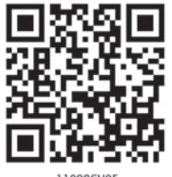
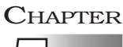
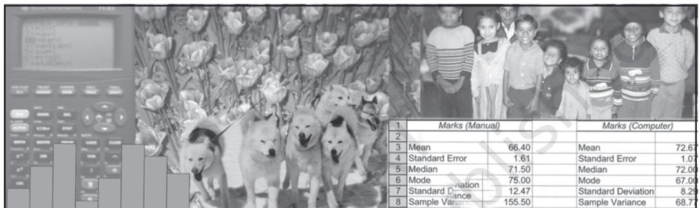
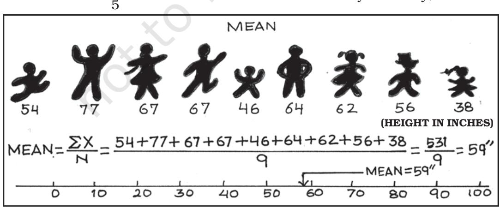
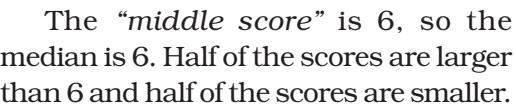
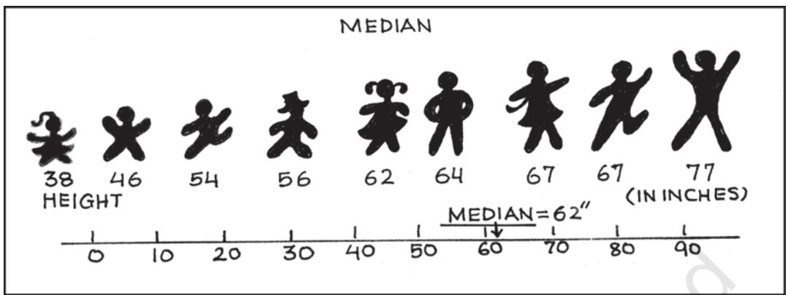
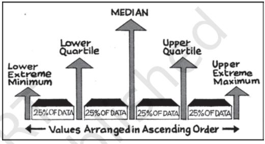
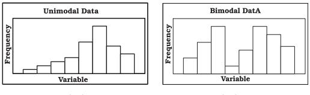
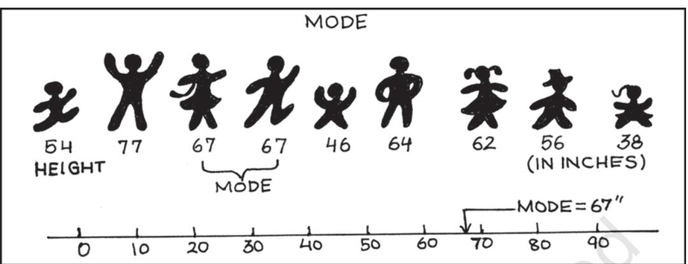

# Measures of Central Tendency

## *Studying this chapter should enable you to:*

- *• understand the need for summarising a set of data by one single number;*
- *• recognise and distinguish between the different types of averages;*
- *• learn to compute different types of averages;*
- *• draw meaningful conclusions from a set of data;*
- *• develop an understanding of which type of average would be the most useful in a particular situation.*

# 1. INTRODUCTION

In the previous chapter, you have read about the tabular and graphic

representation of the data. In this chapter, you will study the measures of central tendency which is a numerical method to explain the data in brief. You can see examples of summarising a large set of data in day-to-day life, like average marks obtained by students of a class in a test, average rainfall in an area, average production in a factory, average income of persons living in a locality or working in a firm, etc.

Baiju is a farmer. He grows food grains in his land in a village called Balapur in Buxar district of Bihar. The village consists of 50 small farmers. Baiju has 1 acre of land. You are interested in knowing the economic condition of small farmers of Balapur. You want to compare the economic condition of Baiju in Balapur village. For this, you may have to evaluate the size of his land holding, by comparing with the size of land holdings of other farmers of Balapur. You may like to see if the land owned by Baiju is –

- 1. above average in ordinary sense (see the *Arithmetic Mean)*
- 2. above the size of what half the farmers own (see the *Median*)
- 3. above what most of the farmers own (see the *Mode*)

In order to evaluate Baiju's relative economic condition, you will have to summarise the whole set of data of land holdings of the farmers of Balapur. This can be done by the use of central tendency, which summarises the data in a single value in such a way that this single value can represent the entire data. The measuring of central tendency is a way of summarising the data in the form of a typical or representative value.

There are several statistical measures of central tendency or "averages". The three most commonly used averages are:

- Arithmetic Mean
- Median
- Mode

You should note that there are two more types of averages i.e. Geometric Mean and Harmonic Mean, which are suitable in certain situations. However, the present discussion will be limited to the three types of averages mentioned above.

## 2. ARITHMETIC MEAN

Suppose the monthly income (in Rs) of six families is given as:

1600, 1500, 1400, 1525, 1625, 1630.

The mean family income is obtained by adding up the incomes and dividing by the number of families.

=

$\mathbf{a}$ ... 

= Rs 1,547 It implies that on an average, a

family earns Rs 1,547. *Arithmetic mean* is the most commonly used measure of central tendency. It is defined as the sum of the values of all observations divided by the number of observations and is usually denoted by X . In general, if there are N observations as X1 , X2 , X3 , ..., XN , then the Arithmetic Mean is given by

$${\overline{{\mathrm{X}}}}={\frac{\mathrm{X}_{1}+\mathrm{X}_{2}+\mathrm{X}_{3}+\ldots+\mathrm{X}_{\mathrm{N}}}{\mathrm{N}}}$$

The right hand side can be written

as 1 X N *N* ∑*i* = *i* . Here, i is an index

which takes successive values 1, 2, 3,...N.

For convenience, this will be written in simpler form without the index i. Thus

$${\overline{{\mathrm{X}}}}\,\mathrm{=}{\frac{\Sigma X}{\mathrm{N}}}\,,{\mathrm{~where,~}}\Sigma X{\mathrm{~=~sum~of~all~}}$$
  
observations and N = total number of observations.  

## How Arithmetic Mean is Calculated

The calculation of arithmetic mean can be studied under two broad categories:

- 1. *Arithmetic Mean for Ungrouped Data.*
- 2. *Arithmetic Mean for Grouped Data.*

## *Arithmetic Mean for Series of Ungrouped Data*

## *Direct Method*

Arithmetic mean by *direct method* is the sum of all observations in a series divided by the total number of observations.

#### *Example 1*

Calculate Arithmetic Mean from the data showing marks of students in a class in an economics test: 40, 50, 55, 78, 58.

$\begin{array}{c}\mbox{\rm X}=\mbox{\rm X}\\ \mbox{\rm N}\end{array}$  
  
$\begin{array}{c}\mbox{\rm40}+\mbox{\rm50}+\mbox{\rm55}+\mbox{\rm78}+\mbox{\rm58}\\ \mbox{\rm5}\end{array}$

The average mark of students in the economics test is 56.2.

#### *Assumed Mean Method*

If the number of observations in the data is more and/or figures are large, it is difficult to compute arithmetic mean by direct method. The computation can be made easier by using assumed mean method.

In order to save time in calculating mean from a data set containing a large number of observations as well as large numerical figures, you can use assumed mean method. Here you assume a particular figure in the data as the arithmetic mean on the basis of logic/experience. Then you may take deviations of the said assumed mean from each of the observation. You can, then, take the summation of these deviations and divide it by the number of observations in the data. The actual arithmetic mean is estimated by taking the sum of the assumed mean and the ratio of sum of deviations to number of observations. Symbolically,

Let, A = assumed mean

- X = individual observations
- N = total numbers of observations
- d = deviation of assumed mean from individual observation, i.e. d = X – A

Then sum of all deviations is taken as Σd=Σ (X-A)

Then find $\dfrac{\Sigma\mathrm{d}}{\mathrm{N}}$  
  
Then add $\mathrm{A}$ and $\mathrm{\dfrac{\Sigma\mathrm{d}}{\mathrm{N}}}$ to get $\mathrm{\overline{X}}$ :  
  
Therefore, $\mathrm{\overline{X}\ =A+\dfrac{\Sigma\mathrm{d}}{\mathrm{N}}}$

You should remember that any value, whether existing in the data or not, can be taken as assumed mean. However, in order to simplify the calculation, centrally located value in the data can be selected as assumed mean.

*Example 2*

The following data shows the weekly income of 10 families.

*Family* A B C D E F G H I J

*Weekly Income (in Rs)* 850 700 100 750 5000 80 420 2500 400 360

Compute mean family income.

| TABLE 5.1 |
| --- |
| Computation of Arithmetic Mean by |
| Assumed Mean Method |

| Families | Income | d = X – 850 | d' |
| --- | --- | --- | --- |
|  | (X) |  | = (X – 850)/10 |
| A | 850 | 0 | 0 |
| B | 700 | –150 | –15 |
| C | 100 | –750 | –75 |

| D | 750 | –100 | –10 |
| --- | --- | --- | --- |
| E | 5000 | +4150 | +415 |
| F | 80 | –770 | –77 |
| G | 420 | –430 | –43 |
| H | 2500 | +1650 | +165 |
| I | 400 | –450 | –45 |
| J | 360 | –490 | –49 |
|  | 11160 | +2660 | +266 |

*Arithmetic Mean* using *assumed mean method*

$\overline{\bf X}={\bf A}+\frac{\Sigma{\bf d}}{\bf N}=850+(2,660)/10$  
  
$={\bf Rs}\,1,1\,16$.  
  

Thus, the average weekly income of a family by both methods is Rs 1,116. You can check this by using the direct method.

#### *Step Deviation Method*

The calculations can be further simplified by dividing all the deviations taken from assumed mean by the common factor 'c'. The objective is to avoid large numerical figures, i.e., if d = X – A is very large, then find d*'.* This can be done as follows:

$$\mathrm{d}\,^{\prime}={\frac{\mathrm{d}}{\mathrm{c}}}\!=\!{\frac{\mathrm{X}-\mathrm{A}}{\mathrm{c}}}\,.$$

The formula is given below:

$${\overline{{\mathbf{X}}}}=\mathbf{A}+{\frac{\Sigma\,\mathbf{d}^{\prime}}{\mathbf{N}}}\times\mathbf{c}$$

where d*'* = (X – A)/c, c = common factor, N = number of observations, A= Assumed mean.

Thus, you can calculate the arithmetic mean in the example 2, by the step deviation method,

X = 850 + (266/10) × 10 = Rs 1,116.

# Calculation of arithmetic mean for Grouped data

# *Discrete Series*

# *Direct Method*

In case of *discrete series*, frequency against each observation is multiplied by the value of the observation. The values, so obtained, are summed up and divided by the total number of frequencies. Symbolically,

$${\overline{{\mathrm{X}}}}={\frac{\Sigma\mathrm{fX}}{\Sigma\mathrm{f}}}$$

Where, Σ fX = sum of the product of variables and frequencies. Σ f = sum of frequencies.

# *Example 3*

Plots in a housing colony come in only three sizes: 100 sq. metre, 200 sq. meters and 300 sq. metre and the number of plots are respectively 200 50 and 10.

| TABLE 5.2 |
| --- |
| Computation of Arithmetic Mean by |
| Direct Method |

| Plot size in | No. of |  | d' = X–200 |  |
| --- | --- | --- | --- | --- |
| Sq. metre X | Plots (f) | f X | 100 | fd' |
| 100 | 200 | 20000 | –1 | –200 |
| 200 | 50 | 10000 | 0 | 0 |
| 300 | 10 | 3000 | +1 | 10 |
|  | 260 | 33000 | 0 | –190 |

Arithmetic mean using *direct method,*

$\begin{array}{c}\includegraphics[height=36.135pt]{28.eps}\end{array}$

Therefore, the mean plot size in the housing colony is 126.92 Sq. metre.

# *Assumed Mean Method*

As in case of individual series the calculations can be simplified by using assumed mean method, as described earlier, with a simple modification. Since frequency (f) of each item is given here, we multiply each deviation (d) by the frequency to get fd. Then we get Σ fd. The next step is to get the total of all frequencies i.e. Σ f. Then find out Σ fd/Σ f. Finally, the arithmetic mean

is calculated by X A fd f = + Σ Σ using assumed mean method.

# *Step Deviation Method*

In this case, the deviations are divided by the common factor 'c' which simplifies the calculation. Here we

estimate d*'* = d c X A c = − in order to reduce the size of numerical figures for easier calculation. Then get fd*'* and Σ fd*'*. The formula for arithmetic mean using step deviation method is given as,

$${\overline{{\mathbf{X}}}}\ =\mathbf{A}+{\frac{\Sigma\mathbf{f}\mathbf{d}^{\prime}}{\Sigma\mathbf{f}}}\times\mathbf{c}$$

## *Activity*

- Find the mean plot size for the data given in example 3, by using *step deviation* and *assumed mean* methods.
## *Continuous Series*

Here, class intervals are given. The process of calculating arithmetic mean in case of continuous series is same as that of a discrete series. The only difference is that the mid-points of various class intervals are taken. We have already known that class intervals may be exclusive or inclusive or of unequal size. Example of exclusive class interval is, say, 0–10, 10–20 and so on. Example of inclusive class interval is, say, 0–9, 10–19 and so on. Example of unequal class interval is, say, 0–20, 20–50 and so on. In all these cases, calculation of arithmetic mean is done in a similar way.

#### *Example 4*

Calculate average marks of the following students using (a) Direct method (b) Step deviation method.

#### *Direct Method*

| Marks |  |  |  |  |
| --- | --- | --- | --- | --- |
| 0–10 | 10–20 | 20–30 | 30–40 | 40–50 |
| 50–60 | 60–70 |  |  |  |
| No. of Students |  |  |  |  |
| 5 | 12 | 15 | 25 | 8 |
| 3 | 2 |  |  |  |

TABLE 5.3 Computation of Average Marks for Exclusive Class Interval by Direct Method

| Mark | No. of | Mid | fm | d'=(m-35) | fd' |
| --- | --- | --- | --- | --- | --- |
| (x) | students | value | (2)×(3) | 10 |  |
|  | (f) | (m) |  |  |  |
| (1) | (2) | (3) | (4) | (5) | (6) |
| 0–10 | 5 | 5 | 25 | –3 | –15 |
| 10–20 | 12 | 15 | 180 | –2 | –24 |
| 20–30 | 15 | 25 | 375 | –1 | –15 |
| 30–40 | 25 | 35 | 875 | 0 | 0 |

| 40–50 | 8 | 45 | 360 | 1 | 8 |
| --- | --- | --- | --- | --- | --- |
| 50–60 | 3 | 55 | 165 | 2 | 6 |
| 60–70 | 2 | 65 | 130 | 3 | 6 |
|  | 70 |  | 2110 |  | –34 |

#### *Steps:*

- 1. Obtain mid values for each class denoted by m.
- 2. Obtain Σ fm and apply the direct method formula:

$${\bar{\mathbf{X}}}={\frac{\Sigma{\mathrm{fm}}}{\Sigma{\mathrm{f}}}}={\frac{2110}{70}}=30.14{\mathrm{marks}}$$

S*tep deviation method*

* [1] Obtain d' =

- 2. Take A = 35, (any arbitrary figure), c = common factor.

$${\begin{array}{l}{{\bar{X}=\mathrm{A}+{\frac{\Sigma\mathrm{fd}^{\prime}}{\Sigma\mathrm{f}}}\times\mathrm{c}=35+{\frac{(-\ 34)}{70}}\times10}\\ {=30.14{\mathrm{~marks}}}\end{array}}$$

#### Two interesting properties of A.M.

(i) the sum of deviations of items about arithmetic mean is always equal

to zero. Symbolically, Σ ( X – X ) = 0.

(ii) arithmetic mean is affected by extreme values. Any large value, on either end, can push it up or down.

## Weighted Arithmetic Mean

Sometimes it is important to assign weights to various items according to their importance when you calculate the arithmetic mean. For example, there are two commodities, mangoes and potatoes. You are interested in finding the average price of mangoes (P1 ) and potatoes (P2 ). The arithmetic mean will be . However, you might want to give more importance to the rise in price of potatoes (P2 ). To do this, you may use as 'weights' the share of mangoes in the budget of the consumer (W1 ) and the share of potatoes in the budget (W2 ). Now the arithmetic mean weighted by the shares in the budget would

$$\mathrm{be}\frac{\mathrm{W_{1}\;P_{1}\;+\;W_{2}\;P_{2}}}{\mathrm{~W_{1}+W_{2}~}}\,.$$

In general the weighted arithmetic mean is given by,

$${\frac{\mathrm{w}_{1}\mathrm{x}_{1}+\mathrm{w}_{2}\mathrm{x}_{2}+\ldots+\mathrm{w}_{n}\mathrm{x}_{n}}{\mathrm{w}_{1}+\mathrm{w}_{2}+\ldots+\mathrm{w}_{n}}}={\frac{\Sigma\,\mathrm{W}\mathrm{X}}{\Sigma\,\mathrm{W}}}$$

When the prices rise, you may be interested in the rise in prices of commodities that are more important to you. You will read more about it in the discussion of Index Numbers in Chapter 8.

## *Activities*

- Check property of arithmetic mean for the following example: *X:* 4 6 8 10 12
- In the above example if mean is increased by 2, then what happens to the individual observations.
- If first three items increase by 2, then what should be the values of the last two items, so

that mean remains the same.

- Replace the value 12 by 96. What happens to the arithmetic mean? Comment.
# 3. MEDIAN

Median is that positional value of the variable which divides the distribution into two equal parts, one part comprises all values greater than or equal to the median value and the other comprises all values less than or equal to it. *The Median is the "middle" element when the data set is arranged in order of the magnitude. Since the median is determined by the position of different values, it remains unaffected if, say, the size of the largest value increases.*

## *Computation of median*

The median can be easily computed by sorting the data from smallest to largest and finding out the middle value.

## *Example 5*

Suppose we have the following observation in a data set: 5, 7, 6, 1, 8, 10, 12, 4, and 3.

Arranging the data, in ascending order you have:

- 1, 3, 4, 5, 6, 7, 8, 10, 12.

If there are even numbers in the data, there will be two observations which fall in the middle. The median in this case is computed as the arithmetic mean of the two middle values.

#### *Activities*

- Find mean and median for all four values of the series. What do you observe?

| TABLE 5.4 |
| --- |
| Mean and Median of different series |

| Series | X (Variable | Mean | Median |
| --- | --- | --- | --- |
|  | Values) |  |  |
| A | 1, 2, 3 | ? | ? |
| B | 1, 2, 30 | ? | ? |
| C | 1, 2, 300 | ? | ? |
| D | 1, 2, 3000 | ? | ? |

- Is median affected by extreme values? What are outliers?
• Is median a better method than mean?

#### *Example 6*

The following data provides marks of 20 students. You are required to calculate the median marks.

25, 72, 28, 65, 29, 60, 30, 54, 32, 53, 33, 52, 35, 51, 42, 48, 45, 47, 46, 33.

*Arranging the data in an ascending order, you get*

25, 28, 29, 30, 32, 33, 33, 35, 42, 45, 46, 47, 48, 51, 52, 53, 54, 60, 65, 72.

You can see that there are two observations in the middle, 45 and 46. The median can be obtained by taking the mean of the two observations:

$${\mathrm{Median}}={\frac{45+46}{2}}=45.5{\mathrm{~marks}}$$

In order to calculate median it is important to know the position of the median i.e. item/items at which the median lies. The position of the median can be calculated by the following formula:

Position of median = $\dfrac{\text{(N+1)}^{\text{th}}}{2}$ . 

Where N = number of items.

You may note that the above formula gives you the position of the median in an ordered array, not the median itself. Median is computed by the formula:

$$M e d i a n={\mathrm{size~of~}}\ {\frac{\left(\mathrm{N}+1\right)^{\mathrm{th}}}{2}}\ {\mathrm{items}}$$

#### *Discrete Series*

In case of discrete series the position of median i.e. (N+1)/2th item can be located through cumulative frequency. The corresponding value at this position is the value of median.

#### *Example 7*

2024-25

The frequency distributsion of the number of persons and their respective incomes (in Rs) are given below. Calculate the median income.

| Income (in Rs): | 10 | 20 | 30 | 40 |
| --- | --- | --- | --- | --- |
| Number of persons: | 2 | 4 | 10 | 4 |

In order to calculate the median income, you may prepare the frequency distribution as given below.

|  | TABLE 5.5 |  |
| --- | --- | --- |
| Computation of Median for Discrete Series |  |  |
| Income | No. of | Cumulative |
| (in Rs) | persons(f) | frequency(cf) |
| 10 | 2 | 2 |
| 20 | 4 | 6 |
| 30 | 10 | 16 |
| 40 | 4 | 20 |

The median is located in the (N+1)/ 2 = (20+1)/2 = 10.5th observation. This can be easily located through cumulative frequency. The 10.5th observation lies in the c.f. of 16. The income corresponding to this is Rs 30, so the median income is Rs 30.

## *Continuous Series*

In case of continuous series you have to locate the median class where N/2th item [not (N+1)/2th item] lies. The median can then be obtained as follows:

$$\mathrm{Median}=\mathrm{L}+{\frac{\mathrm{(N/2-c.f.)}}{\mathrm{f}}}\times\mathrm{h}$$

Where, L = lower limit of the median class,

c.f. = cumulative frequency of the class

preceding the median class,

f = frequency of the median class, h = magnitude of the median class interval.

No adjustment is required if frequency is of unequal size or magnitude.

## *Example 8*

Following data relates to daily wages of persons working in a factory. Compute the median daily wage.

*Daily wages (in Rs):* 55–60 50–55 45–50 40–45 35–40 30–35 25–30 20–25 *Number of workers:* 7 13 15 20 30 33 28 14

The data is arranged in descending order here.

In the above illustration median class is the value of (N/2)th item (i.e.160/2) = 80th item of the series, which lies in 35–40 class interval. Applying the formula of the median as:

|  | TABLE 5.6 |  |
| --- | --- | --- |
|  | Computation of Median for Continuous Series |  |
| Daily wages | No. of | Cumulative |
| (in Rs) | Workers (f) | Frequency |
| 20–25 | 14 | 14 |
| 25–30 | 28 | 42 |
| 30–35 | 33 | 75 |
| 35–40 | 30 | 105 |
| 40–45 | 20 | 125 |
| 45–50 | 15 | 140 |
| 50–55 | 13 | 153 |
| 55–60 | 7 | 160 |

  
Median =L + $\dfrac{\mathrm{(N/2—c.1.)}}{\mathrm{f}}\times\mathrm{h}$  
  
= $\dfrac{35+(80-75)}{30}\times(40-35)$  
  
=Rs 35.83

Thus, the median daily wage is Rs 35.83. This means that 50% of the workers are getting less than or equal to Rs 35.83 and 50% of the workers are getting more than or equal to this wage.

You should remember that median, as a measure of central tendency, is not sensitive to all the values in the series. It concentrates on the values of the central items of the data.

## Quartiles

Quartiles are the measures which divide the data into four equal parts, each portion contains equal number of observations. There are three quartiles. The first Quartile (denoted by Q1 ) or lower quartile has 25% of the items of the distribution below it and 75% of the items are greater than it. The second Quartile (denoted by Q2 ) or median has 50% of items below it and 50% of the observations above it. The third Quartile (denoted by Q3 ) or upper Quartile has 75% of the items of the distribution below it and 25% of the items above it. Thus, Q1 and Q3 denote the two limits within which central 50% of the data lies.

## Percentiles

Percentiles divide the distribution into hundred equal parts, so you can get 99 dividing positions denoted by P1 , P2 , P3 , ..., P99. P50 is the median value. If you have secured 82 percentile in a management entrance examination, it means that your position is below 18 per cent of total candidates appeared in the examination. If a total of one lakh students appeared, where do you stand?

## *Calculation of Quartiles*

The method for locating the Quartile is same as that of the median in case of individual and discrete series. The value of Q1 and Q3 of an ordered series can be obtained by the following formula where N is the number of observations.

$$Q_{1}=\mathrm{size~of~\frac{(N+1)^{\mathrm{th}}}{4}~i e t m}$$
  

$$Q_{3}=\mathrm{size~of~\frac{3(N+1)^{\mathrm{th}}}{4}~i e t m.}$$

## *Example 9*

Calculate the value of *lower quartile* from the data of the marks obtained by ten students in an examination.

*22, 26, 14, 30, 18, 11, 35, 41, 12, 32.* Arranging the data in an ascending order,

11, 12, 14, 18, 22, 26, 30, 32, 35, 41. *Q1* = size of (N +1) 4 th item = size of

(10+1) 4 th item = size of 2.75th item

= 2nd item + .75 (3rd item – 2nd item) = 12 + .75(14 –12) = 13.5 marks.

#### *Activity*

• Find out Q3 yourself.

## 5. MODE

Sometimes, you may be interested in knowing the most typical value of a series or the value around which maximum concentration of items occurs. For example, a manufacturer would like to know the size of shoes that has maximum demand or style of the shirt that is more frequently demanded. Here, *Mode* is the most appropriate measure. The word *mode*

has been derived from the French word "la Mode" which signifies the most fashionable values of a distribution, because it is repeated the highest number of times in the series. *Mode is the most frequently observed data value.* It is denoted by Mo.

## Computation of Mode

## *Discrete Series*

Consider the data set 1, 2, 3, 4, 4, 5. The mode for this data is 4 because 4 occurs most frequently (twice) in the data.

#### *Example 10*

Look at the following discrete series:

| Variable | 10 | 20 | 30 | 40 | 50 |
| --- | --- | --- | --- | --- | --- |
| Frequency | 2 | 8 | 20 | 10 | 5 |

Here, as you can see the maximum frequency is 20, the value of mode is 30. In this case, as there is a unique value of mode, the data is *unimodal*. But, the mode is not necessarily unique, unlike arithmetic mean and median. You can have data with two modes (bi-modal) or more than two modes (multi-modal). It may be possible that there may be no mode if no value appears more frequent than any other value in the distribution. For example, in a series 1, 1, 2, 2, 3, 3, 4, 4, there is no mode.

 *Unimodal Data Bimodal Data*

#### *Continuous Series*

In case of continuous frequency distribution, modal class is the class with largest frequency. Mode can be calculated by using the formula:

$$\mathrm{M}_{\mathrm{o}}=\mathrm{L}+{\frac{\mathrm{D}_{1}}{\mathrm{D}_{1}+\mathrm{D}_{2}}}\times\mathrm{h}$$

Where L = lower limit of the modal class D1 = difference between the frequency of the modal class and the frequency of the class preceding the modal class (ignoring signs).

D2 = difference between the frequency of the modal class and the frequency of the class succeeding the modal class (ignoring signs).

h = class interval of the distribution.

You may note that in case of continuous series, class intervals should be equal and series should be exclusive to calculate the mode. If mid points are given, class intervals are to be obtained.

#### *Example 11*

Calculate the value of modal worker family's monthly income from the following data:

#### Less than cumulative frequency distribution of income per month (in '000 Rs)

| Income per month | Cumulative |
| --- | --- |
| (in '000 Rs) | Frequency |
| Less than 50 | 97 |
| Less than 45 | 95 |
| Less than 40 | 90 |
| Less than 35 | 80 |
| Less than 30 | 60 |

| Less than 25 | 30 |
| --- | --- |
| Less than 20 | 12 |
| Less than 15 | 4 |

As you can see this is a case of cumulative frequency distribution. In order to calculate mode, you will have to convert it into an exclusive series. In this example, the series is in the descending order. This table should be converted into an ordinary frequency table (Table 5.7) to determine the modal class.

| Income Group (in '000 Rs) | Frequency |  |  |  |
| --- | --- | --- | --- | --- |
| 45–50 | 97 – 95 |  | = 2 |  |
| 40–45 | 95 – 90 |  | = 5 |  |
| 35–40 | 90 – 80 |  | = 10 |  |
| 30–35 | 80 – 60 |  | = 20 |  |
| 25–30 | 60 – 30 |  | = 30 |  |
| 20–25 | 30 – 12 |  | = 18 |  |
| 15–20 | 12 – | 4 | = | 8 |
| 10–15 |  |  |  | 4 |

The value of the mode lies in 25–30 class interval. By inspection also, it can be seen that this is a modal class.

Now L = 25, D1 = (30 – 18) = 12, D2 = (30 – 20) = 10, h = 5

Using the formula, you can obtain the value of the mode as:

MO (in '000 Rs)

$$\begin{array}{l}{{\mathrm{M}_{\mathrm{o}}=\mathrm{L}+\mathrm{\frac{D}{D_{1}+D_{2}}}\mathrm{x\,h}}}\\ {{\mathrm{.}}}\\ {{\mathrm{=25+\frac{12}{12+10}}\mathrm{x\,5=27.273}}}\end{array}$$

Thus the *modal* worker family's monthly income is Rs 27.273.

#### *Activities*

- A shoe company, making shoes for adults only, wants to know the most popular size of shoes. Which average will be most appropriate for it?
- Which average will be most appropriate for the companies producing the following goods? Why?
	- (i) Diaries and notebooks (ii) School bags (iii) Jeans and T-Shirts
- Take a small survey in your class to know the students' preference for Chinese food using appropriate measure of central tendency.
- Can mode be located graphically?

# 6. RELATIVE POSITION OF ARITHMETIC MEAN, MEDIAN AND MODE

Suppose we express, Arithmetic Mean = Me Median = Mi Mode = Mo The relative magnitude of the three are Me >Mi >Mo or Me <Mi <Mo (suffixes occurring in alphabetical order). *The median is always between the arithmetic mean and the mode.*

## 7. CONCLUSION

Measures of central tendency or averages are used to summarise the data. It specifies a single most representative value to describe the data set. Arithmetic mean is the most commonly used average. It is simple to calculate and is based on all the observations. But it is unduly affected by the presence of extreme items. Median is a better summary for such data. Mode is generally used to describe the qualitative data. Median and mode can be easily computed graphically. In case of open-ended distribution they can also be easily computed. Thus, it is important to select an appropriate average depending upon the purpose of analysis and the nature of the distribution.

#### *Recap*

- The measure of central tendency summarises the data with a single value, which can represent the entire data.
- Arithmetic mean is defined as the sum of the values of all observations divided by the number of observations.
- The sum of deviations of items from the arithmetic mean is always equal to zero.
- Sometimes, it is important to assign weights to various items according to their importance.
- Median is the central value of the distribution in the sense that the number of values less than the median is equal to the number greater than the median.
- Quartiles divide the total set of values into four equal parts.
- Mode is the value which occurs most frequently.

#### EXERCISES

- 1. Which average would be suitable in the following cases?
	- (i) Average size of readymade garments.
	- (ii) Average intelligence of students in a class.
	- (iii) Average production in a factory per shift.
	- (iv) Average wage in an industrial concern.
	- (v) When the sum of absolute deviations from average is least.
	- (vi) When quantities of the variable are in ratios.
	- (vii)In case of open-ended frequency distribution.
- 2. Indicate the most appropriate alternative from the multiple choices provided against each question.
- (i) The most suitable average for qualitative measurement is
	- (a) arithmetic mean
	- (b) median
	- (c) mode
	- (d) geometric mean
	- (e) none of the above
- (ii) Which average is affected most by the presence of extreme items?
	- (a) median
	- (b) mode
	- (c) arithmetic mean
	- (d) none of the above
- (iii) The algebraic sum of deviation of a set of n values from A.M. is
	- (a) n
	- (b) 0
	- (c) 1

(d) none of the above [Ans. (i) b (ii) c (iii) b]

- 3. Comment whether the following statements are true or false.
	- (i) The sum of deviation of items from median is zero.
	- (ii) An average alone is not enough to compare series.
	- (iii) Arithmetic mean is a positional value.
	- (iv) Upper quartile is the lowest value of top 25% of items.
	- (v) Median is unduly affected by extreme observations.
	- [Ans. (i) False (ii) True (iii) False (iv) True (v) False]
- 4. If the arithmetic mean of the data given below is 28, find (a) the missing frequency, and (b) the median of the series: *Profit per retail shop (in Rs)* 0-10 10-20 20-30 30-40 40-50 50-60 *Number of retail shops* 12 18 27 - 17 6

(Ans. The value of missing frequency is 20 and value of the median is Rs 27.41)

- 5. The following table gives the daily income of ten workers in a factory. Find the arithmetic mean.
*Workers* A B C D E F G H I J *Daily Income (in Rs)* 120 150 180 200 250 300 220 350 370 260 (Ans. Rs 240)

- 6. Following information pertains to the daily income of 150 families. Calculate the arithmetic mean.

| Income (in Rs) | Number of families |
| --- | --- |
| More than 75 | 150 |
| ,, 85 | 140 |
| ,, 95 | 115 |
| ,, 105 | 95 |
| ,, 115 | 70 |
| ,, 125 | 60 |
| ,, 135 | 40 |
| ,, 145 | 25 |
| (Ans. Rs 116.3) |  |

- 7. The size of land holdings of 380 families in a village is given below. Find the median size of land holdings.
*Size of Land Holdings (in acres)*

Less than 100 100–200 200 – 300 300–400 400 and above. *Number of families*

40 89 148 64 39 (Ans. 241.22 acres)

- 8. The following series relates to the daily income of workers employed in a firm. Compute (a) highest income of lowest 50% workers (b) minimum income earned by the top 25% workers and (c) maximum income earned by lowest 25% workers.
*Daily Income (in Rs)* 10–14 15–19 20–24 25–29 30–34 35–39 *Number of workers* 5 10 15 20 10 5 (Hint: compute median, lower quartile and upper quartile.) [Ans. (a) Rs 25.11 (b) Rs 19.92 (c) Rs 29.19]

- 9. The following table gives production yield in kg. per hectare of wheat of 150 farms in a village. Calculate the mean, median and mode values.
*Production yield (kg. per hectare)* 50–53 53–56 56–59 59–62 62–65 65–68 68–71 71–74 74–77 *Number of farms* 3 8 14 30 36 28 16 10 5

(Ans. mean = 63.82 kg. per hectare, median = 63.67 kg. per hectare, mode = 63.29 kg. per hectare)

