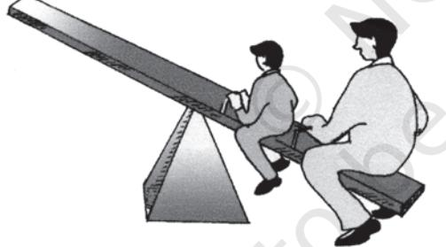

# Correlation

# *Studying this chapter should enable you to:*

- *• understand the meaning of the term correlation;*
- *• understand the nature of relationship between two variables;*
- *• calculate the different measures of correlation;*
- *• analyse the degree and direction of the relationships.*

# 1. INTRODUCTION

In previous chapters you have learnt how to construct summary measures out of a mass of data and changes among similar variables. Now you will learn how to examine the relationship between two variables.

As the summer heat rises, hill stations, are crowded with more and more visitors. Ice-cream sales become more brisk. Thus, the temperature is related to number of visitors and sale of ice-creams. Similarly, as the supply of tomatoes increases in your local *mandi*, its price drops. When the local harvest starts reaching the market, the price of tomatoes drops from Rs 40 per kg to Rs 4 per kg or even less. Thus supply is related to price. Correlation analysis is a means for examining such relationships systematically. It deals with questions such as:

- Is there any relationship between two variables?

- It the value of one variable changes, does the value of the other also change?

- Do both the variables move in the same direction?

- How strong is the relationship?
# 2. TYPES OF RELATIONSHIP

Let us look at various types of relationship. The relation between movements in quantity demanded and the price of a commodity is an integral part of the theory of demand, which you will study in Class XII. Low agricultural productivity is related to low rainfall. Such examples of relationship may be given a cause and effect interpretation. Others may be just coincidence. The relation between the arrival of migratory birds in a sanctuary and the birth rates in the locality cannot be given any cause and effect interpretation. The relationships are simple coincidence. The relationship between size of the shoes and money in your pocket is another such example. Even if relationships exist, they are difficult to explain it.

In another instance a third variable's impact on two variables may give rise to a relation between the two variables. Brisk sale of ice-creams may be related to higher number of deaths due to drowning. The victims are not drowned due to eating of icecreams. Rising temperature leads to brisk sale of ice-creams. Moreover, large number of people start going to swimming pools to beat the heat. This might have raised the number of deaths by drowning. Thus, temperature is behind the high correlation between the sale of ice-creams and deaths due to drowning.

# What Does Correlation Measure?

Correlation studies and measures the direction and intensity of relationship among variables. Correlation measures covariation, not causation. Correlation should never be interpreted as implying cause and effect relation. The presence of correlation between two variables X and Y simply means that when the value of one variable is found to change in one direction, the value of the other

variable is found to change either in the same direction (i.e. positive change) or in the opposite direction (i.e. negative change), but in a definite way. For simplicity we assume here that the correlation, if it exists, is linear, i.e. the relative movement of the two variables can be represented by drawing a straight line on graph paper.

# Types of Correlation

Correlation is commonly classified into negative and positive correlation. The correlation is said to be positive when the variables move together in the same direction. When the income rises, consumption also rises. When income falls, consumption also falls. Sale of icecream and temperature move in the same direction. The correlation is negative when they move in opposite directions. When the price of apples falls its demand increases. When the prices rise its demand decreases. When you spend more time in studying, chances of your failing decline. When you spend less hours in your studies, chances of scoring low marks/grades increase. These are instances of negative correlation. The variables move in opposite direction.

# 3. TECHNIQUES FOR MEASURING CORRELATION

Three important tools used to study correlation are scatter diagrams, Karl Pearson's coefficient of correlation and Spearman's rank correlation.

A scatter diagram visually presents the nature of association without giving any specific numerical value. A numerical measure of linear relationship between two variables is given by Karl Pearson's coefficient of correlation. A relationship is said to be linear if it can be represented by a straight line. Spearman's coefficient of correlation measures the linear association between ranks assigned to indiviual items according to their attributes. Attributes are those variables which cannot be numerically measured such as intelligence of people, physical appearance, honesty, etc.

### Scatter Diagram

A scatter diagram is a useful technique for visually examining the form of relationship, without calculating any numerical value. In this technique, the values of the two variables are plotted as points on a graph paper. From a scatter diagram, one can get a fairly good idea of the nature of relationship. In a scatter diagram the degree of closeness of the scatter points and their overall direction enable us to examine the relationship. If all the points lie on a line, the correlation is perfect and is said to be in unity. If the scatter points are widely dispersed around the line, the correlation is low. The correlation is said to be linear if the scatter points lie near a line or on a line.

Scatter diagrams spanning over Fig. 6.1 to Fig. 6.5 give us an idea of the relationship between two variables. Fig. 6.1 shows a scatter around an upward rising line indicating the movement of the variables in the same direction. When X rises Y will also rise. This is positive correlation. In Fig. 6.2 the points are found to be scattered around a downward sloping line. This time the variables move in opposite directions. When X rises Y falls and vice versa. This is negative correlation. In Fig.6.3 there is no upward rising or downward sloping line around which the points are scattered. This is an example of no correlation. In Fig. 6.4 and Fig. 6.5, the points are no longer scattered around an upward rising or downward falling line. The points themselves are on the lines. This is referred to as perfect positive correlation and perfect negative correlation respectively.

#### *Activity*

- Collect data on height, weight and marks scored by students in your class in any two subjects in class X. Draw the scatter diagram of these variables taking two at a time. What type of relationship do you find?
A careful observation of the scatter diagram gives an idea of the nature and intensity of the relationship.

# Karl Pearson's Coefficient of Correlation

This is also known as product moment correlation coefficient or simple correlation coefficient. It gives a precise numerical value of the degree of linear relationship between two variables X and Y.

It is important to note that Karl Pearson's coefficient of correlation should be used only when there is a linear relation between the variables. When there is a non-linear relation between X and Y, then calculating the Karl Pearson's coefficient of correlation can be misleading. Thus, if the true relation is of the linear type as shown by the scatter diagrams in figures 6.1, 6.2, 6.4 and 6.5, then the Karl Pearson's coefficient of correlation should be calculated and it will tell us the direction and intensity of the relation between the variables. But if the true relation is of the type shown in the scatter diagrams in Figures 6.6 or 6.7, then it means there is a non-linear relation between X and Y and we should not try to use the Karl Pearson's coefficient of correlation.

It is, therefore, advisable to first examine the scatter diagram of the relation between the variables before calculating the Karl Pearson's correlation coefficient.

Let X1 , X2 , ..., XN be N values of X and Y1 , Y2 ,..., YN be the corresponding values of Y. In the subsequent presentations, the subscripts indicating the unit are dropped for the sake of simplicity. The arithmetic means of X and Y are defined as

$${\overline{{\mathbf{X}}}}={\frac{\sum\mathbf{X}}{\mathbf{N}}};\ {\overline{{\mathbf{Y}}}}={\frac{\sum\mathbf{Y}}{\mathbf{N}}}$$

Fig. 6.7: *Negative non-linear relation*

and their variances are as follows

2 2 2 2 (X X ) X x X N N Â s = = and 2 2 2 2 (Y Y) Y y Y N N Â s = = -

The standard deviations of X and Y, respectively, are the positive square roots of their variances. Covariance of X and Y is defined as

$$\mathrm{Cov}(\mathrm{X},\mathrm{Y})={\frac{\sum{(\mathrm{X}-{\overline{{\mathrm{X}}}})(\mathrm{Y}-{\overline{{\mathrm{Y}}}})}}{\mathrm{N}}}={\frac{\sum{\mathrm{xy}}}{\mathrm{N}}}$$

Where x X X = - and y Y Y = - are the deviations of the *i* th value of X and Y from their mean values respectively.

The sign of covariance between X and Y determines the sign of the correlation coefficient. The standard deviations are always positive. If the covariance is zero, the correlation coefficient is always zero. The product moment correlation or the Karl Pearson's measure of correlation is given by

$$\mathbf{r}={\boldsymbol{\Sigma}}^{\mathbf{x y}}/\operatorname{N}\!\sigma_{\mathbf{x}}\sigma_{\mathbf{y}}$$

or

$$\Gamma=\frac{\Sigma(X-\overline{X})(Y-\overline{Y})}{\sqrt{\Sigma(X-\overline{X})^{2}}\sqrt{\Sigma(Y-\overline{Y})^{2}}}\qquad\qquad...\tag{2}$$

$$\mathbf{0}\mathbf{I}$$

$$\mathbf{r}={\frac{\sum{\mathbf{XY}}-(\sum{\mathbf{X}})(\sum{\mathbf{Y}})}{\mathbf{N}}}$$
 
$${\sqrt{\sum{\mathbf{X}}^{2}-{\frac{\left(\sum{\mathbf{X}}\right)^{2}}{\mathbf{N}}}{\sqrt{\sum{\mathbf{Y}}^{2}-{\frac{\left(\sum{\mathbf{Y}}\right)^{2}}{\mathbf{N}}}}}}}\ \ ...\tag{3}$$

or

$$\Gamma=\frac{\text{N}\Sigma\text{XY}-(\Sigma\text{X})(\Sigma\text{Y})}{\sqrt{\text{N}\Sigma\text{X}^{2}-(\Sigma\text{X})^{2}}\bullet\sqrt{\text{N}\Sigma\text{Y}^{2}-(\Sigma\text{Y})^{2}}\...}\tag{4}$$

## *Properties of Correlation Coefficient*

Let us now discuss the properties of the correlation coefficient

- *r* has no unit. It is a pure number. It means units of measurement are not part of *r*. *r* between height in feet and weight in kilograms, for instance, could be say 0.7.
- A negative value of *r* indicates an inverse relation. A change in one variable is associated with change in the other variable in the opposite direction. When price of a commodity rises, its demand falls. When the rate of interest rises the demand for funds also falls. It is because now funds have become costlier.
- If *r* is positive the two variables move in the same direction. When the price of coffee, a substitute of tea, rises the demand for tea also rises. Improvement in irrigation facilities is associated with higher yield. When temperature rises the sale of ice-creams becomes brisk.

...(1)

- The value of the correlation coefficient lies between minus one and plus one, –1 ≤ *r* ≤1. If, in any exercise, the value of *r* is outside this range it indicates error in calculation.
- The magnitude of *r* is unaffected by the change of origin and change of scale. Given two variables X and Y let us define two new variables.

$$\mathrm{U}={\frac{\mathrm{X}-\mathrm{A}}{\mathrm{B}}};\mathrm{V}={\frac{\mathrm{Y}-\mathrm{\bar{C}}}{\mathrm{D}}}$$

where A and C are assumed means of X and Y respectively. B and D are common factors and of same sign. Then

$$\begin{array}{r l}{\mathbf{r}_{_{\mathrm{xy}}}}&{{}=\mathbf{r}_{_{\mathrm{uv}}}}\end{array}$$

This. property is used to calculate correlation coefficient in a highly simplified manner, as in the step deviation method.

- If *r* = 0 the two variables are uncorrelated. There is no linear relation between them. However other types of relation may be there.
- If *r* = 1 or *r* = –1 the correlation is perfect and there is exact linear relation.
- A high value of *r* indicates strong linear relationship. Its value is said to be high when it is close to +1 or –1.
- A low value of *r (close to zero)* indicates a weak linear relation. But there may be a non-linear relation.

As you have read in Chapter 1, the statistical methods are no substitute for common sense. Here, is another example, which highlights the need for understanding the data properly before correlation is calculated and interpreted. An epidemic spreads in some villages and the government sends a team of doctors to the affected villages. The correlation between the number of deaths and the number of doctors sent to the villages is found to be positive. Normally, the healthcare facilities provided by the doctors are expected to reduce the number of deaths showing a negative correlation. This happened due to other reasons. The data relate to a specific time period. Many of the reported deaths could be terminal cases where the doctors could do little. Moreover, the benefit of the presence of doctors becomes visible only after some time. It is also possible that the reported deaths are not due to the epidemic. A tsunami suddenly hits the state and death toll rises.

Let us illustrate the calculation of *r* by examining the relationship between years of schooling of farmers and the annual yield per acre.

*Example 1*

| No. of years | Annual yield per |
| --- | --- |
| of schooling | acre in '000 (Rs) |
| of farmers |  |
| 0 | 4 |
| 2 | 4 |
| 4 | 6 |
| 6 | 10 |
| 8 | 10 |
| 10 | 8 |
| 12 | 7 |

Formula 1 needs the value of Xy x y ∑ , , σ σ

From Table 6.1 we get,

  
$\sum\text{xy}=42$,  
  
$\sigma_{\text{x}}=\sqrt{\dfrac{\sum\left(\text{X}-\overline{\text{X}}\right)^{2}}{\text{N}}}=\sqrt{\dfrac{112}{7}}$,  
  
$\sigma_{\text{y}}=\sqrt{\dfrac{\sum\left(\text{Y}-\overline{\text{Y}}\right)^{2}}{\text{N}}}=\sqrt{\dfrac{38}{7}}$

Substituting these values in formula (1)

$$\mathbf{r}={\frac{42}{7{\sqrt{{\frac{112}{7}}}}\ {\sqrt{\frac{38}{7}}}}}=0.644$$

The same value can be obtained from formula (2) also.

$$\Gamma=\frac{\Sigma(X-\overline{X})\ (Y-\overline{Y})}{\sqrt{\Sigma(X-\overline{X})^{2}}\ \sqrt{\Sigma(Y-\overline{Y})^{2}}}\tag{2}$$
  
  

$$\Gamma=\frac{42}{\sqrt{112}\ \sqrt{38}}=0.644$$

Thus, years of education of farmers and annual yield per acre are positively correlated. The value of *r* is also large. It implies that more the number of years farmers invest in education, higher will be the yield per acre. It underlines the importance of farmers' education.

To use formula (3)

| Years of | (X– | X ) | (X– | X ) | 2 | Annual yield | (Y– Y ) |  | (Y– Y | 2 ) |  | (X– | X )(Y– Y ) |
| --- | --- | --- | --- | --- | --- | --- | --- | --- | --- | --- | --- | --- | --- |
| Education |  |  |  |  |  | per acre in '000 Rs |  |  |  |  |  |  |  |
| (X) |  |  |  |  |  | (Y) |  |  |  |  |  |  |  |
| 0 |  | –6 |  | 36 |  | 4 | –3 |  | 9 |  |  | 18 |  |
| 2 |  | –4 |  | 16 |  | 4 | –3 |  | 9 |  |  | 12 |  |
| 4 |  | –2 |  | 4 |  | 6 | –1 |  | 1 |  |  | 2 |  |
| 6 |  | 0 |  | 0 |  | 10 | 3 |  | 9 |  |  |  | 0 |
| 8 |  | 2 |  | 4 |  | 10 | 3 |  | 9 |  |  |  | 6 |
| 1 0 |  | 4 |  | 16 |  | 8 | 1 |  | 1 |  |  |  | 4 |
| 12 |  | 6 |  | 36 |  | 7 | 0 |  | 0 |  |  |  | 0 |
| Σ X=42 |  | Σ | (X– | X ) | 2=112 | Σ Y=49 |  | Σ | (Y– ) Y | 2=38 | Σ | (X– X )(Y– | )=42 Y |

TABLE 6.1 Calculation of *r* between years of schooling of farmers and annual yield

$$\mathbf{r}={\frac{\Sigma\,\mathbf{X}\mathbf{Y}-{\frac{(\Sigma\,\mathbf{X})(\Sigma\,\mathbf{Y})}{\mathbf{N}}}}{\sqrt{\Sigma\,\mathbf{X}^{2}\,-{\frac{\left(\Sigma\,\mathbf{X}\right)^{2}}{\mathbf{N}}}\sqrt{\Sigma\,\mathbf{Y}^{2}\,-{\frac{\left(\Sigma\,\mathbf{Y}\right)^{2}}{\mathbf{N}}}}}}}\,\,...\mathrm{(3)}$$

the value of the following expressions have to be calculated i.e.

2 2 Â XY, X , Y .

Now apply formula (3) to get the value of *r*.

Let us know the interpretation of different values of *r*. The correlation coefficient between marks secured in English and Statistics is, say, 0.1. It means that though the marks secured in the two subjects are positively correlated, the strength of the relationship is weak. Students with high marks in English may be getting relatively low marks in statistics. Had the value of *r* been, say, 0.9, students with high marks in English will invariably get high marks in Statistics.

An example of negative correlation is the relation between arrival of vegetables in the local *mandi* and price of vegetables. If *r* is –0.9, vegetable supply in the local *mandi* will be accompanied by lower price of vegetables. Had it been –0.1, large vegetable supply will be accompanied by lower price, not as low as the price, when *r* is –0.9. The extent of price fall depends on the absolute value of *r*. Had it been zero, there would have been no fall in price, even after large supplies in the market. This is also a possibility if the increase in supply is taken care of by a good transport network transferring it to other markets.

#### *Activity*

- Look at the following table. Calculate *r* between annual growth of national income at current price and the Gross Domestic Saving as percentage of GDP.
*Step deviation method to calculate correlation coefficient.*

When the values of the variables are large, the burden of calculation can be considerably reduced by using a property of *r*. It is that *r* is independent of change in origin and scale. It is also known as step deviation method. It involves the transformation of the variables X and Y as follows:

TABLE 6.2

| Year | Annual growth | Gross Domestic |
| --- | --- | --- |
|  | of National | Saving as |
|  | Income | percentage of GDP |
| 1992–93 | 14 | 24 |
| 1993–94 | 17 | 23 |
| 1994–95 | 18 | 26 |
| 1995–96 | 17 | 27 |
| 1996–97 | 16 | 25 |
| 1997–98 | 12 | 25 |
| 1998–99 | 16 | 23 |
| 1999–00 | 11 | 25 |
| 2000–01 | 8 | 24 |
| 2001–02 | 10 | 23 |

Source: *Economic Survey, (2004–05) Pg. 8,9*

$$\mathrm{U}={\frac{\mathrm{X}-\mathrm{A}}{\mathrm{B}}};\mathrm{V}={\frac{\mathrm{Y}-\mathrm{C}}{\mathrm{D}}}$$

where A and B are assumed means, h and k are common factors and have same signs.

Then rUV = rXY

This can be illustrated with the exercise of analysing the correlation between price index and money supply.

## *Example 2*

Price 120 150 190 220 230 index (X) Money 1800 2000 2500 2700 3000 supply in Rs crores (Y)

The simplification, using step deviation method is illustrated below. Let A = 100; h = 10; B = 1700 and k = 100

The table of transformed variables is as follows:

Calculation of *r* between price index and money supply using step deviation method

| TABLE 6.3 |
| --- |

|  | U |  |  | V |  |  |  |  |  |
| --- | --- | --- | --- | --- | --- | --- | --- | --- | --- |
| Ê X | ˆ - 100 |  | Ê | Y | ˆ - 1700 |  |  |  |  |
| Á Ë | 10 | ˜ ¯ | Á Ë | 100 |  | ˜ ¯ | U2 | V2 | UV |
|  | 2 |  |  | 1 |  |  | 4 | 1 | 2 |
|  | 5 |  |  | 3 |  |  | 25 | 9 | 15 |
|  | 9 |  |  | 8 |  |  | 81 | 64 | 72 |
|  | 12 |  |  | 10 |  |  | 144 | 100 | 120 |
|  | 13 |  |  | 13 |  |  | 169 | 169 | 169 |

SU = 41; SU = 35; SU2 = 423; SV2 = 343; SUV = 378 Substituting these values in formula (3)

The strong positive correlation between price index and money supply is an important premise of monetary policy. When the money supply grows the price index also rises.

## *Activity ActivityActivity*

- Using data related to India's population and national income, calculate the correlation between them using step deviation method.
## Spearman's rank correlation

Spearman's rank correlation was developed by the British psychologist C.E. Spearman. It is used in the following situations:

- 1. Suppose we are trying to estimate the correlation between the heights and weights of students in a remote village where neither measuring rods nor weighing machines are
available. In such a situation, we cannot measure height or weight, but we can certainly rank the students according to weight and height. These ranks can then be used to calculate Spearman's rank correlation coefficient.

- 2. Suppose we are dealing with things such as fairness, honesty or beauty. These cannot be measured in the same way as we measure income, weight or height. At most, these things can be measured relatively, for example, we may be able to rank people according to beauty (some people would argue that even this is not possible because standards and criteria of beauty may differ from person to person and culture to culture). If we wish to find the relation between variables, at least one of which is of this type, then Spearman's rank correlation coefficient is to be used.
- 3. Spearman's rank correlation coefficient can be used in some cases where there is a relation whose direction is clear but which is nonlinear as shown when the scatter diagrams are of the type shown in Figures 6.6 and 6.7.
- 4. Spearman's correlation coefficient is not affected by extreme values. In this respect, it is better than Karl Pearson's correlation coefficient. Thus if the data contains some extreme values, Spearman's correlation coefficient can be very useful.

 Rank correlation coefficient and simple correlation coefficient have the same interpretation. Its formula has been derived from simple correlation coefficient where individual values have been replaced by ranks. These ranks are used for the calculation of correlation. This coefficient provides a measure of linear association between ranks assigned to these units, not their values. The Spearman's rank correlation formula is

$$\mathbf{r_{a}}=1-{\frac{6\Sigma\,\mathbf{D}^{2}}{\mathbf{n}^{3}-\mathbf{n}}}\qquad\qquad\qquad\ldots\mathrm{(4)}$$

where *n* is the number of observations and D the deviation of ranks assigned to a variable from those assigned to the other variable.

All the properties of the simple correlation coefficient are applicable here. Like the Pearsonian Coefficient of correlation it lies between 1 and –1. However, generally it is not as accurate as the ordinary method. This is due the fact that all the information concerning the data is not utilised.

The first difference is the difference of consecutive values. The first differences of the values of items in the series, arranged in order of magnitude, are almost never constant. Usually the data cluster around the central values with smaller differences in the middle of the array.

If the first differences were constant, then *r* and *r* k would give identical results. In general *r* k is less than or equal to *r.*

# *Calculation of Rank Correlation* Coefficient

The calculation of rank correlation will be illustrated under three situations.

- 1. The ranks are given.
- 2. The ranks are not given. They have to be worked out from the data.
- 3. Ranks are repeated.

## *Case 1: When the ranks are given*

#### *Example 3*

Five persons are assessed by three judges in a beauty contest. We have to find out which pair of judges has the nearest approach to common perception of beauty.

|  |  |  | Competitors |  |  |
| --- | --- | --- | --- | --- | --- |
| Judge | 1 | 2 | 3 | 4 | 5 |
| A | 1 | 2 | 3 | 4 | 5 |
| B | 2 | 4 | 1 | 5 | 3 |
| C | 1 | 3 | 5 | 2 | 4 |

There are 3 pairs of judges necessitating calculation of rank correlation thrice. Formula (4) will be used.

$\bf r_{s}=1-\frac{6\Sigma\,D^{2}}{n^{3}-n}$

The rank correlation between A and B is calculated as follows:

| A | B | D | D2 |
| --- | --- | --- | --- |
| 1 | 2 | –1 | 1 |
| 2 | 4 | –2 | 4 |
| 3 | 1 | 2 | 4 |
| 4 | 5 | –1 | 1 |
| 5 | 3 | 2 | 4 |
| Total |  |  | 14 |

Substituting these values in formula (4)

$${\bf r_{s}}=1-{\bf\frac{6\Sigma D^{2}}{n^{3}-n}}$$

$$=1-{\frac{6\times14}{5^{\circ}-5}}=1-{\frac{84}{120}}=1-0.7=0.3$$

The rank correlation between A and C is calculated as follows:

| A | C | D | D2 |
| --- | --- | --- | --- |
| 1 | 1 | 0 | 0 |
| 2 | 3 | –1 | 1 |
| 3 | 5 | –2 | 4 |
| 4 | 2 | 2 | 4 |
| 5 | 4 | 1 | 1 |
| Total |  |  | 10 |

Substituting these values in formula (4) the rank correlation is 0.5. Similarly, the rank correlation between the rankings of judges B and C is 0.9. Thus, the perceptions of judges A and C are the closest. Judges B and C have very different tastes.

## *Case 2: When the ranks are not given*

## *Example 4*

We are given the percentage of marks, secured by 5 students in Economics and Statistics. Then the ranking has to be worked out and the rank correlation is to be calculated.

| Student | Marks in | Marks in |
| --- | --- | --- |
|  | Statistics | Economics |
|  | (X) | (Y) |
| A | 85 | 60 |
| B | 60 | 48 |
| C | 55 | 49 |
| D | 65 | 50 |
| E | 75 | 55 |

| Student | Ranking in | Ranking in |
| --- | --- | --- |
|  | Statistics | Economics |
|  | (Rx ) | (RY ) |
| A | 1 | 1 |
| B | 4 | 5 |
| C | 5 | 4 |
| D | 3 | 3 |
| E | 2 | 2 |

Once the ranking is complete formula (4) is used to calculate rank correlation.

*Case 3: When the ranks are repeated and ranks of not given*

## *Example 5*

The values X and Y are given as follows

| X | Y |
| --- | --- |
| 1200 | 75 |
| 1150 | 65 |
| 1000 | 50 |
| 990 | 100 |
| 800 | 90 |
| 780 | 85 |
| 760 | 90 |
| 750 | 40 |
| 730 | 50 |
| 700 | 60 |
| 620 | 50 |
| 600 | 75 |

In order to work out the rank correlation, the ranks of the values are worked out. Common ranks are given to the repeated items. The common rank is the mean of the ranks which those items would have assumed if they were slightly different from each other. The next item will be assigned the rank next to the rank already assumed.

Here Y has the value 50 at the 9th, 10th and 11th rank. Hence all three are given the average rank i.e.10,

| Rank of X | Rank of Y | Deviation in Ranks | D2 |
| --- | --- | --- | --- |
| 1 | 5.5 | –4.5 | 20.25 |
| 2 | 7 | –5 | 25.00 |
| 3 | 10 | –7 | 49.00 |
| 4 | 1 | 3 | 9.00 |
| 5 | 2.5 | 2.5 | 6.25 |
| 6 | 4 | 2 | 4.00 |
| 7 | 2.5 | 4.5 | 20.25 |
| 8 | 12 | –4 | 16.00 |
| 9 | 10 | –1 | 1.00 |
| 10 | 8 | 2 | 4.00 |
| 11 | 10 | 1 | 1.00 |
| 12 | 5.5 | 6.5 | 42.25 |
|  |  |  | 198.00 |

The formula of Spearman's rank correlation coefficient when the ranks are repeated is as follows

r D m m m m n n s = − + − + − + − 1 6 12 12 1 2 1 3 1 2 3 2 2 Σ ( ) ( ) ... ( )

where m1 , m2 , ..., are the number of

$${\mathrm{repetitions~of~ranks~and}}\ \ {\frac{\mathbf{m}^{3_{1}}-\mathbf{m}_{1}}{12}}\ldots,$$

their corresponding correction factors. The necessary correction for this data thus is

$${\frac{3^{3}\cdot3}{12}}+{\frac{2^{3}\cdot2}{12}}={\frac{30}{12}}=2.5$$

Substituting the values of these expressions

$$\tau_{\mathrm{{s}}}=1-{\frac{6(198+2.5)}{12^{3}\cdot12}}=(1\cdot0.70)=0.30$$

Thus, there is positive rank correlation between X and Y. Both X and Y move in the same direction. However, the relationship cannot be described as strong.

## *Activity*

- Collect data on marks scored by 10 of your classmates in class IX and X examinations. Calculate the rank correlation coefficient between them. If your data do not have any repetition, repeat the exercise by taking a data set having repeated ranks. What are the circumstances in which rank correlation coefficient is preferred to simple correlation coefficient? If data are precisely measured will you still prefer rank correlation coefficient to simple correlation? When can you be indifferent to the choice? Discuss in class.
# 4. CONCLUSION

We have discussed some techniques for studying the relationship between two variables, particularly the linear relationship. The scatter diagram gives a visual presentation of the relationship and is not confined to linear relations. Karl Pearson's coefficient of correlation and Spearman's rank correlation measure linear relationship among variables. When the variables cannot be measured precisely, rank correlation can be used. These measures however do not imply causation. The knowledge of correlation gives us an idea of the direction and intensity of change in a variable when the correlated variable changes.

## *Recap*

- Correlation analysis studies the relation between two variables.
- Scatter diagrams give a visual presentation of the nature of relationship between two variables.
- Karl Pearson's coefficient of correlation r measures numerically only linear relationship between two variables. r lies between –1 and 1.
- When the variables cannot be measured precisely Spearman's rank correlation can be used to measure the linear relationship numerically.
- Repeated ranks need correction factors.
- Correlation does not mean causation. It only means covariation.

#### EXERCISES

- 1. The unit of correlation coefficient between height in feet and weight in kgs is
	- (i) kg/feet
	- (ii) percentage
	- (iii) non-existent
- 2. The range of simple correlation coefficient is
	- (i) 0 to infinity
	- (ii) minus one to plus one
	- (iii) minus infinity to infinity
- 3. If rxy is positive the relation between X and Y is of the type
	- (i) When Y increases X increases
	- (ii) When Y decreases X increases
	- (iii) When Y increases X does not change
- 4. If rxy = 0 the variable X and Y are
	- (i) linearly related
	- (ii) not linearly related
	- (iii) independent
- 5. Of the following three measures which can measure any type of relationship
	- (i) Karl Pearson's coefficient of correlation
	- (ii) Spearman's rank correlation
	- (iii) Scatter diagram
- 6. If precisely measured data are available the simple correlation coefficient is (i) more accurate than rank correlation coefficient
	- (ii) less accurate than rank correlation coefficient
	- (iii) as accurate as the rank correlation coefficient
- 7. Why is r preferred to covariance as a measure of association?
- 8. Can *r* lie outside the –1 and 1 range depending on the type of data?
- 9. Does correlation imply causation?
- 10. When is rank correlation more precise than simple correlation coefficient?
- 11. Does zero correlation mean independence?
- 12. Can simple correlation coefficient measure any type of relationship?
- 13. Collect the price of five vegetables from your local market every day for a week. Calculate their correlation coefficients. Interpret the result.
- 14. Measure the height of your classmates. Ask them the height of their

benchmate. Calculate the correlation coefficient of these two variables. Interpret the result.

- 15. List some variables where accurate measurement is difficult.
- 16. Interpret the values of *r* as 1, –1 and 0.
- 17. Why does rank correlation coefficient differ from Pearsonian correlation coefficient?
- 18. Calculate the correlation coefficient between the heights of fathers in inches (X) and their sons (Y)

| X 65 | 66 | 57 | 67 | 68 | 69 | 70 | 72 |
| --- | --- | --- | --- | --- | --- | --- | --- |
| Y 67 | 56 | 65 | 68 | 72 | 72 | 69 | 71 |
| (Ans. r = 0.603) |  |  |  |  |  |  |  |

- 19. Calculate the correlation coefficient between X and Y and comment on their relationship:

| X | –3 | –2 | –1 | 1 | 2 | 3 |
| --- | --- | --- | --- | --- | --- | --- |
| Y | 9 | 4 | 1 | 1 | 4 | 9 |
| (Ans. r = 0) |  |  |  |  |  |  |

- 20. Calculate the correlation coefficient between X and Y and comment on their relationship

| X | 1 | 3 | 4 | 5 | 7 | 8 |
| --- | --- | --- | --- | --- | --- | --- |
| Y | 2 | 6 | 8 | 10 | 14 | 16 |
| (Ans. r = 1) |  |  |  |  |  |  |

#### *Activity ActivityActivity*

- Use all the formulae discussed here to calculate r between India's national income and exports taking at least ten observations.
