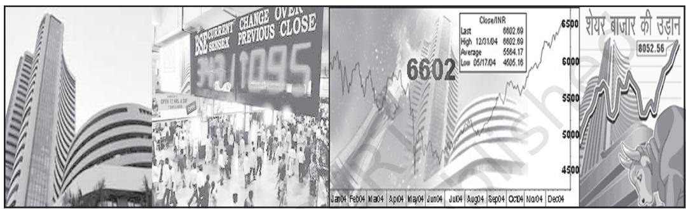
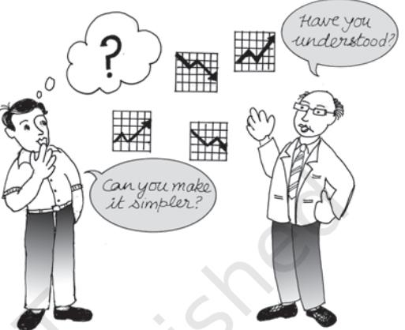
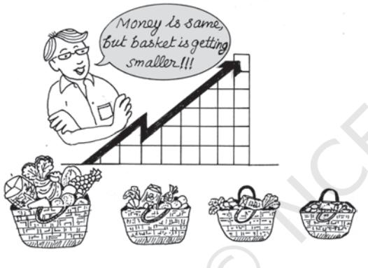
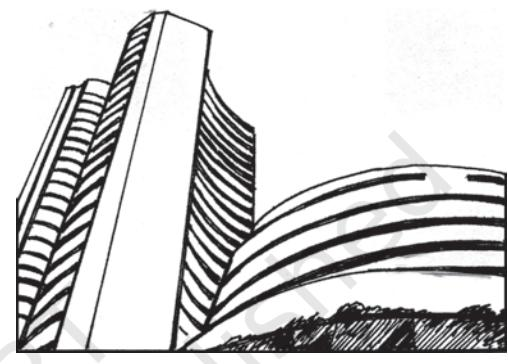
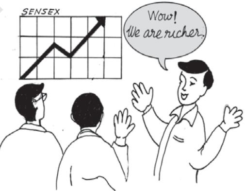

# CHAPTER

# Index Numbers

## *Studying this chapter should enable you to:*

- *• understand the meaning of the term index number;*
- *• become familiar with the use of some widely used index numbers;*
- *• calculate an index number;*
- *• appreciate its limitations.*

# 1. INTRODUCTION

You have learnt in the previous chapters how summary measures can be obtained from a mass of data. Now you will learn how to obtain summary measures of change in a group of related variables.

Rabi goes to the market after a long gap. He finds that the prices of most commodities have changed. Some items have become costlier, while others have become cheaper. On his return from the market, he tells his father about the change in price of the each and every item, he bought. It is bewildering to both.

The industrial sector consists of many subsectors. Each of them is changing. The output of some subsectors are rising, while it is falling in some subsectors. The changes are not uniform. Description of the individual rates of change will be difficult to understand. Can a single figure summarise these changes? Look at the following cases:

# *Case 1*

An industrial worker was earning a salary of Rs 1,000 in 1982. Today, he

earns Rs 12,000. Can his standard of living be said to have risen 12 times during this period? By how much should his salary be raised so that he is as well off as before?

# *Case 2*

You must be reading about the sensex in the newspapers. The sensex crossing 8000 points is, indeed, greeted with euphoria. When, sensex dipped 600 points recently, it eroded investors' wealth by Rs 1,53,690 crores. What exactly is sensex?

## *Case 3*

The government says inflation rate will not accelerate due to the rise in the price of petroleum products. How does one measure inflation?

These are a sample of questions you confront in your daily life. A study of the index number helps in analysing these questions.

# 2. WHAT IS AN INDEX NUMBER

An index number is a statistical device for measuring changes in the magnitude of a group of related variables. It represents the general trend of diverging ratios, from which it is calculated. It is a measure of the average change in a group of related variables over two different situations. The comparison may be between like categories such as persons, schools, hospitals etc. An index number also measures changes in the value of the variables such as prices of specified list of commodities, volume of production in different sectors of an industry, production of various agricultural crops, cost of living etc.

Conventionally, index numbers are expressed in terms of percentage. Of the two periods, the period with which the comparison is to be made, is known as the base period. The value in the base period is given the index number 100. If you want to know how much the price has changed in 2005 from the level in 1990, then 1990 becomes the base. The index number of any period is in proportion with it. Thus an index number of 250 indicates that the value is two and half times that of the base period.

Price index numbers measure and permit comparison of the prices of certain goods. Quantity index numbers measure the changes in the physical volume of production, construction or employment. Though price index numbers are more widely used, a production index is also an important indicator of the level of the output in the economy.

## 3. CONSTRUCTION OF AN INDEX NUMBER

In the following sections, the principles of constructing an index number will be illustrated through price index numbers.

Let us look at the following example:

## *Example 1*

Calculation of simple aggregative price index

| TABLE 7.1 |  |  |  |
| --- | --- | --- | --- |
| Commodity | Base | Current | Percentage |
| period |  | period | change |
| price (Rs) |  | price (Rs) |  |
| A | 2 | 4 | 100 |
| B | 5 | 6 | 20 |
| C | 4 | 5 | 25 |
| D | 2 | 3 | 50 |

As you observe in this example, the percentage changes are different for every commodity. If the percentage changes were the same for all four items, a single measure would have been sufficient to describe the change. However, the percentage changes differ and reporting the percentage change for every item will be confusing. It happens when the number of commodities is large, which is common in any real market situation. *A price index represents these changes by a single numerical measure.*

There are two methods of constructing an index number. It can be computed by the *aggregative method* and by the *method of averaging relatives.*

## The Aggregative Method

The formula for a *simple aggregative price index* is

$$\mathbf{P}_{01}\ =\ {\frac{\Sigma\mathbf{P}_{1}}{\Sigma\mathbf{P}_{0}}}\times100$$

Where P1 and P0 indicate the price of the commodity in the current period and base period respectively. Using the data from example 1, the *simple aggregative price index* is

$\mathbf{P}_{01}=\frac{4+6+5+3}{2+5+4+2}\times100=138.5$

Here, price is said to have risen by 38.5 per cent.

Do you know that such an index is of limited use? The reason is that the units of measurement of prices of various commodities are not the same. It is unweighted, because the relative importance of the items has not been properly reflected. The items are treated as having equal importance or weight. But what happens in reality? In reality the items purchased differ in order of importance. Food items occupy a large proportion of our expenditure. In that case an equal rise in the price of an item with large weight and that of an item with low weight will have different implications for the overall change in the price index.

The formula for a *weighted aggregative price index* is

$$\mathrm{P}_{01}={\frac{\Sigma\,\mathrm{P}_{1}\mathrm{q}_{0}}{\Sigma\,\mathrm{P}_{0}\mathrm{q}_{0}}}\times100$$

An index number becomes a weighted index when the relative importance of items is taken care of. Here weights are quantity weights. To construct a weighted aggregative index, a well-specified basket of commodities is taken and its worth each year is calculated. It thus measures the changing value of a fixed aggregate of goods. Since the total value changes with a fixed basket, the change is due to price change. Various methods of calculating a weighted aggregative index use different baskets with respect to time.

## *Example 2*

Calculation of *weighted aggregative price index*

|  |  | TABLE 7.2 |  |  |
| --- | --- | --- | --- | --- |
|  |  |  | Base period Current period |  |
| Commodity | Price | Quantity | Price | Quantity |
|  | P0 | q0 | p1 | q1 |
| A | 2 | 10 | 4 | 5 |
| B | 5 | 12 | 6 | 10 |
| C | 4 | 20 | 5 | 15 |
| D | 2 | 15 | 3 | 10 |

$$\mathrm{P}_{01}={\frac{\Sigma\mathrm{P}_{1}\mathrm{q}_{0}}{\Sigma\mathrm{P}_{0}\mathrm{q}_{0}}}\times100$$

$$={\frac{4\times10+6\times12+5\times20+3\times15}{2\times10+5\times12+4\times20+2\times15}}\times100$$
  

$$={\frac{257}{190}}\times100=135.3$$

This method uses the base period quantities as weights. A weighted aggregative price index using base period quantities as weights, is also known as *Laspeyre's price index*. It provides an explanation to the question that if the expenditure on base period basket of commodities was Rs 100, how much should be the expenditure in the current period on the same basket of commodities? As you can see here, the value of base period quantities has risen by 35.3 per cent due to price rise. Using base period quantities as weights, the price is said to have risen by 35.3 percent.

Since the current period quantities differ from the base period quantities, the index number using current period weights gives a different value of the index number.

$\mathbf{P_{01}}=\frac{\Sigma\mathbf{P_{0}q_{1}}}{\Sigma\mathbf{P_{0}q_{1}}}\times100$  
  
$\mathbf{4\times5+6\times10+5\times15+3\times10}\times100$  
  
$\mathbf{2\times5+5\times10+4\times15+2\times10}\times100$  
  
$\mathbf{185}\times100=132.1$

It uses the current period quantities as weights. A weighted aggregative price index using current period quantities as weights is known as *Paasche's price index.* It helps in answering the question that, if the current period basket of commodities was consumed in the base period and if we were spending Rs 100 on it, how much should be the expenditure in current period on the same basket of commodities. Paasche's price index of 132.1 is interpreted as a price rise of 32.1 per cent. Using current period weights, the price is said to have risen by 32.1 per cent.

## Method of Averaging relatives

When there is only one commodity, the price index is the ratio of the price of the commodity in the current period to that in the base period, usually expressed in percentage terms. The method of averaging relatives takes the average of these relatives when there are many commodities. The price index number using *price relatives* is defined as

$$\mathrm{P}_{01}={\frac{1}{\mathrm{n}}}\,\Sigma{\frac{\mathrm{p}_{1}}{\mathrm{p}_{0}}}\times100\ \mathrm{\left(\right.}$$

where P1 and Po indicate the price of the *i*th commodity in the current period and base period respectively. The ratio (P1 /P0 ) × 100 is also referred to as price relative of the commodity. *n* stands for the number of commodities. In the current exmple

$$\mathrm{P}_{01}={\frac{1}{4}}{\bigg(}{\frac{4}{2}}+{\frac{6}{5}}+{\frac{5}{4}}+{\frac{3}{2}}{\bigg)}\times100=149$$

Thus, the prices of the commodities have risen by 49 per cent.

The *weighted index of price relatives* is the weighted arithmetic mean of price relatives defined as

$$\mathrm{P}_{\mathrm{O}1}={\frac{\sum_{\mathrm{i=1}}^{\mathrm{n}}\mathrm{W}_{\mathrm{i}}{\left({\frac{\mathrm{P}_{\mathrm{I}\mathrm{i}}}{\mathrm{P}_{\mathrm{O}\mathrm{i}}}}\times100\right)}}{\sum_{\mathrm{i=1}}^{\mathrm{n}}\mathrm{W}_{\mathrm{i}}}}$$

where W = Weight.

In a *weighted price relative index* weights may be determined by the proportion or percentage of expenditure on them in total expenditure during the base period. It can also refer to current period depending on the formula used. These are, essentially, the value shares of different commodities in the total expenditure. In general the base period weight is preferred to the current period weight. It is because calculating the weight every year is inconvenient. It also refers to the changing values of different baskets. They are strictly not comparable. *Example 3* shows the type of information one needs for calculating *weighted price index.*

## *Example 3*

Calculation of *weighted price relatives index*

TABLE 7.3

| Commodity | Weight | Base | Current | Price |
| --- | --- | --- | --- | --- |
|  | in % | year price | year | relative |
|  |  | price | (in Rs) |  |
|  |  | (in Rs.) |  |  |
| A | 40 | 2 | 4 | 200 |
| B | 30 | 5 | 6 | 120 |
| C | 20 | 4 | 5 | 125 |
| D | 10 | 2 | 3 | 150 |

The weighted price index is

$$\mathrm{\Delta\Sigma_{i=1}^{n}\,W_{i}\!\left(\frac{P_{1i}}{P_{0i}}\times100\right)}$$

$40\times200+30\times120+20\times125+10\times150$

= 156

The *weighted price index* is 156. The price index has risen by 56 per cent. The values of the *unweighted price index* and the *weighted price index* differ, as they should. The higher rise in the weighted index is due to the doubling of the most important item A in *Example 3*.

#### *Activity ActivityActivity*

- Interchange the current period values with the base period values, in the data given in *Example 2*. Calculate the price index using Laspeyre's, and Paasche's formula. What difference do you observe from the earlier illustration?
## 4. SOME IMPORTANT INDEX NUMBERS

## Consumer price index

*Consumer price index* (CPI), also known as *the cost of living index,* measures the average change in retail prices. Consider the statement that the *CPI for industrial workers (2001=100) is 277 in December 2014*. What does this statement mean? It means that if the industrial worker was spending Rs 100 in 2001 for a typical basket of commodities, he needs Rs 277 in December 2014 to be able to buy an identical basket of commodities. It is not necessary that he/she buys the basket. What is important is whether he has the capability to buy it.

### *Example 4*

Construction of *consumer price index* number.

  
  
\begin{tabular}{l l l} \hline \hline $\mathrm{CPI}=\mathrm{SW}$ & $\mathrm{9786.85}$ \\ \hline $\mathrm{EW}$ & $\mathrm{100}$ & \\ \hline \end{tabular}  
  

This exercise shows that the cost of living has declined by 2.14 per cent. What does an index larger than 100 indicate? It means a higher cost of living necessitating an upward adjustment in wages and salaries. The rise is equal to the amount, it exceeds 100. If the index is 150, 50 per cent upward adjustment is required. The salaries of the employees have to be raised by 50 per cent.

|  |  | TABLE 7.4 |  |  |
| --- | --- | --- | --- | --- |
| Item Weight in % | Base period | Current period | R=P1 /P0 × 100 | WR |
| W | price (Rs) | price (Rs) | (in%) |  |
| Food | 35 150 | 145 | 96.67 | 3883.45 |
| Fuel | 10 25 | 23 | 92.00 | 920.00 |
| Cloth | 20 75 | 65 | 86.67 | 1733.40 |
| Rent | 15 30 | 30 | 100.00 | 1500.00 |
| Misc. | 20 40 | 45 | 112.50 | 2250.00 |
|  |  |  |  | 9786.85 |

# Consumer Price Index Number

Government agencies in India prepare a large number of consumer price index numbers. Some of them are as follows:

- Consumer Price Index Numbers for Industrial Workers with base 2001=100. Value of Index in May 2017 was 278.
- All-India Consumer Price Index Numbers for Agricultural Labourers with base 1986- 87=100. Value of Index in May 2017 was 872.
- All-India Consumer Price Index Numbers for Rural Labourers with base 1986-87=100. Value of Index in May 2017 was 878.
- All-India Rural Consumer Index with base 2012 = 100. Value of Index in May 2017 was 133.3
- All-India Urban Consumer Price Index with base 2012 = 100. Value of Index in May 2017 was 129.3 All-India Combined Consumer Price with base 2012 = 100. Value of Index in May 2017 was 131.4

In addition, these indices are available at the state level.

The detailed methods used for calculating each of these index numbers is different and it is not necessary to go into these details.

The Reserve Bank of India is using the All-India Combined Consumer Price Index as the main measure of how consumer prices are changing. Therefore, some details are necessary about this index number.

This index is now being prepared with base 2012 = 100 and many improvements have been made in accordance with international standards. The basket of items and weighing diagrams for the revised series has been prepared using the Modified Mixed Reference Period (MMRP) data of the Consumer Expenditure Survey (CES), 2011-12 of the 68th Round of National Sample Survey (NSS). The weights are as follows:

| Major Groups | Weight |
| --- | --- |
| Food and beverages | 45.86 |
| Pan, tobacco and intoxicants | 2.38 |
| Clothing & footwear | 6.53 |
| Housing | 10.07 |
| Fuel & light | 6.84 |
| Misc. group | 28.32 |
| General | 100.00 |

Source: *Economic Survey, 2014-15 Government of India.*

Data are provided on the rate of change per year of each of the sub-groups and main groups. So, we can find out from this data which prices are rising most of all and are, thereby, contributing to inflation.

The Consumer Food Price Index (CFPI) is the same as the Consumer Price Index for 'Food and Beverages' except that it does not include alcoholic beverages' and 'Prepared meals, snacks, sweets, etc'.

## Wholesale Price Index

*The Wholesale price index number indicates the change in the general price level.* Unlike the CPI, it does not have any reference consumer category. It does not include items pertaining to services like barber charges, repairing, etc.

What does the statement "WPI with 2004-05 as base is 253 in October, 2014" mean? It means that the general price level has risen by 153 per cent during this period.

The Wholesale Price Index is now being prepared with base 2011-12 = 100. The value of the index for May 2017 was 112.8. This index uses the prices that are prevailing at the wholesale level. Only the prices of goods are included. The main types of goods and their weights are as follows:

| Major Groups | Weight |
| --- | --- |
| Primary Articles | 22.62 |
| Fuel and Power | 13.15 |
| Manufactured Products | 64.23 |
| All Commodities 'Headline Inflation' 100.00 |  |
| 'WPI Food Index' | 24.23 |

Source: *Ministry of Statistics and Programme Implementation, 2016-17*

Usually the data on Wholesale Prices is available quickly. The 'All Commodities Inflation Rate' is often referred to as 'Headline Inflation'. Sometimes the focus is on food items which comprise 24.23% of the total weight. This Food Index is made up of Food Articles from the Primary Articles group and Food Products from the Manufactured Products group. Other economists like to focus on the wholesale prices in manufactured goods (other than food articles and also excluding fuel) and for this they study 'Core Inflation' which make up around 55% of the total weight of the wholesale price index.

## Index of Industrial production

Unlike the Consumer Price Index or the Wholesale Price Index, this is an index which tries to measure quantities. With effect from April 2017, the base year has been fixed at 2011-12 = 100. The reason for the fast changes in the base year is that every year a large number of items either stop being manufactured or become inconsequential, while many other new items start getting manufactured.

While the price indices were essentially weighted averages of price relatives, the index of industrial production is a weighted arithmetic mean of quantity relatives with weights being allotted to various items in proportion to value added by manufacture in the base year by using Laspeyre's formula:

$$\mathrm{IIP01}={\frac{\sum_{i=1}^{n}\mathbf{q_{i i W i}}}{\sum_{i=1}^{n}\mathbf{W_{i}}}}\times100$$

Where IIP01 is the index, qi1 is the quantity relative for year 1 with year 0 as base for good i, Wi is the weight allotted to the good i. There are n goods in the production index.

The index of Industrial Production is available at the level of Industrial Sectors and sub-sectors. The main branches are 'Mining', 'Manufacturing' and 'Electricity'. Sometimes the focus is on what are called "core" industries namely coal, crude oil, natural gas, refinery products, fertilisers, steel, cement and electricity. The Eight Core Industries have a combined weight of 40.27 per cent in the IIP.

TABLE 7.5 Weightage Pattern of IIP (Industrial Production Sectors)

| Sector | Weight |
| --- | --- |
| Mining | 14.4 |
| Manufacturing | 77.6 |
| Electricity | 8.0 |
| General Index | 100.0 |

Source: *Ministry of Statistics and Programme Implementation, 2016-17*

The index of Industrial Production is also available according to the "use" of the product, that is, for example, "Primary Goods", "Consumer Durables" and so on.

TABLE 7.6 Weightage Pattern of IIP (Use-based Groups)

| Group | Weight |
| --- | --- |
| Primary | 34.1 |
| Capital Goods | 8.2 |
| Intermediate Goods | 17.2 |
| Infrastructure/Construction Goods 12.3 |  |
| Consumer Durables | 12.8 |
| Consumer Non-durables | 15.3 |
| General Index | 100.0 |

Source: *Ministry of Statistics and Programme Implementation, 2016-17*

# Human Development Index

Another useful index widely used to know the development of a country is Human Development Index (HDI) about which you might have studied in Class X.

## SENSEX

Sensex is the short form of Bombay Stock Exchange Sensitive Index with 1978–79 as base. The value of the sensex is with reference to this period.

It is the benchmark index for the Indian stock market. It consists of 30 stocks which represent 13 sectors of the economy and the companies listed are leaders in their respective industries. If

the sensex rises, it indicates that the market is doing well and investors expect better earnings from companies. It also indicates a growing confidence of investors in the basic health of the economy.

# 5. ISSUES IN THE CONSTRUCTION OF AN INDEX NUMBER

You should keep certain important issues in mind, while constructing an index number.

• You need to be clear about the purpose of the index. Calculation of a volume index will be inappropriate, when one needs a value index.

• Besides this, the items are not equally important for different groups of consumers when a consumer price index is constructed. The rise in petrol price may not directly impact the living condition of the poor agricultural labourers. Thus the items to be included in any index have to be selected carefully to be as representative as possible. Only then you will get a meaningful picture of the change.

• Every index should have a base year. This base year should be as normal as possible. Years having extreme values should not be selected as base year. The period should also not belong to too far in the past. The comparison between 1993 and 2005 is much more meaningful than a comparison between 1960 and 2005. Many items in a 1960 typical consumption basket have disappeared at present. Therefore, the base year for any index number is routinely updated.

• Another issue is the choice of the formula, which depends on the nature of question to be studied. The only difference between the Laspeyre's index and Paasche's index is the weights used in these formulae.

• Besides, there are many sources of data with different degrees of reliability. Data of poor reliability will give misleading results. Hence, due care should be taken in the collection of data. If primary data are not being used, then the most reliable source of secondary data should be chosen.

## *Activity*

- Collect data from the local vegetable market over a week for, at least 10 items. Try to construct the daily price index for the week. What problems do you encounter in applying both methods for the construction of a price index?
## 6. INDEX NUMBER IN ECONOMICS

Why do we need to use the index numbers? Wholesale price index number (WPI), consumer price index number (CPI) and industrial production index (IIP) are widely used in policy making.

• Consumer index number (CPI) or cost of living index numbers are helpful in wage negotiation, formulation of income policy, price policy, rent control, taxation and general economic policy formulation.

• The wholesale price index (WPI) is used to eliminate the effect of changes in prices on aggregates, such as national income, capital formation, etc.

• The WPI is widely used to measure the rate of inflation. Inflation is a general and continuing increase in prices. If inflation becomes sufficiently large, money may lose its traditional function as a medium of exchange and as a unit of account. Its primary impact lies in

lowering the value of money. The weekly inflation rate is given by

 where Xt and Xt-1 refer

to the WPI for the tth and (t-1)th weeks. • CPI are used in calculating the purchasing power of money and real wage:

(i) Purchasing power of money = 1/ Cost of living index

(ii) Real wage = (Money wage/Cost of living index) × 100

If the CPI (1982=100) is 526 in January 2005 the equivalent of a rupee in January, 2005 is given by

Rs $\frac{100}{526}=0.19$. It means that it is 

worth 19 paise in 1982. If the money wage of the consumer is Rs 10,000, his real wage will be

$$\mathrm{Rs}\,10,000\times{\frac{100}{526}}=\mathrm{Rs}\,1,901$$

It means Rs 1,901 in 1982 has the same purchasing power as Rs 10,000 in January, 2005. If he/she was getting Rs 3,000 in 1982, he/she is worse off due to the rise in price. To maintain the 1982 standard of living the salary should be raised to Rs 15,780 which is obtained by multiplying the base period salary by the factor 526/100.

• Index of industrial production gives us a quantitative figure about the change in production in the industrial sector.

• Agricultural production index provides us a ready reckoner of the performance of agricultural sector.

• Sensex is a useful guide for investors in the stock market. If the sensex is rising, investors are optimistic of the future performance of the economy. It is an appropriate time for investment.

# Where can we get these index numbers?

Some of the widely used index numbers — WPI, CPI, Index Number of Yield of Principal Crops, Index of Industrial Production, Index of Foreign Trade — are available in *Economic Survey.*

# *Activity ActivityActivity*

- Check from the newspapers and construct a time series of sensex with 10 observations. What happens when the base of the consumer price index is shifted from 1982 to 2000?
# 7. CONCLUSION

Estimating index number enables you to calculate a single measure of change of a large number of items. Index numbers can be calculated for price, quantity, volume, etc.

It is also clear from the formulae that the index numbers need to be interpreted carefully. The items to be included and the choice of the base period are important. Index numbers are extremely important in policy making as is evident by their various uses.

#### *Recap*

- An index number is a statistical device for measuring relative change in a large number of items.
- There are several formulae for working out an index number and every formula needs to be interpreted carefully.
- The choice of formula largely depends on the question of interest.
- Widely used index numbers are wholesale price index, consumer price index, index of industrial production, agricultural production index and sensex.
- The index numbers are indispensable in economic policy making.

## EXERCISES

- 1. An index number which accounts for the relative importance of the items is known as
	- (i) weighted index
	- (ii) simple aggregative index
	- (iii) simple average of relatives
- 2. In most of the weighted index numbers the weight pertains to
	- (i) base year
	- (ii) current year
	- (iii) both base and current year
- 3. The impact of change in the price of a commodity with little weight in the index will be
	- (i) small
	- (ii) large
	- (iii) uncertain
- 4. A consumer price index measures changes in
	- (i) retail prices
	- (ii) wholesale prices
	- (iii) producers prices
- 5. The item having the highest weight in consumer price index for industrial workers is
	- (i) Food
	- (ii) Housing
	- (iii) Clothing
- 6. In general, inflation is calculated by using
	- (i) wholesale price index
	- (ii) consumer price index
	- (iii) producers' price index
- 7. Why do we need an index number?
- 8. What are the desirable properties of the base period?
- 9. Why is it essential to have different CPI for different categories of consumers?
- 10. What does a consumer price index for industrial workers measure?
- 11. What is the difference between a price index and a quantity index?
- 12. Is the change in any price reflected in a price index number?
- 13. Can the CPI for urban non-manual employees represent the changes in the cost of living of the President of India?
- 14. The monthly per capita expenditure incurred by workers for an industrial centre during 1980 and 2005 on the following items are given below. The weights of these items are 75,10, 5, 6 and 4 respectively. Prepare a weighted index number for cost of living for 2005 with 1980 as the base.

| Items | Price in 1980 | Price in 2005 |
| --- | --- | --- |
| Food | 100 | 200 |
| Clothing | 20 | 25 |
| Fuel & lighting | 15 | 20 |
| House rent | 30 | 40 |
| Misc | 35 | 65 |

- 15. Read the following table carefully and give your comments.

| Industry | Weight in % | 1996–97 | 2003–2004 |
| --- | --- | --- | --- |
| General index | 100 | 130.8 | 189.0 |
| Mining and quarrying | 10.73 | 118.2 | 146.9 |
| Manufacturing | 79.58 | 133.6 | 196.6 |
| Electricity | 10.69 | 122.0 | 172.6 |

INDEX OF INDUSTRIAL PRODUCTION BASE 1993–94

- 16. Try to list the important items of consumption in your family.
- 17. If the salary of a person in the base year is Rs 4,000 per annum and the current year salary is Rs 6,000, by how much should his salary be raised to maintain the same standard of living if the CPI is 400?
- 18. The consumer price index for June, 2005 was 125. The food index was 120 and that of other items 135. What is the percentage of the total weight given to food?

- 19. An enquiry into the budgets of the middle class families in a certain city gave the following information;

| Expenses on items | Food | Fuel | Clothing | Rent | Misc. |
| --- | --- | --- | --- | --- | --- |
|  | 35% | 10% | 20% | 15% | 20% |
| Price (in Rs) in 2004 | 1500 | 250 | 750 | 300 | 400 |
| Price (in Rs) in 1995 | 1400 | 200 | 500 | 200 | 250 |

What is the cost of living index during the year 2004 as compared with 1995?

- 20. Record the daily expenditure, quantities bought and prices paid per unit of the daily purchases of your family for two weeks. How has the price change affected your family?
- 21. Given the following data-

| Year | CPI of industrial | CPI of agricultural | WPI |
| --- | --- | --- | --- |
|  | workers | labourers | (1993–94=100) |
|  | (1982 =100) | (1986–87 = 100) |  |
| 1995–96 | 313 | 234 | 121.6 |
| 1996–97 | 342 | 256 | 127.2 |
| 1997–98 | 366 | 264 | 132.8 |
| 1998–99 | 414 | 293 | 140.7 |
| 1999–00 | 428 | 306 | 145.3 |
| 2000–01 | 444 | 306 | 155.7 |
| 2001–02 | 463 | 309 | 161.3 |
| 2002–03 | 482 | 319 | 166.8 |
| 2003–04 | 500 | 331 | 175.9 |

Source: *Economic Survey, 2004–2005, Government of India*

- (i) Comment on the relative values of the index numbers.
- (ii) Are they comparable?
- 22. The monthly expenditure (Rs.) of a family on some important items and the Goods and Services Tax (GST) rates applicable to these items is as follows:

| Item | Monthly Expense(Rs) | GST Rate % |
| --- | --- | --- |
| Cereals | 1500 | 0 |
| Eggs | 250 | 0 |
| Fish, Meat | 250 | 0 |
| Medicines | 50 | 5 |
| Biogas | 50 | 5 |
| Transport | 100 | 5 |
| Butter | 50 | 12 |
| Babool | 10 | 12 |
| Tomato Ketchup | 40 | 12 |

| Biscuits | 75 | 18 |
| --- | --- | --- |
| Cakes, Pastries | 25 | 18 |
| Branded Garments | 100 | 18 |
| Vacuum Cleaner, Car | 1000 | 28 |

Calculate the average tax rate as far as this family is concerned.

The calculation of the average GST rate makes use of the formula for weighted average. In this case, the weights are the shares of expenditure on each category of goods. The total weight is equal to the total expenditure of the family. And the variables are the GST rates.

| Category | Expenditure Weight (w) | GST Rate (x) | WX |
| --- | --- | --- | --- |
| Category 1 | 2000 | 0 | 0 |
| Category 2 | 200 | 0.05 | 10 |
| Category 3 | 100 | 0.12 | 12 |
| Category 4 | 200 | 0.18 | 36 |
| Category 5 | 1000 | 0.28 | 280 |
|  | 3500 |  | 338 |

The mean GST rate as far as this family is concerned is (338)/ (3500) = 0.966 i.e. 9.66%

### *Activity ActivityActivity*

- Consult your classteacher to make a list of widely used index numbers. Get the most recent data indicating the source. Can you tell what the unit of an index number is?
- Make a table of consumer price index for industrial workers in the last 10 years and calculate the purchasing power of money. How is it changing?

