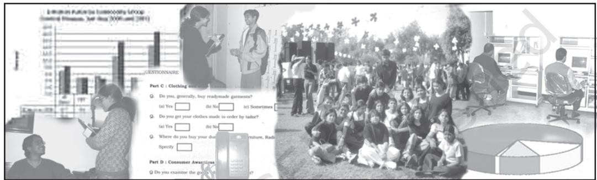
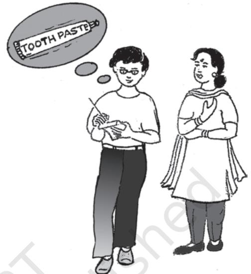
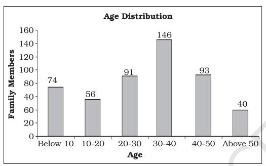
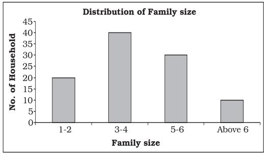
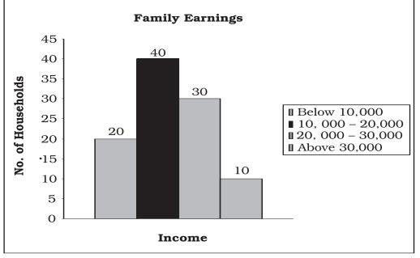
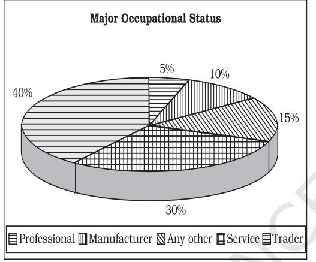
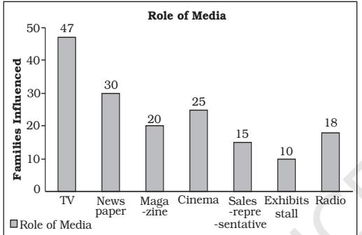

# CHAPTER

# Use of Statistical Tools

#### *Studying this chapter should enable you to:*

- *• be familiar with steps in designing a project;*
- *• apply various statistical tools in analysing a problem.*

# 1. INTRODUCTION

You have studied about the various statistical tools. These tools are important for us in daily life and are used in the analysis of data pertaining to economic activities such as production, consumption, distribution, banking and insurance, trade, transport, etc. In this chapter, you will learn the method of developing a project. This will help in understanding how statistical tools and methods can be used for various types of analysis. For example, you may have to collect information about a product from the consumer or about a new product or service to be launched in the market by the producer or analyse the spread of information technology in schools and so on. Developing a project by conducting a survey and preparing a report will help in analysing relevant information and suggesting improvements in a product or system.

# Steps Towards Making a Project

*Identifying a problem or an area of study*

At the outset, you should be clear about what you want to study. On the basis of your objective, you will proceed with the collection and processing of the data. For example, production or sale of a product like car, mobile phone, shoe polish, bathing soap or a detergent, may be an area of interest to you. You may like to address certain water or electricity problems relating to households of a particular area. You may like to study about consumer awareness among households, i.e., awareness about rights of consumers.

# *Choice of Target Group*

The choice or identification of the target group is important for framing appropriate questions for your questionnaire. If your project relates to cars, then your target group will mainly be the middle income and the higher income groups. For the project studies relating to consumer products like soap, you will target all rural and urban consumers. For the availability of safe drinking water your target group can be both urban and rural population. Therefore, the choice of target groups, to identify those persons on whom you focus your attention, is very important while preparing the project report.

#### *Collection of Data*

The objective of the survey will help you to determine whether the data collection should be undertaken by using primary method, secondary method or both the methods. As you have read in Chapter 2, a first hand collection of data by using primary method can be done by using a questionnaire or an interview schedule, which may be obtained by personal interviews, mailing/postal surveys, phone, email, etc. Postal questionnaire must have a covering letter giving details about the purpose of inquiry. Your objective will be to determine the size and characteristics of your target group. For example, in a study pertaining to the primary and secondary level female literacy or consumption of a particular brand or soap, you will have to go to each and every family or household to collect the information i.e. you have to collect primary data. If sampling is used in your method of data collection, then care has to be taken about the suitability of the method of sampling.

Secondary data can also be used provided it suits your requirement. Secondary data are usually used when there is paucity of time, money and manpower resources and the information is easily available.

# *Organisation and Presentation of Data*

After collecting the data, you need to process the information so received, by organising and presenting them with the help of tabulation and suitable diagrams, e.g. bar diagrams, pie diagrams, etc. about which you have studied in chapter 3 and 4.

### *Analysis and Interpretation*

Measures of Central Tendency (e.g. mean), Measures of Dispersion (e.g. Standard deviation), and Correlation will enable you to calculate the average, variability and relationship, if it exists among the variables. You have acquired the knowledge related to abovementioned measures in chapters 5 and 6.

### *Conclusion*

The last step will be to draw meaningful conclusions after analysing and interpreting the results. If possible you must try to predict the future prospects and suggestions relating to growth and government policies, etc. on the basis of the information collected.

### *Bibliography*

In this section, you need to mention the details of all the secondary sources, i.e., magazines, newspapers, research reports used for developing the project.

# 2. SUGGESTED LIST OF PROJECTS

These are a few suggested projects. You are free to choose any topic that deals with an economic issue.

- 1. Consider yourself as an advisor to Transport Minister who aims to bring about a better and coordinated system of transportation. Prepare a project report.
- 2. You may be working in a village cottage industry. It could be a unit manufacturing *dhoop, agarbatti,* candles, jute products, etc. You want to start a new unit of your

own. Prepare a project proposal for getting a bank loan.

- 3. Suppose you are a marketing manager in a company and recently you have put up advertisements about your consumer product. Prepare a report on the effect of advertisements on the sale of your product.
- 4. You are a District Education Officer, who wants to assess the literacy levels and the reasons for dropping out of school children. Prepare a report.
- 5. Suppose you are a Vigilance Officer of an area and you receive complaints about overcharging of goods by traders i.e., charging a higher price than the Maximum Retail Price (MRP). Visit a few shops and prepare a report on the complaint.
- 6. Consider yourself to be the head of Gram Panchayat of a particular village who wants to improve amenities like safe drinking water to your people. Address your issues in a report form.
- 7. As a representative of a local government, you want to assess the participation of women in various employment schemes in your area. Prepare a project report.
- 8. You are the Chief Health Officer of a rural block. Identify the issues to be addressed through a project study. This may include health and sanitation problems in the area.
- 9. As the Chief Inspector of Food and Civil Supplies department, you have received a complaint about

food adulteration in the area of your duty. Conduct a survey to find the magnitude of the problem.

- 10. Prepare a report on Polio immunisation programme in a particular area.
- 11. You are a Bank Officer and want to survey the saving habits of the people by taking into consideration income and expenditure of the people. Prepare a report.
- 12. Suppose you are part of a group of students who wants to study farming practices and the problems facing farmers in a village. Prepare a project report.

# 3. SAMPLE PROJECT

This is a sample project for your guidance. Depending on the subject of your study the method used will obviously be different from the one used here.

#### Project

X is a young entrepreneur who wants to set up a factory to produce toothpaste. You are asked to advise X about how he should proceed.

One of the first things you could do would be to study people's tastes with regard to toothpastes, their monthly expenses on toothpaste and other relevant facts. For this, you may decide to collect primary data.

The data is to be collected with the help of a questionnaire. Whatever questionnaire you use must be capable of generating the information which you need for your study. Suppose you

decide that the most important information that you need for your study is:

- *•* The average monthly expenditure on toothpaste
- *•* The brands of toothpaste that are currently in demand
- *•* The attitude of the customers towards these brands
- *•* Customers' preferences in regard to ingredients in the toothpaste
- *•* The major media influences on consumers' demand for toothpaste
- *•* The relation between income and all the above factors.

If you can get hold of a questionnaire that has already been tried out and tested (perhaps for some similar study), you could use it after suitably modifying it to suit your requirements. Otherwise, you may need to prepare the questionnaire yourself, making sure that all the required information has been asked for.

| EXAMPLE OF QUESTIONNAIRE TO BE |  |
| --- | --- |
| USED FOR THIS PROJECT REPORT toothpaste? Yes | No |
| 1. Name toothpaste? Yes 2. Sex | No |
| 3. Ages of family members (in years) |  |
| (i) Plain |  |
| (ii) Gel |  |
| (iii) Antiseptic (iv) Flavoured |  |
| (v) 4. Total Number of family members:- (vi) Fluoride | Carries Protection |
| 5. Monthly family income (vii) 6. Location of residence Urban | Other ——— |
| Rural 7. Major occupation of the main (i) Cinema | information about toothpaste? |
| bread-winner: (ii) Exhibitions (i) Service |  |
| (iii) Internet (ii) Professional (iv) Magazines |  |
| (iii) Manufacturer (v) (iv) Trader | Newspapers |
| (vi) Radio (v) Any other (please specify) | (vii)Sales Representatives |
| 8. Does your family use toothpaste to (viii) Television clean your teeth? |  |
| (ix) Yes No | Other ——— |
| 9. If Yes, then according to you what DATA ANALYSIS AND should be the essential qualities of |  |
| INTERPRETATION a good toothpaste (you can tick |  |
| more than one option): (i) Plain |  |
| (ii) Gel (iii) Antiseptic | The final report may be as follows: |
| (iv) Flavoured |  |
| REPORT (v) Carries Protection |  |
| (vi) Fluoride (vii) Other ——— |  |

- 10. If Yes, which brand of toothpaste do you use? ———
- 11. How many 100 gram packs of this toothpaste do you use per month?
- 12.Are you satisfied with this toothpaste? Yes No
- 13. Are you prepared to try out a new toothpaste? Yes No
- 14. If Yes, what are the features you would like in the new toothpaste? (you can tick more than one option):
	- (iii) Antiseptic
	- (iv) Flavoured
	- (v) Carries Protection
	- (vi) Fluoride
	- (vii) Other ———
- 15. What are the main sources of your information about toothpaste?
	- (ii) Exhibitions
	- (iii) Internet
	-
	- (v) Newspapers
	- (vii)Sales Representatives
	- (ix) Other ———

*DATA ANALYSIS AND INTERPRETATION*

After collecting the required information you now have to organise and analyse. The final report may be as follows:

*EXAMPLE OF SIMPLIFIED PROJECT*

- 1. Total Sample Size: 100 households
- 2. Location: Urban 67% Rural 33%

Observation: Majority of users belonged to urban area.

# *Age in years No. of Persons* Below 10 74 10–20 56 20–30 91 30–40 146 40–50 93 Above 50 40 *Total 500*

Fig. 8.1: *Bar diagram*

Observation: Majority of the families surveyed have 3–6 members.

# *(iii) Monthly Family Income status*

| Income | No. of Households |
| --- | --- |
| 0 - 10,000 | 20 |
| 10,000–20,000 | 40 |
| 20,000–30,000 | 30 |
| 30,000 - 40,000 | 10 |

Frequncy Distribution of Monthly Family Income and Calculation of Mean and Standard Deviation

| Income Class | Midpoint x | Freq. f | d'=(X-20000)/5000 | fd' | f'd'2 |
| --- | --- | --- | --- | --- | --- |
| (1) | (2) | (3) | (4) | (5) | (6) |
| 0-10000 | 5000 | 20 | -3 | -60 | 180 |
| 10000-20000 | 15000 | 40 | -1 | -40 | 40 |
| 20000-30000 | 25000 | 30 | 1 | 30 | 30 |
| 30000-40000 | 35000 | 10 | 3 | 30 | 90 |
|  |  | 100 |  | -40 | 340 |

Observation: Majority of the persons surveyed belonged to age group 20–50 years.

# *(ii) Family Size*

| Family size | No. of families |
| --- | --- |
| 1–2 | 20 |
| 3–4 | 40 |
| 5–6 | 30 |
| Above 6 | 10 |
| Total | 100 |

Histogram for this data is shown below.

Fig. 8.3: *Histogram*

*(i) Age distribution*

Observation: Majority of the families surveyed have monthly income between 10,000 to 30,000.

The mean income was Rs.18000 and standard deviation was Rs.9000 The mean expenditure on toothpaste per household was Rs. 104 per month and standard deviation was Rs.35.60.

Frequncy Distribution of Monthly Family Expenditure on Toothpaste and Calculation of Mean and Standard Deviation

| Income Class | Midpoint x | Freq. f | d'=(X-100)/40 | fd' | fd'2 |
| --- | --- | --- | --- | --- | --- |
| (1) | (2) | (3) | (4) | (5) | (6) |
| 0-40 | 20 | 5 | -2 | -10 | 20 |
| 40-80 | 60 | 20 | -1 | -20 | 20 |
| 80-120 | 100 | 40 | 0 | 0 | 0 |
| 120-160 | 140 | 30 | 1 | 30 | 30 |
| 160-200 | 180 | 5 | 2 | 10 | 20 |
|  |  | 100 |  | 10 | 90 |

*(iv) Monthly Family budget on*

*toothpaste*

*(v) Major Occupational Status*

| Family Occupation | No. of Families |
| --- | --- |
| Service | 30 |
| Professional | 5 |
| Manufacture | 10 |
| Trader | 40 |
| Any other (please specify) | 15 |

#### Fig. 8.4: *Pie diagram*

Observation: Majority of the families surveyed were either service class or traders.

#### *(vi) Preferred use of toothpaste*

| Brand | No. of Hh. | Brand | No. of Hh. |
| --- | --- | --- | --- |
| Aquafresh | 5 | Anchor | 4 |
| Cibaca | 9 | Babool | 3 |
| Close-up | 12 | Promise | 3 |
| Colgate | 18 | Meswak | 5 |
| Pepsodent | 20 | OralB | 7 |
| Pearl | 4 | Sensodyne | 7 |
| Any other | 3 |  |  |

Observation: Pepsodent, Colgate and Close-up were the most preferred brands.

#### *(vii) Basis of selection*

| Features | Family members |
| --- | --- |
| Advertisement | 15 |
| Persuaded by the Dentist | 5 |
| Price | 35 |
| Quality | 45 |
| Taste | 20 |
| Ingredients | 10 |
| Standardised marking | 50 |
| Tried new product | 10 |
| Company's brand name | 35 |

Observation: Majority of the people selected the toothpaste on the basis of standardised markings, quality, price and company's brand name.

#### *(viii) Taste and Preferences*

| Brand | Satisfied | Unsatisfied |
| --- | --- | --- |
| Aquafresh | 2 | 3 |
| Cibaca | 5 | 4 |
| Close up | 10 | 2 |
| Colgate | 16 | 2 |
| Meswak | 3 | 2 |
| Pepsodent | 18 | 2 |
| Anchor | 2 | 2 |
| Babool | 2 | 1 |
| Promise | 2 | 1 |
| OralB | 4 | 3 |
| Sensodyne | 5 | 2 |
| Pearl | 2 | 2 |

Observation:Amongst the most used toothpastes the percentage of dissatisfaction was relatively less.

#### *(ix) Ingredients Preference*

| Plain | 40 |
| --- | --- |
| Gel | 70 |
| Antiseptic | 80 |
| Flavoured | 50 |
| Carries protective | 30 |
| Fluoride | 10 |

Observation: Majority of the people preferred gel and antiseptic-based toothpastes over the others.

*(x) Media Influence*

# *Advertisement Families Influenced* Television 47 Newspaper 30 Magazine 20 Cinema 25 Sales representative 15 Exhibits - stall 10 Radio 18

Fig. 8.5: *Bar diagram*

Observation:Majority of people came to know about the product either through television or through newspaper.

#### *(xi) Concluding Note of the Project Report*

Majority of the users belonged to urban area. Most of the people who were surveyed belonged to age group 25 to 50 years and had an average 3–6 members in a family. The monthly income of these families ranged between Rs 10,000 and Rs 30,000 and their main occupations were service and trading. Expenditure on toothpaste accounted for about Rs.104 per month per household. Pepsodent, Colgate and Close-up were the most preferred brands in the households surveyed. People preferred those brands of toothpaste which has either gel or antiseptic based. A lot of people get influenced by advertisements and the most popular medium to get across through people is television.

#### *Recap*

- The objective of the study should be clearly identified.
- The population and sample has to be chosen carefully.
- The objective of survey will indicate the type of data to be used.
- A questionnaire/interview schedule is prepared.
- Collected data can be analysed by using various statistical tools.
- Results are interpreted to draw meaningful conclusions.

#### APPENDIX A

#### GLOSSARY OF STATISTICAL TERMS

Analysis Understanding and explaining an economic problem in terms of the various causes behind it.

Assumed Mean An approximate value in order to simplify calculation.

Attribute A characteristic that is qualitative in nature. It cannot be measured.

Bimodal Distribution A distribution which has two mode values.

Bivariate Distribution Frequency distribution of two variables.

Census Method A method of data collection, which requires that observations are taken on *all* the individuals in a population.

Chronological Classification Classification based on time.

Class Frequency Number of observations in a class.

Class Interval Difference between the upper and the lower class limits.

Class Mark Class midpoint

Class Midpoint Middle value of a class. It is the representative value of different observations in a class. It is equal to (upper class limit + lower class limit)/2.

Classification Arranging or organising similar things into groups or classes.

Consumer One who buys goods for one's own personal needs or for the needs of one's family or as a gift to someone.

Constant A constant is also a quantity used to describe an attribute, but it will *not* change during calculation or investigation.

Continuous Variable A quantitative variable that can take any numerical value.

Cyclicity Periodicity in data variation with time period of more than one year.

Decile A partition value that divides the data into ten equal parts.

Discrete Variable A quantitative variable that takes only certain values. It changes from one value to another by finite "jumps". The intermediate values between two adjacent values are not taken by the variable.

Economics Study of how people and society choose to employ scarce resources that could have alternative uses in order to produce various commodities that satisfy their wants and to distribute them for consumption among various persons and groups in society.

Employee One who gets paid for a job or for working for another person.

Employer One who pays another person to do or do some work.

EnumeratorA person who collects the data.

Exclusive Method A method of classifying observations in which an observation equal to either the upper class limit or the lower class limit of a class is not put in that class but is put in the class above or below.

Frequency The number of times an observation occurs in raw data. In a frequency distribution it means the number of observations in a class.

Frequency Array A classification of a discrete variable that shows different values of the variable along with their corresponding frequencies.

Frequency Curve The graph of a frequency distribution in which class frequencies on Y-axis are plotted against the values of class marks on X-axis.

Frequency Distribution A classification of a quantitative variable that shows how different values of the variable are distributed in different classes along with their corresponding class frequencies.

Inclusive Method A method of classifying observations in which an observations equal to the upper class limit of a class as well as the lower class limit is put in that class.

Informant Individual/unit *from* whom the desired information is obtained.

Multi Modal Distribution The distribution that has more than two modes.

Non-Sampling Error It arises in data collection due to (i) sampling bias, (ii) non-response, (iii) error in data acquisition.

Observation A unit of raw data.

Percentiles A value which divides the data into hundred equal parts so there are 99 percentiles in the data.

Policy The measure to solve an economic problem.

Population Population means *all* the individuals/units for whom the information has to be sought.

Qualitative Classification Classification based on quality. For example classification of people according to gender, marital status etc.

Qualitative Data Information or data expressed in terms of qualities.

Quantitative Data A (often large) set of numbers systematically arranged for conveying specific information on a subject for better understanding or decision-making.

Questionnaire A list of questions prepared by an investigator on the subject of enquiry. The respondent is required to answer the questions.

Random SamplingIt is a method of sampling in which the representative set of informants is selected in a way that every individual is given equal chance of being selected as an informant.

Range Difference between the maximum and the minimum values of a variable.

Relative Frequency Frequency of a class as proportion or percentage of total frequency

Sample Survey Method A method, where observations are obtained on a representative set of individuals (the sample), selected from the population.

Sampling Error It is the numerical difference between the estimate from the sample and the corresponding true value of the parameter from the population.

Scarcity It means the lack of availability.

Seasonality Periodicity in data variation with time period less than one year.

Seller One who sells goods for profit.

Service Provider One who provides a service to others for a payment.

Spatial Classification Classification based on geographical location.

Statistics The method of collecting, organising, presenting and analysing data to draw meaningful conclusion. Further, it also means data.

Structured Questionnaire Structured Questionnaire consists of "closedended" questions, for which alternative possible answers to choose from are provided.

Tally Marking The counting of observations in a class using tally (/) marks. Tallies are grouped in fives.

Time Series Data arranged in chronological order or two variable data where one of the variables is time.

Univariate Distribution The frequency distribution of one variable.

Variable A variable is a quantity used to measure an "attribute" (such as height, weight, number etc.) of some thing or some persons, which can take different values in different situations.

Weighted Average The average is calculated by providing the different data points with different weights.

#### APPENDIX B

#### TABLE OF TWO-DIGIT RANDOM NUMBERS

| 03 47 43 73 86 | 36 96 47 36 61 | 46 98 63 71 62 | 33 26 16 80 45 | 60 11 14 10 95 |
| --- | --- | --- | --- | --- |
| 97 74 24 67 62 | 42 81 14 57 20 | 42 53 32 37 32 | 27 07 36 07 51 | 24 51 79 89 73 |
| 16 76 62 27 66 | 56 50 26 71 07 | 32 90 79 78 53 | 13 55 38 58 59 | 88 97 54 14 10 |
| 12 56 85 99 26 | 96 96 68 27 31 | 05 03 72 93 15 | 57 12 10 14 21 | 88 26 49 81 76 |
| 55 59 56 35 64 | 38 54 82 46 22 | 31 62 43 09 90 | 06 18 44 32 53 | 23 83 01 30 30 |
| 16 22 77 94 39 | 49 54 43 54 82 | 17 37 93 23 78 | 87 35 20 96 43 | 84 26 34 91 64 |
| 84 42 17 53 31 | 57 24 55 06 88 | 77 04 74 47 67 | 21 76 33 50 25 | 83 92 12 06 76 |
| 63 01 63 78 59 | 16 95 55 67 19 | 98 10 50 71 75 | 12 86 73 58 07 | 44 39 52 38 79 |
| 33 21 12 34 29 | 78 64 56 07 82 | 52 42 07 44 38 | 15 51 00 13 42 | 99 66 02 79 54 |
| 57 60 86 32 44 | 09 47 27 96 54 | 49 17 46 09 62 | 90 52 84 77 27 | 08 02 73 43 28 |
| 18 18 07 92 46 | 44 17 16 58 09 | 79 83 86 19 62 | 06 76 50 03 10 | 55 23 64 05 05 |
| 26 62 38 97 75 | 84 16 07 44 99 | 83 11 46 32 24 | 20 14 85 88 45 | 10 93 72 88 71 |
| 23 42 40 64 74 | 82 97 77 77 81 | 07 45 32 14 08 | 32 98 94 07 72 | 93 85 79 10 75 |
| 52 36 28 19 95 | 50 92 26 11 97 | 00 56 76 31 38 | 80 22 02 53 53 | 86 60 42 04 53 |
| 37 85 94 35 12 | 83 39 50 08 30 | 42 34 07 96 88 | 54 42 06 87 98 | 35 85 29 48 39 |
| 70 29 17 12 13 | 40 33 20 38 26 | 13 89 51 03 74 | 17 76 37 13 04 | 07 74 21 19 30 |
| 56 62 18 37 35 | 96 83 50 87 75 | 97 12 25 93 47 | 70 33 24 03 54 | 97 77 46 44 80 |
| 99 49 57 22 77 | 88 42 95 45 72 | 16 64 36 16 00 | 04 43 18 66 79 | 94 77 24 21 90 |
| 16 08 15 04 72 | 33 27 14 34 09 | 45 59 34 68 49 | 12 72 07 34 45 | 99 27 72 95 14 |
| 31 16 93 32 43 | 50 27 89 87 19 | 20 15 37 00 49 | 52 85 66 60 44 | 38 68 88 11 80 |
| 68 34 30 13 70 | 55 74 30 77 40 | 44 22 78 84 26 | 04 33 46 09 52 | 68 07 97 06 57 |
| 74 57 25 65 76 | 59 29 97 68 60 | 71 91 38 67 54 | 13 58 18 24 76 | 15 54 55 95 52 |
| 27 42 37 86 53 | 48 55 90 65 72 | 96 57 69 36 10 | 96 46 92 42 45 | 97 60 49 04 91 |
| 00 39 68 29 61 | 66 37 32 20 30 | 77 84 57 03 29 | 10 45 65 04 26 | 11 04 96 67 24 |
| 29 94 98 94 24 | 68 49 69 10 82 | 53 75 91 93 30 | 34 25 20 57 27 | 40 48 73 51 92 |
| 16 90 82 66 59 | 83 62 64 11 12 | 67 19 00 71 74 | 60 47 21 29 68 | 02 02 37 03 31 |
| 11 27 94 75 06 | 06 09 19 74 66 | 02 94 37 34 02 | 76 70 90 30 86 | 38 45 94 30 38 |
| 35 24 10 16 20 | 33 32 51 26 38 | 79 78 45 04 91 | 16 92 53 56 16 | 02 75 50 95 98 |
| 38 23 16 86 38 | 42 38 97 01 50 | 87 75 66 81 41 | 40 01 74 91 62 | 48 51 84 08 32 |
| 31 96 25 91 47 | 96 44 33 49 13 | 34 86 82 53 91 | 00 52 43 48 85 | 27 55 26 89 62 |
| 66 67 40 67 14 | 64 05 71 95 86 | 11 05 65 09 68 | 76 83 20 37 90 | 57 16 00 11 66 |
| 14 90 84 45 11 | 75 73 88 05 90 | 52 27 41 14 86 | 22 98 12 22 08 | 07 52 74 95 80 |
| 68 05 51 18 00 | 33 96 02 75 19 | 07 60 62 93 55 | 59 33 82 43 90 | 49 37 38 44 59 |
| 20 46 78 73 90 | 97 51 40 14 02 | 04 02 33 31 08 | 39 54 16 49 36 | 47 95 93 13 30 |
| 64 19 58 97 79 | 15 06 15 93 20 | 01 90 10 75 06 | 40 78 78 89 62 | 02 67 74 17 33 |
| 05 26 93 70 60 | 22 35 85 15 13 | 92 03 51 59 77 | 59 56 78 06 83 | 52 91 05 70 74 |
| 07 97 10 88 23 | 09 98 42 99 64 | 61 71 62 99 15 | 06 51 29 16 93 | 58 05 77 09 51 |
| 68 71 86 85 85 | 54 87 66 47 54 | 73 32 08 11 12 | 44 95 92 63 16 | 29 56 24 29 48 |
| 26 99 61 65 53 | 58 37 78 80 70 | 42 10 50 67 42 | 32 17 55 85 74 | 94 44 67 16 94 |
| 14 65 52 68 75 | 87 59 36 22 41 | 26 78 63 06 55 | 13 08 27 01 50 | 15 29 39 39 43 |

#### APPENDIX B (Cont.)

| 17 53 77 58 71 | 71 41 61 50 72 | 12 41 94 96 26 | 44 95 27 36 99 | 02 96 74 30 83 |
| --- | --- | --- | --- | --- |
| 90 26 59 21 19 | 23 52 23 33 12 | 96 93 02 18 39 | 07 02 18 36 07 | 25 99 32 70 23 |
| 41 23 52 55 99 | 31 04 49 69 96 | 10 47 48 45 88 | 13 41 43 89 20 | 97 17 14 49 17 |
| 60 20 50 81 69 | 31 99 73 68 68 | 35 81 33 03 76 | 24 30 12 48 60 | 18 99 10 72 34 |
| 91 25 38 05 90 | 94 58 28 41 36 | 45 37 59 03 09 | 90 35 57 29 12 | 82 62 54 65 60 |
| 34 50 57 74 37 | 98 80 33 00 91 | 09 77 93 19 82 | 74 94 80 04 04 | 45 07 31 66 49 |
| 85 22 04 39 43 | 73 81 53 94 79 | 33 62 46 86 28 | 08 31 54 46 31 | 53 94 13 38 47 |
| 09 79 13 77 48 | 73 82 97 22 21 | 05 03 27 24 83 | 72 89 44 05 60 | 35 80 39 94 88 |
| 88 75 80 18 14 | 22 95 75 42 49 | 39 32 82 22 49 | 02 48 07 70 37 | 16 04 61 67 87 |
| 90 96 23 70 00 | 39 00 03 06 90 | 55 85 78 38 36 | 94 37 30 69 32 | 90 89 00 76 33 |
| 53 74 23 99 67 | 61 32 28 69 84 | 94 62 67 86 24 | 98 33 41 19 95 | 47 53 53 38 09 |
| 63 38 06 86 54 | 99 00 65 26 94 | 02 82 90 23 07 | 79 62 67 80 60 | 75 91 12 81 19 |
| 35 30 58 21 46 | 06 72 17 10 94 | 25 21 31 75 96 | 49 28 24 00 49 | 55 65 79 78 07 |
| 63 43 36 82 69 | 65 51 18 37 88 | 61 38 44 12 45 | 32 92 85 88 65 | 54 34 81 85 35 |
| 98 25 37 55 26 | 01 91 82 81 46 | 74 71 12 94 97 | 24 02 71 37 07 | 03 92 18 66 75 |
| 02 63 21 17 69 | 71 50 80 89 56 | 38 15 70 11 48 | 43 40 45 86 98 | 00 83 26 91 03 |
| 64 55 22 21 82 | 48 22 28 06 00 | 61 54 13 43 91 | 82 78 12 23 29 | 06 66 24 12 27 |
| 85 07 26 13 89 | 01 10 07 82 04 | 59 63 69 36 03 | 69 11 15 83 80 | 13 29 54 19 28 |
| 58 54 16 24 15 | 51 54 44 82 00 | 62 61 65 04 69 | 38 18 65 18 97 | 85 72 13 49 21 |
| 34 85 27 84 87 | 61 48 64 56 26 | 90 18 48 13 26 | 37 70 15 42 57 | 65 65 80 39 07 |
| 03 92 18 27 46 | 57 99 16 96 56 | 30 33 72 85 22 | 84 64 38 56 98 | 99 01 30 98 64 |
| 62 95 30 27 59 | 37 75 41 66 48 | 86 97 80 61 45 | 23 53 04 01 63 | 45 76 08 64 27 |
| 08 45 93 15 22 | 60 21 75 46 91 | 98 77 27 85 42 | 28 88 61 08 84 | 69 62 03 42 73 |
| 07 08 55 18 40 | 45 44 75 13 90 | 24 94 96 61 02 | 57 55 66 83 15 | 73 42 37 11 61 |
| 01 85 89 95 66 | 51 10 19 34 88 | 15 84 97 19 75 | 12 76 39 43 78 | 64 63 91 08 25 |
| 72 84 71 14 35 | 19 11 58 49 26 | 50 11 17 17 76 | 86 31 57 20 18 | 95 60 78 46 75 |
| 88 78 28 16 84 | 13 52 53 94 53 | 75 45 69 30 96 | 73 89 65 70 31 | 99 17 43 48 76 |
| 45 17 75 65 57 | 28 40 19 72 12 | 25 12 74 75 67 | 60 40 60 81 19 | 24 62 01 61 16 |
| 96 76 28 12 54 | 22 01 11 94 25 | 71 96 16 16 88 | 68 64 36 74 45 | 19 59 50 88 92 |
| 43 31 67 72 30 | 24 02 94 08 63 | 38 32 36 66 02 | 69 36 38 25 39 | 48 03 45 15 22 |
| 50 44 66 44 21 | 66 06 58 05 62 | 68 15 54 35 02 | 42 35 48 96 32 | 14 52 41 52 48 |
| 22 66 22 15 86 | 26 63 75 41 99 | 58 42 36 72 24 | 58 37 52 18 51 | 03 37 18 39 11 |
| 96 24 40 14 51 | 23 22 30 88 57 | 95 67 47 29 83 | 94 69 40 06 07 | 18 16 36 78 86 |
| 31 73 91 61 19 | 60 20 72 93 48 | 98 57 07 23 69 | 65 95 39 69 58 | 56 80 30 19 44 |
| 78 60 73 99 84 | 43 89 94 36 45 | 56 69 47 07 41 | 90 22 91 07 12 | 78 35 34 08 72 |
| 84 37 90 61 56 | 70 10 23 98 05 | 85 11 34 76 60 | 76 48 45 34 60 | 01 64 18 39 96 |
| 36 67 10 08 23 | 98 93 35 08 86 | 99 29 76 29 81 | 33 34 91 58 93 | 63 14 52 32 52 |
| 07 28 59 07 48 | 89 64 58 89 75 | 83 85 62 27 89 | 30 14 78 56 27 | 86 63 59 80 02 |
| 10 15 83 87 60 | 79 24 31 66 56 | 21 48 24 06 93 | 91 98 94 05 49 | 01 47 59 38 00 |
| 55 19 68 97 65 | 03 73 52 16 56 | 00 53 55 90 27 | 33 42 29 38 87 | 22 13 88 83 34 |
| 53 81 29 13 39 | 35 01 20 71 34 | 62 33 74 82 14 | 53 73 19 09 03 | 56 54 29 56 93 |
| 51 86 32 68 92 | 33 98 74 66 99 | 40 14 71 94 58 | 45 94 19 38 81 | 14 44 99 81 07 |
| 35 91 70 29 13 | 80 03 54 07 27 | 96 94 78 32 66 | 50 95 52 74 33 | 13 80 55 62 54 |
| 37 71 67 95 13 | 20 02 44 95 94 | 64 85 04 05 72 | 01 32 90 76 14 | 53 89 74 60 41 |
| 93 66 13 83 27 | 92 79 64 64 72 | 28 54 96 53 84 | 48 14 52 98 94 | 56 07 93 89 30 |

# WHAT THEY SAY

- Statistics are no substitute for judgement. ?
# *Henry Clay*

- I abhor averages, I like the individual case. A man may have six meals one day and none the next, making an average of three meals per day, but that is not a good way to live. ?
# *Louis D. Brandies*

- The weather man is never wrong. Suppose he says that there's an 80% chance of rain. If it rains, the 80% chance came up, if it doesn't, the 20% chance come up. ?
# *Saul Barron*

- The death of one man is a tragedy. The death of millions is a statistic. *Joseph Stalin* ?
- When she told me I was average, she was just being mean. ?

# *Mike Beckman*

- Why is a physician held in much higher esteem than a statistician? A physician makes an analysis of a complex illness whereas a statistician makes you ill with a complex analysis! ?
# *Gary C. Ramseyer*

