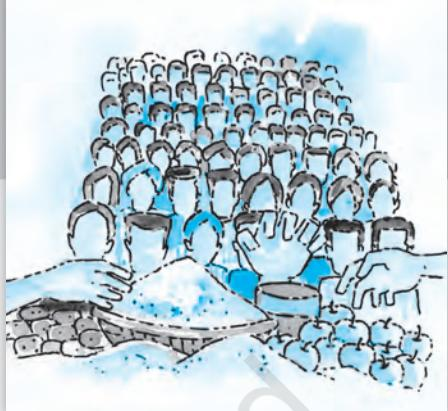
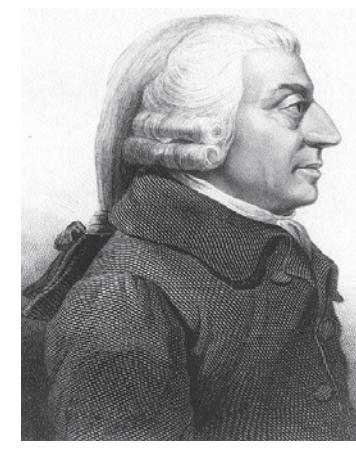
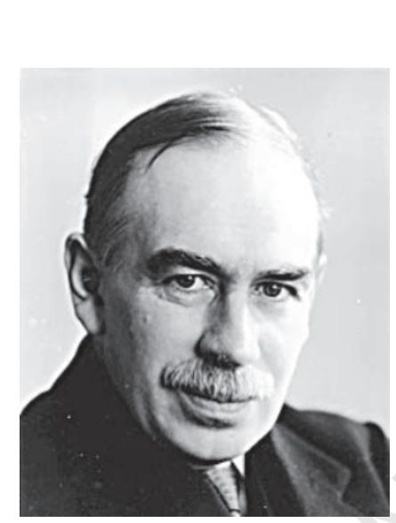
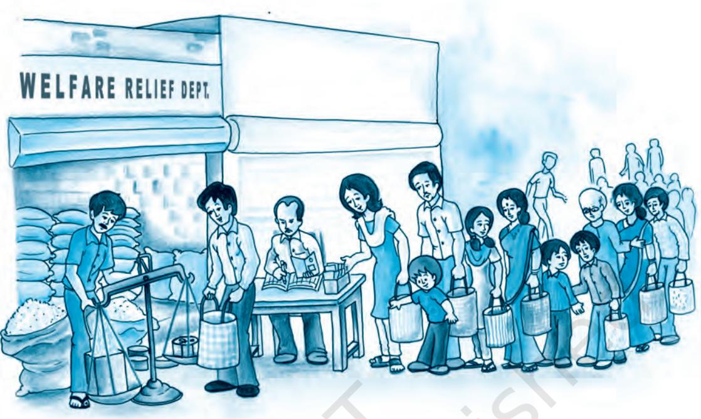

IntroductionIntroduction Introduction

You must have already been introduced to a study of basic microeconomics. This chapter begins by giving you a simplified account of how macroeconomics differs from the microeconomics that you have known.

Those of you who will choose later to specialise in economics, for your higher studies, will know about the more complex analyses that are used by economists to study macroeconomics today. But the basic questions of the study of macroeconomics would remain the same and you will find that these are actually the broad economic questions that concern all citizens – Will the prices as a whole rise or come down? Is the employment condition of the country as a whole, or of some sectors of the economy, getting better or is it worsening? What would be reasonable indicators to show that the economy is better or worse? What steps, if any, can the State take, or the people ask for, in order to improve the state of the economy? These are the kind of questions that make us think about the health of the country's economy as a whole. These questions are dealt within macroeconomics at different levels of complexity.

In this book you will be introduced to some of the basic principles of macroeconomic analysis. The principles will be stated, as far as possible, in simple language. Sometimes elementary algebra will be used in the treatment for introducing the reader to some rigour.

If we observe the economy of a country as a whole it will appear that the output levels of all the goods and services in the economy have a tendency to move together. For example, if output of food grain is experiencing a growth, it is generally accompanied by a rise in the output level of industrial goods. Within the category of industrial goods also output of different kinds of goods tend to rise or fall simultaneously. Similarly, prices of different goods and services generally have a tendency to rise or fall simultaneously. We can also observe that the employment level in different production units also goes up or down together.

If aggregate output level, price level, or employment level, in the different production units of an economy,

# Chapter 1

bear close relationship to each other then the task of analysing the entire economy becomes relatively easy. Instead of dealing with the above mentioned variables at individual (disaggregated) levels, we can think of a single good as the representative of all the goods and services produced within the economy. This representative good will have a level of production which will correspond to the average production level of all the goods and services. Similarly, the price or employment level of this representative good will reflect the general price and employment level of the economy.

In macroeconomics we usually simplify the analysis of how the country's total production and the level of employment are related to attributes (called 'variables') like prices, rate of interest, wage rates, profits and so on, by focusing on a single imaginary commodity and what happens to it. We are able to afford this simplification and thus usefully abstain from studying what happens to the many real commodities that actually are bought and sold in the market because we generally see that what happens to the prices, interests, wages and profits etc. for one commodity more or less also happens for the others. Particularly, when these attributes start changing fast, like when prices are going up (in what is called an inflation), or employment and production levels are going down (heading for a depression), the general directions of the movements of these variables for all the individual commodities are usually of the same kind as are seen for the aggregates for the economy as a whole.

We will see below why, sometimes, we also depart from this useful simplification when we realise that the country's economy as a whole may best be seen as composed of distinct sectors. For certain purposes the interdependence of (or even rivalry between) two sectors of the economy (agriculture and industry, for example) or the relationships between sectors (like the household sector, the business sector and government in a democratic set-up) help us understand some things happening to the country's economy much better, than by only looking at the economy as a whole.

While moving away from different goods and focusing on a representative good may be convenient, in the process, we may be overlooking some vital distinctive characteristics of individual goods. For example, production conditions of agricultural and industrial commodities are of a different nature. Or, if we treat a single category of labour as a representative of all kinds of labours, we may be unable to distinguish the labour of the manager of a firm from the labour of the accountant of the firm. So, in many cases, instead of a single representative category of good (or labour, or production technology), we may take a handful of different kinds of goods. For example, three general kinds of commodities may be taken as a representative of all commodities being produced within the economy: agricultural goods, industrial goods and services. These goods may have different production technology and different prices. Macroeconomics also tries to analyse how the individual output levels, prices, and employment levels of these different goods gets determined.

From this discussion here, and your earlier reading of microeconomics, you may have already begun to understand in what way macroeconomics differs from microeconomics. To recapitulate briefly, in microeconomics, you came across individual 'economic agents' (see box) and the nature of the motivations that drive them. They were 'micro' (meaning 'small') agents – consumers choosing their respective optimum combinations of goods to buy, given their tastes and incomes; and producers trying to make maximum profit out of producing their goods keeping their costs as low as possible and selling at a price as high as they could get in the markets. In other words, microeconomics was a study of individual markets of demand and supply and the 'players', or the decision-makers, were also individuals (buyers or sellers, even companies) who were seen as trying to maximise their profits (as producers or sellers) and their personal satisfaction or welfare levels (as consumers). Even a large company was 'micro' in the sense that it had to act in the interest of its own shareholders which was not necessarily the interest of the country as a whole. For microeconomics the 'macro' (meaning 'large') phenomena affecting the economy as a whole, like inflation or unemployment, were either not mentioned or were taken as given. These were not variables that individual buyers or sellers could change. The nearest that microeconomics got to macroeconomics was when it looked at General Equilibrium, meaning the equilibrium of supply and demand in each market in the economy.

#### Economic Agents

By economic units or economic agents, we mean those individuals or institutions which take economic decisions. They can be consumers who decide what and how much to consume. They may be producers of goods and services who decide what and how much to produce. They may be entities like the government, corporation, banks which also take different economic decisions like how much to spend, what interest rate to charge on the credits, how much to tax, etc.

3

Introduction

Macroeconomics tries to address situations facing the economy as a whole. Adam Smith, the founding father of modern economics, had suggested that if the buyers and sellers in each market take their decisions following only their own self-interest, economists will not need to think of the wealth and welfare of the country as a whole separately. But economists gradually discovered that they had to look further.

Economists found that first, in some cases, the markets did not or could not exist. Secondly, in some other cases, the markets existed but failed to produce equilibrium of demand and supply. Thirdly, and most importantly, in a large number of situations society (or the State, or the people as a whole) had decided to pursue certain important social goals unselfishly (in areas like employment, administration, defence, education and health) for which some of the aggregate effects of the microeconomic decisions made by the individual economic agents needed to be modified. For these purposes macroeconomists had to study the effects in the markets of taxation and other budgetary policies, and policies for bringing about changes in money supply, the rate of interest, wages, employment, and output. Macroeconomics has,

### Adam Smith

Adam Smith is regarded as the founding father of modern economics (it was known as political economy at that time). He was a Scotsman and a professor at the University of Glasgow. Philosopher by training, his well known work *An Enquiry into the Nature and Cause of the Wealth of Nations* (1776) is regarded as the first major comprehensive book on the subject. The passage from the book. 'It is not from the benevolence of the butcher, the brewer, of the baker, that we expect our dinner, but from their regard to their own interest. We address ourselves, not to their

humanity but to their self-love, and never talk to them of our own necessities but of their advantage' is often cited as an advocacy for free market economy. The Physiocrats of France were prominent thinkers of political economy before Smith.

therefore, deep roots in microeconomics because it has to study the aggregate effects of the forces of demand and supply in the markets. However, in addition, it has to deal with policies aimed at also modifying these forces, if necessary, to follow choices made by society outside the markets. In a developing country like India such choices have to be made to remove or reduce unemployment, to improve access to education and primary health care for all, to provide for good administration, to provide sufficiently for the defence of the country and so on. Macroeconomics shows two simple characteristics that are evident in dealing with the situations we have just listed. These are briefly mentioned below.

First, who are the macroeconomic decision makers (or 'players')? Macroeconomic policies are pursued by the State itself or statutory bodies like the Reserve Bank of India (RBI), Securities and Exchange Board of India (SEBI) and similar institutions. Typically, each such body will have one or more public goals to pursue as defined by law or the Constitution of India itself. These goals are not those of individual economic agents maximising their private profit or welfare. Thus the macroeconomic agents are basically different from the individual decision-makers.

Secondly, what do the macroeconomic decision-makers try to do? Obviously they often have to go beyond economic objectives and try to direct the deployment of economic resources for such public needs as we have listed above. Such activities are not aimed at serving individual self-interests. They are pursued for the welfare of the country and its people as a whole.

## 1.1 EMERGENCE OF MACROECONOMICS

Macroeconomics, as a separate branch of economics, emerged after the British economist John Maynard Keynes published his celebrated book *The General Theory of Employment, Interest and Money* in 1936. The dominant thinking in economics before Keynes was that all the labourers who are ready to work will find employment and all the factories will be working at their full capacity. This school of thought is known as the classical tradition.

### John Maynard Keynes

John Maynard Keynes, British economist, was born in 1883. He was educated in King's College, Cambridge, United Kingdom and later appointed its Dean. Apart from being a sharp intellectual he actively involved in international diplomacy during the years following the First World War. He prophesied the break down of the peace agreement of the War in the book *The Economic Consequences of the Peace* (1919). His book *General Theory of Employment, Interest and Money* (1936) is regarded as one of the most

5

Introduction

influential economics books of the twentieth century. He was also a shrewd foreign currency speculator.

However, the Great Depression of 1929 and the subsequent years saw the output and employment levels in the countries of Europe and North America fall by huge amounts. It affected other countries of the world as well. Demand for goods in the market was low, many factories were lying idle, workers were thrown out of jobs. In USA, from 1929 to 1933, unemployment rate rose from 3 per cent to 25 per cent (unemployment rate may be defined as the number of people who are not working and are looking for jobs divided by the total number of people who are working or looking for jobs). Over the same period aggregate output in USA fell by about 33 per cent. These events made economists think about the functioning of the economy in a new way. The fact that the economy may have long lasting unemployment had to be theorised about and explained. Keynes' book was an attempt in this direction. Unlike his predecessors, his approach was to examine the working of the economy in its entirety and examine the interdependence of the different sectors. The subject of macroeconomics was born.

## 1.2 CONTEXT OF THE PRESENT BOOK OF MACROECONOMICS

We must remember that the subject under study has a particular historical context. We shall examine the working of the economy of a capitalist country in this book. In a capitalist country production activities are mainly carried out by capitalist enterprises. A typical capitalist enterprise has one or several entrepreneurs (people who exercise control over major decisions and bear a large part of the risk associated with the firm/enterprise). They may themselves supply the capital needed to run the enterprise, or they may borrow the capital. To carry out production they also need natural resources – a part consumed in the process of production (e.g. raw materials) and a part fixed (e.g. plots of land). And they need the most important element of human labour to carry out production. This we shall refer to as labour. After producing output with the help of these three factors of production, namely capital, land and labour, the entrepreneur sells the product in the market. The money that is earned is called revenue. Part of the revenue is paid out as rent for the service rendered by land, part of it is paid to capital as interest and part of it goes to labour as wages. The rest of the revenue is the earning of the entrepreneurs and it is called profit. Profits are often used by the producers in the next period to buy new machinery or to build new factories, so that production can be expanded. These expenses which raise productive capacity are examples of investment expenditure.

In short, a capitalist economy can be defined as an economy in which most of the economic activities have the following characteristics (a) there is private ownership of means of production (b) production takes place for selling the output in the market (c) there is sale and purchase of labour services at a price which is called the wage rate (the labour which is sold and purchased against wages is referred to as wage labour).

If we apply the above mentioned four criteria to the countries of the world we would find that capitalist countries have come into being only during the last three to four hundred years. Moreover, strictly speaking, even at present, a handful of countries in North America, Europe and Asia will qualify as capitalist countries. In many underdeveloped countries production (in agriculture especially) is carried out by peasant families. Wage labour is seldom used and most of the labour is performed by the family members themselves. Production is not solely for the market; a great part of it is consumed by the family. Neither do many peasant farms experience significant rise in capital stock over time. In many tribal societies the ownership of land does not exist; the land may belong to the whole tribe. In such societies the analysis that we shall present in this book will not be applicable. It is, however, true that many developing countries have a significant presence of production units which are organised according to capitalist principles. The production units will be called firms in this book. In a firm the entrepreneur (or entrepreneurs) is at the helm of affairs. She hires wage labour from the market, she employs the services of capital and land as well. After hiring these inputs she undertakes the task of production. Her motive for producing goods and services (referred to as output) is to sell them in the market and earn profits. In the process she undertakes risks and uncertainties. For example, she may not get a high enough price for the goods she is producing; this may lead to fall in the profits that she earns. It is to be noted that in a capitalist country the factors of production earn their incomes through the process of production and sale of the resultant output in the market.

In both the developed and developing countries, apart from the private capitalist sector, there is the institution of State. The role of the state includes framing laws, enforcing them and delivering justice. The state, in many instances, undertakes production – apart from imposing taxes and spending money on building public infrastructure, running schools, colleges, providing health services etc. These economic functions of the state have to be taken into account when we want to describe the economy of the country. For convenience we shall use the term "Government" to denote state.

7

Introduction

Apart from the firms and the government, there is another major sector in an economy which is called the household sector. By a household we mean a single individual who takes decisions relating to her own consumption, or a group of individuals for whom decisions relating to consumption are jointly determined. Households also save and pay taxes. How do they get the money for these activities? We must remember that the households consist of people. These people work in firms as workers and earn wages. They are the ones who work in the government departments and earn salaries, or they are the owners of firms and earn profits. Indeed the market in which the firms sell their products could not have been functioning without the demand coming from the households. Moreover, they can also earn rent by leasing land or earn interest by lending capital.

So far we have described the major players in the domestic economy. But all the countries of the world are also engaged in external trade. The external sector is the fourth important sector in our study. Trade with the external sector can be of two kinds

- 1. The domestic country may sell goods to the rest of the world. These are called exports.
- 2. The economy may also buy goods from the rest of the world. These are called imports. Besides exports and imports, the rest of the world affects the domestic economy in other ways as well.
- 3. Capital from foreign countries may flow into the domestic country, or the domestic country may be exporting capital to foreign countries.

Macroeconomics deals with the aggregate economic variables of an economy. It also takes into account various interlinkages which may exist between the different sectors of an economy. This is what distinguishes it from microeconomics; which mostly examines the functioning of the particular sectors of the economy, assuming that the rest of the economy remains the same. Macroeconomics emerged as a separate subject in the 1930s due to Keynes. The Great Depression, which dealt a blow to the economies of developed countries, had provided Keynes with the inspiration for his writings. In this book we shall mostly deal with the working of a capitalist economy. Hence it may not be entirely able to capture the functioning of a developing country. Macroeconomics sees an economy as a combination of four sectors, namely households, firms, government and external sector.

Rate of interest Wage rate Profits Economic agents or units Great Depression Unemployment rate Four factors of production Means of production Inputs Land Labour Capital Entrepreneurship Investment expenditure Wage labour Capitalist country or capitalist economy Firms Capitalist firms Output Households Government External sector Exports Imports

- 1. What is the difference between microeconomics and macroeconomics?
- 2. What are the important features of a capitalist economy?
- 3. Describe the four major sectors in an economy according to the macroeconomic point of view.
- 4. Describe the Great Depression of 1929.

#### Suggested Readings

- 1. Bhaduri, A., 1990. *Macroeconomics: The Dynamics of Commodity Production*, pages 1 – 27, Macmillan India Limited, New Delhi.
- 2. Mankiw, N. G., 2000. *Macroeconomics*, pages 2 14, Macmillan Worth Publishers, New York.

?

?

Exercises

ExercisesExercises

Key Concepts

ey Conceptsey Concepts

?

?

