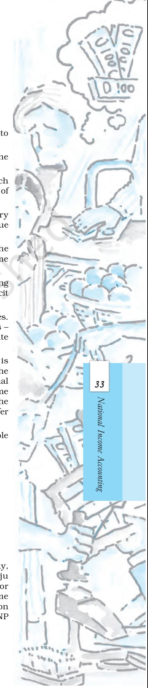

# National Income Accounting

In this chapter we will introduce the fundamental functioning of a simple economy. In section 2.1 we describe some primary ideas we shall work with. In section 2.2 we describe how we can view the aggregate income of the entire economy going through the sectors of the economy in a circular way. The same section also deals with the three ways to calculate the national income; namely product method, expenditure method and income method. The last section 2.3 describes the various sub-categories of national income. It also defines different price indices like GDP deflator, Consumer Price Index, Wholesale Price Indices and discusses the problems associated with taking GDP of a country as an indicator of the aggregate welfare of the people of the country.

## 2.1 SOME BASIC CONCEPTS OF MACROECONOMICS

One of the pioneers of the subject we call in economics today, Adam Smith, named his most influential work–*An Enquiry into the Nature and Cause of the Wealth of Nations.* What generates the economic wealth of a nation? What makes countries rich or poor? These are some of the central questions of economics. It is not that countries which are endowed with a bounty of natural wealth – minerals or forests or the most fertile lands – are naturally the richest countries. In fact the resource rich Africa and Latin America have some of the poorest countries in the world, whereas many prosperous countries have scarcely any natural wealth. There was a time when possession of natural resources was the most important consideration but even then the resource had to be transformed through a production process.

The economic wealth, or well-being, of a country thus does not necessarily depend on the mere possession of resources; the point is how these resources are used in generating a flow of production and how, as a consequence, income and wealth are generated from that process.

Let us now dwell upon this flow of production. How does this flow of production arise? People combine their energies with natural and manmade environment within a certain social and technological structure to generate a flow of production.

In our modern economic setting this flow of production arises out of production of commodities – goods and services by millions of enterprises large and small. These enterprises range from giant

corporations employing a large number of people to single entrepreneur enterprises. But what happens to these commodities after being produced? Each producer of commodities intends to sell her output. So from the smallest items like pins or buttons to the largest ones like aeroplanes, automobiles, giant machinery or any saleable service like that of the doctor, the lawyer or the financial consultant–the goods and services produced are to be sold to the consumers. The consumer may, in turn, be an individual or an enterprise and the good or service purchased by that entity might be for final use or for use in further production. When it is used in further production it often loses its characteristic as that specific good and is transformed through a productive process into another good. Thus a farmer producing cotton sells it to a spinning mill where the raw cotton undergoes transformation to yarn; the yarn is, in turn, sold to a textile mill where, through the productive process, it is transformed into cloth; the cloth is, in turn, transformed through another productive process into an article of clothing which is then ready to be sold finally to the consumers for final use. Such an item that is meant for final use and will not pass through any more stages of production or transformations is called a final good.

Why do we call this a final good? Because once it has been sold it passes out of the active economic flow. It will not undergo any further transformation at the hands of any producer. It may, however, undergo transformation by the action of the ultimate purchaser. In fact many such final goods are transformed during their consumption. Thus the tea leaves purchased by the consumer are not consumed in that form – they are used to make drinkable tea, which is consumed. Similarly most of the items that enter our kitchen are transformed through the process of cooking. But cooking at home is not an economic activity, even though the product involved undergoes transformation. Home cooked food is not sold to the market. However, if the same cooking or tea brewing was done in a restaurant where the cooked product would be sold to customers, then the same items, such as tea leaves, would cease to be final goods and would be counted as inputs to which economic value addition can take place. Thus it is not in the nature of the good but in the economic nature of its use that a good becomes a final good.

Of the final goods, we can distinguish between consumption goods and capital goods. Goods like food and clothing, and services like recreation that are consumed when purchased by their ultimate consumers are called consumption goods or consumer goods. (This also includes services which are consumed but for convenience we may refer to them as consumer goods.)

Then there are other goods that are of durable character which are used in the production process. These are tools, implements and machines. While they make production of other commodities feasible, they themselves don't get transformed in the production process. They are also final goods yet they are not final goods to be ultimately consumed. Unlike the final goods that we have considered above, they are the crucial backbone of any production process, in aiding and enabling the production to take place. These goods form a part of capital, one of the crucial factors of production in which a productive enterprise has invested, and they continue to enable the production process to go on for continuous cycles of production. These are capital goods and they gradually undergo wear and tear, and thus are repaired or gradually replaced over time. The stock of capital that an economy possesses is thus preserved, maintained and renewed partially or wholly over time and this is of some importance in the discussion that will follow.

We may note here that some commodities like television sets, automobiles or home computers, although they are for ultimate consumption, have one characteristic in common with capital goods – they are also durable. That is, they are not extinguished by immediate or even short period consumption; they have a relatively long life as compared to articles such as food or even clothing. They also undergo wear and tear with gradual use and often need repairs and replacements of parts, i.e., like machines they also need to be preserved, maintained and renewed. That is why we call these goods consumer durables.

Thus if we consider all the final goods and services produced in an economy in a given period of time they are either in the form of consumption goods (both durable and non-durable) or capital goods. As final goods they do not undergo any further transformation in the economic process.

Of the total production taking place in the economy a large number of products don't end up in final consumption and are not capital goods either. Such goods may be used by other producers as material inputs. Examples are steel sheets used for making automobiles and copper used for making utensils. These are intermediate goods, mostly used as raw material or inputs for production of other commodities. *These are not final goods*.

Now, to have a comprehensive idea of the total flow of production in the economy, we need to have a quantitative measure of the aggregate level of final goods produced in the economy. However, in order to get a quantitative assessment – a measure of the total final goods and services produced in the economy – it is obvious that we need a *common measuring rod*. We cannot add metres of cloth produced to tonnes of rice or number of automobiles or machines. Our common measuring rod is money. Since each of these commodities is produced for sale, *the sum total of the monetary value of these diverse commodities gives us a measure of final output*. But why are we to measure final goods only? Surely intermediate goods are crucial inputs to any production process and a significant part of our manpower and capital stock are engaged in production of these goods. However, since we are dealing with value of output, we should realise that the value of the final goods already includes the value of the intermediate goods that have entered into their production as inputs. Counting them separately will lead to the error of *double counting*. Whereas considering intermediate goods may give a fuller description of total economic activity, counting them will highly exaggerate the final value of our economic activity.

At this stage it is important to introduce the concepts of stocks and flows. Often we hear statements like the average salary of someone is Rs 10,000 or the output of the steel industry is so many tonnes or so many rupees in value. But these are incomplete statements because it is not clear whether the income which is being referred to is yearly or monthly or daily income and surely that makes a huge difference. Sometimes, when the context is familiar, we assume that the time period is known and therefore do not mention it. But inherent in all such statements is a definite period of time. Otherwise such statements are meaningless. Thus income, or output, or profits are concepts that make sense only when a time period is specified. These are called flows because they occur in a period of time. Therefore we need to delineate a time period to get a quantitative measure of these. Since a lot of accounting is done annually in an economy, many of these are expressed annually like annual profits or production. Flows are defined over a period of time.

11National Income Accounting

In contrast, capital goods or consumer durables once produced do not wear out or get consumed in a delineated time period. In fact capital goods continue to serve us through different cycles of production. The buildings or machines in a factory are there irrespective of the specific time period. There can be addition to, or deduction from, these if a new machine is added or a machine falls in disuse and is not replaced. These are called stocks. *Stocks are defined at a particular point of time*. However we can measure a *change in stock* over a specific period of time like how many machines were added this year. Such changes in stocks are thus flows, which can be measured over specific time periods. A particular machine can be part of the capital stock for many years (unless it wears out); but that machine can be part of the flow of new machines added to the capital stock only for a single year when it was initially installed.

To further understand the difference between stock variables and flow variables, let us take the following example. Suppose a tank is being filled with water coming from a tap. The amount of water which is flowing into the tank from the tap per minute is a flow. But how much water there is in the tank at a particular point of time is a stock concept.

To come back to our discussion on the measure of final output, that part of our final output that comprises of capital goods constitutes gross investment of an economy1 . These may be machines, tools and implements; buildings, office spaces, storehouses or infrastructure like roads, bridges, airports or jetties. But all the capital goods produced in a year do not constitute an addition to the capital stock already existing. A significant part of current output of capital goods goes in maintaining or replacing part of the existing stock of capital goods. This is because the already existing capital stock suffers wear and tear and needs maintenance and replacement. A part of the capital goods produced this year goes for replacement of existing capital goods and is not an addition to the stock of capital goods already existing and its value needs to be subtracted from gross investment for arriving at the measure for net investment. This deletion, which is made from the value of gross investment in order to accommodate regular wear and tear of capital, is called depreciation.

So new addition to capital stock in an economy is measured by net investment or new capital formation, which is expressed as

#### *Net Investment = Gross investment – Depreciation*

Let us examine this concept called depreciation a little more in detail. Let us consider a new machine that a firm invests in. This machine may be in service for the next twenty years after which it falls into disrepair and needs to be replaced. We can now imagine as if the machine is being gradually used up in each year's production process and each year one twentieth of its original value is getting depreciated. So, instead of considering a bulk investment for replacement after twenty years, we consider an annual depreciation cost every year. This is the usual sense in which the term depreciation is used and inherent in its conception is the expected life of a particular capital good, like twenty years in our example of the machine. Depreciation is thus an annual allowance for wear and tear of a

1This is how economists define investment. This must not be confused with the commonplace notion of investment which implies using money to buy physical or financial assets. Thus use of the term investment to denote purchase of shares or property or even having an insurance policy has nothing to do with how economists define investment. Investment for us is always capital formation, a gross or net addition to capital stock.

capital good.2 In other words it is the cost of the good divided by number of years of its useful life.3

Notice here that depreciation is an accounting concept. No real expenditure may have actually been incurred each year yet depreciation is annually accounted for. In an economy with thousands of enterprises with widely varying periods of life of their equipment, in any particular year, some enterprises are actually making the bulk replacement spending. Thus, we can realistically assume that there will be a steady flow of actual replacement spending which will more or less match the amount of annual depreciation being accounted for in that economy.

Now if we go back to our discussion of total final output produced in an economy, we see that there is output of consumer goods and services and output of capital goods. The consumer goods sustain the consumption of the entire population of the economy. Purchase of consumer goods depends on the capacity of the people to spend on these goods which, in turn, depends on their income. The other part of the final goods, the capital goods, are purchased by business enterprises. They are used either for maintenance of the capital stock because there are wear and tear of it, or they are used for addition to their capital stock. In a specific time period, say in a year, thetotal production of final goods can thus be either in the form of consumption or investment. This implies that there is a trade-off. If an economy, produces more of consumer goods, it is producing less of capital goods and viceversa.

It is generally observed that more sophisticated and heavy capital goods raise the ability of a labourer to produce goods. The traditional weaver would take months to weave a sari but with modern machinery thousands of pieces of clothing are produced in a day. Decades were taken to construct the great historical monuments like the Pyramids or the Taj Mahal but with modern construction machinery one can build a skyscraper in a few years. More production of newer varities of capital goods therefore would help in the greater production of consumer goods.

But aren't we contradicting ourselves? Earlier we have seen how, of the total output of final goods of an economy, if a larger share goes for production of capital goods, a smaller share is available for production of consumer goods. And now we are saving more capital goods would mean more consumer goods. There is no contradiction here however. What is important here is the element of time. At a *particular period*, given a level of total output of the economy, it is true if more capital goods are produced less of consumer goods would be produced. But production of more capital goods would mean that in *future* the labourers would have more capital equipments to work with. We have seen that this leads to a higher capacity of the economy to produce with the same number of labourers. Thus total input itself would be higher compared to the case when less capital goods were produced. If total output is higher the amount of consumer goods that can be produced would surely be higher.

3We are making a rather simple assumption here that there is a constant rate of depreciation based on the original value of the asset. There can be other methods to calculate depreciation in actual practice.

2Depreciation does not take into account unexpected or sudden destruction or disuse of capital as can happen with accidents, natural calamities or other such extraneous circumstances.

Thus the economic cycle not only rolls on, higher production of capital goods enables the economy to expand. It is possible to find another view of the circular flow in the discussion we have made so far.

Since we are dealing with all goods and services that are produced for the market, the crucial factor enabling such sale is demand for such products backed by purchasing power. One must have the necessary ability to purchase commodities. Otherwise one's need for commodities does not get recognised by the market.

We have already discussed above that one's ability to buy commodities comes from the income one earns as labourer (earning wages), or as entrepreneur (earning profits), or as landlord (earning rents), or as owner of capital (earning interests). In short, the incomes that people earn as owners of factors of production are used by them to meet their demand for goods and services.

So we can see a circular flow here which is facilitated through the market. Simply put, the firms' demand for factors of production to run the production process creates payments to the public. In turn, the public's demand for goods and services creates payments to the firms and enables the sale of the products they produce.

So the social act of consumption and production are intricately linked and, in fact, there is a circular causation here. The process of production in an economy generates factor payments for those involved in production and generates goods and services as the outcome of the production process. The incomes so generated create the capacity to purchase the final consumption goods and thus enable their sale by the business enterprises, the basic object of their production. The capital goods which are also generated in the production process also enable their producers to earn income – wages, profits etc. in a similar manner. The capital goods add to, or maintain, the capital stock of an economy and thus make production of other commodities possible.

## 2.2 CIRCULAR FLOW OF INCOME AND METHODS OF CALCULATING NATIONAL INCOME

The description of the economy in the previous section enables us to have a rough idea of how a simple economy – without a government, external trade or any savings – may function. The households receive their payments from the firms for productive activities they perform for the latter. As we have mentioned before, there may fundamentally be four kinds of contributions that can be made during the production of goods and services (a) contribution made by human labour, remuneration for which is called wage (b) contribution made by capital, remuneration for which is called interest (c) contribution made by entrepreneurship, remuneration of which is profit (d) contribution made by fixed natural resources (called 'land'), remuneration for which is called rent.

In this simplified economy, there is only one way in which the households may dispose off their earnings – by spending their entire income on the goods and services produced by the domestic firms. The other channels of disposing their income are closed: we have assumed that the households do not save, they do not pay taxes to the government – since there is no government, and neither do they buy imported goods since there is no external trade in this simple economy. In other words, factors of production use their remunerations to buy the goods and services which they assisted in producing. The aggregate consumption by the households of the economy is equal to the aggregate expenditure on goods and services produced by the firms in the economy. The entire income of the economy, therefore, comes back to the producers in the form of sales revenue. There is no leakage from the system – there is no difference between the amount that the firms had distributed in the form of factor payments (which is the sum total of remunerations earned by the four factors of production) and the aggregate consumption expenditure that they receive as sales revenue.

*Fig. 2.1: Circular Flow of Income in a Simple Economy*

remunerations to the factors of production. These remunerations will once again be used to buy the goods and services. Hence year after year we can imagine the aggregate income of the economy going through the two sectors, firms and households, in a circular way. This is represented in Fig. 2.1. When the income is being spent on the goods and services produced by the firms, it takes the form of *aggregate expenditure* received by the firms. Since the value of expenditure must be equal to the value of goods and services, we can equivalently measure the aggregate income by *"calculating the aggregate value of goods and services produced by the firms"*. When the aggregate revenue received by the firms is paid out to the factors of production it takes the form of aggregate income.

In Fig. 2.1, the uppermost arrow, going from the households to the firms, represents the spending the households undertake to buy goods and services produced by the firms. The second arrow going from the firms to the households is the counterpart of the arrow above. It stands for the goods and services which are flowing from the firms to the households. In other words, this flow is what the households are getting from the firms, for which they are making the expenditures. In short, the two arrows on the top represent the goods and services market – the arrow above represents the flow of payments for the goods and services, the arrow below represents the flow of goods and services. The two arrows at the bottom of the diagram similarly represent the factors of production market. The lower most arrow going from the households to the firms symbolises the services that the households are rendering to the firms. Using these services the firms are manufacturing the output. The arrow above this, going from the firms to the households, represents the payments made by the firms to the households for the services provided by the latter.

Since the same amount of money, representing the aggregate value of goods and services, is moving in a circular way, if we want to estimate the aggregate value of goods and services produced during a year we can measure the annual value of the flows at any of the dotted lines indicated in the diagram. We can measure the uppermost flow (at point A) by measuring the aggregate value of spending that the firms receive for the final goods and services which they produce. This method will be called the expenditure method. If we measure the flow at B by measuring the aggregate value of final goods and services produced by all

the firms, it will be called product method. At C, measuring the sum total of all factor payments will be called income method.

Observe that the aggregate spending of the economy must be equal to the aggregate income earned by the factors of production (the flows are equal at A and C). Now let us suppose that at a particular period of time the households decide to spend more on the goods and services produced by the firms. For the time being let us ignore the question where they would find the money to finance that extra spending since they are already spending all of their income (they may have borrowed the money to finance the additional spending). Now if they spend more on the goods and services, the firms will produce more goods and services to meet this extra demand. Since they will produce more, the firms must also pay the factors of production extra remunerations. How much extra amount of money will the firms pay? The additional factor payments must be equal to the value of the additional goods and services that are being produced. Thus the households will eventually get the extra earnings required to support the initial additional spending that they had undertaken. In other words, the households can decide to spend more – spend beyond their means. And in the end their income will rise exactly by the amount which is necessary to carry out the extra spending. Putting it differently, an economy may decide to spend more than the present level of income. But by doing so, its income will eventually rise to a level consistent with the higher spending level. This may seem a little paradoxical at first. But since income is moving in a circular fashion, it is not difficult to figure out that a rise in the flow at one point must eventually lead to a rise in the flow at all levels. This is one more example of how the functioning of a single economic agent (say, a household) may differ from the functioning of the economy as a whole. In the former the spending gets restricted by the individual income of a household. It can never happen that a single worker decides to spend more and this leads to an equivalent rise in her income. We shall spend more time on how higher aggregate spending leads to change in aggregate income in a later chapter.

The above mentioned sketchy illustration of an economy is admittedly a simplified one. Such a story which describes the functioning of an imaginary economy is called a macroeconomic model. It is clear that a model does not describe an actual economy in detail. For example, our model assumes that households do not save, there is no government, no trade with other countries. However models do not want to capture an economy in its every minute detail – their purpose is to highlight some essential features of the functioning of an economic system. But one has to be cautious not to simplify the matters in such a way that misrepresents the essential nature of the economy. The subject of economics is full of models, many of which will be presented in this book. One task of an economist is to figure out which model is applicable to which real life situation.

If we change our simple model described above and introduce savings, will it change the principal conclusion that the aggregate estimate of the income of the economy will remain the same whether we decide to calculate it at A, B or C? It turns out that this conclusion does not change in a fundamental way. No matter how complicated an economic system may be, the annual production of goods and services estimated through each of the three methods is the same.

We have seen that the aggregate value of goods and services produced in an economy can be calculated by three methods. We now discuss the detailed steps of these calculations.

### 2.2.1 The Product or Value Added Method

In product method we calculate the aggregate annual value of goods and services produced (if a year is the unit of time). How to go about doing this? Do we add up the value of all goods and services produced by all the firms in an economy? The following example will help us to understand.

Let us suppose that there are only two kinds of producers in the economy. They are the wheat producers (or the farmers) and the bread makers (the bakers). The wheat producers grow wheat and they do not need any input other than human labour. They sell a part of the wheat to the bakers. The bakers do not need any other raw materials besides wheat to produce bread. Let us suppose that in a year the total value of wheat that the farmers have produced is Rs 100. Out of this they have sold Rs 50 worth of wheat to the bakers. The bakers have used this amount of wheat completely during the year and have produced Rs 200 worth of bread. What is the value of total production in the economy? If we follow the simple way of aggregating the values of production of the sectors, we would add Rs 200 (value of production of the bakers) to Rs 100 (value of production of farmers). The result will be Rs 300.

A little reflection will tell us that the value of aggregate production is not Rs 300. The farmers had produced Rs 100 worth of wheat for which it did not need assistance of any inputs. Therefore the entire Rs 100 is rightfully the contribution of the farmers. But the same is not true for the bakers. The bakers had to buy Rs 50 worth of wheat to produce their bread. The Rs 200 worth of bread that they have produced is not entirely their own contribution. To calculate the net contribution of the bakers, we need to subtract the value of the wheat that they have bought from the farmers. If we do not do this we shall commit the mistake of 'double counting'. This is because Rs 50 worth of wheat will be counted twice. First it will be counted as part of the output produced by the farmers. Second time, it will be counted as the imputed value of wheat in the bread produced by the bakers.

Therefore, the net contribution made by the bakers is, Rs 200 – Rs 50 = Rs 150. Hence, aggregate value of goods produced by this simple economy is Rs 100 (net contribution by the farmers) + Rs 150 (net contribution by the bakers) = Rs 250.

The term that is used to denote the net contribution made by a firm is called its value added. We have seen that the raw materials that a firm buys from another firm which are completely used up in the process of production are called 'intermediate goods'. Therefore the value added of a firm is, *value of production of the*

*firm – value of intermediate goods used by the firm*. The value added of a firm is distributed among its four factors of production, namely, labour, capital,

Table 2.1: Production, Intermediate Goods and Value Added

|  | Farmer | Baker |
| --- | --- | --- |
| Total production | 100 | 200 |
| Intermediate goods used | 0 | 50 |
| Value added | 100 | 200 – 50 =150 |

entrepreneurship and land. Therefore wages, interest, profits and rents paid out by the firm must add up to the value added of the firm. Value added is a flow variable.

We can represent the example given above in terms of Table 2.1.

17

National Income Accounting

Here all the variables are expressed in terms of money. We can think of the market prices of the goods being used to evaluate the different variables listed here. And we can introduce more players in the chain of production in the example and make it more realistic and complicated. For example, the farmer may be using fertilisers or pesticides to produce wheat. The value of these inputs will have to be deducted from the value of output of wheat. Or the bakers may be selling the bread to a restaurant whose value added will have to be calculated by subtracting the value of intermediate goods (bread in this case).

We have already introduced the concept of depreciation, which is also known as consumption of fixed capital. Since the capital which is used to carry out production undergoes wear and tear, the producer has to undertake replacement investments to keep the value of capital constant. The replacement investment is same as depreciation of capital. If we include depreciation in value added then the measure of value added that we obtain is called Gross Value Added. If we deduct the value of depreciation from gross value added we obtain Net Value Added. Unlike gross value added, net value added does not include wear and tear that capital has undergone. For example, let us say a firm produces Rs 100 worth of goods per year, Rs 20 is the value of intermediate goods used by it during the year and Rs 10 is the value of capital consumption. The gross value added of the firm will be, Rs 100 – Rs 20 = Rs 80 per year. The net value added will be, Rs 100 – Rs 20 – Rs 10 = Rs 70 per year.

It is to be noted that while calculating the value added we are taking the *value of production* of firm. But a firm may be unable to sell all of its produce. In such a case it will have some unsold stock at the end of the year. Conversely, it may so happen that a firm had some initial unsold stock to begin with. During the year that follows it has produced very little. But it has met the demand in the market by selling from the stock it had at the beginning of the year. How shall we treat these stocks which a firm may intentionally or unintentionally carry with itself? Also, let us remember that a firm buys raw materials from other firms. The part of raw material which gets used up is categorised as an intermediate good. What happens to the part which does not get used up?

In economics, the stock of unsold finished goods, or semi-finished goods, or raw materials which a firm carries from one year to the next is called inventory. Inventory is a stock variable. It may have a value at the beginning of the year; it may have a higher value at the end of the year. In such a case inventories have increased (or accumulated). If the value of inventories is less at the end of the year compared to the beginning of the year, inventories have decreased (decumulated). We can therefore infer that the *change of inventories of a firm during a year* ≡ *production of the firm during the year – sale of the firm during the year*.

The sign '≡' stands for identity. Unlike equality ('='), an identity always holds irrespective of what variables we have on the left hand and right hand sides of it. For example, we can write 2 + 2 ≡ 4, because this is always true. But we must write 2 × *x* = 4. This is because two times *x* equals to 4 for a particular value of *x*, (namely when *x* = 2) and not always. We cannot write 2 × *x* ≡ 4.

Observe that since production of the firm ≡ value added + intermediate goods used by the firm, we get, change of inventories of a firm during a year ≡ value added + intermediate goods used by the firm – sale of the firm during a year.

For example, let us suppose that a firm had an unsold stock worth of Rs 100 at the beginning of a year. During the year it had produced Rs 1,000 worth of goods and managed to sell Rs 800 worth of goods. Therefore, the Rs 200 is the difference between production and sales. This Rs 200 worth of goods is the change in inventories. This will add to the Rs 100 worth of inventories the firm started with. Hence the inventories at the end of the year is, Rs 100 + Rs 200 = Rs 300. Notice that change in inventories takes place over a period of time. Therefore it is a flow variable.

Inventories are treated as capital. Addition to the stock of capital of a firm is known as investment. Therefore, change in the inventory of a firm is treated as investment. There can be three major categories of investment. First is the rise in the value of inventories of a firm over a year which is treated as investment expenditure undertaken by the firm. The second category of investment is the fixed business investment, which is defined as the addition to the machinery, factory buildings and equipment employed by the firms. The last category of investment is the residential investment, which refers to the addition of housing facilities.

Change in inventories may be planned or unplanned. In case of an unexpected fall in sales, the firm will have unsold stock of goods which it had not anticipated. Hence there will be unplanned accumulation of inventories. In the opposite case where there is unexpected rise in the sales there will be unplanned decumulation of inventories.

This can be illustrated with the help of the following example. Suppose a firm produces shirts. It starts the year with an inventory of 100 shirts. During the coming year it expects to sell 1,000 shirts. Hence, it produces 1,000 shirts, expecting to keep an inventory of 100 at the end of the year. However, during the year, the sales of shirts turn out to be unexpectedly low. The firm is able to sell only 600 shirts. This means that the firm is left with 400 unsold shirts. The firm ends the year with 400 + 100 = 500 shirts. The unexpected rise of inventories by 400 will be an example of unplanned accumulation of inventories. If, on the other hand, the sales had been more than 1,000 we would have unplanned decumulation of inventories. For example, if the sales had been 1,050, then not only the production of 1,000 shirts will be sold, the firm will have to sell 50 shirts out of the inventory. This 50 unexpected reduction in inventories is an example of unexpected decumulation of inventories.

19

National Income Accounting

What can be the examples of planned accumulation or decumulation of inventories? Suppose the firm wants to raise the inventories from 100 shirts to 200 shirts during the year. Expecting sales of 1,000 shirts during the year (as before), the firm produces 1000 + 100 = 1,100 shirts. If the sales are actually 1,000 shirts, then the firm indeed ends up with a rise of inventories. The new stock of inventories is 200 shirts, which was indeed planned by the firm. This rise is an example of planned accumulation of inventories. On the other hand if the firm had wanted to reduce the inventories from 100 to 25 (say), then it would produce 1000 – 75 = 925 shirts. This is because it plans to sell 75 shirts out of the inventory of 100 shirts it started with (so that the inventory at the end of the year becomes 100 – 75 = 25 shirts, which the firm wants). If the sales indeed turn out to be 1000 as expected by the firm, the firm will be left with the planned, reduced inventory of 25 shirts.

We shall have more to say on the distinction between unplanned and planned change in inventories in the chapters which follow.

Taking cognizance of change of inventories we may write

Gross value added of firm, *i* (*GVAi*) ≡ Gross value of the output produced by the firm *i* (*Qi*) – Value of intermediate goods used by the firm (*Zi*)

*GV Ai* ≡ Value of sales by the firm (*Vi*) + Value of change in inventories (*Ai*) – Value of intermediate goods used by the firm (*Zi*) (2.1)

Equation (2.1) has been derived by using: Change in inventories of a firm during a year ≡ Production of the firm during the year – Sale of the firm during the year.

It is worth noting that the sales by the firm includes sales not only to domestic buyers but also to buyers abroad (the latter is termed as exports). It is also to be noted that all the above mentioned variables are flow variables. Generally these are measured on an annual basis. Hence they measure value of the flows per year.

Net value added of the firm *i* ≡ *GVAi* – Depreciation of the firm *i* (*Di*)

If we sum the gross value added of all the firms of the economy in a year, we get a measure of the value of aggregate amount of goods and services produced by the economy in a year (just as we had done in the wheat-bread example). Such an estimate is called Gross Domestic Product (GDP). Thus GDP ≡ Sum total of gross value added of all the firms in the economy.

If there are *N* firms in the economy, each assigned with a serial number from 1 to *N*, then GDP ≡ Sum total of the gross value added of all the firms in the economy

$$\equiv G V A_{1}+G V A_{2}+\ldots..+G V A_{N}$$

Therefore

$$\begin{array}{l}\mbox{GDP}=\sum_{i=1}^{N}GVA_{i}\end{array}\tag{2.2}$$

The symbol is a notation – it is used to denote summation. Suppose, there are 3 students, having pocket money of Rs. 200, 250 and 350 respectively. We can say, if *th i* student has pocket money *Xi* , then, 1 2 3 *X X X* = = = 200, 250, 300 . The total pocket money will be given by *X X X* 1 2 3 + + . The summation notation given above is useful in writing it in a shorter form: *X X X* 1 2 3 + + can be written as , which means that there are three values of *X* corresponding to the three individuals 1 to 3, and we are referring to the sum of the values of *X* for individuals 1 to 3. This notation is particularly useful in macroeconomics since we deal with aggregates. For instance, suppose there are 1000 consumers in the economy, having consumption 1 2 1000 *c c c* , ,...., . If we want to compute the aggregate consumption for this economy, we have to add up all these values, which means aggregate consumption for this economy will be given by

1 2 1000 *C c c c* = + + + ... . The summation notation, however, allows us to write it in a much shorter form. Since we are summing up the values of consumption for individual 1 to individual 1000, where the value of

consumption for the individual i is ci , aggregate consumption will be

$$\mathrm{C}=\sum_{\mathrm{i=l}}\mathrm{\frac{1000}{c_{i}}}\ .$$

In general, if we are taking sum of a quantity *i x* over individuals 1 to *n* , it will be denoted by .

## 2.2.2 Expenditure Method

An alternative way to calculate the GDP is by looking at the demand side of the products. This method is referred to as the expenditure method. In the farmerbaker example that we have described before, the aggregate value of the output in the economy by expenditure method will be calculated in the following way. In this method we add the final expenditures that each firm makes. Final expenditure is that part of expenditure which is undertaken not for intermediate purposes. The Rs 50 worth of wheat which the bakers buy from the farmers counts as intermediate goods, hence it does not fall under the category of final expenditure. Therefore the aggregate value of output of the economy is Rs 200 (final expenditure received by the baker) + Rs 50 (final expenditure received by the farmer) = Rs 250 per year.

Firm *i* can make the final expenditure on the following accounts (a) the final consumption expenditure on the goods and services produced by the firm. We shall denote this by *Ci* . We may note that mostly it is the households which undertake consumption expenditure. There may be exceptions when the firms buy consumables to treat their guests or for their employees (b) the final investment expenditure, *Ii* , incurred by other firms on the capital goods produced by firm *i*. Observe that unlike the expenditure on intermediate goods which is not included in the calculation of GDP, expenditure on investments is included. The reason is that investment goods remain with the firm, whereas intermediate goods are consumed in the process of production (c) the expenditure that the government makes on the final goods and services produced by firm *i*. We shall denote this by *Gi* . We may point out that the final expenditure incurred by the government includes both the consumption and investment expenditure (d) the export revenues that firm *i* earns by selling its goods and services abroad. This will be denoted by *Xi* .

21

National Income Accounting

Thus the sum total of the revenues that the firm *i* earns is given by

*RVi* ≡ Sum total of final consumption, investment, government and exports expenditures received by the firm *i*

$$\begin{array}{r l}{r}&{{}=C_{i}+I_{i}+G_{i}+X_{i}}\end{array}$$

If there are *N* firms then summing over *N* firms we get

∑ =1 *N i i RV* ≡ Sum total of final consumption, investment, government and exports expenditures received by all the firms in the economy

$$\equiv\sum_{i=1}^{N}C_{i}\ +\ \sum_{i=1}^{N}I_{i}\ +\ \sum_{i=1}^{N}G_{i}\ +\ \sum_{i=1}^{N}X_{i}\tag{2.3}$$

Let *C* be the aggregate final consumption expenditure of the entire economy. Notice that a part of *C* is spent on imports of consumption goods *C* = ∑ =1 *N i i C* + *Cm*. Let *Cm* denote expenditure on the imports of consumption goods. Therefore *C* – *Cm* denotes that part of aggregate final consumption expenditure that is spent on the domestic firms. Similarly, let *I* – *Im* stand for that part of aggregate final investment expenditure that is spent on domestic firms, where *I* is the value of the aggregate final investment expenditure of the economy and out of this *I m* is spent on foreign investment goods. Similarly *G* – *Gm* stands for that part of aggregate final government expenditure that is spent on the domestic firms, where *G* is the aggregate expenditure of the government of the economy and *Gm* is the part of *G* which is spent on imports.

Therefore, ∑ =1 *N i i C* ≡ Sum total of final consumption expenditures received by all the firms in the economy ≡ *C* – *Cm*; ∑ =1 *N i i I* ≡ Sum total of final investment expenditures received by all the firms in the economy ≡ *I* – *Im*; ∑ =1 *N i i G* ≡ Sum total of final government expenditures received by all the firms in the economy ≡ *G* – *Gm*. Substituting these in equation (2.3) we get

$\sum_{i=1}^{N}RV_{i}\equiv C-C_{\rm m}+I-I_{\rm m}+G-G_{\rm m}+\sum_{i=1}^{N}X_{i}$  
  
$\equiv C+I+G+\sum_{i=1}^{N}X_{i}\ -(C_{\rm m}+I_{\rm m}+G_{\rm m})$  
  
$\equiv C+I+G+X-M$

Here *X* ≡ ∑ =1 *N i i X* denotes aggregate expenditure by the foreigners on the exports of the economy. *M* ≡ *C*m + *I*m + *G*m is the aggregate imports expenditure incurred by the economy.

We know, GDP ≡ Sum total of all the final expenditure received by the firms in the economy.

In other words

$${\rm GDP}\equiv\sum_{i=1}^{N}\!RV_{i}\!\equiv\!C+I+G+X\!-\!M\tag{2.4}$$

Equation (2.4) expresses GDP according to the expenditure method. It may be noted that out of the five variables on the right hand side, investment expenditure, I, is the most unstable.

#### 2.2.3 Income Method

As we mentioned in the beginning, the sum of final expenditures in the economy must be equal to the incomes received by all the factors of production taken together (final expenditure is the spending on final goods, it does not include spending on intermediate goods). This follows from the simple idea that the revenues earned by all the firms put together must be distributed among the factors of production as salaries, wages, profits, interest earnings and rents. Let there be *M* number of households in the economy. Let *Wi* be the wages and salaries received by the *i*-th household in a particular year. Similarly, *Pi* , *Ini* , *Ri* be the gross profits, interest payments and rents received by the *i*-th household in a particular year. Therefore, *GDP* is given by

$$\text{GDP}=\sum\nolimits_{i=1}^{M}W_{i}\ +\sum\nolimits_{i=1}^{M}P_{i}\ +\sum\nolimits_{i=1}^{M}In_{i}\ +\sum\nolimits_{i=1}^{M}R_{i}\ =W+P+In+R\tag{2.5}$$
  
  
Here, $\sum\nolimits_{i=1}^{M}W_{i}\ =W$, $\sum\nolimits_{i=1}^{M}P_{i}\ =P$, $\sum\nolimits_{i=1}^{M}In_{i}\ =\text{In}$, $\sum\nolimits_{i=1}^{M}R_{i}\ =\text{R}$.  
  

Taking equations (2.2), (2.4) and (2.5) together we get

$${\rm GDP}\equiv\sum_{i=1}^{N}{\rm GV}\ A_{i}\ =C+I+\ G+X-M\equiv W+P+In+R\tag{2.6}$$

It is to be noted that in identity (2.6), I stands for sum total of both planned and unplanned investments undertaken by the firms.

Since, the identities (2.2), (2.4) and (2.6) are different expressions of the same variable, namely GDP, we may represent the equivalence by Fig. 2.2.

Now, let us look at a numerical example to see how all the three methods of estimating GDP give us the same answer.

Example: There are two firms, A and B. Suppose A uses no raw material and produces cotton worth Rs. 50. A sells its cotton to firm B, who uses it

*Fig. 2.2: Diagramtic Representation of GDP by the Three Methods*

to produce cloth. B sells the cloth produced to consumers for Rs. 200.

1. GDP in the phase of production or the value added method: Recall that value added (VA) = Sales – Intermediate Goods Thus,

Thus,

*VAA*

*VAB*

$$G D P=V A_{_{A}}+V A_{_{B}}=200.$$

 *= 200 - 50 = 150*

 *= 50 - 0 = 50*

Table 2.2: Distributions of GDPs for firms A and B

|  | Firm A | Firm B |
| --- | --- | --- |
| Sales | 50 | 200 |
| Intermediate consumption | 0 | 50 |
| Value added | 50 | 150 |

2. GDP in the phase of disposition or the expenditure method: Recall that GDP = Sum of final expenditure or expenditures on goods and services for end use. In the above case, final expenditure is expenditure by consumers on cloth. Therefore, GDP = 200.

3. GDP in the phase of distribution or Income method Let us look at the firms A and B again.

Now, of this 50 received by A, the firm gives Rs. 20 to the workers as wages, and keeps the remaining 30 as its profits. Similarly, B gives 60 as wages and keeps 90 as profits.

Table 2.3: Distributions of factor incomes of firms A and B

|  | Firm A | Firm B |
| --- | --- | --- |
| Wages | 20 | 60 |
| Profits | 30 | 90 |

Recall that GDP by income method = sum total of factor incomes, which is equal to total wages received (workers of A and B) and total profits earned (by A and B), which is equal4 to 80 + 120 = 200.

#### 2.2.4 Factor Cost, Basic Prices and Market Prices

In India, the most highlighted measure of national income has been the GDP at factor cost. The Central Statistics Office (CSO) of the Government of India has been reporting the GDP at factor cost and at market prices. In its revision in January 2015 the CSO replaced GDP at factor cost with the GVA at basic prices, and the GDP at market prices, which is now called only GDP, is now the most highlighted measure.

The idea of GVA has already been discussed: it is the value of total output produced in the economy less the value of intermediate consumption (the output which is used in production of output further, and not used in final consumption). Here we discuss the concept of basic prices. The distinction between factor cost, basic prices and market prices is based on the distinction between net production taxes (production taxes less production subsidies) and net product taxes (product taxes less product subsidies). Production taxes and subsidies are paid or received in relation to production and are independent of the volume of production such as land revenues, stamp and registration fee. Product taxes and subsidies, on the other hand, are paid or received per unit or product, e.g., excise tax, service tax, export and import duties etc. Factor cost includes only the payment to factors of production, it does not include any tax. In order to arrive at the market prices, we have to add to the factor cost the total indirect taxes less total subsidies. The basic prices lie in between: they include the production taxes (less production subsidies) but not product taxes (less product subsidies). Therefore in order to arrive at market prices we have to add product taxes (less product subsidies) to the basic prices.

As stated above, now the CSO releases GVA at basic prices. Thus, it includes the net production taxes but not net product taxes. In order to arrive at the GDP (at market prices) we need to add net product taxes to GVA at basic prices. Thus,

> GVA at factor costs + Net production taxes = GVA at basic prices GVA at basic prices + Net product taxes = GVA at market prices

Table 2.5 at the end of the chapter gives the figures for GDP (at market prices) and GVA at basic prices, while Table 2.6 gives the composition of GDP from expenditure side.

4  In this example, we have left out factor payments in the form of rent and interest. But this will not make any difference to the basic result, because after paying wages the remainder of value added by a firm will be distributed between rent, interest and profits (together called operating surplus).

## 2.3 SOME MACROECONOMIC IDENTITIES

Gross Domestic Product measures the aggregate production of final goods and services taking place within the domestic economy during a year. But the whole of it may not accrue to the citizens of the country. For example, a citizen of India working in Saudi Arabia may be earning her wage and it will be included in the Saudi Arabian GDP. But legally speaking, she is an Indian. Is there a way to take into account the earnings made by Indians abroad or by the factors of production owned by Indians? When we try to do this, in order to maintain symmetry, we must deduct the earnings of the foreigners who are working within our domestic economy, or the payments to the factors of production owned by the foreigners. For example, the profits earned by the Korean-owned Hyundai car factory will

have to be subtracted from the GDP of India. The macroeconomic variable which takes into account such additions and subtractions is known as Gross National Product (GNP). It is, therefore, defined as follows

*The foreigners have a share in your domestic economy. Discuss this in the classroom.*

GNP ≡ GDP + Factor income earned by the domestic factors of production employed in the rest of the world – Factor income earned by the factors of production of the rest of the world employed in the domestic economy

Hence, GNP ≡ GDP + Net factor income from abroad

(Net factor income from abroad = Factor income earned by the domestic factors of production employed in the rest of the world – Factor income earned by the factors of production of the rest of the world employed in the domestic economy).

We have already noted that a part of the capital gets consumed during the year due to wear and tear. This wear and tear is called depreciation. Naturally, depreciation does not become part of anybody's income. If we deduct depreciation from GNP the measure of aggregate income that we obtain is called Net National Product (NNP). Thus

#### NNP ≡ GNP – Depreciation

It is to be noted that all these variables are evaluated at market prices. Through the expression given above, we get the value of NNP evaluated at market prices. But market price includes indirect taxes. When indirect taxes are imposed on goods and services, their prices go up. Indirect taxes accrue to the government. We have to deduct them from NNP evaluated at market prices in order to calculate that part of NNP which actually accrues to the factors of production. Similarly, there may be subsidies granted by the government on the prices of some commodities (in India petrol is heavily taxed by the government, whereas cooking gas is subsidised). So we need to add subsidies to the NNP evaluated at market prices. The measure that we obtain by doing so is called Net National Product at factor cost or National Income.

Thus, NNP at factor cost ≡ National Income (NI ) ≡ NNP at market prices – (Indirect taxes – Subsidies) ≡ NNP at market prices – Net indirect taxes (Net indirect taxes ≡ Indirect taxes – Subsidies)

We can further subdivide the National Income into smaller categories. Let us try to find the expression for the part of NI which is received by households. We shall call this Personal Income (PI). First, let us note that out of NI, which is earned by the firms and government enterprises, a part of profit is not distributed among the factors of production. This is called Undistributed Profits (UP). We have to deduct UP from NI to arrive at PI, since UP does not accrue to the households. Similarly, Corporate Tax, which is imposed on the earnings made by the firms, will also have to be deducted from the NI, since it does not accrue to the households. On the other hand, the households do receive interest payments from private firms or the government on past loans advanced by them. And households may have to pay interests to the firms and the government as well, in case they had borrowed money from either. So, we have to deduct the net interests paid by the households to the firms and government. The households receive transfer payments from government and firms (pensions, scholarship, prizes, for example) which have to be added to calculate the Personal Income of the households.

Thus, Personal Income (PI) ≡ NI – Undistributed profits – Net interest payments made by households – Corporate tax + Transfer payments to the households from the government and firms.

However, even PI is not the income over which the households have complete say. They have to pay taxes from PI. If we deduct the Personal Tax Payments (income tax, for example) and Non-tax Payments (such as fines) from PI, we obtain what is known as the Personal Disposable Income. Thus

Personal Disposable Income (PDI ) ≡ PI – Personal tax payments – Non-tax payments.

Personal Disposable Income is the part of the aggregate income which belongs to the households. They may decide to consume a part of it, and save the rest. In Fig. 2.3 we present a diagrammatic representation of the relations between these major macroeconomic variables.

*Fig. 2.3: Diagrammatic representation of the subcategories of aggregate income. NFIA: Net Factor Income from Abroad, D: Depreciation, ID: Indirect Taxes, Sub: Subsidies, UP: Undistributed Profits, NIH: Net Interest Payments by Households, CT: Corporate Taxes, TrH: Transfers recived by Households, PTP: Personal Tax Payments, NP: Non-Tax Payments.*

#### National Disposable Income and Private Income

Apart from these categories of aggregate macroeconomic variables, in India, a few other aggregate income categories are also used in National Income accounting

- National Disposable Income = Net National Product at market prices + Other current transfers from the rest of the world
The idea behind National Disposable Income is that it gives an idea of

what is the maximum amount of goods and services the domestic economy has at its disposal. Current transfers from the rest of the world include items such as gifts, aids, etc.

• Private Income = Factor income from net domestic product accruing to the private sector + National debt interest + Net factor income from abroad + Current transfers from government + Other net transfers from the rest of the world.

| 1. | Gross Domestic • | GDP is the market value of all final goods |
| --- | --- | --- |
|  | Product at Market | and services produced within a domestic |
|  | Prices (GDPMP) | territory of a country measured in a year. |
|  | • | All production done by the national |
|  |  | residents or the non-residents in a |
|  |  | country gets included, regardless of |
|  |  | whether that production is owned by a |
|  |  | local company or a foreign entity. |
|  | • | Everything is valued at market prices. |
|  |  | GDP = C + I + G + X − M MP |
| 2. | • GDP at Factor Cost | GDP at factor cost is gross domestic |
|  | (GDPFC) | product at market prices, less net |
|  |  | product taxes. |
|  | • | Market prices are the prices as paid by |
|  |  | the consumers Market prices also include product taxes and subsides. The term |
|  |  | factor cost refers to the prices of products |
|  |  | as received by the producers. Thus, factor |
|  |  | cost is equal to market prices, minus net |
|  |  | indirect taxes. GDP at factor cost |
|  |  | measures money value of output produced |
|  |  | by the firms within the domestic boundaries of a country in a year. |
|  |  | = − GDP GDP NIT FC MP |
| 3. | • Net Domestic | This measure allows policy-makers to |
|  | Product at Market | estimate how much the country has to |
|  | Prices (NDPMP) | spend just to maintain their current GDP. |
|  |  | If the country is not able to replace the |
|  |  | capital stock lost through depreciation, |
|  |  | then GDP will fall. |
|  |  | = − . NDP Dep |
|  |  | GDP MP MP |
| 4. | • NDP at Factor Cost | NDP at factor cost is the income earned |
|  |  | by the factors in the form of wages, profits, |
|  | (NDPFC) | rent, interest, etc., within the domestic |
|  |  | territory of a country. |
|  |  | NDP = NDP - Net ProductTaxes - Net ProductionTaxes FC MP |

27

National Income Accounting

Table 2.4: Basic National Income Aggregates5

5Following the System of National Accounts 2008 (SNA2008) given by the United Nations in partnership with some other agencies, countries are now switching to new aggregates. India shifted to these aggregates a few years back.

| • | GNPMP is the value of all the final goods | 5. | Gross National | and services that are produced by the | Product at Market |  |  |  |  |  |  |
| --- | --- | --- | --- | --- | --- | --- | --- | --- | --- | --- | --- |
| normal residents of India and is | Prices (GNPMP) | measured at the market prices, in a year. |  |  |  |  |  |  |  |  |  |
| • | GNP refers to all the economic output | produced by a nation's normal residents, |  |  |  |  |  |  |  |  |  |
| whether they are located within the | national boundary or abroad. |  |  |  |  |  |  |  |  |  |  |
| • | Everything is valued at the market prices. | GNPMP = GDPMP + NFIA |  |  |  |  |  |  |  |  |  |
| • | GNP at factor cost measures value of | 6. | GNP at Factor Cost | output received by the factors of | (GNPFC) |  |  |  |  |  |  |
| production belonging to a country in a | year. |  |  |  |  |  |  |  |  |  |  |
| GNP | =GNP | - Net Product Taxes - Net ProductionTaxes | FC | MP |  |  |  |  |  |  |  |
| • | This is a measure of how much a country | 7. | Net National | can consume in a given period of time. |  |  |  |  |  |  |  |
| Product at Market | NNP measures output regardless of where | Prices (NNPMP) | that production has taken place (in |  |  |  |  |  |  |  |  |
| domestic territory or abroad). | = | − | NNP | GNP | Depreciation |  |  |  |  |  |  |
| MP | MP | = | + | NNP | NDP | NFIA |  |  |  |  |  |
| MP | MP |  |  |  |  |  |  |  |  |  |  |
| 8. | NNP at Factor Cost | • | NNP at factor cost is the sum of income | earned by all factors in the production in | (NNPFC) |  |  |  |  |  |  |
| the form of wages, profits, rent and | interest, etc., belonging to a country |  |  |  |  |  |  |  |  |  |  |
| Or | during a year. | • | It is the National Product and is not bound |  |  |  |  |  |  |  |  |
| by production in the national boundaries. | National Income | It is the net domestic factor income added | (NI) |  |  |  |  |  |  |  |  |
| with the net factor income from abroad. |  |  |  |  |  |  |  |  |  |  |  |
| = | − | NI | NNP | Net ProductTaxes - Net ProductionTaxes | MP | = | + | = | NDP | NFIA | NNP |
| FC | FC |  |  |  |  |  |  |  |  |  |  |
| 9. | • | GDP at market prices | GVA at Market Prices |  |  |  |  |  |  |  |  |
| 10. | GVA at basic prices | • | GVAMP - Net Product Taxes |  |  |  |  |  |  |  |  |
| • | GVA at basic prices - Net Production Taxes | 11. | GVA at factor cost |  |  |  |  |  |  |  |  |

## 2.4 NOMINAL AND REAL GDP

One implicit assumption in all this discussion is that the prices of goods and services do not change during the period of our study. If prices change, then there may be difficulties in comparing GDPs. If we measure the GDP of a country in two consecutive years and see that the figure for GDP of the latter year is twice that of the previous year, we may conclude that the volume of production of the country has doubled. But it is possible that only prices of all goods and services have doubled between the two years whereas the production has remained constant.

Therefore, in order to compare the GDP figures (and other macroeconomic variables) of different countries or to compare the GDP figures of the same country at different points of time, we cannot rely on GDPs evaluated at current market prices. For comparison we take the help of real GDP. Real GDP is calculated in a way such that the goods and services are evaluated at some constant set of prices (or constant prices). Since these prices remain fixed, if the Real GDP changes we can be sure that it is the volume of production which is undergoing changes. Nominal GDP, on the other hand, is simply the value of GDP at the current prevailing prices. For example, suppose a country only produces bread. In the year 2000 it had produced 100 units of bread, price was Rs 10 per bread. GDP at current price was Rs 1,000. In 2001 the same country produced 110 units of bread at price Rs 15 per bread. Therefore nominal GDP in 2001 was Rs 1,650 (=110 × Rs 15). Real GDP in 2001 calculated at the price of the year 2000 (2000 will be called the base year) will be 110 × Rs 10 = Rs 1,100.

Notice that the ratio of nominal GDP to real GDP gives us an idea of how the prices have moved from the base year (the year whose prices are being used to calculate the real GDP) to the current year. In the calculation of real and nominal GDP of the current year, the volume of production is fixed. Therefore, if these measures differ it is only due to change in the price level between the base year and the current year. The ratio of nominal to real GDP is a well known index of prices. This is called GDP Deflator. Thus if GDP stands for nominal GDP and

gdp stands for real GDP then, GDP deflator = GDP gdp .

Sometimes the deflator is also denoted in percentage terms. In such a case deflator = GDP gdp × 100 per cent. In the previous example, the GDP deflator is

1,650 1,100 = 1.50 (in percentage terms this is 150 per cent). This implies that the price of bread produced in 2001 was 1.5 times the price in 2000. Which is true because price of bread has indeed gone up from Rs 10 to Rs 15. Like GDP deflator, we can have GNP deflator as well.

There is another way to measure change of prices in an economy which is known as the Consumer Price Index (CPI). This is the index of prices of a given basket of commodities which are bought by the representative consumer. CPI is generally expressed in percentage terms. We have two years under consideration – one is the base year, the other is the current year. We calculate the cost of purchase of a given basket of commodities in the base year. We also calculate the cost of purchase of the same basket in the current year. Then we express the latter as a percentage of the former. This gives us the Consumer Price Index of the current year vis-´a-vis the base year. For example let us take an economy which produces two goods, rice and cloth. A representative consumer buys 90 kg of rice and 5 pieces of cloth in a year. Suppose in the 29

National Income Accounting

year 2000 the price of a kg of rice was Rs 10 and a piece of cloth was Rs 100. So the consumer had to spend a total sum of Rs 10 × 90 = Rs 900 on rice in 2000. Similarly, she spent Rs 100 × 5 = Rs 500 per year on cloth. Summation of the two items is, Rs 900 + Rs 500 = Rs 1,400.

Now suppose the prices of a kg of rice and a piece of cloth has gone up to Rs 15 and Rs 120 in the year 2005. To buy the same quantity of rice and clothes the representative will have to spend Rs 1,350 and Rs 600 respectively (calculated in a similar way as before). Their sum will be, Rs 1,350 + Rs 600 = Rs 1,950. The

CPI therefore will be 1,950 1,400 × 100 = 139.29 (approximately).

It is worth noting that many commodities have two sets of prices. One is the retail price which the consumer actually pays. The other is the wholesale price, the price at which goods are traded in bulk. These two may differ in value because of the margin kept by traders. Goods which are traded in bulk (such as raw materials or semi-finished goods) are not purchased by ordinary consumers. Like CPI, the index for wholesale prices is called Wholesale Price Index (WPI). In countries like USA it is referred to as Producer Price Index (PPI). Notice CPI (and analogously WPI) may differ from GDP deflator because

- 1. The goods purchased by consumers do not represent all the goods which are produced in a country. GDP deflator takes into account all such goods and services.
- 2. CPI includes prices of goods consumed by the representative consumer, hence it includes prices of imported goods. GDP deflator does not include prices of imported goods.
- 3. The weights are constant in CPI but they differ according to production level of each good in GDP deflator.

## 2.5 GDP AND WELFARE

Can the GDP of a country be taken as an index of the welfare of the people of that country? If a person has more income he or she can buy more goods and services and his or her material well-being improves. So it may seem reasonable to treat his or her income level as his or her level of well-being. GDP is the sum total of value of goods and services created within the geographical boundary of a country in a particular year. It gets distributed among the people as incomes (except for retained earnings). So we may be tempted to treat higher level of GDP of a country as an index of greater well-being of the people of that country (to account for price changes, we may take the value of real GDP instead of nominal GDP). But there are at least three reasons why this may not be correct.

- 1. Distribution of GDP how uniform is it: If the GDP of the country is rising, the welfare may not rise as a consequence. This is because the rise in GDP may be concentrated in the hands of very few individuals or firms. For the rest, the income may in fact have fallen. In such a case the welfare of the entire country cannot be said to have increased. For example, suppose in year 2000, an imaginary country had 100 individuals each earning Rs 10. Therefore the GDP of the country was Rs 1,000 (by income method). In 2001, let us suppose the same country had 90 individuals earning Rs 9 each, and the rest 10 individual earning Rs 20 each. Suppose there had been no change in the prices of goods and services between these two periods. The GDP of the country in the year 2001 was 90 × (Rs 9) + 10 × (Rs 20) = Rs 810 + Rs 200 = Rs 1,010. Observe that
compared to 2000, the GDP of the country in 2001 was higher by Rs10. But this has happened when 90 per cent of people of the country have seen a drop in their real income by 10 per cent (from Rs 10 to Rs 9), whereas only 10 per cent have benefited by a rise in their income by 100 per cent (from Rs 10 to Rs 20).90 per cent of the people are worse off though the GDP of the country has gone up. If we relate welfare improvement in the country to the percentage of people who are better off, then surely GDP is not a good index.

2. Non-monetary exchanges: Many activities in an economy are not evaluated in monetary terms. For example, the domestic services women perform at

home are not paid for. The exchanges which take place in the informal sector without the help of money are called barter exchanges. In barter exchanges, goods (or services) are directly exchanged against each other . But since money is not being used here, these exchanges are not registered as part of economic activity. In developing countries, where many remote regions are underdeveloped, these kinds of exchanges do take place, but they are generally not counted in the GDPs of these countries. This is a case of underestimation of GDP . Hence, GDP calculated in the standard manner may not give us a clear indication of the productive activity and well-being of a country.

*How uniform is the distribution of GDP? It still seems that a majority of the people are poor and a few benefited.*

3. Externalities: Externalities refer to the benefits (or harms) a firm or an individual causes to another for which they are not paid (or penalised). Externalities do not have any market in which they can be bought and sold. For example, let us suppose there is an oil refinery which refines crude petroleum and sells it in the market. The output of the refinery is the amount of oil it refines. We can estimate the value added of the refinery by deducting the value of intermediate goods used by the refinery (crude oil in this case) from the value of its output. The value added of the refinery will be counted as part of the GDP of the economy. But in carrying out the production the refinery may also be polluting the nearby river. This may cause harm to the people who use the water of the river. Hence their well being will fall. Pollution may also kill fish or other organisms of the river on which fish survive. As a result, the fishermen of the river may be losing their livelihood. Such harmful effects that the refinery is inflicting on others, for which it will not bear any cost, are called externalities. In this case, the GDP is not taking into account such negative externalities. Therefore, if we take GDP as a measure of welfare of the economy we shall be overestimating the actual welfare. This was an example of negative externality. There can be cases of positive externalities as well. In such cases, GDP will underestimate the actual welfare of the economy.

## SummarySummary

At a very fundamental level, the macroeconomy (it refers to the economy that we study in macroeconomics) can be seen as working in a circular way. The firms employ inputs supplied by households and produce goods and services to be sold to households. Households get the remuneration from the firms for the services rendered by them and buy goods and services produced by the firms. So we can calculate the aggregate value of goods and services produced in the economy by any of the three methods (a) measuring the aggregate value of factor payments (income method) (b) measuring the aggregate value of goods and services produced by the firms (product method) (c) measuring the aggregate value of spending received by the firms (expenditure method). In the product method, to avoid double counting, we need to deduct the value of intermediate goods and take into account only the aggregate value of final goods and services. We derive the formulae for calculating the aggregate income of an economy by each of these methods. We also take note that goods can also be bought for making investments and these add to the productive capacity of the investing firms. There may be different categories of aggregate income depending on whom these are accruing to. We have pointed out the difference between GDP, GNP, NNP at market price, NNP at factor cost, PI and PDI. Since prices of goods and services may vary, we have discussed how to calculate the three important price indices (GDP deflator, CPI, WPI). Finally we have noted that it may be incorrect to treat GDP as an index of the welfare of the country.

Final goods Consumption goods Consumer durables Capital goods Intermediate goods Stocks Flows Gross investment Net investment Depreciation Wage Interest Profit Rent

National Income National Income Macroeconomic model Input Value added Inventories Planned change in inventories Unplanned change in inventories

Gross National Product (GNP) Net National Product (NNP)

NNP (at factor cost) or Undistributed profits National Income (NI) Net interest payments made Corporate tax by households Transfer payments to the Personal Income (PI) households from the government and firms Personal tax payments Non-tax payments

Circular flow of income Product method of calculating National Income Expenditure method of calculating Income method of calculating Gross Domestic Product (GDP) Net Domestic Product (NDP) (at market price)

Personal Disposable Income (PDI) National Disposable Income

Private Income Nominal GDP Real GDP Base year Wholesale Price Index (WPI) Externalities

GDP Deflator Consumer Price Index (CPI)

- 1. What are the four factors of production and what are the remunerations to each of these called?
- 2. Why should the aggregate final expenditure of an economy be equal to the aggregate factor payments? Explain.
- 3. Distinguish between stock and flow. Between net investment and capital which is a stock and which is a flow? Compare net investment and capital with flow of water into a tank.
- 4. What is the difference between planned and unplanned inventory accumulation? Write down the relation between change in inventories and value added of a firm.
- 5. Write down the three identities of calculating the GDP of a country by the three methods. Also briefly explain why each of these should give us the same value of GDP.
- 6. Define budget deficit and trade deficit. The excess of private investment over saving of a country in a particular year was Rs 2,000 crores. The amount of budget deficit was ( – ) Rs 1,500 crores. What was the volume of trade deficit of that country?
- 7. Suppose the GDP at market price of a country in a particular year was Rs 1,100 crores. Net Factor Income from Abroad was Rs 100 crores. The value of Indirect taxes – Subsidies was Rs 150 crores and National Income was Rs 850 crores. Calculate the aggregate value of depreciation.
- 8. Net National Product at Factor Cost of a particular country in a year is Rs 1,900 crores. There are no interest payments made by the households to the firms/government, or by the firms/government to the households. The Personal Disposable Income of the households is Rs 1,200 crores. The personal income taxes paid by them is Rs 600 crores and the value of retained earnings of the firms and government is valued at Rs 200 crores. What is the value of transfer payments made by the government and firms to the households?
- 9. From the following data, calculate Personal Income and Personal Disposable Income.

|  |  | Rs (crore) |
| --- | --- | --- |
| (a) | Net Domestic Product at factor cost | 8,000 |
| (b) | Net Factor Income from abroad | 200 |
| (c) | Undisbursed Profit | 1,000 |
| (d) | Corporate Tax | 500 |
| (e) | Interest Received by Households | 1,500 |
| (f) | Interest Paid by Households | 1,200 |
| (g) | Transfer Income | 300 |
| (h) | Personal Tax | 500 |

- 10. In a single day Raju, the barber, collects Rs 500 from haircuts; over this day, his equipment depreciates in value by Rs 50. Of the remaining Rs 450, Raju pays sales tax worth Rs 30, takes home Rs 200 and retains Rs 220 for improvement and buying of new equipment. He further pays Rs 20 as income tax from his income. Based on this information, complete Raju's contribution to the following measures of income (a) Gross Domestic Product (b) NNP

?

?

?

?

at market price (c) NNP at factor cost (d) Personal income (e) Personal disposable income.

- 11. The value of the nominal GNP of an economy was Rs 2,500 crores in a particular year. The value of GNP of that country during the same year, evaluated at the prices of same base year, was Rs 3,000 crores. Calculate the value of the GNP deflator of the year in percentage terms. Has the price level risen between the base year and the year under consideration?
- 12. Write down some of the limitations of using GDP as an index of welfare of a country.

#### Suggested Readings

- 1. Bhaduri, A., 1990. *Macroeconomics: The Dynamics of Commodity Production*, pages 1 – 27, Macmillan India Limited, New Delhi.
- 2. Branson, W. H., 1992. *Macroeconomic Theory and Policy*, (third edition), pages 15 – 34, Harper Collins Publishers India Pvt Ltd., New Delhi.
- 3. Dornbusch, R and S. Fischer. 1988. *Macroeconomics*, (fourth edition) pages 29– 62, McGraw Hill, Paris.
- 4. Mankiw, N. G., 2000. *Macroeconomics*, (fourth edition) pages 15–76, Macmillan Worth Publishers, New York.

| S.No. | Item | PE (Provisional Estimates) 2020–21 |
| --- | --- | --- |
|  |  | (Rs. Lakh Crore) |
| 1. | GVA at basic prices | 124.53 |
| 2. | Net production taxes | 10.59 |
| 3. | GDP (1+2) | 135.13 |

#### Table 2.5: GVA and GDP for India at constant (2011-12) prices6

Source: *Annual Report, Reserve Bank of India, 2020–21 (Handbook of Statistics on Indian Economy)*

?

Appendix 2.1

?

6These are provisional estimates released by the CSO in 2018.

| S.No. | Item | (Provisional |
| --- | --- | --- |
|  |  | Estimates) 2017–18 |
|  |  | (Rs. In Crore) |
| 1. | Private Final Consumption Expenditure (PFCE) | 7560985 |
| 2. | Government Final Consumption Expenditure | 1586745 |
|  | (GFCE) |  |
| 3. | Gross Fixed Capital Formation (GFCF) | 4220508 |
| 4. | Change in Stocks | 154276 |
| 5. | Valuables | 167784 |
|  | Investment (3+4+5) | 4542568 |
| 6. | Exports of Goods and Services | 2694386 |
| 7. | Imports of Goods and Services | 2865827 |
|  | Net Exports (6-7) | 5560213 |
| 8. | Discrepancies | 6117 |
| 9. | GDP (1+2+3+4+5+6-7+8) | 19244394 |

## Table 2.6: Composition of GDP: expenditure side (2011–12 prices)

Source: *Annual Report, Reserve Bank of India, 2020–21 (Handbook of Statistics on Indian Economy)*

35National Income Accounting

