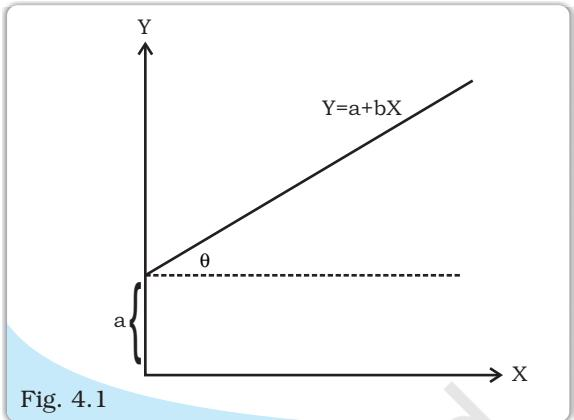
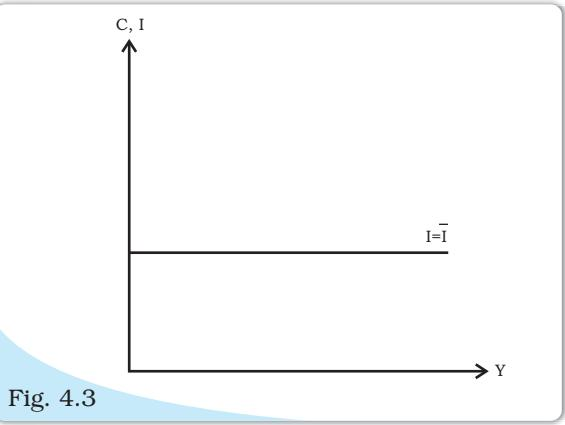
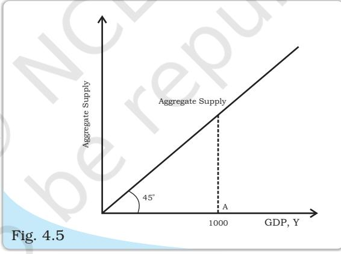
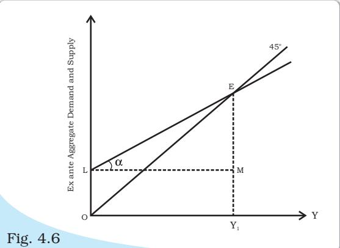
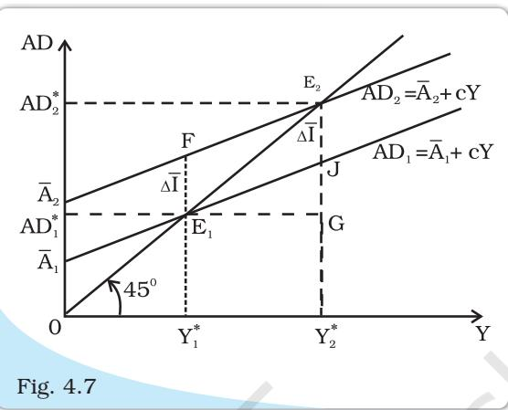
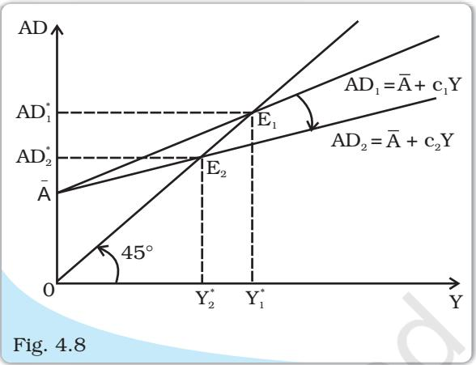

# Determination of Income and Employment

We have so far talked about the national income, price level, rate of interest etc. in an ad hoc manner – without investigating the forces that govern their values. The basic objective of macroeconomics is to develop theoretical tools, called models, capable of describing the processes which determine the values of these variables. Specifically, the models attempt to provide theoretical explanation to questions such as what causes periods of slow growth or recessions in the economy, or increment in the price level, or a rise in unemployment. It is difficult to account for all the variables at the same time. Thus, when we concentrate on the determination of a particular variable, we must hold the values of all other variables constant. This is a stylisation typical of almost any theoretical exercise and is called the assumption of *ceteris paribus*, which literally means 'other things remaining equal'. You can think of the procedure as follows – in order to solve for the values of two variables *x* and *y* from two equations, we solve for one variable, say *x*, in terms of *y* from one equation first, and then substitute this value into the other equation to obtain the complete solution. We apply the same method in the analysis of the macroeconomic system.

In this chapter we deal with the determination of National Income under the assumption of fixed price of final goods and constant rate of interest in the economy. The theoretical model used in this chapter is based on the theory given by John Maynard Keynes.

# 4.1 AGGREGATE DEMAND AND ITS COMPONENTS

In the chapter on National Income Accounting, we have come across terms like consumption, investment, or the total output of final goods and services in an economy (GDP). These terms have dual connotations. In Chapter 2 they were used in the accounting sense – denoting actual values of these items as measured by the activities within the economy in a certain year. We call these actual or accounting values ex post measures of these items.

These terms, however, can be used with a different connotation. Consumption may denote not what people have actually consumed in a given year, but what they

had planned to consume during the same period. Similarly, investment can mean the amount a producer plans to add to her inventory. It may be different from what she ends up doing. Suppose the producer plans to add Rs 100 worth goods to her stock by the end of the year. Her planned investment is, therefore, Rs 100 in that year. However, due to an unforeseen upsurge of demand for her goods in the market the volume of her sales exceeds what she had planned to sell and, to meet this extra demand, she has to sell goods worth Rs 30 from her stock. Therefore, at the end of the year, her inventory goes up by Rs (100 – 30) = Rs 70 only. Her planned investment is Rs 100 whereas her actual, or ex post, investment is Rs 70 only. We call the planned values of the variables – consumption, investment or output of final goods – their ex ante measures.

In simple words, ex-ante depicts what has been planned, and ex-post depicts what has actually happened. In order to understand the determination of income, we need to know the planned values of different components of aggregate demand. Let us look at these components now.

### 4.1.1. Consumption

The most important determinant of consumption demand is household income. A consumption function describes the relation between consumption and income. The simplest consumption function assumes that consumption changes at a constant rate as income changes. Of course, even if income is zero, some consumption still takes place. Since this level of consumption is independent of income, it is called *autonomous consumption.* We can describe this function as:

C = C+cY (4.1)

The above equation is called the consumption function. Here *C* is the consumption expenditure by households. This consists of two components autonomous consumption and induced consumption ( *cY* ). Autonomous consumption is denoted by *C* and shows the consumption which is independent of income. If consumption takes place even when income is zero, it is because of autonomous consumption. The induced component of consumption, *cY* shows the dependence of consumption on income. When income rises by Re 1. induced consumption rises by MPC i.e. *c* or the marginal propensity to consume. It may be explained as a rate of change of consumption as income changes.

$$M P C={\frac{\Delta C}{\Delta Y}}=c$$

Now, let us look at the value that MPC can take. When income changes, change in consumption ( ) ∆*C* can never exceed the change in income ( Y) ∆ . The maximum value which *c* can take is 1. On the other hand consumer may choose not to change consumption even when income has changed. In this case MPC = 0. Generally, MPC lies between 0 and 1 (inclusive of both values). This means that as income increases either the consumers does not increase consumption at all (MPC = 0) or use entire change in income on consumption (MPC = 1) or use part of the change in income for changing consumption (0< MPC<1).

Imagine a country Imagenia which has a consumption function described by *C=100+0.8Y* .

This indicates that even when Imagenia does not have any income, its citizens still consume Rs. 100 worth of goods. Imagenia's autonomous consumption is 100. Its marginal propensity to consume is 0.8. This means that if income goes up by Rs. 100 in Imagenia, consumption will go up by Rs. 80.

Let us also look at another dimension of this, savings. Savings is that part of income that is not consumed. In other words,

*S Y C* = −

We define the marginal propensity to save (MPS) as the rate of change in savings as income increases.

$$M P S={\frac{\Delta S}{\Delta Y}}=s$$

( )

*Y C*

∆ −

∆ ∆ ∆ = − ∆ ∆

*Y Y C Y Y c*

Since, *S Y C* = − *,*

## Some Definitions

1

= −

*s*

=

Marginal propensity to consume (MPC): it is the change in consumption per unit change in income. It is denoted by *c* and is equal to *C Y* ∆ ∆ .

Marginal propensity to save (MPS): it is the change in savings per unit change in income. It is denoted by *s* and is equal to 1− *c* . It implies that *s c* + =1 .

Average propensity to consume (APC): it is the consumption per unit of income i.e., *C Y* .

Average propensity to save (APS): it is the savings per unit of income i.e., *S Y* .

## 4.1.2. Investment

Investment is defined as addition to the stock of physical capital (such as machines, buildings, roads etc., i.e. anything that adds to the future productive capacity of the economy) and changes in the inventory (or the stock of finished goods) of a producer. Note that 'investment goods' (such as machines) are also part of the final goods – they are not intermediate goods like raw materials. Machines produced in an economy in a given year are not 'used up' to produce other goods but yield their services over a number of years.

Investment decisions by producers, such as whether to buy a new machine, depend, to a large extent, on the market rate of interest. However, for simplicity, we assume here that firms plan to invest the same amount every year. We can write the ex ante investment demand as

$I=\overline{I}$ (4.2)

where *I* is a positive constant which represents the autonomous (given or exogenous) investment in the economy in a given year.

## 4.2 DETERMINATION OF INCOME IN TWO-SECTOR MODEL

In an economy without a government, the ex ante aggregate demand for final goods is the sum total of the ex ante consumption expenditure and ex ante investment expenditure on such goods, viz. *AD* = *C* + *I*. Substituting the values of *C* and *I* from equations (4.1) and (4.2), aggregate demand for final goods can be written as

* [16] A. A. K.  
  

If the final goods market is in equilibrium this can be written as

$$Y={\bar{C}}+{\bar{I}}+c.Y$$

where *Y* is the ex ante, or planned, ouput of final goods. This equation can be further simplified by adding up the two autonomous terms, *C* and *I* , making it

$Y=\bar{A}+c.Y$ (4.3)

where *A* = *C* + *I* is the total autonomous expenditure in the economy. In reality, these two components of autonomous expenditure behave in different ways. *C* , representing subsistence consumption level of an economy, remains more or less stable over time. However, *I* has been observed to undergo periodic fluctuations.

A word of caution is in order. The term *Y* on the left hand side of equation (4.3) represents the ex ante output or the planned supply of final goods. On the other hand, the expression on the right hand side denotes ex ante or planned aggregate demand for final goods in the economy. Ex ante supply is equal to ex ante demand only when the final goods market, and hence the economy, is in equilibrium. Equation (4.3) should not, therefore, be confused with the accounting identity of Chapter 2, which states that the ex post value of total output must always be equal to the sum total of ex post consumption and ex post investment in the economy. If ex ante demand for final goods falls short of the output of final goods that the producers have planned to produce in a given year, equation (4.3) will not hold. Stocks will be piling up in the warehouses which we may consider as *unintended accumulation of inventories*. It should be noted that inventories or stocks refers to that part of output produced which is not sold and therefore remains with the firm. Change in inventory is called inventory investment. It can be negative as well as positive: if there is a rise in inventory, it is positive inventory investment, while a depletion of inventory is negative inventory investment. The inventory investment can take place due to two reasons: (i) the firm decides to keep some stocks for various reasons (this is called *planned* inventory investment) (ii) the sales differ from the planned level of sales, in which case the firm has to add to/run down existing inventories (this is called *unplanned* inventory investment). Thus even though planned *Y* is greater than planned *C* + *I*, actual *Y* will be equal to actual *C* + *I*, with the extra output showing up as unintended accumulation of inventories in the ex post *I* on the right hand side of the accounting identity.

At this point, we can introduce a government in this economy. The major economic activities of the government that affect the aggregate demand for final goods and services can be summarized by the fiscal variables Tax (*T*) and Government Expenditure (*G*), both autonomous to our analysis. Government, through its expenditure *G* on final goods and services, adds to the aggregate demand like other firms and households. On the other hand, taxes imposed by the government take a part of the income away from the household, whose disposable income, therefore, becomes *Yd* = *Y* – *T*. Households spend only a fraction of this disposable income for consumption purpose. Hence, equation (4.3) has to be modified in the following way to incorporate the government

$$\mathrm{Y}={\overline{{C}}}\,+\,{\overline{{I}}}\,+\,G+\,c\,(Y-\,T)$$

Note that *G* – *c.T* , like *C* or *I* , just adds to the autonomous term *A* . It does not significantly change the analysis in any qualitative way. We shall, for the sake of simplicity, ignore the government sector for the rest of this chapter. Observe also, that without the government imposing indirect taxes and subsidies, the total value of final goods and services produced in the economy, GDP, becomes identically equal to the National Income. Henceforth, throughout the rest of the chapter, we shall refer to *Y* as GDP or National Income interchangeably.

# 4.3 DETERMINATION OF EQUILIBRIUM INCOME IN THE SHORT RUN

You would recall that in microeconomic theory when we analyse the equilibrium of demand and supply in a single market, the demand and supply curves simultaneously determine the equilibrium price and the equilibrium quantity. In macroeconomic theory we proceed in two steps: at the first stage, we work out a macroeconomic equilibrium taking the price level as fixed. At the second stage, we allow the price level to vary and again, analyse macroeconomic equilibrium.

What is the justification for taking the price level as fixed? Two reasons can be put forward: (i) at the first stage, we are assuming an economy with unused resources: machineries, buildings and labours. In such a situation, the law of diminishing returns will not apply; hence additional output can be produced without increasing marginal cost. Accordingly, price level does not vary even if the quantity produced changes (ii) this is just a simplifying assumption which will be changed later.

# 4.3.1 Macroeconomic Equilibrium with Price Level Fixed

# *(A) Graphical Method*

As already explained, the consumers demand can be expressed by the equation

$$C={\overline{{C}}}+c Y$$

$\left(\begin{array}{c}\includegraphics[height=36.135pt]{./figures/.eps}\end{array}\right)$

Where *C* is Autonomous expenditure and *c* is the marginal propensity to consume.

How can this relation be shown as a graph? To answer this question we will need to recall the "intercept form of the linear equation",

$$Y=a+b X$$

Here, the variables are X and Y and there is a linear relation between them. a and b are constants. This equation is depicted in figure 4.1. The constant 'a' is shown as the "intercept" on the Y axis, i.e, the value of Y when X is zero. The constant 'b' is the slope of the line i.e. tangent θ*= b*.

## *Consumption Function – Graphical Representation*

Using the same logic, the consumption function can be shown as follows:

where, *C* = intercept of the consumption function *c* = slope of consumption function = tan α

## *Investment Function – Graphical Representation*

In a two sector model, there are two sources of final demand, the first is consumption and the second is investment.

The investment function was

# shown as I = *I*

- Graphically, this is shown as a horizontal line at a height equal
- to *I* above the horizontal axis.

In this model, I is autonomous which means, it is the same no matter whatever is the level of income.

*Intercept form of the linear equation.*

*Consumption function with intercept C .*

*Investment function with I as autonomous.*

## *Aggregate Demand: Graphical Representation*

The Aggregate Demand function shows the total demand (made up of

consumption + investment) at each level of income. Graphically it means the aggregate demand function can be obtained by vertically adding the consumption and investment function.

Here, OM = $\bf C$  
  
OJ = $\bf I$  
  
OJ = $\bf C$

The aggregate demand function is parallel to the consumption function i.e., they have the same slope *c*.

It may be noted that this function shows ex ante demand.

## *Supply Side of Macroeconomic Equilibrium*

In microeconomic theory, we show the supply curve on a diagram with price on the vertical axis and quantity supplied on horizontal axis.

*functions.*

Fig. 4.4

L J

M

O

In the first stage of macroeconomic theory, we are taking the price level as fixed. Here, aggregate supply or the GDP is assumed to smoothly move up or down since they are unused resources of all types available. Whatever is the level of GDP, that much will be supplied and price level has no role to play. This kind of supply situation is shown by a 450 line. Now, the 450 line has the feature that every point on it has the same horizontal and vertical coordinates.

*Aggregate demand is obtained by vertically adding the consumption and investment*

C=C+cY

Aggregate Demand=C+I+cY

I=I

*Aggregate supply curve with 45o line.*

Suppose, GDP is Rs.1,000 at point A. How much will be supplied? The answer is Rs.1000 worth of goods. How can that point be shown? The answer is that supply corresponding to point A is at point B which is obtained at the intersection of the 450 line and the vertical line at A.

## *Equilibrium*

Equilibrium is shown graphically by putting ex ante aggregate demand and supply together in a diagram (Fig. 4.6). The point where ex ante aggregate demand is equal to ex ante aggregate supply will be equilibrium. Thus,

equilibrium point is E and equilibrium level of income is OY1 .

## *(B) Algebraic Method*

Ex ante aggregate demand =

$${\overline{{I}}}+{\overline{{C}}}+c Y$$

Ex ante aggregate supply = *Y* Equilibrium requires that the plans of suppliers are matched by plans of those who provide final demands in the economy. Thus, in this situation, ex ante aggregate demand = ex ante aggregate supply,

*Equilibrium of ex ante aggregate demand and supply*

$$\begin{array}{l}\overline{C}+\overline{I}+cY=Y\\ Y(1-c)=\overline{C}+\overline{I}\\ Y=\frac{\overline{C}+\overline{I}}{(1-c)}\end{array}\tag{4.4}$$

## 4.3.2 Effect of an Autonomous Change in Aggregate Demand on Income and Output

We have seen that the equilibrium level of income depends on aggregate demand. Thus, if aggregate demand changes, the equilibrium level of income changes. This can happen in any one or combination of the following situations:

- 1. Change in consumption: this can happen due to (i) change in*C* (ii) change in *c* .
- 2. Change in investment: we have assumed that investment is autonomous. However, it just means that it does not depend on income. There are a number of variables other than income which can affect investment. One important factor is availability of credit: easy availability of credit encourages investment. Another factor is interest rate: interest rate is the cost of investible funds, and at higher interest rates, firms tend to lower investment. Let us now concentrate on change in investment with the help of the following example.

Let *C Y* = + 40 0.8 , *I* =10 . In this case, the equilibrium income (obtained by

equation *Y* to *AD* ) comes out to be 2501 .

Now, let investment rise to 20. It can be seen that the new equilibrium will be 300. This can be seen by looking at the graph. This increase in income is due to rise in investment, which is a component of autonomous expenditure here.

When autonomous investment increases, the *AD*1 line shifts in parallel upwards and assumes the position *AD*2 . The value of aggregate demand at

$Y=C+I=40+0.8Y+10$, so that $Y=50+0.8Y$, or $Y=\frac{1}{1-0.8}50=250$.  
  

output *Y* * 1 is *Y* * 1 *F*, which is greater than the value of output 0*Y* * 1 = *Y* * 1 *E*1 by an amount *E*1*F*. *E*1*F* measures the amount of excess demand that emerges in the economy as a result of the increase in autonomous expenditure. Thus, *E*1 no longer represents the equilibrium. To find the new equilibrium in the final goods market we must look for the point where the new aggregate demand line, *AD*2 , intersects the 45o line. That occurs at point *E*2 , which is, therefore,

the new equilibrium point. The new equilibrium values of output and aggregate demand are *Y* * 2 and *AD** 2 , respectively.

Note that in the new equilibrium, output and aggregate demand have increased by an amount *E*1*G* = *E*2*G*, which is greater than the initial increment in autonomous expenditure, ∆ *I* = *E*1*F* = *E*2 *J*. Thus an initial increment in the autonomous expenditure seems to have a multiplier on the equilibrium values of aggregate demand and output. What causes aggregate demand and output to increase by

*Equilibrium Output and Aggregate Demand in the Fixed Price Model*

61

Income Determination

an amount larger than the size of the initial increment in autonomous expenditure? We discuss it in section 4.3.3.

## 4.3.3 The Multiplier Mechanism

It was seen in the previous section that with a change in the autonomous expenditure of 10 units, the change in equilibrium income is equal to 50 units (from 250 to 300). We can understand this by looking at the *multiplier mechanism*, which is explained below:

 The production of final goods employs factors such as labour, capital, land and entrepreneurship. In the absence of indirect taxes or subsidies, the total value of the final goods output is distributed among different factors of production – wages to labour, interest to capital, rent to land etc. Whatever is left over is appropriated by the entrepreneur and is called profit. Thus the sum total of aggregate factor payments in the economy, National Income, is equal to the aggregate value of the output of final goods, GDP. In the above example the value of the extra output, 10, is distributed among various factors as factor payments and hence the income of the economy goes up by 10. When income increases by 10, consumption expenditure goes up by (0.8)10, since people spend 0.8 (= mpc) fraction of their additional income on consumption. Hence, in the next round, aggregate demand in the economy goes up by (0.8)10 and there again emerges an excess demand equal to (0.8)10. Therefore, in the next production cycle, producers increase their planned output further by (0.8)10 to restore equilibrium. When this extra output is distributed among factors, the income of the economy goes up by (0.8)10 and consumption demand increases further by (0.8)210, once again creating excess demand of the same amount. This process goes on, round after round, with producers increasing their output to clear the excess demand in each round and consumers spending a part of their additional

income from this extra production on consumption items – thereby creating further excess demand in the next round.

Let us register the changes in the values of aggregate demand and output at each round in Table 4.1.

The last column measures the increments in the value of the output of final goods (and hence the income of the economy) in each round. The second and third columns measure the increments in total consumption expenditure in the economy and increments in the value of aggregate demand in a similar way. In order to find out the total increase in output of the final goods, we must add up the infinite geometric series in the last column, i.e.,

$10+(0.8)10+(0.8)^{2}10+.........\infty$  
  
$=10\left\{1+(0.8)+(0.8)^{2}+.........\infty\right\}=\frac{10}{1-0.8}=50$

|  | Consumption | Aggregate Demand | Output/Income |
| --- | --- | --- | --- |
| Round 1 | 0 | 10 (Autonomous Increment) | 10 |
| Round 2 | (0.8)10 | (0.8)10 | (0.8)10 |
| Round 3 | (0.8)210 | (0.8)210 | (0.8)210 |
| Round 4 | (0.8)310 | (0.8)310 | (0.8)310 |
| . | . | . | . |
| . | . | . | . |
| . | . | . | . |
| . | . | . | etc. |

Table 4.1: The Multiplier Mechanism in the Final Goods Market

The increment in equilibrium value of total output thus exceeds the initial increment in autonomous expenditure. The ratio of the total increment in equilibrium value of final goods output to the initial increment in autonomous expenditure is called the investment multiplier of the economy. Recalling that 10 and 0.8 represent the values of ∆ *I* = ∆ *A* and mpc, respectively, the expression for the multiplier can be explained as

The investment multiplier = $\frac{\Delta Y}{\Delta A}$=$\frac{1}{1-c}$=$\frac{1}{S}$ (4.5)

where ∆*Y* is the total increment in final goods output and *c mpc* = . Observe that the size of the multiplier depends on the value of *c* . As *c* becomes larger the multiplier increases.

### Paradox of Thrift

If all the people of the economy increase the proportion of income they save (i.e. if the mps of the economy increases) the total value of savings in the economy will not increase – it will either decline or remain unchanged. This result is known as the Paradox of Thrift – which states that as people become more thrifty they end up saving less or same as before. This result, though sounds apparently impossible, is actually a simple application of the model we have learnt.

Let us continue with the example. Suppose at the initial equilibrium of *Y* = 250, there is an exogenous or autonomous shift in peoples' expenditure pattern – they suddenly become more thrifty. This may happen due to a new information regarding an imminent war or some other impending disaster, which makes people more circumspect and conservative about their expenditures. Hence the mps of the economy increases, or, alternatively, the mpc decreases from 0.8 to 0.5. At the initial income level of *AD** 1 = *Y* * 1 = 250, this sudden decline in mpc will imply a decrease in aggregate consumption spending and hence in aggregate demand, *AD* = *A* + *cY* , by an amount equal to (0.8 – 0.5) 250 = 75. This can be regarded as an autonomous reduction in consumption expenditure, to the extent that the change in mpc is occurring from some exogenous cause and is not a consequence of changes in the variables of the model. But as aggregate demand decreases by 75, it falls short of the output *Y* * 1 = 250 and there emerges an excess supply equal to 75 in the economy. Stocks are piling up in warehouses and producers decide to cut the value of production by 75 in the next round to restore equilibrium in the market. But that would mean a reduction in factor payments in the next round and hence a reduction in income by 75. As income decreases people reduce consumption proportionately but, this time, according to the new value of mpc which is 0.5. Consumption expenditure, and hence aggregate demand, decreases by (0.5)75, which creates again an excess supply in the market. In the next round, therefore, producers reduce output further by (0.5)75. Income of the people decreases accordingly and consumption expenditure and aggregate demand goes down again by (0.5)2 75. The process goes on. However, as can be inferred from the dwindling values of the successive round effects, the process is convergent. What is the total decrease in the value of output and aggregate demand? Add up the infinite series 75 + (0.5) 75 + (0.5)2 75 + ........ ∞ and the total reduction in output turns out to be

$${\frac{75}{1-0.5}}\,=\,150$$

But that means the new equilibrium output of the economy is only *Y** 2 = 100. People are now saving *S* * 2 = *Y* * 2 – *C* * 2 = *Y* * 2 – (*C* + *c*2 .*Y* * 2 ) = 100 – (40 + 0.5 × 100) = 10 in aggregate, whereas under the previous equilibrium they were saving *S* * 1 = *Y* * 1 – *C** 1 = *Y* * 1 – (*C* + *c*1 .*Y** 1 ) = 250 – (40 + 0.8 × 250) = 10 at the previous mpc, *c*1 = 0.8. Total value of savings in the economy has, therefore, remained unchanged.

 When *A* changes the line shifts upwards or downwards in parallel. When *c* changes, however, the line swings up or down. An increase in mps,

or a decline in mpc, reduces the slope of the *AD* line and it swings downwards. We depict the situation in Fig. 4.8.

At the initial values of the parameters, *A* = 50 and *c* = 0.8, the equilibrium value of the output and aggregate demand from equation (4.4) was

$$Y_{1}^{*}={\frac{50}{1-0.8}}\,=250$$

Under the changed value of the parameter *c* = 0.5, the new equilibrium value of output and aggregate demand is

$$Y_{\;\;2}^{*}=\;\frac{50}{1-0.5}\;=\;100$$

*Paradox of Thrift – Downward Swing of AD Line*

The equilibrium output and aggregate demand have declined by 150. As explained above, this, in turn, implies that there is no change in the total value of savings.

# 4.4 SOME MORE CONCEPTS

The equilibrium output in the economy also determines the level of employment, given the quantities of other factors of production (think of a production function at aggregate level). This means that the level of output determined by the equality of *Y* with *AD* does not necessarily mean the level of output at which everyone is employed.

*Full employment level of income* is that level of income where all the factors of production are fully employed in the production process. Recall that equilibrium attained at the point of equality of *Y* and *AD* by itself does not signify full employment of resources. Equilibrium only means that if left to itself the level of income in the economy will not change even when there is unemployment in the economy. The equilibrium level of output may be more or less than the full employment level of output. If it is less than the full employment of output, it is due to the fact that demand is not enough to employ all factors of production. This situation is called the situation of deficient demand. It leads to decline in prices in the long run. On the other hand, if the equilibrium level of output is more than the full employment level, it is due to the fact that the demand is more than the level of output produced at full employment level. This situation is called the situation of excess demand. It leads to rise in prices in the long run.

When, at a particular price level, aggregate demand for final goods equals aggregate supply of final goods, the final goods or product market reaches its equilibrium. Aggregate demand for final goods consists of ex ante consumption, ex ante investment, government spending etc. The rate of increase in ex ante consumption due to a unit increment in income is called marginal propensity to consume. For simplicity we assume a constant final goods price and constant rate of interest over short run to determine the level of aggregate demand for final goods in the economy. We also assume that the aggregate supply is perfectly elastic at this price. Under such circumstances, aggregate output is determined solely by the level of aggregate demand. This is known as effective demand principle. An increase (decrease) in autonomous spending causes aggregate output of final goods to increase (decrease) by a larger amount through the multiplier process.

- Aggregate demand Aggregate supply Equilibrium Ex ante Ex post Ex ante consumption Marginal propensity to consume Ex ante investment Unintended changes in inventories Autonomous change Parametric shift Effective demand principle
Paradox of thrift Autonomous expenditure multiplier

65

Income Determination

- 1. What is marginal propensity to consume? How is it related to marginal propensity to save?
- 2. What is the difference between ex ante investment and ex post investment?
- 3. What do you understand by 'parametric shift of a line'? How does a line shift when its (i) slope decreases, and (ii) its intercept increases?
- 4. What is 'effective demand'? How will you derive the autonomous expenditure multiplier when price of final goods and the rate of interest are given?
- 5. Measure the level of ex-ante aggregate demand when autonomous investment and consumption expenditure (A) is Rs 50 crores, and MPS is 0.2 and level of income (Y) is Rs 4000 crores. State whether the economy is in equilibrium or not (cite reasons).
- 6. Explain 'Paradox of Thrift'.

## Suggested Readings

- 1 . Dornbusch, R. and S. Fischer. 1990. *Macroeconomics*, (fifth edition) pages 63 – 105. McGraw Hill, Paris.
?

- Key Concepts ey Conceptsey Concepts
?

?

?

