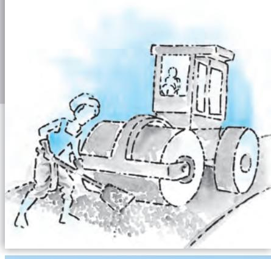
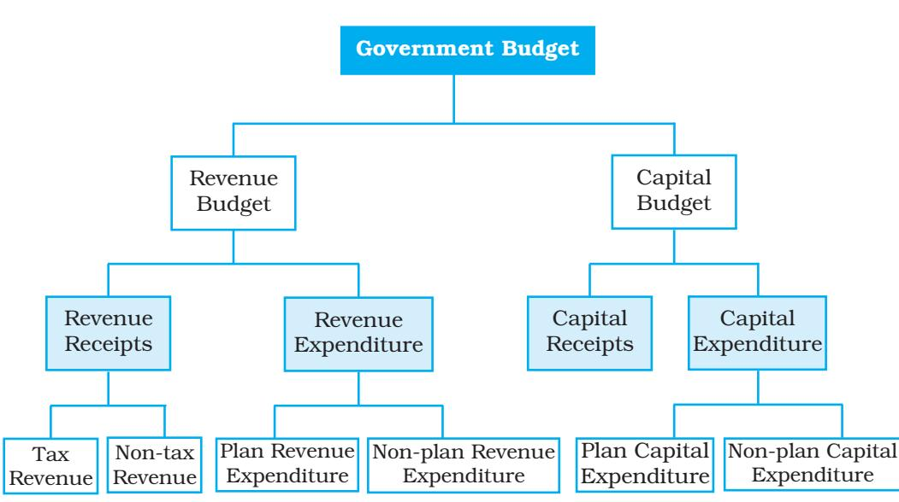
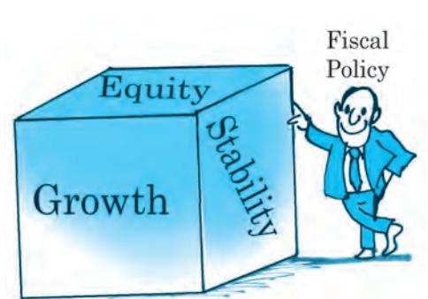
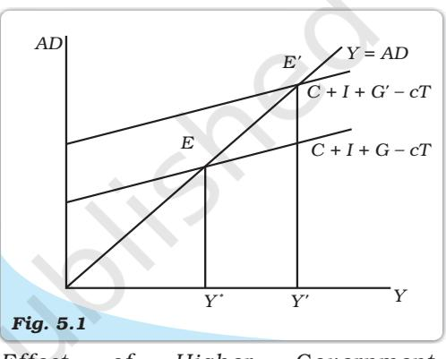
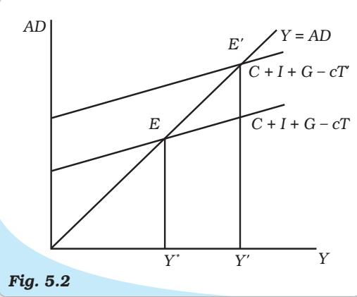
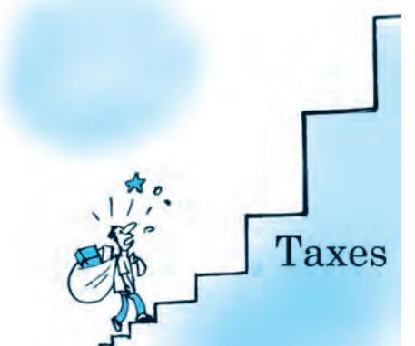
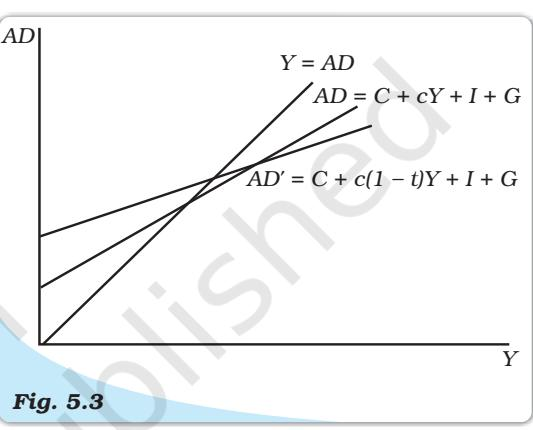
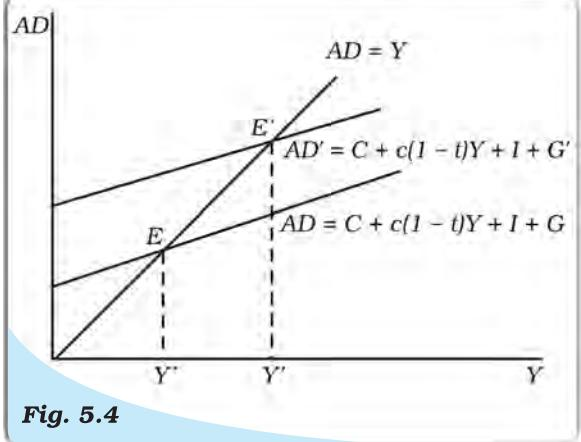
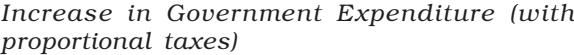
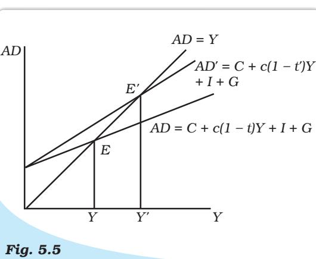

# Chapter 5 Chapter 5

# GovernmenGovernmen Government Budget and the Economy

We introduced the government in chapter one as denoting the state. We stated that apart from the private sector, there is the government which plays a very important role. An economy in which there is both the private sector and the Government is known as a mixed economy. There are many ways in which the government influences economic life. In this chapter, we will limit ourselves to the functions which are carried on through the government budget.

This chapter proceeds as follows. In section 5.1 we present the components of the government budget to bring out the sources of government revenue and avenues of government spending. In section 5.2 we discuss the topic of balanced, surplus or deficit budget to account for the difference between expenditures and revenue collection. It specifically deals with the meaning of different kinds of budget deficits, their implications and the measures to contain them. Box. 5.1 deals with fiscal policy and a simple description of the multiplier. The role the government plays has implications for its deficits which further affect its debtwhat the government owes. The chapter concludes with an analysis of the debt issue.

# 5.1 GOVERNMENT BUDGET — MEANING AND ITS COMPONENTS

There is a constitutional requirement in India (Article 112) to present before the Parliament a statement of estimated receipts and expenditures of the government in respect of every financial year which runs from 1 April to 31 March. This 'Annual Financial Statement' constitutes the main budget document of the government.

Although the budget document relates to the receipts and expenditure of the government for a particular financial year, the impact of it will be there in subsequent years. There is a need therefore to have two accounts- those that relate to the current financial year only are included in the revenue account (also called revenue budget) and those that concern the assets and liabilities of the government into the capital account (also called capital budget). In order to understand the accounts, it is important to first understand the objectives of the government budget.

# 5.1.1 Objectives of Government Budget

The government plays a very important role in increasing the welfare of the people. In order to do that the government intervenes in the economy in the following ways.

# *Allocation Function of Government Budget*

Government provides certain goods and services which cannot be provided by the market mechanism i.e. by exchange between individual consumers and producers. Examples of such goods are national defence, roads, government administration etc. which are referred to as public goods.

To understand why public goods need to be provided by the government, we must understand the difference between private goods such as clothes, cars, food items etc. and public goods. There are two major differences. One, the benefits of public goods are available to all and are not only restricted to one particular consumer. For example, if a person eats a chocolate or wears a shirt, these will not be available to others. It is said that this person's consumption stands in rival relationship to the consumption of others. However, if we consider a public park or measures to reduce air pollution, the benefits will be available to all. One person's consumption of a good does not reduce the amount available for consumption for others and so several people can enjoy the benefits, that is, the consumption of many people is not 'rivalrous'.

Two, in case of private goods anyone who does not pay for the goods can be excluded from enjoying its benefits. If you do not buy a ticket, you will not be allowed to watch a movie at a local cinema hall. However, in case of public goods, there is no feasible way of excluding anyone from enjoying the benefits of the good. That is why public goods are called non-excludable. Even if some users do not pay, it is difficult and sometimes impossible to collect fees for the public good. These nonpaying users are known as 'free-riders'. Consumers will not voluntarily pay for what they can get for free and for which there is no exclusive title to the property being enjoyed. The link between the producer and consumer which occurs through the payment process is broken and the government must step in to provide for such goods.

6 7

and the Economy

Government Budget

There is, however, a difference between public provision and public production. Public provision means that they are financed through the budget and can be used without any direct payment. Public goods may be produced by the government or the private sector. When goods are produced directly by the government it is called public production.

#### *Redistribution Function of Government Budget*

From chapter two we know that the total national income of the country goes to either the private sector, that is, firms and households (known as private income) or the government (known as public income). Out of private income, what finally reaches the households is known as personal income and the amount that can be spent is the personal disposable income. The government sector affects the personal disposable income of households by making transfers and collecting taxes. It is through this that the government can change the distribution of income and bring about a distribution that is considered 'fair' by society. This is the redistribution function.

#### *Stabilisation Function of Government Budget*

The government may need to correct fluctuations in income and employment. The overall level of employment and prices in the economy depends upon the level of aggregate demand which depends on the spending decisions of millions of private economic agents apart from the government. These decisions, in turn, depend on many factors such as income and credit availability. In any period, the level of demand may not be sufficient for full utilisation of labour and other resources of the economy. Since wages and prices do not fall below a level, employment cannot be brought back to the earlier level automatically. The government needs to intervene to raise the aggregate demand.

On the other hand, there may be times when demand exceeds available output under conditions of high employment and thus may give rise to inflation. In such situations, restrictive conditions may be needed to reduce demand.

The intervention of the government whether to expand demand or reduce it constitutes the stabilisation function.

#### 5.1.2 Classification of Receipts

*Revenue Receipts:* Revenue receipts are those receipts that do not lead to a claim on the government. They are therefore termed non-redeemable. They are divided into tax and non-tax revenues. Tax revenues, an important component of revenue receipts, have for long been divided into direct taxes (personal income tax) and firms (corporation tax), and indirect taxes like excise taxes (duties levied on goods produced within the country), customs duties (taxes imposed on goods imported into and exported out of India) and service tax1 . Other direct taxes like wealth tax, gift tax and estate duty (now abolished) have never brought in large amount of revenue and thus have been referred to as 'paper taxes'.

The redistribution objective is sought to be achieved through progressive income taxation, in which higher the income, higher is the tax rate. Firms are taxed on a proportional basis, where the tax rate is a particular proportion of profits. With respect to excise taxes, necessities of life are exempted or taxed at low rates, comforts and semi-luxuries are moderately taxed, and luxuries, tobacco and petroleum products are taxed heavily.

Non-tax revenue of the central government mainly consists of interest receipts on account of loans by the central government, dividends and profits on investments made by the government, fees and other receipts for services rendered by the government. Cash grants-in-aid from foreign countries and international organisations are also included.

The estimates of revenue receipts take into account the effects of tax proposals made in the Finance Bill2 .

*Capital Receipts*: The government also receives money by way of loans or from the sale of its assets. Loans will have to be returned to the agencies from which they have been borrowed. Thus they create liability. Sale of government assets, like sale of shares in Public Sector Undertakings (PSUs) which is referred

1The India Tax system witnessed a dramatic change with the introduction of the GST (Goods and Services Tax) which encompasses both goods and services and was be implemented by the Centre, 28 states and 7 Union territories from 1 July, 2017.

2A Finance Bill, presented along with the Annual Financial Statement, provides details on the imposition, abolition, remission, alteration or regulation of taxes proposed in the Budget.

*Chart 1: The Components of the Government Budget*

to as PSU disinvestment, reduce the total amount of financial assets of the government. All those receipts of the government which create liability or reduce financial assets are termed as capital receipts. When government takes fresh loans it will mean that in future these loans will have to be returned and interest will have to be paid on these loans. Similarly, when government sells an asset, then it means that in future its earnings from that asset, will disappear. Thus, these receipts can be debt creating or non-debt creating.

# 5.1.3. Classification of Expenditure

# *Revenue Expenditure*

Revenue Expenditure is expenditure incurred for purposes other than the creation of physical or financial assets of the central government. It relates to those expenses incurred for the normal functioning of the government departments and various services, interest payments on debt incurred by the government, and grants given to state governments and other parties (even though some of the grants may be meant for creation of assets).

69

and the Economy

Government Budget

Budget documents classify total expenditure into plan and non-plan expenditure3 . This is shown in item 6 on Table 5.1 within revenue expenditure, a distinction is made between plan and non-plan. According to this classification, plan revenue expenditure relates to central Plans (the Five-Year Plans) and central assistance for State and Union Territory plans. Non-plan expenditure, the more important component of revenue expenditure, covers a vast range of general, economic and social services of the

3A case against this kind of classification has been put forth on the ground that it has led to an increasing tendency to start new schemes/projects neglecting maintenance of existing capacity and service levels. It has also led to the misperception that non-plan expenditure is inherently wasteful, adversely affecting resource allocation to social sectors like education and health where salary comprises an important element.

government. The main items of non-plan expenditure are interest payments, defence services, subsidies, salaries and pensions.

Interest payments on market loans, external loans and from various reserve funds constitute the single largest component of non-plan revenue expenditure. Defence expenditure, is committed expenditure in the sense that given the national security concerns, there exists little scope for drastic reduction. Subsidies are an important policy instrument which aim at increasing welfare. Apart from providing implicit subsidies through under-pricing of public goods and services like education and health, the government also extends subsidies explicitly on items such as exports, interest on loans, food and fertilisers. The amount of subsidies as a percent of GDP was 2.02 per cent in 2014-15 and is 1.8 percent of GDP in 2015-16, 1 percent in 2018-19, 3.6 percent in 2020-21 and 1.2 percent in 2022-23 (B.E).

#### *Capital Expenditure*

There are expenditures of the government which result in creation of physical or financial assets or reduction in financial liabilities. This includes expenditure on the acquisition of land, building, machinery, equipment, investment in shares, and loans and advances by the central government to state and union territory governments, PSUs and other parties. Capital expenditure is also categorised as plan and non-plan in the budget documents. Plan capital expenditure, like its revenue counterpart, relates to central plan and central assistance for state and union territory plans. Non-plan capital expenditure covers various general, social and economic services provided by the government.

The budget is not merely a statement of receipts and expenditures. Since Independence, with the launching of the Five-Year Plans, it has also become a significant national policy statement. The budget, it has been argued, reflects and shapes, and is, in turn, shaped by the country's economic life. Along with the budget, three policy statements are mandated by the Fiscal Responsibility and Budget Management Act, 2003 (FRBMA)4 . The Medium-term Fiscal Policy Statement sets a threeyear rolling target for specific fiscal indicators and examines whether revenue expenditure can be financed through revenue receipts on a sustainable basis and how productively capital receipts including market borrowings are being utilised. The Fiscal Policy Strategy Statement sets the priorities of the government in the fiscal area, examining current policies and justifying any deviation in important fiscal measures. The Macroeconomic Framework Statement assesses the prospects of the economy with respect to the GDP growth rate, fiscal balance of the central government and external balance5 .

# 5.2 BALANCED, SURPLUS AND DEFICIT BUDGET

The government may spend an amount equal to the revenue it collects. This is known as a balanced budget. If it needs to incur higher expenditure, it will have

4Box 5.2 provides a brief account of this legistation and its implication for Government finances.

5The 2005-06 Indian Budget introduced a statement highlighting the gender sensitivities of the budgetary allocations. Gender budgeting is an exercise to translate the stated gender commitments of the government into budgetary commitments, involving special initiatives for empowering women and examination of the utilisation of resources allocated for women and the impact of public expenditure and policies of the government on women. The 2006- 07 budget enlarged the earlier statement.

to raise the amount through taxes in order to keep the budget balanced. When tax collection exceeds the required expenditure, the budget is said to be in surplus. However, the most common feature is the situation when expenditure exceeds revenue. This is when the government runs a budget deficit.

# 5.2.1 Measures of Government Deficit

When a government spends more than it collects by way of revenue, it incurs a budget deficit6 . There are various measures that capture government deficit and they have their own implications for the economy.

*Revenue Deficit*: The revenue deficit refers to the excess of government's revenue expenditure over revenue receipts

Revenue deficit = Revenue expenditure – Revenue receipts

Table 5.1: Receipts and Expenditures of the Central Government, 2022–23 (B.E.)

|  |  | (As per cent of GDP) |
| --- | --- | --- |
| 1. | Revenue Receipts (a+b) | 8.5 |
|  | (a) Tax revenue (net of states' share) | 7.5 |
|  | (b) Non-tax revenue | 1.0 |
| 2. | Revenue Expenditure of which | 12.4 |
|  | (a) Interest payments | 3.6 |
|  | (b) Major subsidies | 1.2 |
|  | (c) Defence expenditure | 0.9 |
| 3. | Revenue Deficit (2–1) | 3.8 |
| 4. | Capital Receipts (a+b+c) of which | 6.7 |
|  | (a) Recovery of loans | 0.1 |
|  | (b) Other receipts (mainly PSU1 disinvestment) | 0.3 |
|  | (c) Borrowings and other liabilities | 6.4 |
| 5. | Capital Expenditure | 2.9 |
| 6. | Non-debt Receipts | 8.9 |
|  | [1+4(a)+4(b)] |  |
| 7. | Total Expenditure | 15.3 |
|  | [2+5=7(a)+7(b)] |  |
|  | (a) Plan expenditure | – |
|  | (b) Non-plan expenditure | – |
| 8. | Fiscal deficit [7-1-4(a)-4(b)] | 6.4 |
| 9. | Primary Deficit [8–2(a)] | 2.8 |
|  | Source: Economic Survey, 2022–23, | 1 Public Sector Undertaking |

*71*

*and the Economy*

*Government Budget*

Item 3 in Table 5.1 shows that revenue deficit in 2022–23 was 3.8 per cent of GDP. The revenue deficit includes only such transactions that affect the current income and expenditure of the government. When the government incurs a revenue deficit, it implies that the government is dissaving and is using up the savings of the other sectors of the economy to finance a part of its consumption expenditure. This situation means that the government will have to borrow not only to finance its investment but also its consumption requirements. This will lead to a build up of stock of debt and interest liabilities and force the government,

6More formally, it refers to the excess of total expenditure (both revenue and capital) over total receipts (both revenue and capital). From the 1997-98 budget, the practice of showing budget deficit has been discontinued in India.

eventually, to cut expenditure. Since a major part of revenue expenditure is committed expenditure, it cannot be reduced. Often the government reduces productive capital expenditure or welfare expenditure. This would mean lower growth and adverse welfare implications.

*Fiscal Deficit*: Fiscal deficit is the difference between the government's total expenditure and its total receipts excluding borrowing

> Gross fiscal deficit = Total expenditure – (Revenue receipts + Non-debt creating capital receipts)

Non-debt creating capital receipts are those receipts which are not borrowings and, therefore, do not give rise to debt. Examples are recovery of loans and the proceeds from the sale of PSUs. From Table 5.1 we can see that non-debt creating capital receipts equals 8.9 per cent of GDP, obtained by subtracting, borrowing and other liabilities from total capital receipts [1+4(a)+4(b)]. The fiscal deficit, therefore turn out to be 6.4 per cent of GDP. The fiscal deficit will have to be financed through borrowing. Thus, it indicates the total borrowing requirements of the government from all sources. From the financing side

> Gross fiscal deficit = Net borrowing at home + Borrowing from RBI + Borrowing from abroad

Net borrowing at home includes that directly borrowed from the public through debt instruments (for example, the various small savings schemes) and indirectly from commercial banks through Statutory Liquidity Ratio (SLR). The gross fiscal deficit is a key variable in judging the financial health of the public sector and the stability of the economy. From the way gross fiscal deficit is measured as given above, it can be seen that revenue deficit is a part of fiscal deficit (Fiscal Deficit = Revenue Deficit + Capital Expenditure - non-debt creating capital receipts). A large share of revenue deficit in fiscal deficit indicated that a large part of borrowing is being used to meet its consumption expenditure needs rather than investment.

*Primary Deficit*: We must note that the borrowing requirement of the government includes interest obligations on accumulated debt. The goal of measuring primary deficit is to focus on present fiscal imbalances. To obtain an estimate of borrowing on account of current expenditures exceeding revenues, we need to calculate what has been called the primary deficit. It is simply the fiscal deficit minus the interest payments

Gross primary deficit = Gross fiscal deficit – Net interest liabilities Net interest liabilities consist of interest payments minus interest receipts by the government on net domestic lending.

#### Box 5.1: Fiscal Policy

One of Keynes's main ideas in *The General Theory of Employment, Interest and Money* was that government fiscal policy should be used to stabilise the level of output and employment. Through changes in its expenditure and taxes, the government attempts to increase output and income and seeks to stabilise the ups and downs in the economy. In the process, fiscal policy creates a *surplus* (when total receipts exceed expenditure) or a *deficit budget* (when total expenditure exceed receipts) rather than a *balanced budget* (when expenditure equals receipts). In what follows, we study the effects of introducing the government sector in our earlier analysis of the determination of income.

The government directly affects the level of equilibrium income in two specific ways – government purchases of goods and services (*G*) increase aggregate demand and taxes, and transfers affect the relation between income (*Y*) and disposable income (*YD*) – the income available for consumption and saving with the households.

*How does the Fiscal Policy try to achieve its basic objectives?*

We take taxes first. We assume that the government imposes taxes that do not depend on income, called lump-sum taxes equal to *T*. We assume throughout the analysis that government makes a constant amount of transfers, — *TR* . The consumption function is now

$C=\bar{C}+cYD=\bar{C}+c(Y-T+\bar{T}R)$

where *YD* = disposable income.

We note that taxes lower disposable income and consumption. For instance, if one earns Rs 1 lakh and has to pay Rs 10,000 in taxes, she has the same disposable income as someone who earns Rs 90,000 but pays no taxes. The definition of aggregate demand augmented to include the government will be

$$AD=\bar{C}+c(Y-T+\bar{T}R)+I+G\tag{5.2}$$

Graphically, we find that the lump-sum tax shifts the consumption schedule downward in a parallel way and hence the aggregate demand curve shifts in a similar fashion. The income determination condition in the product market will be *Y* = *AD*, which can be written as

$Y=\bar{C}+c\left(Y-T+\bar{T}\bar{R}\right)+\bar{I}+G$ (5.3)

Solving for the equilibrium level of income, we get

$$Y^{*}=\frac{1}{1-c}\left(\overline{C}-cT+c\ \overline{T}R+I+G\right)\tag{5.4}$$

#### *Changes in Government Expenditure*

We consider the effects of increasing government purchases (*G*) keeping taxes constant. When *G* exceeds *T*, the government runs a deficit. Because *G* is a component of aggregate spending, planned aggregate expenditure will increase. The aggregate demand schedule shifts up to *AD*′. At the initial level of output, demand exceeds supply and firms expand production. The new equilibrium is at *E*′. The multiplier mechanism (described in Chapter 4) is in operation. The government spending multiplier is derived as follows:

Suppose *G* changes to a new level *(G+*∆*G)* and as a result Y changes to a new

level * ( ) *Y Y* + ∆ . The new levels of G and Y can also be put into equation (5.4).

So $(Y^{*}+\Delta Y)=\frac{1}{1-c}\Big{(}\overline{C}-cT+c\overline{TR}+I+G+\Delta G\Big{)}$ (5.4a)

Subtracting equation (5.4) from equation (5.4a) we get

$$\Delta Y=\frac{1}{1-c}\,\Delta G\tag{5.5}$$

or

$$\frac{\Delta Y}{\Delta G}=\frac{1}{1-c}\tag{5.6}$$

In Fig. 5.1, government expenditure increases from *G* to *G'* and causes equilibrium income to increase from *Y* to *Y'* .

#### *Changes in Taxes*

We find that a cut in taxes increases disposable income (Y – T ) at each level of income. This shifts the aggregate expenditure schedule upwards by a fraction *c* of the decrease in taxes. This is shown in Fig 5.2.

From equation 5.3, we can calculate the tax multiplier using the same method as for the government expenditure multiplier .

$$\Delta Y^{*}=\frac{1}{1-c}\left(-c\right)\left(\Delta T\right)\tag{5.7}$$

The tax multiplier

* [10] M. C.  
  

Because a tax cut (increase) will cause an increase (reduction) in consumption and output, the tax multiplier is a negative multiplier . Comparing equation (5.6) and (5.8), we find that the tax multiplier is smaller in absolute value compared to the government spending multiplier. This is because an increase in government spending directly affects total spending whereas taxes enter the multiplier process through their impact on disposable income, which influences household consumption (which is a part of total spending).

*Effect of Higher Government Expenditure*

*Effect of a Reduction in Taxes*

Thus, with a ∆ *T* reduction in taxes, consumption, and hence total spending, increases in the first instance by *c*∆ *T*. To understand how the two multipliers differ, we consider the following example.

### EXAMPLE 5.1

Assume that the marginal propensity to consume is 0.8. The government expenditure multiplier will then be

1 1 – *c* = 1 1 – 0.8 = 1 0.2 = 5. For an increase in government spending by 100, the equilibrium income will increase by ∆ = × − 1 500( 5 100) 1 *G c* .

The tax multiplier is given by

$${\frac{-c}{1-c}}\,=\,{\frac{-0.8}{1-0.8}}\,=\,{\frac{-0.8}{0.2}}\,=-4.$$

A tax cut of 100 ( ∆ *T*= –100) will increase equilibrium income by 400. Thus, the equilibrium income increases in this case by less than the amount by which it increased under a *G* increase.

*Why is the poor man crying? Suggest measures to wipe off his tears.*

75

and the Economy

Government Budget

Within the present framework, if we take different values of the marginal propensity to consume and calculate the values of the two multipliers, we find that the tax multiplier is always one less in absolute value than the government expenditure multiplier. This has an interesting implication. If an increase in government spending is matched by an equal increase in taxes, so that the budget remains balanced, output will rise by the amount of the increase in government spending. Adding the two policy multipliers gives

> = 1

+ –

*c*

= 1 – *c*

= 1 (5.9)

* *Y*

The balanced budget multiplier = ∆

∆ *G* 1 – *c* 1 – *c* 1 – *c* A balanced budget multiplier of unity implies that a 100 increase in G financed by 100 increase in taxes increases income by just 100. This can be seen from Example 1 where an increase in G by 100 increases output by 500. A tax increase would reduce income by 400 with the net increase of income equal to 100. The equilibrium income refers to the final income that one arrives at in a period sufficiently long for all the rounds of the multipliers to work themselves out. We find that output increases by exactly the amount of increased *G* with no induced consumption spending due to increase in taxes. To see why the balanced budget multiplier is 1, we examine the multiplier process. The increase in government spending by a certain amount raises income by that amount directly and then indirectly through the multiplier chain increasing income by

$$\Delta Y=\Delta G+\bar{c}\Delta G+c^{2}\Delta G+\ldots=\Delta G\left(1+c+c^{2}+\ldots\right)\tag{5.10}$$

But the tax increase only enters the multiplier process when the cut in disposable income reduces consumption by *c* times the reduction in taxes. Thus the effect on income of the tax increase is given by

$\Delta Y=-\ c\Delta T-\ c^{2}\Delta T+\.\.\.=-\ \Delta T(c+\ c^{2}+\.\.\.)$ (5.11)

The difference between the two gives the net effect on income. Since ∆*G* = ∆*T*, from 5.10 and 5.11, we get ∆*Y* = ∆*G*, that is, income increases by the amount by which government spending increases and the balanced budget multiplier is unity. This multiplier can also be derived from equation 5.3 as follows

∆*Y* = ∆*G* + *c* (∆*Y* – ∆*T*) since investment does not change (∆*I* = 0)

Since, ∆*G* = ∆*T*, we have

$$\frac{\Delta Y}{\Delta G}=\frac{1-c}{1-c}=1\tag{5.13}$$

*Case of Proportional Taxes*: A more realistic assumption would be that the government collects a constant fraction, *t*, of income in the form of taxes so that *T* = *tY*. The consumption function with proportional taxes is given by

$\bf C=\bar{C}+c.(Y-tY+\bar{T}R)=\bar{C}+c$  
  
$\bf(1-t)Y+c\bar{T}R$  
  
$\bf(5.14)$

We note that proportional taxes not only lower consumption at each level of income but also lower the slope of the consumption function. The mpc out of income falls to *c* (1 – *t*). The new aggregate demand schedule, *AD*′, has a larger intercept but is flatter as shown in Fig. 5.3.

(5.12)

Now we have

$AD=C+c1-0Y+cTR+I+G$  
  
$=A+c1-0Y$

*Government and Aggregate Demand (proportional taxes make the AD schedule flatter)*

Where *A* = autonomous expenditure and equals *C* + *c* — *TR* + *I* + *G*. Income determination condition in the product market is, *Y* = *AD*, which can be written as

*Y* = *A* + *c* (1 – *t*)*Y* (5.16) Solving for the equilibrium level of income

$Y^{*}=1-\epsilon(1-\epsilon)$

so that the multiplier is given by

* [10] A. A. K.  
  

Comparing this with the value of the multiplier with lump-sum taxes case, we find that the value has become smaller. When income rose as a result of an increase in government spending in the case of lump-sum taxes,

consumption increased by *c* times the increase in income. With proportional taxes, consumption will rise by less, (*c* – *ct* = *c* (1 – *t*)) times the increase in income.

For changes in *G*, the multiplier will now be given by

∆*Y* = ∆*G* + *c* (1 – *t*)∆*Y* (5.19) ∆*Y* = 1 1 – (1 – ) *G c t* ∆ (5.20)

The income increases from *Y ** to *Y*′ as shown in Fig. 5.4.

The decrease in taxes works in effect like an increase in propensity to consume as

*Effects of a Reduction in the Proportional Tax Rate*

shown in Fig. 5.5. The *AD* curve shifts up to *AD*′. At the initial level of income, aggregate demand for goods exceeds output because the tax reduction causes increased consumption. The new higher level of income is *Y*′.

#### EXAMPLE 5.2

In Example 5.1, if we take a tax rate of 0.25, we find consumption will now rise by 0.60 (*c* (1 – *t*) = 0.8 × 0.75) for every unit increase in income instead of the earlier 0.80. Thus, consumption will increase by less than before. The

government expenditure multiplier will be 1 1 – (1 – ) *c t* = 1 1 – 0.6 = 1 0.4 = 2.5 which is smaller than that obtained with lump-sum taxes. If government expenditure rises by 100, output will rise by the multiplier times the rise in government expenditure, that is, by 2.5 × 100 = 250. This is smaller than the increase in output with lump-sum taxes.

The proportional income tax, thus, acts as an automatic stabiliser – a shock absorber because it makes disposable income, and thus consumer spending, less sensitive to fluctuations in GDP. When GDP rises, disposable income also rises but by less than the rise in GDP because a part of it is siphoned off as taxes. This helps limit the upward fluctuation in consumption spending. During a recession when GDP falls, disposable income falls less sharply, and consumption does not drop as much as it otherwise would have fallen had the tax liability been fixed. This reduces the fall in aggregate demand and stabilises the economy.

We note that these fiscal policy instruments can be varied to offset the effects of undesirable shifts in investment demand. That is, if investment falls from *I* 0 to *I* 1 , government spending can be raised from *G*0 to *G*1 so that autonomous expenditure (*C* + *I* 0 + *G*0 = *C* + *I* 1 + *G*1 ) and equilibrium income remain the same. This deliberate action to stabilise the economy is often referred to as discretionary fiscal policy to distinguish it from the inherent automatic stabilising properties of the fiscal system. As discussed earlier, proportional taxes help to stabilise the economy against upward and downward movements. Welfare transfers also help to stabilise income.

During boom years, when employment is high, tax receipts collected to finance such expenditure increase exerting a stabilising pressure on high consumption spending; conversely, during a slump, these welfare payments help sustain consumption. Further, even the private sector has built-in stabilisers. Corporations maintain their dividends in the face of a change in income in the short run and households try to maintain their previous living standards. All these work as shock absorbers without the need for any decision-maker to take action. That is, they work automatically. The built-in stabilisers, however, reduce only part of the fluctuation in the economy, the rest must be taken care of by deliberate policy initiative.

*Transfer*s: We suppose that instead of raising government spending in goods and services, government increases transfer payments, *TR —* . Autonomous spending, *A* , will increase by c∆*TR —* , so output will rise by less than the amount by which it increases when government expenditure increases because a part of any increase in transfer payments is saved. Using the method used earlier for deriving the government expenditure multipier and the taxation multiplier the change in equilibrium income for a change in transfers is given by

$\Lambda Y=\frac{\mathbf{c}}{1-\mathbf{c}}\,\Delta\mathbf{T}$ (5.21)

*Y TR* ∆ ∆ = 1 – *c c* (5.22)

#### EXAMPLE 5.3

We suppose that the marginal propensity to consume is 0.75 and we have lump-sum taxes. The change in equilibrium income when government

purchases increase by 20 is given by ∆*Y* = ∆ − 1 1 0.75 *G* = 4 × 20 = 80. An

increase in transfers of 20 will raise equilibrium income by ∆*Y* = ∆ 0.75 1 – 0.75 *TR* = 3 × 20 = 60. Thus, we find that income increases by less than it increased with a rise in government purchases.

#### Debt

or

Budgetary deficits must be financed by either taxation, borrowing or printing money. Governments have mostly relied on borrowing, giving rise to what is called government debt. The concepts of deficits and debt are closely related. Deficits can be thought of as a *flow* which add to the *stock* of debt. If the government continues to borrow year after year, it leads to the accumulation of debt and the government has to pay more and more by way of interest. These interest payments themselves contribute to the debt.

*Perspectives on the Appropriate Amount of Government Debt*: There are two interlinked aspects of the issue. One is whether government debt is a burden and two, the issue of financing the debt. The burden of debt must be discussed keeping in mind that what is true of one small trader's debt may not be true for the government's debt, and one must deal with the 'whole' differently from the 'part'. Unlike any one trader, the government can raise resources through taxation and printing money.

By borrowing, the government transfers the burden of reduced consumption on future generations. This is because it borrows by issuing bonds to the people living at present but may decide to pay off the bonds some twenty years later by raising taxes. These may be levied on the young population that have just entered the work force, whose disposable income will go down and hence consumption. Thus, national savings, it was argued, would fall. Also, government borrowing from the people reduces the savings available to the private sector. To the extent that this reduces capital formation and growth, debt acts as a 'burden' on future generations.

Traditionally, it has been argued that when a government cuts taxes and runs a budget deficit, consumers respond to their after -tax income by spending more. It is possible that these people are short-sighted and do not understand the implications of budget deficits. They may not realise that at some point in the future, the government will have to raise taxes to pay off the debt and accumulated interest. Even if they comprehend this, they may expect the future taxes to fall not on them but on future generations.

A counter argument is that consumers are forward-looking and will base their spending not only on their current income but also on their expected future income. They will understand that borrowing today means higher taxes in the future. Further, the consumer will be concerned about futur e generations because they are the children and grandchildren of the present generation and the family which is the relevant decision making unit, continues living. They would increase savings now, which will fully offset the increased government dissaving so that national savings do not change. This view is called Ricardian equivalence after one of the greatest nineteenth century economists, David Ricardo, who first argued that in the face of high deficits, people save more. It is called 'equivalence' because it argues that taxation and borrowing are equivalent means of financing expenditure. When the government increases spending by borrowing today, which will be repaid by taxes in the future, it will have the same impact on the economy as an increase in government expenditure that is financed by a tax increase today.

It has often been argued that 'debt does not matter because we owe it to ourselves'. This is because although there is a transfer of resources between generations, purchasing power remains within the nation. However, any debt that is owed to foreigners involves a burden since we have to send goods abroad corresponding to the interest payments.

*Other Perspectives on Deficits and Debt* : One of the main criticisms of deficits is that they are inflationary. This is because when government increases spending or cuts taxes, aggregate demand increases. Firms may not be able to produce higher quantities that are being demanded at the ongoing prices. Prices will, therefore, have to rise. However, if there ar e unutilised resources, output is held back by lack of demand. A high fiscal deficit is accompanied by higher demand and greater output and, therefore, need not be inflationary.

It has been argued that there is a decrease in investment due to a reduction in the amount of savings available to the private sector. This is because if the government decides to borrow from private citizens by issuing bonds to finance its deficits, these bonds will compete with corporate bonds and other financial instruments for the available supply of funds. If some private savers decide to buy bonds, the funds remaining to be invested in private hands will be smaller. Thus, some private borrowers will get 'crowded out' of the financial markets as the government claims an increasing share of the economy's total savings. However, one must note that the economy's flow of savings is not really

fixed unless we assume that income cannot be augmented. If government deficits succeed in their goal of raising production, there will be more income and, therefore, more saving. In this case, both government and industry can borrow more.

Also, if the government invests in infrastructure, future generations may be better off, provided the return on such investments is greater than the rate of interest. The actual debt could be paid off by the growth in output. The debt should not then be considered burdensome. The growth in debt will have to be judged by the growth of the economy as a whole.

*Deficit Reduction*: Government deficit can be reduced by an increase in taxes or reduction in expenditure. In India, the government has been trying to increase tax revenue with greater reliance on direct taxes (indirect taxes are regressive in nature – they impact all income groups equally). There has also been an attempt to raise receipts through the sale of shares in PSUs. However, the major thrust has been towards reduction in government expenditure. This could be achieved through making government activities more efficient through better planning of programmes and better administration. A recent study7 by the Planning Commission has estimated that to transfer Re1 to the poor, government spends Rs 3.65 in the form of food subsidy, showing that cash transfers would lead to increase in welfare. The other way is to change the scope of the government by withdrawing from some of the areas where it operated before. Cutting back government programmes in vital areas like agriculture, education, health, poverty alleviation, etc. would adversely affect the economy. Governments in many countries run huge deficits forcing them to eventually put in place self-imposed constraints of not increasing expenditure over pre-determined levels (Box 5.2 gives the main features of the FRBMA in India). These will have to be examined keeping in view the above factors. We must note that larger deficits do not always signify a more expansionary fiscal policy. The same fiscal measures can give rise to a large or small deficit, depending on the state of the economy. For example, if an economy experiences a recession and GDP falls, tax revenues fall because firms and households pay lower taxes when they earn less. This means that the deficit increases in a recession and falls in a boom, even with no change in fiscal policy.

80

Introductory Macroeconomics

7 "Performance Evaluation of the Targeted Public Distribution System" by the Programme Evaluation Organisation, Planning Commission.

- 1. Public goods, as distinct from private goods, are collectively consumed. Two important features of public goods are – they are non-rivalrous in that one person can increase her satisfaction from the good without reducing that obtained by others and they are non-excludable, and there is no feasible way of excluding anyone from enjoying the benefits of the good. These make it difficult to collect fees for their use and private enterprise will in general not provide these goods. Hence, they must be provided by the government.
- 2. The three functions of allocation, redistribution and stabilisation operate through the expenditure and receipts of the government.
- 3. The budget, which gives a statement of the receipts and expenditure of the government, is divided into the revenue budget and capital budget to distinguish between current financial needs and investment in the country's capital stock.
- 4. The growth of revenue deficit as a percentage of fiscal deficit points to a deterioration in the quality of government expenditure involving lower capital formation.
- 5. Proportional taxes reduce the autonomous expenditure multiplier because taxes reduce the marginal propensity to consume out of income.
- 6. Public debt is burdensome if it reduces future growth in output.

Summary

Summary

Public goods Automatic stabiliser Discretionary fiscal policy Ricardian equivalence

#### Box 5.2: Fiscal Responsibility and Budget Management Act, 2003 (FRBMA)

81

and the Economy

Government Budget

In a multi-party parliamentary system, electoral concerns play an important role in determining expenditure policies. A legislative provision, it is argued, that is applicable to all governments – present and future – is likely to be effective in keeping deficits under control. The enactment of the FRBMA, in August 2003, marked a turning point in fiscal reforms, binding the government through an institutional framework to pursue a prudent fiscal policy. The central government must ensure intergenerational equity and long-term macro-economic stability by achieving sufficient revenue surplus, removing fiscal obstacles to monetary policy and effective debt management by limiting deficits and borrowing. The rules under the Act were notified with effect from July, 2004.

Main Features

- 1. The Act mandates the central government to take appropriate measures to reduce fiscal deficit to not more than 3 percent of GDP and to eliminate the revenue deficit by March 31, 20098 and thereafter build up adequate revenue surplus.
- 2. It requires the reduction in fiscal deficit by 0.3 per cent of GDP each year and the revenue deficit by 0.5 per cent. If this is not achieved

8This has been rescheduled by one year to 2009-10, primarily on account of a shift in plan priorities in favour of revenue expenditure - intensive programmes and schemes.

through tax revenues, the necessary adjustment has to come from a reduction in expenditure.

- 3. The actual deficits may exceed the targets specified only on grounds of national security or natural calamity or such other exceptional grounds as the central government may specify.
- 4. The central government shall not borrow from the Reserve Bank of India except by way of advances to meet temporary excess of cash disbursements over cash receipts.
- 5. The Reserve Bank of India must not subscribe to the primary issues of central government securities from the year 2006-07.
- 6. Measures to be taken to ensure greater transparency in fiscal operations.
- 7. The central government to lay before both Houses of Parliament three statements – Medium-term Fiscal Policy Statement, The Fiscal Policy Strategy Statement, The Macroeconomic Framework Statement along with the Annual Financial Statement.
- 8. Quarterly review of the trends in receipts and expenditure in relation to the budget be placed before both Houses of Parliament.

The act applies to the central government. However, 26 states have already enacted fiscal responsibility legislations which have made the rule based fiscal reform programme of the government more broad based. Although the government has emphasised that the FRBMA is an important instituional mechanism to ensure fiscal prudence and support macro economic balance there have been fears that welfare expenditure may get reduced to meet the targets mandated by the Act.

#### FRBM Review Committee

In the last thirteen years since the FRBM act was enacted, the Indian economy has graduated to a middle income country. At the time of enactment of the FRBM, there was a general thinking that fiscal rules were better than discretion. However, since then the advanced countries have moved away from this but in India, the government has affirmed its faith in the fiscal policy principles set out in the FRBM. Therefore, there is support for retaining the basic operational framework designed in 2003 but to revamp it to incorporate the changing scenario in India and also with an eye for the future path of growth – the task that has been handed to the FRBM Review Committee.

#### Box 5.3: GST: One Nation, One Tax, One Market

Goods and Service Tax (GST) is the single comprehensive indirect tax, operational from 1 July 2017, on supply of goods and services, right from the manufacturer/ service provider to the consumer. It is a destination based consumption tax with facility of Input Tax Credit in the supply chain. It is applicable throughout the country with one rate for one type of goods/service. It has amalgamated a large number of Central and State taxes and cesses. It has replaced large number of taxes on goods and services levied on production/ sale of goods or provision of service.

As there have been a number of intermediate goods/services, which were manufactured/provided in the economy, the pre GST tax regime imposed taxes not on the value added at each stage but on the total value of the commodity/service with minimal facility of utilisation of Input Tax Credit (ITC). The total value included taxes paid on intermediate goods/services. This amounted to cascading of tax. Under GST, the tax is discharged at every stage of supply and the credit of tax paid at the previous stage is available for set off at the next stage of supply of goods and/or services. It is thus effectively a tax on value addition at each stage of supply. In view of our large and fast growing economy, it addresses to establish parity in taxation across the country, and extend principles of 'value- added taxation' to all goods and services.

It has replaced various types of taxes/cesses, levied by the Central and State/UT Governments. Some of the major taxes that were levied by Centre were Central Excise Duty, Service Tax, Central Sales Tax, Cesses like KKC and SBC. The major State taxes were VAT/Sales Tax, Entry Tax, Luxury Tax, Octroi, Entertainment Tax, Taxes on Advertisements, Taxes on Lottery /Betting/ Gambling, State Cesses on goods etc. These have been subsumed in GST.

Five petroleum products have been kept out of GST for the time being but with passage of time, they will get subsumed in GST. State Governments will continue to levy VAT on alcoholic liquor for human consumption. Tobacco and tobacco products will attract both GST and Central Excise Duty. Under GST, there are 6 (six) standard rates applied i.e. 0%, 3%,5%, 12%,18% and 28% on supply of all goods and/or services across the country.

GST is the biggest tax reform in the country since independence and was rolled out on the mid-night of 30 June/1 July, 2017 during a special midnight session of the Parliament. The 101th Constitution Amendment Act received assent of the President of India on 8 September, 2016. The amendment introduced Article 246A in the Constitution cross empowering Parliament and Legislatures of States to make laws with reference to Goods and Service Tax imposed by the Union and the States. Thereafter CGST Act, UTGST Act and SGST Acts were enacted for GST. GST has simplified the multiplicity of taxes on goods and services. The laws, procedures and rates of taxes across the country are standardised. It has facilitated the freedom of movement of goods and services and created a common market in the country. It is aimed at reducing the cost of business operations and cascading effect of various taxes on consumers. It has also reduced the overall cost of production, which will make Indian products/services more competitive in the domestic and international markets. It will also result into higher economic growth as GDP is expected to rise by about 2%. Compliance will also be easier as all tax payment related services like registration, returns, payments are available online through a common portal www.gst.gov.in. It has expanded the tax base, introduced higher transparency in the taxation system, reduced human interface between Taxpayer and Government and is furthering ease of doing business.

83

and the Economy

Government Budget

- 1. Explain why public goods must be provided by the government.
?

?

Exercises

ExercisesExercises

- 2. Distinguish between revenue expenditure and capital expenditure.
- 3. 'The fiscal deficit gives the borrowing requirement of the government'. Elucidate.
- 4. Give the relationship between the revenue deficit and the fiscal deficit.
- 5. Suppose that for a particular economy, investment is equal to 200, government purchases are 150, net taxes (that is lump-sum taxes minus transfers) is 100 and consumption is given by *C* = 100 + 0.75*Y* (a) What

is the level of equilibrium income? (b) Calculate the value of the government expenditure multiplier and the tax multiplier. (c) If government expenditure increases by 200, find the change in equilibrium income.

- 6. Consider an economy described by the following functions: *C* = 20 + 0.80Y, *I* = 30, *G* = 50, *TR* = 100 (a) Find the equilibrium level of income and the autonomous expenditure multiplier in the model. (b) If government expenditure increases by 30, what is the impact on equilibrium income? (c) If a lump-sum tax of 30 is added to pay for the increase in government purchases, how will equilibrium income change?
- 7. In the above question, calculate the effect on output of a 10 per cent increase in transfers, and a 10 per cent increase in lump-sum taxes. Compare the effects of the two.
- 8. We suppose that *C* = 70 + 0.70*Y D*, *I* = 90, *G* = 100, *T* = 0.10*Y* (a) Find the equilibrium income. (b) What are tax revenues at equilibrium income? Does the government have a balanced budget?
- 9. Suppose marginal propensity to consume is 0.75 and there is a 20 per cent proportional income tax. Find the change in equilibrium income for the following (a) Government purchases increase by 20 (b) Transfers decrease by 20.
- 10. Explain why the tax multiplier is smaller in absolute value than the government expenditure multiplier.
- 11. Explain the relation between government deficit and government debt.
- 12. Does public debt impose a burden? Explain.
- 13. Are fiscal deficits inflationary?

?

- 14. Discuss the issue of deficit reduction. ?
	- 15. What do you understand by G.S.T? How good is the system of G.S.T as compared to the old tax system? State its categories.

#### Suggested Readings

- 1. Dornbusch, R. and S. Fischer. 1994. *Macroeconomics*, sixth edition. McGraw-Hill, Paris.
- 2. Mankiw, N.G., 2000. *Macroeconomics*, fourth edition. Macmillan Worth publishers, New York.
- 3. *Economic Survey*, Government of India, various issues.

