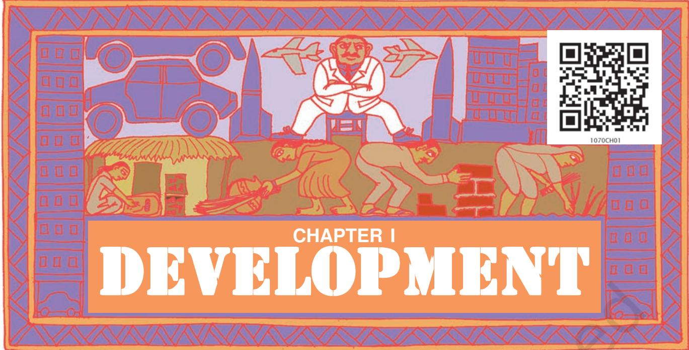
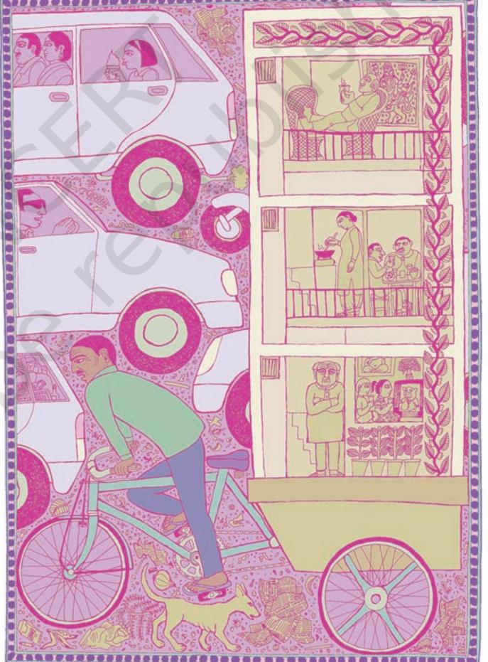
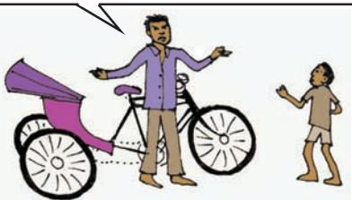
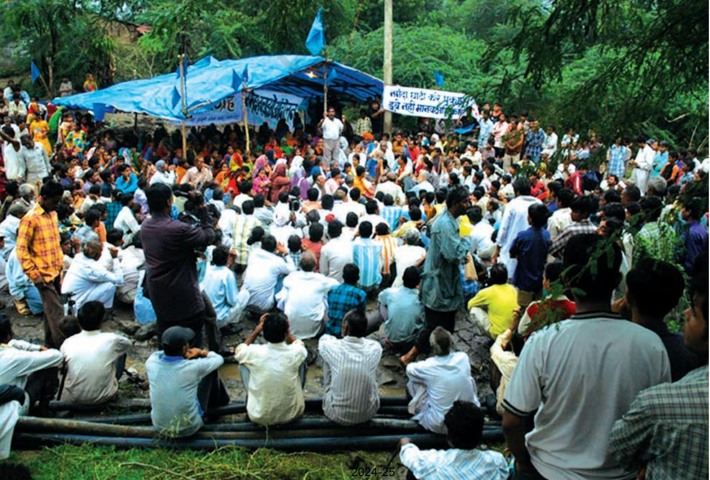
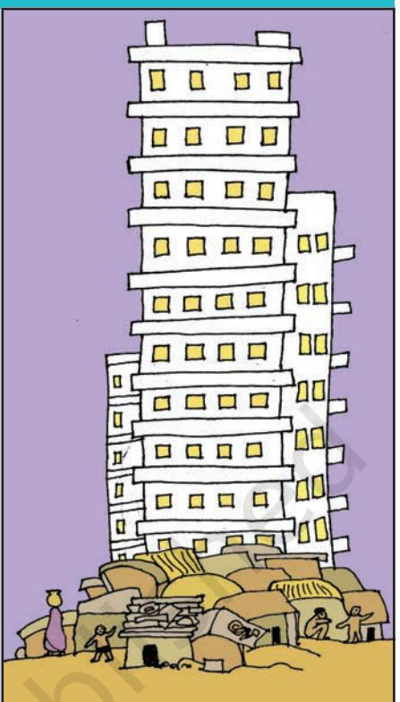
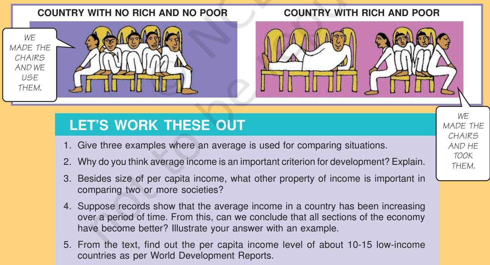
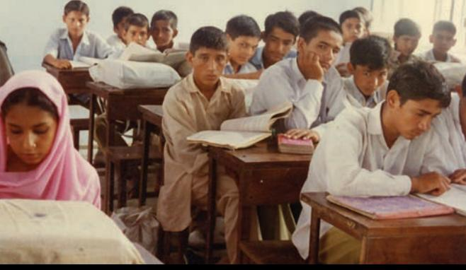
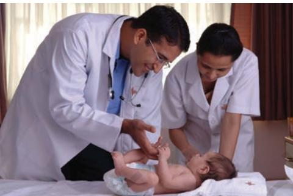
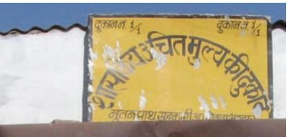
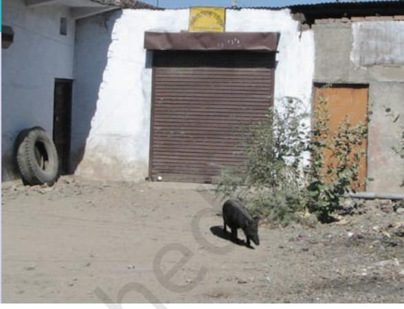

# **NOTES FOR NOTES FOR TEACHERS THE TEACHER**

#### **CHAPTER I : DEVELOPMENT**

Development has many aspects. The purpose of this chapter is to enable students to understand this idea. They have to understand that people have different perspectives on development and there are ways by which we can arrive at common indicators for development. To do this, we have used situations that they can respond to in an intuitive manner; we have also presented analysis that is more complex and macro in nature.

How can countries or states be compared using some selected development indicators is another question that students would read about in this chapter. Economic development can be measured and income is the most common method for measuring development. However, the income method, though useful, has several weaknesses. Hence, we need newer ways of looking at development using indicators of quality of life and environmental sustainability.

It is necessary for you to expect the students to respond actively in the classroom and on a topic such as the above, there would be wide variation in opinion and possibility of debate. Allow students to argue their point of view. At the end of each section there are a few questions and activities. These serve two purposes: first, they recap the ideas discussed in the section and second, they enable better understanding of the themes discussed by bringing the learners closer to their real life situations.

There are certain terms used in this chapter that would require clarification — Per Capita Income, Literacy Rate, Infant Mortality Rate, Attendance Ratio, Life Expectancy, Gross Enrolment Ratio, and Human Development Index. Though data pertaining to these terms are provided, these would need further explanation. You may also need to clarify the concept of Purchasing Power Parity that is used to calculate Gross National Income per capita in Table 1.6. It is necessary to keep in mind that these terms are used as an aid to the discussion and not something to be memorised.

#### Sources for Information

The data for this chapter is taken from reports published by the Government of India (*Economic Survey*, Reports of the National Family Health Survey and Handbook of Statistics on the Indian Economy), United Nations Development Programme (*Human Development Report*) and World Bank (*World Development Indicators*). Many of these reports are published every year. It may be interesting to look up these reports if they are available in your school library. If not, you may log on to the websites of these institutions *(www.budgetindia.nic.in, www.undp.org,www.worldbank.org, www.rbi.org).*

The idea of development or progress has always been with us. We have aspirations or desires about what we would like to do and how we would like to live. Similarly, we have ideas about what a country should be like. What are the essential things that we require? Can life be better for all? How should people live together? Can there be more equality? Development involves thinking about these questions and about the ways in which we can work towards achieving these goals. This is a complex task and in this chapter we shall make a beginning at understanding development. You will learn more about these issues in greater depth in higher classes. Also, you will find answers to many of these questions not just in economics but also in your course in history and political science. This is because the way we live today is influenced by the past. We can't desire for change without being aware of this. In the same way, it is only through a democratic political process that these hopes and possibilities can be achieved in real life.

*"Without me they cannot develop... in this system I cannot develop!"*

DEVELOPMENT 3

### WHAT DEVELOPMENT PROMISES — DIFFERENT PEOPLE, DIFFERENT GOALS

Let us try to imagine what development or progress is likely to mean to different persons listed in Table 1.1. What are their aspirations? You will find that some columns are partially filled. Try to complete the table. You can also add any other category of persons.

YOU WANT A CAR? THE WAY OUR COUNTRY IS SET UP ALL YOU CAN HOPE FOR IS MAY BE TO ONE DAY OWN THE RICKSHAW YOU PULL!

#### **TABLE 1.1 DEVELOPMENTAL GOALS OF DIFFERENT CATEGORIES OF PERSONS**

| Category of Person | Developmental Goals / Aspirations |
| --- | --- |
| Landless rural labourers | More days of work and better wages; local school is able to |
|  | provide quality education for their children; there is no social |
|  | discrimination and they too can become leaders in the village. |
| Prosperous farmers from Punjab | Assured a high family income through higher support prices for their crops and through hardworking and cheap labourers; they |
|  | should be able to settle their children abroad. |
| Farmers who depend only on |  |
| rain for growing crops |  |
| owning family |  |
| Urban unemployed youth |  |
|  | She gets as much freedom as her brother and is able to |
| A girl from a rich urban family | decide what she wants to do in life. She is able to pursue her |
|  | studies abroad. |
| An adivasi from Narmada valley |  |
| A rural woman from a land |  |
| A boy from a rich urban family |  |

Having filled Table 1.1, let us now examine it. Do all of these persons have the same notion of development or progress? Most likely not. Each one of them seeks different things. They seek things that are most important for them, i.e., that which can fulfil their aspirations or desires. In fact, at times, two persons or groups of persons may seek things

4 UNDERSTANDING ECONOMIC DEVELOPMENT

which are conflicting. A girl expects as much freedom and opportunity as her brother, and that he also shares in the household work. Her brother may not like this. Similarly, to get more electricity, industrialists may want more dams. But this may submerge the land and disrupt the lives of people who are displaced – such as tribals. They might resent this and may prefer small check dams or tanks to irrigate their land.

So, two things are quite clear: one, different persons can have different developmental goals and two, what may be development for one may not be development for the other. It may even be destructive for the other.

THOSE PEOPLE DON'T WANT TO DEVELOP!

#### INCOME AND OTHER GOALS

If you go over Table 1.1 again, you will notice one common thing: what people desire are regular work, better wages, and decent price for their crops or other products that they produce. In other words, they want more income.

Besides seeking more income, oneway or the other, people also seek things like equal treatment, freedom, security, and respect of others. They resent discrimination. All these are important goals. In fact, in some cases, these may be more important than more income or more consumption because material goods are not all that you need to live.

Money, or material things that one can buy with it, is one factor on which our life depends. But the quality of our life also depends on non-material things mentioned above. If it is not obvious to you, then just think of the role of your friends in your life. You may desire their friendship. Similarly, there are many things that are not easily measured but they mean a lot to our lives. These are often ignored.

*A demonstration meeting against raising the height of Sardar Sarovar Dam on Narmada River*

However, it will be wrong to conclude that what cannot be measured is not important.

Consider another example. If you get a job in a far off place, before accepting it you would try to consider many factors, apart from income, such as facilities for your family, working atmosphere, or opportunity to learn. In another case, a job may give you less pay but may offer regular employment that enhances your sense of security. Another job, however, may offer high pay but no job security and also leave no time for your family. This will reduce your sense of security and freedom.

Similarly, for development, people look at a mix of goals. It is true that if women are engaged in paid work, their dignity in the household and society increases. However, it is also the case that if there is respect for women there would be more sharing of housework and a greater acceptance of women working outside. A safe and secure environment may allow more women to take up a variety of jobs or run a business.

Hence, the developmental goals that people have are not only about better income but also about other important things in life.

#### **LET'S WORK THESE OUT**

- 1. Why do different persons have different notions of development? Which of the following explanations is more important and why?
	- (a) Because people are different.
	- (b) Because life situations of persons are different.
- 2. Do the following two statements mean the same? Justify your answer.
	- (a) People have different developmental goals.
	- (b) People have conflicting developmental goals.
- 3. Give some examples where factors other than income are important aspects of our lives.
- 4. Explain some of the important ideas of the above section in your own words.

### NATIONAL DEVELOPMENT

If, as we have seen above, individuals seek different goals, then their notion of national development is also likely to be different. Discuss among yourselves on what India should do for development.

Most likely, you would find that different students in the class have given different answers to the above question. In fact, you might yourself think of many different answers and not be too sure of any of these. It is very important to keep in mind that

#### different persons could have different as well as conflicting notions of a country's development.

However, can all the ideas be considered equally important? Or, if there are conflicts how does one decide? What would be a fair and just path for all? We also have to think whether there is a better way of doing things. Would the idea benefit a large number of people or only a small group? National development means thinking about these questions.

#### 6 UNDERSTANDING ECONOMIC DEVELOPMENT

### **LET'S WORK THESE OUT**

#### **Discuss the following situations:**

- 1. Look at the picture on the right. What should be the developmental goals for such an area?
- 2. Read this newspaper report and answer the questions that follow:

A vessel dumped 500 tonnes of liquid toxic wastes into open-air dumps in a city and in the surrounding sea. This happened in a city called Abidjan in Ivory Coast, a country in Africa. The fumes from the highly toxic waste caused nausea, skin rashes, fainting, diarrhoea etc. After a month seven persons were dead, twenty in hospital and twenty six thousand treated for symptoms of poisoning.

> A multinational company dealing in petroleum and metals had contracted a local company of the Ivory Coast to dispose the toxic waste from its ship.

- (i) Who are the people who benefited and who did not?
- (ii) What should be the developmental goal for this country?
- 3. What can be some of the developmental goals for your village, town or locality?

### **ACTIVITY 1**

If even the idea of what constitutes development can be varied and conflicting, then certainly there can be differences about ways of developing. If you know of any such controversy, try to find out arguments advanced by different people. You may do so by talking to different persons or you may find it from

DEVELOPMENT 7

newspapers and television.

## HOW TO COMPARE DIFFERENT COUNTRIES OR STATES?

You might ask if development can mean different things, how come some countries are generally called developed and others under developed? Before we come to this, let us consider another question.

When we compare different things, they could have similarities as well as differences. Which aspects do we use to compare them? Let us look at students in the class itself. How do we compare different students? They differ in their height, health, talents and interests. The healthiest student may not be the most studious one. The most intelligent student may not be the friendliest one. So, how do we compare students? The criterion we may use depends on the purpose of comparison. We use different criterion to choose a sports team, a debate team, a music team or a team to organise a picnic. Still, if for some purpose, we have to choose the criterion for the all-round progress of children in the class, how shall we do it?

Usually we take one or more important characteristics of persons and compare them based on these characteristics. Of course, there can be differences about what are important characteristics that should form the basis of comparison: friendliness and spirit of cooperation, creativity or marks secured?

This is true of development too. For comparing countries, their income is considered to be one of the most important attributes. Countries with higher income are more developed than others with less income. This is based on the understanding that more income means more of all things that human beings need. Whatever people like, and should have, they will be able to get with greater income. So, greater income itself is considered to be one important goal.

Now, what is the income of a country? Intuitively, the income of the country is the income of all the residents of the country. This gives us the total income of the country.

However, for comparison between countries, total income is not such an useful measure. Since, countries have different populations, comparing total income will not tell us what an average person is likely to earn. Are people in one country better off than others in a different country? Hence, we compare the average income which is the total income of the country divided by its total population. The average income is also called per capita income.

In World Development Reports, brought out by the World Bank, this criterion is used in classifying countries. Countries with per capita income of US$ 49,300 per annum and above in 2019, are called high income or rich countries and those with per capita income of US$ 2500 or less are called low-income countries. India comes in the category of low middle income countries because its per capita income in 2019 was just US$ 6700 per annum. The rich countries, excluding countries of Middle East and certain other small countries, are generally called developed countries.

#### 8 UNDERSTANDING ECONOMIC DEVELOPMENT

# Average Income

#### **While 'averages' are useful for comparison, they also hide disparities**

*For example, let us consider two countries, A and B. For the sake of simplicity, we have assumed that they have only five citizens each. Based on Based onBased on data given in Table 1.2, calculate the average income for both the countries.*

| TABLE 1.2 | COMPARISON OF TWO |  |  |  |  |  |
| --- | --- | --- | --- | --- | --- | --- |
| COUNTRIES |  |  |  |  |  |  |
| Country | Monthly incomes of citizens (in Rupees) |  |  |  |  |  |
| I | IV | II | III |  | V | Average |
| Country A 9500 | 10000 10200 | 10500 | 9800 |  |  |  |
| Country B 500 |  | 500 | 500 | 500 | 48000 |  |

*Will you be equally happy to live in both these countries? Are both equally developed? Perhaps some of us may like to live in country B if we are* *assured of being its fifth citizen but if it is a lottery that decides our citizenship number then perhaps most of us will prefer to live in country A. Even though both the countries have identical average income, country A is preferred because it has more equitable distribution. In this country people are neither very rich nor extremely poor. On the other hand most citizens in country B are poor and one person is extremely rich. Hence, while average income is useful for comparison it does not tell us how this income is distributed among people.*

- 6. Write a paragraph on your notion of what should India do, or achieve, to become a developed country.
DEVELOPMENT 9 DEVELOPMENT 9

# **INCOME AND OTHER CRITERIA**

When we looked at individual aspirations and goals, we found that people not only think of better income but also have goals such as security, respect for others, equal treatment, freedom, etc. in mind. Similarly, when we think of a nation or a region, we may, besides average income, think of other equally important attributes.

| TABLE 1.3 | PER CAPITA INCOME OF SELECT STATES |
| --- | --- |
| State | Per Capita Income for 2018–19 (in Rs) |
| Haryana Kerala | 2,36,147 2,04,105 |
| Bihar | 40,982 |

*Source : Economic Survey 2020–21, P.A 29.*

What could these attributes be? Let us examine this through an example. Table 1.3 gives the per capita income of Haryana, Kerala and Bihar. Actually, these figures are of Per Capita Net State Domestic Product at Current Prices for 2018–19. Let us ignore what this complicated term exactly means. Roughly, we can take it to be the per capita income of the state. We find that of the three, Haryana has the highest per capita income and Bihar is at the bottom. This means that, on an average, a person in Haryana earned Rs 2,36,147 in one year whereas, on an average, a person in Bihar earned only around Rs 40,982. So, if per capita income were to be used as the measure of development, Haryana will be considered the most developed and Bihar the least developed state of the three. Now, let us look at certain other data pertaining to these states given in Table 1.4.

#### **TABLE 1.4 SOME COMPARATIVE DATA ON HARYANA, KERALA AND BIHAR**

| State | Infant Mortality Rate per 1,000 | Literacy Rate % 2017–18 | Net Attendance Ratio (per 100 persons) secondary stage |
| --- | --- | --- | --- |
|  | live births (2018) |  | (age 14 and 15 years) 2017–18 |
| Haryana | 30 | 82 | 61 |
| Kerala | 7 | 94 | 83 |
| Bihar | 32 | 62 | 43 |

*Sources : Economic Survey 2020–21, P.A 157, National Sample Survey Organisation (Report No. 585), National Statistical Office, Government of India.*

#### *Explanation of some of the terms used in this table:*

*Infant Mortality Rate (or IMR) indicates the number of children that die before the age of one year as a proportion of 1000 live children born in that particular year.*

*Literacy Rate measures the proportion of literate population in the 7-and-above age group.*

*Net Attendance Ratio is the total number of children of age group 14 and 15 years attending school as a percentage of total number of children in the same age group.*

#### 10 UNDERSTANDING ECONOMIC DEVELOPMENT

What does this table show? The first column of the table shows that in Kerala, out of 1000 children born, 7 died before completing one year of age but in Haryana the proportion of children dying within one year of birth was 30, which is nearly three times more than that of Kerala. On the other hand, the per capita income of Haryana is more than that of Kerala as shown in Table 1.3. Just think of how dear you are to your parents, think of how every one is so happy when a child is born. Now, try to think of parents whose children die before they even celebrate their first birthday. How painful it must be to these parents? Next, note the year to which this data pertains. It is 2018. So we are not talking of old times; it is 70 years after independence when our metro cities are full of high rise buildings and shopping malls!

### **PUBLIC FACILITIES**

How is it that the average person in Haryana has more income than the average person in Kerala but lags behind in these crucial areas? The reason is — money in your pocket cannot buy all the goods and services that you may need to live well. So, income by itself is not a completely adequate indicator of material goods and services that citizens are able to use. For example, normally, your money cannot buy you a pollutionfree environment or ensure that you get unadulterated medicines, unless you can afford to shift to a community that already has all these things. Money may also not be able to protect you from infectious diseases, unless the whole of your community takes preventive steps.

The problem does not end with Infant Mortality Rate. The last column of table 1.4 shows that about half of the children aged 14-15 in Bihar are not attending school beyond Class 8. This means that if you went to school in Bihar nearly half of your elementary class friends would be missing. Those who could have been in school are not there! If this had happened to you, you would not be able to read what you are reading now.

*Most babies require basic healthcare*

Actually for many of the important things in life the best way, also the cheapest way, is to provide these goods and services collectively. Just think – will it be cheaper to have collective security for the whole locality or for each house to have its own security staff? What if no one, other than you, in your village or locality is interested in studying? Would you be able to study? Not unless your parents could afford to send you to some private school elsewhere. So you are actually able to study because many other children also want to study and because many people believe that the government should open schools and provide other facilities so that all children have a chance to study. Even now, in many areas, children, particularly girls, are not able to go to high school because the government/society has not provided adequate facilities.

Kerala has a low Infant Mortality Rate because it has adequate provision of basic health and educational facilities. Similarly, in some states, the Public Distribution System (PDS) functions well. Health and nutritional status of people of such states is certainly likely to be better.

## **LET'S WORK THESE OUT**

- 1. Look at data in Tables 1.3 and 1.4. Is Haryana ahead of Kerala in literacy rate etc., as it is in terms of per capita income?
- 2. Think of other examples where collective provision of goods and services is cheaper than individual provision.
- 3. Does availability of good health and educational facilities depend only on amount of money spent by the government on these facilities? What other factors could be relevant?
- 4. In a study, it was found that in Tamil Nadu, 90 per cent of the people living in rural areas used a ration shop, whereas in West Bengal only 35 per cent of rural people did so. Where would people did better off and why?

#### **ACTIVITY 2**

Study Table 1.5 carefully and fill in the blanks in the following paragraphs. For this, you may need to make calculations based on the table.

# **TABLE 1.5 EDUCATIONAL ACHIEVEMENT OF RURAL POPULATION OF UTTAR PRADESH**

| Category | Male | Female |
| --- | --- | --- |
| Literacy rate for rural population | 76% | 54% |
| Literacy rate for rural children in age group 10-14 years | 90% | 87% |
| Percentage of rural children aged 10-14 attending school | 85% | 82% |

- (a) The literacy rate for all age groups, including young and old, is _____ for rural males and _____ for rural females. However, it is not just that these many adults could not attend school but that there are _____ who are currently not in school.
- (b) It is clear from the table that _____ % of rural girls and _____% of rural boys are not attending school. Therefore, illiteracy among children in the age group 10- 14 is as high as _____% for rural females and _____% for rural males.
- (c) This high level of illiteracy among __________ age group, even after more than 70 years of our independence, is most disturbing. In many other states also we are nowhere near realisation of the constitutional goal of free and compulsory education for all children up to the age of 14, which was expected to be achieved by 1960.

### **ACTIVITY 3**

One way to find out if we are properly nourished is to calculate what nutrition scientists call Body Mass Index (BMI). This is easy to calculate. Let each student in the class find out his or her weight and height. Take the weight of each student in kilograms (kg). Then, take the height by drawing up a scale on the wall and measuring accurately with the head straight. Convert the height recorded in centimeters into meters. Divide the weight in kg by the square of the height. The number you get is called BMI. Then, look at the BMI-for-Age

tables given on pages 90–91. A student's BMI could be within the normal range or less than that (underweight) or more (obesity). For example, if a girl student is 14 years and 8 month old and the BMI is 15.2, then she is undernourished. Similarly, if the BMI of a boy aged 15 years and 6 months is 28, then he is overweight. Discuss the life situation, food and exercise habits of students, in general, without body shaming anyone.

# HUMAN DEVELOPMENT REPORT

*Once it is realised that even though the level of income is important, yet it is an inadequate measure of the level of development, we begin to think of other criterion. There could be a long list of such criterion but then it would not be so useful. What we need is a small number of the most important things. Health and education indicators, such as the ones we used in comparison of Kerala and Haryana, are among them. Over the past decade or so, health and education indicators have come to be widely used along with income as a measure of development. For instance, Human Development Report published by UNDP compares countries based on the educational levels of the people, their health status and per capita income. It would be interesting to look at certain relevant data regarding India and its neighbours from Human Development Report 2021-22.*

#### **TABLE 1.6 SOME DATA REGARDING INDIA AND ITS NEIGHBOURS FOR 2021**

| Country | Gross National | Life | Mean Years of | HDI Rank in |
| --- | --- | --- | --- | --- |
|  | Income (GNI) | Expectancy | Schooling of | the world |
|  | per capita | at birth | People aged 25 | (2021-22) |
|  | (2017 PPP $) |  | and above |  |
| Sri Lanka | 12,578 | 76.4 | 10.8 | 73 |
| India | 6,590 | 67.2 | 6.7 | 132 |
| Myanmar | 3,851 | 65.7 | 6.4 | 149 |
| Pakistan | 4,624 | 66.1 | 4.5 | 161 |
| Nepal | 3,877 | 68.4 | 5.1 | 143 |
| Bangladesh | 5,472 | 72.4 | 7.4 | 129 |

*Source : Human Development Report, 2021-22, United Nations Development Programme, New York.*

#### *NOTES*

- *1. HDI stands for Human Development Index. HDI ranks in above table are out of 189 countries in all.*
- *2. Life Expectancy at birth denotes, as the name suggests, average expected length of life of a person at the time of birth.*
- *3. Per Capita Income is calculated in dollars for all countries so that it can be compared. It is also done in a way so that every dollar would buy the same amount of goods and services in any country.*

DEVELOPMENT 13

Isn't it surprising that a small country in our neighbourhood, Sri Lanka, is much ahead of India in every respect and a big country like ours has such a low rank in the world? Table 1.6 also shows that though Nepal and Bangladesh have low per capita income than that of India, yet they are better than India in life expectancy.

Many improvements have been suggested in calculating HDI and many new components have been added to the Human Development Report but, by pre-fixing Human to Development, it has made it very clear that what is important in development is what is happening to citizens of a country. It is people, their health, their well being, that is most important.

Do you think there are certain other aspects that should be considered in measuring human development?

#### SUSTAINABILITY OF DEVELOPMENT

Suppose for the present that a particular country is quite developed. We would certainly like this level of development to go up further or at least be maintained for future generations. This is obviously desirable. However, since the second half of the twentieth century, a number of scientists have been warning that the present type, and levels, of development are not sustainable.

*"We have not inherited the world from our forefathers — we have borrowed it from our children."*

LET'S UNDERSTAND WHY THIS IS SO THROUGH THE FOLLOWING EXAMPLE:

# Example 1: Groundwater in India

*"Recent evidence suggests that the groundwater is under serious threat of overuse in many parts of the country. About 300 districts have reported a water level decline of over 4 metres during the past 20 years. Nearly one-third of the country is overusing their groundwater reserves. In another 25 years, 60 per cent of the country would be doing the same if the present way of using this resource continues. Groundwater overuse is particularly found in the agriculturally prosperous regions of Punjab and Western U.P., hard rock plateau areas of central and south India, some coastal areas and the rapidly growing urban settlements."*

- (a) Why groundwater is overused?
- (b) Can there be development without overuse?

# 14 UNDERSTANDING ECONOMIC DEVELOPMENT

Groundwater is an example of renewable resources. These resources are replenished by nature as in the case of crops and plants. However, even these resources may be overused. For example, in the case of groundwater, if we use more than what is being replenished by rain then we would be overusing this resource.

Non-renewable resources are those which will get exhausted after a few years of use. We have a fixed stock on earth which cannot be replenished. We do discover new resources that we did not know of earlier. New sources in this way add to the stock. However, over time, even this will get exhausted.

FOR EXAMPLE, CRUDE OIL THAT WE EXTRACT FROM THE EARTH IS A NON- RENEWABLE RESOURCE. HOWEVER WE MAY FIND A SOURCE OF OIL THAT WE DID NOT KNOW OF EARLIER. EXPLORATIONS ARE BEING UNDERTAKEN ALL THE TIME.

# Example 2: Exhaustion of Natural Resources

*Look at the following data for crude oil.*

#### **TABLE 1.7 CRUDE OIL RESERVES**

| Region/Country | Reserves (2017) | Number of Years |
| --- | --- | --- |
|  | (Thousand Million Barrels) | Reserves will last |
| Middle East | 808 | 70 |
| United States of America | 50 | 10.5 |
| World | 1697 | 50.2 |

Source : BP Statistical Review of World Energy, June 2018, P.12.

*The table gives an estimate of reserves of crude oil (column1). More important, it also tells us for how many years the stock of crude oil will last if people continue to extract it at the present rate. The reserves would last only 50 years more. This is for the world as a whole. However, different countries face different situations. Countries like India depend on importing oil from abroad because they do not have enough stocks of their own. If prices of oil increase this becomes a burden for everyone. There are countries like USA which have low reserves and hence want to secure oil through military or economic power.*

*The question of sustainability of development raises many fundamentally new issues about the nature and process of development.*

- *(a) Is crude oil essential for the development process in a country? Discuss.*
- *(b) India has to import crude oil. What problems do you anticipate for the country looking at the above situation?*

Consequences of environmental degradation do not respect national or state boundaries; this issue is no longer region or nation specific. Our future is linked together. Sustainability of development is comparatively a new area of knowledge in which scientists, economists, philosophers and other social scientists are working together.

In general, the question of development or progress is perennial. At all times as a member of society and as individuals we need to ask where we want to go, what we wish to become and what our goals are. So the debate on development continues.

#### **EXERCISES**

- 1. Development of a country can generally be determined by
	- (i) its per capita income
	- (ii) its average literacy level
	- (iii) health status of its people
	- (iv) all the above
- 2. Which of the following neighbouring countries has better performance in terms of human development than India?
	- (i) Bangladesh
	- (ii) Sri Lanka
	- (iii) Nepal
	- (iv) Pakistan
- 3. Assume there are four families in a country. The average per capita income of these families is Rs 5000. If the income of three families is Rs 4000, Rs 7000 and Rs 3000 respectively, what is the income of the fourth family?
	- (i) Rs 7500
	- (ii) Rs 3000
	- (iii) Rs 2000
	- (iv) Rs 6000
- 4. What is the main criterion used by the World Bank in classifying different countries? What are the limitations of this criterion, if any?
- 5. In what respects is the criterion used by the UNDP for measuring development different from the one used by the World Bank?
- 6. Why do we use averages? Are there any limitations to their use? Illustrate with your own examples related to development.
- 7. Kerala, with lower per capita income has a better human development ranking than Haryana. Hence, per capita income is not a useful criterion at all and should not be used to compare states. Do you agree? Discuss.
- 8. Find out the present sources of energy that are used by the people in India. What could be the other possibilities fifty years from now?
- 9. Why is the issue of sustainability important for development?

## 16 UNDERSTANDING ECONOMIC DEVELOPMENT

- 10. "The Earth has enough resources to meet the needs of all but not enough to satisfy the greed of even one person". How is this statement relevant to the disscusion of development? Discuss.
- 11. List a few examples of environmental degradation that you may have observed around you.
- 12. For each of the items given in Table 1.6, find out which country is at the top and which is at the bottom.
- 13. The following table shows the proportion of adults (aged 15-49 years) whose BMI is below normal (BMI <18.5 kg/m2 ) in India. It is based on a survey of various states for the year 2019-21. Look at the table and answer the following questions.

| State | Male | Female |
| --- | --- | --- |
|  | (%) | (%) |
| Kerala | 8.5 | 10 |
| Karnataka | 17 | 21 |
| Madhya Pradesh | 28 | 28 |
| All States | 20 | 23 |

*Source: National Family Health Survey-5, 2019-21, http://rchiips.org*

- (i) Compare the nutritional level of people in Kerala and Madhya Pradesh.
- (ii) Can you guess why around one-fifth of people in the country are undernourished even though it is argued that there is enough food in the country? Describe in your own words.

## **ADDITIONAL PROJECT / ACTIVITY**

Invite three different speakers to talk to you about the development of your region. Ask them all the questions that come to your mind. Discuss these ideas in groups. Each group should prepare a wall chart, giving reasons about ideas that you agree or do not agree with.

