# NOTES FOR THE TEACHER

#### CHAPTER 2: SECTORS OF THE INDIAN ECONOMY

An economy is best understood when we study its components or sectors. Sectoral classification can be done on the basis of several criteria. In this chapter, three types of classifications are discussed: primary/secondary/tertiary; organised/ unorganised; and public/private. You can create a discussion about these types by taking examples familiar to the students and relate them to their daily life. It is important to emphasise the changing roles of sectors. This can be highlighted further by drawing attention of the students to the rapid growth of service sector. While elaborating the ideas provided in the chapter, the students may need to be familiarised with a few fundamental concepts such as Gross Domestic Product, Employment etc. Since the students may find this difficult to understand, it is necessary to explain to them through examples. Several activities and exercises are suggested in the chapter to help the students understand how a person's activity could be placed whether in the primary, secondary or tertiary, organised or unorganised, and public or private sector. You may encourage the students to talk to various working people around them (such as shop owners, casual workers, vegetable vendors, workshop mechanics, domestic workers etc.) to know more about how they live and work. Based on such information, the students can be encouraged to develop their own classification of economic activities.

Another important issue to be highlighted is about the problems caused by the changes in the roles of sectors. The chapter has taken the example of unemployment and what the government can do to solve it. The declining importance of agriculture and growing importance of industry and services should be related to the experience of the children by taking more examples that they may observe in their day-to-day life. Information derived from the media could be used for this purpose. You may encourage the students to bring important cuttings and stories from newspapers, which could be prominently displayed in storyboards, and encourage the class to discuss these issues. While discussing the unorganised sector, the key issue of protecting the workers engaged in the sector should be highlighted. You may also encourage the students to visit persons and enterprises in the unorganised sector and get a first hand experience from real life situation.

#### Sources for Information

The GDP data used in this chapter pertaining to Gross Domestic Product at Factor Cost by Industry of Origin at 2011–12 prices is taken from *Real Time Handbook of Statistics on Indian Economy.* It is a valuable source of GDP and other information relating to the Indian economy. For evaluation purposes, particularly to develop the analytical ability of learners, teachers can refer to this report through the Internet to get data for different years. Due to change in methodology, latest data is not used in the chapter.

The employment figures are based on data taken from the five-yearly surveys on employment and unemployment conducted by the National Sample Survey Organisation (NSSO) now known as National Statistical Office (NSO). NSO is an organisation under the Ministry of Statistics and Programme Implementation, Government of India. The website you can log onto is: *http:/mospi.gov.in.* Employment data is also available from other sources such as Census of India.

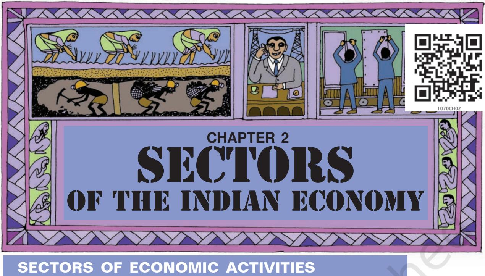

Let us look at these pictures. You will find that people are engaged in various economic activities. Some of these are activities producing goods. Some others are producing services. These activities are happening around us every minute even as we speak. How do we understand these activities? One way of doing this is to group them (classify them) using some important criterion. These groups are also called sectors.

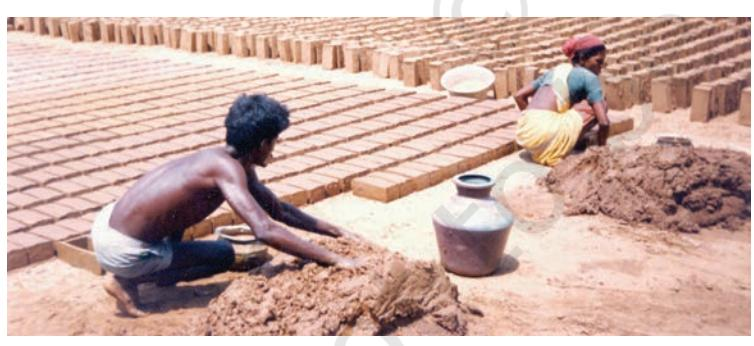

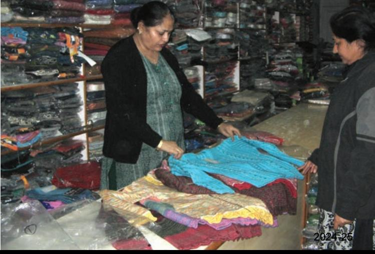

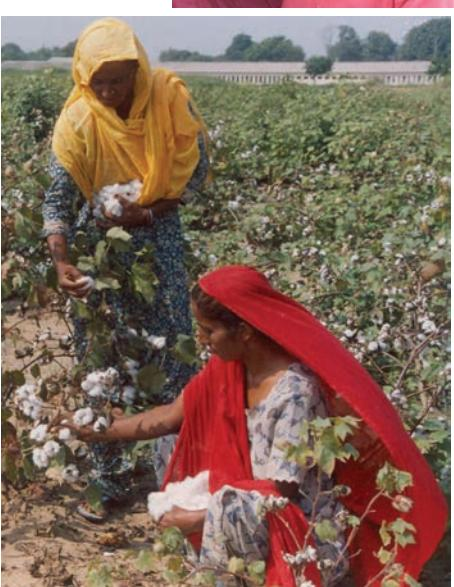

#### We begin by looking at different kind of economic activities.

There are many activities that are undertaken by directly using natural resources. Take, for example, the cultivation of cotton. It takes place within a crop season. For the growth of the cotton plant, we depend mainly, but not entirely, on natural factors like rainfall, sunshine and climate. The product of this activity, cotton, is a natural product. Similarly, in the case of an activity like dairy, we are dependent

Tertiary (Service) Sector

helps to develop other sectors

Primary (Agriculture) Sector

> on the biological process of the animals and availability of fodder etc. The product here, milk, also is a natural product. Similarly, minerals and ores are also natural products. When we produce a good by exploiting natural resources, it is an activity of the primary sector. Why primary? This is because it forms the base for all other products that we subsequently make. Since most of the natural products we get are from agriculture, dairy, fishing,

forestry, this sector is also called agriculture and related sector.

The secondary sector covers activities in which natural products are changed into other forms through ways of manufacturing that we associate with industrial activity. It is the next step after primary. The product is not produced by nature but has to be made and therefore some process of manufacturing is essential. This could be in a factory, a workshop or at home. For example, using cotton fibre from the plant, we spin yarn and weave cloth. Using sugarcane as a raw material, we make sugar or *gur*. We convert earth into bricks and use bricks to make houses and buildings. Since this sector gradually became associated with the different kinds of industries that came up, it is also called as industrial sector.

After primary and secondary, there is a third category of activities that falls under tertiary sector and is different from the above two. These are activities that help in the development of the primary and secondary sectors. These activities, by themselves, do not produce a good but they are an aid or a support for the production process. For example, goods that are produced in the primary or secondary sector would need to be transported by trucks or trains and then sold in wholesale and retail shops. At times, it may be necessary to store these in godowns. We also may need to talk to others over telephone or send letters (communication) or borrow money from banks (banking) to help production and trade. Transport, storage, communication, banking, trade are some examples of tertiary activities. Since these activities generate services rather than goods, the tertiary sector is also called the service sector.

Service sector also includes some essential services that may not directly help in the production of goods. For example, we require teachers, doctors, and those who provide personal services such as washermen, barbers, cobblers, lawyers, and people to do administrative and accounting works. In recent times, certain new services based on information technology such as internet cafe, ATM booths, call centres, software companies etc have become important.

produces manufactured goods

Secondary (Industrial) Sector

produces natural goods

20 UNDERSTANDING ECONOMIC DEVELOPMENT

Economic activities, though, are grouped into three different categories, are highly interdependent. Let us look at some examples.

## **TABLE 2.1 EXAMPLES OF ECONOMIC ACTIVITIES**

| EXAMPLE | WHAT DOES THIS SHOW? |
| --- | --- |
| Imagine what would happen if farmers | This is an example of the secondary or |
| refuse to sell sugarcane to a particular | industrial sector being dependent on |
| sugar mill. The mill will have to shut | the primary. |
| down. |  |
| Imagine what would happen to cotton |  |
| cultivation if companies decide not to |  |
| buy from the Indian market and import |  |
| all cotton they need from other |  |
| countries. Indian cotton cultivation will |  |
| become less profitable and the farmers |  |
| may even go bankrupt, if they cannot |  |
| quickly switch to other crops. Cotton |  |
| prices will fall. |  |
| Farmers buy many goods such as |  |
| tractors, pumpsets, electricity, |  |
| pesticides and fertilisers. Imagine what |  |
| would happen if the price of fertilisers |  |
| or pumpsets go up. Cost of cultivation |  |
| of the farmers will rise and their profits |  |
| will be reduced. |  |
| People working in industrial and service |  |
| sectors need food. Imagine what would |  |
| happen if there is a strike by |  |
| transporters and lorries refuse to take |  |
| vegetables, milk, etc. from rural areas. |  |
| Food will become scarce in urban areas |  |
| whereas farmers will be unable to sell |  |
| their products. |  |

### **LET'S WORK THESE OUT**

- 1. Complete the above table to show how sectors are dependent on each other.
- 2. Explain the difference between primary, secondary and tertiary sectors using examples other than those mentioned in the text.
- 3. Classify the following list of occupations under primary, secondary and tertiary sectors:
	- Tailor
	- Basket weaver
	- Flower cultivator
	- Milk vendor
	- Fishermen
	- Priest
	- Courier
- Workers in match factory
- Moneylender
- Gardener
- Potter
- Bee-keeper
- Astronaut
- Call centre employee
- 4. Students in a school are often classified into primary and secondary or junior and senior. What is the criterion that is used? Do you think this is a useful classification? Discuss.

#### COMPARING THE THREE SECTORS

The various production activities in the primary, secondary and tertiary sectors produce a very large number of goods and services. Also, the three sectors have a large number of people working in them to produce these goods and services. The next step, therefore, is to see how much goods and services are produced and how many people work in each sector. In an economy there could be one or more sectors which are dominant in terms of total production and employment, while other sectors are relatively small in size.

#### How do we count the various goods and services and know the total production in each sector?

With so many thousands of goods and services produced, you might think this is an impossible task! Not only would the task be enormous, you might also wonder how we can add up cars and computers and nails and furniture. It won't make sense!!!

You are right in thinking so. To get around this problem, economists suggest that the values of goods and services should be used rather than adding up the actual numbers. For example, if 10,000 kgs of wheat is sold at Rs 20 per kg, the value of wheat will be Rs 2,00,000. The value of 5000 coconuts at Rs 15 per coconut will be Rs 75,000. Similarly, the value of goods and services in the three sectors are calculated, and then added up.

Remember, there is one precaution one has to take. Not every good (or service) that is produced and sold needs to be counted. It makes sense only to include the final goods and services. Take, for instance, a farmer who sells wheat to a flour mill for Rs 20 per kg. The mill grinds the wheat and sells the flour to a biscuit company for Rs 25 per kg. The biscuit company uses the flour and things such as sugar and oil to make four packets of biscuits. It sells biscuits in the market to the consumers for Rs 80 (Rs 20 per packet). Biscuits are the final goods, i.e., goods that reach the consumers.

Why are only 'final goods and services' counted? In contrast to final goods, goods such as wheat and the wheat flour in this example are intermediate goods. Intermediate goods are used up in producing final goods and services. The value of final goods already includes the value of all the intermediate goods that are used in making the final good. Hence, the value of Rs 80 for the biscuits (final good) already includes the value of flour (Rs 25). Similarly, the value of all other intermediate goods would have been included. To count the value of the flour and wheat

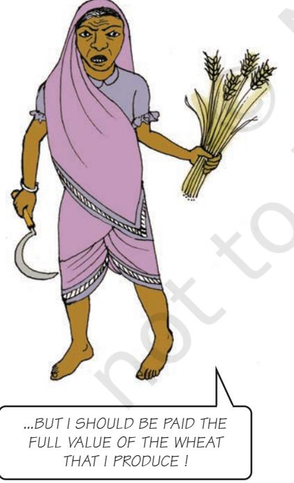

22 UNDERSTANDING ECONOMIC DEVELOPMENT

separately is therefore not correct because then we would be counting the value of the same things a number of times. First as wheat, then as flour and finally as biscuits.

The value of final goods and services produced in each sector during a particular year provides the total production of the sector for that year. And the sum of production in the three sectors gives what is called the Gross Domestic Product (GDP) of a country. It is the value of all final goods and services produced within a country during a particular year. GDP shows how big the economy is.

In India, the mammoth task of measuring GDP is undertaken by a central government ministry. This Ministry, with the help of various government departments of all the Indian states and union territories, collects information relating to total volume of goods and services and their prices and then estimates the GDP.

#### Historical Change in Sectors

Generally, it has been noted from the histories of many, now developed, countries that at initial stages of development, primary sector was the most important sector of economic activity.

As the methods of farming changed and agriculture sector began to prosper, it produced much more food than before. Many people could now take up other activities. There were increasing number of craftpersons and traders. Buying and selling activities increased many times. Besides, there were also transporters, administrators, army etc. However, at this stage, most of the goods produced were natural products from the primary sector and most people were also employed in this sector.

Over a long time (more than hundred years), and especially because new methods of manufacturing were introduced, factories came up and started expanding. Those people who had earlier worked on farms now began to work in factories in large numbers. They were forced to do so as you read in history chapters. People began to use many more goods that were produced in factories at cheap rates. Secondary sector gradually became the most important in total production and employment. Hence, over time, a shift had taken place. This means that the importance of the sectors had changed.

In the past 100 years, there has been a further shift from secondary to tertiary sector in developed countries. The service sector has become the most important in terms of total production. Most of the working people are also employed in the service sector. This is the general pattern observed in developed countries.

What is the total production and employment in the three sectors in India? Over the years have there been changes similar to the pattern observed for the developed countries? We shall see in the next section.

#### **LET'S WORK THESE OUT**

- 1. What does the history of developed countries indicate about the shifts that have taken place between sectors?
- 2. Correct and arrange the important aspects for calculating GDP from this Jumble.

To count goods and services we add the numbers that are produced. We count all those that were produced in the last five years. Since we shouldn't leave out anything we add up all these goods and services.

- 3. Discuss with your teacher how you could calculate the total value of a good or service by using the method of value added at each stage.
SECTORS OF THE INDIAN ECONOMY 23

#### PRIMARY, SECONDARY AND TERTIARY SECTORS IN INDIA

Graph 1 shows the production of goods and services in the three sectors. This is shown for two years, 1973-74 and 2013-14. We have used the data for these two years because the data are comparable and authentic. You can see how the total production has grown over the forty years.

#### **LET'S WORK THESE OUT**

Answer the following questions by looking at the graph:

- 1. Which was the largest producing sector in 1973-74?
- 2. Which is the largest producing sector in 2013-14?
- 3. Can you say which sector has grown the most over forty years?
- 4. What was the GDP of India in 2013-14?

What does the comparison between1973-74 and 2013-14 show? What conclusions can we draw from the comparison? Let's find out.

#### Rising Importance of the Tertiary Sector in Production

Over the forty years between 1973-74 and 2013-14, while production in all the three sectors has increased, it has increased the most in the tertiary sector. As a result, in the year 2013-14, the tertiary sector has emerged as the largest producing sector in India replacing the primary sector.

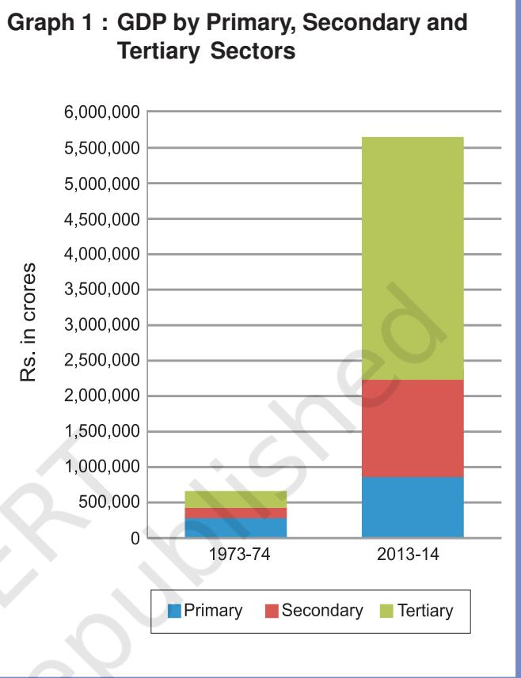

#### Why is the tertiary sector becoming so important in India? There could be several reasons.

First, in any country several services such as hospitals, educational institutions, post and telegraph services, police stations, courts, village administrative offices, municipal corporations, defence, transport, banks, insurance companies, etc. are required. These can be considered as *basic services*. In a developing country the government has to take responsibility for the provision of these services.

Second, the development of agriculture and industry leads to the development of services such as

24 UNDERSTANDING ECONOMIC DEVELOPMENT

transport, trade, storage and the like, as we have already seen. Greater the development of the primary and secondary sectors, more would be the demand for such services.

Third, as income levels rise, certain sections of people start demanding many more services like eating out, tourism, shopping, private hospitals, private schools, professional training etc. You can see this change quite sharply in cities, especially in big cities.

Fourth, over the past decade or so, certain new services such as those based on information and communication technology have become important and essential. The production of these services has been rising rapidly. In Chapter 4, we shall see examples of these new services and the reasons for their expansion.

However, you must remember that not all of the service sector is growing equally well. Service sector in India employs many different kinds of people. At one end there are a limited number of services that employ highly skilled and educated workers. At the other end, there are a very large number of workers engaged in services such as small shopkeepers, repair persons, transport persons, etc. These people barely manage to earn a living and yet they perform these services because no alternative opportunities for work are available to them. Hence, only a part of this sector is growing in importance. You shall read more about this in the next section.

#### Where are most of the people employed?

Graph 2 presents percentage share of the three sectors in GDP. Now you can directly see the changing importance of the sectors over the forty years.

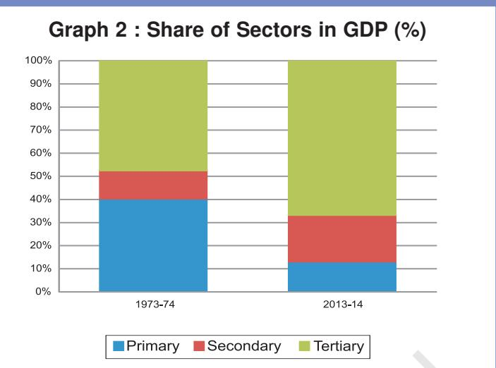

A remarkable fact about India is that while there has been a change in the share of the three sectors in GDP, a similar shift has not taken place in employment. Graph 3 shows the share of employment in the three sectors in 1977-78 and 2017-18. The primary sector continues to be the largest employer even now.

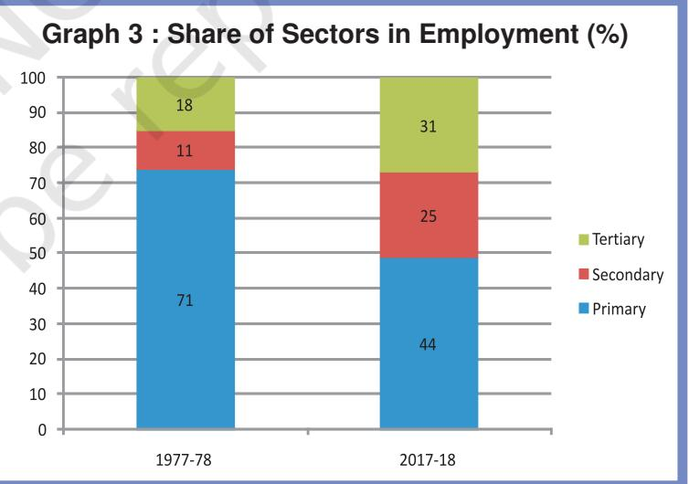

Why didn't a similar shift out of primary sector happen in case of employment? It is because not enough jobs were created in the secondary and tertiary sectors. Even

SECTORS OF THE INDIAN ECONOMY 25

though industrial output or the production of goods went up by more than nine times during the period, employment in the industry went up by around three times. The same applies to the tertiary sector as well. While production in the service sector rose by 14 times, employment in the service sector rose around five times.

As a result, more than half of the workers in the country are working in the primary sector, mainly in agriculture, producing only about one sixth of the GDP. In contrast to this, the secondary and tertiary sectors produce the rest of the produce whereas they employ less about half the people. Does this mean that the workers in agriculture are not producing as much as they could?

What it means is that there are more people in agriculture than is necessary. So, even if you move a few people out, production will not be affected. In other words, workers in the agricultural sector are underemployed.

For instance, take the case of a small farmer, Laxmi, owning about two hectares of unirrigated land dependent only on rain and growing crops, like *jowar* and *arhar*. All five members of her family work in the plot throughout the year. Why? They have nowhere else to go for work. You will see that everyone is working, none remains idle, but in actual fact, their labour effort gets divided. Each one is doing some work but no one is fully employed. This is the situation of underemployment, where people are apparently working but all of them are made to work less than their potential. This kind of underemployment is hidden in contrast to someone who does not have a job and is clearly visible as unemployed. Hence, it is also called disguised unemployment.

Now, supposing a landlord, Sukhram, comes and hires one or two members of the family to work on his land. Laxmi's family is now able to earn some extra income through wages. Since you do not need five people to look after that small plot, two people moving out does not affect production on their farm. In the above example, two people may move to work in a factory. Once again the earnings of the family would increase and they would also continue to produce as much from their land.

There are lakhs of farmers like Laxmi in India. This means that even if we remove a lot of people from agricultural sector and provide them with proper work elsewhere, agricultural production will not suffer. The incomes of the people who take up other work would increase the total family income.

This underemployment can also happen in other sectors. For example there are thousands of casual workers in the service sector in urban areas who search for daily employment. They are employed as painters, plumbers, repair persons and others doing odd jobs. Many of them don't find work everyday. Similarly, we see other people of the service sector on the street pushing a cart or selling something where they may spend the whole day but earn very little. They are doing this work because they do not have better opportunities.

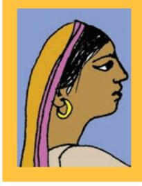

26 UNDERSTANDING ECONOMIC DEVELOPMENT

### **LET'S WORK THESE OUT**

- 1. Complete the table using the data given in Graphs 2 and 3 and answer the question that follows. Ignore if data are not available for some years.

| TABLE 2.2 | SHARE OF PRIMARY SECTOR IN |  |  |  |
| --- | --- | --- | --- | --- |
| GDP | AND EMPLOYMENT |  |  |  |
|  |  | 1973-74 1977-78 | 2013-14 | 2017-18 |
| Share in GDP |  |  |  |  |
| Share in employment |  |  |  |  |

What are the changes that you observe in the primary sector over a span of forty years?

- 2. Choose the correct answer:
	- Underemployment occurs when people
		- (i) do not want to work
		- (ii) are working in a lazy manner
		- (iii) are working less than what they are capable of doing
		- (iv) are not paid for their work
- 3. Compare and contrast the changes in India with the pattern that was observed for developed countries. What kind of changes between sectors were desired but did not happen in India?
- 4. Why should we be worried about underemployment?

#### How to Create More Employment?

From the above discussion, we can see that there continues to be considerable underemployment in agriculture. There are also people who are not employed at all. In what ways can one increase employment for people? Let us look at some of them.

Take the case of Laxmi with her two-hectare plot of unirrigated land. The government can spend some money or banks can provide a loan, to construct a well for her family to irrigate the land. Laxmi will then be able to irrigate her land and take a second crop, wheat, during the *rabi* season. Let us suppose that one hectare of wheat can provide employment to two people for 50 days (including sowing, watering, fertiliser

SECTORS OF THE INDIAN ECONOMY 27

application and harvesting). So, two more members of the family can be employed in her own field. Now suppose a new dam is constructed and canals are dug to irrigate many such farms. This could lead to a lot of employment generation within the agricultural sector itself reducing the problem of underemployment.

Now, suppose Laxmi and other farmers produce much more than before. They would also need to sell some of this. For this they may be required to transport their products to a nearby town. If the government invests some money in transportation and storage of crops, or makes better rural roads so that mini-trucks reach everywhere several farmers like Laxmi, who now have access to water, can continue to grow and sell these crops. This activity can provide productive employment to not just farmers but also others such as those in services like transport or trade.

Laxmi's need is not confined to water alone. To cultivate the land, she also needs seeds, fertilisers, agricultural equipment and pumpsets to draw water. Being a poor farmer, she cannot afford many of these. So, she will have to borrow money from moneylenders and pay a high rate of

*Gur Making in Haryana*

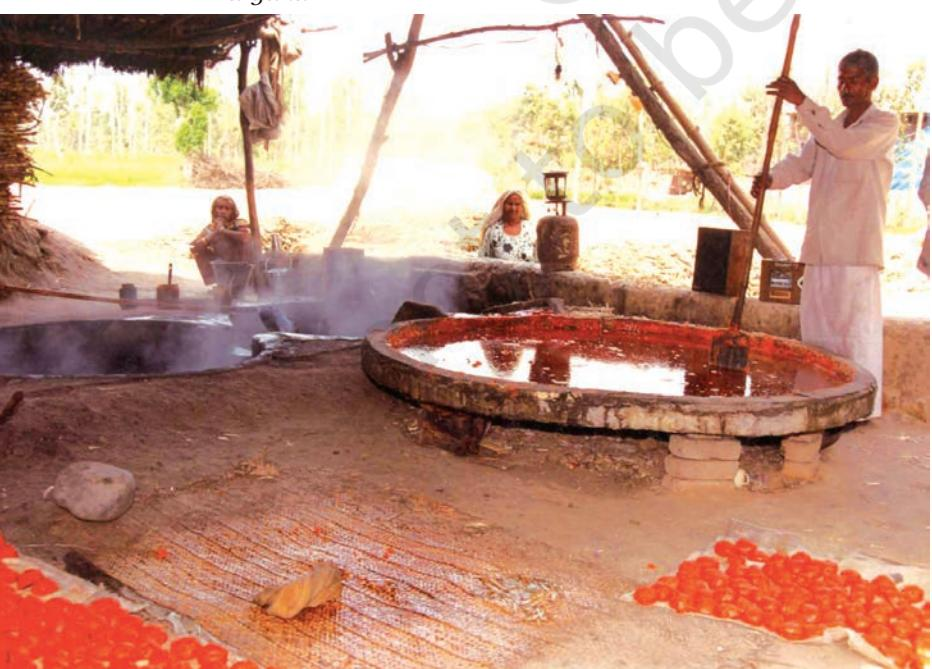

interest. If the local bank gives her credit at a reasonable rate of interest, she will be able to buy all these in time and cultivate her land. This means that along with water, we also need to provide cheap agricultural credit to the farmers for farming to improve. We will look at some of these needs in Chapter 3, Money and Credit.

Another way by which we can tackle this problem is to identify, promote and locate industries and services in semi-rural areas where a large number of people may be employed. For instance, suppose many farmers decide to grow *arhar* and chickpea (pulse crops). Setting up a *dal* mill to procure and process these and sell in the cities is one such example. Opening a cold storage could give an opportunity for farmers to store their products like potatoes and onions and sell them when the price is good. In villages near forest areas, we can start honey collection centres where farmers can come and sell wild honey. It is also possible to set up industries that process vegetables and agricultural produce like potato, sweet potato, rice, wheat, tomato, fruits, which can be sold in outside markets. This will provide employment in industries located in semi-rural areas and not necessarily in large urban centres.

> *What groups of people do you think are unemployed or underemployed in your area? Can you think of some measures that could be taken up for them?*

Do you know that in India about 60 per cent of the population belongs to the age group 5-29 years? Out of this, only about 51 per cent are attending educational institutions. The rest and particularly those aged less than 18 years may be at home or many of them may be working as child labourers. If these children are to attend schools, we will require more buildings, more teachers and other staff. A study conducted by the erstwhile Planning Commission (now known as NITI Aayog) estimates that nearly 20 lakh jobs can be created in the education sector alone. Similarly, if we are to improve the health situation, we need many more doctors, nurses, health workers etc. to work in rural areas. These are some ways by which jobs would be created and we would also be able to address the important aspects of development talked about in Chapter 1.

Every state or region has potential for increasing the income and employment for people in that area. It could be tourism, or regional craft industry, or new services like IT. Some of these would require proper planning and support from the government. For example, the same study by the Planning Commission says that if tourism as a sector is improved, every year we can give additional employment to more than 35 lakh people.

We must realise that some of the suggestions discussed above would take a long time to implement. For the short-term, we need some quick measures. Recognising this, the central government in India made a law implementing the Right to Work

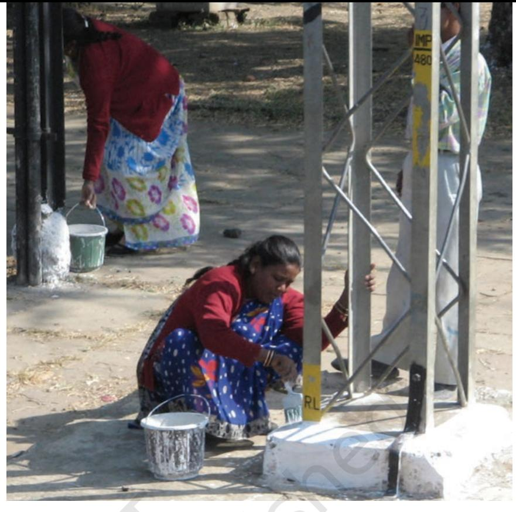

in about 625 districts of India. It is called Mahatma Gandhi National Rural Employment Guarantee Act 2005 (MGNREGA 2005). Under MGNREGA 2005, all those who are able to, and are in need of, work in rural areas are guaranteed 100 days of employment in a year by the government. If the government fails in its duty to provide employment, it will give unemployment allowances to the people. The types of work that would in future help to increase the production from land will be given preference under the Act.

#### **LET'S WORK THESE OUT**

- 1. Why do you think MGNREGA 2005 is referred to as ' Right to work' ?
- 2. Imagine that you are the village head. In that capacity suggest some activities that you think should be taken up under this Act that would also increase the income of people? Discuss.
- 3. How would income and employment increase if farmers were provided with irrigation and marketing facilities?
- 4. In what ways can employment be increased in urban areas?

SECTORS OF THE INDIAN ECONOMY 29

#### DIVISION OF SECTORS AS ORGANISED AND UNORGANISED

Let us examine another way of classifying activities in the economy. This looks at the way people are employed. What are their conditions of work? Are there any rules and regulations that are followed as regards their employment?

#### Kanta

*Kanta works in an office. She attends her office from 9.30 a.m. to 5.30 p.m. She gets her salary regularly at the end of every month. In addition to the salary, she also gets provident fund as per the rules laid down by the government. She also gets medical and other allowances. Kanta does not go to office on Sundays. This is a paid holiday. When she joined work, she was given an appointment letter statingall the terms and conditions of work.*

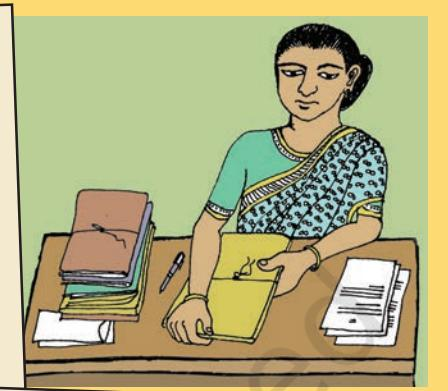

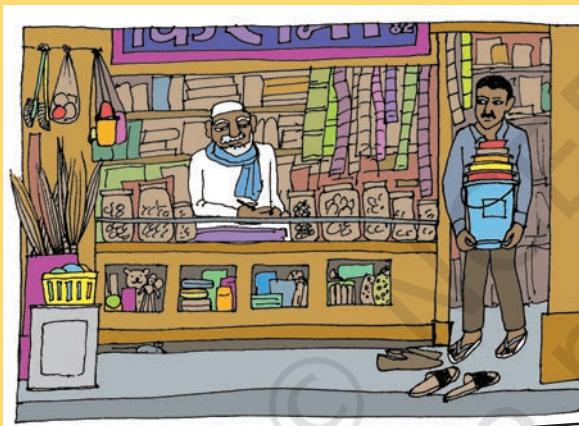

*Kamal is Kanta's neighbour. He is adaily wage labourer in a nearbygrocery shop. He goes to the shop at7:30 in the morning and works till 8:00 p.m. in the evening. He gets no other allowances apart from his wages. He is not paid for the days he does not work. He has therefore no leave or paid holidays. Nor was he given any formal letter saying that he has been employed in the shop. He can be asked to leave anytime by his employer.*

Kamal

*Do you see the differences in the conditions of work between Kanta and Kamal*?

Kanta works in the organised sector. Organised sector covers those enterprises or places of work where the terms of employment are regular and therefore, people have assured work. They are registered by the government and have to follow its rules and regulations which are given in various laws such as the Factories Act, Minimum Wages Act, Payment of Gratuity Act, Shops and Establishments Act etc. It is called organised because it has some formal processes and procedures. Some of these people may not be employed by anyone but may work on their own but they too have to register themselves with the government and follow the rules and regulations.

Workers in the organised sector enjoy security of employment. They are expected to work only a fixed number of hours. If they work more, they have to be paid overtime by the employer. They also get several other benefits from the employers. What are

30 UNDERSTANDING ECONOMIC DEVELOPMENT

these benefits? They get paid leave, payment during holidays, provident fund, gratuity etc. They are supposed to get medical benefits and, under the laws, the factory manager has to ensure facilities like drinking water and a safe working environment. When they retire, these workers get pensions as well.

In contrast, Kamal works in the unorganised sector. The unorganised sector is characterised by small and scattered units which are largely outside the control of the government. There are rules and regulations but these are not followed. Jobs here are low-paid and often not regular. There is no provision for overtime, paid leave, holidays, leave due to sickness etc. Employment is not secure. People can be asked to leave without any reason. When there is less work, such as during some seasons, some people may be asked to leave. A lot also depends on the whims of the employer. This sector includes a large number of people who are employed on their own doing small jobs such as selling on the street or doing repair work. Similarly, farmers work on their own and hire labourers as and when they require.

#### **LET'S WORK THESE OUT**

1. Look at the following examples. Which of these are unorganised sector activities?

- (i) A teacher taking classes in a school
- (ii) A headload worker carrying a bag of cement on his back in a market
- (iii) A farmer irrigating her field
- (iv) A doctor in a hospital treating a patient
- (v) A daily wage labourer working under a contractor
- (vi) A factory worker going to work in a big factory
- (vii) A handloom weaver working in her house
- 2. Talk to someone who has a regular job in the organised sector and another who works in the unorganised sector. Compare and contrast their working conditions in all aspects.
- 3. How would you distinguish between organised and unorganised sectors? Explain in your own words.
- 4. The table below shows the estimated number of workers in India in the organised and unorganised sectors. Read the table carefully. Fill in the missing data and answer the questions that follow.

| TABLE 2.3 |  | WORKERS IN DIFFERENT SECTORS (IN MILLIONS) |  |
| --- | --- | --- | --- |
| Sector | Organised | Unorganised | Total |
| Primary | 1 |  | 232 |
| Secondary | 41 | 74 | 115 |
| Tertiary | 40 | 88 | 128 |
| Total | 82 |  |  |
| Total in Percentage |  |  | 100% |

- **·** What is the percentage of people in the unorganised sector in agriculture?
- **·** Do you agree that agriculture is an unorganised sector activity? Why?
- **·** If we look at the country as a whole, we find that ———% of the workers in India are in the unorganised sector. Organised sector employment is available to only about ———% of the workers in India.

#### SECTORS OF THE INDIAN ECONOMY 31

#### How to Protect Workers in the Unorganised Sector?

The organised sector offers jobs that are the most sought-after. But the employment opportunities in the organised sector have been expanding very slowly. It is also common to find many organised sector enterprises in the unorganised sector. They adopt such strategies to evade taxes and refuse to follow laws that protect labourers. As a result, a large number of workers are forced to enter the unorganised sector jobs, which pay a very low salary. They are often exploited and not paid a fair wage. Their earnings are low and not regular. These jobs are not secure and have no other benefits.

Since the 1990s, it is also common to see a large number of workers losing their jobs in the organised sector. These workers are forced to take up jobs in the unorganised sector with low earnings. Hence, besides the need for more work, there is also a need for protection and support of the workers in the unorganised sector.

Who are these vulnerable people who need protection? In the rural areas, the unorganised sector mostly comprises of landless agricultural labourers, small and marginal farmers, sharecroppers and artisans (such as weavers, blacksmiths, carpenters and goldsmiths). Nearly 80 per cent of rural households in India are in small and marginal farmer category. These farmers need to be supported through adequate facility for timely delivery of seeds, agricultural inputs, credit, storage facilities and marketing outlets.

In the urban areas, unorganised sector comprises mainly of workers in small-scale industry, casual workers in construction, trade and transport etc., and those who work as street vendors, head load workers, garment makers, rag pickers etc. Small-scale industry also needs government's support for procuring raw material and marketing of output. The casual workers in both rural and urban areas need to be protected.

We also find that majority of workers from scheduled castes, tribes

> and backward communities find themselves in the unorganised sector. Besides getting the irregular and low paid work, these workers also face social discrimination. Protection and support to the unorganised sector workers is thus necessary for both economic and social development.

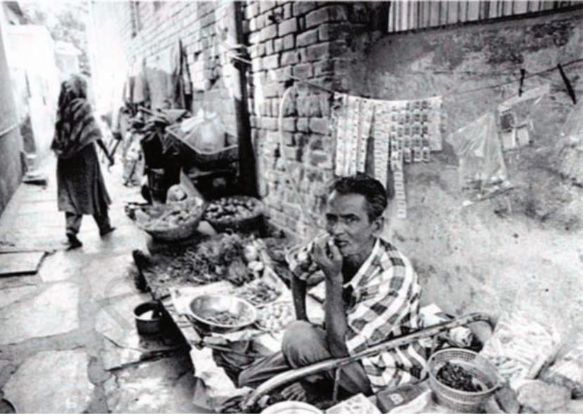

*When factories close down, many once regular workers are found selling goods or pushing a cart or doing some other odd job*

32 UNDERSTANDING ECONOMIC DEVELOPMENT

### **LET'S RECALL**

With so many activities taking place around us, one needs to use the process of classification to think in a useful manner. The criterion for classification could be many depending on what we desire to find out. The process of classification helps to analyse a situation.

In dividing the economic activities into three sectors — primary, secondary, tertiary — the criterion used was the 'nature of activity'. On the basis of this classification, we were able to analyse the pattern of total production and employment in India. Similarly, we divided the economic activities into organised and unorganised and used the classification to look at employment in the two sectors.

What was the most important conclusion that was derived from the classification exercises? What were the problems and solutions that were indicated? Can you summarise the information in the following table?

| Sector | Criteria used | Most important conclusion | Problems indicated and how they can be tackled |
| --- | --- | --- | --- |
| Primary, Secondary, Tertiary | Nature of activity |  |  |
| Organised, Unorganised |  |  |  |

### **TABLE 2.4 CLASSIFYING ECONOMIC ACTIVITIES**

#### SECTORS IN TERMS OF OWNERSHIP: PUBLIC AND PRIVATE SECTORS

Another way of classifying economic activities into sectors could be on the basis of who owns assets and is responsible for the delivery of services. In the public sector, the government owns most of the assets and provides all the services. In the private sector, ownership of assets and delivery of services is in the hands of private individuals or companies. Railways or post office is an example of the public sector whereas companies like Tata Iron and Steel Company Limited (TISCO) or Reliance Industries Limited (RIL) are privately owned.

Activities in the private sector are guided by the motive to earn profits. To get such services we have to pay money to these individuals and companies. The purpose of the public sector is not just to earn profits. Governments raise money through taxes and other ways to meet expenses on the services rendered by it. Modern day governments spend on a whole range of activities. What are these activities? Why do governments spend on such activities? Let's find out.

There are several things needed by the society as a whole but which the private sector will not provide at a reasonable cost. Why? Some of these need spending large sums of money, which is beyond the capacity

SECTORS OF THE INDIAN ECONOMY 33

of the private sector. Also, collecting money from thousands of people who use these facilities is not easy. Even if they do provide these things they would charge a high rate for their use. Examples are construction of roads, bridges, railways, harbours, generating electricity, providing irrigation through dams etc. Thus, governments have to undertake such heavy spending and ensure that these facilities are available for everyone.

There are some activities, which the government has to support. The private sector may not continue their production or business unless government encourages it. For example, selling electricity at the cost of generation may push up the costs of production of goods in many industries. Many units, especially small-scale units, might have to shut down. Government here steps in by producing and supplying electricity at rates which these industries can afford. Government has to bear part of the cost.

Similarly, the Government in India buys wheat and rice from farmers at a 'fair price'. This it stores in its godowns and sells at a lower price to consumers through ration shops. You have read about this in the chapter on Food Security in Class IX. The government has to bear some of the cost. In this way, the government supports both farmers and consumers.

There are a large number of activities which are the primary responsibility of the government. The government must spend on these. Providing health and education facilities for all is one example. We have discussed some of these issues in the first chapter. Running proper schools and providing quality education, particularly elementary education, is the duty of the government. India's size of illiterate population is one of the largest in the world.

Similarly, we know that nearly half of India's children are malnourished and a quarter of them are critically ill. We have read about Infant Mortality Rates. The infant mortality rate of Odisha (40) or Madhya Pradesh (48) is higher than some of the poorest regions of the world. Government also needs to pay attention to aspects of human development such as availability of safe drinking water, housing facilities for the poor and food and nutrition. It is also the duty of the government to take care of the poorest and most ignored regions of the country through increased spending in such areas.

#### SUMMING UP

In this chapter we have looked at ways of classifying economic activities into some meaningful groups. One way of doing this is to examine whether the activity relates to the primary, secondary or tertiary sectors. The data for India, for the last thirty years, shows that while goods and services produced in the tertiary sector contribute the most to GDP, the employment remains in the primary sector. We have also seen what all can be done for increasing employment opportunities in the country. Another classification is to consider whether people are working in organised or unorganised sectors. Most people are working in the unorganised sectors and protection is necessary for them. We also looked at the difference between private and public activities, and why it is important for public activities to focus on certain areas.

- 34 UNDERSTANDING ECONOMIC DEVELOPMENT
#### **EXERCISES**

- 1. Fill in the blanks using the correct option given in the bracket:
	- (i) Employment in the service sector _________ increased to the same extent as production. (has / has not)
	- (ii) Workers in the _________ sector do not produce goods. (tertiary / agricultural)
	- (iii) Most of the workers in the _________ sector enjoy job security. (organised / unorganised)
	- (iv) A _________ proportion of labourers in India are working in the unorganised sector. (large / small)
	- (v) Cotton is a _________ product and cloth is a _________ product. [natural /manufactured]
	- (vi) The activities in primary, secondary and tertiary sectors are_________ [independent / interdependent]
- 2. Choose the most appropriate answer.
	- (a) The sectors are classified into public and private sector on the basis of:
		- (i) employment conditions
		- (ii) the nature of economic activity
		- (iii) ownership of enterprises
		- (iv) number of workers employed in the enterprise
	- (b) Production of a commodity, mostly through the natural process, is an activity in _________ sector.
		- (i) primary
		- (ii) secondary
		- (iii) tertiary
		- (iv) information technology
	- (c) GDP is the total value of _________ produced during a particular year.
		- (i) all goods and services
		- (ii) all final goods and services
		- (iii) all intermediate goods and services
		- (iv) all intermediate and final goods and services
	- (d) In terms of GDP the share of tertiary sector in 2013-14 is between _________ per cent.
		- (i) 20 to 30
		- (ii) 30 to 40
		- (iii) 50 to 60
		- (iv) 60 to 70

#### SECTORS OF THE INDIAN ECONOMY 35

- 3. Match the following:
#### **Problems faced by farming sector Some possible measures**

- 
- 
- 
- 
- 1. Unirrigated land (a) Setting up agro-based mills
- 2. Low prices for crops (b) Cooperative marketing societies
- 3. Debt burden (c) Procurement of food grains by government
- 4. No job in the off season (d) Construction of canals by the government
- the local traders soon after harvest
- 4. Find the odd one out and say why.
	- (i) Tourist guide, dhobi, tailor, potter
	- (ii) Teacher, doctor, vegetable vendor, lawyer
	- (iii) Postman, cobbler, soldier, police constable
	- (iv) MTNL, Indian Railways, Air India, Jet Airways, All India Radio
- 5. A research scholar looked at the working people in the city of Surat and found the following.

| Place of work | Nature of employment | Percentage of working people |
| --- | --- | --- |
| In offices and factories registered | Organised | 15 |
| with the government |  |  |
| Own shops, office, clinics in |  | 15 |
| marketplaces with formal license |  |  |
| People working on the street, construction workers, domestic |  | 20 |
| workers |  |  |
| Working in small workshops |  |  |
| usually not registered with the |  |  |
| government |  |  |

Complete the table. What is the percentage of workers in the unorganised sector in this city?

- 6. Do you think the classification of economic activities into primary, secondary and tertiary is useful? Explain how.
- 7. For each of the sectors that we came across in this chapter why should one focus on employment and GDP? Could there be other issues which should be examined? Discuss.
- 8. Make a long list of all kinds of work that you find adults around you doing for a living. In what way can you classify them? Explain your choice.
- 9. How is the tertiary sector different from other sectors? Illustrate with a few examples.
- 10. What do you understand by disguised unemployment? Explain with an example each from the urban and rural areas.
- 11. Distinguish between open unemployment and disguised unemployment.
- 12. "Tertiary sector is not playing any significant role in the development of Indian economy." Do you agree? Give reasons in support of your answer.

|  | UNDERSTANDING ECONOMIC DEVELOPMENT |
| --- | --- |
| 36 36 | UNDERSTANDING ECONOMIC DEVELOPMENT |

- 
- 5. Compelled to sell their grains to (e) Banks to provide credit with low interest
- 13. Service sector in India employs two different kinds of people. Who are these?
- 14. Workers are exploited in the unorganised sector. Do you agree with this view? Give reasons in support of your answer.
- 15. How are the activities in the economy classified on the basis of employment conditions?
- 16. Compare the employment conditions prevailing in the organised and unorganised sectors.
- 17. Explain the objective of implementing the MG NREGA 2005.
- 18. Using examples from your area compare and contrast that activities and functions of private and public sectors.
- 19. Discuss and fill the following table giving one example each from your area.

|  | Well managed organisation | Badly managed organisation |
| --- | --- | --- |
| Public sector |  |  |
| Private Sector |  |  |

- 20. Give a few examples of public sector activities and explain why the government has taken them up.
- 21. Explain how public sector contributes to the economic development of a nation.
- 22. The workers in the unorganised sector need protection on the following issues : wages, safety and health. Explain with examples.
- 23. A study in Ahmedabad found that out of 15,00,000 workers in the city, 11,00,000 worked in the unorganised sector. The total income of the city in this year (1997-1998) was Rs 60,000 million. Out of this Rs 32,000 million was generated in the organised sector. Present this data as a table. What kind of ways should be thought of for generating more employment in the city?
- 24. The following table gives the GDP in Rupees (Crores) by the three sectors:

| Year | Primary | Secondary | Tertiary |
| --- | --- | --- | --- |
| 2000 | 52,000 | 48,500 | 1,33,500 |
| 2013 | 8,00,500 | 10,74,000 | 38,68,000 |

- (i) Calculate the share of the three sectors in GDP for 2000 and 2013.
- (ii) Show the data as a bar diagram similar to Graph 2 in the chapter.
- (iii) What conclusions can we draw from the bar graph?

