# NOTES FOR THE TEACHER

#### CHAPTER 3 : MONEY AND CREDIT

Money is a fascinating subject and full of curiosities. It is important to capture this element for the students. The history of money and how various forms were used at different times is an interesting story. At this stage the purpose is to allow students to realise the social situation in which these forms were used. Modern forms of money are linked to the banking system. This is the central idea of the first part of the chapter.

The present situation in India, where newer forms of money are slowly spreading with computerisation of the banking system, offers many opportunities to students to explore on their own. We need not get into a formal discussion of the 'functions of money' but let it come up as questions. There are certain areas that are not covered, such as 'creation of money' (money multiplier) or the backing of the modern system that may be discussed if you desire.

As you would see in the chapter, the stock of money consists of currency held by the public and the demand deposits that they hold with the banks. This is the money that people can use as they wish and the government has to ensure that the system works smoothy. What would happen when the government declares that some of the currency notes used by people would be made invalid and would be replaced by new currency? In India, during November 2016, currency notes in the denomination of Rs. 500 and Rs. 1,000 were declared invalid. People were asked to surrender these notes to the bank by a specific period and receive new Rs. 500, Rs. 2,000 or other currency notes. This is known as 'demonetisation'. Since then, people were also encouraged to use their bank deposits rather than cash for transactions. Hence, digital transactions started by using bank-to-bank transfer through the internet or mobile phones, cheques, ATM cards, credit cards, and Point of Sale (POS) swipe machines at shops. This is promoted to reduce the requirement of cash for transactions and also control corruption. Students could be asked to debate on the process and the impact of demonetisation. They can be guided to make a collage of the major areas where people use digital and cash transactions which are legitimate and legal. They can also discuss the transactions which are legal and why. It is also important to intimate students that different types of plastic cards are used in place of cash transactions but not all of them money *per se*.

Credit is a crucial element in economic life and it is, therefore, important to first understand this in a conceptual manner. What are the aspects that one looks at in any credit arrangement and how this affects people is the main focus of the second part of the chapter. The world around us offers a tremendous variety of such arrangements and it would be ideal to explain these aspects of credit from situations that are familiar to your students. The other crucial issue of credit is its availability to all, especially the poor, and on reasonable terms. We need to emphasise that this is a right of the people and without which a large section of them would be kept out of the development process. There are many innovative interventions, such as that of Grameen Bank, of which students may be made familiar with but it is important to realise that we don't have answers to all questions. We need to find new ways and this is one of the social challenges that developing countries face.

#### Sources for Information

The data on formal and informal sector credit used in this chapter is drawn from the survey on rural debt by the National Sample Survey Organisation *(All India Debt and Investment Survey, 70t h Round 2013,* conducted by NSSO) now known as National Statistical Office (NSO)*.* The information and data on Grameen Bank is taken from newspaper reports and websites. In order to get the details of bank-related statistics or a particular detail of a bank, you can log on to the websites of the Reserve Bank of India *(www.rbi.org)* and the concerned banks. Data on self-help groups is provided on the website of the National Bank for Agriculture and Rural Development (NABARD) *(www.nabard.org).*

- 38 UNDERSTANDING ECONOMIC DEVELOPMENT
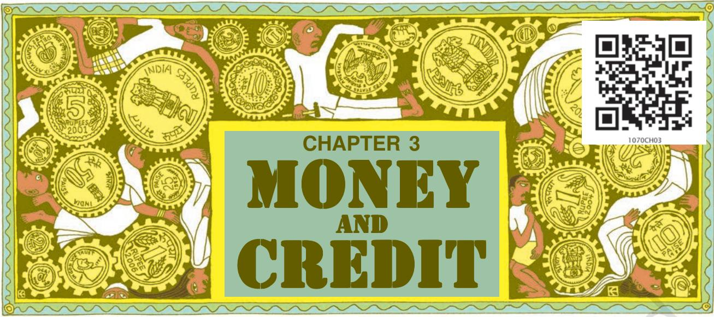

## MONEY AS A MEDIUM OF EXCHANGE

The use of money spans a very large part of our everyday life. Look around you and you would easily be able to identify several transactions involving money in any single day. Can you make a list of these? In many of these transactions, goods are being bought and sold with the use of money. In some of these transactions, services are being exchanged with money. For some, there might not be any actual transfer of money taking place now but a promise to pay money later.

Have you ever wondered why transactions are made in money? The reason is simple.

A person holding money can easily exchange it for any commodity or service that he or she might want. Thus everyone prefers to receive payments in money and then exchange the money for things that they want. Take the case of a shoe manufacturer. He wants to sell shoes in the market and buy wheat. The shoe manufacturer will first exchange shoes that he has produced for money, and then exchange the money for wheat. Imagine how much more difficult it would be if the shoe manufacturer had to directly exchange shoes for wheat without the use of money. He would have to look for a wheat growing farmer who not

I'LL GIVE YOU SHOES FOR YOUR WHEAT.

only wants to sell wheat but also wants to buy the shoes in exchange. That is, both parties

have to agree to sell and buy each others commodities.

This is known as double coincidence

of wants. What a person desires to sell is exactly what the

other wishes to buy. In a barter system where goods are directly exchanged without the use of money, double coincidence of wants is an essential feature.

In contrast, in an economy where money is in use, money by providing the crucial intermediate step eliminates the need for double coincidence of wants. It is no longer necessary for the shoe manufacturer to look for a farmer who will buy his shoes and at the same time sell him

I DON'T NEED SHOES. I NEED CLOTHES.

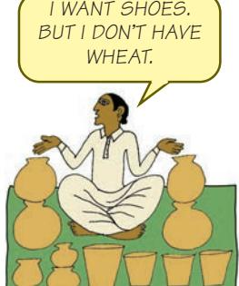

MONEY AND CREDIT 39

wheat. All he has to do is find a buyer for his shoes. Once he has exchanged his shoes for money, he can purchase wheat or any other commodity in the market. Since money acts as an intermediate in the exchange process, it is called a medium of exchange.

#### **LET'S WORK THESE OUT**

- 1. How does the use of money make it easier to exchange things?
- 2. Can you think of some examples of goods / services being exchanged or wages being paid through barter?

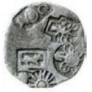

*Early punchmarked coins (may be 2500 years old)*

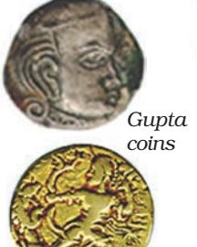

*Modern coin*

### MODERN FORMS OF MONEY

We have seen that money is something that can act as a medium of exchange in transactions. Before the introduction of coins, a variety of objects was used as money. For example, since the very early ages, Indians used grains and cattle as money. Thereafter came the use of metallic coins — gold, silver, copper coins — a phase which continued well into the last century.

#### Currency

Modern forms of money include currency — paper notes and coins. Unlike the things that were used as money earlier, modern currency is not made of precious metal such as gold, silver and copper. And unlike grain and cattle, they are neither of everyday use. The modern currency is without any use of its own.

Then, why is it accepted as a medium of exchange? It is accepted as a medium of exchange because the currency is authorised by the government of the country.

In India, the Reserve Bank of India issues currency notes on behalf of the central government. As per Indian law, no other individual or organisation is allowed to issue currency. Moreover, the law legalises the use of rupee as a medium of payment that cannot be refused in settling transactions in India. No individual in India can legally refuse a payment made in rupees. Hence, the rupee is widely accepted as a medium of exchange.

#### Deposits with Banks

The other form in which people hold money is as deposits with banks. At a point of time, people need only some currency for their day-to-day needs. For instance, workers who receive their salaries at the end of each month have extra cash at the beginning of the month. What do people do with this extra cash? They deposit it with the banks by opening a bank account in their name. Banks accept the deposits and also pay an amount as interest on the deposits. In this way people's money is safe with the banks and it earns an amount as interest. People also have the provision to withdraw the money as and when they require. Since the deposits in the bank accounts can be withdrawn on demand, these deposits are called demand deposits.

40 UNDERSTANDING ECONOMIC DEVELOPMENT

Demand deposits offer another interesting facility. It is this facility which lends it the essential characteristics of money (that of a medium of exchange). You would have heard of payments being

> LET US TRY AND UNDERSTAND HOW CHEQUE PAYMENTS ARE MADE AND REALISED WITH AN EXAMPLE.

made by cheques instead of cash. For payment through cheque, the payer who has an account with the bank, makes out a cheque for a specific amount. A cheque is a paper instructing the bank to pay a specific amount from the person's account to the person in whose name the cheque has been issued.

# Cheque Payments

*A shoe manufacturer, M. Salim has to make a payment to the leather supplier and writes a cheque for a specific amount. This means that the shoe manufacturer instructs his bank to pay this amount to the leather supplier. The leather supplier takes this cheque, and deposits it in his own account in the bank. The money is transferred from one bank account to another bank account in a couple of days. The transaction is complete without any payment of cash.*

| Account number |  |
| --- | --- |
| Bank branch | code |
| Coding used by banks | Cheque number |

Thus we see that demand deposits share the essential features of money. The facility of cheques against demand deposits makes it possible to directly settle payments without the use of cash. Since demand deposits are accepted widely as a means of payment, along with currency, they constitute money in the modern economy.

You must remember the role that the banks play here. But for the banks, there would be no demand deposits and no payments by cheques against these deposits. The modern forms of money — currency and deposits — are closely linked to the working of the modern banking system.

2024-25

MONEY AND CREDIT 41

# **LET'S WORK THESE OUT**

- 1. M. Salim wants to withdraw Rs 20,000 in cash for making payments. How would he write a cheque to withdraw money?
- 2. Tick the correct answer.
	- After the transaction between Salim and Prem,
		- (i) Salim's balance in his bank account increases, and Prem's balance increases.
	- (ii) Salim's balance in his bank account decreases and Prem's balance increases.
	- (iii) Salim's balance in his bank account increases and Prem's balance decreases.
- 3. Why are demand deposits considered as money?

#### LOAN ACTIVITIES OF BANKS

Let us take the story of banks further. What do the banks do with the deposits which they accept from the public? There is an interesting mechanism at work here. Banks keep only a small proportion of their deposits as cash with themselves. For example, banks in India these days hold about 15 per cent of their deposits as cash. This is kept as provision to pay the depositors who might come to withdraw money from the bank on any given day. Since, on any particular day, only some of its many depositors come to withdraw cash, the bank is able to manage with this cash.

Banks use the major portion of the deposits to extend loans. There is a huge demand for loans for various economic activities. We shall read more about this in the following sections. Banks make use of the deposits to meet the loan requirements of the people. In this way, banks mediate between those who have surplus funds (the depositors) and those who are in need of these funds (the borrowers). Banks charge a higher interest rate on loans than what they offer on deposits. The difference between what is charged from borrowers and what is paid to depositors is their main source of income.

> What do you think would happen if all the depositors went to ask for their money at the same time?

## 42 UNDERSTANDING ECONOMIC DEVELOPMENT

# TWO DIFFERENT CREDIT SITUATIONS

A large number of transactions in our day-to-day activities involve credit in some form or the other. Credit (loan) refers to an agreement in which the lender supplies the borrower with money, goods or services in return for the promise of future payment. Let us see how credit works through the following two examples.

# (1) Festival Season

*It is festival season two months from now and the shoe manufacturer, Salim, has received an order from a large trader in town for 3,000 pairs of shoes to be delivered in a month time. To complete production on time, Salim has to hire a few more workers for stitching and pasting work. He has to purchase the raw materials. To meet these expenses, Salim obtains loans from two sources. First, he asks the leather supplier to supply leather* *now and promises to pay him later. Second, he obtains loan in cash from the large trader as advance payment for 1000 pairs of shoes with a promise to deliver the whole order by the end of the month.*

*At the end of the month, Salim is able to deliver the order, make a good profit, and repay the money that he had borrowed.*

In this case, Salim obtains credit to meet the working capital needs of production. The credit helps him to meet the ongoing expenses of production, complete production on time, and thereby increase his earnings. Credit therefore plays a vital and positive role in this situation.

# (2) Swapna's Problem

*Swapna, a small farmer, grows groundnut on her three acres of land. She takes a loan from the moneylender to meet the expenses of cultivation, hoping that her harvest would help repay the loan. Midway through the season the crop is hit by pests and the crop fails. Though Swapna sprays her crops with expensive pesticides, it makes little difference. She is unable to repay the moneylender and the debt grows over the year into a large amount. Next year, Swapna takes a fresh loan for cultivation. It is a normal crop this year. But the earnings are not enough to cover the old loan. She is caught in debt. She has to sell a part of the land to pay off the debt.*

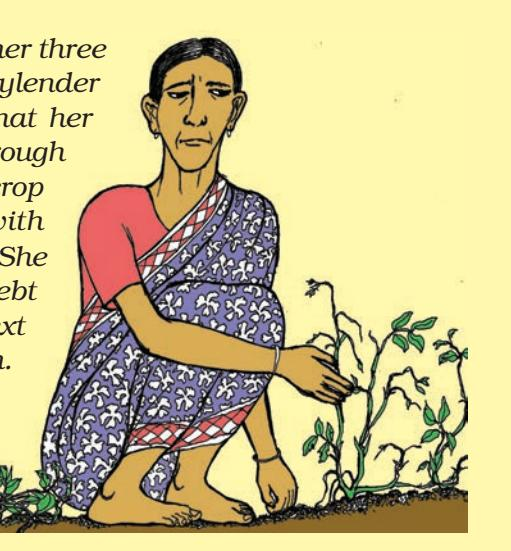

In rural areas, the main demand for credit is for crop production. Crop production involves considerable costs on seeds, fertilisers, pesticides, water, electricity, repair of equipment, etc. There is a minimum stretch of three to four months between the time when the farmers buy these inputs and when they sell the crop. Farmers usually take crop loans at the beginning of the season and repay the loan after harvest. Repayment of the loan is crucially dependent on the income from farming.

In Swapna's case, the failure of the crop made loan repayment impossible. She had to sell part of the land to repay the loan. Credit, instead of helping Swapna improve her earnings, left her worse off. This is an example of what is commonly called debt-trap. Credit in this case pushes the borrower into a situation from which recovery is very painful.

In one situation credit helps to increase earnings and therefore the person is better off than before. In another situation, because of the

#### **LET'S WORK THESE OUT**

- 1. Fill the following table.

|  | Salim | Swapna |
| --- | --- | --- |
| Why did they need credit? |  |  |
| What was the risk? |  |  |
| What was the outcome? |  |  |

crop failure, credit pushes the person into a debt trap. To repay her loan she has to sell a portion of her land. She is clearly much worse off than before. Whether credit would be useful or not, therefore, depends on the risks in the situation and whether there is some support, in case of loss.

- 2. Supposing Salim continues to get orders from traders. What would be his position after 6 years?
- 3. What are the reasons that make Swapna's situation so risky? Discuss factors – pesticides; role of moneylenders; climate.

## TERMS OF CREDIT

Every loan agreement specifies an interest rate which the borrower must pay to the lender along with the

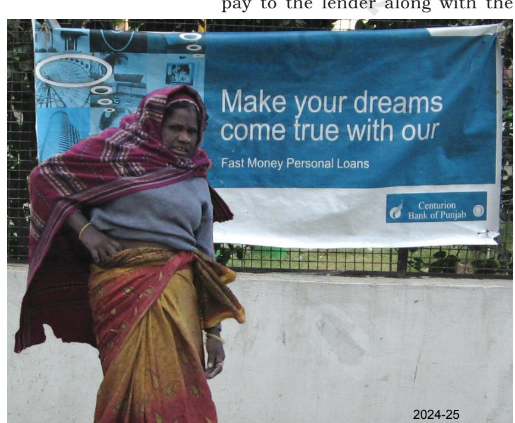

repayment of the principal. In addition, lenders may demand collateral (security) against loans. Collateral is an asset that the borrower owns (such as land, building, vehicle, livestocks, deposits with banks) and uses this as a guarantee to a lender until the loan is repaid. If the borrower fails to repay the loan, the lender has the right to sell the asset or collateral to obtain payment. Property such as land titles, deposits with banks, livestock are some common examples of collateral used for borrowing.

# A House Loan

*Megha has taken a loan of Rs 5 lakhs from the bank to purchase a house. The annual interest rate on the loan is 12 per cent and the loan is to be repaid in 10 years in monthly instalments. Megha had to submit to the bank, documents showing her employment records and salary before the bank agreed to give her the loan. The bank retained as collateral the papers of the new house, which will be returned to Megha only when she repays the entire loan with interest.*

| Fill the following details of Megha's housing loan. |
| --- |

| Loan amount (in Rupees) |
| --- |
| Duration of loan |
| Documents required |
| Interest rate |
| Mode of repayment |
| Collateral |

Interest rate, collateral and documentation requirement, and the mode of repayment together comprise what is called the terms of credit. The terms of credit vary substantially from one credit arrangement to another. They may vary depending on the nature of the lender and the borrower. The next section will provide examples of the varying terms of credit in different credit arrangements.

#### **LET'S WORK THESE OUT**

- 1. Why do lenders ask for collateral while lending?
- 2. Given that a large number of people in our country are poor, does it in any way affect their capacity to borrow?
- 3. Fill in the blanks choosing the correct option from the brackets.

While taking a loan, borrowers look for easy terms of credit. This means __________ (low/high) interest rate, ______________(easy/ tough) conditions for repayment, ___________(less/more) collateral and documentation requirements.

# MONEY AND CREDIT 45

# Variety of Credit Arrangements

Example of a Village

*Rohit and Ranjan had finished reading about the terms of credit in class. They were eager to know the various credit arrangements that existed in their area: who were the people who provided credit? Who were the borrowers? What were the terms of credit? They decided to talk to some people in their village. Read what they record...*

15th Nov, 2019.

We head directly for the fields where most farmers and 

labourers would be working at this time of the day. The fieldsare planted with potato crops. We first meet Shyamal, a smallfarmer in Sonpur, a small irrigated village.

> Shyamal tells us that every season he needs loans for cultivation on his 1.5 acres of land. Till a few years back, he would borrow money from the village moneylender at an interest rate of five per cent per month (60% per annum). For the last few years, Shyamal has been borrowing from an agricultural trader in the village at an interest rate of three per cent per month. At the beginning of the cropping season, the trader supplies the farm inputs on credit, which is to be repaid when the crops are ready for harvest.

> Besides the interest charge on the loan, the trader also makes the farmers promise to sell the crop to him. This way the trader can ensure that the money is repaid promptly. Also, since the crop prices are low after the harvest, the trader is able to make a profit from buying the crop at a low price from the farmers and then selling it later when the price has risen.

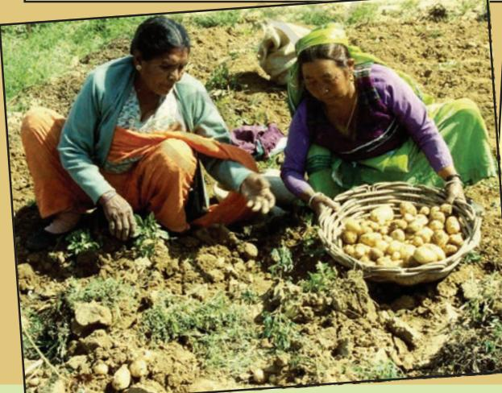

We next meet Arun who is supervising the work of one farm labourer. Arun has seven acres of land. He is one of the few persons in Sonpur to receive bank loan for cultivation. The interest rate on the loan is 8.5 per cent per annum, and can be repaid anytime in the next three years. Arun plans to repay the loan after harvest by selling a part of the crop. He then intends to store the rest of the potatoes in a cold storage and apply for a fresh loan from the bank against the cold storage receipt. The bank offers this facility to farmers who have taken crop loan from them.

Rama is working in a neighbouring field. Sheworks as an agricultur several months in the year when Rama has al labourer. There are no work, and needs credit to meet the daily expenses. Expenses on sudden illnesses or functions in the family are also met through loans. Rama has to depend on her employer a medium landowner in Sonpur , , for credit. The landowner charges an interest rate of 5 per cent per month. Rama repays the money by working for the landowner. Most of the time, Rama has to take a fresh loan, before the previous loan has been repaid. At present, she owes the landowner Rs 5,000. Though the landowner doesn't treat her well, she continues to work for him since she can get loans from him when in need. Rama tells us that the only source of credit for the landless people in Sonpur are the landowner-employers.

# Loans from Cooperatives

*Besides banks, the other major source of cheap credit in rural areas are the cooperative societies (or cooperatives). Members of a cooperative pool their resources for cooperation in certain areas. There are several types of cooperatives possible such as farmers cooperatives, weavers cooperatives, industrial workers cooperatives, etc. Krishak Cooperative functions in a village not very far away from Sonpur. It has 2300 farmers as members. It accepts deposits from its members. With these deposits as collateral, the Cooperative has obtained a large loan from the bank. These funds are used to provide loans to members. Once these loans are repaid, another round of lending can take place.*

*Krishak Cooperative provides loans for the purchase of agricultural implements, loans for cultivation and agricultural trade, fishery loans, loans for construction of houses and for a variety of other expenses.*

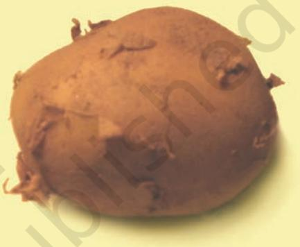

# **LET'S WORK THESE OUT**

- 1. List the various sources of credit in Sonpur.
- 2. Underline the various uses of credit in Sonpur in the above passages.
- 3. Compare the terms of credit for the small farmer, the medium farmer and the landless agricultural worker in Sonpur.
- 4. Why will Arun have a higher income from cultivation compared to Shyamal?
- 5. Can everyone in Sonpur get credit at a cheap rate? Who are the people who can?
- 6. Tick the correct answer.
	- (i) Over the years, Rama's debt
		- **·** will rise.
		- **·** will remain constant.
		- **·** will decline.

(ii) Arun is one of the few people in Sonpur to take a bank loan because

- **·** other people in the village prefer to borrow from the moneylenders.
	- **·** banks demand collateral which everyone cannot provide.
	- **·** interest rate on bank loans is same as the interest rate charged by the traders.
- 7. Talk to some people to find out the credit arrangements that exist in your area. Record your conversation. Note the differences in the terms of credit across people.

MONEY AND CREDIT 47

# **FORMAL SECTOR CREDIT IN INDIA**

We have seen in the above examples that people obtain loans from various sources. The various types of loans can be conveniently grouped as formal sector loans and informal sector loans. Among the former are loans from banks and cooperatives. The informal lenders include moneylenders, traders, employers, relatives and friends, etc. In Graph 1 you can see the various sources of credit to rural

households in India. Is more credit coming from the formal sector or the informal sector?

The Reserve Bank of India supervises the functioning of formal sources of loans. For instance, we have seen that the banks maintain a minimum cash balance out of the deposits they receive. The RBI monitors the banks in actually maintaining cash balance. Similarly,

> *BUT WHY SHOULD A BANK WANT US TO*

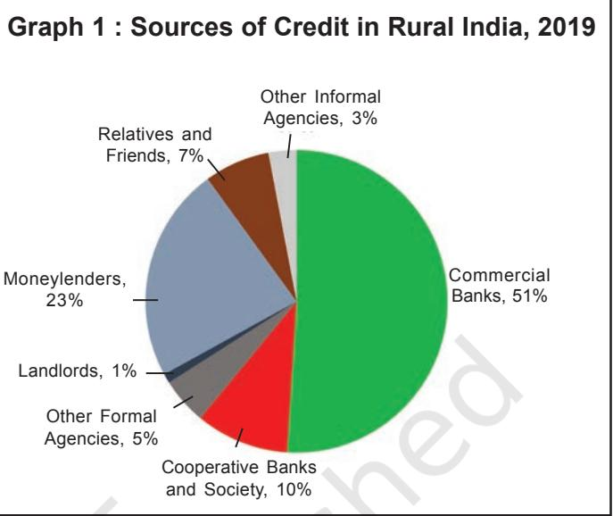

the RBI sees that the banks give loans not just to profit-making businesses and traders but also to small cultivators, small scale industries, to small borrowers etc. Periodically, banks have to submit information to the RBI on how much they are lending, to whom, at what interest rate, etc.

There is no organisation which supervises the credit activities of lenders in the informal sector. They can lend at whatever interest rate they

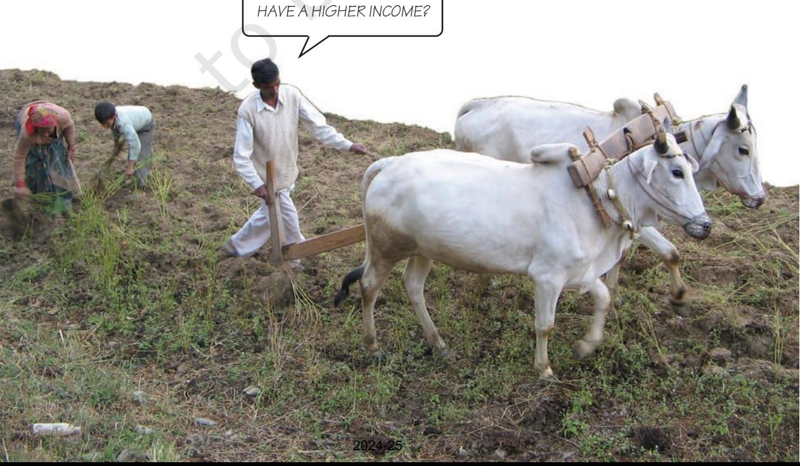

choose. There is no one to stop them from using unfair means to get their money back.

Compared to the formal lenders, most of the informal lenders charge a much higher interest on loans. Thus, the cost to the borrower of informal loans is much higher.

Higher cost of borrowing means a larger part of the earnings of the borrowers is used to repay the loan. Hence, borrowers have less income left for themselves (as we saw for Shyamal in Sonpur). In certain cases, the high interest rate for borrowing can mean that the amount to be repaid is greater than the income of the borrower. This could lead to increasing debt (as we saw for Rama in Sonpur) and debt trap. Also, people who might wish to start an enterprise by borrowing may not do so because of the high cost of borrowing.

For these reasons, banks and cooperative societies need to lend more. This would lead to higher incomes and many people could then borrow cheaply for a variety of needs. They could grow crops, do business, set up small-scale industries etc. They could set up new industries or trade in goods. Cheap and affordable credit is crucial for the country's development.

#### **Formal and Informal Credit: Who gets what?**

Graph 2 shows the importance of formal and informal sources of credit for people in urban areas. The people are divided into four groups, from poor to rich, as shown in the figure. You can see that 84 per cent of the loans taken by poor households in the urban areas are from informal sources. Compare this with the rich urban households. What do you find? Only 17 per cent of their loans are from informal sources, while 83 per cent are from formal sources. A similar pattern is also found in rural areas. The rich households are availing cheap credit from formal lenders whereas the poor households have to pay a large amount for borrowing.

What does all this suggest? First, the formal sector still meets only about half of the total credit needs of the rural people. The remaining credit needs are met from informal sources.

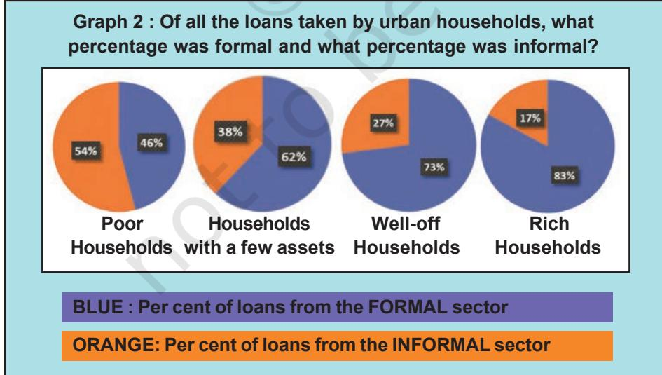

Most loans from informal lenders carry a very high interest rate and do little to increase the income of the borrowers. Thus, it is necessary that banks and cooperatives increase their lending particularly in the rural areas, so that the dependence on informal sources of credit reduces.

Secondly, while formal sector loans need to expand, it is also necessary that everyone receives these loans. At present, it is the richer households who receive formal credit whereas the poor have to depend on the informal sources. It is important that the formal credit is distributed more equally so that the poor can benefit from the cheaper loans.

#### **LET'S WORK THESE OUT**

- 1. What are the differences between formal and informal sources of credit?
- 2. Why should credit at reasonable rates be available for all?
- 3. Should there be a supervisor, such as the Reserve Bank of India, that looks into the loan activities of informal lenders? Why would its task be quite difficult?
- 4. Why do you think that the share of formal sector credit is higher for the richer households compared to the poorer households?

*A worker stitching a quilt*

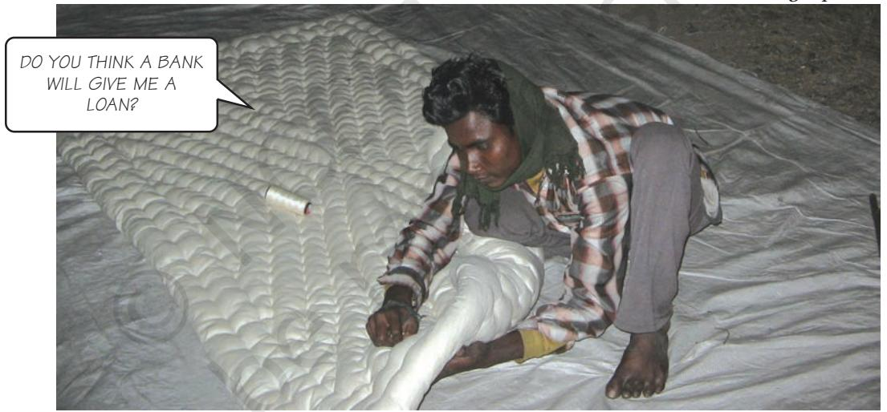

# SELF-HELP GROUPS FOR THE POOR

In the previous section we have seen that poor households are still dependent on informal sources of credit. Why is it so? Banks are not present everywhere in rural India. Even when they are present, getting a loan from a bank is much more difficult than taking a loan from informal sources. As we saw for Megha, bank loans require proper documents and collateral. Absence of collateral is one of the major reasons which prevents the poor from getting bank loans. Informal lenders such as moneylenders, on the other hand, know the borrowers personally and hence are often willing to give a loan without collateral. The borrowers can, if necessary, approach the moneylenders even without repaying

### 50 UNDERSTANDING ECONOMIC DEVELOPMENT

their earlier loans. However, the moneylenders charge very high rates of interest, keep no records of the transactions and harass the poor borrowers.

In recent years, people have tried out some newer ways of providing loans to the poor. The idea is to organise rural poor, in particular women, into small Self Help Groups (SHGs) and pool (collect) their savings. A typical SHG has 15-20 members, usually belonging to one neighbourhood, who meet and save regularly. Saving per member varies from Rs 25 to Rs 100 or more, depending on the ability of the people to save. Members can take small loans from the group itself to meet their needs. The group charges interest on these loans but this is still less than what the moneylender charges. After a year or two, if the group is regular in savings, it becomes eligible for

availing loan from the bank. Loan is sanctioned in the name of the group and is meant to create selfemployment opportunities for the members. For instance, small loans are provided to the members for releasing mortgaged land, for meeting working capital needs (e.g. buying seeds, fertilisers, raw materials like bamboo and cloth), for housing materials, for acquiring assets like sewing machine, handlooms, cattle, etc.

Most of the important decisions regarding the savings and loan activities are taken by the group members. The group decides as regards the loans to be granted — the purpose, amount, interest to be charged, repayment schedule etc. Also, it is the group which is responsible for the repayment of the loan. Any case of nonrepayment of loan by any one member is followed up seriously by other members in the group. Because of this feature, banks are willing to lend to the poor women when organised in SHGs, even though they have no collateral as such.

Thus, the SHGs help borrowers overcome the problem of lack of collateral. They can get timely loans for a variety of purposes and at a reasonable interest rate. Moreover, SHGs are the building blocks of organisation of the rural poor. Not only does it help women to become financially self-reliant, the regular meetings of the group provide a platform to discuss and act on a variety of social issues such as health, nutrition, domestic violence, etc.

> *A women's self-help group meeting in Gujarat*

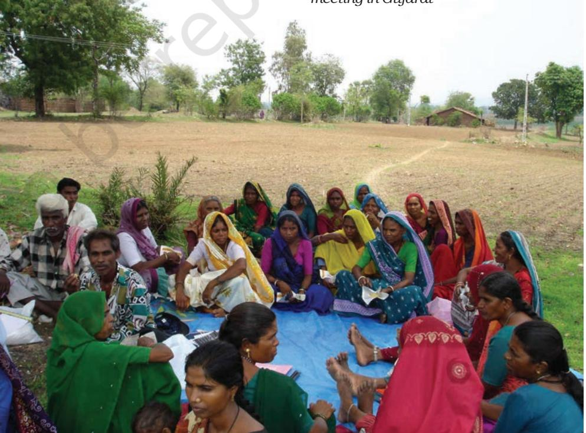

MONEY AND CREDIT 51

# Grameen Bank of Bangladesh

*Grameen Bank of Bangladesh is one of the biggest success stories in reaching the poor to meet their credit needs at reasonable rates. Started in the 1970s as a small project, Grameen Bank in 2018 had over 9 million members in about 81,600 villages spread across Bangladesh. Almost all of the borrowers are women and belong to poorest sections of the society. These borrowers have proved that not only are poor women reliable borrowers, but that they can start and run a variety of small income-generating activities successfully.*

"If credit can be made available to the poor people on terms and conditions that are appropriate and reasonable these millions of small people with their millions of small pursuits can add up to create the biggest development wonder."

> *Professor Muhammad Yunus, the founder of Grameen Bank, and recipient of 2006 Nobel Prize for Peace*

# SUMMING UP

In this chapter we have looked at the modern forms of money and how they are linked with the banking system. On one side are the depositors who keep their money in the banks and on the other side are the borrowers who take loans from these banks. Economic activities require loans or credit. Credit, as we saw can have a positive impact, or in certain situations make the borrower worse off.

Credit is available from a variety of sources. These can be either formal sources or informal sources. Terms of credit vary substantially between formal and informal lenders. At present, it is the richer households who receive credit from formal sources whereas the poor have to depend on the informal sources. It is essential that the total formal sector credit increases so that the dependence on the more expensive informal credit becomes less. Also, the poor should get a much greater share of formal loans from banks, cooperative societies etc. Both these steps are important for development.

### **EXERCISES**

- 1. In situations with high risks, credit might create further problems for the borrower. Explain.
- 2. How does money solve the problem of double coincidence of wants? Explain with an example of your own.
- 3. How do banks mediate between those who have surplus money and those who need money?
- 4. Look at a 10 rupee note. What is written on top? Can you explain this statement?
- 5. Why do we need to expand formal sources of credit in India?
- 6. What is the basic idea behind the SHGs for the poor? Explain in your own words.
- 7. What are the reasons why the banks might not be willing to lend to certain borrowers?

- 52 UNDERSTANDING ECONOMIC DEVELOPMENT
- 8. In what ways does the Reserve Bank of India supervise the functioning of banks? Why is this necessary?
- 9. Analyse the role of credit for development.
- 10. Manav needs a loan to set up a small business. On what basis will Manav decide whether to borrow from the bank or the moneylender? Discuss.
- 11. In India, about 80 per cent of farmers are small farmers, who need credit for cultivation.
	- (a) Why might banks be unwilling to lend to small farmers?
	- (b) What are the other sources from which the small farmers can borrow?
	- (c) Explain with an example how the terms of credit can be unfavourable for the small farmer.
	- (d) Suggest some ways by which small farmers can get cheap credit.

#### 12. Fill in the blanks:

- (i) Majority of the credit needs of the _________________households are met from informal sources.
- (ii) ___________________costs of borrowing increase the debt-burden.
- (iii) __________________ issues currency notes on behalf of the Central Government.
- (iv) Banks charge a higher interest rate on loans than what they offer on
- (v) _______________ is an asset that the borrower owns and uses as a guarantee until the loan is repaid to the lender.
- 13. Choose the most appropriate answer.
	- (i) In a SHG most of the decisions regarding savings and loan activities are taken by
		- (a) Bank.
		- (b) Members.

__________.

- (c) Non-government organisation.
- (ii) Formal sources of credit does not include
	- (a) Banks.
	- (b) Cooperatives.
	- (c) Employers.

# ADDITIONAL PROJECT / ACTIVITY

The following table shows people in a variety of occupations in urban areas. What are the purposes for which the following people might need loans? Fill in the column.

| Occupations | Reason for needing a Loan |
| --- | --- |
| Construction worker |  |
| Graduate student who is computer literate |  |
| A person employed in government service |  |
| Migrant labourer in Delhi |  |
| Household maid |  |
| Small trader |  |
| Autorickshaw driver |  |
| A worker whose factory has closed down |  |

Next, classify the people into two groups based on whom you think might get a bank loan and those who might not. What is the criterion that you have used for classification?

